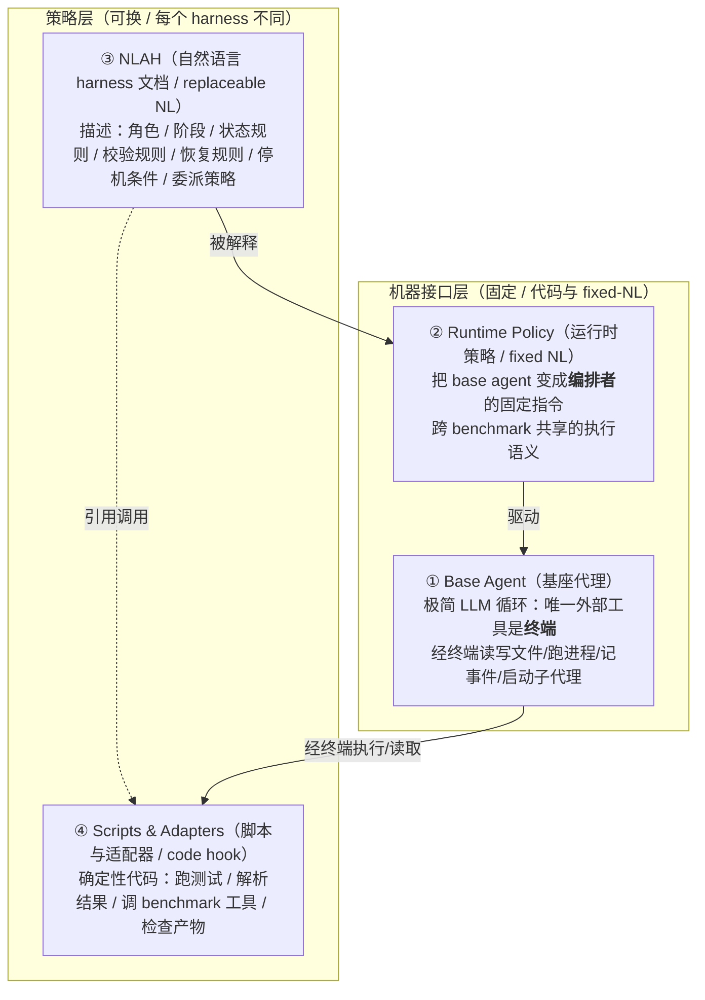

# 自然语言 Agent Harness：把脚手架从"代码胶水"变成"可检视的科学对象"

> **本篇定位**：A 组（框架与定义）。它和标杆范文 Harness-Bench（2605.27922）是一对：Harness-Bench 把 harness
> 当成**被测变量**去量（"换 harness 分数摆 23.8 分"），本篇则更上游——主张 harness 这层逻辑应当被**外化成一份
> 可读可改的文档**，从而第一次能问"哪一**条**策略起了作用、起了**多少**作用"。两篇合起来构成本库的中心论证闭环：
> harness 既值得度量（Harness-Bench），也应该被表示成科学对象（本篇）。

---

## §1　TL;DR（一页讲清这篇在干嘛）

> 主讲提示：开场先点中心命题——`Agent = Model + Harness`——再说这篇动的是等号右边那个"Harness"的**表示形式**。不是造更强的 agent，是把脚手架"打开盖子"。

**一句话**：现在的 agent harness（模型外面那层"把会推理变成会干活"的执行系统）通常**和控制器代码焊死在一起**——提示、工具适配、解析规则、校验脚本、产物路径、重试逻辑、上下文策略、benchmark 假设全揉在一个 controller bundle 里（§1 原文）。后果是 harness "难检视、难移植、难比较、难消融"，哪怕 harness 模式本身往往才是系统里**可复用**的那部分。本文提出 **NLAH（Natural-Language Agent Harness）**：把 run 级的 harness **策略**写成一份**可编辑的自然语言文档**；再配一个 **IHR（Intelligent Harness Runtime）**——一个共享的"在环运行时"，把这份文档**解释成** agent 调用、子代理交接（handoff）、状态更新、校验闸门（validation gate）、产物契约（artifact contract）（Abstract + §1）。

- **属于 harness 的哪一层（Θ1）**：本篇是**跨层的框架性工作**，但重心落在 **L（控制循环）**——它重写的是"谁来编排、何时交接、何时校验、何时停"的循环策略，并把 **C（上下文/状态）、T（工具）、V（验证）、O（可观测）** 的策略也一并外化为可读文本。用论文自己的六分类（Table 8）说，它一次性覆盖了 agent loop / tool / context / filesystem / memory / validation / safety / runtime defaults / observability / retry / budget 这"11 个 harness 工程面向"的**策略表述层**。
- **回扣全库论点（Θ2）**：本篇是 `Agent = Model + Harness` 的**"表示侧"贡献**——Harness-Bench 证明"换 harness 分数会大幅摆动"，本篇接着问"那能不能把这个会摆动的东西**写下来、读懂、逐条改**？"它给出的答案是：能，而且写成自然语言后**几乎不掉分**（编码 +6 分、computer-use 基本打平、终端 -3.4 分，Table 1），却把策略从 60.1k token 压到 2.9k token（Table 2）。
- **够新够权威（Θ4）**：2026-05 预印本（cs.CL），是**首批把 harness 当成"可编辑表示对象"**来研究的工作之一；致谢里出现 Ronak Malde、Thomas Wolf（HuggingFace 联创）的 follow-up 讨论，作者群来自清华 SIGS。它的"权威性"不在顶会标签（预印本），而在**踩中了 2026 年最热的工程实践**——AGENTS.md / CLAUDE.md / SKILL.md 这类"自然语言操作知识载体"正在爆发（§1、§6、Table References），本文是第一个把这股潮流从"局部指令"上推到"**run 级 harness 策略**"的学术化尝试。

> **读出什么**：如果说 Harness-Bench 给领域配了把"游标卡尺"，本篇是给领域换了种"材料"——把不透明的金属（代码 harness）换成透明的玻璃（NL harness），度量精度略降、但**内部结构第一次肉眼可见**。这正是它作为 A 组（定义/框架）的价值。

---

## §2　问题与动机：harness 为什么"难当研究对象"

> 主讲提示：这页用 Why 三连的"问题层"。核心是一句话——**代码 harness 把"策略"和"机制"焊死了**，于是没法单独研究策略。

**Why（问题层）——不解决会卡住什么？**
现代 LM agent 已经是**多步执行系统**：用工具、保状态、从失败恢复、校验中间结果、有时还把活委派给别的 agent（§1 原文，引 ReAct/Reflexion/Magentic 等）。这些行为由一个**外部 harness** 组织，而"harness 对实测表现有很大影响"（§1，引 LangChain "the anatomy of an agent harness"）。但问题在于（§1 第三段原文）：

> "A code harness may mix prompts, tool adapters, parser rules, validation scripts, artifact paths, retry logic, context policy, and benchmark-specific assumptions in one controller bundle."

把这八样东西塞进一个 bundle，带来三个直接恶果（§1）：
1. **难检视/难移植**：一个"看似很小"的 harness 改动，可能悄悄改掉调用边界、工具中介、状态载体、停机语义——你不读完整段控制器代码根本不知道动了什么。
2. **难比较**：两个系统只能"整体对整体"比，没法把"它们内部的策略选择"摘出来并排看。
3. **难消融**：你想问"去掉这个 verifier 模块会怎样"，但模块和其余 harness 缠在一起，一拔就连带改了别的——**模块边界不干净，消融就不干净**。

> **读出什么**：动机不是"agent 不够强"，而是"harness 这层**没有被表示成可研究的对象**"。论文 Appendix A 把这句话点透——"NLAHs change the unit of analysis（NLAH 改变了分析的单元）"：从"比较整个系统"变成"逐模块比较系统内部的策略选择"。这是一个**方法论**贡献，而非性能贡献。

---

## §3　核心概念分层：Model / Agent / Harness 的形式化

> 主讲提示：这页把三个词的边界钉死。论文给了两个极简公式，务必先讲直觉再给符号——这是后面所有论证的地基。

论文 §2（Preliminaries）用两步把概念垒起来。

**(1) 什么是 model**。直觉：model 就是"给上下文、吐输出"的一个可调用学习函数，上下文可以含文本/图像/视频。

符号（先定义后用）：
- $c$ = 输入上下文（context，可含 text/image/video）；
- $\mathrm{LM}_m$ = 第 $m$ 个学习到的模型（callable learned function）；
- $y$ = 模型输出。

$$y = \mathrm{LM}_m(c)$$

> **读出什么**：model 是**无状态、无外部动作**的一次性映射。它"会推理"，但不"会干活"。

**(2) 什么是 agent / 什么是 harness**。直觉：agent = 把一次或多次 model 调用**包进外部交互**的系统——它收任务、维护执行状态、看工具/环境反馈、再决定"继续动 / 要信息 / 校验进度 / 停"。论文给了一个很关键的退化关系（§2 原文）：

> "A single model call is a degenerate special case of an agent call, where the agent is allowed to call the model only once for a one-shot answer and performs no external action."

即：**单次 model 调用 = agent 调用的退化特例**。因此本文把"harness 执行的原子单位"定义为一次 **agent call**（§2、§3.1、Appendix E.2 反复强调）。而 **harness** 的定义（§2 原文）是：

> "A harness is the external execution system around a model in an agent. It turns a base model into an agent that can act on real tasks by deciding what the model sees, what tools it may call, where state is stored, how observations are returned, when validation runs, how failures are recovered, when execution may stop, and how one or more model or agent calls are organized."

> **读出什么（Θ2 地基）**：这段定义本身就是全库口号 `Agent = Model + Harness` 的**逐条展开**——harness 决定"模型看到什么 / 能调什么工具 / 状态存哪 / 怎么返回观察 / 何时校验 / 怎么恢复 / 何时停 / 怎么编排"。把这八件事从代码里抽成文本，就是本文要干的全部事。

---

## §4　三种控制方式：一条从"硬代码"到"无外部控制"的光谱

> 主讲提示：用 Figure 1 这张光谱图开讲。它是全文的"地图"，把本文的设计点（NLAH+IHR）放在中间。

论文 Figure 1 把"如何控制一次 agent run"画成一条光谱：

| 位置 | 名称 | 控制强度 | 谁在控制 |
|---|---|---|---|
| 左端 | **Code Harness（代码 harness）** | 硬控制（hard code control） | 控制器代码用程序逻辑强行规定 `while not done: obs→prompt→act→step→log` |
| **中间** | **NLAH + IHR（本文）** | **软的、自然语言引导的控制** | 一份 NL 策略文档 + 一个共享运行时解释它，通过子代理调用落地 |
| 右端 | **Self-Harnessing（自我脚手架）** | 无外部控制（no external control） | 一个控制器 model 直接 harness 别的 model，没有外部 harness（论文称之为"可能的未来设计"） |

**Why（设计层）——为什么落在"中间"，而不是左端或右端？**
- **朴素替代 A：留在左端（纯代码 harness）**。→ 控制最硬最确定，但"策略和实现细节交织"（§4.2 原文），于是不可检视、不可消融（正是 §2 的病）。
- **朴素替代 B：跳到右端（self-harnessing）**。→ 完全靠一个 controller model 自由编排，没有共享运行时语义，行为不可复现、不可审计（论文只把它列为"future design"，不做)。
- **本文选中间**：把**策略**交给自然语言（可读可改），把**精确机制**（工具执行、解析、沙箱、日志）留给代码（§3 原文 "natural language carries the harness policy, while code and the runtime carry exact mechanisms"）。这条"策略/机制分离"是全篇**唯一最重要的设计选择**（§3.1 原文 "This separation is the main design choice"）。

> **读出什么（Θ5 预埋）**：注意作者把自己的方案**克制地**放在"软控制"——他们不主张"自然语言能取代控制器代码"（Appendix A 原文反复澄清 "narrower and more defensible than saying that natural language should replace controller code"）。这是判断力，不是口号。

---

## §5　NLAH+IHR 四层架构：base agent / runtime policy / NLAH / scripts

> 主讲提示：这页是"系统解剖图"（Figure 2）。四层，从下到上讲。记住一句话：**下两层是"机器接口（固定）"，上两层是"策略（可换）"**。

论文 §3.1 把一个 NLAH+IHR 系统拆成**四层**（自下而上）：

逐层（§3.1 + Appendix E.1）：
- **① Base Agent（基座代理）**：一个"code-form 的极简可执行底座"——只是一个 LLM 循环，**唯一暴露给模型的外部工具是终端**。通过终端，它能读写文件、跑进程、记录事件、**按需启动子代理**（启动子代理不需要单独的专用工具：base agent 用终端起一个"自己的新实例"，把一个 child task packet 传给它）。
- **② Runtime Policy（运行时策略）**：一段**固定 NL 指令**，把 base agent 变成"由运行时章程引导的编排者"。IHR "intentionally thin（刻意做薄）"——它不是为某个 benchmark 定制的大控制器，而是给所有 NLAH 提供**共享执行语义**（§3.1 原文）。
- **③ NLAH**：**这是各 harness 之间唯一变化的部分**。它规定"这次 run 该做什么"，把底层操作留给运行时和 hook。例如可以声明"何时建状态文件、何时让 verifier 检查 patch、回答前必须保留哪些证据、何时允许重试、什么条件关闭 run"。
- **④ Scripts & Adapters**：精确要紧的地方仍用代码——测试、解析器、沙箱、benchmark 适配器、产物校验器，因为它们"要求精确且可复现的行为"（§3.1 原文）。

**Why（设计层）——为什么 IHR 要"刻意做薄"且强制"父编排者 + 子执行"？**
- 朴素做法：给每个 benchmark 写一个大而全的 bespoke 控制器。→ 那又退回"代码 harness"，策略再次被埋没。
- 本文做法（Appendix E.1 "Runtime-only parent role"）：哪怕是名义上的单 agent harness，也实现成"**父运行时 + 一个任务子代理**"——让"实质性的工作区操作发生在子代理里"，从而"**委派边界 always 可检视**"。代价：多了一层父子交接，**handoff 会丢信息**（这正是 §8 暴露的主要弱点，作者诚实承认）。

> **读出什么**：四层里真正"科学对象化"的是**第③层**。把它单独拎出来，就能问"这一条策略值多少分"——这是 §9（RQ3 消融）能做的前提。

---

## §6　怎么写一份好的 NLAH：五条写作纪律

> 主讲提示：这页很"工程"，但极有迁移价值——它本质是"如何写一份能被机器执行、又能被人审计的 harness 策略"。直接对标我们自己的 CLAUDE.md / SKILL.md。

论文 §3.2 给了五条"写 NLAH 的原则"，每条都对应一种"naive 写法会失败"：

1. **先声明任务契约（State the task contract first）**：开头就定义输入、期望输出、允许的工具/产物、run 完成的条件。→ 防止后文"越写越像泛泛建议"。
2. **把阶段和机制分开（Separate stages from mechanisms）**：NLAH 只命名阶段（inspect / plan / edit / verify / recover / finalize），**不要在散文里重新实现每个底层工具操作**——底层操作交给 scripts/adapters/hooks。
3. **让状态与证据显式（Make state and evidence explicit）**：长程 agent 失败，常因"有用的中间信息丢了 / 最终答案没有可审计证据"。所以要写明：状态存哪、哪些产物必须被后续 agent 重新打开、什么证据支撑一个 claim、哪些文件/日志关闭这次 run。
4. **把模块边界写成"可被消融"（Write module boundaries so they can be ablated）**：一个模块只有"能被移除/替换而不悄悄改动其余 harness"时才有研究价值。所以 NLAH 的小节要给模块起清晰的名字（verifier / self-evolution / multi-candidate search / context compression / markdown memory），这样才能问"换掉这个模块，task 结果/过程指标/解出集合会不会变"。
5. **用简单可执行的语言（Prefer simple and enforceable language）**：像"be careful""think deeply""act like an expert"这种是**弱 harness 策略**——它们不定义可观察行为。强写法是"write a state file before delegating""run the verifier only after producing a candidate patch""do not finalize without evidence from the target file"（§3.2 原文）。

> **Why（设计层）——为什么第 5 条这么重要？**
> 朴素做法：把 NLAH 写成"鼓励性 prompt"（深呼吸、像专家一样思考）。→ 这类短语**不映射到任何可被 IHR 执行/可被审计的行为**，运行时无从落地、研究者无从检查。本文要求每条策略都形如"在 X 之前/之后做 Y、没有证据 Z 不许 finalize"——即**可被运行时执行、可被审计**的祈使句。这把"prompt 工程的玄学"逼成了"harness 策略的工程"。

> **读出什么（直指我们自己）**：这五条几乎就是一份"怎么写 CLAUDE.md / AGENTS.md 才算合格"的 checklist。我们自己的 memory/skill 文件里，有多少句是第 5 条点名的"弱策略"（"小心点""仔细想"）？这是 Inspires-Us 要接的第一个点。

---

## §7　实验设计：三个 RQ、三种实现、三类基准

> 主讲提示：这页交代"对照怎么搭"。关键是**RQ1 的三实现对照**——同一份 harness 思想，分别用 Code / Prompt / NLAH 三种"载体"实现，看载体换了分数怎么动。

**三个研究问题（§4.1）**：
- **RQ1（Harness Realization，实现）**：NLAH 能不能在**保持可比 task 成绩**的同时塑造可观察行为？和原生代码 harness、纯 prompt 版比如何？
- **RQ2（Harness Mechanism Realization，机制落地）**：IHR 执行的 NLAH 是否真的**落地了**预期的 harness 机制（工作流结构、契约强制、工具使用、恢复、信息交接），而不只是"换了个地方放同样的文字"？
- **RQ3（Module Ablation，模块消融）**：一旦 harness 模块用自然语言表达，能否**干净地逐模块消融**并分析？

**三种实现（同一份 harness 思想的三个"载体"，按控制力排序，§4.2）**：
- **Code Harness**：被研究的 agent harness 家族的**原始代码实现**——控制器代码、工作流脚本、框架默认、工具适配器。控制最强最确定，但策略和实现细节交织。
- **Prompted NLAH**：把**同样的 NLAH 文本**当成普通 prompt/指令喂给 Codex CLI agent，**不走 IHR 的共享运行时语义**。它测"当自然语言只是个被动指令载体时，能拿到多少控制力"。
- **IHR-executed NLAH**：把同一份 NLAH 交给 **IHR 解释执行**，带显式运行时语义（子代理生命周期、产物与状态处理、契约闸门、停机）。它放弃了代码 harness 的硬确定性，换来"让 NL 策略有一个能落地 角色/交接/状态/校验边界的执行底座"。

**三类基准 + 各自的"被研究 harness 家族"（§4.3）**：

| 基准 | 测什么 | 主指标 | 被研究的 harness 家族 |
|---|---|---|---|
| **SWE-bench Verified**（编码） | 仓库级 issue 解决 | issue resolution rate | **Live-SWE**（self-evolving 编码 agent，Xia et al. 2025） |
| **Terminal-Bench 2.0 / TB2**（终端） | 长程命令行任务 | task success | **MHTBA**（Meta-Harness 为 TB2 + Claude Opus 4.6 产出的 SOTA 终端 harness，Stanford IRIS Lab 2026，公开报 76.4%） |
| **OSWorld**（computer-use） | 真实桌面环境任务 | task success rate | **SeeAct 风格 GUI harness**（Zheng et al. 2024a） |

**实验设置（§4.4，务必记牢，关系到外推性）**：所有实验用**同一个 IHR 实例**——Codex CLI 版本 `0.123.0`、模型 `gpt-5.4-mini`、reasoning effort `xhigh`；跑在 Ubuntu 24.04、64 CPU / 251 GiB 内存的服务器上；为可复现与沙箱安全，**全部在 Docker 容器里跑**，每任务容器上限 32 vCPU / 84 GiB 内存 / 40 GiB 存储。

> **Why（设计层）——为什么 RQ1 必须有 Prompted NLAH 这个"中间对照"？**
> 朴素做法：只比 Code 和 IHR-NLAH。→ 那就分不清"NLAH 的增益到底来自**文字内容**，还是来自 **IHR 的运行时语义**"。加上 Prompted NLAH（同文字、无运行时）这个对照，就把两个问题**正交**开了：内容好不好（Prompt vs Code）、运行时值不值（IHR-NLAH vs Prompt）。这是本实验设计最聪明的一笔。
> **诚实标注（Θ5）**：整套实验**只用 gpt-5.4-mini 一个模型后端**跑 IHR。所以本文的"换载体"结论是在**单模型**上得到的——它和 Harness-Bench 的"8 模型 × 6 harness"矩阵正好互补：那篇广（多配置），这篇深（拆载体+拆模块），但本篇的跨模型外推性**原文未给出**。

---

## §8　RQ1+RQ2 结果：换成自然语言，"几乎不掉分"还"看得见了"

> 主讲提示：这是全场第一个数字高地。先报 RQ1 三基准的分（可比），再报 Table 2 的"压缩比"（这才是卖点），最后报 RQ2 暴露的那个弱点（handoff）。

### 8.1　RQ1 主表：成绩落在"同一区间"（Table 1）

**Perf. 是各基准主百分比指标**。Code=原生代码 harness，Prompt=同 NLAH 文本当普通指令，NLAH=IHR 执行的 NLAH。

| 基准 | Harness | 实现 | **Perf.** | LLM Calls | Tool Calls | Pr.Tok | Comp.Tok | Runtime(min) |
|---|---|---|---:|---:|---:|---:|---:|---:|
| SWE Verified | Live-SWE | Code | 67.00 | 23.30 | 17.70 | 283.60k | 3.50k | 28.90 |
| | | Prompt | **77.00** | 36.40 | 48.00 | 2.20M | 27.50k | 5.70 |
| | | **NLAH** | **73.00** | 41.00 | 63.40 | 2.20M | 32.30k | **6.10** |
| TB2 | MHTBA | Code | 36.00 | 223.20 | 122.90 | 10.40M | 17.50k | 19.50 |
| | | Prompt | **57.30** | 41.50 | 48.00 | 3.10M | 51.80k | 11.10 |
| | | **NLAH** | 53.90 | 56.40 | 78.00 | 4.20M | 74.80k | 13.50 |
| OSWorld | SeeAct | Code | 47.10 | 23.30 | 47.80 | 1.40M | 8.90k | 9.00 |
| | | Prompt | 47.90 | 35.30 | 39.20 | 1.10M | 12.30k | 4.90 |
| | | **NLAH** | 46.30 | 40.90 | 48.60 | 1.10M | 13.60k | 5.50 |

**Why（结果层）——三个基准为什么是这三种"摆法"？**
- **编码（Live-SWE）NLAH 73.0 > Code 67.0**，且 runtime 从 28.9 min 砍到 6.1 min。机制（§5.1）：IHR 给了 model **更灵活的动作粒度**（不被刚性 controller 卡死），所以 Live-SWE 的 NLAH 既更准又快得多。
- **终端（MHTBA）是唯一 NLAH(53.9) < Prompt(57.3) 的**，但**两者都远高于 Code(36.0)**。这个"代码版反而最低"很反直觉，作者专门用 Appendix C 拆了（见 §10）：MHTBA 的代码产物是为 **Claude Opus 4.6 + 5 次尝试**调出来的，移植到 **gpt-5.4-mini + 1 次尝试**时，它对"完成确认/工具调用/停机"的隐含假设**水土不服**——50.6% 的失败是"长控制循环后超时"（Table 6）。
- **computer-use（SeeAct）三者基本打平（47.1/47.9/46.3）**。机制（§5.1）：GUI 任务的成功路径更"语言化"，对 harness 实现最不敏感（与 Harness-Bench §12"办公/语言类任务对 harness 最不敏感"完全一致）。

> **读出什么（Θ2 实锤之一）**：同一份 harness 思想，仅换"实现载体"，编码任务摆了 **67→77→73**、终端摆了 **36→57.3→53.9**——这就是 `Agent = Model + Harness` 在"Harness 表示形式"维度上的摆动证据。关键结论（§5.1 原文）：**IHR-executed NLAH is operationally viable**——成绩"和对应代码 harness 落在同一区间"。

### 8.2　Table 2：真正的卖点——策略缩短一个数量级

> 这才是论文的"招牌数字"。RQ1 证明"不掉分"，Table 2 证明"换来巨大可读性"。

**Table 2（统计的是"静态 NLAH 文件 + 对应代码 harness 实现材料"的体量，不含运行时 prompt/日志）**：

| 基准 | Harness | **Token：Code → NLAH** | **Files：Code → NLAH** |
|---|---|---:|---:|
| SWE Verified | Live-SWE | 60.10k → **2.90k**（≈20×↓） | 68.00 → **3.00** |
| TB2 | MHTBA | 10.50k → **0.80k**（≈13×↓） | 3.00 → **1.00** |
| OSWorld | SeeAct | 47.50k → **1.40k**（≈34×↓） | 5.00 → **1.00** |

**读出什么（§5.1 原文）**：以 Live-SWE 为例，"可读的 harness 策略从 60.1k token 的代码材料压到 2.9k token 的 NLAH"。这意味着"高层策略——状态处理、校验、恢复、completion gate——从确定性机制里**分离出来、变得可直接检视**"。**这种分离正是 RQ2 能做机制审计、RQ3 能做模块消融的前提。**

### 8.3　RQ2：机制真的"落地"了，但 handoff 是阿喀琉斯之踵

RQ2 问的是"IHR 执行 NLAH，是不是只是把同样文字换了个地方放，还是真把机制跑出来了"。证据分两组：

**(a) 模式保持（Table 3，节选）**：NLAH run 保留了非平凡的 prompt-contract、tool-surface、workflow-preservation、stage-coverage、ordered-workflow 分。例如 Live-SWE 上 **Verification Signals 从 Code 的 3.99 / Prompt 的 6.51 提到 NLAH 的 9.89**——即 NLAH 跑出了**更多可识别的校验信号**。但也诚实暴露：MHTBA 上 NLAH 的 **Context Boundary(0.81) 与 Model Match(0.55)** 低于 Prompt（1.00 / 0.99），因为父子执行**改变了拓扑、把工作分散到父子两个上下文**。

**(b) 机制强项（Table 4）**：IHR-NLAH 在"产物契约/工具调用成功/失败后续跑"上很硬——

| 基准 | 实现 | Artifact Contract | Tool Call Success | Failed Tool Continuation | **Orchestration Reliability** | **Information Handoff Recall** |
|---|---|---:|---:|---:|---:|---:|
| SWE | Live-SWE Code | 0.99 | 0.88 | 0.95 | NA | NA |
| SWE | Live-SWE Prompt | 0.99 | 0.93 | 0.98 | **1.00** | **1.00** |
| SWE | Live-SWE **NLAH** | **1.00** | 0.93 | **0.99** | **0.83** | **0.32** |
| TB2 | MHTBA Prompt | 1.00 | 0.92 | 1.00 | 0.99 | 1.00 |
| TB2 | MHTBA **NLAH** | 0.96 | 0.93 | 1.00 | 0.85 | **0.55** |

> **Why（结果层）——为什么 Handoff Recall 掉到 0.32 / 0.55？**
> 这是本文**最诚实、也最重要的"负结果"**（§5.2 原文 "The main mechanism weakness is handoff"）。机制：Prompt 版是"直接上下文"（同一个对话里所有信息都在），而 IHR-NLAH 强制"父编排者 + 子执行"的拓扑（§5 的设计选择），信息要**跨父子边界传递**——原型运行时在这道边界上**丢信息**。结果：编排可靠性（Orchestration Reliability）降到 0.83/0.85，父子交接召回（Information Handoff Recall）从 1.00 暴跌到 **0.32（SWE）/ 0.55（TB2）**。这和 §8.1 的"成本画像"（NLAH 更费 token/call）同源——**都是"为了可检视性，强行拆成父子结构"付出的代价**。

> **读出什么（Θ5）**：作者把这个弱点定位得很准——"主要剩余 gap 比'笼统的 overhead'更具体：IHR 需要更好的 handoff 与 orchestration 可靠性"（§5.2 takeaway）。这不是"方法不行"，而是"原型运行时工程没做满"。**这恰恰是留给我们的机会**（见 Inspires-Us c）。

---

## §9　RQ3：把 harness 拆成模块，逐条问"它值多少分"

> 主讲提示：这是全篇方法论意义最高的一页——**只有把 harness 写成 NL，才可能做这种"逐模块消融"**。先讲规则（每行加一个模块），再讲哪些模块正、哪些负。

**消融设计（Table 5）**：在每个基准的 "Basic" 极简条件上，**每次只加一个 NLAH 模块**，看 Perf. 和 Agent Calls（执行拓扑的变化）怎么动。下标是相对 Basic 的增量。**只能在同一基准列内纵向比，不能跨基准比**（§5.3 原文反复强调）。

| Setting（每行 = Basic + 一个模块） | SWE Perf. | SWE Calls | OSWorld Perf. | OSWorld Calls |
|---|---:|---:|---:|---:|
| **Basic** | 73.00 | 1.10 | 44.40 | 1.08 |
| + file-backed state（文件状态） | **75.60**₊₂.₆₀ | 1.10 | **58.30**₊₁₃.₉₀ | 1.11 |
| + evidence-backed answering（证据答复） | 75.80₊₂.₈₀ | 1.20 | 47.20₊₂.₈₀ | 1.06 |
| + verifier（验证器分离） | 73.20₊₀.₂₀ | 2.30 | **52.80**₊₈.₄₀ | 1.42 |
| + self-evolution（自进化重试） | **78.80**₊₅.₈₀ | 1.20 | 52.80₊₈.₄₀ | 1.19 |
| + multi-candidate search（多候选搜索） | **71.40**₋₁.₆₀ | **5.70**₊₄.₆₀ | 47.20₊₂.₈₀ | 1.33 |
| + dynamic orchestration（动态编排） | 74.60₋₁.₆₀ | 1.60 | 47.20₊₂.₈₀ | 1.14 |
| + context compression（上下文压缩） | 72.00₋₁.₀₀ | 2.20 | **36.10**₋₈.₃₀ | 1.22 |
| + markdown memory（Markdown 记忆） | 70.20₋₂.₈₀ | 1.30 | 50.00₊₅.₆₀ | 1.54 |

（每个模块的精确 NLAH 文本见 Appendix F 的模块框，例如 file-backed state 规定"选 `STATE_ROOT` 于 `/sa-output`、维护 `STATE_ROOT/RESPONSE.md` 作稳定状态文件、用 `task_history.jsonl` 追加记录、用 `manifest.json` 索引产物"。）

**三条结论（§5.3 + Appendix F.1）**：

1. **最强的模块是"收紧状态与验收纪律"的那些**。`file-backed state`（文件状态）两个基准全正：SWE 73.0→75.6、OSWorld 44.4→**58.3**（+13.9，全表最大单项增益）。`self-evolution`（自进化重试循环）在"解题循环"本身上最强：SWE→**78.8**（+5.8）。`evidence-backed answering` 稳定为正（两基准各 +2.8）。共同点（§5.3 原文）：**它们都通过"保状态/逼证据/收紧验收路径"让"通往 benchmark 接受的那条路"更干净**。

2. **"更多分支" ≠ "更好控制"（一条漂亮的负结果）**。`multi-candidate search`（多候选搜索）让 Agent Calls 从 1.1 飙到 **5.7**（SWE）、1.08→1.33（OSWorld），但 OSWorld 只换来 +2.8、**SWE 反而从 73.0 掉到 71.4**。作者点评（§5.3 原文）："More search is not automatically better harness design（更多搜索不会自动等于更好的 harness 设计）"——多出来的分支太贵、太吃基础设施，压不过更简单的模块。

3. **"持久状态"比"激进压缩"更可靠**。记忆类两个模块分得很开（Appendix F.1）：`context compression`（上下文压缩）**两个基准都掉**（SWE 73.0→72.0、OSWorld 44.4→**36.1**，-8.3）；`markdown memory`（Markdown 记忆）混合（伤 SWE -2.8、帮 OSWorld +5.6）。解读：**当评委依赖"动作关键细节"时，这些细节在压缩/自由记忆里最容易丢**；path-addressable 的持久状态是更可靠的载体。还有 `verifier`：它两基准都正（SWE +0.2 / OSWorld +8.4），但"只有当 verifier 检查的局部对象**贴着 benchmark 自己的验收标准**时才有用"（F.1 原文）——这呼应 Harness-Bench 的 execution-alignment。

> **读出什么（全篇方法论收口，§5.3 global takeaway 原文）**：
> "Explicit NLAH modules are useful when they shorten the path from intermediate work to auditable evidence and final benchmark acceptance. They are less useful when they mainly add local process layers, extra branching, or compressed summaries whose notion of success can drift away from the evaluator. **This is exactly the kind of conclusion that is hard to reach when harness logic stays buried inside code: once the modules become explicit, we can see whether they help and how they help.**"
> —— 一句话：**harness 模块的价值 = 它把"中间工作 → 可审计证据 → benchmark 验收"这条路缩短了多少**；而"能看清哪条策略起作用、起多少作用"这件事本身，正是"把 harness 写成 NL"的回报。

---

## §10　深挖一个反直觉点：为什么 MHTBA 代码版反而最差（Appendix C）

> 主讲提示：这是判断力的高地，也是对 `Agent = Model + Harness` 的一个**微妙补充**——harness 不仅"被换"会摆，"被移植到别的模型"也会碎。

§8.1 里 MHTBA 代码版 36.0 远低于 Prompt 57.3，作者没回避，用 Appendix C 把 89 条轨迹拆开（Table 6）：

| 结果分组 | 计数 | 占比 | 含义 |
|---|---:|---:|---|
| Resolved without timeout | 11 | 12.4% | 代码产物解出且正常停机 |
| Resolved **with timeout** | 21 | **23.6%** | **verifier 已给 reward=1.0，但 agent 循环没干净停下** |
| Failed without timeout | 12 | 13.5% | 因别的原因失败（非全局超时） |
| Failed **with timeout** | 45 | **50.6%** | **主导失败模式：长控制循环后超时** |

**机制（Appendix C 原文）**：MHTBA 代码产物把 `task_complete` 当成"待确认完成"——要求 model **再调一次** completion 工具。但在 GPT 下，model 常用文本 `DONE`（不带工具调用）来回应确认提示；控制器于是发一个 no-tool warning，model 再发一个无害 no-op 命令满足 warning，run **重新进入 completion gate**……这个循环可以一直转到全局超时。样例 `tune-mjcf`：reward 已是 1.0，却在 3600 秒、186 episodes、5.4M input tokens 后以 `AgentTimeoutError` 收场。

> **读出什么（一条独立于主线的重要 lesson，§Appendix C 原文）**："a code harness discovered for one model can encode **latent assumptions** about that model's tool-calling and stopping behavior, and those assumptions may be **more fragile** than the natural-language harness policy it was meant to implement." 即：**代码 harness 会把"某个模型的工具调用/停机习惯"硬编码进去，这种隐含假设比它本想实现的 NL 策略更脆**。这是对 Θ5 的一个精彩注脚——harness 的"可移植性"本身就是分 regime 的，而 NL 表示恰好**比代码表示更可移植**（因为它不绑死 model 的调用协议）。

---

## §11　形式化与边界：11 个 harness 面向 + NL/代码分界（Appendix D）

> 主讲提示：这页给"理论骨架"。两张表：Table 8（harness 工程的 11 个面向）+ Table 9/10（哪层归 NL、哪层归代码）。它把"什么该写成自然语言"这件事**讲成了可操作的判据**。

**(a) Harness 工程的 11 个面向（Table 8）**——这本身就是一张"harness 解剖表"，回应 Θ1 的 E/T/C/L/O/V 分层：

| 面向 | 核心问题 | 对应 E/T/C/L/O/V |
|---|---|---|
| Agent loop（代理循环） | 怎么 观察/规划/动作/校验/更新状态/重试/停 | **L** |
| Tool design & documentation | 暴露哪些工具、schema/描述怎么写、工具错误怎么返回 | **T** |
| Context engineering | 每次调用该看什么、什么 JIT 加载、何时压缩/刷新 | **C** |
| Filesystem & workspace | 任务输入/中间文件/最终产物存哪 | **E** |
| Memory & state | 什么跨步持久、谁是权威载体 | **C** |
| Validation & stopping | 成功/失败/重试/预算耗尽前要什么证据 | **V** |
| Safety, permissions, sandboxing | 哪些动作/文件/网络/命令/凭据被允许或禁止 | **E** |
| Runtime defaults | 默认上限/超时/上下文策略/模型设置 | **L** |
| Observability, logging, replay | 记录什么 trace/出处/产物/指标以便审计回放 | **O** |
| Retry & recovery | 失败怎么分类、状态怎么恢复 | **L/O** |
| Budget control | token/时间/工具调用/候选/重试/金钱预算怎么强制或报告 | **L** |

**(b) NL/代码分界（Table 9）**——谁该用 NL、谁该用代码，给了清晰判据：

| 层 | 归属 | 装什么 |
|---|---|---|
| Base runtime code | **Code** | Model API、LiteLLM 路由、工具 schema、bash 执行、超时、事件流、run state——**要精确/可复现/安全/快/依赖外部系统**的全归代码 |
| Runtime policy / charter | **Fixed NL** | IHR 解释语义：父子边界、agent call/产物/`STATE_ROOT` 语义、completion gate、审计要求 |
| **NLAH** | **Replaceable NL** | 具体的 harness 角色/阶段/循环/校验策略/恢复策略/状态策略/委派策略/模块组合 |
| Scripts / adapters | **Code hook** | 测试、validator、解析器、benchmark wrapper、产物后处理——**任何要求精确执行**的 |
| Model internals | **Not NLAH** | 约束解码、logit bias、采样等模型内部机制（除非运行时把它暴露成 code hook） |

**判据（Table 10 末原文）**：一个决策若"被所有 harness 共享 / 机器执行所必需"→ 归 base-agent 或 runtime policy；若"task-family 特定、应被读/改/重构/消融"→ 归 **NLAH**；若"正确性依赖精确执行"→ 归 scripts/adapters。

> **读出什么（A 组定义价值）**：这套判据是本篇作为"框架/定义"论文的硬核产出——它把"自然语言到底能/该承载 harness 的哪一部分"从一句口号，变成了一张**可逐面向裁决的表**。生产环境用 NLAH 主要图"快速迭代/审计/可移植/模块实验"，但**安全、权限、评测、关键解析仍应留在代码里**（Appendix D 原文）。

---

## §12　局限与批判（论文 §G + 我的补充）

论文自陈的局限（诚实，Appendix G）：
- **自然语言不精确（核心局限）**：NLAH 是可编辑 NL 策略，语义重要的约束可能"被欠定义 / 跨模型解释不一 / 被改写削弱"。所以作者**坚持把精确机制留在代码**，并把"执行出来的行为"当成"必须通过 run 检查"的东西，**绝不从文本本身推断行为**（§G 原文）——这是很克制的方法论。
- **更广的风险**：外化 harness 模块降低成本、提升可比性，但**可移植的 harness 逻辑也降低了"传播危险工作流"的门槛**——harness 中介工具使用/产物处理/委派，会引入 prompt injection、恶意工具嫁接（malicious tool grafting）、供应链污染的新攻击面。部署应叠加 provenance tracking、review、权限控制、沙箱隔离。

我的补充批判：
- **单模型、单运行时实例**：全部 IHR 实验只用 `gpt-5.4-mini` + Codex CLI `0.123.0`（§4.4）。所以"NLAH 不掉分"的结论**强绑定于这一个后端**；换 Claude/Gemini 是否还成立，**原文未给出**。这与 Harness-Bench 的"8 模型矩阵"形成鲜明对照——本篇深而不广。
- **handoff 弱点可能不是"原型瑕疵"而是"结构税"**：作者把 0.32/0.55 的 handoff recall 归因于"原型运行时工程没做满"（§5.2）。但"强制父编排者+子执行"是本方法的**设计选择**（§5）。若信息丢失是父子拓扑的**内禀代价**，那它就不是"修运行时"能补的，而是"可检视性 vs 信息保真"的**本质权衡**。论文没有给出"提高 handoff recall 后 task 分会不会升"的实验，这条因果链是断的。
- **"模块可消融"的干净度未被验证**：RQ3 的前提是"NL 模块边界干净、加一个不动其余"。但作者**没有做"交互项"实验**（两两叠加是否非线性）。"+multi-candidate -1.6 / +context-compression -1.0"这类负增益，究竟是模块本身差，还是它和 Basic 的隐性耦合，**无法从单模块消融分辨**。
- **代码 harness 被"移植到错配模型"可能不公平**：MHTBA 36.0 这个低分，部分来自"为 Opus 调的产物硬塞给 gpt-5.4-mini"（§10）。把它当成"代码 harness 的代表分"略有失公允——它更像是"跨模型移植脆性"的证据，而非"代码 harness 本身不如 NLAH"。作者在 Appendix C 诚实说明了，但主表 Table 1 的并排呈现仍可能误导快读者。

---

## ★ 对我们的启发（Inspires Us）

> 这一节是组会高潮，也是本库的独门优势：**我们（Claude Code / 本课 m9.* 的 agent）本身就是一个 harness**——
> 而且我们就活在本文描述的那个世界里：我们有 `CLAUDE.md` / `MEMORY.md` / `SKILL.md`（这正是论文 §1、§6 反复点名的"自然语言操作知识载体"），有 ReAct 循环、有子代理（Task agent）、有上下文压缩（compaction）、有工具预算。本文几乎是**写给我们这类系统的一份"如何把自己的脚手架变得可检视、可消融"的说明书**。所以下面每条都能"打到自己身上"。

➤ **a. 可直接借用的招（三个能拆下来即用的机制）**：
  1. **§3.2 的"五条 NLAH 写作纪律"当 CLAUDE.md/SKILL.md 的 linter**。尤其第 5 条："be careful / think deeply / act like an expert"是**弱策略**（不映射可观察行为），强策略形如"do not finalize without evidence from the target file"。→ 我可以扫一遍我们自己的 `MEMORY.md` 与各 skill 文件，把所有"鼓励性弱句"标红，逐句改写成"在 X 前/后做 Y、无证据 Z 不许收口"的可执行祈使句。
  2. **`file-backed state` 模块（Appendix F + Table 5 全表最大单项增益 +13.9）**：选一个 `STATE_ROOT`、维护一个稳定的 `RESPONSE.md` 状态文件、用 `task_history.jsonl` 追加记录、用 `manifest.json` 索引产物，并要求"后续步骤先重新打开这些文件再规划"。→ 这几乎就是给我们的**长程任务**加一个"显式落盘的状态层"，挡住"中间进度丢失"类失败。
  3. **`evidence-backed answering` 的 GATE 规则**："release-critical 的 claim 只要还 uncited/contradicted/materially incomplete，就不许放出完整答案"。→ 直接做成我们子代理交付前的一道**硬闸门**。

➤ **b. 可迁移到我们的 m9.* 模块**：把本文的"**策略/机制分离 + 四层架构**"映射到我们的 `m9.*`——
  - 我们现在的 agent 行为也"半埋在代码、半散在 prompt"里。可以照本文把它**显式四层化**：base（ReAct 循环）/ runtime policy（固定编排语义）/ **NLAH（每个 m9.* 任务一份可改策略文档）**/ scripts（验证器/解析器）。
  - 迁移要改的前提：本文 IHR 强制"父编排者 + 子执行"，导致 **handoff recall 掉到 0.32**（Table 4）。我们若照搬，**必须先解决子代理交接的信息保真**——否则会用"可检视性"换掉"正确性"。所以迁移时**第一件事不是抄拓扑，而是先给父子交接加一个"交接清单 + 回读校验"**。

➤ **c. 它暴露的开放问题 = 我们的机会（两个可下手的缺口）**：
  1. **handoff recall 0.32/0.55 是明摆着的洞（§8.3）**。论文把它当"原型瑕疵"，但没给"修好它分数会不会升"的实验。**机会**：在我们的子代理（Task）边界上做一个"**结构化交接包**"——父代理把"目标/约束/已探明路径/失败信号/证据路径/下一步"写成固定 schema 传给子代理，子代理**先回读确认再动作**；量化它能否把 handoff recall 从 ~0.3 拉到 >0.8，并看 task 分是否随之升（补上论文断掉的因果链）。
  2. **"模块可消融的干净度"没被验证（§12 我的批判）**。论文只做单模块消融，没做交互项。**机会**：在我们的 harness 上做一次"**两两模块叠加**"的小矩阵，检验"file-backed state × verifier"是否超可加——这正好补上论文的空白，也是一篇能写的小结果。

➤ **d. 与本库其它论文/模块的连接（连点成线）**：
  - **与标杆范文 Harness-Bench（2605.27922）正面互补**：那篇把 harness 当**被测变量**（换 harness 摆 23.8 分），本篇把 harness 当**可编辑表示对象**（写成 NL 几乎不掉分但缩短 20×）。两篇合起来，`Agent = Model + Harness` 既被"量化"又被"对象化"。本篇 RQ3 的 `verifier` 模块"只在贴近验收标准时才有用"，正是 Harness-Bench 的 **execution alignment** 的活体演示。
  - **与 auto-research 库的 `m9.6`（评测沙箱）/`m9.8`（独立验证收口）呼应**：本文的 `evidence-backed answering` + `verifier separation` 模块，和 m9.8 的"独立验证、只认外部可验证证据"是同一种警惕；Appendix G 的"prompt injection / 恶意工具嫁接"风险也直通 m9.8 的红队收口。
  - **与本库 H 组（工具失败恢复，如 Hell-or-High-Water）呼应**：本文 Table 4 的 `Failed Tool Continuation`（NLAH 0.99/1.00）正是那条线测的"恢复"能力——这里证明 NL 策略也能把它落地。

➤ **e. 如果我来做下一步（第一人称、可执行）**：
  我会先在我们 `m9.*` 的一个具体 agent 上做**最小复刻**：(1) 把它现在散在代码/prompt 里的 harness 策略**抽成一份 ~1 页的 NLAH 文档**（对标 Table 2 的"压缩到 2.9k token"）；(2) 给它的**子代理交接**加上 c.1 的"结构化交接包 + 回读校验"；(3) 跑 10 个任务，量两件事——**handoff 信息有没有丢**、**task 分有没有降**。如果"策略可读了、分没降、交接还更稳"，就把这套"四层 + 交接包"推广到其余 m9.* 模块。**这周就能起的第一锄**：拿 §3.2 第 5 条当 linter，把我们 `MEMORY.md` 里的"弱策略句"先改一遍——这是零成本、当天可见的改动。

---

## §13　版图定位（canon/前沿坐标 + 在本库的位置）

- **时间坐标（Θ4）**：**2026 前沿**。它**不是** canon（不像 ReAct/Reflexion/MemGPT 那样奠基某个机制），而是一篇**框架/表示**论文——把"harness"这个 2022 年就存在的东西，第一次系统性地主张"应被表示成可编辑、可执行、可消融的 NL 对象"。它"相对基石推进了哪一步"：ReAct 定义了"推理+行动"的循环、SWE-agent 定义了"agent-computer interface"，本文则更上一层——**把这些循环/接口的策略从代码里解放出来，变成可读文本**。它明确站在 AGENTS.md/CLAUDE.md/SKILL.md（2026 爆发的"NL 操作知识载体"）的延长线上，但把作用域从"局部指令/技能"上推到"**run 级 harness 策略**"（§6 原文区分得很清楚）。
- **E/T/C/L/O/V 归属（Θ1）**：**跨层框架**，重心 **L（控制循环）+ 策略外置**；它的 Table 8 实际上给全库提供了一张"11 面向 → 六层"的对照表（见 §11）。
- **回扣 `Agent = Model + Harness`（Θ2）**：本篇是这条命题的**"表示侧压舱石"**——证明等号右边的"Harness"不仅能被度量（Harness-Bench），还能被**写下来、读懂、逐条改、逐条消融**，且写成自然语言后**几乎不掉分**（Table 1）却换来 20× 可读性（Table 2）。同时它抓出了多组"同思想换载体的数字摆动"：编码 67→77→73、终端 36→57.3→53.9（Table 1）。
- **regime 诚实（Θ5）**：本文**没有**把"NL harness 全面更优"绝对化。它诚实标出三种 regime：**编码任务** NL 表示反而更快更准（动作粒度更灵活）；**终端任务** NL 略逊于纯 prompt 但远胜错配的代码版（移植脆性）；**computer-use 任务** 三种载体基本打平（任务太"语言化"，对 harness 实现不敏感）。再叠加单模型、handoff 弱点两条边界，结论应被读作"**在 gpt-5.4-mini 上、对这三类基准，把 harness 策略外化为 NL 是可行且划算的**"，而非"NL 永远更好"。
- **在本库的位置**：**A 组（综述/框架与定义）锚点**，与 G 组标杆 Harness-Bench 构成"度量×表示"的一对。读完本篇，再看 C 组（工具/ACI）、D 组（上下文/记忆）、B 组（控制循环）的任何一篇，都可以追问一句："它动的那个机制，在本文 Table 8 的 11 面向里属于哪一面向？该归 NLAH（可改策略）还是 scripts（精确机制）？"

---

## §14　组会讨论问题（留给大家吵）

1. 本文只在 `gpt-5.4-mini` 上验证"NL harness 不掉分"。你赌换成更强的 model（Opus/Gemini）后，**NLAH vs Code 的差距会扩大还是缩小**？依据 §9 RQ3 与 Harness-Bench §9（强模型更不挑 harness），给一个有理据的预测。
2. handoff recall 0.32 是"原型瑕疵"还是"父子拓扑的结构税"？设计一个实验把这两种解释**分辨开**——并预判"修好 handoff 后 task 分会不会升"。
3. §9 的 `multi-candidate search` 是漂亮的负结果（更多搜索 ≠ 更好）。那在**什么 regime** 下多候选搜索才会转正？（提示：和 verifier 的"贴近验收标准"耦合）
4. 把"五条 NLAH 写作纪律"当 linter 扫我们自己的 `MEMORY.md`/skill 文件，你预计**多大比例**的句子会被第 5 条判为"弱策略"？改写它们对我们 agent 的实测行为有可观测影响吗？
5. 论文主张"安全/权限/评测/关键解析仍留代码"（Table 9）。这条边界会随 model 变强而**右移**（更多东西能安全交给 NL）吗？哪一面向最后才会越界？

---

## §15　一页速记

- **命题**：harness 不该是"埋在控制器里的代码胶水"，而应是**可编辑、可执行、可消融的自然语言对象**——`Agent = Model + Harness` 里的"Harness"配得上一等公民待遇。
- **做法**：**NLAH**（run 级 harness 策略写成可改 NL 文档）+ **IHR**（共享"在环运行时"把它解释成 agent 调用/子代理交接/状态更新/校验闸门/产物契约）。四层：base agent / runtime policy(fixed NL) / **NLAH(replaceable)** / scripts(code hook)。
- **核心设计选择**：**策略/机制分离**——NL 载策略，代码载精确机制（工具/解析/沙箱/日志）。
- **三 RQ**：实现可比？机制落地？模块可消融？三实现对照：Code / Prompt(同文字无运行时) / IHR-NLAH。三基准：SWE-bench Verified(Live-SWE) / TB2(MHTBA) / OSWorld(SeeAct)。单后端 `gpt-5.4-mini`。
- **RQ1 铁证**：成绩落在同一区间——编码 73.0(NLAH) vs 67.0(Code)、终端 53.9 vs 36.0(Code)、computer-use 46.3 vs 47.1（Table 1）；**而静态策略从 60.1k→2.9k token、68→3 文件**（Table 2，≈20×↓）。
- **RQ2**：机制真落地（Artifact Contract 1.00、Failed Tool Continuation 0.99）；**但 handoff 是软肋**——Information Handoff Recall 从 1.00 暴跌到 **0.32/0.55**（Table 4），是"强制父子拓扑"的代价。
- **RQ3**：**最强模块 = 收紧状态/证据/验收**（file-backed state OSWorld +13.9、self-evolution SWE +5.8）；**漂亮负结果**——multi-candidate search 让调用 1.1→5.7 却 SWE -1.6（"更多搜索≠更好 harness"）；context compression 两基准都掉。**方法论收口**：写成 NL 后才看得清"哪条策略起作用、起多少"。
- **反直觉**：MHTBA 代码版最低(36.0)，因为"为 Opus 调的产物移植到 GPT 水土不服"，50.6% 失败是超时（Appendix C）→ **代码 harness 把模型的工具/停机习惯硬编码进去，比 NL 策略更脆**。
- **诚实（Θ5）**：分 regime——编码 NL 更快更准、终端略逊纯 prompt、computer-use 打平；单模型、handoff 弱点是边界；安全/权限/评测/关键解析仍留代码（Table 9）。
- **对我们**：①拿"五条写作纪律"第 5 条当 linter 扫 `MEMORY.md`（弱策略句改写）；②给子代理加"结构化交接包+回读校验"补 handoff 0.32 的洞；③把某个 m9.* agent 的策略抽成 1 页 NLAH，跑 10 任务量"信息有没有丢、分有没有降"。
