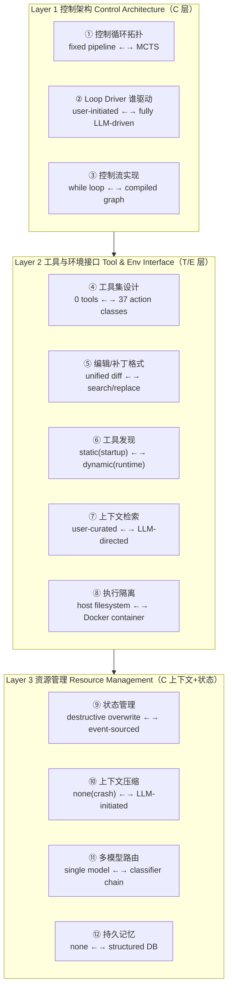

# 深入脚手架：编码 Agent 架构的源码级分类法

> **本篇定位**：这是 agent-harness 库 A 组（综述/框架）的"坐标轴"论文。它不造新 agent、不跑 benchmark、不给一个分数，
> 而是回答一个更上游的问题——**"脚手架（scaffold/harness）这层东西，到底有哪些可以区分的设计维度？"** 它把 13 个真实开源
> 编码 agent 的**源代码**逐行读了一遍（每条结论都 pin 到 commit hash + 文件 + 行号），抽出 **3 层 12 维**的分类法。
> 它和我们的 G 组标杆 [Harness-Bench](2605.27922-harness-bench-measuring-harness-effects.md) 正好是一对：Harness-Bench
> 证明"换 harness 分数摆 23.8 分"（**度量**这层有多重要），本篇回答"这层里到底有哪些旋钮、各家怎么拧的"（**分类**这层长什么样）。
> 子代理写作对齐标杆范文的密度与诚实度：公式/维度先给直觉→定义→读出什么；分类法给**判据**而非只列名；区分宣称 vs 批判。

---

## §1　TL;DR（一页讲清这篇在干嘛）

> 主讲提示：开场先说清这篇的"反常识结论"——脚手架抗分类。再点明它在本库的坐标：A 组分类轴，与 G 组度量轴互补。

**一句话**：把 13 个开源编码 agent 的脚手架**当成被解剖的标本**，在**源代码层**（不是文档、不是行为轨迹）逐一刻画它们的架构，用 **3 层 12 个维度**组织（Abstract / §4）。最反常识的发现是：**脚手架架构抵抗离散归类**——它们不是"ReAct 型 / 管线型 / 树搜索型"这种互斥的盒子，而是落在一组**连续光谱**上的**组合**：控制循环从"固定管线"到"完整 MCTS"连续变化，工具数从 **0 个到 37 个**，上下文压缩有 **7 种**不同策略（§5.1）。

- **属于 harness 的哪几层（Θ1）**：本篇是 **A 组（跨层综述）**，但它的 12 维**恰好就是给 harness 六层做的解剖刀**——
  - **C（控制循环 / Loop）**：Layer 1「控制架构」的 3 维（循环拓扑 / loop driver / 控制流实现）；
  - **T（工具 / Tools）+ E（环境 / Environment）**：Layer 2「工具与环境接口」的 5 维（工具集设计 / 编辑格式 / 工具发现 / 上下文检索 / 执行隔离）；
  - **资源管理（横跨 C 上下文 + 状态）**：Layer 3 的 4 维（状态管理 / 上下文压缩 / 多模型路由 / 持久记忆）。
  - 它**不打 O（可观测）/ V（验证）层**——这篇明确"不做性能 benchmark、不报分"（§3.5），把"度量"留给了 G 组。
- **回扣全库论点（Θ2）**：这篇是 `Agent = Model + Harness` 的**"零件清单"**——它把"harness 这一项"展开成 12 个可独立设计的旋钮，并明确说"同一个底座模型，会因为脚手架不同而表现不同"（§5.3 原文："The same underlying language model behaves differently depending on…"）。它给 Harness-Bench 那个"23.8 分摆动"提供了**机制词汇表**：摆动从哪个旋钮来，本篇告诉你旋钮有哪些。
- **够新够权威（Θ4）**：2026-04 预印本，自称"据当前文献检索，**首个**在实现层（source-code level）对生产编码 agent 做横向架构比较的研究"（§1 贡献 1、§2 末）。13 个 agent 的 release 跨度 2023-06 到 2025-03，全部 pin 到 commit（Appendix B Table 15）。

**3 条带走的结论**：
1. **脚手架是"光谱上的组合"，不是"类型"**：5 个 loop 原语（ReAct / 生成-测试-修复 / plan-execute / 多次重试 / 树搜索）是**可自由叠叠乐的积木**，13 个 agent 里 **11 个**是多原语组合（Abstract / §5.1）。给一个 agent 贴"ReAct agent"的标签，会**抹掉真正区分它的设计决策**。
2. **维度分两类：被外部约束收敛的 vs 因开放问题发散的**（§5.2）。收敛维（工具能力类别、编辑格式、执行隔离）已被"问题本身"逼到了共识；发散维（上下文压缩、状态管理、多模型路由）还是"无人解出的开放设计前沿"。
3. **它给"架构感知的评测"补上了缺失的词汇**（§5.5、§7）——以前没法说"两个 agent 差在哪个旋钮"，现在有了 12 个变量名，可以设计"固定工具集、只换 loop"这类受控实验。

---

## §2　问题与动机：为什么"读源码做分类"值得单独做（why，核心）

> 主讲提示：这一页用 Why 三连的"问题层"。讲清现有三类研究（能力综述 / 轨迹研究 / 单系统描述）各自的盲区，
> 落到"没有人在源码层横向比过"这个真空。

**Why（问题层）——不解决会卡住什么？谁受影响？**
论文 §1 / §2 给出三类现有工作，各有一个系统性盲区：

1. **能力综述（capability surveys）抽象层太高**：Masterman et al. (2024)、Nowaczyk (2025) 这类按"工具使用 / 记忆 / 规划 / 反思"五要素给 agent 分类。问题是——语料里**13 个 agent 全部**都符合"会用工具、有记忆、会规划"这套标签（§2.1 原文），可它们的脚手架在**成本、可靠性、失败模式**上差异巨大。"一个用 MCTS 探索补丁的 agent 和一个用简单 while 循环做测试重试的 agent，在能力分类法下**无法区分**"（§1 原文）。→ 受影响者：**研究 agent 行为的人**，他们没有共享词汇去把观察到的差异归因到具体架构选择。
2. **轨迹研究（trajectory studies）把 agent 当黑盒**：Ceka et al. (2025)、Majgaonkar et al. (2026)、Bouzenia & Pradel (2025) 收集执行轨迹，发现"成功的 agent 定位 bug 更快、测试更早、动作序列更短"。但他们**只看 agent 做了什么（what），不看产生这些行为的脚手架代码（why）**（§2.2）。更糟的是——这些研究**给不同 agent 配了不同的 LLM**（如把 Claude-3.5-Sonnet 的 OpenHands 轨迹和 DeepSeek-V3 的 Prometheus 轨迹对比），导致"行为差异到底来自脚手架还是模型"**根本无法分离**（§2.2 原文）。
3. **单系统架构描述（individual system descriptions）只见树木**：SWE-agent 的 ACI、AutoCodeRover 的 AST 检索、Bui (2026) 的四层终端 agent……每篇深入**一个**系统，但"设计空间作为整体仍未被绘制"——实践者要比较控制循环/工具接口/上下文管理，得**自己读十几个代码库**（§2.3 原文）。

**这个真空为什么现在必须填（Why·问题层的紧迫性）**：§1 给了三条理由——(a) 没有共享词汇，研究者无法把行为差异归到架构，"脚手架设计与模型能力的混淆未被承认"；(b) 实践者建新 agent 缺一张设计空间地图，只能靠读单个代码库或博客；(c) **发展太快**——这 13 个 agent 跨越 2023-06 到 2025-03，代表"固定管线、顺序 ReAct、分阶段工作流、深度优先树搜索、完整 MCTS"等迥异策略，却没人画过它们的关系图。

> **读出什么**：这篇的动机不是"造更强 agent"，而是"给这个领域立一套**解剖学命名法**"。它和标杆 Harness-Bench 的动机是**同一硬币的两面**——Harness-Bench 说"这层很重要（值得当被测变量）"，本篇说"这层有哪些可被命名的器官"。没有命名法，Harness-Bench 那个"23.8 分摆动"就只能说"换了 harness"，说不清"换了 harness 的哪个旋钮"。

---

## §3　研究问题与核心 intention（一句话形式化）

> 主讲提示：把"这篇到底在问什么"压成一句，并点明它**故意不做**什么。

**核心 intention（§3 开篇 + §3.5）**：
> 对一组开源编码 agent，**从源代码（而非文档/行为）出发**，用**自下而上的开放编码（open coding）**归纳出一组能区分它们的架构维度，并把每个 agent 在每个维度上的位置**用 commit + 文件 + 行号钉死**，从而得到一份"可被独立核验、可复用"的设计空间地图。

**它故意不做的两件事（这正是它和 G 组分工的边界，Θ1）**：
- **不做性能 benchmark、不报任何分**（§3.5 原文 "This study is purely taxonomic"）。理由有二：① 不同 agent 用了不同底座模型，**模型能力是比脚手架更大的混淆变量**，裸 pass rate 无法直接比；② SWE-bench issue 描述存在已记录的"答案泄漏"（Garg et al. 2026），使裸 pass rate 不可靠。→ 所以它把"度量"完全让给 Harness-Bench 那类工作。
- **不做规范性推荐**：它反复强调结论是"在 13 个 agent 上**观察到**的模式（patterns observed），而非处方（prescriptive recommendations）"（§5.4 开头）。这是它诚实的地方（Θ5）。

**假设**：脚手架的架构差异**可以**从源码中被一致地、可区分地观测出来（这条假设在 §6.1 被自己质疑——单作者判断、维度框架可能有遗漏）。

---

## §4　相关工作定位：它站在谁肩上、和谁不同（一张表）

> 主讲提示：用一张表把四条研究线和"本篇的增量"并排。强调它把"per-system 深度"扩成了"cross-system 比较"。

论文 §2 把相关工作分成四线，每线都"提供一个视角，但都没在源码层横向比过脚手架"：

| 研究线（§2.x） | 代表工作 | 视角 | 盲区 / 本篇如何补 |
|---|---|---|---|
| **能力综述** (§2.1) | Masterman 2024（五要素）、Nowaczyk 2025（可靠性是架构属性）、Zhang 2026 | 按抽象能力（工具/记忆/规划/反思）分类 | 抽象层太高，13 个 agent 全部"达标"却差异巨大；本篇给出 Nowaczyk"可靠性=架构属性"论点所**缺的实现层证据** |
| **轨迹/行为研究** (§2.2) | Ceka 2025、Majgaonkar 2026、Bouzenia & Pradel 2025、Fan 2025(SWE-Effi) | 看 agent 运行时**做了什么** | 把 agent 当黑盒（只见 what 不见 why）；且**不同 agent 用不同模型**致混淆；本篇读脚手架源码，给行为差异补上**解释层** |
| **单系统架构描述** (§2.3) | Yang 2024(SWE-agent/ACI)、Gauthier(Aider)、Bui 2026、Xia(Agentless)、Aggarwal(DARS)、Wang(OpenHands) | 深入**一个**系统 | 只见树木，设计空间整体未绘；本篇把 per-system 深度**横向扩到 13 个**，得到单系统描述给不了的比较 |
| **评测/benchmark** (§2.4) | SWE-bench、SWE-bench Pro、SWE-Compass、Chen 2026、Souza & Machado 2026 | 用任务分数评 agent | 分数混淆了脚手架+模型+提示+配置；本篇**故意不报分**，转而提供"架构感知评测所需的变量"（Souza & Machado 呼吁的 component-to-metric 框架，本篇补上它缺的架构文档） |

> **读出什么**：它最关键的"差异化"是一句话——**"per-system 深度 → cross-system 比较"**（§2.3 末）。Souza & Machado (2026) 想做"组件→指标"的映射框架，但他们承认"依赖此前不存在的架构文档"；本篇正是**那份不存在的文档**。这也是它和配置研究 Galster et al. (2026) 的分工：Galster 研究"开发者**配置** agent（指令文件/prompt 模板/skills）"，本篇研究"脚手架**架构**如何处理这些配置"——一个 `CLAUDE.md` 写"提交前先跑测试"是面向开发者的**配置**，而实现这条指令的"生成-测试-修复循环"是**架构特征**（§2.3 原文，这个例子和我们自己直接相关）。

---

## §5　方法总览（big picture）：从 9 个分析维度到 12 个分类维度

> 主讲提示：先给一图流——三层结构。再讲方法学的两个关键决定：开放编码（维度是"涌现"的不是"预设"的）+ 双工具计数。

**架构一图流（Figure 1 的结构复述）**：

**方法学的三个关键决定（§3）**：

1. **维度是"涌现"的，不是"预设"的——开放编码（open coding, Strauss & Corbin 1998）**。九个分析维度**不是先验固定的**：先在两个"架构上对照"的 agent（Aider 简单交互式 CLI vs OpenHands 复杂事件驱动容器化）上做试点，让维度从源码里"长"出来（§3.2）。初始 6 维来自概念文献（Masterman 2024），试点中源码又逼出 3 个新维度（工具发现策略、上下文压缩、持久记忆），**没有一个维度被删**。最终 9 个分析维度在结果里展开成 **12 个分类维度**（loop driver 和 edit/patch format 从子属性升格为独立维；control flow implementation 作为与拓扑正交的第三轴独立出来）。开放编码的纪律：**保留一个开放的第十节**装"不属于任何维度"的发现——共收 **47 条跨维发现**（§4.4 的 cross-cutting themes 即源于此），"强行把每个发现塞进预设类别会压制新模式"（§3.2 原文）。

2. **双工具计数法（§3.3）——避免把"接口粒度"和"功能覆盖"混为一谈**：
   - **注册计数（Registration count）**：按 LLM 看到的样子数——每个单独注册的可调用项（function-calling schema 一条 / 系统提示里定义的命令 / 等价物）算一个。它对"脚手架开发者怎么切分功能"敏感。
   - **能力类别计数（Capability category count）**：按"工具**干什么**"归类——read / search / edit / execute / validate / repository-state 六类。这是**跨 agent 可比**的度量。一个用单个 `bash` 工具的 agent 和一个有独立 `run_command`/`run_tests`/`run_linter` 的 agent，在能力上**都覆盖了 execute 类**。→ 跨 agent 比较一律用能力类别计数。

3. **三级证据模板（§3.4）**：每个 agent 的分析分三层——**Observation**（代码做了什么，带文件+行号）/ **Classification**（如何映射到维度，给出显式判据）/ **Evidence**（pin 到 commit 的文件路径+行号）。**事后核验**：从克隆库抽查了 **296 条**提取的声明，确认 267 条、修正 19 条（多为代码演进导致的行号偏移）、接受 10 条为"轻微简化"（§6.1）。这套"声明可回溯到一手代码"的纪律，是它**诚实性的护城河**。

> **Why（设计层）——为什么用开放编码，而不是套一个现成的分类框架？**
> 朴素做法是直接拿 Masterman 的"五要素"或某个 agent 设计 checklist 去打勾。→ 会**复现能力综述的盲区**：13 个 agent 在五要素上全部"达标"，框架本身分辨不出它们。本文改用"自下而上、让维度从源码涌现"的开放编码，因为研究目标恰恰是**找出现有框架看不见的区分维度**——3 个新维度（工具发现/压缩/记忆）正是这样被逼出来的（§3.2）。代价：维度集**依赖试点的那两个 agent**，可能漏掉它俩都不展现的维度（如 prompt engineering 策略，§6.1 自陈漏了）。

---

## §6　符号与术语表

> 主讲提示：这页是"读后面 12 维"的速查卡。先把几个反复出现的术语钉死。

| 术语 | 英文 | 定义（本篇语境） |
|---|---|---|
| 脚手架 / 框架 | scaffold / harness | 包在 LLM 外面、把"会推理"变成"会干活"的软件层：控制循环、工具定义、状态管理、上下文策略（Abstract） |
| Loop 原语 | loop primitive | 可组合的控制结构积木：ReAct / 生成-测试-修复 / plan-execute / 多次重试 / 树搜索（Abstract / §5.1） |
| Loop driver | loop driver | "谁决定下一步做什么"：user-driven / scaffold-driven / LLM-driven（§4.1.2，作者称这是**最根本**的架构区分） |
| 注册计数 | registration count | 按 LLM 看到的样子数工具数（§3.3） |
| 能力类别计数 | capability category count | 按工具功能归到 read/search/edit/execute/validate/repo-state 六类（§3.3，跨 agent 可比） |
| ACI | agent-computer interface | SWE-agent 提出：为 agent 定制的、结构化的代码交互接口（§2.3） |
| SBFL | spectrum-based fault localization | 基于"频繁出现在失败测试里、罕见于通过测试"给方法打可疑度（Ochiai 评分），AutoCodeRover 独有（§4.2.4） |
| 影子模式 | shadow mode | 文件改动只在内存里追踪、不落盘，使树搜索能在任意点分叉而无文件系统代价（Moltis/Moatless Tools，§4.1.1） |
| 事件溯源 | event sourcing (Fowler 2005) | 存不可变事件、视图由事件计算而来，而非原地删改（OpenHands，§4.3.1） |
| 收敛维 / 发散维 | converging / diverging dimension | 被外部约束逼到共识的维 vs 因开放设计问题而各家发散的维（§5.2） |

> **读出什么**：术语表里最该记住的是 **loop driver**——作者把它单独拎出来称为"可以说是最根本的架构区分"（§4.1.2）。因为它决定了一连串下游设计：user-driven 的 agent（Aider）把"找 bug"的责任甩给用户，于是**绕过了**轨迹研究公认的"bug 定位瓶颈"；LLM-driven 的 agent 必须自己解定位，于是**上下文检索**就成了关键设计（§4.1.2 末）。

---

# Layer 1：控制架构（Control Architecture，C 层）

> 这一层回答："agent 如何编排自己的动作？"三个维度：循环拓扑 / 谁驱动 / 如何用代码实现。

## §7　维度①：控制循环拓扑（fixed pipeline ←→ MCTS）

> 主讲提示：这是全篇最该停留的一张表（Table 2）。按"探索灵活度从低到高"排，强调一句反常识——这些类型**可以互相嵌套**。

**判据（怎么把一个 agent 归到某一档）**：看它的**主执行循环如何在"候选解空间"里探索**——是单向直筒（无反馈）、还是有反馈迭代、还是建树并在树上做选择/回传。

**Table 2（控制循环策略，按探索灵活度从低到高）**：

| 位置 | Agents | 机制（判据落点） |
|---|---|---|
| **固定管线 Fixed pipeline** | Agentless | 10 阶段独立脚本，用磁盘上的 JSONL 连接，**阶段间无反馈循环** |
| **用户驱动循环 User-driven loop** | Aider | 外层循环由用户发起（每次编辑周期需用户输入）；内层"生成-测试-修复"自治，最多 `max_reflections` 次 |
| **顺序 ReAct loop** | SWE-agent, OpenHands, Codex CLI, Gemini CLI, mini-swe-agent, Cline, OpenCode | 标准 思考-动作-观察 循环；LLM 选下一个动作；完成信号或预算耗尽则终止 |
| **分阶段循环 Phased loop** | AutoCodeRover, Prometheus | 不同阶段有不同工具访问。AutoCodeRover：搜索→打补丁的阶段分离；Prometheus：LangGraph 显式边的状态机 |
| **深度优先树搜索 DFS tree search** | DARS-Agent | ReAct step 形成树节点；分叉点环境重置并从根重放；LLM critic 在采样的备选中选一个 |
| **完整 MCTS** | Moltis (Moatless Tools) | 选择-扩展-模拟-回传，奖励值 −100~+100 + 访问计数；可插拔 selector；discriminator 选最佳完成轨迹 |

**反常识的核心点（§4.1.1 原文）——循环类型不是互斥的，它们嵌套**：
- AutoCodeRover 在它管线的**每个阶段内部**跑多轮 LLM 交互（`agent_search.py:88--163`），所以它**同时**是"分阶段"和"迭代"——取决于你看哪个抽象层级。
- Moltis 把"可组合"推到极致：它把内层的**单步执行器**（`ActionAgent`：一次 LLM 调用产生动作再执行）和外层的**控制流**彻底**解耦**——同一个 `ActionAgent` 既可以被 `AgenticLoop` 反复调用（产生 ReAct 行为），也可以被 `SearchTree` 驱动（做 MCTS 探索），**agent 本身不变**。→ "顺序 vs 树搜索"在 Moltis 里是**配置决定**，不是架构决定。

**树搜索三档梯度（§4.1.1，从平坦采样到知情搜索）**：
- **Agentless**（最简）：独立采样——定位后让 LLM 独立生成多个候选补丁（默认 20 个；原论文是 4 location × 10 patch ≈ 40），多数投票选最终补丁。**无树结构、候选间无交互**。
- **DARS-Agent**（中）：树结构搜索，但**无数值奖励、无回传**——LLM critic 在分叉点贪心地局部选择（返回 `<best_action_index>` 标签），不考虑早期选择如何影响后期结果。
- **Moltis**（最强）：完整 MCTS（Browne 2012；与 AlphaGo 同算法），每节点有奖励值（−100~+100）+ 访问计数，扩展后**回传**奖励更新祖先节点（`search_tree.py:326--345`），让搜索从后期结果学习、重定向到更有希望的分支。

**一个被这张表"读出"的设计权衡（§4.1.1 末）**：越富的搜索策略，越需要"跨分支管理执行状态"的机制。Moltis 用**影子模式**（改动只在内存、不落盘）实现任意点分叉、零文件系统代价；DARS-Agent 则**重置 Docker + 从根重放**——在深度 N 要重新执行 N 条命令，正确但深处昂贵。

> **Why（设计层）——为什么作者坚持"光谱"而不是给每个 agent 一个类型标签？**
> 朴素做法是把每个 agent 标成"ReAct 型 / 树搜索型"。→ 会因为**嵌套性**而失真：AutoCodeRover 在"分阶段"里嵌了"迭代"，强行二选一会丢掉信息；更糟的是 Moltis 同一份 agent 代码既能顺序又能树搜索，标签**根本不唯一**。本文改用"沿光谱定位 + 承认嵌套"，因为 loop 原语**自由组合**，设计空间是**组合式（combinatorial）而非分类式（categorical）**的（§5.1）。这是全篇方法论的"题眼"。

> **读出什么**：这张表是"脚手架抗分类"的最强证据。它对实践者的指导是——**别问"我该选哪种 agent 类型"，要问"我该在每个旋钮上拧到哪"**。Moltis 的 dual-flow（执行器与编排策略解耦）被作者反复当成"模块化脚手架应该长什么样"的范本（§5.6）。

---

## §8　维度②：Loop Driver——谁决定下一步（user ←→ scaffold ←→ LLM）

> 主讲提示：作者说这是"最根本"的维度。讲清三档，并强调它如何决定下游的"上下文检索"是不是关键设计。

**判据**：在主循环里，"下一步做什么"这个决策由谁做？

**Table 3（loop driver 策略）**：

| Driver | Agents | 判据落点 |
|---|---|---|
| **User-driven 用户驱动** | Aider | LLM **有 0 个可调用工具**；用户选文件（`/add`）、跑搜索、提供上下文；LLM 只产出文本格式的编辑由脚手架解析（`base_coder.py:2296--2304`） |
| **Scaffold-driven 脚手架驱动** | Agentless, AutoCodeRover | 脚手架控制时序、在固定点调 LLM。Agentless 里每次 LLM 调用是**单轮、无对话状态**；AutoCodeRover 里脚手架管 4 阶段过渡（可选复现器生成、可选 SBFL、搜索、补丁） |
| **LLM-driven LLM 驱动** | SWE-agent, OpenHands, Codex CLI, Gemini CLI, Cline, mini-swe-agent, Moltis, DARS-Agent, OpenCode | LLM 选工具、控探索（9/13）。Prometheus 是**混合**：图节点内 LLM 用 ReAct 选工具，但**节点间的边由脚手架控制**（基于 `state["reproduced_bug"]` 这类状态字段） |

**为什么 loop driver 是"最根本"的（§4.1.2 末，关键的下游含义）**：
- **它决定了"bug 定位"是不是 agent 的责任**。user-driven 的 agent（Aider）**绕过**了此前轨迹分析公认的"bug 定位瓶颈"——如果用户选文件，定位错了是**用户错误**，不算 agent 失败。
- 反过来，**LLM-driven 的 agent 必须自己解定位**，这就让"上下文检索策略（§11）成为关键设计选择"。
- 所以 loop driver 不只是控制流问题，它**重新分配了"谁为失败负责"**，并连锁决定了检索维度的重要性。

> **读出什么（与我们自己直接相关）**：我们（Claude Code）是**彻底的 LLM-driven**——没有用户帮我们选文件，定位完全是 agent 的责任。按本篇逻辑，这意味着"上下文检索"对我们是**头等设计**（见 §11 与 Inspires-Us）。

---

## §9　维度③：控制流实现（while loop ←→ compiled graph）

> 主讲提示：强调这维度与"循环拓扑（§7）正交"——一个语义上"用户驱动"的 agent，实现层可能仍是个 while 循环。

**判据**：实现主循环的**代码级机制**是什么？（与 §7 的语义拓扑正交——Table 4 明确："被 loop strategy 归为 user-driven 的 Aider，实现层仍可能用 imperative while loop"。）

**Table 4（控制流实现的四种机制）**：

| 实现 | Agents | 机制（判据落点） |
|---|---|---|
| **命令式 while 循环** | SWE-agent, OpenHands, Codex CLI, Gemini CLI, mini-swe-agent, Aider, OpenCode | 脚手架在 `while True` 里调 LLM，收到终止信号 break（13 个里 **8 个**用 while 循环） |
| **固定管线（无循环）** | Agentless | 顺序脚本；每次 LLM 调用单轮、无 agent 循环（Anthropic 路径含一个 bounded `for` 循环 ≤10 次，但主架构无循环，`model.py:148--284`） |
| **递归 Recursion** | Cline | `recursivelyMakeClineRequests`（`task/index.ts:2268`）——每次工具使用触发递归调用，**调用栈随对话长度线性增长**（语料里唯一用递归实现主循环的） |
| **图作为控制流 Graph-as-control-flow** | Prometheus | LangGraph 编译状态机，显式边定义过渡与循环（`issue_graph.py:22--134`）；图里的环=循环；递归上限（IssueBugSubgraph 30、BugReproductionSubgraph 150）作为终止保证 |
| **异常驱动信号 Exception-based** | mini-swe-agent | `InterruptAgentFlow` 层级（Submitted/LimitsExceeded/FormatError）把控制消息当 payload；`run()` 捕获后注入历史、continue 或 break（`default.py:88--96`） |

**两个被读出的细节**：
- **图实现是"质上不同"的（§4.1.3）**：Prometheus 的控制流是**可检视、可序列化、可 checkpoint** 的——子图各有自己的状态类型，父子图状态通过 `SubgraphNode` 翻译（至少四层嵌套：IssueGraph → IssueBugSubgraph → IssueVerifiedBugSubgraph → ContextRetrievalSubgraph）。这是其他实现给不了的"可观测性"。
- **递归的架构后果（§4.1.3）**：Cline 的递归虽语义等价于迭代，但**每个递归帧保留局部状态**，使控制流比迭代更难序列化/checkpoint；Node.js 默认栈限（数千帧）正常会话基本碰不到，但这是真实的架构差异。
- **OpenCode 的独特性**：在 while 循环之上叠了一个**全局发布-订阅事件总线**（`packages/opencode/src/bus/`），组件通过类型化事件通信而非直接函数调用——语料里唯一用 event bus 做组件间通信的 CLI agent（注意与 OpenHands 的事件溯源不同：后者为持久化/重放，前者为解耦运行时通信）。

> **Why（设计层）——为什么把"实现"单列为一维，而不并进"拓扑"？**
> 朴素做法是认为"拓扑定了，实现就定了"。→ 错：Aider 语义上 user-driven，实现却是 while 循环；Cline 语义上是标准 ReAct，实现却是递归。实现机制带来**拓扑层看不到的属性**（可序列化性、可 checkpoint 性、栈增长）。所以它是"与拓扑正交的变化轴"（§3.2 原文），独立成维。这也示范了开放编码的纪律：**数据逼出来的维度，即使概念上像是子属性，也要独立呈现。**

---

# Layer 2：工具与环境接口（Tool & Environment Interface，T/E 层）

> 这一层回答："agent 如何与代码和执行环境交互？"五个维度：工具集 / 编辑格式 / 工具发现 / 上下文检索 / 执行隔离。

## §10　维度④⑤：工具集设计（0→37）与编辑格式（收敛到 string-replace）

> 主讲提示：这页讲两个"收敛"维度。重点是反常识——工具数从 0 到 37 跨度巨大，但**能力类别收敛到 4 个**。

**维度④ 工具集设计——判据：LLM 可调用工具的数量与功能覆盖（用能力类别计数比较）。**

**Table 5（工具集规模与能力覆盖）节选**：

| Agent | Tools | Read | Search | Edit | Execute | Validate | 备注 |
|---|---:|:--:|:--:|:--:|:--:|:--:|---|
| Aider | 0 | | | ✓* | | | *文本解析编辑，13 种格式 |
| Agentless | 0–1 | | | ✓* | | | *Anthropic 路径里 1 个模拟工具 |
| AutoCodeRover | 8 | ✓ | ✓ | | | | 全是搜索/读；无编辑工具 |
| OpenHands | 9+ | ✓ | | ✓ | ✓ | | +MCP；经 bash 搜索；含 BrowserGym 浏览器 |
| Moltis | 15–37 | ✓ | ✓ | ✓ | ✓ | ✓ | 37 类；每会话典型 ~15；**唯一覆盖 validate** |
| SWE-agent | 3–35 | ✓ | ✓ | ✓ | ✓ | | 默认 3；35 跨 15 bundle |
| Cline | 27+ | ✓ | ✓ | ✓ | ✓ | | +MCP；最大的扁平内置集 |
| mini-swe-agent | 1 | | | | ✓ | | 全部能力经单个 `bash` |

**核心读出（§4.2.1）——分歧在工具数，收敛在能力**：工具数 0~37，但**四个能力类别（read/search/edit/execute）出现在每一个 LLM-driven agent 里**。第五类 validate（专门的测试/lint 工具）**只在 Moltis 出现**。"工具少的 agent 靠组合达成覆盖"——mini-swe-agent 的单个 `bash` 覆盖全部四类（委托给 shell 命令）；"工具多的 agent 把类别拆成细粒度操作"——Moltis 光 search 类就拆成 FindClass / FindFunction / FindCodeSnippet / SemanticSearch / GrepTool / GlobTool。

**两个结构化护栏（per-node tool scoping，§4.2.1）**：
- **Prometheus** 是唯一把不同工具子集**绑定到不同决策点**的 agent：`EditNode` 见 5 个工具、`BugReproducingWriteNode` 只见 `read_file`、`BugFixVerifyNode` 只见 `run_command`。这是**结构性约束动作空间**。
- **AutoCodeRover** 用阶段分离达到类似效果：补丁 agent **不给搜索工具**，被要求直接从搜索阶段收集的上下文产出补丁——这是工作流级约束，不是可配置绑定。AutoCodeRover 的搜索 agent 有 8 个**全只读**工具，是语料里用 LLM 可调用工具的 agent 中**最受限的工具集**（哲学：定位与修复是不同任务，需不同工具）。

**两个独特的工具实现**：
- **AutoCodeRover 的 proxy agent**（`agent_proxy.py:81--82`）：用**二次 LLM 调用**把搜索 agent 的自然语言工具选择转成结构化 JSON（最多 5 次重试）。每个搜索轮加一次 LLM 调用（最多 15 轮 = 最多 15 次额外调用），但**避免搜索 agent 直接产结构化输出**。语料里唯一用二次 LLM 调用做工具解析的——其余都靠 function-calling API / 正则 / XML 提取。
- **Codex CLI 的可协商资源**：含 meta-tools——`tool_search`（运行时查注册的 app 工具）、`tool_suggest`（为当前任务荐工具）、`request_permissions`（让 LLM **会话中途请求提升沙箱权限**，使 agent 自己的权限成为**可协商资源**而非固定约束）。

---

**维度⑤ 编辑/补丁格式——判据：LLM 输出如何被翻译成代码改动。**

**核心读出（§4.2.2）——收敛到"精确字符串替换"**：`str_replace_editor` 类工具（取 `old_str`/`new_str` 做精确字符串替换）出现在 **13 个里 5 个**（OpenHands、SWE-agent、Codex CLI 的 freeform `apply_patch`、Agentless 三种修复格式之一、Moltis 的 StringReplace）。这个收敛**很值得注意**，因为这些接口是**独立开发的**——共享接口反映了一个**共同发现**：精确字符串匹配比"基于行号"或"基于 unified diff"的编辑对 LLM 生成的补丁**更可靠**（§4.2.2 引 Yang et al. 2024）。

**Table 6（编辑/补丁格式变体）**：

| 格式 | Agents |
|---|---|
| 字符串替换（function calling） | OpenHands, SWE-agent (`str_replace_editor`), Codex CLI (`apply_patch`), OpenCode (`edit`) |
| 写文件工具（function calling） | Gemini CLI, Cline |
| 文本解析的编辑块 | Aider（13 种格式）, DARS-Agent |
| 模拟工具使用 | Agentless（Anthropic 路径） |
| Pydantic-schema 动作 | Moltis, Prometheus |

**两个异类**：
- **Aider 注册了 13 种编辑格式**（每种一个 coder 子类），**按模型能力选**——有些模型 unified diff 更好，有些 SEARCH/REPLACE 更好。这种"把编辑格式当一等的、模型特定的架构组件"在语料里独一份（OpenCode 实现了简化版：在 `edit`（字符串替换）和 `apply_patch`（unified diff）间按模型选，只两种）。
- **SWE-agent 支持 10 种输出解析器**（FunctionCallingParser / ThoughtActionParser / XMLThoughtActionParser…），让同一工具集能跨不同模型约定工作。注意：Aider 适配的是**编辑格式本身**，SWE-agent 适配的是**工具解析**——两者解决的是不同层。
- **Agentless 的"模拟工具使用"**（Anthropic 路径）架构上独特：LLM 调 `str_replace_editor`，但**每次调用都收到同一个硬编码响应**（"File is successfully edited"）无论输入；LLM 从不见编辑后的真实文件状态，工具调用被事后提取应用。这是**把 tool-calling API 当成结构化输出提取技术**，而非真正执行。
- **mini-swe-agent** 是唯一**直接用 shell 命令编辑文件**、而非产补丁给脚手架应用的 agent。

> **Why（设计层）——为什么 string-replace 会"自发收敛"？**（§5.2 给的解释）
> 这不是抄来的标准，而是**外部约束逼出的共识**：LLM 在精确字符串匹配上比在"数行号"或"生成合法 unified diff"上**犯错更少**（行号会因前面的编辑漂移；diff 格式严格易畸形）。五个独立团队**各自撞到同一面墙**，于是**各自发明了同一个解法**。这正是作者区分"收敛维 vs 发散维"的范例：**收敛 = 问题本身只有一个好答案。**

---

## §11　维度⑦：上下文检索（user-curated ←→ LLM-directed，7 种策略）

> 主讲提示：这维度变化最大（7 种策略）。讲清两大范式——"把 LLM 当导航员" vs "脚手架侧建结构化代码理解"。这维度和我们最相关。

**判据**：agent 在任务前/中**如何找到相关代码**？（从简单关键词搜索到知识图谱遍历，§4.2.4 列了 7 种。）

**两大范式（§4.2.4）**：
1. **把 LLM 当导航员（8 个 agent）**：脚手架只提供通用 shell 工具（grep / find / ripgrep），靠 LLM 形成查询、解读结果、决定下一步看哪。**脚手架自身无代码理解**——它只执行 LLM 请求的命令并返回输出。（SWE-agent、OpenHands、Codex CLI、Gemini CLI、Cline、mini-swe-agent、DARS-Agent、OpenCode）
2. **脚手架侧投资代码理解**：在任务前/中**构建代码库的结构化表示**。

**Table 8（上下文检索策略，agent 可用多种）**：

| 策略 | Agents | 机制（判据落点） |
|---|---|---|
| **关键词/正则搜索** | SWE-agent, OpenHands, Codex CLI, Gemini CLI, Cline, mini-swe-agent, DARS-Agent, OpenCode | LLM 调 grep/find/ripgrep |
| **Repo map（静态分析）** | Aider | PageRank 加权的 tree-sitter 标签索引；建 NetworkX 依赖图；对话里提到的标识符 ×10 权重、加入 chat 的文件 ×50（`repomap.py:365--574`） |
| **AST-aware 搜索** | AutoCodeRover, Moltis, DARS-Agent, Prometheus | `search_class`/`search_method` 等结构感知查询（基于预建 AST 索引）。AutoCodeRover 的 AST 工具仅 Python；Prometheus 的 tree-sitter 覆盖 20 语言 |
| **知识图谱遍历** | Prometheus | Neo4j 图（tree-sitter AST，20 语言）；11 个工具（10 个图遍历 + read_file）查 FileNode/ASTNode/TextNode 实体（`graph_traversal.py:93--586`） |
| **嵌入式语义搜索** | Moltis | FAISS 向量库（LlamaIndex，`code_index.py:57`）；语料里唯一把 embedding 检索作为 LLM 可调用工具 |
| **分层定位** | Agentless | 文件→类/函数→行 逐级收窄；每级只见上一级所识别的（`FL.py:313--681`） |
| **经典故障定位（SBFL）** | AutoCodeRover | Ochiai 评分（`analysis/sbfl.py`）；语料里独一份 |

**两个被读出的"投资 vs 信任"对照**：
- **Aider 的 PageRank repo map**：把 Google PageRank 用到源码结构——tree-sitter 解析每个文件抽取符号定义与跨文件引用，形成有向依赖图（`repomap.py:365--574`）。PageRank 按结构中心性给文件排序，带上下文加权（对话提到的标识符 ×10、chat 文件 ×50），二分搜索填满 rank 预算。**语料里唯一用图论相关性排序的**。它**用启动成本（解析整库）换上下文质量**——不靠 LLM 导航，而是从依赖结构**预计算**相关性。
- **AutoCodeRover 的 SBFL**：语料里唯一**用测试执行做定位**的——有失败测试时跑 SBFL（Ochiai），频繁出现在失败测试、罕见于通过测试的方法排名最高，top-5 可疑方法作为建议输入给 LLM，**桥接了"自动故障定位"和"LLM 修复"两个原本不相连的社区**。

**一个关键相关性（§4.2.4 末）——检索范式与 loop driver 相关**：scaffold-driven 的 agent 倾向投资检索基础设施；LLM-driven 的 agent 倾向信任 LLM 用通用工具导航。"不奇怪：脚手架若控时序，它就有机会预处理库；LLM 若控探索，它就按需发搜索命令。"

> **读出什么（与我们最相关，伏笔到 Inspires-Us）**：我们（Claude Code）落在**范式 1**——靠 Grep/Glob 这类通用工具 + LLM 导航，**脚手架侧零代码理解**。本篇明确说，因为我们是 LLM-driven，检索就是"关键设计选择"。这是一个直接的自我体检结论：**我们在"上下文检索"维度选了"信任 LLM"，而 Aider/Prometheus 选了"投资结构化理解"——我们没有 repo map、没有 AST 索引、没有 SBFL。**这是不是我们失败的一个来源？（见 Inspires-Us c/e）

---

## §12　维度⑥⑧：工具发现（static ←→ dynamic）与执行隔离（host ←→ Docker）

> 主讲提示：两个维度合讲。工具发现讲"工具集是开局定死还是运行时变"；执行隔离讲"信任边界划在哪"，并点出"安全策略未收敛"。

**维度⑥ 工具发现——判据：工具集是初始化时定死（static）还是会话中动态增减（dynamic）？**

**Table 7（工具发现策略）**：

| 策略 | Agents | 判据落点 |
|---|---|---|
| **静态（全在初始化）** | Aider, Agentless, AutoCodeRover, mini-swe-agent, DARS-Agent, Moltis | 工具开局全定义、整会话不变（6/13，benchmark agent 的默认） |
| **Per-phase scoping（按节点静态）** | Prometheus, AutoCodeRover | 工具在每阶段/图节点内固定，但不同阶段暴露不同子集 |
| **Config-conditional** | SWE-agent, OpenHands | 工具集按配置不同而不同，但一旦载入、单次尝试内固定 |
| **Per-turn dynamic rebuild** | Codex CLI | `built_tools()` **每次采样请求都调**（`codex.rs:6156--6164`），纳入任何 MCP server 变化/新启用的连接器 |
| **Dynamic（MCP + 子进程）** | Gemini CLI, Cline, OpenCode | 工具发现子进程输出 `FunctionDeclaration[]` JSON（`tool-registry.ts:312--439`）；MCP server 运行时连/断 |

**核心读出**：近半（6/13）用全静态注册。最动态的是 **Codex CLI 的 per-turn 重建**——每次 LLM 采样都重算工具集，工具集原则上**每次调用都可能不同**。Gemini CLI 的 `toolDiscoveryCommand` 让外部子进程输出工具声明，**无需改 agent 代码**即可加任意工具源。MCP（Model Context Protocol）是动态化的主要载体（5 个 agent 支持）。

---

**维度⑧ 执行隔离——判据：agent 在哪运行 shell 命令和代码？信任边界划在哪？**

**Table 9（执行隔离策略）**：

| 隔离级别 | Agents | 判据落点 |
|---|---|---|
| **无（本地 shell）** | Gemini CLI, Aider, OpenCode | 直接在宿主跑 |
| **无状态子 shell** | mini-swe-agent | `subprocess.run()`（`local.py:28--39`）|
| **平台沙箱** | Codex CLI | Bubblewrap+Landlock(Linux)，Seatbelt(macOS) |
| **Docker 容器** | SWE-agent, OpenHands, DARS-Agent, AutoCodeRover, Prometheus | 命令在容器内执行，宿主文件系统不直接暴露 |
| **影子 git checkpoint** | Cline | 每工作区隔离 git 仓记录每次工具执行后的状态（`CheckpointTracker.ts`）|
| **影子模式（内存）** | Moltis | `shadow_mode` flag（`agent.py:57`）|
| **不适用** | Agentless | LLM 从不执行任意命令；Docker 仅经 SWE-bench harness 用于测试执行 |

**核心读出——安全策略发散（§4.2.5 末）**：没有容器隔离的 agent 各走各的安全路：
- **Gemini CLI**：基于规则的策略引擎，每工具一个审批要求（需确认/自动允许/完全禁止），规则可配。
- **Codex CLI**：双机制——OS 级平台沙箱（Bubblewrap/Landlock/Seatbelt）+ **Guardian 安全子 agent**（一个独立的 `gpt-5.4` LLM 在 0–100 标度上给每次工具调用的风险打分，>80 阻断，`guardian.rs`）。**语料里唯一用一个 LLM 评估另一个 LLM 动作安全性的。**
- **Aider**：最简——靠用户在场监督（用户手动选文件、审所有改动，人=安全边界）。
- **Cline**：最细粒度——`CommandPermissionController` 阻断危险 shell 操作符，从"YOLO 全自治"到"每命令模式审批"。
- **OpenHands** 的 Docker 实现独特：FastAPI 服务器跑在容器**内**，宿主侧 agent controller 经 HTTP 与之通信，形成干净的 API 边界（不像其他 Docker agent 直接 exec 进容器）。

> **Why（设计层）——为什么"安全/隔离"会发散，而"工具能力类别"会收敛？**（§5.2 的"收敛 vs 发散"框架在这里落地）
> 执行隔离对 **benchmark agent 是收敛的**（都上 Docker，§5.2：无沙箱的自治代码执行对无人值守评测不可接受）；但对**交互式 agent 是发散的**——因为"信任边界划在哪"取决于"用户在不在场、平台是什么、要多大自治"，**没有单一最优**。这正印证作者的总命题：**收敛维 = 外部约束主导（问题逼出唯一解）；发散维 = 开放设计问题（多种 tradeoff 并存）。** 安全恰好横跨两者——这本身就说明"agent 越自治，安全机制越要随之 scale，但还没有标准方案"（§4.2.5 末）。

---

# Layer 3：资源管理（Resource Management）

> 这一层回答："agent 如何处理有限上下文、API 成本、会话边界？"四个维度：状态管理 / 上下文压缩 / 多模型路由 / 持久记忆。**这是发散维最集中的一层。**

## §13　维度⑨：状态管理（destructive overwrite ←→ event-sourced）

> 主讲提示：讲清两个极端——Aider 的"两列表破坏式" vs OpenHands 的"事件溯源"。这是发散维。

**判据**：agent 如何**跨循环迭代表示和维护对话状态**？数据结构是什么（扁平消息列表 / 类型化事件日志 / 树）、状态可不可变。

**Table 10（状态管理策略）**：

| 策略 | Agents | 判据落点 |
|---|---|---|
| **破坏式 Destructive** | Aider | summarization **覆盖** `done_messages`（`base_coder.py:1024--1034`），最简但破坏式 |
| **扁平列表，保留** | SWE-agent, Codex CLI, Gemini CLI | 原始历史保留，为 LLM 建过滤视图。mini-swe-agent：原始历史无过滤、原样喂 LLM |
| **类型化事件日志** | OpenCode | SQLite 支持的 message/part 层级，12 种 part 类型（Drizzle ORM）；append-only 可变 part 状态（`message-v2.ts`）|
| **图作用域 Graph-scoped** | Prometheus | 每图节点独立消息列表（`edit_messages`/`analyzer_messages`/`context_provider_messages`），在重试边界重置 |
| **树结构（MCTS）** | Moltis | 树节点 + 每节点文件上下文快照、访问计数、奖励值 |
| **树结构（greedy）** | DARS-Agent | 树节点 + 每节点扩展候选与 critic 响应（`dars_agent.py:294--297`）；**无 MCTS 统计**；分叉靠贪心 LLM critic，状态靠 Docker 重置+动作重放恢复 |
| **事件溯源 Event-sourced** | OpenHands | 不可变 `EventStream`，视图由 condensation markers 计算（`memory/view.py:13--96`）|

**两个极端读出（§4.3.1）**：
- **Aider 的两列表设计**（`cur_messages` + `done_messages`）简单但**破坏式**：summarization 替换 `done_messages` 内容（condensation 插标记而非删除是 OpenHands 的做法，正相反）。
- **OpenHands 的事件溯源**存不可变事件、视图由 `View` 类计算而非删事件，**保全完整审计轨迹**。
- **Codex CLI** 在扁平列表 agent 里独特——双持久化：append-only JSONL rollout（人读+重放）+ SQLite（可查询状态+会话恢复）；且是唯一支持 undo（`Op::Undo`）和线程回滚（`Op::ThreadRollback`）的扁平列表 agent。
- **Cline** 维护两个并行消息列表（LLM API 用 + UI 用），mutex 保护并发访问——反映它的 IDE 集成（UI 需要比 API 更丰富的表示）。
- **Prometheus 的 `ResetMessagesNode`**：图循环回去重试时清特定消息列表，**无需计数逻辑就防止无界累积**——结构性独特。

> **读出什么**：状态管理是**发散维**——7 种策略对应 7 种 tradeoff（简单性 vs 可审计性 vs 支持分叉探索）。"分歧不是噪声，是对'最佳方法'的真实不确定"（§5.2）。

---

## §14　维度⑩：上下文压缩（none/crash ←→ LLM-initiated，7 种策略）

> 主讲提示：这是发散维里"7 种策略"最齐的一维。讲清两大哲学——"预防"（结构性限制增长）vs "治疗"（按需压缩）。

**判据**：对话历史逼近模型上下文上限时，agent 怎么办？

**两大哲学（§4.3.2）**：
- **预防（Prevention）——结构性限制上下文增长**：Prometheus 按图节点限定消息+重试边界重置；AutoCodeRover 限轮数（15）+每查询最多 3 个完整结果；Moltis 用树结构限轨迹深度。优点：避免压缩成本与信息损失；代价：需脚手架**预判**增长模式。
- **治疗（Cure）——增长后按需压缩**：Aider、OpenHands、Gemini CLI、Codex CLI 在 token 阈值触发 LLM 摘要。

**Table 11（上下文压缩策略）**：

| 策略 | Agents | 机制（判据落点） |
|---|---|---|
| **无（溢出即崩）** | mini-swe-agent | 无界增长；`ContextWindowExceededError` 崩溃 |
| **基于规则的截断** | SWE-agent, DARS-Agent | SWE-agent：7 个可组合处理器，保留首 + 末 N 个观察、省略其余；含 polling 参数保 prompt-cache。DARS-Agent：fork 里加 `Last50Observations` |
| **结构性隔离** | Prometheus, AutoCodeRover | 见"预防" |
| **基于 token 的选择性纳入** | Moltis | token 预算内贪心选最近优先；per-observation `summary` 回退 |
| **LLM 摘要（脚手架触发）** | Aider, OpenHands, Gemini CLI, Codex CLI, OpenCode | 阈值自动触发。Aider：递归分层摘要。Codex CLI：pre-turn + mid-turn 两模式。OpenCode：两阶段（先裁旧输出，再 LLM 摘要）|
| **LLM 摘要 + 验证** | Gemini CLI | 摘要后跑一个"Probe"回合检查信息损失 |
| **LLM 发起的压缩** | Cline | `condense` 工具：**LLM 自己决定**何时压缩；也支持阈值触发 |

**三个被读出的"surgical"细节**：
- **SWE-agent 的 polling 参数**（§4.3.2，与成本的微妙交互）：`LastNObservations` 处理器含 `polling` 参数——很多 LLM 提供商有 prompt caching（共享相同消息前缀的连续调用跳过重处理）。无 polling 时，每个新观察都改变"哪些消息被纳入"，**使缓存失效**；有 polling 时，截断每 `polling` step 才变一次，**前缀稳定、缓存命中**。这是"压缩"与"API 成本"两个本独立关注点的交点，**此前无人记录**。
- **Gemini CLI 的验证 probe**：唯一**验证自己上下文压缩**的——LLM 摘要后跑"Probe"回合检查关键信息是否丢失，自纠"LLM 摘要有损压缩技术细节"这一已知失败模式，代价是每次压缩多一次 LLM 调用。
- **OpenCode 的两阶段最 surgical**：先裁掉冗长旧工具输出（保消息结构，但把比最近 4 万 token 更旧的输出换成截断标记），**只在那之后**才触发 LLM 摘要（用更便宜的模型）——比纯截断保更多上下文、比全摘要更有针对性。
- **Cline 的 `condense` 工具**给 LLM 对自己上下文管理的能动性（可主动请求摘要）；OpenHands 的 condenser 架构最可扩展（9 种可插拔实现、registry 注册），且因为压缩在**视图层**操作（插 `CondensationAction` 标记而非删事件），原始事件流永不被改、压缩后仍可重放。

> **Why（设计层）——为什么上下文压缩是"发散维"而非"收敛维"？**（§5.2）
> 因为它要在"信息保全 vs token 成本"之间平衡，而**最优 tradeoff 取决于任务长度、模型能力、成本容忍度**——这些随场景变，**没有单一策略能解**。作者明说："上下文压缩策略的多样性，特别说明**没有现成方法完全解决** Fan et al. (2025) 的 'token snowball' 问题"（增长的上下文同时拖累性能与成本）。所以这一维是"活跃的设计前沿"——这对"工程力气投哪"是直接信号：**收敛维该标准化（如 MCP 之于工具），发散维该投研究。**

---

## §15　维度⑪：多模型路由（single ←→ classifier chain）

> 主讲提示：讲清"为什么要多模型"——主因是成本（机械任务用便宜模型），少数是 actor-critic / 安全。

**判据**：单一模型处理所有 agent step，还是不同模型分给不同角色/步骤？路由决策怎么做？

**Table 12（多模型路由策略）**：

| 策略 | Agents | 判据落点 |
|---|---|---|
| **单模型** | mini-swe-agent, Agentless | 全程一个模型 |
| **Router 抽象（默认单）** | OpenHands | `RouterLLM`+`MultimodalRouter`：按图像存在与 token 限路由（`impl.py:16--81`），默认经 `noop_router` 走单模型 |
| **角色制 Role-based** | Aider, OpenCode | main/weak/editor 分工。Aider：weak 模型管摘要与 commit 消息（`models.py:607--608`）；architect 模式有 editor 模型（`architect_coder.py:22--25`）|
| **Plan/Act 模式制** | Cline | plan 与 act 模式各用独立配置的模型，经工具调用切换 |
| **Per-attempt 循环** | SWE-agent, AutoCodeRover | 重试时轮换不同模型配置（赌"一个模型失败、换个模型重来可能成"）|
| **安全聚焦（Guardian）** | Codex CLI | 独立 `gpt-5.4` 评工具调用风险（`guardian.rs`）|
| **任务制双模型** | Prometheus | advanced 模型管推理（分析/编辑/补丁选择），base 模型管机械任务（图遍历/测试执行），**per-node 硬编码**（`llm_service.py:23--38`）|
| **分类器链** | Gemini CLI | 7 层优先级路由（`modelRouterService.ts:39--67`）|

**核心读出（§4.3.3）——主因是成本**：用多模型的 agent 里，主导动机是**成本**——机械任务路由到便宜模型、推理任务留给贵模型。
- **Gemini CLI 的 7 层分类器链**最复杂：fallback → override → approval mode → **Gemma classifier** → LLM classifier → numerical classifier → default。最独特的是可选的 `GemmaClassifierStrategy`——本地跑轻量 Gemma 模型做**客户端路由决策**，省掉"只为选模型"的一次 API 调用。**语料里唯一做客户端模型选择的。**
- **Moltis 的 actor-critic**：value function（`value_function/base.py`）给搜索树节点打分；若配成与 action agent 不同的模型，就是 actor-critic 架构——一个模型生成动作、另一个评估。**语料里唯一为生成与评估用不同模型的**（DARS-Agent 的 critic 用同一模型，**共享生成器的偏见**）。
- **Codex CLI 用模型最多**：主模型（代码生成）+ Guardian（`gpt-5.4` 安全）+ 两个记忆抽取模型（`gpt-5.1-codex-mini` 抽取、`gpt-5.3-codex` 合并）。Guardian 是语料里**唯一为安全而非成本/能力做多模型路由的**。

> **读出什么**：多模型路由是**发散维**——8 种策略，动机各异（成本/角色/安全/actor-critic）。它和"上下文压缩""状态管理"一起，是 §5.2 点名的"研究投资最该去的地方"。

---

## §16　维度⑫：持久记忆（none ←→ structured DB）

> 主讲提示：讲清一条清晰分界——benchmark agent 几乎都"无记忆"，交互式 agent 才投资记忆。并区分"静态项目指令" vs "学到的记忆"。

**判据**：有没有信息**跨会话存活**（项目约定/过往任务结果/用户偏好/库事实），存储机制是什么？

**Table 13（持久记忆策略）**：

| 策略 | Agents | 判据落点 |
|---|---|---|
| **无 None** | SWE-agent, OpenHands, AutoCodeRover, mini-swe-agent, DARS-Agent | 无跨会话持久；每次从头；轨迹文件是产物、不被未来运行消费 |
| **管线可续跑** | Agentless | 无跨任务学习，但 JSONL 输出使管线可续（`--skip_existing`），embedding 索引经 `--persist_dir` 持久 |
| **配置文件加载** | Aider | 静态用户写配置；AST 分析跨会话缓存（`repomap.py:43,217--265`）|
| **LLM 可写规则/记忆** | Cline, Gemini CLI | Cline：`new_rule` 工具写 `.clinerules/`；Gemini CLI：`save_memory` 工具往 `GEMINI.md` 追加，支持 `@path/to/file` 引用 |
| **完整会话持久** | OpenCode | SQLite 会话历史可续（所有消息/工具输出/token 用量/成本，`session.sql.ts:14--76`）|
| **后台抽取管线** | Codex CLI | 两阶段：Phase1 从近期 rollout 并行抽取（`gpt-5.1-codex-mini`），Phase2 子 agent 合并（`gpt-5.3-codex`），usage-ranked 旧记忆裁剪（`memories/README.md`）|
| **多层持久** | Prometheus | Athena（语义记忆服务 HTTP API）+ Neo4j（知识图谱 20 语言 AST）+ PostgreSQL（LangGraph checkpoint），memory-first 检索 + KG 回退 |

**核心读出（§4.3.4）——清晰分界**：所有 5 个**无持久记忆**的 agent（SWE-agent、OpenHands、AutoCodeRover、mini-swe-agent、DARS-Agent）都是为 benchmark 设计的；5 个有持久记忆的（Aider、Cline、Gemini CLI、Codex CLI、OpenCode）都瞄准交互式开发——因为"记住项目约定与过往决策"对交互场景有直接价值。
- **OpenHands 是个值得注意的例外**：它 53k stars、也广泛用于交互开发，却**无持久记忆**（其 microagent 系统加载静态项目指令，部分顶替这个角色）。
- **Prometheus 是异类**：明明是 benchmark agent（SWE-bench），却实现多层持久（Neo4j/PostgreSQL/Athena），更像交互工具，"暗示其架构野心超出 benchmark 评测"。

**两个重要区分（§4.3.4 末）**：
- **"静态项目指令" ≠ "持久记忆"**：OpenHands 读 `.openhands_instructions`/`.cursorrules`，Aider 读 `.aider.conf.yml`——这些**不算持久记忆**，因为 agent **从不写/更新**它们，是静态配置而非学到的知识。
- **"LLM 作为记忆作者"**：Cline（`new_rule` 写 `.clinerules`）和 Gemini CLI（`save_memory` 写 `GEMINI.md`）共享"LLM 写自己的持久指令"模式；Codex CLI 不同——后台管线抽取合并记忆，**LLM 不显式决定记什么**。
- **跨工具兼容**：Cline 不只读自己的 `.clinerules/`，还读 `.cursorrules`/`.windsurfrules`/`AGENTS.md`——反映"开发者用多个 AI 编码工具、共享项目级指令"的新兴生态（Galster et al. 2026）。

> **读出什么（与我们直接相关）**：我们（Claude Code）正好是"LLM 作为记忆作者"那一档——我们有 `CLAUDE.md` / 自动记忆（MEMORY.md），LLM 主动写规则。本篇的分类给了我们一个精确的自我定位（见 Inspires-Us）。

---

## §17　跨维度主题（cross-cutting themes，§4.4）：不归任一轴的 5 个模式

> 主讲提示：这 5 个主题来自开放编码的"第十节"，横跨多维。挑最有迁移价值的——采样 vs 迭代、子 agent 委派——讲透。

这 5 个主题"横跨多个维度、不归约到单一轴"（§4.4），是 47 条跨维发现凝出来的：

**① 采样 vs 迭代（Sampling vs Iteration，§4.4.1）**：补丁失败后两种重试哲学——**采样**（生成另一个独立尝试）vs **迭代**（用失败反馈精炼同一尝试）。这切过控制循环分类法，因为它描述的是"如何处理**解尝试的总体（population）**"，不是"单次尝试的结构"。
- Agentless = 纯采样（独立生成多补丁、多数投票，每个补丁不知道别的失败了）；
- 6 个 LLM-driven agent（OpenHands/Codex CLI/Gemini CLI/Cline/mini-swe-agent/OpenCode）= 纯迭代（单尝试经反馈循环精炼，测试失败就看错误调整）。**这个深度优先策略赌"反馈比独立性更有价值"**；
- Prometheus = 在**决策层**投票（10 次调用从已生成候选里**选**，提前停止当票差够大），不是生成层；
- SWE-agent = 中间地带（多个完整深度优先尝试、各有反馈循环，reviewer 模型选最佳）——**迭代 within 尝试 + 采样 across 尝试**。

**② 子 agent 委派（Sub-Agent Delegation，§4.4.2）**：5 个 agent 支持 spawn 子 agent（并行 + 专业化），但**委派决策由谁控**各不相同：
- **Codex CLI**：LLM 全控——暴露 `spawn_agent`/`send_input`/`resume_agent`/`wait`/`close_agent` 工具套件，深度由 `agent_max_depth` 限，最大深度禁协作工具防无界递归；
- **OpenCode**：角色制——`task` 工具 spawn 不同专长子 agent（build/plan/explore/general），**专长与能力由脚手架定义**（plan agent 对多数路径禁 edit/write 但留 bash；explore agent 默认开读、禁写）；这是**结构约束**，区别于 Cline 的 plan/act 模式切换（后者 LLM 自己决定何时切）；
- **OpenHands**：委派融进事件溯源——父 `AgentController` 经 `AgentDelegateAction` 建子 controller、转发事件，**因为走同一事件流，自动被 condensation/replay 捕获**；
- **Cline**：简单工具制（`new_task`/`use_subagents`）；
- **Gemini CLI**：`LocalAgentExecutor` 跑独立 ReAct 循环（自己的轮限+deadline timer），独特地含"deadline 到期给子 agent 最后一回合产出"的恢复阶段；
- **Prometheus**：经子图嵌套**隐式**委派，非显式 spawn。

**③ 在线 vs 离线选择（§4.4.3）**：树搜索 agent 面对两个选择问题——搜索**中**选哪个分支（online guidance）vs 搜索**后**返回哪个完成解（offline selection）。
- DARS-Agent 干净分离：online critic 在分叉点选（要快）+ 离线 reviewer 评完成补丁（可更彻底）；但其最左路径提取总取 `children[0]`，**完全依赖 online critic 已把搜索导向好解**；
- Moltis 也分离：value function 在线打分 + 独立 discriminator 离线选，且两者可配同一模型使评估标准与搜索一致；**discriminator 会主动重评所有完成轨迹，可能选一个非最多访问的**。

**④ 生态成熟度（Ecosystem Maturity，§4.4.4）**：DARS-Agent vs SWE-agent 揭示"清洁扩展点尚未出现"——DARS-Agent 要在 SWE-agent 的 ReAct 上加树搜索时，**复制并修改了整个代码库**（`agents.py` 700 行 copy + `dars_agent.py` 1382 行并行重实现），导致"任一方的 bug 修复/改进都不传播到另一方"。反例：mini-swe-agent **复用** SWE-agent 的执行环境（SWE-ReX Docker、Modal 后端）但用 Python Protocols（结构化类型）定义自己的抽象，**可换实现而不改 mini-swe-agent 代码**。"fork-based 与 dependency-based 复用并存于同一上游项目，暗示生态尚未稳定在清洁扩展点上。"Moltis 的 dual-flow 是"稳定后该长什么样"的一瞥。

**⑤ IDE 即架构（IDE as Architecture，§4.4.5）**：Cline 是语料里唯一作为 **IDE 扩展**（非独立 CLI/server）运行的 agent，这给它一类 CLI agent 拿不到的上下文——
- `@problems` 拉 VS Code 诊断 API（同开发者在"Problems"面板看到的类型错误/lint/build 失败）；
- `@terminal` 访问集成终端输出、命令在可见面板执行（用户可实时看）；
- `FileContextTracker` 监控模型跨回合看/读/改了哪些文件，检测外部修改防止 diff 编辑时上下文陈旧。
- **代价是平台锁定**：这些能力依赖 VS Code 扩展 API，Cline 核心特性（诊断集成/文件监控/checkpoint git）**无法在 VS Code 外运行**。

> **读出什么（伏笔到 Inspires-Us）**：这 5 个主题里，"采样 vs 迭代"和"子 agent 委派"与我们**直接相关**——我们是**纯迭代**（不做多候选采样），且我们**有子 agent**（我现在就是一个被 spawn 的子 agent！）。本篇给了我们一面镜子：我们的委派由谁控？我们的子 agent 专长是脚手架定义还是 LLM 选？（答案见 Inspires-Us）

---

## §18　讨论：脚手架抗分类意味着什么（§5 综述）

> 主讲提示：把 §5 的几条核心论断串起来——光谱不是类别、收敛 vs 发散、脚手架-模型接口、对评测的含义。

**§5.1 光谱不是类别（核心论断）**：12 维里最持久的发现是脚手架抗离散归类。**结构性解释**：loop 原语（ReAct/生成-测试-修复/plan-execute/多次重试/树搜索）作为可组合积木自由叠叠乐 → 可能架构的空间是**组合式而非分类式**。给一个叠了多原语的系统贴单一标签（"ReAct agent"/"pipeline agent"）会**模糊真正区分它的设计决策**。对研究者的含义：**独立评估各维度比给整个 agent 分类更 informative**——比较"ReAct agents vs pipeline agents"把 loop 拓扑/driver/工具集/上下文管理**混成了一个二元**。

**§5.2 收敛与发散（最有指导价值的二分）**：
- **收敛维**（被外部约束逼到共识）：工具能力类别（read/search/edit/execute——软件工程任务**就需要**这些）、编辑格式（string-replace 对 LLM **就是**更可靠）、执行隔离（benchmark 场景**就不能**无沙箱）。→ **这些是标准化的候选**（如 MCP 之于工具协议），标准化能减重复劳动而不限架构创新。
- **发散维**（开放设计问题，无主导解）：上下文压缩、状态管理、多模型路由。→ **这些是研究投资最该去的地方**。"分歧不是噪声，是对最佳方法的真实不确定。"

**§5.3 脚手架-模型接口（直接回扣全库命题，Θ2）**：原文："**同一个底座语言模型，会因为以下不同而表现不同**——给它多少工具（Aider 0 vs SWE-agent 35）、如何管上下文（mini-swe-agent 无过滤 vs OpenHands 事件溯源+压缩）、什么 loop 结构包着它（Agentless 单遍管线 vs SWE-agent 反馈迭代）、谁驱动 loop（Aider 用户 vs AutoCodeRover 脚手架 vs OpenHands LLM）。每个脚手架级决策都塑造模型看到什么、能采取什么动作、错误如何传播或被纠正。" → **这正是 Harness-Bench 那个"23.8 分摆动"的机制清单。**对评测的直接后果：用不同模型比 agent 的轨迹分析（Majgaonkar 2026）**无法分离**"行为差异来自脚手架还是模型"；本篇提供的词汇让你能设计受控比较（固定工具集只换 loop / 固定 loop 只换压缩，模型 held constant）。

**§5.4–5.6 对设计/评测/生态的含义**（都标"观察到的模式，非处方"）：
- loop 组合是设计策略（11/13 叠多原语，纯单循环的 Agentless/mini-swe-agent 都刻意极简）→ 暗示"光 ReAct 通常不够，要叠 retry/test-repair/planning 处理单反馈循环处理不了的失败模式"；
- 工具数 vs 能力-混淆 tradeoff（更多专用工具减 per-tool 推理负担但增动作空间）→ Prometheus 的 per-node scoping 与 AutoCodeRover 的阶段分离是两种管理法；
- 上下文压缩是**架构必需**（mini-swe-agent 无压缩、溢出即崩，证明压缩对超过 trivial 长度的 agent 非可选）；
- 子 agent 委派是**新兴能力**（5/13 显式 spawn，无主导模式，"委派由谁控"镜像 loop driver 光谱——自治 vs 控制的 tradeoff 在每个架构层级复现）；
- 评测含义（§5.5）：12 维提供"架构感知评测"所需的具体控制变量——固定工具集变 loop 可隔离 loop 策略对成功率的影响；
- 生态（§5.6）：fork-based 与 dependency-based 复用并存 → 清洁扩展点未现；MCP 是工具协议标准化的早期尝试（5 agent 支持，但只在传输层、未定义工具类别的语义契约）；Moltis 的 dual-flow 是"模块化脚手架"更聚焦的范本。

---

## §19　局限与批判（§6 + 我的补充，诚实，Θ5）

> 主讲提示：这页是判断力高地。作者用标准实证软工的四类效度框架（Runeson & Höst 2009）自我质疑——非常诚实。

**作者自陈（§6，按构念/内部/外部/信度四类）**：

- **构念效度（§6.1）**：① **单作者偏差**是首要威胁——13 个分析全由一人做（LLM 辅助导航），维度分类/证据选择/跨 agent 比较反映一个人的解读。缓解：每条声明 pin 到 commit+行号可独立核验（事后查 296 条、确认 267、修正 19、接受 10 简化）；三级模板分离 observation/classification/evidence。但**自核验弱于独立复核**。② **维度框架本身**可能漏维——9 维从两个试点 agent（Aider/OpenHands）涌现，它俩都不展现的维度可能被漏（**明确承认漏了"prompt engineering 策略"**——prompt 模板在源码可见，但分析其结构/长度/few-shot/persona "本身就是一项独立研究"，且 prompt 差异 vs 脚手架差异的架构影响无法不跑实验就评估）。
- **内部效度（§6.2）**：① **pin 到 commit = 快照非现状**——多个 agent（Cline/Aider/OpenHands/Gemini CLI）分析期在活跃开发，架构可能已变（commit hash 列在 Appendix B 供读者评估演化程度）。② **维度未必如声称那样独立**——§5.3 已注意 loop driver 与检索策略相关（scaffold-driven 投资检索、LLM-driven 信任通用工具）；其他维间可能也有相关（工具发现 vs 工具数、状态管理 vs 上下文压缩）。"分类法把维度当独立轴，但实践中它们形成**相互依赖的设计空间**，一维的选择约束另一维的选项。"
- **外部效度（§6.3）**：① **只含开源、可读源码的 agent**——专有 agent（Copilot Workspace/Cursor 后端/Windsurf）和编译/混淆的（Claude Code）被排除，引入**幸存者偏差**（开源 agent 可能在受商业约束/专有模型访问/不同优化目标驱动的设计上系统性不同）。"分类法应理解为描述**开源**设计空间，非编码 agent 的全部设计空间。" ② **13 个非穷尽**——目标是**分析泛化**（Yin 2018，维度/光谱可用于刻画新 agent）而非统计泛化（不声称 agent 在维度位置上的分布代表任何总体）。③ **Python 主导**（13 个里 10 个 Python，因 SWE-bench 用 Python）——非 Python 生态可能有不同架构约束（AST 解析/构建工具链/依赖解析），未系统评估架构如何随目标语言变。
- **信度（§6.4）**：① **可复现性**靠完整模板+pin commit（二次分析者应得"实质相似"观察，但"放哪个光谱位置"的判断可能不同）；② 静态源码分析**漏运行时行为**（MCP 工具发现实际怎么用、Moltis 可插拔 selector 典型部署用不用，只在运行时可见）；③ TypeScript agent（Cline/Gemini CLI/OpenCode 3 个）可能用 Python 导向框架"不太注意"的语言习惯（事件驱动架构/模块系统）；④ **CLI/SWE-bench 类别区分是简化**（OpenHands 归 SWE-bench 但也常交互用；几个 SWE-bench agent 也能交互跑），是描述性而非分析性的，不应当刚性边界。

**我的补充批判**：
- **"分类法 ≠ 度量"是它的边界也是它的弱点**：它告诉你旋钮有哪些，但**没告诉你哪个旋钮值多少分**——这正是为什么它必须和 Harness-Bench 配对读。单独看本篇，你知道"上下文压缩有 7 种"，但不知道"哪种更好、好多少"。
- **维度间相关性可能比作者承认的更强**：作者只点了 loop driver↔检索一条强相关；但从证据看，"benchmark agent vs 交互 agent"几乎决定了**持久记忆/执行隔离/状态管理**三维的取值——这暗示真正的"潜变量"可能是"部署目标（benchmark vs 交互）"，12 维里有一批是它的下游表现，而非彼此独立。
- **"光谱"叙事本身可能被过度推销**：有些维度（如执行隔离）其实更像**离散档位**（有 Docker / 没 Docker / 平台沙箱），硬说成"连续光谱"略勉强；作者承认"放哪个光谱位置"是判断call，但没量化这种判断的一致性（除了 296 条声明核验，没有第二位标注者的 inter-rater agreement）。

---

## ★ 对我们的启发（Inspires Us）

> 这一节是组会高潮，也是本库相对 auto-research 的独门优势：**我们（Claude Code / 本课 m9.* 的 agent）本身就是一个编码 agent 脚手架**——
> 正是本篇分类的那 13 个的**同类**。所以下面我做一件本篇邀请我们做的事：**拿它的 12 维给我们自己做一次"架构自画像/体检"**，
> 每条都落到具体组件。（Θ3）

➤ **a. 可直接借用的招——用 12 维表给自己拍一张"架构 X 光"**。本篇最可复用的不是某个机制，而是**那张体检表本身**。把我（Claude Code）逐维填进去：

| 维度 | 我（Claude Code）的位置 | 判据/证据 |
|---|---|---|
| ① 循环拓扑 | 顺序 ReAct loop（嵌 retry/test-repair） | 思考-工具-观察；无树搜索 |
| ② Loop driver | **彻底 LLM-driven** | 用户不替我选文件，定位是我的责任 |
| ③ 控制流实现 | 命令式 while 循环 | 与多数 CLI agent 同档 |
| ④ 工具集 | 中等（Read/Glob/Grep/Edit/Bash/Web…），覆盖全四能力类 | 经 Bash 覆盖 execute；无专门 validate 工具 |
| ⑤ 编辑格式 | 字符串替换（Edit 的 old/new）| 与收敛主流一致 |
| ⑥ 工具发现 | 静态核心 + 动态（MCP/Skill/plugin）| 我现在就能调 MCP 工具 |
| ⑦ 上下文检索 | **范式 1：信任 LLM 导航（Grep/Glob）**，脚手架侧零代码理解 | 无 repo map / 无 AST 索引 / 无 SBFL |
| ⑧ 执行隔离 | 平台沙箱（dangerouslyDisableSandbox 可降级）| 类 Codex CLI 的 OS 级沙箱 |
| ⑨ 状态管理 | 扁平列表 + 压缩；非事件溯源 | 类 SWE-agent/Codex CLI 档 |
| ⑩ 上下文压缩 | 脚手架触发的 LLM 摘要（compaction）| 治疗派；非预防派 |
| ⑪ 多模型路由 | 大体单模型（子 agent 可不同模型）| 非 Gemini 那种分类器链 |
| ⑫ 持久记忆 | **LLM 作为记忆作者**（CLAUDE.md / MEMORY.md）| 正是 Cline/Gemini CLI 那一档 |

这张表**立刻暴露了我们的"洼地"**：维度⑦（上下文检索）我们停在最朴素的"信任 LLM + grep"，而 Aider 有 PageRank repo map、Prometheus 有 20 语言知识图谱、AutoCodeRover 有 SBFL。**而本篇恰恰证明：因为我们是 LLM-driven（②），检索（⑦）对我们就是"关键设计选择"（§4.1.2 原文）**——我们却在这一维投资最少。

➤ **b. 可迁移到我们模块的思路——把"收敛维 vs 发散维"当成 m9.* 的"投资分配器"**。本篇 §5.2 的二分可以直接迁移成我们决定"工程力气投哪"的判据：**收敛维抄标准、发散维做研究**。映射到我们：
- 我们在**收敛维**（编辑格式⑤、工具能力④、隔离⑧）已经踩在主流上，**不必再投**——照抄 string-replace / 四能力类 / OS 沙箱即可。
- 我们该把 m9.* 的研究预算压到**发散维**——尤其⑩上下文压缩。本篇点名"没有现成方法解决 token snowball"；我们的 compaction 正是这个开放问题的下游。**迁移要改的前提**：本篇是静态分析、不报分；我们有 m9.6 评测沙箱，可以把"我们的 compaction 策略"当被测变量，补上本篇缺的"度量"——这正好把本篇（分类）和 Harness-Bench（度量）在我们身上**接起来**。

➤ **c. 它暴露的开放问题 = 我们的机会——"维度间相关性"没人量化，而我们能做受控实验**。本篇 §6.2 承认"维度未必独立"，但**只定性点了 loop driver↔检索一条**，没量化任何维度交互（"完整的维度交互分析超出本研究范围"）。机会：**我们是活的 harness，能真跑**——可以做本篇做不了的"固定其余 11 维、只动 1 维"的消融。可下手的第一步：在我们身上做**维度⑦的最小消融**——给我们加一个轻量 repo-map 工具（哪怕只是 tree-sitter 符号索引 + 调用图），在 m9.6 的一组定位类任务上测"有 repo-map vs 纯 grep"的成功率差。如果差异显著，就**实证了"LLM-driven agent 必须投资检索"这条本篇只敢定性说的论断**。

➤ **d. 与本库其它论文/模块的连接——本篇是 Harness-Bench 的"零件图"，两者必须配对读**。
- 与 **G 组标杆 [Harness-Bench](2605.27922-harness-bench-measuring-harness-effects.md)** 是**"分类 vs 度量"的一对**：Harness-Bench 证明"换 harness 摆 23.8 分"但说不清摆在哪个旋钮，本篇给出 12 个旋钮名；反过来本篇说"7 种压缩策略"但不知哪种好，Harness-Bench 能给分。**合起来才完整：本篇 §5.3 那段"同模型因脚手架而异"的机制清单，正是 Harness-Bench 那张极差表的逐项解释。**（这条直接回应 Harness-Bench 报告 Inspires-Us 里"23.8 分有多少来自动作格式、多少来自状态管理"的悬而未决——本篇把"来源"拆成了 12 个可命名的维度。）
- 与 **C 组（工具/ACI，SWE-agent 的 ACI）** 呼应：本篇维度④⑤⑦正是 ACI 思想的"展开与横向比较"。
- 与 **auto-research 的 m9.6（评测沙箱）/ m9.8（独立验证收口）** 连接：本篇的 12 维可当 m9.6 给"被测 agent"打标签的 schema；它"自核验弱于独立复核"的诚实（§6.1）与 m9.8 "谁来验证验证者"同一隐忧。

➤ **e. 如果我来做下一步（第一人称、可执行）**：我会先做 **b+c 的最小组合**——在我们 m9.* 的某个 agent 上，**给"上下文检索"维度（⑦）补一个最小 repo-map 工具**（tree-sitter 抽符号 + 构建文件级依赖图，仿 Aider 的 `repomap.py` 但只做符号/调用层、不做 PageRank），然后在 m9.6 沙箱里跑一组"先定位再修改"的任务，对照"有 repo-map vs 纯 Grep/Glob"的定位准确率与 token 消耗。预期：如果本篇"LLM-driven → 检索是关键设计"的论断成立，我们这种纯 grep 的洼地补上后，定位类失败应明显下降——**这一步同时验证了本篇的定性论断、补上了它缺的度量、并真改善了我们自己的脚手架**。如果不显著，那也是有价值的反证（说明对足够强的模型，检索维已退居其次——正好回扣 Θ5 的 regime 诚实）。

---

## §20　版图定位（canon/前沿坐标 + 在本库的位置）

> 主讲提示：诚实标时间坐标与 regime。强调它和 Harness-Bench 的互补，以及它把"分类轴"这个空位补上了。

- **时间坐标（Θ4）**：**2026 前沿**。自称"据当前文献检索，**首个**在实现层（source-code level）对生产编码 agent 做横向架构比较的研究"（§1 贡献 1）。它**相对基石推进了哪一步**——ReAct（Yao 2023）/Reflexion（Shinn 2023）定义的是**算法范式**（"交错思考与动作""口头强化学习"），SWE-agent（Yang 2024）的 ACI 是**单系统**的接口洞见；本篇把这些"范式/单系统"组装成**一张 12 维的横向地图**，并指出 ReAct/Reflexion 这些范式在真实实现里只是**可组合的 loop 原语之一**（"interleave thoughts and actions"与一个含工具注册/上下文压缩/多模型路由/持久状态的生产实现之间的鸿沟，正是本篇要记录的，§2.1 末）。它没有证伪谁，而是**给一堆已有概念补了实现层的连接组织**。
- **E/T/C/L/O/V 归属（Θ1）**：本篇坐 **A 组（跨层综述）**，12 维精确对应 C（控制 3 维）/ T+E（工具环境 5 维）/ 资源管理（状态+上下文 4 维）；**明确不打 O（可观测）/ V（验证）**——它把"度量/评测"整体让给 G 组。
- **regime 诚实（Θ5）**：本篇**自己就不把"harness>model"绝对化**——它**根本不报分**，因此不主张"脚手架决定成败"，只主张"脚手架是一组可独立设计的变量"。更进一步，它的发现暗含 regime 依赖：维度⑦（检索）对 **LLM-driven** agent 是关键、对 **user-driven** 的 Aider 则被用户接管；持久记忆⑫对**交互** agent 有价值、对 **benchmark** agent 几乎无关。所以"哪个维度重要"**本身就分 regime（部署目标/谁驱动）**——这与 Harness-Bench"强模型更不挑 harness"的 regime 结论同构：**没有一个维度在所有 regime 下都主导。**
- **在本库的位置**：**A 组 ⭐⭐ 分类轴锚点**，与 G 组 Harness-Bench（度量轴）构成"读懂 harness 的两只眼"。读完它，再看本库任何一篇 C/D/E 组论文，都能问一句："它在我这 12 维里动了哪一维的设计？"——本篇把"harness 这层"从一团模糊变成了 12 个有名字的旋钮。

---

## §21　复现与可用性

- **代码/数据**：本篇**无代码仓**（它是分析研究，不是系统）。但它把**全部 13 个 agent 的仓库 URL + pin commit hash 列在 Appendix B Table 15**（如 Aider `861a1e4d15`、OpenHands `922e3a2431`、SWE-agent `e72a7e4660`、Moatless Tools `011ead57a5`…），读者可 clone + checkout 复现/核验任一声明。
- **可核验性**：每条 §4 的声明都 pin 到文件+行号；作者事后抽查 296 条（确认 267/修正 19/接受 10 简化，§6.1）。这是它**最大的可用性资产**——不是给你跑的代码，而是给你**查的证据链**。
- **坑**：① pin 的是快照，几个 agent 分析后已大改（Cline/Aider/OpenHands/Gemini CLI），现状可能与表格不符；② 行号有 ~6% 已知偏移（19/296 修正多为行号漂移）；③ 模型名（gpt-5.4 / gpt-5.1-codex-mini 等）是分析时 commit 里的字符串，后续版本可能变（作者在脚注里特别声明）。

---

## §22　组会讨论问题（留给大家吵）

1. **"光谱 vs 类别"是真洞见还是叙事偏好？** 执行隔离（⑧）其实更像离散档（有/无 Docker / 平台沙箱），硬说成"连续光谱"是否过度推销？哪几维是真连续、哪几维其实是离散？
2. **真正的潜变量是不是"部署目标"？** 持久记忆⑫/执行隔离⑧/状态管理⑨ 几乎被"benchmark vs 交互"决定。如果做因子分析，12 维会塌成几个真正独立的轴？
3. **本篇 + Harness-Bench 能不能拼成一个"架构→分数"的预测器？** 用本篇的 12 维做特征、Harness-Bench 的分做标签，能否回归出"哪个维度的边际贡献最大"？哪些维度会是 0 系数（被模型能力吸收）？
4. **单作者 + 自核验**：296 条只有一个人标。如果引入第二位标注者算 inter-rater agreement，最可能在哪几维（如 Prometheus 的图作用域状态算不算"结构性压缩"）出现分歧？
5. **我们自己的体检（§Inspires-Us a 那张表）**：维度⑦（检索）是不是我们最该补的洼地？还是说对足够强的模型，纯 grep 已经够、补 repo-map 是过度工程（Θ5 regime 之辩）？
6. **MCP 标准化了"传输层"却没标准化"工具类别语义"（§5.6）**。如果要给"四能力类别（read/search/edit/execute）"定语义契约，该长什么样？这会不会限制架构创新？
7. **"采样 vs 迭代"（§4.4.1）**：我们是纯迭代。给我们加一个 Agentless 式的"多候选采样 + 投票"开关，在哪类任务上会赢、哪类会亏？

---

## §23　一页速记 takeaways

- **它在干嘛**：源码级（pin 到 commit）解剖 13 个开源编码 agent 脚手架，**3 层 12 维**分类法。**不报分**（度量让给 Harness-Bench）。
- **三层 12 维**：控制架构（循环拓扑/loop driver/控制流实现）｜ 工具环境接口（工具集/编辑格式/工具发现/上下文检索/执行隔离）｜ 资源管理（状态管理/上下文压缩/多模型路由/持久记忆）。
- **核心反常识**：脚手架**抗离散归类**——5 个 loop 原语是可组合积木，**11/13** 叠多原语；设计空间是**组合式而非分类式**（§5.1）。给 agent 贴"ReAct 型"会抹掉真正的区分。
- **最有指导价值的二分（§5.2）**：**收敛维**（工具能力类别/编辑格式/执行隔离——被外部约束逼到共识 → 该标准化）vs **发散维**（上下文压缩/状态管理/多模型路由——开放问题 → 该投研究）。
- **关键数字**：工具数 **0（Aider）→ 37（Moltis）**；上下文压缩 **7 种**策略；编辑格式收敛到 **string-replace（5/13 独立采用）**；持久记忆**清晰分界**（benchmark agent 几乎都无、交互 agent 才投资）。
- **最根本的维度**：**loop driver**（谁决定下一步）——它决定"bug 定位是不是 agent 的责任"，连锁决定"检索"是否关键设计（§4.1.2）。
- **回扣命题（Θ2）**：§5.3"同一底座模型因脚手架而异"=Harness-Bench"23.8 分摆动"的**机制清单**；本篇（分类）+ Harness-Bench（度量）= 读懂 harness 的两只眼。
- **诚实（Θ5）**：单作者+自核验；维度未必独立（loop driver↔检索相关）；只含开源（幸存者偏差）；Python 主导；静态分析漏运行时；**它自己不把 harness>model 绝对化**（根本不报分）。
- **对我们（Θ3）**：用 12 维给 Claude Code 拍 X 光 → 暴露洼地在**维度⑦上下文检索**（我们停在"信任 LLM + grep"，无 repo-map/AST/SBFL）；下一步=给我们加最小 repo-map 工具，在 m9.6 测"有 vs 无"的定位准确率，**同时验证本篇定性论断 + 补它缺的度量 + 真改善自己**。
