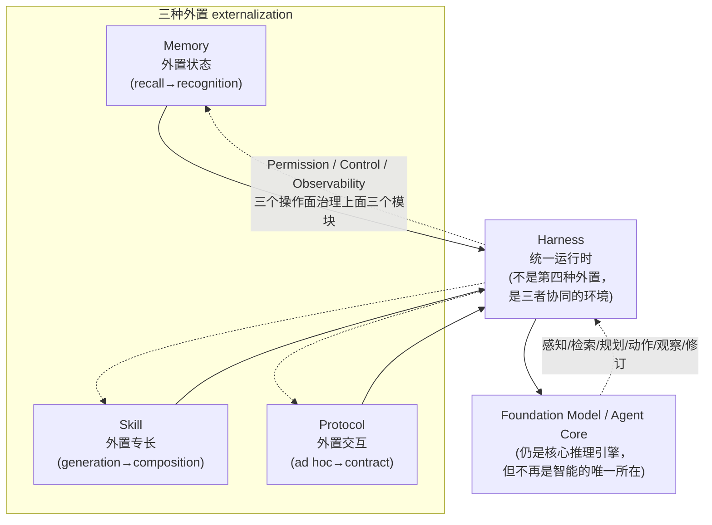
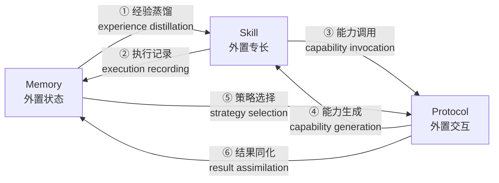

# 外置化（Externalization）：统一审视 LLM Agent 的记忆 / 技能 / 协议 / Harness 工程

> **本篇定位**：这是一篇**综述/框架**论文，不是基准也不是系统。它的价值不在某个数字，而在**一条主线**——
> 它论证：近年 agent 领域里看似各自为政的四股力量（记忆系统、技能系统、协议、harness 工程），
> 其实都是**同一件事**的不同切面：把模型内部本来要"硬扛"的认知负担，**外置**成持久、可检查、可复用的外部结构。
> 按本库标杆范文 [Harness-Bench](2605.27922-harness-bench-measuring-harness-effects.md) 的密度与诚实度来写：
> 公式/分类先给直觉再给定义、数字标 §/Fig 出处、区分宣称 vs 批判、Why 三连、Inspires-Us 打到我们自己 harness 身上。

---

## §1　TL;DR（一页讲清这篇在干嘛）

> 主讲提示：开场先抛"一句话主张"，再说它和全库中心命题 `Agent = Model + Harness` 是什么关系——本文是那条命题的**"为什么"层**。

**一句话**：作者提出一个统一视角——**externalization（外置化）**：LLM agent 近年的可靠性提升，**越来越少地来自改模型权重，越来越多地来自把模型周围的运行时重新组织**（摘要 / §1）。早期系统指望模型"在脑子里"恢复的能力（记住历史、复现流程、推断如何调工具），如今被**外置**到了三类持久结构里——

- **记忆（Memory）= 外置状态（externalized state）**：把"跨时间的连续性"从权重里的回忆，变成持久可检索的存储（§3）。
- **技能（Skills）= 外置专长（externalized expertise）**：把"每次重新发明工作流"变成可加载、可复用的过程性工件（§4）。
- **协议（Protocols）= 外置交互（externalized interaction）**：把"临场猜测如何调用/委派/授权"变成机器可读的契约（§5）。
- 而 **harness 工程 = 把上面三者编排进一个受治理运行时的统一层**（§6）——它**不是第四种外置**，而是这三种外置**赖以协同运转的运行环境**（§3 末原文明确）。

**理论锚点（全篇的"魂"）**：Donald Norman 的**认知工件（cognitive artifacts）**理论（§1 开篇引语）——

> "认知工件不改变人的能力，它们**改变任务**。"（Norman, 1993，§1 题记）

购物清单不扩大你的记忆容量，它把"困难的回忆问题"变成"容易的识别问题"；地图不让导航"更强"，它把隐藏的空间关系变成可见结构。**外部工件的力量在于"表征转换（representational transformation）"**——把问题重排成"用你已有的能力就能更可靠解决"的形式（§1）。本文的核心论点：**这套逻辑现在统治了 LLM agent 最关键的设计决策**——recall 变 recognition、即兴生成变 composition、临时协调变 structured contract（§1 / §9 结论）。

- **属于 harness 的哪一层（Θ1）**：本篇是 **A 组跨层综述**。它不打单一层，而是**给 E/T/C/L/O/V 六层一个统一的"为什么"**：六层之所以存在、之所以在收敛，是因为它们都在做 externalization。§6 的 Figure 7 把 harness 明确拆成 6 维：3 个外置模块（Memory/Skills/Protocols）+ 3 个操作面（Permission/Control/Observability）——正好对应本库的 D（=Context/记忆）、C（=Tools→Skills/Protocols）、F（=Environment/Permission 沙箱）、B（=Loop/Control）、H（=Observability）、G（=Validation）。
- **回扣全库论点（Θ2）**：本文是 `Agent = Model + Harness` 的**"理论解释层"**。Harness-Bench（2605.27922）用 23.8 分极差**实证**了"换 harness 分数大变"；本文回答了**为什么**——因为 harness 承担的是模型本来要内部硬扛的认知负担，外置得好不好直接决定可靠性（§6.4：智能"分布"在模型权重 + 外部记忆 + 技能 + 协议 + 监控 + 运行约束之间）。
- **权威性来源（Θ4 / ΔC）**：上海交大 + CMU + OPPO 等联合，2026-04 预印本（cs.SE）。它的权威性不在实验，而在**框架的统摄力与文献覆盖**——Figure 1 下半幅把约 60+ 代表系统（CoT/RAG/MemGPT/Voyager/MCP/A2A/SWE-Agent/Claude Code…）填进了 Weights→Context→Harness 三层坐标。最接近的概念前身是 CoALA（Sumers et al., 2024），本文相对它的增量见 §15。

**三条带走的结论**：
1. **"agent 进步"的重心在外移**：从改权重（2022）→ 改上下文/提示（2023–24）→ 改 harness 基础设施（2025–26）（Figure 2 的社区主题演化）。问题已从"模型多强"变成"**哪些负担被外置出去、让模型不必再内部解决**"。
2. **externalization 比单独谈记忆/技能/协议更统一**：三者是同一表征转换的三个维度（时间 / 过程 / 交互），且在一个 harness 里**互相耦合**（Figure 8 的六条流）。
3. **代价同样被外置**：外置带来可审计/可复用/可治理，但也带来**认知开销**（检索/解析/协调成本）与**安全攻击面**（记忆投毒、技能注入、协议伪造、Lethal Trifecta）（§8.4）。所以诚实的命题是 **parametric ↔ externalized 是一个"分区问题"，不是零和**（§7.3）。

---

## §2　问题与动机：为什么需要"externalization"这个统一框架（Why·问题层）

> 主讲提示：这一页讲清"现状的叙事缺口"——大家都在各自卷记忆/技能/协议，但没人说清"它们为什么在收敛"。

**Why（问题层）——不解决会卡住什么？**
当代 agent 的进步常被叙述成"一场更大模型、更好训练、更复杂推理链的竞赛"。这些因素重要，但**解释不了实践中观察到的模式**：很多最大的可靠性提升**根本没动底座模型**——它们来自改变模型周围的环境：加持久记忆、组织可复用技能、标准化工具接口、用显式控制逻辑约束执行、给行为加 instrumentation（§1 原文，引 Sumers et al. 2024 / Wang et al. 2024a / Li 2025 / Luo et al. 2025）。

一个**裸 LLM** 面对三类反复出现的失配（§1，直接映射到三个 harness 维度）：
1. **上下文窗口有限且会话记忆易失** → **连续性问题（continuity）** → 记忆外置来解决。
2. **长程多步流程常被"重新推导"而非"一致执行"** → **方差问题（variance）** → 技能外置来解决。
3. **与外部工具/服务/协作者的交互在自由提示下很脆** → **协调问题（coordination）** → 协议外置来解决。

**一个把直觉钉死的例子**（§1）：一个软件工程 agent 要在大仓库里实现 feature、跑测试、开 PR。
- **无外置**：模型必须把仓库结构、项目约定、工作流状态、工具语义全塞进一个脆弱的提示里。
- **有外置**：持久项目记忆供给上下文、可复用技能文档编码约定与工作流、协议化工具接口强制正确 schema、harness 串起步骤 / 校验输出 / 处理失败。**底座模型可以一字未改；变的是"它被要求解决的那个任务的表征"。**

**Why（设计层）——为什么是"externalization"而不是再写一篇组件综述？**
> 朴素做法 A：再写一篇"记忆综述"或"协议综述"（领域已有不少，§1 列了 RAG 综述 Gao 2024、deep search 综述 Qu 2024、agent 架构综述 Wang 2024a、协议互操作综述 Ehtesham 2025c）。→ 问题：**只见树木**，无法解释这些独立发展的生态**为何在收敛**、收敛**重塑了 agent 的定义**。
> 朴素做法 B：把 agent 进步归约到某一个具体框架（如"就是 ReAct + RAG"）。→ 会**以偏概全**，丢掉系统级耦合。
> 本文改用 externalization 作为**transition logic（转移逻辑）**：它是"解释每一次架构跃迁为什么发生、它想保住什么可靠性"的**机制**（§1 中段原文："Our central thesis is that externalization … is the transition logic"）。这比单独谈任何一个模块都更统一——见 §11 的 Why 三连。

> **读出什么**：本文的野心是给整个领域提供**一副坐标系**，而非又一个组件清单。它把"agent = 一个会推理的核 + 一圈外部认知基础设施"这件事**讲成了认知科学意义上的必然**，而不仅是工程便利。

---

## §3　核心主张形式化：externalization 是"表征转换"（一句话 + 假设）

> 主讲提示：把全篇压成一句可证伪的主张，并标出它的边界（作者刻意只取认知工件理论的"务实版"，不背它的强本体论）。

**主张（§1 / §9）**：可靠的 agency **越来越多地依赖于把选定的认知负担从模型内部重定位到显式基础设施**，使**内部能力与外部基础设施共同覆盖任务所需的全部能力集**（§1，引 Norman 1991 + Sumers 2024）。

**三条表征转换（§2.4，全篇的"等式"）**：

| 维度 | 外置前（模型内硬扛） | 外置后（外部结构） | Norman 式转换 |
|---|---|---|---|
| **时间 / 状态**（记忆） | 从权重里**回忆**历史 | 从持久存储里**识别/检索**已被surfaced的切片 | recall → recognition |
| **过程 / 专长**（技能） | 每次**即兴生成**工作流 | 从预验证组件**组合**行为 | improvised generation → composition |
| **交互 / 协调**（协议） | 临场**推断**接口语法/合法性 | 填**结构化契约**的 typed 字段 | ad hoc coordination → structured contract |

**关键假设与边界（Θ5 诚实，§1 末）**：作者明确**只取认知工件 / 扩展认知（Clark & Chalmers 1998）传统的"务实核心"**——"agent 与 environment 的边界是一个有真实性能后果的**设计选择**"——而**不背其更强的本体论主张**（不声称 agent"真的"把心智延伸到了外部）。本文的立场是务实的：**externalization 是一个设计原则，其价值由所得系统的可靠性、可组合性、可治理性来衡量**（§1 末原文）。

> **读出什么**：这是一篇**有判断力的综述**——它没把认知科学当噱头堆砌，而是只借"表征转换"这一个可操作的内核，并主动声明不背强主张。这正是 v1 规范说的"区分宣称 vs 批判"的高级形态：**对自己借用的理论也保持克制**。

---

## §4　方法总览（big picture）：一图流 + 两条平行的"外置化弧"

> 主讲提示：这页讲 Figure 1 与 Figure 3 两张总图。先讲"人类文明史也是一部外置史"的类比，再落到 agent 架构。

**Figure 1（全篇组织原则图）——两条平行的外置弧**：
- **上幅（人类认知外置弧）**：思想 →（口语：把私有思想变可共享符号）语言 →（书写：把知识从脆弱生物记忆搬进持久物质记录）文字 →（印刷：社会尺度机械复制）印刷 →（数字计算：可编程的算术与符号操作）计算。**贯穿所有跃迁的关键不是"人变弱了"，而是工件把认知系统重组、把选定负担外移、释放有限内部资源给规划/抽象/创造**（§1，引 Norman 1993）。
- **中幅（LLM agent 外置弧）**：Weights →【Memory & Skill & Protocol 三个外置维度】→ Harness（统一它们）→ **Externalized Agency（外置的能动性）**。
- **下幅（文献景观）**：把代表作填进 **Weights / Context / Harness** 三个能力层（见 §5 的复刻表）。

> **递归主张（Figure 1 图注原文）**：两条弧并置编码了一个**递归命题**——LLM agent **本身就是"最新一次人类大外置（数字计算）内部的工件"**，却又**沿着同样的表征维度，把自己的认知负担再向外置**，以获得可靠 agency。

**Figure 3（被 harness 化的 agent 架构图）**：**Harness 居中**；三个外置维度——Memory（working context / semantic knowledge / episodic experience / personalized memory）、Skills（operational procedures / decision heuristics / normative constraints）、Protocols（agent-user / agent-agent / agent-tools）——**环绕它**；操作元件（sandboxing / observability / compression / evaluator / approval loop / sub-agent orchestration）**居中介**于 harness 核与外置模块之间。

> **读出什么**：这张架构图本身就是论文最强的"表达式"——**模型从"智能的唯一所在"降格为"运行在 harness 内部的核心推理引擎"**（§6.1 原文："a model operating inside a harness, rather than a model with peripheral capabilities attached"）。能动性不在模型里，**而在模型与组织其认知成动作的环境的耦合中**。

---

## §5　文献景观复刻：三层 × 代表作（Figure 1 下幅 / Figure 2）

> 主讲提示：这页把 Figure 1 下半幅与 Figure 2 的时间轴落成一张可讲的表——它是全库 60+ 篇论文的"地图索引"。

**Figure 2（社区主题演化，2022→2026）**：能力的"重心"逐年外移——

| 年份 | 重心层 | 代表主题 |
|---|---|---|
| 2022 | **Weights** | Pretraining / Scaling Law / RLHF / Fine-tuning / Instruction-following |
| 2023 | **Context** | Prompting / CoT / Few-shot / Knowledge Injection / RAG / Long Context |
| 2024 | Context→Harness | Context Engineering / Memory / Function Calling / 早期多 agent |
| 2025 | **Harness** | Tool Ecosystems / MCP / Workflow Graphs / Orchestration |
| 2026 | **Harness** | Agent Infrastructure / Protocols（A2A）/ Skills / Security |

**Figure 1 下幅（代表作填进三层，节选）**：
- **Weights 层**：PaLM / InstructGPT / RLHF / Constitutional AI / ROME / MEMIT / GPT·Llama·Claude·Gemini·Qwen·DeepSeek。
- **Context 层**：CoT / Zero-shot CoT / Self-Consistency / RAG / Self-Refine / RETRO / IC-RALM；记忆线 Mem-α / Mem-R1 / GraphRAG / MemGPT / Mem0 / UMEM / InfiAgent / A-MEM / Mirix / Memento / MemoryBank / Lost-in-the-Middle / Memory OS / MemEvolve / MemorySharing。
- **Harness 层**：工具/技能/协议线 Toolformer / Function Calling / Gorilla / ToolLLM / ToolNet / ToolScope / AutoTool / Voyager / ToolUniverse / MCP / SWE-Exp / SWE-Agent / OpenEarth Agent / OS-Copilot；技能/协议/编排线 COALA / LangGraph / CrewAI / Agent Skills / SkillOrchestra / SOP-Bench / A2A / ACP / PolySkill / MemSkill / Skillweaver / CUA-Skill / SkillFlow / SkillsBench / Safety Case Construction / Programmatic Skills。

> **读出什么**：这张表是**本库的"总目录"**——读完本文，再看 C 组（工具/ACI）、D 组（上下文/记忆）、E 组（编码系统）、G 组（评测）的任何一篇，都能立刻定位它在"Weights→Context→Harness"弧上的坐标，以及它属于哪一种外置（状态 / 专长 / 交互）。

---

## §6　外置维度一：记忆 = 外置状态（§3）

> 主讲提示：记忆这一章回答三个递进问题——外置了什么内容、用什么架构外置、harness 时代对记忆有什么新要求。先内容，再架构，最后升华。

### 6.1　外置了什么内容：四类状态（§3.1）

记忆的本质是**把 agent 的"跨时间状态"与"瞬时上下文"解耦**。作者借人类记忆经典分类，给 agent 定义四维外置状态（§3.1，对应 Figure 4 左侧）：

| 类型 | 内容 | 代表系统 |
|---|---|---|
| **工作上下文 working context** | 当前任务的活跃中间态：打开的文件、临时变量、活跃假设、部分计划、执行检查点 | OpenHands / SWE 类（§3.1） |
| **情景经验 episodic experience** | 过往运行里发生了什么：决策点、工具调用、失败、结果、反思 | Reflexion（存反思摘要为可复用经验）/ AriGraph（§3.1） |
| **语义知识 semantic knowledge** | 跨情景的抽象：领域事实、通用启发式、项目约定、稳定世界知识 | 知识库 / RAG corpora（§3.1） |
| **个性化记忆 personalized memory** | 关于特定用户/团队/环境的稳定信息：偏好、习惯、反复出现的约束 | IFRAgent / VARS（跨会话偏好卡）（§3.1） |

> **Why（设计层）——为什么要把这四类分开存？**
> 朴素做法：一个统一数据库，所有记忆同等对待。→ 失败：四类的**保留策略、检索路径、隐私规则各不相同**——working context 变化快、过期即弃；personalized memory 必须与 general task knowledge 隔离，否则会"用错用户画像污染任务推理"（§3.1 原文）。本文的分层让 harness **对不同存储区别对待**，因为每一类改变的是"模型本来要内部恢复的不同那一部分"。

### 6.2　用什么架构外置：四代架构（§3.2，遵循 Du 2026a 分类）

**直觉**：架构演化的主线**不是"存得更多"，而是"对'写什么/提升什么/检索什么/压缩什么/遗忘什么'有越来越显式的策略"**（§3.2 原文）。

1. **单体上下文 Monolithic Context**：全部历史（或其摘要）直接留在提示里。透明易原型，但容量差、摘要漂移、**状态随会话消失**（§3.2.1）。
2. **上下文 + 检索存储 Context with Retrieval Storage**：近期工作态留上下文、长程轨迹外置按需检索。这是生产 copilot 的主流。**它把"原始容量问题"换成了"检索质量问题"**——检索错了，模型被干扰；漏检了，就像从没记住（§3.2.2）。改进：GraphRAG（加图结构+社区级检索）、ENGRAM（压成 latent state）、SYNAPSE（统一情景-语义图上的 spreading activation）。
3. **分层记忆与编排 Hierarchical Memory and Orchestration**：把记忆当**有显式生命周期**（extraction / consolidation / forgetting）来管，而非被动存储。两条支路（§3.2.3）：
   - **时空维资源解耦**：借操作系统思路，热工作态 vs 冷长尾分层、跨层 swap（MemGPT / MemoryOS）。
   - **认知功能维语义解耦**：按功能/内容类型路由（MemoryBank 分事件/画像/世界知识、MIRIX、MemOS 分显式/隐式、xMemory 建主题-事件层级）。
4. **自适应记忆系统 Adaptive Memory Systems**：让模块/路由/检索策略**对经验自适应**（§3.2.4）——动态模块（MemEvolve 把生命周期拆成可独立演化的 encode/store/retrieve/manage 子模块；MemVerse 短期 cache + 周期蒸馏）+ 反馈式策略优化（MemRL 用 RL 更新检索策略；GAM 多轮精炼检索条件）。

> **读出什么（核心抽象）**：四代架构的总转移是 **"storage → control"（从存储到控制）**——单体解决"存在"、检索解决"容量"、分层解决"组织"、自适应开始解决"策略"。**记忆因此不再是提示的被动附录，而成了 harness 控制面的一部分：它决定"模型能有效作用于过去的哪一部分"**（§3.2 末原文）。

### 6.3　harness 时代的记忆新要求 + 记忆作为认知工件（§3.3–3.4）

- **新要求（§3.3）**：harness 时代记忆不再是孤立存储模块，而是**运行时协调连续性/复用/治理的基底**。InfiAgent 提出**file-centric state abstraction**：文件系统作为任务状态的**唯一权威记录**，从高层规划到中间变量到工具输出全部实时写入；每个决策步，agent **不再读冗长历史，而是读一份"工作区当前状态的策展快照 + 少量近期动作"**（§3.3 原文）——这是记忆核心表征角色的 harness 级表达。
- **认知工件升华（§3.4）**：记忆把一个**内部回忆问题**转成**外部识别-检索问题**（Norman 1991）。**关键推论：检索质量 > 原始存储容量**——一个海量存储但弱检索的系统，仍在用"错误的问题表征"喂模型；成功判据是"我们有没有让**当前决策可被识别（legible）**"，而非"我们存了多少"（§3.4 原文）。这也解释了常见失败：**stale memory（过时）/ over-abstracted（丢操作细节）/ under-abstracted（噪声淹没）/ poisoned（错误前提污染）——都是"表征设计"失败，不是"存太多/太少"**（§3.4）。

> **读出什么**：记忆这一章的最高抽象——**"把对的历史，在对的时刻，变得可识别（make the right history legible at the right moment）"**，让模型固定的推理容量花在推理而非记忆上（§3.4 末原文）。这一句可直接做我们记忆文件策略的设计准则（见 Inspires-Us）。

---

## §7　外置维度二：技能 = 外置专长（§4）

> 主讲提示：技能这一章最容易和"工具调用"混淆，主讲第一件事就是把它们分开——工具暴露"操作"，技能编码"一类任务该怎么用这些操作做"。

### 7.1　外置了什么：过程性专长的三要素（§4.1）

技能外置的是**过程性专长（procedural expertise）**——"在反复出现的假设和约束下，可重复地完成一类任务的方式"，而**不是**"模型能做某事"这种模糊宣称（§4.1）。它有三个耦合要素：

| 要素 | 是什么 | 它治什么病 |
|---|---|---|
| **操作流程 operational procedure** | 任务骨架：复杂工作的步骤/阶段/依赖/停止条件分解 | 治"过程级不稳定"——跳步、乱序、过早终止（许多错误**不在动作层无能，而在过程层不稳**，§4.1.1） |
| **决策启发式 decision heuristics** | 分支处的规则：先试什么、何时回退、什么证据算够、偏好哪种权衡 | 治"每个分叉都重新探索"——把已验证的默认/升级/偏好外置，降低 deliberation 成本、稳住行为（§4.1.2） |
| **规范约束 normative constraints** | 一个流程算"可接受"的条件：测试要求、范围限制、访问限制、可追溯期望、领域规则 | 把约束从"事后评判标准"变成"技能内部的前置条件/禁止分支/中间验证"——**让技能同时是 capability 与 governance 的载体**（§4.1.3） |

### 7.2　技能在能力栈中的位置：三阶段抽象跃迁（§4.2）

技能**下游于**两个更早的发展，第三阶段才真正出现"技能"：
- **阶段1 原子执行原语**：可靠的动作调用 / function calling（Toolformer）。**单位是 action primitive，不是 skill**（§4.2.1）。
- **阶段2 大规模原语选择**：工具多到要"选"（Gorilla / ToolLLM / ToolNet / ToolScope / AutoTool）。**单位仍是 tool，不是 procedure**——完成一类任务的 know-how 仍隐含在提示/参数里（§4.2.2）。
- **阶段3 技能即打包专长**：核心问题从"能不能调一个 API"变成"**能不能把完成一类任务所需的 know-how 打包成可复用能力单元**"。**单位不再是孤立工具调用，而是以可复用过程性指导与执行结构为中心的高层工件**（§4.2.3，引 Wang 2025c 程序化技能归纳 / Zheng 2025a web 轨迹蒸馏成技能库 / Chen 2026b computer-use 的参数化执行与组合图 / Ye 2025 SOP-guided）。

> **读出什么**：阶段3的转换是**表征性的而非操作性的**——能力不再主要被当作"对工具/API 的访问"，而被当作"可加载、可复用、可组合的过程性知识"（§4.2.3 末）。这正是"externalization 比谈工具更深一层"的关键证据。

### 7.3　怎么外置：规范→发现→渐进披露→执行绑定→组合（§4.3）

技能外置必须同时有**表征层**（怎么描述/界定）和**运行时层**（能否真作为可复用能力运转）。五个环节（§4.3）：

1. **规范 Specification（§4.3.1）**：`SKILL.md` / 指令文件 / manifest。一份好规范至少覆盖五类信息：**能力边界、适用范围、前置条件、执行约束、示例+反例**。它"更像 API 文档而非 API 实现"——把过程性专长从不透明内部状态变成可检查/讨论/修订/治理的显式对象。
2. **发现 Discovery（§4.3.2）**：agent 不能为每个任务无差别加载所有技能 → 需注册/发现机制（本地库/组织注册表/平台市场）。关键："不是问哪个工具能调，而是问**哪个过程性专长单元适配当前问题**"——按语义+任务复杂度+环境假设+操作约束+风险条件检索（引 Ross 2025）。
3. **渐进披露 Progressive Disclosure（§4.3.3）**：**长上下文不可靠地转化为更好性能**，详细指令塞满反成噪声 → **先暴露技能"存在"（名+简述），需要时才加载深层细节**（manifest 级 → 完整 guide 级）。**它把"是否需要更多技能细节"本身变成一个运行时决策**——作者点名这在 **Claude Code 的技能系统**里尤为明显（§4.3.3 引 Anthropic 2025）。
4. **执行绑定 Execution Binding（§4.3.4）**：技能本身**不是动作执行器**，必须绑定到工具/文件/API/子代理/协议端点。**正是在绑定这一点，技能、工具、协议三者的区别才清晰**：工具提供可执行操作；协议规定操作如何被描述与调用；技能提供"把它们组合成可重复任务完成"的高层策略。schema 接口（如 MCP）支撑这层绑定，使能力可发现可调用而不把技能塌缩成工具或协议本身。
5. **组合 Composition（§4.3.5）**：技能可被**组合**（串行/并行/条件路由/递归调子技能）——技能因此是"agent 架构里的可调度运行时单元"，而非一份静态指令文件。**组合是更高阶的过程性专长复用本身**（一个"数据分析报告"技能可以由 cleaning/analysis/visualization/synthesis 等小技能协调组成）。这标志技能成为**真正的能力层**，而非孤立配方集合。

### 7.4　技能的获取/演化 与 四类边界条件（§4.4–4.5）

**获取四路径（§4.4，对应 Figure 5 左侧）**：**Authored（人写 SKILL.md/SOP）→ Distilled（从历史轨迹/情景记忆蒸馏，如 Skill Set Optimization、MemSkill）→ Discovered（环境交互自主发现，如 Voyager；PolySkill 分离抽象目标与具体实现以促复用）→ Composed（从已有技能组合出新技能，逐渐形成层级化技能库）**。技能系统的成熟度"不看存了多少指令，而看它把经验转成可复用外置专长的效率"。

**四类边界条件（§4.5，对应 Figure 5 的⚠标注）——技能不是写下来就稳的自足模块**：

| 边界条件 | 风险 | 证据 |
|---|---|---|
| **语义对齐 semantic alignment** | 模型照字面执行技能，却错过任务真实目标 | SkillProbe 把"语义-行为不一致"识别为现有技能市场的根本缺陷（Guo 2026） |
| **可移植性与陈旧 portability & staleness** | 网站/API/依赖/约定变化使曾经有效的技能部分误导甚至完全过时 | SkillsBench 显示技能效用**跨域、跨 model-agent 配置差异巨大**（Li 2026c）→ 可移植性是**条件性经验属性**，非外置的固有特征 |
| **不安全组合 unsafe composition** | 单独无害的技能组合起来可能不安全（长指令+脚本+外部依赖）；技能文件本身可成 prompt-injection 面 | 大规模实证报告公共技能生态有**可观的漏洞率**（prompt injection / 数据外泄 / 供应链）（Liu 2026；Wang 2026c）→ **技能组合应被当作安全敏感过程** |
| **上下文相关退化 context-dependent degradation** | 即使技能文件已更新，agent 仍因残留会话上下文/缓存摘要/强化过的动作模式继续走旧逻辑；过多过程细节又会让模型"照做却丢失真实成功条件" | 多轮漂移/长程可靠性/长上下文推理研究支持其为现实边界（Lee 2026）→ 技能加载不只是检索问题，**也是上下文分配与执行稳定问题** |

### 7.5　技能在 harness 里 + 技能作为认知工件（§4.6–4.7）

- **harness 里的四个耦合（§4.6）**：①**conditioning on memory**（按检索状态选技能/定参；否则退化成关键词匹配）；②**binding through protocols**（落地到 tool schema / 子代理委派契约 / 文件操作 / 审批流）；③**runtime governance**（敏感操作前权限检查、高风险审批门、审计哪个技能被加载、失败回滚）；④**lifecycle feedback**（执行→成功率/失败模式/用户纠正写回，触发技能修订/弃用/晋升新候选）。
- **认知工件升华（§4.7）**：技能把"不稳定的潜在过程性回忆"变成"识别可用指导并据其行动"的更稳过程（Norman 1993 + Kirsh 1995 互补策略）。模型推理时的负担从"概率性地重建一个合适做法"变成"解释当前情境、识别技能是否适用、遵循指导、处理局部异常"——**过程性知识不再需要每次从零重建，它成了环境里可直接操作的对象**（§4.7 原文）。

> **读出什么**：技能这一章对我们最直接——**Claude Code 的 SKILL.md + 渐进披露被原文两次点名为标杆**（§4.3.3、§4.4）。这意味着本文在描述技能外置时，描述的**就是我们自己 harness 的机制**（见 Inspires-Us）。

---

## §8　外置维度三：协议 = 外置交互（§5）

> 主讲提示：协议这一章讲"如何把'临场猜接口'变成'填契约'"。先讲它外置了哪四样东西，再按"和谁交互"survey 协议族，最后讲它在 harness 里的三个面。

### 8.1　外置了什么：交互的四个维度（§5）

协议外置的是**"agent 与外部实体交换信息和动作所遵循的契约"**——表征转换是**从自由式沟通推断 → 结构化交换**（fill typed fields / follow declared state transition / receive structured feedback，§5）。四个维度（§5）：

1. **调用语法 invocation grammar**：每个工具调用/API 请求/委派消息的格式（参数名/类型/顺序/返回结构）→ 外置成 schema 和 typed 接口，模型"填字段"而非"猜语法"。
2. **生命周期语义 lifecycle semantics**：谁下一个动作、允许哪些状态转移、何时算完成/失败 → 外置成显式状态机或事件流。
3. **权限与信任边界 permission & trust boundaries**：谁被授权、数据可流向哪、必须产出什么证据 → 外置成 runtime 可强制的可检查规则，而非靠模型自律。
4. **发现元数据 discovery metadata**：有哪些能力、如何触达 → 外置成 registries / capability cards / schema endpoints，用可查询元数据替代提示内嵌的隐含知识。

### 8.2　协议族 survey：按"和谁交互"分类（§5.2，对应 Figure 6）

| 协议族 | 代表 | 外置的核心 |
|---|---|---|
| **Agent-Tool** | **MCP**（最清晰代表，JSON-RPC 2.0；server 暴露 tools/context，client 发现+调用）；ToolUniverse | 调用语法 → 工具访问从"逐接口工程"变"基于协议的集成"（动态能力发现、标准化访问、模块化扩展） |
| **Agent-Agent** | **A2A**（Agent Cards 能力发现 + 任务导向通信 + 状态更新/协商/流式进度）；ACP（轻量 REST/HTTP）；ANP（互联网尺度互操作、去中心身份、跨域发现） | 委派 → 让"调用方可发现对方提供什么、在已知契约下交接、不靠硬编码假设追踪执行" |
| **Agent-User** | **A2UI**（界面生成分支：受约束声明式 UI，host 安全渲染）；**AG-UI**（流式状态分支：run start / text emission / tool call args/results / completion / error 的 typed 事件流） | 呈现与状态流 → 把界面构造当"受治理输出"而非任意 HTML-like 文本 |
| **Other（垂直域）** | UCP（agentic commerce：catalog/requests/checkout）；AP2（payments：授权/签名/可审计，IntentMandate / PaymentMandate / PaymentReceipt） | 工作流特定治理 → 编码"谁被授权、必须产出什么证据、责任如何追踪" |

> **演化弧（Figure 6 上幅）**：Isolated Model Calls → API Hardcoding → **Standardized Protocols**（统一交互/任务分配/工具集成/安全访问）→ **Agentic Web**（去中心、网络化）。下幅：harness 通过 **Interact / Perceive / Collaborate** 三个功能面落地外置交互管理。

### 8.3　协议在 harness 里 + 协议作为认知工件（§5.3–5.4）

- **harness 三个协议面（§5.3）**：①**Intent Capture & Normalization**（把模型自由文本提案映射成 protocol 对象，对照上下文+权限边界校验，不满足契约则拒绝/修订——**把脆弱的交互从潜在推断挪到可检查接口**）；②**Capability Discovery & Tool Description**（会话起点/阶段转换时暴露当前可用工具及其 I/O schema——减少上下文膨胀+让能力边界可治理）；③**Session & Lifecycle Management**（把一次执行当带命名状态+转移规则的 lifecycle 对象；写入持久存储时即成 memory——**协议维护"交互的连续性"，记忆维护"跨时间的连续性"**，§5.3.3 原文点出二者分工）。
- **认知工件升华（§5.4）**：协议是**"agent 系统里最强形式的外置之一"**——因为它**把整类推理从关键路径上移除**（§5.4 原文）。它和记忆（时间状态）、技能（过程专长）操作在不同维度：**不管"记什么/怎么做"，而管"如何沟通与协调"**。Kirsh 互补策略：模型贡献 judgment 与 intent，协议面贡献 format / validation / lifecycle control——二者都不充分，合起来产生"既灵活又有纪律"的交互。

> **读出什么**：协议章最锋利的一句——**"协议不是'真正智能核心'周围的次要管线，它们是交互的认知工件，是让其它外置智能得以运转的表征基础设施"**（§5.4 末）。MCP / A2A 在我们眼里是工程标准，在本文框架里是**Norman 意义上改变任务的认知工件**。

---

## §9　统一层：Harness 工程 = 六维认知环境（§6）

> 主讲提示：这是全篇的"收口页"。讲清 Figure 7 的六维结构，并强调一个关键判断：harness 不是工具调用的换皮，而是"构造让外置模块协同的认知与操作环境"的更广学科。

### 9.1　什么是 harness（§6.1）：能动性在"耦合"里

逐模块外置能**改善局部能力**，但 agenthood 要求**全局协调**——记忆累积经验却不指明"哪些 trace 对当前任务 salient"；技能封装有效套路却不自动决定"何时/在什么策略下调用"；协议规整调用格式却不决定"何时/在什么 policy 下该调某工具"。**缺的是一个把感知/记忆访问/动作选择/执行/监控/修订协调进单一操作 envelope 的原则性结构**——这就是 harness（§6.1）。

> **核心判断（§6.1 原文）**：一个实用 agent **更应被理解为"运行在 harness 内部的模型"，而非"挂了一圈外设的模型"**。能动性不在模型单独，而在**模型与"把其认知组织成动作"的环境的耦合**中。

### 9.2　六个分析维度（§6.2，对应 Figure 7）

**Figure 7（harness 作为认知环境）**：Foundation Model 居中；**3 个外置模块**（已在 §3–5 分析）+ **3 个操作面**形成协调环——

| 维度 | 类别 | 它治什么 |
|---|---|---|
| **Memory** | 外置模块 | state persistence / failure recording / cross-session context |
| **Skills** | 外置模块 | reusable routines / staged loading / failure-driven revision |
| **Protocols** | 外置模块 | deterministic interfaces / structured invocation / schema contracts |
| **① Agent Loop & Control Flow（§6.2.1）** | 操作面=B 层 | perceive-retrieve-plan-act-observe 循环 + **终止/递归/资源治理**（max step、recursion depth、per-step cost ceiling、timeout）——**这些不是次要安全措施，而是定义"模型推理在其中展开的操作 envelope"**；单循环 / 分层 / 多 agent 三种 loop 结构 |
| **② Sandboxing & Execution Isolation（§6.2.2）** | 操作面=F 层 | 受控执行边界。**Codex 式**：每任务独立云沙箱（文件快照+网络限制+资源配额）；**Claude Code 式**：graduated permission modes（从全自治到"每个工具调用都要用户批准"，同一 agent 按任务/操作者风险容忍度在不同信任级运行，Anthropic 2026）。**沙箱是认知边界（移除无关状态、限制危险动作、让工作区可检查），不只是安全围栏** |
| **③ Human Oversight & Approval Gates（§6.2.3）** | 操作面=B/H 层 | pre-execution approval / post-execution review / escalation triggers；**Hook 系统**把任意逻辑（脚本/校验/通知）挂到生命周期事件（工具调用、文件写、子代理 spawn）。**自治度不是 agent 的二元属性，而是 harness 的可配置参数**（按任务/工具/组织策略可调） |
| **④ Observability & Structured Feedback（§6.2.4）** | 操作面=H 层 | 结构化日志（每次模型调用/工具调用/记忆读写/决策分支）+ 执行 trace（动作→因果前因）+ 聚合指标（步数/token/错误率/延迟）。**双重用途**：对外支持调试/合规审计/事后分析；对内闭合反馈环（失败工具调用触发记忆写、反复失败标记技能待修订、延迟尖峰让 harness 切协议路径）——**没有结构化反馈，harness 只是静态脚手架而非自适应系统** |
| **⑤ Configuration, Permissions & Policy Encoding（§6.2.5）** | 操作面=G/F 层 | 把 policy 与 execution logic 分离、可版本化可审计。**分层 scope**：user 级（个人偏好/信任边界）/ project 级（可用工具/可访问路径/需批准命令）/ org 级（合规约束/成本上限/数据规则，项目不可覆盖）。**权限即外置治理**：本该塞进提示或事后过滤的约束，改成 harness 运行时强制的声明式规则 |
| **⑥ Context Budget Management（§6.2.6）** | 操作面=D 层 | 上下文窗口是**最稀缺共享资源**——记忆检索/技能加载/协议 schema/模型自身推理 trace **争抢同一 token 预算**。策略：summarization + priority-based eviction + staged loading。**这是动态资源分配问题，最优分配取决于当前执行阶段**（早期规划阶段要更多记忆少技能细节，晚期执行阶段反之） |

> **关键观察（§6.3 原文）**：OpenAI Codex 与 Anthropic Claude Code 在产品形态/实现血统/目标工作流上差异巨大，却**收敛到一套惊人相似的 harness 结构**。这种收敛**有分析意义**——它表明这六维不是偶然实现选择，而是**外置化能动性的结构性要求**。

### 9.3　harness 作为认知环境（§6.4）：三位认知科学家的合唱

> 主讲提示：这页是判断力高地——它把 harness 从"基础设施"升格为"认知环境"，并请出三位理论家。

- **Norman（认知工件，1993）**：harness 是**系统尺度的认知工件**——它不只给模型加更多上下文/工具，而是**重组模型面对的表征问题**。通过外置记忆、形式化流程、引入显式控制点、约束执行，harness 把无界任务转成"受引导动作的结构化环境"。模型"表观智能"提升，**不是因为它有了更多资源，而是因为认知工作负荷被重分布到了模型之外的工件/表征/流程上**（§6.4 原文）。
- **Kirsh（智能地利用空间，1995）**：认知由"环境如何被布置"塑造；空间/表征组织能 offload 搜索、简化选择、降低内部计算负担。harness 是 agent 的**cognitive niche（认知生态位）**——defaults / hooks / file boundaries / skill invocation patterns / review gates 都是**收窄"可行动作空间"的结构化规律**，使**期望行为更易产生、不期望行为更难产生**。能动性部分是**生态成就（ecological achievement）**。
- **Hutchins（分布式认知，1995）**：拒绝"认知只在个体心智里"的观点。一个装备了 harness 的 agent 系统，其**操作智能分布在**模型参数 + 外部记忆 + 可执行技能 + 协议定义 + 工具面 + 监控系统 + 治理其交互的运行时约束**之间**。**harness 是这个分布式系统得以运转的介质**。

> **读出什么（§6.4 末原文）**：所以更准确的说法是——**harness 是一个"认知环境"，而非仅仅一个"基础设施层"。基础设施只是它的一个表现；它更深的功能是"环境结构化（environmental structuring）"——设计认知在其中展开的条件。** 这正是 `Agent = Model + Harness` 这个等式背后的认知科学依据。

---

## §10　跨切分析：三模块如何在 harness 里互相耦合（§7）

> 主讲提示：前面三章把记忆/技能/协议分开讲，这一章讲"系统级耦合"——Figure 8 的六条流，外加三条只在系统级才浮现的动力学。

### 10.1　六条两两耦合流（§7.1，对应 Figure 8）

| 流 | 机制 | 关键洞察 |
|---|---|---|
| **① Memory→Skill 经验蒸馏** | 重复轨迹蒸馏成可复用过程（TED / UMEM / Voyager 终身学习保留可复用代码级技能） | **蒸馏质量（哪些轨迹可泛化 vs 情景化）决定整个技能层下游可靠性**：太激进→把上下文相关行为固化成技能；太保守→无法capitalize经验 |
| **② Skill→Memory 执行记录** | 每次技能执行的 trace/失败/精炼被 observability 捕获为持久证据 | **让技能层自我纠正而非只自我膨胀**——没有这条记录，从①蒸馏出的技能基于越来越陈旧的证据 |
| **③ Skill→Protocol 能力调用** | 技能跨"抽象过程→受治理动作"边界，靠协议把高层 intent 翻译成 typed call | **OpenClaw 的"Lethal Trifecta"**（敏感数据访问 + 不受约束外部通信 + 未验证执行）说明：**即使技能本身正确，不受约束的执行仍是安全问题**→协议级验证是独立于技能正确性的边界检查（McKerchar 2026） |
| **④ Protocol→Skill 能力生成** | 接口一旦标准化，就更易把"用它的最佳实践"打包成技能（OpenAPI/MCP 提供足够结构规律；HashiCorp Agent Skills 把基础设施管理过程外置成可移植技能文件） | **非对称性**：协议标准化不消耗技能，反而**扩大"可写新技能的表面"**——每个稳定接口是一族可复用过程的种子 |
| **⑤ Memory→Protocol 策略选择** | 历史成功率/用户偏好/过往失败决定路由：本地执行 vs MCP 工具 vs A2A 远程委派 | **记忆把协议选择从静态配置变成经验知情的路由决策**——某工具对某类任务屡败，路由逻辑学会偏好替代路径 |
| **⑥ Protocol→Memory 结果同化** | 每次协议交互产生的状态（工具输出/审批事件/错误payload/委派结果）须被 normalize 进记忆 | **闭合循环**：没有可靠结果同化，记忆与真实交互历史脱节，①蒸馏与⑤路由都建在不可靠前提上 |

### 10.2　三条系统级动力学（§7.1 末）——只在系统级浮现

1. **自强化循环（self-reinforcing）**：更好记忆→更好技能蒸馏→更丰富执行 trace→更好记忆…正反馈既加速能力增长，**也放大错误**——一条投毒记忆→一个有缺陷技能→其执行 trace 进一步污染记忆，**这种级联是任何单模块质量控制都拦不住的，必须 harness 级干预**。
2. **资源竞争（同一稀缺上下文）**：记忆检索/技能加载/协议 schema 抢同一 token 预算，扩一个必压另一个 → harness 须管理**相对预算分配**（§6.2.6）。
3. **不同时间尺度（timescale）**：协议交互通常同步且快；技能加载在任务/子任务边界；记忆蒸馏与技能演化跨会话或更久。**只为某一尺度（如快速工具执行）优化的 harness 会忽视决定长期能力增长的慢循环**——好 harness 要平衡"快循环响应性"与"慢循环连贯性"。

### 10.3　模型边界视角 + parametric vs externalized 权衡空间（§7.2–7.3）

**模型 I/O 三分（§7.2，一个非常实用的失败归因法）**：
- **Memory = 上下文输入（contextual input）** → 失败表现为**输入选择错误**：模型推理正确但**喂错了上下文**。
- **Skills = 指令输入（instructional input）** → 失败表现为**过程指导错误**：模型忠实照做但**指令本身有缺陷/不匹配**。
- **Protocols = 动作 schema（action schema）** → 失败表现为**动作-schema 错误**：模型 intent 健全但**输出违反接口契约**。

> **读出什么**：这个三分**让失败类可分离、可独立调试归因**——记忆检索可改进而不动技能、技能可更新而不动协议 schema、协议面可扩展而不改记忆策略。这是外置化在"模型边界"上的最大实用收益：**把单一文本 buffer 拆成有不同更新率/治理需求/失败模式的分层**（§7.2 末）。

**parametric ↔ externalized 权衡空间（§7.3，四条判据）**：

| 判据 | 倾向外置 | 倾向留在权重 |
|---|---|---|
| **更新频率/时间衰减** | 快变知识/API/组织结构/live 环境态（外置可即时更新+保 provenance/版本，不必重训冒灾难性遗忘） | 稳定背景能力（语言理解/广义推理/常识）衰减慢，更适合参数化（快检索+深整合） |
| **复用性/多 agent 可移植** | 跨任务/用户/agent 反复需要的能力（显式技能/脚本/接口工件可共享/版本化/复用；一个技能可广播给整个 swarm） | 一次性/高度特异行为不值得外置的打包维护开销 |
| **可审计/治理/对齐** | 高风险部署（symbolic 接口支持 circuit breaker / schema 校验 / 可追溯执行记录；外置约束在接口层**确定性强制** vs RLHF 只是概率性塑形） | （低风险、无需审计时外置纯属开销） |
| **延迟/简洁/上下文负担** | （需持久/复用/控制时外置划算） | 超快/低方差/纯语义任务——让模型靠内部参数知识**更简单也常更可靠**（检索/路由/解析/工具调用都加延迟，过量上下文还触发"lost in the middle"） |

> **核心结论（§7.3 末原文）**：**这不是"模型智能 vs 基础设施智能"的零和竞赛，而是一个"系统分区问题（systems-partitioning problem）"**——强 harness 外置那些受益于持久/复用/控制的负担，把稳定/快/通用的能力留在模型里。**最优分区不是静态的**：模型变强会把能力拉回内部，harness 变成熟会把边界推向外部（§8.1 双向前沿）。

---

## §11　★ Why 三连：为什么"externalization"比单独谈记忆/技能/协议更统一（设计层重点）

> 主讲提示：这是本篇作为综述最该被追问、也最能体现"读懂没读懂"的一页——为什么需要"externalization"这把伞，而不是三把伞各打各的。

**Why（问题层）——三把伞各打各的会卡住什么？**
如果只把记忆、技能、协议当三个独立子领域综述（领域现状正是如此），会有三个看不见的盲区：①**看不见收敛**——无法解释为什么三条独立技术线在 2025–26 同时涌向"harness 基础设施"（Figure 2）；②**看不见耦合**——记忆喂技能、技能写记忆、协议路由由记忆决定（Figure 8 六条流）这些**只在系统级浮现的动力学**会被错过；③**看不见 agent 定义本身在变**——"agent = 会推理的核 + 外部认知基础设施"这个再定义无从谈起。

**Why（设计层）——为什么 externalization 这把伞更优？列两个朴素替代：**
> **替代 A：用"模块化/工程化"当伞**（"agent 就是把功能拆成模块"）。→ 失败：模块化是**手段**不是**机制**，它解释"怎么拆"却不解释"为什么这些负担该被拆出去、拆出去后任务发生了什么本质变化"。它给不出"recall→recognition / generation→composition / ad hoc→contract"这种**统一的表征转换语言**。
> **替代 B：用"Agent = Model + Harness"这个等式当伞**（本库的中心命题）。→ 它**实证有力**（Harness-Bench 23.8 分）但**解释力不足**：它告诉你"harness 重要"，却不告诉你"harness 为什么重要、它在认知层面做了什么"。
> 本文改用 **externalization + Norman 认知工件**：它的更优之处在于给出一个**单一、可操作、可证伪的机制**——"把内部认知负担重定位成外部结构，从而**改变任务表征**"。这个机制：(1) **统一**三维（都是表征转换，只是维度不同：时间/过程/交互）；(2) **预测**耦合（同一稀缺上下文里三者竞争+互相供给）；(3) **解释**收敛（独立线都在做同一件事，故涌向同一个 harness）；(4) **连接**人类认知史（Figure 1 两条平行弧），把工程现象升格为认知规律。**它正是 `Agent = Model + Harness` 缺的那个"为什么"。**

**Why（结果层）——这个统一框架"读出"了什么单独视角读不出的东西？**
1. **失败的统一归因**（§7.2）：三类失败 = 输入选择错 / 过程指导错 / 动作 schema 错，一一对应三种外置——这是单看"记忆综述"绝得不出的诊断网格。
2. **代价的统一刻画**（§8.4）：三种外置共享同构的安全威胁——**记忆投毒 / 技能注入 / 协议伪造**，且自演化会放大它们。统一框架让"治理必须与外置共同设计"成为必然结论，而非三个领域各自的零散告警。
3. **前沿的统一外推**（§8.1–8.2）：同一逻辑外推到**具身**——VLA 的 cerebrum-cerebellum 拆分**就是**"规划外置成显式 agent loop + 每个 VLA 技能模块即带接口的可组合工件 + agent-技能通信即协议层"（§8.2）。**数字与具身 agent 可能最终共享的不只是设计哲学，而是一套具体工程栈**——这个大胆外推**只有在 externalization 这把伞下才说得出口**。

> **读出什么**：externalization 的统一性不是修辞，而是**让"诊断 / 治理 / 外推"三件事都获得统一语言**。这是综述类论文能达到的最高价值——**不是汇总已知，而是提供一副让未知也变得可谈的坐标系**。

---

## §12　前沿展望（§8）：边界双向移动、具身、自演化、治理、共享基础设施、如何度量

> 主讲提示：这页是"未来工作"的高密度版，六个方向都顺着 externalization 的逻辑往前推。挑三个最有迁移价值的讲透。

1. **扩张的前沿（§8.1，边界双向移动）**：parametric↔externalized 边界不固定。**模型变强→把能力拉回内部**（更可靠的结构化输出→更少格式校验；更大有效上下文→更简单记忆架构；更强内禀工具能力→更少 intent-capture 逻辑）；**更丰富 harness→对模型提新要求**（在结构化运行时内操作、尊重权限检查、配合 staged 注入）。**前沿同时双向移动，核心工程挑战是"何时再外置、何时收回"**。可进一步外置的隐含认知工作：**规划与目标管理**（当前 plan 是即兴的、会话结束即丢；BabyAGI 持久任务队列、InfiAgent 文件化规划工件指向"plan 作为一等 harness 对象"）、**评估与验证**（把验证过程外置成 runtime 组件而非藏在 CoT 里，verifiability-first 框架 + self-refine）、**编排逻辑本身**（最递归的外置：让 harness 自己的配置/策略/执行逻辑成为 agent 可检查/批判/修订的对象）。
2. **具身外置（§8.2）：cerebrum-cerebellum 拆分**——VLA 单体"大脑"遇到和早期单体 LLM agent **同类的极限**（超规划horizon、中间步失败不可诊断恢复、高层认知与低延迟运控的不可调和要求）。涌现的架构回应：高层 **robot agent（LLM/多模态）当 cerebrum**（解释目标、分解子任务、维护跨步状态、异常修订），**VLA 当 cerebellum**（每个成为负责单一原子操作原语 grasp/place/pour 的可调用技能模块）。**这直接映射本文三维**——任务规划迁出 VLA 的隐含参数推理变显式可检查 agent loop（=§8.1 的 plan 外置）；每个 VLA 模块=带定义接口的可复用技能工件（=§4）；agent-技能通信（结构化动作请求/执行状态报告/错误码）=协议层（=§5）。**为什么这个平行重要**：数字与具身都面对同一根本张力——单模型无法同时优化慢审慎认知与快反应执行；externalization 把每类认知工作路由到最适合的基底。
3. **自演化 harness（§8.3）**：当前还靠人改记忆策略/重写技能/调执行逻辑；若编排逻辑本身被外置，harness 就成了**可编程适配的对象**。三个层次：module 级（架构不变、内部策略如检索粒度/技能排序/协议路由按失败调）、system 级（执行管线重构：调度/执行顺序/资源分配随日志揭示的瓶颈变）、boundary 级（harness 范围随模型/任务扩缩=§8.1 前沿动力学）。技术路径：RL 优化离散运行时策略 / program synthesis 把 harness 适配当代码修复（失败后提补丁、沙箱测试再部署）/ evolutionary 搜 harness 拓扑 / imitation 从专家日志学编排。**风险**：无充分治理的自适应 harness 引入新失败比解决旧失败更快。
4. **成本/风险/治理（§8.4）**：**认知开销**（每多一层记忆/schema/安全规则都加延迟与推理负担；过某点后模型花在发现/解析/协调上的精力超过解决任务本身——over-retrieval 淹没、verbose 技能挤占预算、tool sprawl 把动作选择变成无谓消歧）→ 设计目标应是 **efficient & utility-positive 而非 maximal**（**minimal sufficiency** 问 Liu 2025c：某模块到底是减还是增了认知负担；**lazy loading** + **budget-aware routing**）。**安全/完整性风险**（三威胁同构于三维）：**memory poisoning**（污染情景 trace/事实库静默扭曲未来推理）、**malicious skill injection**（把对抗过程嵌入可复用库）、**protocol spoofing**（伪造工具 manifest/篡改端点在合法交互外观下触发未授权动作）；**自演化会复合这些风险**。**结论：治理必须作为 harness 的共同设计层（co-designed layer），不是事后补丁**——强制审查门、provenance 追踪、确定性回滚、回归测试都成为基础设施的一部分。
5. **从私有脚手架到共享基础设施（§8.5）**：协作链变长→外置从 agent-centric 私有脚手架转向**共享基础设施**（共享记忆=从"我记得"到"我们知道"的 transactive 系统；共享技能=可复用/fork/维护的公共能力单元；共享协议=跨平台互操作的公共语法）→ **分工与集体学习**（借 stigmergy：失败轨迹累积进共享记忆、成功路径结晶成共享技能，学习通过外部结构扩散而非只靠联合参数训练）→ **制度化及其张力**（反复验证的 schema/规范/绑定开始像"机构"而非临时脚手架；但带来基础设施漂移、恶意/低质工件、过早/过晚标准化等治理难题——§8.4 的治理成本在集体尺度被放大）。
6. **如何度量外置（§8.6）——直接打到我们 G 组评测的命门**：当前基准在固定提示+固定模型下测任务完成，**系统性地低估了外置基础设施的贡献**——harness 把可靠性提上去只表现为更高 pass rate，**无法归因到真实来源**。更丰富的评估议程：**Transferability**（同一 harness 配置在换模型后是否保持有效=直接测"多少能力住在外部基础设施 vs 权重"）、**Maintainability**（技能/记忆/协议 schema 更新时系统优雅退化程度）、**Recovery robustness**（能否检测失败、回滚部分动作、从 checkpoint 恢复）、**Context efficiency**（多少预算被 harness 开销吃掉 vs 任务相关推理）、**Governance quality**（透明性与可逆性）。具体策略：消融移除单个 harness 组件测退化 / 跨模型保持 harness 不变的迁移测试 / 跨多会话追踪成功率·成本·漂移的长程可靠性指标。**Agent Humanization Benchmark (AHB)** 提示评估应延伸到"可观察行为在用户界面边界的人性化"（尤其移动 GUI agent，Zhu 2026）。

> **读出什么**：§8.6 几乎是为本库 G 组（评测）量身写的"待办清单"——它和 [Harness-Bench](2605.27922-harness-bench-measuring-harness-effects.md) 的 transferability / recovery 主张直接咬合（见 Inspires-Us d）。

---

## §13　局限与批判（§原文克制承认 + 我的补充）

> 主讲提示：综述的局限不在"数据不够"，而在"框架的边界与可证伪性"。诚实讲清这把伞罩不住什么。

**论文自身的克制（散见全文，作者做得好的地方）**：
- **不背强本体论**（§1 末）：明确只取扩展认知的务实核心，不声称 agent 真把心智延伸到外部——避免了把哲学当结论。
- **理论是"解释"非"证明"**（§4.7、§6.4 原文反复声明 "primarily theoretical rather than directly empirical"）：认知工件视角用来**解释**为什么外置有效，**不**宣称这些机制最初是为 LLM 设计的。
- **可移植性是条件性的**（§4.5）：明说技能可移植是"条件性经验属性，非外置固有特征"，没有过度承诺。

**我的补充批判（社区视角）**：
1. **几乎没有定量证据**：全篇是**概念框架 + 文献编织**，**没有一个自己跑的实验、没有一张结果表**。"externalization 提升可靠性"基本靠**援引他人结论 + 类比论证**支撑。它的真伪最终要靠 §8.6 提的那些（尚不存在的）度量来检验——**这恰是它把球踢给了 Harness-Bench 这类基准**。换言之：**本文是"假说"，Harness-Bench 是"实验"**，二者必须配读。
2. **"外置 vs 内部"的边界本身可能滑动到无意义**：§8.1 承认边界双向移动——但若模型足够强，把一切都拉回内部（§7.3 的"超快/低方差/纯语义任务靠参数更可靠"），那"externalization 是 transition logic"会不会只是**当前模型不够强时代的阶段性现象**？作者没有正面回答"在什么模型能力阈值上这套框架开始失效"（Θ5 regime 之问，见 §14）。
3. **认知科学类比可能过度合身（overfitting the analogy）**：Norman/Kirsh/Hutchins 的理论极具解释弹性，几乎任何工程现象都能套进"表征转换/认知生态位/分布式认知"。**类比的优雅不等于因果的成立**——例如"recall→recognition"对 RAG 是贴切的，但对"adaptive memory + RL 检索策略"（§3.2.4）是否还成立？检索策略学习更像"决策"而非"识别"。框架的普适性部分来自其**不可证伪的弹性**。
4. **代表系统多为 2025–26 的快变工件**：MCP/A2A/Claude Code/Codex/Voyager 等是活跃演进的目标。框架建在这些之上，**其结论的耐久性取决于这批系统是否代表稳定方向**——这点本文未充分对冲。
5. **文献覆盖偏"赞成证据"**：Θ5 意义上，本文**几乎只引"harness/外置有用"的一侧**，对"强模型让 harness 增益落进误差范围"（METR / Scale AI SWE-Atlas 一类反证）**着墨极少**——它在 §7.3/§8.1 承认"模型变强会拉回内部"，但没把反证当作对框架的**实质挑战**来处理。

---

## ★ 对我们的启发（Inspires Us）

> 这一节是组会高潮，也是本库相对 auto-research 的独门优势：**我们（Claude Code / 本课 m9.* 的 agent）本身就是一个 harness**——
> 而本文**两次点名 Claude Code 的 SKILL.md + 渐进披露 + graduated permission 作为标杆**（§4.3.3 / §4.4 / §6.2.2 / §6.2.5）。
> 换句话说：**本文在描述"技能/沙箱/权限怎么外置"时，描述的就是我们正在用的机制**。所以下面每条都能"打到自己身上"，
> 而且我们的 [MEMORY.md 自动记忆 / runbook.yaml / 子代理 / MCP 工具]全都是论文里的"外置化"实例。

➤ **a. 可直接借用的招（method/trick we can reuse）**：**用"externalization 三维"做一次我们自己 harness 的体检表**。把我们这套 harness 的每个组件归类到三维 + 三操作面（Figure 7）：
- **记忆维**：`C:\Users\ericp\.claude\projects\...\memory\MEMORY.md`（跨会话语义+个性化记忆）、各任务的 `*-task.md` ledger（情景经验）、对话上下文（working context）——**正好覆盖 §6.1 四类**，但我们**缺一个"检索质量"指标**（§3.4 说"检索质量 > 存储容量"）。
- **技能维**：本会话可用的 Skill 列表（deep-research / verify / code-review…）就是 §4 的"技能注册表 + 渐进披露"——**完全命中** §4.3.3 点名的 Claude Code 机制。
- **协议维**：MCP（huggingface / supabase）= §5.2.1 的 agent-tool 协议；子代理调度 = §5.2.2 的 agent-agent 雏形。
- **操作面**：settings.json 的 permissions/hooks = §6.2.3/§6.2.5；本 agent 的 Bash 沙箱 = §6.2.2；TodoWrite/Monitor = §6.2.4 observability。
→ **一页"我们 harness 的 Figure 7"**，立刻能看出哪一格是空的（我判断我们最弱的是**④observability 的"内部反馈环"**：失败工具调用**没有**自动写回记忆/标记技能待修订，只有人工）。

➤ **b. 可迁移到我们模块的思路（transfer）**：把 **§7.2 的"模型边界三分失败归因法"**接到 auto-research 的 `m9.6`（评测沙箱）与本库 G 组上。给每条失败轨迹打三选一标签——**输入选择错（记忆喂错上下文）/ 过程指导错（技能/指令本身有缺陷）/ 动作 schema 错（违反工具契约）**。迁移前提：①我们的 trace 要先结构化录制（与 Harness-Bench Inspires-Us b 的"先 instrument"前提一致）；②这三类比 Harness-Bench 的五类症状更"上游"（它定位的是**哪种外置出了问题**，而非**症状长什么样**），二者可叠加成"二维诊断网格"（外置维度 × 失败症状）。

➤ **c. 它暴露的开放问题 = 我们的机会（open problems → our opportunity）**：本文**反复强调"检索质量 > 存储容量"（§3.4）与"make the right history legible at the right moment"，但全篇没给一个"在线度量记忆 legibility"的指标**——和 Harness-Bench 没给"在线 execution-alignment 探针"是同构的缺口。**机会**：在我们的记忆系统里加一个**"记忆命中有用性"探针**——每次从 MEMORY.md / ledger 检索出的条目，事后标注它**是否真被当前决策引用**（类比 Harness-Bench Inspires-Us c 的"工具反馈未被引用"检测器）。可下手第一步：在一次研究任务里，记录"检索了 N 条记忆，其中 M 条进入了最终推理"，用 M/N 当 legibility 代理指标，看它和任务成败是否相关。

➤ **d. 与本库其它论文/模块的连接（connect the dots）**：
- **与 [Harness-Bench](2605.27922-harness-bench-measuring-harness-effects.md)（G 组）= "理论 ↔ 实验"的正反两面**：本文是 `Agent=Model+Harness` 的**为什么**（externalization），Harness-Bench 是它的**铁证**（23.8 分）。**§8.6 的度量清单（transferability / recovery / context-efficiency）几乎就是 Harness-Bench 的下一版设计书**——本文说"该这么测"，Harness-Bench 示范"怎么测一部分"。
- **与 C 组（工具/ACI）**：本文 §4.3.4 给出"工具 vs 技能 vs 协议"的**精确分界**（工具=可执行操作；协议=操作如何被描述调用；技能=组合成可重复任务的策略）——这把 C 组所有论文的定位都厘清了。
- **与 D 组（上下文/记忆）**：§6.1 四类记忆 + §3.2 四代架构是 D 组的**总分类法**；AgentFold/IterResearch（上下文折叠）正是在攻 §6.2.6 的 context budget 与 §3.2 的 hierarchical 那一格。
- **与 auto-research 的 `m9.8`（独立验证收口）+ MEMORY.md 的 `fix-algo-to-match-paper` 政策**：§8.4 的三威胁（记忆投毒/技能注入/协议伪造）与"谁来验证验证者"同一隐忧；本文把它升格为"**治理必须共同设计**"，正好支撑我们 ledger-as-source-of-truth 的纪律。

➤ **e. 如果我来做下一步（my next move，第一人称、可执行）**：**我会先给我们这套 harness 画一张"Figure 7 自画像"**（半天工作量）——把 MEMORY.md / ledger / Skill 列表 / MCP / settings.json hooks 一一填进"三外置维 × 三操作面"的六格，**找出空格**。我的预判是最空的是 **④observability 的内部反馈环**：目前失败的工具调用/被拒命令**不会**自动写回记忆或标记技能待修订（全靠我下次手动想起来）。所以**第二步**：在 settings.json 加一个 **post-tool-failure hook**，把"工具失败 + 上下文"自动 append 进当前任务的 ledger（落地 §6.2.4 的"failed tool call triggers a memory write"）。然后跑 5 个研究任务，看下次同类失败是否因为 ledger 里有记录而被避免——这正是把本文 §7.1 流②"execution recording"从纸面接进我们自己的循环。

---

## §14　版图定位（canon/前沿坐标 + 在本库的位置 + Θ2/Θ5 收口）

> 主讲提示：这页把本文钉到本库地图上，并诚实标定时间坐标与 regime 边界。

- **时间坐标（Θ4）**：**2026 前沿综述**（2026-04，cs.SE）。它**不是 canon**（不像 ReAct/MemGPT/MCP 那样奠基某个机制），而是**给一批 canon + 前沿提供统一叙事的"框架级综述"**。**相对已有工作的增量（Θ4/ΔC）**：最接近的概念前身是 **CoALA（Sumers et al., 2024，认知架构视角）**——本文 §1 自陈 CoALA 是"最接近的概念桥梁"。**本文相对 CoALA 推进了一步**：CoALA 用认知架构组织**单个 agent 的内部模块**；本文用 **externalization 这一"转移逻辑"**解释**为什么记忆/技能/协议/harness 四股力量在收敛、且重塑了 agent 的定义**，并把范围扩到**多 agent 共享基础设施 + 具身 + 自演化 + 度量**。它也比单点综述（RAG 综述 Gao 2024 / 协议综述 Ehtesham 2025c）**高一个抽象层**——后者综述"一种外置"，本文综述"外置本身"。
- **E/T/C/L/O/V 归属（Θ1）**：**A 组跨层**。本文不打单层，而是**用 Figure 7 把六层焊成一个认知环境**：Memory=D、Skills/Protocols=C、Control=B、Sandbox/Permission=F、Observability=H、Validation/度量=G。读完它再读任何一篇单层论文，都能问："**它在外置哪一维（状态/专长/交互）、动了哪个操作面（权限/控制/可观测）？**"
- **回扣 `Agent = Model + Harness`（Θ2）**：这是本文对全库的**最大贡献**——它是这个等式的**"为什么"层 / 理论解释层**。
  - **Harness-Bench** 给等式提供**实证摆动**（NanoBot 76.2 vs OpenClaw 52.4 = **23.8 分**，模型没变）；
  - **本文**给等式提供**机制**：harness 之所以能让分数摆这么大，是因为它承担的是**模型本来要内部硬扛的认知负担（连续性/方差/协调）**，外置得好不好直接决定可靠性（§6.1 "agency emerges from the coupling of the model with the environment"）。
  - 本文还抓出多处"外置数字摆动"的**间接引用**：§6.2.2 Codex/Claude Code 收敛到同一 harness 结构（结构性证据）、§4.5 SkillsBench 技能效用跨配置差异巨大、§8.4 OpenClaw Lethal Trifecta——但**本文本身不产出新数字**（这是它作为综述的本分，也是它的局限，见 §13.1）。
- **regime 诚实（Θ5，不把 externalization 绝对化）**：本文**自己就内置了 regime 边界**，这点值得表扬——§7.3 明说"**超快/低方差/纯语义任务靠模型内部参数知识更简单也常更可靠**"，§8.1 说"**模型变强会把能力拉回内部**"。所以诚实表述是：**externalization 是否主导，分 regime**——任务越需要"跨时间保状态 / 一致重复流程 / 跨边界协调"、模型越弱，外置越主导；任务越偏"一次性纯语言、模型越强"，越该留在权重里。**本文的不足**（§13.5）是它**只充分论证了"外置主导"那一侧**，对"强模型让 harness 增益落进误差范围"的反证（METR/Scale AI 一侧）着墨过少。把本文（外置有用的"为什么"）和那批反证（外置有时无用的"何时"）**并读**，才得到本库 G 组式的完整判断力。

---

## §15　组会讨论问题（留给大家吵）

1. **本文是"假说"、Harness-Bench 是"实验"**——如果让你设计一个**直接检验 externalization 主张**的实验，你会测什么？（提示：§8.6 的 transferability——同一 harness 换模型是否保持有效，是不是最锋利的那一刀？）
2. **认知科学类比会不会过度合身？**"recall→recognition"对 RAG 贴切，但对"adaptive memory + RL 检索策略"（§3.2.4），检索策略学习更像"决策"而非"识别"——Norman 框架在这里是否开始失效？哪些前沿记忆系统是这把伞**罩不住**的？
3. **§7.3 + §8.1 的"边界双向移动"**：存不存在一个**模型能力阈值**，过了之后 externalization 从"transition logic"退化成"阶段性现象"？哪些维度（记忆？协议安全？）最抗这种"被拉回内部"？
4. **Figure 8 的自强化循环既加速能力也放大错误**（投毒记忆→缺陷技能→污染记忆的级联）。这种级联"任何单模块质量控制都拦不住"——**最小可行的 harness 级"断路器"**是什么？（连 §8.4 的 provenance + 回滚）
5. **§8.2 的大胆外推**："数字与具身 agent 可能共享一套具体工程栈"——cerebrum-cerebellum 拆分真的等价于 memory/skill/protocol 三分吗？物理动作"不可回滚"（§8.2 open challenge）会不会让协议层在具身里**根本不同**？
6. **§8.6 + 本库 G 组**：本文说当前基准"系统性低估外置贡献"。那么 Harness-Bench 的 23.8 分**有没有也低估**了 harness 的真实贡献（因为它仍在"固定任务"下测）？怎么补 transferability 与 long-horizon drift？
7. **对我们自己**（Inspires-Us e）：如果给我们 harness 加一个 post-tool-failure hook 自动写回 ledger，**怎么量化它真的降低了同类失败**、而不是只增加了噪声？（连 §8.4 的 minimal sufficiency：这个模块是减还是增了认知负担？）

---

## §16　一页速记

- **主张**：**externalization（外置化）= 把模型内部认知负担重定位成持久/可检查/可复用的外部结构**——它是 agent 近年进展的**统一转移逻辑（transition logic）**。理论锚点 = Norman 认知工件（"不改变能力，改变任务"）。
- **三维（同一表征转换的三个切面）**：记忆=外置状态（recall→recognition）｜技能=外置专长（generation→composition）｜协议=外置交互（ad hoc→contract）。
- **统一层**：**Harness = 不是第四种外置，而是把三者编排进受治理运行时的环境**。Figure 7 六维 = 3 外置模块（Memory/Skills/Protocols）+ 3 操作面（Permission/Control/Observability）。**模型从"智能唯一所在"降格为"运行在 harness 内的核心推理引擎"**。
- **记忆**（§3）：4 内容（working/episodic/semantic/personalized）× 4 架构（monolithic→retrieval→hierarchical→adaptive）；主线 **storage→control**；准则 **检索质量 > 存储容量**。
- **技能**（§4）：3 要素（procedure/heuristics/constraints）；3 阶段（primitive→selection→**packaged expertise**）；5 环节（spec→discovery→**progressive disclosure**→binding→composition，**Claude Code 被点名为标杆**）；4 边界（语义对齐/陈旧/不安全组合/上下文退化）。
- **协议**（§5）：4 维（invocation/lifecycle/permission/discovery）；4 族（MCP=tool / A2A·ACP·ANP=agent / A2UI·AG-UI=user / UCP·AP2=域）；**"协议把整类推理移出关键路径"**。
- **跨切**（§7）：Figure 8 六条耦合流 + 三系统动力学（自强化×资源竞争×多时间尺度）；**模型边界三分失败归因**（输入选择错/过程指导错/动作 schema 错）；**parametric↔externalized = 系统分区问题，非零和**。
- **前沿**（§8）：边界双向移动 / 具身 cerebrum-cerebellum / 自演化 harness / 三威胁同构（记忆投毒·技能注入·协议伪造）+ **治理须共同设计** / 私有→共享基础设施 / **如何度量外置**（transferability/recovery/context-efficiency——直接喂 G 组）。
- **诚实**（Θ5）：本文**自带 regime 边界**（§7.3 纯语义/强模型任务靠权重更可靠；§8.1 边界会被拉回内部），但**只充分论证了"外置主导"一侧**，对强模型反证着墨少；**全篇无自跑实验**——是"假说"，须与 Harness-Bench"实验"配读。
- **对我们**（Inspires-Us）：①用三维+三操作面给**我们自己 harness 画 Figure 7 自画像**找空格；②加 **post-tool-failure hook 自动写回 ledger**（落地 §7.1 流② execution recording）；③加**"记忆命中有用性"M/N 探针**（落地 §3.4 legibility）；④本文是 `Agent=Model+Harness` 的"为什么"，与 Harness-Bench 的"铁证"正反配读。
