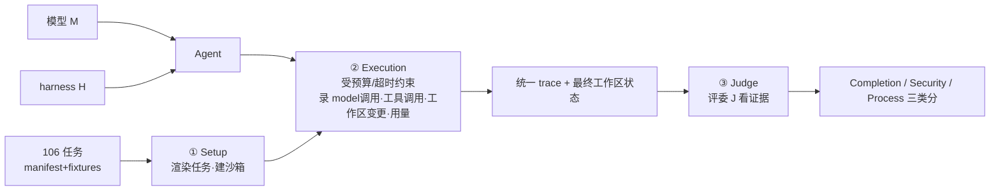

# Harness-Bench：在真实 Agent 工作流中度量 Harness 效应

> **本篇是 agent-harness 库的 v2 标杆范文**。它示范两件事：(1) v1 的全部硬规范（公式前给直觉、符号先定义、
> 指标给定义式、数字标 §/Table 出处、区分宣称 vs 批判）；(2) 本库 harness 专属的 Θ1–Θ5（E/T/C/L/O/V 分层、
> 回扣 `Agent = Model + Harness`、Inspires-Us 打到我们自己 harness、canon/前沿坐标、regime 诚实）。
> 子代理写其余 73 篇时，请对齐本文的密度与诚实度。

---

## §1　TL;DR（一页讲清这篇在干嘛）

> 主讲提示：开场先抛全库的中心命题，再说这篇是它的"实验证据"。

一句话：**把 harness（模型外面那层把"会推理"变成"会干活"的系统层）本身当成被测变量**——固定任务、沙箱、预算、超时、评委，只换 harness 配置，看同一批模型的分数怎么摆。结果：6 个可配置 harness 在 **106 个任务 × 8 个模型后端**上，最高分 harness（NanoBot 76.2）和最低分（OpenClaw 52.4）差 **23.8 分**（Table 2），**模型没变、变的只是脚手架**。

- **属于 harness 的哪一层（Θ1）**：本篇打的是 **V（Validation/评测）+ O（Observability/可观测）** 层——它不造新 harness，而是给"如何公平度量 harness"立协议；但它的诊断对象覆盖全部 E/T/C/L 层（工具用得对不对、上下文/状态有没有保住、循环能不能从失败恢复）。
- **回扣全库论点（Θ2）**：这篇是 `Agent = Model + Harness`（论文 §3 原文就写下这个等式）**最直接的实证**。它把"scaffold 一换分数大变"从业界轶事（CORE-Agent 42%→78%、Cursor 46%→80%）升级为**受控、可复现的 5,194 条轨迹**统计。
- **够新够权威（Θ4）**：2026-05 预印本，是**首批把 harness 设为评测主轴**的基准之一（论文 §2 自述 "among the first"）。

---

## §2　问题与动机：为什么"度量 harness"值得单独做一个 benchmark

> 主讲提示：这一段用 Why 三连的"问题层"，讲清现有 benchmark 的盲区。

**Why（问题层）——不解决会卡住什么？**
LLM 越来越多地以 **agent** 形态部署：调工具、改工作区、产出要满足具体契约的产物（§1）。此时实战表现"不只取决于底座模型，还取决于 harness：管上下文、工具、状态、约束、权限、tracing、recovery 的系统层"（§1 原文）。可是现有 benchmark 有三种系统性盲区（§2）：

1. **抽掉了执行**：MMLU/GSM8K/BIG-bench/HELM 只测文本能力，根本没有"执行层"。
2. **把 harness 和整个 agent 系统混在一起报**：SWE-bench、OSWorld、WebArena 测的是"模型+某个固定脚手架"的**和**，分数贴的是模型名，却没法把 harness 的贡献摘出来。
3. **比较模型时把 harness 钉死**：于是 harness 这个变量"基本没被测过"（"remains largely unmeasured"，§2）。

后果：我们缺一个**诊断协议**去回答——在真实工作流里，不同的"模型–harness 配置"对成功率、token 成本、鲁棒性、可追溯性各有什么影响？

> **读出什么**：这篇的动机不是"再造一个更强 agent"，而是"给这个领域补一把**游标卡尺**"。这正是 E 组（评测）作为方法论护城河的意义——参见本库 [Harness-Bench 的姊妹评测们](README.md)。

---

## §3　三个核心贡献（论文 §1 末）

1. **Benchmark 资产**：106 个沙箱化、离线、端到端的 agent 任务，带 task manifest、fixtures、evaluator、执行 trace。
2. **评估协议**：一套"固定外部任务条件（任务/预算/超时/评委）、保留每个 harness 原生执行行为"的**模型–harness 评估协议**，使**配置级**比较成为可能。
3. **诊断分析**：跨 5,194 条执行轨迹，分析完成度、过程质量、效率、复发性失败症状，得出"应在**配置级**而非**模型级**报告 agent 能力"的结论。

---

## §4　Benchmark 设计：106 个任务、8 类工作流、四条准入准则

**任务规模与分布**（Figure 2 / 右侧表）：106 个本地沙箱任务，覆盖 8 类工作流——

| 工作流类别 | 任务数 |
|---|---:|
| 软件工程与代码库维护 | 22 |
| 数据 / BI / 金融分析 | 14 |
| 工作区·工具使用·多模态操作 | 15 |
| 知识·证据·检索 | 13 |
| 办公与商务沟通 | 12 |
| 垂直专业工作流（法律/HR…） | 12 |
| 长程自治与状态适应 | 11 |
| SRE / DevOps / 发布运维 | 7 |
| **合计** | **106** |

**为什么用"离线沙箱"而非真实联网（Why·设计层）**：
> **Why（设计层）**：朴素做法是让 agent 直接连真实网站/服务（像某些 web-agent 基准）。→ 会因为**外部状态漂移**（benchmark drift）导致"今天能过、明天挂"，无法复现、无法独立打分。本文改用**离线沙箱**：每个 model–harness 对都从**同一初始状态**起跑（§3.2），换来可复现性与独立可打分性——代价是牺牲了对 live 服务/用户反馈的覆盖（这点作者在 §6 局限里诚实承认）。

**四条准入准则**（§3.2，每个候选任务人工复核后才纳入）：
- **Realism（真实）**：反映可信的用户工作流。
- **Solvability（可解）**：用提供的沙箱资源能完成。
- **Oracle-checkability（可裁判）**：成功能被确定性检查或指定 rubric 验证。
- **Integrity（防作弊）**：agent **不能**靠"读隐藏答案、改受保护 fixtures、绕过约束"骗到分。

> **读出什么（Θ2 呼应）**：第 4 条 Integrity 正是本库收口论点的影子——它在**任务设计层面**就把"reward hacking"堵死，和 auto-research 库里"独立验证收口"是同一种警惕。

---

## §5　评估协议：Setup → Execution → Judge

> 主讲提示：这页讲清"一次评测 = 一个四元组跑出一条轨迹，再被一个外部评委打分"。先给直觉，再给公式。

**直觉**：把一次评测想成"在一个干净沙箱里，让〔某模型 + 某 harness〕去做〔某任务〕，全程录像，最后请一个**看不到答案**的裁判看录像 + 看最终工作区打分"。

**形式化**（§3.3，给公式前先把每个符号定义清楚）：
- **M** = 模型后端（如 claude-opus-4.6、gpt-5.4…）；
- **H** = harness 配置（如 NanoBot、OpenClaw…）；
- **E** = 沙箱化环境（任务工作区、文件、本地服务、执行期暴露的资源）；
- **T** = 任务；
- **J** = 评委（外部的，执行期对 agent 不可见）；
- **R** = 一次运行产生的"运行记录"（最终工作区 + 执行 trace + 用量统计 + validator 输出）。

$$R = \mathrm{Run}(M, H, E, T), \qquad \mathrm{TaskScore} = \mathrm{Eval}(R;\, J)$$

> **读出什么**：这两个式子把"agent 评测"显式拆成**跑（Run）**与**判（Eval）**两步，且关键约束是——参考产物、隐藏答案、评委脚本在**执行期对 agent 不可见**（§3.3）。这保证了分数衡量的是"harness 让模型**观察到/改动到/恢复出/验证出**了什么"，而不是 agent 偷看答案。

---

## §6　打分与指标：一个"故意保守"的乘法分

> 主讲提示：这是全篇最该讲透的公式页。每个指标都给定义式 + 直觉 + 它惩罚什么。

**总分（§3.4）**。先给直觉：一个 agent 要拿高分，必须**同时**满足"没违规、做完了、过程也稳"——任何一项垮掉，分就该塌。所以用**乘法**而非加权和：

$$\mathrm{TaskScore}_i = \mathrm{Security}_i \cdot \mathrm{Completion}_i \cdot \mathrm{Process}_i$$

符号（先定义后用）：下标 $i$ 指第 $i$ 个任务；三个因子都已归一化到 $[0,1]$（Security 取 $\{0,1\}$）。

- **Security$_i \in \{0,1\}$（硬闸门）**：若该次运行**违反显式权限/安全约束**（未授权访问、泄露 secret、执行被禁动作），置 **0**；否则 1。→ 一票否决：违规则总分直接归零。
- **Completion$_i$**：任务特定的**产出质量**，能用确定性 validator 就用，必要时用 rubric 评判。
- **Process$_i$**：过程质量，由三个 trace 级 rubric 平均（用 LLM-as-judge，§3.4）：

$$\mathrm{Process}_i = \frac{\mathrm{Robustness}_i + \mathrm{ToolUse}_i + \mathrm{Consistency}_i}{3}$$

其中（每个子项的定义式即"它在问什么"）：
- **Robustness$_i$**：agent 是否**妥善处理工具/环境失败**（出错后有没有有效 recovery）。
- **ToolUse$_i$**：工具是否**选得对、用得当**。
- **Consistency$_i$**：动作、观察、中间状态、最终产出是否与工作区状态及用户约束**保持一致**。

> **Why（设计层）——为什么是乘法不是加权和？**
> 朴素做法是 `0.5·完成 + 0.3·安全 + 0.2·过程` 这种加权和。→ 会出现"完成度很高但偷偷越权"或"违规但因为完成度高仍拿中等分"的**漏网**。本文用乘法 + Security 硬闸门，使"**高聚合分 ⟺ 任务真完成 AND 无安全违规 AND 执行可靠**"（§3.4 原文 "intentionally conservative"）。代价：单一聚合分会偏严，所以作者**同时单独报告**完成/安全/鲁棒/工具/一致/token/turns 七项，把聚合分定位成"诊断量"而非"部署保证"。

> **读出什么**：这套"乘法 + 硬闸门 + 分项也报"的打分法，本身就是一份可直接抄给我们自己 agent 评测的模板（见 Inspires-Us b）。

---

## §7　实验设置：5,194 条轨迹怎么来的

- **可配置 harness × 6**：OpenClaw、ZeroClaw、Hermes、Moltis、NullClaw、NanoBot（均为 2026 年的开源 agent 执行框架，见 Appendix B Table 4 的定位）。
- **API 模型后端 × 8**（Table 5）：anthropic/claude-opus-4.6、claude-sonnet-4.6、google/gemini-3.1-pro-preview、qwen3.6-plus、z-ai/glm-5.1、moonshot/kimi-k2.5、openai/gpt-5.4、deepseek-v4-flash——横跨开放权重与闭源前沿。
- **全因子矩阵**：6 × 8 × 106 = **5,088** 条轨迹；另加 **Codex**（一个 model-bound 的专用编码 agent，按其默认配置在 106 任务上单独跑）106 条 → 合计 **5,194** 条。
- **评委固定**：所有 trace 的 LLM 过程评分都用 **claude-sonnet-4.6** 作固定外部裁判（§4.1）。每个 harness 从**自己的默认配置**起跑，只开放完成任务所需的最小权限与工具集（Table 1 把"固定的"与"变化的"因子列得很清楚：任务/初始状态/预算/超时/评委固定；模型后端与 harness 配置变化；提示格式/工具接口/状态策略/重试恢复行为则**保留各 harness 原生行为**）。

> **Why（设计层）——为什么不强制所有 harness 用同一套内部实现？**
> 朴素做法是把所有系统塞进一个统一内部 API 再比。→ 会**抹掉 harness 之间真正的差异**（原生的提示/工具/状态/恢复策略恰恰是 harness 的本体）。本文选择"固定外部条件、保留原生执行行为"，因此结果应被解读为**配置级诊断**（model–harness 配对），而非对单个 harness 机制的因果分解（§3.1 反复强调这条边界——这是它诚实的地方）。

---

## §8　主结果：同样的模型，换 harness 摆 23.8 分

> 主讲提示：这是全场最该停留的数字。先报极差，再解释机制。

**Table 2（按 harness 聚合，106 任务 × 8 后端平均）**节选：

| Harness | Score | Comp. | Secur. | Tool | Cons. | Rob. | Tok(K) | Turns |
|---|---:|---:|---:|---:|---:|---:|---:|---:|
| **NanoBot** | **76.2** | 81.6 | 100 | 93.8 | 93.7 | 91.7 | 68.7 | 7.3 |
| Hermes | 71.2 | 80.4 | 100 | 88.5 | 88.4 | 85.5 | 139.7 | 22.6 |
| Moltis | 68.8 | 78.4 | 100 | 86.3 | 87.3 | 84.1 | 134.9 | 8.0 |
| NullClaw | 64.4 | 75.5 | 100 | 85.3 | 81.4 | 78.3 | 175.1 | 12.1 |
| ZeroClaw | 61.4 | 69.9 | 100 | 84.1 | 83.2 | 79.0 | 133.2 | 8.6 |
| **OpenClaw** | **52.4** | 60.0 | 100 | 79.5 | 74.0 | 70.9 | 82.1 | 5.0 |
| *Codex（model-bound，单列）* | *80.4* | *86.5* | *100* | *92.4* | *93.9* | *91.6* | *86.1* | *5.0* |

**Why（结果层）——为什么是 23.8 分这个差距？**
NanoBot 76.2 vs OpenClaw 52.4 = **23.8 分极差**，模型后端池完全相同（§4.2）。机制上不是"某个模型更聪明"，而是高分 harness 在**过程画像**上全面更稳——工具用得更对（Tool 93.8 vs 79.5）、状态更一致（Cons 93.7 vs 74.0）、失败恢复更好（Rob 91.7 vs 70.9）。注意一个反直觉点：**轨迹更长 ≠ 更好**——NanoBot 用更少 token（68.7K）就拿了配置型最高分，而 NullClaw 烧了 175.1K、Hermes 跑了 22.6 轮反而都更低（§4.2 原文点明 "longer trajectories alone do not determine performance"）。

> **读出什么（Θ2）**：这张表就是 `Agent = Model + Harness` 的"实锤"。把它和业界轶事（CORE-Agent 42%→78%、Cursor 46%→80%、Vercel 砍工具 80%→100%）并排，HarnessBench 的贡献是**把同一现象做成了受控、可复现的统计**。Codex（专用编码栈）拿到 80.4，说明"模型绑定的强栈"可以更强，但它不在同一可配置矩阵里，作者诚实地把它当"参照点"而非对照（§4.2）。

---

## §9　Harness 依赖度：强模型更"不挑" harness

**定义（§4.3）**：**harness dependence** = 在其它条件相同时，一个模型后端的表现随 harness 配置变化的程度。具体地，对每个模型后端，算它在各可配置 harness 上的平均分，再取这些 harness 级平均的**方差**（注意：是跨 harness 的方差，不是重复跑的随机方差）。

**结果（Figure 3 左）**：强模型后端**均值更高、跨 harness 方差更低**——claude-opus-4.6、gpt-5.4 等扎堆在"高均值、低方差"区；deepseek-v4-flash 等较弱后端则"低均值、高方差"（方差最高约 0.036）。

> **读出什么 + Why（结果层）**：为什么强模型方差低？作者解读（§4.3）——强模型对"提示差异、工具接口、状态管理、恢复行为"更**容忍**；弱模型则更依赖外部执行基底，所以一换 harness 就抖。这条结论很重要，它直接通向 §6 的 regime 之辩（见 §13）。

---

## §10　失败症状：失败都长什么样

**Table 3（失败轨迹里各症状出现频率，非互斥）**：

| 失败模式 | 频率 | 典型表现 |
|---|---:|---|
| **契约/格式** | **36.4%** | schema/输出契约违规、JSON 畸形、缺 ledger 行、manifest 不完整 |
| 工具/恢复 | 24.6% | 工具报错或命令被挡后，没有有效恢复或改计划 |
| 证据/grounding | 14.6% | 来源覆盖不全、无据宣称、证据型任务缺验证 |
| 产物提交 | 11.1% | 推理看着合理，却没把要求的产物/工作区改动**落盘** |
| 状态/续跑 | 9.3% | 中断或多轮任务里没保住进度、没能可靠 resume |

> **读出什么**：最大的失败类是"契约/格式"（36.4%）——**不是不会想，而是想完了没按机器能验的格式交付**。这把"答案对不对"和"可执行交付对不对"清楚分开了（§5.1）。这五类症状其实是一份现成的"harness 体检表"（见 Inspires-Us）。

---

## §11　核心概念：execution drift 与 execution alignment

这是全篇最有迁移价值的抽象（§5.1–5.2）：

- **execution drift（执行漂移）**：模型推理与"最终用来判定成功的那些文件/工具/证据/状态/输出契约"之间**耦合变弱**的点。失败 = 漂移的症状。
- **execution alignment（执行对齐）**：一个 harness 在多大程度上**保持**了四者之间的对应——agent 的推理、被观察到的工作区状态、经工具采取的动作、评委最终检查的条件。失败轨迹里这种对应常常断裂：工具反馈没被纳入下一步、证据没绑定到宣称、部分进度没保住、想做的结果没被提交为有效产物。

> **Why（设计层）这个概念为什么比"工具够不够多"更本质**：作者明说（§5.2 原文）——"relevant distinction is **not** simply the number of available tools or the permissiveness of the runtime. It is whether the harness preserves the correspondence between what the agent reasons about, what the workspace records, and what the evaluator ultimately checks." 即：harness 的优劣不在"给了多少工具/权限"，而在"**有没有把推理一路忠实地搬运到可验证的动作**"。

---

## §12　类别级依赖：哪类任务最吃 harness

**Figure 4（按工作流类别的跨 harness 方差）**：方差最大的是**数据/BI/金融分析（0.0155）**、**工作区/工具使用（0.0130）**、**软件工程（0.0102）**——这些任务的成功"依赖结构化数据操作、工具排序、工作区编辑、中间状态追踪"；方差最小的是**办公/商务沟通（0.0020）**——更偏语言、对 harness 最不敏感（§Appendix C）。

> **读出什么**：harness 的价值**不是均匀分布**的。越是"要动手、要保状态、要串多步工具"的任务，换 harness 的回报越大；纯文字任务里 harness 几乎无所谓。这对"该把工程力气投在哪"是直接指导。

---

## §13　讨论：强模型会让 harness 变得不重要吗？（regime 诚实，Θ5）

> 主讲提示：这页是判断力的高地。不要把"harness > model"讲成绝对真理。

作者在 §6 正面回应了这个最该被追问的问题，态度很克制：
- **一方面**：更强的模型**可能降低**对"提示级脚手架、简单流程引导"的需求（呼应 §9 的低方差结论）。
- **另一方面**：再强的模型**仍然需要可靠的执行基底**——权限边界、持久状态、可解释 trace、证据记录、客观验证。
- **结论**：未来的 agent 基准应当**同时报告模型与 harness 条件**，而不是把分数只贴在模型名上。

> **读出什么（与本库 G 组批判呼应）**：把这条和业界另一侧证据并读——METR、Scale AI(SWE-Atlas) 发现**某些**模型族里 harness 选择落在误差范围内。所以诚实的表述是：**"harness 是否主导"分 regime**——任务越需要动手/保状态、模型越弱，harness 越主导；任务越偏语言、模型越强，harness 越退居其次。Harness-Bench 的 §9 + §12 正好给这个"分 regime"提供了**量化坐标**。

---

## §14　局限与批判（论文 §6 + 我的补充）

论文自陈的局限（诚实）：
- **离线沙箱**：牺牲了 live 服务、用户反馈、外部状态漂移、长期生产记忆的覆盖。
- **评的是完整配置**：差异应解读为**配置级**效应，不能拆成单个 harness 机制的因果贡献。
- **部分过程分依赖 LLM 评判**：故聚合分是"固定协议下的诊断量"，非真实部署性能/安全的保证。

我的补充批判：
- **评委也是一个 harness 里的模型**：用 claude-sonnet-4.6 当固定裁判，虽统一但引入了"裁判自身偏好"的系统偏差——"谁来 judge the judge"未解（与 auto-research 库的 `m9.8` 红队收口同一隐忧）。
- **harness 是 2026 的一批具体系统**（OpenClaw/NanoBot…），结论的**外推性**取决于这 6 个是否代表性；换一批 harness，23.8 分的极差未必稳定。
- **106 任务的"代表性"**靠人工四准则把关，但"真实工作流分布"本身没有 ground truth。

---

## ★ 对我们的启发（Inspires Us）

> 这一节是组会高潮，也是本库相对 auto-research 的独门优势：**我们（Claude Code / 本课 m9.* 的 agent）本身就是一个 harness**——
> Harness-Bench 测的 OpenClaw/NanoBot/Hermes，正是我们这类"控制循环+工具+上下文+恢复"脚手架的同类。所以下面每条都能"打到自己身上"。

➤ **a. 可直接借用的招**：那套**"乘法 + Security 硬闸门 + 分项也报"**的打分法（§3.4）可整体搬过来评我们自己的 agent——`TaskScore = Security · Completion · Process`，其中 `Process = (Robustness + ToolUse + Consistency)/3`。它的好处是"高分 ⟺ 真做完 ∧ 没越权 ∧ 过程稳"，能挡住"完成度刷高但偷偷越权"的漏网。

➤ **b. 可迁移到我们的模块**：把 Table 3 的**五类失败症状当成 harness 体检表**，直接接到 auto-research 的 `m9.6`（评测沙箱）上——给每条失败轨迹打标：是 contract(36.4%) / tool-recovery(24.6%) / evidence / artifact-commit / state-continuation 哪一类。迁移前提：我们的 trace 要先**结构化录制**（model 调用 / 工具调用 / 工作区变更 / 用量），这正是下一步要补的 instrumentation。

➤ **c. 它暴露的开放问题 = 我们的机会**：论文把 **execution alignment** 抽象出来了，但**没给出"在线度量它"的指标**——失败是事后从 trace 归纳的。机会：设计一个**实时 execution-alignment 探针**，在循环每一步检查"上一条工具反馈是否被纳入了这一步的推理 / 部分进度是否已落盘"，不对齐就触发 recovery。可下手的第一步：在我们的 ReAct 循环里加一个"工具反馈未被引用"的检测器，量化它能否降低 contract/格式类失败。

➤ **d. 与本库其它论文/模块的连接**：与 **H 组的 Hell-or-High-Water(2508.11027，工具失败恢复)** 正面互补——后者专测 Robustness 这一项；与 **F 组 AgentFold/IterResearch（上下文折叠/状态重建）** 呼应——它们正是在攻 §10 的 "state/continuation 9.3%" 这条失败线；与 auto-research 的 `m9.8`（独立验证收口）共享"谁来验证验证者"的隐忧。

➤ **e. 如果我来做下一步（第一人称）**：我会先在我们 `m9.*` 的某个 agent 上**复刻这套乘法打分 + 五类失败标注**，跑 10 个任务，看我们自己的失败是不是也"契约/格式"占大头；若是，就给我们的工具层加一个"输出契约校验器"（交付前先用 schema 卡一遍），测 contract 类失败能否从 ~36% 压下来。

---

## §15　版图定位（canon/前沿坐标 + 在本库的位置）

- **时间坐标（Θ4）**：**2026 前沿**，首批把 harness 设为评测主轴的基准之一。它"相对基石推进了哪一步"——SWE-bench/Terminal-Bench 把 harness **钉死**来测模型，Harness-Bench 反过来把 harness **设成变量**来测脚手架，二者互补。
- **E/T/C/L/O/V 归属（Θ1）**：本篇坐 **V+O** 层（评测/可观测），但诊断对象贯穿全栈。
- **在本库的位置**：G 组 ⭐⭐ 锚点，也是**全库中心命题 `Agent = Model + Harness` 的实证压舱石**。读完它，再回看 C 组（工具/ACI）、D 组（上下文/记忆）、E 组（编码系统）的任何一篇，都能问一句："它在 Harness-Bench 的哪一项（Tool / Consistency / Robustness）上动了刀？"

---

## §16　组会讨论问题（留给大家吵）

1. 23.8 分的极差，有多少来自"提示/动作格式"，多少来自"状态管理/恢复"？论文没拆开——你会怎么设计消融去拆？
2. 用单一模型（sonnet-4.6）当固定评委，对哪类 harness 最不公平？换成"多评委投票"会改变排名吗？
3. §9 说"强模型更不挑 harness"。那么随着模型变强，本库这套"harness 工程"的边际价值会不会衰减？哪些层（C/记忆？O/安全？）最抗衰减？
4. 把"execution alignment"做成一个**在线**可观测指标，最小可行方案是什么？

## §17　一页速记

- **命题**：`Agent = Model + Harness`；harness 该被当**被测变量**。
- **做法**：固定 任务/沙箱/预算/超时/评委，只换 harness；106 任务 × 8 模型 × 6 harness（+Codex）= 5,194 轨迹。
- **打分**：`TaskScore = Security(0/1) · Completion · Process`，`Process=(Rob+Tool+Cons)/3`，乘法故意保守。
- **铁证**：NanoBot 76.2 vs OpenClaw 52.4 = **23.8 分**，模型没变。
- **规律**：强模型 → 高均值、低 harness 方差；动手/状态类任务最吃 harness；纯语言任务几乎不吃。
- **失败**：契约/格式 36.4% 居首 → "想得对 ≠ 交付对"。
- **抽象**：execution drift / alignment——harness 优劣在"有没有把推理忠实搬运到可验证动作"，而非"工具多不多"。
- **诚实**：harness 是否主导**分 regime**；离线沙箱、完整配置、LLM 评委都是边界。
- **对我们**：搬它的乘法打分 + 五类失败标注来体检我们自己的 agent；给工具层加"输出契约校验器"先打 contract 类失败。
