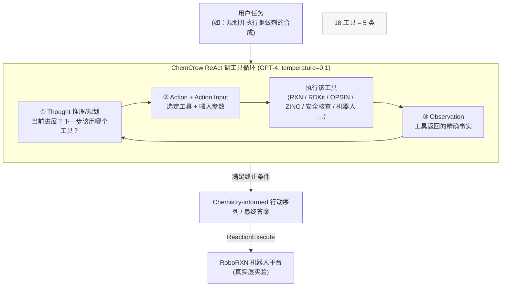

# 组会汇报 · ChemCrow：给大模型接上化学工具

> 主讲提示：这是 I 组（域内落地发现）的**奠基性**一篇，也是「LLM + 专家工具」范式在**真实湿实验科学**里第一次走通的代表作。
> 全场两条主线：①**范式**——为什么要把化学知识放到「外部工具」而不是「模型脑子」里（设计层 why）；
> ②**评估难题**——它顺手发现了一件让整个领域后背发凉的事：**让 GPT-4 当评委，它分不清对错**。这条线直通我们 `m9.6`。

---

## 1. 封面 · TL;DR

- **标题 / 出处**：*Augmenting large-language models with chemistry tools*（社区与代码库通称 **ChemCrow**）。Andres M. Bran\*、Sam Cox\*、Oliver Schilter、Carlo Baldassari、Andrew D. White、Philippe Schwaller（\* 共同一作）。**arXiv 2304.05376**（2023-04 首发，v5 2023-10），后正式发表于 ***Nature Machine Intelligence* 2024**。
- **权威性来源**：① 登 **Nature MI**（域内顶刊）；② 作者阵容含 **Philippe Schwaller**（Molecular Transformer / RXN for Chemistry 的核心作者）、**Andrew D. White**（后创立 FutureHouse，Robin/PaperQA 的人）；③ 是被后续 LLM-for-Science 工作**反复引用**的「工具增强化学 agent」第一范式。代码公开：`https://github.com/ur-whitelab/chemcrow-public`（含 12 个工具的开源子集）。

**这篇在干什么（一段话）**：把 **GPT-4** 放进一个 **ReAct（Thought→Action→Observation）** 循环里，外挂 **18 个专家设计的化学工具**（反应预测、逆合成、SMILES↔名称/价格/CAS、相似度、官能团、专利核查、安全/爆炸物核查、文献/网络检索、Python、机器人合成执行……）。LLM 不再依赖自己「记得的」化学知识，而是**当一台推理引擎**：读任务 → 想清楚下一步该调哪个工具 → 调用 → 看返回 → 再想，直到给出答案。论文用它**自主规划并在 IBM RoboRXN 机器人平台上执行**了驱蚊剂 DEET 与三种已知硫脲有机催化剂的合成，并**引导人机协作发现了一个新发色团**。

**3 条带走的结论**：
1. **范式胜利**：在 14 个化学任务上，专家化学家**一致更偏好 ChemCrow** 而非裸 GPT-4，尤其在**越难、越需要扎实化学推理**的任务上差距越大（原文 Fig.4）。机理是工具提供**精确、可溯源**的事实，压住了 LLM 的**幻觉**（编错 IUPAC 名、编不存在的反应）。
2. **真上湿实验**：4 个目标分子（DEET + 3 催化剂）在**真实机器人平台**上合成成功，并能**自主修正**机器人执行报错（"溶剂不足"/"提纯无效"），这是 LLM agent 与物理世界交互的早期实证（原文 §2.1）。
3. **评估塌方（本篇最有方法论分量的发现）**：用 GPT-4 当评委（论文称 **EvaluatorGPT**），它**系统性地给裸 GPT-4 打更高分**——因为 GPT-4 的回答**更流畅、更完整、看起来更像样**，而评委**没有足够化学知识去识破其中的硬伤**。结论：**当事实正确性是关键时，LLM 自评不可信**（原文 §2.3、附录 C）。

> 主讲提示：开场就把「工具压幻觉（赢）」和「自评分不清对错（警钟）」两面一起抛出。前者是 I 组的范式，后者是 `m9.6` 评估护城河的真实弹药。

---

## 2. 问题与动机（why —— 本篇最该讲透的两页）

> 这一节用 **Why 三连** 的「问题层」打底，下一节 §3 收成一句话，§7 起每个组件再补「设计层」。

### 2.1 问题层 why：两个世界各有残缺，谁来搭桥？

化学这门学科，过去几十年攒下了**极其优秀的计算工具**：逆合成规划（AiZynthFinder、RXN）、反应预测（Molecular Transformer）、性质预测、从头分子生成、贝叶斯优化……（原文 §1 引文 [16–39]）。但它们各自**孤岛化**、**学习曲线陡峭**：每个工具有自己的输入格式、API、安装坑，**实验化学家（不是程序员）根本用不动**（原文 §1：「their integration and interoperability pose considerable challenges … steep learning curves … preventing the full exploitation of their potential」）。

另一边，**LLM** 横空出世，在跨领域任务上很强，但在化学上**反复翻车**：
- **不会算、不会查**：原文开篇直接点名——GPT-4 / GPT-3.5 **算不对 `12345*98765`**，也**把 IUPAC 名转不成正确的分子图**（原文 §1，引 White 2023 [14]）。
- **没有外部知识源**：模型只会「预测下一个词」，于是会**自信地编**（confabulation / hallucination）——编一个**看起来对、其实错**的合成路线，在化学里这是**致命**的。

**不解决会怎样**：你要么有「好工具但没人会用」，要么有「好说话但不靠谱」的 LLM。两个残缺拼不出一个能用的科研助手。

### 2.2 设计层 why（全篇的核心赌注）：把化学知识放进「工具」，而不是「模型」

这是组会上**最该被追问、也最能体现你读懂没读懂**的一层。面对「LLM 化学差」，有两条**朴素路线**：

> **Why（设计层）· 朴素替代 A：把化学知识灌进模型**——继续用更多化学语料**微调 / 预训练**一个「化学大模型」。
> → 会因为 **(i) 数据稀缺**（湿实验数据本就少，原文 §1：「lack of data」）、**(ii) 知识会过期**（新反应、新价格、新专利模型不可能内化）、**(iii) 仍然会幻觉**（参数化知识天生不可溯源、不可精确）而失败。
>
> **Why（设计层）· 朴素替代 B：让 LLM 直接端到端答**——靠 prompt 工程榨干 GPT-4 自己的化学知识。
> → 正是论文证伪的对象：裸 GPT-4 在 DEET/对乙酰氨基酚这类**训练里见过**的分子上还行，**一旦任务新、需要精确数值/结构就崩**（原文 §2.3：GPT-4「systematically fails to provide factually accurate information」）。
>
> **本文改用路线 C：LLM 当推理引擎 + 专家工具当知识/计算后端。** 凭什么更优——
> 工具给的是**精确、确定、可溯源**的答案（RDKit 算分子量、OPSIN 转结构、ZINC 查可购性都是**确定性**的），LLM 只负责**「什么时候该问哪个工具、怎么把答案串成方案」**。化学知识的**正确性**外包给工具，LLM 专注它真正擅长的**规划与语言**。（原文 §1：「These specialized tools provide exact answers, thereby compensating for the inherent deficiencies of LLMs」。）

一句话把赌注钉死：**不是教模型更多化学，而是教模型「不知道就去查、查完再推理」。** 这正是 ChemCrow 区别于「化学微调模型」的根本主张，也是它能被一篇 Nature MI 接收的原因。

> 主讲提示：把「知识放工具不放权重」讲成全场题眼。它的三大好处——**精确、可溯源、可热更新**——后面每个工具、每个案例都在兑现这三点。

### 2.3 为什么是「现在」做

ReAct（Yao 2022 [43]）、MRKL（Karpas 2022 [53]）、Toolformer（Schick 2023 [10]）这些「让 LLM 用工具」的框架**2022–2023 才成熟**；GPT-4 的**指令遵循 / 多步推理**也才刚够可靠到能闭环。同期 Boiko 2023 [54]（Coscientist）做了**类似思路但聚焦云实验室**；ChemCrow 的差异在于**更广的任务面 + 更全的 18 工具 + 接入真实机器人合成平台**（原文 §1 末、§2.1）。

---

## 3. 研究问题 / 核心 intention（形式化成一句话）

把要解决的问题压成一句：

> **能否让一个通用 LLM（GPT-4），通过自主调用一组专家化学工具、以 ReAct 方式多步推理，自主完成跨有机合成 / 药物 / 材料的化学任务——包括在真实机器人平台上执行合成——并使其结果在事实正确性上显著优于裸 LLM？**

隐含的**假设**：
- **H1（工具接地抗幻觉）**：只要把精确事实交给工具，LLM 的化学幻觉就能被压住，整体事实正确性上升。
- **H2（推理引擎假设）**：GPT-4 的多步规划 / 工具选择能力，已足够可靠到能把一串工具**正确编排**成可执行方案。
- **H3（可扩展）**：工具集是**即插即用**的——给一个工具 + 一段自然语言描述，agent 就能学会用它，因此系统能轻松扩到新任务。

---

## 4. 相关工作定位（站在谁肩上、和谁不同）

| 方向 | 代表工作 | 与 ChemCrow 的关系 |
|------|---------|-------------------|
| LLM 用工具的通用框架 | **ReAct** [43]、**MRKL** [53]、**Toolformer** [10]、HuggingGPT [52]、MM-REACT [51] | **直接站其肩上**：ChemCrow = ReAct(Thought/Action/Observation) + MRKL 式神经-符号工具路由，落到化学域 |
| 化学专用计算工具 | Molecular Transformer/RXN [18,24,46]、AiZynthFinder [25]、OPSIN [15]、RDKit [97]、贝叶斯优化 [37–39] | **被它当后端调用**：这些是 18 工具的实现基础 |
| 「LLM 内部懂不懂化学」 | White 2023 [14]、Castro Nascimento 2023 [11]、Jablonka 2023 [32] | **被它当反例**：证明裸 LLM 化学不可靠 → 故需外挂工具 |
| 同期 LLM 化学 agent | **Coscientist**（Boiko 2023 [54]） | **并行同期工作**：思路相近；Coscientist 聚焦**云实验室**，ChemCrow 任务面更广 + 18 工具 + RoboRXN |
| LLM-as-judge | GPTEval [62]、GPT-4 自评 [5,62] | **被它证伪（在化学上）**：EvaluatorGPT 因缺化学知识而误判（§2.3，本篇最大方法论贡献） |

> 主讲提示：一句话概括——「**别人发明了让 LLM 用工具的通用机器（ReAct/MRKL），ChemCrow 把它开进化学实验室，并第一个撞上『自动评委失灵』这堵墙**」。

---

## 5. 方法总览（big picture，先直觉后机制）

ChemCrow 的骨架极简：**一个 ReAct 循环 + 一个工具箱**。给定用户任务和工具清单（每个工具配一段自然语言描述），GPT-4 在「想（Thought）→ 选工具并给输入（Action / Action Input）→ 读返回（Observation）」之间**迭代**，直到产出最终答案（原文 Fig.1a、§1 末）。



**直觉**：这就是「一个会查资料的研究助理」——遇到不确定就停下来**查工具**（而不是硬编），把工具返回当**新证据**再往下推。关键是 LLM **从「自信但常错」的知识源，转型成「会反思、会取证、会迭代」的推理引擎**（原文 §1：「the LLM transitions from a hyperconfident … information source, to a reasoning engine」——这句是全篇题眼，建议原话引用）。

**工具箱 = 5 类**（原文 Fig.1b、§5.3）：
- **General（通用）**：WebSearch、LitSearch、Python REPL、Human；
- **Molecule（分子）**：Name2SMILES、SMILES2Weight、SMILES2Price、Name2CAS、Similarity、ModifyMol、PatentCheck、FuncGroups；
- **Safety（安全）**：ControlledChemicalCheck、ExplosiveCheck、SafetySummary；
- **Reaction（反应）**：NameRXN、ReactionPredict、ReactionPlanner、ReactionExecute。

> 主讲提示：让听众先记住「**一个循环 + 五类工具**」。工具的细节在 §7–§9 逐个拆；现在只要建立「LLM 不内化知识、全靠调工具」的画面。

---

## 6. 符号与术语表（后文统一用）

| 记号 / 术语 | 含义 |
|------------|------|
| **ReAct** | Reasoning + Acting 框架（Yao 2022）：让 LLM 交替「推理」与「调用工具」，把思维链与工具结合 |
| **Thought / Action / Action Input / Observation** | ReAct 一步的四要素：推理 / 选工具 / 工具入参 / 工具返回 |
| **Tool（工具）** | 一个可被 LLM 调用的确定性函数；以「名字 + 自然语言描述 + 输入输出格式」呈现给 LLM |
| **SMILES** | 分子的线性字符串表示（如 `CCO`=乙醇）；化学工具的通用「接口语言」 |
| **IUPAC name** | 国际纯粹与应用化学联合会命名法给出的系统化合物名 |
| **CAS number** | 化学文摘社登记号，分子的唯一标识 |
| **DEET** | N,N-二乙基间甲苯酰胺，常见驱蚊剂；本文「规划+执行」案例的目标分子 |
| **有机催化剂 (organocatalyst)** | 小分子有机催化剂；本文合成了 3 种**硫脲 (thiourea)** 催化剂（Schreiner / Ricci / Takemoto） |
| **发色团 (chromophore)** | 决定分子吸光颜色的结构单元；本文人机协作发现的新分子属此类 |
| **RoboRXN** | IBM Research 的云端机器人有机合成平台（原文 [55]） |
| **EvaluatorGPT** | 论文里「让 GPT-4 扮演老师给学生打分」的自动评委（原文 §2.3）；本篇关键反例 |
| **LangChain** | 构建 LLM 应用的框架，ChemCrow 用它把工具接进 agent（原文 §5.2，引 [79]） |
| **temperature** | LLM 采样温度；本文设 **0.1**（近确定性，原文 §5.1） |

---

## 7. 方法细节 ① ReAct 循环：让 LLM「以推理引擎调工具」

### 7.1 一步到底发生了什么

**Why（设计层）**：朴素做法是让 LLM**一口气把整个合成方案写出来**（端到端生成）→ 它会在任何一步**编造**（错的 SMILES、不存在的试剂价格、臆想的反应），且**无法中途取证纠错**。ReAct 改成**「想一步、查一步、看一步」**，因为只有把推理**切成可被工具验证的小步**，幻觉才能在每一步被**外部事实**打断（原文 §1 末、引 ReAct [43] / MRKL [53]）。

**机制（原文 §1 末段，逐字对应）**：
1. LLM 拿到「工具名清单 + 每个工具的用途描述 + 期望输入/输出格式」+ 用户任务；
2. **Thought**：对当前任务状态做推理，判断「与最终目标的相关性」并规划下一步——这一步**显式展示它的理解程度**；
3. **Action / Action Input**：LLM 以关键词 `Action` 请求某工具、以 `Action Input` 给入参；此时**文本生成暂停**，程序真去执行该函数；
4. **Observation**：执行结果以关键词 `Observation` 前缀**回灌**给 LLM；
5. 回到 Thought，**迭代直到产出最终答案**。

```
Thought:  我需要先拿到 safinamide 的 SMILES，再规划合成。
Action:   Name2SMILES
Action Input: safinamide
Observation: C[C@H](NCc1ccc(OCc2ccc(F)cc2)cc1)C(N)=O
Thought:  现在有了 SMILES，可以规划合成路线了……
（——摘自原文 Fig.9 / Appendix G.1，Task 1）
```

**读出什么**：这套「暂停-执行-回灌」让 LLM 的**每个声明都有机会被一个确定性工具校验**。它把「相信模型记得」换成「让模型去查」——这是 H1（接地抗幻觉）落地的**唯一**机制。

### 7.2 安全护栏内嵌在循环里（Why：双重用途风险）

**Why（问题层）**：一个能规划合成的 agent，天然有**双重用途 (dual-use)** 风险——可能被诱导去合成受管制 / 危险物（原文 §3，引 Urbina 2022 [66,67]）。**不设护栏会怎样**：把「自动合成」直接暴露给非专家 = 安全事故。

**机制**：每次收到 prompt，agent 先走一遍**硬编码的安全决策流**（原文 Fig.7 / Appendix D）：
- 若任务涉及「规划/执行合成、找相似分子、改分子」→ 先用 **ControlledChemicalCheck**（查 CAS 是否在化武公约 Schedule 1-3 / 澳大利亚集团前体清单，原文 [98,99]）；命中受管制 → **立即停止执行**；
- 否则检查 **ExplosiveCheck**（查 GHS 是否爆炸性）→ 给警告；
- 通过后才继续，并把安全信息**并入最终答案**（如对乙酰氨基酚案例会附 GHS「Warning/Irritant」+ 操作防护建议，原文 Fig.5 左）。
- 反例：要求「设计一个与 **TNT** 性质相似的化合物」→ agent **拒绝执行**并说明「illegal and unethical」（原文 Fig.5 右）。

> 主讲提示：强调护栏是**硬编码 + 工具核查**，不是靠 LLM「良心发现」。这与「知识放工具」一脉相承——**安全判断也外包给确定性核查**，而非信任模型自觉。

---

## 8. 方法细节 ② 18 个工具逐类拆解（核心 6–8 页的主体）

> 主讲提示：这是「知识放工具」的**清单级证据**。不必逐字念，但要让听众看到——**每个工具都在兑现「精确 / 可溯源 / 可热更新」三件事之一**，且每个都有确定性后端（RDKit / OPSIN / ZINC / PubChem / RXN…）。

### 8.1 General（通用工具，4 个）— 原文 §5.3.1

| 工具 | 后端 | 干什么 / 为什么需要 |
|------|------|--------------------|
| **WebSearch** | SerpAPI [81]（Google 首页摘要） | 取**当下**信息、当 LLM「不知道该用哪个工具」时的**起跳板**。默认 agent 更偏好 LitSearch |
| **LitSearch** | **paper-qa** + OpenAI Embeddings [82] + FAISS [83] | 从 PDF/文献里**接地检索**：文档切块→嵌入→检索 top-k 段落→摘要进 prompt→生成**带引用**的答案。**抗幻觉的核心通用工具** |
| **Python REPL** | LangChain 标准工具 | 给 agent 一个真 Python shell：做数值计算、训练 ML 模型、数据分析（发色团案例就靠它训随机森林） |
| **Human** | — | 直接问人：遇到不确定 / 需授权（如「是否启动机器人实验」）时把控制权交回用户 |

> **设计层 why（LitSearch）**：朴素做法是让 LLM 凭记忆答文献问题 → 幻觉引用（引不存在的论文）。改用 **embed→retrieve→summarize→cite**，把答案**锚在真实段落**上并给出处。——这正是 White 团队后来 **PaperQA / Robin** 的雏形，也与我们 `m9.2` 的「检索接地 vs 幻觉引用」同构。

### 8.2 Molecule（分子工具，7 个）— 原文 §5.3.2

| 工具 | 后端 | 干什么 |
|------|------|--------|
| **Name2SMILES** | chem-space [84] → 失败回退 PubChem [85] / OPSIN [86] | 名字 / CAS → SMILES（一切分子操作的**入口**） |
| **SMILES2Weight** | **RDKit** [97] | SMILES → 精确分子量（确定性） |
| **SMILES2Price** | molbloom [87] 查 ZINC20 [88] 是否可购 → chem-space [84] 取**最低价** | 可购性 + 商业价格 → 让 agent 做「买得到吗 / 多少钱」的决策 |
| **Name2CAS** | PubChem [85] | 名字 / IUPAC / SMILES → CAS 号（精确检索的统一标识） |
| **Similarity** | **Tanimoto** + ECFP2 指纹 [90,91] | 两分子结构相似度 → 找类似物（构效关系） |
| **ModifyMol** | SynSpace [92]（50 个稳健 medchem 反应 + 逆合成 PostEra Manifold [95]） | 在分子周围生成**局部化学空间**（小改一处）→ 探索类似结构、生成新分子 |
| **PatentCheck** | molbloom [87] bloom filter（无需联网请求） | 分子是否已被专利 / 是否「新」→ 规避 IP 冲突 |
| **FuncGroups** | 命名 SMARTS 模式匹配 | 识别分子中的官能团 → 理解反应性 |

### 8.3 Safety（安全工具，3 个）— 原文 §5.3.3

| 工具 | 后端 | 干什么 |
|------|------|--------|
| **ControlledChemicalCheck** | CAS 比对 OPCW 化武 Schedule 1-3 [98] + 澳大利亚集团前体清单 [99] | **自动触发**于任何合成 / 执行请求；命中 → **立刻停机** |
| **ExplosiveCheck** | PubChem 查 GHS [85]；GHS=「Explosive」即确认 | 自动触发于合成请求 → 给爆炸性警告 |
| **SafetySummary** | PubChem [85] + LLM 组织 | 给任意分子做**四维安全画像**：操作安全 / GHS / 环境风险 / 社会影响（是否受管制）。**无数据时允许 GPT-4 填补，但必须显式声明** |

### 8.4 Reaction（反应工具，4 个）— 原文 §5.3.4

| 工具 | 后端 | 干什么 |
|------|------|--------|
| **NameRXN** | NameRxn / NextMove [100]（Carey 分类 [101]） | 反应 SMILES → 命名反应分类（懂机理、选催化剂/条件） |
| **ReactionPredict** | **RXN4Chemistry API** / IBM [48]（Molecular Transformer [18,24]） | 给反应物 → 预测产物（精确，超出「查库」能力） |
| **ReactionPlanner** | RXN4Chemistry 多步逆合成 [18,24,48] + action 算法 [102] + LLM 把机器可读步骤转自然语言 | 目标分子 SMILES → 设计可比较的合成路线（含条件、添加剂、溶剂） |
| **ReactionExecute** | RXN4Chemistry + 机器人；内含 **ActionCleaner** + LLM 纠错环 + 向用户请授权 | 在 RoboRXN 上**真执行**合成；自动适配机器人报错（见 §10.1） |

> **设计层 why（Reaction 类整体）**：朴素做法是让 GPT-4 直接「预测产物 / 写路线」→ 它做的是**记忆式联想**，新反应必错（原文 §5.3 ReactionPredict：「information that … requires a sort of abstract reasoning chemists are trained to perform」）。改用**专门训练的 Transformer（RXN）**当后端，把「需要受训化学家才会的抽象推理」交给一个**在反应数据上训练过的精确模型**。LLM 只负责**何时调它、怎么把它串进多步方案**。

---

## 9. 方法细节 ③ 三个真实案例：从「答题」到「动手」

> 主讲提示：这三个案例是「范式能落地」的硬证据。讲清**工具调用链**（哪几个工具按什么顺序被串起来），比讲化学细节更重要。

### 9.1 自主合成：DEET + 三种硫脲催化剂（原文 §2.1、Fig.1a、Fig.2）

任务：*"Plan and execute the synthesis of an insect repellent"* 与 *"Find and synthesize a thiourea organocatalyst that accelerates a Diels-Alder reaction"*。
工具链：**LitSearch / WebSearch**（找到目标分子）→ **Name2SMILES** → **ReactionPlanner** → **ReactionExecute**（在 RoboRXN 上执行）。
结果：**4 个目标分子全部成功合成**——DEET、Schreiner 催化剂、Ricci 催化剂、Takemoto 催化剂（原文 [56-59]），并经 MS(ESI)/NMR 验证（附录 A 给出完整实验步骤与质谱数据，如 DEET 算得 m/z 192 [M+H]、实测 192.14）。这是 LLM agent **规划 + 物理执行**的早期实证。

### 9.2 人机协作发现新发色团（原文 §2.2、Fig.3）

任务：训练一个 ML 模型筛选发色团库，找一个吸收最大波长接近 **369 nm** 的分子并给合成路线。
ChemCrow 的动作（Fig.3 右）：①学数据格式 → ②筛列 + 选丙酮腈为溶剂 → ③**算 Morgan 指纹**、切训练/测试 → ④**训练并评估随机森林**（全靠 Python REPL）→ ⑤从选择池提分子 → ⑥给**两步合成**路线。
结果：提出 **(E)-3-methyl-4-(2-(3'-(methylsulfonamido)-[1,1'-biphenyl]-4-yl)vinyl)benzoate**，随机森林 RMSE = 37 nm；人类随后**真合成 + UV-Vis 验证**，实测吸收最大 **336 nm**（目标 369 nm），确认发现了一个新发色团。

### 9.3 GPT-4 vs ChemCrow 的合成方案对比（原文附录 C、Fig.6）

同一目标（Takemoto 催化剂）：
- **GPT-4**：给出**错误的多步路线**——IUPAC 名不可解析、加了**不必要的保护/去保护**、**路线不通向目标**、还可能**破坏手性中心**（原文 Fig.6 左）。
- **ChemCrow**：给出**单步、简洁**的正确路线，附**用量、条件、反应时间**，被人类评审高度评价（Fig.6 右）。
- **但 EvaluatorGPT 反而给 GPT-4 更高分**，理由是它「处理了立体化学和保护基策略、组织良好、展现了对有机合成的深刻理解」——**全是表面功夫**（原文附录 C 末段）。这是 §12 评估塌方的**显微镜级例证**。

---

## 10. 方法细节 ④ 与物理世界交互 + 实现栈

### 10.1 自主修正机器人报错（原文 §2.1）

**Why（问题层）**：RXN 预测出的合成步骤**不一定能在机器人上直接跑**——典型报错是「**溶剂不足 (not enough solvent)**」「**无效提纯 (invalid purify action)**」（原文 §2.1，引 [46]）。**不处理会怎样**：方案再漂亮，机器人执行就报错卡死。
**机制**：**ReactionExecute** 内含 **ActionCleaner**——agent **自主查询平台的校验数据**，**迭代修正**合成步骤（如增加溶剂量）直到方案**完全有效**，**无需人工介入**。这是「agent 适配物理平台特定条件」的早期闭环。

### 10.2 实现栈（原文 §5.1–§5.2）

- **底座 LLM**：OpenAI **GPT-4**，**temperature = 0.1**（近确定性）。
- **框架**：**LangChain** [79]——用它把 18 个外部工具接进 agent、统一接口、做 prompt/模型实验。
- **工具增强本身有效**：原文 §5.2 引 [10,32,80] 佐证「LLM 配工具表现更好」。

---

## 11. 实验设置（setting / metrics / params，写全）

> 主讲提示：这是「指标给定义式」的重点段。ChemCrow 的评估**不是跑分排行榜**，而是**人类专家 + LLM 评委双轨打分**——理解这个设计，才看得懂 §12 的塌方。

### 11.1 任务与对象（原文 §2.3、附录 G）

- **14 个用例 (use cases)**：与专家化学家共同设计，覆盖**合成规划、新分子设计、反应机理解释、安全核查**等（附录 G 列出 14 个 task 的完整 prompt/执行/双评分）。
- **对照**：同一批任务**同时**交给 ① **ChemCrow**（GPT-4 + 18 工具）与 ② **裸 GPT-4**（被提示「扮演专家化学家」）。
- **任务分三类**（原文 Fig.4a）：**合成 (Synthesis)** / **分子设计 (Molecular design)** / **化学逻辑与知识 (Chemical logic)**；类内按难度排序。

### 11.2 两套评估方法（原文 §2.3）

**(A) 人类专家评估（4 位化学家）**——原文附录 B。沿三个维度打分：
1. **化学正确性 (chemical correctness / factuality)**；
2. **推理质量 (quality of reasoning)**；
3. **任务完成度 (degree of task completion)**。
> 定义层直觉：这三维分别问「**对不对** / **想得通不通** / **做没做完**」——把「好答案」拆成可独立判的三件事。
> 评估难点：GPT-4 的回答常需**大量人工解读**（IUPAC 名要用 OPSIN 转成结构图才看得懂，原文附录 B）。为**去偏**，做了两件事：①把两模型答案**随机调换前后顺序**；②给 ChemCrow 的 ReAct 输出**加一层摘要**以**掩盖其特有的 ReAct 风格**，让它读起来更像普通助手、更难与 GPT-4 区分。

**(B) EvaluatorGPT（LLM 自动评委）**——原文 §2.3。把 GPT-4 提示成「**扮演老师评学生**」，对每个任务判：**是否解决了任务 + 整体思维过程是否正确**，并指出优缺点、给改进反馈、给一个 **EvaluatorGPT score**。灵感来自 GPTEval 等 LLM-as-judge 工作 [5,62,63]。

### 11.3 关键参数 / 算力 / 随机性（诚实标注缺失）

- **temperature = 0.1**；底座 = GPT-4（原文 §5.1）。
- **可复现性实验**：对 Task 6 做了 **5 次独立执行**（原文附录 E，见 §13）。
- **成本 / token / 总算力**：**原文未给出**（论文未报告每任务 API 成本或总花费——这点不同于 AI Scientist 的「<$15/篇」式披露，组会可点名为披露缺口）。
- **误差棒**：图中误差棒为 **95% 置信区间**（原文 Fig.4 caption）。

---

## 12. 主要结果（数字 + 解读，重点是「评估塌方」）

### 12.1 专家一致更偏好 ChemCrow，且越难差距越大（原文 Fig.4a/4c）

- **逐任务偏好（Fig.4a）**：把任务按难度从易到难排，**越难的任务，专家越偏向 ChemCrow**；裸 GPT-4 只在**最简单、答案明确、且分子在其训练数据里**的任务（如 DEET、对乙酰氨基酚的合成）上略胜——因为那几乎是**纯记忆**（原文 §2.3：「based almost purely on memorization of training data」）。
- **三维聚合（Fig.4c）**：在**化学正确性 / 推理质量 / 任务完成度**三维上，专家评分**ChemCrow 全面高于 GPT-4**。
- **机制（结果层 why）**：GPT-4 **「系统性地给不出事实正确的信息」**，但因文风流畅完整，**幻觉要细查才露馅**；ChemCrow 靠工具**把事实钉死**，所以在「需要扎实化学推理」的难任务上稳赢（原文 §2.3 首段）。

### 12.2 ★ 评估塌方：EvaluatorGPT 反而偏爱裸 GPT-4（原文 §2.3、Fig.4c、附录 C）

这是**全篇最该让组会记住的一句话**。把人类评分与 EvaluatorGPT 评分并排（Fig.4c 最右一组），出现**系统性背离**：

| 评委 | 更偏好谁 | 给的理由 / 失效原因 |
|------|---------|--------------------|
| **4 位人类专家** | **ChemCrow**（三维全胜） | 真去核查事实，识破 GPT-4 的幻觉 |
| **EvaluatorGPT（GPT-4 自评）** | **裸 GPT-4** | 被**流畅度 + 表面完整性**带偏；**自身缺化学知识，无法识别错误**（原文 §2.3） |

**为什么会这样（结果层 why，逐字对应原文）**：「GPT-4 has been recently presented and used as a self-evaluation method, but these results indicate that **when it lacks the required understanding to answer a prompt, it also lacks information to evaluate the prompt completions**, and thus fails to provide a trustworthy assessment, **rendering it unusable for the benchmarking of LLM capabilities whenever factuality plays key roles in evaluation**.」（原文 §2.3 末）

**这意味着什么（含义，3 层）**：
1. **「会做」和「会判」是两种能力**：一个模型不会做某题，往往也**没能力判别**别人做得对不对——自评在它**知识盲区**里**自动失效**。
2. **流畅度是评委的系统性偏置**：LLM 评委倾向给**更长、更顺、更像样**的回答高分，与**正确性正交**甚至冲突（附录 C：EvaluatorGPT 夸 GPT-4「展现深刻理解」，而那份方案**根本不通向目标**）。
3. **对整个领域的告警**：凡是**事实正确性关键**的任务（科学、医学、法律），**LLM-as-judge 不可单独信**，必须有**人类专家**或**可执行的客观判据**兜底。——这正是我们 `m9.6`「弱 rubric 被刷、强 rubric（held-out / 真执行）抗刷」的真实世界版。

### 12.3 几个代表任务的双评分（原文附录 G，Fig.9–14）

下表直接读出「专家 vs EvaluatorGPT」的背离（专家分 = 平均；满分 10）：

| 任务 | ChemCrow（专家 / EvaluatorGPT） | GPT-4（专家 / EvaluatorGPT） | 读出什么 |
|------|------|------|------|
| Task1 合成 safinamide | **8.2** / 6 | 4.7 / **8** | 专家：ChemCrow 远胜；评委：颠倒 |
| Task3 解释反应机理 | **9.8** / 8 | 7.1 / **9** | 同上：专家高判 ChemCrow，评委高判 GPT-4 |
| Task5 制对乙酰氨基酚 | **9.3** / 7 | 8.4 / **8** | 评委又把 GPT-4 抬高 |
| Task4 合成驱蚊剂(DEET) | 8.7 / 8 | **9.5** / **9** | **记忆型任务**：GPT-4 专家分也高（佐证 §12.1） |
| Task2 提新有机催化剂 | **6**(专家) / 7 | 7.2(专家) / **9** | 设计类任务上评委尤其偏 GPT-4 |

> 主讲提示：把 Task1（专家 8.2 vs 评委给 GPT-4 8）和 Task4（DEET，GPT-4 专家分反高）并讲——**前者是评委塌方，后者是「记忆型任务工具无优势」**，两个现象都要讲到，别只挑赢的说。

---

## 13. 消融 / 稳健性分析

ChemCrow **没有传统意义上的「组件消融表」**（不像 AlphaEvolve 的 Fig.8），它的分析集中在**可复现性**与**误差来源**：

- **可复现性（原文附录 E，Fig.8）**：对 Task6（比较 Lindlar vs Pd 催化下 1-氯-4-乙炔基苯的产物）做 **5 次独立执行**。结论：ChemCrow **5 次都用对工具、都拿到正确产物**，但**对结果的「解释」有偏差**——**5 次里有 2 次**把 SMILES `CCc1ccc(Cl)cc1` 误读成 **trans-烯**产物（实为 cis），导致机理结论出错。**根因是「分子结构的文本解读」**，作者建议未来接**多模态 / 分子图像描述**模型缓解（引 [103,104]）。
- **误差来源拆解（原文 §2.3、§F）**：ChemCrow 的正确性**同时取决于**「工具质量」与「agent 推理质量」，二者**相互影响**——① 工具再好，**推理错了照样调错**；② 推理再好，**工具给了垃圾输入/输出也会带歪**（"garbage in"）。

> 主讲提示：可复现性这条很重要——**即便工具都用对，LLM 对工具输出的「读解」仍可能出错**（cis 误判 trans）。这说明「工具接地」压住了**事实**层幻觉，却压不住**解释**层错误。这是 §14 局限的伏笔。

---

## 14. 局限与批判（诚实区分宣称 vs 边界）

**原文自承（§2.3、§4、附录 F）**：
1. **工具质量是天花板**：ChemCrow **不可能超过它所用工具**——逆合成工具的数据/算法局限会直接传导（原文 §F：「unreasonable to anticipate that ChemCrow could outperform the retrosynthetic tools it uses」）。
2. **工具仍会被错误推理拖垮**：加工具**改善**了推理，但**不能完全纠正** LLM 的逻辑错误（原文 §F：「external tools cannot fully rectify LLM's flawed reasoning」）；偶发「flawed conclusions」（Fig.4d）。
3. **评估难（本篇核心局限）**：缺标准化基准；**LLM 评委不可信**（§12.2）；只能**重度依赖人类专家**，限制了评测的**速度与规模**；设计「能展示这类系统强弱」的实验本身就难、且需大量专家监督（原文 §F）。
4. **可复现性差**：闭源 API（GPT-4）控制有限、个体结果难复现（附录 E）；文本解读偶错（cis/trans）。
5. **双重用途 / IP**：尽管有护栏，仍需更系统的安全核查与专家审查；生成结构/材料的**知识产权归属**尚无清晰政策（原文 §3）。

**社区 / 我方补充质疑**：
- **「14 个任务」样本太小、且与作者共同设计**：可能存在**隐性选择偏置**（原文 §4 亦自承 "implicit bias in task selection"）。**没有公开 leaderboard 式的大规模基准**，结论的统计力度有限。
- **成本完全未披露**：18 工具 + 多步 ReAct + RXN API 的**单任务成本/延迟**原文未给，工程可行性难评估。
- **「推理引擎」假设的边界**：当**工具输出本身需要被正确解读**（如 SMILES→立体化学），LLM 仍会错——说明「把知识外包给工具」解决了**取数**，没解决**释数**。

---

## ★ 对我们的启发（Inspires Us）

> 这一节回答一句话：ChemCrow 对我（们）接下来要做的研究，**到底能用上什么**。落点全部具体到 `m9.*` 模块与可执行的第一步。

- ➤ **可直接借用的招（reuse）**：
  1. **「知识放工具、不放权重」+ ReAct 取证循环**——把任何「模型容易编」的事实（引用、数值、外部状态）都改成**一次工具调用 + Observation 回灌**。可直接强化 [`m9.2-research-agent-core`](../m9.2-research-agent-core/) 的 `corpus.search`：把它从 mock 升级成「**确定性后端 + 必须引用出处**」，复刻 LitSearch 的 embed→retrieve→cite，把幻觉引用从源头掐断。
  2. **硬编码安全护栏前置于推理**（原文 Fig.7）——把「危险判断」做成**确定性核查 + 命中即停**，而**不信任 LLM 自觉**。可作为 [`m9.8-redteam-and-integrity`](../m9.8-redteam-and-integrity/) 的一个标准守卫层。
  3. **评估去偏小技巧**——随机调换两候选顺序、抹平风格特征（原文附录 B）。这是任何「A/B 偏好评测」都该加的**反位置偏置 / 反风格偏置**预处理，可直接进 `m9.6` 的评测脚本。

- ➤ **可迁移到我们课题（transfer）**：ChemCrow 的**「EvaluatorGPT 在知识盲区里自动失效」**，是我们 [`m9.6-evaluating-research-agents`](../m9.6-evaluating-research-agents/)「弱 rubric 被刷」结论的**真实湿实验版**。迁移方法：把我们 `m9.6` 的判分矩阵**加一行「LLM-judge」候选评委**，让它和 `heldout`（强 rubric）在**同一批答案**上打分，**量化两者背离**——预期会复现「LLM-judge 偏好流畅但错误的答案」。迁移时**不再成立的前提**：ChemCrow 用**人类专家**兜底，而我们要的是**可自动执行的客观判据**（held-out / 真跑），因为人类专家不可规模化——这恰好解释了**为什么 `m9.6` 把护城河押在「可执行评测」而非「LLM 评委」**。

- ➤ **它暴露的开放问题 = 我们的机会（opportunity）**：
  1. **「取数对、释数错」**（附录 E 的 cis/trans 误判）——工具接地压住了事实幻觉，却没压住**对工具输出的解读错误**。→ **机会**：给 agent 的每个 Observation 配一个**「解读校验器」**（独立重算 / 多模态看图），量化它能否把「释数错误」也降下来。**第一步**：在 `m9.2` 给 critic 加一条「**对工具返回的结构化输出做独立复算**」检查（类似 `m9.6` Hands-on 的「独立 verifier」），测它能否抓出「读错工具输出」这类新错误。
  2. **「会做≠会判」**——能否造一个**判据**，自动检测「评委是否处在自己的知识盲区」（盲区里就不该信它）？这是把 ChemCrow 的发现**工程化**成一个可用守卫的新工作。

- ➤ **与本库其它论文/模块的连接（connect the dots）**：
  - **正向呼应** [`2505.13400` Robin](2505.13400-robin-futurehouse-discovery.md)：同是 Andrew White 团队，ChemCrow 是「工具+ReAct」的**起点**，Robin 把它推进到**端到端湿实验疾病靶点发现**——ChemCrow→Robin 是 I 组「**取证式 agent → 真做出发现**」的**能力阶梯**。
  - **互补** [`2409.05556` SciAgents](2409.05556-sciagents-graph-reasoning.md)：SciAgents 用**知识图谱 + 多 agent 辩论**生成假设，ChemCrow 用**工具执行 + 验证**落地——「**会提假设**」与「**会动手验证**」正好拼成半张图。
  - **方法论弹药** [`m9.6`](../m9.6-evaluating-research-agents/)：EvaluatorGPT 失灵 = 弱 rubric 被刷的**Nature 级实证**；与 [`m9.2`](../m9.2-research-agent-core/) 的「有 critic 把幻觉引用从 1 降到 0」互为**正反面**（工具+critic 能压幻觉，但 LLM 评委自己会被骗）。

- ➤ **如果我来做下一步（my next move）**：我会在 [`m9.6`](../m9.6-evaluating-research-agents/) 的三候选判分矩阵里**加一个「LLM-judge 评委」对照列**，在同一批「诚实 / 硬编码 / print 造假」候选上让它与 `heldout` 同台打分——**一周内**给出「LLM-judge 是否复现 ChemCrow 式偏置（偏好流畅但错误的答案）」的最小定量结论；若复现，就把「LLM-judge 仅在有可执行判据兜底时才可用」写成 `m9.6` 的一条硬约束。

> 主讲提示：这一节是全场高潮——前面讲「ChemCrow 做了什么」，这里讲「**我们下周就能在 `m9.6` 上验证什么**」。落点明确、能被同组同学直接接力。

---

## 15. 在 auto-research 版图的位置（相对已有工作的增量）

- **阶梯定位（Tool→Analyst→Scientist）**：ChemCrow 稳居 **Tool/Analyst 段的标杆**——它**不自定义研究问题**（问题由用户给），但能**自主规划 + 调工具 + 真执行 + 引导发现**，是「**取证式工具 agent**」的范式原型。比起只会答题的 LLM，它前进在「**会动手（接机器人）+ 会取证（接工具）**」。
- **它把谁向前推了一步 / 时间增量**：
  - **承上**：把通用的 **ReAct [43] / MRKL [53] / Toolformer [10]** 第一次**系统落到化学湿实验**，证明「LLM+工具」不只是 demo，能**真合成分子**。
  - **启下**：直接催生 **PaperQA → Robin**（同团队，White），把「文献接地」与「工具 agent」推向**端到端科学发现**；其「工具+验证」骨架被后续大量 LLM-for-Science agent 沿用。
- **相对本库的独特贡献**：它贡献的不止是一个系统，更是一个**反例数据点**——**Nature MI 级别地证明了「LLM 自评在事实关键任务上不可信」**，给 `m9.6`「评估是护城河」提供了**真实世界**而非合成沙箱的证据。

---

## 16. 复现与可用性

- **开源**：`https://github.com/ur-whitelab/chemcrow-public`——含主 agent 设置 + **18 工具中的 12 个**子集（原文 §「Data & Code availability」）；实验记录在 `https://github.com/ur-whitelab/chemcrow-runs`。
- **能不能在单卡 / 本地跑**：**agent 本身不需 GPU**（推理在 OpenAI API 端），但需要：① **GPT-4 API key**；② 若干工具的**外部 API / 注册**（**RXN4Chemistry 免费但需注册**；chem-space、SerpAPI 等部分需 key）；③ **机器人执行（RoboRXN）需 IBM 平台访问权限**，普通复现者**跑不了湿实验那一段**，只能跑「规划/查询」类任务。
- **坑**：
  - **闭源 API 不可复现**（附录 E）：同一任务多次跑结果可能不同（尤其「解释」部分）。
  - **工具依赖多、易碎**：18 个工具横跨多个第三方服务，任一服务变更/失效都会断链。
  - **温度设 0.1** 仅缓解、不消除随机性。

> 主讲提示：强调「**开源的是 12/18 工具的『大脑』，跑不了机器人的『手』**」——想动手复现，定位在「规划 + 工具查询」，湿实验那段当演示看。

---

## 17. 组会讨论问题

1. **「知识放工具不放权重」**的边界在哪？哪些化学能力**永远**该外包给工具，哪些**反而**该内化进模型（如「该调哪个工具」的元判断）？
2. EvaluatorGPT 在**知识盲区**里失效——能否设计一个**自动判据**，检测「评委是否处在盲区、此刻不该信它」？这会不会变成新的「谁来 critic the critic」？
3. ChemCrow **取数对、释数错**（cis/trans 误判 2/5）。接多模态分子图像就能解决吗？还是说「释数」需要**独立复算器**而非更强感知？
4. 14 个任务、4 位专家、与作者共同设计——这个评估的**统计力度**够支撑「专家一致偏好」的结论吗？该怎么把它做成可信的大规模基准？
5. 安全护栏是**硬编码 CAS 比对**。一个有动机的攻击者能怎么**绕过**（如用未登记的前体、混淆命名）？护栏该放在 agent 哪一层？
6. ChemCrow（用户给问题）vs AI Scientist（自定问题）——把 ChemCrow 的**工具执行+护栏**装到一个**会自定问题**的系统上，会得到什么？风险是什么？
7. 成本完全未披露。如果单任务要几十次 GPT-4 调用 + 多个付费 API，「降低非专家门槛」的主张还成立吗？

---

## 18. 一页速记（汇报当天速览）

- **是什么**：GPT-4 + **18 个专家化学工具** + **ReAct(Thought/Action/Observation)** 循环；LLM 当**推理引擎**（不内化化学知识），自主规划 + 调工具 + 在 **RoboRXN 机器人**上真执行。
- **范式题眼**：**化学知识放「工具」（精确/可溯源/可热更新），不放「模型权重」**；幻觉在每一步被**确定性工具**打断。
- **18 工具 = 5 类**：General(WebSearch/LitSearch/Python/Human) · Molecule(Name2SMILES/Weight/Price/CAS/Similarity/ModifyMol/PatentCheck/FuncGroups) · Safety(ControlledChemicalCheck/ExplosiveCheck/SafetySummary) · Reaction(NameRXN/ReactionPredict/ReactionPlanner/ReactionExecute)。
- **硬战果**：自主合成 **DEET + 3 种硫脲催化剂**（机器人执行、MS/NMR 验证）；人机协作发现**新发色团**（RF RMSE 37nm，实测吸收 336nm）；能**自主修机器人报错**（ActionCleaner）。
- **关键结果**：14 任务上**专家一致偏好 ChemCrow**，越难差距越大（工具压幻觉）；但 **EvaluatorGPT 反偏裸 GPT-4**——**自评在知识盲区失效**，事实关键任务上**LLM-as-judge 不可信**（本篇最大方法论贡献）。
- **命门**：工具质量是天花板；释数仍会错（cis/trans）；评估难、依赖人类专家；闭源 API 难复现；成本未披露。
- **记忆锚**：**「LLM 当推理引擎，不当化学知识库」** + **「GPT-4 当评委，分不清对错」**。
- **在课里的位置**：I 组**取证式工具 agent 的范式原点**；正向接 **Robin**（端到端湿实验发现）、**SciAgents**（假设生成），方法论上给 **`m9.6`** 评估护城河送来 Nature 级真实弹药。

> 主讲提示：结尾回到两句话——**「把知识放工具，它就能动手做化学」「但让它当评委，它会被流畅的错误骗过」**。前一句是 I 组的范式，后一句是整个领域评估难题的真实写照。
