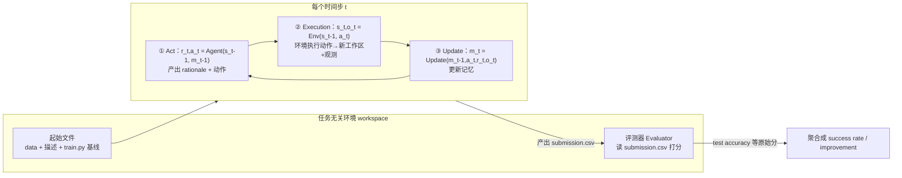

# 组会汇报 · MLAgentBench（2310.03302）

> 主讲提示：这是评测组（E 组）的「0 号基准」。读它不是为了某个 trick，而是要弄清——**当我们说「agent 会做 ML 实验」时，到底在测什么、怎么打分**。它定义的任务套件、动作空间、`success rate` / `improvement` 两个指标，被后来的 MLE-bench、RE-Bench 直接继承或针对性改造。把这条「指标谱系」讲清楚，是今天的核心。

---

## 1. 封面 · TL;DR

- **作者/出处**：Qian Huang, Jian Vora, Percy Liang, Jure Leskovec（Stanford），arXiv 2310.03302，ICML 2024。代码开源：`https://github.com/snap-stanford/MLAgentBench`（原文脚注 2）。
- **一段话**：MLAgentBench 是**第一个评测语言 agent「做机器学习实验」端到端能力的基准**（原文 §1：first benchmark for evaluating agents capable of machine learning experimentation）。它把 ML 研究的核心动作——**设计实验、跑实验、读结果、迭代改进**——放进一个**任务无关 (task-agnostic) 的文件系统环境**：每个任务给一段任务描述、一组起始文件 (starter files)、一个评测器 (evaluator)；agent 可以**读写文件、执行 Python、检查输出**，最终产出一个 `submission.csv`，由评测器打分。论文同时构建了一个基于 **ReAct** 思想的 **research agent**（带反思 Reflection / 研究计划 Research Plan / 事实核查 Fact Check 的提示结构），在 **13 个任务**上横评 7 个 LLM。
- **三条带走的结论**：
  1. **可行但远不可靠**：最好的 **Claude v3 Opus** agent 平均 **成功率 37.5%**（原文 §1、Table 3），但跨任务方差极大——在老牌任务 house-price 上 **100%** 成功，在新近 Kaggle / BabyLM 上低到 **0–25%**。
  2. **两把尺子**：基准把「会不会做」拆成两个互补指标——**成功率 (success rate)**＝在多次试验里把性能指标相对 starter code 基线**提升 ≥10%** 的比例；**平均提升 (average improvement)**＝相对基线的百分比提升均值（原文 §2.3、Table 4）。二者可背离：GPT-4 平均提升更高（41.3%）但成功率更低（19.2%）。
  3. **两大顽疾被点名**：**长程规划 (long-term planning)** 与 **幻觉 (hallucination)**——agent 常「没跑代码就声称改进了」。基准甚至为此在 agent 里专门设计了 `Fact Check` 条目来对抗（原文 §1、§3、Appendix D.2）。

> 主讲提示：开场把「37.5% 听起来不高，但这是 2024 年初的奠基线」和「成功率与提升会打架」两点抛出来——后者是今天最值得展开的指标设计问题。

---

## 2. 问题与动机（why —— 本节最该讲透）

**ML 研究的本质是什么？** 原文 §1 开宗明义：机器学习的进步主要由**有效的实验 (experimentation)** 驱动——给定任务（如图像分类），研究者设计方法（选架构、选学习算法）、跑实验、看结果，再根据结果（如验证精度）**迭代改进**。这个**迭代循环**很难，因为它要求：(a) 掌握大量潜在方法的先验知识；(b) 写出**能跑的代码**；(c) **解读实验结果**以指导下一步。

**为什么「现在」要把它交给 LLM？** 两条线索（原文 §1）：
- 一边，社区早有「自动化 ML 某一环」的努力——**神经架构搜索 (NAS)**（Elsken 2019）、**AutoML**（He 2021）——但它们**只覆盖搜索/调参这一小块**，搜索空间和目标都被人写死。
- 另一边，先进 LLM 已能理解并生成**类人文本与代码**，于是出现了一个新机会：**能不能让 agent 端到端地自主完成 ML 实验？**（原文 §1 原话：Can we develop an agent capable of conducting machine learning experimentation autonomously?）

**但「自主做实验」此前无法被严肃评测。** 这正是缺口：当时的 agent 基准（AgentBench、WebArena、ARA）测的是**固定简单任务、网页交互、或高风险场景**（原文 §5.1），**没有一个**专门测「agent 在真实 ML 实验流里能不能把模型做得更好」。没有统一的任务、动作、评分，就无法回答「LLM agent 到底会不会做 ML 研究」。

**这篇的赌注（核心动机）**：造一个**通用框架**——只要能把一个 ML 任务写成「任务描述 + 起始文件 + 评测器」，就能自动评测任意 agent；并配一套**覆盖不同难度与新近度**的任务，既测能力、又测**数据污染 (data contamination) 下的泛化**（原文 §2.4：故意纳入 LLM 预训练之后才发布的 Kaggle 挑战，看 agent 能否外推到没见过的数据）。一句话：

> **不是再优化 ML 的某一环，而是第一次把「agent 会不会做完整 ML 实验」变成一个可自动、可复现、可比较的测量问题。**

**为什么「可解释/人类增强」也是动机而非附属**：原文 §1 特别强调——虽然基准为简化以「全自动」框定，但作者看重 **可解释性 (interpretability)** 与**人类介入的接口 (a hook for human augmentation)**：研究者可以在 agent 探索时介入、编辑它的工作区或计划。这埋下了「agent 不是替代而是增强研究者」的立场。

> 主讲提示：这一节是 why 的核心。三点讲清——①ML 进步＝实验迭代；②过去只自动化「调参一环」、且无从评测「整条流」；③故意用「预训练后发布的数据」防作弊、测泛化。后面 how 就顺了。

---

## 3. 研究问题 / 核心 intention（形式化成一句话）

把要解决的问题压成一句（原文 §1–§2）：

> **给定一个用「任务描述 + 起始文件 + 评测器」三件套刻画的 ML 任务，一个只能读写文件、执行 Python、检查输出的语言 agent，能否自主地把某个性能指标（如测试精度）相对 starter code 基线显著提升？我们如何统一、自动地测量并比较不同 agent 的这种能力？**

它隐含的**假设**：
- (a) ML 实验的「研究者循环」可以被**还原为文件系统上的一串动作**（读/写/执行/检查），从而被一个任务无关环境统一承载；
- (b) **「相对 starter code 基线提升 ≥10%」**是一个足够操作化、跨任务可比的「成功」判据（原文 §2.3 明确取 10% 阈值）；
- (c) 用**新近发布的数据集**可以近似隔离「真本事」与「背了训练数据」。

---

## 4. 相关工作定位（站在谁肩上、和谁不同）

| 方向 | 代表工作 | 与 MLAgentBench 的关系 |
|------|----------|----------------------|
| LM agent 框架 | **ReAct**(Yao 2023)、**Reflexion**(Shinn 2023)、AutoGPT、Voyager(Wang 2023a)、Toolformer(Schick 2023) | **思想来源**：本文的 research agent 直接基于 ReAct（推理+行动），借 Reflexion 做反思；并把 AutoGPT/LangChain 当**对照 agent** 评测（原文 §3、§4） |
| AutoML / NAS | He 2021、Elsken 2019 | 只自动化「调参/搜架构」一环，搜索空间人定；本文要测**开放式、代码级**的实验能力（原文 §1、§5.2） |
| LM for AutoML | AutoML-GPT(Zhang 2023c)、MLcopilot(Zhang 2023a) | 它们让 LLM 预测训练日志或一组超参；本文**不预测、而是真交互执行**、有完整文件系统自由度（原文 §5.2） |
| Agent 基准（其它侧面） | **AgentBench**(Liu 2024)、**WebArena**(Zhou 2023)、**ARA**(Kinniment 2023) | 测固定简单任务 / 网页交互 / 高风险场景；本文提供「**containment + complexity + evaluability + 实用性**」组合下的 ML 实验测试床（原文 §5.1） |
| 自动科学发现 | Robot Scientist "Adam"(King 2009/2004)、Kitano 2021、Kramer 2023 | 高度定制于特定数据/领域；本文目标是**通用、多领域**的研究助手（原文 §5.3） |
| **本篇** | **MLAgentBench** | **第一个**专测「agent 端到端做 ML 实验」的基准 + 一个可解释的 ReAct 式 research agent |

> 主讲提示：一句话概括——「ReAct/Reflexion 给了它 agent 的脑子，AutoML 是它要超越的旧范式，AgentBench/WebArena 是它的同辈但测的是别的场景」。它的独占位是：**ML 实验这件事，第一次有了基准**。

---

## 5. 方法总览（big picture，先直觉后数学）

MLAgentBench = **环境 (environment) + 任务套件 (tasks) + 评测 (evaluation)** 三件套，外加论文自带的一个 **research agent**（原文 §2、§3）。先看 agent 与环境如何逐步交互（原文 §2.2、Figure 1/2）：



**直觉**：把 agent 想成一个坐在终端前的研究者——眼前是一个 `workspace/` 文件夹（数据、数据说明、评测说明、一份能跑的基线 `train.py`）。它**反复地**：想一步（要干嘛、为什么）→ 执行一个动作（读文件 / 改 `train.py` / 跑脚本 / 看日志）→ 把结果记进记忆 → 再想下一步。直到它**自己声明「最终答案」**或**超出动作/时间上限**被强制关停。最终工作区里的 `submission.csv` 被评测器打分（原文 Figure 1 标注）。

**三件套各自的角色**（原文 §2.1）：
- **任务描述 (task description)**：自然语言写明目标与提交格式，如「给定 `train.py`，改进当前模型性能」「把每类预测概率存到 `submission.csv`」，有时含约束（限模型大小、限训练 epoch）或方向提示（如「微调一个预训练 BERT」）。
- **起始文件 (starter files)**：训练/测试数据（**不含测试标签**）、详细数据说明、指标说明、starter code。starter code 多基于 PyTorch/TensorFlow/JAX/Keras，**通常实现一个简单基线模型**以供对比；**少数任务无基线**，需 agent 从零写（原文 §2.1 Starter Files、Appendix B）。
- **评测器 (evaluator)**：各任务自带，给提交一个**原始分 (raw score)**，典型如 `submission.csv` 的测试精度（原文 §2.1 Evaluator）。

---

## 6. 符号与术语表（后文统一用）

| 记号 / 术语 | 含义（出处） |
|------------|------------|
| $t=1,\dots,T$ | 时间步；agent 与环境交互的轮次（原文 §2.2） |
| $s_t$ | 第 $t$ 步的**工作区状态 (workspace)**：当前所有文件与目录的快照（原文 §2.2、§2.3） |
| $a_t$ | 第 $t$ 步的**动作 (action)**，取自固定动作集（见 §7 / Table 1） |
| $o_t$ | 第 $t$ 步的**观测 (observation)**：环境执行 $a_t$ 后返回的输出（如脚本日志）（原文 §2.2） |
| $r_t$ | 第 $t$ 步的 **rationale（理据）**：agent 在动作前产生的反思/计划/思考文本（原文 §2.2、Eq.1） |
| $m_t$ | 第 $t$ 步的**记忆 (memory)**：供下一步决策的内部状态；本文 agent 取 $m_t=(o_{<t}, r_{<t})$（原文 §3） |
| $\mathrm{Agent}(\cdot)$ | agent 函数：由 $(s_{t-1}, m_{t-1})$ 产出 $(r_t, a_t)$（原文 Eq.1） |
| $\mathrm{Env}(\cdot)$ | 环境转移函数：由 $(s_{t-1}, a_t)$ 产出 $(s_t, o_t)$（原文 Eq.2） |
| $\mathrm{Update}(\cdot)$ | 记忆更新函数（原文 Eq.3） |
| performance metric | 任务的**性能指标**（如测试精度、MAE、SMAPE、Dice）（原文 Table 2） |
| baseline | starter code 里基线模型在该指标上的取值；无基线任务用平凡基线（如 imdb 用 0.5 随机精度，原文 Appendix B） |
| success rate | **成功率**：多次试验中「相对基线提升 ≥10%」的比例（原文 §2.3） |
| improvement | **（相对基线的）提升**：性能指标相对 baseline 的百分比改进（原文 §2.3、Table 4） |

---

## 7. 方法细节 ① 环境的动作空间（agent 能做什么 = 基准的「能力边界」）

> 主讲提示：动作空间是 benchmark 最被低估、却最被后人继承的设计。它决定了「agent 被允许做哪些 ML 操作」。讲透它，才懂为什么 MLE-bench/RE-Bench 后来要扩。

**why（为什么是文件系统 + 执行 Python，而不是更高层 API）**：作者要的是**开放式、全自由度**的实验能力——「能对文件系统和任意 Python 脚本做操作」，而非在一个被人限定的搜索空间里选选项（原文 §2.2.1、§5.3 对比 AutoML）。所以动作集刻意贴近一个真实研究者在终端能干的事。

**动作清单**（原文 **Table 1**，分两类）：

**(a) 基本动作 (primitive)**——文件系统 + 执行：

| 动作 | 输入 | 观测 | 副作用 |
|------|------|------|--------|
| List Files | 目录 | 文件列表 | 无 |
| Read File | 文件名 | 文件内容 | 无 |
| Write File | 文件名, 内容 | 成功/错误 | 写入文件 |
| Append File | 文件名, 内容 | 成功/错误 | 追加到文件 |
| Copy File | 源, 目标 | 成功/错误 | 复制文件 |
| Inspect Script Lines | 文件名, 起止行号 | 该区间内容 | 无 |
| Undo Edit Script | 文件名 | 撤销后的内容 | 文件回退到上次编辑前 |
| Execute Script | 文件名 | 脚本输出/报错 | 脚本的任何副作用 |
| Final Answer | 无 | 无 | **环境关停** |

**(b) 复合动作 (compound)**——由多个基本动作 + 独立 LLM 调用组合而成（原文 §2.2.1 末、Table 1 注）：

| 复合动作 | 作用（原文 §2.2.1） |
|----------|--------------------|
| **Understand File** | 给文件名 + 一个简短查询（如「模型架构是什么」），读文件并**调一个 LLM** 按查询摘要，返回带**行号引用**的检索结果 |
| **Edit Script** | 给文件名 + 一条编辑指令（如「把学习率改成 1e-3」）+ 保存名；**调 LLM** 据指令改写整份文件并写回 |
| **Edit Script Segment** | 同上但带起止行号，只改区间；**对大代码库**（如 CLRS、BabyLM）尤其有用 |

> 直觉：基本动作是「手」（精确但琐碎），复合动作是「带 LLM 的工具」（一句话让另一个 LLM 帮你改/读代码）。复合动作把「理解一个大文件」「做一处大改」从几十步压成一步——这是为长程任务降复杂度的关键设计。

**读出什么**：动作空间里**没有**联网搜索、没有外部知识库调用（与 AutoGPT 形成对比，原文 §4 指出 AutoGPT「有 Google search 等复杂得多的工具」）。基准刻意把 agent 关在**自包含工作区**里——这既是 **containment（可控/安全）** 的考虑（原文 §5.1 强调 containment 是 agent 基准应有的性质），也意味着它测的是「**给定数据与代码、靠推理与试错**」的能力，而非「会不会上网抄答案」。这条边界，正是后来 MLE-bench（容许更接近 Kaggle 真实工作流）和 RE-Bench（更难、更贴前沿研究）要重新权衡的地方。

---

## 8. 方法细节 ② 环境的形式化（三步转移）

> 主讲提示：这三个式子是基准的「物理定律」。它们简单到一眼能懂，但要逐符号点出——尤其 $m_t$ 的定义，决定了 agent 有没有「记性」。

**why**：要让「任意 agent」都能插进同一个环境被公平评测，必须把「一步交互」抽象成与具体 agent 无关的转移函数。原文 §2.2 把每个时间步拆成三段：

**① Act（行动）**——直觉：agent 看着当前工作区与记忆，先想清楚再出手。
记号：$s_{t-1}$ 上一步工作区；$m_{t-1}$ 上一步记忆；输出 $r_t$ 理据（反思/计划）、$a_t$ 动作。

$$ r_t,\, a_t \;=\; \mathrm{Agent}(s_{t-1},\, m_{t-1}) \tag{原文 Eq.1} $$

读出什么：动作**显式地以「理据 $r_t$」为前导**——这是 ReAct「先推理后行动」的体现，也为后面把 $r_t$ 拆成 Reflection/Plan/FactCheck 留好接口。

**② Execution（执行）**——直觉：环境是「世界」，把动作作用到工作区上，吐回结果。
记号：环境根据上一步工作区 $s_{t-1}$ 与动作 $a_t$，产出新工作区 $s_t$ 和观测 $o_t$。

$$ s_t,\, o_t \;=\; \mathrm{Env}(s_{t-1},\, a_t) \tag{原文 Eq.2} $$

读出什么：状态转移**只由动作驱动**，agent 的「想法」不直接改世界——这把「思考」和「行动后果」干净分开，便于评测和审计（原文 §2.3 说要收集整条交互轨迹 $a_{1:T},r_{1:T},o_{1:T},s_{1:T}$ 供评估）。

**③ Update（更新记忆）**——直觉：把这一步的动作、理据、观测都记下来，供以后参考。
记号：旧记忆 $m_{t-1}$ + 本步 $a_t,r_t,o_t$ → 新记忆 $m_t$。

$$ m_t \;=\; \mathrm{Update}(m_{t-1},\, a_t,\, r_t,\, o_t) \tag{原文 Eq.3} $$

读出什么：**记忆是 agent 的设计自由**，基准不强制其形式。本文 agent 取最朴素的 $m_t=(o_{<t}, r_{<t})$（原文 §3），即「把过去的观测与理据当历史」。

**终止条件**（原文 §2.2 末）：agent 可执行**可变步数**直到自己提交 Final Answer，或因**超出最大动作数 / 最大时间**被环境强制关停。

---

## 9. 方法细节 ③ 任务套件（13 个任务：测什么、为什么这么选）

> 主讲提示：任务套件是 benchmark 的「考卷」。重点不是背 13 个名字，而是讲清**它按「难度×新近度」铺开**的设计意图——这正是后来基准沿用的「防污染」思路。

**why（选任务的两条原则，原文 §2.4）**：
1. **跨难度与新近度**：既含 CIFAR-10 这类被研究透的老数据，又含 LLM 预训练之后才上线的开放挑战——目的是**测泛化、缓解数据污染**（agent 没在这些新数据上「背过书」）。
2. **执行成本要低**：13 个任务的代码执行都相对廉价（**分钟量级**），便于大规模评测（原文 §2 原话：code execution is relatively inexpensive—on the order of minutes）。

**13 个任务全表**（原文 **Table 2**）：

| 类别 | 任务类型 | 模态 | 数据集 | 评测指标 |
|------|---------|------|--------|---------|
| Canonical（经典） | 分类 | 图像 | CIFAR-10 | 分类精度 |
| Canonical | 分类 | 文本 | imdb（情感分类） | 分类精度 |
| Canonical | 节点分类 | 图 | ogbn-arxiv | 分类精度 |
| Classic Kaggle | 回归 | 表格 | house-price | 平均绝对误差 MAE |
| Classic Kaggle | 分类 | 表格 | spaceship-titanic | 分类精度 |
| Kaggle Challenges | 回归 | 时序 | parkinsons-disease | SMAPE |
| Kaggle Challenges | 分类 | 图像 | fathomnet | MAP@20 |
| Kaggle Challenges | 回归 | 文本 | feedback | MCRMSE |
| Kaggle Challenges | 分割 | 图像 | identify-contrails | Dice 系数 |
| Recent Research | 节点回归 | 图 | CLRS | 均方误差 MSE |
| Recent Research | 语言建模 | 文本 | BabyLM | 困惑度 Perplexity |
| Code Improvement | 提速 | 文本 | llama-inference | 墙钟时间 Wall Clock Time |
| Code Improvement | 提速 | 图像 | vectorization | 墙钟时间 Wall Clock Time |

**分组逻辑与代表例**（原文 §2.4、Appendix B）：
- **Canonical（经典）**：CIFAR-10 / imdb / ogbn-arxiv，研究透、便于迭代。CIFAR-10 与 ogbn-arxiv 是「**改进已有基线**」；imdb 要求**从零写**（任务描述里点明要微调一个 BERT）。
- **Classic Kaggle**：house-price（回归）、spaceship-titanic（分类）两个入门 Kaggle，主要考**特征工程 + 从零训练 + 正确走 Kaggle 提交流程**，**不提供基线**。
- **Kaggle Challenges**：4 个 2022-08-31～2023-05-11 间上线的**新近开放挑战**，测**更真实、分布外 (OOD)** 的泛化（关键的「防污染」组）。
- **Recent Research**：CLRS（图/列表上预测经典算法输出）、BabyLM（在 10M 词上训语言模型）——两个**尚无共识解**、正被active研究的方向。
- **Code Improvement**：llama-inference、vectorization，目标是**提速**而非提精度（优化运行时，不优化预测）——这是和「提性能」正交的一类任务。

**关键提醒**：标题/摘要说「**13 tasks**」，但主结果 **Table 3/4 列了 14 行**（多出 cifar10 与 CLRS 之外，文本/图像版的 spaceship、ogbn 等齐全）——实际上 Table 2 是 13 个数据集，结果表逐数据集一行；**摘要中的「from 100% ... to 0%」对应 house-price 与 BabyLM**（原文 §4.1）。引用时以 Table 2/3 的具体行为准。

---

## 10. 方法细节 ④ ResearchAgent 框架（动作 / 记忆 / 反思——本篇重点）

> 主讲提示：注意区分两件事——**MLAgentBench 是基准**（任意 agent 都能来测），**ResearchAgent 是论文自带的「参赛选手」**。这一节讲后者：它的提示结构如何把 ReAct + Reflexion 落地。这套结构（Reflection/Plan/FactCheck）是它对抗幻觉与长程规划的核心招数。

**why（为什么要在 ReAct 上加结构）**：朴素 ReAct 只有「思考→行动」。但 ML 实验是**长程**任务，最大失败模式是**幻觉**（没跑代码就声称改进）和**计划漂移**（中途陷在 debug 出不来）。作者据此**显式增设三种记忆条目**来「逼」模型自我约束（原文 §3、§3.1、Appendix D）。

**how（提示结构，原文 §3.1、Figure 2、Appendix F）**：每步 agent 被要求**严格按固定格式**输出 $r_t$，再给 `Action` / `Action Input`（JSON）：

- **Reflection（反思）**：对上一步观测的反思，灵感来自 **Reflexion**（Shinn 2023）——「这条观测什么意思？若报错，错因与如何 debug？」
- **Research Plan and Status（研究计划与状态）**：一份**高层计划 + 进度追踪**，设计目的是「产生更好的规划并记录已做了什么」。要求**用 `**双星号**` 标注本步新增**、未确认的不许写进来、性能数字**只能在跑了代码看到输出后**才能写入（原文 Appendix F 提示原文）。这是**长程可解释规划**的载体（原文 §4.2 称其 entries「highly detailed and interpretable」）。
- **Fact Check（事实核查）**：逐条核对「Research Plan 的更新是**靠猜 (guessed)** 还是**被上一条观测直接确认 (directly confirmed)**」。**这是专门为对抗幻觉设计的**（原文 §3、Appendix D.2）。
- **Thought（思考）→ Action → Action Input**：类 ReAct 的行动决策（原文 §3.1）。

**记忆 (memory)**：上下文里塞入**任务描述 + 全部可用工具说明 + 最近 3 步的 $(r,a,o)$**（原文 §3、Figure 2：past three steps of observations）。即 $m_t=(o_{<t}, r_{<t})$，但 prompt 实际只回看**近 3 步**以控长度。

**动作循环（mermaid，对应原文 Figure 2）**：

```mermaid
flowchart TD
  P["构造 prompt p_t<br/>= 任务描述 + 工具表 + 近3步(r,a,o)"]
  P --> LM[查询 LLM: r_t, a_t = LM(p_t)]
  LM --> R["解析 r_t：Reflection / Research Plan&Status / Fact Check / Thought"]
  R --> A["解析 a_t：Action + Action Input(JSON)"]
  A --> X[环境执行动作]
  X --> O[得到观测 o_t]
  O --> M["更新记忆（把 r_t,a_t,o_t 入历史）"]
  M --> P
  A -. 若 Final Answer .-> END[环境关停 → 评测 submission.csv]
```

**它与对照 agent 的关键差异**（原文 §4）：
- **本文 agent vs LangChain「zero-shot-react-description」**：后者也实现 ReAct，但**没有 Research Plan/Status 与 Fact Check** 条目——所以对照实验能直接看出「加这两块值不值」。
- **本文 agent vs AutoGPT**：AutoGPT 工具复杂得多（含 Google search）。

**Fact Check 到底防住了什么（原文 Appendix D.2，极具教学价值）**：
- 设计意图：让模型自查「性能更新是否已被运行确认」，例：`Fact Check: Performance after running train_dropout.py still needs to be evaluated.`
- **但它并不能完全防幻觉**：作者观测到 Claude-1 的 **20% 的 run** 仍会出现「baseline=51.80% 明明就写在上面，却声称提升 10% 达到 26.35%（数字反而更低）」这类自相矛盾的幻觉（原文 D.2）。
- 另一个长程失败模式（原文 D.1）：当 agent 计划一处**过于复杂的编辑**、陷进 debug 出不来——**Claude v1.0 的 40% 的 run** 卡在这里，且「之后很难恢复」。
- 还有 **Problem Misspecification**（原文 D.3）：曾在 parkinsons（SMAPE，**越低越好**）任务上，agent **不知道 SMAPE 是越低越好**，反而去「提高 SMAPE」——说明**任务描述里指标方向必须写清**，否则 agent 会优化反方向。

---

## 11. 实验设置（setting / params / 算力 / 成本，写全）

> 主讲提示：这一节是「指标 + 参数写全」的样板，组会最容易被追问。重点把**两个评测指标的精确定义**讲到位。

**被测 agent / 模型**（原文 §3、§4）：
- **底座 LLM（7 个）**：GPT-4 (0613)、GPT-4-turbo (0125)、Claude v1.0、Claude v2.1、**Claude v3 Opus (opus-20240229)**、Gemini Pro、Mixtral (Instruct-v0.1)。
- **对照 agent 框架**：本文 ResearchAgent、**AutoGPT**、**LangChain**（zero-shot-react-description）。

**运行预算 / 随机性**（原文 §4）：
- **每个 agent 跑 8 次 (8 runs)** 取统计。
- 多数 run：**最多 50 个动作 / 最多 5 小时**；**GPT-4 因 API 成本只允许 30 个动作**。

**两个核心评测指标（原文 §2.3，务必逐条讲清）**：

**指标一 · 成功率 (success rate)**——
> 直觉：我们想知道「agent 有多大概率真把模型做得明显更好」。「明显」需要一个客观门槛，作者取**相对 starter code 基线提升 10%**。

记号（先定义）：对某任务，设 $M_{\text{final}}$ 为某次 run **最终工作区**被评测器算出的性能指标，$M_{\text{base}}$ 为 starter code 基线在该指标上的值；$N$ 为该 (任务, 模型) 的 run 数（本文 $N=8$）；$\mathbb{1}[\cdot]$ 为指示函数；「提升 10%」按指标方向理解（精度类是更高、误差类是更低）。单次 run 的「成功」定义为

$$ \text{success}^{(i)} \;=\; \mathbb{1}\!\left[\ \text{性能相对基线提升} \ \ge 10\%\ \right],\qquad i=1,\dots,N $$

成功率即多次 run 的成功比例：

$$ \text{success rate} \;=\; \frac{1}{N}\sum_{i=1}^{N}\text{success}^{(i)} . $$

读出什么：成功率是个**二值化、对「是否跨过 10% 门槛」敏感**的指标——它**不在乎超出多少**，只在乎「过没过线」。Table 3 的每个格子＝该 (任务,模型) 在 8 次 run 中成功的百分比（原文 Table 3 注：percentage over 8 trials where the agent achieves a 10% improvement）。

**指标二 · 平均提升 (average improvement)**——
> 直觉：成功率会「浪费」掉「提升了 8%（没过线）」和「提升了 80%」之间的全部信息。于是再报一个**连续**指标：相对基线的百分比提升均值，衡量「改进的幅度」。

记号：对**在最后一步做了有效提交**的那些 run，取其相对基线的百分比提升 $\Delta^{(i)} = \big(M^{(i)}_{\text{final}}-M_{\text{base}}\big)/M_{\text{base}}\times100\%$（方向按指标定，下同），在这些 run 上求均值：

$$ \text{average improvement} \;=\; \frac{1}{|\mathcal{V}|}\sum_{i\in\mathcal{V}}\Delta^{(i)},\qquad \mathcal{V}=\{\text{最后一步有有效提交的 run}\}. $$

读出什么：Table 4 报的就是它。两点要害——
1. **只在「有有效提交」的 run 上平均**（原文 Table 4 注：among the runs that made a valid submission at the last step）——所以一个**经常崩、但偶尔大涨**的 agent，平均提升可能虚高。
2. **无基线任务的提升无法良定义**：原文 Table 4 注**亲口吐槽**——「对没有基线的任务，怎么算 improvement？技术上任何非零提升都是无穷大百分比」（how do you compute improvement? technically any non-zero improvement is infinite percent increase）。这是基准**自承的指标缺陷**。

**效率指标 (efficiency)**（原文 §2.3、§4.3）：用**总墙钟时间**与**消耗的总 token 数**（输入+输出）衡量。

**成本 (cost)**（原文 §4.3）：折算当时 API 价格，**每个任务每次 run 仅几美元**；GPT-4-turbo 跑**整个基准一次约耗 600 万 token ≈ $60**；但因平均成功率仅 26%，**期望「成功完成一个任务」的成本约 $231**——作者借此论证「**可靠性**对可用性至关重要」。

---

## 12. 主要结果（数字 + 解读，别只贴表）

> 主讲提示：这一节有两张关键表（成功率 Table 3、提升 Table 4），核心叙事是**「二者会打架」**。把这条讲清，就讲清了这篇 benchmark 最有价值的方法学贡献。

**结果一 · 成功率（原文 Table 3，节选 + 平均）**：

| 任务 | GPT-4 | GPT-4-turbo | Claude v1.0 | Claude v2.1 | **Claude v3 Opus** | Gemini Pro | Mixtral | Baseline |
|------|------|------|------|------|------|------|------|------|
| cifar10 | 25.0 | 25.0 | 12.5 | 25.0 | **62.5** | 12.5 | 25.0 | 0.0 |
| ogbn-arxiv | 87.5 | 62.5 | 37.5 | 62.5 | 87.5 | 37.5 | 87.5 | 0.0 |
| house-price | 12.5 | 87.5 | 75.0 | 87.5 | **100.0** | 100.0 | 12.5 | 0.0 |
| spaceship-titanic | 12.5 | 50.0 | 12.5 | 75.0 | **100.0** | 87.5 | 0.0 | 0.0 |
| feedback | 12.5 | 37.5 | 0.0 | 37.5 | **87.5** | 0.0 | 0.0 | 0.0 |
| identify-contrails | 25.0 | 62.5 | 12.5 | 25.0 | 0.0 | 0.0 | 0.0 | 40.0 |
| parkinsons / fathomnet / vectorization / BabyLM | 0.0 | 0.0 | 0.0 | 0.0 | 0.0 | 0.0 | 0.0 | 0.0 |
| **平均** | 19.2 | 26.0 | 16.3 | 26.0 | **37.5** | 18.3 | 3.8 | 10.4 |

**读出什么**：
- **Claude v3 Opus 平均成功率 37.5%，全场最高**（原文 §1、§4.1），且**8 个任务能成功**（原文 §4.1 原话 over 8 runs）。它在 house-price / spaceship-titanic 上 **100%**，但在 **BabyLM 上 0%**——这就是摘要「from 100% on well-established datasets to as low as 0% on recent Kaggle challenges」的来源。
- **同代际模型内有正向进步**：Claude v1.0 → v2.1 → v3 Opus 成功率单调上升（16.3→26.0→37.5）（原文 §4.1：a general positive progression）。
- **新近 Kaggle / 研究任务普遍 0%**：parkinsons、fathomnet、vectorization、BabyLM 全模型挂零——印证「agent 在没见过的、真实分布外任务上几乎不会做」（原文 §4.1：struggles with Kaggle challenges and BabyLM, only 0–25%）。
- **identify-contrails 出现「负成功率信号」**：baseline 一栏是 40.0，多数 agent 反而打不过——提醒「有基线且基线不弱」时 agent 多脆弱。

**结果二 · 平均提升（原文 Table 4，节选 + 平均）**：

| 任务 | GPT-4 | GPT-4-turbo | Claude v1.0 | Claude v2.1 | Claude v3 Opus | Gemini Pro | Mixtral |
|------|------|------|------|------|------|------|------|
| imdb | 86.4 | 86.2 | 0.0 | 0.0 | 82.0 | 0.0 | 0.0 |
| house-price | 100.0 | 100.0 | 100.0 | 100.0 | 100.0 | 100.0 | 100.0 |
| feedback | 78.0 | 68.1 | 0.0 | 32.8 | 74.5 | 0.0 | 0.0 |
| identify-contrails | **143.3** | 114.9 | -48.9 | 24.1 | 0.0 | **-98.8** | 0.0 |
| CLRS | 26.5 | -24.2 | 0.6 | -22.1 | -11.6 | -28.7 | -6.6 |
| **平均** | **41.3** | 32.8 | 8.9 | 15.0 | 26.1 | -3.6 | 8.0 |

**读出什么（核心叙事：两指标背离）**：
- **GPT-4 平均提升 41.3%（最高），但成功率仅 19.2%（中下）；Claude v3 Opus 提升 26.1%（中），成功率 37.5%（最高）**。原文 §4.1 亲自点破：简单平均会**夸大** GPT-4 比 Claude v3 强多少，因为它**主要被 identify-contrails 上的高提升带动**（GPT-4 在该任务 143.3%）。
- **结论**：**「平均涨幅大」≠「稳定能成功」**。GPT-4 更像「偶尔大涨、但常常过不了 10% 线或直接崩」；Claude v3 Opus 更像「涨得不极端、但跨过门槛的次数多、也更不容易幻觉」（原文 §4.1、§4.2 末：GPT-4 更易幻觉与坏计划）。
- **Gemini Pro 平均提升 -3.6%（负）**：很多 run 把模型改**更差**了。
- **house-price 全员 100%**：因该任务**无基线**，提升按平凡基线算，几乎必然「无穷/满格」——再次暴露 §11 指出的「无基线任务提升不可比」问题。

**对照 agent 框架（原文 §4.1、Table 5）**：本文 agent **平均成功率全面胜过** AutoGPT 与 LangChain——以 Claude v3 Opus 计，**Ours 37.5 vs AutoGPT 13.5 vs LangChain 33.7**；以 GPT-4-turbo 计，**Ours 26.0 vs AutoGPT 2.9 vs LangChain 1.0**。但作者诚实指出：**LangChain + Claude v3 很有竞争力（33.7）**，部分因为它更简单、不擅自改提交格式（原文 §4.1）。

---

## 13. 消融与分析（哪个设计在起作用、轨迹长什么样）

> 主讲提示：这节把「成功率数字」背后的**过程**摊开——尤其「跑得越久反而越差」和「失败模式分布」，是 benchmark 真正的洞见。

**分析一 · 跑得越久越差，唯 Claude v3 例外（原文 §4.1、Figure 3）**：作者不止评最后一步，而是**对每个中间步**都重算性能取平均。结论：**步数变多，性能普遍退化 (degrade)**——只有 **Claude v3 Opus 例外**（能随步数继续涨）。这直指 **long-horizon 规划弱**：多数模型越走越偏。

**分析二 · CIFAR-10 上的失败模式分类（原文 §4.2、Figure 5）**：把所有 run 归为 6 类——
1. **Hallucination（幻觉）**：没做任何编辑/执行就声称有性能提升；
2. **Bad Plan（坏计划）**：做不出能带来直接进展的计划（如一直在丢特征却没找到对预测有用的）；多发生在**前期**，且**之后难恢复**；
3. **Response Format Error**：输出非法 JSON，无法解析；
4. **Submission Format Error**：把 `submission.csv` 格式改坏，评测器认不出（即便预测本身是好的）；
5. **Small Improvement（小改进）**：成功改进但**没到 10%**（——正是被成功率门槛「漏掉」的那部分）；
6. （成功）。
**关键观察**：**GPT-4 系的 run 比 Claude v3 更易陷入幻觉与坏计划**（原文 §4.2 原话：GPT-4 based agent is more prone to hallucinations and poor planning compared to the Claude v3 Opus based agent）。Figure 5 中 **Mixtral 的 Response Format Error 高达 ~75%**——弱模型常死在「连合法 JSON 都产不出」。

**分析三 · 动作占比与步数分布（原文 Appendix C、Figure 7）**：各 agent 把**大部分时间花在 Execute Script** 上（Claude v3 / Gemini 尤甚，~70%）；步数分布上，**Mixtral 常很早就停**，而 **Gemini Pro 常顶满 50 步**。

**分析四 · 效率（原文 §4.3、Figure 6）**：**GPT-4-turbo 最省**——比平均少花 51% 的 token，却仍保持较高成功率（早早完成并提交）；**Claude v3 Opus 花的 token 与墙钟时间几乎最多**（API 较慢 + 真在跑 ML 实验）。整体趋势：GPT-4 系「性能/token 比」更优，Claude 系「靠多花 token 换性能」。

**分析五 · Research Plan / Fact Check 的定性价值（原文 §4.2、Appendix D）**：`Research Plan and Status` 提供了**长程可解释的规划轨迹**（人能看懂 agent 在干嘛）；`Fact Check` 对抗幻觉——但二者都**不是银弹**（D.1 的 40%、D.2 的 20% 失败率如前述）。

---

## 14. 局限与批判（诚实，本课的灵魂）

**原文自承的局限（§1、§4、Appendix D，按教学价值排序）**：
1. **成功率方差极大、且对新数据近乎无能**：0–100% 跨度，新近 Kaggle/研究任务大面积 0%（§4.1）——「会做 ML 实验」目前**强烈依赖任务是否「老」**。
2. **幻觉未根治**：即便加了 Fact Check，仍有 20% run 自相矛盾地宣称改进（D.2）。
3. **长程规划弱**：40% run 卡在复杂编辑的 debug 里出不来（D.1）；多数模型跑越久越差（§4.1）。
4. **指标自身的缺陷（作者亲口承认）**：无基线任务的「提升」**不可良定义**（任何非零提升＝无穷大%，Table 4 注）；house-price 全员 100% 即此后果。
5. **Problem Misspecification 敏感**：任务描述含糊（如没说 SMAPE 越低越好），agent 会优化反方向（D.3）——基准成绩**对任务文案高度敏感**。

**社区/批判视角可补充的质疑（区分「论文宣称 vs 局限」）**：
- **「成功率」的二值门槛（10%）是人为的**：它把「提升 9.9%」判为彻底失败、把「提升 10%」判为成功，对门槛附近极不连续；且 10% 这个数**对不同任务的难度并不等价**（在 house-price 上提 10% 与在 BabyLM 上提 10% 完全不是一回事）。这是后续 MLE-bench 改用「**对标 Kaggle 真实排行榜 / 奖牌**」、RE-Bench 改用「**连续的、相对人类专家的归一化分数**」的直接动因。
- **「相对 starter code 基线」依赖基线质量**：基线弱则提升虚高（无基线任务尤甚），基线强（如 identify-contrails 的 40）则 agent 普遍打不过——**同一指标在不同基线下不可横比**。
- **8 次 run 的统计量偏小**，且只报均值/比例，**未报置信区间**（原文未给出方差/CI）。
- **动作空间无联网**：刻意为之（containment），但也意味着它**不测**「会不会查文献/找 SOTA 技巧」——而真实 ML 研究极依赖这一点。
- **数据污染只能缓解、不能消除**：用「预训练后发布」近似隔离，但 Kaggle 公开讨论/泄漏仍可能间接进入后续模型。

> 主讲提示：把「10% 二值门槛」单独强调——它是 MLAgentBench 最具争议、也最被后人改写的设计。一句话：**它第一个给出了「成功」的操作定义，也第一个暴露了这个定义的脆弱。**

---

## 15. 在 auto-research 版图的位置（指标谱系：它如何影响 MLE-bench / RE-Bench）

> 主讲提示：这是今天的「重点中的重点」。把 MLAgentBench → MLE-bench → RE-Bench 的**指标演化**画成一条线，组会的价值就立住了。

**阶梯定位**：在 Tool→Analyst→Scientist 阶梯里，MLAgentBench 测的是 **Tool/Analyst 层**——agent 在**给定任务与数据**下「把模型做得更好」，**不**自己提研究问题、不写论文、不评审（与 B 组 AI Scientist 形成鲜明对照）。它是**评测组（E）的奠基石**：先有「怎么测 agent 做 ML 实验」，才谈得上后面更难的基准。

**它定义、后人继承/改造的三样东西**：

| 维度 | MLAgentBench（2023/24，本篇） | MLE-bench（OpenAI，后续） | RE-Bench（METR，后续） |
|------|------|------|------|
| **任务来源** | 13 个自建任务（经典 + 新近 Kaggle + 研究 + 提速） | **75 个真实 Kaggle 竞赛**，贴近完整 Kaggle 工作流 | **7 个前沿 ML 研究工程**难题，对标人类研究员 |
| **成功判据（核心指标）** | **success rate**＝相对 starter 基线**提升 ≥10%** 的 run 比例（§2.3） | 改为**对标 Kaggle 排行榜**，按**奖牌 (bronze/silver/gold)** 达成率——更客观、跨任务可比 | 改为**连续归一化分数**（相对起点与人类专家），并显式**与人类时间预算对照** |
| **「提升」如何度量** | 相对 starter code 基线的百分比 improvement（Table 4），**无基线任务不可良定义** | 用真实排行榜分位/奖牌线，**回避了「无基线」难题** | 用专家设定的 score 函数，**回避了二值门槛的不连续** |
| **动作/环境** | 文件系统 + 执行 Python，**无联网**（containment） | 更接近真实 Kaggle（仍受控） | 给更长时间预算、更贴研究工程 |
| **它解决了 MLAgentBench 的什么痛点** | —— | 「10% 阈值人为」「无基线不可比」「任务非真实竞赛」 | 「门槛二值不连续」「缺与人类专家的直接对照」 |

**一句话谱系**：**MLAgentBench 第一个把「agent 做 ML 实验」操作化为可自动评分的任务**，并给出 `success rate`（二值阈值）与 `improvement`（相对基线）两把尺子；**它暴露的「阈值人为 / 无基线不可比 / 任务非真实」三个缺陷，恰好成了 MLE-bench（换成 Kaggle 奖牌）与 RE-Bench（换成连续归一化 + 人类对照）的设计起点。** 没有它定义的「任务三件套 + 文件系统动作空间」，后两者无从谈起。

**与本库其它文献的连线**：
- → **B 组 AI Scientist（2408.06292）**：它做 MLAgentBench 不做的事（提 idea、写论文、自评审）；但二者共享同一隐忧——**agent 会幻觉、会把变差说成改进**（MLAgentBench 的 Fact Check ≈ AI Scientist 写作阶段的「只报真实结果」约束，且都没根治）。
- ← **批判线**：MLAgentBench 自承的「幻觉 / 长程规划弱 / 指标缺陷」，正是后续批判文献（ARI、Hidden Pitfalls）反复敲打的点。

---

## 16. 复现与可用性

- **开源**：代码 `https://github.com/snap-stanford/MLAgentBench`（原文脚注 2）。Appendix F 给出 **agent 看到的完整 prompt + CIFAR-10 上一整段真实交互轨迹**（从 List Files → Inspect → Execute → 逐步更新 Plan），可直接照着复刻 agent 行为。
- **能不能在单卡/便宜地跑**：**任务侧很轻**——13 个任务执行都是分钟量级（§2），starter 的 CIFAR-10 基线就是一个两层卷积 + 三层全连接的小 CNN（Appendix F 代码：`Net` 类，`lr=0.1, momentum=0.9, batch=128, epochs=5`，5 epoch 测试精度 ~52.5%）。**真正的开销在 LLM API 调用**：整库一次 GPT-4-turbo ~600 万 token ≈ $60，单任务单 run 几美元（§4.3）。
- **坑**：
  1. **任务文案要写死指标方向**（否则 SMAPE 反优化，D.3）；
  2. **弱模型（Mixtral）大量死于非法 JSON**（Figure 5 ~75% format error）——复现弱模型时要对解析做容错；
  3. **GPT-4 限 30 步**、其它 50 步/5h——**预算不同会影响可比性**，横比时需对齐；
  4. **8 runs 才有意义**：单次 run 方差极大，别用单跑下结论。

---

## 17. 组会讨论问题（5–8 个）

1. **`success rate` 用「提升 ≥10%」当门槛**：10% 这个数对 house-price 和对 BabyLM 显然不等难度。如果让你重设判据，你会用「相对人类/排行榜的分位」还是「连续归一化分数」？各自代价是什么？（联想 MLE-bench 奖牌 vs RE-Bench 连续分）
2. **成功率与平均提升打架**（GPT-4 提升高但成功率低）：在「选一个 agent 上线」的场景下，你更信哪个指标？能否设计一个**同时捕捉「稳」与「猛」**的单一指标？
3. **Fact Check 仍漏 20% 幻觉、Research Plan 仍卡 40% 复杂编辑**：这两个「自我约束条目」是治标还是治本？有没有**不靠模型自检**的独立机制能更硬地挡住「没跑就声称改进」？
4. **动作空间刻意无联网（containment）**：这让基准更安全、更可控，但是否**系统性低估**了真实研究里「查文献找 trick」的能力？该不该有一个「带检索」的变体？
5. **「相对 starter code 基线」的提升度量**，在无基线任务上不可良定义、在强基线任务上人人不及格。基线的选取本身是不是一个被忽视的「实验设计变量」？
6. **数据污染**：用「预训练后发布」隔离够吗？如果一个模型的 cutoff 晚于某 Kaggle 挑战上线，这条 row 还算不算「泛化」证据？
7. **跑越久越差（除 Claude v3）**：这是「模型不会长程规划」还是「记忆只回看近 3 步」的环境设计所致？把记忆窗口加长，会改善还是引入更多幻觉？
8. **MLAgentBench → MLE-bench → RE-Bench**：如果再设计「下一代」ML 实验基准，你会先修复哪个缺陷（阈值 / 基线 / 联网 / 人类对照 / 统计严谨性）？为什么？

---

## 18. 一页速记（汇报当天速览）

- **是什么**：**第一个**评测「语言 agent 端到端做 ML 实验」的基准（Stanford, ICML 2024）。三件套刻画任务（**任务描述 + 起始文件 + 评测器**），任务无关的**文件系统环境**（读/写/执行 Python/检查），最终交 `submission.csv` 自动打分。
- **动作空间**：9 个基本动作（List/Read/Write/Append/Copy/Inspect/Undo/Execute/FinalAnswer）+ 3 个**带 LLM 的复合动作**（Understand File / Edit Script / Edit Script Segment）；**无联网**（containment）。环境三定律：`r,a=Agent(s,m)`（Eq.1）→ `s,o=Env(s,a)`（Eq.2）→ `m=Update(...)`（Eq.3）。
- **任务套件**：13 个，按「难度×新近度」铺开——Canonical(CIFAR-10/imdb/ogbn) / Classic Kaggle(house-price/spaceship) / 4 个新近 Kaggle 挑战 / Recent Research(CLRS/BabyLM) / Code Improvement(提速 ×2)。故意纳入**预训练后发布**的数据防污染、测泛化。
- **ResearchAgent（自带选手）**：ReAct + Reflexion，提示里强制 **Reflection / Research Plan&Status / Fact Check / Thought**；记忆 = 任务+工具+**近 3 步** (r,a,o)。Fact Check 专治幻觉，Research Plan 做长程可解释规划——**都没根治**。
- **两把尺子**：**success rate** = 8 次 run 中「相对 starter 基线提升 ≥10%」的比例；**average improvement** = 相对基线百分比提升均值（仅在「有有效提交」的 run 上算，**无基线任务不可良定义**）。二者**会背离**。
- **关键数**：最佳 **Claude v3 Opus 平均成功率 37.5%**（house-price 100% → BabyLM 0%）；GPT-4 **平均提升 41.3% 最高但成功率仅 19.2%**；vs 框架对照 Ours 37.5 > LangChain 33.7 > AutoGPT 13.5（Claude v3）；整库一跑 ~600 万 token ≈ $60，**期望成功完成一任务 ~$231**；**跑越久越差，唯 Claude v3 例外**。
- **三句话结论**：①**可行但不可靠**（37.5%，新数据近乎 0%）；②**两把尺子会打架**（稳 vs 猛）；③**幻觉与长程规划是两大顽疾**（Fact Check/Plan 治标不治本）。
- **在课里的位置**：评测组（E）**奠基石**；它定义的「任务三件套 + 文件系统动作空间 + success rate/improvement」被 **MLE-bench（换 Kaggle 奖牌）/ RE-Bench（换连续归一化 + 人类对照）** 继承并针对其缺陷改造。

> 主讲提示：结尾回到一句话——**「它第一个把『agent 会不会做 ML 实验』变成可测量的问题，也第一个暴露了『怎么测才算数』的全部难处。」** 整条评测谱系，就是在修它留下的坑。

---

## 自检（对照 _STYLE-GUIDE.md §5）

- [x] 每个公式前有直觉 + 全部符号先定义（Eq.1/2/3、success rate、average improvement 均逐符号定义）。
- [x] setting/metrics/params 齐全：7 模型 + 3 框架、8 runs、50/30 动作上限与 5h、两指标定义式、成本（$60/库、$231/成功任务）、效率（token/墙钟）。
- [x] 数字/公式均标出处（§1/§2.1-2.4/§2.3/§3/§3.1/§4.1-4.3/Table 1-5/Figure 1-7/Appendix B/C/D/F、Eq.1-3）。
- [x] why > how：动机两页（§2）、动作空间/任务/agent 均「先 why 后 how」。
- [x] 约 20 页、PPT 风格（小标题+要点+表格+2×mermaid+独立公式块+每节 `> 主讲提示`）、含 8 个讨论问题。
- [x] 区分「论文宣称 vs 局限」（§14 分两栏），原文未给处标注（如方差/CI「原文未给出」）。
- [x] 本篇重点已落实：动作空间/任务/指标如何影响 MLE-bench/RE-Bench（§15 谱系表）；success rate 与 improvement 定义及其背离（§11、§12）。
