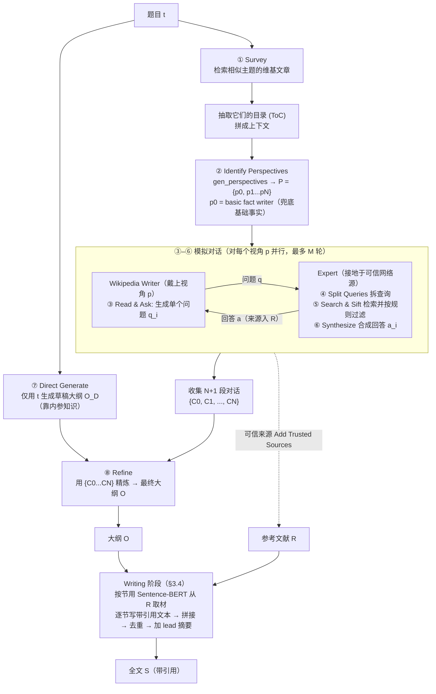

# 组会汇报 · STORM：从零写维基级长文

> 主讲提示：这篇是 D 组「Deep Research / 综述合成」的奠基样本。它最值钱的不是「又一个 RAG 写长文」，而是把人类写作里被忽视的 **pre-writing（预写作）** 阶段单拎出来，用两个机制（多视角 + 模拟对话）把「该问什么问题」这件事自动化。读它，是为了拿到「自动深度研究」的第一块拼图。

---

## 1. 封面 · TL;DR

- **作者/出处**：Yijia Shao, Yucheng Jiang, Theodore A. Kanell, Peter Xu, Omar Khattab, Monica S. Lam（Stanford University），NAACL 2024，arXiv 2402.14207。代码与数据开源：`github.com/stanford-oval/storm`。
- **一段话**：STORM（**S**ynthesis of **T**opic **O**utlines through **R**etrieval and **M**ulti-perspective Question Asking，「通过检索与多视角提问合成主题大纲」）研究**如何只给一个题目 (topic)、从零写出一篇有组织、带引用的维基百科式长文**。它把任务拆成两段：① **pre-writing**——研究题目、收集参考文献 $\mathcal{R}$、生成多级大纲 $\mathcal{O}$；② **writing**——按大纲逐节写出带引用的全文 $\mathcal{S}$。核心创新全在 pre-writing：用**多视角发现 (perspective discovery)** 找出该从哪些角度切入，再用**模拟对话 (simulated conversation)** 让「带视角的写手」向「接地于网络的专家」反复提问、迭代深挖。
- **三条带走的结论**：
  1. **问题重定位**：长文生成真正难的不是「写」，而是「写之前怎么研究 + 怎么搭骨架」。STORM 把 pre-writing 形式化为「研究即提问 (research via question asking)」，并造了配套数据集 FreshWiki 与大纲评测指标。
  2. **提问质量 = 文章质量**：消融显示「视角」和「模拟对话」缺一不可——去掉对话，大纲质量大跌（GPT-3.5 上 heading entity recall 40.52→31.98）；好问题带来更高的实体召回（entity recall）与更广覆盖（coverage）。
  3. **引用存在 ≠ 引用忠实**：STORM 全文带引用，但 Mistral 7B 判定**只有约 84.83% 的句子真被引用支撑**；失败主因不是「编造不存在的内容」，而是**过度推断 (improper inferential linking)** 与**不准确改写 (inaccurate paraphrasing)**——这条「verifiability 比 fact-checking 更难」的伏笔，要到 9.4 / OpenScholar 一代才被正面解决。

> 主讲提示：开场就把三件事钉死——① 它解决的是 pre-writing；② 提问机制是灵魂；③ 它做到了「有引用」但没做到「引用忠实」，后者是留给后人的坑。

---

## 2. 问题与动机（why —— 本篇最该讲透的一节）

**人类是怎么写一篇说明性长文 (expository writing) 的？** 写作研究（Rohman 1965）把过程分三段：**pre-writing（预写作/发现）→ drafting（起草）→ revising（修订）**。其中 pre-writing 是「发现的阶段」——你要去**研究题目、找资料、判断哪些来源可信、把它们组织成一个大纲**。这一步需要很强的**信息素养 (information literacy, Doyle 1994)**：识别、评估、组织外部来源，连有经验的写手都觉得难。

**以前的「维基生成」工作为什么不够？** 原文 §1 + Table 1 指出，先前工作**几乎都绕过了 pre-writing**：
- **给定参考文献**：如 WikiSum（Liu et al., 2018）把写维基当成「多文档摘要」，**参考文档是预先提供的**。
- **给定大纲**：如 Fan and Gardent (2022) 假设**大纲已有**，只负责把每节展开。
- **窄范围 / 短片段**：Balepur et al. (2023)、Qian et al. (2023) 只生成**一段**（一段不需要大纲）；Sauper and Barzilay (2009) 只覆盖**两个领域**。

> 这些假设在「从零写」时全部不成立——**收集参考、搭建大纲本身就是最难的部分**，恰恰被前人假设掉了。

**为什么不能直接让 LLM 一把梭（Direct Gen）？** 预训练 LLM 肚子里有知识，直接 prompt 它生成大纲甚至整篇（论文叫 *Direct Gen*）确实能写。但有两个硬伤（原文 §1）：
1. **细节缺失 + 幻觉 (hallucination)**（Xu et al., 2023），尤其在**长尾主题 (long-tail topics)**（Kandpal et al., 2023）上——模型没见过的冷门题目，它就开始编。
2. 这把问题**绕回到了检索增强生成 (Retrieval-Augmented Generation, RAG)**：要补细节就得检索；而**要检索得当，又必须先把题目研究透**——很多信息**简单的题目搜索 (topic search) 根本搜不出来**，得靠「问对问题」才能浮现。于是问题闭环回到：**pre-writing 阶段到底怎么研究一个题目？**

**人是靠「问问题」学习的。** 学习理论（Tawfik et al., 2020; Booth et al., 2003）强调**提出有效问题 (asking effective questions)** 是获取知识的核心。但作者发现：直接让 instruction-tuned 模型（Ouyang et al., 2022）提问，它只会问**基础的 What/When/Where**（图 1A），只触及表层事实。**怎么让 LLM 问出有深度、能驱动研究的问题**——这就是 STORM 要攻的点。

**这篇的赌注（核心动机）**，两条假设（原文 §1 末）：
> **(1) 多样的视角 → 多样的问题；(2) 问出有深度的问题需要迭代式研究（边问边学、追问）。**

一句话：**别再假设资料和大纲已经有了；把「写之前如何研究题目」这件最难的事，用「多视角 + 模拟对话提问」自动化。**

> 主讲提示：这一节是 why 的核心。把「前人都绕过 pre-writing」「Direct Gen 会幻觉且绕回 RAG」「LLM 直接提问只会问表层 What/When」三点讲清，STORM 后面的 how 就全顺了。强调一句：**STORM 只做 pre-writing 和成文，不声称解决引用忠实**——这是它诚实的边界。

---

## 3. 研究问题 / 核心 intention（形式化成一句话）

把任务压成一句（原文 §2）：

> **给定一个题目 $t$，找到一组参考文献 $\mathcal{R}$，并生成一篇全文 $\mathcal{S}=s_1 s_2 \dots s_n$，其中每个句子 $s_i$ 都引用 $\mathcal{R}$ 中的若干文档——且事先不给参考、不给大纲（from scratch）。**

任务**分解为两个子任务**：
1. **Research → Outline**：研究题目，产出一个**多级大纲 (multi-level outline) $\mathcal{O}$**（章节标题的列表）+ 一组参考 $\mathcal{R}$。
2. **Outline → Article**：用题目 $t$、参考 $\mathcal{R}$、大纲 $\mathcal{O}$ 写出全文 $\mathcal{S}$。

这一分解**刻意对齐人类写作流程**（pre-writing → drafting → revising），也对齐教育实践——**老师常在「大纲阶段」就介入指导**（Eriksson and Mäkitalo, 2015），因为一份详尽的大纲意味着对题目的充分理解（Dietz and Foley, 2019）。所以 STORM 把**大纲质量当作 pre-writing 的代理指标 (proxy)**。

> 主讲提示：强调「from scratch = 不给参考、不给大纲」是它和所有前人的分水岭（Table 1 的 "Given Outline? / Given Refs?" 两列对 STORM 都是 No）。

---

## 4. 相关工作定位（站在谁肩上、和谁不同）

原文 Table 1 把「维基生成」的 setup 摆成一张对比表（按领域范围、是否给大纲/参考分类）：

| 工作 | Domain | Scope | 给大纲? | 给参考? | 与本篇关系 |
|------|--------|-------|--------|--------|-----------|
| Balepur et al. (2023) | One | 一段 | / | Yes | 只生成一段，给参考 |
| Qian et al. (2023) | All | 一段 | / | No | 只生成一段 |
| Fan and Gardent (2022) | One | 全文 | **Yes** | No | 大纲已给，只展开 |
| Liu et al. (2018) WikiSum | All | 一段 | / | **Yes** | 多文档摘要，参考已给 |
| Sauper and Barzilay (2009) | Two | 全文 | No | No | 仅两领域 |
| **Ours (STORM)** | **All** | **全文** | **No** | **No** | **全领域、全文、从零** |

它还站在三条线上（原文 §7 Related Works）：
- **RAG**：从「构造 in-context 示例」到「为生成提供接地知识」（Lewis 2020 等）；STORM 属于**用检索把长文写作接地**这一支，但**长文写作里怎么用 RAG 研究较少**。
- **自动说明性写作 (Automatic Expository Writing)**：Balepur et al. (2023) 的 Imitate-Retrieve-Paraphrase 在**段落级**；Shen et al. (2023) 强调写作需要**对源材料的 sensemaking + 大纲规划**——STORM 正面攻这两点。
- **NLP 中的提问 (Question Asking)**：澄清问题（Aliannejadi 2019）、问题分解（Press 2023）。最接近的是 **Qi et al. (2020)**：用 unigram precision 定义「问题信息量」并用 RL 优化提问——但「在信息检索对话里如何优化提问的信息量与具体性」仍少被探索，STORM 用「视角 + 对话」给出新解法。

> 主讲提示：一句话概括——「别人要么给你资料、要么给你大纲、要么只让你写一段；STORM 全不给，从一个题目词开始」。

---

## 5. 方法总览（big picture，先直觉后数学）

STORM 的全貌（原文 Figure 2，对应 Algorithm 1）：先在 pre-writing 里把题目「研究」透，再成文。pre-writing 内部是一个 **「视角发现 → 模拟对话（提问↔接地回答）→ 收集对话与参考 → 生成草稿大纲 → 用对话精炼大纲」** 的流水线。



**直觉（why 这样搭）**：
- 为什么先 **Survey 相似主题**？因为「该从哪些角度写一个题目」本身是知识——别凭空想，去看**别人写类似题目时都分了哪些视角**（用它们的目录当线索）。
- 为什么要 **多个视角并行问**？因为「事件策划者」会问交通/预算，「外行」只会问基本信息——**不同视角天然问出不同的、互补的问题**，合起来才覆盖全面（对应假设 1）。
- 为什么要 **模拟对话而非一次性问 30 个问题**？因为「答案会催生新问题」（Ram 1991）——**追问 (follow-up) 才能深挖**；一次性提问问不出层次（对应假设 2，对比图 1A 的 Direct Prompting）。
- 为什么 **先 Direct Gen 草稿大纲再精炼**？因为 LLM 的**内参知识 (parametric knowledge)** 已能给出一个像样的「通用骨架」（实验里 Direct Gen 的 soft heading recall 就已不低），把它当**草稿**，再用对话里学到的**题目特定信息**去补充、重排，比从零搭大纲更稳。

---

## 6. 符号与术语表（后文统一用）

| 记号 / 术语 | 含义 |
|------------|------|
| $t$ | 输入题目 (topic) |
| $\mathcal{S}=s_1\dots s_n$ | 生成的全文，$s_i$ 为第 $i$ 个句子 |
| $\mathcal{R}$ | 参考文献集合 (references)；每个 $s_i$ 引用 $\mathcal{R}$ 中若干文档 |
| $\mathcal{O}$ | 最终多级大纲 (outline)；多级章节标题列表 |
| $\mathcal{O}_{\mathrm D}$ | 草稿大纲 (draft outline)，仅由 $t$ 经 Direct Gen 得到 |
| $\mathcal{P}=\{p_0,p_1,\dots,p_N\}$ | 视角集合 (perspectives)；$p_0$ 固定为 "basic fact writer" 兜底 |
| $N$ | 最大视角数（实验取 5） |
| $p$ | 一个视角/角色（如「事件策划者」） |
| $q_i, a_i$ | 第 $i$ 轮对话里写手的问题 / 专家的回答 |
| $\{q_1,a_1,\dots,q_{i-1},a_{i-1}\}$ | 对话历史 (conversation history)，让 LLM 能追问 |
| $M$ | 单段对话的最大轮数（实验取 5） |
| $\mathcal{C}_0,\dots,\mathcal{C}_N$ | $N+1$ 段模拟对话（每视角一段，含兜底 $p_0$） |
| Wikipedia Writer / Expert | 提问方（戴视角）/ 回答方（接地于可信网络源） |
| ToC (Table of Contents) | 相似主题维基文章的目录，用于发现视角 |
| $G,P$ | 大纲评测里的 ground-truth 标题集 / 预测标题集 |
| $\operatorname{Sim},\ \operatorname{embed}$ | 标题间余弦相似度 / Sentence-BERT 嵌入 |
| ORES | 维基百科文章质量自动评级服务（筛 B 级以上） |
| FLAIR NER | 命名实体识别工具（抽标题里的实体） |
| Prometheus | 13B 开源评测 LLM（按 rubric 打分） |
| DSPy | 声明式 LLM 编程框架（STORM 用它做 zero-shot prompting） |

---

## 7. 方法细节 ① 视角发现（Perspective-Guided Question Asking，§3.1）

> 主讲提示：这是 pre-writing 的**第一大机制**。一句话：**先决定「站在谁的角度问」，再问。**

**why（不这么会怎样）**：Rohman 把 pre-writing 定义为「发现」。作者借**商业里的利益相关者理论 (stakeholder theory, Freeman 2010)** 类比——一家公司里不同 stakeholder 关注不同侧面；同理，研究同一题目时，**不同视角的人会聚焦不同方面，从而发现多面信息**。更关键：**视角本身可以充当先验知识 (prior knowledge)，引导个体问出更深入的问题**。如果不分视角、只让一个通用 LLM 提问，就退化成图 1A 的表层 What/When/Where。

**how（怎么发现视角）**——对应 Algorithm 1 第 4–12 行：
1. **Survey（①）**：prompt LLM 生成一批**相关主题 (related topics)**，再通过 Wikipedia API 取这些主题文章、抽出**目录 (ToC)**（`gen_related_topics` → `get_wiki_article` → `extract_toc`）。
2. **Identify Perspectives（②）**：把这些 ToC **拼接成上下文**，prompt LLM 总结出 $N$ 个视角 $\mathcal{P}=\{p_1,\dots,p_N\}$——每个视角带「它将聚焦什么」的描述。
3. **兜底视角 $p_0$**：额外加入 $p_0$ = "basic fact writer focusing on broadly covering the basic facts about the topic"，**保证基础事实一定被覆盖**（防止全是花哨视角而漏掉常识）。最终 $\mathcal{P}=[p_0]+\mathcal{P}[{:}N]$。
4. 每个 $p\in\mathcal{P}$ **并行**地各自引导一段提问。

**关键 prompt（原文 Listing 1，`GenPerspectivesPrompt`）**：要求 LLM「选一组维基编辑，每人代表一个不同的视角/角色/立场……为每个编辑写一句他将聚焦什么」。

> 主讲提示：强调 $p_0$ 这个工程细节——它是「多视角」可能跑偏（净是猎奇角度）的安全绳。

---

## 8. 方法细节 ② 模拟对话提问（Simulating Conversations，§3.2）

> 主讲提示：这是 pre-writing 的**第二大机制**，也是 STORM 名字里「Question Asking」的本体。一句话：**让戴着视角的写手和接地的专家「聊」起来，用追问把题目挖深。**

**why（不这么会怎样）**：问答理论（Ram 1991）指出——**对已有问题的回答会同时催生新问题**。要触发这个动态过程，就得**模拟一场对话**而不是一次性提问。对比图 1B（Perspective-Guided，单轮）与图 1C（Conversational，多轮）：只有在多轮对话里，写手才能根据专家「2022 冬奥有 90+ 国参赛、按特定顺序入场」的回答，**追问「入场顺序是怎么定的？」**——这种层层递进，单轮问不出来。消融（§9）也证明：去掉对话，效果大跌。

**how（一段对话怎么跑）**——对应 Algorithm 1 第 15–28 行，对每个视角 $p$ 跑一段、最多 $M$ 轮：

**(a) 提问侧（Wikipedia Writer）**：第 $i$ 轮，LLM 写手基于**题目 $t$ + 视角 $p$ + 对话历史** $\{q_1,a_1,\dots,q_{i-1},a_{i-1}\}$ 生成**单个问题 $q_i$**。对话历史让它能更新理解、追问。
> 关键 prompt（Listing 1，`GenQnPrompt`）：「你是有特定 focus 的维基写手，正在向专家提问……一次只问一个问题，别重复问过的；没问题了就说 Thank you 结束对话。」

**(b) 回答侧（Expert，接地于网络）**——这是「答案可信」的关键，分三步（对应 ④⑤⑥）：
- **④ Split Queries 拆查询**：问题 $q_i$ 可能很复杂，先 prompt LLM 把它**拆成一组搜索查询 (search queries)**（Listing 1，`GenQueriesPrompt`：「你要用 Google 搜，会输入什么？」）。
- **⑤ Search & Sift 检索并过滤**：执行查询，得到结果后用**基于规则的过滤器 (rule-based filter)** 按**维基百科可信来源指南 (Reliable sources guideline)** 剔除不可信来源。
- **⑥ Synthesize 合成回答**：LLM 把可信来源**综合成回答 $a_i$**（Listing 2，`GenAnswerPrompt`：「让回答尽量 informative，且**每句都被收集到的信息支撑**」）；这些来源也**加入参考 $\mathcal{R}$**，供后续全文生成用。

**结束条件**：对话进行到写手没有更多问题（说「Thank you」），或达到上限 $M$ 轮。

> 主讲提示：注意「问题先拆成查询再检索」这一步——它把「一个抽象问题」落地成「可执行的搜索」，是 research 真正「接地」的接缝。也注意：**答案的可信度只靠 rule-based filter + 维基指南**，没有事实核查模块，这是后面 verifiability 问题的源头之一。

---

## 9. 方法细节 ③ 生成大纲（Creating the Outline，§3.3）

> 主讲提示：把「聊到的东西」沉淀成骨架。先有草稿，再用对话精炼——**别让模型从零搭大纲**。

**why**：经过 $N+1$ 段对话后，手里有海量信息，但还缺一个**组织结构**。直接把所有对话喂给模型让它写大纲，信息过载、容易乱（实验里 RAG 这种「塞一堆上下文」的方式，对弱模型反而更差，见 §11）。所以分两步：**先用内参知识出一个干净草稿，再补题目特定信息。**

**how**——对应 Algorithm 1 第 31–32 行：
1. **⑦ Direct Generate 草稿大纲 $\mathcal{O}_{\mathrm D}$**：**只给题目 $t$**，prompt LLM 生成草稿大纲（Listing 2，`DirectGenOutlinePrompt`：用 `#`/`##`/`###` 表示多级标题）。这步**充分利用 LLM 的内参知识**，给出一个「通用但有组织」的框架。
2. **⑧ Refine 精炼 → $\mathcal{O}$**：把**题目 $t$ + 草稿 $\mathcal{O}_{\mathrm D}$ + 全部对话 $\{\mathcal{C}_0,\dots,\mathcal{C}_N\}$** 一起喂回，prompt LLM 改进出最终大纲 $\mathcal{O}$（Listing 2，`RefineOutlinePrompt`：「你已有草稿大纲……用从信息检索对话里学到的东西改进它，让它更全面」）。

> 主讲提示：大纲为什么能线性化喂给 LLM？因为可以用 `#` 标章节、`##` 标子节……把树形大纲**压平成纯文本**（原文脚注 6）。

---

## 10. 方法细节 ④ 写全文 + 引用如何挂接（§3.4）

> 主讲提示：这一节回答「引用是怎么挂上去的」——它是**检索时挂、写句时带**，但**不验证忠实**。

**why**：参考 $\mathcal{R}$ 通常**塞不进 LLM 的上下文窗口**（人写维基平均 90 篇参考，见 Table 7）。所以不能一次性把所有参考给模型，得**按需取材**。

**how（成文四步）**：
1. **逐节检索 (per-section retrieval)**：用**每节及其所有子节的标题**，基于 **Sentence-BERT 嵌入的语义相似度**，从 $\mathcal{R}$ 里**检索相关文档**——即「这一节该用哪些参考」由标题语义匹配决定。
2. **逐节带引用生成**：拿到该节相关文档后，prompt LLM **生成带引用 (with citations) 的该节文本**。→ **引用挂接 = 把检索到的源文档编号写进句子**。
3. **并行 + 去重**：各节**并行生成**，再把拼接后的全文喂给 LLM **删除重复信息**以提升连贯性（因为并行写各节容易内容重叠）。
4. **加导语 (lead section)**：按维基风格，让 LLM **综合全文生成开头摘要**放在最前。

**引用忠实是怎么「没做」的**：注意第 1–2 步——引用是「检索到哪些源 → 让模型基于这些源写并标注」，**没有任何一步去核验「这句话是否真被它引的源支撑」**。这正是 §14 会量化的问题：**引用存在 ≠ 引用忠实**。

> 主讲提示：把「引用挂接」讲成一句口诀——**「标题取源、写句标号、不验真伪」**。最后一句是后续工作（OpenScholar / 9.4）的入口。

---

## 11. Algorithm 1（STORM 伪代码，原文 Appendix B）

> 主讲提示：这张伪代码把前四节串成一张图。组会上对着它走一遍最省事。

```
输入：题目 t，最大视角数 N，最大对话轮数 M
输出：大纲 O，参考 R

 1  P0 ← "basic fact writer ..."        // 兜底视角（常量）
 2  R ← [ ]
    // ===== 发现视角 P =====
 4  related_topics ← gen_related_topics(t)
 5  tocs ← [ ]
 6  foreach related_t in related_topics:
 7      article ← get_wiki_article(related_t)
 8      if article: tocs.append(extract_toc(article))
11  P ← gen_perspectives(t, tocs)
12  P ← [P0] + P[:N]                     // 兜底 + 前 N 个视角
    // ===== 模拟对话 =====
14  convos ← [ ]
15  foreach p in P:                      // 每个视角一段（可并行）
16      convo_history ← [ ]
17      for i = 1 to M:                  // 最多 M 轮
19          q ← gen_qn(t, p, convo_history)      // 写手提一个问题
20          convo_history.append(q)
22          queries ← gen_queries(t, q)          // 拆成搜索查询
23          sources ← search_and_sift(queries)   // 检索 + 按维基指南过滤
24          a ← gen_ans(t, q, sources)           // 专家合成回答
25          convo_history.append(a)
26          R.append(sources)                    // 来源进参考库
28      convos.append(convo_history)
    // ===== 生成大纲 =====
31  O_D ← direct_gen_outline(t)          // 只用 t 出草稿大纲
32  O  ← refine_outline(t, O_D, convos)  // 用对话精炼
33  return O, R
```

读出什么：**研究的产物是 (O, R)**——一份大纲和一堆带过滤的参考；§3.4 的成文阶段是在此之上的「下游」。整个 pre-writing 的算力都花在「让多个视角各问 ≤M 轮、每轮去搜一次」。

---

## 12. FreshWiki 数据集 + 评测指标（setting / metrics，写全）

> 主讲提示：这是「setting/metrics 写全」的重头。组会最容易被问的就是「数据集怎么防泄漏」「这些 recall/ROUGE/引用指标到底怎么算」。

### 12.1 FreshWiki：为什么要造、怎么造（§2.1 + Appendix A）

**why（动机）**：现代 LLM 训练语料**几乎包含维基百科**。若拿模型「见过」的维基文章评测，等于开卷考试（**数据泄漏 data leakage**）。所以要**专门挑训练截止之后才创建/大改的「新」维基文章**当 ground truth。

**怎么构造**：
- **时间窗**：取 **2022-02 到 2023-09** 每月**编辑次数最多的前 100 个页面**（按 Wikimedia 编辑统计 API）。流程**可在新 LLM 出现时重复**（按更晚日期重做即可）。
- **质量筛**：用 **ORES** 只保留预测为 **B 级及以上**质量的文章（据维基统计，仅约 **3%** 现有页面达此标准）。
- **结构筛**：排除 list 类文章和无子节的文章；**只取纯文本部分**（忽略表格/多模态），简化任务。
- **实验子集**：随机选 **100 篇人写文章、长度 < 3000 词**做有意义的对比。

**数据统计（Table 7）**：平均 **8.4** 个章节、**15.8** 个多级标题、整篇 **2159.1** 词、**90.1** 篇参考。**人写维基平均要 90 篇参考——但这是靠大量编辑累积的**（Figure 4：参考数随编辑进度增长；Figure 5：编辑次数分布）。

### 12.2 大纲质量指标（§2.2 + Appendix C.1）

**核心思想**：大纲好不好，用「它的标题对人写文章标题的**覆盖召回**」衡量。**不要求精确匹配**（标题措辞可不同），用语义相似度做「软」召回。

**指标 1：Heading Soft Recall（标题软召回）**——为什么用「软」：两套标题精确字面匹配太苛刻（"History" vs "Background" 其实近义），所以用 Sentence-BERT 嵌入算余弦相似度来「软」计数。

先定义符号（原文 Eq.1–4，Appendix C.1）：
- $G$：人写文章的多级标题集合（ground truth）；$P$：生成大纲 $\mathcal{O}$ 的标题集合（prediction）。
- $A=\{A_i\}_{i=1}^{K}$：某个标题集合（$G$ 或 $P$），含 $K$ 个标题 $A_i$。
- $\operatorname{embed}(\cdot)$：Sentence-Transformers 的 `paraphrase-MiniLM-L6-v2` 嵌入。
- $\operatorname{Sim}(A_i,A_j)=\cos(\operatorname{embed}(A_i),\operatorname{embed}(A_j))$：两标题的余弦相似度。
- $\operatorname{count}(A_i)$：单个标题的「软计数」，定义为它与集合内所有标题相似度之和的倒数：

$$ \operatorname{count}(A_i) \;=\; \frac{1}{\sum_{j=1}^{K}\operatorname{Sim}(A_i,A_j)} $$

读出什么：一个标题若和集合里很多标题都相似（冗余、不独特），其相似度之和大、**软计数就小**（贡献被打折）；越独特的标题贡献越接近 1。集合的「软基数」是各标题软计数之和：

$$ \operatorname{card}(A) \;=\; \sum_{i=1}^{K}\operatorname{count}(A_i) $$

读出什么：$\operatorname{card}(A)$ 是「去重后有效标题数」的连续近似。交集基数借**容斥**定义：

$$ \operatorname{card}(G\cap P) \;=\; \operatorname{card}(G)+\operatorname{card}(P)-\operatorname{card}(G\cup P) $$

最后软召回 = 交集占 ground truth 的比例：

$$ \textit{soft heading recall} \;=\; \frac{\operatorname{card}(G\cap P)}{\operatorname{card}(G)} $$

读出什么：**生成大纲「软覆盖」了人写大纲多少比例的标题**。越高 = 大纲越全面。（取 recall 而非 precision，是因为关心「该有的有没有」。）

**指标 2：Heading Entity Recall（标题实体召回）**——为什么用它：软召回看「主题覆盖」，实体召回看「具体命名实体覆盖」更硬。定义：用 **FLAIR NER** 抽出人写文章标题里的**命名实体**，计算**有多少比例的实体被大纲 $\mathcal{O}$ 覆盖**（出现在 $\mathcal{O}$ 的标题里）。越高 = 大纲触及越多具体实体。

### 12.3 全文质量指标（§4.2）

| 指标 | 定义 / 算法 | 为什么用 |
|------|------------|---------|
| **ROUGE-1 / ROUGE-L** | 与人写文章的 unigram / 最长公共子序列 重叠（Lin 2004） | 衡量与参考文章的词面相似 |
| **Entity Recall（文章级）** | 基于 FLAIR NER，人写文章实体被生成文章覆盖的比例 | 衡量信息覆盖的具体度 |
| **Rubric 评分（5 维）** | 用 **Prometheus**（13B 评测 LLM，Kim 2023）按 **1–5 rubric** 打分，5 维：Interest Level（趣味）/ Coherence & Organization（连贯组织）/ Relevance & Focus（相关聚焦）/ Coverage（覆盖）/ Verifiability（可验证性）。rubric 与两位资深维基编辑共同制定（原文 Table 8） | 整体质量的多维主观度量；Prometheus 无参考也与人类偏好相关好 |
| **Citation Recall（引用召回）** | 按 Gao et al. (2023) 定义；用 **Mistral 7B-Instruct** 判断「**生成句子是否被其所引段落蕴含 (entail)**」——衡量「该有引用支撑的句子，有多少真被支撑」 | 量化引用忠实度 |
| **Citation Precision（引用精度）** | 同上定义；衡量「所引的引用里有多少是真相关/真支撑的」 | 量化引用不滥引 |

> 主讲提示：注意 Prometheus（自动评分）会**高估机器文本**——作者明说这一点，所以才补人评（§6）。引用质量用的是**自动 entailment 判定（Mistral 7B）**，不是人判，记住这个口径。

### 12.4 Baselines（§4.3）与实现/超参（§4.4）

**三个 LLM baseline**（前人方法不用 LLM、难直接比，故自建）：
1. **Direct Gen**：直接 prompt LLM 生成大纲，再据此生成全文（靠内参知识，无检索）。
2. **RAG**：用题目检索，把结果 + 题目一起喂模型生成大纲或全文。
3. **Outline-driven RAG (oRAG)**：同 RAG，但**再用各节标题去额外检索**，逐节成文——**这是最强 baseline**。
- 另有 **RAG-expand**（仅大纲实验）：用 RAG 产出的大纲的章节标题再去搜一轮、补充来源后重出大纲——测「多搜一轮 + 精炼」的上限。

**实现 / 超参（写全）**：
- **框架**：DSPy（Khattab 2023），**zero-shot prompting**；prompt 见 Listing 1–2。
- **超参**：$N=5$（视角数），$M=5$（对话轮数）。
- **底座模型**：提问用 `gpt-3.5-turbo`（chat），STORM 其余部分用 `gpt-3.5-turbo-instruct`；大纲起草/精炼也试了 `gpt-4`（图 2 的 ⑦⑧）。**最终全文生成只报 `gpt-4`**（因 `gpt-3.5` 写带引用文本时不够 faithful，依 Gao 2023）。
- **检索**：模拟专家**接地于 You.com 搜索 API**（pipeline 兼容其他搜索引擎）；**ground-truth 维基文章被排除在搜索结果外**（防泄漏）。
- **采样**：temperature = **1.0**，top_p = **0.9**（所有实验）。
- **全文长度**：最终输出限制 ≤ **4000 tokens（约 3000 词）**以做有意义对比。
- **Prometheus 评测细节（Appendix C.2）**：因加参考答案会超上下文，**省略参考**、并把输入文章**迭代删最短节裁到 2000 词内**以塞进窗口。

---

## 13. 主要结果（数字 + 解读，别只贴表）

> 主讲提示：两张主表——Table 3 看大纲、Table 2 看全文。核心叙事：**STORM 在两端都显著赢最强 baseline（oRAG），赢在「问对问题 → 覆盖更广、实体更多」。**

### 13.1 大纲质量（Table 3，单位 %，†= 对 baseline 配对 t 检验 p<0.05 显著）

| 底座 | 方法 | Heading Soft Recall | Heading Entity Recall |
|------|------|:---:|:---:|
| GPT-3.5 | Direct Gen | 80.23 | 32.39 |
| GPT-3.5 | RAG / oRAG | 73.59 | 33.85 |
| GPT-3.5 | RAG-expand | 74.40 | 33.85 |
| GPT-3.5 | **STORM** | **86.26†** | **40.52†** |
| GPT-3.5 | STORM w/o Perspective | 84.49 | 40.12 |
| GPT-3.5 | STORM w/o Conversation | 77.97 | 31.98 |
| GPT-4 | Direct Gen | 87.66 | 34.78 |
| GPT-4 | RAG / oRAG | 89.55 | 42.38 |
| GPT-4 | RAG-expand | 91.36 | 43.53 |
| GPT-4 | **STORM** | **92.73†** | **45.91** |
| GPT-4 | STORM w/o Perspective | 92.39 | 42.70 |
| GPT-4 | STORM w/o Conversation | 88.75 | 39.30 |

**读出什么**：
- **Direct Gen 的 soft recall 就已很高**（GPT-3.5 80.23）——说明 **LLM 内参知识本就能抓住题目的高层骨架**，这正是 STORM 把它当「草稿大纲」的依据。
- **RAG 在弱模型上反而更差**（GPT-3.5：73.59 < Direct Gen 80.23）——因为「把一堆无组织信息塞进上下文」让弱模型大纲生成更难。**多检索 ≠ 更好大纲**。
- **STORM 两个底座都最高**，且对 baseline 显著（†）：靠「问有效问题」拿到**更高召回、更多题目特定方面**。
- **消融见 §15**：去 Conversation 掉得最狠。

### 13.2 全文质量（Table 2，1–5 rubric，†= 对最强 baseline oRAG 显著）

| 方法 | ROUGE-1 | ROUGE-L | Entity Recall | Interest | Organization | Relevance | Coverage |
|------|:---:|:---:|:---:|:---:|:---:|:---:|:---:|
| Direct Gen | 25.62 | 12.63 | 5.08 | 2.87 | 4.60 | 3.10 | 4.16 |
| RAG | 28.52 | 13.18 | 7.57 | 3.14 | 4.22 | 3.05 | 4.08 |
| oRAG | 44.26 | 16.51 | 12.57 | 3.90 | 4.79 | 4.09 | 4.70 |
| **STORM** | **45.82** | **16.70** | **14.10†** | **3.99†** | 4.82 | **4.45†** | **4.88†** |
| STORM w/o Outline Stage | 26.77 | 12.77 | 7.39 | 3.33 | **4.87** | 3.35 | 4.37 |

**读出什么**：
- **oRAG ≫ RAG**：印证「**用大纲来组织全文**」的价值（Entity Recall 7.57→12.57）。
- **STORM > oRAG 且在 Entity Recall / Interest / Relevance / Coverage 上显著（†）**：有效提问机制让文章**实体更全、更聚焦、覆盖更广**。
- **去掉 Outline Stage（直接拿对话写整篇）全面崩盘**（Entity Recall 14.10→7.39，ROUGE-1 45.82→26.77）——**大纲阶段是刚需**。有趣的是它的 Organization 反而最高（4.87），但这是「短而空也能显得有条理」的假象，其余维度全垮。
- **诚实提醒**：作者明说 **Prometheus 可能高估机器文本**，所以 §6 人评才是真正的检验（结论：STORM 仍「has much room for improvement」）。

### 13.3 引用质量（Table 4）+ 参考多样性（Table 5）

- **Citation Recall = 84.83**，**Citation Precision = 85.18**（Mistral 7B 判，原文 Table 4）。→ **约 15% 的句子没有被其引用支撑**。
- **失败主因（§5.1 + Appendix C.3，Figure 6）不是凭空捏造**：作者抽 10 篇人工查，未支撑句的错误分布为——**Lack Citation 47%**、**False Negative 15%**（其实支撑了但被判错/句子切分问题）、**Incorrectly Split 12%**、**Improper Inferential Linking 14%（过度推断）**、**Inaccurate Paraphrasing 7%（不准确改写）**、Irrelevant Source 4%、Others 1%。三大「真错」类型（Table 9 给了例子）：**过度推断、不准确改写、引用无关来源**——主因是**模型做了源材料不支持的推断 / 改写跑偏**，而非「幻觉出不存在的内容」。
- **参考多样性（Table 5，|R| = 收集到的唯一参考数）**：完整 STORM **99.83**，w/o Perspective **54.36**，w/o Conversation **39.56**。→ **视角和对话都显著扩大了信息来源**，与大纲/全文质量的提升一致。

> 主讲提示：把「84.83% 引用召回」这个数和「错误主因是过度推断/改写而非捏造」一起讲——这正是论文反复强调的 **"verifiability issues go beyond factual hallucination"**：光做 fact-checking 不够，要治「过度推断」。这条线直通本库 9.4 / OpenScholar。

---

## 14. 人类评测（§6）—— 真正的检验

> 主讲提示：自动指标会偏向机器文本，人评才算数。结论是「STORM 显著更好，但仍不如精修过的人写文」。

**setup**：招 **10 位资深维基编辑**（3 人 1–5 年、4 人 6–10 年、3 人 15+ 年经验，均 500+ 编辑）。随机抽 **20 个题目**，每个题目让 STORM 与 oRAG 各写一篇成对，每对**派 2 位编辑**用 **1–7 分** rubric（原文 Table 10）评 §4.2 的五维 + 给开放反馈与成对偏好。

**主要结果（Table 6，STORM vs oRAG，avg / ≥4 占比 / p 值）**：

| 维度 | oRAG avg | STORM avg | STORM ≥4 占比 | p 值 |
|------|:---:|:---:|:---:|:---:|
| Interest Level | 3.63 | **4.03** | 70.0% | 0.077 |
| Organization | 3.25 | **4.00** | 70.0% | **0.005** |
| Relevance | 3.93 | **4.15** | 65.0% | 0.347 |
| Coverage | 3.58 | **4.00** | 67.5% | 0.084 |
| Verifiability | **3.85** | 3.80 | 67.5% | 0.843 |
| #Preferred（成对偏好） | 14 | **26** | — | — |

**读出什么**：
- **STORM 在 breadth/depth 上明显更受青睐**：Organization 显著提升（p=0.005），且**25% 更多文章被评为「组织良好」(Organization≥4)、10% 更多「覆盖好」(Coverage≥4)**（对应摘要里的 "+25% organized / +10% coverage"）；成对偏好 26 vs 14。
- **唯独 Verifiability 不升反微降**（3.80 < 3.85，p=0.843）：作者分析（§6）——**14 对中有偏好 oRAG 的，编辑给 STORM 更低 verifiability 分**，根因是 **red herring fallacy（红鲱鱼谬误）/ over-speculation（过度臆测）**：文章在 $\mathcal{R}$ 的不同信息片段间、或信息与题目间**建立了无法验证的联系**。再次印证「verifiability 比基础 fact-checking 更难」。
- **两大遗留问题（编辑反馈）**：① 生成文**不如真维基有信息量**（less informative）；② **来源的偏见/语气会迁移进文章**——10 位编辑里 **7 位**提到 STORM 文章读起来「emotional / unnatural」（**source bias & tone transfer**，摘要里的 "over-association of unrelated facts" 与 "source bias transfer"）。
- **可用性（Figure 3，n=10）**：编辑**一致同意** STORM 对 pre-writing 有帮助；**80%** 认为能帮他们为新题目编辑维基；**70%** 认为对维基社区有潜在用处（仅 10% 不同意）。

---

## 15. 消融与分析（§5.2）

> 主讲提示：一句话——**「视角」和「对话」缺一不可，且「对话」更关键；大纲阶段是地基。**

把消融横向看清（数据见 §13.1 / §13.2 / §13.3 三表）：

| 拿掉的东西 | 现象 | 说明什么 |
|-----------|------|---------|
| **w/o Perspective**（提问不带视角） | 大纲略降（GPT-3.5 entity recall 40.52→40.12）；|R| 99.83→54.36 | 视角主要**扩大来源多样性**；对召回影响相对小 |
| **w/o Conversation**（不追问、一次问一批） | 大纲大降（entity recall 40.52→**31.98**，soft recall 86.26→77.97）；|R| 99.83→**39.56** | **「边读边问、追问」是问出有效问题的关键**——单轮提问远不够 |
| **w/o Outline Stage**（不搭大纲直接写整篇） | 全文全面崩（entity recall 14.10→7.39，ROUGE-1 45.82→26.77） | **大纲是组织长文的地基**，移除后性能跨指标显著恶化 |

**关键洞见**：从「w/o Conversation 同时砸了大纲质量和 |R|」可推出——**追问之所以有用，是因为它真的去搜到了更多、更对的来源**（|R| 39.56 → 99.83），而不是靠模型「自说自话」。这也呼应 §13 的主结论：**信息来源越丰富、越聚焦，下游大纲与文章越好。**

---

## 16. 局限与批判（诚实，本课的灵魂）

**原文自陈（§ Limitations + Ethics + §6 编辑反馈）**：
1. **质量仍不及精修人写文**：机器文在**中立性 (neutrality) 与可验证性 (verifiability)** 上落后于「well-revised」人写维基。
2. **来源偏见迁移 (source bias transfer)**：系统接地于互联网，源材料自带**偏见/促销/情绪化**内容，会**迁移进文章**（7/10 编辑反映「emotional / unnatural」）。当前**只检索、无后处理/内容筛除模块**；作者点名「加 content sifting + 改进检索覆盖多视角」是关键下一步。
3. **可验证性问题超出事实幻觉 (beyond factual hallucination)**：~15% 句子未被引用支撑，主因是**过度推断 / 不准确改写 / 引无关源**（不是凭空捏造），需要**高层 sensemaking** 而非 fact-level 验证。
4. **任务被简化**：只生成**纯文本**（不含表格/多模态结构化数据）；只做**英文**维基（多语是 future work，很多题目在非英语没有维基页）。
5. **本文不优化「带引用的写作」**：作者明确——STORM **聚焦 pre-writing**，全文引用质量只是「顺带 examine」，**没把它当优化目标**。

**社区/我方追加的质疑**：
- **评测的循环性**：自动评分用 Prometheus（LLM），引用忠实用 Mistral 7B（LLM）——**用 LLM 评 LLM**，作者已承认 Prometheus 高估机器文本；引用召回 84.83% 这个数本身依赖 7B 模型的 entailment 判断，口径偏弱。
- **"问对问题"的天花板**：视角来自「相似主题维基目录」，对**真正长尾、没有相似维基页**的题目，视角发现可能退化（而长尾正是 Direct Gen 最容易幻觉之处）。
- **rule-based filter 的脆弱性**：来源可信度只靠「维基可信来源指南 + 规则过滤」，没有事实核查，**偏见/促销内容**正是从这里漏进来的。

> 主讲提示：把第 3 条单独强调——**"引用存在 ≠ 引用忠实"**。STORM 漂亮地解决了「研究 + 搭骨架 + 挂引用」，但**没解决「挂上去的引用是否真支撑」**。这正是 9.4 / OpenScholar 要正面啃的硬骨头。

---

## 17. 在 auto-research 版图的位置

> 主讲提示：STORM 是 D 组「Deep Research / 综述合成」的**起点**——把「自动深度研究」的第一步（研究 + 大纲 + 接地写作）走通。

- **阶梯定位**：在 Tool→Analyst→Scientist 阶梯里，STORM 是一个出色的 **Analyst 级**系统——它**自主研究、组织、接地成文**，但**不提科学假设、不做实验、不验证引用忠实**。它的「研究」是**为写作服务的信息聚合**，不是「为发现新知服务的求证」。
- **承上启下**：
  - **机制被继承**：「多视角 + 模拟对话提问」这套 pre-writing 范式，被后续 **Co-STORM（人机协作版）** 与各类 deep-research agent 沿用——「先决定问什么、再去检索」成为通用配方。
  - → **接 9.4 / OpenScholar 一代**：STORM 留下的「引用存在但不一定忠实」缺口，正是科学文献合成系统（强调 citation faithfulness / attribution）要解决的。
  - ↔ **与 AI Scientist（0 号文献）的分工**：AI Scientist 闭合「idea→实验→论文→评审」，其**写作阶段也靠「20 轮检索补引用」**——但同样**会幻觉、引用不一定真**。STORM 把「写作前的研究 + 接地」做得更系统，可视为「写作/综述」这一环的专门强化。
  - ← **批判线对话**：STORM 自己暴露的「source bias transfer」「over-speculation」，与本库批判文献关心的「LLM 自动产出不可尽信」同源。

---

## 18. 复现与可用性

- **开源**：代码 + 数据 `github.com/stanford-oval/storm`（FreshWiki 构造可按更晚日期复跑以防泄漏）。
- **能不能在单卡跑**：STORM 的**算力不在 GPU**，而在**大量 LLM API + 搜索 API 调用**——本体是「调 GPT-3.5/4 + You.com 搜索」的 pipeline，**无需训练、无需本地大显存**。评测端若想本地跑 Prometheus(13B)/Mistral(7B) 需相应显存，否则也可用 API。
- **关键依赖与坑**：
  - 需要**可用的搜索 API**（论文用 You.com，pipeline 兼容他者）——这是接地的命脉；搜索质量直接决定文章质量。
  - **全文生成建议用 GPT-4**：GPT-3.5 写带引用文本不够 faithful（依 Gao 2023）。
  - 用 **DSPy** 做 zero-shot prompting，prompt 全公开（Listing 1–2），便于改造到其他域。
  - **防泄漏**：评测时必须把 ground-truth 维基页从搜索结果剔除（论文已做）。
  - 超参起点：$N=5$ 视角、$M=5$ 轮、temp=1.0、top_p=0.9、输出 ≤4000 tokens。

---

## 19. 组会讨论问题

1. **视角从哪来？** STORM 的视角源自「相似主题的维基目录」。对**没有相似维基页的长尾题目**，视角发现会不会退化？能否用「检索到的真实文献聚类」替代「相似维基目录」来发现视角？
2. **"对话" 为什么比 "一次问一批" 强这么多？**（entity recall 40.52 vs 31.98，|R| 99.83 vs 39.56）——到底是「追问问得更深」还是「单纯多搜了几轮」？怎么设计实验把这两个因素拆开？
3. **引用召回 84.83% 用 Mistral 7B 判**——这个评测器本身可靠吗？如果换更强模型判，召回会升还是降？「用 LLM 评 LLM 的引用忠实」该怎么校准？
4. **过度推断 (improper inferential linking) 14% + 不准确改写 7%**：这是模型能力问题还是 prompt/流程问题？能否在「逐节带引用生成」后加一个**句级 entailment 守卫**把不支撑的句子打回重写？（这正是 9.4 的方向）
5. **source bias transfer**：7/10 编辑说文章「emotional/unnatural」。在「只检索、不后处理」的架构里，加一个**中立化/去促销改写**模块会不会反而引入新的幻觉？中立性和忠实性会不会打架？
6. **Prometheus 高估机器文本**：既然作者自己承认，那 Table 2 里 STORM 在 4 个维度「显著超 oRAG」有多少是真实差距、多少是评测器偏好？人评（Table 6）的 p 值里只有 Organization 显著（0.005），其余都 >0.05，该怎么解读「STORM 真的更好」这个结论的强度？
7. **STORM vs AI Scientist 的写作环**：两者都「检索补引用」，STORM 多了「多视角 + 模拟对话」的研究前置。把 STORM 的 pre-writing 接到 AI Scientist 的写作阶段，会让后者的论文更可信吗？
8. **pre-writing 自动化的迁移**：「先决定问什么、再去检索」这套范式，除了写维基，能否直接用于**真正的文献综述 / deep research report**？与「题目有标准答案的维基」相比，开放研究题目下这套机制要怎么改？

---

## 20. 一页速记（汇报当天速览）

- **是什么**：STORM（Stanford NAACL 2024）——只给一个题目，**从零**写出有组织、带引用的维基级长文。开源、无需训练，本质是「LLM + 搜索 API」的 pipeline。
- **核心 intention**：长文难在**写之前怎么研究 + 搭骨架（pre-writing）**，不在写。把任务拆成「研究→大纲」+「大纲→全文」。
- **两大机制（pre-writing 的灵魂）**：
  1. **多视角发现**：看「相似主题维基目录」总结出 $N$ 个视角 + 1 个兜底 "basic fact writer"（$p_0$）——**不同视角问出不同问题**。
  2. **模拟对话提问**：戴视角的「写手」向接地的「专家」**多轮追问**（写手出问题 → 拆查询 → 按维基可信指南检索过滤 → 合成回答，≤M 轮）——**答案催生新问题，追问才能深挖**。
- **大纲 & 引用**：先 Direct Gen 草稿大纲 → 用对话**精炼**；成文时**按节标题用 Sentence-BERT 取源、逐节写带引用文本**（引用挂接 = 标题取源、写句标号）。
- **数据 & 指标**：FreshWiki（防泄漏：取训练截止后高编辑量 B 级以上维基，100 篇<3000 词）；大纲用 **heading soft recall（Sentence-BERT 软召回，Eq.1–4）+ entity recall（FLAIR NER）**；全文用 ROUGE / entity recall / Prometheus 5 维 rubric / 引用召回精度（Mistral 7B entailment）。$N{=}M{=}5$，temp 1.0/top_p 0.9，全文 ≤4000 tokens。
- **关键数**：大纲 soft recall GPT-3.5 **86.26**（>Direct 80.23、oRAG 73.59）；全文 entity recall **14.10**>oRAG 12.57（显著）；人评成对偏好 **26:14**、Organization 显著（p=0.005）、+25% organized / +10% coverage；引用召回 **84.83%**。
- **三句话结论**：① 把 pre-writing 自动化（多视角 + 模拟对话）是真创新，显著赢最强 baseline；② 提问质量 = 文章质量（去对话即崩，去大纲即崩）；③ **引用存在 ≠ 引用忠实**——15% 句子不被支撑，主因是过度推断/改写而非捏造，且来源偏见会迁移——**这两条留给 9.4 / OpenScholar**。

> 主讲提示：结尾一句——**「STORM 教会机器『写之前先问对问题』，但还没教会它『为引用负责』」**。前半是它的贡献，后半是它交给后人的接力棒。

---

### 附：质量自检（对照风格规范 §5）
- [x] 每个公式（Eq.1–4 软召回链）前都有直觉 + 先逐一定义符号（$G,P,A_i,\operatorname{Sim},\operatorname{embed},\operatorname{count},\operatorname{card}$）+ 后读出结论。
- [x] setting/metrics/params 齐全：FreshWiki 构造（时间窗/ORES/筛选/统计 Table 7）、3 个 baseline（Direct/RAG/oRAG + RAG-expand）、指标定义式（soft/entity recall、ROUGE、引用召回精度、Prometheus rubric Table 8/10）、检索设置（You.com、排除 GT）、超参（N=M=5、temp 1.0、top_p 0.9、≤4000 tokens、DSPy）。
- [x] 数字/公式均标出处（§/Table/Figure/Eq/Algorithm/Listing 编号），区分「宣称 vs 局限」。
- [x] why > how：每个方法块先讲「不这么会怎样」。
- [x] PPT 风格：小标题 + 要点 + 表格 + mermaid（视角发现→模拟对话→大纲→成文 pipeline）+ 关键式子单独成块 + 每二级标题配主讲提示。
- [x] 重点机制（多视角发现 / 模拟对话提问 / outline-driven / 引用挂接）+ 「引用存在≠引用忠实」局限（指向 9.4/OpenScholar）均已点出。
