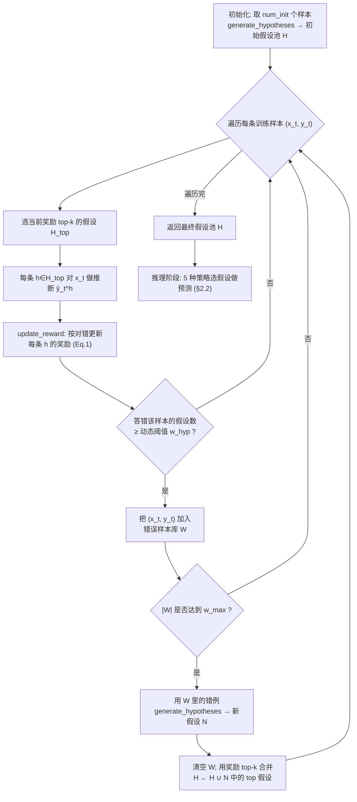

# 组会汇报 · HypoGeniC：用「探索-利用 + 错误样本库」让 LLM 自己长出好假设

> 本篇为**第二批 (v2) 报告**：在前 40 篇全部硬性要求之上（中文+术语对照、每公式前给直觉并先定义符号、setting/metrics/params 全、指标给定义式、数字标 §/Eq/Table 出处、PPT 风格、约 20 页），额外对齐两件事——**① Why 三连**（问题层 / 设计层 / 结果层）；**② `## ★ 对我们的启发（Inspires Us）` 专节**。结构对齐 [`2408.06292-ai-scientist-v1.md`](2408.06292-ai-scientist-v1.md)，Why 三连 + Inspires-Us 对齐 [`2506.13131-alphaevolve-deepmind.md`](2506.13131-alphaevolve-deepmind.md)。
>
> 全场题眼一句话：**怎样让 LLM 不是「一口气憋出几条假设」，而是像下注一样，在「用已知好假设」和「探索新方向」之间反复权衡，最终把数据里的规律「逼」出来？** 答案就是把多臂老虎机 (multi-armed bandit) 的 UCB 思想搬进假设生成。

---

## 1. 封面 · TL;DR

> 主讲提示：开场先把「假设生成 (hypothesis generation)」这件事讲成科学的发动机——孟德尔、爱因斯坦都靠它；然后抛出本文的赌注：**把「提假设」从科学家的「灵光一现 (Eureka moment)」变成一个可迭代、有奖励信号、会自己补短板的算法**。记住三个锚点：**UCB 奖励式 (Eq. 1)**、**错误样本库 (wrong example bank)**、**few-shot 涨点 31.7%/13.9%/3.3%/24.9%**。

- **标题**：Hypothesis Generation with Large Language Models（系统名 **HypoGeniC** = **Hypo**thesis **Gen**eration **i**n **C**ontext）。
- **作者 / 机构**：Yangqiaoyu Zhou、Haokun Liu、Tejes Srivastava、Hongyuan Mei、**Chenhao Tan**（University of Chicago, ChicagoHAI + TTIC），arXiv 2404.04326（v3, 2024-12）。
- **权威性来源**：这是 **Chenhao Tan 组**「LLM × 假设生成」研究线的**奠基作之一**。后续的评测基准 **HypoBench**（[`2504.11524`](2504.11524-hypobench-hypothesis-benchmark.md)）与「文献+数据」扩展（Liu et al. 2025）都把 **HypoGeniC 当核心 baseline**；代码与数据已公开（`github.com/ChicagoHAI/hypothesis-generation`，见原文脚注 1）。

**这篇在干什么（一段话）**：给定一批带标签的样本 $\mathcal{S}=\{(x_i,y_i)\}$，HypoGeniC 让 LLM **从少量样本里归纳出一批自然语言假设** $\mathcal{H}=\{h_1,\dots,h_m\}$（每条形如「带感叹词如 now/today/seriously 的推文更易被转发」），再在**更新阶段 (update stage)** 用一个**受 UCB 启发的奖励函数**（原文 Eq. 1）给每条假设打分；对每个新样本，取**当前奖励 top-$k$** 的假设去预测，预测对就加分、错就扣信号；当一条样本被太多假设答错时，把它丢进**错误样本库 $\mathcal{W}$**——这个库**显式记录「现有假设池解释不了哪些数据」**，库满了就喂给 LLM **针对性地生成新假设来补缺口**。最终产出的假设既能当**可解释分类器**用，又能**跨 LLM 迁移**（GPT-3.5 生成、Mixtral/Claude 推理照样好）。

**3 条带走的结论**：
1. **「探索-利用 + 错误样本库」是核心创新**：不是让 LLM 一次性生成，而是把它放进一个**有奖励信号、会自我诊断短板**的迭代循环里——UCB 奖励决定「用谁去预测」，错误样本库决定「往哪个方向补新假设」（原文 §2.1、Algorithm 1、Eq. 1）。
2. **数字硬**：相对 few-shot in-context learning，假设分类器平均涨 **31.7%**（SHOE SALES 合成任务）、**13.9%**（DECEPTIVE REVIEWS）、**3.3%**（HEADLINE POPULARITY）、**24.9%**（TWEET POPULARITY）；在两个真实任务上**甚至超过微调 oracle**（RoBERTa/Llama-2-7B），且**跨模型、跨 OOD 数据集稳健**（原文 §1、§4.1、Table 1/2/3）。
3. **目标不是刷分，是「假设质量」**：作者反复强调——**分类准确率只是「假设好不好」的代理指标 (proxy)，不是终点**；真正的价值在于假设**可解释、能被另一个 LLM 复用、还能挖出文献没记载的新洞见**（原文 §1 加粗句、§4.3、Table 4/7）。

> 主讲提示：把第 3 点当成全场的「价值观声明」——它和 m9.3「评委只看文案选出最差点子」、和 HypoBench「解释力优先于新颖性」是一条线，后面 Inspires-Us 会收口。

---

## 2. 问题与动机（why —— 本篇最该讲透的一节）

> 主讲提示：这一节用「科学不对称 (asymmetric science)」一句话钉死动机——论文写了一大堆**怎么验证**假设，却几乎不写**假设是怎么来的**。三层 why 层层递进，最后落到「为什么必须是 bandit、而不是一次性生成」。

### 问题层 why（为什么这事值得解决）

**假设生成是科学进步的发动机**（原文 §1 开篇）：孟德尔关于等位基因对的假设奠定现代遗传学；爱因斯坦的广义相对论预言了引力波。但 Ludwig & Mullainathan (2024) 指出**科学是「奇怪地不对称」的 (curiously asymmetric)**——海量论文详尽地**形式化、检验**假设，但**假设本身的产生「发生在幕后 (off-stage)」**，全靠研究者读文献、分析数据、互相借鉴、甚至「幻觉 (hallucinate)」（如凯库勒 (Kekulé) 梦见蛇咬尾巴而悟出苯环结构，原文引 Rothenberg 1995）。**不解决会怎样**：假设生成始终是个**黑盒、不可规模化、强依赖个别天才**的环节——这正是 LLM 该补的位。

### 设计层 why（为什么用 bandit，而不是显而易见的「一次性生成」）

这是本篇**最该被追问、也最能体现读懂没读懂**的一层。原文 §1、§2.1 给了两条核心动机句：

> **Why（设计层）**：朴素做法 X = 「把所有样本塞进一个超长 prompt，让 LLM 一次性吐出假设」。它会因两点失败 →
> - **(Y1) 长上下文用不动**：原文明言「LLMs **may not be able to effectively leverage the input examples in a single long prompt**」（§1）——样本一多，LLM 抓不住全部规律，生成的假设**以偏概全**。
> - **(Y2) 没有质量信号、无法过滤与改进**：一次性生成**没有「哪条假设好、哪条差」的度量**，无从筛掉烂假设、也无从知道还缺什么（§1：「it is important to have measures of quality… so that we can filter bad hypotheses and come up with better ones」）。
>
> 本文改用 **Z = 「初始化一小批假设 → 迭代更新」的 bandit 式循环**，因为：
> - 把生成拆成「**先用少量样本起步，再迭代补足**」，绕开长上下文瓶颈（对应 §2.1「generate initial hypotheses from a small number of examples and then update them iteratively」）。
> - **用训练准确率当奖励**，天然提供质量度量，可以**像监督学习一样筛选**（§1：「use training accuracy as a measure of quality to guide the generation process」）。
> - 而一旦有了奖励，就直接撞上 bandit 的经典两难：**该「利用 (exploit)」当前高分假设，还是「探索 (explore)」没怎么试过的假设？**——于是顺理成章借来 **UCB (Upper Confidence Bound)** 的权衡机制（Auer 2002）。

**为什么是 bandit 而非别的 RL**：因为这里**每条假设就是一支「臂 (arm)」，每条训练样本就是一次「拉动 (pull)」**（原文 §2.1 Reward 段的类比）——目标是「在有限预算内，既要多用好假设、又要别漏掉潜在好假设」，这正是 bandit（而非有状态转移的完整 MDP）刻画的问题。注意作者也诚实指出**两点不完全契合 bandit**：① 同一样本可被多条假设同时测试（不是单臂）；② 假设池会被更新，新「臂」不断加入（**dynamic arms**，非标准静态臂），所以这是「**受 UCB 启发**」而非照搬。

### 结果层 why（为什么这套设计能拿到好结果）

机制上：**奖励的「利用项」让算法稳住已被验证的好假设；「探索项」逼它去试冷门假设、避免过早收敛到局部最优；错误样本库则把「漏网之鱼」攒起来，定向生成补丁假设填知识缺口**。三者合力，使最终假设池**覆盖更全、质量更高**——这解释了为何「有更新」一致优于「无更新 (no updates)」（原文 §4.1：更新平均带来 +0.7%/+5.8%/+8.1%/+7% 的提升）。

> 主讲提示：把动机钉在 **(Y1) 长上下文 + (Y2) 缺质量信号**两点上——后面每个设计（奖励式、top-k、错误样本库、动态 $w_{hyp}$）几乎都在回应这两点之一。

---

## 3. 研究问题 / 核心 intention（形式化成一句话）

把问题压成一句：

> **给定一个带标签数据集 $\mathcal{S}=\{(x_i,y_i)\}$，能否让 LLM 自动归纳出一批高质量、可解释的自然语言假设 $\mathcal{H}=\{h_1,\dots,h_m\}$，使它们既能解释数据中 $x\to y$ 的关系、又能（被任意 LLM）用来对留出样本做准确推断？**

隐含的**核心假设**：
- **H1（质量可度量）**：「假设好不好」可用**训练集准确率**近似度量，从而能像监督学习一样筛选/迭代（§1）。
- **H2（探索-利用必要）**：在低数据、动态假设池的设定下，**显式权衡探索与利用**比一次性生成更能产出全覆盖的好假设（§2.1）。
- **H3（缺口可定位）**：「现有假设解释不了的样本」**集中携带了假设池的知识缺口**，针对它们生成新假设能高效补缺（§2.1 wrong example bank）。
- **H4（质量 ≠ 分数）**：分类准确率只是代理；真正目标是假设的**可解释性、可迁移性、新颖洞见**（§1 加粗、§4.2、§4.3）。

---

## 4. 相关工作定位（站在谁肩上、和谁不同）

> 主讲提示：用一句话概括坐标——**「别人要么只从文献提假设、要么只在合成符号任务上做归纳；本文专攻『从 (x,y) 真实数据归纳』，并用 UCB 式奖励驱动迭代」**（原文 §5）。

| 方向 | 代表工作 | 与本篇的关系 |
|------|----------|------------|
| LLM 当「零样本假设提议者」 | Qiu et al. 2024（hypothesis refinement）；Zhong et al. 2023（目标驱动的分布差异发现） | 思想近邻：测试 LLM 的归纳推理；本文**加了奖励驱动的迭代 + 错误样本库**，并上**真实社科任务** |
| 从**文献**生成假设 | Qi et al. 2023、Wang et al. 2024、Baek et al. 2024 (ResearchAgent)、Yang et al. 2024b | 它们从**已有文献**提假设；本文从**输入-标签数据**提假设（互补，作者明说未来可结合，§6 结尾） |
| 符号/程序化归纳 | DreamCoder (Ellis 2020)、FunSearch (Romera-Paredes 2024)、Yang et al. 2024a | 需要现成 fact-rule 对或落到符号解释器；**不适用本文的真实自然语言任务**（§5） |
| 概念/模式发现 | Tenenbaum 2011、Pham et al. 2024 (TopicGPT)、Honovich 2022（指令归纳） | 多在合成/主题建模设定；本文聚焦 $x\!\to\!y$ 的**预测性**假设 |
| 推理 (reasoning) | CoT (Wei 2022)、Self-Consistency (Wang 2023) | 关键区分（§5）：**推理利用「已确立」的推理链；假设生成需同时「提出 + 验证」以发现未知知识** |
| **本篇 HypoGeniC** | Zhou et al. 2024 | **数据驱动 + UCB 式奖励 + 错误样本库**，产出可解释、可跨模型迁移的假设 |

> 主讲提示：强调本文和 Qiu et al. 2024 的对话——Qiu 认为「LLM 无法可靠地解释假设」，而本文用「跨模型迁移成功」**部分反驳**了这一点（原文 §4.2 结尾明写）。

---

## 5. 方法总览（big picture，先直觉后数学）

整体是**「初始化 → 更新循环」两段式**，更新循环内嵌一个**「奖励 → top-k 预测 → 对错反馈 → 攒错例 → 补假设」**的小回路（原文 Figure 1 + Algorithm 1）：



**一句话直觉**：奖励决定「**现在用谁去答题**」（利用好假设、偶尔探索冷门假设）；错误样本库决定「**接下来往哪个方向出新题**」（专攻没人答得对的样本）。两者一个管「利用现有」、一个管「定向探索」，构成完整的探索-利用闭环。

> 主讲提示：让听众记住四个零件——**① UCB 奖励（Eq.1）/ ② top-k 选择 / ③ 错误样本库 W / ④ 动态阈值 $w_{hyp}$**，后面 §7 逐个拆。强调 Figure 1 那张「老虎机拉杆 + 金币奖励 + 错误样本库」的示意图就是整篇的心智模型。

---

## 6. 符号与术语表（先定义，后文要用）

| 记号 | 含义（中 / 英） |
|------|----------------|
| $\mathcal{S}=\{(x_i,y_i)\}_{i=1}^n$ | 训练集；$x_i$ 为样本 (example)，$y_i$ 为标签 (label) |
| $\mathcal{H}=\{h_1,\dots,h_m\}$ | 假设池 / 假设库 (hypothesis bank)；每条 $h$ 是一句自然语言假设 |
| $\mathcal{S}_{\text{init}}\subset\mathcal{S}$ | 用于生成初始假设的少量样本子集 |
| `num_init` | 初始样本数（实验取 **10**，见 §B.3） |
| $h_i$ | 第 $i$ 条假设（= bandit 里的一支「臂 arm」） |
| $r_i$ | 假设 $h_i$ 的**奖励 (reward)**（Eq. 1） |
| $\mathcal{S}_i\subseteq\mathcal{S}$ | 「**已被用来评估过假设 $h_i$** 的样本集」（注意：是 $h_i$ 被试过的样本，不是全体） |
| $\hat{y}_j$ | 假设对样本 $x_j$ 的预测标签 (predicted label) |
| $I(\cdot)$ | 指示函数 (indicator)：括号内为真取 1，否则取 0 |
| $t$ | 训练时间步 (train time step)，随遍历样本递增 |
| $\alpha$ | **探索系数 (exploration coefficient)**，控制探索项权重（取 **0.5**，§B.3） |
| $k$ | 每步选取**奖励最高的 $k$ 条**假设去预测（$\mathcal{H}_{\text{top}}$） |
| $\mathcal{H}_{\text{top}}$ | 当前奖励 top-$k$ 的假设子集 |
| $\mathcal{W}$ | **错误样本库 (wrong example bank)**：被太多假设答错的样本集合 |
| $w_{hyp}$ | **动态阈值**：一条样本若被 $\ge w_{hyp}$ 条假设答错，就进 $\mathcal{W}$（随 $t$ 线性增长，§B.1） |
| $w_{max}$ | 错误样本库容量上限（取 **10**，§B.3）；满了就触发「用错例生成新假设」 |
| $\mathcal{N}$ | 由错误样本库生成的**新假设集** |
| $H$ | 假设库大小上限（实验对比 $H=3$ 与 $H=20$，§B.3） |
| $\gamma$ | 自适应推理中**假设去冗余的相似度阈值**（线性规划约束，§B.2） |

> 主讲提示：务必把 $\mathcal{S}_i$ 讲清——它是**「假设 $h_i$ 被试过的样本」**，不是全体训练集。这直接决定了奖励式里准确率的分母和探索项的形态。

---

## 7. 方法细节（核心）

### 7.1 初始化与更新阶段（Algorithm 1 的骨架）

> **Why（设计层）**：为什么要分「初始化 + 更新」两段？朴素做法是「只初始化、不更新」（即论文的 **no updates** baseline）。它会失败，因为**初始假设只看了 `num_init`=10 条样本，必然「以偏概全」**——原文 §2.1 明写：「While initialized hypotheses may explain some portions of data, they often fall short of encompassing the full scope of the examples.」更新阶段有**双重目的 (dual purpose)**：① 提高「能被假设解释的数据比例」；② **替换掉被发现不准的假设**。

伪代码（原文 Algorithm 1，逐行注释）：

```text
输入: 训练样本 S, num_init, k, w_max, H
1  // 初始化假设库
2  H ← generate_hypotheses({S_i : i ≤ num_init})      # 用前 num_init 条样本生成初始假设
3  W ← {}                                              # 错误样本库置空
4  for (x_t, y_t) in S:                                # 遍历每条训练样本
5     H_top ← {h ∈ H : h 属于奖励 top-k}               # 选当前最优 k 条假设
6     for h in H_top:
7        ŷ_t^h ← inference(h, t)                       # 用假设 h 对 x_t 预测
8        update_reward(h, y_t, ŷ_t^h)                  # 按对错更新奖励 (Eq.1)
9     if |{wrong(ŷ_t^h) : h ∈ H}| ≥ w_hyp:             # 若答错的假设数超动态阈值
10       // w_hyp 动态确定，见附录 B.1
11       W ← W ∪ {(x_t, y_t)}                          # 把这条「难样本」收进错误样本库
12    if |W| = w_max:                                  # 库满
13       N ← generate_hypotheses(W)                    # 用错例针对性生成新假设
14       W ← {}                                        # 清空库
15       H ← {h ∈ H ∪ N : h 属于奖励 top-k}            # 新旧假设按奖励合并、保留 top
16 return H
```

读出什么：整套算法的「信息流」是——**好假设被反复使用并累积奖励（利用）；难样本被攒进库、转化为新假设（探索）**。第 15 行的「合并后再取 top」保证假设池**始终被奖励筛选**，烂假设会被挤出。

### 7.2 奖励函数（Eq. 1）——本篇的心脏，逐符号定义

> **直觉（为什么要这个式子）**：我们想给每条假设一个分数，用来决定「该不该继续用它去预测」。但只看「**它答对过多少**」会有个陷阱：一条**刚生成、只被试过一两次**的假设，可能恰好蒙对、虚高；而一条**潜力股**可能因为没怎么被试过而被埋没。于是借 UCB 的思路——**在「平均准确率」之外，再加一个「越少被试、越该被鼓励去试」的探索奖励**，让算法在「用熟手」和「给新人机会」之间平衡。

记号（先定义，后用式；均见原文 Eq. 1 下方说明）：
- $h_i$：待评分的第 $i$ 条假设；$r_i$：它的奖励。
- $\mathcal{S}_i$：**已被用来评估过 $h_i$** 的样本集合；$|\mathcal{S}_i|$ 是其大小（= $h_i$ 至今被「拉动」的次数）。
- $(x_j,y_j)\in\mathcal{S}_i$：其中一条样本及真标签；$\hat{y}_j$：$h_i$ 对它的预测。
- $I(y_j=\hat{y}_j)$：预测对则 1、错则 0。
- $t$：当前训练时间步（已遍历的样本总数，可理解为「总拉动次数」）。
- $\alpha$：探索系数，控制探索项强弱（实验取 0.5）。

$$
r_i \;=\; \underbrace{\frac{\sum_{(x_j,y_j)\in\mathcal{S}_i} I(y_j=\hat{y}_j)}{|\mathcal{S}_i|}}_{\text{利用项 = 准确率 (accuracy)}}\;+\;\underbrace{\alpha\sqrt{\frac{\log t}{|\mathcal{S}_i|}}}_{\text{探索项 (exploration)}}\tag{1}
$$

读出什么（原文 Eq. 1 段落）：
- **第一项 = 准确率**：$h_i$ 在它被试过的所有样本 $\mathcal{S}_i$ 上的正确率。**它越高，越该「利用」**——这是「用熟手」。
- **第二项 = 探索奖励**：分子 $\log t$ 随总步数缓慢增长（试得越久，越鼓励回头看看冷门假设），分母 $|\mathcal{S}_i|$ 是 $h_i$ 被试过的次数（**被试得越少，这一项越大**）。**它鼓励算法去试那些「还没怎么用过」的假设**——这是「给新人机会」。
- **两项合力**：奖励函数在**利用（exploit 高准确率假设）与探索（explore 试得少的假设）之间取平衡**（原文原话：「the reward function strikes a balance between exploration and exploitation」）。

> **Why（设计层，对照标准 UCB）**：标准 UCB 的探索项是 $\sqrt{\frac{\ln t}{n_i}}$（$n_i$ 为臂 $i$ 被拉次数）。本文几乎照搬，但把「臂被拉次数」换成「**假设被评估过的样本数 $|\mathcal{S}_i|$**」，并乘一个可调 $\alpha$。**朴素替代**：只用准确率（去掉探索项）→ 会**过早锁定**几条早期蒙对的假设、错过潜力股（对应 §B.1 提到的「低数据下早期假设准确率有偏 (biased)」问题）。

> 讲稿提示：这是全场最该逐符号读的一张「幻灯片」。务必把「$|\mathcal{S}_i|$ 在两项里扮演相反角色」讲透——**它在利用项当分母（用得多→估计稳）、在探索项也当分母（用得多→不再需要探索）**，一个变量同时编码了「置信」与「该不该再探索」。

#### 一个常被忽略的实现细节：奖励初始化（§B.1 Sampling）

> **Why（设计层）**：新生成的假设没有历史，奖励怎么初始化？朴素做法是「用错误样本库里的样本来初始化」——但**低数据 + 这些样本本就是「难样本」**，会让新假设的初始准确率**系统性偏低 (biased)**，对它不公平。本文的修补：**也允许用初始样本 $\mathcal{S}_{\text{init}}$ 来初始化奖励**，让估计更接近真值，从而「公平比较早生成与晚生成的假设」（原文 §B.1 原话）。这是「为什么 bandit 探索项还不够、还要单独校正初始化」的设计层细节。

#### 动态阈值 $w_{hyp}$（§B.1 Dynamic hypotheses update）

> **Why（设计层）**：判定「一条样本是不是难样本」的阈值 $w_{hyp}$ 该固定吗？本文让它**随时间步 $t$ 线性增长**。直觉：**训练早期假设少、容易答错，应频繁更新假设池；后期假设趋于成熟，应少更新**。线性增长的 $w_{hyp}$ 恰好实现「早期勤补、后期稳住」——原文 §B.1：「allows our algorithm to update the hypotheses more frequently at early stage of training, and less frequently at the end.」

### 7.3 错误样本库（wrong example bank）——「定向探索」的引擎

> **Why（设计层）**：有了奖励就能筛假设了，**为什么还要单独搞一个错误样本库？** 因为奖励只能告诉你「**现有假设里谁好谁坏**」，却**不能告诉你「还缺什么假设」**。朴素替代：随机抽样本去生成新假设 → 大概率重复造已有假设、补不到真缺口。本文的洞见（原文 §2.1）：**「被太多假设答错的样本」恰恰集中暴露了假设池的知识缺口 (gap in knowledge)**——

> 原文原话：「The wrong example pool represents the gap in knowledge that the current pool of hypotheses has for the dataset. Thus, by generating new hypotheses, the algorithm fills in these gaps.」

机制：当某样本 $(x_t,y_t)$ 被 $\ge w_{hyp}$ 条假设答错 → 进库 $\mathcal{W}$；库满 $w_{max}$ → 把这堆「公认的难样本」整批喂给 LLM，**针对性生成新假设来解释它们**（Algorithm 1 第 9–15 行）。这就是「定向探索」：不是漫无目的地试，而是**哪里有缺口就往哪里补**。

> 讲稿提示：把错误样本库类比成「**错题本**」——学生不是随机刷题，而是把反复做错的题攒起来专项突破。这个类比能让全场秒懂「为什么针对错例生成新假设，效率远高于随机生成」。

### 7.4 推理阶段：5 种「怎么用这批假设去预测」的策略（§2.2 + §B.2）

> **Why（设计层）**：训练时为了效率，每条假设**各自独立**使用（不考虑组合效应）；但推理时**应把假设当一个整体用**，原因有二（原文 §2.2）：① 有些假设**只适用于一部分样本**；② **相互竞争的理论需要「正面对决 (head-to-head)」**。所以设计了一套从简到繁的推理策略：

| 推理策略 | 怎么做 | 适用直觉 |
|----------|--------|----------|
| **Best-accuracy hypothesis** | 直接用训练准确率最高的那 1 条假设去预测 | 最简单；单一强假设够用时最佳（SHOE SALES / HEADLINE 上够好，§4.1） |
| **Filter and weighted vote** | 先让 LLM 判断 top-k 里哪些假设「与该样本相关」，再各自预测，按**训练准确率加权投票**聚合 | 需要多假设协同时（TWEET POPULARITY 上最佳，§4.1） |
| **Single-step adaptive** | 一个长 prompt 内：为每条假设附上「它在训练集上答对的样本」，让 LLM **据相似度选最适用的假设并直接预测** | 强调上下文匹配；**DECEPTIVE REVIEWS 上最佳**（§4.1, Fig.2） |
| **Two-step adaptive** | 把上一步拆成两个 prompt：先「选最相关假设」，再「用它预测」 | 把「选」和「用」解耦，避免训练样本干扰预测（§C.3 对 OOD 有解释） |
| **Oracle**（仅用于上界分析） | 事后回看、为每个预测挑「最佳假设」 | 衡量假设池**质量上限**（§4.1：平均 88.6/84.1/88，远超 Table 1） |

**去冗余的小技巧（§B.2 自适应推理）**：当假设很多、彼此重述 (paraphrase) 时，用一个**线性规划 (linear program)**：在「任意两条被选假设的余弦相似度 $\le\gamma$」的约束下，**最大化所选假设的训练准确率之和**——既去重又保质量。

> 讲稿提示：强调一句**反直觉的发现**——**Oracle 推理的准确率（88.6/84.1/88）远高于实际策略**，说明「**假设池里其实藏着很好的假设，瓶颈在「怎么为每个样本选对假设」而非「假设本身不够好」**」（原文 §4.1）。这是埋给讨论环节的好钩子。

---

## 8. 实验设置（setting / metrics / parameters）

> 主讲提示：这一节把「数据/baseline/指标/超参/成本」一次交代清。重点点出**任务选择的三个先决条件**——这是作者方法论上很讲究的地方。

### 8.1 任务与数据集（§3.1）

**任务选择的三个先决条件**（原文 §3.1）：① 假设必须**存在**（分类非平凡）；② 假设须是 **LLM 不先验已知**的（排除情感分析等标准任务）；③ 任务最好是**被广泛研究的真实社科问题**。据此选 1 个合成 + 3 个真实任务：

| 数据集 | 任务 | 规模 / 来源 | 标签 |
|--------|------|------------|------|
| **SHOE SALES**（合成） | 据顾客外观特征预测会买**哪种颜色的鞋** | 作者自造；规则是「鞋色 = 衬衫色」 | 6 类（white/red/orange/green/blue/black） |
| **DECEPTIVE REVIEWS** | 判断酒店评论是**真实**还是**虚构 (deceptive)** | Ott et al. 2011：800 真 + 800 假，20 家芝加哥酒店 | 2 类（人类准确率≈随机，Lai & Tan 2019） |
| **HEADLINE POPULARITY** | 一对标题中**哪个点击更多** | Upworthy Research Archive（Matias 2021）；去重后 150,816 标题 / 22,666 包 | 2 类 |
| **TWEET POPULARITY** | 一对推文中**哪个转发更多** | Tan et al. 2014：13,174 对（同主题同作者匹配） | 2 类 |

**统一抽样**：每个数据集随机取 **200 训练 + 300 测试**；为看「训练样本数的影响」，在 **10/25/50/100/200** 个训练样本处分别评测（原文 §3.2）。**注意**：TWEET POPULARITY 上 Mixtral/Claude-2.1 的某些零样本/少样本结果因**安全模式 (safety mode) 被触发**而虚低，表中以 `*` 标记（Table 1 脚注）。

### 8.2 模型、Baseline 与 Oracle（§3.2）

- **使用的 LLM（4 个）**：Mixtral (Mistral 2023)、GPT-3.5-turbo (OpenAI 2023)、Claude-2.1 (Anthropic 2023)。（生成与推理可换模型，见 §4.2 跨模型实验。）
- **Baseline / Oracle（3 类）**：
  1. **Zero-shot / Few-shot prompting**：给任务指令（零样本），可选附 **3 个示例**（少样本 in-context learning）。
  2. **No updates（消融用）**：只用**初始化假设**、不跑更新阶段，挑训练集上最优假设去测——用来量「更新阶段值多少」。
  3. **Supervised Learning（不可解释 oracle）**：微调 **RoBERTa** (Liu 2019) 与 **Llama-2-7B** (Touvron 2023)，分别训 **200** 与 **1000** 样本；因为它们改权重、被视为**分布内 (in-distribution) 性能上界**。

### 8.3 评测指标（给定义式）

> 直觉：所有任务都是**带真标签的分类**，最自然的质量度量就是准确率。

记号：测试集 $\mathcal{D}_{\text{test}}=\{(x_j,y_j)\}_{j=1}^{N}$，预测 $\hat{y}_j$，$N$ 为测试样本数，$I(\cdot)$ 为指示函数。

$$
\text{Accuracy} \;=\; \frac{1}{N}\sum_{j=1}^{N} I\big(\hat{y}_j = y_j\big)
$$

读出什么：值越高，假设（经某推理策略）做对的样本越多。原文用它当**主指标**（§3.2），并配 **95% 置信区间**（二项分布假设，§4.1、Table 5）。注意作者一再强调：**准确率是「假设质量」的代理 (proxy)，不是终点**（§1 加粗、§4 开头）。

### 8.4 关键超参数（§B.3，务必全列）

| 超参 | 取值 | 说明 |
|------|------|------|
| 探索系数 $\alpha$ | **0.5** | Eq. 1 探索项权重 |
| `num_init` | **10** | 生成初始假设的样本数 |
| $w_{max}$（错误样本库容量） | **10** | 满了触发生成新假设；作者称取 10 是「上下文窗口 vs 假设质量」的折中（§7 Limitations） |
| 假设库大小 $H$ | **3** 与 **20** 两套 | 对比「小池 vs 大池」 |
| 当 $H=3$ | $k=2$；每次更新生成 **1** 条新假设；filter&weighted vote 用全部 3 条；自适应推理 $\gamma=0.3$、每条假设给 5 个示例 | — |
| 当 $H=20$ | $k=10$；每次更新生成 **5** 条新假设；取 top-5（按训练准确率）；自适应推理 $\gamma=0.7$、每条假设给 5 个示例 | — |
| $w_{hyp}$ | 随 $t$ **线性增长** | 早期勤更新、后期少更新（§B.1） |

**成本 / 算力（§7 Q&A）**：HypoGeniC **延迟高**，尤其是 filter&weighted vote 这类**多 prompt** 策略。一次实验（约 76 次推理）**GPT-3.5-turbo 平均花 \$2.05、约 1.5 小时**；开模型可省钱但仍需时间——「相对人力仍便宜」。作者坦言**未做大规模超参搜索**（不调 $k$、$w_{max}$ 固定 10），属「提供稳健框架，而非优化结果」（§7）。

---

## 9. 主要结果（数字 + 解读）

> 主讲提示：四张数字幻灯片——① 超 few-shot；② 追平/超微调 oracle；③ 跨模型迁移；④ OOD 仍涨。每张都先报数、再讲「机制上为什么」。

### 9.1 假设分类器全面超越 zero/few-shot（Table 1, §4.1）

相对 **few-shot** 平均提升：**SHOE SALES +31.7%、DECEPTIVE REVIEWS +13.9%、HEADLINE +3.3%、TWEET +24.9%**；相对 **zero-shot** 平均提升 60% / 22.7% / 5.1% / 30.6%。

**结果层 why**：合成任务 SHOE SALES 有**单一明确真假设**（鞋色=衬衫色），HypoGeniC **几乎都能 100% 复原它**（Table 1：Claude/GPT 达 100、Mixtral 98）——证明「**LLM 确能从数据归纳出正确假设，只要给它迭代 + 奖励信号**」。HEADLINE 涨幅最小 (3.3%)，因为**只用标题、丢了配图这个关键变量**，任务本身信息不全（§3.1、§C.1）。

### 9.2 追平甚至超越微调 oracle（Table 1, §4.1）

- 合成 SHOE SALES：HypoGeniC 与微调模型**都 100%**。
- 真实任务（200 训练样本）：HypoGeniC 比 **RoBERTa 高 12.8%/11.2%**、比 **Llama-2-7B 高 12.1%/11.6%**（HEADLINE / TWEET）。
- 即便把微调模型加到 **1000 样本**，HypoGeniC 最好结果仍领先 RoBERTa 3.7%/0.7%、Llama-2-7B 3.7%/11.4%（HEADLINE/TWEET）。
- **唯一例外**：DECEPTIVE REVIEWS——作者推测该任务**词级特征 (word-level features) 极有用**（Ott 2011），微调模型易抓、LLM 难提（§4.1）。

**结果层 why**：微调靠最小化交叉熵、**吃样本越多越好**；而 HypoGeniC **在极少样本下就逼近上界**，说明它把 LLM 的**预训练先验**有效转成了**可用假设**。

### 9.3 「更新」确实带来更好假设（Table 1 中 HypoGeniC vs no updates）

更新阶段平均提升：**SHOE +0.7%、DECEPTIVE +5.8%、HEADLINE +8.1%、TWEET +7%**（§4.1）。**额外好处**：no updates 把所有训练样本塞进一个 prompt，**可能超出上下文窗口而性能退化**；HypoGeniC **迭代地过样本**，绕开这个坑（§4.1, Fig.4/5）。

### 9.4 跨模型迁移：一个 LLM 生成、另一个 LLM 推理照样好（Table 2, §4.2）

> 主讲提示：这是反驳「LLM 无法解释假设」(Qiu et al. 2024) 的关键证据。

把生成模型与推理模型**自由组合**（Table 2，train=200）：**Claude-2.1、Mixtral 推理普遍更强**，故用它们去推理 **GPT-3.5 生成的假设**会更好；性能掉的情形也**很轻微**（如 Claude→Mixtral：DECEPTIVE 仅 −2.3%、TWEET −2.7%）。**结论**（原文 §4.2）：HypoGeniC 的假设**可跨 LLM 泛化**——这「在一定程度上反驳了 Qiu et al. 2024『LLM 无法可靠解释假设』的说法」。作者推测原因：**本文任务只依赖自然语言，而 Qiu 的任务依赖『世界概念』并喂给符号解释器**。

### 9.5 OOD 泛化：换数据源仍涨（Table 3 / Table 6, §4.2）

在一个 **OOD 的 deceptive reviews** 数据集（Li et al. 2013，来自 4 个不同城市网站）上测：
- 微调 oracle **大跌**：RoBERTa **−11.0**、Llama-2-7B **−10.0**（典型「分布偏移崩盘」）。
- HypoGeniC **不降反升**：相对原 DECEPTIVE **平均 +3.3%**；**Claude-2.1 + HypoGeniC = 74.7（比 RoBERTa 还高 1.7%）**（Table 3）。

**结果层 why**：微调把规律**编进权重**、对分布偏移脆弱；HypoGeniC 把规律**写成自然语言假设**，**与具体数据分布解耦**，故更稳健。Table 6 进一步给出 4 种推理策略全表：**best-accuracy 与 two-step adaptive 最稳健**（平均 +3.7% / +3.6%）。

> 主讲提示：Table 3 这张「微调全红↓、HypoGeniC 全绿↑」的对照，是「**自然语言假设 > 黑盒权重**」最有冲击力的一张图。

---

## 10. 消融与分析（哪个部件重要 + 定性洞见）

> 主讲提示：分两块——① 量化消融（推理策略 / 训练量 / 池大小）；② 定性「假设挖出了什么」（这才是作者真正在意的）。

### 10.1 量化消融

- **推理策略（Fig.2/3, §4.1）**：**没有万能策略**——SHOE/HEADLINE 用 best-accuracy 就够；DECEPTIVE 上 **single-step adaptive 最佳**；TWEET 上 **filter & weighted vote 最佳**。但**无论用哪种，HypoGeniC 对 few-shot 与微调模型的领先趋势不变**（§4.1）。
- **训练样本数（Fig.4–6, §4.1）**：SHOE 上准确率**随训练量稳定上升**（样本越多越能归纳出最佳假设）；真实任务则常在 **25 或 100 样本处见顶**，再加不一定涨——作者推测「真实任务需多条正确假设，假设池评估本就更不稳」。
- **假设池大小（§C.1/C.2）**：**$H=20$ 普遍优于 $H=3$**（更多假设→更全覆盖）；$H=3$ 时因 $k$ 被设为 1，**在 SHOE 上反而难找到最佳假设**。
- **统计显著性（Table 5, §4.1）**：95% 置信区间下，DECEPTIVE 与 TWEET（Claude-2.1、Mixtral）相对 few-shot **显著**；放宽到 90% 时 HEADLINE (Mixtral) 也显著。**唯一反例**：TWEET + GPT-3.5 比 few-shot **低约 1%**——作者推测 GPT-3.5 预训练里**推文知识太多**，few-shot 已很强（§4.1）。

### 10.2 定性：假设到底挖出了什么（§4.3, Table 4/7）——作者最看重的一节

- **合成任务**：所有模型都能复原 SHOE SALES 的真假设——「**顾客倾向买与衬衫同色的鞋**」（§4.3）。
- **印证已有文献**（supported）：如「欺骗性评论含更多情绪词」(Li 2014)；「推文带情绪更易被转发」(Tan 2014)；「标题用生动语言/意象更吸睛」(Banerjee & Urminsky 2021)。
- **挖出新洞见**（Novel，Table 7）：如「**真实评论常提及婚礼/特殊场合**」「**点击多的标题以个人化/可共鸣的方式 framing 内容**」「**提及有影响力的人/机构的推文更易转发**」——**这些是先前文献未记载的新假设**。
- **甚至能反驳特征工程结论**（§4.3）：Ott et al. 2011 用特征工程发现「token『future』关联欺骗性评论」；而 HypoGeniC 的一条假设说「提及『过去经历或未来旅行计划』反而是**真实**的标志」。作者解读：**特征工程受困于「future」一词的上下文歧义，而 LLM 对假设的语境化解释能跨过这道坎**（§4.3）。
- **连负面发现也对**（§4.3）：与 Banerjee & Urminsky 2021「阅读越易、点击越低」一致，HypoGeniC 中那些自称「straightforward/clear」的假设**训练准确率确实偏低**。

> 讲稿提示：这一节是「质量 ≠ 分数」价值观的**实证落地**——把它讲成「**HypoGeniC 不只是个分类器，更是个『假设发现器』**，能产出可写进论文的新社科洞见」。这正是它区别于「刷榜」工作的根本。

---

## 11. 局限与批判（诚实区分宣称 vs 边界）

> 主讲提示：作者用 Q&A 形式自陈局限（§7），很坦诚；这里把「论文宣称」与「我/社区质疑」分开列。

**原文自承的局限（§7 Limitations）**：
- **只做社科任务**：数学/物理假设需符号解释器，难用自然语言表达——**自然科学任务留作未来**（明确的范围声明，非 bug）。
- **某些设定提升不显著**：作者辩称「即便准确率没涨，**假设的「发现新洞见」价值仍在**」（§4.3），但也承认「LLM 推理本身不完美，**假设分类准确率未必准确反映假设质量**」——**即代理指标与真目标之间有缝隙**。
- **超参未充分搜索**：不调 $k$、$w_{max}$ 固定 10、池大小只试 3/20——「**理想超参可能还需进一步研究**」（§7 自承）。
- **成本与延迟高**：多 prompt 推理慢且贵（§7）。
- **伦理风险**：假设生成「**对刻板印象/偏见缺少防护**」，给了「看似支持偏见」的数据就可能强化之；也可能**泄露数据中的个人信息**——强烈建议**人机协作 (human-AI collaboration)** 与监督（§7）。

**批判 / 社区质疑（我补充，非原文）**：
- **「准确率 = 假设质量」这个代理本身可疑**：原文 §4.1 已自曝 TWEET+GPT-3.5 反例、§4.3 承认 LLM 推理不完美——这正是后续 **HypoBench**（[`2504.11524`](2504.11524-hypobench-hypothesis-benchmark.md)）要系统解决的：把「好假设」拆成解释力/发现率/泛化/新颖等多维，而非单看一个准确率。
- **「新洞见」的真伪谁来判？** Table 4/7 的「Novel」标注**靠作者人工 Google Scholar 检索**——**没有独立的、可量化的新颖性度量**，可能漏检已有文献、也可能把噪声当洞见。这与 [`2409.04109`](2409.04109-can-llms-generate-novel-ideas.md) 提示的「LLM 新颖性评判不可靠」呼应。
- **Oracle 与实际策略的大鸿沟（88.6 vs ~70）**：说明「**选假设**」是真正瓶颈，但论文的 5 种推理策略**没有一种逼近 oracle**——「怎么为每个样本选对假设」基本是开放问题。
- **动态阈值 $w_{hyp}$「线性增长」缺乏原理**：为何线性、斜率多少、对结果多敏感，原文未做敏感性分析（**原文未给出**）。

---

## ★ 对我们的启发（Inspires Us）

> 讲稿提示：这一节是全场高潮——前面讲「ChicagoHAI 做了什么」，这里讲「**我们下周就能在 m9.3 里试什么**」。落点是「错误样本库」当**定向探索引擎**、「UCB 奖励」当**ideation 的择优器**，能被同组同学直接接力。

➤ **a. 可直接借用的招（method/trick we can reuse）**
1. **错误样本库 = 「错题本」式定向探索**：把「被多数候选答错的样本」攒成库、库满即针对性生成新候选（Algorithm 1 第 9–15 行）。这是一个**通用的「按缺口补生成」机制**，可直接拆下来用在**任何「生成一批候选→发现覆盖漏洞→定向补生成」的管线**里（不限假设——也可以是 idea、prompt、测试用例）。
2. **UCB 式奖励当「候选择优器」**：Eq. 1 的「准确率 + $\alpha\sqrt{\log t/|\mathcal{S}_i|}$」是一个**轻量、可解释**的打分器，比「让 LLM 自评分」客观得多（因为利用项是**真跑出来的准确率**）。凡是「有一批候选、想边用边筛、又怕过早收敛」的场景都能套。
3. **「奖励初始化校正 + 动态更新阈值」两个易被忽略的工程细节**：低数据下用 $\mathcal{S}_{\text{init}}$ 校正新候选的初始奖励（§B.1）、阈值随时间增长（早勤后稳）——这两招对**任何在线择优循环**都通用。

➤ **b. 可迁移到我们课题的思路（transfer）**
把核心思想映射到 **[`m9.3-ideation-and-tournament`](../m9.3-ideation-and-tournament/)**：该模块现在是「**生成一堆 idea → 评委打分 → 选 top-k**」，但它跑出的**惨痛教训**是——**评委只看文案、被「exotic/cutting-edge」热词骗，选出的「最佳点子」真跑出来全场最差**（README：评委冠军 `exotic-init` 真实可行性排 6/6）。HypoGeniC 给 m9.3 的**直接迁移**：把评委的「拍脑袋打分」**换成 Eq. 1 的「真实验准确率 + 探索项」**——即**让每个 idea 的奖励来自它在留出样本上真跑出来的预测对错，而非文案辞藻**。**迁移时要改什么 / 什么前提不再成立**：HypoGeniC 的奖励依赖「假设能直接对样本做预测」，而 m9.3 的 idea 是「一组训练配置」——需把「inference(h, x)」替换成「按配置真跑一遍、拿验证准确率」。前提变化：m9.3 每次评估更贵（要真训练），所以**探索项的 $\alpha$ 应调小、$k$ 调小**，避免被昂贵的盲探索拖垮。

➤ **c. 它暴露的开放问题 = 我们的机会（open problems → our opportunity）**
**Oracle 推理 88.6 vs 实际策略 ~70 的鸿沟**（§4.1）= 一个现成的新工作切口：**「假设池足够好，但没有一种策略能为每个样本选对假设」**。**可下手的第一步**：在 m9.3 里实现一个「**oracle 上界探针**」——对每个测试样本，事后回看「假设池里是否存在一条能答对它的假设」，量出「**池质量上限 − 当前选择策略**」的 gap；这个 gap 本身就是「值得投入做更好选择器」的证据。**第二个缺口**：动态阈值 $w_{hyp}$「线性增长」无原理、无敏感性分析（§7）——可做一个最小消融，把它换成「按错误样本库填充速度自适应」，看是否更快补缺。

➤ **d. 与本库其它论文/模块的连接（connect the dots）**
- **与 [`2504.11524` HypoBench](2504.11524-hypobench-hypothesis-benchmark.md) 强呼应（同组、上下游）**：HypoBench **正是把 HypoGeniC 当核心 baseline** 来评测的，并指出「**解释力 (practical utility) 应优先于新颖性**」。两篇合看就是一条完整故事线：**HypoGeniC = 怎么「生成」好假设；HypoBench = 怎么「评」假设好不好**。我们要做假设生成，**必须用 HypoBench 的多维尺子量 HypoGeniC 的产物**，而不能只看本文的单一准确率。
- **与 [`m9.3`](../m9.3-ideation-and-tournament/) 形成「正反对照」**：m9.3 证明「**只看文案的评委会选错**」（novelty 偏差 + 自偏好）；HypoGeniC 给出解药「**用真实验奖励替代文案打分**」。这俩**互为正反**——一个揭病、一个开方。
- **与 [`2409.04109` novel-ideas](2409.04109-can-llms-generate-novel-ideas.md) 互补**：那篇质疑「LLM 的新颖性评判/产出可靠性」；HypoGeniC 的 Table 4/7「Novel」标注**恰恰缺一个可靠的新颖性度量**——两篇拼起来正好说明「**生成端 (HypoGeniC) 与评判端 (novelty 度量) 必须配套，否则『新洞见』无法被信任**」。

➤ **e. 如果我来做下一步（my next move）**
**我会先在 `m9.3` 里把评委的「文案打分」替换成 HypoGeniC 的「Eq. 1 真实验奖励」开关（`--reward-mode=ucb`），跑一遍看：当奖励来自『真跑出来的验证准确率 + 探索项』时，那个被现评委埋到 6/6 的朴素冠军 `more-steps`（真实 acc=0.932）会不会被顶回榜首**——若复现，就用一句话证明了「**把 bandit 奖励搬进 ideation 锦标赛，能直接修掉 novelty 偏差**」，这正是 HypoGeniC → m9.3 最小可验证的迁移。

---

## 12. 在 auto-research 版图的位置（相对已有工作的增量）

> 主讲提示：用「Tool → Analyst → Scientist」阶梯定位——HypoGeniC 是**主题组 C（创意/假设生成）的奠基块**，专攻闭环里「**提假设**」这一环。

- **它把谁向前推了一步**：相对「LLM 当零样本假设提议者」(Qiu 2023/2024、Zhong 2023)，HypoGeniC **第一次给假设生成装上「奖励驱动的迭代 + 错误样本库」**，并在**真实社科任务**上证明产出可超微调 oracle、可跨模型迁移——把「假设生成」从「测 LLM 归纳能力的玩具实验」推进到「**能产可解释分类器 + 新洞见的实用方法**」。
- **它在闭环里的位置**：在 AI Scientist（[`2408.06292`](2408.06292-ai-scientist-v1.md)）那种「idea→实验→写作→评审」的端到端阶梯里，HypoGeniC 是**「idea/hypothesis 生成」子模块的一个更扎实的实现**——AI Scientist 的 ideation 靠「头脑风暴+新颖性检索」，HypoGeniC 则靠「**数据驱动 + bandit 奖励**」，二者可互补。
- **它的下游**：直接催生评测基准 **HypoBench**（[`2504.11524`](2504.11524-hypobench-hypothesis-benchmark.md)，同组）与「文献+数据」扩展——**HypoGeniC 几乎成了这个子领域的标准 baseline**。在本库里，它与 **m9.3（ideation 锦标赛的偏差）**、**novel-ideas（新颖性评判）** 三者构成「**生成—择优—评判**」的完整讨论闭环。

---

## 13. 复现与可用性

- **开源**：代码 + 数据已公开 `github.com/ChicagoHAI/hypothesis-generation`（原文脚注 1）。
- **能否单卡跑**：生成/推理**调 API（GPT-3.5/Claude）或开模型（Mixtral）**为主，**对本地 GPU 要求低**；微调 baseline（RoBERTa/Llama-2-7B）需要训练资源，但那只是对照、非核心方法。
- **成本坑**：核心成本是 **API 调用 + 延迟**——一次实验 GPT-3.5 约 **\$2.05 / 1.5h**（§7）；filter&weighted vote 这类多 prompt 策略**最贵最慢**，复现时优先用 best-accuracy 跑通再上重策略。
- **数据许可（§B.4）**：DECEPTIVE/TWEET 无明确 license 但作者授权研究使用；HEADLINE 为 CC BY 4.0；SHOE SALES 随本文发布。Mixtral 为 Apache 2.0；GPT-3.5/Claude 闭源；Llama-2-7B 用 Meta 自家许可。
- **复现注意**：TWEET 上 Mixtral/Claude 的零/少样本**安全模式会触发虚低**（Table 1 `*`）——复现时别把这些 `*` 数当真 baseline。

---

## 14. 组会讨论问题（5–8 个，能引发讨论）

1. **代理指标之问**：用「训练准确率」当假设质量的代理，§4.1 已自曝 TWEET+GPT-3.5 反例——**还有哪些任务上「高准确率假设」其实是坏假设？** 我们该用 HypoBench 的哪几维去补？
2. **Oracle 鸿沟（88.6 vs ~70）**：瓶颈在「选假设」而非「假设本身」。**为什么 5 种推理策略都逼近不了 oracle？** 一个可学习的「假设路由器 (router)」会不会是新工作？
3. **错误样本库的反面**：它专攻「难样本」——会不会**把标注噪声/离群点当成「缺口」，生成一堆解释噪声的假设？** 怎么区分「真缺口」与「脏数据」？
4. **bandit 类比的裂缝**：作者承认「同一样本被多假设测试」「动态臂」都不契合标准 bandit——**这套『受 UCB 启发』的奖励有没有理论保证（regret bound）？** 还是纯启发式？
5. **新颖性谁来判**：Table 7 的「Novel」靠人工检索——**能否接一个自动新颖性度量（联动 novel-ideas / SciMON）**，把「发现新洞见」也变成可量化指标？
6. **跨模型迁移的边界**：§4.2 说自然语言任务能迁移、符号任务不能（对话 Qiu 2024）——**这条「自然语言 vs 符号」的分界，对把 HypoGeniC 推到自然科学任务意味着什么？**
7. **伦理**：作者承认「对偏见缺乏防护」——**如果数据本身有偏（如带刻板印象的标签），HypoGeniC 会不会「自信地」生成并强化偏见假设？** 该加什么约束？
8. **迁移到 m9.3**：把「文案评委」换成「Eq. 1 真实验奖励」后，**真实最优的 `more-steps` 能否回到榜首？** 若能，是否就证明了「bandit 奖励修 novelty 偏差」？

---

## 15. 一页速记（takeaways）

| 维度 | 一句话 |
|------|--------|
| **核心思想** | 把多臂老虎机 **UCB** 搬进假设生成：奖励决定「用谁预测」，错误样本库决定「往哪补新假设」 |
| **奖励式 (Eq.1)** | $r_i=\underbrace{\text{准确率}}_{\text{利用}}+\underbrace{\alpha\sqrt{\log t/|\mathcal{S}_i|}}_{\text{探索}}$；$\alpha=0.5$ |
| **错误样本库** | 「错题本」——被多数假设答错的样本集中暴露知识缺口，库满 ($w_{max}=10$) 即定向生成新假设 |
| **关键超参** | `num_init`=10、$\alpha$=0.5、$w_{max}$=10、池大小 $H\in\{3,20\}$、$w_{hyp}$ 线性增长 |
| **数据/任务** | SHOE SALES（合成）+ DECEPTIVE REVIEWS / HEADLINE / TWEET（真实）；各 200 训练 / 300 测试 |
| **指标** | Accuracy（+95% CI）；但**只是「假设质量」的代理** |
| **主结果** | 超 few-shot：+31.7/13.9/3.3/24.9%；**超微调 oracle**（HEADLINE/TWEET）；**跨模型 + OOD 稳健** |
| **反直觉点** | Oracle 推理 88.6 ≫ 实际 ~70 → **瓶颈在「选假设」不在「假设本身」** |
| **真正价值** | 不是刷分，是产出**可解释、可迁移、含新社科洞见**的假设（Table 4/7） |
| **最大局限** | 准确率代理有缝、新颖性无量化、超参未充分搜、仅社科、伦理防护弱 |
| **对我们** | 把「错误样本库 + UCB 奖励」搬进 **m9.3**，用真实验奖励替掉「文案评委」，测能否修掉 novelty 偏差 |
| **连接** | 生成端=本文；评测端=[`HypoBench`](2504.11524-hypobench-hypothesis-benchmark.md)；偏差揭示=[`m9.3`](../m9.3-ideation-and-tournament/)；新颖性=[`novel-ideas`](2409.04109-can-llms-generate-novel-ideas.md) |

> 主讲提示：收尾一句——**「HypoGeniC 的真正贡献，不是又一个分类器，而是把『提假设』从科学家的灵光一现，变成了一个有奖励信号、会自己找短板、可被任何 LLM 复用的算法。」** 把「质量 ≠ 分数」这条价值观留在全场最后。
