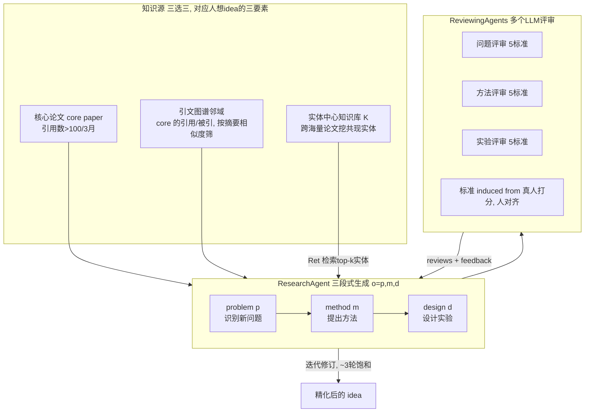

# 组会汇报 · ResearchAgent（迭代式研究 idea 生成）

> 主讲提示：这是 auto-research 课「创意/ideation」线（主题组 C）的代表作之一。它**只做科研第一环——提 idea，不写码不跑实验**。读它的价值有两点：(1) 看「**实体中心知识图谱**」如何把 LLM 从「只会复述核心论文」推向「跨域联想」；(2) 看「**ReviewingAgents + 人对齐评审标准**」如何把「一次生成」改造成「多轮精化」。和 AI Scientist（0 号文献）正好互补：那个是端到端闭环但 idea 环简陋，这个是把 idea 环做深做透。

---

## 1. 封面 · TL;DR

- **作者/出处**：Jinheon Baek, Sujay Kumar Jauhar, Silviu Cucercan, Sung Ju Hwang（KAIST / Microsoft Research / DeepAuto.ai），arXiv 2404.07738，v2 2025-02，**NAACL 2025**。代码：https://github.com/JinheonBaek/ResearchAgent 。
- **一段话**：ResearchAgent 把「生成一个研究 idea」形式化为产出一个三元组 $o=[p,m,d]$——**问题 (problem) → 方法 (method) → 实验设计 (experiment design)**。它从一篇高影响力**核心论文 (core paper)** 出发，沿**引文图谱 (citation graph)** 做一次「文献综述」式扩展，再叠加一个跨论文挖出来的**实体中心知识库 (entity-centric knowledge store)** 注入跨域概念；生成后交给多个 **ReviewingAgents**（LLM 评审）按各自的五条标准打分+给反馈，**ResearchAgent 据此迭代修订**。评审标准不是拍脑袋定的，而是从**真实研究者打分中诱导 (induced from human judgements)** 出来、与人偏好对齐的。
- **三条带走的结论**：
  1. **知识源是关键变量**：全量 ResearchAgent（引文 + 实体）在「问题/方法/实验」三类 idea 上**全面超过**仅用核心论文的朴素版与各消融版（原文 Figure 2、Table 2）；其中**实体中心知识库**对「原创性 (Originality)、创新性 (Innovativeness)」这类**创意指标**增益最大——因为实体带来了引文邻域里看不到的跨域概念。
  2. **迭代精化真的有用、但很快饱和**：随评审轮数增加分数上升，**约 3 轮后趋于饱和**（原文 Figure 4），与已有 agent 自精化工作（Du et al. 2023）观察一致。
  3. **人/模型评双轨且互相印证**：用 GPT-4 当评审是「合理代理」——人-模型一致性（Scoring/Pairwise）虽低于人-人，但显著（原文 Table 1）；且把评审标准**与人对齐后**，模型打分分布更接近人类分布（原文 Figure 5）。

> 主讲提示：开场就把「**知识图谱驱动 ideation**」和「**评审标准要对齐人**」两条主线抛出来。它不证明「idea 能落地」（不跑实验），只证明「idea 在人/模型眼里更新更清晰更相关」——这条边界后面批判环节要反复强调。

---

## 2. 问题与动机（why —— 本篇最该讲透的一节）

**科研第一环为什么难、为什么值得自动化？** 论文开篇给的数字很硬：每年发表的学术论文已**超过 700 万篇**（原文 §1，引 Fire & Guestrin 2019）；新药测试动辄数年、极其昂贵（引 Vamathevan 2019）。科研通常分两个关键环节：**(1) 提出新研究 idea**，**(2) 用精心设计的实验验证 idea**。两者都靠人，而第一环尤其受限于「一个人能读多少文献、能在多大跨度上做概念交叉」。

**为什么以前的自动化没碰这一环？** 论文把已有「LLM + 科研」工作几乎都归到**第二环（验证）**：写 ML 代码、探索化学空间、跑分子动力学模拟（原文 §1、§2，引 Huang 2023 / AI4Science 2023 / Bran 2023）。也就是说，**「提出新问题」这一步基本是空白**——大家默认问题由人给定，AI 只负责执行。本篇的赌注就是：**第一次让 LLM 当「科研 idea 的中介者 (mediator)」，在开放式 (open-ended) 设定下生成 idea**（原文 §1 明确宣称 "to the best of our knowledge, our work is the first to ..."）。

**为什么不能只把核心论文丢给 LLM 让它「想一个」？** 论文从「人类研究者怎么想 idea」反推，提炼出三条**缺一不可的要素 (desiderata)**（原文 §1、§3.2）：
1. **对相关文献的广而深的理解**（不是只读一篇，而是顺着引用网络读一片）；
2. **对概念互联的「百科全书式」视角**（概念在域内、跨域如何彼此关联）；
3. **一个会给建设性批评的同行共同体**（靠反馈把草稿一稿稿改好）。

> 直觉：人想 idea，从来不是「读一篇 → 灵光一现」。而是「读一圈相关工作（要素 1）+ 调动跨领域常识做嫁接（要素 2）+ 反复被同行批评打磨（要素 3）」。本篇的全部设计，就是把这三条**一一对应**地搬进系统。这正是「why > how」的钥匙——后面每个组件都能回指到这三条之一。

**不做会怎样（反事实）？** 论文用消融把「不做」的代价量化了：
- 不要实体（要素 2 缺失）→ 创意类指标掉得最多（原文 Table 2，下文详述）；
- 不要引文邻域（要素 1 缺失）→ 三类 idea 全面下滑；
- 不要 ReviewingAgents（要素 3 缺失）→ 没有精化、停在第一稿（原文 Figure 8 即「无精化」对照）。

> 主讲提示：这一节是 why 的核心。把「700 万篇/年 → 人读不过来」「以前只自动化验证、没人碰 ideation」「人想 idea 靠三要素」三点讲清，后面 how 就是「三要素的工程实现」。

---

## 3. 研究问题 / 核心 intention（形式化成一句话）

把要解决的问题压成一句：

> **给定一篇高影响力核心论文及其引文邻域，能否让 LLM 自主产出一个「问题 → 方法 → 实验设计」三段式、且在人/模型评下比仅依赖核心论文更新颖/清晰/相关的研究 idea，并通过模拟同行评审多轮自我精化？**

它隐含的**假设**（原文脚注 2 显式承认）：采用 Young (2003) 的观念——**「一个新 idea 往往不是凭空产生，而是旧元素的新组合」**，因此把任务限定为**基于已有文献 (literature-based) 的 idea 生成**。这条假设很重要，它既是方法的支点（所以才需要广读文献+跨域实体），也是局限的来源（所以它做不出「范式级、跳出已有文献」的 idea）。

---

## 4. 相关工作定位（站在谁肩上、和谁不同）

| 方向 | 代表 | 与本篇的关系 |
|------|------|------------|
| LLM 加速**实验验证**（第二环） | Huang 2023、AI4Science 2023、Bran 2023(ChemCrow) | 只自动化「跑实验」，**不提新问题**；本篇专攻第一环 |
| 文献驱动的**假设生成 (hypothesis generation)** | Swanson 1986、Henry & McInnes 2017、Sybrandt 2020(Agatha)、Wang 2023b、Qi 2023、Yang 2023 | 经典做法是**预测两个概念间的链接**或生成句子级连接，**局部、二元**；本篇**不限制为单一预测概念/二元链接**，开放式生成完整 idea |
| **评估** LLM 能否提好 idea | Li et al. 2024 (Chain-of-Ideas 等) | 只**评估**「LLM idea 好不好」；本篇**构建系统**去生成 |
| 自动写**整篇论文** | Lu et al. 2024（即 AI Scientist） | 包含 idea→写码→执行**全链**；本篇**只做 idea 环但做得更深**（引文图 + 实体 + 多评审精化） |
| **知识增强 LLM (Knowledge-Augmented LLM)** | Lazaridou 2022、Ram 2023(RAG)、Baek 2023/2024（实体增强 QA/query suggestion） | 思想来源：把外部知识注入 LLM。**区别**：以往实体工作是「**收窄**到上下文已有实体」（query suggestion）；本篇是「**检索并整合上下文之外的实体**」，让 LLM 跳出核心论文去联想 |
| **迭代精化 (iterative refinement)** | Welleck 2023、Madaan 2023(Self-Refine)、Shridhar 2023、Du 2023(multi-agent debate)、Liu 2023b(G-Eval) | 思想来源：让 LLM 据批评自我修正。本篇把它**扩展到 idea 生成新场景**，并用「人对齐标准」驱动评审 |

> 主讲提示：一句话概括——「**别人做验证环 / 做二元假设链接 / 做整篇论文；它把『提 idea』单独拎出来，用引文图+跨域实体喂料、用人对齐的多评审把它磨好**」。

---

## 5. 方法总览（big picture，先直觉后数学）

整体是**「三知识源喂料 → 三段式生成 → 多评审迭代精化」**（见原文 Figure 1）：

**直觉（把三要素映射到三组件）**：
- **核心论文 + 引文图谱** = 要素 1「广而深读文献」：从一篇有影响力的论文出发，顺着「它引谁 / 谁引它」拉一圈邻居，模拟人「以一篇为锚做文献综述」。
- **实体中心知识库** = 要素 2「百科式跨域联想」：把所有论文里反复共现的**实体 (entity)** 抽出来建库，生成时检索与当前 idea 相关、但**核心论文邻域里没有**的实体塞进上下文，逼 LLM 跨域嫁接。
- **ReviewingAgents** = 要素 3「同行批评」：多个 LLM 评审各按一套**人对齐的标准**给问题/方法/实验打分并写反馈，ResearchAgent 据此一稿稿改。

> 主讲提示：先讲这张图的「三对三」对应关系，听众就抓住了全篇骨架——剩下都是细节填充。

---

## 6. 符号与术语表（后文统一用）

| 记号 / 术语 | 含义 |
|------------|------|
| $\mathcal{L}$ | 全部科学文献 (literature)，idea 生成的主要信息源（取自 Semantic Scholar，2023-05-01 之后的论文） |
| $o=[p,m,d]$ | 一个完整 idea：问题 $p$ (problem) + 方法 $m$ (method) + 实验设计 $d$ (experiment design)，每项是一段 token 序列 |
| $f$ | idea 生成函数，$o=f(\mathcal{L})$，分解为 $p=f(\mathcal{L})$、$m=f(p,\mathcal{L})$、$d=f(p,m,\mathcal{L})$ |
| $\text{LLM}_\theta$ | 大语言模型，参数 $\theta$ 训练后固定；$y=\text{LLM}_\theta(\mathcal{T}(x))$ |
| $\mathcal{T}$ | 提示模板 (prompt template)，把任务描述/指令组织成结构化上下文 |
| $l_0$ | 核心论文 (core paper)，文献综述的起点 |
| $\{l_1,\dots,l_n\}$ | 沿引文图谱与 $l_0$ 直接相连、并按摘要相似度筛过的相关论文 |
| $e$ / $e_i$ | 实体 (entity)：知识的原子单位（术语、关键词、人物、事件等） |
| $\mathcal{E}_l=\text{EL}(l)$ | 论文 $l$ 经实体链接 (entity linking) 抽出的实体**多重集 (multiset)**（允许重复计数）；EL 用现成的 BLINK 链接器（Wu et al. 2020） |
| $\mathcal{K}\in\mathbb{R}^{m\times m}$ | 实体中心知识库：$m$ 为全库去重实体总数；稀疏矩阵，记录实体两两**共现 (co-occurrence)** 计数 |
| $\text{Ret}(\cdot;\mathcal{K})$ | 检索算子：基于 $\mathcal{K}$ 取与当前论文集相关的 top-$k$ 外部实体 |
| ReviewingAgents | 一组 LLM 评审 agent，各按特定标准评 problem/method/experiment 并给反馈 |
| criteria（人诱导标准） | 评审用的 5 维标准，从真人打分**诱导**得到，与人偏好对齐 |

---

## 7. 方法细节 ① 三段式 idea 的形式化（problem → method → experiment）

**why**：为什么不让 LLM「自由发挥写一段 idea」，而要硬拆成「问题/方法/实验」三段？因为论文要**模拟人做科研的最有用的三步**（原文 §3.1）：先识别值得做的**新问题**，再提出验证它的**方法**，最后设计**度量方法成败的实验**。拆成三段，既贴合人的工作流，也让后面「分项评审」有抓手（评审正是按这三段各打分）。

**how（生成的形式化）**。先把记号定清楚（见 §6）：$\mathcal{L}$ 是文献，$o=[p,m,d]$ 是 idea，$\mathcal{T}$ 是模板。

> 直觉：把「想一个 idea」建模成「以文献为输入、用 LLM 顺序生成问题→方法→实验」的**链式条件生成**——后一步永远看得到前面已生成的部分，保证三段彼此连贯（方法服务于问题，实验服务于方法）。

idea 生成函数 $f$ 用 LLM 实例化，分三个子步骤（原文 §3.2）：

$$ p = \text{LLM}\big(\mathcal{T}_p(\mathcal{L})\big),\quad m = \text{LLM}\big(\mathcal{T}_m(p,\mathcal{L})\big),\quad d = \text{LLM}\big(\mathcal{T}_e(p,m,\mathcal{L})\big),\qquad o=[p,m,d] $$

逐符号读：$\mathcal{T}_p,\mathcal{T}_m,\mathcal{T}_e$ 分别是问题/方法/实验三步的模板（具体文本见原文 Table 6/7/8）；问题 $p$ 只条件于文献，方法 $m$ 额外条件于 $p$，实验 $d$ 再额外条件于 $(p,m)$。

读出什么：这是一个**自回归式的「研究计划」生成**——三段不是独立采样，而是层层依赖。这保证了 idea 内部一致性，也意味着**问题一步若跑偏，方法和实验会跟着偏**（误差会沿链传播，这点在局限里要提）。

> 主讲提示：强调「$p \to m \to d$ 的依赖链」是这套设计的精髓，也是它和「一次性写一大段 idea」的根本区别。

---

## 8. 方法细节 ② 引文图谱式文献综述（要素 1 的实现）

**why**：为什么不把 $\mathcal{L}$ 里所有相关论文一股脑塞进上下文？因为 LLM**输入长度有限、长上下文推理能力有限**（原文 §3.2，引 Liu 2023a「Lost in the Middle」）。所以必须**选一个有意义的子集**。怎么选？论文「镜像人类研究者」的做法——人读一篇论文时，会去翻**引用它的 / 它引用的**论文（原文 §3.2）。

**how（两条工程选择）**：
1. **核心论文怎么选**：按**引用数**选高影响力论文当 $l_0$（例：3 个月内引用数超过 100），因为高影响力论文通常更可能引出高质量 idea（原文 §3.2，且 §5「Correlation on Citation Counts」用 Figure 6 验证了「引用越高→idea 分越高」）。
2. **相关论文怎么筛**：$l_0$ 的引文邻居可能很多，**按它们与核心论文摘要的相似度**进一步收窄，得到聚焦的 $\{l_1,\dots,l_n\}$。

> 直觉：起点要「重要」（高引核心论文），邻居要「相关」（摘要相似度筛）——一重一筛，保证喂给 LLM 的是「围绕一个重要话题的紧凑相关集」，而非松散的一大堆。

**它的硬伤（论文自己点破，埋后文）**：这套只依赖「给定的一组论文（核心+其引文）」，但**科学知识不局限于特定研究、而是跨大范围出版物累积**（原文 §3.2 倒数第二段）。换句话说，**只靠引文邻域会困在「过滤气泡 (filter bubble)」里**，难有真正跨域的新意——这正是下一节「实体」要补的洞。

> 主讲提示：把这节讲成「**引文图谱解决了『读得相关』，但解决不了『读得跨域』**」，自然引出实体中心知识库。

---

## 9. 方法细节 ③ 实体中心知识库（要素 2 的实现，**本篇核心创新**）

> 主讲提示：这是整篇最该花时间的一节，也是本库 9.2/9.3 对照的关键。讲清「**为什么用实体、库怎么建、怎么检索**」三件事。

### 9.1 为什么用「实体」当知识的原子单位

**why**：要给 LLM 注入「百科式、跨域」的知识（要素 2），就得有一种**能在海量论文间统一表示、累积**的知识载体。论文选了**实体 (entity)**（原文 §3.2「Entity-Centric Knowledge Augmentation」）。理由：实体是**知识的原子单位**，易于表示与跨论文聚合。

举例（原文原话改写）：术语「database」在很多论文里出现；把所有论文里它的链接出现聚合起来，就能发现——「database」在**医学**里很常见、在**血液学 (hematology，医学子域)** 里较少。于是当为「血液学」想 idea 时，可据「重叠实体」建立两域间的**亲和度 (affinity)**，从而**把跨域概念建议进来**，产生「新颖且跨学科」的洞见。这恰好就是「旧元素的新组合」（Young 2003）的工程版。

> 直觉：引文图谱告诉你「谁和谁互相引用」（显式关系）；实体共现库告诉你「哪些概念在文献里总一起出现」（隐式关系）。后者能跨越「从不互相引用、但概念上相关」的两个领域——这是引文图永远拿不到的桥。

### 9.2 知识库 $\mathcal{K}$ 怎么建

记号（先定义）：$\mathcal{L}$ 全部文献；$\text{EL}(\cdot)$ 实体链接器（本文用 BLINK，Wu et al. 2020，**对科学域无定制训练但够用**，原文 Table 16 佐证）；$\mathcal{E}_l$ 是论文 $l$ 的实体**多重集**（保留重复）；$\mathcal{K}\in\mathbb{R}^{m\times m}$，$m$=全库去重实体数。

构造过程（原文 §3.2）：
- 对每篇 $l\in\mathcal{L}$ 做实体链接：$\mathcal{E}_l=\text{EL}(l)$（**因论文太长，实体抽取只限定在标题+摘要**，原文脚注 4）；
- 把抽到的实体存进 $\mathcal{K}$，并对**所有实体对**计数共现：$\{e_i,e_j\}_{(i,j)\in C(|\mathcal{E}|,2)},\ e\in\mathcal{E}$（即一篇论文里出现的实体，两两之间共现计数 +1）；
- $\mathcal{K}$ 用**稀疏矩阵**实现（实体对极多但大多为 0）。
- 覆盖范围：因「对所有论文抽实体计算上不可行」，**只针对 2023-05-01 之后出现的论文**（原文脚注 3）。

### 9.3 生成时怎么检索实体（Eq.1 / Eq.2）

**why**：库建好了，生成某个 idea 时该塞哪些实体进上下文？要塞「与当前这组论文（核心+引文）最相关的 top-$k$ 个外部实体」。

记号：$\{l_0,\dots,l_n\}$ 当前用于生成的论文集；$\mathcal{E}_{\{l_0,\dots,l_n\}}=\bigcup_{i=0}^{n}\text{EL}(l_i)$ 是这组论文里已有的实体集；$[m]=\{1,\dots,m\}$ 全体实体下标；$I\subseteq[m],|I|=k$ 待检索的 $k$ 个实体下标集，且要求 $e_i\notin\mathcal{E}_{\{l_0,\dots,l_n\}}$（**只检索上下文之外的新实体**）；$P(\cdot)$ 为概率，由 $\mathcal{K}$ 中计数归一化得到。

> 直觉：检索 = 「在『当前论文已含实体』的条件下，挑出共现概率最高的一批**新**实体」。本质是用共现统计做一次「联想补全」。

**Eq.(1)（检索的概率形式）**：

$$ \text{Ret}(\{l_0,\dots,l_n\};\mathcal{K}) = \underset{I\subseteq[m]:|I|=k}{\arg\max}\ \prod P\big(e_i \mid \mathcal{E}_{\{l_0,\dots,l_n\}}\big) $$

逐符号读：在所有大小为 $k$ 的「新实体子集」里，选**联合条件概率最大**的那一组。

读出什么：这是「给定上下文实体，最可能伴随出现的 $k$ 个外部实体」——直接对应「人由已知概念联想到相关概念」。

**Eq.(2)（用贝叶斯 + 独立假设近似）**：为简化，对实体施加**独立性假设**并用贝叶斯规则展开：

$$ \underset{I\subseteq[m]:|I|=k}{\arg\max}\ \prod\Big(\prod_{e_j\in\mathcal{E}_{\{l_0,\dots,l_n\}}} P(e_j\mid e_i)\Big)\times P(e_i) $$

逐符号读：$P(e_j\mid e_i)$ 与 $P(e_i)$ 都从 $\mathcal{K}$ 这张二维共现矩阵的计数**归一化**得到；外层对候选新实体 $e_i$ 取，内层连乘「上下文里每个已有实体 $e_j$ 在 $e_i$ 条件下的概率」。

读出什么：一个候选实体 $e_i$ 若与「上下文里几乎每个已有实体」都高频共现，它的得分就高、就被选中。**注意原文明说**：Eq.(2) 只是「检索的一种实现」，可被换成别的策略（如**基于嵌入的检索 embedding-based retrieval**，讨论与结果在原文附录 B.3 / Table 5）。

最终，把检索来的实体并入上下文，得到全量 ResearchAgent 的生成式（原文 §3.2，脚注 5）：

$$ o = \text{LLM}\Big(\mathcal{T}\big(\{l_0,\dots,l_n\},\ \text{Ret}(\{l_0,\dots,l_n\};\mathcal{K})\big)\Big) $$

读出什么：这就是「**知识增强的 LLM idea 生成**」——上下文 = 「核心论文 + 引文邻居 + 跨域实体」。

> 主讲提示：把 Eq.1→Eq.2 讲成「理想检索（联合概率）→ 用独立假设落地成共现打分」。并强调「**检索的是上下文之外的实体**」这一句——这是它能跨域、能带来 Originality 增益的机制根源。

---

## 10. 方法细节 ④ ReviewingAgents 与人对齐评审（要素 3 的实现）

> 主讲提示：这是与本库 9.2（ReAct + Reviewer 角色）最直接对应的一节。重点讲「**为什么要多评审 + 为什么评审标准要对齐人**」。

### 10.1 为什么要「迭代精化」而不是一次写好

**why**：论文明说「想一口气写出完整 idea 往往不是好策略；人写论文也是**反复多轮评审+反馈**改出来的」（原文 §3.2「Iterative Research Idea Refinements」）。所以引入一群 **ReviewingAgents**，对生成的 idea 给评审+反馈，ResearchAgent 据此迭代更新。

### 10.2 ReviewingAgents 怎么实例化

- 和 ResearchAgent 一样，由 **LLM + 模板** 实例化，但**用不同模板**（原文 Table 9/10/11，分别评 problem/method/experiment）。
- idea 的**三段各自被独立评审**：problem、method、design 各按**自己的 5 条标准**打分（原文 Table 12 给出 15 条标准的简短定义；标准来自 Figure 2 的轴）。
- 评审输出：`Review`（点评）+ `Feedback`（建设性反馈）+ `Rating (1–5)`（5 点 Likert）。
- ResearchAgent 拿到评审与反馈后，**迭代更新并精化** idea。

**5×3=15 条评审标准（原文 Table 12，给精确定义）**：

| 段 | 5 条标准（criteria） |
|----|---------------------|
| **Problem 问题** | Clarity 清晰、Relevance 相关、Originality 原创、Feasibility 可行、Significance 重要性 |
| **Method 方法** | Clarity 清晰、Validity 有效、Rigorousness 严谨、Innovativeness 创新、Generalizability 泛化性 |
| **Experiment 实验** | Clarity 清晰、Validity 有效、Robustness 稳健、Feasibility 可行、Reproducibility 可复现 |

（举两条精确定义，原文 Table 12：**Originality**=「问题是否提出了一个未被充分探索过的新挑战/新视角」；**Reproducibility**=「所给信息是否足够详尽，使其他研究者能用同样方法/条件复现实验」。）

### 10.3 为什么评审标准必须「对齐人」（本节最关键的 why）

**why**：LLM 评机器生成文本虽强（引 Zheng 2023、Fu 2023、Liu 2023b），但**它对「研究 idea」的判断未必与真人一致**；而**没有 ground-truth 标注、收集又贵**（原文 §3.2 末、§4.3）。理想情况下，模型评应尽量像人评。

**how（诱导人对齐标准的流程，原文 §3.2 / §4.3 / 附录 A.5）**：
1. 对**每一条评审标准**，先收集 **10 对**研究 idea 及其**真人打分**（5 点 Likert），由**至少发表过 3 篇论文**的研究者标注；
2. 把这些「人标注的 (idea, 分数) 对」喂给 LLM（GPT-4），让它**诱导出每条标准的详细描述/分级 rubric**（引 Lin et al. 2024 的方法）；
3. 这些**人诱导标准**（原文 Table 13/14/15 给出 problem/method/experiment 的 1–5 分级详细 rubric）就成为 ReviewingAgents 的评审依据；
4. 额外请 **5 位**人类标注者评估「诱导出的标准」本身的质量——**2 人强烈认同、3 人中等认同**（原文脚注 7）。

> 直觉：不是直接让 LLM「凭感觉打分」，而是先从真人打分里**学出一套打分细则**，再让 LLM 照细则打分。这样「LLM 评审」就被锚定到了人的偏好上——是「对齐」的关键一招。

读出什么（效果，原文 Figure 5）：**对齐前**模型打分分布是**偏斜的、和人不一样**；**对齐后**分布**明显更接近**人类打分分布。这就是「人诱导标准」的直接证据。

> 主讲提示：把这节的逻辑链讲清——「无 ground truth → 用 GPT-4 评做代理 → 但要先从真人打分诱导 rubric 让它对齐 → 对齐后分布更像人」。这是整篇评测可信度的支柱。

---

## 11. 实验设置（setting / params / 算力 / 成本，写全）

> 主讲提示：这一节满足「setting/metrics/params 写全」。组会上最容易被问「数据多大、baseline 是谁、指标咋算、用什么模型」。

### 11.1 数据

- **来源**：Semantic Scholar Academic Graph API（原文 §4.1，脚注 8）。
- **时间卡点**：只取 **2023-05-01 之后** 出现的论文——因为实验所用 LLM（GPT-4，2023-11-06 release）训练数据截至 **2023-04**，**确保 idea 所依据的论文在模型训练数据之外**，防数据泄漏（原文 §4.1、§4.4）。
- **核心论文选取**：选**引用数 >20** 的高影响力论文当 core paper，再**采样 300 篇** core papers 构成基准（原文 §4.1）。
- **规模统计**：每篇 core paper 平均有 **87 篇**参考论文；每篇摘要平均含 **2.17 个**实体（原文 §4.1）。学科分布（原文 Figure 7）：**计算机科学 25.3%、医学 20.7%、工程 13.0%**为前三，另含生物/环境科学/物理/材料/化学/数学等。
- **实体库时间范围**：实体取自 **2023-05-01 至 2023-12-31** 的论文（含其参考文献），共 **50,091 个**实体（原文 §4.4、§4.3 末）。

### 11.2 实现细节（原文 §4.4）

- **底座 LLM**：GPT-4（OpenAI，**2023-11-06 release**）为所有模型的基础。
- **实体链接器**：现成 **BLINK**（Wu et al. 2020），**3 个实体/篇**（平均，原文 Limitations）。
- **辅助分析的其它 LLM**：Llama3 (8B)、Mixtral (8×7B)、Qwen1.5 (32B)、GPT-3.5（原文 Table 4）。
- **算力/成本/种子**：**原文未给出** GPU 算力、API 总开销、随机种子的具体数值（仅给了人评的人工成本，见下）。

### 11.3 Baseline（原文 §4.2）

因「同时生成问题+方法+实验」这一任务**前所未有、无直接 baseline**，主要与**自身消融变体**比：
1. **Naive ResearchAgent**：**只用核心论文**生成 idea（无引文、无实体）。
2. **ResearchAgent w/o Entity Retrieval**：用核心论文 + 引文邻居，**不用实体**。
3. **ResearchAgent（全量/Ours）**：核心论文 + 引文 + 实体，全要素。

另与**已有假设生成方法**对比（原文 Table 3）：**SciMON**、**Hypothesis Proposer**（Wang 2023b / Yang 2023）。

### 11.4 评测方法与指标定义

**两条评测轨**（原文 §4.3）：

**(A) 模型评 (Model-based)**：用 **GPT-4** 当裁判（reference-free）。对 problem/method/experiment 各按 5 条标准，要么**给 5 点 Likert 分**，要么对两 idea 做**成对比较 (pairwise)**。提示见附录 A.4，标准见 Table 12–15。

**(B) 人评 (Human)**：招 **10 位**研究者（美国/韩国，计算机/医学/生物，**各至少发表 3 篇论文**）。关键设计：**只评他们自己论文衍生出的 idea**（原文 §4.3，确保评审者是该领域专家）。流程（附录 A.2）：读 6 页指南 → 在 Label Studio 上先读目标论文标题+摘要 → 评来自不同方法的 idea（评测中可用外部工具/网络检索）。
- **成本/规模**：报酬 **$22.20/小时**；平均每小时评 **3 组** idea（每组含「问题+方法+实验」3 个子 idea，来自 3 种方法，即 9 个 idea/小时）；做 **3 轮**带精化的评测；**共评 150 个 idea**（原文 §4.3、附录 A.2）。

**指标定义式（原文 §5「Analysis on Inter-Annotator Agreements」/Table 1）**：
- **打分一致性 (Scoring agreement)**：先把每位标注者的分数**排名**，再算两位标注者排名间的 **Spearman 秩相关系数 (Spearman's rank correlation)** $\rho$（引 Pirie 2006）。

> 直觉：直接比绝对分会被「有人偏严、有人偏松」干扰；改比**排名**，衡量「两人对 idea 好坏的相对排序是否一致」。

记号：$d_t$ 为第 $t$ 个 idea 在两位标注者处的**排名差**，$N$ 为 idea 数。

$$ \rho = 1 - \frac{6\sum_{t=1}^{N} d_t^2}{N(N^2-1)} $$

读出什么：$\rho$ 越接近 1，两位评审对「哪个 idea 更好」的排序越一致。

- **成对一致性 (Pairwise agreement)**：两位评审在「A 好还是 B 好」的二元判断上用 **Cohen's kappa** $\kappa$（引 Cohen 1960），扣除偶然一致后的吻合度。
  $$ \kappa = \frac{p_o - p_e}{1 - p_e} $$
  其中 $p_o$ 为观察到的一致比例，$p_e$ 为随机情况下期望的一致比例。读出什么：$\kappa$ 越高，两人判断越非偶然地一致。

---

## 12. 主要结果（数字 + 解读，别只贴表）

### 12.1 全量 ResearchAgent vs 消融（雷达图主结果，原文 Figure 2 + Table 2）

**结论一句话**：全量 ResearchAgent 在 problem/method/experiment 三类、人评与模型评双轨下，**每个指标都超过所有 baseline**（原文 §5「Main Results」）。其中**实体增强对创意指标（问题的 Originality、方法的 Innovativeness）增益尤其强**——因为实体带来引文邻域里看不到的新概念/新视角。

**消融定量（原文 Table 2，模型评平均分，满分 5）**：

| 配置 | Problem | Method | Experiment |
|------|:------:|:------:|:------:|
| **ResearchAgent（全量）** | **4.52** | **4.28** | **4.18** |
| − w/o Entities（去实体） | 4.35 | 4.13 | 4.02 |
| − w/ Random Entities（换随机实体） | 4.41 | 4.19 | 4.13 |
| − w/o References（去引文邻居） | 4.26 | 4.08 | 3.97 |
| − w/ Random References（换随机引文） | 4.35 | 4.16 | 4.02 |
| − w/o Entities & References（都去，≈Naive） | 4.20 | 4.03 | 3.92 |

**读出什么**：
- **两个知识源都有正贡献**，且**引文邻居 (References) 贡献更大**（去掉它 Problem 掉到 4.26，比去实体的 4.35 更低）。
- **一个反直觉但重要的发现**：给「**随机实体/随机引文**」也比「什么都不给」强（如 Random Entities 4.41 > w/o Entities 4.35）。论文假设：LLM 有能力**过滤噪声、同时从随机输入里捞到偶然增量**（原文 §5「Ablation on Knowledge Sources」）。
- 全量 4.52 vs 全去 4.20，差距约 **+0.32**（Problem），说明知识增强确实把 idea 质量抬了一档。

### 12.2 成对比较胜率（原文 Figure 3）

全量 ResearchAgent 对 baseline 的**胜率 (win ratio)** 在人评与模型评下**均最高**（原文 §5）。

### 12.3 与已有假设生成方法比（原文 Table 3，5 个标准，模型评）

| 方法 | Clarity | Relevance | Originality | Feasibility | Significance |
|------|:----:|:----:|:----:|:----:|:----:|
| SciMON | 4.04 | 4.37 | 4.56 | 3.98 | 4.15 |
| Hypothesis Proposer | 3.97 | 4.14 | 4.07 | 4.01 | 4.11 |
| **ResearchAgent** | **4.11** | **4.88** | **4.77** | **4.05** | **4.81** |

**读出什么**：ResearchAgent 在 **Relevance / Originality / Significance** 上明显领先（尤其 Significance 4.81 vs 4.15/4.11，差距很大），印证「跨域知识 + 多轮精化 → 更相关、更原创、更重要」。

### 12.4 换底座 LLM（原文 Table 4）——能力依赖性

| LLM | 配置 | Problem | Method | Experiment |
|-----|------|:----:|:----:|:----:|
| GPT-4.0 | Naive | 4.20 | 4.03 | 3.92 |
| | **ResearchAgent** | **4.52** | **4.28** | **4.18** |
| GPT-3.5 | Naive | 3.56 | 3.56 | 3.63 |
| | ResearchAgent | 3.58 | 3.58 | 3.60 |
| Llama3 (8B) | Naive | 3.76 | 3.69 | 3.54 |
| | ResearchAgent | 4.18 | 4.03 | 3.95 |
| Mixtral (8×7B) | Naive | 3.31 | 3.27 | 3.20 |
| | ResearchAgent | 3.28 | 3.35 | 3.31 |
| Qwen1.5 (32B) | Naive | 3.64 | 3.74 | 3.66 |
| | ResearchAgent | 4.02 | 3.97 | 3.94 |

**读出什么（关键的能力门槛现象）**：
- **弱模型整体分更低**；更要命的是，**对 Mixtral 和 GPT-3.5，知识增强带来的增益几乎消失**（Mixtral Problem 甚至 3.31→3.28 略降）。
- 论文归因：处理「论文间复杂概念」需要 LLM 的**涌现能力 (emergent abilities)**（引 Wei 2022），小模型够不着——所以**知识增强不是免费午餐，它要足够强的底座才能把额外知识用起来**。

### 12.5 引用数 vs idea 质量（原文 Figure 6）

把 core paper 按引用数分桶（low/middle/high），**引用越高，生成 idea 的分越高**；且 CS 与「全部学科」两条线都呈此趋势——支持「**用高影响力论文当锚**」这一设计，也间接支持「人诱导标准」的跨域**泛化性**（原文 §5「Correlation on Citation Counts」）。

---

## 13. 消融与分析（哪个部件贡献多少、敏感性）

| 分析 | 出处 | 结论 |
|------|------|------|
| **精化轮数敏感性** | Figure 4 | 分数随精化轮数上升，但**约 3 轮后饱和**（diminishing returns），与 Du et al. 2023 一致 |
| **无精化对照** | Figure 8 | 即便完全不精化（0 轮），全量 ResearchAgent 仍优于各变体——**知识增强本身就有效，精化是锦上添花** |
| **知识源消融** | Table 2 | 见 §12.1：两源都正贡献，引文 > 实体；随机输入也比无输入好 |
| **人-人一致性** | Table 1 | 20% idea 由两人评：Scoring(Problem/Method/Exp)= **0.83/0.76/0.67**，Pairwise=0.62/0.62/0.41；**实验设计一致性偏低**，论文归因为「实验设计本身评价更主观」，非质量差 |
| **人-模型一致性** | Table 1 | Scoring=**0.64/0.58/0.49**，Pairwise=0.71/0.62/0.52——**低于人-人但显著**，故「GPT-4 当评审」是合理代理 |
| **标准对齐效果** | Figure 5 | 对齐后模型打分分布更接近人类分布 |
| **跨学科表现** | Figure 9 | 高资源域（CS/医学/工程）idea 质量 > 低资源域（物理/化学/数学）——归因为 LLM 训练数据偏向高资源域 |
| **实体检索策略** | Table 5 | 共现检索 vs 嵌入检索**效果相当**（如 Problem 4.52 vs 4.49）；论文据此认为共现检索取到的实体「在上下文里大多也相关」 |

**人-人一致性表（原文 Table 1）完整数值**：

| 比较 | 指标 | Problem | Method | Experiment |
|------|------|:----:|:----:|:----:|
| Human & Human | Scoring | 0.83 | 0.76 | 0.67 |
| | Pairwise | 0.62 | 0.62 | 0.41 |
| Human & Model | Scoring | 0.64 | 0.58 | 0.49 |
| | Pairwise | 0.71 | 0.62 | 0.52 |

> 主讲提示：Table 1 有个有意思的点——**Human&Model 的 Pairwise（0.71）甚至高于 Human&Human（0.62）**。可抛给组会讨论：这说明模型在「二选一」上和人很合拍，还是说明 pairwise 任务本身更容易达成一致？

---

## 14. 局限与批判（诚实，本课的灵魂）

**原文自陈（Limitations 节）**：
1. **实体库覆盖有限**：因处理成本，实体只从**有限数量论文的标题+摘要**抽，遗漏大量实体及其互联（原文 Limitations 第 1 段）。
2. **每篇实体太少**：BLINK 平均**只抽出 3 个实体/篇**，覆盖度低（开放域链接器在科学域无定制，原文 Limitations 第 2 段）——这与「实体是核心创新」形成张力：核心创新建立在一个**稀疏**信号上。
3. **会幻觉 idea**：作为 LLM 系统，可能**幻觉生成的研究 idea**；知识增强只能**部分缓解**（grounding），「**用实验验证 idea 才是真正加速科研的关键**」——等于**承认本系统不做验证这一环**（原文 Limitations 第 3 段）。
4. **精化的视角有限**：虽用了 15 个 ReviewingAgents、3 段各 5 标准，但仍**无法覆盖所有领域所需的全部评价视角/标准**；标准是按「推定的重要性」选的，未穷举（原文 Limitations 第 4 段、附录脚注 6 只取 top-5 标准）。
5. **不适合理论科学**：对「数学推理/证明生成为核心」的理论领域支持弱（可通过指令定制让 LLM 聚焦证明、省去实验步，作为 future work，原文 Limitations 末段）。

**伦理（Ethics Statement）**：可能被**滥用**（生成炸药/恶意软件/侵入式监控的 idea）——非本系统独有，是 LLM 通病；并承认**无意抄袭风险**（idea 可能因训练数据「复读」而酷似已有研究），缓解靠接知识库提示用户既有工作。

**社区/批判视角（补充，超出原文）**：
- **评测全是「纸面质量」**：所有指标衡量的是「idea 在人/模型眼里清不清晰、新不新、相不相关」，**没有一个 idea 被真正做出来验证可行性**。「Feasibility」也是**主观打分**而非实证。所以「ResearchAgent 生成好 idea」严格说是「生成**被判为好**的 idea」。
- **自评循环性**：模型评的标准虽对齐了人，但「诱导标准」也是用 **GPT-4** 从 10 对样本生成的——**生成器与评审器同源（都基于 GPT-4）**，存在「自己给自己定规则又自己打分」的循环性（与本库 9.1/9.3/9.8 的「自评偏置」批判同源）。
- **样本量小**：人对齐标准每条仅 **10 对**人标注；评审标准质量只有 **5 人**评（2 强认同/3 中等）；人评共 **150 个 idea**——统计功效有限。

> 主讲提示：把第 3 条单独强调——**论文自己承认「不验证就谈不上真正加速科研」**。这正是它在 Tool→Analyst→Scientist 阶梯里**停在「Ideator/早期 Analyst」**的根本原因。

---

## 15. 在 auto-research 版图的位置（与本库其它论文的关系）

- **阶梯定位**：在 Tool→Analyst→Scientist 阶梯里，ResearchAgent 是一个**纯 Ideator**——只产「问题/方法/实验设计」三段**文本计划**，**不写码、不跑实验、不验证**。它把「科研第一环」做深，但**主动放弃了闭环**（与 AI Scientist 的端到端正好互补）。

- **与本库模块的对应（本篇重点）**：
  - **↔ 9.2（ReAct + Reviewer 角色）**：ResearchAgent 的 **ReviewingAgents** 就是「Reviewer 角色」的典型实现——把「评审」拆成独立 agent、用专门模板、给结构化 `Review/Feedback/Rating`。差别：9.2 偏「在 agent 循环里插一个 reviewer 步」，本篇把 reviewer **乘以 15 个**（3 段×5 标准）并**用人诱导标准对齐**。可作为「Reviewer 角色如何对齐人偏好」的范例。
  - **↔ 9.3（idea 排序 / idea ranking）**：本篇的评审分（Likert 1–5 + pairwise 胜率）正是一种 **idea 打分/排序信号**；Table 1 的 Spearman/Cohen κ 给了「排序一致性怎么量化」的现成做法。9.3 关心「如何从一堆 idea 里排出好的」，本篇提供了「打分器怎么对齐人、排序一致性怎么测」的零件——但也暴露 9.3 的核心隐患：**排序器与生成器同源时的自评偏置**。

- **与 0 号文献（AI Scientist, 2408.06292）对照**：
  | 维度 | AI Scientist | ResearchAgent |
  |------|------|------|
  | 范围 | idea→码→实验→论文→评审 全闭环 | **只 idea 一环** |
  | idea 知识源 | 模板 + Semantic Scholar 查新 | **引文图谱 + 实体中心知识库**（更结构化） |
  | 评审 | 1 个 GPT-4o 评审 + Reflexion/集成 | **15 个 ReviewingAgents + 人诱导标准对齐** |
  | 验证 | 真跑实验（但自评结果） | **完全不验证**（承认是局限） |
  - **承上启下**：ResearchAgent 可视为「给 AI Scientist 的 idea 环做的深度增强件」——若把它的「引文图+实体+多评审精化」接到 AI Scientist 的执行环前端，理论上能提升 idea 质量。反向，AI Scientist 的「真执行」恰好补上 ResearchAgent 缺的验证。

---

## 16. 复现与可用性

- **开源**：代码 https://github.com/JinheonBaek/ResearchAgent ；全部 prompt 在附录（problem/method/experiment 生成 = Table 6/7/8；三类评审 = Table 9/10/11；评审标准简短定义 = Table 12；人诱导 rubric = Table 13/14/15）。
- **能不能在单卡跑**：本质是**纯 API 调用 + 一次性建实体库**，**无需训练、无需 GPU 训练算力**；瓶颈在 (a) GPT-4 API 调用量（300 core papers × 三段生成 × 多轮精化 × 15 评审），(b) 对全库论文做实体链接建 $\mathcal{K}$（一次性，但论文已限定到 2023-05 后、5 万实体规模）。
- **坑**：
  1. **底座必须够强**（§12.4：GPT-3.5/Mixtral 上知识增强几乎无效）；
  2. **数据时间卡点**要守住（core paper 必须在底座训练截止之后，否则泄漏）；
  3. **实体链接器**默认 BLINK，每篇仅 ~3 实体——想复现「实体增益」需接受这个稀疏度，或换更强的科学域实体链接器；
  4. **算力/成本/种子原文未给**，复现时需自行估算 API 预算。

---

## 17. 组会讨论问题（5–8 个，能引发讨论）

1. **实体只有 3 个/篇**却是「核心创新」，且共现检索与嵌入检索效果相当（Table 5）——那「实体」的增益到底来自「跨域信号」还是仅仅「多塞了几个相关词」？怎么设计实验把这两者剥离？
2. 全部指标都是「纸面质量」（清晰/新颖/相关），**没有一个 idea 被真做出来**。若给 ResearchAgent 的 idea 接上 AI Scientist 的执行环，「人评高分 idea」的**实测可行性**会有多少？（联想 9.3 的「排序≠可行」）
3. 「随机实体/随机引文也比没有强」（§12.1）——这说明 LLM 在**靠自己的先验**而非真在用检索内容吗？如何证伪「知识增强其实只是触发了模型记忆」？
4. 评审标准用 GPT-4 从 **10 对**人标注诱导、生成器也用 GPT-4——**同源自评**的循环性有多严重？用「换一个家族的模型当评审」能不能打断？（联想 9.1/9.8）
5. Table 1 里 **Human&Model 的 pairwise(0.71) > Human&Human(0.62)**：这是模型「比人更像群体共识」，还是 pairwise 任务太简单？对「用 LLM 替代人评筛 idea」意味着什么？
6. 精化 **3 轮即饱和**（Figure 4）——是「idea 已到上限」还是「评审标准的分辨率到顶」？怎么区分？
7. 高资源域（CS/医学）显著优于低资源域（物理/数学）——这套方法是否**结构性地放大了学科间的不平衡**？对「用 AI 助力冷门领域科研」是好是坏？
8. 它对**理论科学**几乎无能（局限 5）。「问题→方法→实验」这个三段式模板，是不是把「科研」过早地框死成了「实验科学」的样子？

---

## 18. 一页速记（汇报当天速览）

- **是什么**：第一个把「**提研究 idea**」单独做深的 LLM 系统（NAACL 2025，KAIST/MSR）。产出 **$o=[p,m,d]$**（问题→方法→实验设计）三段式 idea，**不写码不跑实验**。
- **三要素→三组件**（核心记忆点）：广读文献=**引文图谱**（高引核心论文+摘要相似度筛邻居）；跨域联想=**实体中心知识库 $\mathcal{K}$**（跨论文共现实体，Eq.1/2 检索上下文外的 top-$k$ 实体）；同行批评=**ReviewingAgents**（15 个=3 段×5 标准，标准从真人打分**诱导对齐**）。
- **关键式子**：$p=\text{LLM}(\mathcal{T}_p(\mathcal{L}))$、$m=\text{LLM}(\mathcal{T}_m(p,\mathcal{L}))$、$d=\text{LLM}(\mathcal{T}_e(p,m,\mathcal{L}))$；检索 $\text{Ret}=\arg\max_{|I|=k}\prod_j P(e_j\mid e_i)P(e_i)$。
- **关键数**：300 core papers（>20 引）、平均 87 参考/篇、2.17 实体/摘要、库 50,091 实体；全量 vs 全去消融 Problem **4.52 vs 4.20**（Table 2）；vs SciMON 在 Significance **4.81 vs 4.15**（Table 3）；精化 **~3 轮饱和**（Fig 4）；人-模型一致显著但 < 人-人（Table 1）；人评 $22.2/h、150 idea。
- **三句话结论**：知识图谱（引文+实体）确实把 idea 质量抬一档（证明） / 评审标准对齐人后模型评像人评（惊喜） / **但全是纸面质量、不验证、弱模型用不动、同源自评有循环性**（边界）。
- **在课里的位置**：主题组 C「ideation」代表；对应本库 **9.2（Reviewer 角色）/9.3（idea 排序）**；与 0 号 AI Scientist **互补**（它深挖 idea 环、放弃闭环；后者闭环但 idea 环简陋）。

> 主讲提示：结尾回到一句话——**「它把『科研第一步』做成了一台『读文献+跨域联想+被同行打磨』的机器，证明了 idea 能被显著改好；但『改好的 idea 能不能成立』，它交给了下一棒。」**
