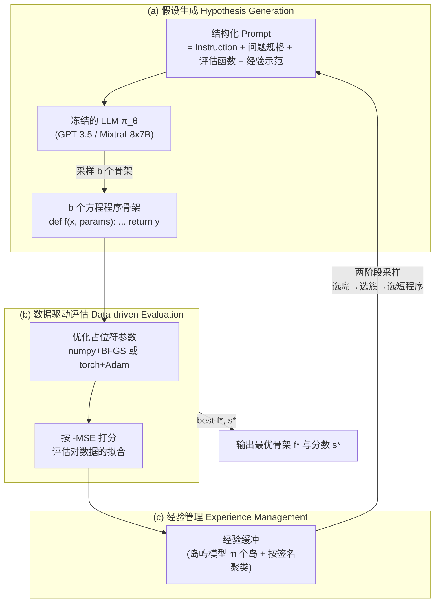

# 组会汇报 · LLM-SR：用 LLM 编程做科学方程发现

> 主讲提示：这是 F 组（自我改进/自动发现）里**最「窄而硬」**的一篇——它不碰「写论文/自评审」那套大循环，只盯住一件事：**给一堆观测数据，找出背后的方程**。它的高明之处不在系统多大，而在**问题表示**：把方程从「表达式树」换成「带占位符参数的 Python 程序」，于是 LLM 的科学先验和代码能力被一次性接进进化搜索。读它，是为了把「LLM 当变异算子 + 可验证评估 + 进化」这条 AlphaEvolve 主线，落到一个**单卡能复现、指标定义清清楚楚**的具体任务上。

---

## 1. 封面 · TL;DR

- **标题 / 出处**：LLM-SR: Scientific Equation Discovery via Programming with Large Language Models。Parshin Shojaee, Kazem Meidani（共同一作）, Shashank Gupta, Amir Barati Farimani, Chandan K. Reddy。**ICLR 2025 接收论文**（arXiv 2404.18400v3, 2025-03-20）。机构横跨 **Virginia Tech / CMU / Allen Institute for AI**。
- **权威性来源**：**ICLR 2025 正式接收**（顶会）；代码与数据开源（`github.com/deep-symbolic-mathematics/LLM-SR`），数据集以 MIT License 释出；受 NSF Grant 2416728 资助。它是「LLM × 符号回归」方向被顶会背书的代表作之一。
- **一段话**：科学里方程「不合理地好用」（套用 Wigner 的名言），但**从数据里发现方程**要在巨大的组合假设空间里搜索（已被证明是 NP-hard，见 §2.1 引 Virgolin & Pissis 2022）。传统**符号回归 (Symbolic Regression, SR)** 只从数据出发、用**表达式树 (expression tree)** 等受限表示去搜，**既丢掉了科学家依赖的领域先验，又把搜索空间和可表达性框死了**。LLM-SR 的赌注是：把方程写成**程序**（数学算子 + 占位符参数），让 LLM 用它的**科学先验**提出「方程骨架假设」，用**现成数值优化器**拟合占位符参数得到打分，再用一个**进化式经验缓冲（岛屿模型）**把高分骨架反馈回 prompt 迭代精化（见 Fig.1）。
- **三条带走的结论**：
  1. **表示即一切**：方程=「程序骨架 + 可优化参数」这一表示，同时解锁了**更强表达力**（任意可微算子、if-else 的光滑近似）、**直接可微参数优化**、和**LLM 科学先验注入**——这是它区别于纯 SR 的根。
  2. **OOD 泛化是主战场**：在自建的 4 个新基准上，LLM-SR（GPT-3.5 / Mixtral 双底座）**一致超越** GPLearn/DSR/uDSR/PySR/NeSymReS/E2E 等 SOTA SR，且**分布外 (OOD) 优势更大**——E. coli 问题上 OOD NMSE≈0.0037，而所有基线 OOD NMSE>1（Table 1）。靠先验，它**用 2.5K 次迭代**就赢过基线的 **2M+ 次**。
  3. **必须防 LLM「背书」**：作者刻意不只用 Feynman 基准——因为 LLM **背过** Feynman 方程（App C 用 perplexity 与「<20 次迭代秒解」实证），那会把「检索记忆」误判成「发现能力」。他们设计了 4 个**新基准**（含真实材料实验数据），专门**防 recitation**。

> 主讲提示：开场先抛三个锚点——「方程当程序」「OOD 才是擂台」「Feynman 会被背、所以要新基准」。后两点决定了它在本课里**既是正面战果、又是评估方法学的好样本**。

---

## 2. 问题与动机（why —— 本篇最该讲透的一节）

> 主讲提示：这一节请慢讲。LLM-SR 的全部设计几乎都在回应「纯符号回归缺了什么」。把缺口讲清，后面 how 自然顺。

### 2.1 问题层 why：发现方程为什么难、为什么值得

**任务是什么**：数据驱动的方程发现，也叫**符号回归 (Symbolic Regression, SR)**。给定观测数据集 $\mathcal{D}=\{(\mathbf{x}_i, y_i)\}_{i=1}^{n}$，目标是找到一个**简洁的符号表达式** $\bar f$ 去逼近未知函数 $f:\mathbb{R}^d\to\mathbb{R}$，使 $\bar f(\mathbf{x}_i)\approx y_i,\ \forall i$（原文 §2.1）。

**为什么值得做**：找到方程（而非只训一个预测模型）能带来三样**预测模型给不了**的东西（原文 §1 引 Langley 1981 / Schmidt & Lipson 2009）：① 对底层物理过程的**洞察 (insight)**；② **可解释性**；③ **跨问题的知识迁移**。

**为什么难**：评估「一个候选方程拟合得好不好」很容易，但**反过来从数据求出方程**是组合爆炸——已被证明是 **NP-hard**（原文 §1 引 Virgolin & Pissis 2022）。假设空间是「所有可能的数学结构」，巨大无比。

### 2.2 设计层 why：纯符号回归到底缺了什么（核心论证）

传统 SR 主要有两条技术路线，作者逐一点出其结构性缺陷（原文 §1、§4「Symbolic Regression」段）：

| 路线 | 代表 | 它怎么做 | **结构性缺陷** |
|---|---|---|---|
| **搜索式 (search-based)** | 遗传编程 GP（Koza 1994）、PySR、DSR、uDSR | 把方程表示成**表达式树/前缀序列/文法**，用**进化变异+重组**或 **RL** 在组合空间里搜 | ① **不含科学先验**→在巨大空间里盲搜、易陷局部最优、效率低；② **表示受限**（表达式树）→可表达性和搜索空间被框死 |
| **学习式 (learning-based)** | NeSymReS、E2E（预训练 Transformer SR） | 用海量合成数据预训练，**一把映射**「数值观测 → 表达式」 | 受限于**预训练分布**→换个新分布（自建基准）就**泛化崩**（Table 1 里 NeSymReS/E2E 表现最差） |

**两个「朴素替代方案」为何不够**（这正是 v2 规范要求的设计层 why）：

> **Why（设计层）之一**：朴素做法是「直接拿现成 LLM 优化框架（如 LMX / FunSearch / OPRO）来做 SR」。→ 会失败，因为（原文 §4「LLMs and Optimization」+ App F.2）这些**通用 LLM 优化器**：生成的是**完整方程而非可优化骨架**（参数没法用数值优化器精修）、**不注入领域先验**、**没有为多样性设计的多岛动态记忆**。作者实测 **LMX / FunSearch** 在 Oscillation 上 NMSE 比 LLM-SR 差几个数量级（App F.2 Table 4：LMX OOD 48.93 vs LLM-SR 5e-4）。
>
> **Why（设计层）之二**：朴素做法是「让 LLM 一步到位直接生成完整方程（含具体数值系数）」。→ 会失败，这正是消融里的 **w/o skeleton+optimizer** 变体：NMSE 从 ~1e-7 暴涨到 **3.78e-1**（in-domain）/ 3.75e-1（OOD）（原文 §3.5 Fig.6 / App F.2 Table 4）。原因：LLM 擅长「定结构」，**不擅长「精调连续系数」**；把这两件事**解耦**（LLM 出骨架、数值优化器调参）才对。

**作者的核心主张句**（原文 §1，斜体强调）：

> *「需要专门的方程发现方法，把先验科学知识有效整合进对巨大方程搜索空间的导航——这呼应了科学家在为科学发现提出假设时，对基础科学知识的依赖。」*

一句话：**科学家不是从零盲搜方程，而是带着物理直觉提假设**。纯 SR 把这条最值钱的先验扔了，LLM-SR 要把它捡回来。

### 2.3 为什么「现在」能做：LLM 的两项新能力

为什么 2024 年才做得成？因为 LLM 同时具备了两项过去没有的能力（原文 §1 / §2.1）：① **嵌入了海量科学文献的领域先验**，能为方程结构提「受过教育的猜测」（educated hypotheses）；② **可靠的结构化代码生成**——能把方程写成**可执行的 Python 程序**。把方程表示成程序，又顺带换来**可微参数优化**（程序里的占位符可被 Torch/Scipy 直接优化）。

> 主讲提示：把 §2.2 那张表 + 两个「朴素替代为何失败」讲透，这一节就立住了。一句话收口：**「纯 SR 缺先验、表示又窄；通用 LLM 优化器不解耦、无先验、无多样性记忆。LLM-SR 在表示层把这三件事一次性补齐。」**

---

## 3. 研究问题 / 核心 intention（形式化成一句话）

把问题压成一句（原文 §2.1）：

> **给定一个科学问题的自然语言描述 + 一份观测数据集，能否让 LLM 反复提出「方程程序骨架」假设、用数据驱动的优化与打分给它们评分、并用进化式记忆迭代精化，最终发现既拟合数据、又物理上可解释、且能泛化到分布外的方程？**

**形式化目标（原文 §2.1）**——记号先定义：
- $\pi_\theta$：参数为 $\theta$ 的预训练 LLM；
- $\mathcal{F}=\{f: f\sim\pi_\theta\}$：从 LLM 采样得到的**方程程序骨架 (equation program skeleton)** 的集合，每个 $f$ 是一个 Python 函数 `def f(x, params): ... return y`；
- $\mathcal{T}$：给定的科学问题（含自然语言描述）；
- $\mathcal{D}$：观测数据集；
- $\mathrm{Score}_{\mathcal{T}}(f, \mathcal{D})$：在问题 $\mathcal{T}$ 下，骨架 $f$ 对数据 $\mathcal{D}$ 拟合优度的打分（定义见 §7.2）。

优化目标写成：

$$ f^{*} \;=\; \arg\max_{f}\ \mathbb{E}_{\mathbf{x}\in\mathcal{D}}\big[\mathrm{Score}_{\mathcal{T}}(f, \mathcal{D})\big]. $$

读出什么：我们要的是**最大化拟合打分的那个程序骨架** $f^{*}$。注意——搜索变量是「程序 $f$」（结构），而 $f$ 内部的连续参数由数值优化器另行求解（**两阶段解耦**，§7 反复用到）。

**隐含假设**：(a) LLM 的科学先验足够好，能把搜索从「全空间盲搜」收窄到「物理上合理的子空间」；(b) 「结构由 LLM 定、连续参数由优化器调」这一解耦是对的；(c) 自然语言问题描述（变量含义、关系）能被 LLM 有效利用。

---

## 4. 相关工作定位（站在谁肩上、和谁不同）

一张表把 LLM-SR 放进坐标系（综合原文 §4 与 §1）：

| 方向 | 代表 | 方程表示 | 用科学先验？ | 与本篇关系 |
|---|---|---|---|---|
| 搜索式 SR | GP/GPLearn(Koza 1994)、PySR(Cranmer 2023)、DSR(Petersen 2021)、uDSR(Landajuela 2022) | 表达式树/前缀/文法 | ✗ | **主要对比基线**：盲搜、无先验、表示受限 |
| 学习式 SR | NeSymReS(Biggio 2021)、E2E(Kamienny 2022) | Transformer 解码序列 | ✗（靠预训练分布） | **对比基线**：换分布即崩 |
| 混合 SR | uDSR、Shojaee 2024（TPSR）、Mundhenk 2021 | 树 + 神经先验 | 部分 | 先驱：用神经先验引导搜索，但**非 LLM 科学先验** |
| 文法/声明式先验 | Todorovski & Džeroski 1997/2007、Brence 2021 | 概率文法 | ✓（人工编码） | **思想同源**：注入先验；但**先验靠人手写文法**，不通用 |
| LLM × 优化（通用） | LMX(Meyerson 2023)、OPRO(Yang 2023a)、**FunSearch**(Romera-Paredes 2024) | LLM 直接生成方案 | ✗ | **最相关**：FunSearch=「LLM+进化+可验证评估」；LLM-SR **专门化到方程发现 + 加先验 + 加可优化骨架** |
| **本篇 LLM-SR** | — | **程序骨架 + 占位符参数** | ✓（**LLM 内嵌的科学先验**） | **把上面各路的优点合一**：可执行程序表示 + 科学先验 + 进化搜索 + 数值优化器 |

**一句话差异化**：和 FunSearch 最像（都是「LLM 当变异算子 + 可验证评估 + 进化数据库」），但 LLM-SR **专门为方程发现而生**：① 加**科学先验**（自然语言问题描述进 prompt）；② 用**「骨架+占位符」两阶段**让数值优化器精调系数；③ 表示是**完整程序**（可表达任意可微算子 + if-else 光滑近似）。

> 主讲提示：把 FunSearch / AlphaEvolve 这条线明确点出——LLM-SR 是同一族「LLM 进化编程」思想在**科学方程发现**这个垂直任务上的**专门化实例**。这也是它能进 Inspires-Us 与 AlphaEvolve 对话的根。

---

## 5. 方法总览（big picture，先直觉后数学）

LLM-SR 是一个**迭代假设精化 (iterative hypotheses refinement)** 循环，三大组件（原文 Fig.1）：



**直觉（三句话）**：
- **(a) 像科学家提假设**：把问题用自然语言讲给 LLM 听（这是「驱动力 + 阻尼 + 回复力的某种组合」），LLM 基于物理直觉**写出一段带占位符参数的程序**当假设。
- **(b) 像实验拟合**：把假设的占位符参数用优化器拟合数据，按拟合好坏打分（**这是「自然选择」的尺子，机器自动、可验证**）。
- **(c) 像积累经验**：把高分假设存进一个**有多样性保护的记忆库**，下一轮采样几个当 in-context 范例喂回 LLM，引导它「在好结构上继续往深里改」。

**关键创新一句话**：把「方程」表示成「程序骨架 + 可优化参数」，于是**LLM 的科学先验、代码能力、和数值优化器**被一次性接进**进化搜索**——LLM 在这里扮演的是**变异/重组算子（mutation/crossover operator）**（原文 §3.3 明说）。

> 主讲提示：让听众记住三零件——**结构化 Prompt（含问题描述/评估函数/经验范例）/ 数值优化器打分 / 岛屿式经验缓冲**。后面 §7 逐个拆。强调 LLM 是**冻结的（snowflake 图标）**，不训练，纯当 in-context 变异算子。

---

## 6. 符号与术语表（后文统一用）

| 记号 / 术语 | 含义 |
|---|---|
| $f$（程序骨架, skeleton） | 一个方程的程序表示：`def f(x, params): ... return y`，结构固定、参数为占位符 |
| `params` / $\mathbf{p}$ | 占位符**参数向量**（数值系数/常数），由优化器拟合；长度上限 = 10（App B） |
| $\mathbf{x}, y$ | 输入特征 / 目标输出（如「位置/速度/时间」→「加速度」） |
| $\mathcal{D}=\{(\mathbf{x}_i,y_i)\}_{i=1}^n$ | 观测数据集 |
| $\pi_\theta$ | 冻结的预训练 LLM（变异算子）；$\theta$ 为其参数 |
| $\mathcal{F}_t=\{f_i\}_{i=1}^b$ | 第 $t$ 轮从 LLM 采样的 $b$ 个骨架；$b=4$（实验设置） |
| $\mathbf{p}_t$ | 第 $t$ 轮构造的 prompt |
| $\mathrm{params}^{*}$ | 优化后的最优参数；$\hat{\mathbf y}=f(\mathbf x, \mathrm{params}^{*})$ 为预测 |
| $s=\mathrm{Score}_{\mathcal{T}}(f,\mathcal{D})$ | 拟合打分 = $-\mathrm{MSE}(\hat{\mathbf y},\mathbf y)$（负均方误差，越大越好） |
| $\mathcal{P}_t$ | 第 $t$ 轮的经验缓冲（experience buffer）；存 $(f,s)$ 对 |
| 岛屿模型 (islands model) | $m$ 个独立演化的子种群，维持多样性（借鉴 FunSearch/Cranmer） |
| 签名 (signature) | 用「程序的得分」定义的指纹，岛内据此聚类以保多样性 |
| ID / OOD | in-domain（域内）/ out-of-domain（域外/分布外）测试集 |
| NMSE | 归一化均方误差（Normalized MSE），主评测指标（定义见 §7.2 / §13） |

---

## 7. 方法细节 ① 假设生成：把方程当程序来提

> 主讲提示：这一节回答「LLM 看到什么、吐出什么」。重点是 prompt 的四块结构（Fig.2）和「为什么要程序表示」。

### 7.1 Prompt 的四块结构（原文 §2.2, Fig.2）

每轮喂给 LLM 的 prompt 由四部分拼成：

1. **Instruction（指令）**：让 LLM 补全函数体，并**显式要求考虑变量的物理意义与关系**、「step by step」推理（注入「像科学家一样想」的姿态）。
2. **Problem Specification（问题规格）**：用自然语言精炼描述科学问题——关键变量、约束、目标。例（Fig.2）：*"Find the mathematical function skeleton that represents acceleration in a damped nonlinear oscillator system with driving force, given data on position, velocity, and time."*
3. **Evaluation and Optimization Function（评估与优化函数）**：把**怎么打分**的代码也给 LLM 看（`evaluate(data, equation)` + 参数优化片段）——让它知道目标。
4. **Experience Demonstration（经验示范）**：从经验缓冲采样的**若干历史高分骨架 + 其改进轨迹**，当 in-context 范例（few-shot），引导「在好结构上继续改」。

**Why（设计层）——为什么要自然语言问题描述？** 消融的 **w/o Prior** 变体（去掉问题的自然语言描述）性能明显下降（原文 §3.5 Fig.6 / App E Fig.17），且在 E. coli 上**先验影响尤其大**——这就是「科学先验注入」的实证价值。朴素做法「只给数据、不给问题描述」=退化成无先验 SR，盲搜。

### 7.2 方程程序骨架 = 结构 + 占位符参数（核心表示）

**直觉**：科学家提假设时先定**形式**（「加速度 = 驱动力项 + 阻尼项 + 回复力项」），系数留待**拟合**。LLM-SR 照搬：LLM 只负责**结构与核心逻辑**，数值系数全部写成占位符 `params[0], params[1], ...`（原文 §2.3, Fig.2 的 `equation_v0` 例）。

每个骨架是形如 `def f(x, params): ... return y` 的函数。一个真实例子（Fig.1 内嵌）：

```python
def equation(t, x1, x2, params):
    # x1: position, x2: velocity, params: numeric parameters
    y  = params[0]*np.sin(params[1]*x1)   # driving force
    y -= params[2]*x2                       # damping
    y += params[3]*x1**3                    # nonlinear restoring
    y += params[4]*x1                       # linear restoring
    return y
```

**Why（设计层）——为什么是「程序」而非「表达式树」？**（原文 §2.1 / §3.5）
- 朴素做法是用**表达式树**（GP/DSR 的表示）→ 可表达性受限、搜索空间被框死，且**无法自然表达 if-else 等控制流**。
- 程序表示三大红利：① **表达力**——任意可微算子、甚至 if-else 的**光滑近似**（用 `sigmoid` 近似阶跃，建模分段关系，见 App G 对 stress-strain 分段行为的处理）；② **可直接微分**——占位符可被 Torch 自动微分优化；③ **承载 LLM 代码先验**——LLM 本就擅长写结构化代码。
- 消融 **w/o Program**（限制 LLM 只生成单行数学表达式、不许用程序）也变差（Fig.6），证明「程序灵活性」本身有贡献。

### 7.3 采样与有效性约束（原文 §2.2）

第 $t$ 轮采样一批 $b$ 个骨架 $\mathcal{F}_t=\{f_i\}_{i=1}^{b}$，$f_i\sim\pi_\theta(\cdot\mid\mathbf{p}_t)$。用**温度采样 (temperature sampling)** 平衡探索（创造力）与利用（先验）——实验取 $\tau=0.8$。**执行失败或超过最大执行时间（$T=30$ 秒）的骨架直接丢弃**，保证有效性与算力效率（App B：内存上限 $M=2$GB）。

---

## 8. 方法细节 ② 假设优化与评估：解耦的两阶段打分

> 主讲提示：这一节是「自然选择的尺子」。核心是**结构与参数解耦**，以及打分用 -MSE / 评测用 NMSE 的区别。

### 8.1 为什么解耦：结构归 LLM，参数归优化器

**直觉**：发现方程 = ① 找对**结构**（哪些项、什么算子）+ ② 调对**连续系数**。LLM 擅长 ①、不擅长 ②；数值优化器擅长 ② 而不会 ①。于是**解耦**（原文 §2.3）：LLM 出骨架，占位符 $\mathbf{p}$ 交给优化器拟合 $\mathbf{p}^{*}$。

**两种优化器（按问题特性选）**（原文 §2.3）：
- **numpy + BFGS**：用 `scipy` 的拟牛顿非线性优化（Fletcher 1987）。**适合参数少**的问题。
- **torch + Adam**：基于 `PyTorch` 的随机梯度优化（Kingma & Ba 2014），**适合参数多、可微编程**的大规模问题。
- 实测 **numpy+BFGS 略好于 torch+Adam**（原文 §3.5），作者归因于 LLM **更会写 numpy 代码**（而非优化方法本身的优劣）——一个诚实且有意思的观察。

### 8.2 打分函数（先定义符号）

记号：$\hat{\mathbf y}=f(\mathbf x, \mathrm{params}^{*})$ 为优化后预测，$\mathbf y$ 为真值。拟合打分（原文 §2.3）：

$$ s \;=\; \mathrm{Score}_{\mathcal{T}}(f,\mathcal{D}) \;=\; -\,\mathrm{MSE}(\hat{\mathbf y}, \mathbf y) \;=\; -\frac{1}{n}\sum_{i=1}^{n}\big(\hat y_i - y_i\big)^2. $$

读出什么：**打分 = 负均方误差**，越接近 0（误差越小）分越高。取负号是为了「越大越好」契合 $\arg\max$ 目标（§3）。执行失败的骨架记 `None` 分（被丢弃）。

> ⚠ 注意区分：**搜索时用 -MSE 打分**（驱动进化），**报告结果时用 NMSE**（归一化、跨问题可比，定义见 §13）。组会上容易被问「到底哪个指标」——答：内部选择压力是 -MSE，对外评测刻度是 NMSE。

---

## 9. 方法细节 ③ 经验管理：岛屿模型 + 两阶段采样

> 主讲提示：这一节是「为什么不会很快陷进一个局部最优」。核心是**多样性保护**——岛屿 + 簇 + 偏好短程序。这套几乎照搬 FunSearch，是「LLM 进化编程」的通用骨架。

### 9.1 为什么要经验管理：避免局部最优、保持多样性

**Why（设计层）**：朴素做法是只把「当前最好骨架」喂回 LLM → 很快收敛、丧失多样性、陷局部最优。LLM-SR 用**经验缓冲 (experience buffer)** + **岛屿模型 (islands model)**（原文 §2.4，借鉴 Cranmer 2023 / Romera-Paredes 2024 FunSearch）维持一个**多样的高质量种群**。

### 9.2 岛屿模型与种群更新（原文 §2.4）

- 设 $\mathcal{P}_t$ 为第 $t$ 轮缓冲，存 $(f,s)$ 对。用 **$m$ 个独立岛屿**，每个岛初始化为「初始 prompt 里那个简单线性骨架（`equation_v0`）的拷贝」。
- 第 $t$ 轮新骨架 $\mathcal{F}_t$ 及其分数，**仅当改进了所在岛当前最优**时才加入源岛：

$$ \mathcal{P}_t^{i} \leftarrow \mathcal{P}_t^{i}\cup\{(f,s)\}\ :\ f\in\mathcal{F}_t,\ s\;>\;s_{\text{best}}^{i}, $$

其中 $\mathcal{P}_t^{i}$ 是第 $i$ 个岛、$s_{\text{best}}^{i}$ 是该岛当前最优分。
- **岛内按签名聚类**：「签名」由程序的得分定义，得分相同的归一簇，**保多样性**。
- **周期性重置（App B）**：每 $T_{\text{reset}}$ 次迭代（约 4 小时）把**最差的 $m/2$ 个岛清空**，各自用「存活的 $m/2$ 个岛里随机选一个的最优骨架」重新播种——丢弃停滞区域、聚焦有希望的区域。超参 $T_0=0.1,\ N=10000$（App B）。

### 9.3 两阶段采样：选岛 → 选簇 → 选短程序（原文 §2.4 / App B）

为构造 in-context 范例，从缓冲两阶段采样：

**第一步——选岛**：从 $m$ 个岛**均匀随机**选一个。

**第二步——岛内选簇（偏好高分）**：用 **Boltzmann（玻尔兹曼）选择**（Maza & Tidor 1993），簇 $i$ 被选概率：

$$ P_i \;=\; \frac{\exp\!\big(s_i/\tau_c\big)}{\sum_{i'}\exp\!\big(s_{i'}/\tau_c\big)},\qquad \tau_c \;=\; T_0\Big(1-\frac{u\bmod N}{N}\Big). $$

记号：$s_i$ 为第 $i$ 簇的聚合分（如其签名内所有得分的均值）；$\tau_c$ 为**退火温度**，随当前岛内程序数 $u$ 周期性下降（$u\bmod N$）；$T_0,N$ 为超参。读出什么：**高分簇更可能被选**；温度退火让早期更探索、后期更利用。

**第三步——簇内选程序（偏好短程序）**：令 $l_i$ 为第 $i$ 个程序的字符长度，归一化负长度 $\tilde l_i=\dfrac{l_i-\min_{i'} l_{i'}}{\max_{i'} l_{i'}+10^{-6}}$，则选中概率：

$$ P(f_i)\ \propto\ \exp\!\big(-\tilde l_i/\tau_p\big),\qquad \tau_p=1. $$

读出什么：**越短的程序越容易被选**——这是对「简洁性 / 奥卡姆剃刀」的隐式偏好，防止方程膨胀。

> 主讲提示：这套「岛屿 + 簇 + 偏好短程序」和 AlphaEvolve 的 MAP-elites+岛屿、FunSearch 的采样几乎同构。组会可一句带过：**「多样性保护是 LLM 进化编程的标配，LLM-SR 直接复用 FunSearch 配方。」**

---

## 10. 算法伪代码（原文 Algorithm 1）

> 直觉：把前三节合成一个循环——采范例 → 拼 prompt → 采骨架 → 评估打分 → 更新种群 → 留最优。

**输入**：LLM $\pi_\theta$，数据集 $\mathcal{D}$，问题 $\mathcal{T}$，迭代数 $T$，in-context 范例数 $k$，每 prompt 采样数 $b$。

```
P_0 ← InitPop()                       # 用简单线性骨架(equation_v0)初始化各岛
f*, s* ← null, -∞
for t = 1 to T-1 do
    E ← {e_j}_{j=1..k},  e_j ← SampleExp(P_{t-1})   # 从缓冲两阶段采 k 个范例
    p ← MakeFewShotPrompt(E)                          # 拼成结构化 prompt
    F_t ← {f_j}_{j=1..b},  f_j ~ π_θ(·|p)             # LLM 采 b 个骨架
    for f in F_t do
        s ← Score_T(f, D)            # 优化占位符参数后按 -MSE 打分
        if s > s* then f*, s* ← f, s
        P_t ← P_{t-1} ∪ {(f, s)}     # 改进则入种群
    end
end
Output: f*, s*
```

读出什么：**LLM 不被训练**（$\theta$ 全程冻结），它只当「读范例→写新骨架」的**进化变异算子**；真正的「学习」发生在**种群层面**（哪些骨架被保留/被采样回 prompt）。实验中 $b=4,\ k=2,\ T\approx 2.5\text{K}$ 次迭代。

---

## 11. 防 LLM「背书」：为什么不能只用 Feynman 基准（方法学亮点）

> 主讲提示：这是 LLM-SR **最该被表扬的方法学贡献**，也是它在本课「评估/诚信」线里的价值。慢讲。

**问题层 why**：符号回归的标准基准是 **Feynman 数据集**（120 道《费曼物理学讲义》里的物理方程，Udrescu & Tegmark 2020）。但**这些方程 LLM 大概率背过**——用它评 LLM-based 方法，会把「**检索记忆 (recitation)**」误判成「**发现 (discovery)**」（原文 §3.1）。

**证据一——秒解**：LLM-SR 在 Feynman 上**<20 次迭代**就达到极低误差（原文 §3.1 / App C Fig.11），快得不像「搜索」，像「背出来」。App C Fig.12/13 直接展示：对 Feynman I.37.4、I.26.2，LLM **一次性（无需迭代搜索）就吐出精确形式**（如 $I = I_1+I_2+2\sqrt{I_1 I_2}\cos\delta$）。

**证据二——困惑度 (perplexity, PPL)**：用开源 Mixtral 测「给定科学背景、生成该方程」的困惑度。困惑度定义（原文 App C）：

$$ \mathrm{PPL} \;=\; \exp\!\Big(-\frac{1}{N}\sum_{i=1}^{N}\log p(x_i\mid x_{<i})\Big), $$

记号：$N$ 为生成方程的 token 数；$p(x_i\mid x_{<i})$ 为模型在前文条件下生成第 $i$ 个 token 的概率（取自 Mixtral logits）。读出什么：**PPL 越低 = 模型越「确信」= 越可能是背的**。结果（App C Fig.9/10）：Feynman 方程 PPL **显著低**于自建基准（如 Feynman I.9.18 的 PPL≈1.94，而 Oscillation 1≈6.24、E. coli≈6.93）——坐实「Feynman 被记忆、新基准需推理」。

**作者的对策——自建 4 个防 recitation 基准**（原文 §3.1, App D），三条设计准则：① **对已知物理模型做定制改造**防记忆；② **复杂合成非线性关系**挑战「创造性探索」；③ **用真实实验数据**贴近真实建模。

> 主讲提示：把 perplexity 这条讲清——它是一个**可量化的「记忆探针」**。这正好接本库「评估方法学」线：**评 LLM-based 科学系统，必须先排除『它只是背过』这一可能**。这条洞察可直接迁移到我们任何「LLM 做科学发现」的评测设计。

---

## 12. 四个自建基准的方程（原文 App D，逐个读懂）

> 主讲提示：这四个基准是论文的「实验地基」。每个都**故意塞了不常见的算子组合**，让纯背书行不通。组会上挑 1-2 个讲透即可。

**(1) Nonlinear Oscillators（非线性阻尼振子，物理）**（App D.1, Eq. 见 p.19）。一般形式 $\ddot x + f(t,x,\dot x)=0$，$v=\dot x$。两个**自定义**振子（超出 Van der Pol/Duffing 等常见系统）：

$$\text{Oscillation 1:}\quad \dot v = F\sin(\omega x) - \alpha v^3 - \beta x^3 - \gamma x\cdot v - x\cos(x),$$
$$\text{Oscillation 2:}\quad \dot v = F\sin(\omega t) - \alpha v^3 - \beta x\cdot v - \delta x\cdot \exp(\gamma x),$$

符号：$F$ 驱动力幅度、$\omega$ 频率、$\alpha,\beta,\gamma,\delta$ 各非线性项系数。参数取值（Table 2）：Osc1 $\{F{=}0.8,\alpha{=}0.5,\beta{=}0.2,\gamma{=}0.5,\omega{=}1.0\}$；Osc2 $\{F{=}0.3,\alpha{=}0.5,\beta{=}1.0,\delta{=}5.0,\gamma{=}0.5,\omega{=}1.0\}$。用 `scipy.solve_ivp` 仿真，时间范围 $(0,50)$。**故意混入三角/多项式/指数项**，难背、可解。

**(2) Bacterial Growth（E. coli 生长率，生物）**（App D.2, p.21）。乘法结构 $\frac{dB}{dt}=f_B(B)\cdot f_S(S)\cdot f_T(T)\cdot f_{\mathrm{pH}}(\mathrm{pH})$，自定义为：

$$ \frac{dB}{dt} = \mu_{max}\,B\,\Big(\frac{S}{K_s+S}\Big)\,\frac{\tanh\!\big(k(T-x_0)\big)}{1+c(T-x_{decay})^4}\,\exp\!\big(-|\mathrm{pH}-\mathrm{pH}_{opt}|\big)\sin\!\Big(\frac{(\mathrm{pH}-\mathrm{pH}_{min})\pi}{\mathrm{pH}_{max}-\mathrm{pH}_{min}}\Big)^2. $$

符号：$B$ 菌群密度、$S$ 底物浓度、$T$ 温度、$\mathrm{pH}$ 酸碱度；$\mu_{max}$ 最大生长率、$K_s$ Monod 半饱和常数、$k,x_0,c,x_{decay}$ 温度响应参数、$\mathrm{pH}_{opt/min/max}$ pH 参数。**亮点设计**：$f_S$ 保留**已知的 Monod 方程**（$S/(K_s+S)$，1949 年经典，当「先验探针」测能否识别已知子结构），但 $f_T,f_{\mathrm{pH}}$ 用**新颖非线性形式**（tanh+四次衰减 / 指数×三角）防背书。

**(3) Material Stress Behavior（材料应力，材料科学）**（App D.3, p.22）。**用真实实验数据**——Aluminium 6061-T651 在 6 个温度（20–300°C）下的单轴拉伸应力-应变曲线（Aakash et al. 2019, CC BY 4.0）。**没有预设理论模型**，应力-应变-温度关系**因材料/条件大变**、含**分段 (piece-wise) 非线性**，最贴近「真实经验建模」、最防记忆。

**OOD 划分（App D.1 / D.3）**：振子用**时间区间** $T\in[0,20]$ 当 OOD 验证集；stress-strain 用 $T=200$°C 那条曲线当 OOD。即「训练分布外」的外推能力是主考点。

---

## 13. 实验设置（setting / metrics / params / 算力 / 成本，写全）

> 主讲提示：这一节是「指标定义式写全」的样板。组会最易被追问「NMSE 怎么算」「跑了多少次」。

### 13.1 数据集与划分
- **4 个自建基准**：Oscillation 1 / Oscillation 2 / E. coli Growth / Stress-Strain（§12）。每个分**训练 / ID 验证 / OOD 验证**三份（原文 §3.1 / App D）。

### 13.2 Baselines（6 个 SOTA SR，覆盖三范式）（原文 §3.2 / App A）
- **搜索式**：**GPLearn**（GP，种群 500、锦标赛 20、最多 2M 代）、**PySR**（多岛异步 GP，15 种群、每种群 33、其余默认）、**DSR**（RNN+RL，lr 5e-4、batch 512、最多 2M 迭代）、**uDSR**（DSR+线性 token+GP 解码）。
- **学习式（预训练 Transformer）**：**NeSymReS**（限 $\le 3$ 变量，故 **E. coli（4 变量）不可用**，Table 1 标 N/A）、**E2E**（限 $\le 10$ 变量）。
- **公平性**：所有搜索式基线**跑超过 2M 次迭代直到收敛**，各做 **5 次重复**取最优（App A.2）。预训练 Transformer 输入做**标准归一化**。

### 13.3 LLM-SR 自身配置（原文 §3.2 / App B）
| 超参 | 取值 |
|---|---|
| 底座 LLM | **GPT-3.5-turbo**（OpenAI API）/ **Mixtral-8x7B**（4×NVIDIA RTX 8000, 48GB） |
| 每 prompt 采样骨架数 $b$ | 4 |
| 采样温度 $\tau$ | 0.8 |
| 参数优化器 | numpy+BFGS 或 torch+Adam |
| 单次评估超时 / 内存 | $T=30$ 秒 / $M=2$ GB |
| in-context 范例数 $k$ | 2 |
| 并发评估器数 $e$ | 4 |
| 参数向量最大长度 | 10（防过参数化） |
| 总迭代数 | **约 2.5K**（对比基线 2M+） |
| 岛屿数 $m$ / 重置周期 | 多岛（App F.3 含「w/o multi-island」消融）/ 每 ~4 小时 |
| Boltzmann 超参 | $T_0=0.1,\ N=10000,\ \tau_p=1$ |

### 13.4 主评测指标：NMSE（务必给定义式）

**直觉**：MSE 的绝对值随目标量纲变化，跨问题不可比；除以「目标方差」做**归一化**，得到无量纲、可横向比较的误差。

记号：$\hat y_i$ 预测、$y_i$ 真值、$\bar y$ 真值均值、$n$ 样本数。**归一化均方误差 (Normalized MSE)**：

$$ \mathrm{NMSE} \;=\; \frac{\sum_{i=1}^{n}(\hat y_i - y_i)^2}{\sum_{i=1}^{n}(y_i - \bar y)^2}. $$

> 注：原文正文（§3.3）将主指标称为 NMSE 且「越低越好」，但**未在正文给出 NMSE 的显式分式定义**——此处给出的是符号回归领域的标准 NMSE 定义（分母为目标的总方差），用于帮助理解；**原文未给出该式的逐符号定义，引用时以此为「领域通用定义」而非论文原式**。读出什么：NMSE=1 相当于「预测=常数均值」的平凡基线；**NMSE<<1 才算真学到结构**，故 E. coli 上基线 OOD NMSE>1 = **比瞎猜还差**（过拟合崩在 OOD）。

### 13.5 算力与成本
- Mixtral 跑在 **4×RTX 8000（48GB）**；GPT-3.5 走 **OpenAI API**。
- **原文未给出**单次完整实验的总美元成本 / 总 GPU 小时数（**原文未给出**）——只给了「约 2.5K 迭代、单次评估 30 秒超时、4 并发评估器」等可推算的局部量。
- **随机性控制**：基线各 5 次重复取最优；LLM-SR 的多种子统计**原文正文未明确给出重复次数**（仅 App F.1 做了噪声鲁棒性的受控实验）。

> 主讲提示：诚实点出「总成本/总卡时原文没给」——这是组会该追问的复现盲点。

---

## 14. 主要结果（数字 + 解读，别只贴表）

> 主讲提示：Table 1 是全场核心。讲法：先讲「双底座都赢」，再讲「OOD 差距更大」，最后用 E. coli 那个「基线 OOD>1」的对比一锤定音。

### 14.1 主表：4 基准 × ID/OOD 的 NMSE（原文 Table 1，越低越好）

| Model | Osc1 ID | Osc1 OOD | Osc2 ID | Osc2 OOD | E.coli ID | E.coli OOD | Stress ID | Stress OOD |
|---|---|---|---|---|---|---|---|---|
| GPLearn | 0.0155 | 0.5567 | 0.7551 | 3.188 | 1.081 | 1.039 | 0.1063 | 0.4091 |
| NeSymReS | 0.0047 | 0.5377 | 0.2488 | 0.6472 | N/A(d>3) | N/A | 0.7928 | 0.6377 |
| E2E | 0.0082 | 0.3722 | 0.1401 | 0.1911 | 0.6321 | 1.4467 | 0.2262 | 0.5867 |
| DSR | 0.0087 | 0.2454 | 0.0580 | 0.1945 | 0.9451 | 2.4291 | 0.3326 | 1.108 |
| uDSR | **0.0003** | 0.0007 | 0.0032 | **0.0015** | 0.3322 | 5.4584 | 0.0502 | 0.1761 |
| PySR | 0.0009 | 0.3106 | **0.0002** | 0.0098 | 0.0376 | 1.0141 | 0.0331 | 0.1304 |
| **LLM-SR (Mixtral)** | 7.89e-8 | **0.0002** | 0.0030 | 0.0291 | **0.0026** | **0.0037** | **0.0162** | 0.0946 |
| **LLM-SR (GPT-3.5)** | **4.65e-7** | **0.0005** | **2.12e-7** | **3.81e-5** | 0.0214 | 0.0264 | **0.0210** | **0.0516** |

（加粗为该列最优/次优；以原文 Table 1 为准。）

**读出什么（机制层 why）**：
1. **双底座一致领先**：GPT-3.5 与 Mixtral 两个 LLM-SR 变体在几乎所有列都拿下最优或次优，**且只用 2.5K 迭代赢过基线 2M+**（原文 §3.3）。机制：**科学先验把搜索从盲搜变成「在合理子空间精修」**，所以效率高一个量级。
2. **OOD 优势放大**：ID 上有些基线（uDSR/PySR）能接近，但**一到 OOD 差距骤然拉开**（原文 §3.3）。最刺眼——**E. coli OOD：LLM-SR ≈ 0.0037，所有基线 > 1**（uDSR 甚至 5.46）。机制：基线**过拟合训练分布**（Fig.5 显示 PySR/uDSR 的预测分布在 OOD 区严重偏离真值），而 LLM-SR 因**结构带物理意义**，外推时不崩。
3. **学习式最差**：NeSymReS/E2E 垫底——印证 §2.2「受限于预训练分布、换分布即崩」。
4. **更大底座更好（App F.3 Table 5）**：换 **GPT-4o** 在 Osc1/Osc2 上再降一截（Osc2 ID 4.27e-10）——印证「底座越强、发现越好」（呼应 AlphaEvolve 的 H3）。

### 14.2 效率：收敛曲线（原文 Fig.3）
LLM-SR 的「最优分数 vs 迭代数」曲线呈**陡降阶梯**——靠先验**快速锁定有希望结构**；SR 基线则**缓慢爬升、2M+ 迭代仍追不上**，且**差距随迭代越拉越大**（原文 §3.3）。机制：LLM 当「智能变异算子」，每次提议都更「懂物理」，胜过盲目的 GP 变异。

### 14.3 定性：发现的方程更像真方程（原文 §3.4, Fig.4）
LLM-SR 发现的骨架**恢复了真方程的符号项**（Fig.4 绿色高亮项），且**带注释/物理命名**（「driving force / damping / restoring」），把方程**解构成可解释的物理组件**；基线则给出**一堆缺乏物理意义的算子堆叠**。例（App G Fig.19）：Osc2 真方程含 $-5x\exp(0.5x)$，LLM-SR 发现 $+5(1-\exp(x))$——作者验证在数据范围 $x\in(-2,2)$ 内 $5(1-\exp(x))\approx -5x\exp(0.5x)$，即**找到了等价的物理形式**。

---

## 15. 消融与分析（哪个部件贡献多少）

> 主讲提示：消融在 Oscillation 2 上做（GPT-3.5 底座，原文 §3.5 Fig.6；全基准版 App E Fig.17）。讲法：四个「拿掉一块」的变体，量化每块的命。

### 15.1 四大组件消融（原文 Fig.6，NMSE，越低越好）

| 变体（拿掉什么） | in-domain NMSE | OOD NMSE | 结论 |
|---|---|---|---|
| **w/o Prior**（去自然语言问题描述） | 4.61e-5 | 7.10e-3 | 先验**重要**（去掉显著变差）；E. coli 上影响尤甚 |
| **w/o Program**（限单行表达式、不许程序） | 3.22e-5 | 4.30e-3 | 程序灵活性**有贡献**（但较轻于 prior） |
| **w/o Iterative Refinement**（去优化循环，纯采样） | **1.01e-1** | **1.81e-1** | **影响最大**——进化搜索是命脉 |
| **w/o Skeleton+Optimizer**（直接生成完整方程含系数） | **3.78e-1** | **3.75e-1** | **影响最大**——「骨架+优化器」解耦是命脉 |
| **完整 LLM-SR** | **~1e-7 量级** | **~1e-5 量级** | 全组件最优 |

**读出什么**：贡献排序大致为 **「迭代精化 / 骨架+优化器解耦」（命脉）> 自然语言先验 > 程序表示**。其中两条「命脉」对应本篇两大核心主张：**进化搜索**与**结构/参数解耦**。w/o Skeleton+Optimizer 从 1e-7 暴涨到 3.78e-1（差 6 个数量级！）——这就是「为什么不能让 LLM 一步生成完整方程」的铁证（§2.2 设计层 why 之二）。

### 15.2 其它分析
- **优化器对比（§3.5）**：numpy+BFGS 略胜 torch+Adam（归因于 LLM 更会写 numpy）。
- **多岛设计消融（App F.3 Table 3）**：去掉多岛+用确定性 top-k 选范例 → 变差（Stress OOD 0.1010 vs 0.0516；Osc2 OOD 8e-4 vs 3.81e-5），且**多样性下降、过早收敛**。
- **噪声鲁棒性（App F.1 Fig.18）**：在 Osc2 加高斯噪声（$\sigma\in\{0,0.01,0.05,0.1\}$），LLM-SR 比 PySR **更抗噪**（尤其 OOD）——机制：先验把搜索**约束到物理合理解**，噪声下也不乱跑。
- **LLM 优化基线对比（App F.2 Table 4）**：LLM-SR 远胜 **LMX / FunSearch**（LMX Osc1 OOD 48.93、FunSearch 8.059 vs LLM-SR 5e-4）——证明「专门化 + 先验 + 可优化骨架」相对通用 LLM 优化器的增量。

---

## 16. 局限与批判（诚实区分宣称 vs 边界）

**原文自承（§5 Conclusion）**：
1. **绑死 LLM 训练数据的质量与广度**：某些科学领域若 LLM 训练数据稀薄/有偏，先验就帮不上甚至误导（原文明说 "inherently tied to the quality and breadth of the LLM's training data, which may lead to biases or gaps"）。
2. **计算成本可能高**：迭代式 LLM 查询 + 参数优化对大规模问题**可能不可承受**（原文 "could be prohibitive for large-scale problems"）。
3. **未来工作**：接**领域专用 LM + 检索增强 (RAG)** 提升相关性；引入**人类领域专家**进环；造**更多防 recitation 的基准**。

**社区/我方追加的质疑**：
- **「记忆 vs 发现」的边界仍模糊**：作者用 perplexity 排除 Feynman 记忆，但**自建基准的「子结构」（如 Monod 方程）本身也可能被 LLM 部分记忆**——「发现」与「检索已知组件再拼装」的界线**没有被彻底量化**（原文 App D.2 坦承 Monod 是当先验探针放进去的，但未量化它被「背出」的比例）。
- **指标单一**：主评测只用 NMSE（拟合 + 泛化），**对「方程简洁性 / 物理正确性」缺乏独立定量指标**——「更可解释」主要靠 Fig.4 定性展示，**未给可解释性的量化分**。
- **总成本/卡时缺失**：§13.5 已指出原文**未报告总美元/总 GPU 小时**，复现成本不透明。
- **规模与任务范围有限**：变量数 $\le$ 个位数、4 个基准，**未触及高维 / 多方程耦合 / 带噪真实大数据**的硬场景。
- **依赖闭源 GPT-3.5**：最佳结果之一来自闭源 API，**可复现性与长期可得性打折**（Mixtral 版可缓解，但部分指标 GPT 版更好）。

> 主讲提示：把「记忆 vs 发现没被彻底量化」单独强调——这正是它和本课「评估/诚信」线的接口：**一个『防背书』做得最认真的 SR 工作，依然没能给『发现』一个不可造假的硬定义**。这是机会（见下节 c）。

---

## ★ 对我们的启发（Inspires Us）

> 这一节回答一句话：LLM-SR 对我（们）接下来的研究，**到底能用上什么**。落点全部钉到具体机制 / 具体模块 / 具体第一步。

- ➤ **a. 可直接借用的招（reuse）**：
  1. **「骨架 + 占位符参数」两阶段解耦**——让 LLM 出**结构**、让数值优化器调**连续系数**。消融证明这一步价值达 **6 个数量级**（w/o Skeleton+Optimizer：1e-7→3.78e-1）。**凡是我们让 LLM 生成「带可调数值的方案」的管线，都该把『定结构』与『调参数』拆开**，别让 LLM 硬猜系数。
  2. **perplexity 当「记忆探针」**（App C 的 PPL 式）——在评测任何「LLM 做科学发现」前，**先用 PPL 测一遍候选答案是否被背过**，把「检索记忆」从「真发现」里剔出去。这是一个**可量化、即插即用**的污染检测器。
  3. **把『评估函数』写进 prompt 给 LLM 看**（§7.1 第三块）——让变异算子「知道自己会被怎么打分」，提议更有的放矢。可加进我们任何「生成-然后-评分」的循环。

- ➤ **b. 可迁移到我们课题（transfer）**：把 LLM-SR 的「LLM 变异算子 + 可验证打分（-MSE）+ 岛屿进化缓冲」整套，**对齐 [`m9.7-self-improvement-evolution`](../m9.7-self-improvement-evolution/)** 的「archive+fitness 进化 + holdout 防 reward hacking」。LLM-SR 的**「报告用 NMSE、内部用 -MSE」**恰好提示我们：**搜索压力**与**对外评测**应是两把尺子。迁移时要改的前提：LLM-SR 的打分是**完全干净可验证的拟合误差**（不会被钻空子）；我们的任务若打分**可被造假**，进化就会学会刷分——所以 m9.7 的 **holdout** 必须比 LLM-SR 的 in-sample MSE 更强地守住「不可造假」。

- ➤ **c. 它暴露的开放问题 = 我们的机会（opportunity）**：LLM-SR **没能给「发现 vs 记忆」一个不可造假的硬定义**（§16）——它用 PPL 排除 Feynman，但**自建基准里的已知子结构（Monod）被部分记忆的比例没量化**。→ **机会**：设计一个「**结构新颖度 (structural novelty)**」指标——对发现的骨架，量化其各子项「在 LLM 训练语料中出现的可能性（用 PPL/检索命中）」，从而把「真创造的项」与「背出来再拼的项」**分离打分**。**可下手的第一步**：在 m9.7/m9.6 里复刻 LLM-SR 的 Osc2 任务，对发现方程**逐项**算 PPL，看「真正降 NMSE 的新项」是否恰好是「高 PPL（没背过）」的项。

- ➤ **d. 与本库其它论文/模块的连接（connect the dots）**：
  - **同族放大**：与 [`2506.13131` AlphaEvolve](2506.13131-alphaevolve-deepmind.md) 是**同一思想的两个尺度**——都是「LLM 当变异算子 + 自动可验证评估 + 岛屿进化数据库」。AlphaEvolve 进化**整份代码库/搜索算法**做通用超优化；LLM-SR 进化**方程程序骨架**做科学发现。**LLM-SR ≈ AlphaEvolve 在『科学方程』垂直任务上的专门化 + 加科学先验**。两篇可并讲：**「可验证评估 + 进化编程」是 F 组的统一母题**。
  - **思想前身**：与 **FunSearch**（Romera-Paredes 2024，本篇 §4 点名「最相关」）一脉——LLM-SR 把 FunSearch 的「单函数 + 无先验」扩成「程序骨架 + 科学先验 + 数值优化器」。
  - **机制呼应**：岛屿+holdout 直通 [`m9.7-self-improvement-evolution`](../m9.7-self-improvement-evolution/) 的 reward-hacking 教训；perplexity 探针直通本库「评估/诚信」线（与 [`2505.22954` Darwin-Gödel Machine](2505.22954-darwin-godel-machine.md) 的「自改进需可验证守卫」互为印证）。
  - **数学发现并讲**：可与 **AI-Mathematician（arXiv `2505.22451`）**对照——后者把 LLM 推向**定理证明/数学发现**，与 LLM-SR 的**方程发现**同属「LLM 做硬科学」，但 LLM-SR 的「可微数值打分」是它独有的、比纯证明任务更易自动验证的优势。（注：本库暂无 `2505.22451` 的精读文件，此处为前向连接。）

- ➤ **e. 如果我来做下一步（my next move）**：我会在 [`m9.7`](../m9.7-self-improvement-evolution/) 里加一个**「LLM-SR 最小复现」开关**——用一个开源小模型当变异算子、`-MSE` 当 fitness、岛屿缓冲做进化，在 Oscillation 2 上跑 ~500 迭代；**同时对每个被保留的骨架逐项算 PPL**，一周内出一个最小结论：**「真正拉低 NMSE 的项，是不是恰好是 PPL 高（模型没背过）的项？」**——若是，就拿到了「发现 ≠ 记忆」的第一个可量化证据，直接补上 §16(c) 那个缺口。

> 主讲提示：这一节是全场高潮——前面讲「LLM-SR 做了什么」，这里讲「**我们下周就能试什么**」。落点是 m9.7 的「LLM-SR 最小复现 + 逐项 PPL」，能被同组同学直接接力。

---

## 17. 在 auto-research 版图的位置（相对已有工作的增量）

- **阶梯定位**：按本库 **Tool → Analyst → Scientist** 阶梯，LLM-SR 在「**有自动可验证判据的窄域**（方程拟合误差可机器打分）」里达到了**做出可解释、可泛化新方程**的**类 Scientist 级**——但与 AlphaEvolve 同样**受限**：它**不能自定义研究问题**（问题/数据/评估函数都由人给定），故仍属「**窄域自动发现**」而非「全自主科学家」。
- **它把谁向前推了一步 / 时间增量**：
  - **相对纯符号回归（GP/DSR/PySR/uDSR/NeSymReS/E2E）**：第一次系统性地把 **LLM 科学先验 + 可执行程序表示**接进 SR，并在**OOD 泛化**上拉开代差——把「数据驱动方程发现」从「盲搜拟合」推进到「带先验的可解释发现」。
  - **相对通用 LLM 优化器（LMX/FunSearch/OPRO）**：把它们**专门化到方程发现**，补上「骨架+优化器解耦」「科学先验」「多岛多样性记忆」，实测高出数量级（App F.2）。
  - **相对 FunSearch（Nature 2024）**：FunSearch 进化**单函数解开放数学问题**；LLM-SR 进化**方程程序骨架解科学发现**，且**显式注入领域先验**——是「LLM 进化编程」从「纯数学」向「自然科学」的迁移样本。
- **与 AlphaEvolve 的并列关系**：二者是 F 组「**LLM 进化编程**」母题的**两个垂直实例**（一个超优化通用代码、一个发现科学方程），**共享『可验证评估 + 进化数据库 + LLM 变异算子』内核**，可作为「同一范式、不同应用」的对照范例并讲。

---

## 18. 复现与可用性

- **开源**：代码 + 数据 `https://github.com/deep-symbolic-mathematics/LLM-SR`；3 个合成数据集（Osc1/Osc2/E.coli）以 **MIT License** 释出；stress-strain 数据来自 Mendeley（**CC BY 4.0**，`data.mendeley.com/datasets/rd6jm9tyb6/1`）。
- **能不能单卡跑**：
  - **GPT-3.5 版**：核心算力是 **OpenAI API 调用**，本地几乎不吃 GPU——**单机可跑**（成本在 API token）。
  - **Mixtral 版**：原文用 **4×RTX 8000（48GB）**托管 Mixtral-8x7B；单张大显存卡 + 量化**或可勉强跑**，但**原文按 4 卡配置**。
  - 真正的「缩小可跑版」建议**换更小的开源底座**（本库 m9.7 思路）：把 LLM-SR 内核（骨架生成 + numpy/BFGS 打分 + 岛屿缓冲）接一个小模型，在单卡上跑 Oscillation 任务做演示。
- **坑**：
  1. **执行/超时治理**：骨架是 LLM 生成的代码，必须**沙箱执行 + 30 秒超时 + 2GB 内存上限**（App B），否则会被恶性代码/死循环拖垮。
  2. **闭源依赖**：最佳指标部分来自 GPT-3.5/GPT-4o，**长期复现需注意 API 模型漂移**。
  3. **数值优化敏感**：BFGS/Adam 对初值与超时敏感；参数向量上限 10，**过参数化会被截断**。
  4. **污染风险**：若换更新的强 LLM，**Feynman 乃至自建基准子结构可能已被背得更多**——复现前先跑 PPL 探针（§11）。

---

## 19. 组会讨论问题（5–8 个，引发讨论）

1. **「骨架 + 优化器」解耦带来 6 个数量级提升**（§15.1）。这条「LLM 定结构、优化器调参数」的解耦，能推广到哪些**非方程**任务（如让 LLM 出网络结构、超参由 BO 调）？什么时候解耦反而**有害**？
2. 作者用 **perplexity** 排除 Feynman 记忆（§11）。但**自建基准里的 Monod 等已知子结构**也可能被背——**怎么设计一个实验，量化「发现的方程里，多少是真创造、多少是背出来再拼装」**？（直通 §16c 的机会）
3. LLM-SR 的命门是**「拟合误差可机器打分」**。我们手上哪些研究问题能写出这样的**可验证 $\mathrm{Score}$**？写不出时，能否用 **LLM 评审/辩论**近似？近似会引入什么**被刷分**风险？（对照 AlphaEvolve 的同名命门）
4. 主指标只有 **NMSE**（拟合+泛化），**「可解释性 / 物理正确性」只有定性 Fig.4**。该用什么**定量指标**衡量「方程更有物理意义」？（如结构与真方程的编辑距离、符号项召回率）
5. **OOD 优势来自先验**（§14）。但「先验」是把双刃剑——在 LLM **训练数据稀薄/有偏**的领域（如冷门材料、新物理），先验会不会**把搜索带偏到错误的『物理直觉』**？怎么检测这种「先验误导」？
6. LLM-SR 与 **AlphaEvolve / FunSearch** 共享「可验证评估 + 进化 + LLM 变异」内核（§17）。把 LLM-SR 的**科学先验**注入 AlphaEvolve 的**通用超优化**，会得到什么？反过来把 AlphaEvolve 的**评估级联（漏斗）**加进 LLM-SR 省算力，可行吗？
7. **总成本/卡时原文未报**（§13.5）。作为审稿人，你会要求作者补哪些**复现性证据**才肯信「2.5K 迭代赢 2M+」这个效率主张？

---

## 20. 一页速记（汇报当天速览）

- **是什么**：把**科学方程发现**当作**用 LLM 写程序**——LLM 提「方程程序骨架（含占位符参数）」当假设，数值优化器拟合占位符并按 **-MSE** 打分，**岛屿式经验缓冲**把高分骨架反馈回 prompt 迭代精化。ICLR 2025，VT/CMU/Ai2。
- **三零件**：结构化 Prompt（指令+问题描述+评估函数+经验范例）/ 数据驱动评估（numpy+BFGS 或 torch+Adam，-MSE 打分）/ 岛屿经验缓冲（$m$ 岛 + 按签名聚类 + 两阶段采样偏好高分短程序）。LLM **全程冻结**，只当**变异算子**。
- **核心 why（设计层）**：纯 SR **缺科学先验 + 表示受限**；通用 LLM 优化器**不解耦、无先验、无多样性记忆**。LLM-SR 在**表示层**（方程=程序骨架+占位符）一次性补齐这三件事。
- **关键数（Table 1，NMSE↓）**：双底座（GPT-3.5/Mixtral）**几乎全列最优**，**2.5K 迭代赢基线 2M+**；**OOD 优势最大**——E. coli OOD ≈ **0.0037** vs **所有基线 > 1**。消融：**去「骨架+优化器」NMSE 1e-7→3.78e-1（差 6 个数量级）**、去「迭代精化」→0.1 量级，两者是命脉。
- **方法学亮点**：用 **perplexity** 实证 LLM **背过 Feynman**（PPL 低、<20 迭代秒解），故自建 **4 个防 recitation 基准**（含真实材料实验数据）。
- **命门 / 局限**：① 绑死 LLM 训练数据质量（冷门领域先验失灵）；② 大规模成本可能高、**总卡时/美元原文未给**；③ **「发现 vs 记忆」未被彻底量化**；④ 部分最佳结果依赖闭源 GPT。
- **在课里的位置**：F 组「LLM 进化编程」母题的**科学方程垂直实例**，与 **AlphaEvolve / FunSearch** 共享「可验证评估+进化+LLM 变异」内核；接 [`m9.7`](../m9.7-self-improvement-evolution/) 的进化+holdout、接「评估/诚信」线的污染检测。
- **我的下一步**：在 m9.7 加「LLM-SR 最小复现 + 对发现骨架逐项算 PPL」，一周内验证「真正降 NMSE 的项是否恰是没背过（高 PPL）的项」，补上「发现≠记忆」的量化缺口。

> 主讲提示：结尾回到一句话——**「LLM-SR 证明了『把方程当程序、让 LLM 带着科学先验进化搜索』在 OOD 上真的更强；但它也诚实地暴露：当 LLM 越来越强，『发现』和『背书』的边界反而更需要被量化。』**这两句之间，正是我们能接力的空间。
