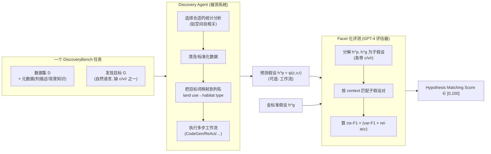

# 组会汇报 · DiscoveryBench：数据驱动科学发现的第一个综合 Benchmark

> 本篇是 **v2 规范**报告：在前 40 篇全部硬性要求之上，额外做两件事——**① Why 三连**（问题层/设计层/结果层）、**② `## ★ 对我们的启发（Inspires Us）`**。结构对齐 [`2408.06292-ai-scientist-v1.md`](2408.06292-ai-scientist-v1.md)，新增两维对齐 [`2506.13131-alphaevolve-deepmind.md`](2506.13131-alphaevolve-deepmind.md)。
> 主讲提示：这是 E 组（评测）里**第一个把"数据驱动发现"整条多步流程形式化并打分**的 benchmark。读它的关键不是"模型考了多少分"，而是**"假设正确"这件主观事怎么被拆成可复现的客观分数（HMS）**——这套打分协议是全场重点。

---

## 1. 封面 · TL;DR

- **标题 / 出处**：*DiscoveryBench: Towards Data-Driven Discovery with Large Language Models*，Bodhisattwa Prasad Majumder、Harshit Surana、Dhruv Agarwal 等，**Allen Institute for AI (Ai2)** / OpenLocus / UMass Amherst，arXiv 2407.01725（2024-07-01，preprint under review）。
- **权威性来源**：**Ai2 出品**（OpenScholar、astabench、SciCode 同源机构），数据集 + baseline 代码 + 评测 CLI **全部开源**（GitHub `allenai/discoverybench`、HuggingFace），并以 **ODC-BY** 许可发布；其前序工作 DataVoyager（Majumder 2024, ICML，原文 [33]）即本文一个 baseline 的来源。

**这篇在干什么（一段话）**：DiscoveryBench 把"**数据驱动发现 (data-driven discovery)**"——即"**仅凭给定数据集去搜索并验证一个假设**"——这件原本无法标准化评测的事，第一次**形式化**为一个三要素结构：在某个**上下文 (context $c$)** 下、一组**变量 (variables $v$)** 之间存在某种**关系 (relationship $r$)**，记作 $h:=\psi(c,v,r)$。基于这套形式化，作者从 **20+ 篇已发表论文**手工提取出 **264 个真实发现任务**（DB-Real，覆盖 6 个学科），并用 LLM 反向生成 **903 个合成任务**（DB-Synth，48 个领域、难度可控）。每个任务给模型一份**数据集 + 元数据 + 一句自然语言的发现目标**，要它产出假设；再用一个 **GPT-4 评估器**把"预测假设"和"金标准假设"沿 context/variable/relationship 三个维度分解打分，得到 **Hypothesis Matching Score (HMS) $\in[0,100]$**。在这套协议下，**最强的系统（GPT-4o + Reflexion，带 oracle 反馈）也只拿到 25% 量级**。

**3 条带走的结论**：
1. **难，且诚实地难**：在 DB-Real 上，最好的**非 oracle**系统（GPT-4p + ReAct/CodeGen）HMS 约 **15.4–16.3**；即便给 oracle 反馈，Reflexion 也仅 **24.5（GPT-4o）/ 19.5（GPT-4p）/ 22.5（Llama-3）**（原文 Fig.4 左表）。"25%"是**带 oracle 的上限**，无 oracle 时更低。这是"自主数据驱动发现远未解决"的硬证据。
2. **打分协议是核心贡献**：把"假设对不对"拆成 **context（F1）× [variable（F1）× relationship（accuracy）]** 的加权乘积（HMS，§4.3），用结构化分解避免"开放式答案无法判分"和"蒙对"。**context 判对是前提**——上下文不准，后面变量/关系再准也被乘没（Fig.4 右）。
3. **合成集是"可控难度的体检仪"**：DB-Synth 用语义树 (semantic tree) 反向生成，难度由树中"路径长度/树高"显式控制（难度标签 1–4）；且实测 **DB-Real 与 DB-Synth 上模型表现相似**（§5.2），说明合成集**忠实捕捉了真实任务的复杂度**，可作低成本、可扩展的代理评测。

> 主讲提示：开场把"25% 是带 oracle 的上限、裸跑更低"和"HMS = 上下文 × (变量 × 关系)"两句先抛出来——前者定调"难"，后者定调"怎么判分"。把 **264 真实 / 903 合成 / 6 学科 / 最强 25%** 当全场记忆锚点。

---

## 2. 问题与动机（why —— 本篇最该讲透的一节）

### Why 三连 · 问题层（为什么这事值得做）

**科学发现的内核是什么？** 原文 §1 开门见山：知识发现 (knowledge discovery) 几百年来一直是**人力密集**的过程。近年 LLM 在**代码生成、函数调用、数据分析**上的进展，让人怀疑：能不能把"**从数据里搜索并验证假设**"这一步自动化？原文把核心问题钉成一句（§1）：

> *How good are current state-of-the-art LLMs at automated data-driven discovery?*（当前最强 LLM 在自动数据驱动发现上到底有多强？）

**不解决会怎样 / 谁受影响**：科研里"提出假设 → 设计分析 → 在数据上验证"是核心循环。如果不能**可靠且可复现地评测**这一步，我们就无法知道一个"AI 科学家"系统到底是真会发现、还是在已知套路里打转——这正是本库 [`m9.1-autonomy-ladder`](../m9.1-autonomy-ladder-and-map/) 反复敲打的"自称 Scientist、实则只到 Analyst"的判别难题。**没有这把尺子，所有"AI 做科研"的宣称都无法证伪**。

### Why 三连 · 设计层（为什么要建 benchmark，而非沿用已有数据集）

朴素替代方案有三类，作者在 §2 逐一说明为何不够：

| 朴素替代 | 它能做什么 | 为何不够（原文 §2） |
|---|---|---|
| **统计分析数据集**（如时序预测 benchmark [42]、网络入侵 [50]） | 测"给定方法跑统计" | 只测**统计分析这一个环节**，不含**语义推理、流程设计、提假设** |
| **AutoML 工具/数据集**（AutoKeras[18]、AMLB[15]、AutoML-GPT[55]） | 自动搜最优 ML 模型 | 其数据集**为训练模型而设**，非**开放式发现任务**；目标是拟合，不是"发现关系" |
| **QRData [28]**（最接近的工作） | 测 LLM 的统计/因果推理 | 主要是**有唯一数值金标准的（教科书式）题**；DiscoveryBench 则**无预设统计边界、开放式问答、任务取自 SOTA 论文** |

**本设计凭什么更优**：DiscoveryBench 不是"再测统计能力"，而是测**整条数据驱动发现流水线**——它要求模型同时做**统计分析 + 科学语义推理**：判断哪种分析适合该领域（如植物入侵问题要做**空间自相关**，Fig.1 中心）、如何清洗/标准化数据、并把**自然语言目标里的词映射到数据列名**（如把"land use"映射到列 `habitat type`，Fig.1）。一句话（原文 §1）：

> **DiscoveryBench 是第一个面向"更广的数据驱动发现流水线"、而非只面向"统计分析组件"的大规模数据集。**

> 主讲提示：这一节的 why 落在两点——①已有数据集只测"统计"或"调模型"，**没人测"提+验假设"整条链**；②真实任务里**语义推理（选对方法、对齐词到列）和统计同等重要**。把 Fig.1 的"land use→habitat type"当例子讲，听众立刻懂"为什么这事难"。

---

## 3. 研究问题 / 核心 intention（形式化成一句话）

把要解决的问题压成一句（原文 §4）：

> **给定一个或多个任务数据集 $D$ 和一个自然语言发现目标 $G$，导出一个假设 $h=\psi(c,v,r)$——即对目标 $G$，找到由 $D$ 支持、且对上下文 $c$ 具有最高特异性的变量集 $v$ 与关系 $r$；可选地，再输出一条推导该假设的工作流。**

它隐含的**假设**：
- (a) "数据驱动假设"可以被**结构化分解**为 context / variable / relationship 三个维度，且这个分解**既足够灵活刻画真实任务、又足够受限可严格复现打分**（这是全文方法论的赌注，原文 §1/§3）。
- (b) 用 LLM（GPT-4）当**裁判**去做这个分解 + 对齐打分，是可信的——这把"开放式答案的判分"转成"结构化对齐"（§4.3，埋批判线）。

---

## 4. 相关工作定位（站在谁肩上、和谁不同）

| 方向 | 代表 | 与本篇的关系 |
|------|------|------------|
| 早期数据驱动发现系统 | BACON [23]、AlphaFold [19] | 思想先驱，但**数据/流程为预建管线定制**，非通用多任务测试 |
| AutoML | AutoKeras[18]、AMLB[15]、H2O[24]、AutoML-GPT[55] | 自动化"建最优 ML 模型"一环；数据集为训练而设 |
| 统计分析评测 | 时序预测[42]、异常检测[50]、自动统计建模[25] | 只覆盖"统计分析"组件 |
| **最接近**：定量/因果推理 | **QRData [28]** | 同测 LLM 数据能力，但**唯一数值金标准、教科书式**；本文**开放式、取自 SOTA 论文、无统计边界** |
| 假设的形式化 | Thompson & Skau [47]（科学假设的范畴） | **直接思想来源**：把假设拆成 context/variable/relationship 三维 |
| **本篇** | DiscoveryBench | **把上述各环合成"整条发现流程"的可复现 benchmark + facet 化打分** |

> 主讲提示：一句话概括——"别人测'跑统计'或'调模型'，它测'从数据里提出并验证一个科学假设'整条链，且第一次把假设拆成三维来打分"。和 QRData 的对比是最该讲清的边界。

---

## 5. 方法总览（big picture，先直觉后数学）

DiscoveryBench = **两个子集**（DB-Real 真实 + DB-Synth 合成）× **一套 facet 化评测（HMS）**。任务流程见原文 Fig.1：

**直觉**：左边像"导师给你一份数据 + 一个模糊的研究问题"；中间被测系统像"博士生：选方法、洗数据、把问题里的词对到数据列、写代码跑出结论"；右边像"严格的评审：不看你文采，只逐维度核对你说的上下文/变量/关系对不对"。**关键创新是把'右边的评审'做成结构化、可复现的自动打分**（HMS）。

> 主讲提示：让听众记住三块——**任务（数据+目标）/ 被测 agent / facet 评测**。强调中间的 agent 是**可替换的**（CodeGen、ReAct、DataVoyager、Reflexion），benchmark 本身是"任务 + 评测"。

---

## 6. 符号与术语表（后文统一用）

| 记号 / 术语 | 含义 |
|------------|------|
| $h\in\mathcal{H}$ | 一个**数据驱动假设**：可由数据集 $D$ 经验证过程 $\mathcal{V}_D$ 判定 supported/unsupported 的陈述句（§3） |
| $\mathcal{V}_D:\mathcal{H}\to\{\text{supported, unsupported}\}$ | 用数据 $D$ 验证假设的过程（如统计建模） |
| $c$ / $v$ / $r$ | 假设的三维：**上下文 (context)** 边界条件 / **变量 (variables)** / **关系 (relationship)**（§3，源自 [47]） |
| $\psi(c,v,r)$ | 把三维组装成陈述句"在上下文 $c$ 下，变量 $v$ 具有关系 $r$"；$h:=\psi(c,v,r)$ |
| $\phi(h_1,\dots,h_n)$ | 复合假设：用逻辑联结词（合取/析取）把子假设组合，$h:=\phi(h_1,\dots,h_n)$ |
| 语义树 $\mathcal{T}_h$ | **hypothesis semantic tree**：根=目标变量、叶=不再派生的自变量、内部节点=中间假设的目标变量（Markov 树，Fig.2） |
| 语义森林 $\mathcal{F}=\cup_i \mathcal{T}_{h^{(i)}}$ | 一个数据集 $D$ 上多棵语义树的并；$D$ 的每行是 $\mathcal{F}$ 的一次观测 |
| $D$ | 任务数据集，元组集合 $\{\mathbf{x}_i\}$；根/叶总被观测，**内部节点可隐 (latent)**——隐藏越多任务越难 |
| $G$ | 自然语言**发现目标**：对 $h=\psi(c,v,r)$ 掩盖某一维后生成的问句 |
| $h^p$ / $h^g$ | **predicted**（模型预测）/ **gold**（金标准）假设 |
| HMS | **Hypothesis Matching Score** $\in[0,100]$：本文核心评测指标（§4.3） |
| ctx$_{\text{F1}}$ / var$_{\text{F1}}$ / rel$_{\text{acc}}$ | HMS 的三个分量：上下文对齐 F1 / 变量对齐 F1 / 关系准确度 |
| 工作流长度 (workflow length) | DB-Real 任务难度代理：解题所需"原子分析动作"的数量（Fig.5c：s<10, m 10–20, l>20） |

> 主讲提示：这张表里**最该讲透的是"语义树/森林"**——它既是 DB-Synth 反向生成任务的脚手架，也是"难度可控"的来源（隐藏内部节点越多越难）。

---

## 7. 方法细节 ① 形式化：把"假设"拆成可打分的三维（§3）

**Why 三连 · 设计层**：朴素做法是把"发现"当成"开放式问答"，让模型自由写一段结论，再人工判对错。这会**两头失败**：人工判分**不可复现、不可扩展**；而"自由文本对不对"又**无法区分"蒙对"和"真懂"**。本文改用 [47] 的**结构化形式化**——任何科学假设都可表达为"在上下文 $c$ 下，变量 $v$ 间有关系 $r$"——因为这个三元组**既能覆盖大量真实问题，又把"对不对"切成三个可独立核验的小判断**。

**三维定义（原文 §3，先定义后用）**：
- **上下文 (context, $c$)**：限定假设作用范围的边界条件。如"for men over the age of 30""in Asia and Europe"，或"未指明=全数据集"。
- **变量 (variables, $v$)**：在给定上下文下有意义交互、共同产生该假设的概念集合（含 1 个目标变量 + 若干自变量）。如 `gender, age, income`。
- **关系 (relationship, $r$)**：上述变量在该上下文下的交互形态。如"quadratic relationship""inversely proportional""piecewise"。

于是假设可等价写成（原文 §3）：

$$ h := \psi(c, v, r),\qquad \psi(\cdot,\cdot,\cdot)\ \text{返回陈述句"under context } c\text{, variables } v \text{ have relationship } r\text{."} $$

**读出什么**：这一步把"判一段开放式结论对不对"**降维**成"分别判 context 对不对、variables 对不对、relationship 对不对"。这正是后面 HMS 能做到"结构化、可复现"的根。

**复合假设与语义树**：真实假设常是多个子假设的合取/析取，$h:=\phi(h_1,\dots,h_n)$。作者进一步引入 **hypothesis semantic tree $\mathcal{T}_h$**（Fig.2）：每个自变量本身可能是上一层假设的目标变量，于是假设天然是**层级**的——根是主假设的目标变量、叶是不再派生的自变量、内部节点是中间假设的目标变量。**关键**：内部节点（中间假设的目标变量）**可以是隐变量 (latent)**，因此同一森林 $\mathcal{F}$ 可收集**不同可观测程度**的多版本 $D$，**直接调节任务难度**（§3 末、§4.1 "Inferring task difficulty"）。

> 主讲提示：这一节是"为什么 HMS 能打分"的地基。把"$h=\psi(c,v,r)$ 把开放式判分降维成三个小判断"讲清，后面 HMS 就顺理成章。Fig.2 的星系例子（galaxy_visibility 根、distance/galaxy_color 子节点）可一笔带过，重点是"内部节点可隐 → 难度可调"。

---

## 8. 方法细节 ② DB-Real：从已发表论文里"捞"真实发现任务（§4.1）

**Why 三连 · 设计层**：要测"真实世界的发现"，最朴素的做法是请专家现编题——但这**既贵又难保证"真实科研味"**。本文改用**复刻已发表论文**：从同行评审过的真论文里，把"数据集 + 金标准假设 + 实现工作流"三件套抽出来当任务。这样**任务的科学价值由原论文背书**，且天然带"真实数据的脏与坑"。

**两条采集路线**（原文 §4.1）：
- **data-first（数据优先）**：先锁定公开数据集（NLS 美国国家纵向调查、GBIF 全球生物多样性、WBOD 世界银行公开数据），再找用它们、且**给了工作流细节**的论文去复刻。**代价惊人**：复刻一个数据集**最多 90 人时**，且约 **30% 复刻失败**（§4.1）——作者借此点明"建真实发现 benchmark 本身就不容易"。
- **code-first（代码优先）**：为增加领域/数据多样性，从 **Zenodo**（欧盟开放研究库）筛带计算 notebook 的 **785 个数据点**，尝试用 Python 复刻。**超过 85% 的仓库**因代码缺失/难迁移到 Python/数据非开放而被淘汰；最终 14 个候选里**只有 3 个**通过全部检查（§4.1）。

**两个增量价值点**：
1. 复刻过程中**自然冒出原论文未报告、但数据支持的新假设**，也被收进 benchmark——"既有已报告的 science-worthy 假设，也有**从未被报告过的真实发现**"（§4.1），后者尤其适合测"LLM 能否做出新发现"。
2. 任务数据集额外配**数据集描述、列的自然语言描述、领域背景知识**——有些任务（如考古）**必须靠领域知识**才能导出特定假设。

**难度推断（Inferring task difficulty，§4.1）**：用语义树定义难度 ∝ **从已观测节点到目标假设节点的路径长度**。由于真实树结构不可先验完全知道，作者用**实现工作流的步数**近似路径长度——**工作流每多 1 步，发现路径 +1**；同一假设可派生 easy（把派生变量当已观测，如直接给 BMI）/ hard（要从身高体重派生出 BMI）两版。此外**森林中树越多（|$\mathcal{F}$| 越大）任务越难**——假设搜索空间更大，常出现在"需多数据集"的任务。

**DB-Real 统计（原文 Table 1）**：

| | Train | Test |
|---|---|---|
| # 任务 | 25 | 239 |
| # 唯一假设 | 14 | 144 |
| # 需 >1 数据集的任务 | 4 | 110 |
| # 学科 | 3 | 6 |

合计 **264 个真实任务**，覆盖 **6 个学科**（社会学、生物学、人文、经济、工程、元科学，§4.1）。**最关键**：**114 个（4+110）任务需要分析多个数据集**（一个任务最多 6 个数据集，§4.1.1）——这把"假设搜索空间"显著放大。工作流类别分布见 Fig.3（数据准备 569、基础统计 158、特征工程 112、高级统计 104、其它 41、领域特定 26，按"unit action"计数）。

> 主讲提示：把"data-first 复刻一个数据集要 90 人时、30% 失败""code-first 785→3 通过率"这两组数讲出来——它们是"为什么没人做过这种 benchmark"的最有力注脚。难度=工作流步数，是个**朴素但可操作**的代理，组会上容易被问"为什么不用真实树深度"，答案是"真实树结构无法先验知道"。

---

## 9. 方法细节 ③ DB-Synth：用语义树反向生成"可控难度"的合成任务（§4.2）

**Why 三连 · 设计层**：DB-Real 真实但**贵、量小、难度不可控**（绑死在那几个公开数据集上）。朴素替代是"手工编合成题"，但难保证**难度连续可调**且**像真任务**。本文改用 LLM **反向工程**整个发现过程：先长出语义树，再自底向上生成数据，最后掩盖某一维形成目标——这样**难度由树结构精确控制**，且因为生成逻辑与真实发现同构，合成集**能逼近真任务的复杂度**。

**四阶段流水线（原文 §4.2）**：
1. **领域采样 (Domain sampling)**：prompt 模型生成多样领域 + 自然语言描述（如"Ancient architecture → 与历史建筑、建筑奇迹、古代建造技术相关"）。
2. **语义树构造 (Semantic tree construction)**：给定领域 + 采样的真实工作流（如"within-cluster analysis"），从主假设 $h$ 起递归派生节点；每个子节点配**数据类型/范围 + 一个 pandas 表达式**（编码结构化假设 $\psi(c,v,r)$），并以概率 0.6 决定某节点是否继续派生或成叶。同时生成一组**干扰列 (distractor columns)** 与树中节点不相交，形成森林 $\mathcal{F}$。
3. **数据生成 (Data generation)**：自底向上（叶→根）为 $\mathcal{F}$ 每个节点造列——叶节点按数据类型选采样策略，上层节点直接**执行其 pandas 表达式**算出列；最后**按概率扰动**（加噪声/丢值制造缺失），但"每个值独立加噪，故每行仍有足够真实数据可供发现"（§4.2 脚注 6）。执行报错时用 **self-refine [30]** 按错误日志改 pandas 表达式。
4. **任务生成 (Task generation)**：对森林中每个内部节点 $h$，按路径长度 $l$ 生成多版任务 $D_h^{(l)}$（改变难度）；并按 DB-Real 同样策略掩盖一维形成目标。

**DB-Synth 规模（原文 §4.2）**：共 **903 个任务、48 个领域**，按 **60/20/20** 分 train/dev/test（551/153/200），每任务额外标 **难度 1–4**。**评测只在 test 上**，train 可作监督数据。

> 主讲提示：核心卖点是"**难度可控 + 像真任务**"。强调 §5.2 的实测结论——**DB-Real 与 DB-Synth 上模型表现相似**，所以 DB-Synth 是一台**便宜、可扩展、可控难度的"体检仪"**。pandas 表达式自底向上执行造数据这招，组会上值得点一句"它保证了数据里真有可被发现的关系"。

---

## 10. 方法细节 ④ ★评测协议 HMS：把"假设对不对"变成可复现的分数（§4.3，全场重点）

> 主讲提示：这是整篇报告的"高潮幻灯片"。benchmark 的灵魂是**打分**——HMS 决定了"什么算发现对了"。把直觉、每个符号、公式、读出什么，逐层讲透。

### Why 三连（打分协议）

- **问题层**：发现任务是**开放式**的（同一关系可有多种等价表述），无法用"字符串精确匹配"判分；又因为可能"蒙对"，不能只看最终结论像不像。
- **设计层（朴素替代为何不行）**：
  - 朴素替代 A：**让 LLM 直接给"整体相似度 0–100"**。→ 会把"上下文错了但变量蒙对"也给高分，**无法定位错在哪、易被表面措辞糊弄**。
  - 朴素替代 B：**精确匹配变量名/关系词**。→ 真实假设措辞千变万化（"land use" vs "habitat type"、"inversely proportional" vs "decreases with"），精确匹配会大面积误杀。
  - **本文方案 Z**：用 GPT-4 评估器把假设**分解成带 (c,v,r) 的子假设**，**先按 context 匹配子假设对**，再在匹配对内分别算变量 F1 与关系准确度，**最后用 context 对齐度加权**。这样既容忍措辞差异（语义判等），又**强制上下文必须先对**（context 错则整体被乘小），还能**定位错在哪一维**。

### 一步步搭出 HMS（原文 §4.3）

**第 0 步 · 分解**：评估器（`gpt-4-preview-0125`）把金标准 $h^g$ 和预测 $h^p$ 各**独立分解**为子假设集 $\{h_i^g\}_{i=1}^n$、$\{h_j^p\}_{j=1}^m$，并为每个子假设标出它的 context / variables / relationship 三维（prompt 见原文 Listing 1）。

**第 1 步 · 按上下文匹配子假设**（先定义符号）：
- 当评估器判定预测子假设 $h_j^p$ 与金标准子假设 $h_i^g$ 的**上下文等价**时，记为一对匹配（prompt Listing 2）；
- $M$：所有"上下文匹配"的（预测, 金标准）子假设对的集合；**注意约束**：每个金标准子假设**至多匹配一个**预测子假设（原文脚注 8）。
- **ctx$_{\text{F1}}(h^p, h^g)$**：把每个子假设的上下文**当作一个单元**，计算"预测的 $m$ 个上下文"对齐"金标准的 $n$ 个上下文"的 **F1 分数**——直觉：既惩罚漏掉的上下文（召回），也惩罚多编的上下文（精确）。

**第 2 步 · 在匹配对内，分别评变量与关系**：
- **var$_{\text{F1}}(h_i^p, h_i^g)$**：对每个匹配对，用评估器抽出"金标准/预测里相互作用的变量集合"（prompt Listing 3），算两集合的 **F1 分数**——衡量变量识别得全不全、准不准。
- **rel$_{\text{acc}}(h_i^p, h_i^g)$**：关系准确度，按**评估器判定**用如下打分启发式（prompt Listing 4）：

$$ \text{rel}_{\text{acc}} = \begin{cases} 100, & \text{预测关系与金标准关系\textbf{精确匹配}}\\[2pt] 50, & \text{预测关系\textbf{更宽但涵盖}金标准关系}\\[2pt] 0, & \text{否则} \end{cases} $$

> 直觉：关系不是非黑即白——"随年龄变化"比"随年龄线性增加"更宽但不算错，给半分；完全说反或无关给 0。这把"关系对不对"做成**三档**而非二元，更贴合科学表述的粒度。

**第 3 步 · 合成 HMS**（先把符号收齐）：
- $h^p, h^g$：预测 / 金标准假设（可含多个子假设）；
- $M$：上下文匹配的子假设对集合，$|M|$ 为其大小；
- ctx$_{\text{F1}}(h^p,h^g)\in[0,1]$：整体上下文对齐度（外层权重）；
- var$_{\text{F1}}(h_i^p,h_i^g)\in[0,1]$、rel$_{\text{acc}}(h_i^p,h_i^g)\in\{0,50,100\}$：第 $i$ 个匹配对的变量/关系得分。

**HMS 定义式（原文 §4.3，唯一核心公式）**：

$$ \mathrm{HMS}(h^p, h^g) \;=\; \mathrm{ctx}_{\text{F1}}(h^p, h^g)\;\times\;\frac{1}{|M|}\sum_{i=1}^{|M|}\Big(\mathrm{var}_{\text{F1}}(h_i^p, h_i^g)\,\times\,\mathrm{rel}_{\text{acc}}(h_i^p, h_i^g)\Big),\qquad \mathrm{HMS}\in[0,100]. $$

**读出什么**（这段务必讲）：
1. **结构是"外层乘内层平均"**：内层先对每个上下文匹配对算 $\text{var}_{\text{F1}}\times\text{rel}_{\text{acc}}$（"在对的上下文里，变量和关系都对才得分"），再对 $|M|$ 个匹配对取平均；外层乘上 **ctx$_{\text{F1}}$** 当总闸门。
2. **上下文是"一票否决式"前提**：若上下文全错，$\text{ctx}_{\text{F1}}=0$，则**整个 HMS=0**——哪怕变量/关系蒙对也归零。这正是 §5.3"Context is important"的来源（Fig.4 右：ctx$_{\text{F1}}$ 与 var×rel 正相关，上下文对是准确预测变量/关系的**前提但不充分**）。
3. **乘法连乘 = 防"蒙对"**：要拿高分，必须 context、variable、relationship **同时对**——任何一维塌方，乘积都被拉低。这就是 benchmark 防"表面措辞糊弄、防蒙对"的核心机制。
4. **outcome-based（基于结果而非路径）**：作者特意说明（§4.3 脚注 7）只比对**最终假设**、不强求工作流一致——因为"路径 >1 可能导向同一假设"。即**条条大路通罗马，只看你到没到罗马**。

> 主讲提示：把这条式子拆成"**上下文（闸门）× 在对的上下文里（变量 × 关系）的平均**"来念。强调两点：①上下文错=全盘归零（解释了 Fig.4 右的正相关）；②三维连乘=不能靠蒙一维拿分。这是组会最该被追问、也最能体现"读懂没读懂"的地方。

---

## 11. 实验设置（setting / params / 算力 / 成本，写全）

- **被测底座模型（3 个）**（原文 §5.1）：两个闭源 **GPT-4o**、**GPT-4-0125-preview（GPT-4p）**，一个开源 **Llama-3-70B**。这些模型驱动下面的推理框架。
- **Discovery Agents（5 种推理框架，被测系统）**（§5.1）：
  - **CodeGen**：一次性生成完整解题代码 → 执行 → 据结果产出 NL 假设并总结工作流。
  - **ReAct [51]**：多轮"思考 + 写代码"交替解题。
  - **DataVoyager [33]**：多组件（planner / code generator / data analysis / critic）编排发现过程（本文前序工作）。
  - **Reflexion (Oracle) [44]**：CodeGen 的扩展——**每轮结束给它真实的 oracle HMS 当反馈信号**，HMS<1 时生成反思改进，直到解出或达**最多 3 次**试验。**注意：这是"作弊上限"**，因为它用到了金标准分数。
  - **NoDataGuess**：**只看数据集描述 + 目标、不访问数据**直接猜假设——用来测 **LLM 对已发表工作的"记忆/泄漏"**（关键的防泄漏对照）。
- **评估器**：`gpt-4-preview-0125` 作裁判（§4.3），prompt 见 Listing 1–4。
- **评测指标定义式**：**HMS $\in[0,100]$**（见 §10 公式）；分量 ctx$_{\text{F1}}$、var$_{\text{F1}}$、rel$_{\text{acc}}$ 亦单独报告（Fig.4 右、Fig.5）。
- **难度代理**：DB-Real 用**工作流长度**（gold workflow 的 unit action 数：s<10 / m 10–20 / l>20，Fig.5c）；DB-Synth 用**语义树高**（难度标签 1–4）。
- **算力 / 成本 / 随机种子**：**原文未给出**被测系统的 GPU/调用成本与随机种子设置（仅给了数据采集的人时成本：data-first 每个 NLS 论文 15–40 人时、GBIF 数据集达 90 人时，附录 C）。

> 主讲提示：务必点明两件防作弊设计——①**Reflexion 用 oracle HMS**，所以它的 25% 是"开了挂的上限"；②**NoDataGuess 不看数据**，专门量化"模型是不是靠背诵已发表论文蒙答案"。这两个 baseline 是 benchmark 严谨性的关键。

---

## 12. 主要结果（数字 + 解读，别只贴表）

**核心结果表（原文 Fig.4 左，HMS）**：

| 系统 | DB-Real · GPT-4o | DB-Real · GPT-4p | DB-Real · Llama-3 |
|---|---|---|---|
| **NoDataGuess**（不看数据） | **0.0** | 4.7 | 11.5 |
| CodeGen | 15.5 | 16.3 | 12.1 |
| ReAct | 15.4 | 15.6 | 13.5 |
| DataVoyager | 15.4 | 13.9 | 11.5 |
| **Reflexion (Oracle)** | **24.5** | 19.5 | 22.5 |

| 系统 | DB-Synth · GPT-4o | DB-Synth · GPT-4p | DB-Synth · Llama-3 |
|---|---|---|---|
| CodeGen | 14.1 | 8.7 | 10.9 |
| ReAct | 11.6 | 7.4 | 12.0 |
| DataVoyager | 5.7 | 6.9 | 11.7 |
| **Reflexion (Oracle)** | **15.7** | 12.9 | 23.2 |

**读出什么（结果层 why）**：
1. **整体极低**：所有框架×模型对在两个子集上 HMS 都很低（§5.2），坐实"任务难、benchmark 难"。最强非 oracle 约 15–16；**"25%"对应 Reflexion(Oracle) 在 DB-Real 上的 24.5（GPT-4o）量级**——是**开了 oracle 反馈的上限**，裸跑更低。
2. **更花哨的推理≠更强**：ReAct（强推理 prompt）、DataVoyager（带 planner+critic）**并不优于**最朴素的 CodeGen（§5.2）。**机制解释**：作者分析发现，**所有非 reflexion 系统都只解出了 benchmark 里最容易的实例**（工作流类别/长度最短的）——难的它们根本够不着，所以加推理花样在"够不着的题"上没用。
3. **唯有 oracle 反馈显著有效**：Reflexion(Oracle) 明显抬高 CodeGen 基线（§5.2）——但这**依赖金标准 HMS 当信号**，现实中拿不到，故是"理论上限"而非"可部署收益"。
4. **NoDataGuess 的诊断意义**：GPT-4o 在 NoDataGuess 上 **0.0**——作者说它**拒绝在不看数据时硬编（拒绝幻觉）**；而 Llama-3 在看/不看数据两种模式下表现接近（11.5 vs 12.x），**反而暴露它可能更依赖记忆而非真分析**（§5.2）。这正是"防数据泄漏/防蒙对"对照的价值。
5. **合成≈真实**：DB-Real 与 DB-Synth 上表现相似（§5.2）——证明合成集**捕捉到了真实复杂度**，可作系统化分析的代理。

> 主讲提示：把"花哨推理打不过朴素 CodeGen"和"只有 oracle 才有效"两条讲清——它们共同说明**当前瓶颈不在'推理框架'，而在'够不着难任务'本身**。NoDataGuess 那个 GPT-4o=0.0 很反直觉，要解释成"它老实、不看数据就不瞎猜"。

---

## 13. 消融与分析（哪个因素决定难易，§5.3）

原文 §5.3 + Fig.4 右 + Fig.5 给出五条分析：

| 分析维度 | 现象（原文出处） | 解读 |
|---|---|---|
| **上下文是前提** | ctx$_{\text{F1}}$ 与 var$_{\text{F1}}\times$rel$_{\text{acc}}$ **正相关**（Fig.4 右；仅用两分都非零的 44.2% 点） | 上下文先识别对，才谈得上准确预测变量/关系；**但不保证成功**（必要非充分） |
| **工作流复杂度壁垒** | 最佳非 oracle 模型只在 correlation analysis(55%)、data selection(18%)、summary statistics(18%) 上较好；**spatial analysis / pollen dating / ecological modeling 均 0%**（§5.3） | agent 在**复杂统计/复杂数据准备/领域特定**任务上集体崩盘 |
| **领域知识依赖** | 考古任务加领域知识后，DataVoyager(GPT-4p) 从 **9.9% → 17.5%**（§5.3） | 领域背景知识能实质提分——发现不只是统计，更是领域语义 |
| **学科差异** | biology **0%**、engineering **7%** 最差（依赖高级统计）；economics 25%、sociology 23% 较好（Fig.5a） | 越依赖高级统计的学科越难 |
| **目标类型 & 工作流长度** | 给定 c+v 找 **关系 r** 比找 context/variables 更易（Fig.5b，因假设搜索空间更小）；**工作流越长 HMS 越低**，中等长度就显著掉分（Fig.5c） | 难度本质来自**假设搜索空间大小**；连中等复杂度都扛不住，暴露当前 agent 上限 |

> 主讲提示：这一节把"为什么难"机制化。一句话收口——**难度 ∝ 假设搜索空间**（多数据集、长工作流、找 context/variables 而非 relationship、依赖高级统计/领域知识时空间最大），而当前 agent **连中等空间都搜不动**。

---

## 14. 局限与批判（诚实区分宣称 vs 边界）

**原文自承的局限（附录 B）**：
1. **刻意回避了一大类问题**：当前**过滤掉了**需要预测/仿真/特定建模的任务（物种分布、传染扩散、系外行星天体物理方程），因为复刻太耗时——导致 benchmark **偏社科、轻自然/物理科学**（作者列为未来工作）。
2. **不处理超大数据**：如 Cancer Genome Atlas 的 8.92 PB、Allen Institute 脑数据——**p-hacking（在海量数据里碰运气找显著）的稳健性问题未解决**。
3. **不处理多模态 / 复杂管线**：卫星/地理空间数据、需多阶段处理与多工具编排的任务（如 EarthRanger 式工作流）暂不覆盖。
4. **伦理**：基于本 benchmark 调优的系统可能被用于**政策误用、法律风险、虚假发现**；作者主张审慎。

**社区视角可追加的批判（本报告判断，标注为非原文）**：
- **裁判即 GPT-4，存在"同源裁判"风险**：评测器用 `gpt-4-preview-0125`、被测系统也含 GPT-4 系，HMS 的分解/对齐判等**完全依赖 LLM 裁判**——其一致性、对措辞的鲁棒性、是否偏好与自己风格相近的表述，**原文未给裁判可靠性的人评对照**（对比 [`2408.06292` AI-Scientist](2408.06292-ai-scientist-v1.md) 给了评审器 vs 人类的 BalAcc/F1，本文这块较弱）。
- **rel$_{\text{acc}}$ 的三档（0/50/100）较粗**："更宽但涵盖"给 50 分是合理启发式，但**谁来判"涵盖"仍是 LLM**，边界模糊处可能不稳。
- **"25%"的口径需小心**：它是 **Reflexion(Oracle) 的上限**；真实可部署系统（无 oracle）只有 ~15%——**报告/转述时易把上限当成现状**。

> 主讲提示：把"裁判即 GPT-4、且原文未给裁判 vs 人评的可靠性对照"作为最该追问的方法学漏洞——这是 benchmark 类论文的命门。同时澄清"25% 是开挂上限"。

---

## ★ 对我们的启发（Inspires Us）

> 这一节回答：DiscoveryBench 对我（们）接下来的研究，**到底能用上什么**。

- ➤ **可直接借用的招（reuse）**：
  1. **facet 化打分（context × variable × relationship 连乘）**——把"开放式产出对不对"**拆成可独立核验的维度再相乘**。可**原样搬进** [`m9.6-evaluating-research-agents`](../m9.6-evaluating-research-agents/)：凡是我们评"agent 给的结论/假设对不对"的地方，都改成"**先判前提（上下文）是否对、对了再判细节、任何一维塌方则整体归零**"，天然防蒙对、还能定位错在哪一维。
  2. **NoDataGuess 式"抽掉证据"的防泄漏对照**——加一个"**不给数据/不给关键输入、只凭描述硬猜**"的 baseline，量化模型靠**记忆/泄漏**而非真分析能拿多少分。这是**任何 benchmark 都该标配的诊断探针**，成本极低。
  3. **语义树反向生成 + 难度=路径长度**——要造"可控难度"的合成评测，就**先长一棵假设树、自底向上用可执行表达式造数据、再掩盖一维出题**，难度由"隐藏多少内部节点 / 路径多长"显式控制。

- ➤ **可迁移到我们课题（transfer）**：我们的 [`m9.6`](../m9.6-evaluating-research-agents/) 评估沙箱目前偏"任务能不能跑通/指标对不对"。DiscoveryBench 的 HMS 提供了一把**"假设质量"的细粒度尺**——可把它对齐进 m9.6，做成"**不仅判 pass/fail，还判'发现假设'在 c/v/r 三维各对多少**"。**迁移时要改的前提**：①我们的任务得能写出**金标准 (c,v,r)**（DiscoveryBench 靠复刻论文获得，我们若无金标准则退化为"LLM 裁判自评"，可信度下降）；②要补 DiscoveryBench**缺失的那一环——裁判 vs 人评的可靠性对照**，否则继承它"同源裁判"的隐患。

- ➤ **它暴露的开放问题 = 我们的机会（opportunity）**：
  1. **裁判可靠性未验证**（§14）。→ **机会**：给 HMS 的 LLM 裁判补一个**"裁判 vs 人类标注"的一致性实验**（像 AI-Scientist 那样报 BalAcc/F1）。**可下手的第一步**：抽 DB-Real 的 30 个任务，人工标注 (c,v,r) 匹配，对比 GPT-4 裁判判定，算 Cohen's κ。
  2. **只看最终假设、不评工作流质量**（§4.3 outcome-based）。→ **机会**：补一个"**工作流正确性**"维度——agent 是不是用了**对的统计方法**（如该用空间自相关却用了普通相关），即使结论蒙对也该扣分。这正好填 DiscoveryBench 与 [`2410.05080` ScienceAgentBench](2410.05080-scienceagentbench.md)（评代码/产物）之间的缝。

- ➤ **与本库其它论文/模块的连接（connect the dots）**：
  - **同组呼应**：与 [`2504.11524` HypoBench](2504.11524-hypobench-hypothesis-benchmark.md) 直接互补——HypoBench 评"假设生成的质量/效用"，DiscoveryBench 评"从数据搜+验假设的端到端正确性"，两者拼出"假设全生命周期"的评测版图。
  - **难度对照**：与 [`2504.01848` PaperBench](2504.01848-paperbench-openai.md)（复现整篇论文，最高分 ~21%）、[`2410.07095` MLE-bench](2410.07095-mle-bench-openai.md)（Kaggle 竞赛，奖牌率低）形成"**前沿 agent 在真实科研任务上普遍低分**"的合唱——DiscoveryBench 的 25%（且是 oracle 上限）是这条证据链上**专攻"假设发现"**的一环。
  - **机构呼应**：与同为 Ai2 的 [`2510.21652` astabench](2510.21652-astabench-ai2.md) 同源，可视为 Ai2 评测科研 agent 体系里的"假设发现"专项。
  - **判别力呼应**：直接服务 [`m9.1` autonomy ladder](../m9.1-autonomy-ladder-and-map/) 的"Analyst vs Scientist"判别——一个系统若连 DiscoveryBench 都做不好，就**没资格自称会'发现'**。

- ➤ **如果我来做下一步（my next move）**：我会在 [`m9.6`](../m9.6-evaluating-research-agents/) 里加一个 **"facet-HMS 评分器 + NoDataGuess 探针"** 的最小开关，跑一组对照——①把我们现有"假设类"任务的判分从"整体相似度"换成"ctx×(var×rel) 连乘"，看是否能**把'蒙对'的样本识别出来**（预期：原来给高分、现在因上下文错而归零的样本数 >0）；②加 NoDataGuess baseline，量化我们任务里"靠背诵就能拿的分"占比。**一周内能出最小结论**。

> 主讲提示：这一节是全场高潮——前面讲"Ai2 造了什么尺子"，这里讲"**我们下周就能把这把尺子装进 m9.6**"。落点是 facet-HMS 和 NoDataGuess 两个可直接接力的动作。

---

## 15. 在 auto-research 版图的位置（相对已有工作的增量）

- **它把谁向前推了一步**：在 E 组（评测）里，DiscoveryBench 是**第一个把"数据驱动发现"整条流程（提假设 + 在数据上验证）形式化并打分**的 benchmark。相对：
  - **QRData [28]**（唯一数值答案、教科书式）→ DiscoveryBench **开放式、取自 SOTA 论文、facet 化打分**，是其"开放化 + 流程化"的升级。
  - 相对 [`2410.05080` ScienceAgentBench](2410.05080-scienceagentbench.md)（评数据科学**代码/产物**）、[`2503.00096` BixBench](2503.00096-bixbench-computational-biology.md)（计算生物开放分析）→ DiscoveryBench 独特之处是**评"假设"本身的三维正确性**，而非代码或最终数值。
  - 相对 [`2504.11524` HypoBench](2504.11524-hypobench-hypothesis-benchmark.md)（评假设**生成**）→ DiscoveryBench 评假设**搜索+验证的端到端**，二者互补。
- **阶梯定位**：按本库 Tool→Analyst→**Scientist** 阶梯，DiscoveryBench 是一把**专门卡在"Analyst→Scientist"门槛上的尺子**——它要的正是"自己从数据里提出并验证一个新假设"这一 Scientist 级能力；而最强系统仅 25%（且 oracle 上限）说明**当前 agent 大多卡在 Analyst**。这与 [`m9.1`](../m9.1-autonomy-ladder-and-map/) 的核心论断（自称 Scientist、独立验证最高只到 Analyst）严丝合缝。
- **时间/能力增量**：2024-07 的它，为后来的科研 agent 评测（PaperBench、astabench、HypoBench）**提供了"假设发现"这一缺失维度**，并贡献了一套被后续引用的 **facet 化打分思路**。

---

## 16. 复现与可用性

- **开源程度**：**数据集 + baseline 代码 + 评测 CLI 全开源**（附录 A FAQ）——
  - 数据集：`github.com/allenai/discoverybench/tree/main/discoverybench`（亦在 HuggingFace `allenai/discoverybench`，CSV/JSON，结构见附录 F）。
  - baseline agents：`.../tree/main/agents`（含 `discovery_agent.py`，`--agent_type [coder|react]`，附录 G）。
  - 评测：`.../tree/main/eval`（单实例评测脚本 + 示例 CLI）。
  - 许可：数据 **ODC-BY**、代码 **Apache 2.0**。
- **能不能在单卡跑**：被测**框架本身**（CodeGen/ReAct）是 LLM 调用 + Python 执行，**不吃 GPU**；真正开销在**LLM API 调用**（被测模型 + GPT-4 裁判）。**注意裁判用 `gpt-4-preview-0125`，跑全量评测有 API 成本**（原文未给具体金额）。
- **坑**：
  - **裁判依赖闭源 GPT-4**——换裁判模型可能改变 HMS 绝对值，跨论文比分时要小心口径。
  - **DB-Real 的 nls_raw 等"原始版"任务显著更难**（需大量数据准备，附录 F.2）——同一前缀的 metadata 文件夹用同一底层数据的不同预处理版本，**别混用**。
  - **"25%"是 Reflexion(Oracle) 上限**，复现裸跑系统应预期 ~15%。

---

## 17. 组会讨论问题

1. HMS 把 **context 当一票否决的外层闸门**（context 错则整体=0）。这个设计合理吗？会不会过度惩罚"上下文措辞不同但实质对"的答案？怎么设计实验验证裁判在 context 判等上的鲁棒性？
2. 评测器与被测系统**同为 GPT-4 系**。如何排除"裁判偏爱与自己风格相近的表述"这一混淆？最小对照怎么做？（联想 [`2408.06292`](2408.06292-ai-scientist-v1.md) 给了评审器 vs 人评）
3. "花哨推理（ReAct/DataVoyager）打不过朴素 CodeGen，只有 oracle 反馈有效"——这说明瓶颈在**推理框架**还是在**模型够不着难任务**？怎么设计实验区分这两者？
4. NoDataGuess 上 **GPT-4o=0.0 而 Llama-3≈11.5**：这到底反映"GPT-4o 更诚实"还是"Llama-3 更靠记忆"？如何进一步证伪数据泄漏？
5. DiscoveryBench 只评**最终假设**、不评**工作流是否用对方法**（outcome-based）。一个"用错统计方法却蒙对结论"的 agent 该不该得高分？要不要加"方法正确性"维度？
6. 作者**刻意过滤掉**自然/物理科学的预测/仿真任务（附录 B）。这让 benchmark 偏社科——它还能代表"通用科学发现能力"吗？补哪类任务最该优先？
7. 难度被定义为 **∝ 假设搜索空间**（多数据集/长工作流）。这个代理够好吗？有没有"工作流短但语义极难"的反例会被低估？
8. 若把 HMS 的 **facet 连乘** 搬到我们 m9.6 的假设评测里，最大的落地障碍是什么（金标准从哪来、裁判怎么校准）？

---

## 18. 一页速记（汇报当天速览）

- **是什么**：第一个把"**从数据搜索并验证假设**"整条流程形式化并打分的 benchmark（Ai2，2024-07）。**264 真实任务/6 学科 + 903 合成任务/48 领域**，最强系统 **25%（且是 oracle 上限）**。
- **形式化**：假设 $h:=\psi(c,v,r)$——上下文 / 变量 / 关系三维（源自 [47]）；语义树让**难度由隐藏内部节点/路径长度可控**。
- **两子集**：**DB-Real** 复刻 20+ 篇论文（data-first 一个数据集要 90 人时、30% 失败；code-first 785→3）；**DB-Synth** 用语义树反向生成、60/20/20 分、难度 1–4；实测**两者表现相似**。
- **核心指标 HMS** $\in[0,100]$：
  $$ \mathrm{HMS}=\mathrm{ctx}_{\text{F1}}\times\tfrac{1}{|M|}\textstyle\sum_i\big(\mathrm{var}_{\text{F1}}\times\mathrm{rel}_{\text{acc}}\big),\quad \mathrm{rel}_{\text{acc}}\in\{0,50,100\}. $$
  上下文=外层闸门（错则归零）；三维连乘=防蒙对；outcome-based（只看终点）。
- **关键数**：非 oracle 最佳 ~15–16；Reflexion(Oracle) 24.5/19.5/22.5（DB-Real）；NoDataGuess GPT-4o=0.0（拒绝幻觉）/ Llama-3≈11.5（疑似靠记忆）；biology 0%、engineering 7% 最差，economics 25%、sociology 23% 较好。
- **三句话结论**：难且诚实地难（25% 是开挂上限）/ HMS facet 打分是核心贡献（防蒙对、可定位）/ 合成集是可控难度的体检仪。
- **在课里的位置**：E 组评"假设发现"的专项；卡在 Analyst→Scientist 门槛上的尺子；与 PaperBench/MLE-bench/HypoBench 合唱"前沿 agent 真实科研任务普遍低分"。

> 主讲提示：结尾回到一句话——**"它给'AI 会不会从数据里做发现'造了第一把可复现的尺子，量出的答案是：还差得远（25%，且开了挂）。"** 而 HMS 那套 facet 连乘打分，是这把尺子最值得我们搬走的零件。

---

## 附：自检清单（v1 + v2）

- [x] 中文撰写 + 术语中英对照（context/variables/relationship、语义树、HMS、facet 等）。
- [x] 每个公式前给直觉 + 先定义全部符号、后读出结论（$\psi(c,v,r)$、rel$_{\text{acc}}$ 三档、HMS 主式）。
- [x] why > how + **Why 三连**（问题层/设计层/结果层），核心组件（形式化、DB-Real、DB-Synth、HMS）均补"设计层 why = 朴素替代为何不行"。
- [x] setting/metrics/params 写全，**指标给定义式**（HMS）；缺失项（被测系统算力/成本/种子）明确标注"原文未给出"。
- [x] 忠于原文、标 §/Fig/Table/Listing 出处；区分"论文宣称"（25%、HMS）vs"批判/局限"（裁判可靠性未验、outcome-based 漏方法正确性）。
- [x] PPT 风格 + mermaid（任务流程 + 评测流程）+ 每个二级标题配 `> 主讲提示`。
- [x] 约 20 页（≈ 7000+ 中文字 + 公式/表格）。
- [x] YAML 头（title/arxiv/venue/机构/主题组 E/一句话）。
- [x] 强制 `## ★ 对我们的启发（Inspires Us）` 置于"局限之后、版图定位之前"，a/b/c 齐全且条条落到具体（m9.6 / PaperBench 2504.01848 / MLE-bench 2410.07095 / HypoBench 2504.11524），含第一人称可执行下一步。
