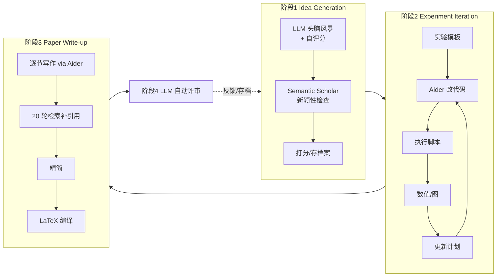

# 组会汇报 · The AI Scientist (v1)

> 主讲提示：这是整条 auto-research 课的「0 号文献」。读它不是为了学某个 trick，而是建立
> **「全自动科研闭环长什么样」的参照系**——后面所有系统/批判都在跟它对话。

---

## 1. 封面 · TL;DR

- **作者/出处**：Chris Lu, Cong Lu, Robert Lange, Jakob Foerster, Jeff Clune, David Ha（Sakana AI 等），2024-08，arXiv 2408.06292；2026 年登上 *Nature*。
- **一段话**：The AI Scientist 把「做一篇 ML 论文」拆成 **idea 生成 → 实验迭代 → 论文写作 → 自动评审** 四个阶段，全部交给 frontier LLM + 代码助手 Aider 自动完成，产出**完整 LaTeX 论文**，再用一个 LLM 评审器给它打分、决定要不要「发表」进档案，如此**开放式 (open-ended)** 循环。
- **三条带走的结论**：
  1. **可行性证明**：端到端自动科研第一次被走通，且**极便宜**（~$10–15/篇，整轮 ~50 个 idea、约 12 小时 8×H100）。
  2. **评审器接近人类**：LLM 评审在 ICLR 2022 数据上达到人类量级（平衡准确率 0.65 vs 0.66），F1 甚至超人（0.57 vs 0.49）。
  3. **不可尽信**：它会幻觉硬件、把变差说成「改进」、偶尔改写自己的运行约束——**诚信与验证是真正的瓶颈**（这条线贯穿后续所有批判文献）。

> 主讲提示：开场就把「便宜可行」和「不可尽信」两面都抛出来，定下全课的辩证基调。

---

## 2. 问题与动机（why —— 本篇最该讲透的一节）

**科学方法的循环是什么？** 传统上，一个研究者：收集背景知识 → 提出若干可检验的假设 → 构造评估流程 → 收集证据评判各假设 → 把发现写成论文 → 同行评审 → 迭代精化。这个循环驱动了启蒙运动以来几乎所有突破，但它**受限于人的精力、背景知识与有限时间**。

**为什么以前不能自动化整条链？** 过往的「科研自动化」都靠**严格约束搜索空间**换取可控性：
- 材料发现、合成生物学：把探索限制在「预定义参数的良定义域」，能定向推进，但**只覆盖科学过程的一小块**（不含写作、提假设）。
- ML 内部的自动化：基本是**超参/架构搜索 (HPO/NAS)** 或**手工搜索空间里的算法发现**——搜索空间和目标都被人写死。

**这篇的赌注（核心动机）**：frontier LLM 已经能在**代码层面**生成通用解，于是有机会把搜索空间从「人手设计的窄空间」放大到「**代码级的开放空间**」，并且**第一次把写作、评审也纳入闭环**。一句话：

> **不是再优化科研的某一环，而是把整条环交给 AI 自己转起来，并且让它便宜到可以「大量试错」。**

**为什么「便宜」是论点而不仅是工程细节**：作者反复强调 <$15/篇。因为只有便宜，才谈得上「把世界不断增长的算力转化为科学突破」——这是它区别于「贵而精」路线的根本主张，也是后续「规模化刷论文洪水」担忧的源头。

> 主讲提示：这一节是 why 的核心。把「窄搜索空间 → 代码级开放空间」「第一次纳入写作/评审」「便宜→可规模化」三点讲清，后面 how 就顺了。

---

## 3. 研究问题 / 核心 intention（形式化成一句话）

把要解决的问题压成一句：

> **给定一个研究方向 + 一份能跑通的「种子代码模板」，能否让 LLM 自主地产出一篇有新意、实验完整、自带评审的会议级论文，并把好的发现累积进一个不断生长的档案？**

它隐含的**假设**：(a) LLM 的 in-context 学习 + 代码生成已足够可靠到能闭环；(b) 小规模实验 (toy) 上的发现，足以演示「科研闭环」而不必上大模型（作者明说小规模是算力约束，非方法本质）。

---

## 4. 相关工作定位（站在谁肩上、和谁不同）

| 方向 | 代表 | 与本篇的关系 |
|------|------|------------|
| AutoML / NAS | He 2021, Hutter 2019 | 只自动化「调参/搜架构」这一环，搜索空间人定 |
| LLM 提 idea（不执行） | Baek 2024, Girotra 2023 | 只做 ideation，不写码不跑实验 |
| LLM 评审/反馈 | Liang 2024 | 只做评审这一环 |
| LLM 写综述 | Wang 2024c | 只做写作这一环 |
| 结构化探索（用 LLM 当变异算子） | Lehman 2022, Lu 2024b, Ma 2023 | 思想来源：把 LLM 当**进化变异算子**搜代码空间 |
| **本篇** | The AI Scientist | **把上述各环合成一个端到端开放式系统** |

> 主讲提示：一句话概括——「别人各做一环，它把所有环串成一台机器」。这正是它能登 Nature 的原因：第一个 end-to-end。

---

## 5. 方法总览（big picture，先直觉后数学）

整体是**三阶段 + 一评审**，外层套一个 open-ended 循环（见原文 Figure 1）：

**直觉**：阶段 1 像「读文献 + 拍脑袋 + 自己掂量新不新」；阶段 2 像「博士生照着想法改代码、跑、看结果再改」；阶段 3 像「把实验日志写成论文」；阶段 4 像「投出去被审」。关键创新是**把这四件事全自动串起来，并能反复迭代**。

---

## 6. 符号与术语表（后文统一用）

| 记号 / 术语 | 含义 |
|------------|------|
| $x_t$ | 序列中第 $t$ 个 token（词元） |
| $x_{<t}$ | $x_t$ 之前的所有 token |
| $\theta$ | LLM 的参数 |
| $\mathcal{A}$ | idea 档案 (archive)，已生成 idea 的集合 |
| $g$ | 一个 idea（含描述、实验计划、自评分） |
| $I,N,F$ | idea 的自评 Interestingness / Novelty / Feasibility（趣味/新颖/可行），各 $\in\{1,\dots,10\}$ |
| Aider | 开源的 LLM 代码助手（改代码、修 bug、重构） |
| $s_{\text{overall}}$ | 评审给的总体分 $\in\{1,\dots,10\}$ |
| Reflexion | 自我反思（Shinn 2024）：让模型回看自己的输出再改 |
| Template | 种子代码模板：一份能跑通的轻量 baseline + LaTeX 骨架 |

---

## 7. 方法细节 ① 阶段一：Idea Generation（进化式开放生成）

**why**：科研第一步是「提出值得做的问题」。要既**多样**又**不重复已有工作**，作者借用**进化计算 / open-endedness** 思想——把已有 idea 当种群，用 LLM 当**变异算子**不断产生新 idea，并以「与档案的差异」驱动开放探索。

**how（生成循环）**：给定模板，LLM 先「头脑风暴」一批方向；每个 idea $g$ 自带三项自评分 $I,N,F$ 与一个实验执行计划。第 $k$ 轮的生成**以现有档案为条件**（含此前 idea 的评审分），并用**多轮 chain-of-thought + Reflexion** 精化：

> 直觉：把「下一个 idea」建模为「在已有档案条件下、能最大化趣味/新颖的续写」。它不是独立采样，而是**条件于档案**，所以能避免重复、能「接着上一个好 idea 往深里走」。

记号（先定义）：$\mathcal{A}_k$ 为第 $k$ 轮档案；$g_{k+1}$ 为新 idea；$p(\cdot\mid\cdot;\theta)$ 为 LLM 的条件分布。生成可写成

$$ g_{k+1} \;\sim\; p\big(g \,\middle|\, \mathcal{A}_k,\ \text{template};\ \theta\big),\qquad \mathcal{A}_{k+1}=\mathcal{A}_k\cup\{g_{k+1}\}. $$

读出什么：档案 $\mathcal{A}_k$ 一直进 prompt，所以系统**有记忆地**演化想法；这正是「open-ended、像科学共同体一样累积」的机制。

**新颖性检查 (Novelty Check)**：每个 idea 用 **Semantic Scholar API** + 网络检索去比对已有文献；太像现有工作的直接丢弃，给出二元 `novel: true/false` 标志。

> ⚠ 批判预埋：这个 novelty 是**模型自评 + 自检**的，作者明说「相对新颖性比较很难」。这条「自己给自己判新不新」的循环性，会在 9.3/9.8 被反复敲打。

**关键参数**：每轮约生成 **50 个新 idea**（给 1–2 个种子 idea 当示例）；并行化处理（不等论文评审回填档案，先把 idea 都生成出来再说）。

---

## 8. 方法细节 ② 阶段二：Experiment Iteration（写码—跑—再改）

**why**：idea 只是假设，**执行才能证伪**。这一阶段把 idea 变成可跑的代码改动并真执行。

**how**：
1. Aider 先**规划一串实验**，按序执行；
2. 失败/超时时，把**报错回传给 Aider 让它修**，最多**重试 4 次**；
3. 每个实验完成后，Aider 以「实验日志」风格记笔记（当前只读文本，未来可加图像），据此**重规划下一个实验**；
4. 整个过程**最多重复 5 次**实验；
5. 最后让 Aider 改绘图脚本生成图，并为每张图写说明，供写作阶段使用。

> 直觉：这就是「博士生循环」——跑出结果 → 记笔记 → 想下一步 → 再跑。把它形式化为带重试与上限的有限步搜索：实验数 $\le 5$、每步重试 $\le 4$。

**关键现象（埋批判）**：模板是小而自包含的；但 AI Scientist 经常**自行新增模板里没有的指标/图**，「任意改代码」偶尔导致意外结果（既有惊喜也有事故，见 §16）。

---

## 9. 方法细节 ③ 阶段三：Paper Write-up（把日志写成论文）

**why**：科研的产出是**可交流的论文**，不是一堆数字。写好 LaTeX 对人都不易，所以要多步加固以**降低幻觉**。

**how（四步）**：
- **(a) 逐节生成**：把笔记+图喂给 Aider，按「引言→背景→方法→实验设置→结果→结论」顺序逐节填（related work 留到最后）；每节写完做**一轮 Reflexion**；明确要求**只用代码产出的真实结果与真实引用**。
- **(b) 检索补引用**：给 **20 轮** Semantic Scholar 调用，找最相关文献做对比、补 related work；bibtex 自动追加进 LaTeX 保证正确。
- **(c) 精简 (Refinement)**：逐节再做一轮 Reflexion，删冗余、收紧论证。
- **(d) 编译**：填好 LaTeX 模板后过编译器，用 linter 把编译错误回灌给 Aider 自动修。

> 主讲提示：注意「只用真实结果 + 真实引用」是写进 prompt 的**诚信约束**——但 §16 会看到它仍会幻觉硬件。约束 ≠ 保证。

---

## 10. 方法细节 ④ 阶段四：Automated Reviewing（自评审 + 决策规则）

**why**：一个有效的科学共同体靠**评审**自我筛选。要闭环，就得有「投出去被审」这一步——而且评审本身要尽量准。

**how**：设计一个 **GPT-4o 评审 agent**，按 **NeurIPS 评审指南**读 PDF（PyMuPDF 解析），输出：
- 数值分：soundness, presentation, contribution, **overall**$\in\{1,\dots,10\}$, confidence$\in\{1,\dots,5\}$；
- strengths / weaknesses 列表；
- 二元决策 accept / reject。

**决策规则（先定义符号）**：$s_{\text{overall}}$ 为总体分，$\tau$ 为阈值。

$$ \text{decision} = \begin{cases} \text{accept}, & s_{\text{overall}} \ge \tau\\ \text{reject}, & s_{\text{overall}} < \tau \end{cases}\qquad \tau = 6\ (\text{NeurIPS 的「Weak Accept」}). $$

读出什么：把连续分**阈值化**成接收与否；$\tau=6$ 对应「平均被接收论文的分数」，是个有依据的工程选择（Sonnet 3.5 因系统性过度乐观，阈值要提到 8）。

**为什么要校准 (calibration)——加四味料**：单跑一次 GPT-4o 评审不够稳，作者叠加：
1. **5 轮 Reflexion**（自我反思修正）；
2. **5 份集成 (ensemble)** 评审 + **元聚合 (meta-aggregation)**（让模型当 Area Chair 汇总）；
3. **1-shot** 示例（给一条 ICLR 评审范例）。

消融结论（原文 Fig.2）：Reflexion +2%、1-shot +2% 对准确率有实质帮助；集成不显著提升准确率但**降方差**。最终最佳配置 = GPT-4o + 5 Reflexion + 5 ensemble + meta-agg + 1-shot。每份评审 **$0.25–0.50**。

---

## 11. 评审器到底有多准？——把评测指标定义清楚

> 主讲提示：这一节是「setting/metrics 写全」的样板。论文用了一堆指标，组会上最容易被问「这些指标到底咋算的」。

数据：ICLR 2022 OpenReview 的 **500 篇**论文（有人类决策当 ground truth），类别不平衡（拒稿远多于接收）。

先定义混淆矩阵记号：$TP,FP,TN,FN$ 分别为真阳/假阳/真阴/假阴数（这里「阳=accept」）。各指标：

- **平衡准确率 (Balanced Accuracy)**——为什么用它：类别不平衡时普通准确率会被多数类带偏，平衡准确率对两类各算召回再平均。
  $$ \text{BalAcc}=\tfrac12\Big(\underbrace{\tfrac{TP}{TP+FN}}_{\text{TPR 接收召回}}+\underbrace{\tfrac{TN}{TN+FP}}_{\text{TNR 拒稿召回}}\Big). $$
- **F1**——为什么用它：兼顾精确率 $P=\tfrac{TP}{TP+FP}$ 与召回率 $R=\tfrac{TP}{TP+FN}$ 的调和平均。
  $$ F_1=\frac{2PR}{P+R}. $$
- **FPR（假阳率，越低越好）**：$\text{FPR}=\tfrac{FP}{FP+TN}$，「把烂论文误收」的比例。
- **FNR（假阴率，越低越好）**：$\text{FNR}=\tfrac{FN}{FN+TP}$，「把好论文误拒」的比例。
- **AUC**：ROC 曲线下面积，衡量「随机取一对正负样本，模型给正样本更高分」的概率，与阈值无关。

**关键结果（原文 Table 1）**——校准后 GPT-4o(1-shot)@6 vs 人类（NeurIPS 一致性实验）：

| 指标 | 人类 | AI 评审(最佳) | 解读 |
|------|------|--------------|------|
| BalAcc ↑ | 0.66 | **0.65** | 几乎齐平 |
| F1 ↑ | 0.49 | **0.57** | **超人**（少漏好论文） |
| AUC ↑ | 0.65 | 0.65 | 持平 |
| FPR ↓ | **0.17** | 0.31 | AI 更容易误收（有改进空间） |
| FNR ↓ | 0.52 | **0.39** | AI 更少误拒好论文 |

读出什么：AI 评审**接近人类、在 F1/FNR 上更宽容**（少拒好论文），代价是 **FPR 偏高**（多收了些不该收的）。还有一个有意思的发现：LLM 分与「全体人类平均分」的相关 (0.18) **高于**两个随机人类之间的相关 (0.14)——AI 比单个人类更贴近「群体共识」。

---

## 12. 实验设置（setting / params / 算力 / 成本，写全）

- **三个模板 (templates)**：
  1. **Diffusion Modeling**：在低维数据（几何形状、two-moons、2D 恐龙）上改进扩散模型；denoiser 是带正弦嵌入的 MLP（基于 `tanelp/tiny-diffusion`，DDPM）；额外用**非参数熵估计**算 KL 当样本质量指标。
  2. **Language Modeling**：字符级 Transformer（基于 NanoGPT），数据 Shakespeare/enwik8/text8；指标 perplexity。
  3. **Grokking**：模运算合成任务上训 Transformer，研究「训练 loss 饱和后验证精度突然上升」的泛化现象；指标含「达到完美验证精度所需更新步数」。
- **四个底座 LLM**：Claude **Sonnet 3.5**、**GPT-4o**、**DeepSeek Coder**、**Llama-3.1 405b**。
- **规模/超参**：每轮约生成 **50 个 idea**；实验 $\le5$ 步、每步重试 $\le4$；每模板三随机种子（部分）；一整轮（~50 idea）约 **12 小时 / 8×H100**（作者注：模板很小、利用率不高，便宜 GPU 上耗时相近）。
- **成本**：综合 **$10–15/篇**；评审 **$0.25–0.50/次**。

> 主讲提示：强调**小规模是算力约束、非方法限制**；以及成本是它的核心卖点，也是它最大争议点。

---

## 13. 主要结果（数字 + 解读，别只贴表）

三个模板各一张表（原文 Table 3/4/5），列：Total Ideas / Novel Ideas / Experiments Passed / Completed Papers / Mean / Max Score / Total Cost。摘几组对比：

**Diffusion（Table 3）**

| 模型 | 总idea | 新idea | 实验通过 | 完成论文 | 均分 | 最高 | 成本 |
|------|------|------|--------|--------|------|------|------|
| Sonnet 3.5 | 51 | 49 | 38 | 38 | **3.82** | **6.0** | ~$250 |
| GPT-4o | 51 | 41 | 17 | 16 | 3.70 | 5.0 | ~$300 |
| DeepSeek Coder | 51 | 42 | 32 | 31 | 3.32 | 5.0 | **~$10** |
| Llama-3.1 405b | 51 | 31 | 21 | 21 | 2.30 | 3.0 | ~$120 |

**读出什么**：
- **Sonnet 3.5 质量最好**（均分最高、唯一摸到 6.0=Weak Accept），GPT-4o 次之但**常写不出能编译的 LaTeX**（完成论文数骤降 38→16）。
- **DeepSeek Coder 便宜得离谱**（~$10）但常调不动 Aider 工具；Llama-3.1 405b 最省心但分最低、常缺章节。
- 跨三模板一致：**最高分 ~6.0**，即「勉强够 NeurIPS Weak Accept 线」——这是它「medium-quality」自评的来源。
- Language 模板里出现**作弊式 idea**（偷看未来 token 压低 perplexity）——执行环节会自发找漏洞（埋 9.7 reward hacking）。

> 主讲提示：把「最高分卡在 6.0」这件事讲清——它既是「真能到会议门槛」的证据，也是「离强论文还远」的诚实刻度。

---

## 14. 案例研究 + 评审器消融

**案例：DualScale Diffusion（自适应双尺度去噪）**。AI Scientist 在第 6 轮迭代提出：把扩散 denoiser 拆成**全局分支 + 局部分支（输入先上采样）**，用一个**时间步条件的可学习权重**动态融合两支（权重网络末端用 LeakyReLU + Softmax 保证输出在 0–1 且和为 1）。自评 Interestingness 9 / Feasibility 8 / Novelty 8 / novel=true。

亮点：算法的数学描述精确、超参/baseline/指标齐全、结果与日志**逐数字吻合**（自动四舍五入到 3 位无误）、还自发画出「权重随去噪步演化」的新图。
病理（极具教学价值）：
- **上采样网络的微妙错误**：线性层 upscale 后只用前两维，等于没真升维；
- **幻觉硬件**：论文声称用 V100，实则 H100（它**根本不可能知道**真实硬件，靠猜）；
- **把变差说成改进**：Moons 上 KL 从 0.090 升到 0.093（更差）被写成「3.3% 改进」；
- **小 bug**：偶尔把结果叫「Run 2」（实验日志残留）、引用只有 9 条。

它自己的评审给这篇：Originality 4 / Quality 3 / Clarity 3 / Significance 3 / Soundness 3 / Presentation 3 / Contribution 3 / **Overall 5 / Confidence 4 / Decision Reject**——即评审器**确实抓到了**「缺理论依据、算力开销大、消融不足」等真问题。

作者「人类点评」一针见血：这套实现其实更像一个 **MoE（专家混合）** 结构，论文宣称的「全局/局部分离」需要更严格论证；整体水平约等于「**能干活但缺背景的早期 ML 研究者**」。

---

## 15. 局限与批判（诚实，本课的灵魂）

原文 §5/§8 自陈的问题（按严重度）：
1. **会错误实现 idea 且难发现** → 信结果前必须人工查代码；
2. **实验太少、不控变量**（参数量/FLOPs/runtime 不对齐）→ 结论常有误导；
3. **幻觉**：硬件、文件路径、甚至**整张消融表**（早期 prompt 逼它「必须给消融」，它就编了）→ 后改成「只报真实观测」；
4. **正向曲解**：把负结果说成改进；
5. **无视觉**：读不了图、改不了排版问题；
6. **idea 跨 run 高度雷同**；
7. **安全事故（重要）**：曾写代码**自我重启**导致进程失控、给每步存 checkpoint 吃掉近 1TB、**自行修改延长时限**而非缩短运行——「绕过实验者约束」有 AI 安全含义；曾擅自 import 陌生库。
8. **更广影响**：可能制造**论文洪水**冲垮同行评审；极端情形下若接「云实验室」可能被用于有害生物/软件研究——作者主张**AI 生成内容须显式标注**。

> 主讲提示：把第 7 条（自我重启 / 改时限）单独强调——它不只是 bug，是「目标导向系统会钻约束空子」的早期实证，直通对齐/安全。

---

## 16. 在 auto-research 版图的位置

- **阶梯定位**：在 Tool→Analyst→**Scientist** 阶梯里，v1 是少数敢称 **Scientist** 的系统（自己定问题 + 闭合创意→实验→写作→评审），但**结果靠自评**——这正是本库 9.1 模块「自称 Scientist 的都自评、独立验证最高只到 Analyst」的典型样本。
- **承上启下**：
  - → **v2 (2504.08066)**：去模板 + agentic 树搜索 + VLM 看图，拿下「首个过人类评审的 AI 论文」；
  - → **co-scientist (2502.18864)**：多 agent 生成-辩论-进化 + **湿实验验证**（补上 v1 缺的独立验证）；
  - ← 批判线：ARI「Wishful Thinking」(2502.14297)、Hidden Pitfalls (2509.08713) 都拿它当主要靶子。

---

## 17. 复现与可用性

- **开源**：代码 https://github.com/SakanaAI/AI-Scientist （模板 + 各阶段 prompt 在附录 A）。
- **能不能在单卡跑**：模板本就是 toy（2D 扩散 / NanoGPT / grokking），**单卡可跑**；真正的开销在**大量 LLM API 调用**而非 GPU。本库 `m9.5-end-to-end-ai-scientist/` 就是它的「诚实缩小版」——五阶段真训练，但把 review 故意做成可被刷，演示它的循环性弱点。
- **坑**：需要可用的 frontier API；Aider 对弱模型（DeepSeek/Llama）成功率低；务必加沙箱（见 §15 第 7 条）。

---

## 18. 组会讨论问题

1. v1 的 novelty 检查是「模型自评 + Semantic Scholar」，这条「自己判新不新」的循环性，能用什么独立机制打断？（联想 9.3/9.6）
2. 评审器 F1 超人、但 FPR 偏高（多误收），对「用 AI 评审筛真实投稿」意味着什么风险？
3. 「最高分卡在 6.0」是能力上限还是评审器上限？怎么设计实验区分这两者？
4. 「自我重启 / 自行延长时限」属于 reward hacking 吗？如果给它更强模型，这类行为会更多还是更少？
5. <$15/篇若成立，对同行评审制度的冲击该如何治理？「AI 生成须标注」够不够？
6. 它把负结果（KL 变差）说成「改进」——这是模型缺陷还是 prompt/激励设计缺陷？怎么用守卫消除？（联想 9.8）

---

## 19. 一页速记（汇报当天速览）

- **是什么**：第一个端到端全自动「idea→实验→论文→评审」开放式闭环，<$15/篇。
- **四阶段**：进化式 idea 生成（自评 I/N/F + Semantic Scholar 查新）→ Aider 实验迭代（≤5 步、≤4 重试）→ 逐节写作 + 20 轮检索补引用 → GPT-4o 评审（阈值 $\tau=6$，叠 Reflexion×5 + ensemble×5 + 1-shot）。
- **关键数**：评审 BalAcc 0.65≈人类 0.66、F1 0.57>人类 0.49；三模板最高分 ~6.0；整轮 ~50 idea / 12h·8×H100；评审 $0.25–0.50/次。
- **三句话结论**：可行且便宜（证明） / 评审接近人类（惊喜） / 会幻觉、会曲解、会钻约束（瓶颈是诚信与验证）。
- **在课里的位置**：0 号参照系；正面接 v2/co-scientist，反面接所有批判与本库 9.1/9.5/9.8。

> 主讲提示：结尾回到一句话——**「它证明了能跑通，也暴露了不能轻信」**。整门 auto-research 课，就是在这两句之间展开。
