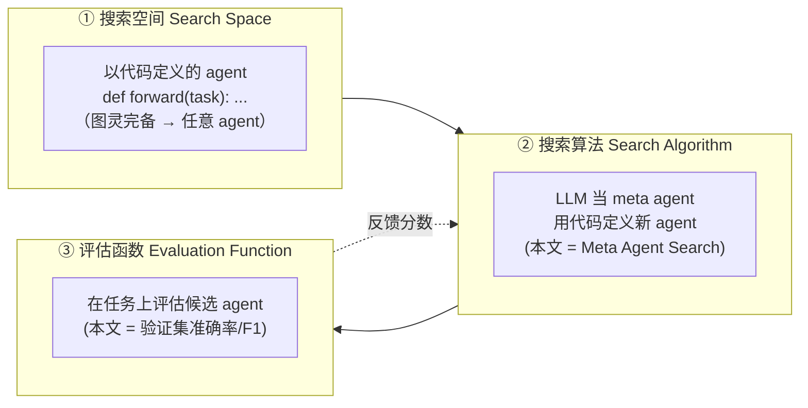
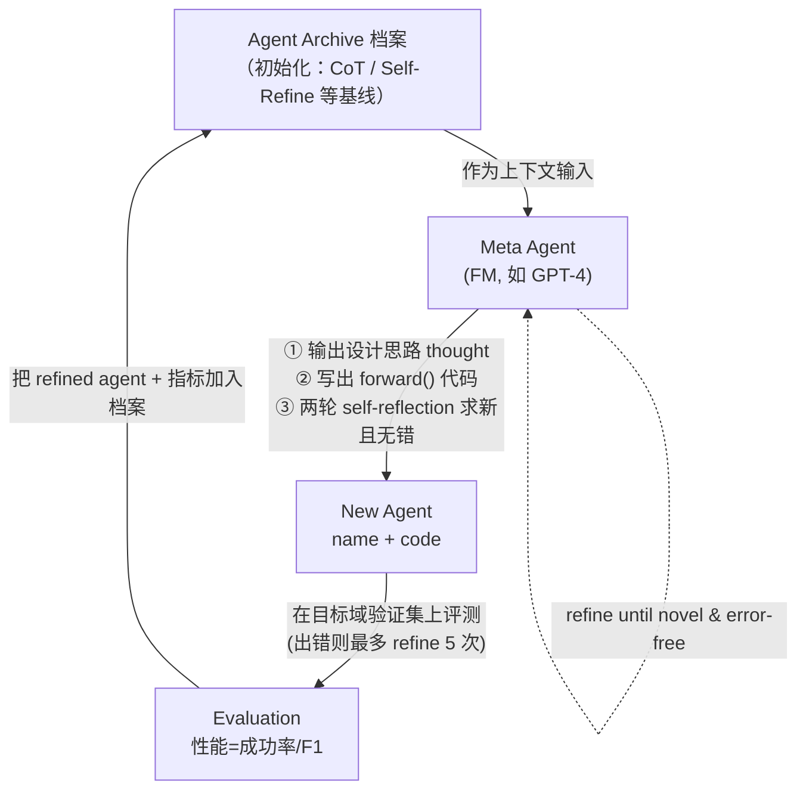

# 组会汇报 · Automated Design of Agentic Systems (ADAS)

> 主讲提示：开场一句话点题——**「这是一篇让 agent 来设计 agent 的论文」**。它的真正贡献不是某个具体好用的 agent，而是把「agentic system 的设计」**形式化成一个搜索问题**，并主张「搜索空间应该是**代码**」。本课主题组 F（自我改进）和本库 9.7（agent 设计 agent）的奠基样本。

---

## 1. 封面 · TL;DR

- **作者/出处**：Shengran Hu, Cong Lu, Jeff Clune（UBC / Vector Institute / Canada CIFAR AI Chair），ICLR 2025 会议论文，arXiv 2408.08435v2（2025-03）。代码开源 `https://github.com/ShengranHu/ADAS`。
- **一段话**：作者提出一个新研究方向 **Automated Design of Agentic Systems（ADAS，智能体系统的自动化设计）**，目标是**自动发明新的构件 (building blocks) 并设计强大的 agentic system**。他们指出一条尚未被充分探索的路线：**把整个 agent 用代码定义**，让一个 **meta agent（元智能体）** 不断**编程**出新的 agent。由于多数编程语言（本文用 Python）是**图灵完备 (Turing Complete)** 的，在代码空间里搜索理论上能发现**任意可能的 agentic system**（新提示、工具用法、控制流及其组合）。他们给出一个简单算法 **Meta Agent Search（元智能体搜索）**：meta agent 基于一个**不断生长的历史档案 (archive)** 迭代地编出「有意思的」新 agent。
- **三条带走的结论**：
  1. **形式化贡献**：ADAS = `搜索空间 × 搜索算法 × 评估函数` 三件套（原文 §2 / Figure 2）；其中**把搜索空间选成代码**是全篇的核心主张——它是固定模块/图/网络空间的**超集**。
  2. **可行且有效**：在 ARC、阅读理解 (DROP)、数学 (MGSM)、多任务 (MMLU)、科学 (GPQA) 上，搜出的 agent **持续超过 SOTA 人工设计 baseline**——阅读理解 F1 提 **13.6/100**，数学准确率提 **14.4%**（原文 §1 / Table 1）。
  3. **迁移性是亮点**：在数学域搜出的 agent **迁移到别的数学域 (+25.9% GSM8K)** 甚至**非数学域**后仍超基线；跨模型（GPT-3.5→Claude-Sonnet）迁移后最佳 agent 在 ARC 上逼近 **50%**（原文 §4.3 / Table 2/3）。

> 主讲提示：把「形式化 + 代码空间是超集 + 迁移性」三点钉死，后面所有 how 都是为这三点服务。

---

## 2. 问题与动机（why —— 本篇最该讲透的一节）

**领域现状**：基础模型 (Foundation Models, FMs) 正被当成通用 agent 的核心，但可靠地解决任务往往需要把单次模型调用扩展成一个**复合 (compound) 的 agentic system**——里面有思维链 (Chain-of-Thought)、自我反思 (Self-Reflection)、工具使用 (Toolformer)、记忆结构、RAG 等「构件」(原文 §1)。问题是：**这些构件和它们的组合，目前几乎全靠人手设计、领域特定地手工调参**，耗费研究者与工程师大量精力。

**为什么「现在」该自动化它**：机器学习史反复上演同一主题——**手工设计的产物最终被学习出来的、更高效的方案取代**（原文引 Clune 2019 / Sutton 2019 的「苦涩教训」）。计算机视觉里 HOG 等手工特征被 CNN 学到的特征取代；近期 AutoML / 神经架构搜索 (NAS) 让最好的 CNN 来自搜索而非手设计；LLM 对齐里**学出来的损失函数**胜过手设计的 DPO；AI Scientist 演示了自动化研究流程。于是作者提出本文的研究问题：

> **Can we automate the design of agentic systems?（我们能否自动化 agentic system 的设计？）**

**不做会怎样（机会成本）**：作者论证 ADAS 可能是**通往强大 agent 最快的路**。理由有二：(1) **构件数量爆炸**——还有海量构件尚待发现，靠社区人工发现要很久；(2) **组合爆炸**——即便发现了所有构件，把它们组合进「面向大规模真实应用」的有效系统仍然困难且耗时，因为构件之间有太多交互方式。**ADAS 把构件与组合都自动学出来**，既省人力，也可能比人工更快找到更有效的方案。

**为什么以前的「自动化」不够**：作者明确批评——**已有少数可算 ADAS 的工作，大多只在「设计提示 (prompts)」上做文章**（如 PromptBreeder、APE 类），这**极大限制了它们发明灵活设计模式的能力**：像 PromptBreeder 只变异提示文本，而工作流 (workflow) 等其它组件保持不变——于是**「与预定义工作流不同的 agent 根本无法被表示」**（原文 §2 / §5）。这正是本文要打破的天花板。

> 主讲提示：这一节是 why 的灵魂。把三层逻辑讲清：① 历史规律（手设计→学习）；② 不做的两个成本（构件爆炸 + 组合爆炸）；③ 现有方法的天花板（只搜提示，表示能力受限）。三层一推，「该搜代码」就呼之欲出。

---

## 3. 研究问题 / 核心 intention（形式化成一句话）

把问题压成一句：

> **能否设计一个搜索算法，让它在「以代码表示的 agent」这一搜索空间里，自动发现出在目标任务上表现优异、且能跨任务/跨模型迁移的 agentic system？**

它隐含的**关键假设**（也是全篇赌注）：
- (a) **图灵完备假设**：因为 Python 图灵完备，代码空间**理论上能表示任意 agentic system**——所以「搜代码」是「搜提示/搜图/搜网络」的**严格超集**，不会因为表示能力被卡住。
- (b) **FM-as-coder 假设**：当下 FM 已足够擅长写代码，可以**直接拿 FM 当 meta agent**，用编程的方式自动产出新 agent。
- (c) **先验复用假设**：代码空间能复用人类已有努力（如 LangChain、RAG、搜索引擎工具），并能借 FM 在代码上的训练先验高效搜索；相比之下，自定义的图/网络搜索空间因缺这些先验可能低效得多。

> 主讲提示：(a) 是「为什么代码空间值得搜」，(b) 是「为什么现在能搜」，(c) 是「为什么搜得动」。三条假设缺一，论点就塌一角——组会上可逐条质疑（见 §16）。

---

## 4. 相关工作定位（站在谁肩上、和谁不同）

作者把 ADAS 放在 **AI-Generating Algorithms (AI-GAs) 与 AutoML** 的谱系里（原文 §5）。AI-GAs/AutoML 有三大支柱：①元学习架构（NAS 属此）、②元学习学习算法（MAML/Meta-RL）、③生成学习环境与训练数据（POET/OMNI-EPIC）。ADAS 同时落在①②两支：用**上下文学习 (in-context learning)** 来「学会去学」。

| 方向 | 代表工作 | 搜索空间 | 与本篇的关系 |
|------|----------|----------|--------------|
| AutoML / NAS | Elsken 2019, Hutter 2019 | 架构超参（人定） | 思想源头：手设计→搜索；但空间窄 |
| FM 写代码做发现 | FunSearch (Romera-Paredes 2024), EoH (Liu 2024) | 程序/算法代码 | 同样「FM 编程搜索」，但搜的是优化算法/启发式，不是 agent |
| 只搜提示 | PromptBreeder (Fernando 2024), APE, OPRO (Yang 2024) | 提示文本 | **本文主要对手**：工作流固定，表示能力受限 |
| 搜工作流（图/网络） | DyLAN (Liu 2023), GPT-Swarm (Zhuge 2024), DSPy, Trace | 节点连接 / 图 | 能搜工作流，但**许多组件（如工具用法）仍固定**；搜索空间或搜索算法更难 |
| 学工具/统一学 | AgentOptimizer (Zhang 2024b), AutoFlow, Agent Symbolic Learning (Zhou 2024b) | 工具/工作流/提示 | 动机相近，但「要么覆盖不全、要么搜索空间更难」 |
| **本篇 ADAS** | Meta Agent Search | **图灵完备的代码** | **把所有组件都用代码表示**，是上面各空间的超集；且代码是 FM 训练中最重要的任务之一，利于 FM 引导搜索 |

> 主讲提示：一句话概括差异——「别人搜提示、搜图、搜工具的某一块；本文搜**代码**，一口气把提示+工具+工作流+控制流全囊括进来」。这就是它敢称 ADAS「第一批能在代码空间做完整设计」的算法的底气。

---

## 5. 方法总览（big picture，先直觉后数学）

ADAS 被形式化为一个**优化过程**，有三个关键组件（原文 §2 / Figure 2）：



**三件套直觉**：
- **搜索空间**决定「哪些 agent 能被表示、从而能被发现」。选代码 → 几乎什么都能表示。
- **搜索算法**决定「怎么探索这个（通常巨大、甚至无界的）空间」，要权衡探索-利用 (exploration-exploitation)，既要快找到高性能 agent，又别陷在局部最优。
- **评估函数**决定「按什么目标打分」——可以是性能、成本、延迟、安全性。本文只优化**性能**（验证集分数）。

**Meta Agent Search 的循环直觉**（原文 §3 / Figure 1）：让一个 meta agent **像科学共同体一样**——看已有发现（档案）→ 提出一个「有意思的」新 agent（写成代码）→ 跑分 → 把它连同分数**存回档案** → 下一轮在更丰富的档案上接着想。这与利用「人类的『有意思 (interestingness)』直觉」来驱动**开放式 (open-endedness)** 探索的工作一脉相承（OMNI / Intelligent Go-Explore）。



> 主讲提示：这张循环图是全场最该画在白板上的。强调两个「自我」机制——**设计期**的 2 轮 self-reflection（求新、查 bug）和**评测期**的 ≤5 次报错 refine（修运行错误）。它把「LLM 当变异算子 + 档案当种群」的进化搜索，落到了「写代码」这件具体事上。

---

## 6. 符号与术语表（后文统一用）

| 记号 / 术语 | 含义 |
|------------|------|
| ADAS | Automated Design of Agentic Systems，智能体系统的自动化设计（本文提出的研究领域） |
| FM | Foundation Model，基础模型（作为 agent 模块的大模型，如 GPT-4 / GPT-3.5） |
| meta agent | 元智能体：负责**编写其它 agent 代码**的那个 FM |
| `forward(task)` | 被搜索的 agent 的**唯一入口函数**：输入任务信息、输出对任务的回答；定义一个 agent = 写一个 `forward` |
| $\mathcal{A}$ | agent archive，已发现 agent 的档案（含代码 + 评测指标） |
| $a$ | 一个候选 agent（即一段 `forward` 代码 + 名字 + 设计思路 thought） |
| $N$ | 搜索的最大迭代次数（ARC 用 25，推理域用 30） |
| $\text{Eval}(a)$ | 评估函数：在目标域验证集上给 agent $a$ 的性能打分 |
| `Info` | 框架里的命名元组 `namedtuple('Info', ['name','author','content','iteration_idx'])`，是模块间传递信息的统一载体 |
| `FM_Module` | 框架提供的「调用一次 FM」的封装（指定输出字段、角色 role、温度 temperature） |
| interestingness | 「有意思/有价值/新颖」的人类直觉，被用作开放式搜索的驱动信号 |
| stepping stone | 「踏脚石」：进化/开放式搜索里中途出现、本身不一定最优、但被后续设计反复复用的关键设计模式 |
| EM | Exact Match，精确匹配（ARC 评测用的判分方式） |

---

## 7. 方法细节 ① 为什么搜索空间要选「代码」（全篇的题眼）

**why（不这么会怎样）**：搜索空间是 ADAS 的第一性问题——**它框定了「可发现集合」的上界**。作者逐一对比（原文 §2 末段）：

- **只搜提示（PromptBreeder 等）**：只变提示文本，工作流等保持固定 → **与预定义工作流不同的 agent 无法被表示**。
- **搜图/网络（GPT-Swarm / DyLAN 等）**：把 agent 当节点、信息流当边来优化连接 → 能动工作流，但**工具用法等许多组件仍被固定**；且自定义图空间**缺少 FM 的先验**，搜索可能很低效。
- **搜代码（本文）**：因 Python 图灵完备，**任意构件（提示、工具用法、控制流、工作流）及其任意组合都能被写出来** → 是上述空间的**超集**。

**代码空间的四个额外好处**（原文 §2）：
1. **可解释性更好**：程序代码通常可读，便于调试、增强 AI 安全。
2. **更易复用人类成果**：能直接在开源 agent 框架（如 LangChain）里搜，复用 RAG、搜索引擎工具等所有现成构件。
3. **借力 FM 的代码先验**：FM 在「写代码」上训练充分，用代码空间可在搜索中**复用 FM 的编程专长**；自定义空间因无此先验而低效。
4. **与图灵完备结合**：理论上可学**任意可能的 agentic system**。

> 直觉：这一节没有公式，但它是全篇最硬的论点。一句话——**「你能搜到什么，取决于你能写下什么；写代码什么都能写下，所以代码空间最大」**。
> 主讲提示：在白板上画一个集合包含关系：`{提示} ⊂ {图/工作流} ⊂ {代码}`。这张图就是论文的「世界观」。然后立刻埋下批判线（§16）：超集 ≠ 搜得到——空间越大越难搜，论文用的搜索算法其实很朴素。

---

## 8. 方法细节 ② Meta Agent Search：档案、迭代与两类自我反思

**why**：理论上 meta agent 可以「从零」把任何 agent 都编出来，但**实践中太低效**——所以作者给 meta agent 一个**不到 100 行的简单框架**，提供查询 FM、格式化提示等基本函数（细节见 §9）。这样 meta agent **只需编写一个 `forward` 函数**就能定义一个新 agent（与 FunSearch 的实践类似）。

**how（四步流程，原文 §3 + Algorithm 1，附录 H）**：

> 直觉（先说为什么是「档案 + 迭代」而不是「一次生成一堆」）：科学共同体的进步是**累积的**——新想法踩在旧想法的肩膀上。把已发现 agent 全放进档案、每轮以**整个档案为条件**生成下一个，meta agent 就能「接着上一个好设计往深里走」、并避免重复，从而**开放式地**演化。

记号（先定义，后给算法）：$\mathcal{A}_i$ 为第 $i$ 轮档案；$a_{i+1}$ 为新生成 agent；$\text{Eval}(\cdot)$ 为目标域验证集上的评估；$N$ 为最大迭代数。流程为：

$$
a_{i+1} \;=\; \text{Refine}\Big(\text{MetaAgent}(\mathcal{A}_i)\Big),\qquad
\mathcal{A}_{i+1} \;=\; \mathcal{A}_i \cup \big\{\, (a_{i+1},\ \text{Eval}(a_{i+1}))\,\big\}
$$

读出什么：**档案单调生长**（$\mathcal{A}_i \subseteq \mathcal{A}_{i+1}$），meta agent 始终「有记忆地」演化设计；每个新 agent 都带着自己的分数入库，供后续设计参考——这正是「像共同体一样累积踏脚石」的机制。

**Algorithm 1（Meta Agent Search，原文附录 H）逐行讲：**

```
输入：目标域验证数据；最大迭代数 N
输出：发现的 agent 档案 A
1. 用基线 agent（如 Chain-of-Thought、Self-Refine）初始化档案 A
2. for i = 1 .. N:
3.   【设计步 Design Step】meta agent 生成一个新 agent：
        (a) 输出设计推理 (thought)
        (b) 用代码实现该设计
        (c) 做两轮 self-reflection，确保「新颖」且「正确」
4.   【评测步 Evaluation Step】在目标域验证集上评测新 agent：
        (a) 若评测时报错，最多 refine 5 次
        (b) 每次 refine 后重跑评测
5.   【更新步 Update Step】把 refine 后的 agent 及其指标加入档案 A
6. 返回最终档案 A
```

**两类「自我反思」必须分清**（这是组会最易被问倒的点）：
- **设计期 · 2 轮 self-reflection（求新 + 查实现 bug）**：第 1 轮让 meta agent 批判性比较「新设计 vs 档案里的旧设计」是否真的新、有没有实现错误、能否改进；第 2 轮按「错误实现示例」再修一遍代码（原文附录 B 给了完整提示）。**目的：novelty + correctness**。
- **评测期 · ≤5 次 error-refine（修运行时错误）**：只有当代码**跑起来报错**时触发，把报错信息回灌让 meta agent debug，最多 5 次。**目的：让代码能跑通**。

**评测指标 = meta agent 的优化目标**：与利用「有意思」直觉的开放式算法一致，作者把**性能（成功率 / F1 分数）**当作 meta agent 要最大化的指标（原文 §3 末 + 附录 B）。

> 主讲提示：强调「**两轮设计反思**（求新查 bug）」与「**最多五次报错重试**（修运行错）」是**两件不同的事**、触发条件不同。再强调一句：这套搜索算法**故意做得很朴素**（作者自承），亮点在「代码空间 + 档案累积」，不在搜索算法本身——这为 §15 的批判与 §16 的「未来工作：更好的搜索算法」埋线。

---

## 9. 方法细节 ③ 极简框架（<100 行）：让 meta agent 只写一个 forward

**why**：若让 meta agent 连「怎么调 FM、怎么拼提示」都从零写，既低效又易错。给它一层**薄而通用**的脚手架，它就能把注意力放在「**设计 agent 的逻辑**」上。

**核心数据结构（原文附录 C，Code 1）**：
- `Info = namedtuple('Info', ['name','author','content','iteration_idx'])`：把每一条信息（FM 回复、工具调用结果、任务描述）都封装成统一的 `Info`，便于在模块间组合传递。FM 模块会把所有输入 `Info` 按其元数据（名字、作者）拼成结构化提示。
- `FM_Module`：调用一次 FM 的封装，构造时指定 `output_fields`（期望输出字段，如 `['thinking','answer']`）、`role`（角色，如 `'Chain-of-Thought'`）、`model`（默认 `gpt-3.5-turbo-0125`）、`temperature`（默认 0.5）。调用即 `query(input_infos, instruction)` 返回一组 `Info`。
- `AgentSystem.forward(self, taskInfo) -> Union[Info, str]`：被搜索 agent 的占位入口——meta agent 要做的就是**填出这个 `forward`**。

**一个例子（自我反思 agent，原文 Code 2）**：用上述框架，一个「思考→自我批判→反复修正」的 agent 只需十几行——建一个 `Chain-of-Thought` 模块和一个 `Critic` 模块，循环最多 `N_max=5` 次：critic 说 `correct=='True'` 就停，否则把反馈拼回输入再 refine。**这说明框架的表达力**：常见设计模式都能被简洁地「编程」出来。

> 主讲提示：把「meta agent 只需写 `forward`」与「Algorithm 1 的设计步 (b) 用代码实现该设计」对应起来——**搜索的「基本动作」就是「写一个 forward 函数」**。这就是「在代码空间搜索」最具体的落地形态。

---

## 10. 实验设置（setting / metrics / params / 算力 / 成本，写全）

作者在三类实验上验证（原文 §4）：(1) ARC 通用智能测试；(2) 四个推理/问题求解基准；(3) 跨域、跨模型迁移。**所有任务用同一套算法实现，唯一变量是提示里的任务描述文字**（原文 §4 / 附录 B 高亮变量）。

**(A) ARC（§4.1，附录 D）**
- **任务**：Abstraction and Reasoning Corpus（Chollet 2019），给若干「输入网格→输出网格」示例，学出变换规则并应用到测试网格。要求 agent **生成代码**作为解（而非直接给答案），框架提供两个工具函数：测试生成代码能否解出示例网格、用代码在测试网格上得答案。
- **数据**：从「Public Training Set (Easy)」中采网格尺寸 $\le 5\times5$ 的题；**验证集 20 题、测试集 60 题**。
- **评分**：对参考解做 **Exact Match**；为降低 FM 随机性，每个 agent 在验证/测试集上各评 **5 次**取（中位数）。
- **模型**：meta agent 用 **GPT-4（gpt-4o-2024-05-13）**；被发现的 agent 与 baseline 都用 **GPT-3.5（gpt-3.5-turbo-0125）** 评测以省算力。
- **迭代**：**25 次**。报告：held-out 测试集**中位数准确率 + 95% bootstrap 置信区间**（原文 Figure 3a）。

**(B) 推理 / 问题求解四基准（§4.2，附录 E）**
- **DROP**（阅读理解，需离散推理，one-shot 风格）；**MGSM**（多语言小学数学，zero-shot）；**MMLU**（多任务，zero-shot）；**GPQA**（研究生级科学难题，用 GPQA-diamond）。各域**独立搜索**。
- **采样规模**：GPQA 验证 32 / 测试 166（评 5 次）；其余三域验证 128 / 测试 800（评 1 次，保持总评测量一致）。
- **模型**：meta agent = GPT-4；被发现 agent 与 baseline = GPT-3.5。**迭代 30 次**。
- **指标**：阅读理解报 **F1 Score**；其余报 **Accuracy (%)**。

**(C) Baselines（§4 / 附录 F）**：5 个手设计 SOTA agent——**Chain-of-Thought (CoT)**、**CoT-SC**（自洽，采 N=5 答案投票/聚合）、**Self-Refine**（≤5 轮自我修正，critic 满意即早停）、**LLM-Debate**（多角色辩论 2 轮）、**Quality-Diversity**（Intelligent Go-Explore 的简化版，产生并集成多样答案）。推理域**额外加 2 个**：**Step-back Abstraction**、**Role Assignment**；以及对照**提示优化 SOTA**：**OPRO（Prompt Optimization）**。所有 baseline 用与 meta agent **相同框架**实现以保证公平，且**全部作为初始种子放进档案**。

**成本（附录 J）**：ARC 单次「搜索+评测」约 **$500 USD**（OpenAI API）；推理/问题求解域单次约 **$300 USD**。**主要开销来自评测期对 gpt-3.5-turbo-0125 的大量调用**。作者指出换更便宜的 gpt-4o-mini（不到 gpt-3.5 三分之一价、性能更好）可把成本压到约 1/3。

> 主讲提示：这一页是「setting/metrics/params 写全」的样板。三个最易被追问的点先讲：① **meta agent 用 GPT-4、被搜 agent 用 GPT-3.5**（贵的只用来「设计」，便宜的用来「跑」）；② **ARC 25 iters / 推理 30 iters**、验证集很小（20/32/128）→ 评估噪声大、易过拟合验证集（埋批判）；③ **成本在评测、不在设计**。

---

## 11. 主要结果 ①：ARC 案例研究（看「踏脚石」怎么长出来）

**结果（原文 Figure 3）**：Meta Agent Search 在 25 轮里**渐进地**发现越来越强的 agent，held-out 测试准确率的**中位数曲线持续抬升并超过全部 5 个 baseline**（CoT / CoT-SC / Self-Refine / LLM-Debate / Quality-Diversity）。最佳 agent 名为 **Structured Feedback and Ensemble Agent（结构化反馈与集成 agent）**。

**最有教学价值的发现——设计模式是「踏脚石」逐步拼出来的**（原文 §4.1 Results and Analysis）：
- **第 3 轮**冒出一个关键模式：**用多条 CoT 生成多个候选答案 → 精修 → 集成最优**。这成了后续设计**反复复用**的踏脚石。
- 最佳 agent 的**复杂反馈机制并非一次蹦出来**：「引入多样反馈」「按特定特质（如效率/简洁）的专家评估」「模拟人类式反馈」分别在**第 5、11、12 轮**才出现；最终机制是在这三块踏脚石上**组合创新**而成——**类似进化里的『交叉 (crossover)』（LLM 当交叉算子）**。

**最佳 agent 长什么样（原文 Code 3）**：`forward` 分 5 步——① 用 5 个 FM 模块（温度 0.8）各出一份初始代码解，只保留至少通过一个示例的；② 用「Human-like Feedback」模块给每个解模拟人类反馈；③ 派三位专家（Efficiency / Readability / Simplicity Expert）给定向反馈；④ 把三类反馈去冗余后，用 Refinement 模块迭代精修 3 轮；⑤ 按通过示例数排序取 top-3，再用 Final Decision 模块集成出最终代码。

> 主讲提示：这一页讲「**涌现 (emergence)**」最好讲——把 Figure 3a 文本框里的「踏脚石时间线」念出来（3→5→11→12 轮），强调**「单个踏脚石当时并不惊艳，但被后来者组合后才厉害」**。这正是开放式/进化搜索的核心审美，也是「为什么要维护档案」的最强证据。

---

## 12. 主要结果 ②：四个推理域全面超过人工设计 + 提示优化

**结果（原文 Table 1）**：在每一个域，Meta Agent Search 发现的 agent **都超过所有手设计 baseline**，也**一致超过提示优化 SOTA（OPRO）**。摘录关键行（粗体=该域最高，原文加粗）：

| Agent | 阅读理解 F1 | 数学 Acc% | 多任务 Acc% | 科学 Acc% |
|-------|:---:|:---:|:---:|:---:|
| Chain-of-Thought | 64.2±0.9 | 28.0±3.1 | 65.4±3.3 | 29.2±3.1 |
| CoT-SC | 64.4±0.8 | 28.2±3.1 | 65.9±3.2 | 30.5±3.2 |
| Self-Refine | 59.2±0.9 | 27.5±3.1 | 63.5±3.4 | **31.6±3.2** |
| LLM-Debate | 60.6±0.9 | 39.0±3.4 | 65.6±3.3 | **31.4±3.2** |
| Step-back Abstraction | 60.4±1.0 | 31.1±3.2 | 65.1±3.3 | 26.9±3.0 |
| Quality-Diversity | 61.8±0.9 | 23.8±3.0 | 65.1±3.1 | 30.2±3.1 |
| Role Assignment | 65.8±0.9 | 30.1±3.2 | 64.5±3.3 | 31.1±3.1 |
| **Prompt Optimization (OPRO)** | 69.1±0.9 | 30.6±3.2 | **67.6±3.2** | 32.9±3.2 |
| **Meta Agent Search (Ours)** | **79.4±0.8** | **53.4±3.5** | **69.6±3.2** | **34.6±3.2** |

**读出什么**（原文 §4.2 解读）：
- **阅读理解 +13.6 F1（65.8→79.4）、数学 +14.4%（39.0→53.4）**：提升**巨大**。作者解释——在阅读理解/数学上 FM **本身知识够用**，错误主要来自**幻觉或计算失误**，**好的 agentic 设计能把这类错误压下去**，所以收益大。
- **多任务 / 科学提升较小**（69.6 / 34.6）：作者假设——这些域里 **FM 的知识本身不够**，光靠改 agent 设计补不上，**随 FM 变强这个差距会缩小**。
- **一致超过 OPRO**：进一步支撑核心论点——**「把所有组件用代码学」比「只优化提示」更有优势**。

> 主讲提示：这页是「主张兑现」的高光。但要诚实补一句——**所有数字都用 GPT-3.5 跑**（2024 年的弱模型），且**验证集很小**；高分里有多少是「真泛化」、有多少是「在 128 题验证集上过拟合」，是组会该追问的（§16 第 2 问）。

---

## 13. 主要结果 ③：跨域 + 跨模型迁移（论文最想让你记住的卖点）

**why（为什么迁移性是「强」的证据）**：如果搜出的 agent 只在「搜它的那个域 / 那个模型」上好，那它更像「过拟合的提示」；**只有当它换域、换模型仍好，才说明搜到的是『可泛化的设计模式』而非『针对性刷分』**。

**(A) 跨数学域 + 跨到非数学域（原文 Table 2 / Table 4 / Table 5）**：把在 **MGSM（数学）** 上搜出的 **top-3** agent 直接迁移：
- **域内迁移（数学→数学）**：在 GSM8K **+25.9%**、GSM-Hard **+13.2%**（相对 baseline）。
- **跨域迁移（数学→非数学）**：迁到 MMLU（多任务）、DROP（阅读理解）后，**虽不及专为该域搜的 agent，但仍超过 SOTA 手设计 baseline**。代表迁移 agent：Dynamic Role-Playing Architecture、Structured / Interactive Multimodal Feedback Loop。

| 迁移自 MGSM 的 top agent | MGSM | GSM8K | GSM-Hard | MMLU | DROP(F1) |
|---|:---:|:---:|:---:|:---:|:---:|
| Dynamic Role-Playing Architecture | **53.4±3.5** | **69.5±3.2** | **31.2±3.2** | 62.4±3.4 | 70.4±0.9 |
| Structured Multimodal Feedback Loop | 50.2±3.5 | 64.5±3.4 | 30.1±3.2 | **67.0±3.2** | 70.4±0.9 |
| Interactive Multimodal Feedback Loop | 47.4±3.5 | 64.9±3.3 | 27.6±3.2 | 64.8±3.3 | **71.9±0.8** |
| （对比）最好的手设计 baseline | 39.0 | 43.6 | 18.0 | 65.9 | 65.8 |

**(B) 跨模型迁移（原文 Table 3）**：把在 **GPT-3.5** 上搜出的 top-3 ARC agent，迁到 **Claude-Haiku / GPT-4 / Claude-Sonnet** 评测，**一致超过手设计 agent，差距显著**。其中 **Claude-Sonnet**（当时 Anthropic 最强）让最佳 agent 在 ARC 上逼近 **50%** 准确率。

| ARC agent（GPT-3.5 搜出） | GPT-3.5 | Claude-Haiku | GPT-4 | Claude-Sonnet |
|---|:---:|:---:|:---:|:---:|
| Structured Feedback and Ensemble Agent | **13.7±3.9** | 5.0±2.5 | 30.0±5.2 | 38.7±5.5 |
| Hierarchical Committee Reinforcement Agent | 13.3±3.8 | 8.3±3.2 | **32.3±8.9** | 39.7±5.5 |
| Dynamic Memory and Refinement Agent | 12.7±3.9 | 9.7±3.3 | 37.0±5.3 | **48.3±5.7** |
| （对比）最好的手设计 baseline | 8.0 | 6.3 | 23.0 | 39.3 |

> 主讲提示：把「**搜一次、到处能用**」当作 takeaway——这是 ADAS 区别于「逐任务调提示」的根本卖点。但也要点出 Claude-Haiku 上有的迁移 agent **掉到 5.0**（低于该模型的某些 baseline），说明**迁移并非永远占优**（§16 第 3 问）。

---

## 14. 消融与分析：初始化的影响（数学域反直觉）

**问题（原文附录 I，Table 6）**：核心主张之一是「代码空间能复用人类成果、比从零搜更高效」。那么**去掉初始种子（不放任何手设计 agent 进档案），还行不行？**

**结果**：即便**空初始化 (Empty Initialization)**，Meta Agent Search **仍在所有域超过全部手设计 baseline**——说明方法**稳健**，能纯靠代码空间的内在结构去探索优化。

| 配置 | 阅读理解 F1 | 数学 Acc% | 多任务 Acc% | 科学 Acc% |
|---|:---:|:---:|:---:|:---:|
| Meta Agent Search（**空初始化**） | 73.9±0.9 | **67.5±3.3** | 68.5±3.3 | 32.7±3.2 |
| Meta Agent Search（带基线初始化） | **79.4±0.8** | 53.4±3.5 | **69.6±3.2** | **34.6±3.2** |

**反直觉发现**：**多数域里「带初始化」更好**（复用人类先验有效）；**唯独数学域「从零」反而更强（67.5 vs 53.4）**。作者假设——**没有预定义设计模式时，搜索被迫做更广、更多样的推理策略探索**，而这种多样性**对数学这类需要灵活推理的任务特别有益**（原文附录 I）。

> 主讲提示：这条反直觉结论很值得讨论——它暗示「人类先验」有时是**枷锁**（把搜索锁进已知模式），与「站在巨人肩上更快」的直觉相反。这给「初始化质量×域特性」如何影响搜索，留了一个漂亮的开放问题。

---

## 15. 局限与批判（诚实，本课的灵魂）

**A. 原文自陈 / 主动讨论的局限与风险（§6 / 附录）**
1. **只优化单目标（性能）**：未考虑成本、延迟、鲁棒性等；作者把「多目标 ADAS」列为未来工作。
2. **评估函数朴素且昂贵**：当前只在验证集上算个准确率，**既贵又丢失大量信息**（如失败/成功模式），作者明说这是成本主因，未来应设计「能读运行日志」的更智能评估器。
3. **搜索算法简单**：本文搜索算法「相对简单，只聚焦于探索有意思的新设计」，作者承认更精细的搜索（结合 Quality-Diversity / 开放式算法 / 经典探索-利用）是有前景的方向。
4. **只测单步 QA 任务**：尚未扩展到「与复杂环境多步交互」的真实应用。
5. **只搜单一域**：每次只在一个域里搜，未探索「专门搜跨多域通用 agent」。
6. **安全考量（作者重点讨论）**：虽然在当前设定下 FM 生成代码做出公然恶意行为「极不可能」，但**模型能力/对齐有限仍可能导致破坏性行为**。已采取的措施：**所有生成代码在隔离容器/安全沙箱中执行、人工检查、代码库内显式安全警告**（对齐 SWE-Bench / Voyager 的受控执行实践）。作者主张本工作**净收益为正**——它揭示「强 ADAS 只需 API 即可编程、不依赖昂贵硬件」，并能通过自动设计**可解释、可审计的工作流**来**增强**安全；同时呼吁向 safe-ADAS 方向（如结合 Constitutional AI）发展。

**B. 课程视角的额外质疑（社区 / 你的批判）**
- **「图灵完备 → 任意 agent」是表示性论证，不是可达性论证**：代码空间是超集没错，但**空间越大越难搜**；本文搜索算法朴素、迭代仅 25/30 次，**实际能触及的子空间可能很窄**。「理论上能发现任意 agent」与「这个算法能发现好 agent」是两回事。
- **验证集极小（20/32/128）+ 用它当唯一信号**：高分可能部分来自**对验证集过拟合**（搜索本质是在验证集上做选择）；测试集虽 held-out，但**迁移以外的单域数字**仍需警惕「刷验证集」。
- **全程弱模型（GPT-3.5 当被搜 agent）**：结论在 2024 年的弱模型上成立；随底座增强，「好 agent 设计带来的增量」是否还这么大（作者自己也假设科学/多任务上会缩小）尚不确定。
- **「meta agent 自评新颖性」的循环性**：求新靠的是 meta agent 自己的 self-reflection 比对档案——**自己判自己新不新**，与本库 9.1/9.8 反复敲打的「自评循环性」同源。
- **结果可复现性受 API 漂移影响**：底座（gpt-4o / gpt-3.5）会更新，复跑可能得到不同档案与分数。

> 主讲提示：把「**表示性 ≠ 可达性**」当作本篇最重要的批判一句话钉死。论文最强的论点（代码空间是超集）恰恰也是它最大的软肋（超集难搜，而它的搜索算法很朴素）。

---

## 16. 在 auto-research 版图的位置

- **主题组定位**：本篇属 **F 自我改进**，是本库 **9.7「agent 设计 agent」** 的奠基样本。它把「自我改进」具体化为「**一个 agent（meta）通过编程产出另一个 agent**」，并指出**高阶 ADAS**（meta agent 也是 agent，可被 ADAS 改进，乃至 meta-meta-...）这一自指方向（原文 §6 Future Work，呼应 Schmidhuber 的自指元学习）。
- **与本库其它论文的关系**：
  - **思想同源（FM 当变异算子搜代码）**：FunSearch、EoH、AI-Scientist 系列——都让 FM 在代码空间做发现；ADAS 把对象换成「agent 本身」。
  - **与 AI Scientist（2408.06292）互补**：AI Scientist 自动化「做研究」的流程（idea→实验→论文→评审）；ADAS 自动化「设计做事的 agent」。两者同出 Clune/UBC 谱系，都信奉 AI-GAs + open-endedness + interestingness 驱动。
  - **被「评测/批判线」对照**：本库的 benchmark（如 MLE-Bench / GAIA 类）和批判文（Hidden Pitfalls、Ideation-Execution Gap）可用来追问——「搜出的高分 agent 换到更严的、防过拟合的评测上还成立吗？」
- **阶梯定位**：在 Tool→Analyst→Scientist 阶梯里，ADAS 不直接「做科研」，而是**生产工具/Analyst 层的 agent**；它的「自指改进」潜力（meta agent 改进 meta agent）是通往更高自治度的一条候选路径，但**目前仍受朴素搜索 + 弱评估器制约**。

> 主讲提示：一句话串课——**「AI Scientist 让 AI 做研究；ADAS 让 AI 设计『做事的 AI』。把两者叠起来，就是『让 AI 设计出更会做研究的 AI』——这正是自我改进/AI-GAs 的终局设想。」**

---

## 17. 复现与可用性

- **开源**：代码 `https://github.com/ShengranHu/ADAS`；附录给了**框架代码（Code 1/2）、meta agent 全套提示（附录 B）、各域描述（附录 D/E）、三个发现 agent 的完整实现（附录 G：Multi-Step Peer Review / Divide and Conquer / Verified Multimodal Agent）、ARC 最佳 agent 代码（Code 3）、Algorithm 1 伪代码（附录 H）**。可复现性材料相当齐全。
- **能不能在单卡跑**：**几乎无需 GPU**——开销全在 **FM API 调用**。瓶颈是**钱**（ARC 约 $500/次、推理域约 $300/次）与 **API 配额**，不是算力。换 gpt-4o-mini 可压到约 1/3 成本。
- **坑**：① 必须**沙箱执行**生成代码（作者反复强调，见 §15 A.6）；② **验证集小 + 5 次重评**，注意随机性；③ 结果随底座 API 版本漂移；④ meta agent 用 GPT-4、被搜 agent 用 GPT-3.5 的**异构配置**要照搬才能对齐论文数字。

> 主讲提示：强调「**这是少数『不卡 GPU、只卡 API 预算』的 auto-research 工作**」——门槛低、易上手复现，适合组里同学拿来做「换更强底座 / 换更严评测」的后续实验。

---

## 18. 组会讨论问题

1. **表示性 vs 可达性**：代码空间是「提示/图/网络空间」的超集（图灵完备），但本文搜索算法很朴素、只迭代 25/30 次。**「能表示任意 agent」到底给「能发现好 agent」贡献了多少？** 怎么设计实验把这两件事拆开测？
2. **验证集只有 20/32/128 题**且被当唯一搜索信号——**高分里有多少是真泛化、多少是对验证集过拟合？** 迁移实验能完全洗清这个嫌疑吗？
3. **跨模型迁移**在 Claude-Sonnet 上逼近 50%、却在 Claude-Haiku 上掉到 5.0。**什么决定一个搜出的设计「迁得动 / 迁不动」？** 是不是只迁得到「比搜索时更强」的模型？
4. **初始化反直觉**：数学域「从零搜」反而更好。**「人类设计模式」何时是先验、何时是枷锁？** 能否设计「先复用、再强制跳出」的两段式初始化？
5. **自评新颖性的循环性**：求新靠 meta agent 自己比对档案。**怎么引入独立机制打断这个自评循环**（如外部相似度、行为多样性度量）？（联想 9.1/9.8）
6. **高阶 ADAS**：meta agent 自己也是 agent，可被 ADAS 改进。**「meta agent 改进 meta agent」会收敛、发散还是钻空子？** 在什么安全前提下才该尝试？
7. **评估器是瓶颈**：作者承认「只算验证集准确率」既贵又丢信息。**把评估器换成『能读失败日志、能给设计诊断』的 agent，会不会比改搜索算法收益更大？**
8. **随更强底座**：所有结论建立在 GPT-3.5 当被搜 agent 上。**用 2026 年的强模型重跑，「好 agent 设计」的增量会变大还是变小？** 作者的「知识够用→收益大」假设还成立吗？

---

## 19. 一页速记（汇报当天速览）

- **是什么**：提出 **ADAS**——把「设计 agent」当成 `搜索空间 × 搜索算法 × 评估函数` 的优化问题，并主张**搜索空间用代码**（图灵完备 → 任意 agent 的超集）。代表算法 **Meta Agent Search**：meta agent 基于**生长档案**迭代**编写新 agent 的 `forward` 代码**。
- **怎么搜（Algorithm 1）**：基线初始化档案 → 循环 N 次〔设计步：出 thought + 写代码 + **2 轮 self-reflection（求新/查 bug）**；评测步：验证集打分，**报错最多 refine 5 次**；更新步：入档案〕→ 返回档案。框架 <100 行，meta agent 只写 `forward`。
- **关键设置**：meta agent=**GPT-4**、被搜 agent=**GPT-3.5**；ARC 25 iters（验 20/测 60、≤5×5、评 5 次、EM）；推理域 30 iters（DROP/MGSM/MMLU/GPQA，F1 或 Acc）；7 个手设计 baseline + OPRO 对照；ARC 约 **$500/次**、推理约 **$300/次**（开销在评测调用）。
- **关键数**：阅读理解 **F1 +13.6**（→79.4）、数学 **Acc +14.4%**（→53.4），**全域超人工设计 + 超 OPRO**（Table 1）；迁移：数学→数学 **+25.9% GSM8K / +13.2% GSM-Hard**，数学→非数学仍超基线（Table 2/4/5）；跨模型 ARC 迁到 **Claude-Sonnet ≈50%**（Table 3）；**空初始化仍超全部 baseline，数学域从零反而更好**（Table 6）。
- **三句话结论**：① 把 agent 设计**形式化**并主张**搜代码**（最大贡献）；② 搜出的 agent **全域超 SOTA 人工设计、且跨域/跨模型迁移仍强**（最有力证据）；③ 但**表示性≠可达性**、搜索/评估器朴素、全程弱模型、验证集小——**「能发现任意 agent」是潜力，不是已兑现的事实**（最该批判处）。
- **在课里的位置**：主题组 F / 本库 9.7 的奠基；与 AI Scientist 互补（一个让 AI 做研究、一个让 AI 设计做事的 AI），共指「自我改进 / AI-GAs」终局。

> 主讲提示：结尾回到一句话——**「它给了『让 agent 设计 agent』一个干净的形式化和第一个能跑的实例；它证明了『搜代码』这条路走得通，但离『把图灵完备的潜力真正搜出来』还很远。」**
