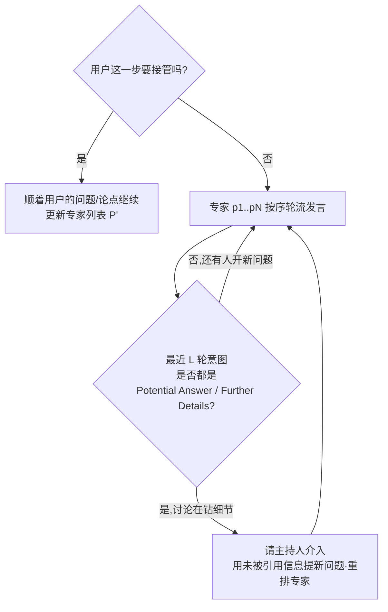
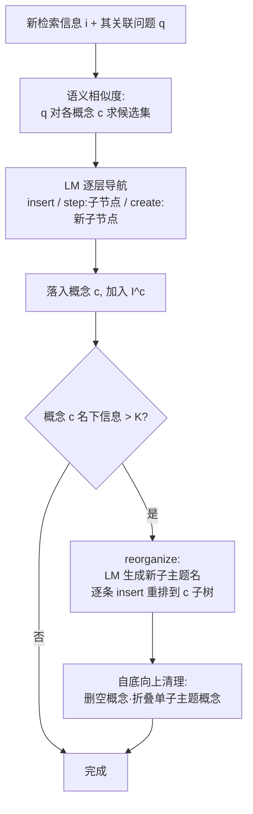

# 组会汇报 · Co-STORM（Collaborative STORM）

> 主讲提示：这篇是 D 组「Deep Research」的人机协作代表作。它和旗舰系统（AI Scientist）走的是相反方向——
> 不追求「把人踢出循环、全自动产出论文」，而是**刻意把人留在循环里**，让 AI 当「会提问的同学+主持人」，
> 把研究式阅读 (research reading) 这件苦差事变成一场你能旁听、随时插话的圆桌讨论。开场先把这个「反向赌注」讲清楚。

---

## 1. 封面 · TL;DR

- **作者/出处**：Yucheng Jiang\*, Yijia Shao\*, Dekun Ma, Sina J. Semnani, Monica S. Lam（Stanford OVAL + Yale），EMNLP 2024 Main，arXiv 2408.15232（v2, 2024-10）。`*` 共同一作。代码与资源开源（github.com/stanford-oval/storm），并有公开 live demo（storm.genie.stanford.edu）。
- **一段话**：当下的 LM 聊天机器人和生成式搜索擅长回答**具体问题（已知的未知, known unknowns）**，但当你连「该问什么」都不知道时（**未知的未知, unknown unknowns**）它们就失灵了——你得自己把所有问题问出来。Co-STORM 把信息检索重构成一场**协作话语 (collaborative discourse)**：几个**视角各异的模拟专家 (perspective-guided experts)** + 一个**模拟主持人 (moderator)** 在网上检索、互相问答，**用户只需旁观、偶尔插一句**来引导方向。Agent 们**替用户把问题问出来**，于是用户能「顺带（serendipitously）」撞见自己原本想不到的角度。为帮用户跟住讨论，系统实时维护一张**层级化动态思维导图 (dynamic mind map)**；讨论结束后可一键生成**带引用的长报告 (cited report)** 当作带走的成果。
- **三条带走的结论**：
  1. **范式转换**：从「一问一答 (one-question-one-answer)」改成「**混合主动 (mixed-initiative)** 的多方圆桌」——把「提问」这件最耗认知的事外包给 agent，专治 unknown unknowns（见 Figure 1、§2）。
  2. **两件关键装置**：①**协作话语协议**（专家 + 主持人 + 人，三种角色 + 四类话语意图 + 轮次/发起权管理）；②**动态思维导图**（用 `insert`/`reorganize` 把碎片信息长成一棵概念树，既当导航又当报告大纲）。
  3. **实证有效且省心**：自动评测（WildSeek 数据集，100 例）上 Co-STORM 在报告的**深度 (Depth) 与新颖度 (Novelty)** 上显著超 RAG 与 STORM+QA 两个 baseline；人评（20 人）中 **70% 更偏好它胜过搜索引擎、78% 胜过 RAG chatbot**，且普遍觉得**更省脑力 (less mental effort)**。

> 主讲提示：把「unknown unknowns」这个词钉死——这是全篇的题眼。known unknowns = 你知道自己不知道（能提问）；unknown unknowns = 你不知道自己不知道（提不出问题）。Co-STORM 的全部设计都是为了后者。

---

## 2. 问题与动机（why —— 本篇最该讲透的一节）

### 2.1 现有系统卡在哪：只能服务「已知的未知」

**搜索引擎 / RAG chatbot / 生成式搜索**（§1）都默认一个前提：**用户能把需求表述成 query 或问题**。它们靠「直接给答案」服务 *known unknowns*——你知道缺什么、问得出来，它就答得上来。

但很多真实场景**没有单一的金标准 query**：学术调研、市场分析、决策。这类**复杂信息检索 (complex information seeking)** 中，「问题本身会随着你边查边懂而动态演化」（原文引 Bates 1989 的 berrypicking 思想：检索是一路「摘浆果」、目标不断漂移，而非一次命中）。此时被动响应式的系统有两个硬伤（§1）：
- **回音室效应 (echo chamber effect)**：系统只顺着你已有的提问走，越查越窄、强化既有认知（原文引 Sharma et al. 2024「生成式回音室」）。
- **高认知负荷压垮新手**：先验知识少的用户**连问题都构造不出来**（原文引 Kuhlthau 1991、Belkin et al. 1982）。

> 一句话缺口：现有系统帮你**回答**问题，但不帮你**发现该问什么问题**。

### 2.2 「未知的未知」到底指什么——把概念钉死

原文在 §1 给了精确的学理出处，组会上务必区分两层：
- 这个词原指军事里「意料之外的风险」；在**信息研究 (information research)** 语境里，它被链接到**偶遇式发现 (serendipitous discovery)**（原文引 Foster & Ford 2003、Agarwal 2015）。
- **Kirzner (1997)** 把两者对照得最清楚（原文直接引用）：
  - **发现 (discovery)** = 「意识到自己其实早就能轻易获得、却一直忽略了的东西」；
  - **成功搜索 (successful search)** = 「刻意地把一条自己已知缺失的信息生产出来」。

读出什么：搜索引擎做的是后者（successful search，服务 known unknowns）；Co-STORM 想补的是前者（discovery，逼出 unknown unknowns）。

### 2.3 为什么走「协作话语」这条路——教育学的灵感

**核心赌注**：人类自古就有一个低成本逼出 unknown unknowns 的场景——**听别人讨论、偶尔插话**。原文 §1/§3.1 反复引教育学文献：
- **Nussbaum (2008)**：协作话语 (collaborative discourse) 能加深理解、培养批判性思维；且**不是所有讨论都等效**，关键是**参与者持不同视角的批判性讨论**。
- **主持人 (facilitator) 很重要**（原文引 Onrubia et al. 2022）：提问与补充信息是其主要策略。
- 富兰克林那句被原文放在 §3 开头当题记：「**Tell me and I forget. Teach me and I remember. Involve me and I learn.**（告诉我，我会忘；教我，我能记住；**让我参与，我才真学会**。）」——这就是把人留在循环里的理由。

**为什么不直接找真人专家圆桌？** 原文 §3.1 给的现实理由：**很难随时随地为任意话题凑齐一组人类专家**。所以用多个 LM agent 来**模拟**这场圆桌。

> 主讲提示：这一节是 why 的灵魂。把三件事讲透——①缺口是「不帮你发现该问什么」；②unknown unknowns ≈ serendipitous discovery（给学理出处）；③解法灵感来自「旁听+插话」的课堂式协作话语，且 AI 让这种圆桌**随时可得**。后面所有 how 都是在落地这三点。

---

## 3. 研究问题 / 核心 intention（形式化成一句话）

把问题压成一句：

> **给定用户的初始话题 $t$ 与初始目标 $g$，能否构造一个多 agent 系统，让用户以「旁观 + 偶尔引导」的低认知负荷方式参与一场协作话语，从而（a）被 agent 替自己问出的问题带去发现 unknown unknowns，并（b）最终得到一份忠于讨论、可验证（带引用）的定制长报告？**

形式化（原文 §2.1）：报告是句子序列 $\mathcal{S}=s_1s_2\dots s_n$，每个句子 $s_i$ 引用一组从信息库 $\mathcal{R}$ 检索到的证据 $\mathcal{I}\subset\mathcal{R}$（为了**可验证性 verifiability**）。任务是「**与用户交互 (interact)** 并写出**贴合用户兴趣的定制长报告**」。

它隐含的**假设**：①LM 能可信地扮演「持不同视角、会上网查证、会互相问答」的专家；②把「提问」外包给 agent，能在**降低用户认知负荷**的同时**提高**所覆盖信息的广度/深度/偶遇性；③一张层级化思维导图足以让用户「跟得住」一场多方讨论。

---

## 4. 相关工作定位 & 与 STORM 的承接关系

### 4.1 它站在谁肩上、和谁不同

原文 Table 1 用三个属性刻画「复杂信息检索」需要什么，把各类系统填进去：

| 系统/范式 | 多源 (Multiple Sources) | 持续交互 (Ongoing Interact) | 产出报告 (Curated Report) |
|---|:---:|:---:|:---:|
| 信息检索 IR (Robertson 1977) | ✗ | ✗ | ✗ |
| 单轮 QA | ✓ | ✗ | ✗ |
| 对话式 QA (Conversational QA) | ✓ | ✓ | ✗ |
| 报告生成 (Report Generation, 含 STORM) | ✓ | ✗ | ✓ |
| **Co-STORM** | ✓ | ✓ | ✓ |

读出什么：**只有 Co-STORM 三项全中**。对话式 QA 缺「产出报告」，STORM 这类报告生成缺「持续交互」——这正是 Co-STORM 要补的两块。

### 4.2 与 STORM (Shao et al. 2024, arXiv 2402.14207) 的承接——本篇重点

这是组会必须讲清的一条线（原文 §1/§4 多处对照）：

| 维度 | STORM（前作） | Co-STORM（本篇） |
|---|---|---|
| 产物 | 自动生成**静态**的 Wikipedia 式长文 | **交互式**协作话语 + 可一键导出的报告 |
| 用户角色 | **无**用户交互；用户只能拿到最终成稿 | 用户**旁观 + 随时插话**（mixed-initiative） |
| 提问机制 | **多视角提问 (perspective-guided question asking)** 来产生大纲 | **沿用并扩展**该机制：让多个「视角专家」在**圆桌里互相**问答 |
| 发起权 | 纯 agent 主动 | **混合主动**：用户与 agent 都能发起 |
| 知识组织 | 写作前生成大纲 (outline) | **运行时动态思维导图**，边讨论边长树 |

一句话承接：**Co-STORM = STORM 的「视角提问」内核 + 人在环 + 动态思维导图 + 实时圆桌**。STORM 把「会查资料的写手」自动化了；Co-STORM 把「一群会查资料、会互相追问、还有主持人的同学」搬到你面前，并让你能插话。

### 4.3 其它坐标

- **多 agent 系统**：原文引 Generative Agents (Park 2023, 25 个 agent 社会模拟)、多 agent 辩论提升事实性/推理 (Du 2023, Liang 2023)、Debate 帮人监督模型 (Michael 2023)。Co-STORM 的差异：**多 agent 不是为了自动完成任务，而是为了辅助人类学习**（human-in-the-loop）。
- **NLP 信息检索辅助**：传统 QA 假设「答案在单文档内」或「用户能构造复杂 query」，在复杂检索里都不成立（原文引 Butler 2000、Booth 2009、Byström & Järvelin 1995）。长文 QA / 专家写作系统（Balepur 2023、Shen 2023、Shao 2024）多为「被动答 or 忽略交互」。

> 主讲提示：组会上把 4.2 这张表投出来即可。一句话——「STORM 给你一篇成稿，Co-STORM 给你一场你能参与的讨论 + 一篇成稿」。

---

## 5. 方法总览（big picture，先直觉后数学）

Co-STORM 把一次会话编排成**三类角色**在一张**思维导图**旁的圆桌（原文 Figure 2）：

```mermaid
flowchart TB
  subgraph ROLES[三类角色 · 协作话语 §3.1]
    U[用户 User<br/>旁观 + 随时插话/引导 §3.3]
    E[视角专家 Experts p1..pN<br/>上网检索·问答 §3.4]
    M[主持人 Moderator<br/>非专家·提好问题·防跑偏 §3.5]
  end
  DH[(话语历史<br/>Discourse History D)]
  MM[[动态思维导图<br/>Mind Map M §3.2]]

  U -- 注入 utterance/接管发起权 --> DH
  E -- 轮流发言:提问 or 检索+带引用作答 --> DH
  M -- 用"未被引用"的信息提新问题·重排专家 --> DH
  DH -- 每条信息 insert/reorganize --> MM
  MM -- 当大纲:逐节生成 --> R[带引用长报告<br/>Cited Report S]
  MM -. 帮用户"跟住"讨论 .-> U
```

**直觉（一句话）**：让一群「会查资料、视角不同的同学」在你面前讨论你的话题；**主持人**负责把跑偏的、重复的讨论拉回来并不断**抛新问题**（它代表「一个 known unknowns 大得多的人」，替你拓边界）；**思维导图**实时把讨论里的知识分门别类长成一棵树，你扫一眼就知道讲到哪、还有哪些没碰；满意了就把这棵树当大纲，生成一篇带引用的报告。

**实现底座（原文 §4）**：LM 组件用 **DSPy 框架** + **zero-shot prompting**，模型 `gpt-4o-2024-05-13`；检索接 **You.com search API**（兼容其它搜索/IR）；文本向量用 `text-embedding-3-small`。

---

## 6. 符号与术语表（后文统一用）

| 记号 / 术语 | 含义（出处） |
|---|---|
| $t$ | 用户给定的初始话题 (topic)（§2.1） |
| $g$ | 用户给定的初始目标 (goal)（§2.1） |
| $\mathcal{R}$ | 信息库 (repository of information)，如整个互联网（§2.1） |
| $\mathcal{S}=s_1\dots s_n$ | 最终报告，句子序列；每句 $s_i$ 引用 $\mathcal{I}\subset\mathcal{R}$（§2.1） |
| $\mathcal{D}=\{u_1,\dots,u_n\}$ | 协作话语 (discourse)：按轮次的文本话语 $u_i$（§3.1） |
| $u_i$ | 第 $i$ 条话语 (utterance) |
| $a_i$ | 话语 $u_i$ 的**意图类型 (intent)**，四选一（§3.1） |
| $\mathcal{P}=\{p_1,\dots,p_N\}$ | 视角专家集合 (perspective-guided experts)（§3.1） |
| $\mathcal{P}'$ | 用户插话/主持人回合后**更新后的**专家列表（§3.3/§3.5） |
| $\mathcal{M}=(\mathcal{C},\mathcal{E})$ | 思维导图：概念集 $\mathcal{C}$ + 有向父子边集 $\mathcal{E}$（§3.2） |
| $c\in\mathcal{C}$ | 一个概念节点 (concept)；其下挂一组检索信息 $I^c\subset\mathcal{I}$（§3.2） |
| $\mathcal{I}$ | 已检索/收集到的全部信息片段集合 |
| $N,K,L,\alpha$ | 四个关键超参（§4，取值见 §13） |
| $\mathbf{i},\mathbf{t},\mathbf{q}$ | 信息片段 $i$ / 话题 $t$ / 关联问题 $q$ 的文本向量（§3.5） |

---

## 7. 方法细节 ① 协作话语协议（角色 · 意图 · 发起权 · 轮次）

> 这是本篇重点之一。把「谁能说、说什么、什么时候说、谁决定下一个说」四件事拆开讲。

### 7.1 三类角色（§3.1）

- **视角专家 (experts)**：参与讨论，**以不同视角提问或答问**；答问时**上网检索并带引用**（§3.4）。
- **主持人 (moderator)**：一个**非专家**，但「懂得足够多、能问出好问题并引导讨论」——它的职责是**注入新方向**、防止讨论被「补充细节」类话语带进死胡同（§3.5）。
- **用户 (user)**：可**随时跳进来**引导方向、按兴趣注入问题或观点（§3.3）。

讨论如何开场：先由 $N$ 个专家**各发言一轮**来「热身 (warm up)」话题 $t$（§3.1）。

### 7.2 四类话语意图 (Utterance Intent，§3.1)

**why**：要让 agent 们的发言可编排、可评测，得先给每句话打上「它在干嘛」的标签。原文借用 Qu et al. (2019) 的「信息检索对话意图分类法」，给每条 $u_i$ 关联一个意图 $a_i$，四选一：

| 意图 $a_i$ | 含义 | 归类 |
|---|---|---|
| **Original Question** | 发起一个**新**问题 | 问问题 (question-asking) |
| **Information Request** | 就上一句**追问更多**信息 | 问问题 (question-asking) |
| **Potential Answer** | 给某个先前问题**提供一个可能答案** | 答问题 (question-answering) |
| **Further Details** | 对某个答案**补充细节** | 答问题 (question-answering) |

读出什么：把发言二分为「问 vs 答」。后面**主持人介入的触发条件**和**评测指标**都建立在这套意图标签上（如「问问题类话语」才评 Novelty）。

### 7.3 发起权管理 (Initiative Management，§3.1)

**why**：多方对话的老问题是「谁掌控话题走向」。原文引 Traum (2003)：要么纯用户主动（如 QA），要么纯 agent 主动（如 STORM）。Co-STORM 取**混合主动 (mixed-initiative)**：
- 用户**主动参与**时 → 系统**顺着用户的问题/论点**继续（更聚焦、更贴个人兴趣）；
- 用户**不出手**时 → 系统**自动生成下一回合**。
- **发起权归用户掌控**：用户可**随时接管 (take a turn anytime)**。

### 7.4 轮次管理 (Turn Management，§3.1) —— 主持人何时该上场

**why**：如果只让专家轮流发言，讨论会**退化成一堆「补充细节 (Further Details)」**，越聊越细、钻进小众角落、不断重复——正好和「发现 unknown unknowns」相反。所以需要一个触发规则把主持人叫上来「换个方向」。

**触发规则（原文 §3.1）**：若用户在第 $i$ 步不接管，协议让专家 $p_1,\dots,p_N$ **按序轮流**发言；当系统**连续观察到 $L$ 轮**专家话语的意图都是 **Potential Answer 或 Further Details**（即只在「答/补细节」、没有人开新问题）时，**就请主持人介入** (intervene)。§5.3 的消融证明了这个协议设计的价值。

读出什么：$L$ 是「容忍讨论钻牛角尖多少轮」的旋钮；连续 $L$ 轮不开新问题就强制「换口气、提新问题」。



> 主讲提示：这一张图是「协作话语协议」的核心。强调主持人是**反钻牛角尖装置**——它专门在「大家只顾补细节」时跳出来抛新角度，这正是逼出 unknown unknowns 的引擎。

---

## 8. 方法细节 ② 模拟专家与模拟主持人（两条 pipeline）

### 8.1 视角专家 pipeline（§3.4）

**why**：沿用 STORM 的发现——**用「不同视角」引导提问能显著提升问题的多样性与质量**。所以先给话题配一组「带视角的专家」。

**how**：
1. **造专家**：用话题 $t$ 检索背景，喂给 LM 生成专家列表 $\mathcal{P}=\{p_1,\dots,p_N\}$。例（图 2，话题 "AlphaFold 3"）：AI 专家、遗传学家、分子生物学家。
2. **专家发一轮言（三步）**：
   - **(1) 选意图**：LM 依据话语历史 $\{u_1,\dots,u_{i-1}\}$ 和该专家视角 $p$，选 $a_i$。
   - **(2) 生成内容**：若意图是 **Potential Answer / Further Details** → LM 先生成**搜索 query $q$**、用搜索引擎检索、再生成**带引用 (with citations)** 的回答；否则（问问题类）→ 直接据话语历史**生成一个问题**。
   - **(3) 润色话语**：再过一遍 LM 把话**变得更口语、更吸引人 (chatty and engaging)**——这步本身也是个**自我改进**机制（§5.3 指出它有助质量）。

> 关键约束（见附录 Listing 2 的 prompt）：答问的 prompt 明确写「**每句话都要有检索信息支撑、不要幻觉 (do not hallucinate)、保留引用编号 [1]、若信息与问题无关就明说局限与缺口**」。检索遵循 Wikipedia「可靠来源」规则做规则过滤（沿用 STORM）。

### 8.2 主持人 pipeline（§3.5）—— 逼出 unknown unknowns 的关键

**why（再强调）**：全是专家时，讨论易塌缩成「补细节 + 重复 + 小众」。主持人要做的是**从「还没被讨论用到」的信息里挖新问题**——这恰恰是 unknown unknowns 的来源：你没问，但材料里其实有。

**how**：
1. **重排未被引用的信息 (rerank uncited sources)**：自上次主持人回合以来检索到、但**还没被引用**的信息有很多，要挑「**和话题相关、却又不直接回答原问题**」的那种（最可能是新角度）。
2. **生成新问题**：用重排后的来源 + 概念名 $\mathcal{C}$（避免重复已有概念）提示 LM 生成主持人的问题。
3. **更新专家列表** $\mathcal{P}'$：据新方向换一批合适的专家。

**唯一的打分公式 · 主持人重排分（原文 §3.5）**

> 直觉：我们要的不是「最能回答当前问题」的资料（那只会把已知聊得更深），而是「**扣着话题、但偏离当前问句**」的资料——它最可能藏着用户没想到的新角度。于是把「与话题的相似」和「与当前问句的**不**相似」乘起来打分。

记号（先定义，后用式）：
- $i$：一条**待评分的未被引用信息**片段；
- $t$：用户话题；$q$：该信息当初**被检索时所对应的问题**；
- $\mathbf{i},\mathbf{t},\mathbf{q}$：$i,t,q$ 各自的文本向量（`text-embedding-3-small`）；
- $\cos(\mathbf{a},\mathbf{b})$：两向量的余弦相似度；
- $\alpha\in[0,1]$：权衡「贴话题」与「偏离原问句」的超参。

$$ \text{score}(i)\;=\;\cos(\mathbf{i},\mathbf{t})^{\alpha}\,\bigl(1-\cos(\mathbf{i},\mathbf{q})\bigr)^{1-\alpha} $$

读出什么：第一项 $\cos(\mathbf{i},\mathbf{t})^{\alpha}$ 越大 = 越扣题；第二项 $\bigl(1-\cos(\mathbf{i},\mathbf{q})\bigr)^{1-\alpha}$ 越大 = 越**不**直接回答原问题（越「跑题但相关」）。两者相乘并用 $\alpha$ 调配比，**优先挑出「扣题但偏离原问句」的信息**——这就是把 unknown unknowns 从「检索到却没被用上的信息」里捞出来的算子。（原文取 $\alpha=0.5$，即几何平均。）

> 主讲提示：这是全篇唯一的「机制公式」，务必讲透。一句话——**主持人专挑「相关但答非所问」的料来开新话题**；如果只挑「最能回答」的料，就只会强化已知、永远碰不到 unknown unknowns。

---

## 9. 方法细节 ③ 动态思维导图（dynamic mind map）—— 本篇重点

> 这是本篇第二个核心装置。先讲「为什么需要它」，再讲它怎么长大（insert / reorganize / cleanup）。

### 9.1 为什么要思维导图（§3.2）

**why**：协作的前提是**共享的概念空间 (shared conceptual space)**（原文引 Roschelle & Teasley 1995）。一场多方圆桌信息量极大，用户**很难只靠读对话流跟住**。思维导图（原文引 Buzan 1974「mind map」）把零散信息**层级化**组织，**降低用户认知负荷**、让人「一眼看到讲到哪、哪里还空着」。它一物两用：①讨论时当**导航/进度条**；②结束时当**报告大纲**（§3.3：逐节用各概念 $c$ 关联的信息 $I^c$ 生成对应小节）。

### 9.2 形式定义（§3.2）

思维导图 $\mathcal{M}=(\mathcal{C},\mathcal{E})$ 是概念的**层级组织**：$\mathcal{C}$ 是概念集，有向边 $\mathcal{E}$ 刻画概念间的**潜在父子关系**（如图 2 中 "Drug Discovery Acceleration" 是 "Impact and Applications" 的子主题）。每个概念 $c$ 关联一组检索信息 $I^c\subset\mathcal{I}$；并且**每条信息都同时关联「当初导致它被检索出来的那个问题」**——保证 $\mathcal{M}$ 是**意图驱动 (intent-driven)** 的组织（按「为什么要查它」而不是表面词面来归类）。

### 9.3 两个动态操作：`insert` 与 `reorganize`（§3.2，附录 B/Listing 1）

**(a) insert —— 把一条新信息放进树**
- **how**：先用**语义相似度**（该信息**关联问题** vs 各概念 $c$）算出一组**候选概念**，再**提示 LM 选定最终落点**。
- **why 用「关联问题」而非信息正文做匹配**：呼应 9.2 的 intent-driven——按「这条信息回答的是什么问题」归类，比按字面更稳。
- prompt 里 LM 在树中**逐层向下导航**，每层三选一输出（见 Listing 1）：`insert`（放当前节点下）/ `step: [子节点名]`（下钻到某子节点）/ `create: [新子节点名]`（新建子节点再放）。

**(b) reorganize —— 概念太挤就重构子树**
- **触发**：当某概念 $c$ 名下信息**超过 $K$ 条**，触发 `reorganize`。
- **how**：提示 LM 为 $c$ **生成一批新子主题名**，再把 $c$ 下每条信息用 `insert` 重新放进以 $c$ 为根的子树。

**(c) bottom-up cleanup —— 扩展后自底向上清理**
- 扩展后做一轮**自底向上清理**：**删除没有任何支撑信息的空概念**；**折叠只有一个子主题的概念**（消除冗余层级），保持树干净。



读出什么：思维导图不是事后画的图，而是**随讨论实时生长并自我整理**的活结构——这既是给人看的「认知脚手架」，也是给系统用的「报告大纲」。

> 主讲提示：把「intent-driven 组织」（按关联问题归类）和「$K$ 触发 reorganize + 清理」这两点讲清——它们是这棵树**不退化成乱麻**的关键。§15 会给「这套 insert 比纯 embedding / 纯 LM 都准」的实测。

---

## 10. 一次完整循环：把三件装置串起来（含用户参与与报告生成）

把 §7–§9 合成一条端到端流程（原文 §3.3 用户参与 + 报告生成）：

1. **开场**：$N$ 个视角专家各热身一轮，思维导图开始生长。
2. **自动推进**：专家轮流「问/答（带引用）」；每条新信息 `insert` 进导图；连续 $L$ 轮只「答/补细节」→ 主持人用「扣题但偏离」的未引用信息抛新问题、换专家 $\mathcal{P}'$。
3. **用户插话**（§3.3）：用户注入话语 $u$ → 系统**以 $u$ 为 query 检索**、据此**更新专家列表 $\mathcal{P}'$** → 之后**切回自动模式**（按 §3.1 轮次协议继续）。
4. **导出报告**（§3.3）：用户满意后，**以思维导图 $\mathcal{M}$ 为大纲**、用每个概念 $c$ 关联的信息 $I^c$ **逐节生成**带引用的报告 $\mathcal{S}$。

> 主讲提示：强调「用户插话后系统会重配专家、再自动跑」——这就是 mixed-initiative 的落地：人只在想引导时出手，其余时间当听众。

---

## 11. 实验设置（setting / params / 数据 / baseline，写全）

### 11.1 WildSeek 数据集（§2.2，附录 A）—— 本篇的评测底座

**为什么要自造数据集**：要研究「真实世界里人们的复杂检索需求」，需要带**真实用户目标**的记录；现有数据集没有。

**怎么造的**：
- 来源：开源 **STORM web 应用**（storm.genie.stanford.edu）上真实用户提交的 **(话题, 目标) 对**。建库时该站累计 **8,777 名用户**、**6,608 个唯一 (话题,目的) 对**。
- 清洗：用 LM（`gpt-4o-2024-05-13`）做**规则分类**只保留「动机明确」的数据点；同一 LM 预测每条的**分类类别**，再人工复核精修。
- 规模：**下采样到 100 个数据点，跨 24 个细粒度类别 / 6 大领域**（Science；Health & Fitness；Culture & Society；Lifestyle & Leisure；Social Science & Humanities；Others）。领域分布见图 5（Science 占 58）。
- 一个样例（Table 2）：领域 Economics；话题「发展共享交易货币以促进国际贸易」；目标「研究新共享货币如何消除交易成本、提升成员国 GDP」。
- 伦理：显式取得用户同意、剔除全部 PII；拒绝非法/有害/非英语等话题。**当前仅英文来源**。

### 11.2 自动评测设置（§5.1）—— 用 LM 模拟用户

**为什么用 LM 模拟用户**：自动评测要**可规模化**、且**用户行为一致**可控。
- 用 `gpt-4o-2024-05-13` 扮演用户：喂入 $t$、$g$、话语历史 $\mathcal{D}$ 和「生成问题」的指令。
- **公平对齐**：所有方法在**累计达到 30 次搜索 query** 时**终止**信息检索阶段（统一检索预算）。
- 所有方法的**最终报告**都用 STORM 的「先大纲、再逐节写」两段式生成（基于交互历史），保证只比「交互/发现」的差异。

### 11.3 Baseline（§5）

- **(1) RAG Chatbot**：从搜索引擎检索、一问一答地与（模拟）用户交互。
- **(2) STORM + QA**：先用 STORM 框架就话题生成一篇报告提供概览，再允许用户追问、用搜索检索作答。
- **消融**：**w/o Multi-Expert**（只 1 个专家 + 主持人，即 $N{=}1$）；**w/o Moderator**（$N$ 个专家、0 主持人）。

### 11.4 关键超参与底座（§4）

| 项 | 取值 |
|---|---|
| 专家热身轮数 / 专家数 $N$ | **3** |
| reorganize 触发阈值 $K$（每概念信息上限） | **10** |
| 主持人触发的连续轮数 $L$ | **2** |
| 主持人重排权衡 $\alpha$（Eq. 见 §8.2） | **0.5** |
| LM 底座 | `gpt-4o-2024-05-13`（zero-shot via **DSPy**） |
| 文本向量 | `text-embedding-3-small` |
| 检索 | **You.com** search API（可换） |
| 采样 | temperature **1.0**，top_p **0.9**（全实验统一） |
| 检索预算（评测对齐） | 累计 **30** 次 search query 即停 |

> 主讲提示：这四个超参 $N{=}3,K{=}10,L{=}2,\alpha{=}0.5$ 是组会最易被追问的细节，单独列出。强调「30 query 截断」是为**公平对齐**baseline 的预算。

---

## 12. 评测指标（给全定义式）—— setting/metrics 的样板节

> 主讲提示：本篇指标有两套打分器：**报告质量**和**话语质量**，都用 5 分制 rubric + **Prometheus-2 (7B)** 当裁判（附录 D，Tables 9–11 是完整评分细则）；外加一个有闭式定义的 **Information Diversity**。把「rubric 是什么、谁来打、还有哪个是公式」讲清。

### 12.1 报告质量（Report Quality，§5.2）
四个维度，**Prometheus-2 (7B)** 按 1–5 rubric 打分（`prometheus-7b-v2.0`，temp 1.0 / top_p 0.9；因上下文有限，报告评测时**省略引用并裁到 2000 词**）：
- **Relevance（相关）**、**Breadth（广度/Broad Coverage）**、**Depth（深度）**、**Novelty（新颖度）**。各档语义见 Table 9（如 Novelty=5：「引入大量与初始意图高度相关、且显著丰富该意图的新角度」）。

### 12.2 信息多样性（Information Diversity，§5.2）—— 唯一闭式指标

> 直觉：报告引用了一堆证据；如果它们彼此都很像，说明检索很「同质」、覆盖窄。于是用「**引用证据两两之间平均的「不相似度」**」来量化多样性——越不相似、越多样。

记号（先定义，后用式）：
- $\mathcal{I}$：报告中被引用的信息片段集合；$|\mathcal{I}|$ 为其个数；
- $i,j$：$\mathcal{I}$ 中两条不同的信息（$i\neq j$）；
- $\mathbf{i},\mathbf{j}$：二者的文本向量（OpenAI `text-embedding-3-small`）；
- $\cos(\mathbf{i},\mathbf{j})$：余弦相似度。

$$ \text{InfoDiversity}\;=\;1-\frac{\sum_{i,j\in\mathcal{I},\,i\neq j}\cos(\mathbf{i},\mathbf{j})}{|\mathcal{I}|\,(|\mathcal{I}|-1)} $$

读出什么：分式是**所有有序对的平均余弦相似度**（分母 $|\mathcal{I}|(|\mathcal{I}|-1)$ 正是有序对数）；用 $1-$ 取反 → 平均越不相似，多样性越高。它直接刻画「这次检索撒网撒得够不够开」。

### 12.3 话语质量（Discourse Quality，§5.2）
讨论过程本身对学习有价值，故对每个 turn 也用 5 分 rubric 评（按意图分两类）：
- **问问题类话语**（Original Question / Information Request）：评 **Novelty（新颖）**、**Intent Alignment（与用户意图对齐）**、**No Repetition（不重复）**（Tables 9/11）。
- **答问题类话语**：评 **Consistency（一致/不自相矛盾）**、**Engagement（吸引力）**（Table 10）。
- 另报告这些话语里**唯一被引 URL 数 (# Unique URLs)**，作为 turn 级信息多样性的代理。

### 12.4 评测器本身可信吗（附录 D，Table 7）
抽 50 条话语（5 个 rubric 项各 10 条）、两位人工独立打分，与 Prometheus 自动分算 **Pearson 相关**：Intent Alignment 0.55、No Repetition 0.50、Consistency 0.50、Engagement 0.34、Novelty 0.32；**5 项中 4 项达统计显著**——即自动评测与人评正相关，可作代理。

---

## 13. 主要结果（数字 + 解读，别只贴表）

### 13.1 自动评测：报告质量 + 话语质量（Table 3）

`†` = 与**两个 baseline** 配对 t 检验均显著（$p<0.05$）；1–5 分，越高越好。

| 方法 | Rel. | Breadth | Depth | Novelty | InfoDiv | Consist. | Engage. | #URLs |
|---|:--:|:--:|:--:|:--:|:--:|:--:|:--:|:--:|
| RAG Chatbot | 3.57 | 3.50 | 3.26 | 2.44 | 0.595 | 4.37 | 4.13 | 2.94 |
| STORM + QA | 3.61 | 3.61 | 3.43 | 2.50 | 0.592 | 4.34 | 4.11 | 2.89 |
| **Co-STORM** | **3.78** | **3.75** | **3.77†** | **3.05†** | **0.602** | **4.40†** | **4.33†** | **6.04†** |
| &nbsp;&nbsp;w/o Multi-Expert | 3.73 | 3.75 | **3.77** | 2.93 | 0.589 | 4.40 | 4.32 | 5.91 |
| &nbsp;&nbsp;w/o Moderator | 3.56 | 3.69 | 3.41 | 2.89 | 0.577 | 4.39 | 4.28 | 5.67 |

**读出什么**：
- **最突出的是 Depth 与 Novelty**：Co-STORM 把 Novelty 从 baseline 的 ~2.5 抬到 **3.05**、Depth 抬到 **3.77**，且对两个 baseline 都显著（†）。这正是「多 agent 圆桌 + 主持人」要兑现的承诺——比一问一答聊得更深、更能撞见新角度。
- **STORM+QA > RAG**：多视角确实在四个报告维度上都略好于纯 RAG（印证 STORM 的视角提问内核有用），但**深度/新颖度仍被 Co-STORM 甩开**——差距来自「圆桌互动 + 主持人」。
- **话语质量全面更优**：Consistency、Engagement 显著领先；**#Unique URLs 翻倍**（6.04 vs ~2.9），说明每个回合带进来的信息源**多样得多**。原文把 Consistency 提升归因于「只在检索信息**匹配当前问题时**才作答」的约束（见 Listing 2）；把质量自提升部分归因于**话语润色步**（§8.1 第 3 步）。

### 13.2 人类评测（20 人，IRB 批准，§6 / Table 4 / Figure 4）

**设置**：招募 20 名背景各异者，随机分两组——一组「Co-STORM vs Google 搜索」，一组「Co-STORM vs RAG chatbot」；**同域内换两个话题**做对照（消除话题熟悉度偏差）、并做先后顺序的 counterbalance。每任务后按 4 维 Likert（1–5）打分，再做成对偏好。

**Likert 评分（Table 4，加粗为 Co-STORM 胜出且报告 win%）**

| 维度 | vs 搜索引擎(n=10) | | vs RAG(n=9) | |
|---|:--:|:--:|:--:|:--:|
|  | Co-STORM | 对手 | Co-STORM | 对手 |
| Relevance | **4.00** | 3.90 | **4.22** | 3.89 |
| Breadth | **4.10** | 3.60 | **4.22** | 3.11 |
| Depth | **4.00** | 3.10 | **4.00** | 3.11 |
| Serendipity | **3.90** | 2.70 | **3.78** | 2.78 |

**成对偏好（原文 §6.2 / Figure 4 的整体偏好）**：
- **70%** 受访者整体上**偏好 Co-STORM 胜过搜索引擎**；**78%** 偏好它**胜过 RAG chatbot**。
- 细分（Figure 4）：vs 搜索引擎——User Engagement **100%** 认同更好、Less Effort **80%**、Addresses Echo Chamber **60%**；vs RAG——Overall **78%**、Addresses Echo Chamber **56%**、Less Effort **67%**。
- 显著性（成对 t 检验）：vs 搜索引擎的 **Serendipity（p=0.030）** 与 vs RAG 的 **Breadth（p=0.013）、Serendipity（p=0.009）** 达显著；Depth 接近显著（0.069–0.081）。

**质性发现**：参与者评估 Co-STORM **32% 的话语**「有效把讨论引向新而有趣的方向」；评估了 **80 张思维导图快照**，认为其**71% 准确反映了讨论**；有人说「Co-STORM 让我用起来轻松太多 (so much less mentally taxing)」。

> 主讲提示：人评最该带走的是——**Serendipity 与 Breadth 的优势既大又显著**，且**省脑力/缓解回音室**获高比例认同。这两点正是 §2 立的 flag 被兑现：发现 unknown unknowns + 降认知负荷。诚实补一句：Depth 在人评里只是「接近显著」。

---

## 14. 消融与分析（哪个部件贡献多少）

### 14.1 双 agent 编排的价值（§5.4，Table 3 / Figure 3）

- **去掉主持人 (w/o Moderator) 伤得最重**：Depth 3.77→3.41、Novelty 3.05→2.89、InfoDiversity 0.602→0.577——**移除主持人比减少专家数的负面影响更大**。原文一句话点题：主持人代表「一个 *known unknowns* 大得多的人」，有效把讨论**引向用户 unknown unknowns 的空间**。
- **只留单专家+主持人 (w/o Multi-Expert) 已能拿到大部分收益**：原文明说「**只要一个专家 + 一个主持人就已提供大部分好处**」（Depth 持平、Novelty 仅小降到 2.93）。Figure 3 进一步显示：在**问问题 turn** 的 Novelty / Intent Alignment / No Repetition 上，完整系统优于两个消融。

读出什么：**主持人是发现 unknown unknowns 的主引擎；多专家锦上添花**。这与 §7.4「主持人是反钻牛角尖装置」前后呼应。

### 14.2 思维导图 insert 的受控实验（§15 详见，附录 B，Table 6）
见下一节「复现与可用性」前的专题——简述：Co-STORM 的 `insert` 在三层级插入准确率上**一致优于**「纯 embedding」和「纯 LM」两种放置法。

### 14.3 轮次协议（§5.3）
原文称在 §5.3 分析了「连续 $L$ 轮只答/补细节就请主持人」这一协议的收益（防止讨论塌缩为 Further Details 的重复），结论支持该设计；**具体增量数值原文未在正文以表格单列**（以 Table 3 的 w/o Moderator 对照间接体现）。

---

## 15. 思维导图质量的独立验证（附录 B / Table 6）—— 把「树长得准不准」量化

**为什么单独做**：动态把信息组织进**不断演化的层级**比经典文档分类/递归摘要都难（层级既宽又深、且强烈依赖概念名质量）。人评已表明思维导图对用户至关重要（§6），故需受控验证 `insert` 的准确性。

**怎么构造任务**：用 **FreshWiki**（Shao et al. 2024，近期高质量 Wikipedia 文章集）：拿文章大纲当**概念层级**，要求各方法为「文中某条引用」找到**最佳插入位置**，以**原文中该引用的真实位置为 ground truth**。规则过滤后得 **111 个任务**（一级 33、二级 64、三级 14）；二/三级若插到「真实位置的某个祖先」算**部分正确 (Partial Acc)**。

**对手**：**Embedding Only**（取与各概念余弦相似度最高处）；**Language Model Only**（直接让 LM 在给定层级里选最佳位置）。

**结果（Table 6，插入准确率 %）**

| 方法 | 一级 Acc | 二级 Acc | 二级 Partial | 三级 Acc | 三级 Partial |
|---|:--:|:--:|:--:|:--:|:--:|
| Embedding only | 24.24 | 35.94 | 65.62 | **35.71** | 57.14 |
| Language Model only | 3.03 | 7.81 | 62.50 | 7.14 | **71.43** |
| **Co-STORM insert** | **39.39** | **51.56** | **68.75** | **35.71** | **71.43** |

读出什么：**纯 LM 在精确放置上几乎崩溃**（一级仅 3.03%，因层级太宽太深、且重度依赖概念名）；**纯 embedding 居中**；Co-STORM 的「先 embedding 出候选、再 LM 逐层导航」**在多数格子上取最优或并列最优**——这就是 §9.3 设计的实证依据。

> 主讲提示：这张表回答「凭什么信你那棵树」。一句话——**单靠 LM 选位置会崩，单靠 embedding 不够准，二者结合（候选+导航）才稳**。

---

## 16. 局限与批判（诚实，本课的灵魂）

**原文自陈（Limitations 节）**：
1. **不会按用户先验知识定制**：对老手该跳过基础事实、对新手该循序渐进引入概念——目前都没做。
2. **用户对话语的控制仍不够**：用户有时想更细地**管理专家视角、定制话语长度**，系统暂不支持。原文把「动态适配用户演化中的心智状态、个性化偏好」列为未来工作（人评里 19 人中有 4 人明确想要更多定制，且指出 RAG 在「目标明确、要简短」时更跟手）。
3. **多语言缺失**：当前只英文；扩到多语言需要能访问多语来源的检索 + 跨语言内容审核/冲突识别。
4. **延迟更高**：因为要决定话语意图、更新思维导图，**Co-STORM 比 RAG chatbot 延迟更高**（人评中尚可接受，但仍需提效）。
5. **风险声明（Ethics）**：任务会**塑造人对信息的认知**，主要风险是**互联网固有偏见**；缓解靠「可靠来源」规则过滤 + 多源 + 输入话题审核；并强调可加更强的「信息核验」模块。

**社区/我方可补的质疑**：
- **裁判可信度有限**：报告/话语质量重度依赖 **Prometheus-2 (7B)** 这个 LM 裁判，且与人评相关只到 0.32–0.55（Novelty 最低 0.32）；「Novelty 高」究竟是真新还是裁判偏好，值得保留。
- **「serendipity」难证因果**：自动指标里没有「unknown unknowns」的直接度量，全靠 Novelty/Serendipity 的**代理**；人评 serendipity 显著但样本仅 10/9 人。
- **绕不开搜索 API 的天花板**：信息广度受 You.com 检索质量与「可靠来源」过滤规则约束；偏见与覆盖盲区会被继承。
- **成本/延迟未量化**：正文**未给**每次会话的 token 成本与端到端时延数字（只定性说「延迟更高」）——组会可追问。

> 主讲提示：把第 1、2 条单独点出——它们指向同一根软肋：**系统不建模「用户当前知道什么」**，所以既不能因材施教，也难真正个性化。这恰是「人在环」系统下一步最该补的。

---

## 17. 在 auto-research 版图的位置

- **D 组（Deep Research）定位**：它是「**把人留在循环里**的研究式阅读助手」的代表——**与旗舰系统（AI Scientist，B 组）正相反**：AI Scientist 要把人**踢出**循环、全自动产论文并自评审；Co-STORM 要把人**请进**循环、当「会提问的同学」帮人学习。两者一起界定了「自动化研究」的两个极端：**完全自治 vs 人机协作**。
- **承上（STORM, 2402.14207）**：直接前作。STORM 把「会查资料、按多视角提问的写手」自动化成静态长文；Co-STORM **复用其「视角提问」内核**，再叠加**人在环 + 圆桌互动 + 动态思维导图**（见 §4.2 对照表）。
- **与多 agent 辩论/协作线（Du 2023 / Liang 2023 / Michael 2023）的差异**：那些用多 agent 是为**提升模型自身**的事实性/推理或**帮人监督模型**；Co-STORM 用多 agent 是为**辅助人类学习与发现**——目标函数不同。
- **方法可迁移点**：①「主持人挑『相关但答非所问』的料开新话题」是个通用的**反钻牛角尖/探索算子**，可移植到任何「易塌缩为细节」的多 agent 讨论或自动调研；②「intent-driven 动态思维导图（insert/reorganize/cleanup）」是个通用的**运行时知识组织 + 报告大纲**结构，对长报告类系统普遍有用。

---

## 18. 复现与可用性

- **开源**：代码并入 STORM 仓库 `github.com/stanford-oval/storm`；有公开 live demo `storm.genie.stanford.edu`（即 WildSeek 数据的来源站）。
- **实现栈**：**DSPy** 编排 + zero-shot prompt（全 prompt 见附录 C，Listing 1 思维导图 / Listing 2 专家 / Listing 3 主持人）；底座 `gpt-4o-2024-05-13`；向量 `text-embedding-3-small`；检索 **You.com**（可换其它搜索/IR）；评测裁判 `prometheus-7b-v2.0`。
- **能不能在单卡跑**：本身**不训练任何模型**，主要开销是 **LLM API 调用 + 搜索 API**（GPU 仅评测端跑 7B Prometheus）；上手成本低，但需可用的 frontier API + 搜索 API key。
- **坑**：①**延迟偏高**（要判意图、更新思维导图）；②结果受**搜索 API 质量**与「可靠来源」过滤强约束；③裁判是 7B LM，**别把 rubric 分当绝对真值**；④仅英文来源；⑤正文**未给成本/时延的具体数值**，自行评估需实测。

---

## 19. 组会讨论问题（5–8 个）

1. **主持人重排式 $\cos(\mathbf i,\mathbf t)^\alpha(1-\cos(\mathbf i,\mathbf q))^{1-\alpha}$** 用「相关但答非所问」来逼新角度——这是不是「为新而新」？$\alpha$ 调大/调小分别会把讨论带偏向哪？怎么设计实验区分「真 serendipity」和「话题漂移」？
2. 系统**不建模用户当前知道什么**（§16 限制 1/2）。要让它「因材施教」，该如何在不打断 mixed-initiative 的前提下，估计并利用用户的 *known unknowns* 边界？
3. **unknown unknowns 没有直接度量**，全靠 Novelty/Serendipity 代理 + 7B 裁判（与人评相关最低 0.32）。能否设计一个**不依赖 LM 裁判**的客观指标（如「报告覆盖了用户事后承认『没想到但有用』的角度比例」）？
4. 思维导图 `insert` 在「纯 LM 选位置」基线上从 3% 跳到 39%（Table 6）。这说明**LM 不擅长在大层级里精确定位**——这个结论对其它「让 LM 维护长期结构化记忆」的系统有何警示？
5. **回音室**：Co-STORM 在人评里被认为缓解了回音室（vs 搜索 60% / vs RAG 56%）。但所有信息仍来自一个搜索 API + 可靠来源过滤——它到底是**打破**回音室，还是**换了一个更大的**回音室？
6. STORM→Co-STORM 的关键增量是「人在环」。如果把 Co-STORM 的**人替换成另一个 LM 用户**（正是自动评测做的），它和「纯多 agent 自动调研」还有本质区别吗？「人」在这套系统里**不可替代**的价值具体是什么？
7. 延迟与成本（§16 限制 4）正文未量化。对一个「陪用户实时讨论」的系统，**可接受的端到端时延上限**是多少？哪些步骤（判意图 / 检索 / 更新导图 / 润色）最该砍？

---

## 20. 一页速记（汇报当天速览）

- **是什么**：Stanford OVAL 的人机协作信息检索系统（EMNLP 2024）。让用户**旁观+偶尔插话**一群 LM agent（**视角专家 + 主持人**）的圆桌讨论，配一张**动态思维导图**组织知识，结束导出**带引用长报告**。专治 **unknown unknowns**（你不知道自己不知道的东西）。
- **两大装置**：
  1. **协作话语协议**：3 类角色（专家/主持人/用户）+ 4 类意图（Original Question / Information Request / Potential Answer / Further Details）+ **混合主动**（用户随时接管）+ **轮次规则**（连续 $L{=}2$ 轮只「答/补细节」→ 请主持人）。主持人靠 $\cos(\mathbf i,\mathbf t)^\alpha(1-\cos(\mathbf i,\mathbf q))^{1-\alpha}$（$\alpha{=}0.5$）挑「**相关但答非所问**」的料抛新问题——这是逼出 unknown unknowns 的引擎。
  2. **动态思维导图** $\mathcal M=(\mathcal C,\mathcal E)$：**intent-driven**（按「关联问题」归类）；`insert`（embedding 出候选→LM 逐层导航）/ `reorganize`（概念>$K{=}10$ 条就拆子树）/ **自底向上清理**（删空概念、折叠单子主题）。既当导航条，又当报告大纲。
- **承接 STORM**：复用其「多视角提问」内核，加上「人在环 + 圆桌互动 + 动态思维导图」——STORM 给成稿，Co-STORM 给「你能参与的讨论 + 成稿」。
- **关键数**（底座 `gpt-4o-2024-05-13` / DSPy / You.com / 超参 $N{=}3,K{=}10,L{=}2,\alpha{=}0.5$ / 30-query 截断）：
  - 自动评测（WildSeek 100 例，Table 3）：Depth **3.77**、Novelty **3.05**（均显著超 RAG/STORM+QA），#Unique URLs **6.04**（约翻倍）。
  - 人评（20 人）：**70%** 偏好胜过搜索引擎、**78%** 胜过 RAG；Serendipity / Breadth 优势显著；普遍**更省脑力、缓解回音室**。
  - 消融：**去主持人伤最重**（Depth/Novelty/Diversity 全降）；「单专家+主持人」已得大部分收益。
  - 思维导图 insert（FreshWiki 111 任务，Table 6）：一级 **39.39%** > 纯 LM 3.03% / 纯 embedding 24.24%。
- **三句话结论**：①**范式**——把「提问」外包给 agent，靠旁听+插话发现 unknown unknowns；②**装置**——协作话语协议（主持人是关键）+ 动态思维导图（认知脚手架兼大纲）；③**软肋**——不建模用户已知、延迟/成本未量化、unknown unknowns 只有代理指标、依赖 7B 裁判与单一搜索 API。

> 主讲提示：结尾回到题眼——**「它不替你回答，它替你发现该问什么。」** Co-STORM 与 AI Scientist 一首一尾，框定了自动化研究的两极：**把人请进来** vs **把人请出去**。
