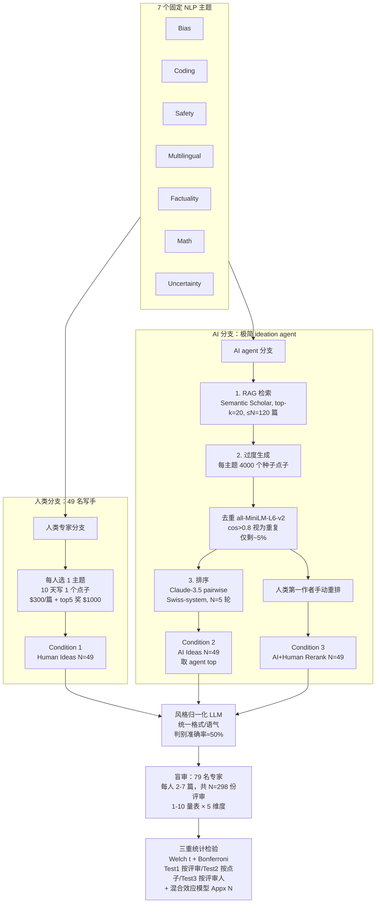

# 组会汇报 · Can LLMs Generate Novel Research Ideas?（Si et al., 2024）

> 主讲提示：这篇是整条 auto-research 课里**最「实验科学」**的一篇——它几乎不造系统、不堆 trick，而是把「AI 能不能想出好点子」做成一个**人类对照实验 (human RCT-style study)**。读它是为了学**怎么把一个主观到极点的问题（点子新不新），做成统计上站得住的结论**。
>
> 一句话定位：它是 2408.06292 (AI Scientist) 把「ideation」当作流水线一环、却**从不独立验证**的那条线的「打假与正名」——既正名（AI 真的更新颖），又打假（AI 不能自评、缺多样性）。同时它是 2506.20803 ideation-execution-gap 的**直接前作**（论文结尾就预告了 execution study）。

---

## 1. 封面 · TL;DR

- **作者/出处**：Chenglei Si, Diyi Yang, Tatsunori Hashimoto（Stanford University），arXiv 2409.04109 v1，2024-09-06。代码与全部人类评分公开（原文脚注 1：`github.com/NoviScl/AI-Researcher`），并开放了一个 end-to-end execution 后续研究的报名入口（`tinyurl.com/execution-study`）。
- **一段话**：作者招募 **100+ 名高资质 NLP 研究者**，分两组任务——**49 人写点子**、**79 人盲审点子**——在**七个统一的 NLP 主题**（Bias / Coding / Safety / Multilingual / Factuality / Math / Uncertainty）上，对比三种来源的研究点子：① 人类专家写的 (`Human Ideas`)；② 一个极简 LLM ideation agent 生成、由 agent 自己排序选出的 (`AI Ideas`)；③ 同一 agent 生成、但由**人类专家重排**选出的 (`AI Ideas + Human Rerank`)。通过近 **300 份盲审**，在三种不同统计检验下都得到同一个结论：**AI 点子在「新颖性 (novelty)」上显著高于人类专家（p<0.05），其它指标基本持平，而可行性 (feasibility) 有「略低」的趋势但样本量不足以下定论**。
- **三条带走的结论**：
  1. **首个统计显著的正面证据**：在严格控制混淆（主题分布、写作风格、盲审、多重检验校正）下，AI ideation 在新颖性上**真的赢了专家**——这是该领域第一个「大样本 + 统计显著」的结论（原文 Abstract、§5）。
  2. **代价藏在 feasibility 与 diversity**：novelty 高的同时，feasibility 出现一致的负向趋势（虽未达显著）；更关键的是 agent **缺乏多样性**——生成 4000 个点子，去重后只剩约 **200 个**非重复点子（原文 §7.1, Fig.4），「靠多生成+重排来 scale」这条路有天花板。
  3. **LLM 不能当评委**：所有 LLM 评估器（含作者自己的 Claude-3.5 pairwise ranker、以及「AI Scientist」式评审）与专家评分的一致性都**低于人类之间**的一致性（原文 §7.2, Table 11）——直接动摇了「LLM-as-a-judge」在 ideation 上的可信度。

> 主讲提示：开场就把「AI 更新颖（正名）」与「不能自评、缺多样、可行性存疑（打假）」两面一起抛出。这篇的价值不在某个结论，而在**它把结论建立在多么硬的实验设计上**——这正是组会要学的东西。

---

## 2. 问题与动机（why —— 本篇最该讲透的一节）

**领域缺口：所有人都在造 ideation agent，却没人做过「人 vs AI」的大样本对照。** 近两年涌现大量「研究 agent」工作（原文 §1 引 Baek 2024 / Li 2024 / Lu 2024 / Wang 2024 / Yang 2024 等），它们都宣称能「自动生成并验证新点子」。但作者一针见血地指出（原文 Abstract）：**没有任何一项评估，真正证明过 LLM 系统能完成科研的「第一步」——产出新颖的、专家级的点子**，更别说走完整个研究流程。换句话说，整个方向的地基（「AI 到底能不能想出好点子」）从未被严格夯实过。

**为什么以前没人做？因为这个实验太难了。** 作者列出三重困难（原文 §1）：
1. **合格专家难以规模化招募**——你需要的不是众包工人，而是真正在顶会发过论文的 NLP 研究者；
2. **评价标准极其主观**——「一个点子好不好」连最好的专家都难判断（原文引 Beygelzimer 2021, Simsek 2024）；
3. **research ideation 把上述主观性推到极端**——它比「评审一篇已完成的论文」还主观，因为没有实验结果可依凭。

**别人怎么「绕过去」的，以及为什么不够。** 现有方法学文章（methods-centric）为了可操作，普遍采取**廉价替代 (low-cost surrogate)**（原文 §1 倒数第二段）：
- 减少评审人数（评审越少越不可靠）；
- 限制点子的长度与细节度（Wang 2024, Yang 2024）；
- 干脆用 **LLM-as-a-judge** 当评委（Lu 2024）。

这些都**回避了「大样本人类对照」**这件最贵但最关键的事。

**本篇的赌注（核心动机）**：作者选择走「**相反**」的路——做一个**一年期、高成本**的评估实验（evaluation-centric，而非 methods-centric），用**真人专家基线 + 标准化评测协议**，为后续所有方法学研究提供一块**可靠的地基**。一句话：

> **不是再造一个更花哨的 ideation agent，而是先回答「现在的 LLM 到底能不能想出比专家更新颖的点子」这个最底层的问题——并把答案建立在统计上不可辩驳的实验设计之上。**

**为什么 ideation 这一步值得单独拎出来做？** 因为它是**整个自动科研流程的「试金石 (litmus test)」**（原文 §1）：ideation 是科研的第一步，如果连「想出好点子」都做不到，那「autonomous research agent」就是空中楼阁。反过来，如果 AI 在这一步就能赢专家，那才真正值得去投入下游的执行、验证。

> 主讲提示：这一节是 why 的核心。务必讲清三层：① 缺口（没人做过大样本人 vs AI）；② 为什么没人做（招专家难、太主观）；③ 本篇的取舍（贵但硬的 evaluation-centric 路线 + ideation 作为试金石）。把这三点讲透，后面 how 全是为了「让这个对照站得住」。

---

## 3. 研究问题 / 核心 intention（形式化成一句话 + 假设）

把要回答的问题压成一句：

> **在严格控制混淆变量（研究主题、写作格式与风格、评审过程）的前提下，当前最好的 LLM ideation agent 生成的研究点子，在专家盲审下，其新颖性/兴奋度/可行性/有效性/总体评分，是否与专家亲自写的点子有统计显著差异？**

它把「research ideation 评估」**拆成三个可分别控制的部分**（原文 §2）：

1. **点子本身 (the idea)**——由 LLM 或人按统一指令生成；
2. **点子的写作 (the writeup)**——把点子表达出来的文字（这是个隐藏混淆，见 §5）；
3. **对写作的评审 (the evaluation)**——由专家盲审打分。

隐含的**假设 / 前提**：
- (a) 把研究范围**收窄到「prompting-based NLP research」**（原文 §2），可以让点子「可被专家在后续实验中执行」，同时算力门槛低；这是为了下游 execution study 服务的刻意取舍。
- (b) **格式 + 风格归一化**能消除「人写得更详细/更口语」这类与点子质量无关的信号，从而让评审只针对「点子内容」。
- (c) **过度生成 + 重排 (over-generate and rerank)** 是当前 LLM ideation 的最强范式——多生成候选、再用 ranker 捞出「金子」（原文 §3.2，灵感来自 inference-time scaling，Brown 2024 / Li 2022）。本篇要检验这个假设到底成不成立（剧透：§7 给出它的天花板）。

> 主讲提示：强调作者把问题**结构化成 idea / writeup / evaluation 三层**——这是全篇实验设计的骨架。后面每一个「控制」都对应着堵住这三层里的某个混淆漏洞。

---

## 4. 相关工作定位（站在谁肩上、和谁不同）

| 方向 | 代表工作（原文 §1/§9 引用） | 与本篇的关系 |
|------|------|------------|
| 造 ideation agent（方法学） | Baek 2024, Li 2024, Lu 2024, Wang 2024, Yang 2024 | **本篇的对照对象**：它们只跟「vanilla prompting」比，**从不跟人类专家比**；本篇补上这块缺失的基线 |
| LLM 执行实验 / 实现点子 | Huang 2024, Tian 2024（执行）；Li 2024, Lu 2024（idea→code） | 用预定义任务集 / proxy 指标，**问题空间受限**；本篇专注更开放的 ideation 这一上游 |
| LLM-as-a-judge 评审 | Lu 2024（含「AI Scientist」评审器） | 本篇**直接打假**：§7.2 证明 LLM 评委一致性低于人类 |
| 其它研究辅助任务 | 自动综述、related work 整理、未来工作推荐、实验结果预测（Zhang 2024 等一长串） | 都是「辅助」而非「创造」；本篇做更难的**创造性 ideation** |
| 计算创造力（AI 创意 vs 人） | Chakrabarty 2024（AI 写作不如专业作家）；Anderson 2024 / Zhou 2024（LLM 缺集体多样性） | **本篇结论与之对话**：在 ideation 上 AI 反而**更**新颖（与「AI 写作更差」相反），但**多样性确实差**（与之一致） |
| **本篇** | Si, Yang, Hashimoto 2024 | **首个大规模、控混淆、人类专家盲审的「人 vs AI ideation」对照实验** |

> 主讲提示：一句话概括——「别人都在比 AI agent 之间谁强，本篇第一个把 AI 拉去跟**真人专家**打擂台，而且是大样本、双盲、统计校正的擂台」。它在版图里的独特性就是这个「**人类对照基线**」。

---

## 5. 方法总览（big picture：实验设计一图流，先直觉后数学）

这篇的「方法」不是模型架构，而是**实验流程**。整体是「**三条件 × 统一主题 × 盲审 × 三重统计检验**」：

**直觉**：把它想成一场**严格的盲品实验**。要让「AI 的酒 vs 专家的酒」这场品鉴公平，必须堵住所有「非酒本身」的差异：① **主题对齐**（都在同 7 个主题）；② **倒进同样的杯子**（格式模板 + LLM 风格归一化，让评审看不出谁写的）；③ **盲品**（评审不知来源）；④ **多名品鉴师 + 统计校正**（防单人偏好、防多重比较假阳）。AI 分支内部的「4000 选少数」则是「为了出一瓶好酒，先酿一大缸再挑」。

> 主讲提示：这张图就是全篇。讲的时候沿着两条分支走：人类分支强调「招募 + 激励 + 质控」，AI 分支强调「RAG → 过度生成 → 去重 → 排序」三件套，最后两条汇到「风格归一化 → 盲审 → 三重检验」。**每一个方框都是在堵一个混淆漏洞**。

---

## 6. 符号与术语表（后文统一用）

| 记号 / 术语 | 含义 |
|------------|------|
| `Human Ideas` | 条件 1：招募的专家研究者亲手写的点子提案（原文 §2，N=49 个点子） |
| `AI Ideas` | 条件 2：LLM agent 生成、并由 **agent 自己的 ranker** 选出 top 的点子（N=49） |
| `AI Ideas + Human Rerank` | 条件 3：同一 agent 生成、但由**人类第一作者手动**挑出 top 的点子，用以估计「AI 点子的上界质量」（N=49） |
| novelty / excitement / feasibility / effectiveness / overall | 评审的五个打分维度：新颖性 / 兴奋度 / 可行性 / 预期有效性 / 总体；各为 **1–10** 整数量表（原文 §2 Review and Evaluation, Appendix E） |
| $\mu,\ \sigma,\ \text{SE}$ | 某条件某指标的样本**均值 / 标准差 / 标准误**（原文 Table 7/8） |
| $N$（语境相关） | 检索停止上限 $N{=}120$ 篇 / 排序轮数 $N{=}5$ / 各条件样本量（评审数或点子数或评审人数） |
| $k$ | RAG 中每次调用保留的 top-$k{=}20$ 篇；点子生成时随机选 $k{=}10$ 篇做增强；demo 示例数 $k{=}6$ |
| Welch's t-test | **不等方差 t 检验**：两组比较时不假设方差相等（比 Student t 更稳健，原文全程用它，双尾） |
| Bonferroni 校正 | **多重比较校正**：做 $m$ 次检验时，把显著性阈值从 $\alpha$ 收紧到 $\alpha/m$，压制假阳性 |
| 混合效应模型 (linear mixed-effects model, LMM) | 同时建模「固定效应（条件）」与「随机效应（评审人、点子的个体差异）」的回归（原文 Appendix N，用以补充三重检验） |
| RAG (retrieval-augmented generation) | 检索增强生成：生成前先检索相关文献喂进 prompt，使点子「知道」已有工作 |
| Swiss-system tournament | 瑞士轮赛制：把分数相近的提案配对 PK，胜者 +1 分，重复 $N$ 轮得排名（原文 §3.3） |
| `all-MiniLM-L6-v2` | Sentence-Transformers 的句向量模型，用于算点子间余弦相似度做去重（原文 §3.2） |

---

## 7. 方法细节 ① 极简 ideation agent：为什么「故意做得简单」

> 主讲提示：这一节回答「AI 那一方是怎么产点子的」。核心 why 是**刻意极简 (minimalist)**——作者反复说「不创新 agent 本身，只想测当前 LLM 的 ideation 能力」（原文 §3 开篇）。如果用一个花哨 agent 赢了，你分不清是「LLM 强」还是「agent 工程强」。极简化是为了让结论**归因清晰**。

agent 有三个组件（原文 §3）：**论文检索 (RAG) → 点子生成 → 点子排序**。逐个讲它的 why。

### 7.1 论文检索（RAG）：为什么要先读文献

**why**：要判断一个点子「新不新」，agent 必须先知道「已有什么」。不给它文献，它生成的「新点子」可能只是它没读过、其实早有人做的旧点子。

**how**（原文 §3.1）：给定主题，prompt 一个 LLM（backbone 用 `claude-3-5-sonnet-20240620`）生成一串对 Semantic Scholar API 的函数调用，动作空间为：
$$\{\ \texttt{KeywordQuery(keywords)},\ \ \texttt{PaperQuery(paperId)},\ \ \texttt{GetReferences(paperId)}\ \}$$
每次调用保留 top-$k{=}20$ 篇，累计到上限 $N{=}120$ 篇停止；再让 LLM 按三条标准（与主题直接相关 / 是带计算实验的实证论文 / 有趣能启发新项目）给每篇 1–10 打分，取高分论文进入下一步。

> 读出什么：这是一个**带停止条件的检索循环**——动作以「先前动作与执行结果」为条件，所以能「顺藤摸瓜」（查到一篇 → 再查它的引用）。

### 7.2 点子生成：为什么「过度生成 4000 个」

**why（核心 intention）**：作者的关键直觉是——**只有极小一部分生成的点子是高质量的，所以应当愿意花 inference-time 算力多生成候选，再用 ranker 捞「鱼龙混杂中的钻石 (diamond in the rough)」**（原文 §3.2）。这呼应 inference-time scaling 的研究（重复采样能提升 LLM 在 coding/reasoning 上的表现，Brown 2024, Li 2022）。

**how**：每个主题 prompt LLM 生成 **4000 个种子点子**；prompt 里塞入 $k{=}6$ 个人工总结的范例 + RAG 检索到的论文（随机选 top-ranked 中的 $k{=}10$ 篇拼接标题+摘要），并把**已生成点子的标题**也附进 prompt，显式要求「别重复」。

**关键现象（埋下 §15 批判）**：尽管显式要求不重复，**去重后只剩约 5%**。去重做法：用 `all-MiniLM-L6-v2` 编码所有种子点子，算两两余弦相似度，**阈值 0.8** 以上视为重复（原文 §3.2，阈值依人工检查设定）。这条「过度生成其实在大量自我重复」的事实，是后面 §13「多样性天花板」的根。

> 直觉：「多生成 = 更高质量」的假设，只有在「新生成的点子真的不一样」时才成立。一旦模型开始原地打转，再多算力也只是复读机。

### 7.3 点子排序：为什么用 pairwise 而非直接打分

**why**：要从去重后的池子里选出最好的，需要一个 ranker。作者发现（原文 §3.3）：**让 LLM 直接预测一篇论文的最终分数/接收与否，校准很差；但让它做「两两比较谁更好」，却能达到 non-trivial 的准确率**。这是「相对判断比绝对判断容易」的经典现象。

**how**：用 1200 篇 ICLR 2024（关键词过滤出 LLM 相关）投稿 + 其评审分/接收结果当代理数据，把投稿转成统一提案格式，随机配对「接收 vs 拒稿」让 LLM 判断谁会被接收。结果：

| Ranker | 配对判断准确率（原文 §3.3） |
|------|------|
| **Claude-3.5-Sonnet (zero-shot)** | **71.4%**（最高，few-shot/CoT 无显著提升 → 选它） |
| Claude-3-Opus | 63.5% |
| GPT-4o | 61.1% |

排序机制用 **Swiss-system 瑞士轮**（原文 §3.3）：分数相近的提案配对 PK，被判更好者 +1 分，重复 $N$ 轮，使每个提案总分落在 $[0,N]$。作者在验证集上选 $N{=}5$（给出最佳排序）。Sanity check：用该 ranker 对 1.2K ICLR 投稿排序，top-10 与 bottom-10 的平均评审分**明显分开**（原文 Table 1，$N{=}5$ 时 top-10=6.42 vs bottom-10=4.69，gap=1.73），证明 ranker 有效。

**为什么还要「人类重排」条件**：因为 agent 自己的 ranker «远非完美»（原文 §3.3）。所以作者额外让第一作者**手动**从所有生成中挑 top，构成 `AI Ideas + Human Rerank`，用来估计「**AI 点子的上界**」（去掉 ranker 的瓶颈，看 AI 生成内容本身的最好水平能到哪）。值得注意（原文 Table 12 / §3.3 末）：人工重排选出的 49 个里只有 **17 个**与 agent 自排序重叠，**32 个不同**——说明 LLM ranker 与人类判断**分歧很大**。

> 主讲提示：三条件的设计极其精巧。`AI Ideas` 测「**端到端 agent**（含它自己的烂 ranker）」；`AI + Rerank` 测「**AI 生成内容的上界**（换人来挑）」。两者之差 = ranker 拖了多少后腿。这是「把混淆拆开测」的范例。

---

## 8. 方法细节 ② 人类专家分支：招募、激励与质控（why 每一步都为「基线可信」服务）

> 主讲提示：这一节是「setting 写全」的样板，也是这篇最贵的部分（一年期、真金白银）。每个数字都要能说出「为什么这么设」。

**why**：整个研究的结论强度，取决于「人类基线」是否**真·专家**且**真·尽力**。如果人类基线是水货，那「AI 赢了」就毫无意义。所以招募、激励、质控三件事都在为「基线可信」服务。

**招募（原文 §4.1）**：通过 OpenNLP Slack（1426 名来自 71 个机构的 NLP 研究者）、Twitter/X、各 NLP 群、NAACL 2024 会议现场（发名片、穿印二维码的 T 恤）等渠道招募。**筛选门槛**：必须在主流 AI 会议（*ACL / NeurIPS / ICLR / ICML / AAAI）至少发表过 **1 篇**论文（用 Google Scholar 主页核验）。研究经 Stanford IRB 批准（ID 74246）。

**最终规模（原文 §4.1）**：
- **写点子：$N=49$ 名专家**；
- **审点子：$N=79$ 名专家**（其中 24 人也参与了写作，但**保证没人审自己的点子**）；
- **去重后总参与者 $N=104$**；
- 每位写手 **10 天**写 1 个点子，报酬 **$300/篇**，前 5 名（由评审打分）额外 **$1000** 奖金；
- 每位评审分到 **2–7 个**点子，共收集 **$N=298$ 份**独立评审，1 周完成，**$25/份**。

**参与者有多强（原文 Table 2）**：

| 指标 | 写手 (N=49) 均值/中位 | 评审 (N=79) 均值/中位 |
|------|------|------|
| 论文数 | 12 / 10 | 15 / 13 |
| 引用数 | 477 / 125 | 635 / 327 |
| h-index | 5 / 4 | 7 / 7 |
| i10-index | 5 / 4 | 7 / 5 |

写手来自 26 个机构、评审来自 32 个机构，多为在读博士/博后（原文 Fig.3）；79 名评审中 **72 人**此前为主流 AI 会议/期刊审过稿（原文 §4.2）——基线确实是**真专家**。

**点子写作的质控（原文 §4.3, Table 3）**：写手对所选主题熟悉度 3.7/5、难度 3.0/5、平均花 **5.5 小时**、点子平均 **901.7 词**。这些数字是用来论证「专家确实认真对待了任务」。主题分布（原文 Table 4）：Factuality 11、Multilingual 10、Coding 9、Uncertainty 6、Safety 5、Bias 4、Math 4，共 49。

**评审分配的质控（原文 §4.4）**：让评审选 top-2 偏好主题 + 偏好审稿量；随机分配但**平衡每位评审拿到的各条件点子数**，且保证每人至少 1 个人类点子 + 1 个 AI 点子；每个点子被 **2–4 名**不同评审审；**不让评审审同机构作者的点子**（防污染）。评审质量（原文 Table 6）：熟悉度 3.7/5、信心 3.7/5、平均花 **32 分钟**/篇、评审平均 232 词——与 1.2K ICLR 2024 评审（信心同为 3.7）相当；298 份评审中有 **80 份**在理由里给出了「证明点子不新」的现有论文链接（原文 §4.4 末），进一步佐证评审质量。

> 主讲提示：把「24 人同时写又审、但绝不审自己」「同机构不互审」「每个点子 2-4 审」这几条单独点出——它们都是**堵特定混淆**的设计。还要点出 §6.1 的诚实自陈：**写手承认提交的只是其「过去点子里 top 43%」**（37/49 是当场想的，平均自评「约 top 43%」），即人类基线大概是「中位水平」，这对解读「AI 赢」很重要。

---

## 9. 方法细节 ③ 堵混淆的三道闸门：主题对齐 / 格式模板 / 风格归一化

> 主讲提示：这是全篇**实验设计的灵魂**——如何让「AI vs 人」的比较只反映「点子内容」，而不反映「主题偏好 / 写作详略 / 文风」。逐条讲 why。

**闸门 1：主题对齐（消除「选题偏好」混淆，原文 §2 Ideation Scope）**
- **why（不做会怎样）**：如果只让「AI 和人各自挑 prompting 主题」，可能 AI 天生爱提「更安全」的主题、人爱提「更刺激」的主题——那评审打分的差异就**混入了「主题偏好」而非「点子质量」**，最终只是测了「人和 AI 选题口味不同」。
- **how**：固定 **7 个**从近期 NLP 顶会 CFP（如 COLM）抽取的具体主题（Bias/Coding/Safety/Multilingual/Factuality/Math/Uncertainty）。人类写手可在 7 个里**选**自己擅长的；然后**为每个被选主题生成一个对应的 AI 点子**，从而**精确匹配人和 AI 的主题分布**，同时尊重专家的领域专长。

**闸门 2：格式模板（消除「详略/结构」混淆，原文 §2 Idea Writeup）**
- **why（不做会怎样）**：人类研究者会用一些「暗示高质量」的写法——举更多例子、写更多实现细节。这些与点子本身无关，却会抬高评分。
- **how**：借鉴 grant submission 指南，设计统一模板，规定字段：**标题 / 问题陈述 / 动机 / 提出的方法 / 分步实验计划 / 测试用例示例 / 后备计划 (fallback plan)**。人和 AI 都按此模板产出（模板见原文 Appendix B，demo 见 Appendix C）。

**闸门 3：风格归一化（消除「文风/语气」混淆，原文 §2 Idea Writeup）**
- **why（不做会怎样）**：即便用了模板，仍有细微文风线索（人倾向更生动、口语）。评审一旦能「猜出是人还是 AI 写的」，盲审就破功了。
- **how**：开发一个 LLM **风格归一化模块 (style normalization)**，把所有点子转成**同一种写作与排版风格**，但不改内容。
- **验证它有效**：小规模人类研究显示，归一化后，专家评委区分「AI vs 人」的准确率仅 **≈50%**（即跟瞎猜一样，原文 §2）——证明文风线索被抹掉了。
- **验证它没篡改内容**：第一作者**逐篇人工核对**所有人类点子，确认原始内容都被保留（原文 §2）。归一化 prompt 见原文 Appendix D。

> 主讲提示：这三道闸门 + 盲审 + 统计校正，构成这篇「能下统计结论」的全部底气。组会上如果有人质疑「AI 赢是不是因为 XXX 混淆」，答案多半已经被某道闸门堵了——这正是它比所有前作都硬的地方。

---

## 10. 评审量表与统计检验：把「指标」与「检验」定义清楚

> 主讲提示：本节是「metrics + 统计检验给定义」的硬要求落点。组会最容易被问「这些 p 值到底怎么算的、为什么可信」，这里逐个交代。

### 10.1 评审量表（原文 §2, Appendix E）

评审表遵循 ICLR/ACL 最佳实践，除 overall 外定义 4 个分解维度，**每维 1–10 整数 + 一段自由文本理由**，且为每个分数档位给出明确定义以校准标准：

- **novelty（新颖性）**：点子相对已有工作的新颖程度；
- **excitement（兴奋度）**：点子多令人兴奋 / 是否可能有影响力；
- **feasibility（可行性）**：在合理资源/时间内能否执行；
- **effectiveness（预期有效性）**：方法预期能否奏效（比 baseline 好）；
- **overall（总体）**：综合评分。

### 10.2 三重统计检验：为什么要做三次

**why（核心）**：同一批数据有**三种「什么算一个独立样本」的合理定义**，每种都对应一个潜在混淆。作者**三种都做**，只有当结论在三种定义下都成立，才敢说它稳健（原文 §5）。基础检验统计量都是**双尾 Welch's t-test**（不假设等方差），并都做 **Bonferroni 校正**（压制多重比较假阳）。

直觉与符号（先定义，后给检验）：设两条件的样本均值为 $\bar{x}_1,\bar{x}_2$，样本方差 $s_1^2,s_2^2$，样本量 $n_1,n_2$。Welch t 统计量为：

$$ t \;=\; \frac{\bar{x}_1-\bar{x}_2}{\sqrt{\dfrac{s_1^2}{n_1}+\dfrac{s_2^2}{n_2}}} $$

读出什么：分子是两组均值差，分母是「差的标准误」（**各组自带方差、不强行合并**，这正是 Welch 比 Student 稳健之处——两条件样本量/方差不等时仍可靠）。$|t|$ 越大、对应 $p$ 越小，越说明「均值差不是偶然」。Bonferroni：做 $m$ 次比较时，把判显著的阈值由 $\alpha$ 收紧为 $\alpha/m$（等价于把 $p$ 乘 $m$ 再跟 $\alpha$ 比）。

三种检验的「独立样本」定义：

| 检验 | 一个数据点 = | 样本量/条件 | 堵的混淆 | 出处 |
|------|------|------|------|------|
| **Test 1** | 每一份评审 | 119（Human）/ 109（AI 两条件） | 最朴素，数据点最多、功效最高 | 原文 §5.1, Table 7 |
| **Test 2** | 每一个点子（把该点子多份评审**取平均**） | 49 | 堵「同一点子的多份评审不该算独立」 | 原文 §5.2, Table 8 |
| **Test 3** | 每一位评审人（算其在各条件的均分差） | 70 / 65（一样本 t 检验差值是否 >0） | 堵「不同评审人宽严不一」的评审人偏置 | 原文 §5.3, Table 9 |

> 主讲提示：把「为什么要做三次」讲成一个故事——「**你可能质疑我把评审当独立样本不对（Test1）→ 那我按点子聚合（Test2）→ 你又说评审人有宽严偏置 → 那我按评审人算差值（Test3）**」。三关都过，才叫稳健。此外原文 Appendix N 还补了**线性混合效应模型**，把「评审人、点子」当随机效应，结论一致——这是第四重保险。

---

## 11. 主要结果：AI 点子更新颖（数字 + 解读，别只贴表）

> 主讲提示：这是全篇的「主结果幻灯片」。核心一句话：**novelty 在三种检验下都显著赢，feasibility 一致地略低（但不显著）**。

### 11.1 Test 1（按评审，原文 Table 7，量表 1–10）

| 指标 | Human (n=119) | AI (n=109) | AI+Rerank (n=109) | 显著性（vs Human, Bonferroni） |
|------|------|------|------|------|
| **Novelty** | 4.84 (σ=1.79) | **5.64** (σ=1.76) | **5.81** (σ=1.66) | AI **p=0.00**（\*\*p<0.01）；Rerank **p=0.00**（\*\*\*p<0.001） |
| **Excitement** | 4.55 (σ=1.89) | **5.19** (σ=1.73) | **5.46** (σ=1.82) | AI **p=0.04**（\*）；Rerank **p=0.00**（\*\*） |
| **Feasibility** | **6.61** (σ=1.99) | 6.34 (σ=1.88) | 6.44 (σ=1.63) | 均 p=1.00（**不显著，但 AI 数值更低**） |
| **Effectiveness** | 5.13 (σ=1.76) | 5.47 (σ=1.58) | 5.55 (σ=1.52) | p=0.67 / 0.29（不显著） |
| **Overall** | 4.68 (σ=1.90) | 4.85 (σ=1.70) | **5.34** (σ=1.79) | AI p=1.00；Rerank **p=0.04**（\*） |

**读出什么**：
- **novelty 是最硬的赢点**：AI 两条件都显著高于人类，且 `AI+Rerank` 达到 p<0.001。这是 abstract 里「more novel (p<0.05)」的来源。
- **excitement 同向**：AI 也显著更令人兴奋——与 novelty 高度相关（见 §13 的 r=0.854）。
- **feasibility 是唯一「人类略胜」的维度**：Human=6.61 > AI=6.34/6.44。虽未达显著（p=1.00），但**方向一致**——这正是「novelty 高、feasibility 略低」的核心张力，也是 ideation-execution-gap 的种子。
- **`AI+Rerank` 全面 ≥ `AI`**：换人来挑点子，每个指标都不降反升，overall 甚至从 4.85→5.34 变显著。说明 **agent 自己的 ranker 拖了后腿**（呼应 §7.3 的 17/49 重叠）。

### 11.2 Test 2（按点子，原文 Table 8，N=49/条件）

| 指标 | Human | AI | AI+Rerank | 显著性 |
|------|------|------|------|------|
| Novelty | 4.86 (σ=1.26) | **5.62** (σ=1.39) | **5.78** (σ=1.07) | AI **p=0.03**（\*）；Rerank **p=0.00**（\*\*） |
| Excitement | 4.56 | 5.18 | **5.45** | AI p=0.08（**临界，不显著**）；Rerank **p=0.00** |
| Feasibility | **6.53** | 6.30 | 6.41 | 均 p=1.00 |
| Effectiveness | 5.10 | 5.48 | 5.57 | 不显著 |
| Overall | 4.69 | 4.83 | 5.32 | 均不显著（Rerank p=0.06 临界） |

**读出什么**：聚合到点子层面后样本量降到 49、功效下降，但 **novelty 仍显著**（AI p=0.03、Rerank p=0.00）。注意 excitement 在 Test2 退到 p=0.08（不再显著）——说明 excitement 的优势没 novelty 那么稳。

### 11.3 Test 3（按评审人，原文 Table 9，一样本 t 检验：均分差是否>0）

| 指标 | AI − Human（N=70） | AI+Rerank − Human（N=65） |
|------|------|------|
| **Novelty** | **+0.94, p=0.00**（\*\*） | **+0.86, p=0.00**（\*\*） |
| **Excitement** | **+0.73, p=0.01**（\*） | **+0.87, p=0.00**（\*\*） |
| Feasibility | **−0.29**, p=0.36 | **−0.08**, p=0.74 |
| Effectiveness | +0.42, p=0.16 | +0.39, p=0.16 |
| Overall | +0.24, p=0.36 | **+0.66, p=0.01**（\*） |

**读出什么**：控制评审人偏置后，**novelty 与 excitement 依然显著为正**（AI 比 Human 高约 +0.9 / +0.7 分）；**feasibility 的差是负的**（−0.29 / −0.08）但不显著。三种检验**一致指向同一结论**：

> **AI ideation agent 生成的点子，被专家盲审评为比专家亲手写的点子更新颖（且更令人兴奋），其它维度基本持平——这是该领域第一个统计显著的此类结论。** 原文 §5 末并注明 Appendix N 的混合效应模型**强化**了这一结论。

> 主讲提示：把「三检验 + 混合效应模型 = 四重一致」当作主结果的护城河来讲。同时务必把 **feasibility 一致为负但不显著**（作者原话 abstract：「may come at the slight expense of feasibility, but our study size did not have sufficient power to conclusively identify these effects」）单独点出——这是连接 2506.20803 的关键。

---

## 12. 深入分析①：这个「AI 赢」要打几个折扣（原文 §6）

> 主讲提示：作者非常诚实，主结果后立刻自我设限。这一节讲「赢得有多干净」。

**(a) 人类可能没拿出最好的点子（原文 §6.1）**。post-study 调查显示：49 名写手中 **37 人是当场（on the spot）想的**点子，仅 12 人用了早有的点子；问「这点子相比你做过的研究，处在你过去点子的百分位？」，平均答**约 top 43%**。结论：**收上来的人类点子大概是这些专家的「中位水平」**——这合理（10 天约束下），但意味着「AI 赢的是专家的中等点子，不是其巅峰点子」。这是解读主结果时必须打的折扣。

**(b) 评审更看重 novelty/excitement（原文 §6.2, Table 10 相关矩阵）**。指标两两相关：

| | overall | novelty | excitement | feasibility | effectiveness |
|---|---|---|---|---|---|
| **overall** | – | **0.725** | **0.854** | 0.097 | 0.642 |
| novelty | 0.725 | – | 0.719 | −0.073 | 0.357 |
| feasibility | 0.097 | −0.073 | −0.031 | – | 0.251 |

**读出什么**：overall 与 **excitement（r=0.854）、novelty（r=0.725）强相关**，但与 **feasibility 几乎无关（r=0.097）**，feasibility 与 novelty 甚至**轻微负相关（r=−0.073）**。含义：**评审打总分时主要被「新不新、兴不兴奋」牵着走，几乎不看可行性**——这既解释了「为何 novelty 高就 overall 高」，也埋了批判线：**评审本身可能系统性地低估了可行性的重要性**，从而高估了「华而不实」的 AI 点子。

**(c) 评审本身就很主观（原文 §6.3, Table 11 首块）**。随机把每篇的评审人对半分，用一半排 top/bottom-25%，看与另一半的一致性（平衡准确率）：**本研究评审人一致性仅 56.1%**。作为参照：NeurIPS 2021 一致性实验为 **66.0%**，1.2K ICLR 2024（LLM 相关）为 **71.9%**，随机为 50%。即「**审点子比审论文更主观**」（没有实验结果可依凭），一致性虽高于随机但低于会议审稿。

> 主讲提示：这三条折扣要连起来讲：人类给的是中位点子（折扣 a）+ 评审重 novelty 轻 feasibility（折扣 b）+ 评审本身主观（折扣 c）。它们**不推翻**主结论（novelty 真高），但提醒「别把它读成 AI 全面碾压专家」。

---

## 13. 深入分析②：LLM 的两个硬伤——缺多样性、不能当评委（原文 §7）

> 主讲提示：这一节是这篇对「靠 LLM scale ideation」与「LLM-as-a-judge」两条路线的**正面打假**，也是它与 AI Scientist 那条线最直接的对话。

### 13.1 多样性天花板：过度生成的假设破产（原文 §7.1, Fig.4）

**why 重要**：整个 agent 的灵魂是「过度生成 + 重排」（§7.2），其底层假设是「**生成越多，越能捞到好点子**」。如果生成到后面全在自我重复，这条 inference-time scaling 之路就有**硬上限**。

**实测**：对每主题 4000 个种子点子，用 `all-MiniLM-L6-v2` 算与之前所有点子的余弦相似度，>0.8 视为重复。Fig.4 显示：
- **每个新批次里「非重复点子」的占比持续下降**（左图，从一开始约 50%+ 一路掉到个位数）；
- **累计非重复点子数最终饱和**——4000 个里**只有约 200 个**是非重复的（右图趋于平台）。

**读出什么**：

> **「多生成就能 scale」是错的——LLM 在 ideation 上很快开始原地打转，本研究里去重后只剩约 200 个独特点子。** 这给 over-generate-and-rank 范式设了一个**多样性瓶颈**（原文 §7.1 原话：increasing the number of generated ideas simply leads to repeating duplicate ideas）。

### 13.2 LLM 不能可靠评估点子（原文 §7.2, Table 11 第二块）

**why 重要**：前作（尤其 AI Scientist, Lu 2024）大量使用 LLM-as-a-judge，理由是「LLM 与人类的一致性可能高于人类之间」。作者直接检验这个说法在 ideation 上是否成立。

**实测**：用每个点子的平均评审分排出 top/bottom-25% 当 ground truth，把中位数当阈值，测各 LLM 评估器的平衡准确率：

| 评估器 | 与专家标注的一致性（%） |
|------|------|
| 人类评审之间（参照，本研究） | **56.1** |
| GPT-4o Direct（直接打分） | 50.0（=随机） |
| GPT-4o Pairwise | 45.0 |
| Claude-3.5 Direct | 51.7 |
| **Claude-3.5 Pairwise（作者自己的 ranker，最强）** | **53.3** |
| 「AI Scientist」式评审器（Lu 2024） | **43.3**（最差） |

**读出什么**：

> **所有 LLM 评估器的一致性都低于专家之间的一致性（56.1%）——连作者自己最好的 Claude-3.5 pairwise ranker 也只有 53.3%。** 即便将来 AI-人一致性追平人-人，也不代表 LLM 评委可信，因为**它可能靠「虚假相关 (spurious correlation)」刷一致性，是用偏差换方差**（原文 §7.2 引 Durmus 2022 的 brittleness 担忧）。「AI Scientist」评审器更是垫底（43.3%）——这条线直接戳穿了「LLM 自评闭环」的可信度。

> 主讲提示：把这两条硬伤与本库主线接起来：**§13.1（缺多样性）** 解释了为什么「无脑 scale 生成」不灵；**§13.2（不能自评）** 解释了为什么 AI Scientist 那种「自己生成、自己评审、自己存档」的闭环**结论不可尽信**——独立的人类评审才是金标准。

---

## 14. 质性分析：AI 点子为什么「看着新但做着虚」（原文 §8）

> 主讲提示：这一节把冷冰冰的统计落到具体文本上，是理解「novelty↑ / feasibility↓」机制的关键。

作者用 Claude-3.5 对所有自由文本评审做聚类，再人工核验。**支持「AI 更新颖」的评审原话**很多（原文 §8.1）：如「这个 idea 在 in-context learning 场景下相当新颖」「用 LLM 迭代去探索……是新的」「构造 prompt 改进跨语种迁移的这个想法我没听过」。

但 AI 点子的**七类典型失败模式**（原文 §8.1，全部来自评审原话）极具教学价值：

1. **实现细节太含糊 (too vague on implementation)**：「不清楚这个 lattice 的细节、模型怎么被 prompt，所以不确定它能否完成子任务」「只给了一个很 ad-hoc、hand-wavy 的建议」。
2. **数据集用错 (misuse of datasets)**：「StereoSet 不是 QA 数据集……为什么 Dialogue NLI 的回答需要 empathy？」「选 TruthfulQA/ScienceQA 来体现多视角不合适，它们其实是单一正确答案」。
3. **baseline 缺失或不当 (missing/inappropriate baselines)**：「应该加一个『只让模型多想几步』的 baseline 来验证」「没提到一些对 LLM 其实很 work 的方法」。
4. **做不切实际的假设 (unrealistic assumptions)**：「假设模型能（基本）准确标记自己的幻觉，这很 tricky」「预设了 LLM 的幻觉与训练数据无关、独立——这通常不成立」。
5. **太吃资源 (too resource-demanding)**：尽管显式要求考虑可行性，仍有点子「要 fine-tune BLOOM（176B 参数），需要大量 GPU，会造成延迟」。
6. **动机不足 (not well-motivated)**：「没有清晰直觉说明这为何能提升 factuality」「这个 idea 对我来说根本说不通」。
7. **没遵循已有最佳实践 (not following best practices)**：「没有体现出对『前人试过什么、更聪明的成败评估方式』的认知」。

对照之下，**人类点子的特征**（原文 §8.1 后半）：① 更扎根于已有研究与实际考量，**但可能更不新颖**（常是把已有技术用到新问题、做增量改进）；② 更聚焦领域内常见问题/数据集；③ 有时**主动优先 feasibility/effectiveness 而非 novelty**（评审原话：「我不觉得这会是突破性发现，但它很可能 work」）。

> 读出什么：这一节从微观解释了宏观统计——**AI 倾向产出「听起来新但实现含糊、假设激进、资源不切实际」的点子**（novelty↑ 的来源，也是 feasibility↓ 的来源）；**人倾向产出「扎实但增量」的点子**。这正是「想得出 ≠ 做得出」的文本级证据。

---

## 15. 局限与批判（诚实，本课的灵魂）

**作者自陈的局限（原文 §6/§7/§10 Discussion 的 Q1–Q4）**：
1. **只评了「点子」，没评「执行结果」（最大局限）**：听起来新颖兴奋的点子未必能落地成功（原文 Q2）。作者明确把本研究定位为 **preliminary evaluation**，并预告下一阶段招人把点子**真正执行成完整项目**，看 novelty/feasibility 的判断是否预测真实研究结果——**这就是 2506.20803 ideation-execution-gap 的由来**。
2. **人类基线可能非最优**（§6.1）：写手提交的约为其 top 43% 的点子。作者补救：预告将用 **EMNLP 2024 接收论文**（2024-10 放出）做更强人类对照，已在 OSF 预注册分析计划（`osf.io/z6qa4`）、并缓存了 7 月在 23 个 EMNLP 主题上生成的 AI 点子以防污染（原文 Q1）。
3. **范围窄**：只做 prompting-based NLP research（§Q3），为下游可执行性服务；结论能否推广到其它领域未知。
4. **feasibility 趋势功效不足**：novelty 的反面（feasibility 略低）**没有足够统计功效下定论**（abstract / §1）。
5. **idea execution agent 也不可靠**（§Q4）：作者试做了一个「实现点子」的 agent，发现它**经常跳过/篡改 baseline 或提出的方法步骤、指标函数定义也常错**，使自动实验**误导 (misleading)**——「只比最终结果不够，还得验证实现的忠实性」。这与 AI Scientist 的「会错误实现且难发现」完全同源。

**作者主动提的伦理风险（原文 §11）**：
- **论文洪水**：滥用 LLM 生成大量低质投稿，冲垮同行评审；主张对 AI 辅助与人类研究**同等严格**问责。
- **知识署名 (intellectual credit) 模糊**：AI 参与时如何分配贡献？主张透明记录用了哪些模型/数据/框架、人类介入程度。
- **被滥用 / X-risk**：ideation agent 可能被用于生成对抗攻击策略；主张「**基于证据**地讨论安全」，并建议为 ideation agent 开发 RLHF / 反越狱机制、建安全 benchmark。
- **idea 同质化 (homogenization)**：呼应 §7.1 缺多样性——LLM 广泛采用可能让研究产出趋同、视角变窄。

**社区/我方可补充的质疑**：
- **「评审重 novelty 轻 feasibility」可能让结论偏向 AI**：§6.2 显示 overall 与 feasibility 几乎无关（r=0.097）。如果评审更看重可行性，AI 的优势可能缩水——**「AI 更新颖」一部分是「评审口味」的产物**。
- **novelty 是「专家主观判断」而非「真·新颖」**：作者自己也承认 novelty 判断很难（abstract 末），盲审专家未必读遍相关文献，「新」可能只是「评审没见过」。
- **风格归一化用 LLM 做**：虽验证了判别率≈50% 且人工核对了人类点子内容，但「LLM 改写」是否轻微抬高了 AI 点子的可读性/说服力，难以完全排除。
- **单一 backbone（Claude-3.5）**：agent 与 ranker 都基于 Claude-3.5，结论对模型的依赖性未做跨模型消融。

> 主讲提示：把第 1、5 条（没评执行 + 执行 agent 也不可靠）连起来强调——**这篇最大的诚实，就是承认「我只证明了点子更新颖，没证明它能做成」**，并亲手把接力棒交给 execution study。这条「ideation→execution」的断裂，是整门课从 C 组（创意）走向 D 组（执行/验证）的枢纽。

---

## 16. 在 auto-research 版图的位置

- **阶梯定位（Tool→Analyst→Scientist）**：这篇**不是一个 Scientist 系统**，而是一把**测量 Scientist 第一步（ideation）的「标尺」**。它给整个版图提供了**唯一的「人类专家基线」**——别的系统都在自评或互比，它第一个把 AI 拉去和真人对照。
- **承上（打假与正名）**：
  - 对 **2408.06292 AI Scientist (v1)**：① **正名**——v1 宣称能生成新颖 idea，这篇用大样本证明「AI ideation 确实更新颖」，给了 v1 ideation 环节一个正面背书；② **打假**——v1 重度依赖「自评 + LLM 评审」，这篇 §7.2 证明「LLM 不能可靠评估点子」（连最强 ranker 也低于人类一致性，AI Scientist 评审器垫底 43.3%），直接戳穿 v1「自己给自己判分」的循环性。
  - 对「靠 inference-time scaling 多生成点子」的乐观：§7.1 用「4000→约 200」的多样性天花板**证伪**了「生成越多越好」的朴素假设。
- **启下（直通 execution gap）**：
  - → **2506.20803（ideation-execution-gap，本篇的直接后续）**：本篇结尾预告的 execution study 正是它——把这些 novelty 高的点子真正执行，检验「想得新 ≠ 做得出」。本篇的「feasibility 一致略低 + 执行 agent 不可靠」就是那篇的**假设来源**。
  - → 与 **co-scientist (2502.18864)** 等多 agent 生成-辩论系统对话：本篇证明「单纯多生成」缺多样性，为「多 agent 辩论/进化以增多样性」提供了**问题动机**。

> 主讲提示：一句话定位——「**它是 C 组（创意）通往 D 组（执行）的桥**：先用最硬的实验证明『AI 点子更新颖』，再亲手指出『但可行性存疑、且 AI 不能自评』，把验证的接力棒交给 execution study。」

---

## 17. 复现与可用性

- **开源**：agent 实现 + **全部人类评分**公开于 `github.com/NoviScl/AI-Researcher`（原文脚注 1）；execution study 报名 `tinyurl.com/execution-study`；EMNLP 后续分析预注册于 `osf.io/z6qa4`。
- **能不能在单卡 / 低成本跑**：本篇**没有重型训练**——主成本是 ① **大量 LLM API 调用**（每主题生成 4000 点子 + Swiss 轮排序 + 风格归一化）；② **真金白银的人力**（写手 $300/篇 + top5 各 $1000；评审 $25/份 × 298；外加一年期组织成本）。**人力与组织成本远超算力**，这是它「贵但硬」的本质。
- **可复用的资产**：① 7 主题 + 统一 idea 模板（Appendix B/C）；② 风格归一化 prompt（Appendix D）；③ 评审表与打分定义（Appendix E）；④ Claude-3.5 pairwise + Swiss-system ranker（§3.3）。这些是后续做「人 vs AI」对照的现成脚手架。
- **坑**：① 单一 backbone（Claude-3.5），换模型结论未知；② 去重阈值 0.8 是人工拍的；③ novelty 是「专家主观」非「真新」；④ 想复刻「人类专家盲审」极难（招 100+ 顶会作者 + IRB + 一年期）。

> 主讲提示：强调这篇的「复现门槛」与系统论文相反——**不是算力，而是「招到 100+ 真专家并组织一年」**。这也是为什么这类大样本人类对照极其稀缺、极其珍贵。

---

## 18. 组会讨论问题

1. **novelty↑ 但 feasibility↓**：这是「AI 真有创造力」还是「AI 擅长写出听着新、其实难落地的点子」？怎样的 execution 实验能区分这两者？（直通 2506.20803）
2. **评审重 novelty 轻 feasibility**（overall–feasibility 相关仅 r=0.097）：如果换一批「更看重可行性」的评审，AI 的优势会不会消失？「AI 更新颖」有多少是评审口味的产物？
3. **多样性天花板（4000→约 200）**：这是当前 LLM 的本质局限，还是 prompt/采样策略问题？多 agent 辩论、温度调度、强制覆盖主题空间，哪个最可能突破？
4. **LLM 不能自评（最强 ranker 仅 53.3% < 人类 56.1%）**：那 AI Scientist 那类「自评闭环」的所有正面结论是否都该打问号？什么样的「独立验证」能打断这种循环性？
5. **人类基线是「中位点子」（top 43%）**：用 EMNLP 接收论文当「人类巅峰」基线后，「AI 更新颖」还会成立吗？该怎么公平地让人类「拿出最好的点子」？
6. **风格归一化用 LLM 做**：判别率≈50% 证明文风被抹平，但 LLM 改写会不会系统性地让 AI 点子更「顺口可信」？如何设计一个不引入新混淆的归一化？
7. **三重检验 + 混合效应模型**：这套统计设计已经很硬，还有什么混淆没堵住？（如：写手与评审 24 人重叠、单一 backbone、主题内部难度不均）
8. **伦理**：若「AI 点子更新颖」被坐实，会不会催生「AI 刷点子 → 投会」的洪水？「AI 生成须显式标注 + 同等问责」够不够治理？

---

## 19. 一页速记（汇报当天速览）

- **是什么**：首个**大规模、控混淆、专家盲审**的「人 vs AI 研究点子」对照实验。100+ NLP 专家（49 写 / 79 审 / 104 去重总人数），近 300 份盲审，7 个统一主题，三条件（Human / AI / AI+人类重排）。
- **AI 怎么产点子（极简 agent）**：RAG 检索（Semantic Scholar, top-20, ≤120 篇）→ **过度生成**（每主题 4000 个）→ 去重（MiniLM cos>0.8，仅剩~5%）→ **Claude-3.5 pairwise + 瑞士轮 N=5** 排序。刻意极简，为归因清晰。
- **怎么保证公平（三道闸门 + 盲审 + 统计）**：① 主题对齐；② 统一格式模板；③ **LLM 风格归一化**（判别率≈50%）；④ 盲审；⑤ **三重 Welch t + Bonferroni**（按评审/按点子/按评审人）+ 混合效应模型。
- **主结果（四重一致）**：**AI 点子 novelty 显著高于人类**（Test1: AI 5.64/Rerank 5.81 vs Human 4.84，p<0.01/0.001；Test2/3 仍显著；LMM 强化）；excitement 也多显著更高；**feasibility 一致略低（6.34/6.44 vs 6.61）但不显著（功效不足）**；effectiveness/overall 基本持平。
- **两个硬伤**：① **缺多样性**——4000 生成去重只剩**约 200** 个独特点子，"scale 生成" 有天花板（Fig.4）；② **不能自评**——所有 LLM 评委一致性 < 人类 56.1%，最强 Claude-3.5 pairwise 仅 **53.3%**，AI Scientist 评审器垫底 **43.3%**（Table 11）。
- **三句话结论**：AI 点子**真的更新颖**（正名，首个统计显著）／ 但**可行性存疑、评审重新颖轻可行、人类只给了中位点子**（多重折扣）／ AI **既不够多样也不能当评委**（打假）。
- **在课里的位置**：C 组（创意）通往 D 组（执行）的桥；正面背书又打假 AI Scientist；**直接前作于 2506.20803 ideation-execution-gap**——本篇结尾就预告了那个 execution study。

> 主讲提示：结尾回到一句话——**「它用最硬的实验证明了『AI 想得更新』，又最诚实地承认『但未必做得出、也不能自己判好坏』」**。这两句之间的张力，正是从「会想点子」到「能做科研」的全部距离。

---

## 20. takeaways（压成一页，供速览）

| 维度 | 一句话结论 | 出处 |
|------|------|------|
| **核心发现** | AI ideation 点子被专家盲审评为**更新颖**（p<0.05，三检验一致） | Abstract, §5, Table 7/8/9 |
| **新颖性数值** | Human 4.84 → AI 5.64 → AI+Rerank 5.81（Test1，1–10 量表） | Table 7 |
| **可行性** | 人类略高（6.61 vs 6.34/6.44），方向一致但**不显著**（功效不足） | Table 7, Abstract |
| **统计严谨性** | 双尾 Welch t + Bonferroni × 三种独立样本定义 + 混合效应模型 | §5, Appendix N |
| **控混淆三闸门** | 主题对齐 / 统一模板 / LLM 风格归一化（判别率≈50%） | §2 |
| **样本规模** | 49 写 + 79 审（24 重叠）= 104 人；298 份评审 | §4.1 |
| **agent 范式** | RAG → 过度生成 4000/主题 → 去重 → Claude-3.5 pairwise + 瑞士轮 N=5 | §3 |
| **硬伤 1：多样性** | 4000 生成去重仅剩**约 200** 独特点子，scale 有天花板 | §7.1, Fig.4 |
| **硬伤 2：自评** | LLM 评委一致性全 < 人类 56.1%；最强 53.3%、AI Scientist 43.3% | §7.2, Table 11 |
| **诚实折扣** | 人类只给「top 43%」点子；评审重 novelty 轻 feasibility（r=0.097） | §6.1, §6.2 |
| **承上启下** | 正名+打假 AI Scientist；**直接前作于 ideation-execution-gap (2506.20803)** | §10 Q2, 脚注 1 |

> 主讲提示：这张表就是「带着走」的全部。若只记三件事：**① AI 点子统计上更新颖（首个大样本铁证）；② 但缺多样、不能自评、可行性存疑；③ 它亲手把『点子→执行』的验证接力棒交给了 execution study。**
