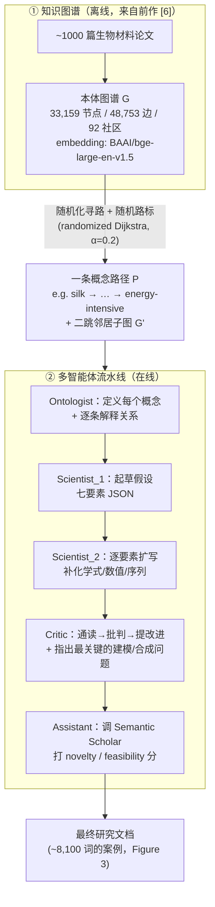
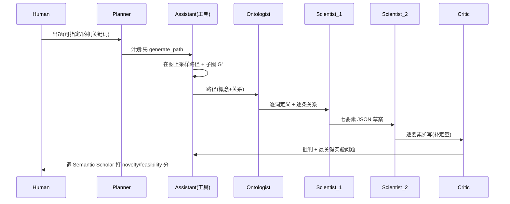

# 组会汇报 · SciAgents：用多智能体图推理自动生成科研假设

> 主讲提示：这是 C 组（创意/假设生成）里最有「**结构主义**」气质的一篇。它的核心赌注不在「更强的 prompt」，
> 而在「**先把领域知识压成一张本体图谱，再让多智能体在图上走路、争论**」。开场一句话定调：
> **别人用 prompt 凭空想 idea，它用「知识图谱的一条路径」当 idea 的骨架，再派一支 agent 团队把骨架长成血肉。**

---

## 1. 封面 · TL;DR

- **标题 / 作者**：*SciAgents: Automating Scientific Discovery Through Multi-Agent Intelligent Graph Reasoning*，Alireza Ghafarollahi & Markus J. Buehler，**MIT LAMM**，arXiv 2409.05556（2024-09-09）。
- **权威性来源**：出自 MIT Buehler 组——生物启发材料 (bio-inspired materials) + 生成式 AI 的旗舰实验室；本文的图谱底座来自其发表于 *Machine Learning: Science and Technology* 的前作（原文 [6]），多智能体一脉则承自该组 MechAgents/ProtAgents（原文 [35,37]）。**数据与代码开源**（GitHub: `lamm-mit/SciAgentsDiscovery` 与 `lamm-mit/GraphReasoning`，见原文 §「Data and code availability」）。
- **一段话**：SciAgents 把「提出一个生物启发材料的研究假设」拆成两件事——**(1) 用一张大规模本体知识图谱当「概念约束 + 采样源」**：在图上用「带随机性的启发式寻路」采出一条连接两个关键词的路径（如 `silk … energy-intensive`），这条路径就是假设的「概念骨架」；**(2) 派一支有分工的 LLM 智能体团队**（本体学家 Ontologist → 科学家 1 起草 → 科学家 2 扩写 → 评论家 Critic 批判 → 助手 Assistant 查新颖性）在这条骨架上协作，产出一份含七要素（hypothesis/outcome/mechanisms/design principles/unexpected properties/comparison/novelty）、可指导后续分子动力学与合成生物学实验的研究文档。论文给出两种编排：**预编程顺序**（Figure 1b）与 **全自动群聊自组织**（Figure 1c, AutoGen GroupChat）。
- **三条带走的结论**：
  1. **「知识图谱当约束」是本篇与纯 prompt 路线的根本分野**：路径不是模型凭空想的，而是从「~1000 篇论文蒸馏出的本体图」里**采样**出来的——这给「跨学科、非显然的概念连接」提供了一个**有结构、可解释、可复现**的来源（原文 §2.1 / Figure 2 / §4.2）。
  2. **多智能体含一个「只批判、不产出」的 Critic**：它负责查优缺点、提改进、并指出「最该用分子建模/合成生物学回答的关键问题」——把「生成」和「质疑」做成职责分离的两个角色（原文 Figure 1 / Figure 6 / 附录 Figure S7）。
  3. **新颖性用外部工具 grounding，但本质仍是「自评式」启发**：自动版用一个 novelty-assistant 调 **Semantic Scholar API** 三次、对生成假设打 novelty/feasibility 分（1–10）——这是抗「自说自话」的一步，但**打分主体仍是 LLM**，埋下批判线（原文 §2.2 / Figure 10 / 附录 Figure S3）。

> 主讲提示：把「图谱=约束/采样」「Critic=职责分离的质疑者」「novelty 用 API 但仍是 LLM 自评」三点同时抛出，
> 既给出亮点也预埋批判——和本课一贯的辩证基调一致。

---

## 2. 问题与动机（why —— 本篇最该讲透的一节）

> 本节按 v2 的 **Why 三连**（问题层 / 设计层 / 结果层）展开；设计层是组会最该被追问的一层。

**问题层 why（为什么这事值得做）**：传统科研由人「读背景→提假设→设计评估→收证据→写论文→精化」（原文 §1 第 1 段）。这套流程驱动了启蒙以来几乎所有突破，但**受限于研究者的精力、背景知识与想象力边界**。在**生物启发材料**这种**强跨学科**领域尤甚——目标是「从自然的工具箱里提取原理、带到工程应用」，而把分散在海量文献里、彼此「看似无关」的概念连起来，恰恰是人脑最吃力、最容易漏掉的事（原文 §1 第 1–2 段）。

**设计层 why（为什么用「知识图谱 + 多智能体」，而非显而易见的替代）**：本篇几乎每个设计都在回应「纯 LLM 提 idea」的两个失败模式。

```
**Why（设计层）— 替代方案 A：直接让单个 LLM「头脑风暴」研究假设**
朴素做法：给 GPT 一段领域描述，让它自由发挥提 idea。
会怎样失败：① 受限于模型「初始训练范围」，容易在已知套路里打转、缺乏可控的跨学科连接；
  ② 单 agent「一步到位」难以做「深思 + 整合冲突信息」的复杂推理（原文 §1 第 4 段「single-LLM … often fall short」）；
  ③ 没有结构化的「概念来源」，新颖性无从约束，幻觉无从校验。
本文改用：先把领域知识做成**本体知识图谱**当「概念地图」，从图上**采样路径**给出假设骨架；
  再用**一队分工 agent**（含独立 Critic）把骨架精化、并用外部 API 查新颖性。
为何更优：图谱提供「**有结构、可解释、可复现**」的跨学科连接源（原文 §1 末段、§2 第 2 段）；
  多 agent 把「复杂任务拆成子任务、各司其职」，比单 agent 一步到位更稳（原文 §1 第 4 段）。
```

```
**Why（设计层）— 替代方案 B：图上用「最短路径」连接两个概念（前作 [6] 的做法）**
朴素做法：要连 silk 与 energy-intensive，就取二者在图上的**最短路径**。
会怎样失败：最短路径**只经过少数几个概念**，连接「太直白」，激发不出跨域的新意（原文 §「1- Path generation」与 Figure 4 对比）。
本文改用：**带随机性的启发式寻路 (randomized Dijkstra) + 随机路标 (random waypoints)**，
  故意让路径**更长、绕经更多概念与关系**。
为何更优：更丰富的概念底料 → agent 能探索更广的领域、生成更有新意的假设（原文 §「1- Path generation」；Figure 4 直观对比 random path vs shortest path）。
```

**结果层 why（为什么会得到「更丰富/更跨学科」的结果）**：在机制上，随机路标把路径从「两点间的捷径」变成「**一次在图上的长途漫游**」，沿途强行串入「结构着色 (structural coloration)」「多功能性 (multifunctionality)」「低温加工」等本不与 silk 直接相邻的概念（见原文 Figure 4a 的 random-path 子图节点数明显多于 4b 的 shortest-path）。于是 Scientist_1 拿到的「概念骨架」天然就横跨光学/力学/加工/生物多个子域——**新意不是逼 LLM「更有创意」逼出来的，而是采样策略「喂」出来的**。

> 主讲提示：这一节把三件事讲清就够了——
> ① 为什么不用纯 prompt（缺结构化连接源 + 单 agent 难做复杂推理）；
> ② 为什么不用最短路径（太直白、激发不出跨域新意）；
> ③ 随机路标在机制上如何「制造跨学科底料」。后面 how 就顺理成章。

---

## 3. 研究问题 / 核心 intention（形式化成一句话）

把要解决的问题压成一句：

> **给定一张从领域文献蒸馏出的本体知识图谱，能否让「图上采样的一条概念路径」充当研究假设的骨架，再由一支分工明确、含独立批判者的 LLM 智能体团队，把它自动精化成一份有新意、机制清晰、可指导后续实验的研究方案？**

它隐含的**假设**：
- **(H1) 结构假设**：本体图谱里「概念—关系—概念」的拓扑，**本身就编码了可被复用的跨学科连接**；「采样一条路径」≈「采样一个候选研究方向」。
- **(H2) 分工假设**：把「定义概念 / 起草 / 扩写 / 批判 / 查新颖性」拆给不同角色，比单 agent 一步到位更能产出「well-rounded」的假设（原文 §1 第 4 段、§2.1）。
- **(H3) grounding 假设**：用 Semantic Scholar API 给新颖性「锚」一下，能把太像已有工作的 idea 主动剔除（原文 §2.2、§4.6）。

> 主讲提示：三条假设各对应后面要批判的一个点——H1 看 §13（无量化）、H2 看 §9（职责分离）、H3 看 §11/§14（自评启发式）。把它们当「全篇要逐一兑现/打折的承诺」。

---

## 4. 相关工作定位（站在谁肩上、和谁不同）

| 方向 | 代表（原文引用） | 与本篇的关系 |
|------|------|------------|
| 本体知识图谱构建 | Buehler 2024 [6]、Pan 2024 [32]、Dagdelen 2024 [33] | **图谱底座的来源**：本文直接复用 [6] 生成的图（33,159 节点/48,753 边）当推理基底 |
| LLM 提 idea（不执行） | Girotra 2023 [20]、Si/Baek 系列 | 只做 ideation；本文给 ideation **加了「图谱采样」这个结构化来源** + 多 agent 精化 |
| LLM × 知识图谱推理 | Think-on-Graph (Sun 2023) [30] | 思想同源（图上推理）；本文把它**接到多智能体 + 假设生成**上 |
| 材料/力学多智能体 | MechAgents [35]、ProtAgents [37]、Atomagents [38]（同组） | **直系前作**：把「多 agent 解力学/蛋白问题」推广到「多 agent 做开放式假设生成」 |
| 范畴论看层级材料 | Giesa/Spivak 2011–2012 [39,40] | 「把材料知识结构化」的理论根 |
| 多智能体框架 | AutoGen (Wu 2023) [41,46]、StateFlow [42] | **实现底座**：自动版用 AutoGen 的 `GroupChatManager` 编排（原文 §4.4） |
| 端到端 AI 科学家 | The AI Scientist (Lu 2024) [8] | 同属「自动科研」大家庭；本文**不写代码/不跑实验**，聚焦「假设的生成与精化」这一前段 |

一句话差异：**别人要么纯 prompt 提 idea、要么端到端跑实验；SciAgents 卡在中间最关键的一段——「如何让假设既跨学科又不离谱」——并用「知识图谱采样 + 多 agent 批判」给出答案。**

> 主讲提示：强调它与 The AI Scientist 的**分工边界**：AI Scientist 重「写码→跑实验→写论文→评审」的后段闭环；
> SciAgents 重「从知识里**长出一个值得做的假设**」的前段。两者是接力，不是竞争。

---

## 5. 方法总览（big picture，先直觉后数学）

整体是**一条「采样→深析→生成→扩写→批判→查新」的流水线**，外壳有两种编排（原文 Figure 1b/1c、Figure 2）。先看知识图谱与流水线的关系：



**直觉**：把它想成「**一支科研小组在一张概念地图上接力**」——
先有人（采样器）在地图上画一条路线（哪些概念该被串起来），
本体学家解释这条路线上每个地名和它们的关系，
科学家 1 据此写出研究草案，科学家 2 把草案做深做实，
评论家挑刺并指出「最该做哪个实验」，
助手再去文献库查一下「这想法到底新不新」。

**两种编排的差别（原文 §2.1、Figure 1b/1c、Figure 7）**：
- **预编程顺序（non-automated, Figure 1b）**：agent 交互**按预定义顺序**走，且每个 agent 只看到**上一步的过滤子集**（原文 §「The difference stems from…」与 §4.3）——稳定、可靠。
- **全自动群聊（automated, Figure 1c/7）**：用 AutoGen 的 **group chat manager** 根据上下文**动态选下一个发言者**，agent 共享完整历史记忆（shared memory），且能调外部工具——更灵活，并多了 Planner 与 Assistant 两个角色。

> 主讲提示：让听众记住流水线的**两段式**——「**离线把知识压成图** + **在线让 agent 在图上接力**」；
> 以及两种编排「**顺序可靠 vs 群聊灵活**」的取舍。后面 §7 逐个零件拆。

---

## 6. 符号与术语表（后文统一用）

| 记号 / 术语 | 含义 |
|------------|------|
| $G=(V,E)$ | 本体知识图谱：节点 $V$ 是概念/实体，边 $E$ 是概念间关系（原文 §4.1） |
| $G'$ | 采样得到的**子图**：路径节点 + 其二跳邻居（原文 §4.2 末段） |
| 本体图谱 (ontological knowledge graph) | 不仅存信息，还以「节点-边」显式刻画概念间**互联结构**的图（原文 §1） |
| 路径 $P$ | 连接 source 与 target 两节点的一条路径，充当假设的「概念骨架」 |
| `keyword_1 / keyword_2` | 路径的两个端点概念，可由用户指定或模型随机选（原文 §4.3.1） |
| $h(v,\text{target})$ | **启发式距离**：用节点 embedding 估计的「当前节点 $v$ 到目标」的距离（原文 §4.2 伪代码） |
| $\alpha$ | **随机因子 (randomness factor)**：注入优先队列的扰动强度，本文取 **0.2**（原文 §4.2） |
| $k$ | **随机路标 (random waypoints) 个数**：从路径邻居里随机选、强行绕经的中转点 |
| `in-situ learning` | **就地学习/原位学习**：agent 不微调，靠 **in-context（上下文内）** 信息当场适配任务（原文 §1 第 3 段） |
| 七要素 | hypothesis / outcome / mechanisms / design principles / unexpected properties / comparison / novelty（原文 §2.1、Figure 5） |
| Ontologist / Scientist_1 / Scientist_2 / Critic / Planner / Assistant / Human / Group chat manager | 八类 agent 角色（原文 §2.2 列表） |
| novelty / feasibility 分 | novelty-assistant 调 Semantic Scholar 后给出的 1–10 评分（原文 Figure 10、附录 Figure S3） |

> 主讲提示：这张表只需口头点三个最高频的记号——$G$（图谱）、$\alpha$（探索旋钮）、七要素（假设的固定模板）。其余用到时再回看即可。

---

## 7. 方法细节 ①：知识图谱的构造与「为什么用它」

> 这是本篇的「地基」，也是它区别于纯 prompt 路线的根本。务必讲透「**图谱当约束/采样源**」的设计层 why。

**图谱怎么来的（原文 §4.1）**：本文**不重新造图**，而是直接用前作 [6] 的产物——
- 规模：**33,159 节点 / 48,753 边**，含 **92 个社区 (communities)**，由 **~1000 篇**生物材料领域论文蒸馏而来；
- 表示：节点/概念用 **`BAAI/bge-large-en-v1.5`** 嵌入模型编码（这一点对后面「用 embedding 估启发式距离」至关重要）；
- 形态：是一个有「giant component（巨连通分量）」的本体图（原文 §4.1）。

构造过程的直觉（原文 Figure 1a）：**论文堆 → 抽取概念与关系 → 连成一张全局图**。Figure 1a 用三联图展示了「从一摞论文 → 一团全局图 → 局部放大」的演进。

**Why（设计层）：为什么是「本体图谱」而不是「向量库 + RAG」？**

```
**Why（设计层）— 替代方案：把 1000 篇论文切块塞进向量库，用 RAG 检索相关段落**
朴素做法：标准 RAG——按查询相似度召回 top-k 文本块喂给 LLM。
会怎样失败：RAG 召回的是「**与查询相似的孤立片段**」，
  它**不显式编码「概念 A 经由关系 r 连到概念 B」的结构**；
  跨学科的「非显然连接」恰恰藏在「多跳关系链」里，相似度检索看不见这种链。
本文改用：**本体图谱 + 路径采样**——直接在「概念-关系」拓扑上走多跳路径。
为何更优：图谱「不仅给出信息的机制性拆解，还提供一个**本体框架**，
  阐明不同概念的互联」（原文 §1 第 5 段原话）；
  于是「采样一条路径」=「采样一串**被关系显式连接**的概念」，
  天然适合做「跨域假设的骨架」。
```

**读出什么**：图谱在这里扮演三重角色——**(1) 约束**（假设必须由图上真实存在的概念-关系长出，而非凭空捏造）；**(2) 采样源**（一条路径 = 一个候选研究方向）；**(3) 可解释性锚点**（生成的假设可回溯到图上哪条路径、哪些关系，原文 Figure 4 把路径可视化）。这正是「为什么用知识图谱做约束/采样，而非纯 prompt」的完整答案。

> 主讲提示：这是本篇侧重点。一句话钉死：**RAG 召回「相似片段」，图谱召回「被关系连起来的概念链」**——
> 后者才是跨学科 ideation 需要的底料。

---

## 8. 方法细节 ②：在图上采样路径（随机化寻路 + 随机路标）

> 对应原文 §4.2 的算法框（Heuristic Pathfinding with Randomization and Waypoints）。这一节给**唯一的核心算法**，按「直觉→符号→伪代码→读出什么」走。

**直觉（为什么要这个算法）**：我们要在图上从 source 走到 target，但**不想走最短路**（太直白）。于是做两件事：① 在 Dijkstra 的优先级里掺一点随机，让它「偶尔不走最优、去探索」；② 走完主路径后，再随机选几个「路标」节点绕一圈，把更多概念拉进来。目标是得到一条**更长、更跨域**的路径当假设骨架。

**符号（先定义，后用式）**：
- $G$：知识图谱；source/target：路径两端节点；
- $E$：节点 embedding（来自 `bge-large-en-v1.5`）；
- $h(v,\text{target})$：用 embedding 估计的**启发式距离**（当前节点 $v$ 到目标的远近）；
- $\alpha$：**随机因子**，控制「启发式驱动」与「随机探索」的平衡，本文 $\alpha=0.2$；
- $\text{random()}$：一个随机数；$k$：随机路标个数。

**核心一步的代价函数（原文 §4.2 伪代码第 4(b) 步，读作「访问邻居 $v$ 的代价」）**：

$$ \text{cost}(v) \;=\; h(v,\text{target}) \;+\; \alpha \times \text{random()} $$

**读出什么**：右边第一项 $h(v,\text{target})$ 是「**理性**」——朝目标走；第二项 $\alpha\cdot\text{random()}$ 是「**探索扰动**」——$\alpha=0.2$ 意味着「以启发式为主、掺两成随机」。把它塞进优先队列后，Dijkstra 不再严格确定性，于是**同一对端点能采出不同路径**（多样性来源之一）。这就是原文说的「modified version of Dijkstra's algorithm that introduces a randomness factor」。

**算法骨架（原文 §4.2 改写）**：
```
输入: 图 G, embedding 模型, source, target, 随机因子 α, 路标数 k
1. 初始化: P=[], 优先队列 Q=[(0, source)], 已访问 V={}
2. 用 embedding 找到与 source/target 最匹配的图节点 (find_path 锚定)
3. Randomized Dijkstra:
     while Q 非空:
        弹出代价最小的 u
        若 u == target: 得到主路径 P
        标记 u 已访问
        for u 的每个邻居 v:
            h = 用 embedding 估 v→target 距离
            cost = h + α × random()           # ← 上面那条式子
            若 v 未访问: 把 (cost, v) 加入 Q
4. 加随机路标: 从 P 上节点的邻居里随机选 k 个不在 P 中的路标,
     对每个路标求到「下一个路标」的最短路并拼接进 P
5. 构建子图 G': 取 P 的所有节点 + 其二跳邻居
6. 返回 P, 子图 G', 路径长度
```

**Why（设计层）：为什么要「随机路标」这一步而不只是「随机化 Dijkstra」？**
- 只随机化 Dijkstra：路径仍是「source→target 一条线」，长度有限；
- 加随机路标：强行让路径**绕经更多本不相邻的概念**，把路径从「直线」变「漫游」。
- 证据：原文 Figure 4 把 random-path（4a）与 shortest-path（4b）并排——4a 节点/边明显更多、更跨域；作者明说 random approach「infuses the path with a richer array of concepts and relationships」。

**案例（原文 §「1- Path generation」给出的真实路径）**：
```
silk → provides → biocompatibility → possess → biological materials → has →
multifunctionality → include → self-cleaning → include → multifunctionality →
… → silk → is → fibroin → is → … → structural coloration → exhibited by →
insects → are → energy-intensive
```
这条路径把「丝—生物相容—多功能—自清洁—纤维蛋白—结构着色—昆虫—能耗高」一串看似无关的概念连了起来——后续假设（用蒲公英色素 + 丝做「结构着色 + 低温节能」复合材料）的骨架就来自这里。

> 主讲提示：把那条 `silk … energy-intensive` 路径念一遍，让听众**亲眼看到「假设骨架是从图里走出来的」**。
> 这是全篇最直观的「why 知识图谱」证据。

---

## 9. 方法细节 ③：多智能体角色分工与 in-situ learning

> 对应原文 §2.1–2.2、Figure 1、Figure 5–7、附录 Figure S2–S7（七个 agent 的完整 system prompt）。这一节讲「谁干什么、为什么这么分」。

**in-situ / in-context learning（原文 §1 第 3 段）**：所有 agent **都不微调**，靠「把外部知识（图谱定义、关系、历史对话）塞进 prompt」当场适配——这是本篇「不训练、靠编排」的根本前提。每个 agent 的「人格」由创建时的 `system_message` 写定（原文 §4.4）。

**八个角色（原文 §2.2 列表 + 附录 profile）**：

| 角色 | 职责（一句话） | 关键 prompt 约束（来自附录 Figure S2–S7） |
|------|---------------|------|
| **Human** | 出题、可在任意阶段介入 | 用 AutoGen `UserProxyAgent` 实现 |
| **Planner** | 把任务拆成可执行计划 | 「**只许出计划、不许执行/调工具**」（Figure S2）；计划即 Figure 9 那六步 |
| **Ontologist** | 定义路径上每个概念 + 逐条解释关系 | 「先 `### Definitions` 逐词定义，再 `### Relationships` 逐条讨论；**必须覆盖每个概念**；不得执行工具」（Figure S4） |
| **Scientist_1** | 据本体学家的定义，起草七要素假设 | 「synthesize a novel research proposal … SEVEN keys；尽量定量、给数值/序列/化学式」（Figure 5 / S5） |
| **Scientist_2** | 以**同行评审者视角**逐要素扩写、补定量细节 | 「critically assess and improve … 补化学式/数值/序列/处理条件 + step-by-step rationale；以 `### Expanded …` 开头」（Figure S6） |
| **Critic** | 通读全文→总结→批判优缺点→提改进→**指出最该用 MD/合成生物学回答的关键问题** | 「**Do not rate novelty/feasibility**（明确不打分，把打分留给 Assistant）」（Figure S7） |
| **Assistant** | 调外部工具（生成路径、查新颖性/可行性） | 「act as intermediary，调对工具、把结果传回」（Figure S3） |
| **Group chat manager** | 自动版里根据上下文选下一个发言者并广播 | AutoGen `GroupChatManager`（原文 §4.4） |

**Why（设计层）：为什么把「生成」和「批判」拆成不同 agent（Scientist vs Critic）？**

```
**Why（设计层）— 替代方案：让一个 agent 既生成假设又自我点评**
朴素做法：同一个 LLM 写完假设，顺手自己挑挑毛病。
会怎样失败：「自己批判自己」存在系统性偏向——
  容易给自家产出过高评价、看不见自己的盲点（grading-its-own-homework）。
  这正是本库 [m9.2-research-agent-core] 实证过的：
  「无 critic 残留幻觉引用 1 → 有（职责分离的）critic 残留 0」。
本文改用：**Critic 是独立角色**，prompt 明确「只通读、只批判、只提问题，且不打 novelty/feasibility 分」（Figure S7）。
为何更优：职责分离让「质疑」不被「生成」的立场污染；
  且 Critic 专门产出「最该做哪个实验」的可执行问题（Figure 6），把批判转成下一步行动。
```

**Critic 实际产出长什么样（原文 Figure 6，silk-pigment 案例）**：它提出两个「最有冲击力的问题」——① 丝纤维蛋白与蒲公英色素的分子相互作用如何影响自组装与最终纳米结构？② 能否用合成生物学改造产丝生物、让其在生产时直接掺入色素？并指出局限：纳米尺度集成难、可扩展性、溶剂环境影响、缺定量数据、长期稳定性存疑（原文 §2.1 倒数第 2 段）。

> 主讲提示：把 Critic 的 prompt 那句「**Do not rate the research hypothesis for novelty or feasibility**」单独点出——
> 这是「**职责分离**」的教科书式设计：批判归批判、打分归 Assistant，互不越界。
> 直接连到本库 m9.2 的 critic 实验与 m9.3 的「评委自评偏差」。

---

## 10. 方法细节 ④：假设生成 → 批判 → 精化的完整流程

> 对应原文 §2.1「2-/3-」、§4.3（Graph reasoning: initial ideation + expansion）、Figure 2。这一节把「七要素怎么从骨架长出来、怎么被扩写和批判」讲清。

**Step 0 — 深析关系（Deep Insights, 原文 §「2-」）**：Ontologist 不止定义概念，还要「解读关系」。例：对上面那条路径，它输出 `Silk – possess – biopolymers`（丝是生物聚合物）、`Structural coloration – exhibited by – insects`（昆虫展现结构着色）等逐条解释（原文 §2.1 引文框）。这一步把「静态知识检索」升级成「动态知识生成」——找出已有知识里的缺口、提出新探究角度（原文 §「2-」）。

**Step 1 — 起草七要素（原文 §「3-」/ Figure 5 prompt）**：Scientist_1 产出一个 JSON，七个键：

| 键 | 要求（Figure 5 prompt 原意） |
|----|------|
| `hypothesis` | 明确陈述假设，well-defined、有新意、可行 |
| `outcome` | 预期发现/影响，**定量**（数值/材料属性/序列/化学式） |
| `mechanisms` | 预期的化学/生物/物理行为，**跨尺度**（分子→宏观） |
| `design_principles` | 详细设计原则，聚焦新概念 |
| `unexpected_properties` | 预测意外属性 + 逻辑解释 |
| `comparison` | 与其它材料/技术的定量对比 |
| `novelty` | 相对已有知识/技术的新颖点 |

**Step 1 的实际产物（原文 §「3-」/ Figure 3 案例）**：Scientist_1 提出「丝 + 蒲公英色素」复合材料，宣称力学强度可达 **1.5 GPa**（传统丝 0.5–1.0 GPa），低温加工 + 色素使**能耗降约 30%**。

**Step 2 — 逐要素扩写（原文 §「3-」续 / Figure 2 中段）**：Scientist_2 对**每个**键单独 prompt，补定量细节（化学式、数值、序列、处理条件）。例如建议用 **GROMACS/AMBER** 做分子动力学，模拟丝纤维蛋白（富 Gly-Ala 的 β-折叠晶区）与色素（taraxasterol C30H50O、luteolin C15H10O6）的相互作用（原文 §「3-」要点列表）。扩写后的内容整理成 Table 1（材料对比）、Table 2（设计原则）、Table 3（意外属性，如自愈、湿度响应变色、UV/抗菌）。

**Step 3 — 批判与精化（原文 §「3-」末 / Figure 2 右侧 / Figure 6）**：Critic 通读「图谱 + 扩写稿」，产出总结 + 优缺点 + 改进建议 + 两个最关键的实验问题（见 §9）。最终整合成一份文档（案例约 **8,100 词**，原文 Figure 3）。

**Step 4 — 查新颖性/可行性（仅自动版，原文 §2.2 / §4.6 / Figure 10）**：Assistant 用 novelty-assistant 调 **Semantic Scholar API 三次**（不同关键词组合），对每次返回的 top-10 摘要分析，给 **novelty/feasibility 各 1–10** 分。案例「生物启发微流控芯片」得 novelty **8/10**、feasibility **7/10**（原文 Figure 10）。

**自动版的完整六步计划（原文 Figure 9，Planner 实际产出）**：
1. 用 `generate_path` 在两个随机关键词间生成知识路径；
2. Ontologist 定义路径上每个词、讨论关系；
3. Scientist 据定义起草研究方案；
4. 各专项 agent（hypothesis/outcome/mechanisms/… agent）分别扩写各自要素；
5. Critic 总结、批判、提改进；
6. 用 `rate_novelty_feasibility` 给 idea 打新颖性/可行性分。



> 主讲提示：把这条链念成「**采样→定义→起草→扩写→批判→查新**」六拍。
> 强调它**不写代码、不跑实验**——产出是「可指导实验的研究方案」，验证留给后续的 MD / 合成生物学。
> 这正是它与 The AI Scientist「接力而非竞争」的接缝。

---

## 11. 实验设置（setting / params / 算力 / 成本，写全）

> 主讲提示：这是「忠于原文」最该谨慎的一节——SciAgents 是**定性/案例驱动**的工作，**没有传统意义上的 benchmark 表与统计指标**，能查到的参数我都列，查不到的明确写「原文未给出」。

- **知识图谱（原文 §4.1）**：33,159 节点 / 48,753 边 / 92 社区；源 ~1000 篇论文；embedding 模型 `BAAI/bge-large-en-v1.5`。
- **采样算法（原文 §4.2）**：随机化 Dijkstra，**随机因子 $\alpha=0.2$**；随机路标数 $k$（原文给了符号，**具体取值未给出**）；子图 = 路径节点 + **二跳**邻居。
- **底座 LLM（原文 §2.2、§4.4）**：自动版用 **GPT-4 家族**，经 **OpenAI API** 访问；**具体型号/温度/上下文长度等超参，原文未给出**。
- **多智能体框架（原文 §4.4）**：**AutoGen** [46]；`UserProxyAgent`（Human）+ `AssistantAgent`（Planner/Ontologist/Scientist 1&2/Critic/Assistant）+ `GroupChatManager`（自动选话者）。
- **工具（原文 §4.5–4.6）**：均为 Python 函数；含 `generate_path`、`rate_novelty_feasibility`；novelty 查询用 **Semantic Scholar API**，每次调 **3 次**、每次取 **top-10** 摘要。
- **实验规模**：自动版做了 **5 个**实验（5 个随机选概念对生成的假设，原文 Table 4 / Figure 8）；案例主线是 `silk × energy-intensive`。
- **算力 / 成本 / 随机种子 / 运行时**：**原文未给出**（这是与 The AI Scientist「<$15/篇 + 12h·8×H100」那种成本刻度的鲜明差异——本篇不报成本）。

**评测「指标」其实是什么（关键澄清）**：本篇**没有 pass@k / Elo / 准确率**这类定义式指标。它的「评估」是**三层定性证据**：
1. **路径可视化对比**（Figure 4：random vs shortest，证明采样策略带来更丰富概念）；
2. **生成文档的内容质量**（Figure 3 的 ~8,100 词、Table 1–3 的定量化扩写、Critic 的批判，证明产出「well-rounded」）；
3. **novelty/feasibility 自评分**（Table 4：5 个 idea 得分如 8/7、8/7、6/8、7/8、8/7；Figure 10 给出一例的打分理由）。

| idea（原文 Table 4） | novelty/feasibility |
|---|---|
| 生物启发微流控芯片（仿角蛋白片层） | 8 / 7 |
| 胶原 3D 多孔抗冲击结构 | 8 / 7 |
| 胶原支架 + 纳米复合（石墨烯/羟基磷灰石/碳管） | 6 / 8 |
| 仿珍珠母 + 淀粉样纤维自清洁涂层 | 7 / 8 |
| 石墨烯 + 淀粉样纤维生物电子器件 | 8 / 7 |

> 主讲提示：一定要说清——**这些分是 LLM 调 API 后自己给的**，不是人类评审、也不是真实验测量。
> 它是「相对新颖性」的启发式（和 The AI Scientist 的 novelty check 同病），**不等于真新、更不等于可行**。
> 这条直接连到 m9.3 的冷水：「评委选的最佳 idea，真跑出来是全场最差」。

---

## 12. 主要结果与案例证据（数字 + 解读，别只贴表）

> 本篇的「结果」就是「案例 + 5 个样本」。讲法：**先给案例的硬数字，再解读它「证明了什么、没证明什么」。**

**核心案例：silk × energy-intensive → 节能结构着色丝复合材料**
- **力学**：宣称复合材料拉伸强度可达 **1.5 GPa**，对比传统丝 **0.5–1.0 GPa**（原文 Table 1）。机制归因于丝纤维蛋白（Gly-Ala 重复形成 β-折叠晶区）的层级组织 + 色素（taraxasterol C30H50O / luteolin C15H10O6）的增强（Table 1 Details）。
- **节能**：低温加工（<50°C）使能耗**降约 30%**，对比传统丝需在 Na2CO3 溶液 ~100°C 脱胶（原文 Table 2 / Table 1 Energy Efficiency）。
- **意外属性（Table 3）**：自愈（24h 内力学强度恢复达 80%）、湿度响应变色（反射峰随湿度移 10–50 nm）、UV 防护（效率 >90%）+ 抗菌（对 E. coli/S. aureus 抑菌圈 10–15 mm）。
- **可指导的实验**：Critic + Scientist_2 给出具体方案——MD（GROMACS/AMBER，力场 CHARMM/AMBER + CGenFF，100–500 ns，周期边界）、DSC/CD 测热稳定性、AFM/SEM 看层级结构、UV-Vis 验反射峰、FEA/DMA 测力学（Table 2 Methods 列）。

**结果层 why（这些数字意味着什么）**：
- **正面**：系统能把「图上一条路径」长成一份**结构完整、定量、跨尺度、自带实验方案**的研究文档（~8,100 词）——证明「**知识图谱采样 + 多 agent 精化**」这条流水线**走得通**，且产出比单 prompt「想个 idea」详尽得多（原文 Figure 3 直观展示文档体量）。
- **必须打的折扣**：**所有定量数字（1.5 GPa / 30% / 80% / >90%）都是 LLM「预测/宣称」的，不是实验测得的**（原文 Table 1–3 标题均为「as predicted by our model」）。它们是「假设里的目标值」，**真伪有待后续 MD/湿实验验证**——本篇**没有做这个验证**。这是「宣称 vs 证据」必须分清的地方。

**多样性证据（原文 Figure 8 / Table 4）**：5 个随机概念对生成的知识图谱里，「biomaterials / hierarchical structure / mechanical properties」等节点是**高度数中心节点 (hubs)**，串联起多个学科——说明假设多样性既来自「随机选端点」也来自「端点间的路径」。作者称这套流程「可轻松扩展到数千次迭代，形成一个巨大的 ideation 数据库」（原文 §2.2 末）。

> 主讲提示：把「**1.5 GPa 是模型说的、不是测的**」这句重复两遍。
> 这是本篇最容易被误读的地方——它产出的是「**有理有据的假设**」，不是「**已验证的发现**」。

---

## 13. 消融与分析（哪个部件贡献多少）

> 诚实交代：SciAgents **没有 AlphaEvolve 式的系统消融图**。但原文用「对比」隐含了几处「部件价值」的论证，逐一列出（并标注哪是作者明示、哪是隐含）。

| 「部件」 | 对照 | 证据来源 | 是否系统量化 |
|---|---|---|---|
| **随机路径 vs 最短路径** | 4a 概念更丰富 → 假设更跨域 | 原文 Figure 4 + §「1- Path generation」 | 否（定性可视化对比） |
| **随机因子 $\alpha$** | $\alpha=0.2$ 平衡「理性 vs 探索」 | 原文 §4.2 | 否（仅给单一取值，无敏感性扫描） |
| **预编程顺序 vs 全自动群聊** | 顺序「可靠」、群聊「灵活 + 能调工具 + 共享记忆」 | 原文 §2.1 末、Figure 7、§4.3 | 否（定性比较；自动版「自发发展出更复杂解题策略」是观察非度量） |
| **有无 Critic** | Critic 提出「最关键实验问题」+ 指出局限 | 原文 Figure 6、§2.1 | 否（展示其产出，未做「去掉 Critic」对照） |
| **有无 Semantic Scholar 查新** | 自动版「能主动剔除太像已有工作的 idea」 | 原文 §2.2、Figure 10 | 否（功能性说明，无「关掉后 novelty 掉多少」的量化） |

**分析（设计层的诚实评价）**：本篇的论证方式是「**给一个精心挑选的案例 + 5 个样本，展示流水线能产出像样的东西**」，而**不是**「控制变量、量化每个部件的边际贡献」。这是它方法学上最大的留白——见 §14。

> 主讲提示：直说——**这篇是「能力演示 (demonstration)」，不是「受控评测 (controlled evaluation)」**。
> 组会上若有人问「随机路标到底贡献多少」，诚实答案是「原文只给了 Figure 4 的定性对比，没量化」。

---

## 14. 局限与批判（原文承认的 + 社区/我们的质疑，诚实）

**原文（多为案例 Critic 自陈）承认的局限**：
- **纳米尺度集成难、可扩展性差、溶剂环境影响、长期稳定性存疑、缺定量数据**（原文 §2.1 倒数第 2 段，Critic 对 silk-pigment 案例的批判）。
- **依赖更强的基础模型**：作者明说「这些结果会随更强 foundation models 出现而改善」（原文 §3）——反过来说，当前能力受限于 GPT-4 家族。

**社区 / 我们的批判（区分于原文宣称）**：
1. **「假设」≠「发现」**：所有定量结果（1.5 GPa / 30% / 自愈 80%）都是 LLM **预测值**，**本篇未做任何 MD 或湿实验去验证**（Table 1–3 全标「as predicted」）。它产出的是「**值得做的假设**」，证据强度止于此。
2. **novelty/feasibility 是 LLM 自评的启发式**：虽然用 Semantic Scholar grounding，但**打分主体仍是 LLM**，与 The AI Scientist 的 novelty check 同病；「相对新颖性比较很难」这个老问题没被解决。**「8/10」不代表真新，「7/10」不代表真能做出来**——直接撞上本库 m9.3 的实证（评委 Elo 与真实可行性**负相关**）。
3. **无系统评估**：没有 baseline 对照、没有指标定义式、没有统计检验、没有人类专家盲评——「图谱采样到底比纯 prompt 好多少」**缺乏可量化证据**（仅 Figure 4 定性图）。
4. **图谱质量是上游天花板**：整条流水线的可靠性被「~1000 篇论文抽取出的图」封顶；若抽取阶段引入错误关系（concept A – wrong r – concept B），下游假设会**自信地建在错误连接上**——本篇未评估图谱本身的准确率。
5. **成本/算力不透明**：与 The AI Scientist 公开「<$15/篇」相反，本篇**完全不报成本与运行时**，难以评估「扩到数千次迭代」的现实代价。
6. **Critic / Assistant 自身也会幻觉**：「谁来 critic the critic」——Critic 的批判和 Assistant 的打分本身是 LLM 产出，可能漏判、可能被说服，原文未设独立校验。

> 主讲提示：把批判分两摞讲——**原文 Critic 自陈的「材料层面局限」** vs **我们关心的「方法学层面局限」**。
> 后者（无系统评估、novelty 仍自评、图谱质量天花板）才是组会该深挖的，也正是下一节「机会」的来源。

---

## ★ 对我们的启发（Inspires Us）

> 这一节回答：SciAgents 对我（们）接下来的研究，**到底能用上什么**。

- ➤ **可直接借用的招（reuse）**：
  1. **「知识图谱采样」当 ideation 的结构化骨架**——不要让 LLM 凭空想 idea，而是先建一张「概念-关系」图，用**带随机路标的寻路**采一条路径当骨架。这招能**原样搬进** [`m9.3-ideation-and-tournament`](../m9.3-ideation-and-tournament/)：把现在「LLM 直接生成一堆 idea」换成「先采样 N 条图路径 → 每条长成一个 idea」，让**多样性有可控来源**（端点随机 + 路径随机）。
  2. **职责分离的 Critic（只批判、明确不打分）**——SciAgents 的 Critic prompt 那句「**Do not rate novelty/feasibility**」是教科书级的边界设计：批判归 Critic、打分归 Assistant。可直接加固 [`m9.2-research-agent-core`](../m9.2-research-agent-core/) 已有的 Reviewer：让它**只产出「最该做的实验问题 + 局限清单」**，把评分剥离出去，避免「又当运动员又当裁判」。
  3. **随机因子 $\alpha$ 调「理性 vs 探索」**——`cost = h(v,target) + α·random()` 是一个极简、可调的「探索旋钮」。任何「在图/树上找路径」的 ideation 流程都能借：$\alpha$ 小→偏目标导向，$\alpha$ 大→偏发散探索。

- ➤ **可迁移到我们课题（transfer）**：把 SciAgents 的「**图采样→多 agent 精化**」映射到我们的 ideation 模块时，核心思想是「**用结构（图拓扑）约束创造力，再用分工（多 agent）打磨**」。迁移要改的前提：① 我们的领域得先有一张**靠谱的本体图**（图错了，下游全错——这是 §14 第 4 条的天花板）；② SciAgents **不验证**假设，迁移时**必须补上一个真实判据**——否则就退化成「自信地生成没验证的东西」。对照 m9.3 我们已有的「真实可行性 = numpy 逻辑回归实测 acc」，正好可以给 SciAgents 式的图采样 idea **接上一个真测量的下游**，验证「图采样出的 idea，feasibility 自评分和真实测量到底相不相关」。

- ➤ **它暴露的开放问题 = 我们的机会（opportunity）**：SciAgents 最大的留白是 **「无系统评估 + novelty 仍 LLM 自评」**。→ **机会**：做一个最小对照实验——「**图谱采样 ideation vs 纯 prompt ideation**」，在**同一个有真实可行性判据的任务**（m9.3 的 task.py）上各生成 K 个 idea，量化两者在「① 真实可行性分布、② 自评 novelty 与真实可行性的相关系数、③ 多样性」上的差异。**可下手的第一步**：把 m9.3 的 idea 来源接一个 mock 知识图谱采样器，跑一组「图采样 vs 直接生成」，看图采样是否真带来「更高真实可行性」或只是「更高自评新颖性」。

- ➤ **与本库其它论文/模块的连接（connect the dots）**：
  - **同问题、三条路线**——SciAgents（**知识图谱**约束 ideation）vs [`2502.18864` AI co-scientist](2502.18864-google-ai-co-scientist.md)（**生成-辩论-进化** + 湿实验验证）vs ResearchTown（arXiv 2412.17767，**社区/agent 数据图模拟**多研究者协作）。三者都想「让 idea 更好」，但分别押注**结构（图）/ 辩论（tournament）/ 模拟（社区）**——这是 C 组最值得做的一张对比图。
  - **批判线呼应**：它的「novelty 用 API 但仍 LLM 自评」直通 [`m9.3`](../m9.3-ideation-and-tournament/) 的冷水（评委自评与真实可行性脱节）和 [`m9.8-redteam-and-integrity`](../m9.8-redteam-and-integrity/) 的「独立验证收口」。
  - **接力关系**：与 [`2408.06292` The AI Scientist](2408.06292-ai-scientist-v1.md) 是**前后段接力**——SciAgents 产出「值得做的假设」，AI Scientist 负责「把假设跑成论文」。把两者串起来就是一条更完整的链。

- ➤ **如果我来做下一步（my next move）**：我会在 [`m9.3`](../m9.3-ideation-and-tournament/) 里加一个 `--source=graph-sample` 开关——用一个 mock 本体图 + 带随机路标的寻路当 idea 生成器，与现有「直接生成」并排，在**同一份 numpy 真测量任务**上跑一组对照，回答一个具体问题：**「图采样到底是带来了更高的『真实可行性』，还是只带来了更高的『自评新颖性』？」** 一周内能出最小结论；若是后者，就坐实「SciAgents 的 novelty 分是包装、不是实质」这条批判。

> 主讲提示：这一节是全场高潮——前面讲「MIT 做了什么」，这里讲「**我们下周就能试什么**」。
> 落点是 m9.3 的「图采样 vs 直接生成」对照实验，能被同组同学直接接力。

---

## 15. 在 auto-research 版图的位置（相对已有工作的增量）

- **阶梯定位**（本库 Tool→Analyst→**Scientist** 阶梯）：SciAgents 处在「**Analyst 偏上、未达完整 Scientist**」——它能**自主提出**有结构、跨学科的研究假设（超出纯检索的 Analyst），但**不自己验证**（不跑实验、不收真实证据），产出止于「**可指导实验的方案**」。按 m9.1 的判据，「自称能发现、但靠自评」的系统最高只算到 Analyst 级；SciAgents 的 novelty/feasibility 正是**自评**，所以**没跨过「独立验证」那道坎**。
- **它把谁向前推了一步**：相对纯 prompt ideation（[20] 等），它把「**ideation 的来源**」从「模型脑补」升级为「**知识图谱采样**」——给创造力加了一个**有结构、可解释、可复现**的底座；相对同组 MechAgents/ProtAgents（解特定问题），它推广到「**开放式假设生成**」。
- **关键区分（别混）**：
  - **SciAgents（结构）**：用**知识图谱拓扑**约束并采样 idea；
  - **co-scientist（辩论）**：用**生成-反思-排名-进化 tournament**筛 idea，并接**湿实验**验证；
  - **AlphaEvolve（可验证）**：在**有自动 $h$ 的窄域**进化代码、做可独立验证的发现。
  三者分别代表「**让 idea 更好**」的三种正交压力：**结构 / 竞争 / 可验证**。
- **相对已有 40 篇的时间/能力增量**：作为 C 组（创意/假设生成）的代表，它**补上了「知识图谱作为 ideation 约束」这一条此前缺失的轴**——前面的 ideation 工作多在 prompt 层做文章，SciAgents 是第一个把「**大规模本体图谱 + 多 agent**」正式接成假设生成器并开源的样本。

> 主讲提示：用一句收口——**「co-scientist 用辩论、AlphaEvolve 用可验证奖励、SciAgents 用知识图谱：三种给创造力『上约束』的方式」**。
> 这正是 C 组对比讨论的主轴。

---

## 16. 复现与可用性

- **开源**：数据与代码均在 GitHub——`https://github.com/lamm-mit/SciAgentsDiscovery`（多 agent 系统）+ `https://github.com/lamm-mit/GraphReasoning`（图推理与图谱，原文「Data and code availability」）。
- **能不能在单卡跑**：流水线本身**几乎不吃 GPU**——主要开销是 **LLM API 调用**（GPT-4 家族）+ embedding 查询（`bge-large-en-v1.5`，可本地）。**真正的门槛是 OpenAI/Semantic Scholar 的 API 额度**，不是显卡。
- **坑**：
  1. **图谱是上游天花板**：复用前作 [6] 的图；若换领域要自建图，**抽取质量直接决定下游假设质量**。
  2. **AutoGen 群聊不稳定性**：自动版靠 `GroupChatManager` 选话者，话者顺序/终止条件需调（原文用 Critic 输出 `TERMINATE` 收口，见 Figure S7/S3）。
  3. **成本不透明**：原文不报 token/费用；「扩到数千次迭代」的真实开销需自己压测。
  4. **novelty 工具依赖外部 API**：Semantic Scholar 限流会影响 Assistant 打分环节。
- **本库对应的「可跑缩小版」**：[`m9.2`](../m9.2-research-agent-core/)（critic 职责分离的最小实证）+ [`m9.3`](../m9.3-ideation-and-tournament/)（ideation + tournament + 真实可行性判据）合起来，就是 SciAgents「多 agent ideation + 批判 + 打分」的**可在单机确定性复现**的骨架。

> 主讲提示：强调「**门槛在 API 不在 GPU**」——这点和需要 8×H100 的工作很不一样，对想动手的同学是好消息。

---

## 17. 组会讨论问题

1. SciAgents 的核心赌注是「**知识图谱采样 > 纯 prompt**」。但它**没量化**这个优势（只有 Figure 4 定性图）。要设计一个**有说服力的对照实验**证明「图采样确实带来更好/更跨域的 idea」，自变量、因变量、真实判据各该是什么？（联想 m9.3 的真测量）
2. 它用「**随机路标 + α=0.2**」制造多样性。这种「为了新意故意绕远路」会不会采出「**看似跨域、实则牵强**」的路径？怎么把「有意义的跨域」和「硬凑的跨域」区分开？
3. novelty/feasibility 是 **LLM 调 API 后自评**的（8/10、7/10…）。在 m9.3 我们已见「评委自评与真实可行性脱节」。SciAgents 的自评分，你**愿意信到什么程度**？要补什么才肯信？
4. Critic 被明确禁止打分（「Do not rate…」），打分交给 Assistant。这种「**批判与评分职责分离**」是优点还是把问题踢皮球？如果让 Critic 也打分会更糟还是更好？
5. 整条流水线的可靠性被「~1000 篇论文抽取的图」**封顶**。若图里有一条**错误关系**，下游会「自信地建在错误连接上」。如何在**不重抽全图**的前提下，给图谱本身加一道「关系可信度」校验？
6. 把 SciAgents（结构）、co-scientist（辩论）、AlphaEvolve（可验证）**组合**，会得到什么样的 ideation 系统？三种压力会互补还是打架？
7. 它产出的是「**假设**」而非「**发现**」（1.5 GPa 是预测值）。在「假设生成」和「假设验证」之间，**最该先自动化哪一段**？为什么？
8. 两种编排（顺序 vs 群聊），原文说群聊「自发发展出更复杂解题策略」。这是真能力涌现，还是**更难复现/更难归因**的代价？组会上你押哪种上生产？

> 主讲提示：这 8 题按「方法可信度（1–2）→ 评估可信度（3–4）→ 上游与组合（5–6）→ 定位（7–8）」分层。组会时间紧就主打第 1、3、6 三题——它们最能引出「图采样 vs 真实判据」的核心争论。

---

## 18. 一页速记（汇报当天速览）

- **是什么**：在 ~1000 篇论文蒸馏的本体知识图谱（**33,159 节点 / 48,753 边 / 92 社区**）上，用「**带随机路标的启发式寻路（α=0.2）**」采一条概念路径当假设骨架，再派一支分工 LLM 团队（**Ontologist→Scientist_1→Scientist_2→Critic→Assistant**）把它精化成含**七要素**、可指导实验的研究文档。两种编排：**预编程顺序** / **AutoGen 群聊自组织**。
- **核心 why**：纯 prompt ideation 缺「结构化、可复现的跨学科连接源」，单 agent 难做复杂推理 → 用**图谱当约束/采样源** + **多 agent 分工 + 独立 Critic**。最短路径太直白 → 用**随机路标**制造跨域底料（Figure 4 对比）。
- **关键设计**：① `cost = h(v,target) + α·random()`（α=0.2 调理性 vs 探索）；② Critic「**只批判、明确不打分**」（职责分离）；③ novelty/feasibility 用 **Semantic Scholar API** 打分（1–10）。
- **关键数（全为 LLM 预测/自评，非实测）**：案例丝复合材料宣称 **1.5 GPa**（vs 传统 0.5–1.0）、能耗 **降 30%**；5 个样本 novelty/feasibility 多为 **8/7**；案例文档 **~8,100 词**。
- **三句话结论**：① 「**知识图谱采样**」给 ideation 加了结构化、可解释的来源（亮点）；② 产出是「**值得做的假设**」不是「**已验证的发现**」（边界）；③ novelty 仍 **LLM 自评**、**无系统评估**、**图谱质量封顶**（瓶颈）。
- **在课里的位置**：C 组「**结构派**」ideation 代表；与 co-scientist（辩论派）、AlphaEvolve（可验证派）三足；与 AI Scientist 是「**提假设→跑论文**」的前后接力；批判线接 m9.3 / m9.8。
- **记忆锚**：**「别人凭空想 idea，它在知识图谱上走一条路当 idea 的骨架」**。

> 主讲提示：结尾回到一句话——**「SciAgents 把『创意』从 prompt 工程变成了图上的结构化采样；
> 它证明了这条路走得通，但把『新不新、行不行』的裁决，仍交给了一个会自我感觉良好的 LLM。」**
