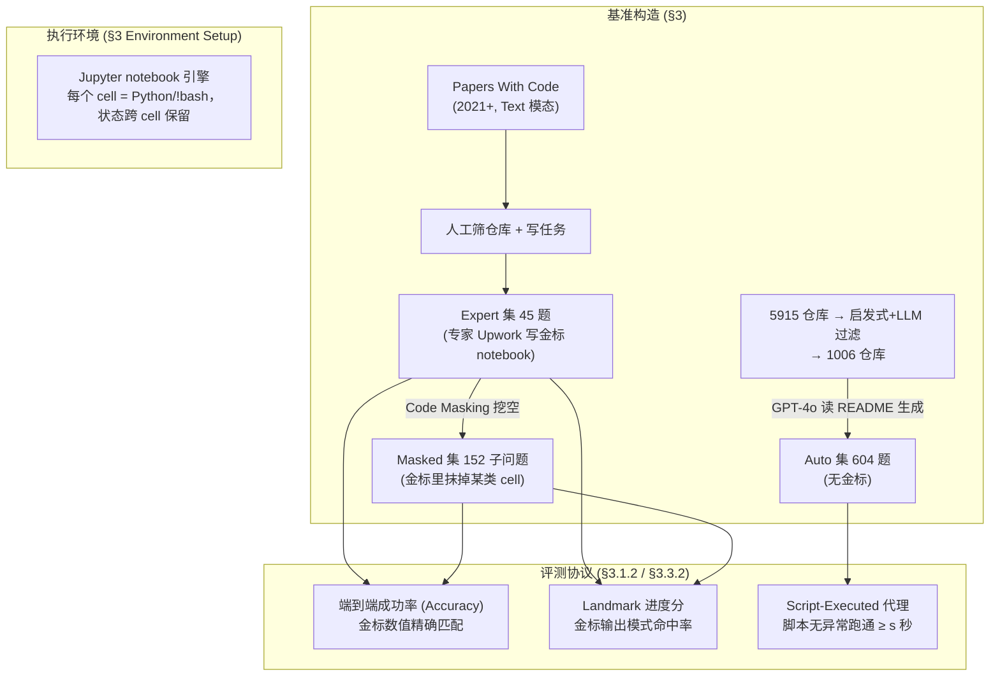

# 组会汇报 · SUPER：能不能把别人的研究代码跑起来？

> 主讲提示：这是 E 组（评测）里一篇「**测被低估的真瓶颈**」的标杆。它不测「写新代码」，而测一件每个做实验的人都干过、却没人系统评过的脏活——
> **clone 别人的 repo、装依赖、改 config、修报错、把脚本跑通、报出指标**。开场一句话定调：
> 「我们天天抱怨『配环境跑通别人的代码』比想象中难十倍——SUPER 第一次把这件事做成了可量化的基准，并证明最强的 agent 也只能跑通 16.3%。」

---

## 1. 封面 · TL;DR

- **标题**：SUPER: Evaluating Agents on **S**etting **UP** and **E**xecuting tasks from **R**esearch repositories。
- **作者/出处**：Ben Bogin, Kejuan Yang, Shashank Gupta, Kyle Richardson, Erin Bransom, Peter Clark, Ashish Sabharwal, Tushar Khot（**Allen Institute for AI + University of Washington**），**EMNLP 2024 主会**，arXiv 2409.07440。
- **权威性来源**：**Ai2**（Allen Institute for AI）出品 + **EMNLP 2024 主会**接收；数据/代码/全部 trajectory 开源（`github.com/allenai/super-benchmark`）。在「研究执行类基准」里是被后续 CORE-Bench 等反复对照的奠基工作之一。

**这篇在干什么（一段话）**：给 LLM-agent 一个**低知名度 (low-profile) 的真实研究仓库**和一句任务（如「用这个新优化器在我给的数据集上训一个模型，报准确率」），让它在一个 **Jupyter notebook 环境**里像研究者那样：装依赖、下数据、改数据加载配置、修不兼容报错、跑训练脚本、把指标报出来（见原文 **Figure 1**）。SUPER 把这件「**setting up and executing**」的脏活拆成**三个问题集**——45 道专家手写的**端到端 (Expert)** 题、从专家题里「挖空」得到的 152 道**子问题 (Masked)**、用 LLM 自动生成的 604 道**自动题 (Auto)**——并给出**端到端成功率 / landmark 进度分 / Script-Executed 代理指标**三种打分。

**3 条带走的结论**：
1. **这件事真的很难**：最强配置（SWE-Agent / ReAct-SUPER + GPT-4o）端到端只解出 **16.3%**（Expert，Table 4），子问题也只到 **46.1%**（Masked，Table 6）。「配环境跑通别人代码」被实证为当前 agent 的硬骨头。
2. **agent 偏科**：它擅长**有明确报错的局部子问题**（修 CPU 兼容、装依赖、解异常），但**不擅长需要读懂仓库结构、配置自定义数据**的开放问题——错误分析里最难的三类是 data(27%)/config(38%)/goal(43% 准确率)（§4.3）。
3. **便宜的代理指标够用**：Auto 集没有标准答案，只用「脚本跑通且没异常」的 **Script-Executed** 启发式打分，却与 landmark 在 **90%** 的情况下一致（§4.3）——意味着可以**低成本自动扩出大量训练/开发题**。

> 主讲提示：把「16.3% / 46.1%」当全场记忆锚点。强调它的贡献不在「又一个 agent」，而在**第一次把『复现别人实验的环境配置』这件被低估的事变成可量化、可分级、可扩展的基准**。

---

## 2. 问题与动机（why —— 本篇最该讲透的一节）

### 问题层 why（为什么这事值得解决）

**科学靠可复现性吃饭，但「跑通别人的代码」恰恰是复现里最痛的一步。** 原文 §1 引两项实证研究点题：
- **Storks et al. 2023**（NLP reproducibility for all）调查发现：**无论新手还是资深研究者，都把「setting up the code base」列为复现实验中最难的部分**。
- **Samuel & Mietchen 2022**（Jupyter notebook 可复现性）发现：即便代码开源，**从任意仓库跑通它也往往非平凡且耗时**。

原文 §1 把这件脏活拆成一串具体动作：**装环境、做非平凡的配置改动、解决过时的包依赖、修 bug、找到正确的执行命令**。这些全都要求 agent **读懂文档与仓库代码、懂得修常见问题（如 CUDA 报错）、还能恰当地改代码**——而且在「**in-the-wild 的低知名度仓库**」上尤其费时，因为**没有支持、文档也常缺失**。

**不解决会怎样**：自主科研 agent（AI Scientist 一类）若连「把已有 repo 跑起来」都做不到，就谈不上「验证已有结果、在新条件下复测、站在别人工作上往前推」。这一步是**一切下游自动化（复现、消融、扩展）的地基**。

### 设计层 why（为什么要做一个新基准，而不是用已有的）

> **Why（设计层）**：朴素做法是直接用已有的代码/执行基准（SWE-bench 修 GitHub issue、ML-Bench 跑流行 ML repo、MLAgentBench 优化单脚本、DS-1000 写数据科学函数）。它们为什么不够？

原文 §2 / **Table 1** 把四个最相关的基准逐条对照，指出 SUPER 同时满足、而它们各缺一块的四个维度：

| 维度（Table 1 行 1–4） | SUPER | DS-1000 | ML-Bench | MLAgentBench | SWE-bench |
|---|:--:|:--:|:--:|:--:|:--:|
| 需读懂仓库 (Repo understanding) | ✓ | ✗ | ✓ | ✗ | ✓ |
| 需配仓库环境 (Requires repo setup) | **✓** | ✗ | ✓ | ✗ | ✗ |
| 基于结果正确性评估 (Outcome-based) | **✓** | ✓ | ✗ | ✓ | ✗ |
| 低知名度仓库 (Low-profile repos) | **✓** | ✗ | ✗ | – | ✗ |
| 仓库 GitHub 星数中位数 | **14** | 35,309 | 9,632 | – | 12,557 |

**读出什么**：①只有 SUPER **同时**要求「配环境 + 看结果对不对 + 在冷门仓库上」。SWE-bench 测的是「修 issue」不需要从零配环境跑实验；ML-Bench/MLAgentBench 用的是**高星热门仓库**（文档好、配置易），且 MLAgentBench 只优化**单个脚本**、不评指标是否正确。②**星数中位数 14 vs 上万**是设计的灵魂——原文 §3.4 明说「星数松散地与文档质量/就绪度相关」，**冷门仓库才暴露真实的配置难度**。

### 核心 intention（一句话形式化）

> **Can LLMs automate the set up and execution of tasks in research repositories?**（原文 §1 原话）——能不能让 LLM 在一个**有状态、能跑 shell + Python 的真实环境**里，**从一个冷门研究仓库自主地装好、配好、跑通一个实验并报出正确指标**。

> 主讲提示：把 why 钉在两点上——**(a) 「配环境」是复现的真瓶颈（有调查证据）**；**(b) 必须用冷门仓库 + 看结果对不对，已有基准都漏了这块**。后面所有设计都在回应这两点。

---

## 3. 研究问题 / 核心假设

- **RQ**：给定一个低知名度研究仓库 + 一句实验任务，agent 能否在交互式 notebook 环境中自主完成「装依赖 → 配数据 → 改代码 → 修报错 → 跑脚本 → 报指标」并得到**与专家金标一致**的结果？
- **核心假设 H1（结果可判优）**：研究任务的「对错」可以用**专家金标答案**（要报的指标数值）做 **outcome-based** 判定，且允许「不同正确路径」（不像 cloze 那样卡 token）。
- **核心假设 H2（进度可细粒度度量）**：哪怕没完全做对，也能用**金标轨迹里的 landmark 输出**衡量「走到了哪一步」，给出比 0/1 更细的进度信号。
- **核心假设 H3（代理指标可扩展）**：对没有金标的自动题，仅用「脚本无异常跑通 ≥ s 秒」这一**廉价代理**就能近似判成功，从而把题量**廉价扩到几百道**用于开发/微调。

---

## 4. 相关工作定位（站在谁肩上、和谁不同）

| 方向 | 代表 | 与本篇的关系 |
|---|---|---|
| 函数级代码合成 | HumanEval, MBPP, APPS | 只「按描述写函数」，无仓库、无环境配置 |
| 数据科学库编程 | DS-1000 (Lai 2023) | 单文件函数，热门库，**不配环境** |
| 跑流行 ML 仓库 | ML-Bench (Liu 2023b) | 高星仓库、**不评指标正确性** |
| 优化单脚本 ML 实验 | MLAgentBench (Huang 2024) | 优化**单脚本**、不做「理解+配置任意仓库」 |
| 解 GitHub issue | SWE-bench (Jimenez 2024) | 修 issue（已有可运行环境），**不需从零配环境跑实验** |
| 仓库级代码理解/补全 | RepoBench, CrossCodeEval | 测「补全/理解」，不测「执行出正确结果」 |
| **本篇** | **SUPER** | **冷门仓库 + 配环境 + 跑通 + 看结果对不对，四者合一** |

> 主讲提示：一句话概括——「**别人测『写代码』或『修热门仓库的 issue』，SUPER 测『把冷门仓库的实验从零配起来跑通』**」。这正是它能进 EMNLP 主会的差异点。

---

## 5. 方法总览（big picture，先直觉后细节）

SUPER 的「方法」其实是**基准构造 + 评测协议**。一图流（对应原文 Figure 2/3 + §3）：

**直觉**：
- **三个集分工**：Expert = 严格的「真人金标」考卷；Masked = 把大题拆成「只考一个技能点」的小题（便于细粒度分析、也防止 agent 在长任务里「蒙混 hill-climb」）；Auto = 廉价海量题，给开发/微调用。
- **执行环境的关键巧思**：用 **Jupyter notebook 当引擎**——每个执行单元等价于一个 cell，**既能跑 `!bash`（装依赖、跑脚本）又能跑 Python（改配置、读结果），且状态跨 cell 保留**（变量/已装的包都在）。这正是「配环境跑实验」需要的**有状态 shell + Python 二合一**（原文 §3 Environment Setup 明说，过往环境通常只支持其一）。

> 主讲提示：让听众记住「**三集 (Expert/Masked/Auto) + 三指标 (Accuracy/Landmark/Script-Executed) + 一环境 (有状态 notebook)**」这张骨架，后面 §6–§9 逐块拆。

---

## 6. 符号与术语表（先定义，后文统一用）

| 记号 / 术语 | 含义 |
|---|---|
| **Expert 集** | 45 道专家手写、有金标解的端到端研究执行任务（§3.1） |
| **Masked 集** | 152 道从 Expert 金标中「挖空 (mask)」某类 cell 得到的子问题（§3.2） |
| **Auto 集** | 604 道 LLM（GPT-4o）读 README 自动生成、**无金标**的任务（§3.3） |
| **landmark（地标输出）** | 金标轨迹里能证明「某步成功执行」的**输出字符串模式**，如 `*** training completed ***`、`Loading data... 100%`（§3.1.2） |
| **cell（单元）** | notebook 的一个执行单元，含 Python 和/或 `!bash`；状态跨 cell 保留 |
| **pre-execute（前置执行）** | Masked 子问题里，未被挖空的「前缀 cell」由系统**预先跑好**，作为已有历史交给 agent（§3.2） |
| $V_{\text{gold}}$ | 金标答案里要报的**数值集合**（如各指标的数 + 模型预测的字符串） |
| $\hat V$ | agent 提交的对应数值集合 |
| $\mathbb{1}[\cdot]$ | 指示函数：括号内为真取 1，否则 0 |
| $L$ | 一道题的 landmark 模式集合（每题 2–6 个，平均 3 个） |
| $O$ | agent 执行过程中所有 cell 的输出全集 |
| $s$ | Script-Executed 的最小运行秒数阈值（实测取 $s=10$，附录 B.2） |
| ReAct / ReAct-SUPER / SWE-Agent | 三个被评测的 baseline agent（§4.1） |

---

## 7. 方法细节 ① Expert 集：真人金标考卷（§3.1）

### Why（设计层）

> **Why（设计层）**：朴素做法是让作者自己写几道题自己解。问题：**任务可能「欠定」**（under-specified）——同一句话不同人会做出不同结果，无法公平判分；而且作者自己可能漏掉真实研究者才会踩的坑。本文改用 **Upwork 雇有 ML/NLP 实战经验的专家**写金标解，并强制他们**记录所有未指定的决策**，把任务补全到「任何按此解的人都能拿到同一结果」（原文 §3.1.1）。

### How（构造流程，对应 Figure 2）

1. **选仓库**：从 **Papers With Code**（`paperswithcode-data`）里采样 **2021 年以后、Text 模态**的论文及其 GitHub 仓库。
2. **写任务**：人工 review 仓库，基于 README 或仓库里的脚本写「跑一个实验」的任务；为增加难度，常要求**换一个 README 没提的数据集/模型**（数据来自 HuggingFace Hub 或 Google Drive 链接）。每题定义四要素：**(1) 目标仓库、(2) 任务描述、(3) 要报的指标/输出、(4) 实现说明（如具体超参）**。
3. **最小算力约束**：刻意保证任务**无需 GPU、单题计算 ≤ 10 分钟**（只训/评小模型如 `gpt2-small`、「只取数据集前 10 条」「只跑一个 epoch」）。原文 §3.1.1 特别强调——**这些约束不会让任务变简单，反而常增加难度**（要配超参、要找到数据加载在哪改成只取前 10 条、要把为 GPU 写的实验在 CPU 上跑起来）。
4. **专家标注**：Upwork 专家（先用 pilot 任务筛过）在 Google Colab 上提交：**(1) 解答 notebook、(2) 要报的答案、(3) 用过的 git commit hash、(4) 全部装过的依赖版本清单**。强制**尽量用默认参数**、记录所有自定决策。
5. **质检**：人工复核「解正确跟随任务 / 能在我们环境跑 / 决策都记录了 / 多次重跑结果一致（误差 ≤ $10^{-2}$）」；跑不通或需改 Python 版本的解**直接丢弃**。

**成本（附录 D）**：专家 **$30–40/小时**、每题限 4 小时（个别批准 +2 小时）；总采集成本 **$6,580 收 50 个解，最终保留 45 道**。

### 评测指标 ①-A：端到端成功率（Accuracy）

> 直觉：研究任务的产物是一组「要报的数」（如验证集 F1、acc）。判对错最自然的方式，就是看 agent 报的数**是否精确匹配**金标的数——但允许「殊途同归」，不像 cloze 测试卡参考字符串。

记号（先定义）：$V_{\text{gold}}=\{v_1,\dots,v_n\}$ 为金标要报的 $n$ 个数值；$\hat V=\{\hat v_1,\dots,\hat v_n\}$ 为 agent 提交的对应值；$\mathbb{1}[\cdot]$ 为指示函数；容差 $\varepsilon=10^{-2}$。**端到端成功率定义为「正确回答的数值占比」**（原文 §3.1.2 Accuracy Evaluation）：

$$ \text{Accuracy} \;=\; \frac{1}{n}\sum_{i=1}^{n}\ \mathbb{1}\!\left[\,\big|\hat v_i - v_i\big|\le \varepsilon\,\right] $$

> 注：原文用文字定义为「the portion of correctly answered values, where the predicted answer precisely matches the gold one (up to a $10^{-2}$ error)」，**未给独立编号公式**；此处按其文字定义写出等价式，符号为本文为讲解所设。

读出什么：①它是**outcome-based**（按结果而非参考字符串判），所以**允许 agent 用不同的正确路径**拿到同样的数；②对「报多个指标」的题是**逐值打分再平均**，不是全对才得分。**Table 4 报的 Acc（如 React-Super GPT-4o = 14.4）就是这个量在 45 题上的均值（×100，3 个种子平均）**。

### 评测指标 ①-B：Landmark 进度分（更宽容的「走到哪」）

> 直觉：只看「最终数对不对」太严，会「惩罚」那些**做对了大半、只差临门一脚**的 agent（如：数据加载对了但没训完）。我们想要一个**细粒度进度信号**：看 agent 的执行过程**命中了多少个「证明某步成功」的金标输出模式**。

记号（先定义）：$L=\{p_1,\dots,p_m\}$ 为该题从金标轨迹人工提取的 landmark 模式集（每题 **2–6 个**，全库**平均 3 个**）；$O$ 为 agent 所有 cell 输出的并集；$\mathbb{1}[p_j\in O]$ 表示模式 $p_j$ 是否出现在 $O$ 中。**landmark 分定义为命中模式的百分比**（原文 §3.1.2 Landmark-Based Evaluation）：

$$ \text{Landmark} \;=\; \frac{1}{m}\sum_{j=1}^{m}\ \mathbb{1}\!\left[\,p_j \in O\,\right] $$

> 同样地，原文以文字描述「the percentage of these patterns that appear in the outputs of any of the cells executed by the agent」，**未给编号公式**；此式为等价表达。

读出什么：①landmark 是「证据」——例如出现 `*** training completed ***` 就**证明训练这步真跑成了**。②原文明确两条**重要警示**：**(a) 满 landmark ≠ 满 Accuracy**——landmark 只说「某动作发生了」，不保证正确（训练脚本可能用错超参也跑完）；**(b) 满 Accuracy 也可能 landmark 不满**（极少见）——agent 用了**另一条路径/猜中答案**，没命中金标的地标。所以 **landmark 与 accuracy 互补、不可互推**。**Table 4 的 Landm（如 React-Super GPT-4o = 42.6）即此量均值**。

> 主讲提示：这一节是「指标定义式」的样板。组会上最容易被问「landmark 到底咋算、跟 accuracy 啥关系」——记住一句：**landmark 量「走了多远」，accuracy 量「最后对不对」，二者互补**。

---

## 8. 方法细节 ② Masked 集：把大题挖空成小题（§3.2）

### Why（设计层）

> **Why（设计层）**：端到端任务是**稀疏奖励**——要连对一长串步骤才得分，agent 容易在长轨迹里「蒙混 (hill-climb)」，也让我们看不清它**到底卡在哪一步**。朴素替代是直接用端到端的 0/1 分做分析，但粒度太粗。本文借 **cloze 测试 (Taylor 1953) + 掩码语言模型 (MLM, Devlin 2019)** 的思路，把金标解里**某一类 cell「挖空 (mask)」**，造出「只考一个技能点」的子问题——从而能对 agent 做**细粒度技能画像**。

### How（Code Masking 抽取，对应 Figure 3）

1. 从一份**端到端金标解**出发，把功能相近的 cell 归成块（如「装依赖」「数据配置」「解 issue」「训练」）。
2. **挖掉某一个块**（如把「解 issue」橙块抹掉），并定义一个**剩下要完成的目标 goal**（如「现在请做必要改动让代码能在 CPU 上跑，目标是成功跑通 `train.py`」）。
3. **未被挖掉的前缀 cell 由系统预先执行 (pre-execute)**，作为「已有历史」喂给 agent；agent 只需补上被挖掉的那部分。子问题描述里用固定话术：*"I have already executed some of the required steps. Now, you should make the necessary changes ... Your goal is to successfully run 'train.py'."*

**评测**：因为每个子问题有清晰目标且源自原任务，**沿用 §3.1.2 同样的 Accuracy + Landmark 指标**。

### 子问题类别分布（Table 3，错误分析的基础）

原文 **Table 3** 把 152 个子问题按技能点归类，并给出金标解的平均代码行数 (LOC)：

| 类别 | 占比 | 金标 LOC | 代表性金标解 |
|---|:--:|:--:|---|
| Goal（跑评测/训练并报指标） | **25.0%** | 6.5 | 跑评测脚本，从生成文件读出指标 |
| Data（数据配置） | **23.7%** | 22.7 | 下自定义数据集、改 data loader、限取前 10 条 |
| Dependencies（依赖） | 19.7% | 4.1 | 降级 `transformers` 版本以跑通旧仓库 |
| Configuration（配置） | 12.5% | 8.2 | 改 Python/shell 脚本设超参与实验细节 |
| Issue（修报错） | 9.2% | 5.8 | PyTorch 张量形状不兼容、包导入错误 |
| CPU（去 GPU 化） | 7.2% | 5.1 | 删掉散落各处的 `.cuda()` |
| Other | 2.6% | 3.8 | 训练后保存模型以便评测加载 |

读出什么：**Data 块金标 LOC 高达 22.7**（远超其它类），印证「配自定义数据」是最重活；端到端金标平均 **44.3 LOC / 14.4 cells**（§3.4），说明这些任务**轨迹长、易使 agent 迷路**。

> 主讲提示：这张表是 §15 错误分析的「坐标系」——记住「**Goal 25% / Data 24% / Deps 20%** 是三大头」，后面会看到 agent 恰恰在 Data/Config/Goal 上栽跟头。

---

## 9. 方法细节 ③ Auto 集：廉价海量自动题（§3.3）

### Why（设计层）

> **Why（设计层）**：Expert/Masked 是「验证过的高质量题」，但**手工造题又慢又贵（45 题花了 $6,580）**，数量上撑不起「用环境反馈微调/训练 agent」。朴素替代是继续雇人扩量——不可持续。本文改用 **LLM（GPT-4o）读 README 自动生成任务**，把题量廉价扩到 **604 道**，专供**开发/微调**（原文 §3.3、Table 2 的 Purpose=Development）。

### How（两步：过滤 → 生成，附录 B）

- **Step 1 过滤**：从 **5915** 个（2021+/Text）仓库出发，先 clone，筛掉「clone 失败 / 依赖 OpenAI·Anthropic 等 LLM API（会产生费用或不可用）/ 无 README」的；再用 **GPT-4o 跑一个过滤 prompt**（附录 B），问四个问题——**能否在支持的公开数据集上跑？能否在 CPU 上跑（不需 GPU/LoRA）？能否用某个小模型家族跑（BERT/T5/GPT-2/OPT/Pythia…）？README 是否给了可跑的脚本示例？** 四问全 yes 才保留 → **1006 个仓库**。原文明说这个过滤**相当保守**，被筛掉的里其实还有不少好题。
- **Step 2 生成**：对每个保留仓库，用 GPT-4o **读 README 生成一道实验任务**（输出 `{"task": ..., "entrypoint": ...}`），并强制：选**有示例的可执行脚本**、用**具体数据集**（不是「GLUE」这种泛指）、选**模型家族里最小的模型**（如 BERT→bert-base、GPT→gpt2、OPT→opt-125m）。模型决定 skip、或脚本找不到的，丢弃。

**与 Expert 集的区别（原文 §3.3.1）**：Auto 题**更偏「把依赖装好、把实验启动起来」**，不像 Expert 那样常要在「README 没提的数据集/格式」上训练/推理；而且 Expert 只收「我们环境能跑通」的题，Auto 则**可能含更难的环境**（如需改 Python 版本——这类 Expert 阶段被刻意避开）、甚至需要**翻 README 里的网页去下数据**。

### 评测指标 ③：Script-Executed 代理（§3.3.2 / 附录 B.2）

> 直觉：Auto 题**没有金标**，没法算 Accuracy/Landmark。退而求其次：只要 agent 被要求跑的那个脚本**「没抛异常地跑通、且至少跑了 s 秒」**，就近似当作成功。加「≥ s 秒」是为了**滤掉「秒退但没报错」的假成功**（如缺参数直接结束）。

记号（先定义）：设 agent 执行目标脚本得到 $\text{exc}\in\{0,1\}$（1 表示**抛了异常**），运行时长 $t$ 秒，阈值 $s$（实测 **$s=10$**，由金标解校准而来）。**Script-Executed 定义为**：

$$ \text{ScriptExecuted} \;=\; \mathbb{1}\!\left[\,\text{exc}=0\ \ \wedge\ \ t \ge s\,\right] $$

> 原文以文字给出此启发式（附录 B.2：「executed without any exceptions ... and executed for at least $s$ seconds」），**无编号公式**；上式为等价表达。

读出什么：①这是个**承认有缺陷的近似**——原文直言它**可被知情的 agent 操纵**（故意拖时间）。②但**有效性被实证**（§4.3）：在 Masked 集上拿 ReAct-SUPER 的轨迹对照，**Script-Executed 与 landmark 在 90% 的情况下一致、与 accuracy 在 69% 一致**（landmark>0.5 记为成功）。两类不一致：(1) 脚本跑够时间拿到对的答案，但**末尾抛了个异常**（如画图报错）→被代理误判为失败；(2) 脚本只跑到最短时间就因配置错/后期异常**没真出答案**→被代理误判为成功。

> 主讲提示：Script-Executed 是「**能不能廉价自动判成功**」的关键证据。一句话：**它不完美、可被刷，但和 landmark 90% 对得上，足以撑起「自动扩题做开发」这个用途**——这直接呼应我们 m9.6「先快筛后细评」的思路。

---

## 10. 实验设置（setting / metrics / parameters，写全）

- **被测 agent（baseline，§4.1）**：三个，均能在 notebook 里 **execute（跑 Python/Bash）+ submit（交答案）**：
  - **ReAct**（Yao 2023）：迭代「thought + action」，把历史 (thought, action, observation) 拼进上下文。
  - **ReAct-SUPER**：本文改进版——**额外加一个 `edit` 动作**（仿 SWE-Agent 的 Agent-Computer Interface），接受「文件名 + 要替换的确切行 + 替换内容」，**不要求行号**，找不到时给「是否要替换这些行」的建议。动机：早期实验发现**只用 bash 改 config 很费劲**，agent 会退化成用 `sed` 做单行编辑（附录 E）。
  - **SWE-Agent**（Yang 2024a）：基于 ReAct，原为解 GitHub issue 设计，提供更全的读文件/滚动/编辑工具。
  - **Reflexion**（Shinn 2023，§4.2 附加）：首次失败后让 LLM 反思、生成避错计划再重试，给 $k$ 次（每次预算 $1/k$ token）。
- **底座 LLM（§4）**：闭源 **GPT-4o (`gpt-4o-2024-08-06`)、GPT-4o mini (`gpt-4o-mini-2024-07-18`)**；开源 **Mixtral-8x22B-Instruct、Llama-3.1-70B-Instruct-Turbo**（经 together.ai）。
- **执行/资源约束（§4）**：每题**执行时间上限 30 分钟**（不含 API 回复时间）；**token 上限**：子问题 **400k**、Expert/Auto **600k**；超限未交则该题 **Accuracy=0，但仍按 landmark 打分**。
- **沙箱与成本（§4）**：在 **Modal**（modal.com）沙箱并发执行；**每题 Modal 计算成本约 2–3 美分**（相对 API 成本可忽略）。
- **随机性控制**：对最强底座 LLM（GPT-4o）在 Expert 上跑 **3 个种子取平均**（decoding 温度 0.2）；金标轨迹连跑 3 次均拿满分（校验环境无噪）。
- **长输出处理（附录 C）**：训练/装包输出可达 10k–40k token，ReAct 历史会爆——**截断策略**：最后一步保留 observation 末 **50k** 字符，更早的步只留末 **500** 字符。

| 指标 | 用于哪个集 | 一句话定义 | 出处 |
|---|---|---|---|
| **Accuracy** | Expert / Masked | 报出的数值精确匹配金标的占比（容差 $10^{-2}$） | §3.1.2 |
| **Landmark** | Expert / Masked | 命中金标地标输出模式的百分比（每题均 3 个） | §3.1.2 |
| **Script-Executed** | Auto | 目标脚本无异常且跑 ≥ 10 秒 | §3.3.2 / 附录 B.2 |

> 主讲提示：强调三个「易被略过但要紧」的设置——**(1) 30 分钟/题 + token 上限**（资源受限是 agent 失败的部分原因）；**(2) 超限给 0 Accuracy 但保 landmark**（所以低分里仍能看出进度）；**(3) Modal 才 2–3 美分/题**（贵的是 API 不是算力，呼应「最小算力」设计）。

---

## 11. 主要结果（数字 + 解读，别只贴表）

### Expert 端到端（Table 4，GPT-4o 为 3 种子均值）

| Agent | 底座 | Acc | Landm |
|---|---|:--:|:--:|
| SWE-Agent | GPT-4o | 16.3 ± 2.1 | 36.8 ± 2.3 |
| ReAct | GPT-4o | 12.2 ± 1.0 | 33.6 ± 0.9 |
| **ReAct-SUPER** | **GPT-4o** | **14.4 ± 2.2** | **42.6 ± 2.9** |
| ReAct-SUPER | GPT-4o mini | 5.6 | 20.6 |
| ReAct-SUPER | Llama-3.1-70B | 6.1 | 9.6 |
| ReAct-SUPER | Mixtral-8x22B | 3.3 | 3.7 |

**读出什么（结果层 why）**：①**端到端最高仅 16.3%**——「把一个冷门研究实验从零配通」对当前最强 agent 仍是硬骨头。②**landmark（33–42）远高于 accuracy（12–16）**：说明 agent **常常走对了好几步（装上了依赖、加载了数据、甚至训起来了）却没拿到最终正确数**——机制上，最后一公里（正确超参/正确报数）最容易崩。③**开源模型断崖式落后**（Mixtral acc 3.3、landmark 3.7），说明这类长轨迹、强工具使用的任务对底座能力极其敏感。

### Masked 子问题（Table 6）

| Agent | 底座 | Acc | Landm |
|---|---|:--:|:--:|
| **SWE-Agent** | **GPT-4o** | **46.1** | **74.9** |
| ReAct | GPT-4o | 37.0 | 65.7 |
| ReAct-SUPER | GPT-4o | 41.6 | 72.5 |
| ReAct-SUPER | GPT-4o mini | 31.5 | 58.3 |
| ReAct-SUPER | Llama-3.1-70B | 22.8 | 38.3 |
| ReAct-SUPER | Mixtral-8x22B | 7.0 | 13.2 |

**读出什么**：①子问题最高 **46.1%**——比端到端（16.3%）**高一大截**，证明「**把长任务拆成单技能点，agent 就能解出相当一部分**」，但**多数子问题仍未解**。②landmark 74.9 高于 acc 46.1，再次印证「**进度比正确率好看**」。③**SWE-Agent 在 GPT-4o 下最强**，但在**较弱模型上反而不如 ReAct-SUPER**——原文解读：**弱模型用不好 SWE-Agent 那套更复杂的工具**。

### Auto 自动题（Table 5，250 道）

| Agent | 底座 | Script-Executed |
|---|---|:--:|
| ReAct-SUPER | GPT-4o | 18.8 |
| SWE-Agent | GPT-4o | 18.0 |
| ReAct | GPT-4o | 14.0 |
| ReAct-SUPER | GPT-4o mini | 14.8 |

**读出什么（关键的可扩展性证据）**：Auto 集上**模型/agent 的排名与 Masked 集基本一致**（原文 §4.2）——这意味着**用廉价的 Auto 集就能预测在贵的人工集上的相对强弱**，从而**放心用 Auto 集做开发/调参**，不必每次都烧人工集。

### 消融与反思（Table 4 内对照 + Table 7）

- **edit 动作的价值（ReAct vs ReAct-SUPER，Masked）**：加了 edit 后**landmark 72.5 vs 65.7、accuracy 41.6 vs 37.0**——原文 §4.3：**没有 edit 动作时，agent 常退化成用 `sed` 做单行编辑**，配置类任务吃亏。
- **反思有用但有限（Table 7，ReAct-SUPER + GPT-4o，Masked）**：

| 配置 | Acc | Landm |
|---|:--:|:--:|
| ReAct-SUPER | 41.6 | 72.5 |
| **+ Reflexion** (Shinn 2023) | **45.4** | **76.6** |

**读出什么**：反思重试带来**正向但温和**的提升（+3.8 acc）。原文结论一针见血：**若模型本身缺乏解决某问题的能力，反思重试也救不了**（"If models lack the inherent ability to resolve some of these issues, retrial with reflections are not likely to help."）。

> 主讲提示：把三组结果连成一条线——**端到端 16% → 拆成子问题 46% → 加反思 45→45**。读出：**真正的瓶颈是「读懂仓库 + 配自定义数据」这类开放步骤的固有能力，而非「多试几次」**。

---

## 12. 错误分析：agent 到底卡在哪（§4.3）

利用 Masked 的类别标注（Table 3），原文给出**最关键的诊断**：

| 难度 | 类别（Masked 准确率） |
|---|---|
| **最难** | **Goal 43% · Configuration 38% · Data 27%** |
| **较易** | **CPU 73% · Issue 61% · Dependencies 54%** |

**机制解读（结果层 why）**：
- **agent 擅长「有明确报错信息」的题**：CPU 兼容、不兼容依赖、运行时异常——**报错信息直接告诉它哪儿错、怎么修**，是「**被良好定义 (well-specified)** 的局部问题」。
- **agent 不擅长「需要主动读仓库、理解代码结构」的开放题**：配置自定义数据加载、设对超参、把实验跑出正确指标——**没有报错指路，得自己去翻代码**。
- **两个高频失败模式**（§4.3）：①**跳过读仓库代码**，直接**幻觉脚本/函数的参数**（如随手加 `n_examples=10`，但根本没这个参数），或反过来漏掉某个该传的参数、跑去改文件又改错；②**一旦认定一条路就不回头**——「commit 到某方案后，不到失败绝不重新考虑」，缺乏**多方案探索**。

> 主讲提示：这一节是「why agent 偏科」的核心。一句话：**有报错指路的局部问题 agent 能修；要它自己读懂仓库、配好数据这种开放问题就抓瞎**——这恰是 §2 动机里「setting up the code base 最难」的微观证据。

---

## 13. 局限与批判（诚实区分宣称 vs 边界）

**原文自承（Limitations 节）**：
1. **数据集偏小**：Expert 45 / Masked 152，可能影响统计显著性。原文辩护：HumanEval(164)/ClassEval(100)/Bamboogle(125) 也都小却广用；且小集**更便宜易跑**（对跑「会产长输出的交互 agent」尤其友好）；604 的 Auto 集可缓解**过拟合到评测集**的风险。
2. **只覆盖 Python + 文本域**：环境只支持 Python，仓库偏文本类 NLP/ML；扩到其它语言/领域会更全面。
3. **依赖外部资源**：跑题要靠 **GitHub / pip / 数据集链接的可用性**，这些**无法跨运行控制**（链接可能失效/gated）。原文坦言「**完全沙箱化能更可控，但我们为『保真』选择用真实资源**」（类比依赖真实网站的 web agent 基准）。所有评测用同一 base Docker 镜像、应当可复现。
4. **代理指标可被操纵**：Script-Executed 是近似，**知情 agent 可拖时间刷分**（§3.3.2）。

**社区/批判视角（本文补充）**：
- **landmark 由人工提取、每题仅 2–6 个**：覆盖度与一致性依赖标注者；「满 landmark ≠ 正确」本身就承认了它是**弱进度信号**，可能高估「进展」。
- **Auto 集质量**：原文自查 100 题，**81% feasible**——意味着**约 1/5 的自动题不可行**（死链/gated 数据、或「让判别模型做生成」这类概念性错误），用作训练信号需**自带噪声容忍**。
- **Ethical（原文 Ethical Considerations）**：过度依赖这类执行 agent 有风险——可能据**错误的复现**下结论，且「不仔细核对 agent 复现工作」的草率使用者会被误导。这与「自动化复现是双刃剑」一致。

> 主讲提示：把「**依赖真实外部资源 → 不可完全复现**」单独点出——这是所有「in-the-wild 执行类基准」的共同软肋，CORE-Bench 也在和它较劲。

---

## ★ 对我们的启发（Inspires Us）

> 这一节回答：SUPER 对我（们）接下来的研究，**到底能用上什么**。

- ➤ **可直接借用的招（reuse）**：
  1. **landmark 进度分（部分功劳 partial credit）**——「从金标轨迹抽 2–6 个『证明某步成功』的输出模式，按命中率给细粒度分」。可**原样搬进** [`m9.6-evaluating-research-agents`](../m9.6-evaluating-research-agents/) 的沙箱评测：现在我们的 rubric 偏 0/1，加一层 landmark 就能在「没完全做对」时区分「卡在第一步」和「差临门一脚」，让评测信号更稠密。
  2. **Script-Executed 廉价代理 + 「≥ s 秒」防假成功**——「无异常跑通且跑够最短时长」当近似成功判据，并**实测它与 landmark 90% 一致**。这正是 m9.6 [`lectures/03-designing-resistant-benchmarks`](../m9.6-evaluating-research-agents/lectures/03-designing-resistant-benchmarks.md) 想要的「**先快筛后细评**」的现成范式——且 SUPER 还给了「校准 $s=10$」的具体做法。
  3. **Code Masking 造子问题**——把一道长任务的金标「挖掉某类 cell + 预跑前缀」拆成单技能点小题。可用来给我们任何「端到端 agent」做**细粒度技能体检**，定位它到底卡在 Data/Config/Goal 哪一类。

- ➤ **可迁移到我们课题（transfer）**：SUPER 的核心洞见——**「读懂仓库 + 配自定义数据」这类无报错指路的开放步骤，是 agent 的真短板**——可直接转成 m9.6 的一个**对照实验设计**：构造「有报错 vs 无报错」两类等难度子任务，量化我们的 agent 在两类上的差距，验证「报错即脚手架」假说。迁移时要改的前提：m9.6 现在的任务多是合成的、**自带明确判据**；要复现 SUPER 的难度，得引入**真实冷门仓库**（外部资源不可控这点也会一并继承）。

- ➤ **它暴露的开放问题 = 我们的机会（opportunity）**：
  - **(机会一)** Script-Executed **可被拖时间刷分**——这是 m9.6 [`lectures/02-weak-rubrics-get-gamed`](../m9.6-evaluating-research-agents/lectures/02-weak-rubrics-get-gamed.md)「弱 rubric 会被钻空子」的**活体案例**。**第一步可做**：在 m9.6 里实现一个「只会拖时间/打印假成功串」的 adversarial agent，量化 Script-Executed 被刷高多少，再验证「landmark + 输出内容校验」能把它压回去。
  - **(机会二)** landmark 全靠**人工提取、覆盖不全**——能不能**自动从金标轨迹挖 landmark**（diff 出「成功才会出现的输出」）？这是一个能直接接力的小工作。

- ➤ **与本库其它论文/模块的连接（connect the dots）**：
  - **强呼应（同主题、互为补充）**：[`2409.11363` CORE-Bench](2409.11363-core-bench-reproducibility.md)——同样测「**计算可复现性**」（跑通论文配套 repo 复现其结果），但 CORE-Bench 给的是**作者提供的、可复现的** code capsule，SUPER 偏**冷门、文档差、需从零配**的 repo。**两者拼起来 = 复现难度的两端**：CORE-Bench 测「按图索骥能不能复现」，SUPER 测「图都画不全时能不能自己配通」。组会可并讲。
  - **强对立/冷水（批判线）**：[`2506.01372` 没有实现能力的批判会失败](2506.01372-critique-fail-without-implementation.md)——它论证「agent 不能真正实现/执行，则其『批判/复现』不可信」。**SUPER 正好用 16.3% 这个硬数字坐实了这条冷水**：当前 agent 连「把别人实验配通」都只有一成多成功率，那么任何依赖「agent 自动复现/验证别人结果」的上层主张（自动评审、自动复现）都得**先过 SUPER 这一关**。
  - **沙箱补真任务**：给 [`m9.6-evaluating-research-agents`](../m9.6-evaluating-research-agents/) 的「评测沙箱」补上了**真实研究执行任务**的范式（有状态 notebook + landmark + Script-Executed）。

- ➤ **如果我来做下一步（my next move）**：我会在 `m9.6` 里加一个 **「landmark 进度分 + Script-Executed 快筛」双层评测**开关，并配一个**拖时间/打印假成功串的 adversarial 候选**，一周内出最小结论——验证 **(a)** landmark 是否真能把「卡第一步」和「差临门一脚」分开；**(b)** 单靠 Script-Executed 会被刷高多少、加 landmark+输出校验后能压回多少。直接复用 SUPER 的「$s=10$ 校准」和「90% 一致性」当对照基线。

> 主讲提示：这一节是全场高潮——前面讲「Ai2 测出 agent 配环境只有 16%」，这里讲「**我们下周就能把它的 landmark + 快筛搬进 m9.6，并用它的代理指标当『弱 rubric 被刷』的活靶子**」。落点具体到 m9.6 的两节 lecture，能被同组同学直接接力。

---

## 14. 在 auto-research 版图的位置（相对已有论文的增量）

- **它补了哪块图**：本库此前的 B/F 组（AI Scientist、AlphaEvolve…）大多**自带或自造可跑环境**，**跳过了「把别人冷门 repo 配通」这一步**。SUPER 第一个把这块短板**单拎出来量化**，并给出冷水数字（16.3%）。它和 [`2409.11363` CORE-Bench] 同属 E 组「**复现/执行评测**」前沿，构成「复现难度的两端」。
- **阶梯定位**：按本库 Tool→Analyst→**Scientist** 阶梯，SUPER 测的是 **Tool 级最底层、却最被低估的一环**——「**执行别人的研究代码**」。它的结论给整条阶梯**敲了警钟**：连 Tool 级的「配环境跑通」都只有一成多，越往上（自动复现→自动验证→自动发现）越要先**正视这道地基裂缝**。
- **时间/能力增量**：相对早期函数级基准（HumanEval 等）和热门仓库基准（ML-Bench），SUPER 把评测推进到「**冷门、文档差、需从零配 + 看结果对不对**」——**更接近真实研究复现的痛点**，也更难。

---

## 15. 复现与可用性

- **开源**：基准 + 代码 + **全部 agent trajectory** 开源（`github.com/allenai/super-benchmark`、`/tree/main/trajectories`）。
- **能不能在单卡/无卡跑**：**设计上就无需 GPU、单题计算 ≤ 10 分钟**（只训/评小模型、只取数据前 10 条、只跑一个 epoch）；执行走 **Modal 沙箱、每题 2–3 美分**。**真正的开销在 LLM API 调用**，不在算力。
- **坑**：①**依赖真实外部资源**（GitHub/pip/数据链接），链接失效/gated 会让个别题跑不了；②**长输出爆 token**，需照附录 C 的截断策略（末步留 50k、早步留 500 字符）；③弱底座模型（Mixtral/Llama）在这套长轨迹+强工具任务上**几乎做不动**，复现冷水结论务必用 GPT-4o 级模型。

---

## 16. 组会讨论问题

1. **landmark「满 ≠ 正确」**：它作为进度信号，会不会系统性**高估**「agent 有进展」？能否设计一个「landmark 命中但答案错」的占比统计来量化这种高估？
2. SUPER 把「冷门仓库」当难度来源（星数中位 14）。**星数**是「难度」的好代理吗？还有哪些更直接的难度信号（README 长度、依赖年龄、是否有 CI）？
3. **Script-Executed 可被拖时间刷分**。如果让一个「知情且会偷懒」的 agent 来打 Auto 集，它能把分刷到多高？该用什么**最小改动**堵住（联想 m9.6「弱 rubric 被钻」）？
4. 端到端 16% vs 子问题 46%——这 30 个点的差距，**多少来自「长轨迹累积失败」，多少来自「开放步骤本身更难」**？怎么设计实验拆开这两项？
5. agent「**一条道走到黑、不回头**」是模型缺陷还是 agent 框架缺陷？给它显式的「多方案探索/回溯」机制（如 tree search）能不能显著抬高 Data/Config/Goal 的分？
6. SUPER（从零配通）vs CORE-Bench（按作者 capsule 复现）测的是复现的两端。**一个真正的「自动复现 agent」该先过哪一关？** 两个基准的分数能否合成一个「复现能力」总指标？
7. 「**为保真而牺牲可复现性**」（依赖真实外部资源）——作为基准设计者，你认同这个取舍吗？在「沙箱可控」与「真实保真」之间，你会怎么折中？

---

## 17. 一页速记（汇报当天速览）

- **一句话**：SUPER 第一个把「**从冷门研究仓库把实验配起来并跑通**」做成可量化基准——45 端到端 + 152 挖空子问题 + 604 自动题，环境是**有状态 Jupyter notebook**（shell+Python 二合一）。
- **三集 / 三指标**：Expert/Masked/Auto；**Accuracy**（报值精确匹配金标，容差 $10^{-2}$）/ **Landmark**（命中金标地标输出模式的百分比，每题均 3 个）/ **Script-Executed**（无异常跑 ≥10 秒）。
- **关键数**：端到端最高 **16.3%**（SWE-Agent+GPT-4o，Table 4）；子问题 **46.1%**（Table 6）；Auto Script-Executed ~18.8（Table 5）；反思 +3.8（45.4，Table 7）；**Script-Executed 与 landmark 90% 一致**。
- **偏科诊断（§4.3）**：擅长有报错指路的 **CPU 73% / Issue 61% / Deps 54%**；不擅长开放的 **Goal 43% / Config 38% / Data 27%**。
- **三句话结论**：**(1)** 配环境跑通别人代码是真瓶颈（连 16%）；**(2)** agent 偏科——能修报错、不会读仓库配数据；**(3)** 廉价代理指标够用 → 可自动扩题做开发。
- **记忆锚**：**16.3% / 46.1% / 星数中位 14**。
- **在课里的位置**：E 组复现/执行评测前沿，给整条 Tool→Scientist 阶梯**敲地基警钟**；与 CORE-Bench 拼成「复现两端」，给「无实现能力的批判会失败」(2506.01372) 提供硬证据。

> 主讲提示：结尾回到一句——**「我们都低估了『把别人代码跑起来』这件事；SUPER 用 16.3% 把这份低估变成了可量化的红字。」** 然后接 Inspires-Us 的下一步：把 landmark + 快筛搬进 m9.6。
