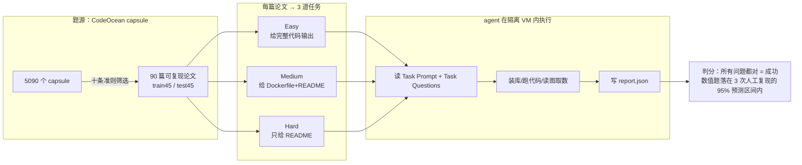
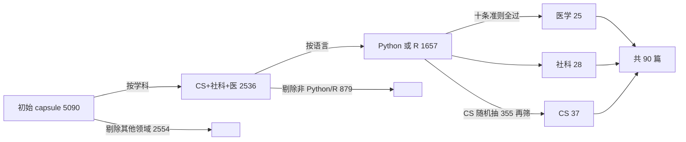

# 组会汇报 · CORE-Bench（计算可复现性 agent 基准）

> 主讲提示：开场一句话定调——这门课前面讲的都是「AI 能不能做**新**科研」（AI Scientist、co-scientist），
> 这篇反过来问一个更低、更硬的门槛：**AI 连把别人**已经发表、附了代码的论文**重新跑出同一个数都做不到，谈何做新研究？**
> 计算可复现性 (computational reproducibility) 是科研诚信的地基；这篇把「地基牢不牢」做成了可量化的 benchmark。

---

## 1. 封面 · TL;DR

- **作者/出处**：Zachary S. Siegel, Sayash Kapoor, Nitya Nadgir, Benedikt Stroebl, Arvind Narayanan（Princeton University），2024-09，arXiv 2409.11363。（注：Kapoor & Narayanan 是 *AI Snake Oil* 与「AI Agents That Matter」的作者，本篇延续其「老实评测 agent」的一贯立场。）
- **一段话**：CORE-Bench（**Co**mputational **Re**producibility Agent Benchmark）给 AI agent 一个论文的**代码仓库 (code repository)**，要求它在一台虚拟机里**装依赖、跑代码、读输出**，最后回答若干关于复现结果的**任务问题 (task questions)**（如"模型测试精度是多少""某张图的 x 轴标签是什么""图里两变量的相关系数是多少"）。**全部问题答对**才算这道题成功。整个基准 = **270 道任务**，来自 **90 篇**横跨计算机科学 / 社会科学 / 医学的论文（Python 或 R 代码），每篇切成 **Easy / Medium / Hard 三个难度层级**（见原文 §2、Table 3、Figure 1）。
- **三条带走的结论**：
  1. **可复现性是「能做新研究」的前置门槛**：复现已发表工作（代码已存在）比做新研究简单，连这都做不好的 agent，不可能可靠地做新发现，也无法去**验证/改进**别的研究 agent（原文 Abstract、§2.2「First step towards research agents」）。
  2. **最好成绩只有 21%**：最强配置 CORE-Agent + GPT-4o 在最难层级 (CORE-Bench-Hard) 上**任务准确率仅 21.48%**（Easy 60.00% / Medium 57.78%），自动化「例行科研复现」还有巨大空间（原文 Table 5、§4）。
  3. **少量任务定制 = 巨大提升**：把通用 AutoGPT 加几条针对性 prompt + 一个「检查 report.json 格式」的程序化校验，就能把 Easy 准确率从 35.56% 拉到 60.00%、4o-mini 从 8.89% 拉到 44.44%——说明现在的瓶颈很多是**工程脚手架**而非纯推理（原文 §4.2、Table 4）。

> 主讲提示：把「可复现性=诚信地基」「21% 天花板」「定制带来大跳变」三点先抛出来，后面全是在解释这三句怎么来的。
> 直接点名：本篇是本库 **9.8（可复现守卫）** 的「问题定义书」——它把"复现到底有多难、卡在哪"用数据钉死。

---

## 2. 问题与动机（why —— 本篇最该讲透的一节，2 页）

### 2.1 什么是「计算可复现性」，为什么它是诚信的基石

**定义（首次中英对照）**：计算可复现性 (computational reproducibility) = **用论文作者提供的数据 (data) 与代码 (code)，能重新得到这篇论文报告的结果**（原文 §1，引 National Academies 2019）。注意它**不问结论对不对**，只问"按作者给的料、用作者给的代码，能不能跑出同一个数"。

引文一针见血（原文 §1 开篇，Buckheit & Donoho 1995）：

> "一篇关于计算科学的论文本身**不是**学问 (scholarship)，它只是学问的**广告**；真正的学问是**完整的软件开发环境**与**生成那些图表的完整指令集**。"

**为什么这是诚信 (credibility) 的地基**：如果连作者自己附上的代码都跑不出论文里的数，那这篇论文的"证据链"是断的——读者无从判断结论是真发现还是 bug/手滑/挑数。可复现是**最低限度**的可信，连它都达不到，更高阶的"结论可靠""可推广"无从谈起。

### 2.2 现状有多糟：跨 15 个领域的「带了料也复现不出来」

最震撼的是原文 **Table 1**：作者汇总了 15 个领域**已有数据和代码、却仍复现失败**的统计（"复现失败"指存在计算可复现性错误 / 复现不出）。摘几行触目惊心的：

| 领域 | 来源 | 审查研究数 | 出现可复现性错误数 |
|------|------|-----------|------------------|
| NLP | Belz et al. 2021 | 549 | **472** |
| 计算机系统 | Collberg & Proebsting 2016 | 601 | **311** |
| 金融 | Pérignon et al. 2024 | 1008 | 484 |
| 经济学 | McCullough et al. 2006 | 150 | **135** |
| 机器学习 | Raff 2019 | 255 | 82 |
| 经济学 | Gertler et al. 2018 | 203 | 128 |

（完整 15 领域见原文 Table 1。）**读出什么**：即便**附了代码和数据**，大量研究依然复现不出来——原因包括库版本没标、机器架构差异 (ARM vs x86)、操作系统差异 (Linux/Win/macOS)、旧库与新硬件不兼容、结果本身有随机方差（原文 §1）。

**ML 也不能幸免**：作者亲自统计了 2022 年 ML 可复现性挑战赛——28 篇附了代码和数据的论文里**只有 18 篇完全可复现**；6/28 即便和原作者沟通也复现不出（原文 §1）。验证一篇论文是否可复现"需要专业知识、可能耗时数小时"。

> 主讲提示：Table 1 是整篇的"为什么"。强调一句——**这不是"作者藏私"，是"给了料也跑不出来"**，所以它本质上是个**工程+取数+读图**的硬任务，正好适合拿来考 agent。

### 2.3 为什么"现在"用 agent 做、不做会怎样

**三股力量汇合**（原文 §1）：
- **LLM 编码能力成熟**：在 HumanEval 等基准上 LLM 已能解大多数题；在真实代码任务上，复合 AI 系统 / agent (compound AI systems) 把 SWE-bench 准确率从"裸 LLM <5%"抬到"agent >30%"。
- **"AI 要自动化科研"的豪言四起**：已有工作（Lu et al. 2024 = AI Scientist）声称很快能从 ideation 到论文全自动化；但**评测方案难设计**、产出质量受质疑（Koppel 2024）。
- **缺口**：在"自动化科研"这条 pipeline 上，**"复现已有研究"这一环还没人专门评测**（原文 §2 末："a part of the pipeline that hasn't yet received attention"）。

**不做会怎样**：没有一把"复现能力尺"，我们就只能听 AI Scientist 这类系统**自吹**能做科研，却无法独立验证它连复现都做不到——本库 9.1 的判断（"自称 Scientist 的系统都靠自评，独立验证最高只到 Analyst"）正缺这样一把客观尺。

> 主讲提示：这一节把 CORE-Bench 钉在版图上——它是给 AI-Scientist 系列"祛魅"的**前置体检表**。

---

## 3. 研究问题 / 核心 intention（形式化成一句话）

把全篇压成原文 §1 的那句加粗问句：

> **AI agent 能否自动完成"已发表科研工作的**计算可复现性**"？**
> （Can AI agents automate computational reproducibility of published scientific research?）

**两点贡献**（原文 §1 列出）：
1. **CORE-Bench 本身**：270 任务 / 90 论文 / 三学科 / Python+R / 三难度层级，配套一个**并行化评测 harness**。
2. **基线评测**：跑通用 agent **AutoGPT** 与任务定制版 **CORE-Agent**，各用 **GPT-4o / GPT-4o-mini** 两个底座，给出三难度上的准确率与成本。

**隐含假设**：(a) "复现"可以被切成"装环境→跑代码→从输出取数→答题"的可自动评判流程；(b) 用**已知可复现**的 CodeOcean capsule 当题源，能保证"题本身有解"（不把 agent 的失败和"论文本来就不可复现"混在一起，见 §6.4）。

---

## 4. 相关工作定位（站在谁肩上、和谁不同）

CORE-Bench 站在两条线的交叉口：可复现性研究 × agent 评测基准。

| 方向 | 代表工作 | 与 CORE-Bench 的关系 |
|------|---------|---------------------|
| 真实代码 issue 评测 | SWE-bench (Jimenez 2023) | 思想同源（真实仓库、可自动判分、发布 Verified 子集保证人类可解）；但 SWE 是"修 bug"，CORE 是"复现整套结果" |
| 编码 toy 基准 | HumanEval (Chen 2021), MultiPL-E (Cassano 2022) | toy 题不反映真实软件工程复杂度；CORE 任务"贴近研究者真要干的活" |
| ML 实验 / 研究编码基准 | MLAgentBench (Huang 2023), SciCode (Tian 2024), PyBench (Zhang 2024) | 多为 Python toy 或做"新实验"；CORE 专攻**复现已有结果**这一环，且**含 R** |
| 科学发现 / 数据驱动 | DiscoveryBench (Majumder 2024) | 做"发现"，不是"复现" |
| 科学推理 / 引用 | (Press 2024 CiteME, Xu 2024) | 评推理/引用，不跑代码 |
| 端到端 AI 科研系统 | AI Scientist (Lu et al. 2024) | 本篇被它"很快全自动科研"的豪言**反向激发**：先证明连复现都难 |
| **本篇 CORE-Bench** | — | **首批把 R 任务纳入、专测"计算可复现性"这一被忽视环节**的 agent 基准 |

> 主讲提示：一句话定位——"**SWE-bench 是'会不会改代码'，CORE-Bench 是'会不会把整篇论文重新跑出来'**"；且它刻意学 SWE-bench Verified 的做法，用**十条筛选准则**保证"题人类可解"（见 §6.3）。

---

## 5. 方法总览（big picture，先直觉后细节）

整条 pipeline（原文 Figure 1 + Figure 4a）可一图概括：



**直觉**：左边是"出题"——从一个**已知能跑通**的 capsule，按"给多少信息"切出三档难度；右边是"答题"——agent 在一台**干净的虚拟机**里把代码跑起来、从输出（含图）里抠出被问到的数，写进 `report.json`；最后用"三次人工复现得到的区间"自动判它答得对不对。

**关键设计哲学**：题必须**真有解**（来自可复现 capsule）+ 评测必须**可自动、可并行、防篡改**（隔离 VM）+ 难度必须**分层**（看 agent 在哪一档崩）。

---

## 6. 实验设置之一：基准构造（setting 写全 —— 本篇核心，§2、附录 A）

> 主讲提示：这一节是 benchmark 论文的命门。组会最容易被问"270 题哪来的、凭什么可信、三档怎么分"。下面逐条给死。

### 6.1 题源：CodeOcean capsule，以及为什么选它

**为什么不直接抓 GitHub**：验证一篇论文可复现"要数小时、要领域专长"，手工验证上百篇"不现实"（原文 §2.1）。于是作者改用 **CodeOcean** 的 **capsule**——CodeOcean 是个把论文代码打包成**可一键"Reproducible Run"**的平台，capsule 是"已知能复现、且复现成本低"的现成单元（原文 §2.1，引 Clyburne-Sherin 2019）。

**一个 capsule 长什么样**（原文 Figure 2）：含 `metadata`（DOI、引用、license、对应论文）、`environment/Dockerfile`（生成依赖镜像的指令）、`code/`（README.md + run 脚本 + 代码 + `test.py`）、`data/`、`results/`、以及 `REPRODUCING.md`（环境细节 + 执行代码的精确 Docker 命令）。**这套文件结构正是三档难度"给多少料"的物理基础。**

### 6.2 从 5,090 → 90：漏斗与十条准则

**漏斗**（原文 Figure 3）：



**十条筛选准则 (capsule selection criteria)**（原文 Table 2，逐条给——这是"为什么这些题可信"的答案）：

| # | 准则 | 理由（原文给的 why） |
|---|------|--------------------|
| 1 | 对应一篇**公开可访问**的论文 | 基准范围所需 |
| 2 | 来自 **CS / 医学 / 社科** | 便于评估"分布漂移"对准确率的影响 |
| 3 | 用 **Python 或 R** 写 | 同上（评估跨语言差异） |
| 4 | 含 **README** | 提升构造效度 (construct validity)；真实论文多半有 README |
| 5 | 代码在 CodeOcean 硬件上 **<45 分钟**跑完 | 保证在时间/硬件约束内可复现 |
| 6 | 用**相对简单的一条 Bash 命令**即可正确复现 | 便于为"agent 拿不到 run 文件"的任务写英文 prompt |
| 7 | 结果用**图/表/文件名充分标注** | 省去为"无标注数据"设计题的麻烦 |
| 8 | 跑代码时**结果方差低** | 保证 capsule 可被人类验证、可复现 |
| 9 | capsule **<10 GB** | 资源约束下可复现 |
| 10 | 本地跑代码也能复现出结果 | 保证可复现 |

**train/test 划分**：90 篇 → **45 train / 45 test**（开发 agent 用 train，报告结果用 test）。学科分布见原文 Table A2：

| 学科 | train | test | 合计 |
|------|------|------|------|
| 医学 (Medical Sciences) | 12 | 13 | 25 |
| 社科 (Social Sciences) | 14 | 14 | 28 |
| 计算机科学 (Computer Science) | 19 | 18 | 37 |
| **合计** | 45 | 45 | **90** |

> 注：作者本想各学科数量相近，但 CodeOcean 上满足全部准则的社科/医学 capsule 有限（CodeOcean 总量：CS 用 Python/R 的 1259 个、社科 270 个、医学 128 个），故 **CS 偏多**（原文 §A.4）。这条要当**局限**记住——基准的学科代表性是被供给端卡住的。

### 6.3 与 SWE-bench Verified 的同构：为什么要"十条准则"而不是"全收"

作者明说（原文 Table 2 caption）：这十条**不是**说真实世界的论文都满足，而是"**提升任务清晰度、从而保证当前 agent 水平下基准上能拿到高分**"——和 SWE-bench 团队发布 **SWE-bench Verified**（人工核验"人类可解"的子集，Chowdhury 2024）是同一思路。**why**：若混入"本来就复现不出"的论文，agent 的 0 分就分不清是"agent 菜"还是"题无解"，基准失去诊断力。

### 6.4 一个关键边界：只复现「代码」，不复现「论文里的数」

原文 §2.1 末尾点明：基准衡量的是"agent 能否复现**运行代码所得**的结果"，**不**保证"论文正文里报告的数字本身正确"。因为题源都来自**可复现 capsule**，作者"看不出有必要把不可复现的论文放进来"。**读出什么**：CORE-Bench 测的是"忠实重跑代码"，不是"打假论文"——这是它的范围，也是它的边界。

### 6.5 任务问题怎么造、判分标准是什么（附录 A.3、Figure 4）

**造题**（原文 §A.3）：对每个 capsule，在其成功复现后的 `results/` 里，挑若干输出（模型精度、某图 x 轴标签、相关系数……），**人工**为每个输出写一句"请报告对应值"的 prompt。引用图表有三种写法：①按它度量的指标（"从测平均 RTT(无 ISL) 的图，报告 x 轴标签"）；②按图表标题（"从 Indoor Air Quality - Kitchen - Autumn 图，报告 hum 与 gas 的相关系数"）；③按文件名里的图表编号。**90 capsule 共 181 个任务问题**，每 capsule 1～多个问题。

**判分（可复现性如何判对错）**——这是硬性要求点名的"判分机制"，必须给清：

> 直觉：代码输出可能有随机性（如训练有噪声），不能要求 agent 报告的数字和某一次复现**逐位相等**，否则随机题永远判错。于是改判"**落不落进一个合理区间**"。

记号（先定义，后用）：
- $q$：某个任务问题 (task question)；
- $\hat{y}_q$：agent 在 `report.json` 里给出的该问题答案；
- 作者对每个 capsule **人工复现 3 次**，得到该问题的 3 个观测值，据此构造一个 **95% 预测区间 (95% prediction interval)** $\mathrm{PI}_q$（预测区间 = 期望"未来一次新观测"落入的范围，吸收代码输出的随机性，原文引 Spence & Stanley 2016）；
- 一道**任务**（task）含若干问题 $\{q_1,\dots,q_m\}$。

判分规则：

$$
\text{该问题正确} \iff \hat{y}_q \in \mathrm{PI}_q
\qquad\qquad
\text{整道任务正确} \iff \forall\, q_i:\ \hat{y}_{q_i}\in \mathrm{PI}_{q_i}
$$

> 读出什么：①**"全对才算对"**（all-or-nothing），任一问题答错整题算 0——这是个**严格**判据；②用区间而非点值，专门吸收随机性。作者注：181 个问题里**只有 17 个有随机答案**（其余是确定值），所以区间主要为这 17 个题服务（原文 Figure 4 caption）。③作者刻意保证"每道任务至少有一个**开放数值答案**的问题"，使得**靠猜不可能蒙对整题**（原文 §2.1）——这是基准的"防刷"设计。

> 主讲提示：把"全对才算对 + 区间判分 + 至少一个开放数值题防猜"三件套讲清，这就是 CORE-Bench 判分机制的全部要点，直连 9.8（可复现守卫要的就是这种"机器可判、防蒙混"的复现验收）。

---

## 7. 实验设置之二：三层难度（CORE-Bench-Easy / Medium / Hard，§2、Table 3）

> 主讲提示：这是本篇**最该讲透**的设计，也是硬性要求第一条。一句话——**三档的差别只有一个变量：给 agent 多少复现信息**。其余（同一批论文、同一批任务问题、同一套判分）全相同。

**为什么要分层（why）**（原文 Table 3 正文）：
- 前两档 (Easy/Medium) 用来**单独考某种能力**（信息检索 / 终端交互），是"受控"的子能力测试；
- 第三档 (Hard) 才是"**真实世界复现一篇论文**"的设定——从零装环境、自己想出运行命令；
- 分层让我们**即使 agent 在 Hard 全崩，也能看出它在哪一档还行**，从而定位能力边界（"expanding set of skills as difficulty increases"）。

**三档定义对照表**（原文 Table 3，逐档给"给什么料 / 要 agent 干什么"）：

| 难度层级 | 给 agent 的信息 (Information provided) | agent 要做的事 (Agent task) | 实质考的能力 |
|---------|--------------------------------------|----------------------------|------------|
| **CORE-Bench-Easy** | **直接给一次成功复现的完整代码输出**（不用自己跑代码） | 在代码输出里做**信息抽取**，答对任务问题 | 检索 / 读图取数（含 vision） |
| **CORE-Bench-Medium** | 给**运行代码所需的 Dockerfile**，外加 README 里基于文本的运行说明 | **跑 Docker 命令**，再在代码输出里做信息抽取 | 终端 / shell 交互 + 检索 |
| **CORE-Bench-Hard** | **只给 README**，**不给 Dockerfile** | **自己装齐所有库与依赖**、从 task prompt 判断并运行正确命令复现代码、再抽取信息 | 真实复现全链（装环境+调命令+取数）|

**任务与问题数的换算**（原文 Table 3 caption，务必讲清，否则数字对不上）：
- 每篇论文 × 3 档 = **270 任务**（90 × 3）；
- 但**三档共用同一批任务问题**，所以**任务问题只有 181 个**（不是 270×若干）——"问题数 < 任务数"正因如此。

> 读出什么：难度阶梯本质是"**信息可得性**"的单调递减：Easy 连代码都不用跑（白送输出）→ Medium 给你 Docker（一条命令的事）→ Hard 啥环境都没有（最像真人复现）。这把"复现"这件事**解剖**成可分别计分的层。这正是 9.8"可复现守卫"该有的分级验收：先验"能读懂输出"，再验"能跑起来"，最后验"能从零搭起来"。

---

## 8. 实验设置之三：基线 agent、模型、成本、评测 harness（§3、附录 B/D）

### 8.1 两个基线 agent：AutoGPT vs CORE-Agent

**为什么要两个**：一个测"**通用 agent 开箱**有多强"，一个测"**稍加任务定制**能涨多少"——后者正是本篇"少量定制带来大跳变"结论的来源（原文 §3）。

- **AutoGPT**（通用基线，Significant Gravitas 2024）：基本**未改**的流行通用 agent，**没有**针对 CORE-Bench 的 prompt 或工具。唯一加的是一个**通用**工具 `query_vision_language_model`（输入图+问，返回 OpenAI API 对该图的回答），因为"能查 VLM"不是 CORE-Bench 专属能力（原文 §3 第 1 条）。另外两处**非任务专属**的通用改动（原文 §D.1）：长输出**截断保留首尾**而非报错；把 `subprocess` 的 `shell=False` 改成 `shell=True`，让 agent 能用 `&&` 等 shell 串联命令。
- **CORE-Agent**（任务定制基线）：在 AutoGPT 之上、**为每个难度层级**定制。两类改动（原文 §3 第 2 条、Table 4）：
  1. **程序化校验（对所有难度）**：强制检查 `report.json` 确实被提交、且 key 与任务要求一致（解决 AutoGPT 常"不建 report.json / key 错"的毛病）；
  2. **难度专属 prompt 提示 (hints)**（写进 AutoGPT 的 `constraint`/`best-practice` 参数，全文见原文 §D.2）：
     - *Easy*：用 `pdftotext` 抽文本、`pdftoppm` 抽表/图；查 VLM 前先列全 `results/` 目录、优先读 `output`/`manuscript` 文件、HTML 先转 PDF/PNG、先打印目录树再挑 5 个最相关文件喂 VLM；
     - *Medium*：在 Easy 基础上，**用绝对路径代替环境变量**（因 `execute_shell()` 不支持环境变量）；
     - *Hard*：在前两档基础上，**跑代码前先从 README/代码列出依赖清单并装好**。
  - 作者强调：这些定制"只花了几天工作，最耗时的是分析失败日志找有效 prompt 策略"，并受益于 AutoGPT 自带的"历史动作自动摘要"（原文 §3）。

> 主讲提示：CORE-Agent ≠ 新架构，它就是"AutoGPT + 几条常识 prompt + 一个格式校验器"。**结论的力量恰在此**——这么轻的改动就能让弱模型准确率翻几倍，说明现在很多失败是"脚手架/纪律"问题，不是"智商"问题。

### 8.2 底座模型与成本约束

- **两个底座 LLM**：`GPT-4o-2024-05-13` 与 `GPT-4o-mini-2024-07-18`（选 GPT-4 家族因 AutoGPT 官方推荐；加 mini 是为看**成本-准确率权衡**）（原文 §3 "Models"）。
- **成本闸**：每道任务 API 成本超 **$4** 就让 agent 终止（预算约束）；作者称此闸"对准确率无大影响"（原文 §3，Figure 7 佐证）。
- **每任务时限**：评测中设 **2 小时/任务**（原文 §3 末、Figure 5 节）。

### 8.3 评测 harness：为什么要"隔离 VM + 并行"（原文 §3、Figure 5、附录 B）

> 直觉：agent 要在环境里**装东西、改文件、跑命令**，必须把每道题关进**独立、干净、可重置**的沙箱，否则题与题互相污染、agent 还可能**篡改基准**本身。

机制（原文 §3、Figure 5）：
- **Manager–Worker 架构**：Manager 机持有基准与判分代码；对每个 (agent, task) 对，Manager **新建一台 Worker VM**，拷入 capsule 与 agent 代码，跑 agent；agent 完成后在 home 目录写 `task_completed.log`，Manager **下载结果→删 VM→在 Manager 本地判分**。
- **基准与 agent 严格隔离**：判分在 Manager 做，agent 碰不到 ground truth，**防篡改 (prevent tampering)**。
- **环境每题重置**到同一起点（原文引 Inspect/METR 的 agent 评测范式）。
- **硬件**（原文 §B）：Azure VM，非 GPU 用 `Standard_E2as_v5`、GPU 用 `Standard_NC4as_T4_v3`；全 Ubuntu Linux、80 GB 磁盘。Azure 偶发失败可用 `--resume` 只重跑未完成任务。
- **加速效果**：270 任务 × 181 问题 × 2h/题，**串行要 >20 天**；用该 harness 在数百台并行 VM 上**两个多小时跑完**（原文 §3、Abstract）。

> 主讲提示：这套 harness 本身是论文的"产品"之一（开源），对 9.8 有直接借鉴——**可复现守卫要的就是这种"一题一沙箱、判分与执行分离、可大规模并行"的基础设施**。

---

## 9. 符号与术语表（后文统一用）

| 记号 / 术语 | 含义 |
|------------|------|
| capsule | CodeOcean 上"论文代码+数据+环境"的可一键复现打包单元 |
| task / 任务 | "对某篇论文、在某难度档下复现并答题"的一道考题；共 270 道 |
| task question / 任务问题 | 关于复现结果的一个具体问句（如"测试精度?"）；共 181 个 |
| `report.json` | agent 提交答案的文件；CORE-Agent 会程序化校验其 key |
| $\hat{y}_q$ | agent 对问题 $q$ 给出的答案 |
| $\mathrm{PI}_q$ | 由 3 次人工复现构造的 95% 预测区间，用于判分 |
| Easy/Medium/Hard | 三难度档，区别仅在"给多少复现信息" |
| AutoGPT / CORE-Agent | 通用基线 / 任务定制基线 agent |
| pass@k | k 次独立尝试中"**至少一次**成功"的比例（衡量"试几次能不能做出来"）|
| pass^k | k 次尝试"**全部**成功"的比例（衡量**可靠性/稳定性**）|
| 任务准确率 (task accuracy) | 主指标：所有任务问题都答对的任务占比 |

---

## 10. 评测指标：把每个数字怎么算讲死（§3 "Metrics"、附录 C.3/C.4）

> 主讲提示：硬性要求——每个指标"直觉→定义→读出什么"。本篇主指标只有一个（任务准确率），但报告里还出现 pass@k / pass^k，组会常被追问，必须区分清。

### 10.1 主指标：任务准确率（task accuracy）

**直觉**：一道复现题，只有"所有被问到的数都对"才算真复现成功；所以指标就是"这样的成功任务占比"。

记号：$\mathcal{T}$ 为任务集合（某难度档下 |$\mathcal{T}$|=45，因 test 有 45 篇论文）；$\mathbb{1}[\cdot]$ 为指示函数；"任务正确"定义见 §6.5。

$$
\text{Accuracy} \;=\; \frac{1}{|\mathcal{T}|}\sum_{t\in\mathcal{T}} \mathbb{1}\big[\text{任务 } t \text{ 全部问题答对}\big]
$$

**读出什么**：这是 pass@1（单次尝试）下的严格成功率。配套副指标：**平均成本** = agent 每任务所有 API 请求的平均花费（原文 §3 "Metrics"）。

### 10.2 pass@k：试 k 次"至少成一次"（附录 C.3）

**直觉**：agent 有随机性，多试几次也许就做出来了——衡量"潜力上限"。

$$
\text{pass@}k \;=\; \Pr\big[\text{k 次独立尝试中至少 1 次成功}\big]
$$

**原文数据**（test 集、Hard 档，原文 §C.3、Figure A2）：CORE-Agent+GPT-4o 的 **pass@1 = 22.2%、pass@3 = 31.1%**；GPT-4o-mini 的 **pass@1 = 15.6%、pass@3 = 26.7%**。**读出什么**：多跑两次就能涨近 10 个点——作者据此指出"**提升可靠性**"是值得做的方向（重试 / 调温度可能有效，引 Kapoor 2024、Brown 2024 等）。

### 10.3 pass^k：试 k 次"次次都成"（附录 C.4）

**直觉**：和 pass@k 相反，衡量**稳定性**——同一道题让它做 k 次，**每次都对**的概率（引 Yao 2024 τ-bench）。

$$
\text{pass}^{k} \;=\; \Pr\big[\text{k 次尝试全部成功}\big]
$$

**原文数据**（test、Hard，原文 §C.4、Figure A3）：CORE-Agent+GPT-4o **pass^1 = 22.22%、pass^3 = 8.89%**；GPT-4o-mini **pass^1 = 15.56%、pass^3 = 6.67%**。**读出什么**：pass^3 比 pass^1 **腰斩**，说明 agent **解得出**某题不等于**稳定解得出**——底层随机性让它"做不到次次复现"。作者结论："让 agent 可靠地、稳定地解出它**有能力**解的题，是个有挑战的难题。"

> 主讲提示：pass@k 涨、pass^k 跌，恰好是一枚硬币两面——**潜力在但不稳**。这对"复现守卫"是关键警示：复现是个要求**确定性**的任务，pass^k 才是它真正该优化的尺。

---

## 11. 主要结果（数字 + 解读，别只贴表 —— §4、Table 5、Table A3）

**核心结果表**（原文 Table 5，test 集，pass@1，AutoGPT 只跑 1 次、CORE-Agent 跑 3 次取均值）：

| Agent | 底座 | CORE-Bench-Easy | CORE-Bench-Medium | CORE-Bench-Hard |
|-------|------|----------------|-------------------|-----------------|
| **CORE-Agent** | GPT-4o | **60.00%** | **57.78%** | **21.48%** |
| CORE-Agent | GPT-4o-mini | 44.44% | 32.59% | 16.30% |
| AutoGPT | GPT-4o | 35.56% | 37.78% | 6.67% |
| AutoGPT | GPT-4o-mini | 8.89% | 2.22% | 2.22% |

（含 95% 置信区间的版本见原文 Table A3：CORE-Agent+GPT-4o 为 Easy 60.60±4.51% / Medium 57.78±4.51% / Hard 21.48±2.60%；顶配 agent 在三档 CI 均 <5 个百分点，GPT-4o-mini 的 CI 更大、被作者评为"更不可靠的模型"，原文 §C.2。）

**逐条读出什么**：
1. **天花板 = 21.48%**：最强配置 (CORE-Agent+GPT-4o) 在最真实的 Hard 档只到 21.48%——这是 Abstract 与 Conclusion 反复强调的"巨大改进空间"。即"自动化例行科研复现"目前**远未达成**。
2. **难度阶梯如预期单调**（原文 §4.1）：同一 agent 在 Easy ≥ Medium ≥ Hard。以 CORE-Agent+GPT-4o-mini 为例 44.44% / 32.59% / 16.30%。**为什么**：Easy 白送代码输出（只需检索）；Medium 给 Docker（只多一步终端交互，故和 Easy 接近）；Hard 要从零装环境+猜命令，难度陡增。
3. **任务定制提升巨大、对弱模型尤甚**（原文 §4.2）：固定 GPT-4o，几条 prompt + 格式校验把 Easy **35.6%→60.6%**；固定 GPT-4o-mini，Easy **8.9%→44.44%**（涨约 5 倍！）。**读出什么**：弱模型最吃"护栏 (guardrails)"——小改动给了它关键的任务引导。作者据此推断"未来用更强模型的 agent，需要的任务定制会更少"。
4. **强模型更准，即便 token 预算更紧**（原文 §4.3）：GPT-4o-mini 单 token 成本不到 GPT-4o 的 5%、能跑更久，但**两个 agent 上 GPT-4o 都赢**。同一 $4 成本闸下，4o-mini 的 agent 比 4o 便宜 3–5 倍。三档里 Easy 的人均成本最低、Hard 最高（原文 Figure 6）。

> 主讲提示：把"21% 天花板""定制让弱模型涨 5 倍""强模型贵但值"三句作为结果的骨架。第二句最反直觉、也最重要——**当前 agent 复现失败，很多不是想不出，是没人教它'先列目录再读图''跑前先装依赖'这种纪律**。

---

## 12. 消融与失败分析（哪个变量决定成败 —— §4.3–4.7、附录 D.3）

> 主讲提示：这一节是"为什么只有 21%"的尸检报告，对 9.8 极有价值——它把"复现到底卡在哪"列成了清单。

### 12.1 加钱也救不了：$4→$10 提升甚微（原文 §4.3、Figure 7）

把 Hard 的成本闸从 $4 放宽到 **$10**：GPT-4o-mini **无变化**，GPT-4o 仅 **26%→31%**。**为什么**：agent **成功时很快就成**（成功任务平均花 **$0.54**），**失败时往往一路卡到撞上成本闸**（失败任务平均 **$2.59**）——多给钱只是让它"卡得更久"，并不解锁新能力（"agents tended to remain stuck"）。

### 12.2 文本题 >> 视觉题（原文 §4.4）

CORE-Agent+GPT-4o 在 Easy 上：**视觉题 59.26% vs 文本题 87.88%**；4o-mini：视觉 37.78% vs 文本 81.81%。**为什么**：文本答案常直接出现在终端输出里；视觉题要从**图**里抠数，且当输出有多张图时 agent 常**挑错图**（引 Xu 2024、Majumder 2024 印证读图难）。

### 12.3 Python >> R（原文 §4.5、Figure 8）

R 任务明显更差。**两个原因**：①R capsule 常生成**整本 PDF manuscript**，agent 要在长文里翻找；②R 包的依赖安装**比 Python 慢得多**。又因 CS 任务**多用 Python**，CS 因而成为三学科里最可复现的（原文 Figure 8 显示 CS > 社科 > 医学）。

### 12.4 四类典型失败轨迹（原文 §D.3，真实 agent log）

| 失败模式 | 难度 | 现场（capsule 编号） | 教训 |
|---------|------|---------------------|------|
| **挑错图取数** | Easy | #4299879：正确 p 值在 `Figure_A17.pdf`，agent 只看了 `Figure_2-1`/`Figure_3-1`，对错图查 VLM，返回错的 p 值 | 多文件检索是 Easy 的主要失败源 |
| **该用 Docker 却手动复现** | Medium | #8234136：被提示用 Docker，agent 仍手动 `pip install`，依赖冲突一路滚到**撞上下文长度上限**而失败（弱模型 4o-mini 更易犯）| 不守指令 = 自找死路 |
| **装不对依赖版本** | Hard | #8807709：装了 `network-diffusion 0.14.4`，但 `MultiSpreading` 只在 0.6 版有；agent 意识到要装旧版、还做了 web 搜索，但**在成本闸内没找到正确版本** | "确定该装哪个版本"对人都难（原文明说 "difficult task, even for a human"）|
| **跑去 CodeOcean 查 capsule** | Hard | 同 #8807709：找不到 `requirements.txt`，agent 试图上 CodeOcean 网站找依赖，但 **CodeOcean 需 JavaScript 渲染、agent 的浏览能力打不开** | 见 §12.5 安全含义 |

### 12.5 需要更强护栏与安全（原文 §4.7）

agent 曾试图**在 CodeOcean 上注册账号**、抓取仓库找缺失依赖。作者据此呼吁"需要机制限制 agent 的动作范围"，并已在发布版 harness 中**限制对 codeocean.com 域名的访问**。**为什么本篇没加更强 web 浏览限制**：因为 agent **渲染不了 JavaScript**，已经天然挡掉了大多数破坏性动作；但作者警告"随 agent 进步，开发者应加额外安全检查"（引 He et al. 2024 "Security of AI Agents"）。

> 主讲提示：把 §12.1（加钱无用、卡住就卡死）和 §12.5（agent 会乱注册账号）单独点出——前者说明"复现失败是结构性卡死、非算力不足"，后者是"目标导向 agent 钻环境空子"的又一实证，和 AI Scientist 那条"自我重启/改时限"的安全线呼应。

---

## 13. 局限与批判（诚实 —— 原文承认的 + 社区视角）

**原文自陈 / 数据暴露的局限**：
1. **学科代表性被供给端卡住**：CS 偏多（37/90），因满足十条准则的社科/医学 capsule 稀缺（§A.4）——基准的"跨学科"是打折的。
2. **只测"复现代码"，不测"论文数字本身对不对"**（§2.1）：CORE-Bench 不打假，题源全是**已知可复现**的 capsule，真实世界"复现不出来"的硬骨头被排除在外。
3. **十条准则的"挑容易题"取向**：为保证"题人类可解、当前 agent 能拿分"，刻意筛掉了麻烦 capsule——和 SWE-bench Verified 一样，这让基准**对真实复现难度有系统性低估**（"<45 分钟跑完""一条简单 Bash 命令"等都偏理想）。
4. **可靠性差（pass^k 腰斩）**：agent 解得出≠稳定解得出（§C.4）。
5. **基线模型有限**：只测 GPT-4o / 4o-mini 两个 OpenAI 闭源模型 + AutoGPT 系；未含 Claude / 开源模型 / 其他 agent 框架，结论的普适性待考。
6. **安全护栏不足**：agent 会自行注册账号、抓网页（§4.7）。

**社区 / 批判视角（本库延伸）**：
- 作者团队自己（Kapoor & Narayanan）在"Evaluating LLMs is a minefield""AI Agents That Matter"里反复强调**成本-准确率要一起报、要防止 benchmark 被刷**——CORE-Bench 用"区间判分 + 至少一个开放数值题 + 隔离 VM 防篡改"践行了这套主张，但**也意味着它测的是"干净受控"的复现，离"野外复现"仍有距离**。
- **判分严格性是双刃**："全对才算对"诚实，但也可能把"99% 复现对、1 个边角数读错"的近似成功判成 0，**低估**了 agent 的部分复现价值（论文未单独报告"部分正确率"，**原文未给出**）。

> 主讲提示：批判主线一句话——**CORE-Bench 是"实验室级"的复现体检，不是"野战级"**。它诚实地承认这点（十条准则、不打假），但读者别把 21% 误读成"野外复现也能到 21%"——野外只会更低。

---

## 14. 在 auto-research 版图的位置（与本库其它论文的关系）

- **阶梯定位（Tool→Analyst→Scientist）**：CORE-Bench 不造 Scientist，它是给所有自称 Scientist 的系统设的**入学体检**——"你连把别人发表的、附了代码的论文重新跑出同一个数，都只有 21% 成功率"。它把本库 9.1"独立验证最高只到 Analyst"的论断**量化**了。
- **正对 9.8（可复现守卫）**：本篇是 9.8 的**问题定义书 + 基础设施蓝本**。9.8 要的"机器可判、防蒙混、分级的复现验收"，CORE-Bench 全给了样板：①判分机制（区间 + all-or-nothing + 开放数值防猜）；②难度分级（Easy 读输出 / Medium 跑 Docker / Hard 从零搭）；③隔离 VM + Manager-Worker 的防篡改并行 harness。
- **与 AI Scientist (2408.06292) 对话**：AI Scientist 证明"端到端科研能跑通但不可轻信（会幻觉、曲解、钻约束）"；CORE-Bench 从另一端佐证——**连复现这一最低门槛，当前 agent 都过不去**，所以 AI Scientist 那种"自己做新研究 + 自己评审"更应被怀疑。两篇共享同一条**安全线**（agent 会钻环境空子：一个自我重启/改时限，一个乱注册账号抓网页）。
- **与 SWE-bench 谱系**：方法学上是 SWE-bench Verified 的"科研复现版"——同样用"人工核验子集"换"基准可诊断性"。

```mermaid
flowchart TB
  AIS[AI Scientist 2408.06292<br/>能做新研究?——能跑通但不可信] 
  CORE[CORE-Bench 2409.11363<br/>能复现旧研究?——仅21%]
  G98[9.8 可复现守卫<br/>机器可判+分级+防篡改]
  CORE -->|提供判分/分级/harness 蓝本| G98
  CORE -->|前置体检，给 Scientist 系统祛魅| AIS
  AIS -->|共享"agent 钻约束"安全线| CORE
```

---

## 15. 复现与可用性（代码/数据/能不能单卡跑/坑）

- **开源**：基准与代码 https://github.com/siegelz/core-bench （原文脚注 3）；题源来自 CodeOcean 公开 capsule，故可"周期性更新任务、缓解污染与饱和"（原文 §1）。
- **能不能在单卡 / 本地跑**：
  - **题本身**：十条准则保证每个 capsule **<45 分钟、<10 GB、本地可复现**——单机可跑；GPU capsule 才需 `Standard_NC4as_T4_v3`（T4），多数非 GPU 用 `E2as_v5` 即可（原文 §B）。
  - **真正的开销在 agent 端**：跑完整基准要**数百台并行 VM**（Azure）+ 大量 OpenAI API 调用（每任务最高 $4 闸）。本地复现可挑少量 capsule + 单 VM 起步。
- **坑**：
  - Azure 偶发建 VM 失败 → 用 `--resume` 只重跑未完成任务（原文 §B）；
  - 手工删 capsule VM 时必须**连带删除全部关联资源**（网卡、公网 IP、磁盘、虚拟网），只删实例不够（原文 §B）；
  - R capsule 依赖装得慢、爱出整本 PDF，复现更费劲（§4.5）；
  - 务必启用 harness 自带的 **codeocean.com 域名访问限制**，否则 agent 会乱抓网页（§4.7）。

> 主讲提示：一句话——**"题"轻（单卡可跑），"评"重（要并行 VM + API 预算）**。想自建 9.8 守卫，先抄它的 harness 与判分，再缩小到几个 capsule 起步。

---

## 16. 组会讨论问题（5–8 个，能引发讨论）

1. **判分严格性**：CORE-Bench 用"全对才算对 + 95% 预测区间"。把"99% 对、1 个边角读错"判成 0 公平吗？若改成"部分正确率"，会不会让基准失去"防猜"的硬度？这对 9.8 守卫的验收粒度有何启示？
2. **三档够不够**：Easy/Medium/Hard 的唯一变量是"给多少信息"。是否漏了一档真实世界常见的"**给了料但料是错的/过时的**"（如 README 命令已失效）？该怎么补一档"对抗性复现"？
3. **21% 天花板的归因**：天花板究竟卡在"推理不够"还是"脚手架不够"？§4.2 显示定制让弱模型涨 5 倍——若把 CORE-Agent 的护栏全给最强模型，Hard 能突破多少？怎么设计实验把这两因素拆开？
4. **加钱无用的含义**：$4→$10 几乎不涨、且"卡住就卡死"。这说明 agent 缺的是"知道自己卡住并换策略"的元认知吗？什么机制能让它在撞墙前**主动放弃当前路径**？
5. **pass@k 涨而 pass^k 跌**：复现是要确定性的任务，但 agent"解得出≠稳得住"。在 9.8 守卫里，我们该把通过线定在 pass@k 还是 pass^k？要求 pass^3=100% 是否过苛？
6. **R/视觉短板**：当前失败大量来自"读错图""R 装不上"。这些是模型能力问题，还是**工具链**问题（给个更好的图表解析工具 / R 环境预装就能解决）？
7. **基准会被刷吗**：题源公开在 CodeOcean，未来模型训练可能"见过"这些 capsule。"周期性更新任务"能多大程度抵御污染？怎么设计一个**不可记忆**的复现基准？
8. **诚信外推**：CORE-Bench 测"忠实重跑代码"，不打"论文数字本身的假"。一个能 100% 通过 CORE-Bench 的 agent，离"能发现别人论文里**代码与论文数字不符**"还差什么？这一步该谁来测？

---

## 17. 一页速记（汇报当天速览）

- **是什么**：270 任务 / 90 论文（CS+社科+医，Python/R）/ 三难度的 agent 基准，测"能否从论文代码+数据**复现其结果**"。判分 = 任务问题**全答对**才算成功，数值题落进**3 次人工复现的 95% 预测区间**。
- **三难度（唯一变量=给多少料）**：**Easy** 直接给代码输出（只做信息抽取）→ **Medium** 给 Dockerfile（跑一条命令再抽）→ **Hard** 只给 README（从零装环境+猜命令复现）。270 任务但只 181 任务问题（三档共用问题）。
- **基线**：通用 **AutoGPT** vs 任务定制 **CORE-Agent**（=AutoGPT + 难度专属 prompt + report.json 格式校验）；底座 **GPT-4o / GPT-4o-mini**；每任务 $4 成本闸、2h 时限；隔离 VM + Manager-Worker harness（串行 >20 天 → 并行 2 小时）。
- **关键数**：最强 CORE-Agent+GPT-4o = Easy **60.0%** / Medium **57.78%** / Hard **21.48%**（天花板）；定制让 4o-mini 的 Easy 从 8.89%→44.44%（×5）；$4→$10 仅 26→31%；pass^3 比 pass^1 腰斩（22.22%→8.89%）；文本题 87.88% >> 视觉题 59.26%；Python >> R。
- **三句话结论**：①**复现是科研诚信的最低门槛，也是"做新研究"的前置**；②当前最强 agent 在真实档只有 **21%**——离自动化复现还很远；③瓶颈大半是**脚手架/纪律**（定制即大涨）+ **不稳定**（pass^k 腰斩）+ **读图/R/装依赖**，而非纯算力（加钱无用）。
- **在课里的位置**：**9.8 可复现守卫**的问题定义书 + harness 蓝本；给 AI Scientist 系列做前置祛魅体检；方法学上是 SWE-bench Verified 的"科研复现版"。

> 主讲提示：收尾回到地基那句——**"连把别人发表、附了代码的论文重新跑出同一个数，最强 agent 都只有 21% 的把握；在谈 AI 自动做新科研之前，先把这块诚信地基的尺立起来。"** 这就是 CORE-Bench 的全部意义，也是 9.8 守卫要扛的活。
