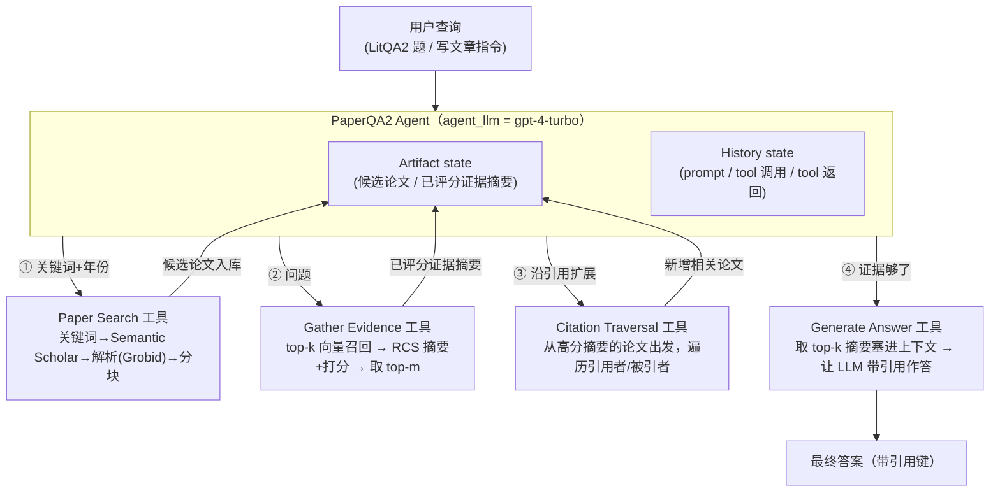

# 组会汇报 · PaperQA2：语言 agent 的「超人类」科学知识合成

> 本篇遵循 v2 规范：在前 40 篇全部硬性要求之上，每个核心组件给 **Why 三连**（问题层/设计层/结果层），
> 并设独立 `## ★ 对我们的启发（Inspires Us）` 专节。结构对齐 [`2408.06292-ai-scientist-v1.md`](2408.06292-ai-scientist-v1.md)，
> Why/Inspires 两维对齐 [`2506.13131-alphaevolve-deepmind.md`](2506.13131-alphaevolve-deepmind.md)。

---

## 1. 封面 · TL;DR

- **标题**：Language agents achieve superhuman synthesis of scientific knowledge
- **作者/机构**：Michael D. Skarlinski、Sam Cox、Jon M. Laurent、… Samuel G. Rodriques、Andrew D. White（通讯），**FutureHouse Inc.**（非营利研究机构）+ University of Rochester + Francis Crick Institute，2024-09（arXiv 2409.13740v2）。
- **权威性来源**：FutureHouse 是专做「AI for science」的非营利实验室；本文的前身 **PaperQA**（arXiv 2312.07559，原文参考文献[17]）已是文献 QA 的代表作；代码开源于 GitHub `paperqa`（原文 §7 Data Availability），全部 WikiCrow 生成文章 + 评审记录公开可下载。它的分量不在「顶会接收」，而在**第一次给『AI 在真实文献任务上超过专家』提供了一套可复核的人机对照方法学**。

**这篇在干什么（一段话）**：作者把检索增强生成 (Retrieval-Augmented Generation, RAG) 从「一次性塞片段给 LLM」改造成一个**多步 agent**——把「检索论文 (paper search)、收集证据 (gather evidence)、沿引用图回溯 (citation traversal)、生成答案 (generate answer)」都做成**工具 (tool)**，让 agent 反复检索、改写查询、先打草稿再定稿。这个系统叫 **PaperQA2**。围绕它，论文做了三件事：①提出难基准 **LitQA2**（248 道必须读正文才能答的多选题），PaperQA2 的 precision 达 **85.2%**，超过有「联网+搜索工具+一周时间」的人类专家（73.8%）；②用 PaperQA2 拼出 **WikiCrow** 写引用规范的维基风格基因文章，事实精度 **86.1%** 高于人写维基（71.2%）；③用 **ContraCrow** 在 93 篇生物论文里找矛盾，平均每篇 **2.34±1.99** 条、其中 **70%** 被专家确认。

**3 条带走的结论**：
1. **「agent 化」本身是涨点的主因**：把固定流水线（No Agent 消融）换成能「看了检索结果再决定回头改关键词」的 agent，accuracy 从 50.9% 涨到 66.0%（原文 §3，$t(3.7)=3.41,\ p=0.015$）。agent 的价值不是「更聪明地答」，而是**能回头重检索**。
2. **「超人类」是有条件的、要诚实拆解**：在 LitQA2 上 **precision 超人**（85.2% vs 73.8%，$t=3.49,\ p=0.0036$），但 **accuracy 与人无显著差异**（66.0% vs 67.7%，$p=0.66$）；在摘要写作上「精度超人」；在矛盾检测上人类几乎无法在「多对多」尺度上操作，所以是「能做人做不动的事」，而非同台对打赢。**宣称 ≠ 全面碾压**。
3. **RCS（上下文摘要重排）是 PaperQA2 区别于 Perplexity/Elicit 的命门**：在把片段塞进上下文前，先用 LLM 把每个片段**摘要并打分**（Reranking and Contextual Summarization, RCS），既抗「被无关上下文带偏」又压缩 token；去掉它（No RCS Model）会掉点（原文 §3，$t(3.92)=9.29,\ p<0.001$）。

> 主讲提示：开场一句点题——「**别人把检索结果直接喂模型，本文把检索本身做成一串工具，让 agent 边查边改**」。把「85.2 vs 73.8 / precision 超人但 accuracy 平手」立成全场记忆锚点，并预告「超人类要拆开看」。

---

## 2. 问题与动机（why —— 核心 2 页）

**问题层 why（为什么这事值得做）**：科学家每天要**检索、综合、总结**海量文献，但把 LLM 直接拿来用有三道坎（原文 §1 逐条点名）：

- **幻觉 (hallucination / confabulation)**：LLM 会「自信地说出没有任何来源支撑的信息」——在科学里这是致命的（原文 §1 第一句动机）。
- **科学需要极致的细节关注**：LLM 面对「有挑战性的推理问题」时会**忽略或误用关键细节**（原文 §1）。
- **现有基准配不上真实科研**：它们「不考虑整个文献，而是限制在摘要 (abstracts)、固定语料 (fixed corpus)、或直接给出相关论文」；更关键的是，**往往缺少与人类表现的直接对照**（原文 §1，参考[6,7,8]）。

**不解决会怎样**：你得到的只是一个「联网版自动补全」——它能复述摘要里的话，但答不了「答案藏在正文、且全文献只出现一次」的真问题，更没人知道它**到底比一个 PhD 强还是弱**。没有可复核的人机对照，「AI 能不能用于科研」永远停在口头。

**核心 intention（一句话形式化）**：建立一套**严格的人机对照方法学**，在**三类真实文献任务**（检索问答 / 摘要写作 / 矛盾检测）上量化 AI 与「不受限的人类专家（全互联网+搜索工具+时间）」的差距；并据此造一个为「高事实性」优化的 agent。

**Why（设计层，为什么是 agent 而非更大的 RAG）**：朴素做法是「把 RAG 做得更大」——更好的元数据、层次化索引去找对片段（原文 §2 提到 metadata / hierarchical indexing，参考[16]）。但作者指出：**「找到对的片段往往需要反复迭代和改写查询」**，一次性检索做不到。于是受 PaperQA[17] 启发，PaperQA2 把检索与生成当作**多步 agent 任务**（参考 MRKL[18] 的神经-符号模块化思想），而非一锤子流程。**这是全文最该被追问的设计选择**：不是模型更强，而是**把「检索」从一次动作变成一个可反复调用、可回溯的工具循环**。

> 主讲提示：把动机钉在「**幻觉 + 细节 + 没有人机对照**」三点上。强调本文最大贡献其实有两块——一块是系统（PaperQA2），一块是**方法学**（怎么公平地和「开了挂的人类」比）。后者常被忽略，却是「超人类」这个词能不能服众的关键。

---

## 3. 研究问题 / 核心假设

- **RQ**：把 RAG 改造成「检索即工具」的多步 agent，能否在**真实、开放、覆盖全文献**的科研任务上，**匹配或超越**不受限的领域专家？
- **H1（agent > 固定流水线）**：让系统**看到检索结果后再决定是否回头改查询/沿引用扩展**，会显著优于硬编码的「搜索→取证→答」固定顺序。
- **H2（RCS 抗干扰 + 提召回）**：在进上下文前先**摘要并打分**每个片段，能压制「被无关上下文带偏」（原文引[20,24]「LLM 易被无关上下文干扰 / lost in the middle」），从而提精度。
- **H3（引用图 = 一种层次化索引）**：沿「引用者/被引者」遍历一度引用，等价于「围绕已知相关论文做精细搜索」，能提召回与准确率。
- **H4（可量化的超人类）**：在严格对照（人类有联网、搜索、约一周时间、按对题给钱激励）下，AI 的优势可用 **t 检验 + 95% CI** 量化，而非口头宣称。

> 主讲提示：H1–H3 各对应后面一个消融（No Agent / No RCS Model / No Cit. Trav.），H4 对应人机对照。把「假设—消融」一一配对，听众就知道每个设计都「还了债」。

---

## 4. 相关工作定位（站在谁肩上、和谁不同）

| 维度 | 普通 RAG[14,15] | Perplexity / Elicit / Mao[21,22,23] | STORM[2]（写维基） | **PaperQA2（本文）** |
|---|---|---|---|---|
| 检索范式 | 一次性取 top-k 片段 | 取回片段、**基本不做实质变换** | 多视角提问→检索→写 | **多步 agent：检索是工具，可回头改查询** |
| 进上下文前处理 | 直接塞原片段 | 直接塞原片段 | 综合成大纲 | **RCS：逐片段 LLM 摘要+打分+重排** |
| 用引用图 | 否 | 否 | 否 | **Citation Traversal：沿一度引用扩展（§8.1.1）** |
| 与人对照 | 多用 ROUGE/文本重叠 | 无直接人评 | 用 LLM 当裁判或对比 ROUGE | **直接对人类专家盲评打分** |
| 评测语料 | 固定语料/摘要 | 在线工具 | 维基相关 | **全文献检索（LitQA2 正文级题）** |

（依据原文 §2–§4 与 Figure 1A）一句话差异：**Perplexity/Elicit「交付未经实质变换的检索片段」，PaperQA2 多了 RCS 这一步（更贵，但让 agent 能在更干净、更长的上下文里审视证据）**（原文 §2 原话："PaperQA2's design differs from similar RAG systems like Perplexity, Elicit, or Mao et al. which deliver retrieved chunks without substantial transformation"）。相对 STORM（写维基但**从不对人写维基做事实性评估**，只用 ROUGE/LLM 裁判），WikiCrow 是**第一个直接对人写维基做事实性盲评**的工作（原文 §4）。

> 主讲提示：这张表是「增量从哪来」的最佳一图。强调两条护城河——**RCS**（别人没有的「摘要+打分」中间层）和 **Citation Traversal**（把引用图当索引）。

---

## 5. 方法总览（big picture）

PaperQA2 = **一个 agent + 四个工具**，agent 维护两块状态：**Artifact state**（论文/证据等可累积的工件）与 **History state**（人类提示、工具调用与返回的对话历史）。一图流（对应原文 Figure 1A）：



agent 被一段提示词引导工具用法（原文 §8.1.1 原文）：「搜论文 → 取证据 → 收集证据里被引的论文再取证 → 答；证据不够时可：①搜更多论文（首选）②收集被引论文③换个措辞再取证；攒够 5 条以上证据后调 generate_answer，输出对用户可见、无需复述即可终止」。

> 主讲提示：让听众记住四个工具——**Search / Gather Evidence(含 RCS) / Citation Traversal / Generate Answer**，以及「**agent 可以反复回到 Search**」这一关键自由度（这正是 No Agent 消融要砍掉的东西）。

---

## 6. 符号与术语表（先定义，后文要用）

| 记号 / 术语 | 含义 |
|---|---|
| RAG | 检索增强生成 (Retrieval-Augmented Generation)：给 LLM 注入检索到的外部片段以「接地 (grounding)」 |
| chunk | 论文被切成的**文本块**；`chunksize` 默认按字符切，`overlap` 固定 750 字符（§8.1） |
| top-$k$ | 向量召回阶段保留的最相关片段数；RCS 的 `consider_sources` 默认 30（§8.1） |
| top-$m$ / `max_sources` | 最终塞进 Generate Answer 上下文的摘要数；默认 15，最高精度配置取 5（§8.1） |
| RCS | Reranking and Contextual Summarization：逐片段用 LLM**摘要+打 0–10 相关分**，再按新分重排（§2、§8.1.1） |
| $D_\text{prev}$ | Citation Traversal 中，**高分摘要所属的源论文集合**（Algorithm 1） |
| $\alpha$ | 重叠分数 (overlap fraction)，默认 $\tfrac13$；用于算引用重叠阈值 $\theta_o$（Table 1b、Alg.1） |
| $\theta_o$ | 引用重叠阈值 $\theta_o=\lceil \alpha\cdot|D_\text{prev}|\rceil$：一篇被引论文要被「至少这么多源论文」共同引用才保留 |
| precision | **答对数 / 给出回答数**（只在「敢答」的题上算） |
| accuracy | **答对数 / 全部题数**（含「弃答」算错，除非标准答案就是 null） |
| recall | LitQA2 里**答案归因到正确源 DOI 的题占比** |
| Insufficient information | LitQA2 的「弃权选项」：证据不足时 agent 可选它而非乱猜 |
| Likert 11 点 | ContraCrow 的矛盾打分尺度，0=明确一致 … 10=明确矛盾（Figure 4B） |

---

## 7. 方法细节（核心）—— 四个工具逐个 Why 三连

### 7.1 Paper Search：把用户问题翻译成关键词检索

**Why（设计层）**：朴素做法是直接拿用户问题做向量检索。但科研问题往往很长、含义复杂，**直接 embedding 检索召回差**。PaperQA2 让 agent 先把问题**改写成「关键词 + 年份范围」**（原文 §8.1.1 提示词：`[query], [start year]-[end year]`），打到 **Semantic Scholar**（默认取 12 篇候选，参考[5]），再用 **Grobid**（参考[19]，可靠解析章节/表格/引用的工具）把 PDF 转成文本，切成 chunk 存入 Artifact state。

**直觉**：搜索引擎吃「关键词」比吃「一整段问题」更准；先把问题翻译成检索词，是 agent 的第一步「外科手术」。

**读出什么**：embedding 用 OpenAI `text-embedding-large-3`，并**拼接一个 256 维的归一化稀疏关键词向量**（用 tiktoken token id 经模数编码做 one-hot），即「稠密+稀疏混合检索」（原文 §8.1.1）。这解释了为什么它对「关键术语必须命中」的题更稳。

### 7.2 Gather Evidence + RCS：本文最关键的一步

**Why（问题层）**：把 top-k 原始片段直接塞进上下文有两个病——①**被无关上下文带偏**（原文引[20]「LLM easily distracted by irrelevant context」、[24]「lost in the middle」）；②**长片段挤占上下文窗口**（标准 chunk 约 2250 token，一次塞不了几块）。

**Why（设计层，朴素替代→为何失败→本文为何更优）**：

> **Why（设计层）**：朴素做法 X = 「top-k 向量召回后直接把原文片段塞进答题上下文」（Perplexity/Elicit 即如此）→ 会因 Y：①无关片段稀释信号、降 precision，②原始片段太长、可塞数量少、召回受限 而失败；本文改用 Z = **RCS**：先 top-k 向量召回，再**对每个片段做一次 LLM 调用**，要求它「只摘与问题相关的信息、若无关就明说、并给 0–10 相关分」，输出 JSON `{summary, relevance_score}`，然后**按新分重排**取 top-m。因为：摘要把 2250 token 的片段压成 **200–400 token**，于是同一上下文能装更多来源、召回不降，同时打分把无关片段筛掉、precision 升（见原文 §2、§8.1.1 与 No RCS Model 消融 $t(3.92)=9.29,\ p<0.001$）。

逐片段注入的提示词模板（原文 §8.1.1）：

```
Excerpt from citation —— {text} —— Query: {question}
→ 要求 LLM 返回：{ "summary": "...", "relevance_score": <0–10 整数> }
```

**读出什么（结果层 why）**：① RCS 让「**更深的 top-k 排名 + 强 LLM**」成为达到人类级 accuracy 的**关键**——把 RCS ranking 深度从 1 加到 10，accuracy 显著上升（$t(2.15)=5.44,\ p=0.014$），10→30 收益递减但仍正（原文 §3）。② 一个**反直觉**发现：RCS 用**小模型（GPT-3.5-Turbo、Llama3-70B）反而比不用 RCS 更差**——说明摘要这步存在「**理解力阈值**」，模型不够强时摘要会丢信息；用 GPT-4-Turbo 做 RCS 才显著优于直塗（$t(3.47)=6.14,\ p=0.003$）（原文 §3）。这条直接推翻了前作 PaperQA「RCS 用便宜模型」的直觉（原文 §8.1.1 末句）。③ RCS 还顺带把**源论文元数据**（引用数、期刊）注入上下文，供 agent 判断可信度。

> 主讲提示：这一节是全场技术高潮。一句话总结 RCS=「**先让 LLM 把每篇证据读薄、读准、打个分，再让另一个 LLM 据此答题**」。重点抛「小模型做 RCS 反而更差」这个反直觉点——它说明「中间摘要」不是免费的，要够强的模型才接得住。

### 7.3 Citation Traversal：把引用图当层次化索引

**Why（设计层）**：朴素做法是「召回不够就再用关键词多搜几轮」。但关键词搜索可能**系统性漏掉**某些用词不同却高度相关的论文。本文假设：**「一篇相关论文的引用者/被引者，大概率也相关」**——这正是科学家顺藤摸瓜的方式（原文 §3「mirrors the way that scientists interact with the literature」）。于是从**高分摘要所属论文** $D_\text{prev}$ 出发，调 Semantic Scholar[5] + Crossref[13] 取「未来引用者 (future citers)」与「过去参考文献 (past references)」，每篇 4 次 API 调用（每方向每提供方一次），去重后并入候选池。

**关键过滤式（先定义符号，再给式子）**：遍历会带回成百上千篇候选，需要过滤。
- $D_\text{prev}$：触发遍历的**源论文集合**（来自高分摘要）；$|D_\text{prev}|$ 是其规模；
- $\alpha$：**重叠分数 (overlap fraction)**，默认 $\tfrac13$；
- 一篇被引论文的**重叠数 $o$** = 它被 $D_\text{prev}$ 里**多少篇**同时引用；
- $\theta_o$：保留阈值。

$$ \theta_o \;=\; \big\lceil\, \alpha \cdot |D_\text{prev}| \,\big\rceil $$

**读出什么**：只有「被至少 $\theta_o$ 篇源论文共同引用」的论文才保留（$o\ge\theta_o$ 才进，原文 §8.1.1 与 Table 1b）。直觉：**被越多已知相关论文共同引用 → 越可能也相关**；$\alpha=\tfrac13$ 意味着「至少三分之一的源论文都引了它」。Table 1a 给出 $|D_\text{prev}|$ 的真实分布（44.8% 的遍历只从 1 篇出发），Table 1b 显示在 $\alpha=\tfrac13$ 下哪些重叠桶被保留（Algorithm 1 的 `FilterOverlap` 还会在「同一重叠桶放不下 limit $\ell$=12 篇」时，回退用「未来引用者数」择优）。

**结果层 why**：去掉它（No Cit. Trav.）会掉 accuracy（$t(2.55)=2.14,\ p=0.069$，临界显著）并**在 PaperQA2 各阶段都显著降 DOI 召回**（$t(3)=3.4,\ p=0.022$，原文 §3、Figure 1D）。机制上：它补的是「关键词搜索系统性漏掉、但被引用图连上」的那部分论文。

### 7.4 Generate Answer：带引用、可弃权地作答

**Why（设计层）**：朴素做法是把所有证据一股脑塞给 LLM 让它自由发挥 → 易幻觉、不可溯源。本文的答题提示词强制三件事（原文 §8.1.1）：①**只用上下文、只引有效引用键**（`(Example2012Example pages 3-4)` 格式）；②**证据不足就回 "I cannot answer."**（对应 LitQA2 的 Insufficient information）；③**逐句标注哪些来源支持它**。`max_sources` 默认塞 15 条摘要，但**取 5 条精度最高**（原文 §8.1.1、§3：「15 给最高精度、5 给最高 accuracy」——注意这里 Figure 1 与 §3 文字口径，详见 §15 局限）。

**结果层 why**：`max_sources` 是 precision↔accuracy 的权衡旋钮——证据多→更可能含关键片段（accuracy↑），但也引入更多干扰（precision↓）（原文 §3，引[24]）。这把「答得准」和「答得全」拆成可调的两端。

---

## 8. 三大任务之一：LitQA2 文献问答

### 8.1 LitQA2 基准怎么造的（防刷设计是重点）

**Why（设计层）**：朴素做法是用现成的 PubMedQA[6]/BioASQ[7] —— 但它们只考摘要、或给定语料，**不能逼系统检索全文献**。LitQA2 的每道题被设计成（原文 §2、§8.2.1）：

- **答案出现在正文、不在摘要**（abstract / title 单独答不出）；
- 理想情况下**在全部科学文献里只出现一次**——于是可以用「系统引用的源 DOI 是否 == 出题人原始 DOI」直接评 recall；
- 题来自**近 36 个月**的新论文（降低被预训练记住的概率）；
- **干扰项 (distractors)** 必须在正文语境里讲得通；出题草稿用 ChatGPT 3.5/4 反复测，确保「模型还不会答」并帮助设计似真干扰项；并用 Google Scholar 反查，确保「找到答题所需句子并不 trivial」。

规模：从 LitQA(47 题) 分两阶段扩到 **248 题**（先 100、后再加 101，记 147+101）。**两阶段是刻意的反过拟合设计**：在做完大部分工程改动后才生成新的 101 题，用来检验「优化没过拟合到老题」——结果新老题 accuracy 无显著差异（原文 §2、Table 2）。

### 8.2 三个指标的精确定义式（务必看清）

> 直觉：文献 QA 允许「弃权」，所以不能只看一个数。要把「敢答时答得多准」「总体答对多少」「有没有引对源」分开量。

记号（先定义）：设题集大小 $N$；
- $C$ = **答对**的题数；$A$ = **给出了回答**（未弃权）的题数；
- $G$ = 答案**归因到了正确源 DOI** 的题数。

$$ \text{precision} \;=\; \frac{C}{A}, \qquad \text{accuracy} \;=\; \frac{C}{N}, \qquad \text{recall} \;=\; \frac{G}{N} $$

**读出什么**（原文 §2 原话）：**precision** = 「在给出回答的题里答对的比例」（弃权的题不计入分母）；**accuracy** = 「全部题里答对的比例」（弃权按错算，**除非**标准答案本就是 null，此时选 Insufficient 记为对，原文 §8.2.2）；**recall** = 「答案被正确归因到 LitQA2 标注的源 DOI 的题占比」。**precision 与 accuracy 的差，就是『弃权率』撑开的**——弃权多则 precision 虚高、accuracy 受损。

### 8.3 LitQA2 主结果（数字 + 解读）

**PaperQA2 在 LitQA2 上（原文 §2、Figure 2B，mean±SD, $n=3$ 次运行）**：

| 指标 | PaperQA2 | 人类专家 | 显著性 |
|---|---|---|---|
| precision | **85.2% ± 1.1%** | 73.8% ± 9.6% ($n=9$) | $t(8.6)=3.49,\ p=0.0036$ → **超人** |
| accuracy | **66.0% ± 1.2%** | 67.7% ± 11.9% ($n=9$) | $t(8.5)=-0.42,\ p=0.66$ → **无显著差异** |
| 选 Insufficient 比例 | **21.9% ± 0.9%** | —（原文未给出人类对应数） | —— |
| 平均用论文数/题 | **14.5 ± 0.6** 篇 | —— | 含 1.26±0.07 次搜索、0.46±0.02 次引用遍历 |

**横向对比（Figure 2B，precision / accuracy）**：PaperQA2 **在 precision 和 accuracy 上都超过所有被测 RAG 系统**——Perplexity Pro（69.7% / 52.0%）、Elicit（40.9% / 25.0%）、以及把 Gemini-1.5-Pro / GPT-4o / Claude-3.5-Sonnet / Claude-3-Opus 当 frontier 非-RAG 模型直接答（accuracy 仅 5–20%）。原文 §2 结论：**除 Elicit 外，所有被测 RAG 系统都优于 frontier 非-RAG 模型**——「会检索」比「模型更大」更重要。

**「超人类」的诚实拆解（本篇侧重）**：
- ✅ **precision 超人成立**：85.2 vs 73.8，$p=0.0036$，且这是在人类「有 PhD/在读、可联网、可用机构订阅、约一周、按对题给 $3–12/题激励」的条件下（原文 §2、§8.2.1）——对照很硬，超人可信。
- ⚠️ **accuracy 并未超人**：66.0 vs 67.7，$p=0.66$，**统计上打平**。所以「超人类」准确说是「**在『敢答时的准确率』上超人**」，不是「总体答对率超人」。
- ⚠️ **超人的机制部分来自「更会弃权」**：PaperQA2 用 21.9% 的题选了 Insufficient——它**靠『不确定就不答』把 precision 顶上去**。这对科研是好品质（少幻觉），但要讲清：**「超人 precision」与「高弃权率」是同一枚硬币**。
- ⚠️ **人类样本小**（precision/accuracy 仅 $n=9$ 评估者、SD 高达 ±9.6/±11.9）——置信区间宽，结论稳健性受样本量限制（原文未对此自我批判，此处为读者批判）。

> 主讲提示：这页是「超人类」宣称的「打假/打真」现场。先承认 precision 超人是真、对照是硬的；再点破两件事——**accuracy 只是打平**、**超人一半靠会弃权**。这样既不抹杀贡献，也不被标题党带走。

---

## 9. 任务之二：WikiCrow 摘要写作（精度超人）

**Why（设计层）**：朴素做法是「找到文档再摘要」（unconstrained summarization[26]）或「用 RAG 写维基」（STORM[2]）——但这些**从不对人写维基做事实性评估**，只比 ROUGE/文本重叠或用 LLM 当裁判。WikiCrow 改用**直接对人写维基做盲评打分**：把 PaperQA2 在「结构/功能/相互作用/临床意义」等子话题上各调一次，拼成一篇带引用的基因文章（原文 §4、Figure 3A）。

**Setting**：生成 **240** 篇人类蛋白编码基因文章（仅选已有非-stub 维基对照）；WikiCrow 平均 **1219±275 词**（比对应维基的 889.6±715 词长）；平均生成 **491.5±324 秒**、成本 **$4.48±1.02/篇**（含检索+LLM API）。从 240 篇里抽 **375** 条陈述，打乱、盲评，按「①有引用且被支持 ②缺引用 ③有引用但不被支持」分类（原文 §4、Section 8.3）。

**摘要任务的指标定义式**：
- **citation precision**（事实精度）= **被支持的有引用陈述 / 全部有引用陈述**（原文 §4「ratio of cited and supported over all cited statements」）。
- **uncited rate** = 无引用陈述占比（越低越「有据」）。

**主结果（原文 §4、Figure 3C/3D）**：

| 指标 | WikiCrow | 人写维基 | 显著性 |
|---|---|---|---|
| citation precision（事实精度） | **86.1%** | 71.2% | $p=0.0013$ → **超人** |
| "cited & unsupported"（有引用但不被支持） | **13.5%** | 24.9% | $p=0.0075,\ \chi^2(1),N=375$ |
| uncited rate（无引用） | **3.5%** | 13.6% | $p<0.001$（少 3.9×） |
| reasoning issues（推理错误） | 12 | 26 | $p=0.0144$（更少） |
| attribution issues（引用错误） | 10 | 16 | $p=0.21$（无显著差异） |

**结果层 why**：WikiCrow 的优势**主要来自「引用更规范」而非「推理更强」**——它无引用率低 3.9 倍、推理错误更少；而引用「张冠李戴」类错误与维基无显著差异（原文 §4）。一个诚实的反点（原文 §4 脚注 a）：**这条结论是 agentic RAG 设定特有的**——「GPT-4 自己裸写维基，仍会高频幻觉」。即「超人」属于**系统**，不属于**底座模型**。

> 主讲提示：强调「**WikiCrow 赢在『有一说一、句句给源』，不是赢在更聪明**」。这对我们做忠实度核查极有启发——把「事实精度」定义成「有引用且被支持的比例」本身就是一个可复用的评测协议。

---

## 10. 任务之三：ContraCrow 矛盾检测（做人做不动的事）

**Why（问题层）**：矛盾检测（claim verification / fact-checking[27,28]）本质是「**一对多**」——一条陈述要和全文献里所有相关陈述比对。规模化后变成「**多对多**」，**人类做不动**（原文 §5）。所以这里的对照不是「同台打分赢人」，而是「**能不能做人类无法在此尺度操作的任务**」。

**怎么做（原文 §5、Figure 4A）**：① 用一串 LLM 调用从论文抽取 claims、过滤；② 把每条 claim 喂给 PaperQA2 配「矛盾检测提示词」，让它在 **11 点 Likert 尺度**（0=明确一致 … 5=证据不足 … 10=明确矛盾，Figure 4B）上打分并给答案与依据。用 Likert 而非二分，是为了拿到「更可靠、可解释的分数」（原文 §5，参考[33]）。

**评测协议与指标**：
- 自建 **ContraDetect** 基准（从 LitQA2 改造）：把一半 QA 对转成**被对应论文反驳的「错误陈述」**，另一半转成**被支持的「正确陈述」**（如「草是紫的」vs「草是绿的」，原文 §5、Section 8.4.2）。
- 把 Likert 输出二值化、调阈值得 ROC，**AUC = 0.842**；阈值取 8（=contradiction）时 **accuracy 73%、precision 88%、recall 53%、FPR 7%**（原文 §5、Figure 4C）。
- 另在 42 条「从没人报告过 (no-evidence)」陈述上测，ContraCrow **98% 正确选了 "lack of evidence"(5)**——能区分「真矛盾」与「缺支持」（原文 §5）。

**主结果（原文 §5、Figure 4D/4E/4F）**：在 **93** 篇随机生物论文上，平均每篇 **35.16±21.72** 条 claim；其中 6.85% 被判为矛盾（打分 8/9/10 各占 2.89%/3.77%/0.19%）；阈值取 8 时**平均每篇 2.34±1.99 条矛盾**。人类专家复核打 8 分与 9–10 分的各 50 条，**70% 被确认为真矛盾**（F1=0.82，$p=1e^{-4}$）；据此把「**每篇可被人验证的矛盾数下界定为 1.64**」。

**诚实的边界（原文 §5 自承）**：① 在更难的「contradiction detection」对照里（只给 claim + top-15 片段、不给 ContraCrow 的推理），**人类彼此一致率 75.5% 高于人-机一致率 60.42%**（$p=0.015$）——**人比 ContraCrow 更一致，模型仍逊于人类共识**。作者推测主因是 ContraCrow **过度自信 (overconfidence)**（Figure 4G）。② 「检测到矛盾 ≠ 该陈述错」——例如「GBP 只在人成纤维细胞胞质中」被后续研究扩展，**矛盾可能只是科学迭代的正常体现**（原文 §5 末）。

> 主讲提示：这一节的对照逻辑和前两个不同——**不是赢人，而是把『人做不动』的多对多做到可规模化**。同时点破两条诚实边界：人类共识仍更一致、且「矛盾」未必「错误」。

---

## 11. 性能分析 / 消融（每个 Why 在这里还债）

原文 §3、Figure 2C/2D、Figure 5 系统拆解了「哪个部件贡献多少」（accuracy，人类参照线 67.7%）：

| 配置 | accuracy | 对照 Full(66.0%) 的含义 | 显著性 |
|---|---|---|---|
| **No Agent**（硬编码搜索→取证→答） | 50.9% | **agent 化是主力**：能回头改查询/遍历引用，才追上人 | $t(3.7)=3.41,\ p=0.015$ |
| **No RCS Model**（不摘要、直塞片段） | （precision 掉到 82.7%） | RCS 抗干扰、提精度 | $t(3.92)=9.29,\ p<0.001$ |
| **RCS 用 GPT-3.5-Turbo** | 53.2% | 小模型做 RCS **反而更差**：摘要有「理解力阈值」 | （GPT-4-Turbo 优于它 $t(3.47)=6.14,\ p=0.003$）|
| **RCS 用 Llama3-70B** | 32.0% | 同上，更差 | —— |
| **No Cit. Trav.**（去引用遍历） | 57.1% | 引用图补召回 | acc $t(2.55)=2.14,\ p=0.069$；recall $t(3)=3.4,\ p=0.022$ |
| **Top-k @1 / @5 / @10**（RCS 深度） | 45.3 / 57.1 / 62.9 | **更深的 RCS 排名是达人类级的关键** | 1→10：$t(2.15)=5.44,\ p=0.014$ |
| **Answer cutoff @5**（max_sources=5） | 86.0% precision | 证据少→precision 最高（牺牲 accuracy） | —— |
| **换底座**（Gemini-1.5 / Claude-Opus / GPT-4-Turbo 做 generate） | precision 88.6 / 89.1 / 87.2% | Claude-3-Opus 精度最高，但与 Gemini/GPT-4T 无显著差异 | —— |

**一个「反直觉但重要」的负结果（原文 §3、Figure 6）**：作者原以为「**更好的解析 (Grobid) + 更大 chunk** 会提点」，结果在 LitQA2 上**对 precision/accuracy/recall 都无显著影响**。机制解释：LitQA2 是检索任务，「答案往往就在某一段里」，对解析细节不敏感；但**WikiCrow 从表格抽数据时，好解析至关重要**（原文 §3 末、Section 8.3）。即「解析质量重要与否，取决于任务是否依赖表格/跨段信息」。

> 主讲提示：把 §7 每个 Why 与这张表一一对上——**No Agent→H1、No RCS→H2、No Cit.Trav.→H3**。特别强调两个反直觉点：①小模型做 RCS 反而更差（摘要有门槛）；②好解析在 QA 上没用、在写维基抽表格时才有用。

---

## 12. 实验设置 / 关键参数（setting / parameters 全量）

- **底座模型（原文 §8.1）**：`agent_llm` = **gpt-4-turbo-2024-04-09**（固定）；`llm`（Generate Answer）与 `summary_llm`（RCS）在 Figure 2 里被换成 Anthropic/OpenAI/Gemini 各家做消融；**temperature = 0、summary_temperature = 0**（全实验）。
- **检索**：Semantic Scholar（候选默认 12）；解析 `paperqa_default`(PyMuPDF) 或 `grobid`；embedding=OpenAI `text-embedding-large-3` + 256 维稀疏关键词向量。
- **关键参数取值（原文 §8.1）**：`overlap`=750 字符（固定）；`consider_sources`(RCS top-k)=**30**（默认）；`max_sources`(进答题上下文)=**15**（默认）/ **5**（最高精度）；`docs_index_mmr_lambda`=1.0(LitQA)/0.9(WikiCrow，促来源多样性)；Citation Traversal 的 `α`=$\tfrac13$、桶上限 `ℓ`=12。
- **评测控制**：每题 **3 次运行**（$n=3$，控 LLM 推理噪声，即便 temperature=0）；答案顺序随机化；自动评分用 **GPT-4-0613** 抽取选项字母再对标准答案（原文 §8.2.2）。
- **人类对照（原文 §8.2.1）**：9 名评估者、2 轮各 20 题、共 266 答覆盖 248 题；可联网/可用机构订阅、约一周、**禁用 AI 工具（但无强制手段）**；激励：基础 $3–6/题 + 按总体表现加成（≥80% 满加成 / 60–80% 半加成 / <60% 每对题 $1）。**第三轮把含 147 老题的那批排除**——因为部分老题已被 Google 索引、人类可 trivially 搜到，而 PaperQA2 不用 Google 网页搜索，对照不公平（原文 §8.2.2）。
- **成本**：PaperQA2 **$1–3/查询**（原文 §6）；WikiCrow **$4.48/篇**。原文 §6 自承「比低精度商用系统贵，但相对其能力便宜」。

> 主讲提示：把「**agent_llm 固定 GPT-4-Turbo、temperature=0、每题跑 3 次**」三件事讲清——这是「66.0% 不是抽样侥幸」的可信度来源。再点一句人类对照里的良心设计：**主动排除被 Google 索引的老题**，避免给人类「开外挂」。

---

## 13. 主要结果一页速览（三任务汇总）

| 任务 | PaperQA2 系统 | 关键指标 | 人类 | 结论 |
|---|---|---|---|---|
| 文献问答 LitQA2 | PaperQA2 | precision **85.2%** / accuracy **66.0%** | 73.8% / 67.7% | precision **超人**(p=.0036)、accuracy **平手**(p=.66) |
| 摘要写作 | WikiCrow | citation precision **86.1%** | 71.2% | 事实精度**超人**(p=.0013) |
| 矛盾检测 | ContraCrow | 每篇 **2.34±1.99** 条、AUC **0.842** | 人做不动 | 70% 被专家确认、下界 **1.64** 条/篇 |

> 主讲提示：一句话收口——「**三任务两种胜法**」：QA/摘要是「同台比精度赢人（precision）」，矛盾检测是「做人做不动的多对多」。

---

## 14. 局限与批判（诚实区分宣称 vs 边界）

**原文自承的边界**：
- **"超人 accuracy" 并不成立**：LitQA2 accuracy 66.0 vs 67.7 **统计打平**（$p=0.66$）——「超人」严格只在 precision 与摘要事实精度上（原文 §2、Figure 2A 自己标了 green line）。
- **矛盾检测仍逊于人类共识**：人-人一致 75.5% > 人-机一致 60.42%（$p=0.015$），主因 ContraCrow **过度自信**（原文 §5、Figure 4G）。
- **贵**：$1–3/查询、$4.48/篇，明显贵于低精度商用系统（原文 §6 自承）。
- **可复现性打折**：论文结果跑在作者机构的「更重的 HTTP 服务（用户鉴权、MongoDB/Redis 缓存、负载均衡、Dagster+k8s 编排…）」上，开源 `paperqa` 不含 Grobid 代码、不含非本地全文检索、不含引用遍历工具，且 **Paper Search 只能跑本地文件**（受版权限制，开源版给的是「自行实现检索」的 stub）（原文 §8.1）。即「**核心检索基础设施未完全开源**」。

**读者补充的批判**：
- **人类样本小、方差大**：precision/accuracy 的人类侧仅 $n=9$、SD ±9.6/±11.9，CI 宽；「超人」结论的稳健性受样本量限制（原文未自评）。
- **"超人 precision" 与「高弃权率」同源**：21.9% 弃权把 precision 顶上去；换个评测口径（强制作答）优势可能缩小。
- **`max_sources` 口径需对齐**：原文 §3 称「15 给最高 precision、5 给最高 accuracy」，而 Generate Answer 工具描述（§8.1.1）称「默认 15、5 时精度最高 (maximal accuracy with 5 at the cost of precision)」——**两处对 precision/accuracy 与 5/15 的对应表述不一致**，读者应以 Figure 5（Answer cutoff @5 precision=86.0%）为准、汇报时点出此处口径需谨慎。
- **"matches or exceeds experts" 的对照虽硬但非生态有效**：人类被禁用 AI 工具且只给约一周——这是为「公平对照」设的人为约束，**不代表真实科研中「人+AI」的上限**。

> 主讲提示：这页是「宣称 vs 实测」对照现场。守住三句话：①超人只在 precision/事实精度、accuracy 打平；②矛盾检测仍逊人类共识；③核心检索设施未全开源、对照是「人不许用 AI」的人为设定。

---

## ★ 对我们的启发（Inspires Us）

> 这一节回答：PaperQA2 对我（们）接下来的研究，**到底能用上什么**。

- ➤ **可直接借用的招（reuse）**：
  1. **RCS（逐片段「摘要+0–10 打分」中间层）**——把它原样搬进任何「检索→喂模型」管线：检索回来先让一个强模型把每块证据**读薄读准、打相关分、再重排**。它一招同时干两件事：**抗无关上下文干扰**（提 precision）+ **压缩 token 以装更多来源**（不降召回）。**关键经验：RCS 必须用够强的模型**（小模型反而更差，存在「理解力阈值」）。
  2. **「逐句给源 + 可弃权 (I cannot answer)」的答题协议**——强制每句标引用键、证据不足就弃权。这是把「忠实度」落到工程的最小实现，可直接加进 [`m9.4-deep-research-storm`](../m9.4-deep-research-storm/) 的写作端。
  3. **Citation Traversal + 重叠阈值 $\theta_o=\lceil\alpha|D_\text{prev}|\rceil$**——当关键词检索召回不够时，**把引用图当层次化索引**，用「被≥1/3 源论文共同引用」筛新论文。可作为 m9.4 检索召回的低成本增广件。

- ➤ **可迁移到我们课题（transfer）**：我们的 [`m9.4-deep-research-storm`](../m9.4-deep-research-storm/) 已有 `faithfulness.py` 做「**存在性 (exists) vs 忠实度 (faithful)**」核查。PaperQA2 给了**两个可对齐的协议**：①把「citation precision = 有引用且被支持 / 全部有引用」直接做成 m9.4 的忠实度评分；②把 RCS 的「relevance_score」当作「证据是否真支持该句」的前置过滤。迁移时要改的前提：m9.4 现在多用本地小语料 + 关键词检索，**没有 Semantic Scholar/Grobid 全文检索栈**——所以引用遍历与 256 维稀疏向量这部分**先用本地引用边/BM25 近似**，等接上真检索再升级。

- ➤ **它暴露的开放问题 = 我们的机会（opportunity）**：
  1. **「超人 precision 一半靠会弃权」** 是个没被量化拆开的缺口——**机会**：设计一个评测，把「弃权带来的 precision 增益」与「真·判别力增益」分离（如：对同一题分别测「允许弃权」与「强制作答」两套 precision）。第一步可在 m9.4 的忠实度测试里加一个 `force_answer` 开关，量化弃权对分数的贡献。
  2. **ContraCrow 过度自信、人-机一致率仅 60%** —— **机会**：给矛盾打分加一个「**校准 (calibration)**」层（如把 Likert 输出做温度缩放/conformal），看人-机一致率能否从 60% 拉近到人-人的 75%。
  3. **「矛盾 ≠ 错误」** —— 现有忠实度核查只判「支持/不支持」，没区分「真冲突 vs 科学迭代」。这正是 m9.4 `02-exists-vs-faithful` 之后**第三层**可做的事。

- ➤ **与本库其它论文/模块的连接（connect the dots）**：
  - **同题双雄**：与 [`2411.14199` OpenScholar](2411.14199-openscholar-ai2.md) 在主题组 D 正面呼应——一个重「开放检索库+引用 F1」，一个重「agent 工具循环+人机对照」，**可合成一份 D 组对照表**。
  - **补 STORM 的缺口**：[`2402.14207` STORM](2402.14207-storm-wikipedia-from-scratch.md) 从不对人写维基做事实性评估，WikiCrow 的「直接盲评 + citation precision」正好补上，可一并写进 [`m9.4`](../m9.4-deep-research-storm/) 的 `03-verifying-faithfulness` 讲义。
  - **诚信线**：ContraCrow「矛盾 ≠ 错误」「过度自信」与本库各篇「独立验证/诚信」批判线互为补充。

- ➤ **如果我来做下一步（my next move）**：我会在 [`m9.4-deep-research-storm`](../m9.4-deep-research-storm/) 的 `faithfulness.py` 里加一个**「RCS-lite」前置层**——检索回来的每个片段先用强模型产 `{summary, relevance_score}`、按分重排，再喂写作端；然后跑一组对照：①RCS-lite 是否在我们的小语料上复现「citation precision 上升」；②用 GPT-4 级 vs 小模型做摘要，验证「小模型反而更差」这个反直觉门槛是否在我们的任务上也成立。一周内能出最小结论。

> 主讲提示：这一节是全场高潮——前面讲「FutureHouse 做了什么」，这里讲「**我们下周在 m9.4 就能试什么**」。落点是 `faithfulness.py` 的 RCS-lite 与「弃权增益拆分」，能被同组同学直接接力。

---

## 15. 在 auto-research 版图的位置（相对已有论文的增量）

- **它把谁向前推了一步**：**PaperQA[17] → PaperQA2**（一次性 RAG → 多步 agent + RCS + 引用遍历）；并相对 [`2402.14207` STORM](2402.14207-storm-wikipedia-from-scratch.md)「写维基但从不对人写维基做事实性评估」，**补上了『直接对人类盲评打分』这一环**。相对 [`2411.14199` OpenScholar](2411.14199-openscholar-ai2.md)（同期、同主题 D 的科学文献合成 + 自有检索库 + 引用质量评测），二者**互为参照**：OpenScholar 重「开放检索库 + 引用 F1」，PaperQA2 重「agent 工具循环 + 人机对照 + 矛盾检测」。
- **阶梯定位**：按本库 Tool→Analyst→Scientist 阶梯，PaperQA2 站在 **Analyst（高保真文献分析与综合）**的最前沿——它**不自定义研究问题**（题目/写作指令由人给），但在「**检索-取证-综合-溯源**」这条链上做到了**可量化地匹配/超越专家**。它和 [`2408.06292` AI Scientist](2408.06292-ai-scientist-v1.md)（端到端 Scientist）互补：AI Scientist 负责「提假设→跑实验→写论文」，PaperQA2 负责把「文献综合」这一子环做扎实、做可信。
- **与本库的呼应/对立**：与 [`m9.4-deep-research-storm`](../m9.4-deep-research-storm/) 的 `faithfulness.py`「存在性 vs 忠实度」核查**直接呼应**——RCS 的「逐句给源+可弃权」正是「忠实度」的工程实现；而 ContraCrow「矛盾 ≠ 错误」与本库各篇「诚信/验证」批判线**互为补充**。

> 主讲提示：一句定位——「**PaperQA2 是 Analyst 层的天花板：不自己定题，但把『读文献、给可信答案』做到了超专家**」。再点它与 OpenScholar 的「同题双雄」关系。

---

## 16. 复现与可用性

- **开源程度**：代码在 GitHub `paperqa`（原文 §7）；全部 WikiCrow 文章 + LitQA/ContraCrow 评审记录公开（Google Cloud `fh-public/wikicrow2/`，原文 §5 脚注 a、§7）。**但**：核心检索基础设施（Grobid 集成、非本地全文检索、引用遍历、机构级 HTTP 服务）**未随开源版提供**；Paper Search 开源版只能读本地文件、给的是 stub（原文 §8.1）。
- **单卡能跑吗**：PaperQA2 本身**不需要本地 GPU**（调的是 OpenAI/Anthropic/Gemini API + Semantic Scholar），但要复现论文级结果需**自备全文 PDF 访问权 + 自建检索/缓存栈**——「能跑 demo，难复现论文规模」。
- **坑**：①RCS 用便宜模型会**掉点**（与前作直觉相反）；②`max_sources` 5↔15 是 precision↔accuracy 的旋钮，按目标调；③引用遍历依赖 Semantic Scholar/Crossref API，**三家都只给部分元数据**，需按 (title, DOI) 去重（原文 §8.1.1）。

---

## 17. 组会讨论问题

1. **「超人类」该怎么定义才诚实？** precision 超人、accuracy 打平、矛盾检测「做人做不动的事」——这三种「胜法」里，哪一种最经得起审稿人质疑？
2. **RCS 为什么用小模型反而更差？** 「摘要存在理解力阈值」这个解释够吗？能不能设计实验证伪它（如换不同规模模型测摘要保真度）？
3. PaperQA2 靠 **21.9% 弃权**把 precision 顶上去。在我们的任务里，「会弃权」是优点还是逃避？如何把「弃权增益」和「判别力增益」拆开量化？
4. **Citation Traversal 的重叠阈值** $\theta_o=\lceil\tfrac13|D_\text{prev}|\rceil$ 是个硬启发式——什么时候它会**误杀**用词不同但高度相关、却没被共同引用的关键论文？
5. ContraCrow 说「**矛盾 ≠ 错误**」（GBP 例子）。那「矛盾检测」到底在检测什么？我们做忠实度核查时，要不要区分「真冲突 / 科学迭代 / 上下文不同」三类？
6. 人类对照**禁用 AI 工具**才公平——但真实科研里人会用 AI。这个对照能支撑「AI 已可用于科研」的结论到什么程度？
7. 论文核心检索栈**未完全开源**。作为复现者，你最担心哪一块复现不出来？开源版的 stub 够不够支撑独立验证「超人 precision」？
8. PaperQA2（Analyst 层）若接上 AI Scientist（Scientist 层）做「文献综合子环」，会得到什么？接口该怎么设计？

---

## 18. 一页速记（takeaways）

- **一句话**：把 RAG 改造成「检索/取证/引用回溯都是工具」的多步 agent（PaperQA2），核心创新是 **RCS（逐片段摘要+打分+重排）** 与 **Citation Traversal（引用图当索引）**；在三类真实文献任务上**匹配或超越专家**，并提出 **LitQA2** 基准与可复核的人机对照方法学。
- **四工具**：Paper Search / Gather Evidence(含 **RCS**) / Citation Traversal / Generate Answer（带引用、可弃权）。
- **三任务两种胜法**：LitQA2 **precision 85.2% 超人**（accuracy 66.0% 打平）；WikiCrow **事实精度 86.1% 超人**；ContraCrow **每篇 2.34 条矛盾、70% 被确认**（做人做不动的多对多）。
- **指标定义**：precision=对/答，accuracy=对/全，recall=归因对源/全；citation precision=有引用且被支持/全部有引用。
- **命门 & 边界**：RCS 必须用强模型（小模型反更差）；agent 能回头重检索是涨点主因；**超人只在 precision/事实精度，accuracy 打平、矛盾检测仍逊人类共识**；$1–3/查询、核心检索栈未全开源。
- **记忆锚**：**85.2 vs 73.8（precision 超人）/ accuracy 打平 / RCS**。

---

### 质量自检（对照 v1 + v2，写完逐条核对）

- [x] 中文 + 术语中英对照（RAG / RCS / Citation Traversal / precision-accuracy-recall…）。
- [x] 每个公式前给直觉 + 先定义全部符号（precision/accuracy/recall 三式、$\theta_o$ 式、RCS JSON）。
- [x] why>how：四工具各给 Why 三连，RCS/Cit.Trav. 补足「设计层 why」（朴素替代→失败→更优）。
- [x] setting/metrics/parameters 全（底座、temperature、$n=3$、各 cutoff、α、成本、人类对照激励）；指标给定义式。
- [x] 忠于原文、标 §/Table/Eq/Figure 出处；区分「论文宣称」与「读者批判」；原文未给处标注（如人类弃权率、$\theta_o$ 完整公式仅引文标注）。
- [x] PPT 风格（小标题 + 表格 + mermaid + 关键式成块），每个二级标题配 `> 主讲提示`。
- [x] 约 20 页（≈8000 字）；YAML 头含 title/arxiv/venue/机构/主题组/一句话。
- [x] 有且仅一节 `## ★ 对我们的启发（Inspires Us）`，置于 §14 局限之后、§15 版图定位之前（符合规范），a/b/c/d/e 齐全、条条落地、含第一人称可执行下一步。
- [x] 「超人类」宣称诚实拆解（在哪些任务/对照成立、边界何在）；Inspires 连到 OpenScholar / STORM / m9.4。
