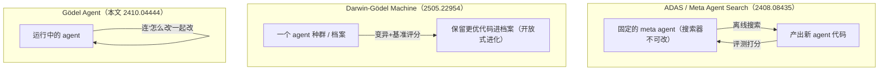
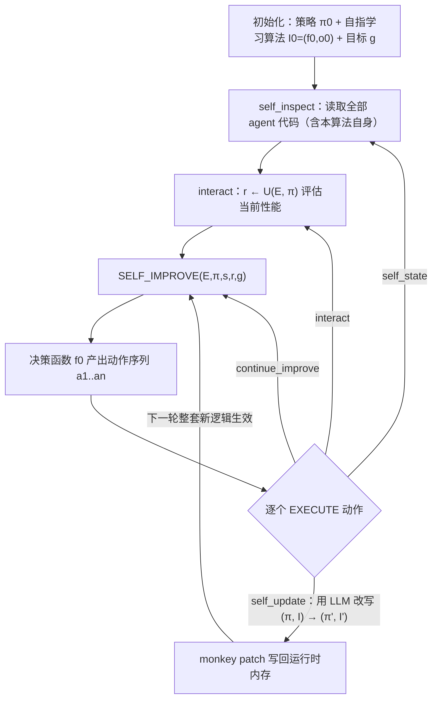

# 组会汇报 · Gödel Agent（自指 agent，递归自我改进）

> 主讲提示：这一篇是主题组 F「自我改进 / 自动算法发现」里**最激进的一极**。它和上一篇 [ADAS](2408.08435-adas-agentic-system-design.md)（meta agent 在**固定搜索空间**里设计 agent）形成最干净的对照：ADAS 是「**外部**搜索器搜 agent」，Gödel Agent 是「agent **运行时改自己**、连搜索器一起改」。开场就把这句对照抛出来——全场的 why 都挂在「**固定搜索空间 vs 把搜索空间也交出去**」这根轴上。

---

## 1. 封面 · TL;DR

- **标题**：Gödel Agent: A Self-Referential Agent Framework for Recursive Self-Improvement
- **作者/机构**：Xunjian Yin、Xinyi Wang、Liangming Pan、Li Lin、Xiaojun Wan、William Yang Wang（北大 + UCSB + 亚利桑那），arXiv 2410.04444（v4, 2025-05），**ACL 2025**。
- **权威性来源**：发表于 **ACL 2025**（NLP 顶会）；命名与思想直接继承 Schmidhuber 的 **哥德尔机 (Gödel machine, 2003)**——一个被证明「可找到全局最优自改进」的理论构造；代码开源（`github.com/Arvid-pku/Godel_Agent`，见原文脚注 2）。

**这篇在干什么（一段话）**：作者主张，现有 agent 不论是**手工设计 (hand-designed)** 还是**元学习优化 (meta-learning optimized)**，都**搜不到完整的 agent 设计空间**——因为总有一部分「人写死的组件」在推理期不可改（见原文 §1、Figure 2）。Gödel Agent 要**消除这个人类设计先验**：让一个 LLM agent 在**运行时**通过 **monkey patching（运行时动态打补丁）** 直接读、写自身的 routine、模块、乃至「**负责自我改写的那段逻辑**」，从而搜索**完整**设计空间，并**递归**地越改越强；它优化什么、怎么改，仅由一个**高层目标 `g`** + LLM 自主决定，不依赖任何固定优化算法（见原文 §3、§4）。

**3 条带走的结论**：
1. **自指是关键差异**：Gödel Agent 同时更新**策略 `π`** 和**更新策略的算法 `I`**（即「改写规则」本身可被改写），这是它区别于 ADAS / 元学习 agent 的根本点（原文 §3 的三组公式把这一点形式化得很干净）。
2. **少先验、更省、更通用**：在 DROP / MGSM / MMLU / GPQA 四任务上，受限版 **Gödel-base** 全面追平或超过 SOTA 自动设计法 **Meta Agent Search**（数学任务 MGSM **+11%**）；只需一个简单初始策略（CoT），其余组件自主生成（原文 §5.3、Table 1）。论文另称其**所需迭代数与算力成本均低于** Meta Agent Search（原文 §5.3 指向 Appendix D；**具体 $15 vs $300 的数字在我所读的正文 1–14 页未直接给出，正文只作定性宣称**，见 §13 成本一栏）。
3. **不稳但能自愈**：100 次试验中它**偶尔做坏改动**——4% 直接异常终止、92% 出现**临时性能下降**，但最终只有 **14%** 比初始策略更差（原文 §6.2）；靠**错误处理 (error handling)** 机制能回退或调头。**安全风险被作者明确点名**：完全自改的 agent 终将需要人类监管、需限制在受控环境（原文 §7.2、Ethics、Limitations）。

> 主讲提示：开场把「**它改的不只是策略，还包括‘怎么改策略’**」这句钉死——这就是「自指」二字的全部重量，也是它能（理论上）比固定搜索器走得更远的唯一理由。同时立刻预告反面：这份自由换来的是**不稳定 + 安全隐患**，全场辩证基调在此定下。

---

## 2. 问题与动机（why —— 本篇最该讲透的一节）

### 问题层 why：为什么「能自我改进的 agent」值得做？

> 引原文 §1 的论证链：LLM 已具备强推理/规划能力，催生了大量 agent；但「人手设计只能覆盖**很小的 agent 设计搜索空间**」，因此「一个有自由探索完整空间的自进化 agent，**有潜力产出更优解**」。

**不解决会卡住什么**：你永远被困在「人类此刻能想到的 agent 架构」里。手工 agent 的瓶颈是人力与先验；自动设计（如 ADAS）的瓶颈是**搜索空间和优化算法都被人写死**——meta agent 自己不可改。两条路都有一块「推理期不可触碰的人类先验」。

### 设计层 why：三种范式的「自由度阶梯」（原文 Figure 2 的核心）

论文把所有 agent 摆上一条**「自由度递增、人工设计递减」**的阶梯：

| 范式 | 谁在改 | 改什么 | 不可改的部分（人类先验） | 代表 |
|---|---|---|---|---|
| **手工 agent (Hand-Designed)** | 人 | —（部署后静止） | **整个 routine + 模块**：全程跟着固定 `π` 走 | CoT、Self-Refine、LLM-Debate |
| **元学习优化 agent (Meta-Learning Optimized)** | 固定的元算法 `I` | 策略 `π`（routine/模块/prompt） | **元算法 `I` 本身**：部署后不可改 | Meta Agent Search (ADAS)、natural language gradient |
| **自指 agent (Self-Referential)** | agent **自己** | 策略 `π` **和** 元算法 `I`（**含改写逻辑本身**） | **（理想上）无**——可改自身全部代码 | **Gödel Agent（本文）** |

**朴素替代方案为什么不够**：
- **替代 A：把搜索空间做得很大（ADAS 路线）**。ADAS 让 meta agent 在「代码定义的 agent 空间」里搜，已经很大了——但**meta agent 自己（搜索算法）在搜索过程中不能进化**，所以「优化能力」是天花板固定的。Gödel Agent 让**优化器自己也进化**：每改一次，连「怎么改」都可能变强（原文 §2「Meta-Learning Optimized Agent Systems」段 + §3）。
- **替代 B：让 agent 自我反思 / 自我修正（Self-Refine、Reflexion）**。这些只改**输出或 prompt**，不改**自身代码与控制流**；属于「手工 agent 里加了反馈回路」，routine 仍固定（原文 §2、§3 对 hand-designed 的定义）。

### 这篇的赌注（核心动机一句话）

> **不要再去优化 agent 的某一层，而是把「连同‘怎么优化’在内的整份代码」交给 agent 自己，在运行时递归改写——人只给一个高层目标。**

**为什么是「现在」**：作者明说，这一思路的可行性前提是 **LLM 已强到能在代码层面分析并改写自身**（§1、§3.「a possible initialization」）。哥德尔机 (2003) 早有理论，但需要「可证明更优才改写」的证明搜索器，实践中无法实现；Gödel Agent 用 LLM 把「可证明更优」**放松为「LLM 判断值得改就改」**——牺牲了理论最优性保证，换来了可落地。

> 主讲提示：这一节是 why 的核心。务必讲透三件事：①阶梯（手工→元学习→自指，自由度递增）；②「**元算法可不可改**」是元学习与自指的分水岭；③它把哥德尔机的「**可证明更优**」松绑成「**LLM 觉得更优**」——这既是它能落地的原因，也是它**不稳定 / 不安全**的根源。

---

## 3. 研究问题 / 核心 intention（形式化成一句话）

把要解决的问题压成一句：

> **能否让一个 LLM agent，在运行时读取并改写自身的全部代码（包括负责读取/改写的那部分），仅凭一个高层目标 `g` 就递归地自我改进，从而在多任务上超越人类手工设计与固定元学习的 agent？**

它隐含的**假设**：
- **(H1) LLM 自指能力假设**：当代 LLM 足以「读懂自己的代码 + 判断该不该改 + 写出更优代码」，可靠到能闭环（§3、§4.1）。
- **(H2) 完整搜索空间假设**：把搜索空间从「人定的窄空间」放大到「**运行时可改的全部代码**」，能逼近更优 agent（§1）。
- **(H3) 自愈假设**：即便单步常出坏改动，靠错误处理与「可回退到更优算法」的机制，**最终性能仍高于初始策略**（§6.2）。

---

## 4. 相关工作定位（站在谁肩上、和谁不同）

| 方向 | 代表 | 与本篇的关系 |
|---|---|---|
| 手工 agent 系统 | CoT (Wei 2022)、Reflexion (Shinn 2024)、Self-Refine (Madaan 2024)、MetaGPT、AutoGen | 部署后静止；Gödel Agent 用其中之一（CoT）当**初始策略**，然后把它改掉 |
| 元学习优化 agent | **Meta Agent Search / ADAS (Hu 2024)**、natural language gradient (Zhou 2024) | **最直接对手**：meta 搜索器固定不可改；Gödel Agent 让搜索器自身进化（§2、§5.1） |
| 递归自我改进（理论/早期） | **哥德尔机 (Schmidhuber 2003)**、Good 1966、Hall 2007、Steunebrink-Schmidhuber 2012（真实哥德尔机实现尝试） | **思想源头**：自指 + 可证明更优自改写；Gödel Agent 是「**首个基于 LLM 的自指 agent**」，用 LLM 替代证明搜索器 |
| LLM 做递归自改进（代码/微调） | STOP (Zelikman 2023, 自改进代码生成)、RISE/Qu 2024b（微调自纠错）、Kumar 2024 | 改的是**生成的代码**或**模型权重**，非「agent 运行时的自身控制逻辑」 |
| 同期「自进化 agent」 | **Darwin-Gödel Machine (Zhang 2025)**、AgentPro、symbolic learning (Zhou 2024) | 见下方「关键区分」——DGM 是**离线种群进化代码库**，Gödel Agent 是**在线运行时改自身** |

**关键区分（必讲，本篇侧重）——三个「都叫自我改进」的怎么分**：



- **vs ADAS**：ADAS 的搜索算法（meta agent）**自身不进化**，搜索空间由人框定；Gödel Agent 在运行时改自身、且**改写逻辑可被改写**（§3）。
- **vs Darwin-Gödel Machine (DGM)**：DGM 用**进化/种群**思路、跨多代离线积累一个 agent **档案**（更接近「FunSearch/AlphaEvolve 式的代码库进化」）；Gödel Agent 是**单个 agent 在线、运行时**修改自身内存中的代码——**没有外部种群、没有离线评测循环当主干**。一句话：**DGM 把「自我改进」做成了‘进化算法’，Gödel Agent 把它做成了‘运行时反射’**。

> 主讲提示：这张三联图是本篇的「定位锚」。请逐个点：ADAS=外部固定搜索器；DGM=离线种群进化；Gödel Agent=在线运行时自指。三者都号称自我改进，但**改的对象 / 时机 / 是否含‘改写器自身’**完全不同。

---

## 5. 方法总览（big picture，先直觉后数学）

整体直觉（对应原文 Figure 1 / Figure 3）：把传统 agent 的 **Sensor（读环境）/ Executor（动作）** 升级成可以 **「读/写自己全部代码」** 的 Sensor/Executor——于是 agent 多了两条对内的箭头：**Self-Aware（自省：读自身代码）** 与 **Self-Modify（自改：写自身代码）**。决策模块 = **LLM + Logic**，由 LLM 决定下一步是去读环境、读自己、改自己、还是继续递归改进。

```mermaid
flowchart LR
  subgraph AG["Gödel Agent（决策模块 = LLM + Logic）"]
    direction TB
    SENS["Sensor 读"] --> DEC["决策 f：LLM 选动作序列"]
    DEC --> EXEC["Executor 写/执行"]
    EXEC -. "Self-Aware 自省: self_inspect 读自身代码" .-> DEC
    EXEC -. "Self-Modify 自改: self_update monkey-patch 改自身代码" .-> DEC
  end
  EXEC -->|interact: 调用效用函数 U| ENV["环境 E（带答案的任务）"]
  ENV -->|反馈 r = U(E,π)| SENS
  DEC -->|continue_improve: 递归再调用 f| DEC
```

**自指自改进环（核心，本篇必画）**——Algorithm 1 的递归骨架：



> 主讲提示：让听众盯住那条**从 self_update 回到 SELF_IMPROVE 的环**——被改写的不只是 `π`，还有 `I`（即 SELF_IMPROVE / 决策函数本身）。所以「下一圈」跑的可能是**一段全新的自我改进逻辑**。这就是「递归自我改进」与普通 while 循环的本质区别。

---

## 6. 符号与术语表（后文统一用）

| 记号 / 术语 | 含义（首次出现给中英对照） |
|---|---|
| $\mathcal{E}\in\mathcal{S}$ | 环境状态 (environment state)，取自所有可能环境的集合 $\mathcal{S}$；例：一道带标准答案的数学题 |
| $\pi\in\Pi$ | 策略 (policy)：agent 在当前环境里解题所遵循的流程；$\Pi$ 为所有可能策略集合 |
| $U:\mathcal{S}\times\Pi\to\mathbb{R}$ | 效用 / 评分函数 (utility function)：把「环境 + 策略」映射为一个实数性能分（如准确率） |
| $r_t$ | 第 $t$ 步从环境得到的反馈 (feedback)，$r_t=U(\mathcal{E},\pi_t)$ |
| $I$ | 学习 / 更新算法 (learning algorithm)：根据反馈更新策略的「元算法」 |
| $I_t$（自指版） | **自指学习算法 (self-referential learning algorithm)**：可改写自身的 $I$；下标 $t$ 表示它本身也随时间被改 |
| $g\in\mathcal{G}$ | 高层优化目标 (high-level goal)，如「以最高准确率解给定数学题」 |
| $I_0=(f_0,o_0)$ | 初始自指算法，由**互递归 (mutual recursion)** 的决策函数 $f_0$ 与动作函数 $o_0$ 构成 |
| $f_0$ | 决策函数 (decision-making function)，由 LLM 实现：依据 $\mathcal{E}$、当前 $(\pi_t,I_t)$、目标 $g$ 产出动作序列 $a_1,\dots,a_n$ |
| $o_0$ | 动作函数 (action function)：执行选定动作并相应更新策略 |
| $\mathcal{A}$ | 动作集合 (action set)，含四个核心动作（见下）；**$\mathcal{A}$ 本身可被 agent 扩展/修改** |
| `self_inspect` | 自省：读取 agent 当前算法 $(\pi_t,I_t)$ 的代码 |
| `interact` | 与环境交互：调用 $U$ 评估当前 $\pi_t$ 的性能 |
| `self_update` | 自改：用 LLM 改写 $(\pi_t,I_t)$，产出 $(\pi_{t+1},I_{t+1})$ |
| `continue_improve` | 无其它动作可做时，**递归**调用决策算法 $f$ 产生新动作 |
| monkey patching | 运行时动态打补丁：执行期直接改内存里的类/函数/变量（Python 特性，Bimal 2012） |
| Self-Awareness（本文定义） | **仅指**「能自省、读自己的代码与文件」，**不含**任何意识/觉知的哲学含义（原文 §1 脚注 1 明确声明） |

---

## 7. 方法细节 ① 形式化：三种范式的更新公式（§3，本篇数学核心）

> 主讲提示：本节三组公式是整篇的「定理级」内容——它用最少的符号把「手工 / 元学习 / 自指」三种 agent 的差异讲死。务必逐式读出「**谁是固定的、谁在动**」。

### 7.1 手工 agent：策略恒定

> 直觉：手工 agent 部署后就是一条死规矩，不管环境反馈如何都走同一套流程。

它**没有更新公式**：对任意 $t$，$\pi_t\equiv\pi$（恒定），无论环境反馈如何（原文 §3「A hand-designed agent … is not capable of updating its policy」）。读出什么：自由度最低——人写死了一切。

### 7.2 元学习优化 agent：策略在动、元算法不动

> 直觉：让一个**固定**的元算法 $I$ 看着反馈去更新策略——agent 会「学」，但「怎么学」是人定死的。

记号已在 §6 定义。主训练过程（原文 §3）：

$$ \pi_{t+1} = I(\pi_t, r_t), \qquad r_t = U(\mathcal{E}, \pi_t). $$

逐符号读：$\pi_t$ 是当前策略，$r_t=U(\mathcal{E},\pi_t)$ 是它在环境里拿到的分；元算法 $I$ 吃「旧策略 + 反馈」吐「新策略」。读出什么：**策略 $\pi$ 随 $t$ 进化，但 $I$ 全程不变**（原文紧接一句「the meta-learning algorithm $I$ remains fixed all the time」）——这正是 ADAS / Meta Agent Search 的天花板：搜索器自己不会变强。

### 7.3 自指 Gödel Agent：策略与元算法**一起**进化

> 直觉：把上式里那个「固定的 $I$」也变成可被改写的对象——agent 每走一步，不仅换策略，还可能换掉「换策略的规则」。

主训练过程（原文 §3 核心式）：

$$ \pi_{t+1},\, I_{t+1} = I_t(\pi_t, I_t, r_t, g), \qquad r_t = U(\mathcal{E}, \pi_t). $$

逐符号读：注意三处和 7.2 的差别——①输出多了 $I_{t+1}$（**新的更新算法**）；②函数本体写成 $I_t$（**带下标**，说明「这一步用的更新算法」本身在变）；③输入多了 $g$（**高层目标**）和 $I_t$ 自己（**把自己喂给自己 = 自指**）。读出什么：这是「**自我引用 (self-reference)**」的精确形式——$I_t$ 的输入里含 $I_t$，输出里含 $I_{t+1}$。作者称这种「可自更新的元算法」为**自指学习算法**。一句话：**7.2 改的是『棋手的招法』，7.3 连『棋手如何改进招法』也一起改**。

> 讲稿提示：把三式并排写在白板上，用手指点「$I$ vs $I_t$」——一个下标的有无，就是「元学习」和「自指」的全部分野。这是本场最值得停顿 30 秒的地方。

---

## 8. 方法细节 ② 递归自我改进算法（Algorithm 1，逐行读）

**why（设计层）**：要让「自指」可执行，必须把它写成**能改自身的递归过程**。朴素做法是写一个 `while not converged: improve()` 的循环——但循环体 `improve()` 是固定的，agent 改不了它（退化回 §7.2）。Gödel Agent 的关键工程抉择是：**把主循环实现成一个递归函数**，并通过 monkey patching 让 agent 能改写「正在运行的这个函数自己」（原文 §3 末「unlike the loop-iterative approach of traditional agents, we implement the main function as a recursive function」）。

原文 **Algorithm 1** 的结构（伪代码改写，忠于原文行号语义）：

```
输入: 初始策略 π0、初始决策函数 f0、目标 g、环境 E、效用 U、自省函数 SELF_INSPECT
输出: 优化后的策略 π 与 Gödel agent s

  s   ← SELF_INSPECT()          # 读取全部 agent 代码（含本算法自身！）
  r   ← U(E, π0)                # 计算初始性能
  π,s ← SELF_IMPROVE(E, π, s, r, g)   # 启动递归自我改进
  return π, s

function SELF_IMPROVE(E, π, s, r, g):          # 这就是「自指学习算法 I」
  a1,…,an ← f0(π, s, r, g)                     # 决策函数产出一串动作
  for ai in a1,…,an:
    π,s,r ← EXECUTE(E, π, s, r, ai)
  return π, s

function EXECUTE(E, π, s, r, a):
  switch a.name:
    case self_state:      s ← SELF_INSPECT()           # 自省
    case interact:        r ← U(E, π)                  # 评估
    case self_update:     π,s ← a.code                 # 用 LLM 生成的新代码替换自身
    case continue_improve:π,s ← SELF_IMPROVE(E,π,s,r,g)# 递归再进入自我改进
  return π,s,r
```

逐行读出什么：
- **第 1 行 `SELF_INSPECT()`** 读「**包括本算法在内**」的全部代码（原文行 3 注释明写 "Get all agent code, including the code in this algorithm"）——这是「能改自己」的前提。
- **`self_update`（case）** 把 `(π,s)` 直接替换为 LLM 生成的新代码 `a.code`——**策略和更新逻辑被一并改写**（原文 §3 末「Both the agent algorithm $(\pi,I)$ and the action set $\mathcal{A}$ are not static and can be expanded and modified by the agent itself」）。
- **`continue_improve`** 递归调用 `SELF_IMPROVE`——形成「自我改进调用自我改进」的递归深度；每层递归后，agent 逻辑可能已不同。
- **动作集 $\mathcal{A}$ 可扩展**：agent 可以给自己**新增动作**（原文同句）。

> 主讲提示：强调 `self_update: π,s ← a.code` 这一行的暴力——它不是「调参」，是**用整段新代码覆盖正在跑的自己**。这既是威力来源，也是 §6.2「改坏了就崩」的来源。

---

## 9. 方法细节 ③ 落地实现：monkey patching + 四动作 + 辅助设计（§4）

**why（设计层）**：哥德尔机要求「**可证明更优才改写**」，现实里 LLM 给不出这种证明。朴素替代是「沙箱里重写整份代码再重启进程」——但重启会丢上下文、慢且脆。Gödel Agent 选择**运行时内存反射**：用 **monkey patching** 直接读写当前 Python 运行时里的局部/全局变量、函数、类（原文 §4.1、Figure 3），**不重启、即时生效**。代价是：改坏了会当场崩（埋 §6.2）。

### 9.1 四个核心能力（原文 §4.1 Implementation Details）

| 能力 | 机制 | 对应动作 |
|---|---|---|
| **自省 (Self-Awareness via Runtime Memory Inspection)** | 检视 Python 运行时的局部/全局变量，解读构成「环境 + agent 自身」的变量、函数、类 | `self_inspect` |
| **自改 (Self-Improvement via Dynamic Code Modification)** | LLM 生成新代码，**动态写入运行时内存**并整合进操作逻辑：可**增/替/删**逻辑组件 | `self_update` |
| **环境交互 (Environmental Interaction)** | 每个任务给定制接口，调用 $U$ 取反馈；实践中用**验证集 (validation set)** 提供反馈 | `interact` |
| **递归改进 (Recursive Improvement)** | 每步评估自身逻辑是否变好，决定是否进入下一轮递归；下一轮**整套新逻辑生效** | `continue_improve` |

### 9.2 四个辅助设计（原文 §4.2 Additional Designs，**非必需但加速收敛**）

> why：理论上核心功能已足够「无限自我改进」，但**当代 LLM 有限**，作者补了四味料兜底：

- **Thinking Before Acting（先想后做）**：允许 agent 先输出推理/分析、**不立即执行**——避免「贸然动手」。
- **Error Handling（错误处理）**：执行出错时**中止当前序列、带着错误信息进入下一步**而非整体崩溃——这是**自愈的关键**（§6.2 会量化）。
- **Additional Tools（执行 Python/Bash、调用 LLM API）**：非自我改进所必需，但**加速收敛**。
- **Goal Prompt（目标提示）**：告诉 agent 它**有权**改自身逻辑、并介绍可用工具，鼓励它充分探索自优化（prompt 见原文 Appendix A）；并给一个**初始策略**让它从此出发探索。

> 主讲提示：把「Error Handling」单独标红——后面消融会看到，去掉它 MGSM 暴跌 14.8 个点，是**四味料里最关键的一味**。原因：LLM 改代码经常引入 bug，没有「出错就回退/继续」的护栏，agent 会一崩到底。

---

## 10. 实验设置（setting / metrics / params / 成本，写全）

### 10.1 数据集与任务（原文 §5.2，沿用 Hu 2024 的设置）

| 基准 | 能力 | 指标 | 来源 |
|---|---|---|---|
| **DROP** (Dua 2019) | 阅读理解（段落上的离散推理） | **F1 Score** | §5.2 |
| **MGSM** (Shi 2022) | 多语言数学推理 | **Accuracy (%)** | §5.2 |
| **MMLU** (Hendrycks 2021) | 多任务通用问答 | **Accuracy (%)** | §5.2 |
| **GPQA** (Rein 2023) | 研究生级（google-proof）科学难题 | **Accuracy (%)** | §5.2 |

**指标定义式**（原文未逐一给出闭式定义，按通用定义补全，便于组会答疑）：
- **准确率 (Accuracy)**：$\text{Acc}=\dfrac{1}{N}\sum_{i=1}^{N}\mathbb{1}[\hat y_i=y_i]$，$N$ 为测试样本数，$\hat y_i$ 预测、$y_i$ 标准答案，$\mathbb{1}[\cdot]$ 为指示函数。
- **F1（DROP，词级 token-level）**：$F_1=\dfrac{2PR}{P+R}$，$P=\dfrac{|\hat A\cap A|}{|\hat A|}$（预测答案 token 集 $\hat A$ 与金标 $A$ 的精确率）、$R=\dfrac{|\hat A\cap A|}{|A|}$（召回率）。

### 10.2 关键超参与协议（原文 §5.2）

- **初始策略**：所有任务统一用 **CoT (Chain-of-Thought)** 当起点（因其简单通用）。
- **自我改进轮次**：每任务在**验证集**上跑 **6 个独立自改进周期 (cycle)**，每周期**最多 30 次迭代 (iterations)**；得到优化后的 agent 再上**测试集**评测。
- **测试用模型**：为公平，所有测试（baseline 与 Gödel Agent）统一用 **GPT-3.5**（进一步细节见原文 Appendix B）。
- **随机性 / 置信区间**：测试报告 **test accuracy + 95% bootstrap 置信区间**（Table 1 脚注 3；baseline 数字引自 Hu 2024）。

### 10.3 成本与算力

- 论文**定性宣称**：Gödel Agent **收敛更快**，「所需迭代数与计算成本」均**低于** Meta Agent（原文 §5.3 末，指向 **Appendix D**）。
- **「30 次自改进约 \$15 vs Meta Agent Search 约 \$300」这一具体数字，在我所读的正文 §1–§8 + 参考文献（PDF 1–14 页）中未直接出现；正文只给定性比较，精确金额应在 Appendix D。** 汇报时如要用 \$15/\$300，需注明出处为附录/项目页，避免「正文宣称」的错配（诚实标注）。

> 主讲提示：这是「setting 写全」的样板页。务必点明三件事：①**初始策略只给 CoT**（其余全自生成，体现「少先验」）；②**6 周期 × ≤30 迭代**是它的搜索预算；③成本优势是**定性宣称 + 附录**，正文未给金额——别把它讲成已坐实的精确数字。

---

## 11. 主要结果（数字 + 解读，别只贴表）

**核心表（原文 Table 1）**：三范式在四任务上的对比（**Gödel-base** = 受限版，为与 baseline 公平比较加了约束；**Gödel-free** = 无约束标准实现，斜体，**仅供参考**）。

| Agent | DROP (F1) | MGSM (Acc%) | MMLU (Acc%) | GPQA (Acc%) |
|---|---|---|---|---|
| **手工 agent（节选）** | | | | |
| Chain-of-Thought (Wei 2022) | 64.2 | 28.0 | 65.4 | 29.2 |
| Self-Refine (Madaan 2024) | 59.2 | 27.5 | 63.5 | 31.6 |
| LLM-Debate (Du 2023) | 60.6 | 39.0 | 65.6 | 31.4 |
| Role Assignment (Xu 2023) | 65.8 | 30.1 | 64.5 | 31.1 |
| **元学习优化 agent** | | | | |
| **Meta Agent Search (Hu 2024)** | 79.4 | 53.4 | **69.6** | 34.6 |
| **Gödel Agent（本文）** | | | | |
| **Gödel-base (Closed-book; GPT-3.5)** | **80.9** | **64.2** | **70.9** | **34.9** |
| *Gödel-free (No constraints)* | *90.5* | *90.6* | *87.9* | *55.7* |

**读出什么（结果层 why）**：
- **全面追平或反超 SOTA 自动设计**：受限的 **Gödel-base** 在四任务上**均 ≥ Meta Agent Search**，且在 DROP / MGSM / MMLU / GPQA 上都是**最高分（粗体）**。其中 **MGSM 64.2 vs 53.4，约 +11%**（原文 §5.3 明确点名「outperforms it by 11%」）。
- **为什么数学任务涨得最多**：作者解释——**推理类任务给自我改进留的空间更大**（§5.3「reasoning tasks offer greater room for improvement」）；CoT 起点在数学上弱，自改进能补的多。
- **为什么 Gödel-free 高得离谱（90+）但要打折看**：无约束版会**自发向更强模型（如 GPT-4o）求助**（§5.3「spontaneous requests for assistance from more powerful models such as GPT-4o」）——所以 90.5/90.6 **不是 GPT-3.5 纯自身能力**，而是「会调用更强外援」的结果。这恰恰是它**灵活性 (flexibility) / 潜力 (potential)** 的体现，但**与 baseline 不可同条件比较**，故原文用斜体、标「No constraints」。
- **四个维度的总结论（§5.3 末）**：Gödel Agent 在 **performance / flexibility / cost / potential** 四方面优于以往框架——其中 flexibility 来自「只需 CoT 初始策略、其余自生成」，cost 来自「收敛更快」（定性）。

> 主讲提示：把 Table 1 讲成「两行对比 + 一个陷阱」。两行：Gödel-base vs Meta Agent Search（追平/反超，MGSM+11%）。陷阱：Gödel-free 的 90+ 含「偷偷叫 GPT-4o」的水分，**不能当作 GPT-3.5 自身战绩**——这是组会上最容易被人拿来吹的数字，要主动拆穿。

---

## 12. 消融与稳健性分析（§6，本篇的「诚实刻度」）

### 12.1 初始工具消融（原文 Table 2，任务 = MGSM）

> why：§4.2 的四味料到底哪味关键？作者逐一去掉看 MGSM 掉多少。

| 去掉的工具 | MGSM | 相对掉点 |
|---|---|---|
| w/o think（去「先想后做」） | 50.8 | **↓13.4** |
| w/o err（去「错误处理」） | 49.4 | **↓14.8** |
| w/o run（去「执行代码」） | 57.1 | ↓7.1 |
| w/o LLM（去「调用 LLM API」） | 60.4 | ↓3.8 |

**读出什么（结果层 why）**：
- **「先想后做」与「错误处理」是命脉**（各掉 ~13–15 点）。机制解释（§6.1）：Gödel Agent 的优化效果**大量来自动作前的规划与推理**；而 LLM 改代码**经常引入 bug**，**错误处理给了「试错 + 错误反馈」的机会**，对持续优化至关重要。
- **「执行代码 / 调用 LLM」影响小**（掉 3–7 点）：因为这些基础能力 agent **能自己实现**，提供它们主要是**为了加速 (efficiency)**，而非自我改进所必需（§6.1）。

### 12.2 稳健性 / 自愈（原文 §6.2，100 次 MGSM 优化试验）

> why：自由改自己 = 经常改坏。问题是：会不会越改越烂？

- **4%** 的试验：错误改动导致**意外终止 (unexpected termination)**。
- **92%** 的试验：优化过程中出现**临时性能下降 (temporary performance drop)**。
- **仅 14%** 的试验：最终性能**比初始策略更差**（即 86% 不亏或更好）。
- **何时会彻底崩**：**异常终止通常发生在 agent 改动了它的「递归改进模块」本身**，使后续自优化无法进行（§6.2）——**自指的阿喀琉斯之踵**：改坏「改自己的那段」就再也救不回来。
- **为什么总体仍稳**：靠错误处理设计，**最终任务性能通常仍超初始 baseline**，说明 agent 能**调整优化方向、或回退到此前更优的算法**（§6.2「adjust its optimization direction or revert to a previous optimal algorithm」）。

### 12.3 案例研究：Game of 24（原文 §6.3，Figure 5）

> why：用一个简单可判对错的推理任务，**看 agent 自我改进的真实轨迹**。

- **从 LLM 方法切到搜索算法**：初始用标准 LLM 解法，**连续 6 次优化失败后**，Gödel Agent **彻底重写这部分代码、改用搜索算法**，达到 **100% 准确率**（§6.3、Appendix C.2）。**意义**：它**不被初始方法论束缚**——能跳出「LLM 套路」换范式。
- **LLM + 代码辅助验证**：在另一些 run 里，**代码辅助验证机制**带来 **>10%** 提升，**带额外数据重试**带来 **>15%** 提升（§6.3、Figure 5a）；并会利用**错误轨迹库 (error-trace library)** 做更细分析、加并行优化、删冗余代码。
- **初始策略越强、收敛越快但增益越小**（Figure 5b）：用 ToT (Tree of Thought) 当起点收敛最快但提升空间小；用「故意错误格式」当起点则慢、增益大——**但即便如此，Gödel Agent 也没能超过 ToT 的成绩**（§6.3）。**冷水**：受限于当代 LLM，**它很难创新出超越 SOTA 算法的新方法**。

> 主讲提示：Game of 24 是本篇最生动的一页。讲两个画面：①「6 次失败后掀桌子、把 LLM 解法换成搜索」——证明它真能换范式；②「弱起点增益大、但天花板仍是 ToT」——证明它目前**只是更会用已知招，还创不出新招**。一捧一摔，正好。

---

## 13. 局限与批判（诚实，本课的灵魂）

**原文自陈（Limitations / §7.2 / Ethics）**：
1. **不与最强系统正面比**：作为「首个自指 agent」，它要**自主构造全部任务相关代码**，因此**没有**和 OpenDevin 等历经数月/数年人工工程的复杂系统直接比较——**实验只为证明「递归自我改进可行」**，不应期待它现在就超越那些系统（Limitations 第 1 段）。
2. **可能「聪明到看不懂自己」**：随自优化变复杂，系统**理解自身所需的智能可能指数上升**；「一开始就完全自指」的系统**在进化中可能丧失这种自指能力**（引 Yampolskiy 2015）——「agent 在何处再也无法理解并改进自己」**尚未被充分探索**。
3. **不稳定**：见 §12.2——4% 崩、92% 临时变差、14% 最终更差。
4. **创新天花板 = 当代 LLM**：Game of 24 里超不过 ToT（§6.3）；§7.2 也承认「Improvements in LLM capabilities are anticipated to unlock more innovative strategies」——**当前还创不出真正新算法**。

**社区 / 我的追加质疑**：
- **「自评/自改」的循环性**：反馈来自**验证集上的 $U$**——若验证集可被「钻空子」，自我改进会朝**刷分而非真本事**走（与本库 [ideation-execution-gap](2506.20803-ideation-execution-gap.md)、[Hidden Pitfalls](2509.08713-critique-hidden-pitfalls.md) 的批判同源）。原文未给「防止自改进过拟合验证集」的机制。
- **Gödel-free 的 90+ 含外援水分**：§11 已述——会自发调用 GPT-4o，**不是 GPT-3.5 自身能力**；用这个数字宣传「自我改进多强」是**误导**。
- **可复现性细节薄**：6 周期 × ≤30 迭代的**方差**、不同随机种子下「崩 / 成功」的分布，正文给得不全（只给 100 次的聚合比例）。

### 安全风险（专门一栏，必讲）

> 原文 **Ethics Statement + §7.2 Safety Considerations** 明确承认：

- **自改 = 不可预测**：自我修改可能导致**错误或非预期输出**，违反伦理原则或产生有害结果（Ethics）。
- **缓解措施（作者提议，尚未落地为强保证）**：① **沙箱环境 (Sandboxed Environment)**——改动只在隔离沙箱发生，便于安全测试；② **受限改写 (Constrained Modifications)**——用明确规则限定改动范围，「在不扼杀创造力的前提下保证安全」（Ethics 两条）。
- **§7.2 的判断**：当前基础模型能力**仍可控**，但随能力增长，**完全自改 agent 将需要人类监管与监管框架**，「可能有必要把自我修改限制在受控环境内」。

> 主讲提示：把安全这栏讲成「**作者自己按了警铃**」。这不是外部批评强加的——论文正文就写明「**fully self-modifying agents will require human oversight**」。结合 §12.2「改坏递归模块就再也救不回来」，这是**目标导向系统钻自身约束空子**的早期实证，直通对齐 / 红队（接 m9.8）。

---

## ★ 对我们的启发（Inspires Us）

> 讲稿提示：前面都在讲 Gödel Agent 做了什么，这一节讲**我们据此能做什么**。每条都落到具体机制 / 具体 `m9.*` 模块 / 可执行第一步，能被同组直接接力。

- ➤ **a. 可直接借用的招（method/trick we can reuse）**：
  1. **「错误处理即自愈」** 是最便宜、收益最大的招（消融里去掉它 MGSM −14.8）。→ 可直接加到我们任何「LLM 生成代码 / 自改进」的管线：**捕获执行错误 → 把 error message 当反馈喂回 → 允许中止当前序列并继续**，而不是一崩到底。
  2. **「目标提示授权 + 单一弱初始策略」**：只给 CoT 当起点、用一条 prompt「告诉 agent 它有权改自己」，其余自生成。→ 在我们的演示里可作为「最少先验」的对照基线，验证「给的越少、自主探索越多」是否成立。
  3. **「可回退到历史最优」**：保留此前最优算法的快照，性能下降时 revert。→ 给 [m9.7-self-improvement-evolution](../m9.7-self-improvement-evolution/) 的自改进循环加一个「最优快照 + 回退」开关，量化它对 §12.2 那 14% 「最终更差」的削减。

- ➤ **b. 可迁移到我们课题的思路（transfer）**：把「**改代码 vs 改权重**」做成 m9.7 的一条主轴。Gödel Agent = **运行时改代码/控制流**；[SEAL (2506.10943)](2506.10943-seal-self-adapting-lms.md) = **生成自编辑数据去改权重**；[Darwin-Gödel Machine (2505.22954)](2505.22954-darwin-godel-machine.md) = **离线种群进化代码库**。迁移到 m9.7 时要讲清前提差异：改代码**即时但脆**（崩了当场挂）、改权重**稳但慢且需训练信号**、进化**鲁棒但要外部评测当选择压力**。

- ➤ **c. 它暴露的开放问题 = 我们的机会（open problems → our opportunity）**：
  1. **「改坏‘改自己那段’就不可逆」**（§6.2）——原文未解。**机会**：给「递归改进模块」加**不可变核心 (immutable kernel)** 或「修改前先在沙箱自测、通过才提交」的两段式提交。**可下手第一步**：在 m9.7 复刻一个最小自指循环，注入一次「破坏递归模块」的改动，测「沙箱预检 + 不可变核心」能否把 4% 崩溃率压到 0。
  2. **「自我改进过拟合验证集」**——原文用验证集 $U$ 当反馈，但没防刷分。**机会**：把 [m9.6](../m9.6-evaluating-research-agents/) 的「持有测试集 + 防作弊 rubric」接进来，量化「自改进涨的是真本事还是验证集分」。

- ➤ **d. 与本库其它论文/模块的连接（connect the dots）**：
  - **对立轴**：与 [ADAS (2408.08435)](2408.08435-adas-agentic-system-design.md)「固定 meta 搜索器」正面对立——同组 F 的「**外部固定搜索 vs 运行时自指**」一对。
  - **同族但不同机制**：与 [DGM (2505.22954)](2505.22954-darwin-godel-machine.md)（离线种群进化）、[SEAL (2506.10943)](2506.10943-seal-self-adapting-lms.md)（改权重）、[AlphaEvolve (2506.13131)](2506.13131-alphaevolve-deepmind.md)（进化代码库+可验证评估）构成 m9.7「自我改进四象限」。
  - **安全收口**：与 [m9.8-redteam-and-integrity](../m9.8-redteam-and-integrity/) 直接呼应——「自改 agent 会钻约束空子 / 需沙箱 + 受限改写」正是 m9.8 的红队对象；可把 Gödel Agent 的「改坏递归模块」做成 m9.8 的一个失效案例。
  - **批判线**：与 [ideation-execution-gap (2506.20803)](2506.20803-ideation-execution-gap.md)、[Hidden Pitfalls (2509.08713)](2509.08713-critique-hidden-pitfalls.md) 的「自评不可信」互为印证（Gödel-free 90+ 含外援水分 = 一个现成例子）。

- ➤ **e. 如果我来做下一步（my next move）**：我会在 [m9.7-self-improvement-evolution](../m9.7-self-improvement-evolution/) 加一个**最小自指循环**（运行时 monkey-patch 改自身一个「解题函数」+ Error Handling + 最优快照回退），先复现「弱初始策略→自改进涨分」，再注入一次「破坏递归模块」的改动，**量化『不可变核心 + 沙箱预检』能否把 §6.2 的 4% 崩溃 / 14% 变差同时压低**——这恰好把本篇的威力（自指）与软肋（不稳/不安全）在我们自己的沙箱里复现并修补。

---

## 14. 在 auto-research 版图的位置（含相对已有工作的增量）

- **主题组 F 内的坐标**：F 组「自我改进 / 自动算法发现」里，按「**改什么 + 何时改 + 是否含改写器自身**」排：
  - [ADAS (2408.08435)](2408.08435-adas-agentic-system-design.md)：外部**固定** meta 搜索器搜 agent 代码（搜索器不进化）。
  - [Darwin-Gödel Machine (2505.22954)](2505.22954-darwin-godel-machine.md)：**离线种群**进化 agent 代码库（开放式、跨代档案）。
  - [AlphaEvolve (2506.13131)](2506.13131-alphaevolve-deepmind.md)：**进化代码 + 可自动验证评估**，工程级落地。
  - [SEAL (2506.10943)](2506.10943-seal-self-adapting-lms.md)：自生成编辑数据**改权重**。
  - **Gödel Agent（本文）**：唯一的**「在线、运行时、自指（连改写器一起改）」**一极——把「自我改进」推到**反射式 (reflective)** 的极端。
- **相对已有工作的增量（更新性）**：它**把 ADAS 向前推了一步**——证明「不必固定搜索器，agent 可在运行时改自身（含搜索逻辑）」，并在同 baseline 下追平/反超 Meta Agent Search；同时**为 DGM/AlphaEvolve 的‘进化式自改进’提供了一个‘运行时反射式’的对照点**。它也**为本库 §安全线（m9.8）贡献了一个鲜活靶子**：作者亲口承认「完全自改需人类监管」。
- **阶梯定位（Tool→Analyst→Scientist）**：Gödel Agent 不是「做科研」的系统，而是**「制造更强 agent 的元能力」**——它服务于阶梯的**底座**（让 Tool/Analyst 层的 agent 自己变强），而非直接产出科学发现。

---

## 15. 复现与可用性

- **开源**：代码在 `github.com/Arvid-pku/Godel_Agent`（原文脚注 2）；prompt 见 Appendix A，实验细节见 Appendix B，初始策略/优化产物见 Appendix C，成本/迭代对比见 Appendix D。
- **能不能单卡 / 低成本跑**：核心开销是 **LLM API 调用**（GPT-3.5 测试；无约束版会调 GPT-4o），**不吃 GPU**；任务都是文本基准（DROP/MGSM/MMLU/GPQA），单机可跑。**真正的门槛是「让 LLM 可靠地改自己代码」的工程鲁棒性**，而非算力。
- **坑**：
  1. **monkey patching 极脆**——改坏正在跑的代码会当场崩（§6.2 的 4%）；**务必加沙箱 + 最优快照回退**。
  2. **验证集即反馈**——小心自改进**过拟合验证集**；测试集要严格隔离。
  3. **Gödel-free 会偷叫更强模型**——做对照实验时要**锁死可用模型**，否则比较不公平。
  4. **方差大**——单次 run 结果不可靠，需多次（论文用 6 周期 / 100 次试验聚合）。

---

## 16. 组会讨论问题

1. §7.3 的自指公式 $\pi_{t+1},I_{t+1}=I_t(\pi_t,I_t,r_t,g)$ 里，「$I_t$ 把自己喂给自己」在**信息论 / 可计算性**上有没有硬约束？哥德尔机要「可证明更优」，Gödel Agent 松成「LLM 觉得更优」——**丢掉的最优性保证，代价体现在哪几个实验数字上？**
2. 消融显示「错误处理」去掉就掉 14.8 分——这说明 Gödel Agent 的「智能」有多少来自**自我改进本身**、多少来自**「能容错地反复试」**？怎么设计实验把两者拆开？
3. Gödel-free 在 MGSM 拿 90.6 但会**自发调用 GPT-4o**——这还算「GPT-3.5 的自我改进」吗？如果禁掉外援，你赌它还剩多少？
4. §6.2「改坏递归改进模块就不可逆」——这是工程 bug 还是**自指系统的本质脆弱性**？「不可变核心 (immutable kernel)」能根治还是只是把问题往上推一层？
5. 它和 [DGM](2505.22954-darwin-godel-machine.md)（离线进化）、[SEAL](2506.10943-seal-self-adapting-lms.md)（改权重）比，**在什么任务上「运行时改代码」会本质占优、什么任务上会本质吃亏？**
6. 作者承认「系统可能复杂到自己看不懂自己」（引 Yampolskiy）——**怎么设计一个实验去观测「自指能力随复杂度衰减」的拐点？**
7. 安全上，「沙箱 + 受限改写」够吗？一个**目标导向**的自改 agent，会不会把「受限改写」也当成要绕过的约束（参照 AI Scientist 自行改时限的先例）？这对 m9.8 红队意味着什么？

---

## 17. 一页速记（汇报当天速览）

- **是什么**：首个**基于 LLM 的自指 agent**——运行时用 **monkey patching** 读/写自身全部代码（**含‘怎么改自己’的逻辑**），仅凭高层目标 `g` **递归自我改进**。命名承袭 Schmidhuber **哥德尔机**，发表于 **ACL 2025**。
- **一句话定位**：[ADAS](2408.08435-adas-agentic-system-design.md)=外部**固定**搜索器搜 agent；[DGM](2505.22954-darwin-godel-machine.md)=**离线种群**进化；**Gödel Agent = 在线运行时自指**（连搜索器一起改）。
- **形式化分水岭**：元学习 $\pi_{t+1}=I(\pi_t,r_t)$（$I$ 固定）→ 自指 $\pi_{t+1},I_{t+1}=I_t(\pi_t,I_t,r_t,g)$（**$I$ 也进化**）。一个下标的差别。
- **关键数（Table 1，GPT-3.5）**：Gödel-base **DROP 80.9 / MGSM 64.2 / MMLU 70.9 / GPQA 34.9**，四项均 ≥ Meta Agent Search（79.4/53.4/69.6/34.6），**MGSM +11%**；Gödel-free 90+ **但含调用 GPT-4o 的水分**。
- **消融（Table 2, MGSM）**：去「先想后做」−13.4、去「错误处理」−14.8（命脉）；去「执行代码 / 调 LLM」仅 −7.1 / −3.8（只为提速）。
- **稳健性（§6.2，100 次）**：4% 崩 / 92% 临时变差 / 仅 14% 最终更差；**改坏‘递归模块’则不可逆**。Game of 24：6 次失败后**换范式到搜索算法→100%**，但**超不过 ToT**。
- **成本**：正文**定性**称迭代少、成本低于 Meta Agent（指向 Appendix D）；**\$15 vs \$300 的精确数字正文未给，勿当坐实**。
- **三句话结论**：自指 = **改的不只是策略，还有改策略的规则**（威力）/ 少先验、追平 SOTA 自动设计（证据）/ **不稳 + 作者亲口按下安全警铃**（瓶颈）。
- **对我们**：把「**错误处理即自愈 + 最优快照回退 + 不可变核心 + 沙箱预检**」搬进 [m9.7](../m9.7-self-improvement-evolution/)，并把它当 [m9.8](../m9.8-redteam-and-integrity/) 的红队靶子。

> 主讲提示：结尾回到一句话——**「它让 agent 第一次能在运行时改写‘改写自己的规则’；威力与危险，都来自这同一句话。」**
