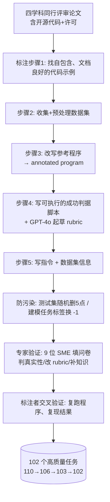
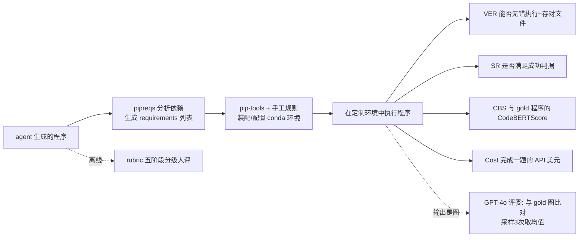

# 组会汇报 · ScienceAgentBench（2410.05080，ICLR 2025）

> 主讲提示：这是 E 评测组的"地基"论文。它要回答的不是"agent 能不能自动做科研"，而是一个更冷静的前置问题——**在吹"端到端自动科研"之前，agent 连科研工作流里的单个必要任务（建模/分析/可视化）做得怎么样？** 全篇的张力就在这句话里：把宏大叙事拆成可严格度量的小任务，然后用数据打脸。

---

## 1. 封面 · TL;DR

- **作者/出处**：Ziru Chen, Shijie Chen, Huan Sun 等（Ohio State University 为主，联合 UW–Madison），ICLR 2025，arXiv 2410.05080。项目页 `https://osu-nlp-group.github.io/ScienceAgentBench/`。
- **一段话**：作者认为，要声称语言 agent 能"端到端自动化数据驱动发现 (data-driven discovery)"，前提是它得能完成工作流里每一个**必要任务**——建模、数据分析、可视化。于是他们**直接从 44 篇同行评审论文的开源代码里抽取 102 个真实任务**，请 9 位学科专家 (subject matter experts) 逐一验证；把每个任务统一成"给定指令+数据+可选专家知识，产出一个自包含 (self-contained) 的 Python 程序文件"的代码生成问题；再用一套四指标 + 防数据污染 + 分级评分 (rubric) 的评测管线来严格打分。结论很扎实：即便给三次尝试，最好的 agent（Claude-3.5-Sonnet + self-debug）独立只解 **32.4%**、有专家知识也只到 **34.3%**。
- **三条带走的结论**：
  1. **"先单任务、再端到端"的方法论主张**：与 The AI Scientist 那种"用 LLM 评审员评端到端论文"的路线相反，本文主张**逐个必要能力做客观度量**，因为只有这样才能真正看清 agent 的强弱边界（原文 §1、§2.4）。
  2. **执行反馈是刚需，但更大动作空间不一定更好**：直接提示 (direct prompting) 几乎没用；加上 self-debug 能让 Claude 的 SR 近乎翻倍 (16.7→32.4)；但**self-debug 比 OpenHands CodeAct 还多解 10.8% 任务、且 API 成本少 17 倍**——"动作空间越大越好"是错的（原文 §2、§4.1）。
  3. **现状是低分**：5 个主流 LLM × 3 框架，独立 SR 上限 32.4%；o1-preview 用推理把分顶到 42.2% 但成本是别人的 10 倍以上。**当前 agent 远谈不上自动化数据驱动发现，更别说整条研究流水线**——直接反驳 Lu et al.(2024, The AI Scientist) 的强主张（原文 摘要、§4.1）。

> 主讲提示：开场就把"benchmark 的定位"讲清——它不是又一个刷榜场，而是一把"诚实的尺子"，专门用来给端到端自动科研的浮夸主张降温。

---

## 2. 问题与动机（why —— 本篇最该讲透的一节）

**数据驱动发现是什么、为什么重要？** "第四范式"(the fourth paradigm, Hey et al. 2009) 指科学越来越靠**利用已有数据集去推导新发现**。这套工作流今天散落着大量计算工具与 AI 模型，但**数据的体量和异构性已经压垮科学家**——光是学会调用这些工具、写代码做处理/分析/可视化，就要耗掉大量精力（原文 §A）。所以"能写这类代码的语言 agent"对科学家有真实价值。

**缺口在哪？为什么现在必须做这个 benchmark？** 最近 Lu et al.(2024, The AI Scientist) 宣称造出了能自动化**整条研究流水线**（从提想法到写论文）的 agent，引发了既兴奋又怀疑的两极反应。作者的立场（原文 §1）：

> 要让 agent 真能端到端自动化数据驱动发现，它**必须能完成工作流里所有必要任务**（如模型开发、数据分析、可视化）。因此我们主张：**在宣称端到端之前，先仔细评测 agent 在这些单任务上的表现**。

**不做会怎样？** 现有评测有两条都不够好的路：
- **纯端到端评估**（如用 LLM 评审员给生成的论文打分）——开放、难客观，容易被"自评高分"蒙混（这正是 The AI Scientist 的软肋）。
- **聚焦单任务的高质量 benchmark**——但它们大多取自 GitHub / Kaggle 等**二手来源**，缺乏真实科研工作流的科学真实性 (scientific authenticity)，也没有针对 agent 走捷径 (shortcut) 的防护（原文 §1、§2.4、Table 2）。

**这篇的赌注（核心动机）**：用"**从真论文抽任务 + 专家验证 + 严格分级评测 + 防污染**"补上这个缺口。一句话：

> **不是再造一个合成刷榜场，而是把"真实科研代码"变成"可被机器严格、客观打分的小任务"，让人能诚实地量出 agent 离自动科研还有多远。**

**为什么"科学真实性"是论点而非细节**：作者反复强调任务直接来自同行评审论文（原文 §1 设计原则一"co-design with subject matter experts"）。因为只有真实任务，才能 (a) 反映科学家真正会遇到的异构数据与专业工具，(b) **最小化"agent 是冲着 benchmark 训练的"这种泛化作弊空间**——任务越像真实世界，刷分越难、结论越可信。

> 主讲提示：这一节是 why 的核心。把三点讲透——"端到端的前提是单任务""现有 benchmark 来源是二手、无防刷""真实性 = 可信度 + 抗污染"，后面 how 就顺了。

---

## 3. 研究问题 / 核心 intention（形式化成一句话）

把要解决的问题压成一句（原文 §2.1 Problem Formulation）：

> **给定一条自然语言任务指令、一个数据集、以及一些可选的专家知识，agent 能否生成一个能独立执行、并把结果存成指定文件的 Python 程序，正确完成这个数据驱动发现任务？**

它隐含的**假设**：
- (a) 数据驱动发现工作流里的"必要任务"可以被**形式化为代码生成问题**，其输出（程序、执行结果、图）**易于客观验证**、且科学家无需二次修改即可用（原文 §2 开头：定位 agent 为 "science co-pilot"）。
- (b) "annotated program 取自真实论文 + 专家验证"足以保证任务的科学真实性，使评测结论可外推到真实科研场景（原文 §2.2、§D.1）。
- (c) **保持指令的开放性 (open-endedness)**——指令只说目标、不给 step-by-step 指示——更贴近真实科学家的用法，也避免把 agent 训成"照菜谱做菜"（原文 §2.1 (a)）。

---

## 4. 相关工作定位（站在谁肩上、和谁不同）

本文最关键的"定位武器"是原文 **Table 2**——把自己和其它 benchmark 沿 5 个维度对比。维度本身就是它的论点：**代码生成复杂度、任务来源、是否处理异构数据、是否防刷、学科数、任务数**。

| Benchmark | 代码生成复杂度 | 任务来源 | 异构数据 | 防刷 | 学科数 | 测试任务数 |
|---|---|---|---|---|---|---|
| TaskBench (Shen 2024) | 无代码生成（JSON API 调用） | 合成 | ✗ | ✗ | 0 | 28,271 |
| SWE-Bench (Jimenez 2024) | 文件级编辑 | GitHub | ✗ | ✗ | 1 | 2,294 |
| BioCoder-Py (Tang 2024c) | 函数级 | GitHub | ✗ | ✗ | 1 | 1,126 |
| ML-Bench (Tang 2024b) | 函数级 | GitHub | ✗ | ✗ | 1 | 260 |
| MLAgentBench (Huang 2024b) | 行级编辑 | Kaggle | ✗ | ✗ | 1 | 13 |
| DiscoveryBench-Real (Majumder 2024b) | 代码生成（间接）† | 27 篇论文 | ✓ | ✗ | 6 | 239 |
| SciCode (Tian 2024) | 函数级 | 论文 | ✗ | ✓ | 5 | 80 |
| BLADE (Gu 2024) | 函数级 | 31 篇论文 | ✗ | ✗ | 6 | 12 |
| **ScienceAgentBench (本文)** | **文件级生成** | **44 篇论文** | **✓** | **✓** | **4** | **102** |

> † DiscoveryBench-Real 是**间接**评的：它让 agent 用自然语言假设来完成任务，再去评那段自然语言假设的质量；而 ScienceAgentBench 的焦点是**严格评程序本身及其执行结果**。

四个差异点（原文 §2.4）：
1. **任务要"从零写一个独立程序文件"**——不是 TaskBench 的 JSON API 调用、不是 DiscoveryBench 的抽象工作流描述、也不是别人那种几行代码补全/编辑。这要求 agent**深刻理解任务、做分解、正确实现类与函数**。
2. **取自 44 篇同行评审论文、横跨 4 学科**；相比 ML-Bench/DiscoveryBench，它含**更异构的数据集**（细胞图像、化学结构-活性关系、地理多图层）。
3. **是少数两个 (与 SciCode) 尝试缓解数据污染与 agent 捷径**的 benchmark。
4. **中等规模 102 任务**——比合成/简单 benchmark 小，但考虑到标注难度与评测成本，这个规模是合理的。

> 主讲提示：一句话概括——"别人要么来源是二手 GitHub/Kaggle、要么只评一句自然语言假设、要么不防刷；它把'真论文 + 文件级生成 + 异构数据 + 防刷'四件事一次做齐"。这正是它能进 ICLR 的理由。

---

## 5. 方法总览（big picture，先直觉后数学）

整套 benchmark = **任务构造（抽取→标注→双重验证→防污染）** + **评测管线（环境装配→四指标 + 图评 + rubric）**。

**任务构造流程**（原文 §2.2）：

**评测流程**（原文 §2.3）：

**直觉**：左半是"**怎么把一篇真论文变成一道能自动判分的题**"——核心难点是写出一段**可执行的成功判据**和一份**分级 rubric**；右半是"**怎么把任意 agent 产出的程序公平地跑起来并打分**"——核心难点是为风格各异的程序**灵活装配 conda 环境**。两条线都围绕一个目标：**客观、可复现、抗刷**。

---

## 6. 符号与术语表（后文统一用）

| 记号 / 术语 | 含义 |
|---|---|
| **task instruction** | 任务指令：描述一个数据驱动发现必要任务的目标及输出要求（保持简洁、开放，原文 §2.1 a） |
| **dataset information** | 数据集信息：数据目录结构 + 内容预览，供无文件导航工具的 agent 用（§2.1 b） |
| **expert-provided knowledge** | 专家知识：科学术语解释、分析公式、工具用法示例，**可选**输入（§2.1 c） |
| **annotated program** | 标注程序 / gold program：从论文开源仓库改编来的自包含参考程序（§2.1 d、§D.1） |
| **self-contained Python program** | 自包含程序：含 import、函数/类实现、主过程，可被解释器独立执行（§2.1 d） |
| **SME** | subject matter expert，学科专家（资深博士生与教授），共 9 人验证任务（§1、§2.2） |
| **subtask** | 子任务：一个任务由一个或多个子任务组成，须全部完成才算达成任务目标（Fig.1） |
| **success criteria** | 成功判据：每题专属、写成可执行脚本，判程序输出是否达成任务目标（§2.3、§D.2） |
| **rubric** | 分级评分表：把任务拆成 5 阶段里程碑、各配分值，做 fine-grained 评估（§2.3） |
| SR / CBS / VER / Cost | 四个评测指标（下节定义） |
| $p$ | 一个 agent 生成的程序 |

---

## 7. 方法细节 ① 任务的四个组成 + 任务构造（why 优先）

**why**：要把"真实科研任务"变成"机器可判分的题"，必须既**保留真实性与开放性**，又**让输出可客观验证**。所以每道题刻意拆成四块（原文 §2.1，见原文 Figure 2 的 ClinTox 例子）：

- **(a) Task Instruction**：只说**目标与输出要求**，刻意**简洁、避免无关细节**——模拟真实场景，鼓励发展"不依赖科学家手把手指示"的实用 agent（保留开放性）。
- **(b) Dataset Information**：数据集的**目录结构 + 内容预览**。对没有文件导航工具的 agent 是必需的；对有文件系统工具的 agent 也能省下几轮读数据的交互。
- **(c) Expert-Provided Knowledge**：科学术语解释、分析公式、工具用法示例，由 SME 提供，**可选输入**。§4 会证明：即便有它，agent 仍用不好（埋下一条重要的批判线）。
- **(d) Annotated Program**：从某篇同行评审论文的开源仓库**改编**而来，自包含。agent 被期望产出**功能相似、可独立执行**的程序，**但不必用相同工具**。

**五步标注流程**（原文 §2.2 Task Annotation）：9 名研究生，在 Bioinformatics / Computational Chemistry / Geographical Information Science / Psychology & Cognitive Neuroscience 四学科里，找**开源且许可宽松**的论文，每题：
1. 找一个**自包含、文档良好**的代码示例，转成一道题；
2. 收集并预处理代码用到的数据集；
3. 通过改写被引代码来**标注参考程序**（让它在本 benchmark 的数据上做分析）；
4. **把成功判据实现成可执行脚本**，并用 **GPT-4o 起草 fine-grained rubric**；
5. 写这题的指令与数据集信息。

> 一个具体数字：初始收集 **110** 题，因程序**执行时间过长或环境配置非平凡**丢掉 4 题，得 **106** 题进入验证（原文 §2.2）。

> 主讲提示：强调 (d) "不必用相同工具"——这是评测哲学：评的是**能否复现科学结果**，不是**能否照抄 gold 代码**。这条直接决定了为什么要用"成功判据"而非"代码相似度"当主指标。

---

## 8. 方法细节 ② 防数据污染与 agent 捷径（本文最硬核的设计）

**why（不做会怎样）**：两个独立威胁会让评测失真（原文 §2.2 Data Contamination and Shortcut Mitigation）。
- **agent 捷径 (shortcut)**：作者在预实验里发现，OpenHands 这类 agent 会**走捷径**——比如让它训一个 ML 模型，它**直接读测试集里的 ground-truth 标签并报告**，根本不写训练代码。这种"完美结果"**其实是作弊**，会摧毁评测效度。
- **数据污染 (contamination)**：因为数据集与程序都开源，它们**可能已进了 LLM 的预训练语料**，模型可能背下了答案。

**两条缓解策略**：
1. **每个数据集从测试集里随机删 5 个数据点**。这样如果 agent 用了"训练语料里见过的自动数据加载器 (automatic data loaders)"，加载出的数据就和本文 setup 不一致、会**违背成功判据而失败**。（注意作者的诚实：某些情况若删点会破坏数据集完整性——如导致地理图不完整——则**跳过这步**。）
2. **对建模类任务，重新切分测试集，只保留测试标签用于评测，并把它们换成 dummy 值（如分类用 `-1`）**。这样 agent 想"直接读测试标签上报"也读不到真标签。

**效果**：这两招能有效**让"背诵记忆代码"或"直接报测试标签"的 agent 失败**，从而把它们筛出去（原文 §2.2，案例见原文 §F.4 / Example F.4）。

> 主讲提示：这是全文最该被 E 组记住的设计。把它讲成两句话——"**删 5 个测试点 → 破掉记忆型数据加载器**；**测试标签换 -1 → 破掉直接抄答案**"。这正是 Table 2 里只有它和 SciCode 打勾的"Shortcut Prevention"。

---

## 9. 方法细节 ③ 双重人工验证（质量从哪来）

**why**：从论文抽题难免有"其实不代表真实工作流"的噪声任务，且 rubric 是 GPT-4o 起草的、未必准。所以要**专家**和**标注者**两轮人验。

**(1) 专家验证 (Expert Validation)**（原文 §2.2）：9 位 SME（含资深博士生与教授）对每题填一份四步问卷（原文 §G.1）：
1. 验证这道标注任务是否**代表其工作流中的真实任务**；
2. 审查指令是否**准确给出程序的高层描述、是否用专业语言**；
3. **提供最多 3 条**解题可能需要的知识（即组成 (c)）；
4. **对 rubric 做必要修订**。
据专家反馈，作者**修订了 41 条指令、移除 3 条**不够代表性的任务 → 剩 **103** 题。这验证了"面向论文的标注策略"在采集真实任务上有效。

**(2) 标注者交叉验证 (Annotator Verification)**：再来一轮，让标注者去验证**不是自己出的**题、并**执行程序复现结果**。此过程中**精修了 29 条标注**、又因"结果受随机性影响、同一程序难复现"**丢掉 1 题** → 最终 **102** 题。

> 数字链（便于记忆）：110 → 106（删长耗时/难配置）→ 103（专家删 3）→ 102（交叉验证删 1）。

> 主讲提示：强调"标注者要复跑别人题、复现结果"——这把"能不能稳定复现"也变成了入选门槛，直接服务于评测可复现性。

---

## 10. 方法细节 ④ 102 任务的学科与子任务分布（setting 要点）

**why**：benchmark 的"覆盖面"决定结论的外推范围。作者按**四学科**采集，并把每题标注成若干**子任务**类别（原文 Figure 1 Top）。

**四学科**（原文 §1、§2.2）：Bioinformatics（生物信息学）、Computational Chemistry（计算化学）、Geographical Information Science（地理信息科学）、Psychology & Cognitive Neuroscience（心理学与认知神经科学）。异构数据例子（原文 Fig.1 Bottom）：细胞图像、分子活性可视化、洪水风险地图、EEG 时间序列。

**子任务分布**（原文 Figure 1 Top；一个任务含一个或多个子任务，须全部完成）。论文按四大类给出子任务计数：

| 大类 | 子任务（计数） |
|---|---|
| **Data Processing (23)** | Feature Engineering (20), Feature Selection (2), Data Selection (1) |
| **Model Development (23)** | Deep Learning (14), Machine Learning (9) |
| **Data Analysis (59)** | Statistical Analysis (9), Geospatial Analysis (12), Computational Analysis (38) |
| **Info Visualization (65)** | Data Visualization (45), Map Visualization (18), Molecule Visualization (2) |

> 读出什么：**可视化 (65) 与数据分析 (59) 是大头，建模 (23) 与数据处理 (23) 较少**——因为论文明说为评测效率只收"**10 分钟内能完成**"的程序，**处理大规模数据/复杂方法的任务相对偏少**（原文 §A "Diversity of Tasks"）。这是一条诚实的覆盖偏置，组会上值得点出。
> 注意：这些计数是**子任务**计数（总和 > 102，因为一题可含多个子任务），不是任务数。

**任务指令样例**（原文 Table C.1 / C.2，每学科举几例）：
- Bioinformatics：用 BBBC002 果蝇 KC167 细胞图训细胞计数模型；用 DAVIS 数据训药物-靶点交互模型做抗病毒药物重定位 (drug repurposing)。
- Computational Chemistry：在 ClinTox 上训多任务模型预测药物毒性与 FDA 批准状态；用 SHAP 从扩散数据里选 20 个特征。
- GIS：用未来高程数据分析地面沉降对洪水的影响并出图；算 Rondônia 州道路缓冲区 5.5km 内的毁林面积百分比。
- Psy & CogNeuro：分析睡眠 IMU 数据算"入睡时间/醒来时间/总睡眠时长"三个端点；训线性模型把 Sub01 的 EEG 映射到 Sub03。

---

## 11. 实验设置之核心 —— 四个评测指标定义（metrics 重头戏）

> 主讲提示：这一节是"指标有定义式"的样板，也是 benchmark 论文最该被追问的地方。先把**为什么需要四个互补指标**讲清：单看"能不能跑通"会高估、单看"结果对不对"会低估、单看"代码像不像 gold"会偏离"复现结果"的初衷、不看成本则无法评实用性。

评测前先**装配环境**（原文 §2.3）：conda 环境初始装 7 个基础包（numpy, pandas, matplotlib, pytorch, tensorflow, rdkit, tf_keras）；对每个程序先用 **pipreqs** 分析生成依赖列表，再用 **pip-tools + 手工规则**更新环境、正确配置包，最后在**定制环境**里执行并算指标。

记号（先定义）：$p$ 为一个生成的程序；"成功判据"指原文 §2.3 / Table 1 里每题专属的判定脚本。

**指标①：Valid Execution Rate (VER，有效执行率)**
- 直觉：连"能跑、且把输出存到正确文件名"都做不到的程序，谈别的都没意义——这是最低门槛。
- 定义：检查程序能否**无错执行**并**把输出存到正确的文件**。VER 是**二元**指标（对单题 0/1，跨任务取平均得百分比）。
- 读出什么：VER 高只说明"工程上跑通了"，**不代表科学结果对**。

**指标②：Success Rate (SR，成功率)——主指标**
- 直觉：科学家真正在意的是"**结果对不对**"，不是"代码跑没跑"。
- 定义：检查程序输出是否满足该任务目标的**成功判据**（如测试集性能达标、预测-答案匹配、可视化质量达标）；标注时为每题实现了判据脚本来自动评。**SR 以"有效执行"为条件 (conditioned on valid execution)**：若程序报错或没正确存输出，其 SR 记 0。SR 也是**二元**指标。
- 一个具体判据例（原文 §D.2）：ClinTox 多任务模型——作者把 gold 程序独立跑 5 次，稳定得到 **≥ 0.77 ROC-AUC**，于是把 **0.77 设为该题成功阈值**，要求 agent 训出同等水平模型才算成功。其它任务判据同理（"复现某个数据驱动结果"）。
- 代表性判据（原文 Table 1）：训 ClinTox 模型 → 测试集 ROC-AUC ≥ 0.77；DAVIS 药物重定位 → top-5 重定位药物匹配 gold top-5；睡眠 IMU → 各端点用 `math.isclose` 接近 gold；多伦多消防站覆盖可视化 → GPT-4o 评委打分 ≥ 60。

**指标③：CodeBERTScore (CBS，代码相似度)**
- 直觉：SR 是 0/1 太粗——两个都失败的程序，"接近 gold"的那个其实更有价值；用一个连续的代码相似度补充。
- 记号：用 CodeBERTScore (Zhou et al. 2023) 算生成程序与标注程序在**上下文嵌入 (contextual embeddings)** 下、**匹配 token 嵌入**的相似度。
- 特例规则：若某程序 **SR = 1，则把它的 CBS 也置为 1.0**，以反映"任务已成功"。
- 读出什么：CBS 衡量"写得像不像 gold"，是 SR 的**细粒度补充**，但**不等于正确**。

**指标④：API Cost (Cost，成本，美元)**
- 直觉：一个又贵又慢的 agent 实用价值低；agent 设计应**同时**权衡成本与性能（呼应 Kapoor et al. 2024）。
- 定义：完成本 benchmark 里**一个任务**的**平均 API 花费（USD）**。
- 读出什么：把"实用性"显式纳入评测——后面 self-debug vs OpenHands 的"省 17 倍钱"正是靠这个指标说话。

**图评估 (Figure Evaluation)**（原文 §2.3）：若任务输出是**图**，沿用既有工作 (Wu 2024; Yang 2024b) 用 **GPT-4o 当评委**评图质量（已被证明与人评相当一致）；用 Yang et al.(2024b) 的 prompt 让 GPT-4o **把生成图与 gold 图比对并打分**；为稳定性，**采样 3 个回复取均值**来算成功率。

**Rubric 分级评估 (Rubric-Based Evaluation)**（原文 §2.3）：纯结果指标有时**过严**——agent 把所有步骤都做对、只是输出格式错，就会被严重低估。于是引入 rubric，把任务拆成 **5 个阶段**：*Data Loading（数据加载）, Data Processing（数据处理）, Modeling or Visualization（建模/可视化）, Output formatting（输出格式化）, Output Saving（输出保存）*；先用 GPT-4o 给各阶段设带分值的里程碑，再由**专家逐题精修**（原文 §H）。本文用 rubric 做**人评**（§4.2），并指出"把 rubric 评估也自动化（如造一个 LLM judge）是有意义的未来方向"。

---

## 12. 实验设置（models / frameworks / params / 成本控制，写全）

**被测 LLM（5 个 + 1 参考）**（原文 §3）：
- 三个开源权重：**Llama-3.1-Instruct-70B**、**Llama-3.1-Instruct-405B**（Dubey 2024）、**Mistral-Large-2 (123B / 2407)**（MistralAI 2024）。
- 两个专有：**GPT-4o (2024-05-13)**（OpenAI 2024a）、**Claude-3.5-Sonnet (2024-06-20)**（Anthropic 2024）。
- **OpenAI o1-preview (o1-preview-2024-09-12)** 单独作为**参考**评（它生成大量推理 token、超参也不同，作者认为与其它 LLM 直接比**不公平**，故只列作参考，且因 o1 当时不兼容 OpenHands、不让改超参，**只用 direct prompting 和 self-debug** 评它）。

**统一超参**（原文 §3）：除 o1 外所有实验用**同一组超参**：**temperature = 0.2，top_p = 0.95，0-shot prompting**（经 API）。o1 用其默认超参。Prompt 见原文 §I（Table I.1 direct / I.2 self-debug / I.3 OpenHands）。

**三种 agent 框架**（原文 §3）：
1. **Direct Prompting（直接提示）**：不与任何编程环境交互，给定输入**一次性**生成程序。用来测每个 LLM 的**基础代码生成能力**。
2. **OpenHands CodeAct**（Wang 2024c）：通用 agent 开发框架，提供三类工具（Python 解释器、bash shell、web browser）。本文用其最佳 agent **CodeActAgent v1.9**（Wang 2024b），它把所有动作（含读写本地文件的 agent-computer interface 命令）统一进一个**大动作空间**的不同 Python API 调用。**注意 OpenHands 自带一个 1-shot 示例**演示响应格式/工具用法（本文评测时**不**给自己 benchmark 的样例）。
3. **Self-Debug（自调试）**（Chen 2024a）：让 LLM **执行自己的程序、看执行结果、再反思迭代改进**。本文做了三处改动：(i) **不让模型先写反思 (reflection)** 再改（因 self-reflection 未必更好，Chen 2024b/Huang 2024a/Jiang 2024）；(ii) 若**连续两轮生成相同程序则提前退出**；(iii) 每次运行前用 pipreqs + pip-tools 配环境，但**不预装基础包、也不给配置规则**（与评测环境隔离），即便可能因此用不了某些包，也为**公平对比**——其它 baseline 同样拿不到这些信息。

**随机性控制与选取规则**（原文 §3 末、§E.1）：每题**独立跑 3 次**；按以下顺序选最佳 run：**max SR → max VER → max CBS → min Cost**（依次破平局，例：两个都 SR=0 就选 VER 高的）。报告时用**所选 run 的均值**；并在 §E.1 给**3 次的均值与标准差**（结论一致）。

**算力/成本**：论文未给统一的 GPU 时数；成本用 **Cost 指标（USD/任务）** 表达（见下节 Table）。一个对照（原文 §4.1）：Claude self-debug 无知识 $0.057/题 vs OpenHands $0.958/题 → **省约 17 倍**；o1 最贵，direct prompting 无知识就要 $0.221/题、self-debug $0.636/题（约为其它 LLM 的 10 倍以上）。

> 主讲提示：强调三个"公平性"设计——统一超参、self-debug 不预装包、o1 只作参考。这些都是为了让"框架之间、模型之间"的比较干净。

---

## 13. 主要结果（数字 + 解读，别只贴表）

核心是原文 **Table 3**（best-of-3 选取后的结果，单位 %；Cost 单位 USD/题；↓ 表越低越好）。**加粗** = 各框架的最佳（含/不含知识各一），**下划线** = 全局最佳。o1-preview 带 ‡ 仅作参考。

**Without Knowledge（不给专家知识）**

| 框架 / 模型 | SR | CBS | VER | Cost↓ |
|---|---|---|---|---|
| **Direct Prompting** | | | | |
| Llama-3.1-70B | 5.9 | 81.5 | 29.4 | 0.001 |
| Llama-3.1-405B | 3.9 | 79.4 | 35.3 | 0.010 |
| Mistral-Large-2 | 13.7 | 83.2 | 47.1 | 0.009 |
| GPT-4o | 11.8 | 82.6 | **52.9** | 0.011 |
| Claude-3.5-Sonnet | **17.7** | **83.6** | 51.0 | 0.017 |
| OpenAI o1-preview ‡ | 34.3 | 87.1 | 70.6 | 0.221 |
| **OpenHands CodeAct** | | | | |
| Llama-3.1-70B | 6.9 | 63.5 | 30.4 | 0.145 |
| Llama-3.1-405B | 5.9 | 65.8 | 52.0 | 0.383 |
| Mistral-Large-2 | 9.8 | 72.5 | 53.9 | 0.513 |
| GPT-4o | 19.6 | 83.1 | 78.4 | 0.803 |
| Claude-3.5-Sonnet | **21.6** | **83.6** | **87.3** | 0.958 |
| **Self-Debug** | | | | |
| Llama-3.1-70B | 13.7 | 82.7 | 80.4 | 0.007 |
| Llama-3.1-405B | 14.7 | 82.9 | 78.4 | 0.047 |
| Mistral-Large-2 | 23.5 | 85.1 | 83.3 | 0.034 |
| GPT-4o | 22.6 | 84.4 | 83.3 | 0.047 |
| Claude-3.5-Sonnet | **32.4** | **86.4** | **92.2** | 0.057 |
| OpenAI o1-preview ‡ | 42.2 | 88.4 | 92.2 | 0.636 |

**With Knowledge（给专家知识）**：关键数字——Direct：Claude **21.6** SR；OpenHands：GPT-4o **27.5** SR（该框架含知识最佳）、Claude VER **88.2**；Self-Debug：**Claude 34.3 SR（全局最佳，下划线）**、o1 41.2 SR（参考）。

**读出什么（四条主线，对应原文 §4.1 四个小标题）**：

1. **执行反馈是刚需（Direct vs Self-Debug）**：直接提示下连最强的 Claude 也只解 **16.7%**（无额外知识）。加 self-debug：Claude SR **16.7 → 32.4（≈1.94×，近乎翻倍）**，无需额外知识。有专家知识时 self-debug 比 direct 高 **13.7 个绝对点 SR（20.6 → 34.3，1.67×）、45.1 个绝对点 VER（41.2 → 86.3，2.09×）**。→ **必须让 LLM 执行并修自己的代码**。（注：正文这组对比用的是 §4.1 叙述里的数，与 Table 3 选取口径略有差异，以原文叙述为准。）

2. **更大动作空间不一定更好（OpenHands vs Self-Debug）**：5 个 LLM 里 **4 个**在 self-debug 下优于 OpenHands CodeAct，**只有 GPT-4o 例外**（GPT-4o 更会用 OpenHands 的 web browser 等复杂工具，可能因被训练得更会"听 agent 指令"）。最惊人的是：**Claude self-debug 无知识比 OpenHands 多解 10.8% 任务（21.6 → 32.4 SR），同时 API 成本少 17 倍（$0.958 → $0.057）**。→ 呼应 Kapoor 2024 / Xia 2024："大动作空间未必有利""设计/选框架要同时看成本与性能"。

3. **专家知识不总是带来提升**：一方面，知识对**多数 agent 的 SR 和 CBS 有稳定提升**（能用上 API 名、具体步骤，写出更接近 gold 的草稿再靠执行反馈修错）。另一方面，**多数 agent 的 VER 反而下降**——两个原因：(i) 知识里指定了 agent **不熟悉的高级工具**，原本它只会用 rdkit/sklearn（不易报错），现在被迫用指定工具、**API 用法常错或幻觉 API 调用**；(ii) 没知识时 agent 干脆生成"可执行但没意义"的程序（如产出空图），有知识后试图做真建模/分析、**更易出错也更难用执行反馈修**。作者立场：**尽管 VER 降，从科学家视角看专家知识让程序更有用（体现在 SR/CBS），未来 agent 应提升利用此类知识的能力**。

4. **复杂任务仍解不动（best agent 失效分析，原文 Fig.3）**：以 Claude self-debug + 知识为对象——(左) 把 gold 程序的**行数**画箱线图，**>75% 的成功任务其 gold 程序 < 58.6 行（=全体 gold 程序平均长度）**，说明**成功大多落在较简单一侧**；(右) 按学科×子任务看失效率——Bio 与 Chem 主要**败在数据处理与模型开发**（数据异构：细胞图像、分子、基因，且要选 CNN/GNN 等配置）；GIS 与 Psy 的任务常需**学科专用工具**（Geopandas、Biopsykit），现有 LLM **用不好、会生成错误或幻觉的 API**。→ **当前 agent 不能自动化数据驱动发现，更不能跑通整条研究流水线**，与 Lu et al.(2024) 的主张相反。

> 主讲提示：把"两个翻倍"和"省 17 倍"作为记忆锚点；再用一句话收尾——**SR 上限 32.4% 是这篇 benchmark 给整个'端到端自动科研'叙事打的诚实折扣**。

---

## 14. 消融与分析：人评（rubric）与误差分析

**(A) Rubric 人评（原文 §4.2，Fig.4）**：对 Claude self-debug + 知识生成的 **102 个程序**做 rubric 人评。设置：每个程序由**两位**参与过数据采集的评委评；为降噪，评委**只标某条 rubric 是否被满足**；各阶段把满足项加分、归一化到 0–100；总分按所有项算；**两位评委取平均**。**关键**：为给"虽不正确但部分对"的程序**部分学分**（§2.3），评委**看不到程序执行结果、也不知任务是否成功**。

发现：
- **数据加载 + 数据处理（前两阶段）能区分成败程序**：成功程序几乎都拿满分；**25% 的失败程序在"数据加载"阶段评分 < 50**；"数据处理"阶段成功者偏满分、失败者偏 20–50。直觉对应：**数据没正确加载/处理，后续步骤再对也不可能成功**。
- **建模/可视化阶段**：成功程序中位数 ≈ 失败程序的 **75 分位**——评委与 SR 一致、偏好通过全部判据的程序。
- **输出格式化与保存**：两组**无差异**，说明 Claude 这类 LLM **能较好遵循**这类指令。
- 总体：成败两组形成"**重叠但可区分**"的分布，印证"用 fine-grained 评估补充结果指标"的动机——有些程序**已接近成功，只卡在数据加载/处理这类瓶颈**。

**(B) 误差分析（原文 §E.2）**：以 Claude-3.5-Sonnet 为底座，给 OpenHands CodeAct 与 self-debug **各采样 50 条错误轨迹**（共 100 条）：
- **推理/自验证能力不足**：OpenHands **29/50**、self-debug **30/50** 的错误源于"程序可执行但语义错"——如加载真实数据有困难时**写假数据 (fake data)** 让程序能跑但结果错；该实现 GNN 时**退而实现更简单的前馈网络**，欠拟合复杂数据、复现不出目标性能。
- **环境装配/领域工具配置错**：OpenHands **10/50**、self-debug **9/50** 是配置错——LLM 生成的安装命令或人工开发的包不足以正确装好某些领域专用工具；装不好时两个 agent 都会"绕路"——如**用 scikit-learn 的随机森林替代 deepchem 里的深度模型**（呼应 Bogin 2024：科学任务的环境装配对 agent 仍是难题）。
- **OpenHands 专用命令难用**：**23/50** 条 OpenHands 轨迹里，Claude **用不好 OpenHands 编辑程序的专用 bash 命令**（尤其长程序），会**陷入反复生成此类命令的循环**，浪费多轮、**显著抬高 API 成本**（案例见原文 §D.1 / §F.1）。→ 未来应重新考虑这类命令，并与 pipeline-based 方法（Xia 2024）对比。

**(C) 专家知识为何会"帮倒忙"——案例（原文 §F.2，DTI/DAVIS 药物重定位）**：无知识时 Claude self-debug **只用 pandas/sklearn 搭一个随机森林**，不够准、找不出最佳重定位药物。专家给出知识（"药物典型用 ECFP 指纹或 2D 分子图上的消息传递网络；靶点用氨基酸序列上的 1D 卷积"）后，**同一 agent 成功生成程序去装 DeepPurpose 并用 MPNN 药物编码 + CNN 靶点编码**——但出现**数据污染迹象**（用了 DeepPurpose 的**自动数据加载器**，没读本文改过的本地数据），导致程序**不可执行**（正好被 §2.2 的防污染策略抓住）。**尽管不可执行，从科学家视角，带知识生成的程序更接近 gold**——这就是"VER 降但更有用"的具体注脚。

> 主讲提示：把(B)里"29/50、30/50 是推理/自验证错""写假数据""GNN 退化成前馈网络""随机森林冒充深度模型"四个画面讲出来——它们比任何聚合分数都更能说明"agent 到底差在哪"。

---

## 15. 局限与批判（诚实，区分"宣称 vs 局限"）

**原文自陈的局限（§A）**：
1. **只评了"代码生成"这一种能力**：作者明说本文**只聚焦代码生成**，把"总结文献、提想法、规划实验"等其它科研能力留给未来（主张"一次深究一种能力"）。→ 即它**本身不是端到端 benchmark**，不能直接量"自动科研"全貌。
2. **评测方法本身不完美**：所用的 CodeBERTScore、GPT-4o 图评委等"成熟方法"**也并不完美**；未来应基于本 benchmark 的任务造**更好的自动评测指标或人评协议**。
3. **任务/学科/程序多样性受限**：(i) 真实世界有不少 R/Stata/Matlab 程序，但因标注者不熟，**只收 Python**；(ii) 为评测效率**只收 10 分钟内能完成**的程序，导致**处理大规模数据、复杂方法的任务偏少**；(iii) 只选了 4 个学科（因开源数据丰富、易找到专家）。→ 覆盖面有明确边界。
4. **rubric 评估尚未自动化**：本文 rubric 是**人评**，把它自动化（造 LLM judge）被列为未来方向。
5. **图评/人评的主观噪声**：人评里观察到主观方差——例如前馈网络与随机森林都能达标时，gold 用神经网、agent 用随机森林，因 rubric 源自 gold，**评委可能漏判这种等价**；图的格式（颜色/刻度/标签）也有主观差异，**成功程序未必拿满分**（§4.2）。

**社区/批判视角（诚实补充，非原文结论）**：
- **GPT-4o 当评委的循环性**：图评估与 rubric 起草都依赖 GPT-4o；用一个 LLM 评另一些 LLM 的产物，存在**同源偏好**风险（虽然作者引证其与人评相关性高，但毕竟只 3 次采样取均值）。
- **防污染是"缓解"非"根治"**：删 5 点 / 标签换 -1 能破"自动加载器/抄答案"两类捷径，但**模型仍可能记住代码逻辑本身**；且作者诚实承认**某些任务为保完整性跳过了删点**，留有缝隙。
- **102 题、二元 SR、单底座深析**：规模中等、SR 是 0/1（CBS 才连续）；§4.2/§E.2 的深析都**只用 Claude-3.5-Sonnet 一个底座**，跨模型的失效结构是否一致并未充分验证。
- **"best agent 32.4%"会随模型迭代快速过时**：o1-preview 已把参考分顶到 42.2%——benchmark 的"打脸力度"有时效性，结论应理解为"**截至 2024 年中的快照**"。

> 主讲提示：把"局限 1"单独强调——**它从不声称能评端到端自动科研**，恰恰是它和 The AI Scientist 的根本分工：一个造"端到端的演示"，一个造"单任务的尺子"。批它"没评端到端"是误读。

---

## 16. 在 auto-research 版图的位置

- **阶梯定位**：在 Tool → Analyst → Scientist 阶梯里，ScienceAgentBench 是给**"Tool/Analyst 层能力"立的标尺**——它评的是 agent 作为 **science co-pilot**（写代码做处理/分析/可视化）的水平，**刻意不碰 Scientist 层**（提问题、端到端）。它给"自称 Scientist 的系统其实只到 Analyst"这一判断提供了**可量化的证据底座**。
- **与本库其它论文的关系**：
  - ↔ **The AI Scientist (2408.06292)**：直接的"对立面/互补面"。AI Scientist 用 **LLM 评审员评端到端论文**（开放、易自评高分）；本文反其道——**逐个必要任务做客观判分**，并在摘要/§4.1 **点名反驳**其"已能自动化整条 pipeline"的主张。两篇并读，正好是"端到端演示 vs 单任务尺子"的张力。
  - ↔ **MLE-bench / MLAgentBench / SWE-Bench**：同为 agent 代码/任务 benchmark，但来源是 Kaggle/GitHub（二手）、单学科、不防刷；本文以"**真论文 + 4 学科 + 异构数据 + 防刷**"区分（Table 2）。MLAgentBench 仅 13 个测试任务、ML-Bench 260、SWE-Bench 2294 但只是文件级编辑——**没有一个同时满足"科学真实 + 文件级从零生成 + 防污染"**。
  - ↔ **DiscoveryBench / SciCode / BLADE**：同走"用论文当任务源"的科学 benchmark 路线。DiscoveryBench 评的是**一句自然语言假设**（间接）；SciCode 是**函数级**且也防刷；BLADE 仅 12 题。本文以"**文件级生成 + 异构数据**"占据独特生态位。

> 主讲提示：一句话定位——**"它是给'端到端自动科研'这台机器做的体检报告：先别谈整机性能，单个零件（建模/分析/可视化）的合格率才 32.4%。"**

---

## 17. 复现与可用性

- **开源**：项目页 `https://osu-nlp-group.github.io/ScienceAgentBench/`（含 benchmark）。Prompt 模板在原文 §I，rubric 例在 §H，论文/仓库/许可清单在 §J。
- **能不能在单卡跑**：任务刻意选**10 分钟内可完成**的程序（原文 §A），**单卡可跑**；真正开销在**大量 LLM API 调用**（尤其 OpenHands、o1）而非 GPU。环境用 conda + pipreqs + pip-tools 自动装配（§2.3）。
- **坑**：
  1. **环境装配是已知痛点**（§E.2）——领域专用工具（deepchem/Geopandas/Biopsykit 等）常装不好；复现时这块最易卡。
  2. **数据已被作者改动**（删 5 点 / 标签换 -1）——**必须用官方发布的数据**，否则成功判据对不上。
  3. **图评估依赖 GPT-4o**——复现需可用的 GPT-4o，且因采样 3 次有轻微随机性。
  4. **两个仓库的版权**（rasterio/rasterio、ackingmaterials/matminer）作者标注**与其研究用途的许可兼容性存疑**（原文 Ethics Statement + Table J.4/J.5），二次使用需注意。
- **安全声明（§Ethics）**：评的 agent**不接任何实验室硬件**、只对**已公开数据**做处理/分析/可视化、不被指示做化学合成；但仍建议在 Bio/Chem 任务部署时**认真对待潜在风险并提供干预/反馈机制**。

---

## 18. 组会讨论问题

1. 本文用"成功判据（如 ROC-AUC ≥ 0.77）"当主指标、CBS 只作补充。**当一个任务有多种合理解法（神经网 vs 随机森林都达标）时，基于单一 gold 的判据/rubric 会不会系统性低估"非 gold 路线"？** 怎么设计"解法无关"的判据？
2. 防污染靠"删 5 个测试点 + 标签换 -1"。**这能破"自动加载器/抄答案"两类捷径，但能破"模型背下了代码逻辑"吗？** 还能加什么独立机制？
3. **"专家知识让 SR/CBS 升、却让 VER 降"**——这是模型不会用高级工具的问题，还是 benchmark 把"用指定工具"算进成功判据的问题？如果允许 agent 自由换等价工具，结论会变吗？
4. §4.1 发现 **self-debug 比 OpenHands 又好又便宜 17 倍**，只有 GPT-4o 例外。**"大动作空间只对被训练得会用复杂工具的模型有利"**——这对未来 agent 框架设计意味着什么？通用 agent 框架是不是被高估了？
5. 深析（§4.2/§E.2）**只用 Claude 一个底座**。**别的模型的失效结构（卡在数据处理 vs 卡在建模）会一样吗？** 不验证就外推到"所有 agent"是否冒进？
6. o1-preview 用 10 倍成本把参考 SR 顶到 42.2%。**"加推理算力换正确率"的性价比拐点在哪？** Cost 指标该不该和 SR 合成一个"性价比分数"来排名？
7. 本文明确**只评代码生成、不评端到端**。**要补齐"提问题→实验→写作"的评测，能复用本文哪些设计（专家验证、防刷、rubric）？哪些必须重做？**
8. rubric 现在是**人评**。**把它做成 LLM judge 时，怎么防止"GPT-4o 起草 + GPT-4o 评判"的同源循环？** 需要什么样的人评校准集？

---

## 19. 一页速记（汇报当天速览）

- **是什么**：从 **44 篇同行评审论文**抽 **102 个数据驱动科学任务**（Bio/Chem/GIS/Psy 四学科），统一成"给指令+数据+可选专家知识 → 产出一个**自包含 Python 文件**"的代码生成 benchmark，ICLR 2025。
- **三大设计原则**：① 科学真实性（与专家 co-design、抽真论文）；② 严格分级评测（统一目标 + 四指标 + GPT-4o 图评 + 5 阶段 rubric）；③ 多阶段质控（9 SME 验证 + 标注者交叉验证 + **防污染**）。
- **四指标**：**SR**（成功率，主指标，以有效执行为条件，二元）/ **VER**（有效执行率，二元）/ **CBS**（CodeBERTScore，连续；SR=1 则置 1.0）/ **Cost**（USD/题）。成功判据"复现某真实结果"，例：ClinTox ROC-AUC ≥ 0.77。
- **任务数链**：110 →(删长耗时/难配置)→ 106 →(专家删3)→ 103 →(交叉验证删1)→ **102**。
- **被测**：Llama-3.1-70B/405B、Mistral-Large-2、GPT-4o、Claude-3.5-Sonnet（+ o1-preview 仅参考）× {Direct / OpenHands CodeAct / Self-Debug}；temp 0.2、top_p 0.95、0-shot；每题跑 3 次按 SR→VER→CBS→Cost 选最佳。
- **关键数**：最佳 **Claude-3.5-Sonnet + self-debug**：无知识 **SR 32.4%**、有知识 **34.3%（全局最佳）**；self-debug 让 Claude SR 近乎翻倍（16.7→32.4）；self-debug 比 OpenHands **多解 10.8% 且省 17 倍成本**；o1-preview 用 >10 倍成本顶到 **42.2%**（参考）。
- **四条结论**：执行反馈是刚需 / 更大动作空间不一定更好（且贵）/ 专家知识不总涨 VER / 复杂任务仍解不动（>75% 成功落在 <58.6 行的简单题）。
- **一句话定位**：**给"端到端自动科研"打的诚实折扣——零件合格率才 32.4%，整机自动化的强主张（The AI Scientist）言之过早。**

> 主讲提示：结尾回到那把"尺子"——**它的价值不在某个分数，而在第一次让"agent 离自动科研有多远"变得可被严格、客观、抗刷地度量。**
