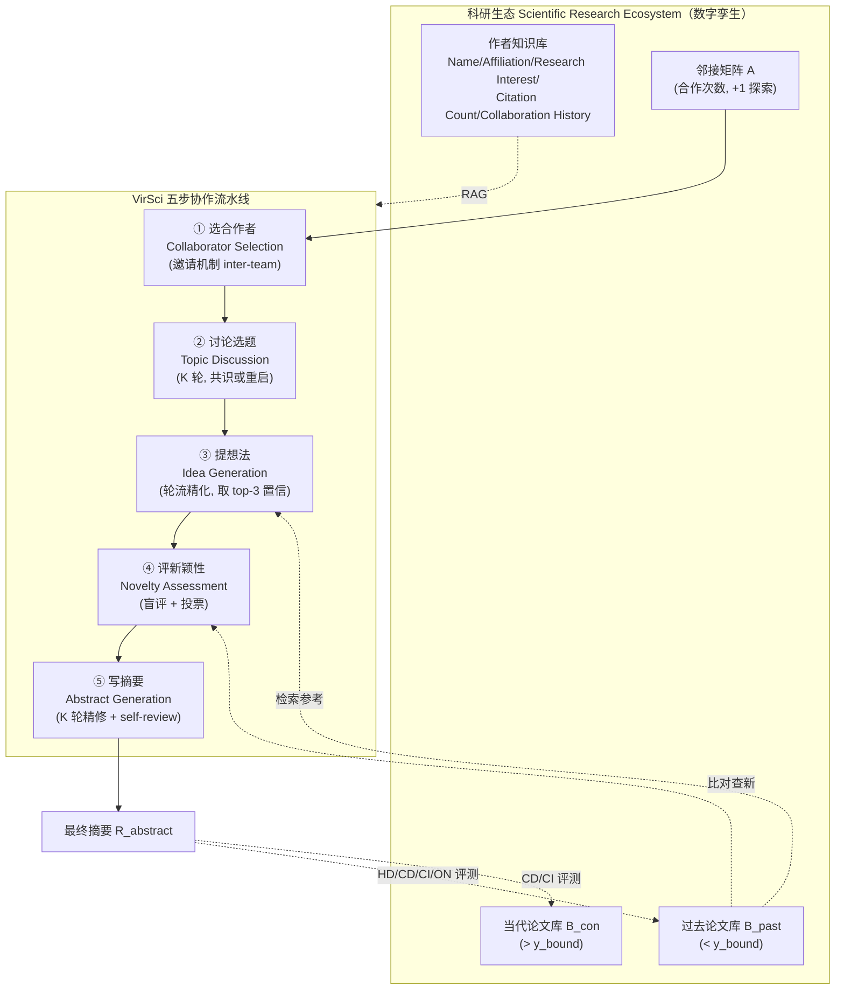

# 组会汇报 · VirSci：多智能体让科学创意更「新」（2410.09403）

> 主讲提示：这是 C 组（创意/假设生成）里**唯一一篇把「多视角协作本身」当成研究对象**的论文。它不解决「怎么把想法做出来」（那是 B 组旗舰系统的事），只回答一个更窄但更干净的问题：**多个 LLM 智能体一起头脑风暴，产出的 idea 会不会比单个 LLM 更新？** 读它的价值有两层——正面学「怎么把『科学共同体』搭成一个可控仿真」，反面学「**novelty 用嵌入相似度近似、且只评摘要**」这条贯穿全课的批判线。

---

## 1. 封面 · TL;DR

- **标题**：Many Heads Are Better Than One: Improved Scientific Idea Generation by A LLM-Based Multi-Agent System（arXiv 标题用 "Many Heads"；任务单别称 "Two Heads"，同一篇）。
- **作者/出处**：Haoyang Su、Renqi Chen（共一）… Shixiang Tang、Nanqing Dong（通讯/项目负责）等，**Shanghai AI Laboratory** 牵头，联合 **Oxford / CUHK / 清华 / 上海科学智能研究院**。arXiv 2410.09403，最新 v4（2025-05-27）。代码开源：`github.com/open-sci/Virtual-Scientists`（即 VirSci）。
- **权威性来源**：非顶会论文（截至 v4 无接收记录，需诚实说明），但出自 **Shanghai AI Lab + Oxford** 的强组合，是「**多智能体 ideation**」方向被反复引用的代表作；其方法论刻意与「科学学 (Science of Science)」的 *Nature/PNAS/Science* 经典发现对齐（如「新团队更具颠覆性」「性别/学科多样团队影响更大」），借经典结论为自己的仿真背书。

**这篇在干什么（一段话）**：作者先造一个 **Scientific Research Ecosystem（科研生态）**——它是某个时间点（如 2024-01-01）真实科研社区的**数字孪生 (digital twin)**：把真实学者的画像（领域、引用数、合作史）克隆成 agent，把论文按时间切成「**过去库 $B_{\text{past}}$**」和「**当代库 $B_{\text{con}}$**」两份。然后在这个生态上跑一个叫 **VirSci（Virtual Scientists）** 的多智能体系统，模仿真实团队的五步流程：**①选合作者 → ②讨论选题 → ③各自提想法 → ④投票评新颖性 → ⑤把胜出想法写成摘要**。最后用三个嵌入相似度指标 + LLM 评审 + 人评，论证「多智能体 > 单智能体」，并系统分析**团队规模、讨论轮数、团队新鲜度、研究多样性**这四个因素如何影响创意新颖度。

**3 条带走的结论**：
1. **协作确有增益（论文宣称）**：相对单智能体，多智能体在「与过去文献的差异度」与「对当代研究的潜在影响」上平均 **+13.8%** 与 **+44.1%**（摘要 / §1）；在 Table 1 的所有指标（提出指标 CD/CI、LLM 评审、人评 Nov/Fea/Eff）上均胜过两个 baseline（HypoGen、AI Scientist）。
2. **「协作动力学」可被复现且与科学学吻合（论文宣称）**：新颖度随团队规模上升但**非线性、峰值在 8 人**（Fig 4）；**新鲜度 50%**（一半新人一半老人）最优（Fig 5）；**多样性 25–75%** 呈**倒 U**（Fig 6）。这些与 Science of Science 的「小团队更颠覆」「新团队更创新」等结论一致——作者据此声称仿真是「可靠的」。
3. **「更好」的边界要诚实看（批判）**：所有「创意质量」都落在 **摘要 (abstract)** 这一层、且核心新颖度是**嵌入相似度的启发式代理 (proxy)**；人评相关只有 **Pearson $r=0.52$**（中等）、样本仅 200 篇摘要 / 10 名博士生；**没有任何执行/实验验证**「新 idea 是否真能做、做出来是否真有用」。换言之，本文证明的是「**更不像已有文献**」，不等于「**更好的科学**」。

> 主讲提示：开场就把「+13.8%/+44.1% 很漂亮」和「只评摘要 + 代理指标 + r=0.52」两面同时抛出。这篇的全部张力就在这条缝里——它把「多视角协作」做成了一个**漂亮但脆弱**的实证。

---

## 2. 问题与动机（why —— 本篇最该讲透的一节）

### 2.1 问题层 why：为什么「单 agent ideation」不够？

**真实科研是团队运动，而现有 AI ideation 大多是「独狼」。** 作者的动机句（§1）很直接：AI Scientist、ResearchTown、HypoGen 等近期工作已能用 LLM 模拟科研的各阶段，但它们要么 **(1) 依赖单智能体 (single-agent)**，**忽略了真实科研「多样专家协作攻关」的本质**（引 Kayacik 2019、Linsey 2005 等 HCI/设计学证据）；要么 **(2) 用了过度简化、不真实的协作框架与数据**（手工编的人物画像、合成的协作网络），**抓不住真实团队里动态的关系**。

**不解决会怎样？** 你得到的「AI 科研助手」永远是单一视角的产物——它无法享受真实科研里「**不同背景的人互相补盲区**」带来的创新红利；而且因为没有**真实学者数据**和**真实合作关系**，从这种仿真里得出的结论对「如何组建真实科研团队」**没有可迁移的洞见**。作者把这条钉得很死：现有多智能体 ideation **「缺乏动态团队组成」**（成员被锁死在初始小组、不能向外求援）且**「不含真实学者数据与合作关系」**，导致**「不切实际的结论 (impractical conclusions)」**（§2.2）。

### 2.2 设计层 why：朴素替代方案会怎样失败？

> **Why（设计层，核心）**：要研究「多智能体能否提升 ideation」，三种朴素做法都会失败——
> - **朴素方案 A：手工编几个角色（如「乐观派 / 批判派」），让它们聊。** → 失败点：人物是**虚构的**，得不到「真实学者背景如何影响协作」的结论；且角色固定、无法验证「团队规模/多样性」这类**结构变量**的因果。
> - **朴素方案 B：团队成员从头到尾锁死（如 ChatDev/AutoGen 的固定 group）。** → 失败点：真实科研经常**临时向组外专家求援**；锁死团队等于砍掉「跨团队知识流入」这条最重要的创新通道（这正是本文 §3.2「邀请机制」要补的）。
> - **朴素方案 C：直接拿生成的 idea 问「新不新」让模型自评。** → 失败点：LLM **过度自信 (overconfidence)**，自评 novelty 不可信（§3.2 明说要靠「novelty assessment」对抗 overconfidence）。
>
> **本文的解法**：① 用**真实学者数据**（AMiner / OAG）建生态 → 让结论可迁移到真实团队；② 设计 **inter-team（团队间，邀请组外专家）+ intra-team（团队内，组员轮流）** 双层讨论 → 把「动态团队组成」做进来；③ 用**与文献库比对的嵌入指标 + 多 agent 投票**评新颖度 → 替代不可信的自评。三者分别对应 A/B/C 的失败点。

### 2.3 为什么「只评摘要」是一个**主动的**设计选择（而非偷懒）

作者在脚注（§3.1 footnote）明确：**「摘要有效地概括了科研工作的关键、是其新颖性的凝练；考虑算力约束，我们把评测主要放在生成的摘要而非全文上。」** 这是一个**有意识的范围收缩**——它让问题变得可控、可大规模跑（20 次重复 × 多设置），代价是**完全不碰「执行/可行性」**。组会上要把这条讲成「**诚实的范围声明**」，而不是替它遮掩：它决定了本文的一切结论都只在「ideation 的纸面质量」这一层成立。

> 主讲提示：这一节是 why 的核心。把「真实学者数据 → 可迁移结论」「双层讨论 → 动态团队」「只评摘要 → 范围收缩」三点讲清，后面的 how 与批判就都有了挂靠点。

---

## 3. 研究问题 / 核心 intention（形式化成一句话）

把要解决的问题压成一句：

> **给定某时间点真实科研社区的数字孪生（学者画像 + 过去/当代论文库），让一组 LLM 智能体按「选人→定题→提想法→评新→写摘要」协作产出一份科学创意（以摘要呈现），问：这种多智能体协作产出的创意，是否在「与过去文献的差异」「与当代趋势的契合」「潜在影响」上优于单智能体？又是哪些团队结构因素（规模/轮数/新鲜度/多样性）在驱动这种新颖度？**

它隐含的**假设**：
- **(H1) 协作假设**：多视角协作能产出比单视角**更不像已有文献**的 idea（即更「新」）。
- **(H2) 真实数据假设**：用真实学者画像 + 真实合作网络初始化 agent，能让仿真出的「协作动力学」**对齐真实科学学规律**，从而结论可迁移。
- **(H3) 代理指标假设**：「与文献库的嵌入相似度」可作为「新颖度」的**可计算代理**——这条假设是全文的命门，§4.2 用 Pearson 相关去**部分**证成它。

---

## 4. 相关工作定位（站在谁肩上、和谁不同）

| 方向 | 代表 | 与 VirSci 的关系 |
|---|---|---|
| 单 agent 端到端科研 | **AI Scientist**(2408.06292) | **baseline**；VirSci 砍掉「执行/写作/评审」，只比 ideation，且换成多 agent |
| 单 agent 假设生成 | **HypoGen**(Qi 2024) | **baseline**；同为 ideation，但单 agent、无团队结构 |
| 迭代式 ideation | ResearchAgent(2404.07738)、ResearchTown(Yu 2024) | 同做 ideation；但「缺动态团队组成、不含真实学者数据」（作者点名批评 §2.2） |
| 多 agent 协作框架 | ChatDev、AutoGen(Wu 2023)、MetaGPT 类 | 借鉴「多 agent 对话」；但它们面向**软件/通用任务**、团队固定，VirSci 面向**科研 ideation + 动态团队** |
| 多 agent 协作机制研究 | Zhang 2024(社会心理学视角)、Qian 2024 | 思想来源：把社会心理学/群体讨论搬进 LLM 多 agent |
| **科学学 (Science of Science)** | Wu 2019、Zeng 2021、Uzzi 2013、Shi&Evans 2023（多为 *Nature/PNAS/Science*） | **理论标尺**：VirSci 用这些经典结论（小团队更颠覆、新团队更创新、跨界组合更高影响）来**验证自己仿真的可靠性** |
| **本篇** | **VirSci** | **第一个**「带真实科研生态、做动态多智能体 ideation 并系统分析协作机制」的系统（作者自述贡献 1） |

> 主讲提示：一句话概括——「**别人用单 agent 提想法，它用一支会临时招人的虚拟团队提想法，还回头跟科学学经典对表**」。它的「新」不在 LLM 技术，而在**把『科学共同体』本身做成可控变量的实验台**。

---

## 5. 方法总览（big picture，先直觉后数学）

整体 = **一个生态（数据底座）+ 一个五步流水线（多智能体协作）**。一图流（对应原文 Fig 1 / Fig 2）：



**直觉（把它当成一支虚拟课题组）**：
- **①选人**像「PI 拉人组队」——既倾向找**老搭档**（合作史），又留出**结识新人**的概率（探索）；被邀请者会**用 CoT 想清楚自己愿不愿意来**（看背景匹配度）。
- **②定题**像「组会拍板研究方向」——轮流发言、可中途退出、达成共识才定题，否则重启。
- **③提想法**像「每人交一版 idea 并互相接力改进」——后一个人能看到前一个人的 idea + 其引用，选择「改进它」或「另起一个」。
- **④评新**像「盲审投票选最不撞车的那个」——每个 idea 去过去库检索相似论文，agent 不看身份、投票选最新颖者。
- **⑤写摘要**像「把胜出 idea 写成投稿摘要并反复改」——还有一道 **self-review** 自查「跟已有论文像不像」，太像就推倒重来。

> 主讲提示：让听众记住「**一个生态 + 五步**」，并强调**整条线只到「摘要」为止**——没有写全文、没有跑实验、没有外部评审。后面 §7 逐步拆，每步都对应一个 prompt 公式（Eq 1–6）。

---

## 6. 符号与术语表（先定义，后文统一用）

| 记号 / 术语 | 含义 |
|---|---|
| $S$ | 全体科学家集合（agent 池）；$\lvert S\rvert=N$ |
| $s_0$ | 随机选出的**团队领导 (team leader)** |
| $T=\{s_0,\dots,s_n\}$ | 组成的团队；$n$ = 团队规模 (team size) |
| $A$ | **邻接矩阵 (adjacency matrix)**，$A_{i,j}$ = 学者 $i$ 与 $j$ 的历史合作次数 |
| $P_{i,j}$ | 由 $A$ 归一化得到的「邀请 $j$」的概率（见 Eq·选人） |
| $B_{\text{past}}$ | **过去论文库**：发表于时间点 $y_{\text{bound}}$ 之前的论文（标题/引用数/摘要） |
| $B_{\text{con}}$ | **当代论文库**：发表于 $y_{\text{bound}}$ 之后的论文 |
| $y_{\text{start}}, y_{\text{bound}}, y_{\text{end}}$ | 生态的起始/切分/截止年份（CS: 2000/2010/2014；OAG: 2010/2020/2023） |
| $R_{\text{topic}}$ | 团队最终确定的研究主题 |
| $R_{k,i}$ | 第 $k$ 轮、agent $i$ 的回复（response） |
| $\overline{D_t}$ | 第 $t$ 轮对话的**团队摘要 (summary of dialogues)** |
| $Q_{\cdot}$ | 各步喂给 agent 的 **prompt（提示词）**；下标标明阶段 |
| $I$ | **idea 列表**：讨论后保留的 top-3 高置信 idea |
| $R_{\text{idea}}$ | 投票胜出、用于写摘要的最终 idea |
| $R_{\text{abstract}}$ | 最终生成的摘要 |
| $P_{s_i}(\cdot\mid Q)$ | agent $s_i$ 在 prompt $Q$ 下的回复分布（LLM 采样） |
| RAG | 检索增强生成 (Retrieval-Augmented Generation)，全程用于从知识库取背景 |
| **HD / CD / CI / ON** | 四个评测指标（§13 详述）：历史差异 / 当代差异 / 当代影响 / 总体新颖度 |

---

## 7. 方法细节 ①：科研生态（数据底座，why 先行）

**why**：要让「协作动力学」的结论可迁移到真实科研，agent 不能是凭空捏的——必须由**真实学者画像**驱动；论文要分「过去/当代」两库，才能分别度量「与历史的差异」和「与未来趋势的契合」。

**怎么搭（§3.1）**：
- **切时间**：选一个 $y_{\text{bound}}$，把论文切成 $B_{\text{past}}$（之前）与 $B_{\text{con}}$（之后）；从 $B_{\text{past}}$ 抽作者构成 $S$。
- **作者知识库 (Author Knowledge Bank)**：每位学者存 **姓名 / 单位 / 研究兴趣 / 引用数 / 合作史**，用 **AgentScope 的 KnowledgeBank** 模块 + 嵌入入库，供 agent 用 RAG 快速「认识彼此」。**真实姓名被掩码 (masked)** 防数据泄露与隐私（§7 伦理）。
- **邻接矩阵 $A$ + 探索修正**：$A_{i,j}$ 记合作次数。

> **Why（设计层）**：朴素做法是「只按历史合作次数选人」→ 会让团队**永远在老圈子里打转**，丧失「新合作带来颠覆性研究」的机会（引 Zeng 2021）。本文的修正：**给 $A$ 的所有元素 +1**，让从未合作过的人也有非零概率被选中（explore-exploit 机制；增量函数的更多实验见 Appx D.4）。

**直觉**：知识库 = 每个 agent 的「简历」；邻接矩阵 = 「谁跟谁熟」；+1 = 「给陌生人一个被搭讪的机会」。

---

## 8. 方法细节 ②：选合作者（Collaborator Selection，含第一个公式）

**why**：团队怎么组，直接决定后面创意的多样性。要兼顾「熟人高效」与「生人创新」。

记号（先定义）：$A_{i,j}$ 为合作次数；$N=\lvert S\rvert$。把第 $i$ 行归一化成概率分布：

> 直觉：领导要按「跟谁更熟」的倾向去发邀请，但又不能只发给最熟的——所以把「合作次数」变成一个**概率**，熟的人概率高、生人也有份（因为已 +1）。

$$ P_{i,j} \;=\; \frac{A_{i,j}}{\sum_{j=1}^{N} A_{i,j}} $$

**读出什么**：$P_{i,j}$ 越大 → 越可能邀请 $j$；分母是该行总合作数，保证概率归一。领导据此**迭代发邀请**；被邀请者用 **chain-of-thought**（Wei 2022）权衡「领导背景 + 现有成员」决定**接受 / 拒绝**（prompt 见 Fig 17；真实例子 Fig 26：两个 agent 因背景匹配度不同，一个接受、一个婉拒）。**接受才入队 $T$，直到达到预设规模 $n$。**

**邀请机制 (Invitation Mechanism) 的复用**：这套「向组外人发邀请」不止用在选人阶段——在后续讨论里，若某组外学者与话题相关，也会被临时拉进来发言（**inter-team discussion**）；但为保持固定团队规模，这种临时受邀者**不正式入队**（§3.2）。其有效性见 Appx D.2 / Table 5。

> 主讲提示：强调「+1 探索」+「被邀请者会拒绝」这两点——它们让团队组成**动态且带真实摩擦**，是本文区别于「固定团队多 agent」的关键。

---

## 9. 方法细节 ③：讨论选题 + 提想法（Eq 1–2，核心创意环节）

### 9.1 双层讨论机制（本文方法学的招牌）

**why + 设计层**：

> **Why（设计层）**：朴素做法是「固定团队围一圈轮流说」（round-table，多数 group-discussion 工作就这样）。失败点：**知识被锁在初始小组里**，碰到组员都不擅长的话题就卡住。本文加 **inter-team（团队间）**——讨论中可**主动向组外相关专家求援**（通过邀请机制），把外部知识引进来；**intra-team（团队内）**则是组内轮流。这一「**inter + intra**」组合是作者明确标榜区别于前人（Zhang 2024 / Qi 2024 / Qian 2024）之处（§1）。

**默认拓扑**：**顺序式 (sequential)** 轮流发言（round-table）；**固定轮数 $K$**（默认 $K=5$）以保证不同团队设置下**推理成本可比**（自适应轮数留到消融，Appx D.3.2 / Table 9）。选题达成**共识**才定 $R_{\text{topic}}$，否则**终止并重启**；定题后会问每位成员是否还感兴趣，不感兴趣可**离队**。

### 9.2 选题 prompt（Eq 1）

记号（先定义）：$Q_{\text{team}}$ = 当前团队成员描述；$Q_{\text{topic}}$ = 选题任务描述；$\overline{D_t}$ = 第 $t$ 轮对话团队摘要，$D_t=\{R_{t,0},\dots,R_{t,n}\}$；$R_{k,j}$ = 第 $k$ 轮 agent $j$ 的回复。第 $k$ 轮 agent $i$ 的 prompt：

> 直觉：让 agent $i$ 发言时，手里要有「**队里都有谁** + **这轮要干嘛（选题）** + **前几轮聊到哪了** + **本轮前面人说了啥**」四样上下文，它才能接得上、补得准。

$$ Q_{k,i} \;=\; \Big\langle\, Q_{\text{team}},\, Q_{\text{topic}},\, \bigcup_{t=1}^{k-1}(\overline{D_t}),\, \bigcup_{j=0}^{i-1}(R_{k,j}) \,\Big\rangle \tag{1} $$

回复 $R_{k,i}\sim P_{s_i}(\cdot\mid Q_{k,i})$，即 agent $s_i$ 用自己的 LLM 在该 prompt 下采样。**读出什么**：式 (1) 把「历史轮摘要 $\overline{D_t}$」与「本轮已发言 $R_{k,j}$」都塞进上下文 → 实现「**有记忆地接力讨论**」；RAG 允许临时拉组外人（intra-team 扩展为带外部建议）。

### 9.3 提想法 prompt（Eq 2）—— 想法的「接力精化」

**why**：要既**多样**（每人不同角度）又**逐步收敛**到高质量。借「逐渐扩张 idea 档案」的思想（Zhang 2024 / Lu 2024），让 idea **一棒接一棒**地改。

- **开局（无 idea 时）**：用主题去 $B_{\text{past}}$ 检索参考 $B_{\text{past}}(R_{\text{topic}})$，prompt 为 $Q_{1,0}=\langle Q_{\text{idea}}, R_{\text{topic}}, B_{\text{past}}(R_{\text{topic}})\rangle$（$Q_{\text{idea}}$ = 任务描述）。
- **接力（已有上一版 idea $R_{k,i-1}$）**：把上一版 idea **连同它的参考文献**一起传给下一人，下一人**要么精化、要么另起**：

记号：$R_{k,i-1}$ = 上一位 agent 的 idea；$B_{\text{past}}(R_{k,i-1})$ = 该 idea 对应检索到的过去文献。

$$ Q_{k,i} \;=\; \Big\langle\, Q_{\text{idea}},\, R_{\text{topic}},\, B_{\text{past}}(R_{k,i-1}),\, \bigcup_{t=1}^{k-1}(\overline{D_t}),\, \bigcup_{j=0}^{i-1}(R_{k,j}) \,\Big\rangle \tag{2} $$

每个 idea 必须自带**三件套自评**：**(1) idea 描述 (2) 具体实验计划 (3) 自评分 novelty / feasibility / clarity（各 1–10，prompt 见 Fig 20）**——这是为对齐真实科研工作流、并缓解 LLM 幻觉（Huang 2023）。$K$ 轮后，**保留置信度最高的 3 个 idea 存入列表 $I$**。

> 主讲提示：注意 idea 自带「实验计划 + 自评分」，但**自评分不可信**（LLM overconfidence），所以下一步要用**独立的 novelty assessment** 来纠偏——这正是「自评 vs 他评」张力的体现。

---

## 10. 方法细节 ④：新颖性评估（Eq 3，盲评投票）

**why + 设计层**：

> **Why（设计层）**：朴素做法是「让提出者自己说想法新不新」→ LLM **过度自信**，必然高估。本文改用**盲评 + 投票**：每个 idea 去 $B_{\text{past}}$ 检索相关论文，agent 当「严苛的新颖性批评者」，**在不含对话历史（模拟盲审）** 的条件下投票选**最不与已有工作重叠**的 idea。

记号：$I_j$ = 列表 $I$ 中第 $j$ 个 idea；$B_{\text{past}}(I_j)$ = 其检索到的过去文献。盲评 prompt：

> 直觉：把每个候选 idea 连同「它最像的那些旧论文」一起摆出来，让评审 agent **对照着判**——这样判「新不新」才有依据，而不是凭空感觉。

$$ Q_{k,i} \;=\; \Big\langle\, Q_{\text{check}},\, \bigcup_{j=1}^{3}\big(I_j,\, B_{\text{past}}(I_j)\big) \,\Big\rangle \tag{3} $$

回复 $R_{k,i}\sim P_{s_i}(\cdot\mid Q_{k,i})$ 含「偏好的 idea + 理由」（CoT）。**得票最高者** = 最终 idea $R_{\text{idea}}$（prompt Fig 21；真实例子 Fig 31–32：4 个 agent 投票，**max-voting** 选出 idea 2）。**读出什么**：用「**多 agent 独立盲评 + 多数票**」把「新颖度判断」从**单点自评**变成**群体裁决**，对抗过度自信。其增益见 Appx D.2 / Table 6（尤其大团队更明显）。

---

## 11. 方法细节 ⑤：摘要生成 + 自审（Eq 4–6）

**why**：科研产出要落到**可交流的摘要**；并加一道「查重式」自审压低与已有论文的雷同。

**生成（Eq 4）**：摘要须含 5 段——**Introduction / Objective / Methods / Expected Results / Conclusion**（Alexandrov&Hennerici 2007）。领导先给初稿（基于 $R_{\text{idea}}$，prompt $Q_{1,0}=\langle Q_{\text{abstract}}, R_{\text{idea}}\rangle$）；后续每人**评价上一版 → 提修改 → 给修订版**：

记号：$Q_{\text{abstract}}$ = 任务与格式要求；$Q_{\text{judgment}}$ = 让 agent 评估上一版摘要的 prompt；$R_{k,i-1}$ = 上一版摘要。

> 直觉：摘要是「迭代精修单一对象」，所以**不需要塞整段对话历史**（会冗余）——只把「任务 + 评判指令 + 上一版」给它即可。

$$ Q_{k,i} \;=\; \big\langle\, Q_{\text{abstract}},\, Q_{\text{judgment}},\, R_{k,i-1} \,\big\rangle \tag{4} $$

$K$ 轮精修后得 $R_{\text{abstract}}$。

**自审 (Self-review，Eq 5–6)**：把 $R_{\text{abstract}}$ 交回领导，去 $B_{\text{past}}$ 比对相似度：

$$ Q_{\text{review}} \;=\; \big\langle\, Q_{\text{check}},\, R_{\text{abstract}},\, B_{\text{past}}(R_{\text{abstract}}) \,\big\rangle \tag{5} $$

若**首次自审**判定与已有论文**太像**，则进一步修订；修订轮的 prompt 把自审结果 $R_{\text{review}}$ 也并进去：

$$ Q_{1,0} \;=\; \big\langle\, Q_{\text{abstract}},\, Q_{\text{judgement}},\, R_{\text{review}},\, B_{\text{past}}(R_{\text{abstract}}),\, R_{\text{abstract}} \,\big\rangle \tag{6} $$

若**第二次自审**仍不达标 → **丢弃，重新生成 idea**；达标则输出、系统终止。**重要的诚实标注**：self-review **会引入不确定的额外推理成本，难保证公平对比，故主结果不开它，只在消融（Appx D.2 / Table 7）讨论其效果**。

> 主讲提示：Eq 5–6 这套「自审-不过就推倒」很像 AI Scientist 的 novelty check，但**同样是模型自己判自己**——埋下「自评循环性」的批判线（与 9.1 模块呼应）。

---

## 12. 算法骨架（把五步压成伪代码）

```
输入: 学者池 S, 过去库 B_past, 当代库 B_con, 邻接矩阵 A(已+1), 团队规模 n, 轮数 K
# ① 选合作者
s0 ← random(S);  T ← {s0}
while |T| < n:
    j ← sample by P[0,j] = A[0,j]/Σ A[0,j]
    若 j 经 CoT 同意 → T ← T ∪ {j}      # 邀请机制, 可拒绝
# ② 讨论选题 (顺序式, 可拉组外人 inter-team)
for k in 1..K: 各 agent 按 Eq.(1) 发言, 更新对话摘要 D
R_topic ← 共识主题 (否则重启); 不感兴趣者离队
# ③ 提想法 (接力精化)
for k in 1..K: 各 agent 按 Eq.(2) 提/改 idea (含实验计划+自评 N/F/C)
I ← top-3 置信 idea
# ④ 评新颖性 (盲评+投票)
各 agent 按 Eq.(3) 盲评投票;  R_idea ← max-voting(I)
# ⑤ 写摘要 (+可选 self-review)
R_abstract ← 领导初稿; for k in 1..K: 按 Eq.(4) 评价→修改
[可选] 按 Eq.(5)(6) 自审; 不达标→修订/推倒重来
输出: R_abstract  → 用 HD/CD/CI/ON 评测
```

---

## 13. 实验设置（setting / metrics / params / 算力，写全）

### 13.1 数据集与生态构造

| 数据集 | 规模（原始） | 过滤后（用于实验） | $y_{\text{start}}/y_{\text{bound}}/y_{\text{end}}$ |
|---|---|---|---|
| **AMiner Computer Science**（主） | 1,712,433 作者 / 2,092,356 论文（1948–2014） | **156 作者 / 178,197 论文**（85,217 过去库 + 92,980 当代库） | 2000 / 2010 / 2014 |
| **Open Academic Graph 3.1**（跨域，含物理/化学/CS/生物） | 35,774,510 作者 / 130,710,733 论文（至 2023） | **3,169 作者 / 201,131 论文**（139,646 过去 + 61,485 当代） | 2010 / 2020 / 2023 |

- **过滤策略（§C.2）**：CS 去掉「无摘要 / 引用<10 的过去论文、引用<5 或无摘要的当代论文、论文数<50 或合作者<50 的作者」；OAG 阈值更高（引用<200 等）。OAG 缺作者级研究兴趣/合作信息，故用 **GPT-4o** 从该作者论文里**抽取并概括研究兴趣**补齐。
- **嵌入模型**：`mxbai-embed-large`（Lee 2024）；检索用 **Faiss**（Johnson 2019）。

### 13.2 评测指标（**核心：先给定义式，再读出什么**）

作者明说「**没有单一指标能完全刻画科研产出的新颖度**」，故用 **3 个客观指标 + 1 个代理指标**（§4.1）。先约定：把生成摘要嵌入，记其与某库中**最相似 5 篇**的关系。

**(1) 历史差异度 HD (Historical Dissimilarity)**——直觉：跟过去文献**越不像越可能新**。
> 符号：$e$ = 生成摘要的嵌入；$\{p_1^{\text{past}},\dots,p_5^{\text{past}}\}$ = $B_{\text{past}}$ 中与之最相似的 5 篇的嵌入；$\mathrm{dist}$ = 欧氏距离。
$$ \mathrm{HD} \;=\; \frac{1}{5}\sum_{m=1}^{5}\mathrm{dist}\big(e,\, p_m^{\text{past}}\big) $$
读出什么：**HD 越大 → 离已有（过去）论文越远 → 越可能新颖**（Shao 2020 / Zhou 2024）。

**(2) 当代差异度 CD (Contemporary Dissimilarity)**——直觉：跟**当代（未来）**论文**越像**，说明**踩中了正在兴起的方向**。
$$ \mathrm{CD} \;=\; \frac{1}{5}\sum_{m=1}^{5}\mathrm{dist}\big(e,\, p_m^{\text{con}}\big) $$
读出什么：**CD 越小越好**（↓）——离当代论文越近，越说明 idea 与新兴趋势契合、更可能新。⚠ 注意 HD 与 CD **方向相反**，这是理解 ON 的关键。

**(3) 当代影响 CI (Contemporary Impact)**——直觉：跟「**高被引的当代论文**」像，说明潜在影响大。
> 符号：取 $B_{\text{con}}$ 中最相似 5 篇的**引用数均值**。
$$ \mathrm{CI} \;=\; \frac{1}{5}\sum_{m=1}^{5}\mathrm{citation}\big(p_m^{\text{con}}\big) $$
读出什么：**CI 越大 → 越靠近高影响力的新工作 → 潜在影响越高**（Yang 2022）。

> **归一化**：上述每个指标都**除以「同年所有论文该指标的均值」**（AlShebli 2018）以消除年份效应，即 $\text{metric} / \overline{\text{metric}}$。

**(4) 总体新颖度 ON (Overall Novelty)**——**代理指标**，把三者合一。
> 直觉：单看一个指标都不全面；自然假设「新颖度」**与 HD、CI 正相关，与 CD 负相关**（越不像过去、越像高影响未来、越贴近趋势 = 越新）。
$$ \boxed{\;\mathrm{ON} \;=\; \dfrac{\mathrm{HD}\times \mathrm{CI}}{\mathrm{CD}}\;} $$
读出什么：ON 的**期望值与新颖度成正比**（作者语）。**但务必标注**：这是一个**人为构造的启发式组合**，原文**未给出**ON 与「真新颖度」之间的理论推导，其合理性**仅靠下节的 Pearson 相关来部分支撑**——这是全文最该被追问的地方。

### 13.3 baseline、底座、超参、算力、人评

- **baseline**：**HypoGen**（多 agent 假设生成，Qi 2024）、**AI Scientist**（SOTA 单 agent，Lu 2024）。为公平，把三者调到「可比推理成本」（§C.3）：AI Scientist 限定从预设主题（2D Diffusion/NanoGPT/Grokking）生成，故在选题里**统一注入 NanoGPT**；AI Scientist 做 50 轮自反思（不含论文生成），为对齐成本，**VirSci 设 4 成员 + 5 轮、HypoGen 设 12 轮**；因 baseline 无科研生态，统一改用 **Semantic Scholar / PubMed API** 检索算指标。
- **底座 LLM**：**GPT-4o**（公开 API）、**LLaMA3.1-8b**、**LLaMA3.1-70b**（开源权重，经 **Ollama** 调用）。默认 **LLaMA3.1-8b**（兼顾效率与能力）。
- **关键超参**：默认**团队 4 人、讨论 $K=5$ 轮**；**所有结果对 20 次运行取平均**（§C.1）。
- **算力/成本**：LLaMA3.1-8b 每次运行约 **10 分钟 / 1×NVIDIA A100 40G**（4 成员 5 轮设置）。**原文未给出** GPT-4o 的美元成本与总 token 数。
- **人评 (§C.4)**：**10 名 CS 方向博士生**，**不知方法身份**，在 **1–10 分**上按 **Si et al. 2024** 的 novelty 评分框架评 **Novelty / Feasibility / Effectiveness** 三项；对 200 篇摘要（CS 数据集、各种设置生成）评分。

> 主讲提示：把「**ON = HD×CI/CD 是人造启发式**」「**主结果默认 LLaMA3.1-8b、不开 self-review**」「**只评摘要、20 次平均**」三件事讲清——它们是读懂所有数字的前提。

---

## 14. 主要结果（数字 + 解读，别只贴表）

### 14.1 对照 baseline：VirSci 全面领先（Table 1）

> Table 1：三个底座下，VirSci(Ours) vs HypoGen vs AI Scientist。指标含**提出指标 CD↓ / CI↑**、**LLM 评审分↑**、**人评 Nov/Fea/Eff↑**。摘录 GPT-4o 与 70b 两组：

| 底座 | 方法 | LLM 评审↑ | CD↓ | CI↑ | 人评 Nov↑ | 人评 Fea↑ | 人评 Eff↑ |
|---|---|---|---|---|---|---|---|
| **GPT-4o** | HypoGen | 3.02 | 0.36 | 3.10 | 4.78 | 4.24 | 4.43 |
| | AI Scientist | 3.10 | 0.38 | 3.22 | 4.94 | 4.18 | 4.77 |
| | **Ours (VirSci)** | **3.34** | **0.34** | **3.78** | **5.24** | **4.52** | **4.95** |
| **LLaMA3.1-70b** | HypoGen | 2.18 | 0.49 | 2.13 | 3.57 | 3.61 | 3.52 |
| | AI Scientist | 2.24 | 0.48 | 2.11 | 3.88 | 3.60 | 3.66 |
| | **Ours (VirSci)** | **2.53** | **0.40** | **3.36** | **4.18** | **3.84** | **3.75** |

**读出什么**：
- VirSci 在**所有指标、所有底座**上胜出（作者宣称）；**GPT-4o 底座的 novelty 最高**（5.24），印证「更强底座 → 更强 ideation」。
- **结果层 why**：为什么多 agent 能赢？作者的机制解释是——**盲评投票 + 接力精化 + 邀请外部专家**共同把「单点视角」扩成「多点视角」，于是产出更不撞车（CD↓）、更贴高影响方向（CI↑）。
- **批判预埋**：①增益幅度看着稳，但**人评三项的绝对差距并不大**（如 70b 上 Fea 3.84 vs 3.60、Eff 3.75 vs 3.66），**原文未对 Table 1 报告显著性检验或置信区间**——「全面领先」的**统计稳健性无从判断**。②LLaMA3.1-8b 与 70b 的 novelty 接近，说明「**适度增大模型未必提升新颖度**」（§4.3 作者亦承认）。

### 14.2 摘要标题的「+13.8% / +44.1%」从哪来？

摘要/§1 的招牌数字：多智能体相对单智能体执行者，在 **alignment with contemporary research（≈ CD 维度的对齐）平均 +13.8%**、在 **potential impacts on contemporary research（≈ CI 维度）平均 +44.1%**。**读出什么**：这是「多 vs 单」的**相对增益百分比**（跨设置平均），不是绝对分；**+44.1%（影响）远大于 +13.8%（趋势对齐）**，说明协作的主要红利在「**更可能撞见高影响方向**」。但同样地，**原文未给该两数的方差/检验**——这是宣称，不是经过显著性背书的定论。

### 14.3 代理指标 ON 到底可不可信？（§4.2，Fig 3 / Fig 10–11）

**这是全文最关键的自我验证。** 作者拿 200 篇 CS 摘要，同时用 **ON、LLM 评审、人评**打分，算 Pearson 相关：
- **ON vs 人评**：**Pearson $r=0.52$**（Fig 3 / Fig 11）。
- **ON vs LLM 评审**：**Pearson $r=0.57$**（Fig 10）。

> 直觉：相关系数 $r\in[-1,1]$，衡量「两套打分**同涨同跌**的线性程度」；$r=1$ 完全一致，$r=0$ 毫无线性关系。

**读出什么（务必诚实）**：$r=0.52/0.57$ 是**正相关、但只是中等强度**——意味着 ON 与人类判断**方向一致但解释力有限**（$r^2\approx0.27$，即 ON 仅能解释人评方差的约 27%）。作者用它**支持** ON「有一定效度」，这是合理的**弱证成**；但绝不能据此说「ON ≈ 真新颖度」。**组会必须把这条讲透**：本文所有「更新颖」的结论，底层都站在一个**只能解释 27% 人类判断**的代理指标上。

---

## 15. 消融与协作机制分析（哪个部件贡献多少 + 四大因素）

### 15.1 部件消融（Tables 3–7，指标均为 ON，8 人 5 轮设置）

| 消融对象 | 关键对比（ON） | 结论 |
|---|---|---|
| **过去论文库**（Table 3/4，CS/OAG） | 两处都不用 2.60 → 都用 **4.23**（CS）；2.41→**4.65**（OAG） | 检索参考**显著**提升新颖度，避免「肤浅/空想」产出 |
| **邀请机制**（Table 5） | 4 人 5 轮 3.30→**3.40**；8 人 4.12→**4.23** | 引入组外专家**普遍**提升 ON |
| **新颖性评估**（Table 6） | 4 人 5 轮 3.19→**3.40**；8 人 3.98→**4.23** | 盲评投票提升 ON，**大团队更明显**（idea 多、更需筛） |
| **自审 self-review**（Table 7） | 4 人 5 轮 3.26→**3.40**；8 人 3.99→**4.23** | 摘要后自审能再提一档 |

**读出什么**：四个「为提升新颖度而设计的部件」**逐一被验证有正贡献**；其中**过去库的贡献最大**（去掉后 ON 几乎腰斩），说明「**与文献比对**」是本系统新颖度的主引擎——这也再次提醒：所谓「新」高度依赖「与检索到的文献不像」。

### 15.2 讨论拓扑与自适应轮数（Tables 8–9，Fig 7）

- **顺序 vs 随机（Table 8）**：**顺序式 (sequential) 总体优于随机式 (random)**——随机模式下「轮数有限时部分 agent 被跳过、沉默」，浪费知识；故选**顺序**为默认拓扑。
- **固定 vs 自适应轮数（Table 9）**：让领导**按进度动态决定还要不要多聊**（adaptive），相比固定 5 轮，**推理成本更低（4 人：80→57.2；8 人：160→124）且 ON 更高（3.26→3.49；3.99→4.37）**。→ 自适应「该停就停」既省又好。**但主实验为公平用固定轮数**，自适应只在此消融展示。

### 15.3 四大协作因素（Fig 4–6，对齐科学学）—— 本文最有「洞见感」的部分

> 「Inference Cost = 团队规模 × 轮数」是横轴；纵轴 ON。

1. **团队规模 (Team Size)**（Fig 4）：ON **随规模上升但非线性，峰值在 8 人**；**过大（如 100 人）反而下降**——协调成本、沟通开销、群体思维 (groupthink) 稀释贡献。**对齐**「小团队更颠覆、大团队更精炼已有概念」（Wu 2019 等）。
2. **讨论轮数 (Discussion Turn)**（Fig 4）：**峰值约 5 轮**；初期多聊促进 idea，**过多轮反而「疲劳、参与度下降」拖累创意**。
3. **团队新鲜度 (Team Freshness)**（Fig 5，= 未曾合作过的成员比例）：**50% 新鲜度最优**（尤其大团队），此时 HD 峰值；新鲜度越高 CD 越低（越贴未来趋势）；CI 与 ON 都在 **~50%** 达峰。→「**一半新人一半老人**」最佳，对齐 Guimera 2005 / Zeng 2021。
4. **研究多样性 (Research Diversity)**（Fig 6，= 成员专精不同方向的比例）：**倒 U（reverse-U）**，最优在 **4 人团队 25–50% / 8 人团队 50–75%**；适度多样提升 HD/CI，过度则协调困难。对齐「跨界组合提升影响」(Uzzi 2013 / Shi&Evans 2023)。

**结果层 why**：为什么这些曲线长这样？作者的解释是**仿真复现了真实团队的「协作-协调」权衡**——多样/新鲜带来视角红利，但超过临界点，**沟通成本与群体思维**反噬。这与科学学经典结论**高度一致**，是作者论证「VirSci 是可靠仿真工具」的主要依据。

> 主讲提示：Fig 4–6 是本文「卖点」。但要点醒听众——「**与科学学结论一致**」是**一致性 (consistency) 证据，不是因果证据**：仿真长出和真实世界相似的曲线，**可能是机制对了，也可能是 prompt/数据里本就编码了这些先验**。别把「对表成功」当成「机制被证明」。

---

## 16. 局限与批判（诚实，区分宣称 vs 质疑）

**原文自承（§6 Limitations / §7 Ethics）**：
1. **简化了真实协作**：现实里多个团队**并行**做相关项目、研究者**同时**身处多个团队——VirSci**不建模并发多团队**，保真度有限。
2. **继承 LLM/训练数据偏置**：可能**偏向成熟领域、边缘化新兴/弱势领域**，强化学术不平等；未来需**数据多样化 + 去偏微调**。
3. **会产出「看似对、实则错/误导」的科学主张**：在医学/政策等高风险领域尤其危险；需**事实核查模块 + 人类专家**把关。
4. **可被滥用**（造假论文、抄袭、论文洪水）；主张 **AI 生成内容须加水印/标注**。
5. **数据泄露顾虑（Appx A）**：用了 2024 前论文，LLM 训练数据可能见过；作者论证「①所有方法/设置用同一 LLM，泄露影响**均等**，不偏向某方；②目标是**相对比较**非绝对新颖度；③额外做 OAG3.2（2024–2025 论文）隔离实验，ON 仅**轻微下降**（Table 2），结论不变」。

**社区/我方应追加的质疑（批判，原文未充分回应）**：
- **(关键) 评测天花板太低**：**只评摘要、且核心指标是嵌入相似度代理**。**摘要新 ≠ idea 好 ≠ 能做出来 ≠ 做出来有用**。本文对「**可行性/可执行性**」几乎零验证（人评 Feasibility 也是**读摘要打分**，非真做）。这与 [`2506.20803` ideation-execution-gap] 的发现正面相撞：**人评高新颖度的 idea，真去执行后排名会大洗牌**。
- **(关键) 统计稳健性不足**：**Table 1 / 摘要的 +13.8%/+44.1% 均未报告显著性检验或置信区间**；ON 与人评仅 **$r=0.52$**（解释力 27%）；**样本小**（156/3169 作者、200 篇摘要、10 名评审）。「全面领先」缺乏统计背书。
- **「新颖度」定义的循环性**：HD/CD 把「新」**定义成「与检索到的库不像/像」**，于是「过去库」消融贡献最大（§15.1）——系统在**优化一个自己定义的距离**，未必对应人类心中的「好点子」。
- **自评/自审的循环性**：novelty assessment 与 self-review 都是**模型判模型**（盲评只是去掉对话历史，仍是同类 LLM），缺**独立外部判据**——与 AI Scientist 的「自评 novelty」同病。
- **可比性争议**：为对齐成本把 AI Scientist/HypoGen「掐到」特定轮数、改检索源（Semantic Scholar/PubMed），**baseline 是否被调到其最优状态存疑**。

> 主讲提示：把「**只评摘要 + 代理指标 + 无显著性**」三连作为本节落点。这不是否定它的贡献，而是**精确定位它证明了什么、没证明什么**——它证明了「多 agent 协作能产出更不像已有文献的摘要」，**没有**证明「多 agent 能产出更好的科学」。

---

## ★ 对我们的启发（Inspires Us）

> 这一节回答：VirSci 对我（们）接下来要做的研究，**到底能用上什么**。

- ➤ **a. 可直接借用的招（reuse）**：
  1. **「邀请机制」= 动态拉外部专家**：一个**只负责「按相关性把组外角色临时拉进对话、说完即走、不入队」**的机制。可**原样搬进** [`m9.3-ideation-and-tournament`](../m9.3-ideation-and-tournament/) 的 ideation 阶段——当当前小队对某子话题集体外行时，触发「外部专家 agent」注入一段背景，再退出。比固定角色池更省 token、更对症。
  2. **「盲评 + max-voting」对抗自评过度自信**：把 idea 连同**它最像的检索文献**一起摆给一组**不看身份**的评审 agent 投票（Eq 3）。这是比「让提出者自评 novelty」更可信的**群体裁决**，可直接加到任何「生成 idea → 判好坏」的环节。
  3. **「双库度量」做新颖度代理**：HD（离过去远）、CD（离当代近）、CI（贴高被引）三件套 + 同年归一化，是一套**完全自动、可大规模跑**的 ideation 评分器——尽管粗糙，但**便宜**，适合做 ideation 的**快筛/早停信号**（先用它筛掉一眼撞车的，再上贵的人评/执行）。

- ➤ **b. 可迁移到我们课题（transfer）**：把 VirSci 的「**协作因素扫描**」迁到我们的 `m9.3` tournament——它已有「锦标赛式选 idea」，但**没有系统研究「评委团规模/多样性/讨论轮数」如何影响选出来的 idea 质量**。迁移时**要改的前提**：VirSci 的「质量」是**嵌入代理 + 摘要**，我们若要让结论可信，必须把因变量换成**可执行的下游指标**（哪怕是最小可跑实验的成功率），否则只是复制它「优化距离」的循环。**不再成立的前提**：它默认「与当代文献像 = 好」，在我们**追求真正新方向**的场景下，CD↓ 可能反而惩罚了真颠覆。

- ➤ **c. 它暴露的开放问题 = 我们的机会（opportunity）**：VirSci 把「**协作动力学**」和「**执行验证**」**割裂**了——它只证明「协作让摘要更新」，完全没碰「**这些更新的 idea 执行后是否真更好**」。→ **机会**：造一座桥，把 VirSci 式「多智能体 ideation」直接接到一个**最小执行沙箱**（哪怕只跑 NanoGPT 级 toy），量化「**ideation 期 ON 排名**」与「**执行后真实指标排名**」的相关——**如果两者相关很低，就直接给本文的核心宣称泼了冷水**。可下手的**第一步**：在 `m9.3` 里，对 tournament 选出的 top-k idea **各跑一个最小实现**，记录「纸面新颖度 vs 执行成功率」的 Spearman 相关。

- ➤ **d. 与本库其它论文/模块的连接（connect the dots）**：
  - **冷水正对**：与 [`2506.20803` ideation-execution-gap](2506.20803-ideation-execution-gap.md) **互为正反**——VirSci 说「协作让 ideation 更新颖（看摘要）」，后者说「**ideation 阶段的高分到了执行阶段会大幅重排**」。两篇放一起讲，就是「**别拿 ideation 的胜利当科研的胜利**」。
  - **承接与对照**：与 [`2409.04109` Can-LLMs-Generate-Novel-Ideas](2409.04109-can-llms-generate-novel-ideas.md) **方法论互补**——后者用 **100+ 真人 NLP 研究者**盲评，发现「LLM idea 比人类**更新颖但可行性略低**」；VirSci **借用了它的人评框架（Si et al. 2024）**，但把评审从「100+ 专家」缩到「10 博士生 + 嵌入代理」。两篇对照能精确说明「**人评规模**」对结论可信度的影响。
  - **同病相连**：novelty 的**自评/自审循环性**直通 [`2408.06292` AI Scientist](2408.06292-ai-scientist-v1.md) 的「模型自判新颖度」与本库 `m9.8` 红队/诚信的「**独立验证收口**」。
  - **机制呼应**：「邀请外部专家引入未知知识」与 [`2408.15232` Co-STORM](2408.15232-co-storm-unknown-unknowns.md) 的「unknown-unknowns」一脉相承。

- ➤ **e. 如果我来做下一步（my next move）**：我会在 `m9.3-ideation-and-tournament` 加一个 **"VirSci-style 协作 ideation → 最小执行验证"** 的对照开关：①复刻它的「邀请 + 盲评投票 + 双库 ON 评分」生成一批 idea；②对 top-k 各跑一个 toy 实现，测 **「ON 排名 vs 执行后指标排名」的 Spearman 相关**。**一周内出最小结论**——若相关高，说明 ON 作为早筛信号靠谱、可省人评；若相关低，就坐实「**摘要级新颖度撑不起执行级好坏**」，这本身就是一篇能接力 ideation-execution-gap 的小工作。

> 主讲提示：这一节是组会高潮——前面讲「Shanghai AI Lab 做了什么」，这里讲「**我们下周就能试什么**」。落点是 `m9.3` 的「协作 ideation + 最小执行验证」，能被同组同学直接接力，且**结论无论正反都有价值**。

---

## 17. 在 auto-research 版图的位置（相对已有论文的增量）

- **阶梯定位（Tool→Analyst→Scientist）**：VirSci 处在 **「Analyst 偏下」**——它能**自主组队、定题、产出有一定新颖度的 idea/摘要**，比纯检索/综述工具强；但**完全不执行、不验证**，且核心质量靠**自评 + 代理指标**，够不到「能独立验证自己发现」的 Scientist 级。它是「**ideation 专精**」的一块拼图，不是端到端系统。
- **它把谁向前推了一步**：在「**多智能体 ideation**」这条线上，相对 ResearchAgent(2404.07738)/ResearchTown 的增量是——**首次引入「真实学者画像 + 真实合作网络 + 动态团队（邀请机制）+ 系统性协作因素分析」**，并**回头与科学学经典对表**。它把「多 agent ideation」从「随便编几个角色聊天」推进到「**用真实社会网络数据驱动、可做结构变量实验的仿真台**」。
- **它证伪/补足了谁**：它**部分回应**了 AI Scientist「单 agent、idea 跨 run 雷同」的弱点（多 agent + 邀请确能增多样）；但它**自身又被** [`2506.20803` ideation-execution-gap] 从「执行端」反将一军——形成本库「**ideation 看着赢 → 执行未必赢**」这条核心张力的**正方**。
- **时间坐标**：v1 2024-10、v4 2025-05；与 co-scientist(2502.18864，多 agent **生成-辩论-进化 + 湿实验**)、AI-Researcher 类系统同期，但 VirSci **刻意只做 ideation 这一窄环并做深**，是「**窄而深**」而非「宽而浅」的代表。

---

## 18. 复现与可用性

- **开源**：代码 `github.com/open-sci/Virtual-Scientists`（VirSci）；prompts（Fig 16–25）与示例场景（Fig 26–35）**全在附录**，可读性好。基于 **AgentScope** 框架。
- **能不能在单卡跑**：**能**。默认设置（LLaMA3.1-8b、4 成员 5 轮）每次运行约 **10 分钟 / 1×A100 40G**；GPT-4o 走 API（**成本原文未给**）。瓶颈是 **LLM 调用次数**（多 agent × 多轮 × 20 次重复）与**嵌入/Faiss 检索**，非 GPU 训练。
- **坑**：
  - 需自备 **AMiner / OAG** 数据并复刻**过滤管线**（阈值很具体，§C.2），否则规模/分布对不上。
  - **ON 的可比性依赖同年归一化**——换数据集要重算「同年均值」。
  - **主结果默认不开 self-review**（成本不可比）；想复现 Table 1 别把它打开。
  - **结论强依赖嵌入模型**（`mxbai-embed-large`）——换嵌入器，HD/CD/CI 数值会变。

---

## 19. 组会讨论问题（5–8 个，引发讨论）

1. **ON = HD×CI/CD** 是个**人造启发式**且与人评仅 $r=0.52$。如果换一种组合（如加权、或用 learned scorer），结论（多 agent>单 agent、峰值 8 人）会不会翻？怎么设计实验检验 ON 的**鲁棒性**？
2. 「与当代文献像（CD↓）= 更新颖」这条假设，会不会**系统性惩罚真正的颠覆性 idea**（颠覆者恰恰不像任何当代论文）？如何与「HD↑（离过去远）」的诉求调和？
3. Fig 4–6 与科学学经典「**一致**」——这是「机制被仿真捕捉」的证据，还是「prompt/数据里已编码这些先验」的**自我实现**？能否设计一个**反事实**实验区分二者？
4. 本文**只评摘要**。若把胜出 idea 真接到执行沙箱，你赌「纸面 ON 排名」和「执行后指标排名」相关是高还是低？（联想 ideation-execution-gap）
5. **+13.8%/+44.1% 无显著性、样本小**。作为审稿人，你会要求作者补哪些统计证据（检验、CI、效应量、更大样本）才肯信「多 agent 全面领先」？
6. **邀请机制（拉外部专家）** vs **固定团队**：增益主要来自「**更多 token/上下文**」还是「**真·多视角**」？怎么做控制实验把这两者拆开？
7. novelty assessment 与 self-review 都是**模型判模型**。要打断这条循环性，能加什么**独立外部判据**（如真实引用、可执行验证、人类抽检）？
8. 峰值「**8 人 / 5 轮**」是否只是**当前底座/数据/成本设置**下的局部最优？换更强模型或更大生态，峰值会怎么移动？

---

## 20. 一页速记（汇报当天速览）

- **是什么**：VirSci——在「真实学者数字孪生科研生态」上跑的**多智能体 ideation 系统**，五步：**选人→定题→提想法→盲评投票→写摘要**；证明**多 agent > 单 agent** 在创意新颖度上。
- **数据底座**：AMiner CS（156 作者/178k 论文）+ OAG3.1（3169 作者/201k 论文）；论文按 $y_{\text{bound}}$ 切**过去库/当代库**；作者画像 + 邻接矩阵（+1 探索）。
- **招牌机制**：**邀请机制**（动态拉组外专家，inter-team）+ **接力精化 idea** + **盲评 max-voting**（抗自评过度自信）+ **self-review**（消融才开）。
- **指标（核心）**：**HD**(离过去远↑)、**CD**(离当代近↓)、**CI**(贴高被引↑)、**ON = HD×CI/CD**（人造代理；与人评 **$r=0.52$**、与 LLM 评审 $r=0.57$）。
- **关键数**：相对单 agent **+13.8%（趋势对齐）/ +44.1%（影响）**；Table 1 全指标领先 HypoGen/AI Scientist；**峰值 8 人 / 5 轮**；**新鲜度 50%**、**多样性 25–75%（倒 U）**最优；与科学学经典一致。
- **算力**：LLaMA3.1-8b ~**10 min / 1×A100 40G**·次，**20 次平均**；默认 4 人 5 轮、不开 self-review。
- **三句话结论**：**协作确能让 ideation 更「不撞车」（正面）/ 协作动力学可仿真且对齐科学学（洞见）/ 但『更好』只到摘要+代理指标这一层、无执行验证、无显著性（命门）**。
- **在课里的位置**：C 组多智能体 ideation 代表作；是「**ideation 看着赢**」的正方，正对 `2506.20803`「**执行未必赢**」的冷水；自评循环性接 `2408.06292` 与 `m9.8`；下一步接 `m9.3` 做「协作 ideation → 最小执行验证」。

> 主讲提示：结尾回到一句话——**「它漂亮地证明了『两个脑袋比一个不容易撞车』，但还没证明『两个脑袋能想出更好的科学』」**。把掌声留给它的方法学（真实数据 + 协作因素扫描），把追问留给它的评测层（摘要 + 代理指标 + 无显著性）。
