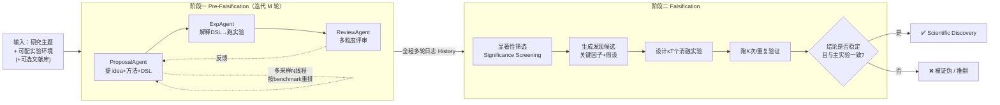

# 组会汇报 · AIGS / Baby-AIGS（自动证伪）

> 主讲提示：这篇要和「0 号文献」AI Scientist 对着讲。AI Scientist 证明「闭环能跑通、但会把变差说成改进」；
> AIGS 正面回应那条病理——**它问的不是「怎么多产论文」，而是「怎么让 AI 自己证伪、确认一个发现是不是真的」**。
> 一句话定调：把波普尔 (Popper) 的「可证伪性」从哲学口号，落成多智能体闭环里的一个**可执行阶段**。

---

## 1. 封面 · TL;DR

- **作者/出处**：Zijun Liu, Kaiming Liu, Yiqi Zhu, Xuanyu Lei, Zonghan Yang, Zhenhe Zhang, Peng Li, Yang Liu（清华 CS&T + AIR），2024-11，arXiv 2411.11910v2（cs.LG）。
- **一段话**：论文提出 **AI-Generated Science (AIGS，AI 生成的科学)** 这一目标——让智能体**全流程自主**完成科研并发现科学规律。作者重读波普尔 (Popper, 1935) 对科研的定义，论证**证伪 (falsification)** 才是科学过程的内核，而过往端到端系统要么在设计上缺了证伪，要么重度依赖现成验证引擎（如 AlphaGeometry）把适用面锁死在专门领域。为此他们造了 **Baby-AIGS**——一个多智能体「迈出一小步 (baby step)」的全流程系统，关键创新是引入 **FalsificationAgent**：它先识别可能的科学发现、再**自主设计并执行消融实验 (ablation study)** 去证伪/确认。在数据工程、自指令对齐、语言建模三个任务上，Baby-AIGS 能产出**有意义的**科学发现，但仍**显著逊于**资深人类研究者（见原文 Abstract、§3.5、Table 2）。
- **三条带走的结论**：
  1. **方法论补位**：第一次把「证伪」做成闭环里一个**显式、可执行**的阶段（FalsificationAgent 自主提假设→设消融→跑→下结论），对应 AI Scientist 缺失的那一环（原文反复点名 Lu et al., 2024 = AI Scientist）。
  2. **可执行性靠 DSL 撑起来**：用**领域专用语言 (DSL, Domain-Specific Language)** 把「想法+方法」翻译成可无错执行的动作，把端到端实验成功率从 AI Scientist 的 44.8% 拉到**近 100%**（原文 Table 6）。
  3. **诚实地承认弱**：证伪过程的人评总分只有 **1.25/2**，远低于顶会论文的 **2.00**（p<0.05 显著更差，原文 Table 2）；「重要性分 (1.80) > 一致性分/正确性分 (1.00/0.95)」说明它**能找到重要因子、却设计不好实验也下不对结论**——瓶颈在底座模型的实验设计能力。

> 主讲提示：开场就把「方法论上补了证伪这一环（加分）」和「执行得还很差（减分）」两面同时抛出，定下「**对的方向、稚嫩的实现**」的基调——名字里的 Baby 不是谦辞，是实情。

---

## 2. 问题与动机（why —— 本篇最该讲透的一节）

**科学到底是什么过程？** 作者回到波普尔 (Popper, 1935)《科学发现的逻辑》：科研是**系统性地提出新假设、通过试错执行实验、并证伪这些假设以得出结论**的过程。学界常说「创造力 (creativity)」是科研的灵魂，但作者主张——**证伪才是核心组件**：被证伪掉的假设同样对科学进步有正贡献（原文 §1）。

**为什么「证伪」这一环以前被端到端系统漏掉了？** 作者把已有 AIGS 的探索分成三条线（原文 §1）：
- **第一条线（重创造力）**：评测并提升 LLM 产生高新颖度 idea 的能力（Si et al., 2024; Hu et al., 2024b）——只管「想得新不新」。
- **第二条线（重可执行性 executability）**：MLAgentBench、MLE-Bench 等基准，靠在给定 benchmark 上写代码刷分来评测智能体能力——只管「跑得通不通」。
- **第三条线（端到端，覆盖创造力+可执行性）**：MLR-Copilot 拿现成论文当输入产出实验结果；**AI Scientist (Lu et al., 2024)** 更进一步声称能把 idea 和实验组织成论文。但社区批评其知识增量是「修修补补 (tweaks)」、代码与论文质量差；在 DiscoveryWorld、DSBench、ScienceAgentBench 上看，**端到端真正产出「可证伪的科学发现」这块仍是空白**，尤其缺**自主证伪 (autonomous falsification)**。

**这篇的赌注（核心动机）**：与「只追求正结果」的系统相比，真正像科学家那样工作，必须**主动去推翻自己的发现**。人类研究者靠**消融实验**确认「某个因子是不是真的导致了那个显著现象」；AIGS 也应当具备这种**自主证伪**能力。一句话：

> **不是再多产一篇「看起来有改进」的论文，而是让 AI 自己回答「这个改进是真的吗？换掉这个因子它还成立吗？」——把证伪做成系统的内置阶段。**

**不做会怎样（反面论证）**：如果没有显式证伪，系统会复刻 AI Scientist 的病理——把「指标偶然变好」当成「科学发现」，甚至把**变差**说成改进（这正是 AI Scientist 被批的地方）。证伪阶段就是给这种「只看正结果」装一道**单因子归因的闸门**：先问「哪个因子重要」，再用消融实验去**试图推翻**它，扛得住才算数。

> 主讲提示：这一节是 why 的核心。三条线讲清后，落到一句话——「前两条各做一半，第三条（AI Scientist）补了写作/评审却漏了**证伪**，AIGS 来补这一块」。把「证伪=对自己发现的消融归因」这个等式钉死，后面 how 全顺。

---

## 3. 研究问题 / 核心 intention（形式化成一句话）

把要解决的问题压成一句：

> **给定一个研究领域主题 + 一个可配置的实验环境（+ 可选文献库），能否让多智能体系统自主走完「提想法→精化方法→跑实验→证伪→下科学结论」的全流程，并且其中的「证伪」是被显式、可执行地实现的？**

作者将全流程 AIGS 系统的**设计原则**形式化为三根支柱（原文 §3.1）：

- **可证伪性 (falsification)**：消融实验是其基础——任何「导致显著实验现象的关键因子」都要被验证。
- **可执行性 (executability)**：平滑、一致的实验执行，是为方法精化与消融收集经验结果的基础。
- **创造力 (creativity)**：研究的总体方向，靠想法精化得到、并由证伪过程**鉴定**。

它隐含的**关键论断**（原文 §3.1 加粗原句）：

> *We especially argue that the process of falsification is equally, if not more, critical in AI-powered automated scientific discovery systems*——证伪在 AI 自动科研里**同等重要、甚至更重要**，因为人类对 AI 生成结论的信任，高度依赖一个**令人信服、透明的证伪过程**。

三者关系一句话：**证伪是地基，可执行性是脚手架，创造力是要盖的楼**（原文 §3.1 结尾原话：falsification is the foundation, pillared by executability, targeting at creativity）。

---

## 4. 相关工作定位（站在谁肩上、和谁不同）

作者把 AI 加速科研的发展envision成**四范式**（原文 §2、Figure 2）：

| 范式 | 一句话 | 代表 | 与本篇关系 |
|------|--------|------|-----------|
| (I) AI 作为性能优化器 | 在良定义问题上用深度网络端到端拟合模式 | AlphaFold、等离子体控制 | 只覆盖科学过程一小块，不提假设/不写作 |
| (II) AI 作为研究助手 (co-pilot) | LLM 协助文献、ideation、写代码、评审 | AI 各环节助手 | 人在环中；AIGS 要去掉「人在每一步」 |
| (III) AI 作为自动科学家 | 智能体闭合「idea→交付」全流程 | **AI Scientist (Lu et al., 2024)**、Manning 2024 | **直接对标**：AIGS 补上它缺的「证伪」 |
| (IV) AI 形成研究共同体 | 多 agent 像科学界一样协作/讨论 | 生成式 agent 社会模拟 | 未来图景；本篇未实现 |

**与最近邻的关系**（原文 §1、§3.3.5 多次点名）：
- **AI Scientist / Su et al., 2024 / Weng et al., 2024（CycleResearcher）**：都有 ReviewAgent 式的迭代精化，但作者论证**评审式精化 ≠ 显式证伪**（详见第 15 节 Q2）。FalsificationAgent 是 *prior systems 缺失的关键特性*。
- **AlphaGeometry (Trinh et al., 2024) 等专门系统**：靠现成验证引擎拿到亮眼的领域内表现，但**正因依赖外部引擎，免去了 AI 自身做证伪的需要**——适用面被锁死。AIGS 要的是**通用的、AI 自己做的**证伪。

> 主讲提示：一句话概括定位——「AI Scientist 把『想→做→写→审』串成机器，但少了科学家最较真的动作：**亲手去推翻自己的结论**；AIGS 把这一动作（消融归因）补进闭环」。

---

## 5. 方法总览（big picture，先直觉后数学）

Baby-AIGS 把人类科研拆成**两大阶段**（原文 §3.2、Figure 3）：**前证伪 (Pre-Falsification)** 与 **证伪 (Falsification)**。

**直觉（按人类类比）**：
- **前证伪阶段** = 「博士生反复试方法」：提想法 (ProposalAgent) → 跑 (ExpAgent) → 被导师批评 (ReviewAgent) → 再改，循环 M 轮；中间用**多采样 + 重排**保证 idea 既多样又往高分方向走（提创造力）。
- **证伪阶段** = 「较真的归因」：看完整个实验日志，先**圈出结果剧烈变化的那几轮**（显著性筛选），猜「是哪个因子导致的」（发现候选），然后**做消融实验去试图推翻它**——把那个因子从基线方法里删掉/改掉，跑 K 次，**扛得住才算真发现**。

**两阶段的分工本质**：前证伪负责「**发现可能性**」（产出大量带结果的实验日志），证伪负责「**确认真实性**」（对日志里的显著变化做单因子归因验证）。两者都靠 **DSL** 保证实验能无错跑起来（可执行性）。

> 主讲提示：这张图是全篇骨架。强调右半边（证伪）是本篇的新增、也是 AI Scientist 没有的；左半边（提案-实验-评审循环）和 AI Scientist 神似，但多了「多采样重排」和「DSL」。

---

## 6. 符号与术语表（后文统一用）

| 记号 / 术语 | 含义 |
|------------|------|
| $i$ | 前证伪阶段的迭代轮次编号，$1\le i\le M$ |
| $M$ | 前证伪阶段最大迭代轮数（超参） |
| $\mathrm{Proposal}^{(i)}$ | 第 $i$ 轮 ProposalAgent 的输出（含 idea、方法、DSL、实验设置、假设、反驳） |
| $\mathrm{Exp.\ Results}^{(i)}$ | 第 $i$ 轮 ExpAgent 跑出的实验结果 |
| $\mathrm{Review}^{(i)}$ | 第 $i$ 轮 ReviewAgent 的评审（对结果 + 对提案） |
| $\mathrm{History}^{(i)}$ | 截至第 $i$ 轮之前的多轮历史日志（提案/结果/评审三元组序列） |
| DSL | 领域专用语言：人设计的半结构化语法，把方法翻成可执行动作 |
| $\mathcal{S}^{(i)}$ | 第 $i$ 轮多采样的 $N$ 个线程集合 $\{s_1^{(i)},\dots,s_N^{(i)}\}$ |
| $N$ | 多采样并行线程数（超参） |
| $\mathcal{S}^{(i)}_{\text{top}}$ | 第 $i$ 轮重排后保留的 top 子集，大小 $N_s$ |
| $T$ | 每个发现候选最多设计的消融实验数（上限） |
| $K$ | 「$K$-parallel」：消融/实验可 $K$ 路并行（原文 §3.2） |
| $\mathcal{D}_k=\{(x_i,y_i)\}_{i=1}^N$ | 第 $k$ 个基准 (benchmark)，$x_i$ 输入特征、$y_i$ 标签 |
| $\mathcal{L}_k(f(x),y)$ | 第 $k$ 个基准上的指标函数（要最大化） |
| $\mathcal{H}$ | 数据工程任务里含「指令-响应」对的数据集；$\mathcal{H}'\subset\mathcal{H}$ 为筛后高质量子集 |

> 主讲提示：这张表先过一遍，尤其 $M/N/T/K$ 四个上限——后面公式和超参全用它们。

---

## 7. 方法细节 ① DSL：为什么需要一门「领域专用语言」（原文 §3.3.1, Figure 4-5）

**why（不这么会怎样）**：智能体做科研，动作空间又大又杂——一个 ML 任务里可能涉及多份代码、处理大量数据。受当前底座模型能力所限，让 agent 在**每一步都无错地执行长序列动作**、把方法翻成可执行代码，成功率极低（原文引 Jimenez/Chan/Lu et al.）。如果用**自然语言 (NL)** 表达方法——最灵活但**不可执行**；如果用**通用编程语言 (CL, Coding Language)**——精确但**很难做到无错实现**。两头都不行。

**how**：作者把编程里 DSL 的定义**扩展**为「带预定义语法的半结构化对象」，作为「方法表述」与「实验执行」之间的桥：
- DSL **限制**动作空间（保证可执行），同时**保留**agent 自由发挥方法的空间（靠人工设计的专用语法）。
- 在「形式化程度 vs 系统可执行性」的曲线上（原文 Figure 4），DSL 落在**峰值**：比 NL 形式化程度高（因而可执行），比 CL 形式化程度低（靠人力补足，反而更稳定执行）。

> 直觉：DSL 像「填空式的实验配方」——结构（哪些参数、什么范式）由人定死保证能跑，内容（每个参数填什么、自然语言的评分原则）由 agent 创造。既不像自然语言那样跑不了，也不像让 agent 裸写大段代码那样动辄报错。

**三个任务的 DSL 长什么样**（原文 Figure 5、Appendix B.3）：
- **数据工程**：DSL = `{"Method": "Bootstrap/...", "Benchmark": "AlfWorld/...", "Principles": "...一串自然语言打分原则...", "Number": 27, "Threshold": 15, "Ratio": 0.7}`——注意**打分原则用自然语言**、阈值/比例用整数，混合结构。
- **语言建模**：DSL = nanoGPT 风格的**纯超参字典**（`n_layer:6, n_embd:384, dropout:0.2, learning_rate:0.001, max_iters:5000, weight_decay:0.1, warmup_iters:100, ...`，原文 Figure 9）——这块**仍是代码**，体现 DSL 设计的弹性。
- **自指令对齐**：DSL = `{"Paradigm": "Instruction Data Synthesis", "Prompt": "...改写种子数据的一串原则...", "Seed": true}`。

**局限（作者自陈）**：DSL 靠人工设计，**语法设计不好就会限制系统创造力**（有些 idea 没法被表达）——这是 Baby-AIGS 的一个限制，也是第 16 节「想法多样性 vs 可执行性」张力的根源。

> 主讲提示：DSL 是「可执行性近 100%」的全部秘密。一句话——**用人工设计的『半结构化配方』，把 agent 框在能跑通的动作空间里**。代价是创造力被语法上了笼子。

---

## 8. 方法细节 ② ProposalAgent：提想法与方法（原文 §3.3.2, Eq.1-2）

**why**：科研第一步是「提出值得做的想法 + 能落地的方法」，对应三支柱里的**创造力**。要让后续证伪有东西可证，前证伪阶段必须不断产出「带假设、可执行」的提案。

**ProposalAgent 输出四件套**（原文 §3.3.2）：
- **Idea & Methodology**：idea 是高层想法，methodology 是「语义等价但简洁」的实验指令（自然语言 + DSL 双格式）；
- **Experiment Settings**：如指定哪一轮当 baseline；
- **Hypothesis & Related Feature**：对「结果会怎么变」的假设，及能反映该假设的相关特征（指引 ReviewAgent 去关注哪些结果分量）；
- **Rebuttal**：对上一轮评审的回应（第一轮没有）。

**形式化（先定义符号）**：$\mathrm{PROPOSALAGENT}(\cdot\mid\cdot)$ 表示该 agent 的工作流，$\mathrm{Research\ Topic}$ 为研究主题，其余记号见第 6 节。提案生成为（原文 Eq.1）：

> 直觉：第 $i$ 轮的提案 = 「在主题 + 全部历史（含之前的提案/结果/评审）条件下」生成的四件套。它**有记忆**——不是每轮从零拍脑袋，而是接着历史往下走。

$$ \mathrm{Proposal}^{(i)} = \Big\{\mathrm{Idea\&Method.}^{(i)},\ \mathrm{Exp.Settings},\ \mathrm{Hypo.\&RelatedFeat.}^{(i)},\ \mathrm{Rebuttal}^{(i)}\Big\} = \mathrm{PROPOSALAGENT}\big(\mathrm{Research\ Topic}\mid \mathrm{History}^{(i)}\big),\ 1\le i\le M $$

其中历史的递归定义为（原文 Eq.2）：

$$ \mathrm{History}^{(i)} = \begin{cases} \varnothing, & i=1\\[4pt] \big\{\mathrm{Proposal}^{(j)},\ \mathrm{Exp.Results}^{(j)},\ \mathrm{Review}^{(j)}\big\}_{j=1}^{i-1}, & 1<i\le M \end{cases} $$

读出什么：第一轮历史为空（冷启动）；之后每轮把**前面所有轮**的「提案-结果-评审」三元组全喂进去。这保证了**迭代精化**——ProposalAgent 既能「优化当前方向」也能「另起炉灶探索新方向」（原文 §3.3.2 末句）。

> 主讲提示：Eq.1/Eq.2 本质就是「带完整历史的条件生成」。强调**Hypothesis 这一项**是后面证伪的种子——前证伪阶段就在不断生产「可被消融检验的假设」。

---

## 9. 方法细节 ③ ReviewAgent：多粒度评审当「过程监督」（原文 §3.3.3, Eq.3, Table 1）

**why（不这么会怎样）**：人类的洞见常来自**对实验结果的深入分析与反思**，而非只读文献。若只靠文献做 ideation（作者点名 Lu et al./Su et al. 主要基于文献提创造力），就接不住「科学规律其实藏在实验结果里」这一点。ReviewAgent 的设计主张是：**科学规律根植于、并反映在实验结果中，可作为提案精化的「过程监督 (process supervision)」**（原文 §3.3.3 加粗原句）。

**how（两种粒度）**：
- **细粒度**：检查完整实验日志，分析**多层指标 (multi-level metrics)**（可由人预定义，或评审现场用自由代码段生成）。以数据工程为例（原文 Table 1）：

| 指标 (Metric) | 层级 (Level) | 描述 | 执行方式 |
|--------------|-------------|------|---------|
| Length / Keyword Overlap / Sentiment | Corpus（语料级） | 响应长度、与指令的关键词重叠、情感 | 预定义统计函数 / NLTK |
| Worst / Best Data Points | Sample（样本级） | 相对基线最差/最好的样本 | 排序与复述函数 |
| ...... | Corpus/Sample | ReviewAgent 或人预定义的其它指标 | 自由代码段 |

- **粗粒度**：评估整个提案的**总体效度与合理性**（对方法和假设），给出高层建议，目标是**激发 ProposalAgent 提更高创造力的想法**。

**形式化（先定义符号）**：$\mathrm{REVIEWAGENT}(\cdot\mid\cdot,\cdot,\cdot)$ 为评审工作流。评审输出为（原文 Eq.3）：

> 直觉：评审 = 「对实验结果的评审」+「对提案的评审」两部分，都是在「主题 + 当前提案 + 当前结果 + 历史」条件下生成。它把「结果好不好」翻译成「下一步该怎么改」。

$$ \mathrm{Review}^{(i)} = \Big\{\mathrm{Review\ of\ Exp.Results}^{(i)},\ \mathrm{Review\ of\ Proposal}^{(i)}\Big\} = \mathrm{REVIEWAGENT}\big(\mathrm{Research\ Topic}\mid \mathrm{Proposal}^{(i)},\mathrm{Exp.Results}^{(i)},\mathrm{History}^{(i)}\big) $$

读出什么：评审显式依赖**实验结果**（不只看提案本身），这正是「过程监督」的体现——用真实实验反馈去引导创造力，而非空想。

> 主讲提示：把 ReviewAgent 理解为「**用实验结果当奖励信号**的精化器」。它和后面 Q2 直接相关——评审能精化方法，但**精化 ≠ 证伪**，这是本篇要划清的界。

---

## 10. 方法细节 ④ 多采样策略：并行探索 + 按基准重排（原文 §3.3.4, Table 7）

**why**：单线程迭代既慢又容易陷在一条次优路径上。为了**效率**和**质量**，作者让前证伪过程**并行跑 N 个完整线程**，再用「在验证基准上的表现」把好的留下——本质是**搜索式的推理期扩展 (inference-cost scaling)**（原文引 Snell 2024、Brown 2024）。

**how（三步，原文 §3.3.4）**：记号见第 6 节。
1. **采样 (Sampling)**：第 $i$ 轮并行生成 $N$ 个样本 $\{s_1^{(i)},\dots,s_N^{(i)}\}$；若有上一轮保留集 $\mathcal{S}^{(i-1)}_{\text{top}}$，则第 $j$ 个新样本以上一轮第 $\big(j\lfloor\tfrac{N}{N_s}\rfloor+1\big)$ 个 top 样本的历史日志为条件继续（把好线程「接着长」）。
2. **重排 (Reranking)**：所有样本按**实验基准结果**重排——简单起见用各 benchmark 的**平均性能分**。
3. **选择 (Selection)**：取 top $N_s$ 个组成 $\mathcal{S}^{(i)}_{\text{top}}$ 进入下一轮。

> 直觉：像「养蛊」——一轮放 N 个候选并行跑，淘汰差的、让好的接着繁衍。关键是**用「在留出验证基准上的真实表现」当选择压力**，而不是用奖励模型或自评（作者特意区分，见 Q3）。

**关键消融（原文 Table 7，数据工程 / MT-Bench 15-shot ICL，baseline=4.18）**：

| 策略 | Baseline | Turn 1 | Turn 2 | Turn 3 | Turn 4 | Turn 5 |
|------|---------|--------|--------|--------|--------|--------|
| Multi-Sampling@1 | 4.18 | 3.68 | 4.01 | 4.05 | 3.88 | 3.90 |
| **Multi-Sampling@32** | 4.18 | 4.02 | 4.05 | **4.50** | **4.51** | 4.42 |

读出什么：**@1（不并行）一度跌破基线**（3.68）、迭代到第 5 轮只回到 3.90；**@32 稳步爬升**到 4.5+。说明大量并行线程 + 重排，是把迭代**导向显著发现**的关键。作者据此论证：这解释了为何**没有出现自精化方法常见的「坍塌 (collapse)」**（Xu et al., 2024）——因为选择压力来自**真实基准**而非自我判断。

> 主讲提示：这张表是「为什么要多采样」的硬证据。一句话——**靠「真实验证基准」当选择信号，把迭代从『越改越差』掰成『越改越好』**，顺带避免了自精化坍塌。

---

## 11. 方法细节 ⑤ FalsificationAgent：本篇的灵魂（原文 §3.3.5, Eq.4-5, Figure 6, Figure 12）

**why（这一段是全篇 intention 所在）**：实验结果显示「性能提升」与「这是不是真的科学发现」之间**有鸿沟**——人类研究者正是用**消融实验**来弥合它。作者把这种「弥合鸿沟」的动作命名为 **falsification**，并断言它是迈向全流程自动科研的**关键一步**。FalsificationAgent 是据作者所知**第一个能在 AI 科研系统里自主完成证伪过程的 agent**：自主提发现候选、设计并执行消融、做验证（原文 §3.3.5 末段原句：*To our knowledge, FalsificationAgent is the first agent ... capable of autonomously completing the falsification process*）。

**how（四步流水线，原文 §3.3.5、Figure 12）**：FalsificationAgent 拿到**所有 agent 的多轮历史日志**作为输入：

1. **显著性筛选 (Significance Screening)**（原文 Figure 6）：在前证伪的历史记录上，找**相邻轮次间性能差异最大**的节点——结果**显著上升或下降**的地方，最可能藏着重要科学发现。
   > 直觉：科学发现往往出现在「结果突变」处。先把日志里「跳变」的几轮圈出来，缩小归因范围。
2. **生成发现候选 (Discovery Candidate)**：从被选中的轮次里，提炼出「关键因子 (Key Factor) + 假设 (Hypothesis)」。
3. **设计消融实验**：对每个候选，最多设计 **$T$ 个**消融方案，**每个消融只聚焦验证单个因子**。具体做法：选前证伪的某一轮当**基线**，沿用其 Experiment Settings，**只修改被消融的那个因子**。
   > 直觉：要证「因子 X 真导致了改进」，就**把 X 从基线方法里删掉**，看结果是否回落——这就是单因子归因的消融逻辑。
4. **重复验证 + 下结论**：基线和消融实验都**重复多次**；FalsificationAgent 拿到全部记录，判断该科学原理是否成立。**若某发现扛得住这套流程、且持续产出与主实验相似的结果，就被视为「经验证的、有价值的科学发现」；否则被证伪 (falsified)**（原文 §3.3.5 原句）。

**形式化（先定义符号）**：$\mathrm{FALSIFICATIONAGENT}(\cdot\mid\cdot)$ 为其工作流，$\mathrm{History}$ 为完整历史。最终输出（也是整个 Baby-AIGS 的输出）为（原文 Eq.4-5）：

$$ \mathrm{Scientific\ Discovery} = \mathrm{FALSIFICATIONAGENT}\big(\mathrm{Research\ Topic}\mid \mathrm{History}\big),\qquad \mathrm{History}=\big\{\mathrm{Proposal}^{(i)},\mathrm{Exp.Results}^{(i)},\mathrm{Review}^{(i)}\big\}_{i=1}^{M} $$

读出什么：证伪是在**前证伪 M 轮的完整历史**上做的「事后归因」——它不产生新方向，而是对已有的显著现象**做单因子消融、试图推翻**，扛住的才输出为科学发现。

**一个真实证伪案例（原文 Figure 12 旁的数据工程例子，极具教学价值）**：
- **发现候选**：Key Factor = 「上下文与具体性的重要性 (Importance of Context and Specificity)」。
- **消融方案**：从基线方法里**删掉**与「上下文保持/具体性」相关的若干原则（图中标红的几条），跑消融。
- **实验结果**（消融 vs 基线，各 2 trial）：

| 指标 | 消融 Trial1 | 消融 Trial2 | 基线 Trial1 | 基线 Trial2 |
|------|-----------|-----------|-----------|-----------|
| Vicuna-Bench (验证) ↑ | 7.1625 | 6.7500 | 6.475 | 6.5375 |
| MT-Bench (测试) ↑ | 4.10625 | 4.1125 | 4.05625 | 3.96875 |

- **验证与科学发现**：消融（删掉那些原则）后分数**反而更高**！于是 FalsificationAgent 得出**反直觉但诚实**的结论——「**限制对话轮数、聚焦更少的原则反而能得更好分数，说明这个发现可能并不像最初以为的那样正向影响数据质量**」。最终科学发现：维护上下文和具体性通常重要，但**过度强调反而未必更好**，简化原则、聚焦核心对话要素能在 MT-Bench 上得更好结果。

> 主讲提示：这个案例是全篇最该展开的一张幻灯片——它**正面演示了「证伪」如何工作**：系统先猜「上下文很重要」，消融后发现**自己猜错了**，于是**老老实实推翻**而非粉饰。这正是对 AI Scientist「把变差说成改进」的直接回应。对照本库 9.5「诚实实验」/9.8「诚信」，这就是「让 AI 主动证伪自己」的雏形。

---

## 12. 实验设置（setting / metrics / params / 算力 / 成本，写全）

### 12.1 三个研究任务（原文 §3.4.1）

形式化目标（原文 §3.4.1）：给定基准 $\mathcal{D}_k=\{(x_i,y_i)\}_{i=1}^N$，目标是建一个系统 $f:\mathcal{X}\to\mathcal{Y}$，在所有基准上最大化指标 $\mathcal{L}_k(f(x),y)$。基准**划分为验证集与测试集，只有验证集在前证伪阶段可见**（避免过拟合导致的错误发现）。

| 任务 | 研究目标 | 数据/底座 | DSL 形态 |
|------|---------|----------|---------|
| **数据工程 (Data Engineering)** | 识别「指令-响应」数据集 $\mathcal{H}$ 的关键区分特征，筛出高质量子集 $\mathcal{H}'$ 用于 LLM 对齐 | Alpaca-GPT4 数据集；Llama-3-8B(-Instruct) 打分/对齐 | 打分原则列表 + 通过阈值（半结构化） |
| **自指令对齐 (Self-Instruct Alignment)** | 改写种子指令集，合成高质量多样的 SFT 数据 | 用 GPT-4o 改写种子数据 (temp 0.05)；Llama-3-8B 做 SFT(LoRA) | 「是否用种子 + 改写原则」 |
| **语言建模 (Language Modeling)** | 探索不同架构/训练调度，最小化困惑度 | nanoGPT；Shakespeare-char / enwik8 / text8 | 模型架构 + 训练超参字典（纯代码） |

### 12.2 评测的三个维度（对应三支柱，原文 §3.4.2）

**(A) 证伪 (Falsification)——靠人评**：对 FalsificationAgent 产出的 **20 条**证伪日志，由「有顶会发表经验的志愿者」打分，每维 0–2（越高越好）：
- **重要性分 (Importance Score)**：发现候选有多重要（识别的因子对实验结果的影响、与主实验的相关性）。
- **一致性分 (Consistency Score)**：消融实验方案是否与发现候选对齐（实验是否恰好在消融目标因子、是否恰当检验假设）。
- **正确性分 (Correctness Score)**：从消融得出的最终科学发现是否正确（结论是否被经验结果支持）。
- **总分 (Overall Score)**：上述三维的平均。
- **基线**：取顶会论文（Liu/Chen/Li/Zhao et al., 2024）作为人类研究的对照；用**左尾 Welch's t 检验**在 20 样本上对比，p<0.05 为显著（原文 §3.4.2、Table 2）。

**(B) 创造力 (Creativity)——靠基准提升**：测「提出的 idea+方法相对 turn-0 平凡方法 (trivial methodology) 的性能提升」。各任务测试基准：
- 数据工程：15-shot ICL 的 LLM 在 Vicuna-Bench（验证）、ICL/SFT 后在 MT-Bench（测试）；turn-0 用原始 Alpaca-GPT4；对照 AI Scientist（同模板复现）与 Deita（顶会人类研究）。
- 自指令对齐：Vicuna-Bench（验证）/ MT-Bench（测试）；turn-0 为原始 self-instruct。
- 语言建模：在 Shakespeare/enwik8/text8 上 pretrain mini LM，测困惑度；baseline 用 nanoGPT 默认设置。

**(C) 可执行性 (Executability)——靠成功率**：
- **实验成功率 (Exp. SR, Experiment Success Rate)**：成功跑出实验的比例。
- **总体成功率 (Overall SR)**：成功产出最终科学发现的比例。
- 对照 AI Scientist 在相同任务上的原实现（原文 Table 6）。

### 12.3 超参与算力（原文 Appendix A.1-A.2）

| 项目 | 取值 |
|------|------|
| 底座模型 | **GPT-4o-2024-05-13**（所有 agent）；temperature **0.7**（其余默认） |
| 数据工程 / 语言建模 ICL | **8× NVIDIA RTX 3090 24GB** |
| 数据工程 SFT / 自指令对齐 | **8× A100 80GB** |
| 数据工程任务底座 | Llama-3-8B-Instruct 打分（temp 0.05），Llama-3-8B 做 ICL/SFT（vLLM 部署，max token 1024，FastChat 默认） |
| 提案多样性机制 | ProposalAgent 一次生成 **3 份**提案（temp 0.7），算两两方法的 **bigram Jaccard 相似度**，选**与上一轮方法相似度最低**的那份（最大化多样性） |
| ReviewAgent / FalsificationAgent 采样 | 每次只调用 GPT-4o **一次** |
| **数据工程**：迭代 $M$ / 多采样 $N$ | $M=5$，$N=32$ |
| 数据工程显著性阈值 | 相邻基准差异 > **1.5**（Vicuna-Bench 验证）或 > **0.5**（MT-Bench 测试）才算显著 |
| **自指令对齐**：$M$ / $N$ | $M=15$，$N=1$（算力受限，无法并行训模型）；用 LoRA（LLaMA-Factory 默认超参） |
| **语言建模**：$M$ / $N$ | $M=10$，$N=1$（算力受限）；沿用 nanoGPT/AI Scientist 模板采样脚本 |

### 12.4 成本（原文 Appendix B.2, Table 8）

| 阶段 | 输入 token | 生成 token | 成本 ($) |
|------|-----------|-----------|---------|
| 前证伪（每轮） | 6,616.2 | 761.5 | **0.045** |
| 证伪（每个发现候选） | 43,375.5 | 1,120.3 | **0.234** |

读出什么：证伪阶段单次输入 token（4.3 万）是前证伪的 6.5 倍——因为它要把**全部历史日志**塞进上下文。作者提示：随迭代增加，历史变长，token 消耗会持续上升（原文 Table 8 注）。

> 主讲提示：把「**$M/N$ 在三个任务上不一样**」点出来——数据工程能 N=32 并行（只跑推理），但自指令对齐/语言建模要**训模型**，算力扛不住只能 N=1。这是「为什么数据工程结果最好」的隐藏原因。成本上 GPT-4o 调用极便宜（前证伪 $0.045/轮），真正的开销在 8 卡 GPU。

---

## 13. 主要结果（数字 + 解读，别只贴表）

### 13.1 证伪质量：诚实地差（原文 Table 2，数据工程，20 样本，0–2 分）

| 指标 | Baby-AIGS (AVG±STD) | 顶会 (AVG) | P-Value | 解读 |
|------|---------------------|-----------|---------|------|
| **Importance** | 1.80 ± 0.41 | 2.00 | 0.02 | 最高的一项——**能识别重要因子** |
| **Consistency** | 1.00 ± 0.86 | 2.00 | 0.00 | 消融方案常对不上候选 |
| **Correctness** | 0.95 ± 0.94 | 2.00 | 0.00 | 结论常下错 |
| **Overall** | 1.25 ± 0.47 | 2.00 | 0.00 | 总体**显著低于**顶会 (p<0.05) |

读出什么（作者亲自解读，原文 §3.5「Q analysis」）：
1. **重要性分 (1.80) 明显高于一致性分/正确性分 (1.00/0.95)**——说明 FalsificationAgent **能找到潜在重要的因子，却设计不出具体实验方案、也验证不好假设**。归因：底座模型能力不足，或 prompt 里缺高质量的实验设计示范。
2. **所有 p 值都显著**——证伪过程从人类视角看**明显不如**顶会文献，凸显**除了精化消融设计，还得设计更友好的人机界面**。
3. 作者诚实承认：**研究规模偏小**（对照 Si et al., 2024），需后续投入。

### 13.2 创造力：三任务普遍超基线、数据工程超 AI Scientist（原文 Table 3-5）

**数据工程（Table 3，MT-Bench↑）**：

| 方法 | 15-shot ICL | SFT |
|------|------------|-----|
| Baseline (Turn 0) | 4.18 | 4.53 |
| AI Scientist | 4.36 | 4.67 |
| **Baby-AIGS (Ours)** | **4.51** | 4.77 |
| Top Conference | 4.45 | **5.01** |

**自指令对齐（Table 4）**：Baseline 2.45 → **Baby-AIGS 3.26**（MT-Bench↑）。

**语言建模（Table 5，困惑度↓）**：

| 方法 | shakespeare_char | enwik8 | text8 |
|------|-----------------|--------|-------|
| Baseline (Turn 0) | **1.473** | 1.003 | 0.974 |
| **Baby-AIGS (Ours)** | 1.499 | **0.984** | **0.966** |

读出什么：
- 数据工程上 **Baby-AIGS 在 ICL 上甚至超过 Top Conference (4.51 vs 4.45)**、全面超 AI Scientist——作者归功于**富反馈**（多层指标 + 对结果和方法的双重 verbose 评审）。
- 但 **SFT 对齐 (3.26) 仍输给 Deita 等顶会人类工作**——作者归因：**缺对特定下游任务的验证基准**，导致次优。
- 语言建模上**有得有失**（char 上变差、enwik8/text8 上变好）——属于「在受限超参空间里的小幅调优」。

### 13.3 可执行性：碾压式领先（原文 Table 6）

| 方法 | 实验成功率 (Exp. SR) | 总体成功率 (Overall SR) |
|------|---------------------|------------------------|
| AI Scientist | 44.8% | 29.2% |
| **Baby-AIGS (Ours)** | **Almost 100%** | **Almost 100%** |

读出什么：这是 DSL 设计的直接回报——把 idea 翻成**可无错执行**的 DSL，**避免了从中途失败重启**，使端到端成功率从不到一半飙到近 100%。这是 Baby-AIGS 相对 AI Scientist **最干净的一项胜利**。

> 主讲提示：三张「创造力」表 + 一张「可执行性」表 + 一张「证伪」表，构成全篇结果。讲的时候分三句：**可执行性赢麻了（DSL 之功）/ 创造力大体赢基线、数据工程赢 AI Scientist / 但证伪质量诚实地差（核心短板）**。

---

## 14. 消融与分析（原文 §3.5-§3.6）

**多采样的贡献**（已在第 10 节 Table 7 详述）：@32 vs @1，把迭代从「跌破基线」掰成「稳步爬到 4.5+」，并解释了为何避免自精化坍塌。

**作者自己设的 4 个讨论问题（原文 §3.6，Q&A 体，是本篇分析的精华）**：
- **Q1：当前 LLM 在证伪里表现如何？** 证伪要求底座模型具备合理假设生成、消融设计、总结、自我纠错等能力；观察到**当前 LLM 远未达标**。一个具体failure mode：**FalsificationAgent 很少提出超出给定实验模板的实验方案**；DSL 虽保证可执行（靠省略额外操作），但这会让**实际执行过程偏离原计划**，产生不一致。
- **Q2：ReviewAgent 能不能替代 FalsificationAgent？** 不能。迭代精化（评审）确实重要，但**「对方法变化的评审」无法替代显式证伪**。原因：AI Scientist 和 Baby-AIGS 前证伪阶段的方法探索**变化幅度极大**（从微调超参到推翻整个 idea），很多情况下「方法精化带来的结果变化」**呈现不出清晰的单因子模式或科学发现**。高层论点：**高效有效的科研，不必分析每一个随机改动的细节，而应聚焦那些可能有显著影响的重要改动**——这正是证伪（单因子消融）存在的意义。
- **Q3：Baby-AIGS 怎么提升创造力？** 靠多采样 + 重排产生多样提案并排序。关键洞见：这里的重排用**大规模验证基准（衡量泛化性能）**，而非**基于奖励模型 (Stiennon 2020)** 或针对特定 query 的自验证——作者论证**科学规律根植于真实实验的基准结果，可作为过程监督**，这解释了为何避免了自精化方法的坍塌（Xu et al., 2024），并经消融验证。
- **Q4：DSL 为何有助可执行性？** DSL 提供「想法/方法」的结构化可执行表示，把复杂科研工作流翻成可落地的实验方案，**不论结论对错都显著提升了成功率**（Table 6）。承认 DSL 靠人力、未必覆盖所有方法实现，但是**全流程科研里 agent 与实验之间有前景的接口**。

> 主讲提示：Q2 是全篇最该和组里辩的——**「评审 ≠ 证伪」**。可以抛给大家：如果方法每轮都大改，「评审」根本归不出因，所以必须有「**固定基线、只动一个因子**」的消融。这是方法论严谨性的关键。

---

## 15. 局限与批判（诚实，本课的灵魂）

### 15.1 原文自陈的局限（原文 §4）

1. **想法多样性 vs 系统可执行性的张力**：DSL 提了可执行性、却**约束了 idea 多样性**（有些 idea 没法被 DSL 表达）。出路：让 agent **自己造 DSL**（未来工作）。
2. **缺系统化的评估与反馈机制**：现在靠「类同行评审」让 LLM 生成反馈，但这是否是大规模科研场景下最有效的方式**尚不清楚**；需要能跨迭代分析结果、最大化经验迁移的系统机制。
3. **证伪过程需加强**：作者**承认只是 prototype**——需进一步挖掘历史实验里的模式与关系来指导精化；还需研究**新知识能否跨领域自主泛化**。
4. **知识传播渠道单一**：目前靠论文，未探索海报/播客/视频等多模态、以及 AI 间更高效的通信（非结构化文本/自然语言）。
5. **跨学科整合困难**：实验主要在 ML（能在计算机里跑）；生物/化学/物理需要跨学科知识整合（术语、方法、认识论假设各异），且**实验环境难自动化、极耗资源**。

### 15.2 社区/批判视角该追问的

- **证伪也是 LLM 自己做的——循环性还在吗？** FalsificationAgent 提候选、设消融、下结论全由同一个 GPT-4o 完成。它确实加了「消融」这道更硬的闸门（比 AI Scientist 的自评严），但**「哪个因子重要」「结论对不对」仍是模型自判**。这比 AI Scientist 进了一步（有真实消融实验当证据），但离「**独立验证**」还有距离——这正是本库 9.1「自称 Scientist 的系统都自评、独立验证最高只到 Analyst」的延续。
- **Consistency/Correctness 只有 ~1.0/2**：意味着**一半左右的证伪要么实验设计跑偏、要么结论下错**。「能找到重要因子」固然好，但**证伪的价值恰恰在『设计对实验 + 下对结论』**——而这两项正是最弱的。换句话说：**它学会了「该去证伪」，还没学会「证伪得对」**。
- **规模与统计力**：每任务只有 20 条人评样本、$N$ 在两个任务上被迫=1；作者自己承认规模小。结论的稳健性有限。
- **DSL 把「可执行性近 100%」做漂亮了，但这部分是「把动作空间裁到能跑通」换来的**——Exp.SR 高，未必等于「方法实现忠于 idea」（Q1 已承认执行会偏离原计划）。

> 主讲提示：把批判收成一句对仗——**AI Scientist 的病是「把变差说成改进」（不证伪）；Baby-AIGS 的病是「想证伪、但证得不对」（证伪能力弱）**。前者是方向错，后者是能力不足——**后者是更值得投入的失败**。

---

## 16. 在 auto-research 版图的位置

- **阶梯定位（Tool→Analyst→Scientist）**：Baby-AIGS 和 AI Scientist 一样自称走完全流程，但它**显式补上了「证伪」**这一最像科学家的动作。然而证伪本身仍由 LLM 自判（无独立验证引擎），按本库 9.1 标准，它在「证伪」上比 AI Scientist 更接近 Scientist，但**总体仍卡在「自评闭环」**——属于「**朝 Scientist 努力、方法论更正、但实现仍稚嫩**」的样本。
- **与本库其它论文的对话**：
  - ↔ **AI Scientist (2408.06292，本课 0 号)**：**正面对标**。AIGS 几乎逐条回应它的病理——「把变差说成改进」→ 用 FalsificationAgent 的消融归因来卡；「实验少、不控变量」→ 用「固定基线、单因子消融」来控；「执行成功率低」→ 用 DSL 拉到近 100%。
  - → **本库 9.5「诚实实验」/ 9.8「诚信」**：FalsificationAgent 的那个「上下文不重要、老实推翻自己」的案例，是「**让 AI 主动证伪自己、不粉饰负结果**」的最小可运行雏形——这条线正是教师所提「自动科研要诚实」的技术落点。
  - ↔ **co-scientist 等带湿实验验证的系统**：AIGS 的「证伪」仍是**计算内自洽的消融**，尚无外部/独立验证；co-scientist 那类「生成-辩论-进化 + 真实验」是它的下一站参照。

---

## 17. 复现与可用性

- **开源**：官网 https://agent-force.github.io/AIGS/ ；代码 https://github.com/AgentForceTeamOfficial/Baby-AIGS （各 agent 的 prompt 结构见原文 Appendix C / Figure 10-12，详细 prompt 在代码库）。
- **底座与依赖**：所有 agent 用 **GPT-4o-2024-05-13**（openai-python，temp 0.7）；任务底座 Llama-3-8B(-Instruct)（vLLM 部署）；SFT 用 LLaMA-Factory + LoRA；语言建模用 nanoGPT。所有 artifact 按各自 license 使用（原文 Appendix A 开头声明）。
- **能不能在单卡跑**：**不太能直接照搬**——原文用 **8×RTX 3090**（数据工程 ICL / 语言建模）或 **8×A100**（数据工程 SFT / 自指令对齐）。数据工程任务只跑推理、相对轻；但 SFT/自指令对齐要训模型，故 $N$ 被迫=1。**单卡可做缩小版**（小模型 + N=1 + 减小 $M$）。
- **成本坑**：GPT-4o 调用本身便宜（前证伪 $0.045/轮、证伪 $0.234/候选），**真正开销是多卡 GPU 训练**；且证伪阶段历史日志长、输入 token 大（4.3 万/次），上下文窗口要够。
- **简化实现注意**：作者把 **ExpAgent 简化为固定代码**、**LiteratureAgent 实际未投入使用**（原文 Appendix A.1）——所以「多智能体」在落地时其实瘦身了不少，复现时不必追求论文 Figure 3 里的全套可选模块。

> 主讲提示：提醒组里——论文图上画了一堆 agent（Literature/Security/Environment/Human Interface），但**实验里真正用的核心就 ProposalAgent / ExpAgent(固定代码) / ReviewAgent / FalsificationAgent 四个**。别被架构图唬住。

---

## 18. 组会讨论问题

1. **证伪也是同一个 GPT-4o 在做**（提候选+设消融+下结论），它比 AI Scientist 的自评严在「有真实消融实验当证据」。但这够不够算「证伪」？要怎样的**独立机制**才能真正打断「自己验证自己」的循环？（联想本库 9.1）
2. Table 2 里「重要性分 1.80 ≫ 一致性/正确性 1.00/0.95」——**「能找到重要因子、却设计不好实验、下不对结论」**，这是底座模型的推理上限，还是 prompt/界面设计问题？怎么设计实验把这两者分开？
3. Q2 主张「**评审 ≠ 证伪**」，理由是方法每轮大改、归不出单因子。那如果**强制每轮只改一个因子**（让前证伪本身就受控），还需要单独的证伪阶段吗？
4. DSL 把 Exp.SR 拉到近 100%，但代价是「裁剪动作空间」+「执行会偏离原计划」(Q1)。**「可执行性近 100%」和「方法忠于 idea」哪个更重要**？高 SR 是不是一种「好看但虚」的指标？
5. 那个「上下文不重要、老实推翻自己」的案例很漂亮——但它只是**一个**正例。如何系统性地保证 FalsificationAgent **不会反过来「证伪掉真发现」或「确认掉假发现」**（即证伪本身的假阳/假阴）？
6. 自指令对齐输给 Deita，作者归因「缺下游任务的验证基准」。这是否说明：**AIGS 的「创造力」高度依赖『有没有一个好的验证基准当选择压力』**？没有好基准的领域（如理论/人文）该怎么办？
7. 三个任务的 $M/N$ 因算力差异巨大（N=32 vs N=1）。**结果差异有多少来自方法、多少来自算力预算**？这对「方法有效性」的结论有多大威胁？

---

## 19. 一页速记（汇报当天速览）

- **是什么**：清华的 Baby-AIGS——第一个把「**证伪 (falsification)**」做成**显式、可执行阶段**的端到端多智能体科研系统。核心是 **FalsificationAgent**：自主「显著性筛选→提发现候选(关键因子+假设)→设计≤T个单因子消融→重复验证→扛得住才算科学发现，否则推翻」。
- **三支柱**：可证伪性（地基）/ 可执行性（脚手架，靠 **DSL**）/ 创造力（要盖的楼，靠 ProposalAgent + **多采样N线程按真实基准重排**）。
- **关键设计**：DSL（半结构化配方，框住动作空间保证可执行）；多采样@32（用真实验证基准当选择压力，避免自精化坍塌）；ReviewAgent（用实验结果当过程监督）。
- **关键数（均来自 PDF）**：
  - 可执行性 Exp.SR/Overall SR **≈100%** vs AI Scientist **44.8%/29.2%**（Table 6）——最干净的胜利。
  - 创造力：数据工程 MT-Bench(ICL) **4.51** > AI Scientist 4.36 > 基线 4.18，甚至 > Top Conf 4.45（Table 3）；但 SFT 对齐 3.26 仍输 Deita。
  - 证伪质量（人评 0–2，Table 2）：Overall **1.25** vs 顶会 **2.00**（p<0.05 显著差）；Importance 1.80 ≫ Consistency 1.00 ≈ Correctness 0.95。
  - 超参：GPT-4o-2024-05-13，temp 0.7；数据工程 M=5/N=32，自指令 M=15/N=1，语言建模 M=10/N=1；8×RTX3090 或 8×A100。
  - 成本：前证伪 $0.045/轮、证伪 $0.234/候选（Table 8）。
- **三句话结论**：方向对（把证伪补进闭环，回应 AI Scientist 病理）/ 执行强（DSL 让成功率近 100%）/ **能力弱**（证伪「想得到、做不对」，总分仅 1.25/2，远逊人类）。
- **在课里的位置**：AI Scientist 的「方法论严谨化」续作；正面接 co-scientist（带独立验证），落点接本库 9.5「诚实实验」/9.8「诚信」。

> 主讲提示：结尾回到一句话——**「AI Scientist 证明了能跑通、却会粉饰；AIGS 教它学会『去证伪』，只是还没学会『证伪得对』。」** 名字叫 Baby，是恰如其分的诚实。

---

## 附：自检（对照风格规范 §5）

- [x] 每个公式（Eq.1-5）前都有直觉 + 全部符号先定义（§6 术语表 + 各公式前局部定义）；公式后均补「读出什么」。
- [x] setting/metrics/params 齐全：三任务数据集/底座、三维评测指标的精确定义（Importance/Consistency/Correctness + Exp.SR/Overall SR + 创造力基准）、超参 $M/N$ 取值、8×3090/8×A100 算力、$/token 成本、随机性（temp 0.7/0.05、bigram-Jaccard 多样性选择）。
- [x] 所有数字/公式标注出处（§/Table/Eq/Figure/Appendix 编号），区分「论文宣称」(§13 结果)与「批判/局限」(§15)；原文未给出处不臆造。
- [x] why>how：每个方法块（DSL/Proposal/Review/多采样/Falsification）先讲「为什么、不这么会怎样」。
- [x] PPT 风格：小标题 + 要点列表 + 表格 + 2 张 mermaid（架构/证伪 pipeline）+ 关键式子单独成块 + 每个二级标题配 `> 主讲提示`；约 20 页骨架（封面→TL;DR→动机→形式化→相关工作→总览→术语→方法×5→设置→结果→消融→局限→版图→复现→讨论→速记）。
