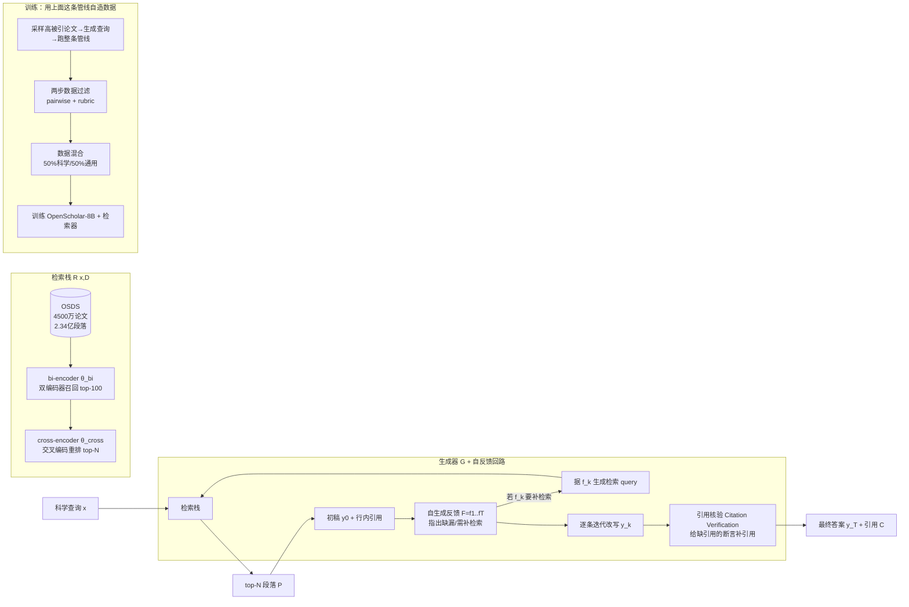

# 组会汇报 · OpenScholar

> 主讲提示：这篇是 D 组「Deep Research」的奠基样本。它的真正贡献不是「又一个 RAG」，而是把
> **「引用存在 ≠ 引用忠实」**这件事第一次做成了**可测量的指标 + 可优化的回路**。读它要盯住两条线：
> ① 一个**领域专用、完全开源**的 4500 万论文检索栈；② **self-feedback 自反馈推理**如何把「会幻觉引用的通用 LLM」
> 改造成「引用可追溯的学术助手」。本库 9.4「引用存在≠引用忠实」想解决的问题，这篇给了第一份工程答案。

---

## 1. 封面 · TL;DR

- **作者/出处**：Akari Asai, Jacqueline He, Rulin Shao, Weijia Shi 等（共同一作 4 人），UW + Ai2 牵头，2024-11-21，arXiv 2411.14199（v1）。代码/模型/数据/datastore/公开 demo 全开源（见原文 Appendix A）。
- **一段话**：OpenScholar 是一个**面向科学文献综述**的检索增强语言模型 (retrieval-augmented LM, RAG-LM)。它先从一个 **4500 万篇开放论文**的专用检索库 (OpenScholar-DataStore, OSDS) 里检索相关段落，再让生成器 LM 综合这些段落、产出**带行内引用 (inline citation)** 的长答案；关键创新是**迭代自反馈推理 (iterative self-feedback inference)**——模型先写初稿、再给自己写反馈、按反馈补检索并改写，最后做引用核验。为评测，作者造了 **ScholarQABench**——首个大规模、多学科、长答案的文献综述基准（2,967 题 + 208 篇专家长答案）。
- **三条带走的结论**：
  1. **引用质量可被「测量+优化」**：GPT-4o 在该任务上 **78–90%** 的引用是**编造的**（cite 了不存在的论文）；接上 OpenScholar 的检索 + 自反馈后，引用准确率（Citation F1）做到**与人类专家持平**（原文 Abstract / §4.2）。
  2. **小开源模型能打过大闭源系统**：训练出的 **OpenScholar-8B** 在 ScholarQA-CS 正确率上比 GPT-4o **高 5 分**、比 PaperQA2 **高 7 分**；把同一回路套在 GPT-4o 上（OS-GPT4o）再把 GPT-4o 自己的正确率**提升 12 分**（原文 Abstract / Table 2）。
  3. **覆盖度甚至超过专家**：人类评测中，专家**更偏好** OS-GPT4o / OS-8B 的答案达 **70% / 51%**（vs 专家自写），而无检索的 GPT-4o 只有 **32%**；优势主要来自**覆盖度 (coverage)**——模型读得多、写得全（原文 Abstract / Table 4 / §5.2）。

> 主讲提示：开场就把「78–90% 引用是假的」这个数字砸出来——这是全篇动机的爆点，也是和 9.4 模块的接口。

---

## 2. 问题与动机（why —— 本篇最该讲透的一节）

**科研为什么离不开「文献综合」？** 一个研究者要找新方向、改方法、做循证决策，前提是**把不断增长的文献综合起来**。但每年论文体量爆炸，靠人读完再综合越来越难。理想的助手要同时满足三件事：**精确检索**（找对论文）、**准确归因**（说哪句话出自哪篇）、**实时**（能看到最新文献）。

**通用大模型为什么不够？** 原文 §1 列了三个硬伤：
- **幻觉 (hallucination)**：把不存在的事实/论文说得煞有介事；
- **依赖过时的预训练数据**：训练截止之后的新文献它根本不知道；
- **归因不透明**：给不出「这句话的依据是哪篇论文的哪段」。

作者用实验把第一条量化了：**让 GPT-4 引用最新文献时，在计算机科学和生物医学领域有 78–90% 的引用是编造的**（原文 §1）。这正是「引用存在 ≠ 引用忠实」的极端形态——它连「存在」都做不到。

**检索增强 (RAG) 能补，但现有 RAG 不够「科学」。** 原文 §1 指出现有文献综述系统的两大缺口：
1. **依赖黑箱闭源 LLM**，既没针对文献综合优化，也没配**开放的领域检索库**（处理过的语料 + 对应检索索引）——不可复现、推理成本高（如 PaperQA2 建在专有 LLM 上）。
2. **评测太弱**：要么是**单学科、小规模的人评**，要么退化成**多选题 QA**——都不能反映「开放式、要跨多篇论文、要长答案」的真实综述场景。

**这篇的赌注（核心动机）**：把检索栈、检索库、生成器**全部开源化、领域专用化**，并用**自反馈回路**把「一步生成易漏易错」的 RAG 升级成「会自我修订、会补检索、会核验引用」的循环；同时造一个**够真实、可复现、多维度**的基准来诚实地量它。一句话：

> **不是再做一个「能引用」的 demo，而是把「引用得对不对、全不全」做成开源、可测、可优化的完整系统。**

> 主讲提示：把 why 收敛到三点——①通用 LLM 引用是假的（78–90%）；②现有 RAG 黑箱又难复现；③评测退化成多选题测不出真本事。OpenScholar 就是冲这三点去的。

---

## 3. 研究问题 / 核心 intention（形式化成一句话）

把要解决的问题压成一句：

> **给定一个开放式科学问题，能否用一个完全开源的领域检索栈 + 自反馈推理回路，让（甚至是小的开源）LM 产出覆盖全面、且每个该引用的句子都有真实可追溯引用的长答案，做到与人类专家持平甚至更好？**

**任务形式化（原文 §2 Task formulation）**：给定科学查询 $x$，任务是识别相关论文、综合其发现、生成回应 $y$，并附一组引用 $\mathbf{C}=c_1,c_2,\dots,c_K$，其中每个 $c_i$ 对应一篇真实存在的科学论文里的具体段落，且作为**行内引用**链接到 $y$ 中的相关文字片段——这样研究者能顺着引用回溯到原始文献，保证**透明、可验证**。

它隐含的**假设**：(a) 一个足够大、足够新的开放检索库 + 领域微调的检索器，能把「找对论文」这一环托住；(b) 让 LM **对自己的草稿写自然语言反馈并据此补检索/改写**，比一步到位更能补全覆盖、修正引用；(c) 这套推理回路产出的中间数据，可以反过来**蒸馏**出一个便宜的小模型。

---

## 4. 相关工作定位（站在谁肩上、和谁不同）

| 方向 | 代表工作 | 与本篇的关系 |
|------|---------|------------|
| 标准 RAG | Lewis et al. 2020; Guu et al. 2020; Ram et al. 2023 | 思想根基：检索→生成。但只「一步生成」，易产生无依据断言、覆盖不全 |
| 科学专用 LM | SciGLM, BioMedGPT, MedLLaMA, AstroLLaMA… | 把领域知识塞进**参数**里 → 仍会幻觉、看不到新文献（原文 §6） |
| 检索式文献综述系统 | PaperQA2 (Skarlinski 2024), Perplexity Pro, Agarwal 2024 | 同赛道，但**靠黑箱专有 LLM + 不开放检索库**；评测多为小规模人评/多选 |
| 自我反思/自我改进 | Self-RAG (Asai 2024), Reflexion, Madaan 2023 (Self-Refine) | 思想来源：让模型回看自己输出再改。OpenScholar 把它**专门化为「补检索 + 核验引用」** |
| 带引用生成 / 归因评测 | ALCE (Gao et al. 2023), Yue et al. 2023 (AttrScore), Liu et al. 2023 | **引用 Precision/Recall 的定义来源**；本篇沿用并应用到长答案综述 |
| 文献综述基准 | SciFact, QASPER, QASA, KIWI (Xu 2024) | 多为**单篇**或模型生成参考答案；ScholarQABench 主打**多篇 + 专家写答案 + 自动评测管线** |
| **本篇** | OpenScholar + ScholarQABench | **开源检索栈 + 自反馈回路 + 引用忠实度可测基准**，三件一起做 |

> 主讲提示：一句话区分——「别人要么把知识塞进参数（会幻觉），要么用黑箱 RAG（难复现、引用不可测）；OpenScholar 把检索栈全开源、把引用忠实度做成可优化目标」。

---

## 5. 方法总览（big picture，先直觉后数学）

整体 = **专用检索栈（datastore + retriever + reranker）** → **生成器 LM** → **自反馈迭代回路（初稿→反馈→补检索改写→引用核验）**，外加用这条推理管线**自蒸馏**出 8B 小模型（见原文 Figure 1 / Figure 2）。

**直觉**：检索栈像「图书馆员 + 精排筛选」——先用便宜的双编码器从 4500 万篇里粗筛 100 篇，再用贵但准的交叉编码器精排出最相关的 N 段。生成器先写初稿；自反馈回路像「自己当审稿人」——读自己的草稿、发现「只有 QA 任务的实验、缺了别的任务类型」就**自己写一句反馈并触发补检索**，再把新材料并进来改写；最后**引用核验**确保每个该引用的句子都挂上了真实段落。整条回路同时被用来**生产高质量训练数据**，蒸馏出便宜的 8B 模型。

---

## 6. 符号与术语表（后文统一用）

| 记号 / 术语 | 含义 |
|------------|------|
| $x$ | 输入的科学查询 (query) |
| $y,\ y_0,\ y_k,\ y_T$ | 生成的回应；$y_0$ 初稿，$y_k$ 第 $k$ 步改写，$y_T$ 最终输出 |
| $\mathbf{C}=\{c_1,\dots,c_K\}$ | 引用集合 (citations)，每个 $c_i$ 指向某真实段落 |
| $\mathbf{D}$ | datastore，即 OSDS（4500 万论文 / 2.34 亿段落） |
| $\mathcal{R}(\cdot)$ / $\mathcal{R}(x,\mathbf{D})$ | 检索器 (retriever)，从 $\mathbf{D}$ 中按与 $x$ 的相关性取段落 |
| $\mathcal{G}(\cdot)$ | 生成器 LM (generator)，综合段落产出 $y$ 与 $\mathbf{C}$ |
| $\mathbf{P}=\{p_1,\dots,p_N\}$ | 检索/重排后喂给生成器的 top-$N$ 段落 |
| $\theta_{\text{bi}}$ | 双编码器 (bi-encoder) 检索器参数（1.1 亿参数） |
| $\theta_{\text{cross}}$ | 交叉编码器 (cross-encoder) 重排器参数（3.4 亿参数） |
| $\mathbf{F}=\{f_1,\dots,f_T\}$ | 模型自生成的反馈 (feedback) 序列，每个 $f_t$ 是一句自然语言改进意见 |
| $T$ | 反馈条数（设上限 3 条，原文 §2.2） |
| $N$ | 喂给生成器的段落数（单篇任务=5，多篇任务=10，原文 §4.1） |
| Citation Recall / Precision / F1 | 引用召回/精确/F1，本篇引用忠实度的核心指标（§3.2 / 见 §11） |
| peS2o | 由 S2ORC 整理的开放获取论文语料（原文用 v2 评测、v3 建库） |

---

## 7. 方法细节 ① 检索栈：datastore + 双编码器召回 + 交叉编码重排（§2.1）

**why**：综述质量的天花板，先由「能不能找到对的、全的、新的论文」决定。原文 §2.1 强调：以往工作常只用 arXiv 2023–2024 的**子集**，覆盖窄、质量受限；要做好综述，需要**多样、够新、够大**的检索源——而且要开源可复现。

**how — datastore (OSDS)**：以 **peS2o**（基于 S2ORC，Lo et al. 2020）为来源，含截至 **2024 年 10 月**的 **4500 万篇**开放获取学术论文。把每篇正文按空白切成 **250 词**的离散文本块，并把**论文标题拼到每个块前**，最终得到 **2.34 亿 (234 million) 段落**（评测主用 peS2o **v2**，截至 2023-01；建库探索用 **v3**）。作者称这是**已知最大的开源科学文献 datastore**。

**how — 三路初筛**（原文 §2.1 "Retrieve initial paragraphs"）：从三个来源召回 100+ 候选段落：
1. **peS2o datastore**：用领域微调的双编码器 $\theta_{\text{bi}}$ 把每段离线编码成稠密向量；查询时编码 $x$，做**最近邻搜索**取 top-100。
2. **Semantic Scholar API**：先用生成器 LM 从 $x$ 抽**关键词**，按引用量取 top-10 论文的摘要（绕开 S2 API 不擅长处理长问句的限制）。
3. **You.com 网络检索 API**：限定 arXiv/PubMed 等学术站，取 top-10；开放获取就抽全文，否则只用摘要。

**how — 重排 (rerank) 与 top-N 终选**（原文 §2.1 "Rerank and finalize"）：

> 直觉：双编码器把查询和段落**分开编码**，捕捉不到二者的深层交互，召回里混着没用的上下文；把上百段全塞给 LLM 既慢又掉点。于是用**交叉编码器**——把「查询+单段」**一起编码**算相关分，精度高但只用在已召回的小集合上。

记号（先定义）：$\theta_{\text{cross}}$ 为交叉编码器；对每个候选段落 $p$，它联合编码 $(x,p)$ 输出相关分 $s(x,p)$；按 $s$ 排序取 top-$N$ 进 $\mathbf{P}$。训练上，用 **Llama 3 70B Instruct** 基于 peS2o 摘要造合成查询，给 top-10 段落打 **1–5** 分，**4–5 为正、1–2 为负、3 丢弃**，据此微调一个 **BGE-reranker**。终选时还做**元过滤 (meta-filtering)**：①每篇论文最多保留 **3 段**；②把**归一化引用量**并入交叉编码器的相关分。

整条检索-生成的标准 RAG 形式（原文 §2，Figure 2 中给出）：

> 直觉：先用一句把「检索→生成→引用」整体写成一个函数，后面所有花活都是在这个骨架上加回路。

记号已在 §6 定义（$x$ 查询、$\mathbf{D}$ datastore、$\mathcal{R}$ 检索器、$\mathcal{G}$ 生成器、$y$ 答案、$\mathbf{C}$ 引用）。

$$ y,\ \mathbf{C} \;=\; \mathcal{G}\big(x,\ \mathcal{R}(x,\mathbf{D})\big) $$

读出什么：标准 RAG 是「检索一次、生成一次」的**单步**映射——这恰恰是它易漏易错的根源；§8 的自反馈就是把这个单步展开成可迭代的回路。

> 主讲提示：检索栈三件套要点——**4500 万论文 / 2.34 亿段落**的开源库、**双编码器召回(110M) + 交叉编码重排(340M)**、外加 S2 与 web 两路兜底新文献。强调「最大开源科学 datastore」这个卖点。

---

## 8. 方法细节 ② 自反馈推理回路（self-feedback inference，本篇核心，§2.2）

**why**：标准 RAG「一步生成 $y_0$」对简单 QA 够用，但对综述会出两类病——**无依据断言 (unsupported claims)**（Liu 2023）和**信息缺失导致的不完整 (incomplete output)**（原文 §2.2）。直觉上，**一次检索往往不知道还缺什么**：只有先写出草稿，才看得出「这里缺了某类工作」。所以要把生成变成**写稿→自评→补料→改写**的循环。

回路分**三步**（原文 §2.2）：

**(1) 初稿 + 反馈生成 (Initial response and feedback generation)**。
- 直觉：先让模型基于 $\mathbf{P}$ 写出带引用的初稿 $y_0$；再让它**对自己的初稿挑刺**，产出一串自然语言反馈。
- 记号：$y_0$ 为初稿；$\mathbf{F}=\{f_1,f_2,\dots,f_T\}$ 为反馈序列，每个 $f_t$ 是**一句**指出可改进点（组织性、完整性、缺哪类信息…）的自然语言。为效率，**反馈上限 $T=3$ 句**。
- 关键设计（why 这么做）：与 Self-RAG 等**用预定义反馈信号**不同，这里允许模型生成**任意、灵活的自然语言反馈**。若某条反馈点出「缺某类内容」（例：「答案只含 QA 任务的实证结果，请补其它任务类型」），模型还会**为该条反馈生成一个检索 query**，调用 §2.1 的管线补检索。

**(2) 迭代改写 (Iterative refinement)**。
- 直觉：拿着反馈逐条把答案改厚改对。
- 记号：对第 $k$ 条反馈 $f_k$，若它要求补检索，则用其 query $q_k$ 检索新段落、**追加进 $\mathbf{P}$**；模型以「上一版 $y_{k-1}$ + 段落 $\mathbf{P}$（含新检索）」生成更新版 $y_k$。逐条处理直到所有反馈被吸收，得到第 $T$ 步的最终输出 $y_T$。
- 注（原文脚注）：虽然每次反馈后也能整篇重生成，但那样增加时延；作者实测**反馈往往各打各的点、彼此独立**，所以**从初稿出发顺序吸收**就够有效。

**(3) 引用核验 (Citation verification)**。
- 直觉：最后专门过一遍引用——保证每个**该引用的句子 (citation-worthy statement)**（需要佐证的科学论断）都有检索段落支撑。
- how：指示生成器检查 $y_T$ 中所有该引用的句子是否被引用充分支撑；**缺引用的，做事后插入 (post hoc insertion)** 补上。注意：管线**不删除**那些缺乏可引用论断的句子（即不为了好看而删内容）。

> 直觉小结：把单步 RAG 展开成「写→挑刺→（必要时）补检索→改→核验引用」。它一次性解决两件事——**覆盖度**（靠补检索）和**引用忠实度**（靠核验插入）。

> 主讲提示：这一节是和 9.4 的正面接口。强调两个「为什么」：①为什么要先写草稿再补检索（一次检索不知道缺什么）；②为什么单独做引用核验（覆盖度上去了不等于每句都有据，忠实度要单独保）。

---

## 9. 方法细节 ③ 用推理管线自造训练数据，蒸馏出 OpenScholar-8B（§2.3）

**why**：能做好综述的训练数据稀缺——已有科学资源多为**单篇、无检索**设置；而 PaperQA2 等靠**专有 LLM**，不可复现、成本高（原文 §2.3）。作者的解法：**让上面那条强但贵的自反馈管线（用 Llama 3.1 70B 跑）去生产数据**，再训一个便宜的 8B，使它**不走自反馈也能直接产出高质量、引用准确的答案**。

**数据生成三步**（原文 §2.3 "Question and response generations"）：
1. 从 $\mathbf{D}$ 采 **100 万篇**论文摘要（带发表年/引用量元信息）；
2. 从中**随机选 1 万篇 2017 年后**发表的论文，让 LM 据每篇摘要生成「需要多篇论文才能回答」的文献综述/信息检索式问题；
3. 用 OpenScholar 管线跑出最终输出 $y_T$ 及**中间产物**（反馈 $\mathbf{F}$、初稿 $y_0$）。

**两步数据过滤 (data filtering)**（原文 §2.3）——合成数据可能有幻觉、重复、不守指令：
- **成对过滤 (pairwise-filtering)**：比较 $y_T$（终稿）与 $y_0$（初稿）质量，**保留更优者**。有意思的发现：**约 20% 的情况下 $y_0$ 反而更好**（因为多轮迭代会**过度编辑 / 增加冗余**）——所以不能盲信「迭代越多越好」。
- **评分过滤 (rubric-filtering)**：对选中答案在两维度上按**五分制**打分——**组织性 (organization)** 与 **事实精度及引用准确性 (factual precision and citation accuracy)**；**两项都 ≥ 4.5** 才保留，否则丢弃。

**数据混合与训练 (data mixing and training)**（原文 §2.3 / Appendix C.3）：
- 造**三类**训练数据：答案生成 $x\!\to\!y$、反馈生成 $y_0\!\to\!\mathbf{F}$、反馈吸收 $y_{k-1},f_k\!\to\!y_k$（实测同时用最终+中间产物，能让小模型更会生成有效反馈）。
- 与**通用指令微调数据 (Tulu 3)** 和**科学指令数据 (SciRIFF)** 混合，保证 **50% 来自科学领域、50% 通用**；另造合成的事实核验与布尔 QA 数据（取引用量 top-10 万论文）。
- 基座 **Llama 3.1 8B Instruct**，共 **130,135** 条训练样本，用 `torchtune` 训 **2 个 epoch**。生成器训练数据分布（原文 Figure 7）：Tulu 53.8% / Fact Verification 15.4% / Single-paper QA 10.8% / Multi-paper QA 9.1% / SciRIFF 6.4% / Editing(改写) 2.5% / Feedback 2.0%。

> 主讲提示：这一节的 why 是「自举 (bootstrapping)」——强管线当老师，蒸馏出便宜学生。顺手抛一个反直觉点：**20% 情况初稿比终稿好**，所以他们用 pairwise 过滤而非无脑要终稿——这本身就是对「自我改进必然变好」的证伪。

---

## 10. ScholarQABench：把「文献综述」做成可复现基准（§3）

**why**：以往评测要么**单学科小规模人评**，要么**过度简化成多选 QA**（原文 §3）。造高质量综述基准有两难：①标注需要**博士级领域专家**；②**长答案的可靠评测**本身很难。ScholarQABench 三条原则：**任务多样**（闭式分类/多选/长答案）、**学科多样**（CS/生物/物理/神经）、**含多篇任务**（要跨多篇论文检索推理）。

**数据构成（原文 Table 1）**：共 **2,967 题**，其中四个新建的多篇数据集需跨论文推理。

| 数据集 | 任务格式 | 学科 | 规模 | 评测维度 | 多篇? |
|--------|---------|------|------|---------|:----:|
| SciFact | Claim→Label(真/假) | 生物医学 | 208 | Corr, Cite | |
| PubMedQA | Q→A(yes/no) | 生物医学 | 843 | Corr, Cite | |
| QASA | Q→长答案 | CS | 1,375 | Corr, Cite | |
| ScholarQA-CS | Q→长答案(带 rubric) | CS | 100 | Corr, Cite | ✓ |
| ScholarQA-Bio | Q→长答案(仅题) | 生物医学 | 1,451 | Cite | ✓ |
| ScholarQA-Neuro | Q→长答案(仅题) | 神经科学 | 1,308 | Cite | ✓ |
| ScholarQA-Multi | Q→长答案(题+专家答案) | CS/物理/生物 | 108 | Cite, LLM, Expert | ✓ |

**关键构造细节（why 这么标）**：
- **专家成本极高**：208 篇长答案由有 3 年以上经验、且在该领域有发表的**博士生 / 博士后**撰写，**平均每篇约 1 小时**（ScholarQA-Multi 平均每题 **56 分钟**）；标注者被**明令禁用任何 LLM 服务**，只许用 Google/Semantic Scholar 这类检索（原文 §3.1.2 / Table 7），以保证参考答案「干净」。
- **ScholarQA-CS 的 rubric**：100 题，每题由专家先写「关键要点 (key ingredients)」清单，分 **must-have / nice-to-have** 两档，并附支撑引文；**平均每题 4.4 条要点**（原文 Figure 3）。
- **标注一致性 (agreement)**：对 10 题随机样本，让标注者各自写 rubric、用自动管线给四个 LLM 答案打分，算两两 **Pearson 相关**取均值：**含通用准则时 79.3、不含时 59.5**（原文 §3.1.1）。

> 主讲提示：强调这是**评测侧的重活**——208 篇人工长答案、每篇 ~1 小时、禁用 LLM。这既是「比肩专家」论断的标尺，也是后面 §16 谈「数据集小、有偏」的来源。

---

## 11. 评测指标定义（setting/metrics 的核心：引用忠实度怎么算，§3.2 + Appendix B.3）

> 主讲提示：这一节是全篇**最该写全**的部分，也是和本库 9.4 的命门。组会上最容易被追问「引用准确率到底怎么定义、怎么自动判」。下面把每个指标的**定义式**和**自动判定器**都摆出来。

OpenScholar 用**多维度自动评测**（原文 §3.2），四组维度：

### 11.1 正确性 Correctness（`Corr`）
只用于有人工参考答案的任务。**短答案任务**（SciFact / PubMedQA）用 **accuracy**；**QASA** 用 **ROUGE-L**；**ScholarQA-CS** 用自研的长答案 rubric 评分（见 11.4）。

### 11.2 引用准确率 Citation accuracy（`Cite`，本篇灵魂指标）
**why**：长答案综述的核心要求是「**每个该引用的论断都被正确归因**」。沿用 ALCE（Gao et al. 2023）/ Liu et al. 2023 的归因评测，在**句子级**度量引用的**精确率与召回率**。

先定义记号（原文 §3.2）：
- **citation-worthy statement**：答案中一个「需要佐证」的科学论断句；
- 对一个论断句 $s$，其**关联引用集合**为 $\text{cite}(s)\subseteq\mathbf{C}$（推理时提供的段落集）；
- **Supported / 支持**：由一个**归因 LM (attribution model)** 判断「给定参考段落能否支撑该论断句」——回答 **Attributable（可归因）/ Contradictory（矛盾）/ Extrapolatory（无法从上下文推断）** 之一（原文 Appendix B.3.3，判定指令见原文 Table 9）。

**Citation Recall（引用召回，`Cite`-r）**——直觉：**每个该引用的句子，是不是都挂上了能支撑它的引用？**（衡量「漏引/无据」）。
$$
\text{Citation Recall}
=\frac{\#\{\text{被其引用充分支撑的 citation-worthy 句}\}}{\#\{\text{全部 citation-worthy 句}\}}
$$
读出什么：召回低 = 有该引用却没引、或引了但支撑不住的句子——这正是 GPT-4o「引用存在≠忠实」的病灶。

**Citation Precision（引用精确，`Cite`-p）**——直觉：**每条引用是不是都「有用且必要」？** 对每条引用，验证其**相关性与必要性**——具体看「**移除它是否破坏其余引用对该句的支撑完整性**」（原文 §3.2）。
$$
\text{Citation Precision}
=\frac{\#\{\text{相关且必要的引用}\}}{\#\{\text{全部引用}\}}
$$
读出什么：精确低 = 堆了无关/冗余引用来「凑数」。

**Citation F1（`Cite`-F1，主指标）**——直觉：综合「不漏 + 不滥」。
$$
\text{Citation F1}=\frac{2\cdot \text{Precision}\cdot \text{Recall}}{\text{Precision}+\text{Recall}}
$$
读出什么：本篇**以 Citation F1 为引用准确率的首要指标**，且**不需要 gold 参考答案**（只需检索段落作证），所以**对所有任务都能算**（原文 §3.2）。这是它能在没有专家答案的 ScholarQA-Bio/Neuro 上照样评引用的关键。

**自动判定器与口径（原文 Appendix B.3.3）**：归因 LM 用 **`osunlp/attrscore-flan-t5-xl`**（FLAN-T5-XL 在归因任务上微调，Yue et al. 2023）；**句子级**计算 Precision/Recall；**丢弃 < 50 字符的句子**（多为标题/小节名，不需引用）；判定指令沿用 Yue et al. 2023（原文 Table 9）。

### 11.3 内容质量 Content quality（`Org`/`Cov`/`Rel`/`Use`）
**why**：光对、还不够，要评 `Corr`/`Cite` 之外的质量。四个维度（原文 §3.2 / Table 8）：
- **相关性 Relevance（`Rel`）**：是否切题、有用；
- **覆盖度 Coverage（`Cov`）**：讨论话题的**广度**（论文多样性）与**深度**（细节充分性）；
- **组织性 Organization（`Org`）**：结构是否清晰、逻辑是否连贯；
- **总体有用性 Overall Usefulness（`Use`）**：是否满足信息需求（**仅用于有人工参考答案**的 ScholarQA-Multi，因 LLM 评 usefulness 不可靠时易过度乐观）。

自动评测用 **Prometheus v2 (8×7B)** 按**五分制 rubric** 打分（原文 §3.2；五分制 rubric 见原文 Table 10/11/12）。具体配置（原文 Appendix B.3.2）：`Org`/`Cov` 用 Prometheus-BGB、`Rel` 用 Prometheus v2，均以人工答案为 gold 参考；max new tokens=512、top-$p$=0.95、temperature=0.01。

### 11.4 ScholarQA-CS 长答案评分（原文 Appendix B.3.1）
每条 rubric 含两类准则：**通用准则 (general)** 占 **40%**、**标注驱动准则 (annotation-driven)** 占 **60%**。通用准则评长度/专业性/引用/摘录；标注驱动准则评「专家点的每条 key ingredient（及其引文）是否出现」，按 **0–1** 打分，**must-have 的权重是 nice-to-have 的 2 倍**；由 **GPT-4o-turbo** 对每条准则打分后加权求和。

> 主讲提示：把三句话钉死——①**Citation F1 = 句子级、归因 LM 判 Supported、Precision×Recall 调和、不需 gold 答案**；②召回管「漏引/无据」，精确管「滥引/凑数」；③**自动判定器是 attrscore-flan-t5-xl，丢弃<50字符句**。这就是「引用忠实度」从口号变成数字的全部机关。

---

## 12. 实验设置（setting / params / 算力 / 成本，写全，§4.1 + Appendix C）

**评测对象 (Models)**（原文 §4.1）：
- 开源/闭源 LM：**Llama 3.1 (8B / 70B)**、**GPT-4o**（`gpt-4o-2024-05-13`），各自**无检索**单独作答（再核验其给出的论文标题是否存在、能否取到摘要当引用）。
- 多篇任务额外比：**Perplexity Pro**（付费版，无 API，用 selenium 抓最终结果，故拿不到引用信息、无法评其引用准确率）、**PaperQA2**（用 GPT-4o 做重排/摘要/生成的并发文献综述系统；用其官方代码 + 下载论文 PDF 离线、并用 S2 API 当检索）。
- 本文系统：**OS-8B**（训练后的 8B）、**OS-70B**（Llama 3.1 70B + 回路）、**OS-GPT4o**（GPT-4o + 回路）；带 **+OSDS** 表示「该模型 + 标准 RAG（用我们的 datastore）」。

**检索器/重排器超参（原文 §4.1 + Appendix C.1/C.2）**：
- $\theta_{\text{bi}}$：**1.1 亿参数**，从 Contriever 初始化，按 Izacard 2022 的无监督法在 **peS2o v2 + CCNews + Proofpile2** 上**持续预训练 500k 步**，batch size **4096**、learning rate **0.00005**。
- $\theta_{\text{cross}}$：**3.4 亿参数**，微调 **BGE-large** reranker，**5 个 epoch**、lr **6e-5**；分数 >3 为正、<3 为负。
- 检索数量：从 S2 取**最多 10 篇**；每篇限 **3 段**。

**生成器超参（原文 §4.1 + Appendix C.3）**：
- temperature **0.7**；最大 token：回应生成 **3,000**、反馈生成 **1,000**；用 `vllm` 推理。
- 段落数 $N$：单篇任务 **5**、多篇任务 **10**；除 SciFact / PubMed 用 **1-shot** 示例外，**不给 few-shot**。
- OS-8B 训练：基座 Llama 3.1 8B Instruct，**2 epoch**，lr **5e-6**（注：检索器侧 1e-4），最大上下文长 **10k**、batch size **1**、梯度累积 **2**、bf16、优化器 **AdamW**；共 **130,135** 条样本。

**成本（原文 Table 2，CS USD/query）**：OS-8B **0.003**、OS-70B **0.01**、OS-GPT4o **0.05**、GPT-4o **0.006**、PaperQA2 **0.3–2.3**、Perplexity **0.002**（按 $20/月 ÷ 9000 query 估）。即 **OS-8B 比 PaperQA2 便宜约 2 个数量级**。

> 主讲提示：参数写全是这一节的命。重点报三个数：**检索器 110M + 重排器 340M（都自训）**、**OS-8B 推理 $0.003/题（PaperQA2 的 1/100）**、**段落数 5(单篇)/10(多篇)**。

---

## 13. 主要结果（数字 + 解读，别只贴表，§4.2）

核心结果在原文 **Table 2**（`Corr`=正确性，对 SciFact/PubMedQA 为 accuracy、QASA 为 ROUGE-L、CS 为综合分；`Cite`=Citation F1）。摘关键对比：

| 模型 | Pub `Corr` | Sci `Corr` | QASA `Corr`/`Cite` | **CS `Corr`/`Cite`** | Multi `Cite` | Bio `Cite` | Neu `Cite` | CS 成本 |
|------|:---:|:---:|:---:|:---:|:---:|:---:|:---:|:---:|
| Llama3-8B（无检索） | 61.5 | 66.8 | 14.3 / 0.0 | 41.9 / 0.0 | — | 0.0 | 0.0 | 0.0001 |
| +OSDS（标准 RAG） | 75.2 | 75.5 | 18.6 / 47.2 | 46.7 / 26.1 | — | 38.0 | 36.8 | 0.0001 |
| **OS-8B** | **76.4** | **76.0** | 23.0 / 56.3 | **51.1 / 47.9** | — | 50.8 | 56.8 | 0.003 |
| GPT-4o（无检索） | 65.8 | 77.8 | **21.2** / 0.1 | 45.0 / 0.1 | — | 0.2 | 0.1 | 0.006 |
| +OSDS | 75.1 | 79.3 | 18.3 / 53.6 | 52.4 / 31.1 | — | 36.3 | 21.9 | 0.01 |
| **OS-GPT4o** | 74.8 | **81.3** | 18.7 / **60.4** | **57.7 / 39.5** | — | 51.5 | 43.5 | 0.05 |
| PaperQA2 | — | — | — | 45.6 / **48.0** | — | 56.7 | 56.0 | 0.3–2.3 |
| Perplexity | — | — | — | 40.0 / — | — | — | — | 0.002 |

**单篇任务**：OS-8B / OS-70B 在 `Corr` 与 `Cite` 上**一致超过**带不带检索的 Llama 3.1；OS-70B 在 PubMedQA / QASA 上**追平或超过 GPT-4o**（原文 §4.2）。

**多篇任务（更难、更真实）**：
- **OS-GPT4o 在 ScholarQA-CS `Corr` 上 57.7，比 GPT-4o 单独的 45.0 高 12.7 分**，比标准 RAG 高 5.3 分（原文 §4.2，对应 Abstract 的「+12%」）。
- **OS-8B（CS `Corr` 51.1）显著超过**用现成 Llama 3.1 8B + 标准 RAG 的管线（+OSDS 为 46.7），证明**领域训练**的价值。
- OpenScholar **大幅超过 GPT-4o / Perplexity Pro / PaperQA2**；且靠轻量双/交叉编码器 + 自研模型，**成本比 PaperQA2 低几个数量级**仍保持高性能。

**引用幻觉的对照（原文 Table 3，CS / 生物医学两域）**：
- **OS-8B 引用论文的「实际存在率」≈100%（幻觉比例 0.0）**；
- 而 **Llama 3.1 8B 幻觉比例 92.1% / 97.6%**、**Llama 3.1 70B 78.1% / 96.6%**、**GPT-4o 78.7% / 94.8%**——即无检索模型**编造的引用占了大多数**，生物医学域更糟；即便引到真论文，多数也**不被对应摘要支撑**，导致引用准确率近乎 0（原文 §4.2 "Limitations of parametric LMs"）。

读出什么：**「检索」几乎总是有益**——无检索基线在覆盖度和引用上几乎全崩（`Cite`≈0），这把「参数里记知识」在科学域的不可行性钉死了；而**领域训练**让 OS-8B 在「成本 1/100」的前提下打过一众闭源系统。

> 主讲提示：把两张表连起来讲——Table 2 给「正确性/引用 F1 全面领先」，Table 3 给「为什么领先」：**无检索模型 78–98% 的引用是假的，OS-8B 是 0%**。这就是封面那条「78–90%」的实锤出处。

---

## 14. 消融与分析（哪个部件贡献多少，§4.3）

**组件消融（原文 Figure 4(a)，ScholarQA-CS 上 `Corr`/`Cite`）**：在 OS-8B / OS-GPT4o 上依次去掉各推理/训练组件。

| 配置 | OS-8B `Corr` | OS-8B `Cite` | OS-GPT4o `Corr` | OS-GPT4o `Cite` |
|------|:---:|:---:|:---:|:---:|
| 完整 | 51.3 | 47.9 | 57.7 | 39.5 |
| − training（仅 OS-8B：换回原始 Llama3-8B） | 49.4 | 42.3 | — | — |
| − reranking（去重排器） | 49.6 | 28.2 | 52.4 | 22.9 |
| − feedback（去自反馈） | 51.1 | 50.2 | 55.1 | 31.0 |
| − attribution（去事后引用核验） | 49.3 | 44.0 | 55.6 | 30.6 |

读出什么（原文 §4.3）：
- **去重排器伤害最大**，`Corr`/`Cite` 都明显掉——尤其引用 F1 从 ~48→28（OS-8B）、~40→23（OS-GPT4o）：**精排是引用质量的命根子**。
- **去自反馈**：在 **OS-GPT4o 上下降明显**（`Cite` 39.5→31.0），说明**更强的模型从自反馈回路获益更大**（与 Madaan 2023 一致）；在已训练的 OS-8B 上**反而对 `Cite` 略有上升**（50.2）——因为 8B 的能力已被训练「内化」了反馈，外挂回路边际收益小甚至略扰动。
- **去引用核验 (attribution)**：`Corr` 与 `Cite` 都降——核验是保引用准确率的必要后处理。
- **训练 vs 原始**：训练让 OS-8B 全面提升（`Corr` 49.4→51.3、`Cite` 42.3→47.9），印证「**高质量领域数据 → 高效专用小模型**」。

**上下文段落数 $N$（原文 Figure 4(b)(c)）**：把 top-$N$ 从 5 加到 10 能提升正确性；但**继续加反而同时拉低正确性和引用准确率**。Llama 3.1 8B 虽号称能吃 128K 上下文，**段落一多就明显劣化**、引用 F1 低至 ~10；而**训练后的 OS-8B 在 $N$ 高达 20 时仍稳**，Llama 70B 也较稳（引用 F1 维持 ~40）。读出什么：**「能塞进长上下文」≠「能有效利用」**，小模型尤其需要专门训练才扛得住多段落。

**人类评测（原文 Table 4 / Figure 5，108 题 ScholarQA-Multi，16 位博士专家）**：模型答案 vs 专家答案，按 `Org`/`Cov`/`Rel`（五分制）+ `Use`（有用率%）+ 相对专家胜率打分。

| 系统 | `Org` | `Cov` | `Rel` | `Use`(%) | 相对人类 胜/平/负(%) |
|------|:---:|:---:|:---:|:---:|:---:|
| GPT-4o（无检索） | 4.63 (+0.4) | 4.06 (−0.2) | 4.50 (−0.1) | 69.7 (−13.9) | 31.9 / 13.8 / **54.2** |
| OS-8B | 3.82 (−0.3) | 4.30 (+0.7) | 4.00 (−0.4) | 72.1 (+8.7) | 50.8 / 12.3 / 36.9 |
| OS-GPT4o | 4.47 (+0.8) | 4.38 (+0.9) | 4.30 (0.0) | **80.0 (+22.5)** | **70.0 / 6.8 / 23.2** |

读出什么：
- **OS-GPT4o / OS-8B 被专家偏好达 70% / 51%**（>50%，即比专家自写更受欢迎），**而无检索 GPT-4o 仅 31.9%**；优势主要来自 **`Cov`（+0.9 / +0.7）**——模型读得多、写得全。
- **诚实的代价线**：OS-8B 的 **`Org`(3.82, −0.3) 比专家差**——8B 的组织/流畅度不如人类与 GPT-4o 系统；GPT-4o 更会吸收反馈、写得更长更顺，故组织分高。
- **长度混杂因素 (confounder)**：OS-GPT4o / OS-8B 答案分别是人类的 **2.4 / 2.0 倍**长。作者做控制实验：把 OS-GPT4o 答案压到 ~333 词（≈人类长度），重评仍有 **75%** 被偏好或打平——说明**优势不只是「写得长」**（原文 §5.2）。
- 专家解释分析（59 个 pairwise 解释）：影响偏好的因素中 **coverage 占 29%**最高，organization 23%、relevance 12%、citations 9%——**覆盖度是人类偏好模型答案的首要原因**；但专家也指出模型**引用的论文偶尔过时或不够代表性**（原文 §5.2）。

> 主讲提示：人评这块要讲两面——**正面**：覆盖度赢、被偏好 70%、且控长度后仍赢；**诚实面**：8B 组织性输给人、引用偶尔不够代表性。这正好接 §16 局限。

---

## 15. 局限与批判（原文承认的 + 社区视角，诚实）

**原文自陈（§Limitations / §4.2）**：

*ScholarQABench 侧*：
- **数据集偏小**：有人工答案的部分仅 **CS-LFQA 110 题 / 专家答案 108 题**，可能带统计方差与标注者专长偏置；
- **自动评测不完美**：ScholarQA-CS 用**启发式权重**组合 rubric；标注者常在 rubric 里要「背景/铺垫」这类**未必答题必需**的信息，LLM 擅长写背景反而占便宜；
- **引用 P/R 在句子级偏严**：有些句子的引用其实写在**相邻句**里，按句计会**低估真实引用准确率**；
- **时效性**：标注定格在 **2024-07（CS）/ 2024-09（Multi）**，之后的科学进展无法反映，复现需忽略此后论文；
- **学科有限**：只覆盖 CS/生物/物理，**不含社科与其他工程领域**，结论未必外推。

*OpenScholar 侧*：
- **检索不总是最具代表性**：专家指出某些查询下**没检到最该引的代表作**——引入引用网络/发表时效等元信息或可改善；
- **8B 仍会有事实错误/无据信息**：受限于 8B 的指令遵循与科学知识容量，**版本越小问题越明显**；
- **OS-GPT4o 依赖专有 GPT-4o API**，会随时间变化，**精确复现困难**；
- **不使用受版权保护的论文**：合规边界限制了覆盖面；
- **人评本身有局限**：标注者评 usefulness/偏好时可能**更看写作质量而非事实/引用准确性**；且仅 108 题、三学科，未必外推。

**社区/批判视角（与本库其它线呼应）**：
- **「引用忠实」仍受判定器与口径制约**：Citation F1 依赖 **attrscore-flan-t5-xl** 这个相对小的归因模型 + 「丢弃<50字符句」「句子级」等口径，**判定器自身的错误**会传导到结论——「忠实度」是**相对某个自动 judge 的忠实度**，而非绝对真值。这正是 9.4 要继续追问的：**判定器可信吗？**
- **自我改进不是单调变好**：作者自己发现 **20% 情况下初稿优于终稿**（过度编辑/冗余），所以要 pairwise 过滤——这是对「迭代越多越好」直觉的**反例**，与本库对自反馈循环可靠性的关注一致。
- **覆盖度赢可能部分来自「会写背景 + 写得长」**：虽有控长度实验，但 rubric 偏好背景信息这一点，作者自承**模型可能投机迎合 rubric 风格**而非真提升答案质量。

> 主讲提示：把批判收成一句——**「它把『引用忠实』从口号变成了数字，但这个数字是『相对一个小判定器、按句子级、丢短句』量出来的」**。承认进步，也别把 judge 当真值。

---

## 16. 在 auto-research 版图的位置

- **阶梯定位**：在 Tool→Analyst→Scientist 阶梯里，OpenScholar 是一个**强 Analyst**——它**不提新假设、不做实验**，专精「读文献 + 综合 + 可追溯引用」这一环（Deep Research / 综述自动化）。它把这一环做到了「比肩专家」的成熟度，是后续「Scientist」系统**可靠引用基座**的候选零件。
- **与本库其它论文的关系**：
  - → **9.4「引用存在≠引用忠实」**：本篇是该问题的**第一份工程答案**——给出 Citation Recall/Precision/F1 的句子级定义 + 归因判定器 + 自反馈核验回路。9.4 的下一步正应追问「judge 本身的可靠性」。
  - ← **标准 RAG / Self-RAG (Asai 2024)**：站在它们肩上，把「单步检索生成」升级为「补检索 + 引用核验」的专门化回路。
  - ↔ **AI Scientist (2408.06292)**：那条线的写作阶段也做「20 轮检索补引用」，但**不评引用忠实度**、会幻觉引用；OpenScholar 恰好补上「引用对不对、全不全」的可测维度——可视为给端到端 Scientist 配一个**靠谱的文献模块**。
  - ↔ **co-scientist / OpenResearcher 等**：多 agent 综述系统的**评测标尺与检索基座**可直接复用 ScholarQABench 与 OSDS。

---

## 17. 复现与可用性（§Appendix A）

- **全开源**：公开 demo (`openscholar.allen.ai`)、代码 (`github.com/AkariAsai/OpenScholar`)、ScholarBench 代码与数据、**OS-8B 模型**、**Retriever / Reranker**、**DataStore V2 & V3**、训练数据、专家评测工具（原文 Appendix A 全部给了 HF / GitHub 链接）。
- **能不能在单卡跑**：
  - **检索器/重排器很轻**（110M / 340M），单卡可推理；**生成器 OS-8B** 用 `vllm`、上下文 10k，单张大显存卡可跑推理。
  - **真正的重资产是 datastore**：4500 万论文 / **2.34 亿段落**的稠密索引，存储与最近邻检索需要相当工程与磁盘/内存——这是复现门槛所在，但官方已放出 DataStore V2/V3 省去自建。
- **坑**：
  - **OS-GPT4o 依赖 GPT-4o API**，结果随版本漂移，难精确复现；想要可复现就用 **OS-8B**（全开源）。
  - 评测管线依赖若干外部判定模型（**attrscore-flan-t5-xl** 评引用、**Prometheus v2 8×7B** 评内容质量、**GPT-4o-turbo** 评 CS rubric），跑全套评测需要把这些 judge 都备齐。
  - 检索三路里 **Semantic Scholar / You.com API** 有速率与覆盖限制；纯离线复现只能退到 peS2o datastore 一路。

---

## 18. 组会讨论问题（5–8 个，能引发讨论）

1. **Citation F1 用 attrscore-flan-t5-xl（一个不大的 FLAN-T5）当归因判定器**——「比肩专家」的引用准确率，会不会只是「比肩这个 judge」？如何设计实验把「judge 误差」与「模型真实忠实度」拆开？（直通 9.4）
2. 作者发现 **20% 情况下初稿 $y_0$ 比终稿 $y_T$ 好**。这对「自反馈/自我改进必然变好」的信念是什么级别的反驳？什么时候该停止迭代？
3. 引用 P/R 在**句子级**计、且「支撑常写在相邻句」会**低估**忠实度。换成**段落级或论断级**评测，结论会怎么变？哪种口径更接近「人类认为的忠实」？
4. 无检索 GPT-4o 在 ScholarQA-Multi 上**组织性 4.63（比专家还高）**，但**有用性只有 69.7%、胜率仅 31.9%**——「写得顺」和「真有用」为何背离？这对「用 LLM-judge 评 usefulness」意味着什么？
5. **覆盖度是专家偏好模型答案的首要原因（29%）**，但模型答案是人类的 2–2.4 倍长且爱写背景。控长度实验（333 词仍赢 75%）足以排除「长度/背景投机」吗？还能怎么更干净地验证？
6. **去重排器对引用 F1 伤害最大**（~48→28）。这说明「引用质量」更多由**检索精排**而非**生成器**决定——那把预算投在更好的 reranker 还是更强的生成器？
7. OS-8B 引用幻觉率 **0%** vs GPT-4o **78–95%**：检索增强是「消除幻觉」还是「把幻觉问题转移成了检索覆盖问题」？检索不到代表作时，忠实但**片面**的答案算不算另一种误导？
8. ScholarQABench 只覆盖 CS/生物/物理、定格 2024 年中。要把「比肩专家」推广到**社科 / 数学 / 快速变动领域**，最大的障碍是数据、检索库、还是评测口径？

---

## 19. 一页速记（汇报当天速览）

- **是什么**：面向科学文献综述的**全开源检索增强 LM**。检索栈（4500 万论文 / 2.34 亿段落的 OSDS + 自训 110M 双编码器 + 340M 交叉编码器）→ 生成器 → **自反馈推理回路**（初稿→自挑刺→补检索→改写→引用核验），并自蒸馏出便宜的 **OS-8B**。配套 **ScholarQABench**（2,967 题 + 208 篇专家长答案）。
- **核心机关**：
  - **自反馈回路**：先写草稿才知道缺什么 → 据反馈**补检索**（管覆盖度）+ **事后引用核验**（管忠实度）。
  - **引用忠实度指标**：**Citation Recall**（该引的句子是否都有据）、**Citation Precision**（引用是否相关且必要）、**Citation F1**（主指标，句子级、归因 LM 判 Supported、**不需 gold 答案**）。
- **关键数字**：
  - 无检索 LLM **78–90%（生物医学达 95–98%）引用是编造的**；**OS-8B 引用幻觉率 0%**（Table 3）。
  - ScholarQA-CS 正确率：**OS-8B 比 GPT-4o +5、比 PaperQA2 +7**；**OS-GPT4o 把 GPT-4o 再提 +12**（Table 2）。
  - 人评偏好（vs 专家自写）：**OS-GPT4o 70% / OS-8B 51% / 无检索 GPT-4o 32%**；优势主因 **coverage**；控长度后 75% 仍赢（Table 4）。
  - 成本：**OS-8B $0.003/题**，约为 **PaperQA2 的 1/100**。
- **三句话结论**：①**引用忠实可测可优化**（把「78–90% 假引用」打到「0% 幻觉 + F1 比肩专家」）；②**小开源模型靠领域数据 + 检索打过大闭源系统**（且便宜两个数量级）；③**判定器与口径是软肋**——「比肩专家」是相对一个小归因模型、按句子级量出来的，且自我改进 20% 会变差。
- **在课里的位置**：D 组 Deep Research 奠基件 / 强 Analyst；是 9.4「引用存在≠引用忠实」的第一份工程答案，也是端到端 Scientist 系统的**可靠文献模块**候选。

> 主讲提示：结尾回到一句——**「它第一次把『引用得对不对、全不全』变成了能优化的数字；但记住，这个数字是相对一个小判定器量出来的——进步是真的，judge 不是真值。」**
