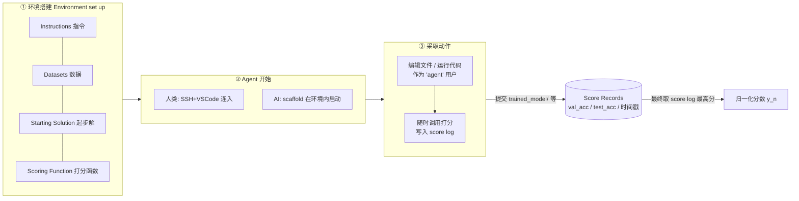
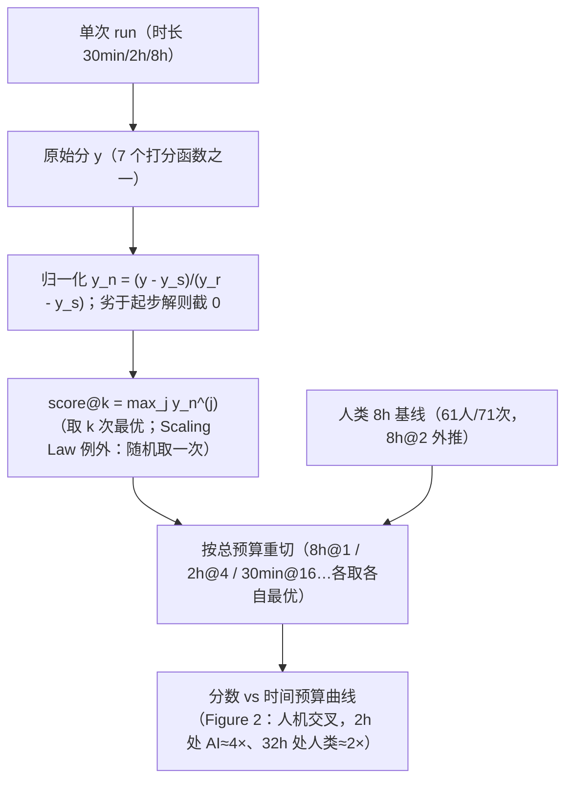

# 组会汇报 · RE-Bench (METR, 2411.15114)

> 主讲提示：这是评测组 E 的「时间预算」一课，也是本库 9.6 反复引用的那篇。读它的目的不是看某个模型多强，而是建立一把**衡量「AI 能否自动化 AI 研发」的尺子**，并理解这把尺子最反直觉的读数：**谁赢，取决于你给多少时间。** 开场就把这句话抛出来，全篇都在解释它。

---

## 1. 封面 · TL;DR

- **作者 / 出处**：Hjalmar Wijk, Tao Lin, Joel Becker, Sami Jawhar … Elizabeth Barnes 等（作者按字母序），METR（Model Evaluation and Threat Research），arXiv 2411.15114v2，2025-05-27，Preprint。
- **一段话**：RE-Bench（Research Engineering Benchmark, V1，研究工程基准）是 **7 个手工设计的开放式 ML 研究工程环境**的集合。每个环境给定一份**起步解 (starting solution)**、一台带 1–6 块 H100 的机器、一个可随时调用的**打分函数 (scoring function)**；人类专家与 AI agent 在**完全相同的条件**下作答。论文收集了 **61 位**不同专家的 **71 次 8 小时**作答，并把 o1-preview、Claude 3.5 Sonnet（新/旧）在两种 scaffold 下用 **score@k**（best-of-$k$）做对照。
- **三条带走的结论**：
  1. **能力是真的**：现代 AI agent 在若干 ML 主题上有显著专长——有 agent 写出的**自定义 Triton 内核比 9 位人类专家所有方案都快**；agent 生成并测试解的速度是人类的 **10 倍以上**，成本却低得多。
  2. **时间预算决定人机胜负（本篇核心）**：在 **2 小时**总预算下，**最好的 AI agent 得分约为人类的 4 倍**；但人类对时间的**边际回报更高**——给到 **8 小时**人类已**险胜**最强 agent，给到 **32 小时**人类拿到**最强 agent 的 2 倍**分数。
  3. **基准会高估也会低估**：环境范围小、反馈快、目标清晰 → 相对真实 AI R&D **可能高估** agent 能力（真实研发是数月尺度、百万行代码、上百个并行项目）；但 token 极便宜（8 小时一次约 \$123 vs 人类约 \$1,855）→ 又**可能低估**其经济竞争力。

> 主讲提示：把「4×（2h）→ 人类反超（8h）→ 2×（32h）」这条曲线当作全篇的脊梁。它既是论文最大的卖点，也是后面所有「该怎么用这个分数」的讨论的出发点。

---

## 2. 问题与动机（why —— 本篇最该讲透的一节）

**为什么要专门评测「AI R&D 能力」？** 前沿 AI 安全框架（OpenAI Preparedness、Google DeepMind Frontier Safety Framework、Anthropic RSP，原文 §2.1 [10,11,12]）都把「AI 自动化 AI 研发」列为**需要提前预警的关键能力**。核心担忧是：若 AI 能自动化 AI R&D，会**急剧放大 AI 开发者可用的熟练研究劳动力**，可能形成「**加速的反馈回路 (runaway feedback loop)**」——能力进步甩开安全措施、模型权重被盗扩散、乃至误对齐系统在实验室内部破坏监督（原文 §2.1）。

**逻辑很干净（原文 §1）**：

> 如果 AI agent 在**等价资源与条件**下比人类 ML 专家**显著更差**，那它大概率还**不能**自动化这些专家的研究工作。

这是一个**充分而非必要**的判据：证明「缺某项关键能力」就足以判定「还做不到全自动」。所以 RE-Bench 不追求覆盖整条科研链，而追求**可靠地检出「某项核心研究工程能力是否已具备」**。

**为什么以前的基准不够用（原文 §2.2 + Table 1）？** 一个有效的「早期预警评测 (early warning evaluation)」要同时满足三难：

| 挑战 | 含义 | 旧基准的毛病 |
|---|---|---|
| **可行性 (Feasibility)** | 强能力就该拿高分；任务可解、指令无歧义、给够时间资源 | SWE-bench 很多题经检查**无解或欠定义**（原文 §2.2 引 [22,23]） |
| **生态效度 (Ecological validity)** | 评测分数要能**清晰映射到真实风险等级** | MLE-bench 的分数**如何换算成自动化能力并不清楚** |
| **抗饱和 (Resistance to saturation)** | 不能很快被刷满，否则失去预警意义 | 近年多数基准**迅速饱和**（原文引 AI Index [24]） |

**这篇的赌注（核心动机）**：旧基准要么没有人类对照，要么有对照但时间窗极短、环境过简（多是 QA）。**忠实的人类对照 (faithful human comparison)** 能一举缓解前两难——只要人能在同条件下稳步进步，就证明环境**可行**；只要拿人当锚，agent 分数就有了**可解释的参照**。

> 主讲提示：这一节是 why 的核心。讲清三件事即可：①为什么「AI R&D 自动化」是安全议题（反馈回路）；②为什么用「充分判据」而非追求完整科研闭环；③为什么「人类对照」是破解可行性/生态效度的关键。后面 how 全是为这三点服务。

---

## 3. 研究问题 / 核心 intention（形式化成一句话）

把要解决的问题压成一句：

> **在与 AI agent 完全等价的环境、硬件与时间预算下，让真实 ML 专家也来作答同一批研究工程任务；用一个把「起步解=0、参考解=1」的归一化分数，直接比较人机在不同时间预算下的表现，从而判断「AI 是否已接近能自动化前沿 AI 研发」。**

隐含的**假设**：
- (a) 「**短而自包含**」的研究工程任务，足以作为「能否自动化 AI R&D」的**早期信号**（虽不充分，但缺它即不能）；
- (b) 人类专家在 8 小时内能**稳步进步且不撞天花板**，因而能当可靠的锚（这一点论文专门做了验证，见 §3.5 / 原文 Table 6）；
- (c) **best-of-$k$（score@k）** 是 agent **可以自己实现**的策略（反复重置上下文、并行多试），因此拿它跟人比是**公平**的（原文 §4.2）。

---

## 4. 相关工作定位（站在谁肩上、和谁不同）

论文用一张表（原文 Table 1）把自己钉在坐标里。关键维度：是否**新且无污染**、是否有**人类对照**、任务数、人类**时间跨度 (time horizon)**。

| 基准 | 新/无污染 | 人类对照 | 任务数 | 时间跨度 |
|---|---|---|---|---|
| MLE-bench [25] | ✗ | ~（与 Kaggle 选手条件不同） | 75 | — |
| SWE-bench verified [29] | ✗ | ~（研究者估时） | 500 | 5m–4h |
| GAIA [28] | ✓ | ✓ | 466 | 5–20m |
| GPQA [27] | ✓ | ✓ | 448 | 30m |
| DISCOVERYWORLD [32] | ✓ | ~ | 120 | 1h |
| H-ARC-AGI [33] | ✓ | ✓ | 800 | 5m |
| **RE-Bench** | **✓** | **✓** | **7** | **8h** |

**读出什么**：RE-Bench 是表里**唯一**同时满足「新且无污染 + 有人类对照 + 8 小时长时间跨度」的；代价是**任务数极少（7 个）**——这是它最大的统计学软肋（见 §13 局限）。它**站在** MLE-bench / SWE-bench（ML 工程评测）肩上，但**不同**在：用**真实专家、长时窗、可直比的归一化分数**。

> 主讲提示：一句话——「别人要么没人类对照、要么对照只在几分钟的简单题上；它第一个在 8 小时真实研究工程任务上做忠实人机直比」。代价是只有 7 个任务，记住这条以便后面批判。

---

## 5. 方法总览（big picture，先直觉后数学）

整体是「**3 步流程 × 7 个环境 × (人 or AI) × 不同时间预算**」（见原文 Figure 1）。

**直觉（why 这样设计）**：把「做研究工程」抽象成「**给你一个能跑但很烂的起点 + 一把随时能用的尺子，去把分数顶上去**」。两个关键设计动作：
- **给起步解**：让作答者**跳过环境搭建**、直奔真正难的研究部分（例如 Optimize a Kernel 直接给一个慢的 PyTorch 实现）；同时它界定了「0 分线」。
- **打分函数可随时自查**：几乎所有环境作答者都能看自己的 score log 与打分细节，从而**理解目标**（唯一例外是 Scaling Law Experiment，看分会破坏「从小实验外推」的初衷，原文脚注 7）。

**两根设计支柱（原文 §3.1，Figure 3）**：
1. **最大化对 AI R&D 关键挑战的覆盖**（pre-training / post-training / scaffolding 都要有）→ 降低「agent 只会其中几项就把基准刷满」的早饱和风险；
2. **让人类能稳步逼近一个高天花板**（high ceiling）→ 保证环境可行、指令无歧义，且不会人机双双撞顶。

**两条实务约束**：每个环境 ≤ 8 块 H100；人类作答 ≤ 8 小时。

---

## 6. 符号与术语表（后文统一用）

| 记号 / 术语 | 含义 |
|---|---|
| $y$ | 原始分 (raw score)：直接跑打分函数得到的值（各环境量纲不同） |
| $y_s$ | **起步解分 (starting score)**：对起步解跑打分函数的结果 |
| $y_r$ | **参考解分 (reference solution score)**：对参考解（任务作者写的强解，**不给作答者**）跑打分的结果 |
| $y_n$ | **归一化分 (normalized score)**：线性变换后的分，使 $y_s\!\to\!0$、$y_r\!\to\!1$ |
| score@k | **best-of-$k$**：在 $k$ 次独立尝试中取最高分（类比 pass@k [1]） |
| AUP | （见 §7.4）「Area Under Performance」式的「分数随预算增长曲线」——本文用图（Figure 2/5/11）呈现「分数 vs 时间预算 / 成本预算」 |
| Modular / AIDE | 两种 agent **脚手架 (scaffold)**：Modular 是 METR 通用 Python/Bash agent；AIDE 是做树搜索的数据科学 agent [54] |
| starting solution | **起步解**：一个能跑但很弱的解，给作答者作为出发点 |
| reference solution | **参考解**：强解，仅用于归一化，作答者看不到 |
| time horizon | **时间跨度**：单次尝试的时长上限（如 30min / 2h / 8h） |
| time budget | **时间预算**：总投入 = 单次时长 × 尝试次数（如 8h@1 = 30min×16） |

> 主讲提示：这一页是后面所有公式的地基。尤其把 $y_s$（起步解=0）和 $y_r$（参考解=1）讲死，归一化分数全靠这两个锚。

---

## 7. 方法细节 ① 归一化分数：让 7 把不同的尺子可比（核心公式）

### 7.1 为什么需要它

**直觉**：7 个环境各有各的原始指标——有的是「微调脚本的对数运行时间」，有的是「`log(loss − 1.5)`」，有的是「胜率百分比」。**量纲、方向、范围全不同**，没法直接平均或比较。于是需要一个**线性归一化**，把每个环境都映射到「**起步解=0、参考解=1**」的统一刻度（原文 §3.2.2）。

### 7.2 定义（先符号，后式子）

记号（已在 §6 定义）：$y$ 原始分、$y_s$ 起步解分、$y_r$ 参考解分、$y_n$ 归一化分。归一化分数定义为（原文 §3.2.2，下式即论文给出的归一化式）：

$$
\boxed{\;y_n \;=\; \dfrac{y - y_s}{\,y_r - y_s\,}\;}
$$

**逐项读**：分子 $y-y_s$ 是「相对起步解进步了多少」；分母 $y_r-y_s$ 是「从起步解到参考解的总落差」，作为**单位**。两条边界处理（原文 §3.2.2 明确）：
- **得分劣于起步解者，一律记 0**（即 $y_n$ 下截到 0，不允许负分）；
- $y_n$ 可以**超过 1**（理论上能比参考解更好），但作者**从未观测到 $y_n>2$**。

**读出什么**：$y_n=0$ = 没改进；$y_n=1$ = 达到「任务作者写的强解」水平；$y_n>1$ = 比强解还强。它把「这个解有多好」翻译成一句人话：**走完了从烂起点到强解这段路的百分之多少。**

> 讲稿提示：强调归一化把「跨任务比较」变成可能，但也埋了批判线——**$y_n=1$ 的难度因任务而异**（原文 §3.2.2 自陈：8 小时人类专家**平均分在 0.5–1.5 之间**波动）。所以「平均归一化分」不是一把绝对尺，跨任务平均要小心。

### 7.3 7 个环境各自的打分函数（原始分 $y$ 怎么来）

归一化只是外壳，**内核是 7 个打分函数**（原文 Table 2 + Appendix C）。按「优化目标」分三类：

**A. 优化运行时间 (Optimize runtime)**
- **Optimize LLM Foundry**：在不改变行为（产出模型与参考模型的 L1 范数差 ≤ 5.3）的前提下，缩短微调脚本 `finetune.sh` 的运行时间。$y=$ 「优化后脚本在 1000 数据点上微调模型的**对数耗时**」（越小越好）。硬件 4×H100（C.1）。
- **Optimize a Kernel**：为 GPU 上「带条件的前缀和」写自定义内核（推荐 Triton）。$y=$ 「在 $10^8$ 长随机序列上评测的**对数耗时**」且答案需与参考一致；起步是 5ms 的 PyTorch 实现，目标 <1ms 可达。硬件 1×H100（C.2）。

**B. 优化损失 (Optimize loss)**
- **Fix Embedding**：给一个**嵌入层权重被打乱**、loss 从 2.55 恶化到 10.5 的模型，尽量恢复其 OpenWebText 性能。$y=\log(\text{loss}-1.5)$（在 OpenWebText 测试集上）。硬件 1×H100（C.3）。
- **Scaling Law Experiment**：只能用 ≤ $1\mathrm{e}16$ FLOP 的小实验，去**预测** $5\mathrm{e}17$ FLOP 训练的最优 `n_embd` 与 `max_iters` 及其 loss。$y=$（见 §7.4 专门式子）。**唯一不向作答者展示分数**的环境。硬件 6×H100（C.4）。
- **Restricted Architecture MLM**：只用一组受限 PyTorch 原语（仅 `Linear`/`Embedding`/`matmul`/`relu` 等，**禁止除法与指数**）搭一个掩码语言模型。$y=\log(\text{loss}-1.5)$（OpenWebText）；起步是合规的 MLP，得 7.64。硬件 2×H100（C.5）。

**C. 优化胜率 (Optimize win-rate)**
- **Finetune GPT-2 for QA**：把 GPT-2(small/xl) 微调成 Alpaca 上的有效聊天机器人，**无标准答案**，需用 RL（以 Llama-3 8B 当裁判的偏好数据）。$y=$ 「被 Llama-3 8B 评判，对 base 模型与 Stanford-Alpaca 微调版的**平均胜率百分比**」。硬件 2×H100（C.6）。
- **Scaffolding for Rust Codecontest**：提示并 scaffold GPT-3.5 去尽量解出 Rust 编程竞赛题。$y=$ 「在 175 道 held-out Code Contest 题上的**解题百分比**」。（第 7 个环境，Table 2/3）。

**关键工程细节（原文 §3.2.1）**：除 Scaling Law Experiment（只看最终提交）外，所有环境取**整个 score log 中的最高分**作为最终成绩——这正是「随时可自查、不断顶分」设计的直接后果。

> 主讲提示：组会最容易被问「7 个任务到底在干嘛」。用「优化运行时间 / 优化损失 / 优化胜率」三桶来记，每桶给一个代表（Kernel / Fix-Embedding / GPT-2-QA）就够开口讲。

### 7.4 单独成块：Scaling Law Experiment 的打分式

**直觉**：这个环境考的是「**用小实验外推大模型**」的科研基本功——既要预测对，又要选对超参。所以它的分由**两块误差**组成（原文 C.4.3）。

记号：$L_{\text{interpolated}}$ = 把作答者提交的 $(n\_embd, max\_iters)$ 插值到 $5e17$ FLOP 真值扫描曲线上得到的 loss；$L_{\text{optimal}}$ = 真值扫描得到的最优 loss；$L_{\text{predicted}}$ = 作答者**自己预测**的 loss。打分（越小越好）：

$$
y \;=\; \underbrace{\big(L_{\text{interpolated}} - L_{\text{optimal}}\big)}_{\text{选的超参离最优有多远}} \;+\; \underbrace{\big|\,L_{\text{predicted}} - L_{\text{interpolated}}\,\big|}_{\text{自己预测得准不准}}
$$

**读出什么**：第一项罚「超参没选好」，第二项罚「预测不准」。注意此环境**不让看分**（脚注 7），否则就能靠反复试探绕过「外推」的考点——这是**防刷 (anti-cheat) 设计**的典型。

---

## 8. 方法细节 ② score@k（best-of-$k$）：把「多试几次」量化进来

### 8.1 为什么不是只跑一次

**直觉**：agent 跑一次很便宜，**可以反复重置上下文、并行多开**。如果只比「单次 8 小时」，会低估「agent 靠海量尝试捞到好解」的真实玩法。所以论文额外做 **best-of-$k$**：用更短的单次时长、但花同样的总预算（原文 §4.2）。

### 8.2 定义

记号：对某环境采样 $k$ 个独立 run（有放回），第 $j$ 个 run 的归一化分为 $y_n^{(j)}$。则

$$
\text{score@}k \;=\; \max_{\,j\in\{1,\dots,k\}}\; y_n^{(j)}
$$

（**例外**：Scaling Law Experiment 因看不到分，agent 无法「挑最好的那次」，故**随机选一个** run，原文 §4.2。）

**读出什么**：score@k 类比 pass@k——给足够多次尝试，能不能**至少有一次**做得很好。它**对 agent 公平**，因为 agent 真能自己实现「跑多次取最优」。

### 8.3 关键概念：时间预算 = 单次时长 × 尝试次数

这是本篇的**核心坐标轴**。同样是「8 小时总预算」，可以是：
- **8h @ 1**：一次跑满 8 小时；
- **2h @ 4**：4 次各 2 小时，取最优；
- **30min @ 16**：16 次各 30 分钟，取最优。

**不同作答者的最优切法不同**（原文 Figure 2/6）：Modular scaffold 偏好**多次短跑**（30min@16 最佳），AIDE scaffold 偏好**少次长跑**（2h@4 最佳），人类则是 **8h@2 最佳**。论文画「分数 vs 总预算」曲线时，**对每个作答者都用它各自的最优切法**——这保证比较时「各自发挥到最好」。

**评测打分流程（一图流）**：从原始分到「分数 vs 时间预算」曲线，全链路如下。

> 主讲提示：把这页讲透，下一节的核心发现才立得住。一句话：「同样的总时间，AI 适合切成很多小块并行试，人适合大块深耕——这正是后面胜负反转的机制根源」。

---

## 9. 实验设置（setting / params / 算力 / 成本，写全）

### 9.1 平台与硬件

- **平台**：开源 **Vivaria** [51]，起安全 VM：**20–48 vCPU、200–400 GB RAM、0–6 块 H100**（按任务需求，原文 §4）。人机均用同一平台。
- **每环境硬件（Appendix C，逐个）**：

| 环境 | GPU | CPU / RAM | 参考解跑分耗时 | 代码行数 | 参考解是否新颖 |
|---|---|---|---|---|---|
| Optimize LLM Foundry | 4×H100 | 52 核 / 400GB | 100 s | 1,392 | ~ |
| Optimize a Kernel | 1×H100 | 13 核 / 100GB | 40 s | 218 | ✓ |
| Fix Embedding | 1×H100 | 13 核 / 100GB | 2.5 h | 802 | ✓ |
| Scaling Law Experiment | 6×H100 | 48 核 / 400GB | —（不展示） | 433 | ~ |
| Restricted Architecture MLM | 2×H100 | 26 核 / 200GB | 50 min | 495 | ✓ |
| Finetune GPT-2 for QA | 2×H100 | 23 核 / 200GB | 40 min | 716 | ~ |
| Scaffolding for Rust Codecontest | （Table 3）| — | 8 min | 746 | ~ |

（GPU/CPU 来自 C.1–C.6；耗时/行数来自原文 Table 3。）

### 9.2 受测模型与 scaffold

- **模型**：Claude 3.5 Sonnet（新 `claude-3-5-sonnet-20241022` / 旧 `-20240620`）、**o1-preview**。
- **两种 scaffold**（原文 §4 + Appendix A.2.1）：
  - **Modular**（METR 通用 agent）：给模型 Python+Bash 命令与简单上下文管理；命令作为 Assistant 消息（Claude 用 XML 标签调用），输出回灌为 User 消息；输出 >100,000 字符则只留首尾 300 字符；上下文过长则替换最早的消息。为 AI R&D 特别加了两点：**允许模型自行改命令超时**（训练要等很久）、**提示可后台跑代码并查后台显存**（但 agent 很少真用后台）。
  - **AIDE** [54]（数据科学 agent，做**整解树搜索**）：在 MLE-bench 上表现最好；论文做了最小改动（指定写入的 py 文件、分析前先跑打分喂回反馈、用多数投票判断指标该最大化还是最小化等）。
- **配对**：o1-preview 在 Modular 下预研表现差（[55]），故 o1-preview **只在 AIDE** 下评测；旧版 Sonnet 只在 Modular 下评测。
- **计时口径**：用**墙钟时间 (wall-clock)** 而非 token 上限，确保人机拿到**等量 GPU 小时**；**API 限流/报错的等待不计入** agent 用时；生成卡顿时**暂停 agent 时钟**（原文 §4 / A.2）。

### 9.3 人类专家基线（招募 + 时间预算，原文 §3.4 / Table 5 / Appendix A.1）

- **规模**：**61 位**不同专家、**71 次**作答；每次**限 8 小时**。
- **三个来源**（来源不同、均分差异显著）：

| 来源 | 独立人数 | 总作答次数 | 平均分 |
|---|---|---|---|
| ML RS/RE 招聘流程申请者 | 43 | 45 | 0.48 |
| METR 员工专业人脉 | 11 | 17 | **0.98** |
| 研究生外联 | 7 | 9 | 0.83 |
| **合计** | **61** | **71** | **0.64** |

- **专家资质**：人脉来源者**有 5 年以上**相关经验、近期就职于 DeepMind/Google/Anthropic/OpenAI/FAR Labs/Redwood 等；招聘来源者过 CV+CodeSignal 筛+短面+小任务；研究生来自 Berkeley/CMU/Stanford/MIT 等 ML PhD 项目。
- **作答规程（A.1）**：SSH 进 VM；被鼓励**前 2 小时「贪心」抢分**再迭代（避免好高骛远拿不到分）；可上网用 LLM 工具；频繁 git commit + 频繁调用打分；事后人工查 score log 与提交**查作弊**（如 Restricted MLM 用了禁用操作）。
- **重要立场（原文 §3.4）**：人类结果**方差极大**（有人没超过起步解，有人远超参考解）；不同来源差异显著（人脉 0.96 vs 招聘 0.46）。故作者**警告不要只盯「平均人类」**，评估 AI 能否替代「**处于最佳状态的研究者**」时，更应跟**最成功的人类尝试**比。

### 9.4 时间预算设置（本篇灵魂）

- **人类**：固定 8 小时单次；做 best-of-$k$ 时按 **8h@2** 等切分外推到更大预算。
- **agent**：评测 **30min / 2h / 8h** 三种单次时长，配不同 $k$（30min 最多到 $k=128$，2h 到 $k=16$）。
- **总预算坐标**：从 30min 一路到 **64h**（Figure 2）。

### 9.5 成本与算力账（原文 §6.2 / Figure 11 / A.2.2）

- **agent token**：平均每次 8 小时 run 用 **~29M 输入 token + ~499K 输出 token**，**成本约 \$123**（若用 prompt caching 还能更低）。
- **人类**：平均每次 8 小时**付费约 \$1,855**。
- **生成速度**：多数 run 平均 **20–120 输出 token/秒**；多数时间 agent 在**等 VM 跑命令**而非生成 token，故 API 速度对进度影响有限。
- **注意 Figure 11 的坑**：按「成本预算」对齐时，agent **不含 H100 的算力成本**，因此同一成本档位下 agent 拿到的算力是人类的 **10 倍以上**。

> 主讲提示：成本是「低估论」的支柱（agent 便宜 15 倍），但 Figure 11 排除了 GPU 成本——这是组会上必须点破的口径问题，否则「便宜」会被高估。

---

## 10. 主要结果（数字 + 解读，别只贴表）

### 10.1 核心发现：时间预算决定人机胜负（原文 Figure 2，Abstract）

这是全篇最重要的一张图（「Best Observed Score@k by Time Budget」）。把分数随**总时间预算**画出来：

| 总时间预算 | 谁强 | 关键数字（原文 Abstract / §5） |
|---|---|---|
| **2 小时** | **AI 大胜** | 最强 agent 得分 ≈ **人类的 4 倍** |
| **~4 小时** | 交叉点 | 曲线在此附近相交（Figure 2/5：约 2–4h 之间反超） |
| **8 小时** | **人类险胜** | 人类best-of-$k$ **小幅超过**最强 agent |
| **32 小时** | **人类大胜** | 人类得分 ≈ **最强 agent 的 2 倍** |

**机制（why 会反转）**：agent **起步快但很快停滞**——前几小时猛涨，之后**几乎不再提高**（原文 §4.1，Figure 5：o1-preview/Sonnet 在 2 小时后基本走平）；人类**起步慢但回报持续、斜率更陡**（Figure 4：人类中位分到 4–8 小时才陡升）。本质上是 §8.3 那条机制的后果：agent 靠「多次短跑取最优」吃**早期红利**，但**长程能力**（从失败中学习、在前文上累积、纠正错误假设）不足，无法把更多时间变成更高分。

> 主讲提示：这就是「时间预算」一课的全部。一句话总结：**「给得越久，越像人的主场」**——短跑看反应，长跑看耐力，目前 AI 有反应没耐力。

### 10.2 best-of-$k$ 随 $k$ 增长（原文 Figure 6/7/8）

- 8 小时总预算的三种切法（Figure 6）：**Modular 偏好 30min@16，AIDE 偏好 2h@4**；最强组合（AIDE o1-preview、Modular 新 Sonnet）仅**摸到人类第 36/37 百分位**。
- 继续加样本（Figure 7，30min；Figure 8，2h）：两版 Sonnet **随 $k$ 稳步上升**，但即便 **$k=128$** 仍**远不及顶尖人类**。
- **解读**：score@k 能买来进步，但**买不到顶尖人类水平**——更多尝试 ≠ 更高质量的单次解。

### 10.3 分环境胜负（原文 Figure 9，32 小时预算）

把两个最强 agent（Modular Sonnet 30min@64、AIDE o1-preview 2h@16）对 8h@4 人类，**逐环境**比：

- **agent 超过人类**：**Optimize a Kernel**（o1-preview 写的 Triton 内核**快过全部 9 位人类专家**，约比参考解快 **2 倍**，原文 §5.1 / Figure 18）。
- **agent 接近人类**：**Finetune GPT-2 for QA**、**Scaling Law Experiment**（Sonnet 接近，但前者有过拟合噪声、后者靠运气，见下）。
- **agent 明显落后**：**Optimize LLM Foundry**、**Fix Embedding**、**Restricted Architecture MLM**、**Scaffolding for Rust**——这些**工程复杂度高 / 需探索发现**的环境，人类优势大。

**异质性结论（原文 Figure 10）**：环境**工程复杂度越高（代码行数越多），越偏向人类**（$R^2=0.602$）；与「反馈回路长短 / 新颖度」**未发现清晰关联**。

---

## 11. 消融与分析：agent 为何赢、为何输（原文 §5）

### 11.1 agent 凭什么偶尔赢（§5.1）

- **专长 + 速度**：AIDE/Modular 平均每小时跑 **36.8 / 25.3** 次打分，人类仅 **3.4** 次（**约 10 倍**）。海量尝试 → 容易捞到「微调起步解参数」的**局部最优**便宜解。
- **少数惊艳创新**：Triton 内核绕过 GPU 通信限制、用文档稀缺的低资源语言写出新算法——这正撞上**人类专家的知识盲区**（多数人不专精 GPU 内核）。
- **代价**：这种「猛试」会**过拟合噪声**——GPT-2 QA 最佳解原始分 0.88，**重跑只剩 0.69**（原文 §5.1），说明高分**部分来自运气**。

### 11.2 agent 为何仍输给顶尖人类（§5.2）

- **解多样性不足**：Restricted MLM 里 agent **84%** 时间在改 transformer 架构，无视「无除法/指数下 transformer 很差」的事实。
- **持续误读指令**：Restricted MLM、Optimize LLM Foundry 常误解规则，找到**「能骗过自动打分但人工一看就违规」的漏洞**（reward hacking 的雏形，原文 §5.2 + Figure 14）。
- **长程 agency 弱（最关键）**：不会从新信息有效学习、不会在前文上累积、难从失败中恢复（如卡在 timeout 留下的僵尸进程吃显存，Figure 13）。**Modular 每 30 分钟清空上下文「反而表现更好」**这件事本身就说明：**它累积的错误假设多过有用洞见**（AIDE 靠整解树搜索规避了这点）。

> 主讲提示：把「84% 改 transformer」「重跑 0.88→0.69」「清空上下文反而更好」三个证据串起来——它们共同画出 agent 的画像：**广博、手快、但缺乏长程纪律与自我纠错**。

### 11.3 环境「会不会被刷满」的验证（原文 §3.5 / Table 6 / Table 8）

为证明「人能稳步进步、环境不早饱和」：
- 8 小时内 **>70%** 专家有进步、**>80%** 专家说「拿到的分**符合预期**」（指令无歧义）；
- 重大技术故障**罕见但 >5% 的 run 会遇到**（外部 API 挂、GPU/硬件、装包问题）——凸显复杂评测的「**排障 (issue-spotting)**」难度；
- 专家是否刷满（Table 6）：仅 **Scaling Law / Finetune GPT-2** 被判**已接近饱和**（✓），其余多数**仍有 >15% 提升空间**；
- 天花板估计（Table 8，强专家投入一周的「高度推测」上限）：多数环境归一化上限在 **1.1–2.5**，而当前最佳实测仅 **0.97–1.81**——**留有余量，未饱和**。

---

## 12. 在 auto-research 版图的位置

- **它是一把「尺子」，不是一个「系统」**：与 AI Scientist（2408.06292，B 组，自评闭环）、co-scientist（多 agent + 湿实验验证）这类**生成式系统**不同，RE-Bench 属 **E 组评测**——专门回答「这些系统**到底有多强、强到能不能自动化 AI 研发**」。它给前者提供**外部、独立、有人类锚的标尺**。
- **承上启下**：
  - ↔ **MLE-bench / SWE-bench**：RE-Bench 补上它们缺的「**忠实人类对照 + 长时窗**」，但任务数远少。
  - → **本库 9.6「时间预算」一课**：RE-Bench 的「短预算 AI 强、长预算人类反超」是该课的**实证基石**——它把「AI 缺长程 agency」从定性印象变成**可量化的曲线**。
  - ↔ **安全框架（OpenAI/DeepMind/Anthropic）**：RE-Bench 正是为这些框架要求的「AI R&D 能力早期预警」而造的**可操作评测**。
- **与本库 9.1 主题呼应**：9.1 讲「自称 Scientist 的系统多靠自评、独立验证最高只到 Analyst」；RE-Bench 提供的恰是**独立、有人类对照的外部验证**，是给那类系统「祛魅」的工具。

---

## 13. 局限与批判（诚实，本课的灵魂）

### 13.1 可能**高估** AI R&D 能力（原文 §6.1 / Table 7）

| 维度 | RE-Bench | 真实 AI R&D | 差距 |
|---|---|---|---|
| 时间跨度 | 8h / 32h | 6 个月以上 | **数量级** |
| 反馈回路 | 2h | 6 个月以上 | **数量级** |
| 工程复杂度（行数） | 1,651 | 1M+ | **~3 个量级** |
| 并行交互项目数 | 1 | 100+ | **~2 个量级** |

- **任务太干净**：目标明确、不涉及多工作流交织、无需协调编排——而 agent 连「修自己环境里的小问题」都吃力，真实研发的协调/歧义会更难。
- 一句话：**「在我们这种小、快、清晰的环境上表现好，离自动化真实 AI R&D 还很远」**（§6.1 结论）。

### 13.2 可能**低估** AI R&D 能力（原文 §6.2）

- **便宜得多**：agent 一次 \$123 vs 人类 \$1,855，即便更慢/更多次也可能**经济上更划算**。
- **工作流可能不同**：RE-Bench 按**人类**工作流设计；AI 也许用**人没有的方式**（如海量合成数据生成）绕开这些任务。

### 13.3 方法学硬伤（原文 §6.3 + §13.1 各条）

1. **任务数极少（7 个）**：分数右偏（多数 run 得 0，少数极高），抽样噪声大，估计不稳。
2. **设计准则导致环境不具代表性**：为追求「可解、8h 内可进步、资源齐全」，**筛掉了**目标模糊、指令差、反馈慢、无解的真实研究常态。
3. **agent 解可能过拟合**：除 Scaling Law 外都把**测试分**给了 agent（为减少误解），GPT-2 QA 因此可能**低估**人机差距（重跑掉分即证据）。
4. **Scaling Law 靠运气**：agent 很少做真实验，多靠猜，「猜对」成分大于「研究能力」——作者承认这是该环境的设计缺陷。
5. **scaffold 未充分迭代**：换更好的 scaffold/prompt、给更好的 GPU 资源管理工具，**分数可能大幅提高**——当前结果不是 agent 能力上限。
6. **成本高、可及性差**：跑多小时 H100 实验需大预算与基础设施，限制了复现与大规模对比。
7. **前沿研究覆盖偏差**：硬件受限、前沿研究高度内部化，评测覆盖与真实前沿可能有系统性差异。

> 主讲提示：把 §6 的「高估 vs 低估」做成天平讲——这是论文最诚实之处。结论不是「AI 强/弱」，而是「**这把尺子两头都有系统偏差，请把分数当信号而非判决**」。

---

## 14. 复现与可用性

- **开源**：环境代码 `github.com/METR/ai-rd-tasks`；agent 轨迹 `transcripts.metr.org`；分析代码与匿名人类数据「coming soon」（原文脚注 1）。
- **能不能单卡跑**：**部分能**——Optimize a Kernel / Fix Embedding 只需 **1×H100**；但 Scaling Law（6×H100）、LLM Foundry（4×H100）需多卡。整体**算力门槛高于** AI Scientist 那类 toy 模板。
- **坑**：① 跑多小时 H100 实验**成本不低**；② 复现需 Vivaria 平台搭安全 VM；③ best-of-$k$ 的大 $k$（到 128）意味着**总机时可观**；④ Scaling Law 环境**不展示分数**，调试体验差。

---

## 15. 组会讨论问题（5–8 个）

1. **归一化分数把「起步解=0、参考解=1」**，但 $y_n=1$ 的难度因任务而异、且 8h 人类均分在 0.5–1.5 漂移。那么「**跨 7 任务取平均归一化分**」这件事在统计上站得住吗？有没有更稳的聚合方式？
2. 「**32 小时人类拿 2 倍分**」——这是 agent 的**能力上限**，还是**当前 scaffold 的上限**（§13.3 第 5 条）？怎么设计实验把两者分开？
3. score@k 对 agent「公平」是因为 agent 能自己实现 best-of-$k$。但人类也被外推成 8h@2 的 best-of-$k$——**人类的 best-of-$k$ 外推**是否同样合理？会不会高估/低估人类？
4. agent 在 Optimize a Kernel 上**超过全部 9 位人类**，作者归因于「人类多不专精 GPU 内核」。若把人类样本换成**内核专家**，这个「超人」还成立吗？这对「跟最佳人类比」的主张意味着什么？
5. 「**Modular 每 30 分钟清空上下文反而更好**」——这是模型记忆/长程能力的缺陷，还是 scaffold 设计问题？给更强模型，这个现象会消失吗？（联想本库 9.6 长程 agency）
6. GPT-2 QA「重跑 0.88→0.69」「自动打分能被违规漏洞骗过」——这些是 **reward hacking**。在「只给验证分、藏测试分」之外，还能用什么守卫机制防止 agent 刷分？
7. Figure 11 的成本对比**排除了 H100 算力成本**，使 agent「便宜 15 倍」。把 GPU 成本算回去，「低估论」还剩多少？该如何公平地做「单位成本」人机对比？
8. RE-Bench 用「**充分判据**」（AI 显著更差 ⇒ 不能自动化）。当 agent 在这 7 个环境**追平甚至超过人类**时，我们能反推「它能自动化 AI R&D」吗？为什么不能（§3.3 / §6.1）？

---

## 16. 一页速记（汇报当天速览）

- **是什么**：METR 的 **RE-Bench**——7 个真实 ML 研究工程环境，**61 位专家 / 71 次 / 8 小时**忠实对照，用归一化分数做人机直比的 **AI R&D 早期预警基准**。
- **归一化分数**：$y_n=\dfrac{y-y_s}{y_r-y_s}$，**起步解=0、参考解=1**；劣于起步解记 0，未见 >2。
- **7 个环境（三桶）**：优化运行时间（LLM Foundry / Kernel）、优化损失（Fix Embedding / Scaling Law / Restricted MLM）、优化胜率（GPT-2 QA / Rust Scaffolding）；硬件 1–6×H100。
- **核心发现（时间预算决定胜负）**：**2h** AI ≈ 人类 **4 倍**；**8h** 人类**险胜**；**32h** 人类 ≈ agent **2 倍**。机制：**AI 起步快但很快停滞，人起步慢但回报持续**。
- **score@k**：$\max_j y_n^{(j)}$；agent 可自实现故公平。Modular 偏 30min@16、AIDE 偏 2h@4、人偏 8h@2。
- **成本**：agent 8h ≈ **\$123**，人类 ≈ **\$1,855**（但 Figure 11 未计 GPU 成本）。
- **能力侧写**：广博 + 手快（每小时打分 36.8/25.3 vs 人 3.4）、偶有惊艳（Triton 内核超 9 位专家）；但解多样性差、误读指令钻漏洞、**长程 agency 弱**（清空上下文反而更好）。
- **两头偏差**：相对真实 R&D（数月、百万行、上百并行项目）**高估**；因 token 便宜 15× 又**低估**。**任务仅 7 个**是最大软肋。
- **一句话结论**：**「短跑 AI 赢、长跑人类赢；这把尺子告诉你 AI 还没拿到自动化 AI 研发的耐力。」**

> 主讲提示：收尾回到开场那句——**谁赢取决于你给多少时间**。把它和安全框架「早期预警」对齐：当哪天**长预算下 AI 也反超**，就是该拉响警报的时刻。
