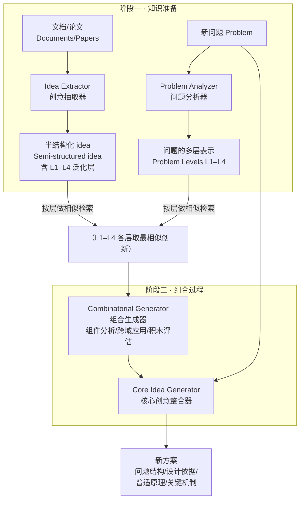

# 组会汇报 · LLMs can Realize Combinatorial Creativity

> 主讲提示：这篇是 C 组「创意/假设生成」里**最偏理论框架、最不偏实证**的一篇。它的价值不在数字（数字很弱、设计有硬伤），而在它**把创造力理论 (Boden 四象限 / 四 P / novelty×value) 显式搬到 LLM ideation 上**这件事本身。读它要带两副眼镜：一副欣赏「理论落地」的姿态，一副盯住「它用『跟真实论文像』来证明『有创造力』」这个根本性的循环漏洞。

---

## 1. 封面 · TL;DR

- **作者/出处**：Tianyang Gu (Boston U)、Jingjin Wang (UIUC)、Zhihao Zhang (U Delaware)、HaoHong Li (Acaciawood Prep)。arXiv 2412.14141，标注「A Preprint」，**未注明发表于任何同行评审场所**（截至 v2 2025-02-17）。
- **一段话**：作者主张当前用 LLM 生成研究创意的工作「缺乏创造力理论的根基」，于是显式采用 Boden 的**组合式创造**理论（新意来自把已有概念以意外方式重新组合），搭一个两阶段 agent：(1) **知识准备**——把论文抽成「半结构化 idea」并按 **L1–L4 四个泛化层 (generalization levels)** 存储，再对新问题做跨抽象层的语义检索；(2) **组合过程**——先并行地把检索到的创新拆成「可重组的零件」（组件分析 / 跨域应用 / 积木评估三视角），再整合成连贯的新方案。在 **OAG-Bench** 上选 **87 篇**论文，把它们的重要参考文献当知识库、用框架生成方案，再和论文**真实**的创新做**字段级语义相似度**比较，宣称在多个指标上稳定超过 baseline、相似度提升 **7%–10%**（见摘要与原文 §4.1.3）。
- **三条带走的结论**：
  1. **姿态新、落地浅**：把「创造力 = novelty × value」「组合 / 探索 / 转化三类创造」「四 P」这些理论显式接到 LLM ideation 上，是它最大的贡献；但**全文几乎没有自己的公式**，方法多为 prompt 工程的散文描述（见 §11 批判）。
  2. **核心机制是「多抽象层检索 + 结构化拆解—重组」**：L1–L4 让「问题」与「跨域解法」在不同抽象层上对齐，是它区别于 RAG / 学术图谱的关键设计。
  3. **评测范式自相矛盾**：它一边说「novelty = 跟已有工作不像」「真创造要有 value」，一边用「**和真实后续论文越像越好**」当主指标——这等于**用 value 的代理把 novelty 指标反转了**（详见 §13、§16）。这正是本课「novelty≠value、自评 vs 独立验证」批判线的又一鲜活样本。

> 主讲提示：开场就把「理论姿态值得肯定」与「自证逻辑有洞」两面一起抛出，定下批判基调。下面 §2–§3 讲它为什么这么想，§5–§10 讲它怎么做，§11 起集中开火。

---

## 2. 问题与动机（why —— 核心两页）

**LLM ideation 的现状缺口是什么？** 作者在 §1 / §2.2 给出的判断：近一两年用 LLM 生成研究创意的工作（原文点名 Si et al. 2024、Kumar et al. 2024、Wang et al. 2023 SciMON）虽有希望，但**缺乏对「计算创造力 (computational creativity)」既有理论的根基**。后果有二：

- **只关心 novelty、不管 value**：很多系统只问「生成的 idea 新不新」，但作者引 Boden 的论点——**「novelty 若无 value 则毫无意义」(novelty is meaningless if it is valueless)**（§1）。一个没人能用、不可行的「新点子」不是创造，是噪声。
- **新颖度被简化成表层语义相似度**：当用自动指标时，往往把 novelty 退化成「与已有文献的语义相似度」这种表层度量，**抓不到 Boden 说的「有意义的新颖」或 Bartel 说的「原创即影响 (originality as influence)」**（§2.1.3）。

**为什么「现在」要把理论请回来？** 因为 LLM 恰好擅长 Boden 框架里**组合式创造**所需的能力：在巨大知识空间里**识别并重组模式 (identify and recombine patterns across vast knowledge spaces)**（§2.1.2）。也就是说，理论里「组合式创造」这一支，和 LLM 的看家本领**天然对口**——这是作者押注的根本动机。

**不这么做会怎样（反事实）？** 如果继续「只追新、用表层相似度、无理论约束」：
- 评测无法区分「真有用的新」与「只是没见过的怪」；
- 系统设计没有原则，沦为「信息处理任务 (information-processing task)」而非「创造过程 (creative process)」（§2.2 结尾原话）；
- 无法回答「机器到底有没有创造力」这种**理论问题**，只能堆工程 trick。

> 主讲提示：这一节是 why 的核心。把三件事讲透——①现状只追 novelty 忽略 value；②novelty 被矮化成表层相似度；③LLM 的「重组模式」能力正好对上 Boden 的组合式创造。后面 how 就顺了。**但要预埋一句**：作者批评别人「用表层相似度度量 novelty」，自己最后却用「与真论文的相似度」当主指标——这个反讽到 §13 引爆。

---

## 3. 研究问题 / 核心 intention（形式化成一句话）

把要解决的问题压成一句：

> **能否用一个「理论驱动 (theory-grounded)」的 LLM agent，显式实现 Boden 的组合式创造——即先在多个抽象层上检索跨域的已有概念，再系统地拆解并重组它们——从而生成既新颖又有价值、且与真实科研发展相吻合的研究创意？**

它隐含的**假设**（作者未逐条列，下面是从 §1/§2/§4.1 提炼并标注来源）：
- (H1) **创造力 = novelty × value 双判据**：一个产物当且仅当同时「新」且「在其领域内有价值」才算创造（§2.1.3，引 Boden 2004 / Gaut 2010）。
- (H2) **组合式创造可被 LLM 实现**：把familiar concepts 以新方式连接这一机制，特别适合 LLM（§2.1.2）。
- (H3) **「发表在好会的真实论文」可当 novelty+value 的双重 ground truth**：因为它们通过同行评审，说明既对领域有贡献（novelty）又被专家认为可靠有用（value）——所以「生成方案与真实论文相似」可隐式衡量「是否同时满足两判据」（§4.1 原话）。**⚠ H3 是全文逻辑最脆弱处，§13/§16 详批。**

> 主讲提示：H3 是这篇的命门——它把「像真论文」直接等价于「有创造力」。组会上可以先把 H1/H2/H3 摆出来，让大家先觉得「挺合理」，再在 §13 拆 H3。

---

## 4. 相关工作定位（站在谁肩上、和谁不同）

作者用 **Rhodes 的「四 P (Four P's)」** 框架（Person / Process / Product / Press，§2.1）来组织整个创造力理论版图，再把自己嵌进「Process 里的 combinatorial」一支。

| 视角 / 方向 | 代表（原文引用） | 讲什么 | 与本篇关系 |
|---|---|---|---|
| 四 P 框架 | Rhodes 1961；Jordanous 2016 | 创造的人/过程/产物/环境四视角 | **本篇的总坐标系** |
| Boden 三类创造 | Boden 2004；Wiggins 2006 | combinatorial / exploratory / transformational | **本篇只做 combinatorial 这一支** |
| Product 判据 | Boden 2004；Gaut 2010；Bartel 1985 | novelty × value；原创=影响 | **本篇的评测哲学来源** |
| P/H-创造、四 C | Kaufman & Beghetto 2009 | P-creativity（对创作者新）vs H-creativity（对人类史新）；Big/Pro/Little/Mini-C | 作者承认自己评的更像「与既有研究对齐」，未区分 P/H（§5 未来工作） |
| Process 迭代模型 | Geneplore (Ward 1999)；ER (Sharples 2013)；Wallas 四阶段 | 生成—评估交替、阶段化 | 别的 LLM 系统多走这条迭代评审环；**本篇走「结构化抽取+引导重组」的直接路线**（§2.1.2 结尾自述差异） |
| LLM 提假设（窄） | Yang 2024a；Qi 2023（zero-shot hypothesis） | 概念间二元关系、探索式创造 | 操作在「高度受限边界」，没释放 LLM 的转化潜力 |
| LLM 组合式（近） | **ResearchAgent (Baek 2024)**；Wang 2023 (SciMON) | 实体中心知识库 + 学术图谱做组合 | **最近的同类**；本篇说自己比它们更显式接 Boden 理论 |
| LLM 端到端 | **AI-Scientist (Lu 2024)** | 从文献到 idea 到验证全流程 | 对齐 Wallas 阶段化；本篇只聚焦 ideation 一环 |
| 人/机 idea 对比 | **Si et al. 2024** | LLM 在 novelty 能比肩人类专家，但在 value（实用/可行）上吃力 | **本篇评测哲学的直接动因**：要把 value 也评进来 |

**一句话定位**：别人要么「只追 novelty / 用表层相似度」，要么「走迭代生成-评审环」；本篇主张**显式照搬创造力理论**，走「多抽象层检索 + 结构化拆解-重组」的路，并试图把 value 也纳入评测。

> 主讲提示：强调它和 ResearchAgent(2404.07738，本库已有报告)、AI-Scientist v1(2408.06292，标杆) 的家族关系——三者都在做「LLM 组合已有文献产生 idea」，差别在**理论自觉程度**和**是否闭环到实验**。本篇理论自觉最高、闭环最浅。

---

## 5. 方法总览（big picture，先直觉后机制）

整体两大阶段，对应原文 Figure 1：**知识准备 (Knowledge preparation)** + **组合过程 (Combinatorial process)**。



**直觉三句话**：
1. **知识准备**像「把每篇论文读成一张可跨域调用的卡片」——卡片不只记「它做了什么」（具体实现，L1），还记「它背后的普适原理」（L4），这样别的领域才能借用。
2. **泛化层检索**像「在不同放大倍数下找相似解」——同一个新问题，在「具体实现」层可能找不到类比，但在「普适原理」层就能匹配到一个完全不同领域的解法。这是**跨域发现**的关键。
3. **组合过程**像「先把零件拆出来摆一桌（并行、按层），再挑着拼成一个能用的整体」——拆解保证多样性，整合保证连贯与可行。

> 主讲提示：把「为什么要分 L1–L4 四层」讲成全篇的灵魂——**只在表层（实现层）匹配 = 传统 RAG，只能找到同领域近邻；上升到原理层匹配，才可能把 A 领域的解搬到 B 领域**，这正是「组合式创造 = 跨域重组」的工程化身。

---

## 6. 符号与术语表（后文统一用）

> ⚠ **重要说明（忠于原文）**：本论文是一篇**偏散文、几乎无形式化数学**的 preprint。正文（§3 方法、§4 实验）**没有给出框架本身的任何公式**；唯一出现的数学符号是**附录 Table 2 案例里、属于「真实论文(Target)」的算法式**（如 AdamW 解耦更新、ComplEx 三元组打分），那些**不是本框架的方法**。因此下表中「记号」一栏多为**本报告为讲解清晰而引入的占位符号，并已标注「（原文未给符号）」**；凡原文确有的术语，标注其出处。

| 记号 / 术语 | 含义 | 出处 |
|---|---|---|
| combinatorial creativity（组合式创造） | 把已有/熟悉概念以新方式连接而生成新意 | §2.1.2，Boden 2004 |
| exploratory / transformational（探索式 / 转化式创造） | 在既定概念空间内探索新可能 / 改变空间规则到达新区域 | §2.1.2，Boden 2004；本篇**不实现**这两支 |
| novelty × value | 创造产物的两条判据：新 且 有价值 | §2.1.3，Boden 2004 / Gaut 2010 |
| P-creativity / H-creativity | 对创作者新 / 对人类历史新 | §2.1.3，Kaufman & Beghetto 2009；本篇评测**未区分** |
| 半结构化 idea (semi-structured idea) | 把一篇创新抽成统一 JSON 字段（见下） | §3.1，Figure 2 |
| L1–L4 泛化层 (generalization levels) | 从「领域专属实现」到「普适原理」的抽象梯度 | §3.1，Figure 2 |
| ideation format 字段 | innovation name / original problem / problem structure / key mechanism / novel insight / generalization levels(L1–L4) / universal principle / domain agnostic reframing / key tradeoffs / design rationale | §3.1，Figure 2 文本 |
| $q$（原文未给符号） | 一个新「问题 (problem)」 | §3.1 |
| $\mathcal{S}=\{s_1,\dots,s_M\}$（原文未给符号） | 知识库中已存的 $M$ 条创新 (stored innovations) | §3.1 |
| $\ell\in\{1,2,3,4\}$（原文未给符号） | 泛化层索引 | §3.1 |
| $e_\ell(\cdot)$（原文未给符号） | 在第 $\ell$ 层把问题/创意映成向量的嵌入函数（用 OpenAI `text-embedding-3-large`） | §3.1 |
| $\operatorname{cos}(\cdot,\cdot)$ | 余弦相似度 | §3.1（原文说「compute cosine similarities … select … based on ranking scores」） |
| 三视角拆解 | 组件分析 (Component Analysis) / 跨域应用 (Cross-domain Application) / 积木评估 (Building Block Assessment) | §3.2 第一阶段 |
| 四要素方案 | 问题结构 / 设计依据 / 普适原理 / 关键机制（problem structure / design rationale / universal principle / key mechanism） | §3.2 第二阶段、§4.1.2 |
| PS-Sim / DR-Sim / UP-Sim / KM-Sim | 四个字段各自的语义相似度指标 | §4.1.2 |

> 主讲提示：直接挑明「这篇没有自己的公式」是**忠于原文的关键动作**，也是组会上一个有分量的批判点——一个号称「形式化创造力理论」的工作，方法部分却没有任何形式化。下面 §7–§10 我会**把它的散文流程尽量写成可操作步骤 + 为讲解补的占位式**，并逐处标注哪些是原文、哪些是本报告的重构。

---

## 7. 方法细节 ① 知识准备：把论文抽成「可跨域调用的卡片」（§3.1）

**why（为什么不用现成 RAG / 学术图谱？）**：作者在 §3.1 开头点名——传统 RAG 与学术图谱数据库**只看表层相似或直接关键词匹配 (surface-level similarity or direct keyword matches)**，因此**很难跨领域连接知识**。可组合式创造的精髓恰恰是**跨域**：把 A 领域的原理搬到 B 领域。所以必须有一种「能在抽象层面对齐」的表示与检索。**不这么做会怎样**：检索只会返回同领域近邻，组合出来的还是「换皮的旧点子」，谈不上 combinatorial。

**how（两步）**：

**(1) 抽取为半结构化「ideation format」**（§3.1，Figure 2 左）。用一个 **Idea Extractor** 把每篇论文/创新抽成统一 JSON，存「具体细节 + 抽象原理」两头，关键字段见 §6 表。其中最重要的是**并行的 L1–L4 泛化层**：

| 层 | 含义（原文 Figure 2 示例：以 mobDRF「基于模型的深度规则森林」为例） |
|---|---|
| **L1** 最具体 | 领域专属实现，如「学习可解释的基于规则的表示…」 |
| **L2** | 「开发透明的、可解释的机器学习模型…」 |
| **L3** | 「创建分层、可解释的算法…」 |
| **L4** 最抽象 | 「设计能自动抽取有意义（结构）的系统…」 + 一条 `universal_principle`（普适原理） |

> 直觉：L1→L4 是一道**抽象梯度**，把同一个创新从「它在本领域怎么做」一路抽象到「它本质上在解决什么普适问题」。存了这道梯度，检索时就能在「任意放大倍数」上找类比。

**(2) 对新问题做「问题分析 + 多层映射」**（§3.1，Figure 1 中的 Problem Analyzer → Problem Levels）。给定新问题 $q$，先用结构化 prompt 从**多视角**分析它、抽出其「问题结构 (problem structures)」，再把每个问题结构**同样映射到 L1–L4 四层**，与库中创新的存储格式对齐。

**检索（本报告据 §3.1 散文重构为可操作式）**：

> 直觉：我们想为「问题在第 $\ell$ 层的表示」找到「在同一层最像的一条已有创新」，因为同一抽象层上的相似才是「可类比、可借用」的相似。

记号（§6 已定义，原文未给符号）：$q$ 为新问题、$\mathcal{S}=\{s_1,\dots,s_M\}$ 为库中创新、$\ell$ 为层、$e_\ell(\cdot)$ 为第 $\ell$ 层嵌入（OpenAI `text-embedding-3-large`）、$\operatorname{cos}$ 为余弦相似度。对每个问题结构、在每层取**最相似**的一条：

$$ s^\star_\ell \;=\; \arg\max_{s\in\mathcal{S}} \ \operatorname{cos}\big(e_\ell(q),\, e_\ell(s)\big),\qquad \ell\in\{1,2,3,4\}. $$

**读出什么**：每个抽象层各召回一个「最佳类比解」，于是同一个问题能拿到**四个不同抽象层、可能来自四个不同领域**的参考创新——这正是「跨域非显然连接 (non-obvious connections from disparate domains)」的来源（§3.1 原话）。
> ⚠ 注意：原文只说「compute cosine similarities with all stored innovations and select the most similar innovation based on ranking scores」，**未给上式、未说每层取 Top-1 还是 Top-k、未给阈值**。上式是本报告为讲清楚而写的 Top-1 形式；**精确的 k / 阈值原文未给出**。

> 主讲提示：把「按层取最相似」讲成本篇的**唯一硬核机制**。再强调它依赖 `text-embedding-3-large` 把「抽象原理」也编码进向量——这一步好不好，几乎决定全系统成败，但论文没做这步的消融（§15）。

---

## 8. 方法细节 ② 组合过程·第一阶段：把创新拆成零件（§3.2）

**why（为什么先拆解、再组合？）**：组合式创造要「重组零件」，但**整篇论文不是一个可重组的单元**——你没法把「整篇 ResNet」塞进一个新问题。必须先把它**分解成机制层面的零件**（残差连接、瓶颈层…），形成一个「**丰富的元件池 (rich pool of elements)**」，才能在新语境里挑着拼。**不这么做会怎样**：只能做「整篇方案的浅层拼贴」，无法产生「把 A 的某个机制嫁接到 B」这种真正的组合新意。

**how**：在 §3.1 取回的「每个泛化层的相关创新」上，**并行**处理（parallel processing across different generalization levels，目的：最大化新组合的潜力）。一个专长「组合式创造」的 agent 从**三个视角**审视每条创新（§3.2 原文）：

| 视角 | 原文名 | 在问什么 | 直觉 |
|---|---|---|---|
| ① 组件分析 | Component Analysis | 把创新拆成可重组的**基本机制与原理** | 「这台机器能拆出哪些零件？」 |
| ② 跨域应用 | Cross-domain Application | 这些组件如何**改造/再诠释**到新语境 | 「这个零件搬到别的车上要怎么改？」 |
| ③ 积木评估 | Building Block Assessment | 评估组件能否**当新方案的地基** | 「这个零件结不结实、能不能承重？」 |

**产物**：一个「可在新方式下重组的丰富元件池」（§3.2 原文 "creates a rich pool of elements that can be recombined in novel ways"）。

> 主讲提示：三视角对应「拆开 → 适配 → 选材」。强调**并行 + 跨层**是为了**多样性**（diverse pool from different abstraction levels）——这是「广度」。下一节的整合是「深度」。

---

## 9. 方法细节 ③ 组合过程·第二阶段：整合成连贯方案（§3.2）

**why（为什么要单独一个整合 agent？）**：拆出来的零件是散的、可能互相冲突。直接堆在一起 = 不连贯、不可行。要有一个**整合 agent (integration agent)** 通盘权衡**可行性 (feasibility) 与创新性 (innovativeness)**，并考虑不同创新间的关系，才能产出**coherent and practical** 的方案（§3.2 第二阶段原话）。**不这么做会怎样**：得到一堆「听起来很炫但拼不到一起、跑不起来」的点子——正好踩中 Si et al. 2024 说的「LLM 在 value/feasibility 上吃力」的坑。

**how**：整合 agent 复盘第一阶段所有分析，聚焦「可行性 + 创新性 + 创新间关系 + 对原问题的贡献」，合成出一个由**四要素**刻画的方案（§3.2 / §4.1.2）：

| 要素 | 原文名 | 它回答 |
|---|---|---|
| 问题结构 | problem structure | 这个方案**如何概念化**该问题 |
| 设计依据 | design rationale | 关键实现决策**为什么这么定**（解释 novelty） |
| 普适原理 | universal principle | 可跨域适用的**核心思想** |
| 关键机制 | key mechanism | **技术实现细节** |

**为什么是这四个字段而不是别的**：它们正好对应「**为什么新（design rationale / universal principle）× 怎么落地（problem structure / key mechanism）**」——即把 novelty 与 value/feasibility 两判据**拆进可分别评测的槽位**。这也直接决定了 §13 的四个相似度指标 PS/DR/UP/KM-Sim。

**两阶段为何能「实现组合式创造」（作者自评，§3.2 末）**：第一阶段并行 + 跨层 → 保证**元件多样**（广度）；结构化拆解 → 找**非显然连接**；整合 → 保证**连贯可行**（深度）。广度 × 深度，支撑「跨多领域桥接的系统化创新」。

> 主讲提示：把「四要素 = 把 novelty 和 value 拆成可评测槽位」点出来——这是论文设计里最聪明的一步，也为下一节的指标埋好接口。但要提醒：**整个两阶段全靠 prompt 串起来，没有搜索、没有评分函数、没有迭代评审环**——这是它和 AI-Scientist v1 / ResearchAgent「生成-评审迭代」路线的根本差异，也是它「轻」的地方。

---

## 10. 算法伪代码（本报告据 §3 流程重构，便于主讲）

> ⚠ 原文**未给伪代码**；下面是本报告依 §3.1–§3.2 的散文**重构**，用于讲解，非原文 Algorithm。

```text
输入：新问题 q；创新知识库 S（每条已抽成 ideation JSON，含 L1–L4）
超参：嵌入模型 = text-embedding-3-large；LLM 后端 = Claude-3.5-Sonnet-20241022
      （每层召回数 k、阈值：原文未给出）

# 阶段一：知识准备（库侧通常离线完成）
for each paper/innovation in corpus:
    json ← IdeaExtractor(paper)          # 抽成 ideation format，含 L1–L4、universal_principle
    S.add(json)

# 问题侧分析
problem_structures ← ProblemAnalyzer(q)  # 多视角抽问题结构
for each ps in problem_structures:
    map ps to L1–L4 表示

# 跨层检索
retrieved ← {}
for ℓ in {1,2,3,4}:
    for each ps:
        s*_ℓ ← argmax_{s in S} cos(e_ℓ(ps), e_ℓ(s))   # 同层最相似（k/阈值原文未给）
        retrieved[ℓ].add(s*_ℓ)

# 阶段二：组合过程
# (a) 并行拆解：组件分析 / 跨域应用 / 积木评估
pool ← {}
for ℓ in {1,2,3,4}:                       # 跨层并行
    for s in retrieved[ℓ]:
        pool += CombinatorialGenerator(s, views={Component, CrossDomain, BuildingBlock})

# (b) 整合
solution ← CoreIdeaGenerator(pool, q, focus={feasibility, innovativeness, relations})
return solution  # 字段：problem structure / design rationale / universal principle / key mechanism
```

> 主讲提示：照着这段念，组会上就能把「检索→拆解→整合」三步讲完。务必同时念出**括号里的「原文未给出」**——这是诚实，也是批判抓手。

---

## 11. why > how 总结：这套设计在赌什么、薄在哪

| 设计选择 | 为什么这么设计（intention） | 不这么会怎样 | 风险/薄弱处 |
|---|---|---|---|
| 显式照搬 Boden 组合式创造 | 给 ideation 一个理论根基、可谈「机器有无创造力」 | 沦为无原则的 prompt trick | 只实现三支中的 1 支（组合），exploratory/transformational 留作 future work（§5） |
| L1–L4 泛化层 + 同层检索 | 实现**跨域**类比（表层 RAG 做不到） | 只召回同领域近邻 | 完全依赖 embedding 把「抽象原理」编码好；**无消融**证明分层确实优于单层（§15） |
| 拆解三视角 + 整合四要素 | 把 novelty 与 value 拆进可评测槽位；保广度又保连贯 | 拼贴不连贯 / 不可行 | 整条链**无搜索、无评分、无迭代**，全靠 prompt；可复现性低 |
| 用「与真实论文相似」评测 | 真实论文 = 同行评审过 → 隐含 novelty+value 双达标 | 缺可复现的 value 评测 | **逻辑反转**：把 novelty 指标变成了「越像越好」，自相矛盾（§13/§16） |

> 主讲提示：这张表就是「why > how」的浓缩版。可作为整场汇报的「论点骨架」，§13 起用数据和批判把右两列坐实。

---

## 12. 实验设置（setting / params / 算力 / 成本，尽量写全，§4.1）

> 主讲提示：这一节按风格规范「写全」。但要先声明——**这篇的 setting 报告很不完整**，多处「原文未给出」，本身就是它的弱点。

- **数据集**：**OAG-Bench**（Zhang et al. 2024，OAG-Bench: a human-curated benchmark for academic graph mining，KDD'24）。论文含其重要参考文献，便于「拿参考文献当知识库、和正文真实创新比对」。
- **样本规模**：从 OAG-Bench 选 **87 篇论文**；每篇基于引用网络中的**引用影响力与内容相关性**挑出 **3–5 篇重要参考文献**（§4.1.1）。
- **任务构造**：对每篇目标论文——用 idea extractor 抽出其**核心问题陈述 (problem statement)** 当框架输入；把它的 3–5 篇重要参考文献**结构化进 ideation format** 当知识库；让框架生成方案；再与该论文**真实**的创新做字段级比对（§4.1.1）。
- **LLM 后端**：**Claude-3.5-Sonnet-20241022**，用于所有 idea 生成与分析任务（§4.1.1）。
- **嵌入模型（两处不同，注意区分）**：
  - **检索阶段**：OpenAI **`text-embedding-3-large`**（§3.1）。
  - **评测阶段**：**allenai-specter (Cohan et al. 2020, SPECTER)** 生成嵌入、算字段余弦相似度（§4.1.2）。
- **Baseline**：一个**直接生成**系统——给定问题陈述**直接产出 idea**，**不走多层检索、不走组合过程**；输出同样是含「问题结构/设计依据/普适原理/关键机制」四字段的 JSON（§4.1.2）。即「**消融掉本框架全部机制**」的对照。
- **指标（定义见 §13）**：PS-Sim / DR-Sim / UP-Sim / KM-Sim 四个字段级相似度。
- **算力 / 成本 / 运行时间**：**原文未给出**（无 token 数、无花费、无时长）。
- **随机性控制**：**原文未给出**（无随机种子、无重复次数、无置信区间/显著性检验）。
- **统计检验**：**原文未给出**（结论"提升 7%–10%"无 t 检验、无 CI——风格规范点名「创意/理论类要给统计检验」，本篇缺）。

| 维度 | 取值 | 出处 |
|---|---|---|
| 数据集 / 规模 | OAG-Bench，**87 篇**，每篇 3–5 篇重要参考文献 | §4.1.1 |
| 生成后端 | Claude-3.5-Sonnet-20241022 | §4.1.1 |
| 检索嵌入 | OpenAI text-embedding-3-large | §3.1 |
| 评测嵌入 | allenai-specter (SPECTER) | §4.1.2 |
| Baseline | 直接生成（无检索、无组合） | §4.1.2 |
| 算力/成本/时长/种子/显著性 | **原文未给出** | — |

> 主讲提示：把「缺成本、缺种子、缺显著性、N=87、单一后端、无 human eval」一次性列清。这是一篇**实证强度很低**的工作——结论要相应打折。

---

## 13. 主要结果（数字 + 解读，§4.1.3 / Figure 3）

**指标定义（§4.1.2，本报告补形式化）**：

> 直觉：我们想知道「框架生成的某字段」和「真实论文对应章节」内容上有多接近。用 SPECTER 把两段文字各编码成向量，取余弦。

记号：$g_f$ = 生成方案的字段 $f$ 文本，$t_f$ = 目标论文对应章节文本，$\phi(\cdot)$ = SPECTER 嵌入，$f\in\{\text{PS, DR, UP, KM}\}$。

$$ \text{$f$-Sim}\;=\;\operatorname{cos}\big(\phi(g_f),\,\phi(t_f)\big),\qquad f\in\{\text{PS, DR, UP, KM}\}. $$

读出什么：四个字段（问题结构 PS / 设计依据 DR / 普适原理 UP / 关键机制 KM）各算一个「和真实论文的像不像」。**值越高 = 越像真实后续研究**。

**关键数字（原文 §4.1.3 正文给出三组均值；Figure 3 柱状图）**：

| 字段相似度 | 本框架 (Ours) | Baseline | 解读 |
|---|---|---|---|
| DR-Sim（设计依据） | **0.85** | 0.78 | +0.07；本框架在「为什么这么设计」上更贴近真实论文，且更稳定（多在 0.8 以上） |
| UP-Sim（普适原理） | **0.83** | 0.75 | +0.08；本框架多稳在 0.8 上，baseline 波动大 |
| KM-Sim（关键机制） | **0.87** | 0.77 | **+0.10，提升最大**；原文称 KM 是改进最显著的指标（本框架 0.85–0.95 vs baseline 常掉到 0.7–0.8） |

- **PS-Sim（问题结构）**：原文图例与 §4.1.2 列出该指标，但**§4.1.3 正文未单独给 PS 的两个均值**（只在散点/线图里出现）。本报告**不臆测其数值**——**PS-Sim 具体均值原文正文未给出**。
- 摘要里的「**7%–10% 提升**」即对应上面三档（DR +7、UP +8、KM +10 个百分点）。原文 §4.1.3 还描述：散点图（Figure 3 左）多数点落在 y=x 上方 → **系统性优于** baseline；线图（Figure 3 中右）显示本框架**方差更小、上限更高**（DR 稳在 0.8+，KM 摸到 0.85–0.95）。

**它意味着什么（作者解读，§4.1.3 结尾）**：作者据此「**强烈暗示 LLM 有能力做有效的组合式创造**，成功组合并改造已有 idea 生成与真实科研发展吻合的新方案」。

> 主讲提示：务必当场点破两件事——
> 1. **指标量级看着高但要小心**：SPECTER 是**领域内**论文嵌入，两段都讲同一篇论文的参考文献圈，余弦 0.7–0.9 可能只是「同主题文本天然就相似」，**0.78 的 baseline 已经很高** → 7–10 个点的提升，**绝对值是否显著、无 CI 无法判断**（§15）。
> 2. **方向悖论**：越「像真实论文」分越高——可这恰恰奖励「**不新**」。一个真正 H-creative（对人类史都新）的 idea，按定义就**不该**和任何已发表论文高度相似。**这套指标天然惩罚真新颖、奖励复现**（§16 详述）。

---

## 14. 定性结果：三案例「惊人对齐」（§4.2 / Table 1 / 附录 Table 2）

作者在 §4.2 选三个代表案例，把「生成方案 (Test)」与「真实论文 (Target)」对照（Table 1 摘要、附录 Table 2 全文逐字段对照，覆盖全部 87 例）：

| 案例 | 主题 | 真实论文（可辨识） | 对齐点（原文 Table 1 措辞） |
|---|---|---|---|
| Case 1 | Adaptive Optimization（自适应优化） | **AdamW / 解耦权重衰减** | 两者都识别出「把正则化与自适应更新**解耦**」这一核心；两步更新近乎一致；数学仅记号差异 |
| Case 2 | Text Matching Architecture | **HCAN（混合多粒度匹配）** | 两者独立得到**三流并行**结构（层级编码 / 相关性匹配 / 语义匹配），组件功能几乎相同 |
| Case 3 | Cold-start Recommendation | **POLAR++（贝叶斯主动学习）** | 两者都把冷启动framing成**贝叶斯主动学习 + 不确定性建模**；真实方案多了一个密度加权因子 |

附录 Table 2 还能辨认出更多目标论文：Case 4/6/8/11/15 等分别对应 **Transformer 类前馈阅读理解架构、MobileNetV2 倒残差瓶颈块（$F(x)=ANB(x)$）、多源去偏的两阶段框架、ComplEx 三元组打分 $\phi(r,s,o)=\mathrm{Re}(\langle w_r,e_s,\bar e_o\rangle)$ 的 PSL-KGI 协同、GCN+Attention+GRU 的多尺度异常检测**等。

**作者的诚实之处（§4.2 末）**：他们承认观察到的差异「**主要在补充细节而非核心概念**」，例如 Case 1 记号不同但机制同、Case 3 真实方案多了密度加权（被说成「同一思路的优化而非概念差异」）。

> 主讲提示：这些案例**确实很惊人**——独立生成竟逼近 AdamW / 倒残差块。但要把「惊人」翻译成两种相反解读：
> (a) **乐观**：LLM 真能重组出有价值的架构思想；
> (b) **怀疑**：这些是 **2017–2020 年的著名工作**，几乎必然在 Claude-3.5 的**预训练语料**里。框架把目标论文的「重要参考文献」喂进去当知识库，**等于给了一道「填空题」**——从 ResNet/Transformer 的参考文献「组合」回 MobileNetV2，对一个见过 MobileNetV2 的模型而言，可能是**回忆**而非**创造**。论文**未做任何「目标论文是否在训练集」的污染分析**，这是定性结论最大的隐患（§16）。

---

## 15. 消融与分析（诚实地说：基本没有）

风格规范要求「哪个部件贡献多少、敏感性」。本篇**几乎没有受控消融**：

- **唯一的对照** = 整框架 vs 「直接生成」baseline（§4.1.2）——这只能说明「**有这套机制比没有强**」，**无法区分**是 **L1–L4 分层**的功劳、还是**三视角拆解**的功劳、还是**整合四要素 prompt**的功劳。
- **无分层数 (L 数) 消融**：没有「只用 L1 单层 vs 用 L1–L4」的对比，所以「分层检索」这一核心主张**未被实证支撑**。
- **无检索 Top-k / 阈值敏感性**、**无后端模型替换**（只跑 Claude-3.5-Sonnet）、**无嵌入模型替换**、**无随机重复 / 方差量化的统计检验**。
- **无人类评测 (human evaluation)**：全靠 SPECTER 自动相似度。考虑到 Si et al. 2024 那篇用了 100+ 研究者做大规模人评，本篇在「创意质量」上**完全没有人来判**，与它自己「value 很重要」的主张张力明显。

> 主讲提示：把「消融缺失」讲成**方法学硬伤**——一篇主张「分层 + 拆解 + 整合三件套有效」的论文，却没有任何拆件实验证明每件各值多少。这直接削弱「机制有效」的可信度。

---

## 16. 局限与批判（诚实，本课灵魂）

**A. 原文自己承认的（§5 Conclusion / Future work）**：
1. **只实现三类创造中的「组合」一支**；exploratory（搜索概念空间）与 transformational（改变空间规则）留作未来工作。
2. **评测只对齐「既有研究发展」**，**未区分 P-creativity（对系统新）与 H-creativity（对人类史新）**，也未按 Kaufman 四 C 评不同创造层级——作者明说「未来需要能区分这些的度量」。
3. 呼吁发展能评 **novelty、value、影响力、领域影响**的更全面 benchmark（等于承认现有评测不够）。
4. 框架可扩展到更多知识源、更转化式的创造——**即承认当前版本受限**。

**B. 本报告 / 社区视角的批判（标注为「批判」，非原文宣称）**：

- **【最致命】评测逻辑反转**：作者批评他人「用表层相似度度量 novelty」，自己的主指标却是「**与真实论文的 SPECTER 相似度越高越好**」。但 novelty 按 Boden/Bartel 定义是「**与已有不同**」——**越像已发表论文，按定义越不新**。所以这套指标**度量的其实是「复现/对齐已知结果」的能力，不是 novelty**。它**没有任何独立的 novelty 度量**，与开篇「novelty 不能被表层相似度矮化」的批评**自相矛盾**。
- **【数据污染未排查】**：87 篇目标论文多为成名工作（AdamW、MobileNetV2、Transformer 类、ComplEx…），极可能在 Claude-3.5 预训练语料内；又把其「重要参考文献」直接当知识库喂入。**「从参考文献组合回目标论文」可能是记忆/填空而非创造**。论文**零污染分析**。
- **【形式化名不副实】**：标题/摘要谈「形式化实现创造力理论」，但**方法部分无任何公式、无伪代码、无搜索/评分目标函数**，全是 prompt 散文。「框架」更像一套**结构化 prompt 流水线**。
- **【实证强度低】**：N=87、单后端、无成本、无种子、无置信区间/显著性、无 human eval、唯一对照。结论「LLM 能做组合式创造」**远超证据所能支撑**。
- **【value 仍未真正评到】**：四要素里 DR/UP 想 proxy value，但用的还是「与真论文相似」——**没有可行性实测、没有专家判用处**，恰恰落回 Si et al. 2024 指出的「value 难评」原坑。
- **【作者署名背景】**：一作时为 Boston U 学生，含一名 prep-academy（高中）作者，无大型实验室署名，未见同行评审场所——**不影响想法价值，但提示工程/实证资源有限**，与上面「实证薄」一致。

> 主讲提示：把【评测逻辑反转】立为全场最强批判点——它不是小瑕疵，而是**把论文的核心主张（实现了 novelty×value 的创造）直接架空**：你用「像已知」证明「有新意」，逻辑上不可能成立。这一条直通本库 9.x 批判线（自评/相似度代理 vs 独立验证）。

---

## 17. 在 auto-research 版图的位置（与本库其它工作的关系）

- **阶梯定位（Tool→Analyst→Scientist）**：本篇只做 **ideation 一环**，**不闭环到实验/验证**，且评测靠「与已知论文相似」这种**自指代理**——按本库 9.1「自称 Scientist 的多靠自评，独立验证最高只到 Analyst」的判据，它处在 **Tool/早期 Analyst** 层：一个「**创意检索-组合工具**」，离「能独立判定自己 idea 真伪/价值」很远。
- **与本课「idea 锦标赛 / novelty 启发式」线（任务点名的「9.3」）的关系**——三种范式对照：

| 维度 | **本篇 2412.14141** | **Si et al. 2024 / Can LLMs Generate Novel Ideas（本库 2409.04109）** | **AI-Scientist v1 的 novelty 检查（本库 2408.06292）** |
|---|---|---|---|
| novelty 怎么判 | **无独立 novelty 度量**；用「与真论文相似」（越像越高） | **大规模盲审 human study (100+ 研究者)**，LLM idea 在 novelty 上**显著高于**人类专家 | LLM 自评 N 分 + **Semantic Scholar 查重**（太像就弃，`novel:true/false`） |
| value/feasibility 怎么判 | 想用 DR/UP 字段 proxy，但仍是相似度，**无实测** | human 同时评 feasibility/excitement——发现 LLM 在 feasibility 上**偏弱** | 自评 F 分 + 后续实验执行（但实验少、不控变量） |
| 选优机制 | **无**（单次生成，无排序/锦标赛） | 统计检验 + 多重比较校正排名 | 进化式生成 + 档案条件化（无显式锦标赛） |
| 与本篇的张力 | —— | **直接打脸**：本篇用「像真论文=好」，而 2409.04109 证明「LLM 最强的恰是 novelty（=不像已有）」——**两者对 novelty 的操作定义正好相反** | v1 至少有「查重去重」这种**反相似**的 novelty 守卫；本篇连这个都没有 |

  → 一句话：**本篇与 2409.04109 在「novelty 的操作定义」上根本对立**。2409.04109 把 novelty 定义为「与已有不同、人评更新」；本篇把「好」定义为「与已发表论文相似」。组会可把这两篇并排，作为「**novelty 到底该怎么度量**」的活教材。
- **承上启下**：
  - 同族：**ResearchAgent (2404.07738)**（实体中心知识库 + 同行评审迭代做组合）、**SciMON (Wang 2023)**——本篇自述比它们更「显式接 Boden 理论」，但**更不闭环**。
  - 批判呼应：**ideation-execution gap (2506.20803)**——好 idea 未必能执行出好结果；本篇连「执行」都没有，把 gap 整个回避了。**Hidden Pitfalls (2509.08713)** 对「自动评测靠相似度」的质疑，正好落在本篇头上。

> 主讲提示：本篇在版图里的最大用处，是当**「novelty 度量哲学」的反面教材**，与 2409.04109 正面对打。把这组对照讲清，比复述它的流程更有组会价值。

---

## 18. 复现与可用性

- **代码/数据是否开源**：**原文未提供**任何代码/数据/prompt 仓库链接（正文与参考文献中均无 GitHub）。Figure 2 给了 ideation JSON 字段名，但**完整 prompt 未公开**——**实质上不可严格复现**。
- **能不能在单卡跑**：本框架**不训练任何模型**，纯调用 **Claude-3.5-Sonnet API + OpenAI 嵌入 API + 本地 SPECTER 嵌入**。**无 GPU 需求**（除非本地跑 SPECTER），瓶颈是 **API 调用量**。原则上**单机可复现**，但缺 prompt/数据使复现成本高、结果难对齐。
- **坑**：①检索的 k/阈值、问题结构抽取 prompt 全缺 → 复现者需自行设计，结果易偏离；②评测嵌入 `allenai-specter` 与检索嵌入 `text-embedding-3-large` 不同，**别混用**；③若想验证「分层有效」，必须自己补单层 vs 多层消融（论文没做）；④务必自查「目标论文是否在后端模型训练集」，否则重蹈污染疑云。

> 主讲提示：一句话——「想法可借鉴（ideation format + 泛化层很有启发），但论文**不可即插即复现**，要当『设计灵感』而非『可运行系统』来用」。

---

## 19. 组会讨论问题（5–8 个，能引发讨论）

1. **核心悖论**：用「与真实论文的相似度」来证明「有创造力」，逻辑上站得住吗？如果要真测 novelty，应该用什么**独立于已知答案**的度量？（对照 2409.04109 的 human study）
2. **污染**：87 篇目标多是成名工作。如何设计一个能排除「LLM 只是回忆训练语料」的实验？（例：只用 2024 年后、且确认不在训练集的论文当 target？）
3. **L1–L4 真有用吗？** 在没有分层消融的情况下，你会怎么用最小代价验证「上升到原理层检索」确实带来跨域类比、而非噪声？
4. **value 到底评到了没？** 四要素里 DR/UP 想代理 value，但仍是相似度。要让「value」可独立测量，最低限度该加什么（人评？可行性实测？引用预测？）？
5. **指标方向**：既然「越像已发表论文分越高」会惩罚真正的 H-creativity，能否设计一个**同时奖励 novelty 与 value** 的复合指标？它会长什么样？
6. **和 AI-Scientist 路线之争**：本篇「检索-拆解-整合」一次成型 vs v1/ResearchAgent「生成-评审-迭代」环路。在 ideation 阶段，哪种更可能产生既新又可行的 idea？为什么？
7. **理论 vs 工程**：把 Boden/四 P 显式写进系统，除了「讲得好听」，真的改变了系统行为吗？怎么设计 A/B 实验证明「有理论 prompt」优于「无理论 prompt」？
8. **可转化性**：作者说未来要做 exploratory/transformational。用 LLM 实现「改变概念空间的规则（transformational）」，在工程上具体可能长什么样？

---

## 20. 一页速记（汇报当天速览）

- **是什么**：把研究 ideation 显式建模为 Boden「**组合式创造**」的 LLM agent——**泛化层(L1–L4)检索 + 两阶段(拆解三视角→整合四要素)组合**；在 **OAG-Bench 87 篇**上用「与真实论文的字段相似度」评测。
- **关键机制**：① 把每篇论文抽成含 **L1(具体)→L4(普适原理)** 的半结构化 ideation JSON；② 对新问题在**同一抽象层**取最相似创新 $s^\star_\ell=\arg\max_s \cos(e_\ell(q),e_\ell(s))$（k/阈值原文未给）；③ 组件分析/跨域应用/积木评估**并行拆零件**；④ 整合 agent 权衡 feasibility×innovativeness 产出 **问题结构/设计依据/普适原理/关键机制** 四要素。
- **关键数（§4.1.3）**：DR-Sim **0.85 vs 0.78**、UP-Sim **0.83 vs 0.75**、KM-Sim **0.87 vs 0.77**（提升 **7–10 个百分点**，KM 最大）；PS-Sim 正文未给均值。后端 **Claude-3.5-Sonnet**；检索嵌入 **text-embedding-3-large**、评测嵌入 **SPECTER**。**无成本/种子/显著性/human eval**。
- **三句话结论**：①**理论姿态可贵**——少数把创造力理论显式落到 LLM ideation 的工作；②**机制有亮点**——泛化层 + 拆解-整合是对「跨域组合」的合理工程化；③**自证逻辑塌**——用「像已发表论文」证明「有创造力」与「novelty=不像已有」自相矛盾，且无消融/无污染排查/无独立 value 评测，**结论远超证据**。
- **在课里的位置**：**novelty 度量哲学的反面教材**，与 **2409.04109（人评定义 novelty）** 正面对打；同族 **ResearchAgent / SciMON**，但更不闭环；被 **ideation-execution gap / Hidden Pitfalls** 的批判线正中。

> 主讲提示：结尾回到一句话——**「它做对了『请理论进场』，做错了『用像已知来证明创新』」**。本篇最值钱的，不是它的结论，而是它**逼我们正面回答**：到底什么是 novelty，又该怎么独立地量它。
