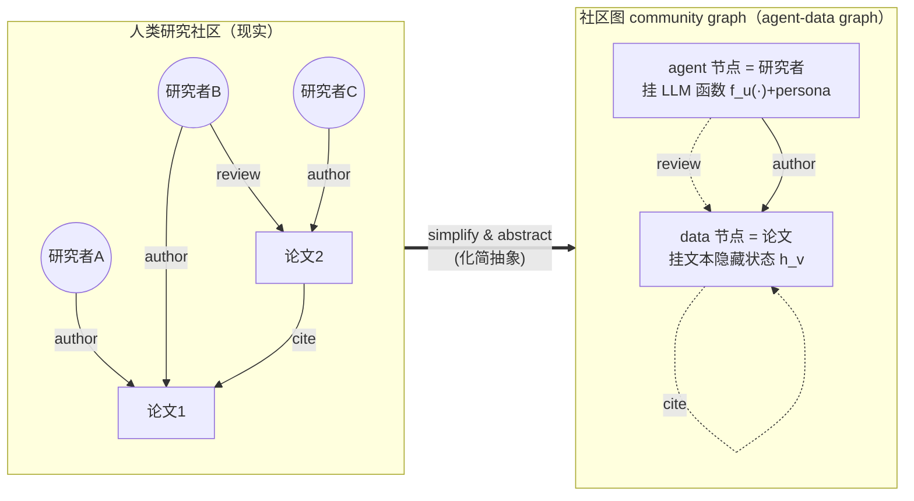
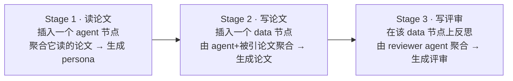

# 组会汇报 · ResearchTown：人类研究社区的模拟器

> 主讲提示：本篇属创意/假设生成组（C）。它和 AI Scientist（端到端做**一篇**论文）最大的不同是——
> 它不追求做出一篇好论文，而是想**模拟整个社区怎么运转**（一群背景各异的研究者读论文、写论文、互相评审）。
> 一句话钩子：**「别人在造科学家，它在造一座科学城。」** 全场记忆锚点：**社区=图，研究活动=消息传递，评测=补全被遮的节点。**

---

## 1. 封面 · TL;DR

- **标题 / 出处**：*ResearchTown: Simulator of Human Research Community*，Haofei Yu、Zhaochen Hong、Zirui Cheng、Kunlun Zhu、Keyang Xuan、Jinwei Yao、Tao Feng、Jiaxuan You（UIUC，ULAB-UIUC 实验室），**ICML 2025**（PMLR Vol. 267）。代码 `github.com/ulab-uiuc/research-town`，数据 `huggingface.co/datasets/ulab-ai/research-bench`。
- **权威性来源**：顶会 ICML 2025 正式接收；通讯/资深作者 Jiaxuan You（GraphSAGE / GNN 方向知名学者），把「图神经网络的消息传递」迁到「LLM 多智能体」是其专长，立论扎实。

**这篇在干什么（一段话）**：ResearchTown 把「人类研究社区」抽象成一种**异构图**——叫 *agent-data graph（agent-数据图）*：**研究者是 agent 节点**（每个节点挂一个由其论文摘要生成的 persona profile，本质是一个带 prompt 模板的 LLM 函数 $f_u(\cdot)$），**论文/评审/博客是 data 节点**（挂一段文本作隐藏状态）。在此图上，作者定义 *TextGNN*：把标准 GNN 的「消息传递」从**向量嵌入空间**搬到**文本空间**——聚合函数 $\mathrm{AGG}$ 不再是求和/平均，而是「**让 LLM 把邻居的文本读进去、综合写出一段新文本**」。于是三件核心研究活动——**读论文 (paper reading)**、**写论文 (paper writing)**、**写评审 (review writing)**——被统一建模成 TextGNN 的不同层（分别对应「插入一个 agent 节点并聚合邻居」「插入一个 data 节点」「在已有 data 节点上反思」）。为了**客观、可扩展地评测**这套模拟有多真，作者提出 *ResearchBench*：把社区图里某个真实论文/评审节点**遮蔽 (mask)** 掉，让模拟器仅凭其邻域去**重建**它，再用**文本嵌入相似度**衡量「重建的」与「真实的」有多像——相似度越高，说明模拟越贴近真实社区。

**3 条带走的结论**：
1. **真实模拟 (realistic)**：在 1000 个写论文任务上，重建论文与真实论文的平均相似度达 **0.68**（text-embedding-large-3 度量，原文 Table 1 Overall=67.51）；写评审更难，仅 **0.49** 左右（Table 2，strength≈51 / weakness≈47）。说明「写」比「评」好模拟——评审依赖更杂、更主观。
2. **鲁棒 (robust)**：加入**更多研究者 agent**、甚至加入**与论文无关的论文**，模拟质量**不降反升**（Fig.4/5：写论文相似度随 agent 数 1→2 从 49.0 升到 52.7）——这正是「社区」该有的性质：人多、信息杂，反而更接近真实生态。
3. **跨学科点子 (interdisciplinary)**：让背景差异大的 agent 同图协作，能生成**现实中罕见的跨学科研究方向**（NLP×天文、NLP×犯罪学，Fig.7），暗示「社区模拟」可作为**创意发动机**——但也会在领域差太远时产出空泛、不可用的拼盘（§11 诚实承认）。

> 主讲提示：开场把三个发现的「但是」也一并抛出——真实但写评审差、鲁棒但有上限、能跨学科但易空泛。定下「能模拟、未必能落地」的辩证基调。

---

## 2. 问题与动机（why —— 本篇最该讲透的两节之一）

### 2.1 问题层 why：为什么要「模拟整个社区」，而不只是「再做一篇论文」

**核心问题（原文 §1）**：`Can we simulate the human research community with LLMs?`（能否用 LLM 模拟人类研究社区？）作者明确这不是为了「自动写论文」，而是为了两个收益：**(1)** 模拟社区能帮我们**理解 idea 头脑风暴背后的底层机制**（科学发现是怎么从一群人的互动里涌现的）；**(2)** 它能**民主化、加速**新研究 idea 的发现（让没有大团队的人也能「召唤一个虚拟社区」帮自己想点子）。

**不解决会怎样 / 谁受影响**：现有 LLM 科研自动化几乎都盯着**单点**或**单 agent 工作流**——
- 只做 **idea 生成**（Girotra 2023、Baek 2024 ResearchAgent）；
- 只做 **代码实验**（Huang 2024 MLAgentBench）；
- 只模拟 **单 agent 的科研流程**（Lu 2024 AI Scientist：一条流水线做一篇论文）。

这些都**无法刻画「协作」**：现实科研的精髓是**背景各异的研究者聚在一起头脑风暴、互相评审**——而这恰恰是「现代人类研究」最根本的过程（原文 §1 原话：*processes that are fundamental to modern human research*）。证据/动机句：作者指出多智能体 LLM 已在社会模拟（Zhou 2023 SOTOPIA、Gao 2023 S³）、战争博弈（Hua 2023 WarAgent）等成功，**但都不适配科研社区的复杂度**（写论文、写评审这类活动太重）。

### 2.2 关键观察：研究社区天然是一张图

作者的「点睛观察」（原文 §1 *Research community as graph*）：**高度互联的研究社区天然可建模为图**。引文网络 (citation network, Newman 2001)、学术社交网络 (Tang 2008) 早被图挖掘研究透彻，用于引用预测、推荐、社区发现。**但**：以前这些图研究只做「预测/分析现有数据」；把 **LLM** 引进图结构的研究社区，可以把这些工作**从「静态预测」推进到「动态模拟与实时推演」**——不只是预测谁会引谁，而是**真的让节点（研究者）活起来、产生新论文、写新评审**。

> 主讲提示：这一节是 why 的灵魂。三句话钉死：**(1) 目标是模拟「协作社区」而非做一篇论文；(2) 现有工作全是单点/单 agent，刻画不了协作；(3) 社区本就是图——把 LLM 注入图，让静态预测升级为动态模拟。**

---

## 3. 研究问题 / 核心 intention（形式化成一句话）

把要解决的问题压成一句：

> **能否把「人类研究社区」形式化为一张「研究者=agent 节点、论文=data 节点」的异构图，让读/写/评审都成为这张图上的一次（文本空间的）消息传递，从而既能『模拟』社区运转、又能用『补全被遮节点』来『客观度量』模拟得有多真？**

它隐含的**三个假设**：
- **H1（图够用）**：研究社区的协作结构能被「agent–data 异构图 + 三类边（评审/作者/引用）」充分表达（§3）。
- **H2（文本空间消息传递可行）**：LLM 的 in-context learning + 推理能力（Wei 2023、Lee 2024）足以承担「把邻居文本聚合成新文本」这一非线性聚合算子，替代 GNN 里的数值 AGG（§4）。
- **H3（相似度=真实度的可用代理）**：「模拟节点 vs 真实节点」的**文本嵌入相似度**，能作为「模拟有多贴近真实社区」的客观、可扩展代理指标（§6、§F）——这是全文评测的命门，也是后面批判的靶心。

> 主讲提示：把一句话形式化写在白板上，再点出 H3 是「全篇成败系于此」的那条假设——后面所有数字都依赖「相似度能代表真实度」，组会的火力应集中在这里。

---

## 4. 相关工作定位（站在谁肩上、和谁不同）

| 方向 | 代表 | 与本篇的关系 |
|------|------|------------|
| 文本属性图 TAG（text-attributed graph） | Yang 2021 GraphFormers、He 2023、Zhao 2023 | 思想来源：节点带文本属性。但 TAG 把 LLM 当**理解文本的工具**，只做**节点/链接预测**；本篇把 **agent 节点**塞进图，做**文本级消息传递**，且不只重建已有节点，还**预测全新、不存在的节点** |
| 图上的多智能体建模 | Zhuge 2024 GPTSwarm、Martinkus 2023 ABGNN、Hu 2024a | 把多 agent 通信建成可学习的图。但**忽略了 data 的交互本质**（agent 要读/写/迭代更新共享数据）；本篇用 agent-data graph **同时表达 agent 和它们读写的数据** |
| LLM 提 idea（单点） | Girotra 2023、Baek 2024 ResearchAgent | 只做 ideation，不含协作/评审 |
| LLM 跑实验（单点） | Huang 2024 MLAgentBench | 只做代码实验 |
| 端到端单 agent 科研 | **Lu 2024 AI Scientist** | 一条流水线做**一篇**论文；本篇做**一群人的社区** |
| 社会/世界模拟 | Zhou 2023 SOTOPIA、Gao 2023 S³、Hua 2023 WarAgent | 证明多 agent 能模拟社会，但**不适配科研活动**（写论文/评审太复杂） |
| **本篇** | **ResearchTown** | **把 agent-data graph + TextGNN 应用到科研社区，统一读/写/评审，并提配套客观评测 ResearchBench** |

> 主讲提示：一句话概括差异——「TAG 只把图当文本理解工具、GPTSwarm 只连 agent 不连数据、AI Scientist 只做一篇论文；ResearchTown 第一个把**agent+data+协作活动**装进同一张图，并给出可量化的『像不像真社区』指标」。

---

## 5. 方法总览（big picture，先直觉后数学）

整体是「**两张图概念 + 一套消息传递 + 三阶段流水线 + 一个遮蔽评测**」。先看「人类社区如何被抽象成图」（对应原文 Figure 1）：



**直觉**：把社区里的人画成蓝圈（agent 节点）、论文画成绿框（data 节点），三种线连起来：**author（写）/ review（评）/ cite（引）**。和普通异构图的关键区别——**agent 节点不是一段死的特征，而是一个能「读 data 节点→写出新 data」的函数**（一个挂了 persona prompt 的 LLM）。

再看「研究活动如何变成图上的三步消息传递」（对应原文 Figure 2）：



**直觉**：① **读**=新来一个研究者，先把相关论文读一遍，长出「我是谁、我懂什么」的画像；② **写**=这群读过书的人，参照被引论文，合写出一篇新论文（一个新的 data 节点）；③ **评**=另一批人（reviewer）对这篇论文写评审。整套就是一个 **2 层 GNN**：读论文是第 1 层信息聚合，写论文+写评审是第 2 层产出（原文 §5 *Summary*、Algorithm 1）。

> 主讲提示：让听众记住「**两张图 + 三阶段**」：agent-data graph 是**概念框架**，community graph 是它**用在科研上的特例**；三阶段 = 读→写→评，分别是「插 agent 节点 / 插 data 节点 / 改 data 节点」。后面 §7 用公式逐个拆。

---

## 6. 符号与术语表（先定义，后文统一用）

| 记号 / 术语 | 含义 |
|------------|------|
| $\mathcal{G}=(\mathcal{V},\mathcal{E})$ | agent-data 异构图；节点集 $\mathcal{V}$、边集 $\mathcal{E}$（原文 §3） |
| $\mathcal{V}=\mathcal{V}_a\cup\mathcal{V}_d$ | 节点分两类：**agent 节点** $\mathcal{V}_a$（研究者）、**data 节点** $\mathcal{V}_d$（论文/评审/博客） |
| $\mathcal{E}=\mathcal{E}_{aa}\cup\mathcal{E}_{ad}\cup\mathcal{E}_{dd}$ | 三类边：agent–agent、agent–data、data–data |
| $\mathbf{x}_v$ | data 节点 $v$ 的**文本属性**（如一篇论文的全文/摘要） |
| $f_u(\cdot)$ | agent 节点 $u$ 挂的 **agent 函数**：一个带 prompt 模板与 persona 的 LLM；负责「消息生成」与「消息聚合」 |
| $\mathbf{h}_v^{(k)}$ | 节点 $v$ 在第 $k$ 层 TextGNN 的**隐藏状态**。**关键**：在 TextGNN 里它是**文本**（$\mathbf{h}_v\in\Sigma^*$，$\Sigma^*$=所有字符串），不是向量 |
| $\mathbf{h}_v^{(0)}$ | 初始隐藏状态。data 节点 $\mathbf{h}_v^{(0)}=\mathbf{x}_v$（论文文本）；agent 节点 $\mathbf{h}_u^{(0)}=\varnothing$（**空**，因为「研究者画像」要读完论文才生成） |
| $\mathcal{N}(v)$ | 节点 $v$ 的邻居集 |
| $\mathrm{MSG}^{(k)}(\cdot)$ | 标准 GNN 的**消息函数**（把一个邻居转成一条消息） |
| $\mathrm{AGG}^{(k)}(\cdot)$ | **聚合函数**：标准 GNN 里是求和/平均；TextGNN 里是「**LLM 读入邻居文本→综合写出一段新文本**」 |
| $[\cdot]$ | **文本拼接**（concatenation），把多段文本填进 prompt 模板（原文 §4 Eq.4 下方） |
| $f_g(\cdot)$ | **全局 agent 函数**（无专属 persona 的通用 LLM），用于聚合产出最终文本（原文 §4 Eq.5 下方） |
| $\mathbf{r}_v$ | data 节点 $v$（一篇论文）对应的**评审文本**（review writing 的产物，原文 Eq.8） |
| $\mathbf{h}_v^*,\ \mathbf{r}_v^*$ | **真实**（ground-truth）论文 / 评审文本（评测时的金标准，原文 §6 Eq.9） |
| $\mathrm{SIM}(\cdot,\cdot)$ | **文本嵌入相似度**（余弦），用 text-embedding-large-3 或 voyage-3（原文 §F Eq.21/22） |
| $f_{\text{sum}}(\cdot)$ | LLM 摘要函数：把整篇论文/评审压成「五问对齐格式 / bullet 列表」便于细粒度比对（原文 §F） |
| community graph | agent-data graph 用在科研上的**特例**：agent=研究者、data=论文，省去 $\mathcal{E}_{aa}$（协作可由作者关系 2-hop 推出）（原文 §4） |

> 主讲提示：这张表里**最该强调的一行是 $\mathbf{h}_v\in\Sigma^*$**——「隐藏状态是文本不是向量」是 TextGNN 区别于一切传统 GNN 的唯一关键。下一节所有公式都建立在这一点上。

---

## 7. 方法细节 ① 从标准 GNN 到 TextGNN（核心：把消息传递搬进文本空间）

### 7.0 Why 三连（本节是全文设计层 why 的核心，务必讲透）

**问题层 why**：要在「研究社区图」上模拟，就需要一个**机制**让节点（研究者）能基于邻居（它读的论文、合作者）产生新内容。这正是 GNN「邻居聚合」干的事，但 GNN 的状态是向量、聚合是数值运算——而研究内容是**文本**。

**设计层 why（最关键，组会必问）**：
> **Why（设计层）**：朴素做法是直接搞一个**多智能体自由对话**（让一群 LLM agent 互相聊天、自由发言）→ 会因为**没有结构、状态发散、无法对齐评测**而失败：(a) 自由对话没有「谁该读谁、谁该评谁」的拓扑约束，信息流混乱；(b) 多轮对话文本会**无限膨胀**，长上下文里关键信息被淹没；(c) 最致命的——**自由对话产出无从客观打分**（你没有一个「金标准节点」去比对）。本文改用 **TextGNN**，因为：① 图拓扑天然规定了「读谁/写谁/评谁」（消息只在边上传），结构清晰；② 每层聚合都用 prompt **强制输出固定格式、固定长度**的 bullet 摘要（原文附录 §D.3），**避免文本随层数膨胀**（"output length would not increase but would remain approximately the same"）；③ 既然建成图，就能用「遮蔽一个真实节点、让模型重建、比相似度」做**客观评测**（§6）——这是自由对话给不了的。

**结果层 why**：正因为采用了「文本空间消息传递 + 固定格式聚合」，模拟在加 agent、加无关论文时才**稳健不崩**（§9 鲁棒性），而不是越聊越离谱。

### 7.1 回顾：标准 GNN 的消息传递

> 直觉：GNN 的世界观是「一个节点的含义，由它的邻居决定」。所以每一层都做两件事——先把每个邻居**打包成一条消息**，再把这些消息**聚合**进自己的状态。

记号（先定义，后用式）：$\mathbf{x}_v$ 是节点 $v$ 的输入特征；$\mathbf{h}_v^{(k)}$ 是第 $k$ 层（第 $k$ 次消息传递）后 $v$ 的嵌入，$\mathbf{h}_v^{(0)}=\mathbf{x}_v$；$\mathcal{N}(v)$ 是 $v$ 的邻居；$\mathrm{MSG}^{(k)}(\cdot)$ 把一个邻居转成消息；$\mathrm{AGG}^{(k)}(\cdot)$ 把自身旧状态 + 邻居消息们聚合成新状态。标准 GNN 第 $k$ 层（原文 Eq.1–2）：

$$ \mathbf{m}_u^{(k)} = \mathrm{MSG}^{(k)}\big(\mathbf{h}_u^{(k-1)}\big) \qquad(1) $$
$$ \mathbf{h}_v^{(k)} = \mathrm{AGG}^{(k)}\big(\mathbf{h}_v^{(k-1)},\ \{\mathbf{m}_u^{(k)}\mid u\in\mathcal{N}(v)\}\big) \qquad(2) $$

更一般地，可把消息函数吸收进聚合里（原文 Eq.3）：

$$ \mathbf{h}_v^{(k)} = \mathrm{AGG}^{(k)}\big(\mathbf{h}_v^{(k-1)},\ \{\mathbf{h}_u^{(k-1)}\mid u\in\mathcal{N}(v)\}\big) \qquad(3) $$

读出什么：GNN 的全部精髓就在「**自己 + 邻居 → 新的自己**」这一聚合算子里。换掉这个算子的「空间」，就得到 TextGNN。

### 7.2 TextGNN：把状态与聚合搬到文本空间

> 直觉：把上面 Eq.3 里所有「向量、加权和」换成「文本、让 LLM 综合改写」。状态 $\mathbf{h}$ 从 $\mathbb{R}^d$（实数向量空间）变成 $\Sigma^*$（字符串空间）；$\mathrm{AGG}$ 从数值运算变成「LLM 把邻居文本读进 prompt、写出一段新文本」。

记号（先定义，新增）：$\mathbf{h}_v\in\Sigma^*$ 表示隐藏状态是**文本**；data 节点初始化为其文本属性 $\mathbf{h}_v^{(0)}=\mathbf{x}_v$，agent 节点初始为空 $\mathbf{h}_u^{(0)}=\varnothing$；$f_u(\cdot)$ 是邻居里 agent 节点挂的 agent 函数（带 persona 的 LLM），$f_g(\cdot)$ 是无专属 persona 的全局 agent 函数；$[\cdot]$ 是把多段文本拼进 prompt 模板的拼接。

**对一个 agent 节点** $u\in\mathcal{V}_a$ 的第 $k$ 层 TextGNN（原文 Eq.4，已展开消息函数）：

$$
\mathbf{h}_u^{(k)} = f_u\!\Big(\big[\ \mathbf{h}_u^{(k-1)},\ \{\,f_a([\mathbf{h}_a^{(k-1)},\mathbf{h}_u^{(k-1)}]),\ \mathbf{h}_d^{(k-1)}\,\}\ \big]\ \big|\ (u,a)\in\mathcal{E}_{aa},\,(u,d)\in\mathcal{E}_{ad}\Big) \qquad(4)
$$

逐项读：括号里依次是「**自己**的旧状态 $\mathbf{h}_u^{(k-1)}$」+「来自**邻居 agent** $a$ 的消息 $f_a([\mathbf{h}_a,\mathbf{h}_u])$（合作者贡献的内容）」+「来自**邻居 data** $d$ 的内容 $\mathbf{h}_d$（读到的论文）」，全部拼接后交给**自己的** agent 函数 $f_u$ 综合成新文本。
读出什么：这就是「一个研究者把『合作者的话 + 读到的论文 + 自己原有的认知』揉一揉，更新成新的自己」。

**对一个 data 节点** $v\in\mathcal{V}_d$ 的第 $k$ 层（原文 Eq.5）：

$$
\mathbf{h}_v^{(k)} = f_g\!\Big(\big[\ \mathbf{h}_v^{(k-1)},\ \{\,f_a([\mathbf{h}_a^{(k-1)},\mathbf{h}_v^{(k-1)},\mathbf{h}_d^{(k-1)}])\,\}\ \big]\ \big|\ (v,a)\in\mathcal{E}_{ad},\,(v,d)\in\mathcal{E}_{dd}\Big) \qquad(5)
$$

逐项读：一个 data 节点（论文）的新状态，由「自己旧内容 + 各 agent 邻居（作者们，经 $f_a$ 加工）+ 各 data 邻居（被引论文）」经**全局函数 $f_g$**（一个不带个人 persona 的「中立汇编者」）聚合而成。
读出什么：论文这种「公共产物」由**通用** $f_g$ 汇编（不偏向某个人的口味），而研究者画像由**专属** $f_u$ 更新（带个人风格）——这一「专属 vs 全局」的分工是 Eq.4/5 的精妙处。

> 主讲提示：把 Eq.4 与 Eq.5 并排讲——**两条式子只差在「用 $f_u$（带 persona）还是 $f_g$（中立）聚合」**。agent 更新用带个性的 $f_u$，data 产出用中立的 $f_g$。这对应现实：「人有立场，论文求客观」。

---

## 8. 方法细节 ② ResearchTown 三阶段 = TextGNN 三种实例化

ResearchTown 把研究模拟切成三个关键阶段（原文 §5、Figure 2、Algorithm 1），每个阶段是 Eq.4/5 在特定边集上的**退化特例**。下面逐个给「直觉→符号→公式→读出什么」。

### 8.1 Stage 1 · 读论文（paper reading）= 插入一个 agent 节点

> 直觉：一个新研究者加入社区，profile 一开始是空的（$\mathbf{h}_u^{(0)}=\varnothing$）；他读完一批相关论文后，才长出「我是谁、我关心什么」的画像。所以读论文 = 把一个空 agent 节点插进图、聚合它连到的论文。

由于 agent 节点初始为空、且**此时还没连到别的 agent**（$\mathcal{E}_{aa}$ 为空），Eq.4 退化为「只聚合所连论文 $\{\mathbf{h}_d\mid(u,d)\in\mathcal{E}_{ad}\}$」（原文 Eq.6）：

$$ \mathbf{h}_u = f_u\!\Big(\big[\ \{\mathbf{h}_d\mid(u,d)\in\mathcal{E}_{ad}\}\ \big]\Big) \qquad(6) $$

读出什么：$f_u$ 读入这批论文文本，输出一段 **persona / profile**（原文：paper reading 的输出格式是「profile descriptions」）。这一步把「读文献」变成「给研究者节点生成隐藏状态」。

### 8.2 Stage 2 · 写论文（paper writing）= 插入一个 data 节点

> 直觉：一群已有 profile 的研究者，参照一批被引论文，合写出一篇**新论文**（一个原先不存在的 data 节点）。写之前该节点为空，写完才被创建。

由 Eq.5 退化（论文写作时该 data 节点旧内容为空，邻居是作者 agent 们 $\mathcal{E}_{ad}$ 和被引论文 $\mathcal{E}_{dd}$）得（原文 Eq.7）：

$$ \mathbf{h}_v = f_g\!\Big(\big[\ \{\,f_a([\mathbf{h}_a,\mathbf{h}_d])\,\}\mid (v,a)\in\mathcal{E}_{ad},\,(v,d)\in\mathcal{E}_{dd}\ \big]\Big) \qquad(7) $$

读出什么：每位作者 agent 先把「自己的画像 $\mathbf{h}_a$ + 读到的论文 $\mathbf{h}_d$」加工成贡献 $f_a([\mathbf{h}_a,\mathbf{h}_d])$，再由全局 $f_g$ 把众人贡献汇编成论文。输出格式是「bullet-point 摘要」（便于评测）。

### 8.3 Stage 3 · 写评审（review writing）= 在已有 data 节点上反思

> 直觉：写评审是「反思阶段」，和写论文有两点不同：① 参与者是**reviewer**（不是作者）；② 它写在一个**已存在**的论文节点上（$\mathbf{h}_v$ 非空）。

同样由 Eq.5 退化得评审产出 $\mathbf{r}_v$（原文 Eq.8）：

$$ \mathbf{r}_v = f_g\!\Big(\big[\ \mathbf{h}_v,\ \{\,f_a([\mathbf{h}_a,\mathbf{h}_v,\mathbf{h}_d])\,\}\mid (v,a)\in\mathcal{E}_{ad},\,(v,d)\in\mathcal{E}_{dd}\ \big]\Big) \qquad(8) $$

读出什么：每个 reviewer agent 读「论文 $\mathbf{h}_v$ + 自身画像 $\mathbf{h}_a$ + 相关论文 $\mathbf{h}_d$」给出评审意见，$f_g$ 汇总成最终评审（含 strengths / weaknesses / 一个数值分，原文 §D.3、Table 10–14）。

### 8.4 整体算法：一个 2 层 GNN

原文把三阶段总结为 **Algorithm 1**（2 层 GNN）：第 1 层是「读论文」做信息聚合（对每个邻居 $u$：若是 data 节点直接取其文本 $\mathbf{h}_u\leftarrow\mathbf{x}_u$，若是 agent 节点用 Eq.6 生成 profile）；第 2 层用 Eq.7 写论文、Eq.8 写评审，输出 $\mathbf{h}_v,\mathbf{r}_v$。伪代码骨架：

```
Require: 社区图 G、所有论文文本 x_u、目标论文节点 v
1: for each u in N(v):                      # 第1层：读论文（聚合邻域）
2:     if u 是 data 节点:  h_u ← x_u
3:     else:               h_u ← f_u([{x_d | (u,d)∈E_ad}])     # Eq.6
4: h_v ← f_g([{ f_a([h_a,h_d]) | (v,a)∈E_ad,(v,d)∈E_dd }])     # Eq.7 写论文（第2层）
5: r_v ← f_g([h_v, { f_a([h_a,h_v,h_d]) | ... }])              # Eq.8 写评审（第2层）
6: return h_v, r_v
```

> 主讲提示：强调「整个 ResearchTown 就是一个 **2 层 GNN**」——读论文是第 1 层、写论文/写评审是第 2 层。这把一个看似复杂的多智能体系统压成了一个极简的图计算骨架，是本文「优雅」之所在。（实现上为省算力，附录 §D.2 用 Eq.19/20 把 $f_a$ 的调用从 $N\times M$ 降到 $M$。）

---

## 9. 方法细节 ③ 四种聚合设置（消融用的对照组）= AGG 的邻域范围

为了量化「邻居里到底哪部分有用」，作者设计 4 种聚合设置（原文 §7、附录 §D.1 Eq.11–18），区别只在**聚合时纳入哪些邻居节点**：

| 设置 | 纳入的邻居 | 直觉 | 对应公式 |
|------|-----------|------|---------|
| **AGG-self** | 仅自己 | 一个无 profile 的 agent **独立头脑风暴**，不看任何外部 | Eq.11/12 |
| **AGG-agent** | 自己 + agent 邻居 | 多个 agent 协作（共享内容），但**不看 data** | Eq.13/14 |
| **AGG-data** | 自己 + data 邻居 | 单 agent 读相关论文写作，**不看其他 agent** | Eq.15/16 |
| **AGG-global** | 自己 + 全部邻居（agent+data） | **完整 ResearchTown**：既参考他人、又参考论文 | Eq.17/18 |

> **Why（设计层）**：为什么要拆这 4 组？因为「社区模拟」的核心论点是「**多研究者协作 + 多论文参考一起才好**」。要证明这点，就得做对照——单看「self（孤狼）/ agent（只协作不读书）/ data（只读书不协作）/ global（全都要）」谁更接近真实。AGG-global 即作者主张的 ResearchTown 本体，其余三个是 baseline（原文 §7 原话：*We specifically refer to AGG-global as our proposed ResearchTown method ... others serve as baselines*）。

读出什么（预告 §11 结果）：写论文上 **AGG-data (65.30) > AGG-agent (55.24)**，说明「读相关论文」比「和别人协作」贡献更大；但 **AGG-global 最优（67.51）**，说明二者叠加最好——这正是「社区协作 + 文献参考缺一不可」的量化证据。

> 主讲提示：把这 4 组记成「孤狼 / 只协作 / 只读书 / 全都要」，强调它们**只差在 AGG 纳入哪些邻居**——这是一个干净的「消融四宫格」，下一张结果幻灯片就靠它对账。

---

## 10. 实验设置（setting / metrics / params / 算力 / 成本，写全）

### 10.1 ResearchTown 配置（原文 §7）

- **LLM 底座**：**GPT-4o-mini**（精确版本 `gpt-4o-mini-2024-07-18`）实现 agent 函数 $f_u/f_a/f_g$；**解码温度 = 0**（保证可复现）。
- **嵌入模型（度量用）**：主实验用 **text-embedding-large-3**；鲁棒性验证另用 **voyage-3** 作交叉验证。
- **4 种聚合设置**：AGG-self / AGG-agent / AGG-data / AGG-global（§9），AGG-global = ResearchTown 本体，其余为 baseline。
- **消融用的另两个底座**：**Qwen-2.5-7B-Instruct**（Apache 2.0）、**DeepSeek-v3**（`deepseek-v3-0324`，MIT），经 together.ai API（原文 §10、Table 3）。
- **算力 / 成本**：**原文未给出**整体 GPU 时或美元成本（不同于 AI Scientist 明确报 <$15/篇）——这是本篇可复现性的一个空白（§14 会指出）。

### 10.2 ResearchBench 配置（原文 §7、附录 §E）

- **总规模**：**1000 个写论文任务 + 200 个写评审任务**（原文 §1、§7）。
- **三个子基准**（附录 §E）：
  - **PaperBench**：1000 个写论文任务，源自 **NeurIPS 2024 + ICLR 2024**（均晚于 GPT-4o-mini 的 2023-10 知识截止，**杜绝数据泄漏**）。约 1200 篇过滤后随机采 1000。按**纯 data 聚合相似度**切三档难度：**hard 333 / medium 334 / easy 333**（hard 偏理论/数学，easy 偏应用）。
  - **ReviewBench**：200 个写评审任务，评审数据来自 **ICLR 2024 OpenReview**（含 soundness/presentation/contribution/分数/strengths/weaknesses）。每篇论文的 reviewer 取「与论文最相关的 top-5 研究者」（真实 reviewer 不公开）。
  - **HighImpactPaperBench**：100 篇高被引论文（10 大会议各取被引 top-20，外加 VAE/GAN/Adam 等经典），作为「极端案例」测对知名概念的处理。
- **防泄漏**：模拟时**遮蔽论文全文**；作者数据**剔除目标论文发表年之后的所有出版物**（如模拟 2024 论文，忽略其作者 2024 之后的工作），每位作者最多取 ~20 篇相关出版物（附录 §E.1）。

### 10.3 评测指标：遮蔽节点预测 + 文本嵌入相似度（**指标定义式，本节是重点**）

> 主讲提示：这一节是「Benchmark 论文必须把指标定义式写清」的样板。组会最容易被问「你这个 0.68 到底咋算的」。

**评测范式：遮蔽节点预测 (masked node prediction)**（原文 §6）。先把社区图里某个真实节点 $v$ **遮蔽**：令其隐藏状态 $\mathbf{h}_v=\varnothing$，把原始状态另存为金标准 $\mathbf{h}_v^*$；理想模型应能仅凭邻域 $\mathcal{N}(v)$ **重建** $\mathbf{h}_v$。于是 Eq.7 的输出 $\mathbf{h}_v$ 就是「被遮论文节点的重建」，Eq.8 的输出 $\mathbf{r}_v$ 就是「被遮评审节点的重建」。统一记为（原文 Eq.9）：

$$ \mathbf{h}_v,\ \mathbf{r}_v = \textsc{ResearchTown}\big(\mathcal{G}(\mathcal{V},\mathcal{E});\ \{\mathbf{x}_u\mid u\in\mathcal{N}(v)\};\ v\big) \qquad(9) $$

读出什么：把「评测科研模拟」转化为图上的「**补全被挖掉的节点**」——这是个**自监督式、可大规模自动化**的客观任务，无需人来打分（这正是相对 novelty/feasibility 人评的最大优势）。

**写论文的距离/相似度定义（原文 §F Eq.21）**：
> 直觉：直接比两篇论文全文的相似度既难又不准（格式、长度差异大）。于是先用一个 LLM 摘要函数 $f_{\text{sum}}$ 把每篇论文**对齐成「五问」格式**（Q1 是什么问题 / Q2 为何有趣 / Q3 为何难 / Q4 为何此前没解决 / Q5 方法与结果），再**逐问比相似度后求平均**——这样比的是「核心 idea」而非「行文」。

记号（先定义）：$\mathbf{h}_v$=重建论文文本，$\mathbf{h}_v^*$=真实论文文本；$\mathbf{a}_v=f_{\text{sum}}(\mathbf{h}_v)$ 和 $\mathbf{a}_v^*=f_{\text{sum}}(\mathbf{h}_v^*)$ 是各自的「五问答案列表」，$\mathbf{a}_{v,i}$ 为第 $i$ 问的答案；$\mathrm{SIM}(\cdot,\cdot)$ 为嵌入余弦相似度。

$$ d_p(\mathbf{h}_v,\mathbf{h}_v^*) = \frac{1}{5}\sum_{i=1}^{5}\mathrm{SIM}\big(\mathbf{a}_{v,i},\,\mathbf{a}_{v,i}^*\big) \qquad(21) $$

读出什么：写论文得分 = 「五个核心问题逐一对齐后的平均相似度」。取**平均**意味着五问同等重要、要全面像才高分。

**写评审的距离/相似度定义（原文 §F Eq.22）**：
> 直觉：评审常发散、要点多。于是把评审拆成 bullet 列表，度量「**真实评审里每个要点，是否被生成评审覆盖到**」——强调的是**召回 (recall)**：真实评审说到的，模拟最好都说到。

记号（先定义）：$\mathbf{b}_v=f_{\text{sum}}(\mathbf{r}_v)$、$\mathbf{b}_v^*=f_{\text{sum}}(\mathbf{r}_v^*)$ 是生成/真实评审的 bullet 列表，$\mathbf{b}_{v,j}^*$ 是真实评审第 $j$ 条要点，$n$=真实评审要点数。

$$ d_r(\mathbf{r}_v,\mathbf{r}_v^*) = \frac{1}{n}\sum_{j=1}^{n}\max_{i}\ \mathrm{SIM}\big(\mathbf{b}_{v,i},\,\mathbf{b}_{v,j}^*\big) \qquad(22) $$

读出什么：对真实评审的**每一条** $\mathbf{b}_{v,j}^*$，取生成评审里**最匹配的那条**的相似度（$\max_i$），再对所有真实要点求平均——即「真实评审的要点平均被覆盖了多少」。评审另算 strength/weakness 两路，并比对数值分 $S_v$（差值 $\Delta S_v=|S_v-S_v^*|$，越小越好，原文 §F、Table 2）。

> 主讲提示：把 Eq.21（论文，**平均**）与 Eq.22（评审，**max 后平均=召回**）的差异讲清——为什么论文用平均、评审用 max？因为评审是「点集覆盖」问题（不要求顺序、要求覆盖真实要点），论文是「五个固定槽位」逐一对齐。⚠ 批判预埋：这两个指标都建立在「嵌入相似度=真实度」之上（H3），是后面质疑的靶心。

---

## 11. 主要结果（数字 + 解读，别只贴表）

### 11.1 写论文：ResearchTown 模拟真实可信（原文 Table 1）

| AGG 类型 | Easy ↑ | Medium ↑ | Hard ↑ | Overall ↑ |
|---|---|---|---|---|
| AGG-self | 46.42 | 45.92 | 45.90 | 46.08 |
| AGG-agent | 56.90 | 55.55 | 53.26 | 55.24 |
| AGG-data | 74.36 | 66.42 | 56.02 | 65.30 |
| **AGG-global（ResearchTown）** | **73.79** | **67.85** | **60.89** | **67.51** |

（text-embedding-large-3 度量，分数为相似度×100）

**读出什么 / 结果层 why**：
- **整体相似度 0.675**，easy 子集升到 **0.738**——说明**顶会论文里相当一部分 idea「不难想到」**，LLM 凭邻域就能重建个八九不离十。这是个**反直觉但诚实**的发现：好论文 ≠ 难想的论文。
- **AGG-global ≈ AGG-data（67.51 vs 65.30）**，但在 **hard 子集上 global 明显更高（60.89 vs 56.02，+4.87）**。机制解释：难题更需要**多研究者的多跳 (multi-hop) 知识**，此时「加入研究者 agent」才显出价值（原文 §8 *Researchers are particularly beneficial under difficult scenarios*）。
- **AGG-data (65.30) ≫ AGG-agent (55.24)**：读相关论文的信息量 > 单纯多 agent 协作。即「**读对文献**比「人多」更重要」。

### 11.2 写评审：更难模拟（原文 Table 2）

| AGG 类型 | Strength ↑ | Weakness ↑ | $\Delta S$ ↓ | $S$ |
|---|---|---|---|---|
| AGG-self | 51.23 | 47.16 | 1.27 | 5.33 |
| AGG-agent | 51.66 | 46.75 | **1.19** | 5.40 |
| AGG-data | 51.45 | 47.62 | 1.26 | 5.30 |
| AGG-global | 51.51 | 47.17 | 1.55 | 5.00 |

**读出什么**：评审相似度（strength≈51 / weakness≈47）**整体低于写论文**，且四种设置**差异 < 1 分**（reviewer 与被引论文影响都小）。机制解释（原文 §8）：**真实评审更嘈杂、更主观、更多样**，难以精确模拟；weakness 比 strength 更依赖「与相关工作对比」，所以 data 聚合在 weakness 上略好。⚠ 注意 AGG-global 的 $\Delta S$ 反而最大（1.55）：GPT-4o-mini 在全局聚合下**打分系统性偏严**（均分从 5.4 掉到 5.0），但此异常**不在 Qwen/DeepSeek 上出现**（Table 3）——是模型特有怪癖，非方法缺陷。

### 11.3 细粒度 LLM-as-judge（原文 Fig.6，GPT-4o 当裁判，0–10）

仅看一个余弦相似度可能掩盖问题，作者另让 GPT-4o 在 6 个维度打分（topic / method / factual / claim / application-context consistency + overall similarity）。结果：**AGG-global 在全部 6 维都领先所有 baseline**（如 overall similarity 5.9 vs AGG-self 1.2、AGG-data 5.5），坐实「完整 ResearchTown 模拟更真」。

> 主讲提示：把「写论文 0.68 / 写评审 0.49」这组对比讲成全篇的「能力刻度」——**能写、难评**。原因不是模型不行，而是**评审本身在人类中也分歧大**（§12 会看到真实 reviewer 互相之间相似度才 0.59）。

---

## 12. 鲁棒性 / 消融分析（原文 §9，Fig.3/4/5，Table 5/6）

> **Why（设计层）**：「社区」该有的性质是——**人多、信息杂，结论反而更稳/更好**；如果加一个 agent 或加一篇无关论文就让模拟崩了，那它就不配叫「社区模拟」。所以鲁棒性消融**不是锦上添花，而是对「社区」这一命题的直接检验**。

- **论文数量消融（Fig.3）**：用「related work 里引的论文」相似度最高（66.4→66.7）；用「全部论文」反而略降；只用 introduction 引的降到 65.2、用「其他章节」降到 58.4。结论：**informative reference（相关工作）最关键**，喂太多无关论文会稀释。但即便加无关论文，分数也只是**温和下降而非崩溃**——鲁棒性达标。
- **Agent 数量消融（Fig.4/5）**：写论文相似度随 agent 数 **1→2 从 49.0 升到 52.7**、继续加到 5 仍缓升至 ~53.8（voyage-3 度量更高）；写评审 strength 随 reviewer 数 **1→5 从 50.8 升到 51.5**。结论：**多研究者/多评审者一致提升质量**——这是「协作」价值的直接证据，也回应了「鲁棒」这一卖点。
- **嵌入模型消融（Fig.3/4/5 双线 voyage-3 vs text-embedding-3）**：两种嵌入模型的**趋势完全一致**，说明结论**不依赖特定嵌入模型**。
- **生成模型消融（Table 3）**：DeepSeek-v3 > GPT-4o-mini > Qwen-2.5-7B（与它们在其他任务的强弱一致）；且对 Qwen/DeepSeek 而言 **AGG-global 一致最优**（GPT-4o-mini 的评审 $\Delta S$ 异常是唯一例外）。
- **真实世界相似度基线（原文 §F *Baselines*）**：作者给出「现实参照系」——两篇被公认 idea 几乎相同的并发论文，VoyageAI 相似度才 **0.8244**；同一篇论文不同 reviewer 之间，strength 相似度仅 **0.5900**、weakness **0.5904**。**这说明 ResearchTown 写论文 0.68、写评审约 0.5 的分数，正落在「人类之间的自然差异区间」内**——是它「模拟真实」最有力的辩护。

> 主讲提示：第 5 条最该敲黑板——**「人和人之间评审才像 0.59」**，所以模拟器拿 0.49 不是「不及格」，而是「接近人类内部分歧的下限」。把绝对分数放进人类基线里读，是本篇方法论上最聪明的一笔。

---

## 13. 跨学科创意：能力还是噱头？（原文 §11 Case Study，Fig.7、Table 4）

- **正面（原文 §11）**：让背景差异大的 agent 同图协作，能生成现实中罕见的跨学科方向——如 **NLP×天文**（用天体物理的「运动学建模」分析大规模语料里写作风格的演化，把语言风格变化类比成「速度」）、**NLP×犯罪学**（多模态 LLM 结合定性叙事分析 + 实时语音翻译，服务受大规模监禁影响的社区）。这些领域配对「鲜被探索」，展示了**创意发动机**潜力。
- **新颖性/可行性人评 + 机评（Table 4，0–10）**：

| 评测 | 模拟-Novelty | 模拟-Feasibility | 真实-Novelty | 真实-Feasibility |
|---|---|---|---|---|
| LLM 评 | 7.39 | 6.82 | 7.85 | 7.13 |
| 人评 | 5.50 | 7.98 | 5.90 | 7.85 |

读出什么：模拟论文的新颖性/可行性**略低于但接近**真实论文（人评 novelty 5.50 vs 5.90，差距很小）。说明「社区模拟」产出的 idea **质量逼近真人**，但仍有差距——作者认为补上「更协调的 agentic workflow」可进一步缩小。
- **负面（原文 §11 诚实承认）**：领域差太远时会**生成不连贯/肤浅的拼盘**。例：把 LLM+生物+犯罪学+天文硬凑，得到「编码语言如何影响社会偏见，又能否用贝叶斯层次模型同时处理白矮星观测偏差」这类**只是把术语串在一起、无清晰研究方向**的问题——「可能妨碍其在现实中的真正使用」。

> 主讲提示：把这一节讲成「创意的双刃」——**适度跨界=惊喜（NLP×天文），过度跨界=词汇沙拉（LLM×白矮星）**。这与 m9.3 的核心教训（novelty≠feasibility）直接呼应：听起来新 ≠ 做得出。

---

## 14. 局限与批判（诚实，本课的灵魂）

**原文自陈（§11、§13、Impact Statement）**：
1. **写评审难模拟**（0.49）：真实评审嘈杂、主观、多样，是当前最大短板。
2. **跨学科易空泛**：领域差太远产出不可用的术语拼盘（§13），「可能妨碍真实使用」。
3. **质量仍逊真人**：novelty/feasibility 机评/人评都略低于真实论文（Table 4），需更协调的 agentic workflow。
4. **OOD 用法不稳**：现实中没有现成邻域，需靠「论文–研究者匹配」自动建图（§11），这一步会引入误差。
5. **伦理风险**（附录 §B）：可能助长抄袭、产出低质/误导性主张、role-play 真实研究者——作者强调输出仅为「不完整的初步草稿，须人类精炼」，主张 AI 生成内容须显式标注。

**我 / 社区可补的质疑（批判，非原文）**：
- **指标循环性（最关键）**：评测命门 H3——「文本嵌入相似度 = 真实度」——是个**启发式**。它度量的是「**像不像**真实论文」，而非「**好不好/对不对**」。一个会编术语、风格逼真但内容空洞的 agent 可能拿高相似度。作者用「五问对齐 + LLM-judge + 人评」三路缓解，但**根子上仍是「和已有的像」驱动**，天然偏保守、不利于真正颠覆性的 idea（与 §13 跨学科空泛问题同源）。
- **「重建已有论文」≠「发现新知识」**：ResearchBench 的任务是**补全一个已存在的真实节点**——这本质是「**后见之明的重建**」，不是「前瞻性的发现」。模拟器在 easy 子集拿 0.74，很可能是因为这些 idea 已在邻域文献里「呼之欲出」。它能多大程度生成**真正未被想到**的好 idea，**ResearchBench 结构上无法回答**（HighImpactPaperBench 部分触及，但仍是已知论文）。
- **成本/算力完全未报**：不同于 AI Scientist 明确给 <$15/篇，本篇**未给出**任何 GPU 时或 API 成本（§10），「民主化/可扩展」的卖点缺一个量化支撑。
- **无真实迭代/反驳**：省去了 $\mathcal{E}_{aa}$（agent-agent 边），意味着**研究者之间不真正辩论**——只是各自贡献后被 $f_g$ 汇编。真实社区的「争论→改进」被简化掉了（这恰是 co-scientist 2502.18864 的强项）。

> 主讲提示：把第 1、2 条单独强调——**「相似度高 = 像，不等于好；重建旧论文 = 后见之明，不等于发现」**。这两条是组会上最该追问的方法学漏洞，也是它与「真正做发现」的系统（AlphaEvolve / co-scientist）的分水岭。

---

## ★ 对我们的启发（Inspires Us）

> 主讲提示：前面都在讲 ResearchTown 做了什么，这一节讲**我们能据此做什么**。目标是抛出 1 个「下周就试」的具体动作。

➤ **a. 可直接借用的招（method/trick we can reuse）**：
1. **「遮蔽节点-重建-比相似度」做客观评测**（Eq.9/21/22）——这是一个**不需要人来打分、可大规模自动化**的评测范式。可直接拆下来用在我们任何「生成式科研 agent」上：把一篇真实论文/idea 遮掉，让 agent 仅凭其邻域重建，用「五问对齐相似度」打分。比起 m9.3 现在「评委 LLM 主观打 Elo」，这是一个**有金标准锚定**的客观补充。
2. **「五问对齐」摘要再比相似度**（Eq.21）——把任意两段研究文本先压成 Q1–Q5（是什么/为何有趣/为何难/为何没解/方法），逐问比相似度。这能**抵消行文风格差异**、只比核心 idea，是一个比「整段塞进余弦」更靠谱的语义对齐 trick。
3. **「固定格式 bullet 聚合」防文本膨胀**（§D.3）——多智能体多轮聚合最怕上下文爆炸；本文用 prompt 强制每层输出定长 bullet 摘要，使深度增加而长度不增。可直接加到我们 m9.4（深度检索/STORM）的多轮汇编里。

➤ **b. 可迁移到我们课题的思路（transfer）**：把 ResearchTown 的「community graph」迁到 **`m9.3-ideation-and-tournament`**——9.3 现在是「生成一堆 idea→评委排序→选 top-k」，**没有「研究者画像」和「文献邻域」**。迁移时把 9.3 的每个候选 idea 当 data 节点、给它配几个由真实 persona（读过相关论文）生成的 agent 节点、用 AGG-global 重写——预期能**让 idea 更扎根于文献、减少 9.3 里『光靠热词上位』的 novelty 偏差**。**迁移要改的前提**：9.3 的 feasibility 是「真训练跑出来的 acc」（硬测量），而 ResearchTown 的「好」是「和真实论文的相似度」（软代理）——两者要**并用**，不能用相似度替代真实测量。

➤ **c. 它暴露的开放问题 = 我们的机会（open problems → our opportunity）**：
- **缺口 1（相似度≠质量）**：ResearchBench 只会奖励「像已有论文」，**结构上无法奖励「真正新而对」的 idea**。机会：设计一个「**反相似度**」评测——遮蔽节点后，奖励那些「与邻域不像、但被未来真实引用/复现验证」的重建。**可下手的第一步**：在我们 m9.6（评测沙箱）里加一条「重建 + 延迟验证」流水线，用「该 idea 后来是否被实现/有效」当迟到的 ground truth。
- **缺口 2（无真实辩论）**：本文省了 agent-agent 边，研究者不互相反驳。机会：把 co-scientist（2502.18864）的「生成-辩论-进化」塞进 community graph 的 $\mathcal{E}_{aa}$，看「让 agent 真争论」能否把写评审的 0.49 顶上去。

➤ **d. 与本库其它论文/模块的连接（connect the dots）**：
- **与 [`2409.05556` SciAgents]（本图，知识图谱推理）呼应又对立**：两者都用「图」组织科研知识。但 SciAgents 是**本体/知识图谱**（概念为节点，靠图谱路径采样出 idea），ResearchTown 是**社会图**（人/论文为节点，靠消息传递模拟社区）。一个建模「知识如何连」，一个建模「人如何协作产出知识」——**可互补成「知识图谱供给素材 + 社区图模拟产出」的两层**。
- **与 [`2502.18864` AI co-scientist]（多 agent 辩论+锦标赛）互补**：co-scientist 强在「生成-辩论-进化 + 湿实验验证」（补上独立验证），正好补 ResearchTown 缺的「真实辩论」与「落地验证」两块；ResearchTown 强在「客观可扩展的遮蔽评测」，正好补 co-scientist 缺的「批量客观度量」。**二者拼起来 = 会辩论、能验证、可批量打分的社区模拟器。**
- **与 [`m9.3-ideation-and-tournament`] 直接对账**：m9.3 跑出「评委选的最佳 idea 真跑是全场最差（novelty≠feasibility）」；ResearchTown 的 §13 跨学科空泛、§14 相似度≠质量，是**同一教训的另一面**——「**像/新 ≠ 好/能做**」。两者互为正反，可合讲成「创意评测的两大陷阱：主观热词偏差（m9.3）+ 相似度保守偏差（本篇）」。

➤ **e. 如果我来做下一步（my next move）**：**我会先把 ResearchTown 的「遮蔽-重建-五问相似度」评测（Eq.9/21）实现成 `m9.3` 的一个 `--graph-eval` 开关**——给每个候选 idea 配「persona agent + related-work 邻域」用 AGG-global 重建，再用 Eq.21 的五问相似度打分，**和现有「评委 Elo 榜」并排输出**，看「有文献锚定的客观相似度」能否纠正 9.3 里「光靠热词上位」的 novelty 偏差。一个最小验证：拿 9.3 现成的 6 个 idea 跑这条新流水线，看真实冠军 `more-steps` 是否不再被排到末尾。

---

## 15. 在 auto-research 版图的位置

- **阶梯定位**：在 Tool→Analyst→Scientist 阶梯里，ResearchTown 是一个**独特的「横切」物种**——它不直接「做科学」（不跑实验、不出可验证发现），而是**模拟「科学共同体怎么运转」**。它属创意/假设生成组（C）的「**社区级**」代表，与单点 ideation（m9.3 的锦标赛）、单 agent 闭环（AI Scientist）形成「点→线→面」的三级：**点=一个 idea，线=一条做论文的流水线，面=一整座研究城**。
- **相对本库已有 40 篇的增量（更新性）**：
  - 相对 **AI Scientist (2408.06292)**：从「单 agent 做一篇」推进到「多 agent 模拟一群」；并把**评测**从「自评/人评」推进到「**遮蔽节点重建的客观相似度**」（补上 AI Scientist 自评循环性的一个客观替代）。
  - 相对 **SciAgents (2409.05556)**：同样用图，但从「知识图谱采样 idea」推进到「**社会图模拟协作全流程**（读/写/评）」。
  - 相对 **co-scientist (2502.18864)**：co-scientist 重「辩论+湿实验验证」，ResearchTown 重「**统一的图形式化 + 可扩展客观评测**」——二者是「**会验证**」与「**会度量**」的互补。
  - 把谁向前推了一步：它把「LLM × 图」从 TAG 的**静态预测**（Yang 2021/Zhao 2023）推进到**动态社区模拟**，并为「多智能体科研」提供了第一个**有金标准、可批量、防泄漏**的基准 ResearchBench。

> 主讲提示：用「点→线→面」一句话定位——m9.3 是点（一个 idea）、AI Scientist 是线（一篇论文流水线）、ResearchTown 是面（一座研究城）；强调它相对前作的增量是把「LLM×图」从静态预测推到动态模拟、并配了客观基准。

---

## 16. 复现与可用性

- **开源**：代码 `github.com/ulab-uiuc/research-town`；数据 `huggingface.co/datasets/ulab-ai/research-bench`（ICLR/NeurIPS 2024 论文，CC-BY 4.0；所有输入输出 log 公开）。
- **能不能在单卡跑**：**无需 GPU**——开销全在 **LLM API 调用**（GPT-4o-mini / Qwen / DeepSeek-v3，均经云 API）。嵌入度量用 text-embedding-large-3 / voyage-3（闭源 API）。本质是「**API 驱动**」而非「算力驱动」，单机即可发起，但**调用量随 agent 数×论文数增长**。
- **坑**：① **成本未公开**，大规模跑前需自行估 API 账单；② Eq.4/5 若按定义直接实现，$f_a$ 要对「每个 agent×每个 data 组合」各算一次，算力爆炸——**必须用附录 §D.2 的 Eq.19/20 把调用从 $N\times M$ 降到 $M$**（一次 prompt 塞进所有 data 节点）；③ OOD 用法（无现成邻域）需自建「论文–研究者匹配」，质量依赖匹配器；④ 温度务必设 0 复现，否则 LLM 随机性会扰动相似度。

> 主讲提示：一句话点醒同组——这套「不烧 GPU、只烧 API」，单机可起；但务必先用 §D.2 的并行化 Eq.19/20，否则朴素实现的 $N\times M$ 次调用会把账单顶穿。

---

## 17. 组会讨论问题

> 主讲提示：优先抛第 1、2 题（指标循环性 + 重建≠发现）——它们直击全篇命门，最能把讨论引向「相似度评测到底测了什么」。

1. **指标循环性**：Eq.21/22 用「和真实论文/评审的嵌入相似度」当真实度代理。一个「风格逼真但内容空洞」的 agent 会不会刷高分？怎么设计一个不被「像」骗、能奖励「真正新而对」的评测？（联想 m9.3、m9.6）
2. **重建 ≠ 发现**：ResearchBench 全是「补全已存在的真实节点」=后见之明。easy 子集 0.74 是不是因为这些 idea 在邻域文献里本就「呼之欲出」？如何改造任务去测「**前瞻性发现**」能力？
3. **写论文 0.68 vs 写评审 0.49**：差距来自「评审本身在人类中也分歧大」（真实 reviewer 互相才 0.59）。那 0.49 到底是「模型不行」还是「任务上限」？怎么设计实验区分？
4. **省掉 agent-agent 边**：研究者不真辩论，只各自贡献后被 $f_g$ 汇编。把 co-scientist 式「辩论」加回 $\mathcal{E}_{aa}$，会让写评审变好还是引入噪声？
5. **跨学科双刃**：NLP×天文（惊喜）和 LLM×白矮星（空泛）只隔一线。能否用一个「领域距离」度量，自动筛掉会变成「术语沙拉」的配对？
6. **鲁棒性的边界**：加无关论文只是「温和下降」，但到多少比例会真正崩？「社区越大越好」有没有上限？
7. **成本缺口**：在「民主化研究」的卖点下，完全不报 API 成本是否削弱论点？复现这套要多少钱？
8. **与 GraphRAG/知识图谱结合**：把 SciAgents 的知识图谱当「素材供给层」、ResearchTown 当「社区产出层」，两层图能否拼成一个更强的 ideation 系统？

---

## 18. 一页速记（汇报当天速览）

- **是什么**：把研究社区建成 **agent-data graph**（研究者=agent 节点挂 LLM 函数 $f_u$、论文=data 节点挂文本 $\mathbf{h}_v$），用 **TextGNN** 把**读/写/评审**统一成**文本空间的消息传递**；并提 **ResearchBench** 用「**遮蔽节点→重建→比嵌入相似度**」做客观评测。ICML 2025。
- **核心机制**：隐藏状态是**文本**（$\mathbf{h}\in\Sigma^*$）不是向量；聚合 $\mathrm{AGG}$ = 「LLM 读邻居文本→写新文本」。三阶段 = 读论文（插 agent 节点 Eq.6）→写论文（插 data 节点 Eq.7）→写评审（改 data 节点 Eq.8）= 一个 **2 层 GNN**。
- **指标定义**：论文 $d_p=\frac15\sum_{i=1}^5\mathrm{SIM}(\mathbf{a}_{v,i},\mathbf{a}_{v,i}^*)$（五问对齐平均，Eq.21）；评审 $d_r=\frac1n\sum_j\max_i\mathrm{SIM}(\mathbf{b}_{v,i},\mathbf{b}_{v,j}^*)$（要点召回，Eq.22）。
- **关键数**：写论文 Overall **0.675**（easy 0.738、hard 0.609）；写评审 strength≈**0.51**/weakness≈0.47；AGG-data(65.3)>AGG-agent(55.2)，AGG-global 最优(67.5)；加 agent 1→2 涨 49.0→52.7（鲁棒）；真实参照系——并发论文才 0.82、人类 reviewer 互相才 0.59。
- **三句话结论**：**能模拟社区（写论文逼真、鲁棒、能跨学科）/ 但写评审难、跨学科易空泛 / 指标是「像不像」启发式——像 ≠ 好，重建 ≠ 发现。**
- **在课里的位置**：创意组（C）的「社区级」代表；点(m9.3 idea)→线(AI Scientist 一篇)→**面(ResearchTown 一座城)**；与 SciAgents（知识图谱）呼应、与 co-scientist（辩论+验证）互补。
- **我的下一步**：在 m9.3 加 `--graph-eval`，用本文「遮蔽-重建-五问相似度」给 idea 客观打分，与评委 Elo 榜并排，验证能否纠正「热词上位」的 novelty 偏差。

> 主讲提示：结尾回到一句话——**「它没在『做』科学，而在『模拟科学怎么被一群人做出来』；它最大的贡献是把这件事变得『可批量、可客观度量』，最大的软肋是这个度量只会奖励『像』。」**
