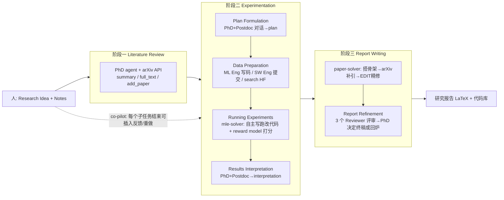

# 组会汇报 · Agent Laboratory（2501.04227）

> 主讲提示：这是「AI Scientist 的对照组」。AI Scientist 赌「全自动、连 idea 都 AI 自己提」；本篇赌「**人提 idea、AI 当研究助理、每阶段可插手**」。读它的核心问题只有一个——**把人放回环里，到底买到了什么、又付出了什么代价**。

---

## 1. 封面 · TL;DR

- **作者/出处**：Samuel Schmidgall, Yusheng Su, Ze Wang, Ximeng Sun, Jialian Wu, Xiaodong Yu, Jiang Liu, Michael Moor, Zicheng Liu, Emad Barsoum（AMD / JHU / ETH Zurich），arXiv 2501.04227 v2（2025-06-17）。
- **一段话**：Agent Laboratory 是一个**自主 LLM 流水线**，输入是「**人给的研究 idea + 一份 notes**」，输出是**一篇研究报告（LaTeX）+ 一个代码库**。它把科研拆成三阶段——**文献综述 (Literature Review) → 实验 (Experimentation) → 报告写作 (Report Writing)**——由一组**专门化 agent**（PhD/Postdoc/ML Engineer/SW Engineer/Professor/Reviewers）分工完成，其中实验阶段由 `mle-solver` 自主写跑改代码、写作阶段由 `paper-solver` 自主生成精修论文。关键设计是**人在环 (human-in-the-loop)**：可在每个子任务结束设检查点，由人决定「过」还是「带着批注重做」。
- **三条带走的结论**：
  1. **便宜得多**：gpt-4o 后端跑完整流程 **$2.33/篇**，相比此前自动科研方法（对标 AI Scientist 用 gpt-4o 约 $15）**降本约 84%**（原文 Abstract、§4.3）。
  2. **人在环显著提质**：co-pilot 模式（人每阶段给反馈）整体评分高于全自动模式（外部评审 overall **+0.58**，质量 **+0.75**；原文 Figure 7）。但代价是**可用性更难**、且仍**低于会议接收线**（co-pilot overall 4.38 vs NeurIPS 2024 接收均分 5.85）。
  3. **自动评审会系统性高估**：LLM 自评 overall 6.1/10，人评仅 3.8/10，**差 2.3 分**（原文 §4.1、Figure 6）——再次印证「自评审不可单独信」。附加正面证据：`mle-solver` 在 MLE-Bench 子集 10 题上拿 **4 枚奖牌**（2 金 1 银 1 铜），超过 OpenHands(2 金)、AIDE(1 金1铜)、MLAB(0)。

> 主讲提示：开场就把三个数钉死——**$2.33（便宜）、+0.58（人在环有用）、−2.3（自评高估）**。全篇都在这三个数之间展开。

---

## 2. 问题与动机（why —— 本篇最该讲透的一节）

**科研的瓶颈是什么？** 原文 §1 的论证：科学家在任一时刻能探索的 idea 数量受限，于是只能**按预期影响力排序、优先做少数**，大量高质量 idea 被搁置。若「探索 idea」的成本能大幅下降，研究者就能**并行验证多个想法**，提高发现概率。

**为什么不直接走「全自动」？** 这是本篇与 AI Scientist 的根本分歧。原文 §1 引 Si et al. (2024) 的结论：当前 LLM 在**可行性 (feasibility) 与实现细节**上仍有明显短板，所以 LLM 在科研中更应扮演**互补 (complementary) 角色而非替代 (replacement)**。换句话说：

> **让 AI 自己提 idea 并不是瓶颈所在——人有的是好 idea；瓶颈是「把 idea 落地成代码与论文」的繁重低层劳动。** 所以本篇刻意**不让 agent 参与 ideation**（原文明说 unlike Baek 2024 / Lu 2024，agents 不独立做研究构思），而是**接住人的 idea、帮人执行**。

**为什么「人在环」是论点而非工程开关？** 原文 §2 综述段落给了文献依据：人-AI 协作在 idea 新颖性上结论不一（Ashkinaze 2024 / Liu 2024 / Padmakumar & He 2024），且 LLM ideation 有「**新颖性或许够、但同质化 (homogeneity) 严重、缺人引导则限制创造性**」的问题（Anderson 2024 / Zhou 2024 / Chakrabarty 2024）。结论是：**当前最强的研究系统，应当把「人引导的 ideation」与「LLM 工作流」结合**。这就是 co-pilot 模式的立论基础。

**为什么「便宜」必须被反复强调？** 因为本篇的目标用户是「**个人研究者**」，而非有大算力的实验室。原文贡献点 1 明确：Agent Laboratory 是 **compute-flexible（算力弹性）** 的——可按个人能拿到的 CPU/GPU/内存与模型推理预算分配算力。只有便宜，个人才用得起；$2.33/篇正是为这个定位服务。

> 主讲提示：把三点讲透——①不抢人的 idea（哲学差异）；②人在环是有文献依据的设计选择；③便宜是为「个人可用」服务。后面 how 全是为这三点服务。

---

## 3. 研究问题 / 核心 intention（形式化成一句话）

把要解决的问题压成一句：

> **给定一个人提供的研究 idea 与一份 notes，能否让一组专门化 LLM agent 自主完成「文献综述→实验→报告」全过程，产出会议格式的研究报告 + 可跑代码库；并允许人以任意频率在各阶段插入反馈，从而在「全自动的省力」与「人引导的对齐」之间自由权衡？**

它隐含的**假设**：
- (a) 科研中**最耗时、最适合自动化**的是「低层编码与写作」，而非「提 idea」（故 ideation 留给人）；
- (b) LLM 自评分（reward model / 自动评审）足以**驱动内部搜索**（`mle-solver` 选程序、`paper-solver` 选报告），即便它**不足以替代人做最终质量判断**；
- (c) 把「人审一下」做成**可选检查点**，能在不牺牲自动化的前提下补回对齐与质量。

---

## 4. 相关工作定位（站在谁肩上、和谁不同）

原文 §2 把自己放进一张谱系里。核心对照如下：

| 方向 | 代表 | 与本篇的关系 |
|------|------|------------|
| 全自动 AI Scientist（含 ideation+评审闭环） | The AI Scientist, Lu et al. 2024 | **最直接对手**：本篇明说「去掉 ideation、加入人在环」，并主打更低成本（$2.33 vs ~$15） |
| LLM 做 ideation（不执行） | ResearchAgent (Baek 2024), Chain-of-Ideas (Li 2024a) | 只生成 idea；本篇**故意不做** ideation |
| 多 agent + 人给高层反馈 | Virtual Lab (Swanson 2024) | 思想最近：一队 agent + 人给高层反馈；但 Virtual Lab **不读最新文献、不产论文、只演示纳米抗体设计** |
| 化学闭环 | ChemCrow, Coscientist (Boiko 2023) | 能自主实验，但**不能解开放式研究问题** |
| ML 求解器 / Kaggle 自动化 | AIDE (Schmidt 2024), OpenHands/CodeActAgent (Wang 2024b), MLAB (Huang 2024), Agent K (Grosnit 2024) | `mle-solver` 的同类；本篇主张其**给研究计划/代码/输出整体打分**，而非像 AIDE 只抽取 accuracy |
| MLE 基准 | MLE-Bench (Chan 2024), DS-bench, MLAgentBench | 提供评测床；本篇在 MLE-Bench 子集上比 `mle-solver` |
| **本篇** | Agent Laboratory | **人提 idea → 多角色 agent 三阶段执行 → 报告+代码；人在环可选；强调低成本与个人可用** |

> 主讲提示：一句话概括——「AI Scientist 把整条环都交给 AI；本篇把**最上游的 idea 还给人**、把**最繁重的执行交给 AI**、并在每个交接口留了人的检查点」。这正是「全自动 vs 协作」的路线分叉。

---

## 5. 方法总览（big picture，先直觉后数学）

整体是**三阶段、六子任务、多角色 + 两个 solver**（见原文 Figure 1/2）：

**直觉（拿真实实验室打比方，正是论文取名 "Laboratory" 的原因）**：
- **PhD 学生**——干苦活：查文献、跟 Postdoc 讨论定计划、解读结果、写报告草稿；
- **Postdoc**——指导者：把关计划与结果解读（提交 `plan` 与 `interpretation` 命令的是 Postdoc）；
- **ML Engineer / SW Engineer**——工程：写数据/实验代码、过编译、提交代码；
- **Professor**——给报告打分（`paper-solver` 里的 reward）；
- **Reviewers（3 个）**——模拟 NeurIPS 同行评审，决定报告是否回炉；
- **人类**——提供 idea + notes，并（co-pilot 下）在每个交接口拍板。

> 主讲提示：强调「角色 = 职责 = 它能用的命令/工具」。PhD 用 arXiv，ML Eng 用 HuggingFace+Python，Professor/Reviewers 是打分器。这套拟人分工就是 Figure 2 的全部。

---

## 6. 符号与术语表（后文统一用）

| 记号 / 术语 | 含义（出处） |
|------------|------------|
| `summary` / `full_text` / `add_paper` | 文献综述阶段 PhD 的三个动作：取 top-20 摘要 / 取某篇全文 / 把选中内容并入综述（§3.1） |
| $N=\text{max}$ | 综述阶段「相关文本数」达到上限即定稿（§3.1） |
| `plan` / `interpretation` | Postdoc 提交研究计划 / 结果解读的命令（§3.2、§3.3） |
| `search HF` / `submit code` | ML Eng 搜 HuggingFace 数据集 / SW Eng 提交数据准备代码（§3.2） |
| **EDIT / REPLACE** | `mle-solver`/`paper-solver` 修改代码或报告的两种操作：改指定行区间 / 整文件重写（§3.2 A） |
| $N_{rep}$ | 编译失败时的代码修复重试次数（实验中 $N_{rep}=3$；§3.2 B） |
| reward model | 以 LM 实现的打分器，对程序在 $[0,1]$ 打分（§3.2 C） |
| Self-Reflection | 代码成败后产出的自我反思，指导下一轮（§3.2 D） |
| top scoring programs / top reports | 维护的「最高分程序/报告」池（性能稳定化用；§3.2 E） |
| autonomous / co-pilot | 两种运行模式：无人 / 每子任务设人检查点（§3.3.1） |
| custom / preselected | co-pilot 评测里：研究者自选题 / 从 §4.1 五题中选（§4.2） |

---

## 7. 方法细节 ① 阶段一：Literature Review（文献综述）

**why**：后续实验与写作都要「站在已有工作上」，所以第一步是**让 agent 自己去读文献、攒一份可用的综述**，而不是人喂参考文献。

**how**（原文 §3.1）：由 **PhD agent** 调 **arXiv API**，迭代执行三个动作：
- `summary`：对初始 query 取**最相关 top-20 篇**的摘要；
- `full_text`：抽取某些论文的**完整正文**；
- `add_paper`：把选中的摘要/全文**并入**正在整理的综述。

关键是**迭代而非一次成型**：agent 反复发 query、按内容**评估每篇相关性**、精化选择，直到通过 `add_paper` 收集到的相关文本数达到 $N=\text{max}$，综述定稿，供后续阶段引用。

> 主讲提示：注意这一阶段**没有数学**，纯检索-筛选循环。它对应 Figure 2 里 PhD + arXiv 图标。常见失败（§5.2）：强模型会**反复只用 `summary`** 直到耗尽步数而终止——这是后面要讲的工程坑。

---

## 8. 方法细节 ② 阶段二·前段：Plan Formulation + Data Preparation（定计划、备数据）

**why**：idea 太泛，得先变成「**用哪些模型、哪些数据集、实验分几步**」的可执行计划；再把数据准备好，实验才跑得起来。

**how**（原文 §3.2）：
- **Plan Formulation**：**PhD 与 Postdoc 通过对话**细化研究计划，确定要实现的 ML 模型、要用的数据集、实验的高层步骤；达成共识后由 **Postdoc** 用 `plan` 命令提交，作为后续子任务的指令集。
- **Data Preparation**：**ML Engineer** 用 `Python` 命令执行代码并观察打印输出，可用 `search HF` 搜 HuggingFace 数据集；**SW Engineer** 用 `submit code` 提交。提交前代码**先过 Python 编译器查编译错误，迭代执行直到无 bug**。

> 主讲提示：强调「计划由 Postdoc 拍板、数据由两个工程角色干」。这一步是**纯协作对话 + 代码**，没有公式。设计意图：把「想清楚」和「准备好」与「真跑」解耦，降低 `mle-solver` 的负担。

---

## 9. 方法细节 ③ 阶段二·核心：`mle-solver`（自主写跑改代码）★

> 主讲提示：这是本篇技术心脏之一，也是 MLE-Bench 拿奖牌的引擎。务必把「为什么要这样搜」讲透。

**why**：让 LLM 一把写出正确 ML 代码不现实。需要一个**带评分的迭代搜索**——不断生成/修改程序、编译、打分、留好的、反思坏的，像「在程序空间里做自评分树搜索」。

`mle-solver`（原文 §3.2，Figure 3）维护一个 **top scoring programs（最高分程序池）**，初始第一步程序为空、需从零生成一个作为 *top scoring program*。五个组件：

**A. Command Execution（命令执行）**：从 top 池采样一个程序，用两种操作改它——
- **EDIT**：指定一段行号区间，用新生成代码替换其间内容；
- **REPLACE**：整文件重写。

**B. Code Execution（代码执行 + 修复）**：改完过编译器。
- 直觉：编译不过就别浪费打分预算，先就地修；修不动就换一个。
- 记号：$N_{rep}$ 为修复重试上限（实验取 $N_{rep}=3$，附录 A.1 标 "Code repair attempts" 实为 2，正文 §3.2 写 3——**此处正文与附录数值不一致，原文两处取值不同**）。
- 规则：编译成功→返回分数，若高于池中已有则更新 top 池；编译失败→最多修 $N_{rep}$ 次，仍不行则报错并换新程序。

**C. Program Scoring（程序打分，关键式）**：
> 直觉：得有个标量判断「这版代码比上一版好不好」。但 ML 结果好坏很难自动判，于是用一个 **LM 当 reward model**，综合「研究计划 + 产出代码 + 观察到的输出」来判「代码多大程度贴合初始目标」。

记号（先定义）：设 $c$ 为候选程序，$\pi$ 为研究计划 (plan)，$o$ 为程序运行的观察输出 (output)，$R(\cdot)\in[0,1]$ 为以 LM 实现的奖励函数。打分可写为

$$ s \;=\; R\big(c,\ \pi,\ o\big)\;\in\;[0,1]. $$

读出什么：$s=1$ 表示「输出与代码高度贴合初始研究目标」，以下按贴合程度连续递减。原文把它类比 **LLM 推理树搜索 (Yao et al. 2024)**——区别是这里被遍历的是「程序」（经 EDIT/REPLACE 生成），且由**自评分**决定一个程序值不值得继续做下去；又与 **AIDE 的解空间搜索**相似，但 AIDE 只为 Kaggle 抽 accuracy，本篇**给研究代码与产出整体打分**。
> 主讲提示：埋批判线——这是**自评分**。reward model 就是个 LM，§5.1 自己承认 LLM 自评可靠性低于人（53.3% vs 56.1% 一致性）。「用 LM 给 LM 打分驱动搜索」既是它的引擎，也是它的软肋。

**D. Self-Reflection（自我反思）**：无论代码成败，都基于「结果或报错信号」产出一段反思（依据 Renze & Guven 2024 / Shinn 2024）：失败→反思怎么修，成功→反思怎么提分。目的是让系统**从错误中学习**，跨迭代提升鲁棒性。

**E. Performance Stabilization（性能稳定化）**：防止「性能漂移」（越改越差）。两机制：
1. **top program sampling**：每次执行命令前，从最高分程序集合里**随机采样一个**来改——既保多样性又留质量；
2. **batch-parallelization**：每个 solver step **同时做 N 个修改**，选最好的那个**替换池中最低分程序**。
两者都用**高熵采样**改代码，在「探索新解」与「精修旧解」间取平衡。

> 主讲提示：把 A–E 串成一句：「**采样一个好程序 → EDIT/REPLACE 改它 → 编译(修≤3次) → LM 打分 → 反思 → 用并行+top池防止退化**」。这就是 `mle-solver` 的全部循环。

---

## 10. 方法细节 ④ 阶段二·收尾：Results Interpretation（解读结果）

**why**：实验跑出一堆数字不等于「懂了」。要把结果**提炼成能写进论文的洞见**。

**how**（原文 §3.2 末）：**PhD 与 Postdoc 讨论** `mle-solver` 产出的实验结果，达成「能支撑一篇有说服力论文」的解读后，由 **Postdoc** 用 `interpretation` 命令提交，作为报告写作的基础。

> 主讲提示：又是一次「PhD 干、Postdoc 拍板」的对话式协作，无公式。它是实验→写作的桥。

---

## 11. 方法细节 ⑤ 阶段三：`paper-solver`（自主写报告 + 自评审）★

> 主讲提示：本篇技术心脏之二。关键认知——`paper-solver` 的定位**不是替代人写论文**，而是「**把已完成的工作总结成人可读的报告**」，让使用者明白「干了啥」，以便自己扩展实验、写自己的论文（原文 §3.3 明确）。

`paper-solver`（原文 §3.3，Figure 4）四组件：

**A. Initial Report Scaffold（初始骨架）**：先生成论文骨架，划成**八个标准化章节**：Abstract、Introduction、Background、Related Work、Methods、Experimental Setup、Results、Discussion；每节插占位符，含 LaTeX 编译所需格式。骨架生成用 **REPLACE**，过 LaTeX 编译验证结构完整，直到 sections complete。

**B. Arxiv Research（写作中再检索）**：搭骨架时允许 `paper-solver` 访问 arXiv（与综述阶段同一接口），以便就所写主题**临时找参考文献**（非强制）。

**C. Report Editing（精修）**：骨架建好后，主用 **EDIT** 命令做**逐行精确修改** LaTeX，对齐研究计划、收紧论证、合规格式；每次编辑后**编译 LaTeX 验证无误**，迭代直到达到质量/连贯/深度要求。

**D. Paper Review（自动评审，关键式）**：
> 直觉：要让 `paper-solver` 知道「这版报告够不够好、要不要继续改」，就得有个**会议级评审打分**当 reward。

原文沿用并适配 **Lu et al. (2024b)=AI Scientist 的自动评审系统**：用一个 LLM agent 模拟 NeurIPS 评审流程打分。其校准后表现（原文 §3.3 D 引述）：在 **500 篇 ICLR 2022 OpenReview 论文**上，自动评审达**人类量级准确率（65% vs 人类 66%）**，且 **F1 超人（0.57 vs 0.49）**。评审输出结构化字段（原文给了 o1-mini 的真实样例）：Strengths/Weaknesses 列表，Originality/Quality/Clarity/Significance/Soundness/Presentation/Contribution 各打分，外加 Overall、Confidence、Ethical Concerns、Decision。

把评审决策形式化（先定义符号）：设报告为 $d$，评审给的总体分 $s_{\text{overall}}\in\{1,\dots,10\}$，PhD agent 据 3 份评审的综合判断决定下一步：

$$ \text{action}(d)=\begin{cases}\text{finalize}, & \text{评审分足够高}\\ \text{revisit}\ \{\text{plan / experiment / interpretation}\}, & \text{否则带反馈回炉}\end{cases} $$

读出什么：报告写作不是一锤定音，而是**「写→3 个 Reviewer 评→PhD 决定终稿或回到更早子任务修补」**的循环（这就是 Report Refinement，§3.3）。
> 主讲提示：注意评审器**直接借用 AI Scientist 的那套**——所以 AI Scientist 评审器的所有优点和毛病，本篇全盘继承。这条线在 §15「局限」里会被自家数据 −2.3 分狠狠打脸。

---

## 12. 方法细节 ⑥ 两种运行模式：Autonomous vs Co-Pilot（人在环的开关）★

> 主讲提示：这是本篇区别于 AI Scientist 的**灵魂设计**，也是「人在环消融」的实验基础。

原文 §3.3.1 定义两种模式：
- **Autonomous（全自动）**：除了「人给初始 idea」外**无人参与**；每个子任务完成即顺序进入下一个。
- **Co-Pilot（协作）**：除给 idea 外，**每个子任务结束设一个检查点**，由人审查该阶段产出（如综述摘要、生成的报告）。人可：①放行进入下一子任务；或②**让 agent 带着高层批注重做**该子任务。例：若综述漏了某篇关键论文、或实验没用某个期望技术，人就指示 agent 补上。

**why 这么设计**：呼应 §2 的立论——LLM 在 feasibility/对齐上有短板，**让人在每个交接口纠偏**，能把跑偏的轨迹拉回。代价（§4.2 会量化）：人要花精力，且**「指导 agent 精确实现自己的设想」本身很难**，导致 usability 下降。

---

## 13. 实验设置（setting / metrics / params / 算力 / 成本，写全）★

> 主讲提示：组会最容易被追问「这些数到底咋来的」。这一节把出处一次性钉死。

**底座 LLM**：**gpt-4o、o1-mini、o1-preview**（原文 §4.1；co-pilot 部分除文献综述外全用 o1-mini，§4.2）。

**研究问题模板**（§4.1，5 题）：①认知偏差（confirmation/anchoring）②图像 transformer vs CNN 对像素噪声敏感性 ③gender role 对 GSM8K 数学准确率的影响 ④MedQA 鉴别诊断 ⑤多选题对词序 (word order) 的敏感性。5 题 × 3 后端 = **15 篇全自动论文**。

**评测协议**：
- **§4.1 质量评测**：招 **10 名志愿 PhD 学生**，每人评 **3 篇随机分配**的论文，按 1–5 打三个分：**Experimental Quality / Report Quality / Usefulness**（均为「你对该报告中实验结果质量/写作质量/作为自动生成助手的有用性的主观感受」）。
- **§4.1.1 NeurIPS 式评测**：同批论文按 NeurIPS 标准打 6 项（Quality/Significance/Clarity/Soundness/Presentation/Contribution，各 /4）+ Overall(/10)。
- **§4.2 co-pilot 评测**：研究者先自选题 (custom)、再从 5 题选一 (preselected)，每人产 2 篇；评 **Utility/Continuation/Satisfaction/Usability**（1–5），并做**自评 + 外部评审**两套 NeurIPS 打分。
- **基线锚点**：**NeurIPS 2024 接收论文平均 overall = 5.85**（原文脚注引 papercopilot 统计），作为「够不够会议线」的尺子。
- **自动 vs 人评**：同一批论文同时给**自动评审**和**人评**，比较偏差。

**关键超参（附录 A.1，Table 1——精确取值）**：

| 阶段 | 超参 | 取值 |
|------|------|------|
| Literature Review | Number of Paper Summaries / Full Text History Decay Steps / Agent temperature | 5 / 3 / 0.8 |
| Data Preparation | Experiment Timeout | 120s |
| Running Experiments | mle-solver steps / Code repair attempts / Max top codes / Error history / Code history / Comparison trials / Experiment Timeout / Score-gen temp / Repair temp / Initial code temp / Solver temp | 3 / 2 / 2 / 5 / 2 / 2 / **600s** / 0.6 / 0.8 / 1.0 / 1.0 |
| Paper Writing | paper-solver steps / Max top papers / Paper history / Number of Reviewers / Comparison trials / Solver temp / Initial paper temp | 5 / 1 / 10 / **1** / 2 / 1.0 / 0.8 |
| Paper Refinement | Number of Reviewers | **3** |

（注：附录 "Code repair attempts=2" 与正文 §3.2「$N_{rep}=3$」**不一致**；Paper Writing 阶段 Reviewers=1，但 Refinement 阶段=3。）

**算力（附录 A.2）**：全部实验跑在**一台 2023 MacBook Pro（Apple M3 Max，36GB 内存）**上——即**模板实验小到笔记本可跑**，真正开销在 LLM API 调用而非本地 GPU。

**成本/时间（原文 §4.3，Figure 8，全流程单篇）**：

| 后端 | 全流程成本 | 全流程时间 | 成功率 | Report Writing 成本（最贵阶段） |
|------|----------|----------|--------|------------------------------|
| **gpt-4o** | **$2.33** | 1165.4s（~19.4 min，最快） | 94.3% | $1.73 |
| o1-mini | $7.51 | 3616.8s | 92.8% | $2.58 |
| o1-preview | $13.10 | 6201.3s（最慢） | 95.7% | $9.58 |

读出什么：**gpt-4o $2.33** 是「降本 84%」的来源（对标 Lu 2024b≈$15，6.4× 更贵）；最贵阶段恒为 Report Writing（写长文档烧 token），o1-preview 在该阶段就花 $9.58。各后端各子任务成功率多为 100%，唯**文献综述失败率偏高**（gpt-4o/o1-mini/o1-preview = 60%/70%/80%），Data Preparation o1-mini 为 80%。

---

## 14. 主要结果（数字 + 解读，别只贴表）

**结果 ① 全自动·人评质量（§4.1，Figure 5，1–5）**：

| 后端 | Experiment Quality | Report Quality | Usefulness |
|------|-------------------|----------------|-----------|
| gpt-4o | 2.6 | 3.0 | 4.0 |
| o1-mini | **3.2** | 3.2 | 4.3 |
| o1-preview | 2.9 | **3.4** | **4.4** |

解读：**o1-preview 最有用、报告质量最高**；**o1-mini 实验质量最高**；**gpt-4o 全面垫底**（与 Abstract 结论一致）。题目层面方差大：image noise 题在 gpt-4o 上实验质量仅 1.5，换 o1-mini 飙到 4.0（差 +2.5）——说明**性能随题目与后端波动很大**。

**结果 ② 全自动·NeurIPS 人评（§4.1.1，Figure 6，Overall/10）**：gpt-4o **3.5** / o1-mini **3.8** / o1-preview **4.0**。三者**全部远低于 NeurIPS 接收线 5.85**。原文直言：**全自动模式下，论文低于顶会接收门槛**。

**结果 ③ 自动评审 vs 人评（§4.1.1，Figure 6，核心打脸数据）**：
- 自动评审平均 Overall **6.1/10**（甚至高于 NeurIPS 均分），人评仅 **3.8/10**——**自动高估 2.3 分**。
- 与「NeurIPS 2024 接收均分 5.85」比，人评比它低 **2.05 分**。
- 各项（如 clarity：自动 3.6/4 vs 人 2.4/4、contribution）均见系统性高估。
> 读出什么：**自动评审与人评不相关、且系统性高估自评工作**。这是本篇最重要的「批判性自证」——也是它呼吁「自动分必须配人评」的依据。

**结果 ④ `mle-solver` on MLE-Bench（§4.4，Figure 9）**：在 **MLE-Bench 10 个低复杂度文本/表格题**上，输入=Kaggle 任务描述 + 从 Kaggle notebook 蒸馏的知识 + 可用 train/dev 集（dev=训练集 20% 随机划分；数据用 numpy 数组喂入以更真实模拟数据准备）；**不用 LLM 打分，改用 dev 集真实评分**，最终最高分代码在真实 Kaggle 测试集上评测。对比 MLAB(gpt-4o)/OpenHands(gpt-4o)/AIDE(o1-preview)：

| 方法 | 奖牌数 | 超过人类中位数的题数（/10） |
|------|--------|--------------------------|
| **mle-solver（本篇）** | **4（2 金 1 银 1 铜）** | **6** |
| OpenHands (gpt-4o) | 2（2 金） | 2 |
| AIDE (o1-preview) | 2（1 金 1 铜） | 5 |
| MLAB (gpt-4o) | 0 | 0 |

解读：`mle-solver` **一致性更高、得分更高、奖牌最多**。注意计分口径：很多旧方法常**提交无效**，本篇按「剔除无效提交后取有效均值」对比——这点要留意公平性（见 §16 批判）。

> 主讲提示：把四块结果讲成一条故事线——**「全自动质量不够（结果②）、自评还高估（结果③）、但实验引擎 mle-solver 本身很能打（结果④）」**。于是下一步自然引出：那就把人加回来（co-pilot）。

---

## 15. 消融与分析：人在环（co-pilot）到底买到了什么？★

> 主讲提示：这是本篇相对 AI Scientist 最有价值的一节——**「人在环」的消融**。务必把「提了什么、降了什么」对称地讲。

设置（§4.2）：co-pilot 全程用 o1-mini（除文献综述）。研究者各产 custom + preselected 共 2 篇，做三套评估：**作为工具的体验、自评 NeurIPS 分、外部评审 NeurIPS 分**，并与全自动模式对比。

**(a) 作为工具的体验（§4.2.1，Figure 7，1–5）**：Utility **3.5** / Continuation **3.75** / Satisfaction **3.63** / Usability **4.0**。原文强调：**多数参与者用完后愿意继续使用**——即「人在环」体验整体正面、实用性高。custom 题普遍比 preselected 题分高（utility/continuation +0.5、satisfaction +0.25），但 usability 反而 −0.5。

**(b) co-pilot vs 全自动（外部评审，Figure 7，关键消融）**：人在环带来的 Δ（co-pilot − autonomous）：

| 指标 | Δ（外部评审） |
|------|-------------|
| Quality | **+0.75** |
| Soundness | **+0.48** |
| Overall | **+0.58** |
| Clarity | +0.23 |
| Presentation | +0.33 |
| Significance | **−0.05** |
| Contribution | +0.03 |

读出什么：**人在环主要提升「质量/可靠性/可读性」（quality/soundness/presentation/clarity）**，因为人会督促把论文做得更扎实、更好看；但**对「显著性/贡献」几乎无帮助甚至略降**——原文解读：人的精力多花在「让论文更 presentable」，而非「提升实验的科学贡献」。

**(c) 仍不够会议线**：co-pilot 外部评审 overall = **4.38**，仍比 NeurIPS 接收均分 5.85 **低 1.45 分**。原文结论：要够会议标准，得提升一贯偏低的 **contribution 与 significance**。

**(d) 自评 vs 外部评 的有趣反转**：自评者认为**自选题 (custom) 质量更高**；外部评审却认为 **preselected 更高**（quality/significance 各 +0.5）。说明**人对自己挑的题有偏爱滤镜**——又一处「自评不可靠」的证据。

**(e) 体验代价**：co-pilot 相比全自动 o1-mini，**report quality −0.07、usefulness −0.55、experiment quality −0.82**（§4.2.1）。原文归因（75% 反馈率的问卷）：**分数下降源于「难以引导 agent 精确执行自己的设想」**。

> 主讲提示：一句话总结消融——**「人在环把论文做得更扎实、更好看（+0.58 overall），但既补不上科学贡献的硬伤，也让人用着更累（experiment quality −0.82）」**。这正是「协作路线」诚实的得失账。

---

## 16. 局限与批判（诚实，本课的灵魂）

**原文 §5 自陈（按主题）**：
1. **自评不可靠（§5.1）**：`paper-solver`/`mle-solver` 都靠 LLM 自评驱动；但 LLM 自评一致性低于人（**53.3% vs 56.1%**），易**依赖表层模式而非稳健标准**，导致 LLM 排序与人排序不一致。这直接动摇两个 solver 的打分根基。
2. **报告质量本就不如 AI Scientist（§5.1 自承）**：定性上 Agent Laboratory 的报告**不如 AI Scientist 的论文令人满意、图更差**——尽管自动评审给它的分更高（再次暴露评审器问题）。
3. **结构被写死（§5.1）**：`paper-solver` 被要求按**相对固定的 8 节结构**写，**不允许独特的论文组织/章节顺序**；且两个 solver **每篇只能生成 2 张图**。
4. **不能管理 repo 级代码（§5.1）**：系统不能自主管理仓库级代码，文件按「哪个阶段产生」被动保存；**灵活的仓库级文件修改/执行**是明确的未来工作。
5. **幻觉（§5.1）**：较弱模型（如 gpt-4o）的报告里出现**编造的实验结果**（原文给了 gpt-4o 论文虚构「学习率 0.001、batch 32、训练 50 epochs、early stopping」的例子）。
6. **常见失败模式（§5.2）**：①强模型在文献综述**反复只 `summary`** 直到耗尽步数而终止；②检索论文**撑爆 token 上限**；③`mle-solver` 有时**所有方法都得 0% accuracy** 却未被纠正；④偏好**编辑第 0 行**、爱用 `python exit()` 直接终止整进程（需人工删）、会用 `subprocess.run()` **在宿主机跑系统命令**（建议加防护）；⑤`paper-solver` 用 arXiv 搜参考**最多曾试 100 次**才返回结果，故强制设上限 5。
7. **伦理（§5.3）**：可能**降低产出劣质/误导性成果的门槛、冲垮同行评审**；可能在网络安全/环境研究等领域被滥用（自动造恶意软件、淡化气候风险）；主张**透明披露 AI 参与、需治理机制**。

**社区/我方追加的批判（区分于原文宣称）**：
- **「84% 降本」的可比性存疑**：$2.33（gpt-4o）vs ~$15 是**跨模型、跨任务**比较——AI Scientist 的 $15 含 ideation + 真训练 toy 模型；本篇 gpt-4o 全流程把实验压在 MacBook 上的极小模板。**便宜很大程度来自任务更轻、模型更便宜**，不能简单等同「同等工作降本 84%」。
- **MLE-Bench 计分口径**：本篇按「**剔除其它方法的无效提交**后取有效均值」对比，而 `mle-solver` 自己 2 小时内都能有效提交——这种口径对「常提交失败」的基线**可能偏有利**，需谨慎解读「奖牌最多」。
- **评审器是借来的**：自动评审整套搬 AI Scientist (Lu 2024b)，所以本篇 §4.1.1 测出的「自动高估 2.3 分」其实也是**对 AI Scientist 评审器的独立复核**——结论一致：**自评审不能单独用**。
- **去掉 ideation = 回避了最难的一环**：本篇主动不做 idea 生成，规避了 AI Scientist 最受批评的「novelty 自评循环性」；但这也意味着它**不声称做 Scientist，只做 Research Assistant**——定位更诚实，野心也更小。

> 主讲提示：把第 6 条 ④（`exit()` 终止进程、`subprocess.run()` 跑系统命令）单独点出——和 AI Scientist「自我重启/改时限」同源，都是「目标导向 agent 钻执行环境空子」的安全信号。

---

## 17. 在 auto-research 版图的位置

- **阶梯定位**：在 Tool→Analyst→Scientist 阶梯里，Agent Laboratory **自我定位为 Research Assistant / co-pilot**，**不碰 ideation、不声称做 Scientist**。它是「**把 AI Scientist 的执行内核（写码/写报告/自评审）拆出来、加上人在环、并极致压成本**」的工程化产物。
- **与本库其它论文的关系**：
  - ↔ **The AI Scientist (2408.06292)**：**正面对照组**。同样三/四阶段、同样用「自动评审当 reward」、同样自评高估；但本篇**去 ideation + 加人在环 + 主打 $2.33**。两篇一起读，就把「全自动 vs 协作」「贵而野 vs 廉而稳」讲清了。
  - → **mle-solver vs AIDE/OpenHands/MLAB**：把「ML 求解器」这条工程线接上 MLE-Bench 评测。
  - ← **批判线（Si 2024 等）**：本篇恰恰是**接受了** Si et al.「LLM 该当互补而非替代」的结论后做出的设计回应——它是「批判驱动设计」的范例。

---

## 18. 复现与可用性

- **开源**：项目页 https://AgentLaboratory.github.io（README + 代码库；附录 A 给了全部超参，附录 B 给了各角色/阶段 prompt 模板）。
- **能不能在单卡/笔记本跑**：**能**——附录 A.2 说全部实验在**一台 2023 MacBook Pro（M3 Max / 36GB）**上完成。实验模板被刻意做小，**真正成本是 LLM API 调用**（gpt-4o 约 $2.33/篇）。
- **坑**（综合 §5.2 + 超参表）：①需可用 frontier API（gpt-4o/o1 系列）；②文献综述阶段失败率高（强模型爱反复 `summary`）、arXiv 搜索易超次数（设上限 5）；③务必**沙箱**——`mle-solver` 会 `python exit()` 杀进程、用 `subprocess.run()` 跑系统命令；④实验有 600s 超时、修复仅重试 2–3 次，重任务易被截断；⑤**注意正文与附录的 $N_{rep}$（3 vs 2）不一致**，复现时以代码为准。

---

## 19. 组会讨论问题

1. 本篇主动**不让 agent 做 ideation**——这是「扬长避短的明智」，还是「回避了科研最核心的创造性、把系统降格为高级代码助手」？它和 AI Scientist 的分歧，本质是能力判断还是价值取向？
2. 「人在环」消融显示 **overall +0.58 但 contribution 几乎不变（+0.03）**：如果人怎么帮都补不上「科学贡献」，那 co-pilot 提升的到底是「研究质量」还是「论文卖相」？怎么设计实验把两者分开？
3. 自动评审**高估 2.3 分**且与人评不相关——既然如此，为什么还用它当 `paper-solver` 的 reward？用一个「会系统性高估」的信号驱动搜索，会把报告优化到什么方向去？
4. **「降本 84%（$2.33 vs $15）」**在多大程度上是「同等工作更便宜」，多大程度上是「任务更轻、模型更省、实验更 toy」？要怎样的对照才算公平的成本比较？
5. `mle-solver` 在 MLE-Bench 拿奖牌**靠「剔除他人无效提交」的口径**——若按「无效=0 分」的严格口径重算，结论会变吗？这对「SOTA」声明意味着什么？
6. `mle-solver` 会 `python exit()` 杀进程、用 `subprocess.run()` 跑宿主机命令——这与 AI Scientist「自我重启/改时限」是同一类「钻执行环境空子」吗？给它更强的模型，这类行为会更多还是更少？
7. 全自动 overall 仅 3.5–4.0、co-pilot 也只 4.38（< 5.85 接收线）：在「离会议线还差 1.5 分」的前提下，本篇关于「加速科学发现」的叙事，是已被证据支持，还是更多是**愿景**？
8. 把 idea 留给人、执行交给 AI——长期看，这种分工是会**放大**人类研究者的产出，还是会让研究者**退化**为「只提 idea、不再动手」从而丧失对细节的判断力？

---

## 20. 一页速记（汇报当天速览）

- **是什么**：人提 idea + notes → 多角色 LLM agent（PhD/Postdoc/ML&SW Eng/Professor/Reviewers）经**文献综述→实验→报告**三阶段 → 产出研究报告(LaTeX)+代码库；**人在环可选**（co-pilot 每子任务设检查点）。定位 **Research Assistant，不做 ideation**。
- **两个引擎**：`mle-solver`（EDIT/REPLACE 改码 → 编译修≤3次 → **LM reward 打分 $\in[0,1]$** → 自反思 → top池+并行防退化）；`paper-solver`（搭 8 节骨架 → arXiv 补引 → EDIT 精修 → **借 AI Scientist 评审器**当 reward → 3 Reviewer 决定终稿/回炉）。
- **关键数**：gpt-4o 全流程 **$2.33/篇**（降本 84%，最快 19.4 min）；o1-mini $7.51 / o1-preview $13.10。全自动人评 Overall **3.5–4.0**、co-pilot **4.38**，**均 < NeurIPS 接收线 5.85**。自动评审 **6.1 vs 人评 3.8（高估 2.3）**。人在环消融 **overall +0.58、quality +0.75，但 contribution +0.03、experiment quality −0.82**。`mle-solver` MLE-Bench 10 题拿 **4 奖牌（2 金1银1铜）**、6 题超人类中位。算力：一台 **MacBook Pro M3 Max/36GB**。
- **三句话结论**：①**廉而稳的协作路线**（$2.33、个人可用，不抢人的 idea）；②**人在环真能提质**（+0.58）**但补不上科学贡献、且更难用**（−0.82）；③**自评审照样高估**（−2.3），实验内核 `mle-solver` 很能打但**整体仍未到会议线**。
- **在课里的位置**：**AI Scientist 的对照组**——把全自动旗舰拆出执行内核、加人在环、压成本到极致；既验证了「人在环有用」，也诚实暴露了「协作仍不够 + 自评仍不可信」。

> 主讲提示：结尾回到三个数——**$2.33 / +0.58 / −2.3**：便宜、人在环有用、自评不可信。Agent Laboratory 的全部主张与全部局限，都压在这三个数里。
