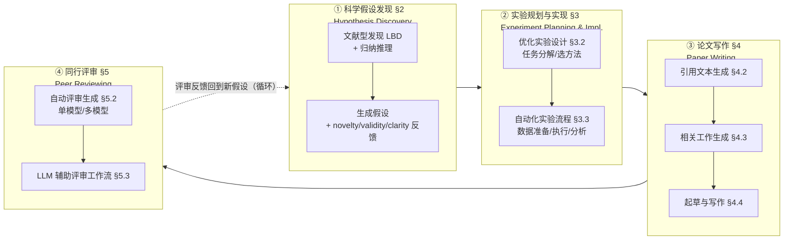

# 组会汇报 · LLM4SR（科研生命周期四阶段综述）

> 主讲提示：这是 auto-research 课的**第二把「坐标系尺子」**。上一把（[`2505.13259` 自主性阶梯](2505.13259-survey-automation-to-autonomy.md)）按**「机器自主到哪一级」**纵切；这一把按**「科研做到哪一环」**横切。开场就把这句话写在白板上：
> **「2505.13259 问『谁来做、做得多自主』；LLM4SR 问『在哪一步做、每一步有哪些招』。两把尺子正交，合起来才是完整地图。」**

---

## 1. 封面 · TL;DR

- **标题 / 出处**：*LLM4SR: A Survey on Large Language Models for Scientific Research*。Ziming Luo\*、Zonglin Yang\*、Zexin Xu、Wei Yang、Xinya Du（**UTD** NLP Lab + **NTU**），arXiv **2501.04306**（2025-01-08），投稿 **ACM Computing Surveys**，全文 37 页、**198 篇引用**。配套仓库 `du-nlp-lab/LLM4SR`。
- **权威性来源**：① 作者团队是「LLM 做假设发现」这条线的**核心玩家**——SciMON / MOOSE / MOOSE-Chem / 生成式归纳推理（inductive reasoning as KR）多篇都是本文作者群自己的工作（原文 §2 大量自引），所以**假设发现这一章是「内行写内行」**，深度明显高于其余三章；② 投 ACM CSUR（综述顶刊）；③ 它在 §1 明确自我定位为**第一篇专门覆盖「整条科研生命周期」**的 LLM 综述（区别于只覆盖单环或单学科的前作）。
- **一段话**：这篇综述把「做科研」拆成**四个阶段**（原文 **Figure 1** 的循环流水线）：**① 科学假设发现 (Scientific Hypothesis Discovery, §2)** → **② 实验规划与实现 (Experiment Planning & Implementation, §3)** → **③ 学术论文写作 (Paper Writing, §4)** → **④ 同行评审 (Peer Reviewing, §5)**。每一阶段都按「**方法发展轨迹 → 代表系统 → 数据集/基准 → 评测方式 → 开放挑战与未来工作**」五段式展开，并用一张**总分类树**（原文 **Figure 2**）把上百个系统钉进这四格。
- **三条带走的结论**：
  1. **「四阶段」是一把好用的收纳尺**：本库 40 篇论文几乎都能被这四格精确归位（§17 给出全表）——AI Scientist v1/v2 横跨全四阶段，AlphaEvolve/FunSearch 落在「假设发现 + 实验」，STORM/OpenScholar 落在「写作（文献综述子任务）」，ReviewerGPT/MARG 落在「评审」。
  2. **四阶段的「成熟度」极不均衡**：**写作**（尤其引用/相关工作生成）最成熟、指标最齐（ROUGE/BERTScore/ALCE）；**假设发现**最前沿也最不可靠（novelty/validity 全靠 LLM 启发式自评）；**实验**卡在「会幻觉、不会真跑湿实验」；**评审**卡在「读不懂专业领域、会被幻觉骗」。
  3. **全链路的共同瓶颈只有一个词——「验证 (validation)」**：假设的 validity 要湿实验才能定、实验计划的正确性要真执行才能验、写作的引用忠实性要回查、评审的判断要专家兜底。**这条「验证缺口」把四章串成同一个故事**，也正是本库 M9.8（独立验证收口）的主线。

> 主讲提示：开场抛三件事——**「它是四格收纳柜」「四格成熟度差很多」「四格共享同一个验证瓶颈」**。第三点是把一篇「编目式综述」讲出灵魂的关键，全程往这条线收。

---

## 2. 问题与动机（why —— 本篇最该讲透的一节，2 页）

### 2.1 领域出了什么认知问题

**「LLM 做科研」的论文正在指数级井喷，但它们被**按「单点任务」或「单一学科」**各自理解，缺一张能把整条科研链串起来的图。** 原文 §1 的论证链：
1. 科研流水线本身是启蒙运动以来的成熟范式——**收集背景 → 提假设 → 设计并执行实验 → 收集分析数据 → 写论文 → 同行评审**（原文 §1 开篇，引 Newton「站在巨人肩上」）；它驱动了一切突破，但**受限于人的创造力、专业知识、精力与时间**。
2. 自动化科研的努力可追溯到 1970s 的 **Automated Mathematician (AM)** 与 **BACON**（原文 §1，引 [74,75,71]）；近年 **AlphaFold / OpenFold** 把单一科研任务加速了数千倍；**LLM（GPT-4 / LLaMA）** 的出现第一次让「跨多个研究领域的通用 AI 助手」看起来现实可行。
3. **问题在于**：LLM 已被零散地用在科研的各个环节（提 idea、写码、补引用、写评审），但**没有一篇综述把这些工作放进「同一条科研生命周期」里统一审视**。

> 直觉：这是一个**「流程视角缺失」**的认知问题。领域里不缺单点系统，缺的是一把**沿「科研做到哪一步」横切的尺子**——没有它，你无法回答「假设发现这一环到底进展到哪、卡在哪」「写作环为什么比评审环成熟得多」这类**按环对比**的问题。

### 2.2 为什么是「科研生命周期四阶段」这根轴

> **Why（设计层）**：朴素的综述切法有三种，本文都点名并放弃了——
> - **按学科切**（生物化学/材料/ML）→ 原文 §1 批评 Zhang et al. [187]「覆盖 260+ 科学 LLM，但聚焦模型架构与数据集，**不把它们放进科研流程的语境**」；按学科切会**割裂**，同一个「假设生成」招法在化学和社会科学里被当成两件事。
> - **按单一能力切**（规划 [55] / 自动化 [158]）→ 原文 §1 批评其「**范围太窄**，只看 LLM 的某项通用能力，而非它在科研工作流里的专门用途」。
> - **按非 LLM 视角切**（如相关工作/引用生成综述 [89]、评审综述 [33]）→ 这些**不以 LLM 为中心**，是被 LLM 浪潮淹没前的旧坐标系。
>
> 本文改用「**科研生命周期四阶段**」，因为它是**唯一能把「上述所有碎片」收进同一条链、又能跨学科通用**的切法：无论哪个学科，科研都要经过「提假设→做实验→写论文→被评审」。**这把尺子要回答的认知问题是：「LLM 在科研的每一步，分别能做到什么、还差什么？」**

### 2.3 不立这把尺子会怎样 / 与 2505.13259 的关键差异

- **看不清「环间成熟度差异」**：不按环切，你不会发现「写作环已有 ROUGE/ALCE 等成熟指标，而假设发现环连一个公认的 validity 指标都没有」——这种**按环对比**正是本文最大的增量。
- **看不清「同一瓶颈反复出现」**：四章各自的 §x.7「挑战」里，**「需要真实验/专家来验证」**这句话以不同措辞出现四次（假设的 validity §2.7、实验的执行 §3.5、写作的引用忠实 §4.6、评审的领域理解 §5.5）——只有把四环并排，才看得出这是**同一个验证缺口**。

> ★ **两把综述尺子的正交关系**（组会必讲）：
>
> | | **2505.13259（自主性阶梯）** | **2501.04306（本文，生命周期）** |
> |---|---|---|
> | 切法（主轴） | **纵切**：Tool→Analyst→Scientist（谁来做、人退多深） | **横切**：假设发现→实验→写作→评审（在哪一步做） |
> | 回答的问题 | 「这个系统**自主到哪一级**？」 | 「LLM 在科研**哪一环**、有哪些招？」 |
> | 收录取舍 | **只收**体现自主性递进的工作；排除通用科学 LLM | **按环全收**方法/数据集/评测，编目更全 |
> | 强项 | 看清「演化方向与天花板」（卡在 Level 3 单实例） | 看清「每一环的方法谱系、数据集、指标」 |
> | 弱项 | 不细究每环内部方法谱系 | 不强调「谁更自主」，编目偏静态快照 |
>
> 一句话：**2505.13259 是「纵坐标」，LLM4SR 是「横坐标」**；一个系统的完整定位 = 它落在哪一环（LLM4SR）× 它自主到哪一级（2505.13259）。两篇 A 组综述**必须配对读**。

> 主讲提示：这一节是 why 的核心。把「三种朴素切法各自为何不够 → 选生命周期能收全且跨学科 → 不立则看不出环间成熟度差与共同验证瓶颈 → 与纵切尺子正交互补」四步讲透，后面填四章就是水到渠成。

---

## 3. 研究问题 / 核心 intention（形式化成一句话）

把综述要解决的问题压成一句：

> **能否用一个「科研生命周期四阶段」的分类法，把『LLM 做科研』这一碎裂领域里的所有代表性方法、数据集与评测统一归位，从而逐环看清「LLM 现在能做到什么、每一环最该攻的开放问题是什么」？**

它隐含的**两个判断**（贯穿全文的「假设」）：
- (a) **科研可被干净地切成四个阶段**，且每个 LLM-for-science 工作都能映射到其中一或多个阶段（原文 Figure 1 把四阶段画成一个**循环**：评审之后回到新假设）。
- (b) **「方法 / 数据集 / 评测 / 挑战」这套五段式，对四个阶段都适用**——即四章可用同构的骨架展开（这正是综述「可读性」的来源，但也埋下「四章深浅不一」的隐患，§16 批）。

> 主讲提示：强调这是**规范性 (normative) 编目框架**——它不测某个数值，而是提出「该怎么把工作归到四格」。四阶段切得对不对、四章是否同等深入，本身就是组会该辩的。

---

## 4. 相关工作定位（它站在谁肩上、和谁不同）

综述在 §1「Comparison with Existing Surveys」明确把自己与前作区分：

| 已有综述类型 | 代表（原文引用） | 切法 | 局限（本篇差异点） |
|------|------|------|------|
| 学科/技术特定的科学 LLM 综述 | Zhang et al. [187]（260+ 科学 LLM） | 按**模型架构与数据集** | 不把模型**放进科研流程语境**，看不出「用在哪一环」 |
| 单一能力综述 | 规划 [55]、自动化 [158] | 按**某项通用能力** | 范围太窄，非科研工作流中的专门用途 |
| 非 LLM 中心的单环综述 | 相关工作/引用生成 [89]、评审 [33] | 按**单个科研子任务** | 不以 LLM 为中心，且只覆盖一环 |
| **本篇** | LLM4SR (2501.04306) | **科研生命周期四阶段** | **第一篇整合「假设→实验→写作→评审」全链路的 LLM 综述**；逐环给方法谱系+数据集+指标 |

> 主讲提示：一句话概括差异——「**别人各看一环或一类模型，它第一次把四环串成一条链**」。它的取舍是：为了**编目全**，牺牲了「谁更自主」的判级深度（那块交给 2505.13259）。

---

## 5. 方法总览（big picture：四阶段一图流，先直觉后细节）

综述的「方法」就是**那张四阶段分类法**。先看主轴（原文 **Figure 1** 的循环流水线）：

**直觉**：把「做一篇研究」想成一条传送带——**先想出值得验的假设（§2），再设计并跑实验去验它（§3），把发现写成论文（§4），最后投出去被审（§5）**；评审意见又回流成下一轮假设。本文的全部工作就是**沿这条传送带，逐站盘点「LLM 能接管哪些活、做得怎么样」**。

> 主讲提示：让听众记住**四个站点**（假设/实验/写作/评审）和**一个回路**（评审→新假设）。后面 §7–§12 逐站拆，每站只问两件事：**有哪些招（how）、卡在哪（why-still-hard）**。

---

## 6. 符号与术语表（先定义，后文要用）

> 说明：**本综述本身几乎不含数学公式**（它是编目式综述，原文通篇无编号公式）。下表中带 $\cdot$ 的「判据定义式」是**本报告为讲清评测维度而补的最小形式化**，并已逐一标注其在原文中对应的文字定义出处；**未在原文出现的式子一律注明「报告补充」，不冒充原文**。

| 记号 / 术语 | 含义 |
|---|---|
| **LBD** (Literature-Based Discovery) | 文献型发现：Swanson 的「ABC 模型」——若概念 A、C 各自与中间概念 B 在文献中共现，则假设 A–C 相关（原文 §2.2.1） |
| **Inductive Reasoning** | 归纳推理：从具体「观察」归纳出适用范围更广的「规则/假设」（原文 §2.2.2，引地心说→日心说→牛顿引力为例） |
| **inspiration（灵感）** | LBD 里与「研究背景」连接、用以生成假设的**另一块知识**（原文 §2.4.1） |
| **NF/VF/CF** | Novelty/Validity/Clarity Feedback：对生成假设在**新颖性/有效性/清晰度**三方面的反馈（原文 §2.3.1，**Table 1** 三列） |
| **EA / LMI / R / AQC** | Evolutionary Algorithm（进化算法）/ Leveraging Multiple Inspirations（利用多个灵感）/ Ranking（假设排序）/ Automatic Research Question Construction（自动构造研究问题）——**Table 1** 的另四个关键组件 |
| **data contamination（数据污染）** | 待发现的「真假设」已在 LLM 训练数据里 → rediscovery 作弊；故 benchmark 标注**发表日期**以规避（原文 §2.4.1，**Table 2** 的 Date 列） |
| **RAG** (Retrieval-Augmented Generation) | 检索增强生成：写作/综述环用外部检索压制引用幻觉（原文 §4.3） |
| **single-model / multi-model（评审）** | 自动评审的两种架构：单模型精修 vs 多专门模型分工（原文 §5.2） |
| $h$（报告补充） | 一个**待评估的假设 (hypothesis)** |
| $\mathcal{R}=\{r_1,\dots,r_K\}$（报告补充） | 检索到的 $K$ 篇相关工作 |

---

## 7. 方法细节 ① 阶段一：科学假设发现（§2，本文最深的一章）

> 主讲提示：四章里**只有这一章是作者的主场**（SciMON/MOOSE/MOOSE-Chem 都是他们自己的工作）。所以这一章值得多花时间——它不只是编目，而是**一套「好假设该满足什么、怎么逐项保证」的方法学**。

### 7.1 它从哪来：LBD + 归纳推理（两条历史源流）

**why**：用 LLM「凭空」提假设不可控；本文先把它**接到两条已有研究传统上**，让「假设生成」有判据可循。
- **文献型发现 (LBD)**：Swanson [151] 的「ABC 模型」——「知识可以是公开的，却仍未被发现，只要互不相关的碎片从未被一起检索、并置、解释」（原文 §2.2.1）。近年用词向量 [155]、链路预测 [152,160,171] 来挖 A–C 关联。**局限**：经典 LBD 只预测离散概念间的成对关系、不建模科学家构思时的上下文。
- **归纳推理**：从观察归纳「规则」。原文 §2.2.2 引科学哲学给「规则」的**四条要求**（这是本章的判据基石）：① 不与观察矛盾；② 反映现实；③ 比观察更一般（覆盖观察外的新信息）；④（Yang et al. [173] 补的第四条）**足够清晰、具体**——因为 LLM 爱生成模糊空泛的规则。

> **Why（设计层）**：朴素做法是「让 LLM 直接吐假设」→ 会**又泛又可能与已知矛盾**。把假设生成**约束到「LBD 的 A–C 连接」或「归纳推理的四条规则要求」**，等于给了一把**可逐项检查的尺子**——后面的 novelty/validity/clarity 反馈正是从这四条要求长出来的。

### 7.2 主轨迹：7 个「关键组件」（原文 Table 1 的横轴）

**why**：原文 §2.3.1 把假设发现方法的演化，提炼成**7 个被反复验证有效的关键组件**，用 **Table 1** 标注每个系统用了哪几个（√/-）。组会上**这张表就是这一章的地图**。

| 组件 | 一句话「它解决什么」 | 代表系统（原文 Table 1） |
|---|---|---|
| **灵感检索策略** (Inspiration Retrieval) | 怎么找到与背景连接、又**不能是已知关联**的那块知识 | SciMON（语义+概念+引用邻居）、ResearchAgent（概念共现）、MOOSE/Nova（**LLM 选灵感**）、SciAgents（引用图随机采样） |
| **NF 新颖性反馈** | 太像已有工作就反馈去改 | SciMON、MOOSE、AIScientist、MOOSE-Chem… |
| **VF 有效性反馈** | 假设是否是**站得住的科学发现** | 多数系统靠 LLM 启发式；**FunSearch/HypoGeniC/LLM-SR/SGA** 例外（有可验证环境） |
| **CF 清晰度反馈** | 假设是否足够具体、有细节 | MOOSE/ResearchAgent/MOOSE-Chem/VirSci（LLM 自评） |
| **EA 进化算法** | 把假设当种群「变异+择优」跳出局部最优 | FunSearch（岛屿模型）、SGA、MOOSE-Chem（进化单元） |
| **LMI 利用多个灵感** | 复杂学科（化学/材料）需多块灵感拼一个假设 | **MOOSE-Chem 首创**、Nova |
| **R 假设排序** | LLM 一次生成一堆，得排序选先验哪个 | 多数用 LLM 打分；**IGA/CoI/Nova** 用**成对比较**（因 LLM 直接打绝对分校准差） |
| **AQC 自动构造研究问题** | LLM 从 copilot（人给问题）升级为 full-self-driving（自己找问题） | MOOSE 首提、AIScientist、SciAgents、MLR-Copilot |

#### 三个组件的「设计层 why」深挖（组会重点）

**(1) 灵感检索：为什么 MOOSE-Chem 敢「让 LLM 直接选灵感」？**
> **Why（设计层）**：早期做法（SciMON）靠 **SentenceBERT 语义相似 + 概念共现 + 引用图邻居**来检索灵感——朴素但**受限于「表面相似」**。MOOSE-Chem [176] 的赌注是：**LLM 读了上亿篇论文后，其内部知识本身就能识别「哪块灵感配这个背景」**。怎么证明这个赌注不是空想？它**标注了 51 篇 2024 年才上线的化学论文**（训练数据截至 2023），只给背景、让 LLM 检索被标注的灵感——**检索命中率很高**，说明「LLM 内部知识选灵感」这条路基本成立（原文 §2.3.1 Inspiration Retrieval Strategy）。

**(2) 进化算法 EA：为什么假设发现「天然适合」进化？**
> **Why（设计层）**：原文 §2.3.1 给了一个漂亮论证——**「真实/启发式的实验评估天然就是『环境』；而假设发现的本质，可看作『从已知有效知识变异出未知但有效的新知识』，这正是变异 (mutation)」**。所以 FunSearch 用**岛屿模型**（每岛一组相似方法，定期淘汰最差岛、用各岛精英重组新岛），MOOSE-Chem 把它设计成**「进化单元」**（先生成多个假设关联背景+灵感，各自精修，再重组成一个凝聚假设）。朴素替代（只保当前最优）会**很快收敛、丧失多样性**。

**(3) 排序 R：为什么从「打绝对分」转向「成对比较」？**
> **Why（设计层）+ 结果层**：朴素做法是让 LLM 给每个假设打 1–10 的**绝对分**用于排序（MCR/AIScientist/MOOSE-Chem 都这么干）。但 IGA [141] 发现 **LLM 预测绝对分/最终决定时校准很差，但被问「A、B 哪个更好」时却能达到不平凡的准确率**。于是 CoI [77] 提出成对评估系统「Idea Arena」、Nova 也跟进。**结果层解读**：这不是工程细节，而是 LLM 能力的一条**结构性事实**——相对判断比绝对判断可靠，凡是「让 LLM 当裁判」的管线都该照此设计（**直通本库 M9.3 idea 锦标赛用 Elo/成对排序**）。

### 7.3 把评测维度形式化（原文只给文字，报告补最小定义式）

> 直觉：评一个假设好不好，原文 §2.5 收敛出四个交叉维度——**novelty / validity / clarity / significance**（validity 常与 feasibility 互换；significance/helpfulness 偏主观）。原文**只给文字定义、未给公式**；下面用最小符号把「novelty」写清，纯属**报告补充**，便于组会讨论它为何是启发式。

记号（先定义，后用式）：$h$ 为待评估假设；$\mathcal{R}=\{r_1,\dots,r_K\}$ 为检索到的 $K$ 篇相关工作；$\operatorname{sim}(h,r)\in[0,1]$ 为语义相似度。

$$ \text{novelty}(h)\;=\;1\;-\;\max_{r\in\mathcal{R}}\operatorname{sim}(h,r)\qquad(\text{报告补充，非原文公式}) $$

读出什么：与已有工作越像（$\max$ sim 越大）→ novelty 越低；取 $\max$ 是因为**只要和任何一篇雷同就不算新**。**这是启发式而非真新颖度**——原文 §2.7 也承认「novelty 反馈全靠 LLM/检索」，这正是 §16 要批的循环性。
> 讲稿提示：埋一条批判线——**novelty≠validity**：一个「与所有文献都不像」的假设可能只是**错得别致**。validity 才是硬骨头，而 validity「几乎只能靠湿实验」（原文 §2.3.1 Validity Checker）。

### 7.4 数据集与「数据污染」防线（原文 Table 2）

**why**：假设发现的 benchmark 有个独特难题——**怎么知道 LLM 是「真发现」而非「背出训练集里已有的真假设」**？原文 §2.4.1 的答案是 **rediscovery + 卡发表日期**：让 LLM 用「早于某日期的数据」去 rediscover「那之后才发表的真假设」。**Table 2** 因此每个数据集都标 **Date** 列：

| 数据集（原文 Table 2） | 规模 | 学科 | 日期防线 |
|---|---|---|---|
| SciMON [159] | 67,408 | NLP & Biomedical | 1952–2022.6（量大，可训练） |
| Tomato [174] | 50 | 社会科学 | from 2023.1 |
| Qi et al. [119] | 2,900 | Biomedical | 2023.8 起（测试集） |
| Kumar et al. [68] | 100 | 五学科 | from 2022.1（PhD 标注，仅评测） |
| Tomato-Chem [176] | 51 | 化学 & 材料 | from 2024.1（PhD 标注，仅评测） |

另有 **DiscoveryBench** [108]（264 真任务 + 903 合成，数据驱动发现的首个 benchmark）与 **DiscoveryWorld** [57]（首个带**虚拟环境**的发现 benchmark，120 个任务，规避真实验昂贵）。

> **Why（设计层）**：朴素做法是直接拿现成假设数据集刷分→ **无法排除「LLM 早就背过」**，分数虚高。卡发表日期把「记忆」和「发现」分开，是这一章方法学上最干净的一招。**直通本库 M9.6（评测护城河）与 M9.8（数据污染/换数据集的造假）**。

### 7.5 已达成的真进展 vs 仍在的挑战（原文 §2.6 / §2.7）

- **宣称（已实证）**：Yang et al. [174] 首次让 3 位社科 PhD 证实「LLM 能生成**新颖且有效**的社科假设」；Si et al. [141] 雇 **100+ NLP 研究者**做大规模专家评估，得到**统计显著**结论——「LLM 能生成**比人类略更新颖、但 validity 略低**的研究假设」；Yang et al. [176] 用**仅训练到 2023.10** 的 LLM **重新发现**了 2024 年发表在 Nature/Science 级别的多个化学假设的核心创新。
- **批判 / 局限（原文 §2.7 自承）**：① validity 在化学等领域**连专家评估都不够可靠**，亟需自动化实验来验证机器生成的大量假设；② 当前方法**严重依赖现有 LLM 的能力**——「更强的通用 LLM ⇒ 更好的假设」，意味着**发现质量可能有个被 SOTA LLM 能力锁死的上限**，而「如何专门增强 LLM 的发现能力」**基本不清楚**；③ 除了「检索高质量灵感」，**是否还有别的内部推理结构**有助于发现，**尚不清楚**；④ 专家 benchmark 规模太小，**怎么规模化构建**是开放问题。

---

## 8. 方法细节 ② 阶段二：实验规划与实现（§3）

**why**：假设只是猜想，**执行才能证伪**。原文 §3.1 把这一章的设计哲学钉在 Kambhampati [64] 的两条属性上——**模块化 (modularity)** 与 **工具集成 (tool integration)**：让 LLM 当「中央控制器」，去调度数据库、实验平台、计算工具。

### 8.1 优化实验设计（§3.2）：任务分解 + 自适应

- **任务分解**：把复杂实验拆成可管理子任务。**HuggingGPT** [136] 把用户请求解析成带执行顺序与资源依赖的结构化任务表；**CRISPR-GPT** [52] 自动化基因编辑实验设计（选 CRISPR 系统、设计 gRNA、推荐递送方式、起草方案）；**ChemCrow** [15] 用「Thought–Action–Action Input–Observation」循环（即 ReAct）按实时反馈精修方案；多 LLM 系统 **Coscientist** [14] / **LLM-RDF** [131] 从文献抽方法、生成可执行代码、自适应纠错。
- **进阶**：in-context learning / **Chain-of-Thought** [166] / **ReAct** [177] 提升规划可靠性；并可通过**反思与精修** [106,139] 持续改进实验计划，甚至**模拟专家讨论** [81]（多 agent 辩论挑战假设）。

### 8.2 自动化实验流程（§3.3）：数据准备 / 执行 / 分析

- **数据准备 §3.3.1**：清洗 [21,185]、标注 [153,196]、特征工程 [46]；**数据难获取时直接合成** [82,85,98]——如 Liu et al. [98] 造一个**社会沙箱**，多个 LLM agent 互动，采集其社交行为数据供后续分析（**直通本库 M9.5 端到端真训练 + M9.6 沙箱**）。
- **实验执行与工作流自动化 §3.3.2**：通过**预训练 + 微调 + 工具增强**让 agent 获得任务能力。化学：**ChemCrow** 用 18 个专家工具自主规划并执行合成；**Coscientist** 接**实验室自动化**优化钯催化偶联反应；生物医学：**ESM-1b/ESM-2** [128,95] 编码蛋白序列做结构预测，**He et al. [44]** 训抗体生成 LLM 做 de novo SARS-CoV-2 抗体设计。
- **数据分析与解释 §3.3.3**：LLM 当「数据分析师」——Li et al. [79] 让 LLM **构建+拟合+精修概率模型**并用后验预测检查给批评；**AutoGen** [168] 提供多 agent 框架支持数据建模与分析。

### 8.3 数据集与挑战（原文 Table 3 / §3.5）

**Table 3** 按四类任务标注 benchmark（**ED** 实验设计 / **DP** 数据准备 / **EW** 执行与工作流 / **DA** 数据分析）：TaskBench、DiscoveryWorld、**MLAgentBench**、AgentBench、Spider2-V、DSBench、DS-1000、**CORE-Bench**（可复现性）、SUPER、**MLE-Bench**、**LAB-Bench**（生物）、**ScienceAgentBench**。

> **Why（设计层）+ 挑战**：原文 §3.5 把挑战钉回 Kambhampati [64]——**「LLM 在自主模式下常常生成不出可执行的计划」**：易幻觉、易偏离任务提示、对**提示措辞极度敏感**（同义不同词 → 计划不一致）、自回归**速度慢**拖累实时反馈。未来方向：**用外部可靠验证器交叉核对** [64]、实时反馈闭环纠错、蒸馏出更快的多步推理模型、用高质量领域数据微调以适配专门角色。**这一段几乎逐句对应 AlphaEvolve 的「可验证评估」设计动机**（§17 详述）。

---

## 9. 方法细节 ③ 阶段三：学术论文写作（§4，最成熟的一章）

**why**：科研产出是**可交流的论文**。原文 §4 把写作拆成三个由小到大的子任务，**指标也最齐全**（这是四章里评测最成熟的一章）。

### 9.1 引用文本生成（§4.2）
给定引用上下文，为「待引论文集」生成准确的引用句。从 Xing et al. [170] 的**指针-生成网络**（可从原稿与被引摘要复制词）→ Li & Ouyang [88] prompt LLM 强调论文对间关系 → **AutoCite [161] / BACO [40]** 引入**多模态**（引用网络结构 + 文本）→ Gu & Hahnloser [63] 让用户指定 intent/keywords 模板化生成。

### 9.2 相关工作生成（§4.3）：RAG 是主线
**why**：直接让 LLM 写相关工作会**幻觉、引用不忠实**。主线是 **RAG** [76]——**LitLLM** [3] 检索+重排压幻觉；**HiReview** [50] 把 RAG 与**图层次聚类**结合（先按引用图聚出子社区→生成层次树→逐簇摘要，保证覆盖与逻辑）；Nishimura et al. [112] 让 LLM **显式突出 novelty statement**（对比新研究与已有工作，强调「新在哪」）。
> 直通本库 **M9.4（STORM/OpenScholar）**：本环的「检索→带引用合成→**核查引用忠实**」正是 M9.4 的主线；本综述把它归在「写作」环，而 2505.13259 归在「文献检索」环——**两把尺子对同一类系统的归位差异，组会可辩**。

### 9.3 起草与写作（§4.4）：从片段到整篇
从**可控复杂度的科学定义生成** [8]、**SCICAP 图注生成** [48] → **PaperRobot** [160] 增量起草 → **CoAuthor** [73] 人机协作 → 直到**全自动**：Ifargan et al. [56] 从数据分析到终稿写完整论文，**AutoSurvey** [165] 自动写综述，**AI Scientist** [103] / **CycleResearcher** [167] 把写作纳入**端到端科研全流程**。

### 9.4 数据集与挑战（原文 Table 4 / §4.6）
**Table 4** 给三子任务的 benchmark/指标：**引用生成**用 **ALCE** [38]（流畅度 MAUVE、正确性 precision/recall、引用召回/精度）与 **CiteBench** [37]（ROUGE/BERTScore + 引用 intent 标注）；**相关工作生成**——**原文明说「无公认 benchmark」**，常用 AAN/SciSummNet/Delve/S2ORC/CORWA 语料 + ROUGE/BLEU + 人评（流畅/可读/连贯/相关，五点 Likert）；**起草写作**用 **SciGen** [111]（表格→文本的算术推理）与 **SciXGen** [22]。
> **挑战（§4.6，分宣称 vs 批判）**：① 技术上——幻觉、引用错误/无关、长上下文受限导致**引用排序/分组不当**、难有学术深度与推理（[103]）；② **伦理上（本章独有且尖锐）**——**学术诚信与剽窃**：把机器写的当自己的、生成文本**酷似已有文献构成无意剽窃**、过度依赖**侵蚀做研究本该有的批判性思维训练**。未来：更好的引用校验、人在环路 (human-in-the-loop)、**学术界须立明确的 LLM 使用规范**。

---

## 10. 方法细节 ④ 阶段四：同行评审（§5）

**why**：评审是科学共同体的**自我筛选**机制。原文 §5.1 给了一个**重磅时效信号**：**ICLR 2025 已官宣在评审流程中引入 LLM 辅助系统**（原文脚注 1 的官方博客）——这把「LLM 评审」从研究话题变成了**正在发生的现实**。本章分两条路线：

### 10.1 自动评审生成（§5.2）：单模型 vs 多模型
> **Why（设计层）**：朴素做法是**单模型**——靠精心 prompt + 模块化设计引导一个模型读全文。代表：**CGI2** [184] 分阶段（先抽关键观点→总结优缺→checklist 引导精修）；**CycleReviewer** [167] 用 **RL** 持续精修评审质量；**ReviewRobot** [162] 用**知识图谱**把评审建立在结构化知识上（可解释、证据可溯，但受限于预设模板）。
>
> 单模型的失败点是**长论文超上下文、复杂方法吃不下**。于是转向**多模型**：**Reviewer2** [39] 两阶段（一模型生成 aspect-prompt，另一模型据此写聚焦反馈）；**SEA** [180] 用独立模型做标准化/评估/分析，并引入 **mismatch score** 衡量论文与评审的对齐度、配自纠正；**MARG** [28] 用多 agent **把超长论文分发给多个专门模型**，维持全篇注意力。**代价**：多 agent 协调难、一致性难保证。

### 10.2 LLM 辅助评审工作流（§5.3）：人审为主、LLM 打辅助
**why**：原文强调**人类专业判断不可替代**，LLM 只接管「耗时但定义明确」的活，三类功能：
- **信息抽取与摘要**：**PaperMage** [101]（NLP+CV 处理视觉丰富的科学文档）、**CocoSciSum** [29]（可控长度/关键词的摘要）；
- **稿件校验与质量保证**：**ReviewerGPT** [97]（局部错误检测、指南合规）、**PaperQA2** [144]（**全局**校验——比对全文献查矛盾，**平均每篇查出 2.34 个经核实的矛盾**）、**Scideator** [122]（facet 重组查新颖性）；
- **评审写作支持**：**ReviewFlow** [149]（给新手脚手架）、**CARE** [198]（协作式 inline 标注）、**DocPilot** [110]（自动化 PDF 编辑/标注）。

### 10.3 数据集与挑战（原文 Table 5 / §5.5）
**Table 5** 标注评审 benchmark 的 **PR/MR**（peer review / meta-review）属性与**评测维度** **S/C/D/H**（语义相似/连贯相关/多样具体/人评）：**MOPRD、NLPEER、MReD、PeerSum、ORSUM、ASAP-Review、Reviewer2、PeerRead、ReviewCritique**。
> **挑战（§5.5，分宣称 vs 批判）**：① **领域理解不足**——生化里会误判蛋白互作的重要性、理论物理里抓不到数学模型的关键假设、跨学科评审常漏掉**样本量不足/统计检验不当/缺对照**等方法学硬伤；② 长稿一致性差、**幻觉出「看似可信实则错误」的评价**（尤其评新方法时）；③ **基础设施缺口**——专门训练数据稀缺、**评审反馈同质化**（大家都用同一个 LLM → 视角趋同，削弱多元创见）；④ 伦理——算法偏见、「**剽窃洗白 (plagiarism laundering)**」、需要可靠的「LLM 生成内容检测」与治理。**直通本库 M9.8（评审被造假骗、诚信守卫）**。

---

## 11. 实验设置（综述无实验，转述四章「评测方式」对照）

> 主讲提示：综述本身不跑实验。这一节把**四章各自的「评测怎么做」并排**，正是本文最该被记住的「按环对比」。

| 阶段 | 主流评测方式 | 代表指标/benchmark（定义见各章） | 成熟度 |
|---|---|---|---|
| ① 假设发现 §2.5 | LLM 评 vs 专家评；直接 / 参考式 / 对比式；**终极靠湿实验** | novelty/validity/clarity/significance（**无公认定义式**）；rediscovery + 卡日期 | **最低**（validity 无客观指标） |
| ② 实验 §3.4 | 任务成功率 / 执行一致性 / 对照人类基准 | MLAgentBench、CORE-Bench、MLE-Bench… | 中（偏工程任务） |
| ③ 写作 §4.5 | 自动指标 + 人评 | **ROUGE/BLEU/BERTScore/MAUVE/ALCE** | **最高**（指标齐全） |
| ④ 评审 §5.4 | 语义相似/连贯/多样/人评 | ROUGE/BERTScore + S/C/D/H | 中（人评仍是金标准） |

**读出什么**：**越靠近「语言产物」（写作、评审）越好评（有现成 NLP 指标）；越靠近「科学真值」（假设的对错、实验的成败）越难评（要湿实验/专家）**。这条「评测难度沿生命周期递增」的规律，是本综述未明说、但并排四章后自然浮现的洞见。

---

## 12. 主要结果（把四章的「真进展」并排，数字 + 解读）

| 阶段 | 最硬的一条「真进展」（原文出处） | 解读 |
|---|---|---|
| ① 假设 | Si et al. [141]：**100+ NLP 研究者**专家评估，**统计显著**「LLM idea 比人类更新颖、validity 略低」（§2.6） | 迄今**规模最大**的人类对照；但「更新颖」可能含「更不可行」——novelty≠validity |
| ① 假设 | Yang et al. [176]：仅训到 **2023.10** 的 LLM **rediscover** 2024 年 Nature/Science 级化学假设核心创新（§2.6） | 强证据：发现≠纯记忆；但仅「rediscover 已知」，非「发现全新」 |
| ② 实验 | PaperQA2 [144]：跨文献校验**平均每篇查出 2.34 个经核实的矛盾**（§5.3，归实验/评审工具） | 「LLM 当事实核查器」有可量化战果 |
| ③ 写作 | AutoSurvey [165] / AI Scientist [103]：可**全自动**写综述/论文（§4.4） | 流程已通；但质量、幻觉、深度仍是 §4.6 的硬伤 |
| ④ 评审 | **ICLR 2025 官方引入 LLM 辅助评审**（§5.1 脚注 1） | 不是论文宣称，是**会议级现实部署**——时效性最强信号 |

> 主讲提示：把 [141]「100+ 研究者」和「ICLR 2025 真部署」当**两个记忆锚点**——一个是「假设环最严肃的实证」，一个是「评审环已落地的现实」。

---

## 13. 消融与分析（综述无消融，转述「方法演化的因果链」）

综述没有消融实验，但 §2.3.1 把「假设发现」的**方法演化讲成了一条因果链**，可当「准消融」读——**每加一个组件是在还哪笔债**：

| 加入的组件 | 在还什么债（不加会怎样） |
|---|---|
| NF 新颖性反馈 | 不加 → 生成的假设**与已有工作雷同**，毫无价值 |
| VF 有效性反馈 | 不加 → 假设**新但错**，无法成为真发现（但 VF 本身最难，多靠启发式） |
| CF 清晰度反馈 | 不加 → LLM 倾向生成**模糊空泛**的假设（归纳推理第四条要求） |
| EA 进化 | 不加（只保最优）→ **快速收敛、多样性丧失**，撞不到突破性假设 |
| LMI 多灵感 | 不加 → 化学/材料等**需多块灵感**的复杂假设拼不出来；且多样性**饱和** |
| AQC 自动构造问题 | 不加 → LLM 停在 **copilot**（人喂问题），到不了 **full-self-driving**（自主发现） |

> 主讲提示：这张表把 §7.2 的七组件与「不加会怎样」一一对上——**这就是综述版的消融**，证明每个组件都不是装饰。

---

## 14. 局限与批判（诚实区分「综述宣称」vs「方法学漏洞」）

**A. 综述自承的局限（原文 Conclusion 后 Limitations）**：
- 「AI for Science」是巨大话题，本综述**只聚焦 LLM**这一面；
- 很多**「科学」背景（非 CS）**的研究者也做了相关工作，但**未发表在 CS 会议**，**可能被本综述漏掉**。

**B. 报告/社区视角的批判（诚实）**：
1. **四章深浅严重不均**：假设发现（§2，作者主场）有 Table 1 的 7 组件方法学、有 rediscovery 防污染设计，**深**；而实验/写作/评审三章更偏**「系统罗列 + benchmark 列表」**，方法学提炼弱——**「同构五段式」是可读性优点，却掩盖了四环成熟度的巨大差异**。
2. **四阶段切分本身可质疑**：把「数据分析」塞进「实验」（§3.3.3），把「文献综述」塞进「写作」（§4.3）——但**文献综述明明发生在「提假设之前」**（对应 2505.13259 的「观察与问题定义」环）。**四阶段是线性传送带，但真实科研是高度循环、各环交错的**；本文虽在 Figure 1 画了回路，正文却基本按线性章节展开。
3. **「全靠 LLM 自评」的循环性未被正面解决**：novelty/validity/clarity 反馈、假设排序、自动评审，**大量环节是 LLM 给 LLM 打分**——原文虽多次承认（§2.7「validity 几乎只能靠湿实验」），但**没有给出「如何跳出自评循环」的统一方案**。这正是本库 M9.1（自称 Scientist 的都自评）→ M9.8（独立验证）要补的洞。
4. **时效（v1, 2025-01）**：作为 2025 年初的快照，**co-scientist (2502)、AI Scientist v2 (2504)、AlphaEvolve (2506)、Robin (2505)** 等**关键系统全在其后**——本综述**未能覆盖 2025 年这批最强进展**（§17 详述这一增量差）。

> 主讲提示：B 组第 1、3 条最该讲——**「这是一篇『假设发现内行 + 其余三章外行编目』的综述」**和**「它诚实承认却没解决的自评循环」**，正是组会该追问、也最能体现你读懂没读懂的地方。

---

## ★ 对我们的启发（Inspires Us）

> 这一节回答：LLM4SR 这把「四阶段尺子」，对我（们）接下来在 **M9 系列**上的研究，**到底能用上什么**。

- ➤ **a. 可直接借用的招（reuse）**：
  1. **「7 关键组件 × √/-」的能力矩阵（Table 1）** —— 这是给「假设发现系统」做**能力体检**的现成清单。可**原样搬进** [`m9.3-ideation-and-tournament`](../m9.3-ideation-and-tournament/)：给我们的 `idea_tournament.py` 加一张「它用了 NF/VF/CF/EA/LMI/R/AQC 哪几个」的自检表，一眼看出我们的 mini 系统**缺哪几味**（目前我们只有 NF+R，缺 VF/EA）。
  2. **rediscovery + 卡发表日期**防数据污染（§2.4.1 / Table 2 的 Date 列）—— 这是**抗「背答案」的硬办法**。可直接用在 [`m9.6-evaluating-research-agents`](../m9.6-evaluating-research-agents/)：评测「假设发现」时，**强制 benchmark 标注发表日期、并断言 agent 的知识截止早于该日期**，否则判分无效。
  3. **「成对比较 > 绝对打分」**（§2.3.1 Ranking，IGA/CoI 的发现）—— 凡是「LLM 当裁判」的地方，**改用 Elo/成对**而非绝对分。我们 M9.3 的评委已用此思路，可把这条**写进 M9.6 的评测规范**作为默认。

- ➤ **b. 可迁移到我们课题的思路（transfer）**：把本文的**「四阶段」当作 M9 模块的「环坐标」**，与 2505.13259 的「自主性纵坐标」叉乘，给每个 m9.* 模块一个**二维标签**：如 `m9.5` = (横:全四阶段 × 纵:Scientist-自评)、`m9.4` = (横:写作-文献综述 × 纵:Tool/Analyst)、`m9.7` = (横:假设+实验 × 纵:窄域 Scientist)。**迁移时要改的前提**：本文四阶段是**线性**的，而我们的模块（尤其 9.7 自我改进）是**循环+元层**的——叉乘标签时要允许「跨多环 + 元层」的复合标注，不能硬塞进一格。

- ➤ **c. 它暴露的开放问题 = 我们的机会（opportunity）**：本文 §2.7 最尖锐的开放问题——**「validity 几乎只能靠湿实验，LLM 的自评不可靠；且如何专门增强 LLM 的『发现能力』基本不清楚」**。→ **机会**：能不能在**纯计算可验证**的子领域（数学构造、可执行代码假设）里，用 **AlphaEvolve 式的「可验证 $h$」当 validity 的客观代理**，从而把「假设发现」的 validity 评估**从『LLM 自评』升级为『机器自动验证』**？**可下手的第一步**：在 [`m9.7-self-improvement-evolution`](../m9.7-self-improvement-evolution/) 里，挑一个有 holdout 真值的小任务，对比「LLM 自评 validity」与「holdout 真分」的相关性——**量化自评到底有多不可信**。

- ➤ **d. 与本库其它论文/模块的连接（connect the dots）**：
  - **与 [`2505.13259` 自主性阶梯](2505.13259-survey-automation-to-autonomy.md) 正交互补**：横坐标（本文）× 纵坐标（那篇）= 完整地图。两篇是 A 组的「**坐标系双子星**」，必须配对读、配对讲。
  - **给四阶段各配一个本库代表作**（§17 全表）：假设→[`2409.04109` Si et al.](2409.04109-can-llms-generate-novel-ideas.md)（人类对照）+ [`2506.20803` ideation-execution-gap](2506.20803-ideation-execution-gap.md)（冷水）；实验→[`2506.13131` AlphaEvolve](2506.13131-alphaevolve-deepmind.md)（可验证执行）；写作→[`2402.14207` STORM](2402.14207-storm-wikipedia-from-scratch.md) + [`2411.14199` OpenScholar](2411.14199-openscholar-ai2.md)；评审→[`2509.08713` Hidden Pitfalls](2509.08713-critique-hidden-pitfalls.md)。
  - **与端到端旗舰呼应/被超越**：本文把「写作/评审纳入端到端」追溯到 [`2408.06292` AI Scientist v1](2408.06292-ai-scientist-v1.md)；但它是 2025-01 快照，**未覆盖** [`2504.08066` v2](2504.08066-ai-scientist-v2-tree-search.md)、[`2502.18864` co-scientist](2502.18864-google-ai-co-scientist.md)——这正是「它把谁向前推、又被谁向前推」的增量（§17）。

- ➤ **e. 如果我来做下一步（my next move）**：我会先把本文 **Table 1 的 7 组件清单**做成一个 `hypothesis_capability_checklist.py`，跑一遍我们 M9.3 的 `idea_tournament`，**确认它确实只占了 NF+R 两格**；然后照「c」的开放问题，在 M9.7 里加一组「LLM 自评 validity vs holdout 真分」的相关性对照——**一周内出一个数字，证明『自评 validity 不可信』到底有多严重**，为「把 validity 从自评升级为可验证」这条新工作铺第一块砖。

> 主讲提示：这一节是全场高潮——前面讲「这篇综述编目了什么」，这里讲「**我们下周就能试什么**」。落点是 M9.3 的能力清单和 M9.7 的「自评 vs holdout」对照，能被同组同学直接接力。

---

## 15. 在 auto-research 版图的位置（相对已有 40 篇的增量）

- **它是什么**：本库 **A 组（综述/全景）的第二根坐标轴**。与 [`2505.13259`](2505.13259-survey-automation-to-autonomy.md)（纵：自主性）正交，本文给出**横：科研生命周期四阶段**。**两篇配对 = 完整地图**。
- **它把谁向前推**：它把零散的「LLM-for-X」工作**第一次按生命周期串成一条链**，为 CURRICULUM 的 **M9.1（全景）** 提供了「按环编目」的骨架——M9 的 9.3/9.4/9.5/9.6 几乎就是本文四阶段的**可跑落地版**（假设/写作/端到端/评测）。
- **它的时效边界（被谁向前推）**：作为 **2025-01 v1 快照**，它**止步于** AI Scientist v1 时代。本库随后的 **v2 (2504)、co-scientist (2502)、AlphaEvolve (2506)、Robin (2505)、各批判文献 (2506/2509)** 全在其后——即**本综述定义了「2025 年初的四阶段地图」，而本库用 2025 全年的新论文把每一格都填得更满、并补上了它最缺的「可验证 validity」与「独立验证」**。
- **阶梯定位**（套 2505.13259 的纵轴）：本文**自身不造系统、不判级**，是一篇**「画横轴」的规范性综述**；它编目的系统横跨 Tool→Scientist 各级，但本文**有意不强调谁更自主**（那是另一把尺子的活）。

---

## 16. 复现与可用性

- **它是综述**：无代码实验可复现；配套仓库 `du-nlp-lab/LLM4SR`（原文摘要给出）主要是**论文清单 / reading list**。
- **怎么用它**：当**「按环查文献」的索引**——想找「相关工作生成」有哪些方法/数据集，直接翻 §4.3 + Table 4；想找「假设发现 benchmark」翻 Table 2。**Figure 2 的分类树**是最快的导航图。
- **在本库的落地**：本文四阶段**已被 M9 系列做成可跑缩小版**——假设→[`m9.3`](../m9.3-ideation-and-tournament/)、文献综述→[`m9.4`](../m9.4-deep-research-storm/)、端到端→[`m9.5`](../m9.5-end-to-end-ai-scientist/)、评测→[`m9.6`](../m9.6-evaluating-research-agents/)、诚信→[`m9.8`](../m9.8-redteam-and-integrity/)；一键验证见 CURRICULUM 的 `eric_3080ti_env_audit.py --runbook`。
- **坑**：① **v1 快照、未覆盖 2025 主力系统**，引用时务必补 2025 年新作；② 四章深浅不一，**只有 §2 假设发现章可当方法学读，其余三章当「目录」用**。

---

## 17. 组会讨论问题

1. 「四阶段」vs「自主性三级」两把综述尺子，哪一把更能预测「一个系统到底有没有用」？把 AI Scientist v1 同时钉到两把尺子上，会得到什么互补结论？
2. 本文把「文献综述」归在**写作**环（§4.3），2505.13259 归在**观察/问题定义**环——**文献综述到底该算「科研的开头」还是「写论文的一部分」**？归错会怎样误导我们排模块顺序？
3. §2.3.1 说「LLM 绝对打分校准差、成对比较却靠谱」——这条经验对我们 M9.3/M9.6 的「LLM-as-judge」意味着什么默认设计？有没有反例（成对也失灵的场景）？
4. rediscovery + 卡发表日期能防「背答案」，但**防不住「LLM 见过高度相似的假设」**——这个漏洞怎么补？对我们设计 M9.6 假设评测有何告诫？
5. 四章共享同一个「validity/正确性要靠真实验/专家」的瓶颈。**哪一环最有希望先用「可验证 $h$」绕开人类**（数学？代码？）？这正是 AlphaEvolve 与本综述的接口。
6. 本文承认「全靠 LLM 自评」却没解。如果让你给这篇综述**补一个第五阶段或一根新轴**，你会加什么？（提示：M9.8 的「独立验证」是不是缺失的一环？）
7. ICLR 2025 已真用 LLM 辅助评审（§5.1）。结合 §5.5 的「领域理解不足 + 评审同质化」，你支持还是反对？要加什么治理守卫？

---

## 18. 一页速记（汇报当天速览）

- **是什么**：第一篇按**科研生命周期四阶段**（假设发现 §2 → 实验 §3 → 写作 §4 → 评审 §5）编目「LLM 做科研」的综述。UTD+NTU，arXiv 2501.04306（2025-01），198 引用，投 ACM CSUR。
- **四阶段地图（一句一环）**：
  - **§2 假设发现**（作者主场，最深）：LBD+归纳推理两源流；**Table 1 七组件**（NF/VF/CF/EA/LMI/R/AQC）；**Table 2** 靠 rediscovery+卡日期防污染；**validity 全靠湿实验**是死结。
  - **§3 实验**：模块化+工具集成；任务分解(HuggingGPT/CRISPR-GPT)→执行(ChemCrow/Coscientist 接实验室)→分析；**Table 3** 4 类 benchmark；卡在「生成不出可执行计划、对提示极敏感」。
  - **§4 写作**（最成熟）：引用生成→相关工作(RAG 主线)→起草；**Table 4** 指标最齐(ALCE/ROUGE/BERTScore)；伦理硬伤=剽窃/诚信。
  - **§5 评审**：单模型(CGI2/CycleReviewer)vs 多模型(MARG 拆长文)；**ICLR 2025 已真部署**；卡在「读不懂专业、会幻觉、评审同质化」。
- **一条主线**：四章共享**同一个验证瓶颈**——validity/正确性/忠实性/专业判断，全要**真实验或专家**兜底。
- **两把尺子**：本文（横:生命周期）× [`2505.13259`](2505.13259-survey-automation-to-autonomy.md)（纵:自主性）= 完整坐标系。
- **对我们**：搬 Table 1 七组件清单体检 M9.3；搬卡日期防污染进 M9.6；用「自评 vs holdout」对照量化「LLM 自评 validity 有多不可信」（M9.7）→ 为「把 validity 升级为可验证」铺路。
- **时效边界**：2025-01 快照，**未覆盖** v2/co-scientist/AlphaEvolve/Robin——本库用 2025 全年新作把每格填满、并补上它最缺的「可验证 validity」与「独立验证」。

> 主讲提示：结尾回到一句话——**「它给了四个格子，也暴露了四个格子共享的同一个洞：没人能独立验证 AI 的科学产出。」** 这个洞，正是本库 M9.8 要收口的地方。
