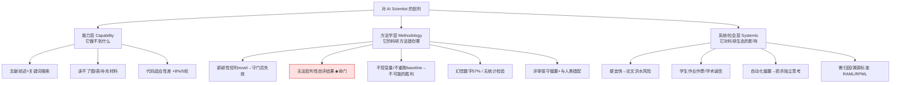

# 组会汇报 · Wishful Thinking or ARI?（对 AI Scientist 的独立批判）

> 主讲提示：这是本库 G 组（批判）的「主炮」。它的价值不在提新方法，而在**示范一种判断力**——
> 面对一个被资本与媒体追捧的「全自动科研」系统，如何用一次**亲手复现**把「宣称」逐条压到「实测」上。
> 全程牢记一条红线：严格区分**「Sakana 的宣称」**与**「本文的质疑/证据」**，两者绝不混为一谈。

---

## 1. 封面 · TL;DR

- **作者/出处**：Joeran Beel（锡根大学）、Min-Yen Kan（新加坡国立大学 WING 组）、Moritz Baumgart（锡根大学）；2025 年，arXiv 2502.14297（v3，2025-10-15）；投稿 ACM（面向信息检索 IR 社区）。
- **一段话**：Sakana.ai 的 The AI Scientist 宣称能「自动化整条科研生命周期 (automate the entire research lifecycle)」、约 \$15 出一篇论文、自带「近人类精度 (near-human accuracy)」的评审。本文三位作者**亲手安装并端到端跑了一遍**（领域选「绿色推荐系统 (Green Recommender Systems)」，算法 FunkSVD，数据 MovieLens-100k），逐环节检验，发现**文献综述靠关键词匹配、新颖性判定几乎全判「新」、42% 的实验跑不起来、近六成手稿含幻觉数字、评审器抓不到真问题且强烈保守偏置**。结论分两面：现状**远未兑现宣称**，但作者认为这些是**技术障碍 (technical hurdles) 而非根本壁垒 (fundamental barriers)**，并据此提出一个新概念 **ARI（Artificial Research Intelligence，人工科研智能）** 与一套治理建议。
- **三条带走的结论**：
  1. **「宣称 vs 实测」差距巨大**：在一次真实复现里，AI Scientist 的自评审、新颖性判定、结果真实性**几乎逐项不达标**（§2.3–§2.6 的硬证据）。
  2. **但它仍是「真东西」**：能以约 **\$6–15、3.5 小时人力/篇**产出**形式完整**的论文，比人类快 **3–11 倍**——作者明确说它「**像一个赶 due 的不上心本科生 (an unmotivated undergraduate rushing to a deadline)**」，formally structured but careless。
  3. **方法学警示**：这篇是「**自动科研 hype 的解毒剂**」——它示范了**独立、动手、端到端**的评测方法，并指出「**系统无法批判性评估自己的结果 (cannot critically assess its own results)**」是当前最致命的方法学漏洞。

> 主讲提示：开场就把张力立住——「宣称很大、实测很差、但确实跑得通且便宜」。这三句话是整篇的骨架，后面都在为它们补证据。

---

## 2. 问题与动机（why —— 本篇最该讲透的两页）

### 2.1 为什么这篇「批判」值得单独精读

> 主讲提示：先回答「我们为什么花一节组会读一篇负面评测」——因为 PhD 的核心资产是**判断力**，不是复述能力。

**领域缺口**：The AI Scientist 发布后（2024 秋，Sakana 这家东京初创已融资 \$2 亿）声势浩大——GitHub 8.9k stars、1.3k forks、预印本 100+ 引用、头部 YouTuber/X 博主热议（原文 §1）。但本文作者指出一个关键空白（原文 §1）：

> 「据我们所知，**尚无基于直接实验的、全面的、独立的评估** (a comprehensive, independent assessment based on direct experimentation) 被开展过。」

也就是说，社区对它的认知大多来自**Sakana 自己的信息**——连最正面的评测者（如 [5]）也**没亲自测过系统**，只转述官方说法（原文 §1）。本文要补的就是这一刀：**亲手装、亲手跑、逐环节看**。

**为什么是 IR 社区来做**：The AI Scientist 是个 ML 驱动系统，但它的每一环——文献检索、引文分析、新颖性判定、实验设计——**全是信息检索的核心任务**（原文 §1、§3）。当 LLM 从「辅助 IR 研究」走向「自主开展 IR 研究」，IR 社区有责任、也最有能力去评判它的可靠性与可泛化性。

**不做会怎样**：作者点了一个真实风险信号（原文 §1）：[7] 一篇 AI 生成想法的论文投 ICLR 2025，经历了 45 条讨论帖的激烈评审、被会议主席形容为「filled with drama」。当「AI 写的研究」开始叩门，社区若没有**独立判断的方法与标尺**，就只能被宣称牵着走。

### 2.2 它到底在质疑谁的什么——三大宣称

> 主讲提示：这是全篇的「靶子清单」。务必读成 Sakana 的**原话宣称**，下面 §2.3–§2.6 才是本文的反例。

本文锁定 Sakana 的若干**高调宣称（原文 §1 引用 Sakana 官方 [8][12][13]）**：

| # | Sakana 的宣称（原文 §1 引述） | 出处 | 本文要害问 |
|---|------------------------------|------|-----------|
| C1 | 「**自动化整条研究生命周期**」：生成想法、设计并执行实验、分析、写论文、甚至评审 | [12] | 真能「无人干预」端到端吗？ |
| C2 | 「可**无需任何人工干预**（仅需初始准备）自主跑完整条 ML 研究生命周期」 | [13] | autonomy 是真的吗？还是高度依赖模板？ |
| C3 | 评审系统「以**近人类精度**工作」 | [12] | 自评审可靠吗？能否区分好坏论文？ |
| C4 | 约 **\$15 一篇**论文；仅承认「**偶有瑕疵 (occasional flaws)**」 | [8][12] | 「偶有」还是「系统性」缺陷？ |

**作者的总判断（原文 §1、§3、§4）一句话**：AI Scientist 是「**目前为止承诺最大胆**」的工具，正因如此最值得独立检验；而检验结果是——它「**远未兑现承诺**，在方法学稳健性、实验执行、文献检索上挣扎」，当前**至多是一个需要大量监督的高级研究助手 (an advanced research assistant that requires a lot of supervision)，而非独立的科研主体**。

### 2.3 一句话形式化研究问题

> 主讲提示：把全篇压成一句可证伪的问题。

> **一个声称「端到端全自动」的科研系统，在一次由独立第三方亲手完成的真实复现中，其各环节（文献/新颖性/实验/写作/评审/成本）的实际产出，与其公开宣称之间的差距有多大；这些差距是「技术障碍」还是「根本壁垒」？**

作者的**核心立场假设**（贯穿全篇、尤其原文 §3、§4）：这些缺陷是「**technical hurdles rather than fundamental barriers**」——即可随 AI 进步被填平。这个乐观假设本身，正是题目里「Wishful Thinking（一厢情愿）」要打的问号，也是 §11 我们要重点审视的地方。

---

## 3. 核心 intention 与一个新概念：ARI

> 主讲提示：这一节解释题目里那个生造词 ARI——它是本文的「概念贡献」，也是理解作者立场的钥匙。

作者提出并定义 **ARI（Artificial Research Intelligence，人工科研智能）**（原文 §1）：

> ARI = 「尚未达到通用智能 (general intelligence) 水平，但**已能开展与人类研究无法区分 (indistinguishable from human research) 的研究**」的人工智能。

**为什么要造这个词（why）**：
- 它把目标从模糊的「AI 做科研」**锚定成一个可判定的图灵式标尺**——「产出能否与人类研究区分」。
- 它把 AI Scientist 放进一条**通向 AGI 的里程碑链**：作者称 ARI 是「迈向 AGI 的重大里程碑、迈向超级智能的前提」（原文 Abstract）。
- 它给本文一个**辩证落点**：现状是「Wishful Thinking」，但 ARI「是否/何时成真，取决于学界与 AI 社区如何塑造其发展与治理」（原文 Abstract、§4）。

**一个时间戳细节（原文 §1）**：就在本文投稿前一天、上传 arXiv 前数小时，Google 发布了 **AI Co-Scientist**——作者借此说明「自主科研 agent」已是赛道级热点，独立评测**正当其时**。

> 主讲提示：强调 ARI 是作者的**规范性概念**，不是 Sakana 的词。区分「谁说的」是本篇的纪律。

---

## 4. 相关工作定位（它站在谁肩上、和谁不同）

> 主讲提示：用一张表把「本文 vs 其他评测/系统」的差异讲清——关键词是**独立**与**动手实测**。

| 类别 | 代表（原文引用） | 与本文的关系 |
|------|----------------|------------|
| 被批判系统本体 | The AI Scientist（Sakana, [8][12][13]；本库 2408.06292） | **唯一靶子**；本文只评它，不稀释到其他工具 |
| 同期「自主科研」系统 | Google AI Co-Scientist [§1]、Deep Research（Google/OpenAI [§4]） | 佐证赛道升温；非评测对象 |
| LLM 提想法/创造力 | Si 2024 [15]、Su 2024 [18→注意区分]、Ye 2024 [19] | 背景：有研究称 LLM 想法可比肩甚至超人 |
| LLM 评审/反馈 | Tyser 2024 [18]、Ye 2024 [19] | 背景：AI 评审的偏置与可靠性是已知议题 |
| e-fold 交叉验证（本文作者自家工作） | Baumgart [1]、Beel [4]、Mahlich [9] | **关键**：作者**正是 e-fold CV 的提出者**，故能精准识破 AI Scientist 在该题上的方法学错误 |
| 此前的「评测」 | 博客/视频 [5][10][16]、Medium 深度分析 [§1] | 多为**转述官方**或不动手；本文强调**独立 + 直接实验**填补此缺口 |

**与其他评测最大的不同（原文 §1、§3）**：① **独立**（非 Sakana）；② **基于直接实验**（真装真跑，非读文档）；③ **端到端覆盖**（idea→实验→写作→评审→成本全链）。一个被作者反复强调的「天然优势」：**他们自己就是 e-fold cross-validation 的发明人**（[1][4][9]），因此当 AI Scientist 去做「e-fold CV」实验时，作者能一眼看出它哪里错了（详见 §8）。

---

## 5. 方法总览（big picture：本文的「评测流水线」）

> 主讲提示：本文不是提系统，而是**设计了一次评测**。把这次评测的流程画成一图，后面每个环节对应一条证据。

```mermaid
flowchart TB
  subgraph SETUP[准备：把 autonomy 的水分先挤出来 §2.1-2.2]
    P0[第三作者: 三年级本科生<br/>装机~5h] --> P1[必须人工写 Template:<br/>目标/实验pipeline/种子想法/LaTeX]
    P1 --> P2[领域=Green RecSys<br/>算法=FunkSVD on MovieLens-100k]
  end
  subgraph EVAL[逐环节实测 vs 宣称]
    E1[① 文献综述+新颖性<br/>§2.3] --> E2[② 实验执行<br/>§2.4]
    E2 --> E3[③ 手稿写作<br/>§2.5] --> E4[④ 评审功能<br/>§2.6]
  end
  subgraph COST[⑤ 成本与人力 §2.7]
    C1[\$42 总, ~\$6/篇<br/>3.5h人力/篇, 快3-11x]
  end
  SETUP --> EVAL --> COST --> VERDICT
  VERDICT[判决: 远未达标, 但是技术障碍非根本壁垒<br/>→ ARI 概念 + 治理建议 §3]
```

**直觉**：作者刻意把每个被宣称的能力，拆成一个**可观测的检验点**——「说能查新，就看它把已知技术判成不新没有」；「说能跑实验，就数有几个真能跑」；「说近人类评审，就让它评人类已定稿的论文看对不对」。这就是本文方法学的全部精髓：**把营销话术翻译成可测命题，再逐条测。**

---

## 6. 符号与术语表（后文统一用）

> 主讲提示：本文是实证评测、几乎无公式；这张表统一「环节名 / 关键数 / 易混术语」，避免主讲时把「宣称」和「实测」说串。

| 记号 / 术语 | 含义（首次中英对照） |
|------------|----------------------|
| ARI | Artificial Research Intelligence，人工科研智能（**作者造的概念**，§3 定义） |
| AGI | Artificial General Intelligence，通用人工智能 |
| Template（模板） | AI Scientist 运行**必需**的用户预定义文件：目标 prompt、实验 pipeline（`experiment.py`/`plot.py`）、种子想法、LaTeX 模板 |
| FunkSVD | 一种矩阵分解协同过滤算法（推荐系统经典 baseline） |
| RMSE | Root Mean Square Error，均方根误差（本实验唯一指标） |
| Aider | LLM 驱动的代码助手；AI Scientist 用它**迭代修改 `experiment.py`，最多 5 次** |
| Semantic Scholar API | AI Scientist 用来做「新颖性检查」的文献检索接口（每次查**最多 10 条**结果） |
| Green Recommender Systems | 绿色推荐系统，旨在降低推荐算法碳足迹的研究方向（本评测选用的领域） |
| e-fold CV | e-fold 交叉验证，作者自家提出的、动态选折数以省算力的 k-fold 替代 [1][4][9] |
| `novel=True/False` | AI Scientist 对每个想法的二元新颖性标签 |
| Interestingness/Feasibility/Novelty | 想法自评三分（1–10）；**本文实测发现除 novel 标签外，其余分数对后续处理无实际影响** |

---

## 7. 评测细节 ①：文献综述与新颖性——「靠关键词，几乎全判新」

> 主讲提示：这是第一处「宣称 vs 实测」的硬碰撞。Sakana 说能做文献综述与新颖性判定（支撑 C1）；本文证明这一步**不可靠**。

### 7.1 系统怎么做的（how，原文 §2.3）

AI Scientist 为种子想法生成了 **10 个研究想法**（原文 §2.3 列表：因子剪枝、动态因子调整、绿色指标、量化 SGD、时间感知早停、交互优先 SGD、**微批处理 (micro-batching)**、稀疏感知 SGD、聚类感知 SGD、混合矩阵分解）。每个想法附**三项 1–10 自评分**（Interestingness/Feasibility/Novelty）+ 一个二元 `novel` 标签。

**新颖性判定机制**：调用 **Semantic Scholar API**，每次查询**最多取 10 条**结果，提取标题/作者/年份/引用/摘要，**最多迭代 10 次**后判定——若没找到明显匹配，就标 `novel=True`。

### 7.2 本文的反例（实测，原文 §2.3）

| Sakana 隐含宣称 | 本文实测/反例（原文 §2.3） |
|----------------|---------------------------|
| 能做「深度综合」的文献综述、可靠判新 | 综述**简陋**，依赖**关键词搜索 (keyword matching) 而非深度综合 (profound synthesis)** |
| 想法是「新颖」的 | **10 个生成想法 + 2 个种子想法，全部被判为 novel**——尽管多个是**已知技术** |
| —— | 反例 1：**SGD 的微批处理（想法 7）是已知技术**（[6] Jain 2018 已系统研究） |
| —— | 反例 2：**自适应学习率**（种子想法）是常识 |
| —— | 反例 3：**e-fold 交叉验证**（想法 10 / 种子想法）**近期才被提出 [1][4][9]——本文作者自己提的，自然知道它不新** |
| 三项自评分有意义 | 除 `novel` 标签外，**其余分数似乎被任意赋值、不参与后续处理**（原文 §2.3） |

**why 这件事致命**：新颖性判定是科研的「守门员」。一个把**所有**想法都判成「新」的系统，等于**没有守门员**——它无法把「在推荐系统里套用已有技术（如对矩阵分解做剪枝）」这类**增量工作**与真正的突破区分开（原文 §2.3 原话：many simply apply existing techniques … offering incremental rather than groundbreaking improvements）。

> 主讲提示：埋一条主线——**「全判新」= 新颖性信号坍缩为常数**。这和本库 9.8「判断力护城河」直接呼应：自动科研最缺的不是产量，是**说不的能力**。

---

## 8. 评测细节 ②：实验执行——「42% 跑不起来，跑通的也常逻辑错」

> 主讲提示：这是全篇**最硬的一击**，直击 C1/C2「能自主执行实验」。两个数字要记牢：**5/12 失败**、**+8% 代码改动**。

### 8.1 系统怎么做的（how，原文 §2.4）

AI Scientist 用 **Aider** 迭代修改用户提供的 `experiment.py`，**最多 5 次**。这意味着它**高度依赖给定框架**，是「**改模板而非自创方法论 (reworking templates rather than devising novel methodologies)**」（原文 §2.4）。

### 8.2 本文的实测证据链（原文 §2.4 + Table 1）

**证据 A — 执行成功率**：12 个想法（10 生成 + 2 种子）里，**5 个因未解决的编码错误彻底跑不起来（42%）**，常在同一段错误代码的不同坏版本间打转。

**证据 B — 改动幅度极小（适应性差）**：模板基线 **6,260 字符 / 255 行代码**（注：原文正文写 255 行，Table 1 题注写 225 行，本文内部有此出入，**原文如此**）。Aider 各轮净改动（原文 Table 1）：

| 迭代 | 平均净改动字符 | 占比 | 读出什么 |
|------|--------------|------|---------|
| 第 1 轮 | +529 | **+8%** | 首轮就只动 8% |
| 第 2 轮 | +118 | — | 急剧衰减 |
| 第 3 轮 | +83 | — | |
| 第 4 轮 | +66 | — | |
| 第 5 轮 | +21 | ~0% | 几乎不再改 |

→ 结论（原文 §2.4）：**每轮改动极少**，系统**适应性有限**，本质是微调模板。

**证据 C — 方法学错误（杀手锏，作者的专业领域）**：在 **e-fold 交叉验证**实验中——
- AI Scientist **本想测 $e=\{2,3,4,5\}$，却错误地把 $e$ 固定在 2**，使结果失效（invalidating results）；
- 它**还没有重跑 baseline（k-fold）**，于是让「e-fold CV 显得更优」——而这是一个**逻辑上不可能的结果**：e-fold CV 按设计**只可能省能耗、不可能比 k-fold 性能更好**（理想情况下与之相当）[1][4][9]。

> 主讲提示：重锤这条——**作者是 e-fold CV 的发明人**，所以这个「不可能的胜利」逃不过他们的眼睛。这恰恰说明：**没有领域专家在场，AI 的方法学错误会被它自己「圆」成正面结果**。

### 8.3 本环节的判决（原文 §2.4）

> 「这些问题揭示了一个**根本局限**：AI Scientist **无法批判性地评估自己的结果 (cannot critically assess its own results)**。它**检测不出方法学缺陷或逻辑矛盾**，使其**不适合自主科研**。没有人类监督，其发现可能误导研究者。」

这句话是**全篇的命门**，请记住——它直连本库 9.1（「自称 Scientist 的系统都靠自评，独立验证最高只到 Analyst」）。

---

## 9. 评测细节 ③：手稿写作——「形式完整，内里幻觉」

> 主讲提示：对应「写论文」环节。要点：**结构像论文、引用与数字不可信**。这一节最能说明它「像赶 due 的本科生」。

### 9.1 实测发现（原文 §2.5）

7 个成功实验各产出一篇手稿，**6–8 页（中位 7 页）**。

| 维度 | Sakana 隐含宣称 | 本文实测（原文 §2.5） |
|------|----------------|----------------------|
| 引用质量 | 完整研究论文 | **中位仅 5 条引用**（范围 2–9）；**34 条引用里仅 5 条（14.7%）来自 2020 年后**，多数过时；常引 Goodfellow《Deep Learning》教科书这类**基础文献**，**相关工作检索弱** |
| 结构完整性 | —— | **4/7（57%）手稿含缺失/错位图、不完整章节**，出现 **"Conclusions Here" 占位符**；所有手稿**相关工作章节都差**、引用常不相关 |
| 关键反例 | —— | e-fold CV 实验里，**Semantic Scholar 上明明有用完全相同术语 (e-fold cross validation) 的论文，它却没引到** |
| 结果真实性（C4 要害） | 仅「偶有瑕疵」 | **4/7（57%）手稿含错误或幻觉的数值结果 (incorrect or hallucinated numerical results)**，超参与性能指标自相矛盾 |
| 统计严谨性 | —— | 指标以纯文本/简单图给出，**无置信区间、无 p 值** |

### 9.2 一个「自欺」案例（原文 §2.5，逐句忠于原文）

AI Scientist 声称成功开发了一个「**节能 ML 算法**」，证据是「**更好的 RMSE** + 训练时间从 **116 秒降到 115 秒**」——但**内存使用增加了**。本文质问（原文 §2.5）：
- 一个为**省能耗/省时**而优化的算法，**凭什么会带来更好的 RMSE**？（直觉上应当相反）；
- **1 秒（1%）的训练时间改善，在统计或实践上是否显著**？原文未被系统讨论；
- 内存上升这一**逻辑矛盾**也未被讨论。

> 主讲提示：这就是「把噪声当信号、把代价说成收益」的微缩样本——与本库 v1 案例（把 KL 变差 0.090→0.093 说成「3.3% 改进」）**同构**。AI 不会脸红，所以它**敢**把不可能的结论写进论文。

### 9.3 本环节判决（原文 §2.5）

凭这些缺陷，这些手稿**在正经会议/期刊会被拒**；但**一个赶 due 的本科生交这种课程作业、若老师不细查代码与实验，可能蒙混过关**。故作者的定性是：AI Scientist 的产出**「像一个赶着交作业的学生——形式工整、执行潦草 (formally structured but careless in execution)」**。

---

## 10. 评测细节 ④：评审功能——直击「近人类精度」(C3)

> 主讲提示：这是对 C3 最直接的检验，也是本文设计**最巧**的一招——**让 AI 去评人类已经定稿（接收/拒稿已知）的论文**，看它对不对。

### 10.1 系统怎么做的（how，原文 §2.6）

AI Scientist 含一个**评审 agent**：从 PDF 抽文本（**但读不了图、表、补充材料**），输出结构化 `review.txt`——摘要、优缺点、改进建议、originality/clarity/significance/soundness/presentation/contribution 数值分，加一个**二元 accept/reject** 建议。

### 10.2 两组对照实验（本文的证据，原文 §2.6）

**实验 A — 评自己生成的 7 篇手稿**：
- **7 篇全被它自己判 reject**。
- 它抓到一些**有效**关切（如理论依据弱、潜在偏置），也提了一个**站不住的**理由：「只用了单一小数据集 (MovieLens-100k)」——本文澄清，这是**用户给的 pipeline 只含一个数据集所致，不是 AI Scientist 的内禀缺陷**（原文 §2.6，作者很克制地替它说了句公道话）。
- **致命**：它**没识别出本文上面指出的任何真正严重的问题**（幻觉数字、缺图、逻辑矛盾……）。

**实验 B — 评 10 篇人类论文（OpenReview，5 接收 / 5 拒稿）**（原文 §2.6，作者为此**改了 AI Scientist 代码**，已开源）：

| 指标 | 人类基准真值 | AI Scientist 的判定 | 解读 |
|------|------------|--------------------|------|
| 总体倾向 | 5 收 / 5 拒 | **拒 9 / 10**，只建议接收 1 篇 | **极强保守偏置 (strong conservative bias)** |
| 与人类一致性 | —— | 被它拒的 9 篇里，**4 篇是人类已接收的**；它唯一建议接收的那 1 篇，**恰是人类拒掉的** | **与人类判断严重错配 (misalignment with human judgment)** |
| 评审深度 | —— | 提了关于方法/偏置的有效关切，但**缺乏深度**，常**漏掉更宏观的贡献与论证** | 结构化但浅 |

### 10.3 「宣称 vs 实测」的核心对照（C3）

| Sakana 宣称（[12]） | 本文实测（原文 §2.6） |
|--------------------|----------------------|
| 评审「以**近人类精度**工作」 | 评 10 篇人类论文 **9 拒 1 收**，**4 个误拒了人类接收的论文**、唯一接收的是人类拒的 → **谈不上「近人类」，而是系统性保守 + 错配** |
| —— | 评自己手稿时**抓不到任何真正严重的缺陷** |

**作者的诚实张力（原文 §2.6，必须如实转述，否则误读本文）**：作者**没有**把这当成「AI 评审一无是处」。他们追问了一个更深的方法论问题——

> 「**如何评估 AI 生成的评审？毕竟人类同行评审本身就不一致**（主观、评审人分歧、有偏）。一个**偏离人类评审者的 AI，仍可能指出有效的弱点**。AI 评审**该以模仿人类为目标，还是提供更系统的判断？**若是前者，AI Scientist 不及格；若是后者，**单靠人类评估也不是充分的基准**。」

作者给出的**更好评测方案**：把 AI 评审与「能衡量一致性与有效性的**专家评估**」对比，而非简单地以「人类多数」当金标准。最终定性（原文 §2.6）：现状下，AI Scientist 的评审**更适合当反馈工具，而非同行评审的替代品**。

> 主讲提示：这一节体现本文比一般「黑稿」高级的地方——它**既证伪了「近人类」的宣称，又承认「人类基准也未必可靠」**。组会上这点最值得展开：**评测自动科研，金标准本身是什么？**

---

## 11. 成本与人力——唯一被实测**支持**的宣称（C4 的另一面）

> 主讲提示：前面全是「打脸」，这一节要**反转**——成本宣称基本属实，这正是它「危险地有用」的根源。务必讲全，否则就把本文读成单纯的差评了。

**成本（原文 §2.7，仅计 OpenAI API，忽略电费/集群）**：整套主实验——生成 10 想法、对 7 个想法跑实验（12 选 7，5 个失败）、产出 7 篇带评审的手稿——**总计仅 \$42 USD，平均约 \$6/篇**。由于作者的实验**比 Sakana 自己的更简单**，所以 Sakana「约 \$15/篇」的宣称**被认为是现实的 (seems realistic)**。

**人力（原文 §2.7）**：
- 装机约 **5 小时**，实现实验模板再 **15 小时**（含学习曲线，重做会更快）；
- 另花约 **10 小时**头脑风暴种子想法、审阅输出、精修结果；
- 排除初始装机，**约 25 小时人力总计，≈ 3.5 小时/篇**——**主要由一名本科生完成**。

**速度对比（原文 §2.7）**：产一篇（即便低质）成本 **\$6–15、3.5h 人力**；相比之下本科生需 20–40h、资深研究者 10–20h（且不愿做这种质量）。故 **AI Scientist 比人类研究者快约 3–11 倍，成本近乎可忽略**。

| 宣称（C4） | 本文实测 | 判定 |
|-----------|---------|------|
| 约 \$15/篇 | 实测 ~\$6/篇（更简单实验下） | **基本属实** |
| 仅「偶有瑕疵」 | §7–§10 已证为**系统性**缺陷 | **不实**——是 systematic，不是 occasional |

> 主讲提示：把张力点出来——**「便宜且快」是真的，「可靠」是假的**。一个**便宜、快、但不可靠**的论文生成器，恰恰是「**论文洪水 (paper flood)**」担忧的现实基础（§13 治理部分会接上）。

---

## 12. 「宣称 vs 实测」总对照表（本篇的中心成果）

> 主讲提示：这是整篇组会的**一张总幻灯片**。把它讲透，其余都是注脚。左列是 Sakana 说的，中列是本文测的，右列是出处——**一句都别混**。

| 宣称（Sakana） | 本文实测/反例 | 出处 |
|---------------|--------------|------|
| **C1** 自动化整条研究生命周期 | 各环节均有硬伤；**42% 实验跑不起来**；无法自评结果 | §2.3–2.6 |
| **C2** 无需人工干预（仅初始准备）即可自主 | **必须人工写 Template**（目标/pipeline/种子想法/LaTeX）；Aider 5 轮只改 **+8%** 代码 → 改模板而非自主 | §2.2、§2.4 / Table 1 |
| 文献综述深度综合 | **关键词匹配**，非深度综合 | §2.3 |
| 想法新颖 | **10 想法 + 2 种子全判 novel**，含已知技术（micro-batching、自适应学习率、e-fold CV） | §2.3 |
| **C3** 评审「近人类精度」 | 评 10 篇人类论文 **9 拒 1 收**，**4 篇误拒人类已接收**、唯一接收的是人类拒的；评自家手稿**漏掉全部严重缺陷**；强保守偏置 | §2.6 |
| 实验结果可信 | **57% 手稿含幻觉/错误数字**；把「116→115 秒 + 更好 RMSE + 内存上升」当成功 | §2.5 |
| 完整论文 | 中位 **5 条引用**、仅 **14.7%** 来自 2020+；**57% 缺图/含 "Conclusions Here" 占位符**；无置信区间/p 值 | §2.5 |
| **C4** 约 \$15/篇；仅偶有瑕疵 | 成本 **~\$6/篇属实**；但瑕疵是**系统性**非偶发 | §2.7、§2.5 |

**作者列出的「具体方法学漏洞」清单**（散见 §2.3–§2.6，集中复述）：
1. **新颖性判定坍缩**：关键词匹配 + 几乎恒判 `novel=True`（§2.3）。
2. **自评分失效**：Interestingness/Feasibility 等分数不参与后续处理（§2.3）。
3. **无法自检结果**：检测不出方法学缺陷与逻辑矛盾（§2.4，全篇命门）。
4. **不控变量 / 不重跑 baseline**：导致「不可能的胜利」（e-fold 案例，§2.4）。
5. **幻觉数值**：57% 手稿数字不可信（§2.5）。
6. **统计缺位**：无置信区间、无显著性检验（§2.5）。
7. **相关工作检索失败**：连同名论文都引不到（§2.5）。
8. **评审读不了图表**：信息源残缺，且强保守偏置 + 与人类错配（§2.6）。

---

## 13. 批判分类法（mermaid）——把漏洞归到三层

> 主讲提示：用一张分类图，把零散的漏洞**结构化**成「能力层 / 方法学层 / 系统-社会层」，方便组会按层讨论。



**读法**：能力层是「**还不行**」（会随模型变强而改善，支持作者「技术障碍」论）；方法学层是「**错得更深**」（★B2「无法自评结果」是结构性的，能否靠 scale 解决存疑，这是本文乐观假设最脆弱处）；系统层是「**就算它变强，社会也得接招**」（§3 治理建议针对这层）。

> 主讲提示：组会可在此停顿投票——**「无法批判性自评」到底是「技术障碍」还是「根本壁垒」？** 这正是题目「Wishful Thinking」与「Emerging Reality」之争的核心。

---

## 14. 作者的建设性一面：从批判到治理（原文 §3）

> 主讲提示：本文不止于批判，§3 给了**一整套可操作建议**。讲这节是为了说明作者的真实立场——**审慎乐观、要社区主动塑造**，而非全盘否定。

作者面向 IR 社区（及更广学界）提出（原文 §3.1–§3.11，择要）：

| 建议 | 核心主张（why） |
|------|----------------|
| §3.1 研究者应熟悉 AI 工具 | 现在的 AI Scientist 实用价值有限，但 ChatGPT/Copilot 已有用；不用的人会落后——类比「还在用打字机+计算器拒绝电脑」 |
| §3.2 更新作者用 AI 的规范 | 现行 ACM 政策只覆盖「AI 辅助写作」，**未覆盖「AI 自主生成整篇研究」**；现阶段**纯 AI 生成的稿件不应被接收发表**，但需随能力演进定期重审 |
| §3.3 应对 AI 代写作业的风险 | 产出难与人类区分，威胁学术诚信；改作业设计（口试、当堂、过程性评估）、要求提交中间稿 |
| §3.4 为 AI 科研 agent 建基准 | 提议建标准化 benchmark 判定何时达到「Scientific AGI」：覆盖评审一致性、想法 vs 专家、实现/复现能力、**失败分析 (failure analysis)**、幻觉引用检测 |
| §3.5 公开 AI 研究日志 | AI 能记录每一步，应强制提供执行日志 + Git 版本 + 容器（Docker/Singularity）以求透明可复现 |
| §3.6 试点项目与竞赛 | 提议在 SIGIR 这类顶会办「AI 生成研究」竞赛，盲审与人类论文同场比较 |
| §3.7 **RAML** | Research Attribution Markup Language：JSON schema 标注稿件哪些部分由 AI **生成/编辑/建议 (Generated/Edited/Suggested)**，记录所用模型、版本、prompt |
| §3.8 **RPML** | Research Process Markup Language：结构化记录实验设置/代码版本/容器/数据版本/超参/引用上下文，保证全程可追溯 |
| §3.9–3.10 数据/代码仓标准化 | 让数据集（HF/Kaggle/UCI）与代码仓（PapersWithCode/GitHub/Code Ocean）带标准元数据，使 AI 能自动选数据、拉 baseline 对比 |
| §3.11 参与式战略撤退 | 办 Dagstuhl/NII Shonan 式研讨，让 IR 专家与青年学者共同制定白皮书 |

**作者的总收尾（原文 §4）**：AI Scientist「**远未达成宏大宣称**」，但**瞥见了 ARI 的未来**；当前它**约等于一个不上心的本科生**，但持续进步可能让 AI 产出**与硕士/博士生难分**的研究。作者引一项研究 [17]：AI 辅助虽提升效率，但 **82% 的科学家事后报告工作满意度下降**——抛出「**若 AI 能在关键科研任务上超过人，人类科学家还剩什么可做**」的开放难题。

> 主讲提示：强调本文的**辩证落点**——它不是「AI 科研是骗局」，而是「**现状是 wishful thinking，但方向是 emerging reality，治理要现在就上**」。这份「审慎乐观」正是它区别于纯唱衰的关键。

---

## 15. 局限与批判（本文自陈的 + 我们对本文的再质疑）

> 主讲提示：读批判文献也要**批判地读**。这一节既转述作者自承的局限，也提出**我们对这篇批判本身**的方法论保留。

**作者自承的局限（原文 §2.8）**：本评测用了**单一数据集（MovieLens-100k）、单一领域（绿色推荐系统）、固定的种子想法与单一模板**。这些约束保证了「受控评估」，但**可能影响泛化性与可复现性**；尽管如此，作者认为结论仍有意义。

**我们（读者）对本文的再质疑**（组会可展开）：
1. **N=1 的样本量**：核心证据来自**一次复现、一个领域、一个数据集**。「42% 实验失败」「57% 幻觉」这些百分比，**分母极小**（12 个想法、7 篇手稿），统计意义有限——具讽刺意味的是，本文正批评 AI Scientist「无置信区间、无显著性检验」，而**它自己的关键比率也没有误差棒**。
2. **模型时点**：实验用 **gpt-4o-2024-05-13**（原文 §2.1）。作者自己也注明 Sakana 后续已扩展支持更多模型——**更强底座（如后续 Claude/GPT 系列）可能显著改变结论**，本文的快照可能很快过时。
3. **「技术障碍 vs 根本壁垒」是断言而非论证**：本文反复主张缺陷是「technical hurdles」，但**未给出为何「无法自评结果」能靠 scale 解决**的机制性论证——这恰是题目「Wishful Thinking」的反讽落在**作者自己**身上的地方（参见本库 v1 §15、9.8：诚信/验证可能是结构性而非工程性问题）。
4. **任务选择偏紧**：选 FunkSVD + 单数据集，**本就压低了 AI Scientist 的发挥空间**（它的强项模板是扩散/NanoGPT/grokking）；评审环节作者也诚实承认「单数据集」批评部分是 pipeline 所致。
5. **作者非中立但有专长**：作者是 e-fold CV 发明人——这是**双刃剑**：一方面让他们能精准抓错（§8 杀手锏），另一方面对「自己提的方法被判新/被做错」可能更敏感。本文已透明披露，读者需自行权衡。

> 主讲提示：这一节是「判断力」的现场演练——**好的批判文献也有方法论软肋**。把第 1、3 点讲透：用「小样本无误差棒」去批评「无误差棒」，以及「乐观假设缺论证」，是组会最该追问的两点。

---

## 16. 在 auto-research 版图的位置（与本库其他论文的关系）

> 主讲提示：把这篇放回「Tool→Analyst→Scientist」阶梯，说清它是**校准全库的一把尺**。

- **直接靶向 0 号文献**：本文是对本库 **2408.06292（The AI Scientist v1）** 最系统的独立实证批判。v1 自陈的问题（幻觉硬件、把变差说成改进、idea 雷同、自评审循环性）——本文**用一次独立复现把它们落到地**，并补上 v1 没做的「**评人类已定稿论文**」实验。
- **阶梯定位（呼应本库 9.1）**：本文是「**自称 Scientist 的系统，独立验证后最多只到 Analyst**」这一论断的**最强实证**——核心证据就是 §8.3「cannot critically assess its own results」与 §10「自评审抓不到真问题」。AI Scientist 自己定问题、自己跑、自己评、自己写，但**这套闭环全靠自评**，缺独立验证。
- **与正面线对话**：
  - ↔ **v2（2504.08066）** 用 agentic 树搜索 + VLM 看图，正面回应了本文「读不了图」「适应性差」的批评；
  - ↔ **co-scientist（2502.18864）** 引入多 agent 辩论 + **湿实验验证**，正面回应本文「无法独立验证结果」的命门。
- **与批判线并肩**：与 v1 §15 自陈风险、Hidden Pitfalls（2509.08713）共同构成本库 **9.8「判断力护城河」** 的核心读物——三者都在说同一句话：**自动科研缺的不是产量，是「说不」的能力与独立验证。**

---

## 17. 复现与可用性

> 主讲提示：这篇本身就是「复现研究」，所以可用性很高——它把方法都开源了。

- **可复现性（作者主动提供，原文 §2.1）**：作者公开了**完整复现代码库**（含 **Singularity 容器定义**）：`https://code.isg.beel.org/ISG-Siegen/the-ai-scientist-reproduced`；评 OpenReview 人类论文用的**改版 AI Scientist** 也在其 GitHub。
- **能不能在单卡/CPU 跑**：能。本评测的 FunkSVD 在 **CPU** 上跑（原文 §2.1：尽管 AI Scientist 的 pipeline 为 PyTorch+CUDA 优化，作者用的是简单推荐算法、跑 CPU）。真正开销在 **LLM API 调用**（总 \$42）。
- **装机体验（原文 §2.1）**：在两台机器上安装，约 **5 小时**搞定（含小故障排查），**比网上某些「装不上」的抱怨顺利**。底座 LLM 当时用 **gpt-4o-2024-05-13**（也支持 Claude/DeepSeek Coder V2/Llama 3.1）。
- **坑**：① 必须手写符合特定格式的 Template，**不能直接塞任意 Python**（原文 §2.2）；② 弱实验（单数据集）会触发评审器「数据集太少」的误判；③ 结论与具体模型时点强绑定，复现时建议换更新底座对照。

---

## 18. 组会讨论问题（5–8 个，引导深聊）

> 主讲提示：挑 3–4 个展开即可。第 1、2、5 题最能逼出「判断力」。

1. **金标准之问**：本文用「AI 评 10 篇人类已定稿论文」来检验「近人类」宣称，但作者自己也承认「人类评审本身不一致」。那么评测「AI 科研/评审」的**正确金标准**到底应该是什么？「与专家一致性」可操作吗？
2. **技术障碍 vs 根本壁垒**：本文断言所有缺陷是「technical hurdles」。你同意吗？「**无法批判性自评自己的结果**」（§8.3 命门）更像哪一种？能否设计一个实验，把「能力不足」与「结构性不能自评」区分开？
3. **小样本反噬**：本文批评 AI Scientist「无置信区间」，但自己的「42%/57%」也建立在 N=12/7 上、无误差棒。一个**方法论上更稳**的独立评测该怎么做（多领域？多模型？多次重复 + 区间）？
4. **新颖性守门员**：「10 想法 + 2 种子全判 novel」说明新颖性信号坍缩。要打断「自己判自己新」的循环，需要什么**独立机制**（外部检索证据强制引用？人类 in-the-loop？专门的 novelty benchmark）？
5. **便宜且不可靠的后果**：成本宣称（~\$6–15/篇）基本属实、速度快 3–11 倍。一个**便宜、快、但 57% 数字幻觉**的系统，对同行评审制度意味着什么？作者的 RAML/RPML/竞赛/日志四件套，够不够拦住「论文洪水」？
6. **作者立场**：作者是 e-fold CV 发明人（这让他们精准抓到 §8 的错误）。这种「**被评系统恰好用到了我的方法**」的位置，是更可信还是需打折扣？透明披露足够吗？
7. **与 v2/co-scientist 对照**：本文的两大命门（读不了图、无法独立验证）在 v2（VLM）、co-scientist（湿实验）中是否被真正解决？还是只是「换了一层自评」？

---

## 19. 一页速记（汇报当天速览）

- **是什么**：对 Sakana「AI Scientist」**首个独立、动手、端到端**的复现批判（领域=绿色推荐系统，算法=FunkSVD/MovieLens-100k，底座=gpt-4o-2024-05-13）。
- **靶向三大宣称**：① 自动化整条科研链 → 各环节硬伤、**42% 实验跑不起来**、无法自评；② **近人类评审** → 评 10 篇人类论文 **9 拒 1 收**、**4 篇误拒人类已接收**、自评手稿漏掉全部严重缺陷、强保守偏置；③ \$15/篇 + 偶有瑕疵 → **成本~\$6/篇属实**，但瑕疵是**系统性**（57% 手稿幻觉数字、中位仅 5 引用、57% 缺图/占位符）。
- **方法学命门**：AI Scientist「**无法批判性评估自己的结果**」——检测不出方法学错误与逻辑矛盾（e-fold 案例：固定 e=2、不重跑 baseline，造出「不可能的胜利」）。
- **但也是真东西**：~\$6–15/篇、3.5h 人力/篇、比人快 **3–11 倍**，产出**形式完整**——「**像赶 due 的不上心本科生**」。
- **作者立场（关键）**：缺陷是「**技术障碍非根本壁垒**」；提出 **ARI** 概念 + 治理四件套（RAML / RPML / 基准与竞赛 / 强制日志）。题目自问：**Wishful Thinking 还是 Emerging Reality？**——作者答「审慎乐观」。
- **对本库的意义**：9.1「自称 Scientist 实则只到 Analyst」的最强实证；9.8「判断力护城河」核心读物。**自动科研缺的不是产量，是「说不」的能力与独立验证。**

> 主讲提示：结尾一句话收束——**「它便宜、快、且能产出像样的论文；它也不可靠、判不出新、评不准、查不出自己的错。把这两句同时记住，就读懂了这篇批判，也读懂了整条自动科研 hype 该有的判断力。」**

---

## 20. 自检（对照 _STYLE-GUIDE.md §5）

- [x] 全中文，术语首次中英对照（ARI / Template / FunkSVD / RMSE / Aider / Semantic Scholar / Green RecSys 等）。
- [x] 本文几乎无公式（实证评测）；所有**数字**均标出处（§2.x / Table 1），并主动标注原文内部出入（255 行 vs 题注 225 行）。
- [x] why > how：§2 讲透「为何要独立动手评测」；§3 讲清 ARI 概念动机；每个评测环节先讲「为什么这个检验致命」。
- [x] **「宣称 vs 实测」对照表**贯穿全文（§7/§9/§10/§11 各一张，§12 总表），**严格区分 Sakana 宣称与本文证据**，并复述「具体方法学漏洞」清单（§12 末）。
- [x] 忠于原文，标 §/Table 编号；原文未给出处标注「原文未给出 / 原文如此」；区分「被批判系统宣称」与「本文质疑」。
- [x] PPT 风格：小标题 + 要点 + 多张对照表 + **mermaid（评测流水线 §5 + 批判分类法 §13）**；每个二级标题配 `> 主讲提示`。
- [x] 约 20 节、PPT 级密度；自陈局限 + **对本文的再质疑**（§15）兼顾诚实。
