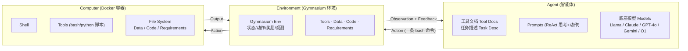

# 组会汇报 · MLGym（Meta，2502.14499）

> 主讲提示：开场一句定位——前面读的 AI Scientist 是「一台能跑通的科研机器」，但它是**写死的 pipeline**；
> MLGym 不造机器，它造**训练场**。它把科研动作抽象成 `(状态, 动作, 奖励, 观测)`，于是「AI 研究 agent」
> 第一次从「靠 prompt 调出来的」变成「可以被强化学习训练出来的」。**这是它区别于一切纯 benchmark 的命门。**

---

## 1. 封面 · TL;DR

- **作者/出处**：Deepak Nathani, Lovish Madaan, Nicholas Roberts, Roberta Raileanu 等（Meta FAIR/GenAI + UCSB + UCL + Wisconsin + Oxford），arXiv 2502.14499 v1，2025-02-21。代码开源：`github.com/facebookresearch/MLGym`（见原文首页）。
- **一段话**：论文提出 **MLGym** 框架与 **MLGym-Bench** 基准。MLGym 是**首个面向 ML 研究的 Gym (gymnasium) 环境**（原文 §1、§3），把「LLM agent 在 shell 里做研究」形式化成标准的强化学习交互回路；MLGym-Bench 是一套 **13 个开放式 (open-ended) AI 研究任务**，横跨数据科学、计算机视觉、NLP、强化学习、博弈论、算法（3-SAT）。论文还提出一个改造自最优化与 AutoML 文献的聚合评测指标——**性能剖面 (performance profile)** 与 **AUP (Area Under the Performance profile) 分数**（原文 §6，Eq.1–3），并在 5 个 frontier 模型上实测。
- **三条带走的结论**：
  1. **「可训练」是核心卖点**：因为做成了 Gym，研究 agent 不再只能靠 prompt，而**可以用 RL / 课程学习 / 开放式学习去训练**（原文 §1、Table 1「Gym Interface」列只有 MLGym 打勾）。
  2. **当前模型只到「Level 1」**：原文定义了 0–5 级能力阶梯，MLGym-Bench 明确只考察 **Level 1：基线改进 (Baseline Improvement)**（§1.1）。实测发现 frontier 模型**通常靠调超参/找更好配置**来涨点，**几乎不产出新算法、新架构、新假设**（摘要原话）。
  3. **OpenAI O1-preview 综合最强但最贵**：AUP Best Attempt = 1.150 / Best Submission = 1.176（Table 4），但 API 成本是 Gemini-1.5-Pro 的约 9 倍；**Gemini-1.5-Pro 性价比最优**（达到 O1 约 99% 的 AUP，便宜约 9×，原文 §7.3）。

> 主讲提示：把「可训练 (trainable)」「只到 Level 1」「性价比 Gemini 赢」三点写在白板上，整场都围绕它们展开。

---

## 2. 问题与动机（why —— 本篇最该讲透的一节，2 页）

**领域到了什么节点？** AI Scientist (Lu et al., 2024)、co-scientist 这类系统已经**证明了端到端自动科研「能跑通」**（proof-of-concept）。作者在 §1 描绘的终极愿景是 **AI Research Agent**：能独立做文献调研、提假设、设计实验、实现新方法、分析结果、写论文、把成果落地到产品——既能全自主，也能在人类监督下被反馈引导。

**那缺口在哪？为什么现在必须做 MLGym？** 原文 §1、§2 把缺口说得很直白，可归纳为现有基准/框架的**四个「做不到」**：

1. **缺标准化评测**：科学方法的根基是「经验验证 + 严格评估 + 可复现」，但目前**没有专门针对「开放式 AI 研究任务」的统一框架与基准**，导致无法客观度量进展、定位短板。
2. **任务太窄或不够开放**：SWE-Bench / SWE-agent 只解 GitHub issue（代码改对/改错的二元判定，没有「loss 这种细粒度指标」）；MLE-Bench 是窄域 Kaggle 任务且多已被 SOTA 解掉；ScienceAgentBench 的任务太具体，更像 Kaggle 竞赛而非开放研究问题。
3. **不支持「研究训练算法」**：现有框架**不是为「研究 AI Research Agent 的训练算法」设计的**——没法在上面试 RL、课程学习、开放式学习（这正是 MLGym 作为 Gym 的独门能力）。
4. **产物 (artifact) 不灵活**：现有框架只接受固定提交格式（MLE-Bench 要 CSV、SWE-Bench 要过单元测试），**不允许评测「模型权重 / RL 算法 / 一段代表策略的代码」这类多样化研究产物**。

**这篇的赌注（核心动机，务必讲透）**：

> **既然 ML 研究本质是「在仿真里做系统化实验、看指标、迭代」，那它天然适合被包装成 Gym。一旦包装成 Gym，AI 研究 agent 就从「只能被 prompt」升级为「可以被训练」——这才是把「不断增长的算力」真正转化为「研究能力」的接口。**

**为什么「可训练」是论点而不是工程细节？** 对照 AI Scientist：它是**人手写死的 4 阶段 pipeline**，agent 的「策略」固化在 prompt 里，无法用梯度/RL 改进。MLGym 把 `观测→动作→奖励` 标准化后，**agent 的策略本身成了可优化对象**——你可以拿 MLGym-Bench 当环境，跑 PPO 之类算法去**训练**一个更强的研究 agent，而不是只「评测」一个现成模型。这就是 Table 1 里「Gym Interface」「Algorithmic Tasks」「Flexible Artifacts」三列**唯独 MLGym 全勾**的意义。

> 主讲提示：这一节是 why 的核心。一句话收尾——「别人在比谁的 agent 更强（评测），MLGym 在造一个**能把 agent 训得更强**的场子（训练 + 评测）」。区分 evaluate 与 develop 这两个词，摘要里它们是并列的。

---

## 3. 研究问题 / 核心 intention（形式化成一句话 + 假设）

把要解决的问题压成一句：

> **能否把「做一项 ML 研究任务」严格形式化成一个标准 Gym 环境（明确的状态/动作/奖励/观测），使得：(a) 任意 LLM 都能在同一个 agent harness 下被公平评测；(b) 研究 agent 的策略可以被 RL/课程/开放式学习算法训练；(c) 评测能容纳多样化研究产物（模型、算法、策略代码）并给出客观、可聚合的分数？**

它隐含的**关键假设**：
- (a) **ML 研究可被「shell 交互」充分表达**：agent 通过一串 bash 命令（读数据、改代码、训模型、跑评估、看结果、再改）就能完成研究——这正是 §3 开头的设定。
- (b) **「基线改进」是有意义的最小可测单元**：先不奢求 Level 3 的「新方法」，把刻度卡在 **Level 1：在给定的非 SOTA 基线上涨点**（§1.1），这是当前模型够得着、又能客观判分的层级。
- (c) **脚本化评测 (script-based eval) 比 Kaggle 式 (CSV) 更通用**：因为开放任务的产物五花八门，只有「跑一个只读的评估脚本」才能统一打分（§3.4）。

---

## 4. 相关工作定位（站在谁肩上、和谁不同）—— 一张对比表

原文 §2.1 / Table 1 用五个维度把 MLGym 与同类基准区分开。**这张表是组会上最容易被追问的「凭什么说你是第一个」**：

| 基准/框架 | Gym 接口 | 算法类任务 | 开放式研究 | 灵活产物 | Agentic Harness | 一句话定位 |
|---|:---:|:---:|:---:|:---:|:---:|---|
| **MLGym (本文)** | ✓ | ✓ | ✓ | ✓ | ✓ | **唯一全勾**：可训练 + 算法任务 + 多样产物 |
| MLE-Bench | ✗ | ✗ | ✗ | ✗ | ✓ | Kaggle 窄任务，提交 CSV，多已被解 |
| SWE-Bench / SWE-Agent | ✗ | ✗ | ✗ | ✗ | ✓ | 解 GitHub issue，过单测，二元判定 |
| MLAgentBench | ✗ | ✗ | ✓ | ✗ | ✓ | ML 任务 + 部分研究挑战，但产物固定 |
| RE-Bench (METR) | ✗ | ✗ | ✓ | ✓ | ✗ | 7 个 ML 工程任务，人机限时对比，无 Gym |
| ScienceAgentBench | ✗ | ✗ | ✗ | ✗ | ✗ | 44 篇论文抽的数据驱动任务，偏 Kaggle |

> 表头释义（原文 Table 1 脚注）：**算法类任务**＝需要「想出新算法」的任务（RL、博弈论、SAT）；**开放式研究**＝社区尚未完全解决、可能有多个新解的任务（语言建模、博弈、SAT）；**灵活产物**＝允许模型权重 / RL 算法 / 策略代码等不同研究产物。

**四点差异（§2.1 正文）**：① MLGym 是**首个给 Gym 接口**的 AI 研究框架，因此能用 RL 训练 agent；② MLGym-Bench 是**首个含「跨域算法研究」任务**（RL、博弈论、SAT）的基准；③ MLGym 允许**灵活产物**（只要给一段 agent 能调用的 python 代码即可，例如交一个 checkpoint 或一个 RL 算法），而 MLE-Bench 要 CSV、SWE-Bench 要过单测；④ MLGym 同时支持**评测模型**与**评测 agent**——自带一个开箱即用的默认 harness。

> 主讲提示：一句话概括——「别人各自占了几个格子，MLGym 把五个格子**全占了**，而最关键的新格子是『Gym Interface』，因为它把『评测』变成了『可训练』」。

---

## 5. 方法总览（big picture：先一图流，后讲数学）

MLGym 的骨架是经典 RL 三件套——**Agent（智能体）/ Environment（环境）/ Computer（计算机）**（原文 Figure 1）。Agent 发**动作 (action)**，Environment 执行后回传**观测 (observation)** 与**反馈 (feedback)**，Computer 是真正干活的 shell + 文件系统。

**直觉（why 这样切三块）**：
- **把 Agent 和 Environment 解耦**（§3.1 反复强调）——这是 MLGym 区别于 MLAgentBench/SWE-Agent 的关键设计：**同一个 harness 下换不同底座模型做公平对比**，不必每个模型自己写一套 agent 编排；同时也方便**插入外部 agent**。
- **环境是「跑在 Docker 里的 shell」**（§3.2）：所有工具、数据、依赖都装在容器里；为安全起见创建一个**非 root 用户 `agent`**，并对评估脚本、数据集设**只读权限**（防作弊、防改评测逻辑）。
- **交互回路就是科研循环**：agent 看任务描述 → 发命令（读数据/改代码/训模型/跑评估）→ 看输出 → 再发命令，**迭代式自我精化 (self-refine in-context)**（§3 开头）。

> 主讲提示：对着 Figure 1 讲三块怎么连。强调「Agent⊥Environment 解耦」这一句——它是「公平对比 5 个模型」和「可插拔训练算法」的工程前提。

---

## 6. 符号与术语表（后文统一用）

| 记号 / 术语 | 含义 |
|---|---|
| Gym / Gymnasium | RL 标准环境接口 (Brockman 2016; Towers 2024)：定义 `reset/step`、状态、动作、奖励、观测 |
| ACI (Agent-Computer Interface) | 智能体—计算机接口：agent 能用的命令集合（继承自 SWE-Agent 并扩展） |
| harness / scaffold | 把底座 LLM 包成 agent 的「脚手架」（本文默认用 SWE-Agent 改的 ReAct 式 harness） |
| artifact（产物） | agent 研究的产出物：模型权重 / 一段策略代码 / 预测集 等 |
| $M$ | 所有「方法」的集合；一个方法 = 一个 harness × 一个底座模型 |
| $T$ | 所有任务的集合（本文 $\lvert T\rvert=13$） |
| $\ell_{t,m}$ | 方法 $m$ 在任务 $t$ 上的**原始性能指标** (performance metric)，如准确率、loss、reward |
| $r_{t,m}$ | **性能比 (performance ratio)**：$m$ 在任务 $t$ 上相对「该任务最优方法」的比值 |
| $\rho_m(\tau)$ | 方法 $m$ 的**性能剖面曲线**：阈值 $\tau$ 下「$m$ 落在最优 $\tau$ 倍以内」的任务占比 |
| AUP$_m$ | **性能剖面曲线下面积**（Area Under the Performance profile），$m$ 的单一聚合分（越高越好） |
| Best Attempt@4 / Best Submission@4 | 4 个随机种子下「最好的一次尝试 (validate)」/「最终提交 (submit)」的成绩 |
| Level 0–5 | 研究能力六级阶梯（复现→基线改进→达 SOTA→新贡献→开创性→长期议程） |

---

## 7. 方法细节 ① 把「ML 研究」形式化成 Gym（本篇第一重点）

> 主讲提示：这一节是「benchmark 与 framework 的分水岭」。一定要把 `状态/动作/奖励/观测` 四件事逐一落到 MLGym 的具体对象上——这正是教师要的「形式化」。

**why 要形式化成 Gym？** 只有当科研被写成标准 RL 接口，三件事才同时成立：① 任意模型即插即用地评测；② agent 策略可被 RL 训练；③ 训练算法（课程、开放式）能挂上去。AI Scientist 没做这一步，所以它只能被「运行」不能被「训练」。

### 7.1 四要素的对应（state / action / reward / observation）

把原文 §3 散落的设定收敛成一张 Gym 映射表（**这是组会的核心幻灯片**）：

| Gym 要素 | 在 MLGym 里是什么（出处） |
|---|---|
| **状态 State** | 容器内 shell + 文件系统的当前完整状态：工作目录里的代码、数据、已训出的 checkpoint、训练日志、记忆模块内容（§3.2/§3.5）。 |
| **动作 Action** | **任意一条 bash 命令**（§3.1 原话「The agent can execute any BASH COMMAND」），包括标准命令、SWE-Agent 工具命令（见 Table 2）、运行训练脚本 `python ...` 等。每步**一条命令**（§5.1：single command per step，禁交互式会话如 REPL/vim）。 |
| **观测 Observation** | 命令执行后的输出（stdout/stderr）、文件查看结果、`validate` 返回的当前测试集分数等，回传给 agent 作为下一步决策依据（§3.1）。 |
| **奖励 Reward** | 任务专属的**评估脚本**算出的性能指标 $\ell_{t,m}$（准确率 / loss / 平均 reward / BLEU / R² / wall-clock 等，见 Table 3/5/6）。脚本**只读**，agent 改不了评测逻辑（§3.4）。 |
| **回合/终止 Episode** | 单次运行**上限 50 步**（§5.2），到点终止并**自动提交**最后的代码状态；另设**任务级训练超时**防止 agent 靠「无限堆参数/堆训练时间」刷分。 |

> 读出什么：**「动作=任意 bash 命令」是它最大胆也最关键的设计**——动作空间不是离散的几个按钮，而是**整个 shell 的开放空间**。这让任务「开放式」，但也让 RL 训练极难（动作空间近乎无限，奖励稀疏）。这是「可训练」的承诺与「现在还没人真训出来」的张力所在（论文本身只用它做评测，未展示训练结果）。

### 7.2 四个核心组件（Agents / Environment / Datasets / Tasks，§3）

MLGym 模块化成四块，**目的都是「降低加新任务/新模型/新数据的成本」**：

1. **Agents（§3.1）**：`Agent` 类是底座 LLM 的包装器，管理**底座模型、历史处理器 (history processor)、成本管理 (cost management)**。默认 harness 改自 **SWE-Agent**（ReAct 式「思考+动作」循环）。**Agent 与 Environment 解耦**，便于换模型做公平对比、便于插外部 agent。
2. **Environment（§3.2）**：在本地 **Docker** 里起 shell，装好任务依赖、拷数据/代码到独立工作区，管文件权限（非 root 用户 `agent`、评估脚本/数据只读）。**ACI 与工具解耦**（继承 SWE-Agent 思路）。
3. **Datasets（§3.3）**：用配置文件定义数据集，支持本地与 Hugging Face；**数据集定义与任务定义解耦**——一份数据可用于多任务，一个任务也可挂多份数据（验证方法的通用性）。本地数据**只读拷贝**进工作区（防改数据作弊）。
4. **Tasks（§3.4）**：用配置文件定义任务，可含多份数据、自定义评估脚本（只读）、可选起始代码 (starter code)、任务专属 conda 环境、训练超时、记忆设置。**「给基线代码=简单版，给带 bug 的代码=难版」，天然构成课程 (curriculum)**——这是它能支持课程学习的具体钩子。

**评测协议（§3.4 Evaluation，why 不用 Kaggle 式）**：开放任务产物五花八门（RL 给「一组随机种子下训出的模型→算平均 reward」；博弈给「一个策略函数 python 文件→对打固定对手」），**无法都转成 CSV**。所以 MLGym 用**脚本式评测**：任务自带一个**只读评估脚本** + 提交说明，agent 按说明产出产物，脚本判分。**它能看评测格式但改不了评测逻辑**（防作弊核心）。

### 7.3 工具与 ACI（§3.5，Table 2）

ACI 继承 SWE-Agent 并**为 ML 研究新增两类工具**。工具都是 bash/python 脚本，文档写进 system prompt。

| 类别 | 工具 | 作用（节选自 Table 2） |
|---|---|---|
| 搜索 Search | `search_dir` / `search_file` / `find_file` | 在目录/文件里搜词、按名找文件 |
| 文件查看 | `open` / `goto` / `scroll_down` / `scroll_up` | 打开文件、跳行、上下翻 1000 行 |
| 文件编辑 | `create` / `insert` / `edit` | 建文件、插入、按行替换（带 **linting** 支持） |
| 评估 | `validate` / `submit` | 跑评估脚本看**当前测试集分数** / **提交并终止**本回合 |
| **文献检索（新增）** | `literature_search` / `parse_pdf_url` | 查 Semantic Scholar（带 PDF）/ 下载并抽取 PDF 文本 |
| **记忆模块（新增）** | `memory_write` / `memory_read` | 存关键发现/有效配置（JSON+embedding+tag）/ 按相似度取 **top-k** |

- **`validate` vs `submit`（关键区别，§3.5）**：两者都跑评估脚本，但 **`validate` 可多次调用**（随时查当前分、不结束回合），**`submit` 是终止动作**（交卷、记最终分）。**正是这个区别催生了后面 Best Attempt vs Best Submission 两套指标**（§6.2）。
- **记忆模块——研究日志 (Research Logs)（§3.5，why 重要）**：长任务里 agent 轨迹会超出上下文长度，**忘掉早期最优配置**。记忆模块让它把「关键发现 + 有效训练配置」持久化（`memory_write` 存文本+embedding+tag），需要时按余弦相似度取 top-k（`memory_read`），从而**记得回退到历史最优配置继续迭代**（原文 Figure 11/12 显示有/无记忆的差距）。**注意（诚实说明）：本文所有正式实验里，agent 只用了 SWE-Agent 工具 + `validate`，并未启用文献检索与记忆模块**（§3.5 末句）——记忆/检索是「框架提供的能力」，不是「本次评测启用的能力」。

> 主讲提示：把 `validate`（可反复查分、不交卷）和 `submit`（交卷即终止）的区别讲清，它直接解释了为什么后面要分「最佳尝试」与「最终提交」两套分。再点一句：**记忆/检索工具本轮没开**——区分「论文宣称框架能做」与「论文实测做了」。

---

## 8. 方法细节 ② 任务集 MLGym-Bench（13 个任务，§4，Table 3）

> 主讲提示：强调任务的「跨域 + 算法类」属性——这是它和 MLE-Bench（纯 Kaggle）的根本不同。13 个任务覆盖 6 大领域，且**含 RL、博弈论、SAT 这种「要想算法」的任务**。

按原文 Table 3 整理（13 个任务；指标见 §4 与 Table 5/6）：

| # | 领域 | 任务 | 数据/环境 | 基线 | 指标 |
|---|---|---|---|---|---|
| 1 | 数据科学 | House Price Prediction | Kaggle 房价 | Ridge 回归（少特征工程） | RMSE / **R²** |
| 2 | CV | Image Classification | CIFAR-10 | 基线准确率 **49.71%** | Accuracy |
| 3 | CV | Image Classification | Fashion-MNIST | 两层 CNN | Accuracy |
| 4 | CV | Image Captioning | MS-COCO | encoder+decoder 基线 | **BLEU** |
| 5 | NLP | NLI（自然语言推理） | MNLI（从预训练 BERT 微调） | 微调基线 | Validation Accuracy |
| 6 | NLP（自监督） | Language Modeling | FineWeb 子集，NanoGPT(modded-nanogpt #8) | NanoGPT 基线 | **Perplexity / Validation Loss** |
| 7 | RL | MetaMaze Navigation | Gymnax（PPO 基线，gymnax-blines） | PPO | Average Return |
| 8 | RL | MountainCar Continuous | Gymnax | PPO | Average Score/Reward |
| 9 | RL | Breakout MinAtar | Gymnax | PPO | Average Reward |
| 10 | 算法（CS） | 3-SAT（DPLL 变量选择启发式） | 随机生成 100 实例（Selsam 2018） | 随机选择启发式 | **总 Wall-clock 时间（越低越好）** |
| 11 | 博弈论 | Prisoner's Dilemma（重复 $k{=}20$） | N/A（对固定对手 bot） | 随机/看上一轮的对手 | Average Reward |
| 12 | 博弈论 | Battle of Sexes（重复 $k{=}20$） | N/A | 随机对手 | Average Reward |
| 13 | 博弈论 | Colonel Blotto | N/A | 随机分配对手 | Average Reward |

**任务设计的两点 why**：
- **为何含博弈论/SAT**：这些是**算法类任务**——agent 要产出一段**策略代码 / 启发式代码**去最大化对固定对手的收益，或缩短 SAT 求解时间。博弈论任务把「重复博弈」形式化：给定对手策略 $a_2$（一段读历史、出下一手的代码），agent 要产出 $a_1=\arg\max_{a_1} u_1(a_1,a_2)$（§4.3）。**注意局限**：所有博弈任务里 agent **能看到对手策略**，所以测的是「读懂对手代码并利用它」，而非真正的对抗泛化（§4.3 末，作者承认并计划改为不可见对手 + 轮转赛）。
- **为何 3-SAT 用 wall-clock 当指标**：SAT 求解的「好」体现在**更快**，所以直接量「解 100 个实例的总墙钟时间」（越低越好）——这也是为什么 AUP 公式要专门处理「越低越好 vs 越高越好」两种方向（§6.2）。

---

## 9. 方法细节 ③ 评测指标：性能剖面与 AUP（本篇第二重点，§6，Eq.1–3）

> 主讲提示：这是「benchmark 论文的灵魂」幻灯片。务必按「直觉→定义符号→公式→读出什么」走三遍（剖面、AUP、方向处理）。核心动机：**13 个任务指标量纲天差地别（准确率 vs loss vs 秒），不能直接平均，也不能简单平均排名。**

### 9.1 为什么不能「直接平均分数 / 平均排名」？

原文 §6 给的理由：① **直接平均原始分**会因量纲不同被某些指标主导（准确率 0–1 和 wall-clock 几十秒没法加）；② **平均排名**会**过度惩罚「和别人并列解出某任务」的方法**。所以借用最优化 (Dolan & Moré, 2002) 与 AutoML (Roberts 2022) 的**性能剖面曲线**——它度量的是**相对最优的差距分布**，对量纲不敏感。

### 9.2 性能剖面曲线 $\rho_m(\tau)$（Eq.1）

> 直觉：与其问「方法 $m$ 平均分多少」，不如问「在多大比例的任务上，$m$ 距离该任务的最优方法不超过 $\tau$」。$\tau$ 从严到松扫一遍，画出的曲线越靠左上越好（**用很小的差距就覆盖了很多任务**）。

记号（先定义，后用式）：
- $M$：所有方法集合；$T$：所有任务集合（$\lvert T\rvert=13$）；
- $\ell_{t,m}$：方法 $m$ 在任务 $t$ 的原始指标（**Eq.1 默认「越低越好」**，如 loss）；
- $r_{t,m}$：**性能比**，$m$ 相对「任务 $t$ 上最优方法」的倍数；
- $\tau$：阈值（对 $\log_{10} r$ 设的容忍度）；$\lvert\cdot\rvert$ 取集合元素个数。

$$\rho_m(\tau)=\frac{1}{\lvert T\rvert}\,\Big|\{\,t\in T:\ \log_{10} r_{t,m}\le \tau\,\}\Big|,\qquad r_{t,m}=\frac{\ell_{t,m}}{\min\{\ell_{t,m}:m\in M\}}\quad(\text{Eq.1})$$

> 读出什么：$r_{t,m}=1$ 表示 $m$ 在任务 $t$ 上就是最优（$\log_{10}1=0$）。$\rho_m(\tau)$ 是**累积分布**——「落在最优 $10^\tau$ 倍以内的任务比例」。$\tau{=}0$ 处的值＝「$m$ 在多少比例任务上拿了第一」；$\tau$ 越大曲线越接近 1。**整条曲线越靠上＝越全能。**

### 9.3 AUP 分数（Eq.2）——把曲线压成一个数

> 直觉：剖面是条曲线，没法直接排名。AutoML Decathlon (Roberts 2022) 的办法是**取曲线下面积**——面积越大，说明「在各种容忍度下都更接近最优」，于是得到一个**可排序的单一标量**。

记号：$\tau_{\max}$＝使**所有方法**的剖面都到 1 的最小阈值（$\rho_m(\tau)=1,\forall m$），即横轴扫到「人人都被覆盖」为止。

$$\mathrm{AUP}_m=\int_{1}^{\tau_{\max}}\rho_m(\tau)\,d\tau\qquad(\text{Eq.2})$$

> 读出什么：**AUP 越大越好**；它把「相对最优的接近程度」在所有容忍度上积分。（注意积分下限写作 1，对应 $r\ge1$ 的归一化起点。）这就是 Table 4 报的那个数。

### 9.4 两个边界情况的处理（Eq.3 + Infeasible，§6.2）

**(a) 「越高越好」的指标怎么办（Eq.3）**：准确率、R²、reward 是越高越好，但 Eq.1 假设越低越好。于是**反转性能比**——分子取最大值：

记号同上，$\max\{\ell_{t,m}:m\in M\}$＝任务 $t$ 上的最好成绩。

$$r_{t,m}=\frac{\max\{\ell_{t,m}:m\in M\}}{\ell_{t,m}}\qquad(\text{Eq.3，用于越大越好的指标})$$

> 读出什么：这样无论指标方向如何，$r_{t,m}\ge1$ 且「=1 即最优」的语义都成立，剖面/AUP 公式可统一套用。

**(b) 不可行方法 (Infeasible Method)**：要算「可行」，agent 至少要**产出一个有效解并打败基线**；既没有效解、又跑不赢基线的，标为 **Infeasible**，其分数被钉为 $(1+\varepsilon)\times r_{t,m_{\text{baseline}}}$，**$\varepsilon=0.05$**（即「比基线还差一档」的惩罚位）。

### 9.5 Best Submission vs Best Attempt（§6.2，why 要两套）

因为 `validate` 能在不交卷的情况下反复查分，作者**对每个模型×任务跑 4 个种子**，维护两套剖面/AUP：

- **Best Submission Profile @4**（$\rho_m^{bs}$）：用 4 次运行里**最终提交**的最好成绩。最终提交＝agent 主动 `submit`，或回合耗尽时自动提交最后代码态。
  - $\mathrm{AUP}_m^{bs}@4$ 衡量「**能否稳定地把最好结果作为最终答案交出来**」——要求 agent**记得住内部最优态、能从后续失误中回退**。
- **Best Attempt Profile @4**（$\rho_m^{ba}$）：用 4 次运行里**任意一次 `validate`（attempt）**观测到的最好成绩。
  - $\mathrm{AUP}_m^{ba}@4$ 衡量「**探索能力 / 性能天花板**」。

> 读出什么：**Best Attempt ≥ Best Submission**——前者是「最好时刻」，后者是「交卷时刻」。两者差距大，说明 agent**探索到了好解却没能把它交出来**（记忆/回退能力弱）。这把「会探索」和「会收尾」拆成两件可独立度量的事，是这套指标最巧的地方。

> 主讲提示：用一句话点透——「Best Attempt 问『你最好能跳多高』，Best Submission 问『你最后落地落在哪』。差值＝『煮熟的鸭子飞了』的程度」。

---

## 10. 能力六级阶梯（§1.1）—— 为什么本基准只敢测 Level 1

原文 §1.1 给 AI 研究 agent 定义了**六级能力阶梯**，是理解「这套基准雄心边界」的标尺：

| 级别 | 名称 | 含义（§1.1） |
|---|---|---|
| **L0** | Reproduction（复现） | 有/无原始代码，能复现已有论文结果 |
| **L1** | **Baseline Improvement（基线改进）** | 给一个**非 SOTA** 基线，能涨点（分析+优化现有解） |
| L2 | SOTA Achievement（达到 SOTA） | 只给任务描述 + SOTA 发明前的文献，能做到和人类 SOTA 一样好 |
| L3 | Novel Scientific Contribution | 提新方法、在多基准上立新 SOTA，够发顶会（如 NeurIPS） |
| L4 | Groundbreaking Contribution | 识别关键问题+方向，够拿 oral/best paper |
| L5 | Long-Term Research Agenda | 自主推进长期研究议程，数周–数年持续产出（诺奖/图灵级） |

> **MLGym-Bench 明确只考察 L1：基线改进**（§1.1 末句、§1.1 下划线强调）。这正解释了摘要的核心发现：**当前模型「通常靠找更好的超参」涨点，而非产出新假设/算法/架构**——它们卡在 L1，够不到 L2/L3。

> 主讲提示：把这张阶梯表当「全课坐标系」。AI Scientist 自称摸到 L3（提新方法）但靠自评；MLGym 诚实地说「我只客观测 L1」。**「客观可测的层级」和「系统自称的层级」之间的落差，就是整门 auto-research 课的张力。**

---

## 11. 实验设置（setting / models / params / 算力 / 成本，写全，§5 + 附录 A）

> 主讲提示：这是「setting 写全」的样板页。组会必问「跑了几个模型、几个种子、多少步、多少钱」。

- **Agent harness**：SWE-Agent 改的 **ReAct 式「思考+动作」**循环（Yao 2023）；prompt 含 ACI 文档 + 任务/数据描述 + 「扮演 ML 研究者」的通用指令；**每步一条命令**，禁交互式会话（REPL/vim）。
- **5 个底座模型（§5.1）**：**OpenAI O1-preview、Gemini-1.5-Pro、Claude-3.5-Sonnet (20241022)、Llama-3.1-405B-instruct、GPT-4o**。
- **解码超参（§5.1）**：`temperature=0.0`、`top-p=0.95`；**例外**：O1-preview 不支持改这些参数，默认 `temperature=1.0`。
- **环境配置（§5.2）**：窗口 **1000 行**（重叠 2 行）；历史处理器保留**最近 5 次**交互 (action+observation) 的滚动窗口；命令集含 `goto/scroll_up/scroll_down/edit/insert(带 linting)/search_*/validate/submit`。
- **回合与防刷（§5.2）**：单次运行**≤ 50 步**，到点终止并自动提交最后代码态；设**任务级训练超时**，防止 agent 靠「无限加参数/加训练时长」刷分。
- **随机性控制**：每个模型×任务**跑 4 个随机种子**（§6.2 的 @4）。RL 任务的产物本身就是「一组随机种子下训出的模型→算平均 reward」（§3.4）。
- **算力（附录 A.1，Table 7）**：每任务设 **Training Timeout**（多数 30m，部分 40m）；GPU 数 0–2 不等（博弈/SAT 任务 0 GPU；语言建模/RL/Breakout 用 2 GPU）；**单次 agent 运行时长** 30m–4h（如 CIFAR-10 / 语言建模约 4h，Fashion-MNIST/RL 约 2h）。
- **成本与 token（附录 A.1，Table 8）**：API 单价（USD / 1M tokens，输入/输出）——**O1-preview 15/60（最贵）**、Claude-3.5-Sonnet 3/15、GPT-4o 2.5/10、Gemini-1.5-Pro 1.25/5（最便宜）、Llama-3.1-405B 3.5/3.5（Together AI FP8）。平均输出 token：**O1-preview 60704（远超其它，因含推理 token）**，其余 ~1.6k–12k。上下文长度：Gemini 2M、Claude 200k、其余 128k。

---

## 12. 主要结果（数字 + 解读，§7，Table 4/5/6 + Fig.2/3）

> 主讲提示：先讲聚合分（AUP，Table 4），再讲性能-成本权衡（Fig.3），最后挑几个原始分讲「谁在哪类任务强」。**别只贴数——每个数后面跟一句「这意味着什么」。**

### 12.1 聚合：AUP@4（Table 4，越高越好）

| 模型 | Best Attempt AUP@4 | Best Submission AUP@4 |
|---|---:|---:|
| Llama-3.1-405B-instruct | 1.015 | 1.039 |
| Claude-3.5-Sonnet | 1.142 | 1.135 |
| Gemini-1.5-Pro | 1.140 | 1.125 |
| GPT-4o | 1.000 | 1.029 |
| **OpenAI O1-preview** | **1.150** | **1.176** |

**读出什么**：
- **O1-preview 综合第一**（两套都最高），**Gemini-1.5-Pro 与 Claude-3.5-Sonnet 紧随**（三者咬得很紧）。
- **GPT-4o 垫底**（Best Attempt 1.000＝几乎只比「不可行基线」好一档），与它「行动数最少、过早提交/报错退出」一致（§7.4.2、Fig.7）。
- **O1 的 Best Submission(1.176) > Best Attempt(1.150)**：少数情况下「最终提交」反而比某些 attempt 统计上更优，说明它收尾相对稳。

### 12.2 性能 vs 成本（§7.3，Fig.3）—— 本节最该讲的权衡

- **O1-preview 最强但最贵**：API 成本远高于其它（输出 token 6 万级）。
- **Gemini-1.5-Pro 性价比最优**：**约比 O1 便宜 9×，却达到 O1 约 99% 的 AUP**（原文 §7.3 原话）；比 GPT-4o、Llama 都便宜且强得多。
- **GPT-4o 虽便宜但明显弱于头部**。

> 读出什么：**「最强 ≠ 最该用」**。如果你要在 MLGym 上大规模跑实验（甚至将来拿它当 RL 环境训 agent，需要海量 rollout），**Gemini-1.5-Pro 的性价比意味着同样预算能多跑约 9 倍**——这对「可训练」的愿景至关重要。

### 12.3 原始分亮点（Table 5 Best Attempt / Table 6 Best Submission）

挑几条有解读价值的（数值取自 Table 5/6，`∞` 表示该模型**连一个有效解都没产出**）：

- **CIFAR-10**：基线 0.497 → 最好 **0.895（Claude，Best Submission）** / O1 0.857。**翻倍涨点**，是 L1「基线改进」的典型成功。
- **Language Modeling（loss 越低越好）**：基线 4.673 → **3.966（Gemini，最好）**；**Llama-3.1-405B 在该任务 `∞`**（产不出有效解，§7.2 点名）。
- **Breakout（reward）**：基线 48.817 → **71.389（Gemini）**；**GPT-4o 在 Breakout `∞`**（§7.2 点名）。
- **MountainCar**：Gemini **96.335**（基线 33.794）大幅领先；Llama 在 Best Attempt 出现 **-215.776** 的崩坏值。
- **3-SAT（wall-clock 越低越好）**：基线 16.158s → **13.652s（O1，Best Attempt）**——提升幅度有限，说明「想出更好启发式」比「调超参」难得多（呼应「只到 L1」）。

> 读出什么：**涨点大的几乎都是「调架构/超参就能见效」的监督学习任务（CIFAR/MNLI/MNIST）；越是「要想新算法」的任务（3-SAT、博弈），提升越小甚至无解（`∞`）。** 这条对角线，就是「当前模型卡在 L1」的实证。

---

## 13. 行为分析与失败模式（§7.4，Fig.4–8）—— agent 到底在干嘛、怎么死的

> 主讲提示：这节回答「为什么分数上不去」。收集了 **11 任务 × 5 模型 × 4 种子 = 220 条轨迹**（每任务/每模型 44 条）。

**终止错误分布（§7.4.1，Fig.4）**：错误分 6 类——`context length exceeded / evaluation error / file permission error / cost limit exceeded / format error / runtime error`。
- **Evaluation Error 占全部终止错误的 75%**（最主因）：通常是**最后一步缺提交产物或提交格式不对**。**Gemini-1.5-Pro 是唯一不提交无效解的模型**（O1、Claude 次之）。
- **Cost Limit 是第二高频**（Claude、Gemini、O1 都撞到）——说明**给更多预算还能再涨**。Gemini 虽最省，却在所有模型里最常撞 Cost Limit。
- **O1 与 Claude 错误处理最好**（总错误率最低）。

**失败 vs 不完整运行（§7.4.1，Fig.5）**：定义——有终止错误且**无任何有效中间提交**＝**Failed**；有终止错误但**至少拿到一次有效中间分**＝**Incomplete**。
- **GPT-4o 失败率最高**；**Gemini 与 O1 完成率最好**；**Claude 虽是头部性能模型，失败率却偏高**；**O1 不完整率高但总能为每个任务产出至少一个有效解**。

**动作分布（§7.4.2，Fig.6–8）**：把动作归为 Edit/View/Search/Validate/Submit + 开放式 Python/Bash。
- **Edit 占全部动作约 50%**（File 操作 Edit+View 最频繁）；**Search 极少（仅约 1%）**——作者建议「agent 若用更好的搜索策略会更高效」。
- **逐步看（Fig.8）**：开局 **Bash 多**（`ls/pwd/cd` 探环境）→ 中段 **Edit 主导**（改代码）+ View 复查 → Python/Validate 全程稳定（跑实验+查分）→ **Submit 稀疏且偏后**；但**第 5 步就出现 Submit**，说明**有些模型过早交卷**，没跑到更优解。
- **Per-model（Fig.7）**：**GPT-4o 动作最少**（要么报错退出、要么过早提交）；**Claude/O1 动作最多**；**Gemini 动作最少却最省钱**（解释了它的性价比）。

> 读出什么：失败的两大根因是「**收尾交不对**（75% 是 evaluation error / 格式错）」和「**预算不够**（cost limit）」，而非「不会改代码」。**这说明瓶颈在『按规范产出合法产物 + 记住并回退到最优解』，而非『写不出代码』。**

---

## 14. 局限与批判（诚实，§8 + 散落各处）

**原文自陈（§8 Discussion & Limitations）**：
1. **规模受限，需扩到 ML 之外**：当前任务规模/复杂度有限，要扩到大规模领域数据集、更复杂任务、以及 AI 之外的领域，才能评 agent 的鲁棒性与泛化。
2. **跨学科消融 / 泛化未做**：理想中应能「把新方法（如 Mamba）自动迁到 DNA/分子/音乐」「自动跑跨学科消融」，目前未实现。
3. **「科学新颖性」尚无法形式化**：作者明说**不清楚「novelty/discovery」能否被自动化、甚至能否被形式化成适合 agent 的形式**（§8 引 Popper/Langley）——这正是它只敢测 L1 的根本原因。
4. **数据开放性隐忧**：一旦训练语料污染公开数据，将无法区分「真新结果」与「幻觉/记忆」。

**本文设计本身的局限（散落各处，组会该补的诚实点）**：
- **博弈任务对手可见**（§4.3）：测的是「利用已知对手代码」，非真对抗泛化；作者已计划改为对手不可见 + 轮转赛。
- **记忆/文献检索工具本轮未启用**（§3.5）：框架宣称的「长任务记忆」「文献调研」能力**没在正式实验里跑**——属「框架能力」非「实测结果」。
- **「可训练」是承诺，未兑现**：论文把环境做成了 Gym，**但没有展示用 RL 真训出一个更强 agent 的实验**（只做了对现成模型的评测）。**「能被训练」与「已被训练证明有效」是两回事。**
- **只测 L1**：所有结论都局限在「基线改进」，对 L2+「提新方法」无证据。

**社区可追加的质疑**：
- 动作空间＝任意 bash 命令，**奖励稀疏 + 动作空间近乎无限**，RL 训练的样本效率会极差——「可训练」在工程上有多可行，论文未给数据。
- AUP 依赖「当前 $M$ 里的最优方法」做归一化，**换一批模型，所有 AUP 都会变**——它是相对分，不是绝对能力分，跨论文不可直接比较。
- 50 步上限 + 30–40min 训练超时，可能**系统性低估**「需要长训练才显效」的方法。

> 主讲提示：把「Gym 是为了可训练，但论文只评测、没训练」这一句单独强调——它既是最大亮点（铺好了路）也是最大空白（路没走）。区分清「宣称的潜力」与「兑现的证据」。

---

## 15. 在 auto-research 版图的位置（与本库其它论文的关系）

- **阶梯定位（Tool→Analyst→Scientist）**：MLGym **不是一个 agent，而是一个「训练/评测场」**。它给整条阶梯提供**客观刻度（L0–L5）**与**可训练接口**。它实测把 frontier 模型钉在 **L1**，与本库「自称 Scientist 的系统、独立验证最高只到 Analyst」的判断互为印证。
- **与 AI Scientist (2408.06292) 的对话**：AI Scientist＝**写死的端到端 pipeline**（能跑、靠自评）；MLGym＝**把科研动作抽象成 Gym**（能训、靠脚本客观判分）。**前者证明「能跑通」，后者提供「能训练 + 能客观测」的基础设施。** 二者正好是「系统」与「训练场」的互补。
- **直连本库 9.6 / 9.7**：
  - **9.6（可训练的研究 agent / RL for research agents）**：MLGym 是其**环境层基石**——把「ML 研究」做成 Gym，正是 9.6 想训练 agent 所需的 environment。本报告第 7/9 节的 `state/action/reward/observation` 形式化与 AUP 奖励定义，可直接作为 9.6 模块的环境规范。
  - **9.7（reward hacking / 防刷设计）**：MLGym 的**只读评估脚本、只读数据、非 root 用户、任务级训练超时**就是一组**防刷护栏**；而「动作=任意 bash + 稀疏奖励」恰恰是 reward hacking 的温床（对照 AI Scientist 的「自行延长时限/自我重启」）。**MLGym 用『超时 + 只读 + 沙箱』把这类空子提前堵上**，是 9.7 的正面教材。
- **方法学血缘**：AUP/性能剖面承自最优化 (Dolan & Moré 2002) 与 AutoML Decathlon (Roberts 2022)；Gym 接口承自 OpenAI Gym (Brockman 2016) / Gymnasium (Towers 2024)；harness 承自 SWE-Agent (Yang 2024)。

---

## 16. 复现与可用性

- **开源**：`github.com/facebookresearch/MLGym`（原文首页）。框架 + 13 任务基准 + 默认 SWE-Agent harness。
- **能不能在单卡跑**：**任务本身能**——多数任务 GPU 数为 0–2（博弈/SAT 用 0 GPU；监督/RL/语言建模用 1–2 GPU，附录 Table 7）；训练超时仅 30–40min。**真正的开销在 LLM API 调用**（尤其 O1 输出 token 6 万级）。
- **坑**：① 需 Docker（沙箱 + 非 root `agent` 用户 + 只读权限）；② 弱模型（GPT-4o/Llama）失败率高、常交不合法产物；③ **记忆/文献检索工具默认未在评测中启用**，想用得自己开；④ **想做 RL 训练得自己实现**（框架给了 Gym 接口，但没给训练算法/结果）；⑤ AUP 是相对分，**换模型集合会变**，跨实验对比要小心。

> 主讲提示：一句话——「任务能在小机器上跑，钱花在 API 上；框架把 RL 训练的门开好了，但门后的路要你自己走」。

---

## 17. 组会讨论问题（5–8 个，引发讨论）

1. **「动作=任意 bash 命令」让任务足够开放，但也让动作空间近乎无限、奖励稀疏。要真正用 RL 训练研究 agent，应该怎么裁动作空间 / 设计稠密奖励？**（直通 9.6）
2. **Best Attempt 远高于 Best Submission，说明「探索到好解但没交出来」。这到底是模型能力问题，还是 harness 设计（缺自动回退到历史最优）问题？怎么用记忆模块实验区分？**
3. **AUP 是「相对当前模型集合」的分，换一批模型全变。它适合做「跨论文、跨时间」的进展度量吗？要不要锚一个固定参照方法？**
4. **论文把环境做成 Gym 主打「可训练」，却只做了评测、没做训练。如果你来补这个实验，最小可行的「在 MLGym 上 RL 训出更强 agent」该怎么设计？预期最大障碍是什么？**（9.6）
5. **失败 75% 是 evaluation error（交不对产物）。这是「LLM 不守格式」的老问题，还是任务/ACI 设计该改进？把 `submit` 做成「自动选历史最优态提交」会不会直接抬高所有分数、让排名失真？**
6. **博弈任务对手可见——agent 是在「利用已知对手」而非「对抗泛化」。这对用 MLGym 衡量『策略创新能力』意味着什么高估风险？**
7. **MLGym 用『只读脚本 + 只读数据 + 超时 + 沙箱』防刷。对照 AI Scientist 的『自行延长时限』，这套护栏够不够堵住一个更强模型的 reward hacking？还缺哪类护栏？**（9.7）
8. **「当前模型卡在 L1（只会调超参）」——这是模型能力上限，还是基准只测 L1 所以看不到 L2+？怎么设计一个能真正区分 L1 与 L2 的任务？**

---

## 18. 一页速记 takeaways（汇报当天速览）

- **是什么**：**首个把「ML 研究」做成 Gym 的框架（MLGym）+ 13 任务开放式基准（MLGym-Bench）**，配 AUP/性能剖面客观指标。一句话区别于纯 benchmark：**它让研究 agent「可被 RL 训练」，不只是「被评测」**。
- **Gym 四要素**：状态＝容器 shell+文件态；**动作＝任意一条 bash 命令**（每步一条，≤50 步）；观测＝命令输出 + `validate` 查分；奖励＝**只读评估脚本**算的指标。Agent⊥Environment 解耦以公平对比。
- **指标（核心式）**：性能剖面 $\rho_m(\tau)=\frac1{|T|}|\{t:\log_{10}r_{t,m}\le\tau\}|$（Eq.1）；**AUP$_m=\int_1^{\tau_{\max}}\rho_m(\tau)d\tau$（Eq.2，越高越好）**；越大越好的指标反转性能比（Eq.3）；不可行方法罚到 $(1.05)\times$ 基线。分 **Best Attempt（探索天花板）/ Best Submission（收尾能力）** 两套 @4。
- **能力刻度**：L0 复现 → **L1 基线改进（本基准唯一考察层级）** → L2 SOTA → L3 新贡献 → L4 开创 → L5 长期议程。
- **关键数**：5 模型；**O1-preview AUP 最高（1.150/1.176）但最贵**；**Gemini-1.5-Pro 性价比王（~99% O1 性能、便宜约 9×）**；GPT-4o 垫底。CIFAR 0.497→0.895、LM loss 4.673→3.966。失败 **75% 是 evaluation error**；Search 仅约 1%。
- **三句话结论**：① **可训练**是它区别于一切纯 benchmark 的命门（铺好了 RL 的路）；② 但论文**只评测、未训练**，「可训练」是承诺非证据；③ 实测**模型卡在 L1**——靠调超参涨点，几乎不产新算法/新假设。
- **在课里的位置**：整条 auto-research 阶梯的**客观刻度尺 + 训练场**；正面接「系统」AI Scientist，直连本库 **9.6（训练研究 agent 的环境基石）/ 9.7（防 reward hacking 的护栏样板）**。

> 主讲提示：结尾回到开场那句——「AI Scientist 造了**一台能跑的机器**；MLGym 造了**一个能把机器训得更强的场子**。这门课的下半场，就是看有没有人真的在这个场子里把 agent 训出 L2。」
