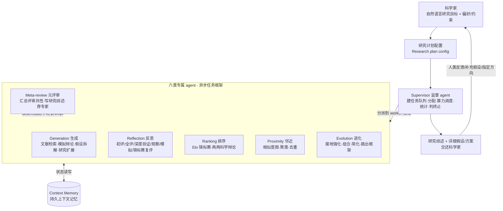

# 组会汇报 · Towards an AI co-scientist（Google / Gemini 2.0）

> 主讲提示：开场一句话定调——这是 AI Scientist (v1) 的「对立面与互补面」。v1 是**单链自动闭环 + 自评审**，本篇是**多智能体辩论进化 + 人在环 + 真·湿实验独立验证**。它把「自称 Scientist 却只能自评」这个老问题，用「让真实生物实验来当裁判」正面回应了一次。

---

## 1. 封面 · TL;DR

- **作者/出处**：Gottweis, Weng, Daryin, Tu 等（Google Cloud AI Research / Google Research / Google DeepMind 等），通讯作者 Karthikesalingam、Pawlosky、Natarajan；arXiv 2502.18864 v1，2025-02-26。
- **一段话**：AI co-scientist 是一个建在 **Gemini 2.0** 之上的**复合多智能体系统 (compound multi-agent system)**。科学家用自然语言给出一个**研究目标 (research goal)**，系统就用一组**专属智能体**（生成 / 反思 / 排序 / 进化 / 邻近 / 元评审）以「**生成-辩论-进化 (generate, debate, evolve)**」的方式产出**新颖、可检验的研究假设与实验方案**，并通过**扩展 test-time compute（测试时算力）**不断自我提质。系统**不追求全自动**，而是明确做「**科学家在环 (scientist-in-the-loop)**」的协作工具。
- **三条带走的结论**：
  1. **架构创新**：用**异步任务执行框架 (asynchronous task execution framework)** + 一个 **Supervisor（监督）智能体**调度六类专属 agent，把「科学方法」拆成可并行的子任务，从而能**灵活地把更多算力换成更好假设**（§3）。
  2. **自我进化机制**：用 **Elo 锦标赛 (Elo-based tournament)** 对假设做**两两科学辩论 (pairwise scientific debate)** 排序，胜负模式回灌给各 agent → **自我提升闭环 (self-improving loop)**；且 Elo 随 test-time compute **持续上升、未见饱和**，并在 15 个专家难题上**超过 o1 / o3-mini / DeepSeek-R1 / Gemini 2.0 系列以及人类专家「best guess」**（Fig.4–6）。
  3. **真·独立证据**：三个生物医学案例都做了**湿实验 (in vitro) 验证**——AML 药物重定位（Binimetinib IC50 低至 ~7 nM；新候选 KIRA6 在三株 AML 细胞系均见 nM 级抑制）、肝纤维化新表观靶点（人肝类器官中两个靶点显著抗纤维化）、抗微生物耐药 (AMR) 的 cf-PICIs 机制（**2 天内独立复现**一个尚未发表的实验结论）。

> 主讲提示：把「Elo 自评 ↑、未饱和」与「湿实验独立验证」分开讲——前者是**系统内部**指标（作者反复提醒「Elo 非 ground truth」），后者才是**外部独立证据**。本篇最值钱的就是后者。

---

## 2. 问题与动机（why —— 本篇最该讲透的一节）

**领域缺口在哪？** 生物医学研究面临**「广度 vs 深度」两难**（原文 §1）：现代突破越来越需要某个细分领域的**深 (depth)** 专长，但灵感又常来自**跨学科的广 (breadth) 桥接**（论文举例：CRISPR 得 2020 诺奖、Hinton/Hopfield 物理+神经科学得 2024 诺奖）。同时科学文献爆炸式增长、高通量实验越来越多，单个研究者**精力/背景知识有限**，难以兼顾深与广。

**为什么是「现在」做？** 三股技术潮流到位（原文 §1）：
- **高级推理 (advanced reasoning)** 与 **多模态理解**（Gemini 等）；
- **agentic 行为**：能用工具、跨长时间跨度解决复杂任务；
- **蒸馏 (distillation)** 与 **推理时算力 (inference / test-time compute)** 成本快速下降——智能体系统**正变得便宜可得**。

**这篇的赌注（核心 intention）**：过往 AI-for-science 要么是**专用窄模型**（AlphaFold 这类，强但只解一个问题），要么是 LLM **只做某一环**（PaperQA2 做文献检索、Liang 2024 做评审反馈、HypoGeniC 做假设但只在回溯数据上评、AI Scientist 端到端但**自评**）。本篇的赌注是：

> **不替代科学家、也不只优化某一环，而是做一个「会推理、会辩论、会自我进化」的通用协作者，把科学方法本身的归纳偏置 (inductive bias) 写进多智能体结构里，并用真实湿实验提供独立证据。**

**不这么设计会怎样（why-not）？**
- 若**单 agent 暴力生成**大量假设靠数量取胜（v1 路线）：缺乏「辩论/排序/进化」的内部筛选，质量靠运气，且无法把算力**有针对性**地投到有希望的候选上。
- 若**只做自评**：陷入「自己判自己新不新/好不好」的循环性（这正是本库 9.1 模块的核心批判）。本篇用 **Elo 锦标赛**做相对排序 + **三个湿实验**做外部锚定来打断这条循环。
- 若**追求全自动**：会重蹈 v1「幻觉硬件、把负结果说成改进、钻约束空子」的覆辙；本篇明确选择 **scientist-in-the-loop**，把最终判断权留给人。

> 主讲提示：这一节务必把三点讲死——①广/深两难是动机源头；②「通用协作者 vs 专用窄模型 vs 只做一环」的定位；③「test-time compute 当一等公民」是它区别于 v1 的方法论内核。

---

## 3. 研究问题 / 核心 intention（形式化成一句话）

把问题压成一句：

> **给定一个用自然语言描述、带偏好/约束/属性的研究目标，能否让一个多智能体系统自主地搜索并辩论文献、生成一批「新颖、可信、可检验、安全」的研究假设与实验方案，用锦标赛自我排序与进化，并随投入算力的增加而稳定提质——最终其顶级假设能经独立湿实验验证？**

隐含**假设**（原文 §2.1/§3）：
- (a) 前沿 LLM 已具备足够的**推理 + 长上下文 + 工具使用**能力，使「无需额外训练 (no additional learning)」、仅靠**推理时的归纳偏置**（把科学方法拆成 agent 角色）就能驱动科学推理；
- (b) **验证比生成更容易 (verification is easier than generation)**——所以可以用 LLM 当「批评者/裁判」做可扩展监督，并用锦标赛把「相对优劣」累积成全局排序；
- (c) 小规模/受约束的验证（三个生物医学案例）足以**论证潜力**，而非证明普适（作者反复强调结论是 preliminary）。

---

## 4. 相关工作定位（站在谁肩上、和谁不同）

> 主讲提示：一句话概括——「别人各做一环或只做窄域，它把**推理时算力 + 多智能体辩论进化 + 湿实验**三件事合到一个通用协作系统里」。

| 方向 | 代表 | 与本篇的关系（原文 §2） |
|------|------|------------|
| 推理 / test-time compute | AlphaGo(MCTS)、Libratus、DeepSeek-R1 [4] | **思想来源**：把「测试时多花算力做 System-2 慢思考」从博弈搬到科学推理；本篇是其「**显著放大 (significant scaling)**」且**不引入额外学习** |
| 专用 AI-for-science | AlphaFold2 [36]、抗生素发现、蛋白结合体设计 | 强但**只解一个良定义问题**；本篇是**通用**、可把这些专用模型当工具调用 |
| LLM 做评审一环 | Liang 2024 [42] | 只在「反馈/评审」这一环；本篇覆盖假设生成→验证全链 |
| LLM 文献检索一环 | PaperQA2 [44] | 只做检索综述，**不做新假设的科学推理** |
| LLM 假设生成（回溯评） | HypoGeniC (Zhou 2024) [45]、Data-to-paper [46] | 靠回溯数据/多臂赌博机迭代；**缺端到端独立验证**、能否真新颖存疑 |
| 多 agent 解题 | Virtual Lab [47]（PI+专家 agent 设计纳米抗体） | 思路相近但**设计差异大**、通用性不明 |
| 多 agent 跑化学实验 | "Coscientist" (Boiko 2023) [48] | **名字像但定位反**：那个高度自治、直接操作实验硬件、窄域化学；本篇是**广域 + scientist-in-the-loop + 重认知**而非操作硬件 |
| 端到端自动科研（自评） | **The AI Scientist (Lu 2024)** [40] | **最近的对照**：v1 端到端但**自动评估有限**；本篇区别＝**test-time compute 放大 + 自动/人类专家/湿实验三重验证 + 目标是「协作者」不是「自动化」** |
| 生物医学 LLM | Med-PaLM/Med-Gemini/Tx-LLM [49–53]、TxGNN [61] | 本篇**模块化**地把这些专用模型/数据库当工具，不依赖单一知识图谱 |

---

## 5. 方法总览（big picture，先直觉后数学）

整体是 **「自然语言研究目标 → 解析成研究计划 → Supervisor 调度六类 agent 在异步任务队列里循环（生成→反思→锦标赛排序→邻近/进化/元评审）→ 汇成研究综述交还科学家」**，外层是一个由 **Elo 锦标赛 + 元评审反馈** 驱动的**自我提升循环**（原文 Fig.1/Fig.2）。

**直觉（why 这么搭）**：
- **Generation** 像「会读文献、还会和自己辩论的点子王」；
- **Reflection** 像「严苛的同行评审 + 做深度证伪」；
- **Ranking** 把「谁更好」交给**锦标赛打分**而非一次性打分——因为**相对比较比绝对打分稳**（验证比生成易）；
- **Proximity** 像「把相似点子聚到一起」省得重复比；
- **Evolution** 像「在最好的点子上做变异/杂交/简化」**但只新增、不改原件**（保护 top 假设不被坏改动毁掉）；
- **Meta-review** 像「领域主席」把所有评审里反复出现的毛病总结成一条反馈，**不靠反向传播 (back-propagation)**，而是把这条反馈**直接拼进下一轮各 agent 的 prompt** 实现「学习」。

---

## 6. 符号与术语表（后文统一用）

| 记号 / 术语 | 含义（原文 §3） |
|------------|------|
| research goal | 科学家用自然语言给的研究目标（可从一句话到含数百篇 PDF 的数万 token 文档） |
| research plan config | 由系统解析研究目标得到的配置：偏好 / 属性 / 约束 / 评估准则（是否只要 novel、novelty/feasibility 判据等） |
| Supervisor agent | 监督智能体：建任务队列、把 agent 实例分配到 worker 进程、按权重采样调度、算统计、判是否终止 |
| Context Memory | 持久上下文记忆：存系统与各 agent 的状态，支持长时程迭代与失败重启 |
| Generation / Reflection / Ranking / Proximity / Evolution / Meta-review agent | 六类专属智能体（见 §7–§12） |
| $h$ | 一条研究假设 (hypothesis) / 研究方案 (research proposal) |
| 锦标赛 (tournament) | 对假设集合反复做**两两比较**的赛制；胜负更新 Elo |
| $R(h)$ | 假设 $h$ 的 **Elo 评分**（自评指标，初始 1200） |
| pairwise scientific debate | 两两科学辩论：让模型就两条假设的**新颖/正确/可检验性**多轮辩论后判谁更优 |
| DepMap score | Cancer Dependency Map 给的「某基因在某癌系中为必需」的依赖概率 $\in[0,1]$（药物重定位里当 sanity check） |
| co-scientist review score | Reflection/Ranking 给假设的综合评审分 $\in\{1,\dots,5\}$（药物重定位里和 DepMap 组合排序） |
| GPQA (diamond) | 由生物/物理/化学专家出的高难多选题基准 [71]；本篇用其 diamond 子集做 Elo-准确率一致性分析 |
| IC50 | 半数抑制浓度：使细胞活力降到一半所需药物浓度（越低=药越强）；湿实验主指标 |
| cf-PICIs | capsid-forming phage-inducible chromosomal islands，能跨菌种转移、携带毒力/耐药基因的移动遗传元件（AMR 案例主角） |

---

## 7. 方法细节 ① Generation agent（生成：会辩论的点子王）

**why**：科研第一步是「提出值得做、且**接地于已有证据**的问题」。要既**新**又**不空想**，单纯让 LLM 一次性吐想法不够——容易泛泛、不接文献、互相雷同。所以作者给生成 agent 装了**四种互补的生成模式**（原文 §3.3.1）。

**how（四种模式，按 why 排序）**：
1. **文献探索 (literature exploration via web search)**：迭代检索→读→总结 prior work，**先接地**再在其上生成新假设。→ 解决「凭空生成、不接证据」。
2. **模拟科学辩论 (simulated scientific debates)**：用**自我批评 + self-play** 在「专家间」多轮辩论，末轮产出一个被锤过的精炼假设。→ 解决「一锤子想法没被压力测试」。
3. **迭代假设拆解 (iterative assumptions identification)**：通过**条件推理跳 (conditional reasoning hops)** 找出「若成立就能导向新发现」的可检验中间假设，再聚合成完整假设。→ 解决「大假设不可检验」。
4. **研究扩展 (research expansion)**：读上一轮的研究综述 + 元评审反馈，找**尚未探索**的假设空间方向。→ 解决「探索覆盖不全、扎堆」。

> 主讲提示：强调②「模拟辩论」是本篇 generate-debate-evolve 里**debate 的第一处落点**——辩论不是只在排序时才有，生成阶段就已自带 self-play 压力测试。

---

## 8. 方法细节 ② Reflection agent（反思：评审 + 深度证伪）

**why**：假设只是猜想，**得有人挑错**才不至于把错的喂进锦标赛。作者让反思 agent 扮演**严苛同行评审**，并特别加了「**深度验证 (deep verification)**」来抓「复杂假设里藏的细微推理/实验错误」。

**how（六种 review，按强度递进，原文 §3.3.2）**：

| review 类型 | 在解决什么（why） | 关键做法 |
|---|---|---|
| 初评 Initial | 快速淘汰明显烂/不新/不安全的 | 不用外部工具，凭模型自身判正确/质量/新颖/伦理 |
| 全评 Full | 初评通过后做接地评审 | **用 web 检索**找相关文献，判正确/质量/新颖 |
| 深度验证 Deep verification | 抓复杂假设里**藏的错** | 把假设**拆成构成假设→再拆子假设**，**去语境化**逐条独立查对错；并判「这个错是否**根本性 (fundamental)**」——非根本错可留待后续精化阶段修 |
| 观察 Observation | 判假设能否**解释长尾实验现象** | 看该假设是否对既有观测给出**更优解释**，正向观测附加回假设 |
| 模拟 Simulation | 预演失败 | **分步模拟**机制/实验，找潜在失败场景（假设前沿 LLM 内含世界模型） |
| 复现/锦标赛复评 Recurrent/tournament | 随系统知识增长动态调整评审 | 据锦标赛结果与已评假设，识别**反复出现的问题**精化评审 |

> 主讲提示：把「深度验证」单独讲——它是本篇对 v1「会错误实现 idea 且难发现」这一痛点的**直接回应**：不是只打个总分，而是**拆到子假设级逐条证伪**，并区分根本错 vs 可修小错。

---

## 9. 方法细节 ③ Ranking agent + **Elo 锦标赛**（核心机制，重点讲）

**why**：系统会探索**海量**假设，必须有个排序把算力**优先投给最有希望的**。但「让模型给每条假设打个绝对分」既不稳又不可比。作者的关键设计：**用锦标赛做相对排序**——因为**两两比较 + 多轮辩论**比一次性绝对打分更可靠（呼应「验证易于生成」）。

### 9.1 Elo 的直觉与符号（先定义，后给式）

> 直觉：我们想用一个**单一数值**表达「这条假设在不断的两两对决里有多强」。借**国际象棋 Elo 评分**的思想——**赢了高手涨得多、输给弱者跌得多**，长期下来分数就收敛到「相对实力」。原文用 Elo 给假设排序（[64] = Elo & Sloan, *The rating of chessplayers*）。

记号（先定义）：
- $h_i, h_j$：参与一场对决的两条假设；
- $R_i, R_j$：它们当前的 Elo 评分（**新假设初始 $R=1200$**，原文 §3.3.3 明确给出）；
- $E_i$：模型**预期** $h_i$ 战胜 $h_j$ 的概率；
- $S_i\in\{1,0\}$：本场**实际**结果（$h_i$ 在科学辩论中被判更优记 1，否则 0）；
- $K$：步长/学习率（控制单场更新幅度）。

**关于公式的诚实说明（务必照原文）**：原文**正文只在概念层面**说明「用 Elo 锦标赛、初始 1200、靠两两胜负更新」，**并未写出 Elo 的期望-更新闭式公式**，也**未给出 $K$ 的取值**。下式为 Elo 评分系统的**标准教科书形式**（来自其引用文献 [64] 的经典定义），**列在此处供理解机制，但请明确告知组里：这是标准 Elo 而非论文显式给出的式子**：

$$ E_i \;=\; \frac{1}{1+10^{\,(R_j-R_i)/400}}, \qquad R_i \leftarrow R_i + K\,\big(S_i - E_i\big). $$

读出什么：$R_j-R_i$ 越大（对手越强）→ $E_i$ 越小（越不被看好）→ 一旦**爆冷赢了**（$S_i=1$ 而 $E_i$ 很小）则 $S_i-E_i$ 大、涨分多。这正是「赢强者多奖、输弱者多罚」。**论文取这套机制的价值不在公式本身，而在于：把「两两科学辩论的胜负」累积成一个可比、可驱动自我提升的全局信号。**

> 主讲提示：这里必须**当场声明**——「论文没写 Elo 的更新式与 K 值，我补的是标准 Elo 定义」。这是「忠于原文 / 区分宣称 vs 推断」的考点，组会上极易被追问。

### 9.2 锦标赛怎么省算力（优化策略）

锦标赛很贵，排序 agent 用几条启发式（原文 §3.3.3）：
- **top 假设两两对决用多轮辩论**（围绕新颖/正确/可检验），**低排名假设用单轮**比较即可——好钢用在刀刃上；
- 优先比较**相似**假设（用 Proximity 图判相似）→ 比较更有信息量、减少排序偏置；
- **新假设**和**当前高排名假设**优先参赛；好假设会**很快爬到高 Elo**，从而影响后续锦标赛状态。

> 主讲提示：强调「相似者优先对决 + 高低分用不同轮数」是**把锦标赛从 $O(n^2)$ 全比，压成有信息量的稀疏比**——这是 test-time compute 能「花在刀刃上」的工程基础。

---

## 10. 方法细节 ④ Proximity / Evolution / Meta-review（去重、进化、不靠梯度的学习）

**Proximity agent（邻近，§3.3.4）** — why：避免锦标赛把一堆近义假设反复比、也方便科学家浏览。how：异步算假设间相似度、建**邻近图 (proximity graph)**、聚类去重。它**不直接参与生成**，只服务排序与可视化。

**Evolution agent（进化，§3.3.5）** — why：top 假设还能更好；但**乱改可能把好假设改坏**。how：六种精化策略——①**接地强化**（找弱点→检索补证据→填推理缺口）；②**连贯/可行性改进**（修无效初始假设、使更实际可做）；③**受现有 top 假设启发**生成新假设；④**组合 (combination)** 多条 top 假设之长；⑤**简化**以便验证；⑥**跳出框架 (out-of-box)** 生成发散想法。**关键设计：进化 agent 只生成新假设、不修改/替换原件**——新假设必须**自己再去锦标赛里竞争**，从而**保护 top 假设不被坏改动污染**。

> 直觉：把「改进」做成「**再投一个候选去打擂台**」而不是「就地覆盖」，等于给每次改动加了**优胜劣汰的安全阀**。

**Meta-review agent（元评审，§3.3.6）** — why：单条评审会漏共性问题（例：90% 评审都查了血脑屏障通透性、但仍有 10% 漏）；要让**全部**未来评审都覆盖关键点。how：在锦标赛状态上**汇总所有评审/辩论里反复出现的模式**成一条「元评审 critique」，**直接附加进下一轮各 agent 的 prompt**——

> **不用反向传播、不微调、不强化学习**（原文明确：feedback propagation **without** back-propagation [65]），靠 Gemini 2.0 的**长上下文**把「学到的教训」当 prompt 注入，实现跨轮自我改进。

此外元评审还负责：把 top 假设综合成**研究综述 (research overview)**（可用**受约束解码 (constrained decoding)** [70] 套成 NIH Specific Aims / 申请书格式），并**推荐合适的领域专家**当潜在审稿/合作人。

> 主讲提示：这是全篇**最该被记住的机制**——「**不训练也能学习**」：把锦标赛+评审里反复出现的教训，用长上下文 prompt 注入回去。它解释了为什么 Elo 会随算力**单调上升**。

---

## 11. 实验设置（setting / params / 算力 / 成本，写全）

> 主讲提示：本篇没有 v1 那种「三模板 + 四底座 + $/篇」的整齐表。它的设置分两层：**内部自评（GPQA + Elo 随算力）** 和 **外部验证（三个湿实验 + 专家评分）**。要分别交代清楚。

**底座与训练**：
- **底座 LLM**：**Gemini 2.0**（所有 agent 共用；系统**模型无关 (model-agnostic)**，可换更强模型）。
- **训练**：**无**专门预训练/后训练/强化学习——纯靠**推理时**的多智能体归纳偏置（原文 §8 明确）。

**自评估数据 / 基准**：
- **GPQA diamond**（高难多选，专家出题）[71]：把每题当 research goal 喂入；对每题生成多份回答，按 Elo 分桶（1001–1050、1051–1100…每 50 一桶），算每桶平均正确率。**参考基线**：用底座 Gemini 2.0 对每题**生成 32 份**回答，取正确比例当该题「参考准确率」。
- **Elo 随 test-time compute**：在 **203 个**跨领域研究目标（以生物医学为主，含数学/物理）上，把系统产出按生成时间切成 **10 个等大时间桶 (temporal buckets)**；每桶记 **best Elo（单条最高）** 与 **top-10 平均 Elo**（截至 2025-02-03 录入）。
- **与 SOTA / 人类对比**：在 **15 个**专家精选难题（7 位有生物/生命科学博士学位、在职博后/教职的专家出题）上，把 co-scientist 与 **Gemini 2.0 Pro Experimental、Gemini 2.0 Flash Thinking Exp 12-19、OpenAI o1、OpenAI o3-mini-high、DeepSeek-R1** 以及**专家本人的「best guess」**一起放进同一锦标赛，用 co-scientist 的 Elo 评分衡量。

**专家评估设置**：
- **小规模偏好评估**：对 15 题中的 **11 题**，让出题专家对 co-scientist / Gemini 2.0 Flash Thinking 12-19 / Gemini 2.0 Pro Exp / OpenAI o1 的输出做**偏好排序 (1=最优…4=最差)** + 对 **novelty / impact** 各打 **1–5 分**（给了明确 rubric：novelty=据专家所知未曾以任何形式发表，越像已有/精确复刻越低分；impact=能否实质推进领域或带来应用）。
- **LLM-as-judge 偏好评估**：另用 o3-mini-2025-01-31、o1-preview-2024-09-12、Gemini 2.0 Pro Exp、Gemini 2.0 Flash Thinking 01-21 四个评委复跑同一偏好排序（Fig.8）。
- **临床专家评估**：把药物重定位假设套成 **NIH Specific Aims Page** 格式，**6 位**血液/肿瘤科执业医师（4 位专科 GI/乳腺/GYN/GU + 2 位综合，平均 8 年临床经验）按**改良 NIH 评分量表（15 个轴，覆盖 significance/innovation 与 approach/feasibility）** 用「强同意…强不同意」五级评 **78** 条独特假设。

**安全评估设置**：用前沿 LLM 造 **1200 条对抗性 (adversarial) 研究目标**，覆盖 **40 个**生物医学/科学主题，测系统能否稳健**拒绝**——初步分析中**全部通过**（数据集因敏感未公开，可申请）。

**药物重定位的搜索约束与排序指标**：
- 受约束于 **2300 个**已批准药物 × **33 种**癌型；
- 用 **co-scientist review score $\in[1,5]$** 与 **DepMap score $\in[0,1]$** 的**组合指标**排序；送专家复核的门槛：**review score $\ge 4$ 且 DepMap $\ge 0.99$**（DepMap 只当 sanity check，**不预测疗效**）。

**算力 / 成本 / 随机性**：
- **原文未给出**统一的「每个研究目标花多少 GPU·小时 / 美元」数字，也**未报告**随机种子设置——这是与 v1 报告相比一个明显的留白（见 §15 局限）。
- 唯一明确的「算力」表述是**定性的**：test-time compute 越多、Elo 越高（Fig.4–6）。

---

## 12. 主要结果（数字 + 解读，别只贴表）

### 12.1 Elo 与正确率一致（GPQA，原文 §4.1 / Fig.3）

- 在 GPQA diamond 上，**Elo 越高 → 平均正确率越高**，二者**一致 (concordant)**；说明 Elo 自评虽非 ground truth，但**确实和对错相关**，可当自我提升的代理信号。
- **取每题 Elo 最高的回答 → top-1 准确率 = 78.4%**，且整体高于参考 Gemini 2.0 曲线。

> 读出什么：这一节是「Elo 配不配当指挥棒」的**合法性论证**——若 Elo 与对错无关，后面「Elo 随算力升」就毫无意义。

### 12.2 Test-time compute 越多越好、未饱和（原文 §4.2 / Fig.4–6）

- **Fig.4（203 目标）**：随时间桶推进，**best Elo 与 top-10 平均 Elo 都单调上升**（best 从 ~1330 升到 ~1610 量级；top-10 平均从 ~1260 升到 ~1500 量级，按图读数）。
- **Fig.5（15 难题）**：同样上升，且 co-scientist 后段**超过所有基线虚线**——Gemini 2.0 Pro Exp / Flash Thinking、**o1 / o3-mini-high / DeepSeek-R1**，以及**人类专家 best guess**；**未见性能饱和**（作者据此说继续加算力可能继续提升）。
- **Fig.6（增强专家）**：从专家「best guess」出发，co-scientist 的改进版**先持平、后反超**自己从零生成的版本——提示它能**增强 (augment)** 专家解。

> 主讲提示：**反复强调免责声明**（原文逐图都写）——「**Elo 是自评、非独立 ground truth**，可能偏好某些不一定符合科学家偏好/质量的属性」。这是本库 9.1「自评≤Analyst」批判的**自我承认**，组会上要点破。

### 12.3 专家觉得它新颖且有影响（原文 §4.3 / Fig.7–8）

- 11 题专家评估：**co-scientist 平均偏好排名 2.36（4 个里最靠前）**；**novelty 平均 3.64 / 5、impact 平均 3.09 / 5**，均高于 Gemini 2.0 Flash Thinking、Gemini 2.0 Pro Exp、o1。
- 四个 LLM 评委（Fig.8）也一致把 co-scientist 排第一（如某评委下 2.18 vs 其余 2.33–2.90）。
- **诚实刻度**：作者明说**样本小**（11 题）、是**主观**专家判断、**非客观 ground truth**，需大规模研究才能下可靠结论。

---

## 13. 三个生物医学湿实验（本篇灵魂：独立证据，原文 §4.5–4.7）

> 主讲提示：这是全篇唯一**跳出系统内部 Elo**的部分——真实细胞/类器官/独立实验室结果当裁判。三个案例按难度递增：药物重定位（中）→ 靶点发现（高）→ 机制解释（极高）。

### 13.1 药物重定位 · 急性髓系白血病 AML（§4.5）

- **已有证据组（验证可信度）**：从 5 个候选（Binimetinib、Pacritinib、Cerivastatin、Pravastatin、DMF）选出在 AML 细胞系测活力。结果（Fig.10）：**Binimetinib、Pacritinib、Cerivastatin 都抑制 MOLM-13 活力**；其中 **Binimetinib（MEK1/2 抑制剂）IC50 低至 ~7 nM**。
- **全新候选组（验证创新性）**：要求系统**不借助 DepMap / 专家反馈**自主提全新候选；专家选其中 **3 个无任何前期 AML 数据**的（Nanvuranlat、**KIRA6**、Leflunomide）做湿实验。结果（Fig.11）：**KIRA6（IRE1α 抑制剂）在 KG-1 / MOLM-13 / HL-60 三株 AML 细胞系均见 nM 级抑制**，IC50 分别约 **13 nM（KG-1，最敏感）/ 517 nM（MOLM-13）/ 817 nM（HL-60）**。系统对「靶 IRE1α 治 AML 用 KIRA6 这条」自评**中等新颖**（IRE1α 在 AML 被研究过，但**不是用 KIRA6**）。
- **临床专家评（Fig.9）**：6 位血液肿瘤医师对 78 条 NIH Specific Aims 假设**普遍给「强同意/同意」**，覆盖临床相关性各轴。
- **诚实边界**：作者强调湿实验只是**生物学可行性检查 (viability checkpoint)**，**不替代**严格临床前/临床评估；且**专家预筛**（剔除明显不可行候选，如双膦酸盐 pamidronate 因获益来自减少骨相关事件而非抗肿瘤被排除）可能**抬高**了被评假设的质量（automation/selection bias）。

### 13.2 肝纤维化 · 新表观遗传治疗靶点（§4.6）

- 在**人肝类器官 (human hepatic organoids) + 活细胞成像**系统里，让系统提「肌成纤维细胞生成的新假设」并找可成药的表观修饰因子。
- 专家从 15 条 top 假设选 3 条带完整方案的；系统给出**3 个新表观靶点**。结果（Fig.12）：靶向其中**两个**靶点的药物在类器官中**显著降低成纤维细胞活性（抗纤维化）且无细胞毒性**，对各组报告了 **p<0.0001 / p<0.01 / p<0.001 / p<0.01 / p<0.01** 的统计显著性；**其中一个药是已批准药 → 开出重定位机会**。

### 13.3 抗微生物耐药 AMR · cf-PICIs 转移机制（§4.7，最强证据）

- 背景：cf-PICIs 是能**跨菌种转移**、携耐药/毒力基因的移动遗传元件（见于 *E. coli*、*K. pneumoniae* 等 WHO 重点病原）。一个**尚未公开发表**的独立研究组刚发现了「为何同一 cf-PICIs 出现在多菌种」的新机制。
- 设置（关键在「无信息泄漏」）：只给系统一页背景 + 两篇**已发表**文献（cf-PICIs 原始发现 [86] + 噬菌体卫星识别算法 [87]），**不给**那篇未发表结论；问它「为何 cf-PICIs（而非其它 PICIs/卫星）能广布多菌种」。
- 结果（Fig.13）：系统**把正确答案——「cf-PICIs 通过与多样噬菌体尾部 (phage tails) 相互作用来扩展宿主范围」——作为其 top-1 假设**独立提出，**与那篇独立实验研究的结论一致**；耗时**约 2 天**（但站在数十年既有公开文献之上）。配套细节见 co-timed 报告 [21]（Penadés 等）。

> 主讲提示：这是**对「自评循环性」最有力的反驳**——答案当时**不在公开域**，系统不可能「检索到再复述」，却独立命中。把它和 v1「只能自评、最高分卡 6.0」并列讲，对比最强烈。

---

## 14. 消融与分析（哪个部件贡献多少、敏感性）

**诚实说明**：本篇**没有**像 v1 那样的「逐部件消融表」（拆掉 Reflection/Evolution 各掉多少分）。它的「分析」主要是**沿 test-time compute 维度**的趋势分析：

- **Elo↑ 来自自我提升闭环**（Fig.4）：Elo **不是直接优化目标**，却随锦标赛+元评审反馈**单调上升**——间接证明「生成→反思→排序→进化→元评审」这套循环**整体有效**。
- **新推理模型更省算力**（§4.2）：o3-mini-high、DeepSeek-R1 等以**更少算力**达到有竞争力的表现；佐证「系统模型无关、会随底座变强而变强」。
- **GPQA 一致性**（Fig.3）：是对「Elo 当指挥棒」的**合法性消融**（若不一致则整套自评失效）。

> 主讲提示：组会可点名这条「缺部件级消融」为方法学短板——我们**无法从论文得知**六个 agent 各自的边际贡献，只能看到合在一起 + 加算力的总效果。

---

## 15. 局限与批判（诚实，本课的灵魂）

**原文 §5 / §6 / §8 自陈**：
1. **文献/评审/推理的局限**：只用**开放获取 (open-access)** 文献 → 可能漏关键 prior work；有时会**误判**某工作不相关而忽略。
2. **拿不到负结果数据 (negative results)**：失败实验很少被发表，系统**学不到**这部分隐性知识，而老练科学家正靠它定方向。
3. **多模态/工具使用弱**：图表里的信息读不全；**未评估**对大规模多组学数据 / 知识图谱的推理整合。
4. **继承底座 LLM 的硬伤**：事实性不完美、**会幻觉**，并会把 LLM 与 web 的偏见/错误一并传播。
5. **指标与评估太初步**：**Elo 是受限的自评指标**，可能偏好「不一定符合专家偏好/质量/正确性」的属性；缺跨学科系统性大评估。
6. **验证范围窄**：当前只识别靶点/机制，**未涉及**给药/制剂/PK、临床试验设计；翻译到临床仍需专门团队。

**作者承认的「自评 caveat」（贯穿每张 Elo 图）**：「Elo 是 auto-evaluated、非 independent ground truth」——这是本库 9.1「自称 Scientist 者多自评、独立验证最高只到 Analyst」论点的**直接自我印证**。

**你 / 社区可补的质疑**：
- **缺成本与可复现细节**：无 $/目标、无 GPU·小时、无随机种子——与 v1 透明的成本核算相比是退步；外部**无法复现**（系统未开源，仅 Trusted Tester Program）。
- **专家预筛抬分**：临床/湿实验前**专家剔除了明显不可行候选**，被评/被测的是**已过人工初筛**的子集 → 报告的高同意率/命中率**有选择偏置**。
- **「2 天复现」叙事的边界**：cf-PICIs 案例确实强，但作者也注明它**站在数十年公开文献 + 全部相关开放文献之上**；是「重组已有线索」还是「真原创」要小心措辞。
- **样本极小**：11 题专家评估、15 难题、78 条临床假设、3 个湿实验——**单中心、小样本**，作者自己反复说 preliminary。
- **安全**：1200 条对抗目标「全过」是**初步**红队；agentic 系统钻约束/被操纵的长期风险仍在（§6 大篇幅讨论 dual-use、对抗鲁棒、需人类监督）。

> 主讲提示：把批判分两层讲——**作者自承的**（Elo 自评、负结果缺失、多模态弱）和**社区可加的**（无成本/种子、专家预筛抬分、样本小、未开源）。诚实区分「宣称 vs 实测」是本篇汇报的得分点。

---

## 16. 在 auto-research 版图的位置

- **阶梯定位**：在 Tool→Analyst→**Scientist** 阶梯里，co-scientist 是**少数真正补上「独立验证」**的系统——它仍大量用 Elo **自评**（这部分只到 Analyst），但**三个湿实验提供了系统外的独立证据**，尤其 **cf-PICIs 案例的「答案不在公开域却命中」**是迄今最接近「Scientist 级独立验证」的样本之一。
- **与本库其它论文的对话**：
  - ← **The AI Scientist v1 (2408.06292)**：v1 端到端但**自评 + 会幻觉/钻约束**；本篇用**多智能体辩论进化 + 人在环 + 湿实验**正面补强 v1 缺的独立验证与诚信约束。
  - ← **AI Scientist v2 (2504.08066)**：v2 走「去模板 + agentic 树搜索 + VLM 看图 → 首个过人类评审」；本篇走「**多 agent 辩论 + Elo 锦标赛 + 真生物验证**」——两条不同的「让结果更可信」路线。
  - ↔ **批判线（9.1 / 9.8 / Wishful Thinking 等）**：本篇**主动**承认 Elo 自评的局限，可当「批判线被部分回应」的正面案例，但**未开源 + 专家预筛 + 无成本透明**又给了批判线新弹药。
  - ↔ **Coscientist (Boiko 2023)**：同为多 agent，但那个操作化学硬件、窄域自治；本篇重认知、广域、人在环——**对照「自治 vs 协作」两种 agent 哲学**的好教材。

---

## 17. 复现与可用性

- **开源情况**：系统**未开源代码/权重**；作者宣布 **Trusted Tester Program** 让研究者申请试用；湿实验细节在 **co-timed 配套预印本**（如 cf-PICIs 的 Penadés 等 [21]）。
- **能不能在单卡跑**：**不适用**——这是建在 **Gemini 2.0** 上的**闭源云系统**，核心开销是**大量前沿 LLM 推理 + web 检索 + 锦标赛**，不是单卡 GPU 训练；外部无法本地复现。
- **坑 / 注意**：
  - **Elo 是自评**，别把「Elo 升」当成「科学正确性升」；要看**外部验证**。
  - **专家在环是结果的一部分**：报告里的高命中率包含**人工预筛**，复现需同等专家参与。
  - **无成本/种子披露** → 难以做严格的算力-效果性价比对比。
  - 真要「诚实缩小版」，可参考本库 `m9.5-end-to-end-ai-scientist/` 思路：把「多 agent 辩论 + Elo 锦标赛 + 元评审反馈」用开源底座做一个可跑的玩具，**但把「独立验证」明确标注为缺口**（正如本篇真正的护城河恰是湿实验，而那是玩具复现不了的）。

---

## 18. 组会讨论问题（5–8 个）

1. **Elo 当指挥棒合法吗？** GPQA 上 Elo 与正确率一致（Fig.3），但作者反复声明「Elo≠ground truth」。如果一个假设**易被模型说服却科学上错**，Elo 会不会系统性高估它？怎么设计实验把「说服力」和「正确性」解耦？
2. **「不训练也能学习」能走多远？** 元评审把教训当 prompt 注入（无反向传播）。这条「长上下文即学习」相比真正 RL 微调，天花板在哪？上下文一满会不会遗忘早期教训？
3. **cf-PICIs「2 天独立命中」的真原创性**：答案当时不在公开域，但所有线索都在公开文献里。这算「发现」还是「高级文献综合」？如何设计基准把二者区分开？
4. **专家预筛 vs 自主性**：三个湿实验都有专家在环预筛/选候选。**去掉**专家预筛后，命中率会塌多少？这对「co-scientist 而非 auto-scientist」的定位意味着什么？
5. **Elo 未饱和（Fig.5）的解读**：是「能力真在涨」，还是「自评指标对自家产物的偏好在涨」？怎么用**独立**指标重做这张「随算力上升」曲线？
6. **与 v1/v2 的路线之争**：v2 靠「过人类评审」证明价值，本篇靠「湿实验独立证据」。**哪种验证更能反驳「自评循环性」**？能否设计一个同时满足两者的评测？
7. **成本黑箱**：v1 自报 <$15/篇，本篇**完全没给**成本/算力/种子。在「test-time compute 是一等公民」的系统里，不报算力-效果曲线是不是核心信息缺失？
8. **安全**：1200 条对抗目标「全过」是初步红队。一个会**主动检索、会辩论、会进化**的系统，被「越狱式研究目标」诱导产出 dual-use 假设的风险，比 v1 高还是低？

---

## 19. 一页速记（汇报当天速览）

- **是什么**：Google 基于 **Gemini 2.0** 的**多智能体 co-scientist**；自然语言给研究目标 → **生成-辩论-进化** → 出新颖可检验假设；定位**科学家在环的协作者**，非全自动。
- **六类 agent**：Generation（检索/模拟辩论/拆解/扩展）→ Reflection（含**深度验证**逐子假设证伪）→ **Ranking（Elo 锦标赛 + 两两科学辩论）** → Proximity（去重）→ Evolution（**只新增不覆盖**，进化后再进锦标赛）→ Meta-review（**无反向传播**，把教训当 prompt 注入 + 写研究综述）。由 **Supervisor + 异步任务队列 + Context Memory** 调度。
- **核心机制 Elo**：新假设初始 **1200**，靠两两辩论胜负更新（**论文未给更新式/ K 值，标准 Elo 期望式仅供理解**）；Elo 与 GPQA 正确率**一致**，**top-1=78.4%**；Elo 随 test-time compute **单调升、未饱和**，超 o1/o3-mini/DeepSeek-R1/Gemini 系列 + 人类 best guess（Fig.4–6）。
- **三大湿实验（独立证据）**：① AML 重定位——Binimetinib IC50 **~7 nM**，新候选 **KIRA6** 三细胞系 nM 级（KG-1 **13 nM**/MOLM-13 **517 nM**/HL-60 **817 nM**）；② 肝纤维化——**2 个新表观靶点**在人肝类器官显著抗纤维化（p<0.0001 等），含 1 个可重定位的已批准药；③ AMR——**2 天独立复现**未发表结论：cf-PICIs 借**噬菌体尾部**扩宿主范围（top-1 假设命中）。
- **设置数**：底座 Gemini 2.0、**无额外训练**；203 研究目标算 Elo 趋势、15 难题对比 SOTA、11 题专家评（偏好 2.36 / novelty 3.64 / impact 3.09）、78 条临床假设 6 医师评、1200 对抗目标安全测全过；药物搜索约束 **2300 药×33 癌**，门槛 review≥4 & DepMap≥0.99。**成本/GPU·小时/随机种子：原文未给出**。
- **三句话结论**：**架构上**用异步多 agent + Elo 锦标赛把算力换成质量（提质且未饱和）；**机制上**用「深度验证 + 元评审 prompt 注入」在不训练的情况下自我改进；**证据上**用三个湿实验（尤其 cf-PICIs 独立命中）首次给「自称 Scientist 的系统」补上**系统外独立证据**——但**未开源、专家预筛、无成本披露、样本小**仍是真实软肋。
- **在课里的位置**：v1 的互补面（多 agent 辩论 vs 单链自评）；对「自评循环性」批判的**部分正面回应**（靠湿实验），同时又给批判线送上「不透明 + 预筛抬分」新口实。

> 主讲提示：结尾回到一句话——**「v1 证明了能跑通却不可尽信；co-scientist 第一次让真实的细胞和独立实验室来当裁判——但它给你看的是已经过专家初筛的那一面，且不告诉你花了多少算力。」**
