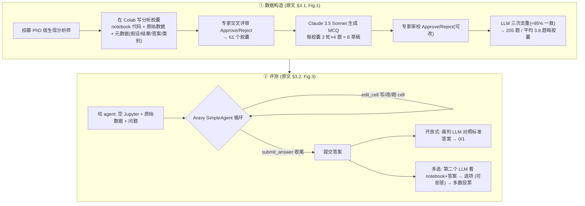

# 组会汇报 · BixBench：计算生物学 Agent 的开放式分析基准

> 主讲提示：这是 E 组（评测）里一篇**「领域真实性」优先**的 benchmark。它的核心主张不是「又一个刷分榜」，
> 而是**「真实科研分析是开放式的，不该被多选题和固定环境阉割」**——开场就把这句话立住，全场都在论证它。

---

## 1. 封面 · TL;DR

- **标题 / 出处**：*BixBench: a Comprehensive Benchmark for LLM-based Agents in Computational Biology*，arXiv **2503.00096**（v3, 2025-10-08）。
- **作者 / 机构**：Ludovico Mitchener, Jon M Laurent, Alex Andonian, Benjamin Tenmann, Siddharth Narayanan, Geemi P Wellawatte, Andrew White, Lorenzo Sani, Samuel G Rodriques——**FutureHouse**（旧金山，做 PaperQA / Aviary / Robin 那家）+ **ScienceMachine**（伦敦）。
- **权威性来源**：FutureHouse 是「科学 agent」方向最活跃的团队之一（LAB-Bench、Aviary、Robin 同门）；本文**数据集 + 评测 harness 全开源**（HuggingFace `futurehouse/BixBench`、GitHub `Future-House/BixBench`，见原文 §1.1 脚注），可独立复现。
- **一段话**：BixBench 把「**计算生物学家真实做的数据分析**」搬进基准——由领域专家把已发表/de novo 的分析整理成 **analysis capsule（分析胶囊）**：一份 Jupyter notebook 代码 + 原始输入数据 + 假设/结果/答案等元数据；再用 LLM 给每个胶囊生成、专家审校多选题。评测时给 agent 一个**空 notebook + 原始数据 + 几个问题**，它要自己探索数据、写多步 Python/R/bash、最后**开放式作答**，由一个裁判 LLM 对照标准答案判 0/1。
- **三条带走的结论**：
  1. **真实分析对前沿模型极难**：开放式作答下 **Claude 3.5 Sonnet 21% / GPT-4o 15%**（原文 §4，Figure 4 左）；这是「能写代码」和「能做科研分析」之间的鸿沟。
  2. **多选题严重高估能力，且会触发「钻空子」**：转成 MCQ 后分数上升，但**带「拒答」选项时两模型都≈随机**（模型倾向于不答），**去掉拒答后**反而更高——说明分数里掺了「猜」和「靠 recall」。
  3. **majority voting / 多模态都没救**：5 次投票随票数累积**无显著提升**（Figure 5 上）；让 agent 看图/不看图**无显著差异**（Figure 5 下，且作者发现模型**不太会读图**）。

> 主讲提示：开场把「21%」和「带拒答≈随机」两个锚点抛出。前者说明任务真难，后者说明**评测格式本身会制造假象**——这正是这篇对评测方法学的贡献。

---

## 2. 问题与动机（why —— 本篇最该讲透的一节）

### Why 三连 · 问题层（为什么这事值得做）

**科学分析的本质是「开放、模糊、无固定验证器」。** 原文 §2.2 一句话点题：*"In science, most analytical tasks are ambiguous, open-ended, and do not benefit from having a clear optimization metric to verify performance."* 一个真实的生物信息学家面对的是：一堆异构格式的原始数据（csv / rds / 目录树）、一个**研究问题**（不是一道有标准答案的题），他要**自己决定**做哪些统计、画哪些图、用什么阈值，最后**解释**结果是否支持假设。

**为什么生物信息学是「第一个可能全自动科学发现」的领域（动机句）。** 原文 §1：现代技术产数据的规模与分析复杂度，使生信/计算生物成为「**独立于物理湿实验的研究领域**」——研究问题可以**纯靠分析数据**回答（"at times independently from traditional laboratory experiments"）。这种「与物理实验室解耦」恰好给了 AI 一个机会：在**不需要动手做湿实验**的前提下，就能跑完「提假设→分析→解释」的科学循环。所以作者赌：**生信是全自动科学 agent 最先落地的地方**，那就必须有一把尺子量进度。

**不做会怎样（缺口）。** 已有的数据科学/ML 工程基准（SWE-Bench、BigCodeBench、MLE-Bench、DA-Code…）都**不是为「开放式科学分析」设计的**：要么是「修 GitHub issue」「跑 ML pipeline」这类有明确验证器/奖励的工程任务，要么（像 BLADE）把分析**人为约束**到「产出指定 artifact、做指定统计选择」。没有一个基准敢让 agent **完全自由**地探索真实数据、开放式作答。**缺这把尺子，你就不知道「自主生物信息学家」离我们还有多远。**

### Why 三连 · 设计层（为什么这样设计，而非显而易见的替代）

> **Why（设计层）**：朴素做法是**沿用多选题 + 固定 sandbox**（像绝大多数 LLM 基准）。→ 会因为：①多选把「开放分析」退化成「读题猜答案」，模型可绕过真分析靠 recall/排除法得分（原文 §4 实测：带拒答≈随机、去拒答反升，正是这个病的证据）；②固定环境/指定工具掩盖了真实科研里「自己找包、自己决定分析路径」的难点。
> → 本文改用 **开放式作答（open-answer）为主 + LLM 裁判判分 + 真实数据自由探索**，因为只有「不给选项、不限工具」才逼出真实能力（原文 §3.2.4 明言 open-answer 是 *"our preferred evaluation method"*，MCQ 只是「有用的代理」）。

**为什么仍保留 MCQ？** 不是自相矛盾，而是**故意做成对照实验**：MCQ 是「能力的上界代理」（更容易、可对比已有基准），open-answer 是「真实下界」。两者一夹，就能量化「**多选题到底高估了多少**」——这本身是这篇的方法学贡献（§3.2.4、Figure 4 三组柱状对比）。

### Why 三连 · 结果层（为什么会得到这个数）放在 §9 展开

> 主讲提示：这一节是 why 的核心。讲清三件事：①科学分析「开放、模糊、无验证器」；②生信「与湿实验解耦」→ 最可能先自动化；③已有基准都不敢「完全放开」。把这三点钉住，后面方法全是在回应它们。

---

## 3. 研究问题 / 核心 intention（形式化成一句话）

把要解决的问题压成一句：

> **给定一个真实研究问题 + 该问题对应的原始数据 + 一个空的代码执行环境，能否让一个 LLM agent 自主完成多步分析、并对开放式问题给出与专家一致的回答？** BixBench 不解题，它**度量这件事现在能做到几成**。

它隐含的**假设**：
- (a) 把专家的真实分析「胶囊化」（notebook + 数据 + 假设/结果/答案）后，**问题与数据足够还原真实科研情境**，而不是被简化成玩具题；
- (b) **开放式作答**比多选更能反映真实能力，且可用「裁判 LLM 对照标准答案」近似判分（承认这是近似，§3.2.4）；
- (c) 当前前沿模型（GPT-4o / Claude 3.5 Sonnet）的结构化输出 + 长上下文 + 工具调用，**勉强够**驱动这种 agent（原文 §3.2.5 说 o1 / DeepSeek-R1 当时因长上下文与结构化输出限制**跑不动**这套）。

---

## 4. 相关工作定位（站在谁肩上、和谁不同）

BixBench 在「数据科学/ML 工程基准」和「科学 agent 基准」两条线之间，占据「**真实生物分析 + 开放式评测**」这个空位。原文 §2 + **Table 1** 对比：

| 维度 | DA-Code | DSBench | MLE-Bench | RE-Bench | BLADE | ScienceAgentBench | **BixBench（本文）** |
|---|---|---|---|---|---|---|---|
| 任务数 | 500 | 540 | 75 | 7 | 188 | 102 | **205** |
| 单任务耗时(h) | 0.1 | 17 | 2.5 | 8 | 1.5 | 2.5 | **4.2** |
| 评测方式 | 验证器 | 验证器 | 奖励 | 奖励 | MCQ | 验证器 | **开放式 (open-ended)** |
| 多语言 | ✔ | ✘ | ✘ | ✔ | ✘ | ✘ | **✔（Py/R/bash）** |
| 面向科学 | ✘ | ✘ | ✘ | ✘ | ✔ | ✔ | **✔（计算生物）** |
| 平均代码行数 | 85 | 75 | – | 650 | 75 | 58 | **106** |

（依据原文 **Table 1**）一句话差异：**别人要么有现成验证器/奖励（工程任务），要么用 MCQ（BLADE），要么虽面向科学却把分析约束死（BLADE/ScienceAgentBench）；BixBench 是表里唯一「开放式评测 + 真实生物分析 + 多语言自由工具」的组合。**

**最近邻是谁、差在哪**（原文 §2.1/§2.2）：
- **BLADE**（Gu 2024）：最像——也做分析场景，但**人为约束**到「产出指定 artifact、做指定统计选择」，且用 MCQ；BixBench 去掉这些约束、改开放式。
- **ScienceAgentBench / BioCoder**：测「生信代码生成 / 函数调用」，是**写对代码**，不是**做对分析并解释**。
- **同门 LAB-Bench**（Laurent 2024）：测文献综述、序列操作、协议排错等**生物研究任务**，偏知识/recall；BixBench 补上「**端到端数据分析轨迹**」这一块。
- **CORE-Bench / DiscoveryBench**：测「**复现**已发表分析」「发现与已发表相似的结论」——和 BixBench 目标相邻但侧重「重现/对齐已知」，BixBench 侧重「**开放作答的真实难度**」。

> 主讲提示：把 Table 1 当「增量从哪来」的一图流。强调最后一列「Open-ended」是全表唯一——这是它的身份标签，也是它最难评的根源（§7 讲裁判判分）。

---

## 5. 方法总览（big picture，先直觉后数学）

BixBench 分**两条流水线**：①**造数据**（把专家分析变成胶囊与题）；②**评测**（让 agent 在沙箱里自由分析、开放作答 / 多选）。对应原文 Figure 1（造数据）+ Figure 3（评测）。



**直觉**：造数据像「把一位博士做过的真实分析，连同他的数据和结论，封装成一个考题盒子」；评测像「把这个盒子的数据和问题交给 agent，但**抽掉答案和现成代码**，看它能不能自己重走一遍分析并答对」。关键张力全在「**开放式怎么判分**」——这是 §7 的核心。

> 主讲提示：让听众记住三个名词——**capsule（胶囊）/ 三个工具(list_workdir, edit_cell, submit_answer) / 两种评测(open-answer, MCQ)**。后面逐个拆。

---

## 6. 符号与术语表（后文统一用）

| 记号 / 术语 | 含义 |
|---|---|
| analysis capsule（分析胶囊） | 评测的基本单元 = ①`hypothesis`（研究问题/假设）+ ②`input data`（原始数据文件）+ ③`code`（专家的分析 notebook）+ 元数据 `result`/`answer`/`categories`（原文 §3.1.2, Fig.6） |
| MCQ | 多选题 (multiple-choice question)，含 1 个正确项 + 若干干扰项（distractors） |
| open-answer（开放式作答） | agent 直接给自然语言答案，无选项；本文**首选**评测格式 |
| refusal / opt-out（拒答） | MCQ 里额外提供的「信息不足 (insufficient information)」选项 |
| judge LLM（裁判 LLM） | 一个独立 LLM（Claude 3.5 Sonnet），把 agent 答案与标准答案比对，判 1（对）/0（错） |
| trajectory（轨迹） | agent 一次完整的「读数据→分析→作答」过程；每题跑 5 条并行轨迹 |
| Aviary / SimpleAgent | FutureHouse 的语言 agent gymnasium（Narayanan 2024）；本文用其 SimpleAgent 范式做 agent 脚手架 |
| BixBench-env:v1.0 | 预装 Python/R/bash 生信包的 Docker 容器，保证可复现、隔离环境 |
| accuracy（准确率） | 主指标：在所有并行轨迹×所有问题上「答对的比例」（§4.1，定义式见 §13） |
| precision（精确率，仅 MCQ） | 「答对数 / 已作答数」（不含被「拒答」的题，§4.1） |
| majority voting（多数投票） | 把同一题 5 条轨迹的答案做多数表决，取共识（§3.2.4） |

---

## 7. 方法细节 ① 数据构造：把真实分析「胶囊化」（原文 §3.1）

**why**：基准的「真实性」全靠数据来源。要避免「玩具题」，就得**让真专家把真分析交出来**，并经**交叉评审**保真。

**how（三步，对应 §3.1.1–3.1.3）**：

1. **招募分析师（§3.1.1）**：通过专业网络、联系生信论文作者、合作机构招募——**全部是生物信息学及相关领域的 PhD 或在读 PhD**，以生物数据分析为主业。覆盖类别广（Figure 2 直方图：Genomics、Transcriptomics、Differential Exp. Analysis、RNA-seq、Phylogenetics、WGS、Imaging、ML and AI、Single-Cell… 长尾）。

2. **写胶囊（§3.1.2）**：分析师在 **Google Colab** 里，**复现一篇已发表分析**或**用所给数据做 de novo 分析**，捕获三件套——`hypothesis`（研究问题）、`input data`（输入数据）、`code`（分析代码）；外加 `result`（几句话描述主结果）、`answer`（对假设的 true/false 判定）等元数据。允许用 Python/R/bash、装任意包。公开数据（如 `wget` 拉的）单独持久化保存。**胶囊与轨迹经作者（有时其他分析师）彻底评审，最终 61 个**。

3. **造题 + 去重（§3.1.3）**：用 **Claude 3.5 Sonnet（20241022）** 为每胶囊生成 MCQ——给它「**改写过的 notebook + 假设/结果 + 专门设计的 prompt**」，分**两轮、每轮 4 题、共 8 道草稿**。专家审校，**只能 Approve/Reject（可编辑）**，并提供原始胶囊全上下文。最后用 Claude 3.5 Sonnet **三次重复**标记重复题（三次约 **95% 一致**），删重直到无重复。**最终 205 题、61 胶囊、每胶囊 1–7 题（平均 3.8）**。

> **Why（设计层）**：朴素做法是**让 LLM 一把生成「问题+数据+答案」**（纯合成）。→ 会因为「数据不真实、答案是模型自己编的」而**失去科研可信度**，且容易泄漏（模型记得自己出的题）。本文改用「**真专家真分析打底 → LLM 只负责把分析改写成题 → 专家审校把关 → LLM 三检去重**」的人机协同，把「真实性」交给人、把「批量化」交给模型。
> 一个具体例子（原文 Figure 6）：某胶囊数据是细菌 swarming 形态学指标（Area/Circ./Round），元数据 `hypothesis="Q5 gene mutants demonstrate…"`、`answer="True"`、`categories="Imaging"`；据此生成的题如「按 spline 模型，peak swarming area 的 95% 置信区间下界是多少？」`ideal_answer="157,912 mm^2"`，干扰项 `114,531 mm^2`——**答案是从真 notebook 的真输出里抠出来的**（notebook 里 `print(conf_int_spline)` 输出 `157912.4 210831.3`）。

---

## 8. 方法细节 ② 评测基础设施：空 notebook + 三工具 + Docker（原文 §3.2.1–3.2.3）

**why**：要量「真实分析能力」，评测环境就得**像真实工作台**——给数据和问题，**不给答案、不给现成代码、不限工具**，让 agent 自己探索。

**how**：
- **环境（§3.2.1）**：评测时给 agent 一个**空 Jupyter notebook + 一组输入数据文件 + 几个问题**。Agent **自由探索数据、自定假设、自排分析计划**。这直击三大评测难点：迭代分析、访问专用软件环境、开放作答。
- **脚手架（§3.2.2）**：用 **Aviary** 的 **SimpleAgent** 范式（Narayanan 2024）做受控、可复现的多步推理环境；跨模型保持一致的软件环境与工具访问。
- **Docker 隔离（§3.2.2）**：所有分析在预装 Python/R/bash 生信包的 **BixBench-env:v1.0** 容器里跑。**关键设计**：容器**预装常用包但 agent 仍需自己识别并加载/装包**——**刻意不替它解决依赖**，以贴近「研究者在预配置环境里仍要自己找包」的真实工作流（§3.2.2 末）。
- **三个工具（§3.2.3）**：
  - `list_workdir`（= 图里的 `list_workdir`）：递归列工作目录，让模型摸清数据结构与格式；
  - `edit_cell`：选择、修改并**执行** notebook 里的某个 cell；每次改动**触发整本重跑**，agent 据此看到表格/图/报错回溯，迭代精化；
  - `submit_answer`：收尾、提交开放式答案，触发轨迹结束。
- **每步决策**：每个 timestep，模型决定调哪个工具，拿到执行观测后继续。Prompt 工程做了大量探索（完整 prompt 见原文 **Appendix A**，下方 §11 摘要）。

> **Why（设计层）**：朴素做法是**预先把依赖装好、甚至给一个配好的分析模板**。→ 会**抹掉真实难点**（真实科研里「找对包、装对环境、读懂目录结构」本身就费力），让分数虚高。本文**故意只给空 notebook + 原始数据**，把「自己搭分析」纳入考核——这也是它比「写对一段函数」的 BioCoder 更难、更真实的原因。

---

## 9. 方法细节 ③ 两种评测协议 + 判分（原文 §3.2.4，核心）

这是全篇方法学的「重点中的重点」——**开放式怎么判分**、**多选怎么设计防作弊**。

### 9.1 开放式作答（open-answer）——首选

**直觉**：真实生物信息学家**没有选项**，所以「开放作答」才是 *preferred* 评测（原文 §3.2.4 原话）。

**判分机制（先定义符号）**：
- $a_i$：agent 对第 $i$ 题提交的开放式答案；
- $g_i$：该题的 ground-truth 标准答案；
- $\mathrm{Judge}(\cdot,\cdot)\in\{0,1\}$：裁判 LLM（Claude 3.5 Sonnet）给出的二元正确性分数（1=正确，0=否则）。

每题的单次正确性即

$$ c_i \;=\; \mathrm{Judge}\big(a_i,\ g_i\big)\ \in\ \{0,1\}. $$

为对抗**随机性（stochastic trajectories）**，每题**并行跑 5 次**，整体表现在「所有并行轨迹 × 所有问题」上求平均（§3.2.4 末 + §4.1）。

**读出什么**：开放式没有「可机器精确比对」的验证器，所以**判分本身是一个 LLM 调用**——这是「真实性」的代价：判分可信度上限被裁判 LLM 框死（§16 批判会回到这点）。

> **Why（设计层）**：朴素做法是**字符串/数值精确匹配**判开放式答案。→ 会因为「同一答案有无数等价表述（`157912` vs `157,912 mm^2` vs `约 1.58e5`）」而**大量误判为错**。本文改用**裁判 LLM 语义比对**，因为开放式答案的「对」是语义层面的；代价是引入裁判自身的噪声/偏差（作者承认这是近似）。

### 9.2 多选（MCQ）——代理 + 故意暴露「钻空子」

**直觉**：MCQ 更易评、可对比已有基准，作为「**通往自主生物信息学家路上有用的代理评测**」（§3.2.4 原话）。

**机制（§3.2.4 + Figure 3B）**：agent 跑完分析后，把**完整 notebook + 原问题 + 多选选项**交给**第二个 LLM**，让它选最合适的选项。两个关键设计：
- **拒答 (refusal/opt-out) 选项**：额外给一个「信息不足 (insufficient information)」选项，让模型**可以选择不答**——用来探针模型「不会就猜 vs 诚实弃权」的倾向（§4 末称之为测模型的 "ethics"）。
- **多数投票 (majority voting)**：对同一题的 **5 次**轨迹结果做多数表决取共识。

**MCQ 的精确率（先定义符号）**：
- $N_{\text{ans}}$：模型**实际作答**（未选「拒答」）的题数；
- $N_{\text{correct}}$：其中答对的题数。

$$ \text{precision} \;=\; \frac{N_{\text{correct}}}{N_{\text{ans}}}\quad(\text{只在「已作答」的题上算，被拒答的不计入分母}). $$

**读出什么**：把 accuracy（含所有题）与 precision（只含已作答）分开报，就能看出「模型是不是靠**大量弃权**保住了看起来的正确率」——这正是 refusal 实验要暴露的（§9.3 结果）。

### 9.3 Why 三连 · 结果层（拿到数后，机制上为什么是这个数）

**核心结果（原文 §4, Figure 4 三组柱）**：

| 评测格式 | GPT-4o | Claude 3.5 Sonnet | 相对基线 |
|---|---|---|---|
| **Open-answer**（开放式） | **15%** | **21%** | 远高于 random（≈3%，左柱虚线），但绝对值极低 |
| **MCQ w/ refusal**（带拒答） | ~20% | ~25% | **≈ random**（中柱，两模型都贴近随机线） |
| **MCQ w/o refusal**（去拒答） | ~33% | ~40% | 最高，但**未超过「纯 recall 基线」**（右柱实线） |

> **结果层 why**：
> - **为什么开放式只有 21%**：真实分析要求「读懂问题→选对统计方法→在原始异构数据上正确实现→解释结果」全链路都对，**任何一环错都判 0**；前沿模型「会写代码」但**不稳地会做对整条分析**，于是绝对正确率被压到 ~20%。
> - **为什么带拒答≈随机**：给了「信息不足」这个台阶，模型**倾向于在没把握时弃权**（作者称其 "tendency to opt-out"）。一旦大量弃权，剩下作答的题正确率也没真本事兜底，整体就塌回随机水平——**说明此前 MCQ 的高分很大程度是「被迫硬选时蒙对的」**。
> - **为什么去拒答反而最高、却仍不算赢**：不给台阶，模型被迫每题都选，**靠排除法/先验知识**也能蒙对一些；但作者设了一条**狠基线**——**把同样的问题与选项直接给模型、不给任何 notebook/数据**（纯 model recall）。结果：**MCQ w/o refusal 的成绩并未超过这条纯 recall 基线**（Figure 4 右柱实线 = baseline）。**含义极重**：模型在 MCQ 上的表现，**可以不靠真分析、纯靠背知识达到**——多选题根本没在考「分析能力」。

**majority voting 与多模态（原文 Figure 5）**：
- **投票无用**：票数 $k=1\to5$，无论带不带拒答，准确率**无显著上升**（Figure 5 上）——多跑几次取共识救不了「不会做」。
- **看图无用且模型不会读图**：让 agent 看/不看 notebook 里的图，对结果**无显著影响**（Figure 5 下）；作者还观察到**模型普遍读不懂图**（呼应 xx lab-bench、figqa 的发现），于是做了「禁止 agent 生成图」的消融，仍无显著差异。

> 主讲提示：把「**MCQ w/o refusal ≤ 纯 recall 基线**」当本节的杀手锏——它一句话证明了「**多选题考的是记忆不是分析**」，这是全篇对评测方法学最锋利的一刀。

---

## 10. 算法骨架：一条 agent 轨迹（伪代码）

把 §8–9 串成一条可执行轨迹（综合 §3.2.3 工具循环 + Appendix A 的 5 步 prompt）：

```
输入: 空 notebook, 输入数据目录, 问题集 Q = {q1..qn}
# Appendix A 的链式提示把轨迹结构化为 5 阶段：
1. List Directory      : list_workdir() → 把目录结构写进 notebook，规划分析
2. Load + 描述统计      : edit_cell(载入相关数据, head()/str()/summary())  # 自己挑相关文件、处理缺失/异常格式
3. Develop Analysis Plan: 把每个问题拆成可检验子项，列统计检验/可视化，写成 notebook 注释
4. Execute Plan        : 循环 edit_cell(写小而中等的 cell；按 index 改 bug 而非新建；先检查 df 形状)
                         # 可用 Python / R(%%R, 经 rpy2) / bash(%%bash)；指南要求「尽量用表格/print 而非图」
5. Conclude + Submit    : 反思每题、列不确定性，submit_answer({q1:..., qn:...})  # 数值答案精确到 2 位小数
输出: 每题开放式答案 → 裁判 LLM 判 0/1（或交 MCQ-LLM 选项+投票）
重复 5 次并行 → 求平均 accuracy
```

> 主讲提示：注意 Appendix A 的 prompt 极其「保姆式」——逐阶段用 `<analysis_planning>` 标签做 chain-of-thought，连「先 head() 看大 df」「用 mamba/conda 装包」「R 里 `print(head(df))`」都写死了。**说明即便手把手提示，开放式仍只有 21%**——难度不在提示词，在分析本身。

---

## 11. Agent 初始化 prompt 摘要（原文 Appendix A，§3.2.3 引用）

> 主讲提示：这是「params 写全」的一部分——组会常被问「它到底怎么提示 agent 的」。

- **角色**：*"You are an expert bioinformatician and seasoned biological data scientist."* 任务=建一个名为 `notebook.ipynb` 的 notebook，**自含所有 artifact（图/表/print）**，让「另一个人也能据此推出答案」。
- **示例问题（Appendix A 给的真题）**：如 *"What percentage of genes differentially expressed in strain 97 are also differentially expressed in strain 99?"*、*"How many genes have a dispersion value below 1e-05 after DESeq analysis?"*——典型 RNA-seq/差异表达分析题。
- **5 阶段链式提示**（见 §10）：每阶段用 `<analysis_planning>` / `<thought_process>` 标签强制「先想后做」。
- **通用守则**：写小 cell 便于 debug；改 bug 用 cell index 改、别新建；打印前先看 df 形状；**默认包已装好，报错才装**（用 mamba/conda）；**尽量用表格/print，少用图**。
- **R/Python/bash 混用**：默认 Python；`%%bash`/`%%R` 切换；首 cell 已 `%load_ext rpy2.ipython`，从第二 cell 起可用 `%%R`。
- **收尾**：必须用 `submit_answer({...})` 提交 JSON（键=题号、值=简短答案）；数值答案**精确到 2 位小数**；**必须答完所有题**。

---

## 12. 实验设置（setting / params / 算力 / 成本，写全）

- **数据集规模**：**61 个分析胶囊 / 205 道开放题**，每胶囊 1–7 题（平均 **3.8**）；类别覆盖见 Figure 2（Genomics/Transcriptomics/Diff-Exp/RNA-seq/Phylogenetics/WGS/Imaging/ML/Single-Cell… 长尾）。数据格式异构（csv、rds、目录树等）。
- **被测模型**：**GPT-4o**（OpenAI, Hurst 2024）+ **Claude 3.5 Sonnet**（Anthropic 2024）两款前沿模型。**为何只这两款**（§3.2.5）：它们在「结构化输出 + 长上下文」上够格，是 agentic 工具调用的前提；**o1 / DeepSeek-R1 在预测试中因长上下文与结构化输出要求「跑不动」**这套 agent 工具循环，故未纳入主结果。
- **轨迹规模**：每胶囊跑 **5 次并行**；跨 **2 模型 × 2 模态（带/不带图）** 共 **305 条轨迹 × … = 1,220 条总轨迹**（§3.2.5）。
- **裁判**：开放式由**独立 Claude 3.5 Sonnet** 判 0/1（§3.2.4）。
- **造题模型**：Claude 3.5 Sonnet（20241022）生成 MCQ；同款模型三检去重。
- **执行环境**：Docker `BixBench-env:v1.0`（预装 Python/R/bash 生信包）；脚手架 = Aviary SimpleAgent。
- **成本 / 单任务耗时**：Table 1 列「**4.2 小时/任务**」（指人类专家组装该类分析的参考耗时量级，用于跨基准比较「任务复杂度」）；**LLM 推理的金额成本、GPU 用量原文未给出**。
- **随机性控制**：每题 5 条并行轨迹 + MCQ 多数投票（§3.2.4）。

> 主讲提示：强调两点诚实标注——①「只测两款模型」是**当时 reasoning 模型跑不动 agent 工具循环**的工程约束，非挑模型；②**美元成本/GPU 原文未给出**，别替它编。

---

## 13. 主要结果（数字 + 解读，别只贴表）

**主指标 accuracy 的定义（先定义符号）**：
- $\mathcal{Q}$：全部问题集合，$|\mathcal{Q}|=205$；
- $T=5$：每题并行轨迹数；
- $c_{i}^{(t)}\in\{0,1\}$：第 $i$ 题第 $t$ 条轨迹的正确性（开放式由裁判 LLM 给，§9.1）。

$$ \text{accuracy} \;=\; \frac{1}{|\mathcal{Q}|\cdot T}\sum_{i\in\mathcal{Q}}\sum_{t=1}^{T} c_{i}^{(t)} \qquad(\text{「所有并行轨迹×所有问题」上答对的比例，原文 §4.1}). $$

**主结果（§4，Figure 4）**：

| | 开放式 | MCQ 带拒答 | MCQ 去拒答 | 纯 recall 基线 | random |
|---|---|---|---|---|---|
| **Claude 3.5 Sonnet** | **21%** | ~25% | ~40% | =右柱实线 | 带拒答≈25% / 去拒答≈?（虚线） |
| **GPT-4o** | **15%** | ~20% | ~33% | =右柱实线 | 同上 |

**读出什么（逐条解读，不只贴数）**：
1. **开放式：Claude 21% > GPT-4o 15%**，但**两者都低到「远未达可用」**——「能写代码」与「能做对真实分析并解释」之间是鸿沟。
2. **MCQ 全面高于开放式**——**量化了多选题对能力的高估**（这正是做双协议对照的目的）。
3. **带拒答 ≈ random**（Figure 4 中柱实/虚线几乎贴合）——模型**没把握就弃权**，撕掉了 MCQ 高分的遮羞布。
4. **去拒答最高、但 ≤ 纯 recall 基线**（Figure 4 右柱：bar 未超过实线 baseline）——**最重一击**：MCQ 成绩可由「不看任何 notebook、纯背知识」复现，**多选根本没考分析能力**。
5. **胶囊/题目难度长尾**（Figure 7/8）：按胶囊平均正确率排序，**头部少数胶囊≈0.96**、尾部多数 **<0.15**，最差几胶囊≈0.01–0.05；按题排序（Figure 8）同样从 ~1.0 长尾衰减到接近 0——**难度高度不均，存在少量「送分」与大量「几乎做不出」**。

> 主讲提示：把结果讲成一条因果链：开放式难（21%）→ 换 MCQ 虚高 → 加拒答塌回随机 → 去拒答虽高却 ≤ 纯 recall。结论一句话：**「真实分析很难，且多选题量不出这种难」**。

---

## 14. 消融与分析（哪个因素影响多少）

原文围绕**评测格式**本身做消融（不是模型结构消融），核心三组：

| 消融维度 | 对照 | 结论（原文出处） |
|---|---|---|
| **拒答选项 on/off** | 带拒答 vs 去拒答（Figure 4 中/右柱） | 带拒答→≈随机（模型弃权）；去拒答→更高但 ≤ 纯 recall。**拒答是探针，暴露「靠猜」** |
| **majority voting 票数 k** | $k=1..5$（Figure 5 上） | 票数累积**无显著提升**——多跑取共识救不了「不会」 |
| **图像 on/off（多模态）** | 看图 vs 不看图 / 禁止生成图（Figure 5 下） | **无显著差异**；且模型**读图能力差**（呼应 figqa） |
| **纯 recall 基线** | 给问题+选项、**不给 notebook/数据** | MCQ 表现**未超过**它 → 评测格式没在考分析（§4, Figure 4 实线） |

**机制解读**：四个消融共同指向同一结论——**当前模型在 BixBench 上的「看起来的能力」很大部分来自评测格式的松动（多选、去拒答）和先验知识（recall），而非真实的多步分析**。投票/多模态都不是瓶颈所在；瓶颈在「**稳定地做对一整条开放式分析**」。

> 主讲提示：这张表是「**每个设计都在拆穿一种虚高来源**」的证据——拒答拆穿「靠猜」、recall 基线拆穿「靠背」、投票/多模态排除「不是没多跑/没看图的锅」。

---

## 15. 局限与批判（诚实，区分宣称 vs 批判）

**原文自承（§5 Discussion / Future Work）**：
1. **缺人类基线（重要）**：尚无「让人类生信专家做同样题」的对照。作者**推测**：由于胶囊本就由专家 de novo 生成，**额外专家的表现应「显著高于」当前 agent**（§5.1.2）——但**这是推测，未实测**。
2. **覆盖仍不全**：承认存在「许多重要 workflow、pipeline、统计方法、数据类型」未被 BixBench 覆盖，是「representative 但非穷尽」（§5.1.1）。
3. **未纳入 reasoning 模型**：o1 / DeepSeek-R1 等当时因长上下文/工具调用细节**跑不动**，结果空缺（§5.1.3、§3.2.5）——基准对「会推理的新模型」的区分力**有待补测**。

**社区/批判视角（评测方法学层面，作者部分已点出）**：
4. **裁判 LLM 是判分天花板**：开放式正确性由**单个 Claude 3.5 Sonnet** 判 0/1——裁判的偏差、对「部分正确/等价表述」的判罚一致性**原文未量化**（无「裁判 vs 人类判分一致性」实验）。**真实性的代价是判分可信度**。
5. **造题与判分同源模型**：题由 Claude 3.5 Sonnet 生成、开放式又由 Claude 3.5 Sonnet 判——**潜在的「同源偏好」**（裁判可能偏爱某种表述）原文未做交叉模型审计。
6. **数据泄漏风险**：胶囊多源自**已发表分析**，前沿模型训练语料可能见过——作者称做了 "investigating potential data leakage"（§摘要/§1），但主文**未给出泄漏量化结果**（属「宣称已查」，证据细节缺）。
7. **「难度长尾」可能放大噪声**：大量胶囊正确率 <0.15（Figure 7），在 5 条轨迹下，少量胶囊的随机波动会显著影响均值；**置信区间虽给（Wilson CI, Figure 4），但极低准确率区间的统计意义需谨慎**。

> 主讲提示：把「缺人类基线」+「裁判即天花板」并列为两大软肋——前者让我们不知道「21% 离人类有多远」，后者让我们不知道「21% 这个数本身有多准」。这两条都是**可被后续工作补上的机会**（接 §17）。

---

## ★ 对我们的启发（Inspires Us）

> 这一节回答：BixBench 对我（们）接下来的研究，**到底能用上什么**。

- ➤ **可直接借用的招（reuse）**：
  1. **「双协议夹逼」量化评测虚高**——同一任务**同时跑 open-answer（真下界）+ MCQ（上界代理）**，差值就是「格式高估量」。可**原样搬进** [`m9.6-evaluating-research-agents`](../m9.6-evaluating-research-agents/)：给我们任何一个 agent 任务都配一对协议，**把「这套评测高估了多少」做成一个显式数字**。
  2. **「纯 recall 基线」当照妖镜**——把**问题+选项直接喂模型、不给任何数据/notebook**，若成绩追平正式评测，就证明「评测没在考目标能力，在考记忆」。这是**一行就能加的 sanity check**，应成为 m9.6 每个新基准的**强制基线**。
  3. **refusal/opt-out 探针**——给模型一个「信息不足」的台阶，用 accuracy 与 precision 的差，量化模型「靠猜」的程度。直接可加到任何选择题式评测里**测诚实度**。
  4. **capsule 化的人机协同造题**——「真专家真分析打底 → LLM 改写成题 → 专家只审 Approve/Reject → LLM 三检去重」，是一套**可复用的高质量、抗泄漏数据流水线**。

- ➤ **可迁移到我们课题（transfer）**：我们的 [`m9.6`](../m9.6-evaluating-research-agents/) 沙箱目前偏「**有验证器的任务**」（先快筛后细评，和 AlphaEvolve 的评估级联同构）。BixBench 把「**无验证器的开放式科学分析**」也纳入评测——迁移时**前提变了**：①判分从「机器精确验证」退化为「**裁判 LLM 语义判分**」，必须**额外引入「裁判 vs 人类一致性」的二级校准**，否则分数不可信；②任务从「单点产出」变「**多步轨迹**」，要记录并评估**中间步骤**而非只看终答。一句话：**把 m9.6 从「可验证任务评测」扩到「开放式任务评测」，关键是补一层「判分器自身的可信度评测」**。

- ➤ **它暴露的开放问题 = 我们的机会（opportunity）**：
  - **缺口①：判分器是天花板，却没被审计**（§15.4）。→ **机会**：做一个「**judge-LLM 校准实验**」——抽 BixBench 一批开放式答案，**让人类专家也判 0/1**，算「裁判 vs 人类」的一致性（如 Cohen's κ），并测「**换一个家族的裁判模型（如 GPT-4o 判 Claude 的答案）**」是否改变排名。**第一步**：在 m9.6 加一个 `judge_audit` 任务，跑 50 道题的「双裁判 + 人类抽检」三方对照。
  - **缺口②：缺人类基线**（§15.1）。→ **机会**：哪怕招 3–5 位生信研究生做 30 题，就能把「21% 离人类多远」从「推测」变「实测」，给整套基准一个**意义锚点**。
  - **缺口③：reasoning 模型空缺**（§15.3）。→ **机会**：BixBench 是检验「o1/R1/新一代 agent 是否真的更会做开放式分析」的**现成、抗泄漏（部分）试金石**——直接拿来测最新模型的「分析 vs recall」分解。

- ➤ **与本库其它论文/模块的连接（connect the dots）**：
  - **同门互补**：与 [`2505.13400` Robin](2505.13400-robin-futurehouse-discovery.md)（FutureHouse 的端到端**湿实验**发现 agent）正好两端——Robin 做「**做出新发现**（含湿实验闭环）」，BixBench 做「**量化分析能力**（纯计算、可在沙箱跑）」；**BixBench 可以充当 Robin 这类分析 agent 的「能力体检」**。
  - **方法呼应**：与 [`2304.05376` ChemCrow](2304.05376-chemcrow-llm-chemistry.md)（化学工具 agent）形成「**领域真实任务 + 工具调用**」的跨学科对照——ChemCrow 把化学工具接进 LLM，BixBench 则证明「**只给通用工具(Py/R/bash)、不给领域专用工具**，开放式分析仍极难」，提示**领域 agent 可能需要更强的领域工具/验证器**（呼应 ChemCrow 的「专用工具」路线）。
  - **评测方法学呼应**：BixBench 的「MCQ ≤ 纯 recall 基线」与本库批判线（AI Scientist 自评循环性、[`m9.8` 红队与诚信](../m9.8-redteam-and-integrity/)）一脉相承——**「看起来的成绩」常常来自评测松动而非真本事**；它给 [`m9.6`](../m9.6-evaluating-research-agents/) 沙箱补上了**「真实开放式任务 + 防虚高基线」**这块拼图。

- ➤ **如果我来做下一步（my next move）**：我会在 [`m9.6`](../m9.6-evaluating-research-agents/) 里加一个 **`bixbench-style` 评测开关**，做两件最小验证：①**双协议夹逼 + 纯 recall 基线**——给我们现有的某个 agent 任务配 open-answer/MCQ 两套，并加「不给数据只给题」的 recall 基线，**量出我们当前评测的高估幅度**；②**judge 校准**——对开放式判分做「双裁判（Claude×GPT-4o）+ 50 题人类抽检」三方一致性，**先把『我们的分数本身有多可信』测出来**。一周内能出最小结论。

> 主讲提示：这一节是全场高潮——前面讲「BixBench 发现真实分析很难、多选量不出难」，这里讲「**我们下周就能在 m9.6 里做的两个最小实验**」：双协议夹逼 + judge 校准。落点具体，能被同组同学直接接力。

---

## 16. 在 auto-research 版图的位置（相对已有工作的增量）

- **阶梯定位（Tool→Analyst→Scientist）**：BixBench 不是一个「会做科研的系统」，而是**度量「Analyst 级能力」的尺子**——它考的正是「**自主数据分析师**」这一层（读数据、做多步分析、解释结果）。结论很冷：在这把尺子上，**前沿模型开放式只有 ~21%**，说明「**自主生物信息学家**」离我们尚远（§5 原话："significant development necessary to achieve the goal of an autonomous bioinformatician"）。
- **它把谁向前推了一步 / 证伪了谁**：
  - **相对 BLADE / ScienceAgentBench / BioCoder**：把「分析评测」从「**约束式/多选/写对代码**」推进到「**完全开放 + 真实数据 + 开放作答**」，并**实证了多选题高估能力**（MCQ ≤ recall 基线）——某种意义上**给「用 MCQ 评分析能力」泼了冷水**。
  - **相对同门 LAB-Bench**（偏知识/recall）：补上「**端到端数据分析轨迹**」这一短板。
  - **相对 AI Scientist / co-scientist 这类「系统」**：BixBench 提供了它们缺的「**外部、真实、可复现的能力体检**」——这些系统大多**自评**（本库 9.1/9.5 反复点的问题），而 BixBench 是**第三方开放式判据**。
- **时间/能力增量**：它是 E 组里**第一篇把「真实计算生物分析 + 开放式评测」组合起来的基准**（Table 1 末列唯一 Open-ended + Science + Multi-lang），并用「双协议夹逼 + recall 基线」给出了**「评测格式会制造假象」**的方法学证据。

---

## 17. 复现与可用性

- **开源**：数据集 HuggingFace `futurehouse/BixBench`，评测 harness + 可复现代码 GitHub `Future-House/BixBench`（原文 §1.1 脚注）。
- **能不能在单卡 / 本地跑**：**计算侧很轻**——分析在 CPU 级 Docker（`BixBench-env:v1.0`）里跑 Python/R/bash，**不需要 GPU 训练**；真正的开销是**前沿 LLM 的 API 调用**（每题 5 条轨迹 × 多步工具调用 + 裁判调用）。
- **坑**：①需要可用的 GPT-4o / Claude API；②**reasoning 模型（o1/R1）当时跑不动**这套工具循环（§3.2.5），换新模型要先验证工具调用与长上下文兼容性；③**判分依赖裁判 LLM**，复现「分数」时务必锁定裁判模型版本，否则数不可比；④数据多源自已发表分析，**评估新模型时注意潜在泄漏**。
- **与本库模块的对接**：可作为 [`m9.6-evaluating-research-agents`](../m9.6-evaluating-research-agents/) 的「**开放式真实任务**」样例数据源，给现有「先快筛后细评」的沙箱补上「无验证器任务 + 防虚高基线」。

---

## 18. 组会讨论问题

1. **开放式 21% vs MCQ 40%**：这 19 个点的差距，多少来自「多选降低了任务难度」，多少来自「靠 recall/排除法蒙对」？怎么设计实验把两者拆开？（提示：recall 基线 + 干扰项质量分析）
2. **「MCQ w/o refusal ≤ 纯 recall 基线」**——如果某天某模型在 MCQ 上**显著超过** recall 基线，能否就此宣称它「真的会分析」？还需要什么证据？
3. **裁判 LLM 判 0/1 是判分天花板**：如果裁判和被测是**同一家族模型**，会高估还是低估？怎么用「双裁判/人类抽检」给这个 21% 上误差棒？
4. **缺人类基线**：作者推测「人类专家会显著更高」。你信吗？生信博士做 BixBench 题，你预期开放式准确率大概多少、瓶颈在哪（实现 vs 解释 vs 读题）？
5. **majority voting 无效**——说明「多跑取共识」救不了「不会做」。那什么 test-time 策略可能真有效（self-debug 迭代、工具增强、检索领域文档）？
6. **「故意不替 agent 装依赖」**提升了真实性，但也把「环境配置」混进了「分析能力」的分数里。这两者该解耦评测吗？怎么解耦？
7. BixBench 把生信当「**与湿实验解耦**」的领域来评测。这个假设对**所有**计算生物问题成立吗？哪些问题其实绕不开湿实验、因而不该进这种纯分析基准？（联想 Robin 的湿实验闭环）

---

## 19. 一页速记（汇报当天速览）

- **是什么**：FutureHouse 出的**计算生物学开放式分析 agent 基准**——**61 胶囊 / 205 开放题**，给空 Jupyter + 原始数据 + 问题，agent 自己写多步 Py/R/bash 分析并**开放作答**。
- **怎么造**：PhD 分析师写真实分析胶囊（notebook+数据+假设/结果/答案）→ 专家交叉审 → Claude 3.5 Sonnet 生成 MCQ + 专家审校 + 三检去重。
- **怎么评**：开放式（首选）由**裁判 LLM 判 0/1**，每题 5 条并行轨迹求均；MCQ 为代理（带/不带拒答、5 次多数投票）。三工具：`list_workdir / edit_cell / submit_answer`；Aviary SimpleAgent + Docker `BixBench-env:v1.0`。
- **关键数**：开放式 **Claude 21% / GPT-4o 15%**；**MCQ 带拒答 ≈ 随机**；**MCQ 去拒答最高但 ≤ 纯 recall 基线**；投票无显著增益、看图无显著差异（Figure 4/5）。
- **三句话结论**：真实生物分析对前沿模型**极难**（21%）/ **多选题严重高估能力**（≤ recall 基线，没在考分析）/ **投票、多模态都救不了**——瓶颈是「稳定做对一整条开放式分析」。
- **在课里的位置**：E 组「真实领域评测」的标杆；度量 **Analyst 级**能力的第三方尺子；给 [`m9.6`](../m9.6-evaluating-research-agents/) 补「开放式真实任务 + 防虚高基线」，与 Robin（湿实验发现）互补、与 ChemCrow（领域工具）呼应。

> 主讲提示：结尾回到一句话——**「真实分析很难，而多选题量不出这种难」**。BixBench 的价值不在某个分数，而在它**用方法学证明了『评测格式会制造能力假象』**，并给了我们一套可直接借用的照妖镜。

---

## 附：质量自检（写完逐条核对）

- [x] 每个评分式前都有**直觉 + 全部符号先定义**（§9.1 $c_i$/$\mathrm{Judge}$、§9.2 precision、§13 accuracy）？✔
- [x] setting/metrics/params 齐全、**指标给定义式**（accuracy/precision/裁判判分 0/1）？✔（美元成本/GPU **原文未给出**，已标注）
- [x] 数字/公式都标了 §/Figure/Table 出处（Table 1、Figure 1–8、§3–§5、Appendix A）？✔
- [x] **Why 三连**至少补齐设计层（§2、§7、§8、§9 各给「朴素替代→为何失败→本文更优」）？✔
- [x] 有且仅有一节 `## ★ 对我们的启发（Inspires Us）`，a/b/c 齐全且条条落到具体（双协议夹逼、recall 基线、judge 校准、连 Robin/ChemCrow/m9.6）？✔
- [x] Inspires-Us 给出**第一人称、可执行的下一步**（在 m9.6 加 bixbench-style 开关：双协议夹逼 + judge 校准，一周出结论）？✔
- [x] TL;DR / 版图定位点明**权威性来源**（FutureHouse、开源）与**相对已有工作的增量**（Table 1 唯一 Open-ended+Science+Multi-lang）？✔
- [x] 约 20 页、PPT 风格、每二级标题带 `> 主讲提示`、有 5–8 个讨论问题？✔
- [x] 区分**论文宣称 vs 批判/局限**（§15 明确分「原文自承」与「社区/批判视角」）？✔
