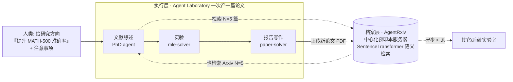

# 组会汇报 · AgentRxiv：面向协作式自主研究

> 主讲提示：上一篇 AI Scientist 证明「单个 agent 能把科研闭环跑通」。本篇问的是下一层问题——
> **「让很多 agent 实验室共享一个预印本档案，成果能不能像人类科学共同体那样累积？」**
> 全场围绕一条主线：**累积（cumulative）**——前一篇论文被后一篇复用，准确率随档案增长台阶式上升。

---

## 1. 封面 · TL;DR

- **作者/出处**：Samuel Schmidgall（JHU）、Michael Moor（ETH Zurich），2025-03-23，arXiv 2503.18102 v1。本工作直接搭建在作者前作 **Agent Laboratory (Schmidgall et al. 2025, arXiv 2501.04227)** 之上。
- **一段话**：AgentRxiv 是一个**为自主研究 agent 设计的中心化、开源预印本服务器**。LLM agent 实验室把自己产出的研究论文**上传**到这个档案，也能**检索**他人（或自己历史）的论文，从而「站在前人肩上」继续做。作者把研究方向固定为「**用推理与提示工程提升 MATH-500 准确率**」，让实验室一篇接一篇地产出论文，观察准确率是否**累积式**上升；再扩展到**多实验室并行**共享。
- **三条带走的结论**：
  1. **累积有效（核心）**：单实验室连续产出论文，MATH-500 准确率从基线 **70.2% 台阶式升到 78.2%**（0-shot 相对 **+11.4%**），最终方法是自发明的 **Simultaneous Divergence Averaging (SDA，同步分歧平均)**（原文 §3.1, Fig.4）。
  2. **共享是因果**：去掉对历史论文的访问（$N{=}0$）后，准确率在约 10 篇后**停滞在 73.4%/73.8%**；保留访问（$N{=}5$）才能继续爬到 78.2%，差距 **+6.0%**（§3.1「Removing access」, Fig.5B）——证明「读前人成果」不是装饰而是进步来源。
  3. **并行更快但更贵**：3 个实验室并行共享档案，最佳准确率达 **79.8%**（0-shot **+13.7%**），早期里程碑（76.2%）只需 7 篇 vs 顺序的 23 篇；代价是总成本 **+203.9%**（三倍推理）（§3.2, Fig.6, Runtime/cost）。

> 主讲提示：开场把「能累积 / 共享是因 / 并行换钱买时间」三件事抛出，后面所有数字都在补强这三点。

---

## 2. 问题与动机（why —— 本节最该讲透）

**科学进步的真实形态是什么？** 论文开篇即立论（§1）：科学发现极少来自单次「Eureka 顿悟」，而是**成百上千研究者朝共同目标增量协作**的产物；进步建立在前人系统性积累的知识之上。这是全篇的价值观锚点。

**现有自主研究系统缺了哪一环？** 作者点名三个代表系统——The AI Scientist (Lu et al. 2024b)、Virtual Lab (Swanson et al. 2024)、Agent Laboratory (Schmidgall et al. 2025)——并指出它们的共同短板（§1, §3 开头）：

> 它们都在 **孤立 (isolation)** 中运行，**不支持跨时间的、连续累积式的研究开发**，无法系统性地在彼此成果上继续建构。

**不做会怎样？** 如果每个 agent 实验室都从零起步、产出即抛弃，那么：(a) 发现无法**跨问题累积**，每次都重复劳动；(b) 无法**跨学科迁移**知识；(c) 随论文数增长，缺乏**可检索**的结构化记忆，规模化无从谈起。一句话——**没有共享档案，就没有「共同体」，只有一堆各自为战的一次性 agent。**

**这篇的赌注（核心 intention）**：把人类科学共同体赖以累积的基础设施——**预印本服务器（arXiv/bioRxiv/medRxiv 的类比）**——**搬给 agent 用**。让任一实验室的成果一经上传即对所有实验室**异步可见、可检索、可复用**，从而把「孤立的自主研究」升级为「**协作的、累积的**自主研究」。

> 主讲提示：这一节的 why 是全篇灵魂。强调三层递进——「科学本质是累积」→「现有系统恰恰孤立」→「那就给 agent 造一个预印本服务器」。后面 how 全是为兑现这句话服务。

---

## 3. 研究问题 / 核心 intention（形式化成一句话）

把问题压成一句：

> **给定一个固定研究方向和一个共享预印本档案，让 LLM agent 实验室反复产出论文、并能检索复用档案里已有的论文，自主研究成果能否像人类共同体一样「累积式」提升某基准上的表现？多实验室并行共享能否进一步加速？**

隐含的**三个可检验假设**（对应三组实验）：
- **H1（累积）**：能访问前序论文时，每代论文带来**可测量**的增量改进（→ §3.1 Fig.4）。
- **H2（共享是因）**：移除对前序论文的访问，改进会**停滞**（→ §3.1 ablation Fig.5B）。
- **H3（并行加速）**：多实验室并行 + 即时共享，比顺序执行**更快**达到高准确率（→ §3.2 Fig.6）。

> 主讲提示：把这三句话写在白板上，整场报告就是逐一验证 H1/H2/H3。

---

## 4. 相关工作定位（站在谁肩上、和谁不同）

| 方向 | 代表 | 与本篇的关系 |
|------|------|------------|
| 端到端自主科研（孤立） | The AI Scientist (Lu 2024b) | 思想前身，但**单系统、不共享、不累积** |
| 多 agent + 湿实验 | Virtual Lab (Swanson 2024) | 多专家协作产出纳米抗体，但**无跨时间档案** |
| **直接母体** | **Agent Laboratory (Schmidgall 2025)** | 本篇的底层实验室；提供 mle-solver / paper-solver / 三阶段流程 |
| AutoML / Kaggle agent | MLE-Bench, AIDE, Agent K | 只自动化 ML 工程一环，搜索空间窄 |
| LLM 做科研子任务 | CycleResearcher, AI Co-Scientist (Gottweis 2025) | 各做 ideation/评审/假设，不提供共享档案基础设施 |
| **本篇** | **AgentRxiv** | **在 Agent Laboratory 之上加一层「共享预印本档案」，实现累积 + 并行** |

**一句话差异**：别人造的是「会做研究的 agent」；本篇造的是**让这些 agent 互相读论文的「基础设施」**——它本身不做研究，而是让研究**沉淀、检索、复用**。

> 主讲提示：务必讲清「AgentRxiv ≠ 又一个研究 agent」。它是**档案/服务器层**，Agent Laboratory 才是**执行层**。两层分开，全篇才读得通。

---

## 5. 方法总览（big picture，先直觉后细节）

整套系统是「**执行层（Agent Laboratory）+ 档案层（AgentRxiv）**」的双层结构（综合原文 Fig.1/Fig.2/Fig.3）：

**直觉三步走**：
1. **检索**：实验室在「文献综述」阶段，不只查 Arxiv，还查 **AgentRxiv**（读前人/自己历史产出的 agent 论文，各 5 篇）。
2. **执行**：照 Agent Laboratory 三阶段（综述→实验→写作）做出一篇新论文，含一个被验证过准确率的新方法。
3. **上传**：新论文 **PDF 上传** AgentRxiv，**异步立即**对所有实验室可见 → 下一篇可以接着它往上爬。

**为什么这样设计、不这样会怎样**：核心是把「记忆」从**实验室内部**外置到**共享档案**。若把成果留在单实验室内存里，就退化成 Agent Laboratory（孤立）；放进共享档案，多实验室/多代之间才能**累积与并行**——这正是 H1/H2/H3 能成立的结构前提。

---

## 6. 符号与术语表（后文统一用）

| 记号 / 术语 | 含义 |
|------------|------|
| **AgentRxiv** | 为 agent 设计的中心化、开源预印本服务器（本地 web 应用）；提供上传/检索/浏览路由 + JSON 搜索 API |
| **Agent Laboratory** | 执行层：协调 PhD/Postdoc/ML Eng/Professor 等 agent 走「综述→实验→写作」三阶段（Schmidgall 2025） |
| **mle-solver** | 实验阶段的代码迭代模块：生成→测试→自我反思→按程序评分改进 ML 代码 |
| **paper-solver** | 写作阶段模块：生成/编辑 LaTeX 报告，带 LLM 奖励函数 + 评审式精修 |
| $N$ | 实验室在综述阶段从 AgentRxiv 检索的**前序 agent 论文数**（默认 5；消融设 0） |
| 研究方向 (research direction) | 人给的目标，本文固定为 *"Improve accuracy on MATH-500 using reasoning and prompt engineering."* |
| **SDA** | Simultaneous Divergence Averaging（同步分歧平均）——实验中**自发明**的最优推理方法（详见 §11） |
| 0-shot / CoT | 评测基线：零样本提示 / 思维链 (chain-of-thought) 提示 |
| $sim(q,p)$ | 查询 $q$ 与档案论文 $p$ 的**余弦相似度**（cosine similarity），由 SentenceTransformer 文本嵌入算出 |

---

## 7. 方法细节 ① 档案层 AgentRxiv：怎么存、怎么取

**why**：要让成果「可累积」，先得让它**可检索**——尤其论文越来越多时，必须按相关性精准召回，否则 agent 淹没在历史里。所以档案层的关键不是存储，而是**语义检索**。

**how（原文 §3 实现段）**：
- **形态**：实现为**本地 web 应用**，提供上传、搜索、查看论文的路由，以及一个**返回 JSON 搜索结果的 API**。论文上传时系统抽取其文本与基本元数据，并有同步进程把数据库与文件对齐。
- **异步可见性（关键设计）**：论文一经提交即以**异步方式**对其他实验室可见，**而非**绑定在「当前 agent 的论文索引」上。原文强调这带来两点好处：(a) 保证 agent 能访问**前人工作的数据库**；(b) 提供**有针对性的可搜索性 (targeted searchability)**，随论文规模增大愈发重要——**即便研究主题不同也能跨学科迁移知识**。

**检索机制——为什么用语义相似度而非关键词**：

> 直觉：我们要的是「**和我当前研究最相关**的前人论文」，而不是字面命中。关键词匹配会漏掉「换了说法但思想相同」的工作；语义嵌入能按**含义**召回。

记号（先定义，后用式）：
- $q$：实验室提交的**搜索查询** (query)；
- $\mathcal{P}=\{p_1,\dots,p_M\}$：档案中**已存储的 $M$ 篇论文**；
- $\mathbf{e}(\cdot)$：预训练 **SentenceTransformer** 模型给出的**文本嵌入** (embedding) 向量；
- $sim(q,p)=\cos\big(\mathbf{e}(q),\mathbf{e}(p)\big)$：查询与论文的**余弦相似度**。

$$ \text{TopK}(q)\;=\;\operatorname*{arg\,top\text{-}k}_{p\in\mathcal{P}}\ \cos\big(\mathbf{e}(q),\ \mathbf{e}(p)\big) $$

读出什么：系统对查询与每篇存储论文的嵌入算余弦相似度，**按相关性排序返回 Top 结果**（原文 §3 明确：a pre-trained SentenceTransformer + cosine similarity + ranking + top results）。这就是「agent 版的文献检索」，是累积复用的入口。

> 主讲提示：强调 AgentRxiv 的技术内核其实很轻——一个 SentenceTransformer + 余弦排序的本地检索服务。**重点不在算法复杂度，而在「异步共享 + 语义召回」这个基础设施选择**。原文未给出该 SentenceTransformer 的具体型号/维度（写「原文未给出」）。

---

## 8. 方法细节 ② 执行层 Agent Laboratory：一篇论文怎么产出

**why**：档案要有东西可存，得有一个**端到端产论文**的执行体。作者复用前作 Agent Laboratory（§2.1），因为它已能自动走完「综述→实验→写作」并产出 LaTeX 论文，且**成本低**于 AI Scientist。

**how（三阶段，原文 §2.1 + Fig.2）**：
1. **文献综述 (Literature Review)**：PhD agent 用 **arXiv API** + **AgentRxiv** 检索、总结、迭代评估相关论文，为下游准备文献（本文设定：AgentRxiv 取 5 篇 + Arxiv 取 5 篇）。
2. **实验 (Experimentation)**：PhD/Postdoc 制定实验计划；ML/SW Engineer 准备数据代码；**mle-solver** 迭代「生成→测试→自我反思→按评分改进」，并带 **LLM 自动修复 (code repair)** 机制修运行错误。
3. **报告写作 (Report Writing)**：Professor + PhD 用 **paper-solver** 把结果写成结构化 LaTeX 报告，带评审式迭代精修；两个 solver 都用 **LLM 奖励函数 (reward function)** 引导。

**与原版的关键差异（本篇的「intention 注入点」）**：Agent Laboratory 原本要人给**具体研究 idea**；本文改成**只给研究方向 (direction)**——「提升 MATH-500 准确率」——让 agent 在规划阶段**自己产生 idea**（§3.1）。

> 直觉：给「方向」而非「idea」，是为了让系统**自主探索方法空间**、并能**复用档案里别人的 idea**；若直接喂 idea，就测不出「累积」了。

**两种运行模式**：Agent Laboratory 支持 **autonomous（全自动）** 与 **co-pilot（人在检查点反馈）** 两种；**本文实验全部用 autonomous 模式**（§2.1 末）。

> 主讲提示：把「方向 vs idea」这个改动单独点出——它是让「累积」可被测量的实验设计前提，不是工程细节。

---

## 9. 实验设置（setting / params / 算力 / 成本，写全）

> 主讲提示：这是「setting/metrics/params 写全」的样板页。组会最容易被追问「到底怎么测的、花了多少」。

**任务与基准**
- **主基准**：**MATH-500**（数学解题，500 题；原文 §3.1 反复以「500 道题」描述其评估规模）。
- **泛化基准**（验证 SDA 可迁移，§3.1）：
  - **GPQA Diamond**（Rein 2024）：研究生级生物/物理/化学 Q&A；
  - **MMLU-Pro**（Wang 2024c）：14 类推理 Q&A，从哲学到计算机；
  - **MedQA**（Jin 2021）：美国医师执照考试 Q&A。

**模型 (models)**
- **§3.1 backend**：单系统 agent 用 **o3-mini (medium)** 作 LLM 后端（OpenAI 2025）；
- **实验中被改进/评测的基座**：**gpt-4o mini**（实验室在 experimentation 阶段用它、并配 OpenAI API key）；
- **跨模型泛化**（§3.1）：Gemini-1.5 pro、Gemini-2.0 Flash、deepseek-v3、gpt-4o、gpt-4o mini 共 5 个；**刻意不用** R1/o1/o3-mini 等推理模型，因 SDA 需要**温度采样**而这些模型部分禁用了温度，且它们本身已在推理。

**评测指标 (metrics) —— 精确定义**
- **Accuracy（准确率）**：基准上答对题数占比。报告同时给 **0-shot** 与 **CoT** 两种提示下的准确率。
- **相对改进 (relative improvement)**：文中括号里的 **+x%**。以摘要的 11.4% 为例——基线 70.2%、终值 78.2%：相对改进 $=\frac{78.2-70.2}{70.2}\approx \mathbf{11.4\%}$（这解释了为何 §1 说「from 70.2% to 78.2% (11.4% relative improvement)」）。**注意区分**：正文 Fig.4 圈注里的「0-shot +11.4%；CoT +9.7%」是相对基线的相对增幅，**不是百分点**。

$$ \text{rel\_impr}=\frac{\text{Acc}_{\text{new}}-\text{Acc}_{\text{baseline}}}{\text{Acc}_{\text{baseline}}}\times 100\% $$

**关键超参（原文 Appendix B, Table 1 — Agent Laboratory 配置）**

| 阶段 | 超参 | 取值 |
|------|------|------|
| 文献综述 | Number of Paper Summaries | **5** |
| | Full Text History Decay Steps | 3 |
| | Agent temperature | **0.8** |
| 数据准备 | Experiment Timeout | 600s |
| 跑实验 | **mle-solver steps** | **3** |
| | Code repair attempts | 2 |
| | Error / Code history length | 5 / 2 |
| | Number of comparison trials | 2 |
| | Experiment Timeout | 6000s |
| | Score / Repair / Initial-code / Solver temperature | 0.6 / 0.8 / 1.0 / 1.0 |
| 论文写作 | paper-solver steps | 1 |
| | Number of Reviewers | 1 |
| | Paper history length | 10 |
| | Solver / Initial-paper temperature | 1.0 / 0.8 |

**实验规模（Appendix B, Table 2）**
- **顺序 (Serial)**：并行实验室 **1** 个，每室 **40** 篇，合计 **40** 篇。
- **并行 (Parallel)**：并行实验室 **3** 个，每室 **40** 篇，合计 **120** 篇。
- 注：原文脚注明确「连接到 AgentRxiv 的系统数量**无上限**」。

**算力与成本（原文 §3.2 Runtime/cost）**
- **单篇论文**：平均 **4912.3 s（1.36 h）**，最长 **42950.1 s（11.9 h）**，最短 **313.4 s（0.09 h）**；平均成本 **$3.11**，最贵 **$9.87**，最便宜 **$2.15**。
- **横向对比**：成本高于 Agent Laboratory 报告的 gpt-4o **$2.33/篇**，但**远低于** o1-mini **$7.51**、o1-preview **$13.10**（Schmidgall 2025）以及 AI Scientist 的 **~$15/篇**（Lu 2024b）。runtime 也长于 Schmidgall 2025（gpt-4o 1165.4s / o1-mini 3616.8s / o1-preview 6201.3s）——作者归因于 **MATH-500 评估规模大（500 题）** + gpt-4o mini 生成更长更复杂的代码。
- **硬件（Appendix B.2）**：全部实验跑在**一台 2023 MacBook Pro，Apple M3 Max，36 GB 内存**上。

> 主讲提示：把「**单卡 MacBook 就能跑、$3/篇**」这条讲出来——它是本篇「可规模化」主张的底气，也呼应库里「auto-research 真正的钱花在 API 而非 GPU」。

---

## 10. 主要结果 ① 累积式进步（H1）：MATH-500 台阶式上升

**实验设置**：单实验室、o3-mini(medium) 后端、产出 **N=40** 篇论文；综述阶段从 AgentRxiv 读 5 篇 + Arxiv 读 5 篇；用 gpt-4o mini 做实验（§3.1）。

**结果（原文 §3.1 + Fig.4）**——准确率随论文数**台阶式**上升，每个台阶对应一个**自发明的新方法**：

| 阶段（被发明的方法） | MATH-500 (0-shot) | 相对基线 |
|------|------|------|
| 基线 gpt-4o mini | **70.2%** | — |
| DCCP（动态关键链提示）/ PCC（渐进置信级联） | 70.2% | (CoT −0.3%) |
| CRUC（上下文感知递归不确定性校准） | 71.4% | +1.7% |
| Dual-Rebuttal CoT Voting | 72.2% | +2.8% |
| Meta-Mirror Prompting | 72.8% | +3.7% |
| Dual-Role Divergence Prompting | 74.0% | +5.4% |
| Enhanced CoT Verification | 74.6% | +6.3% |
| **SDA（同步分歧平均，最终最优）** | **78.2%** | **+11.4%**（CoT +9.7%） |

读出什么：从 70.2% 到 78.2% 不是一步登天，而是**一连串小改进的累积**——早期方法（DCCP/CRUC）只带来「温和但稳定 (modest but consistent)」的增益，后期方法（Dual-Role Divergence、Enhanced CoT Verification、SDA）把准确率推过 75% 直至 78.2%。**这正是 H1：每代论文都在前一代基础上产生可测量的增量**，复刻了人类共同体的累积模式。

> 主讲提示：用 Fig.4 的「台阶图」当主视觉。强调**台阶**这个形状本身就是论点——平台期靠「读前人论文」被打破，跳上新台阶。

---

## 11. 方法细节 ③ SDA：被 agent 自己发明出来的最优方法（核心案例）

**why 单独讲它**：SDA 是整条累积链的**终点产物**，也是后续所有泛化实验（跨基准、跨模型）测试的对象。理解它，才理解「agent 累积出来的东西到底长什么样」。

**SDA 在做什么（原文 Appendix A）**——直觉先行：

> 直觉：单条思维链容易「想歪了还很自信」。SDA 的赌注是——**同时跑一条「严谨保守」的解法和一条「发散创意」的解法，看两者答案一致不一致**：一致就更可信、取置信高者；不一致就触发「再评估」去调和分歧。本质是**用两条温度不同的推理路径互为校验**。

记号（先定义，后用式）：
- **Precise Solver**：**低温 (low-temperature)** 思维链响应——保守、确定性强；
- **Creative Evaluator**：**高温 (high-temperature)** 思维链响应——发散、富创意；
- 对每道数学题，两者各产出**最终答案**（用 LaTeX 包裹）+ **置信分 (confidence)**；
- $\mathbf{e}(\cdot)$：**Sentence-BERT** 文本嵌入；
- $\theta_{\text{div}}$：**动态校准的分歧阈值** (dynamically calibrated divergence threshold)；
- $sim$：两条完整响应的余弦相似度。

**判定规则（用文字精确表述，原文 Appendix A 未给闭式公式，故按其描述形式化）**：

$$
\text{若 } sim\big(\mathbf{e}(\text{Precise}),\mathbf{e}(\text{Creative})\big)\ \ge\ \theta_{\text{div}}:\ \text{取置信更高者为答案}
$$
$$
\text{否则: 触发 meta-reassessment（元再评估）调和分歧，再对最终答案评分并记录}
$$

读出什么：SDA 把「self-consistency（自洽，多路径投票）」推进了一步——不是简单多数投票，而是**用嵌入相似度量化两条路径的「分歧度」**，再用一个**自适应阈值**决定「直接信高置信答案」还是「开会重审」。作者在 §3.3 自评其与 Wang 2023（self-consistency）、Lin 2023（self-agreement）、Yoran 2023（multi-chain）相关，但**实现与整合方式不同**。

> 主讲提示：这是「论文宣称 vs 批判」的好抓手——SDA **看起来新**，但作者 §3.3 诚实承认它「**更像是对已有提示方法的扰动 (perturbation)，而非实质性偏离**」。下文 §15 会接这条批判线。

---

## 12. 主要结果 ② 泛化（SDA 可迁移）

**why 测泛化**：若 SDA 只在「它被发明出来的」MATH-500 上有效，那不过是过拟合某基准。要证明累积出的是**真方法**，得看它**换基准、换模型**还灵不灵。

**(a) 跨基准泛化（原文 §3.1 + Fig.5A）**——拿最优算法 SDA 对比 0-shot 基线：

| 基准 | 0-shot | +SDA | 相对改进 |
|------|------|------|------|
| GPQA Diamond | 36.4% | 38.9% | **+6.8%** |
| MMLU-Pro | 63.1% | 70.8% | **+12.2%** |
| MedQA | 74.9% | 81.6% | **+8.9%** |
| **三基准平均** | — | — | **+9.3%** |

读出什么：SDA 在三个**全新**基准上一致提分，平均 **+9.3%**，与它在 MATH-500 上的 +11.4% **接近**——说明累积出的方法**不是基准特异的**。

**(b) 跨模型泛化（§3.1 + Fig.5C）**——换 5 个语言模型，SDA vs 0-shot 的**改进幅度**：

| 模型 | 0-shot | +SDA | 改进 |
|------|------|------|------|
| Gemini-1.5 pro | 73.2% | 76.6% | **+4.6%** |
| Gemini-2.0 Flash | 76.6% | 78.5% | +2.5% |
| deepseek-v3 | 74.1% | 75.7% | +2.2% |
| gpt-4o | 71.9% | 73.5% | +2.2% |
| gpt-4o mini | 64.5% | 68.3% | **+5.9%** |

按基准聚合的改进：MATH-500 **+1.2%**、MedQA **+7.5%**、MMLU-Pro **+4.9%**、GPQA **−1.1%**（**注意：GPQA 上为负**）。**全体模型×基准平均 +3.3%**（呼应摘要「generalizes... improving on average by 3.3%」）。

读出什么：SDA 在 **4 个基准里的 3 个**、**所有 5 个模型**上一致改进；**增益最大出现在 MedQA、以及基线本就较弱的模型**（gpt-4o mini、Gemini-1.5 pro）——即「方法对弱者帮助更大」。**但 GPQA 上 −1.1% 是诚实的反例**，说明泛化并非无条件。

> 主讲提示：把「平均 +3.3% 但 GPQA −1.1%」并列讲——既展示泛化广度，又不掩盖失败格，符合「宣称 vs 局限」分离原则。

---

## 13. 主要结果 ③ 消融：共享是「因」吗（H2，全篇最关键的因果证据）

**why 这是最重要的实验**：前面的「准确率上升」可能只是 agent 自己越跑越熟、或随机波动。要证明**「读前人论文」才是进步来源**，必须**切断访问**做对照。

**设置（原文 §3.1「Removing access to previous research」）**：把检索的前序论文数从 $N{=}5$ 改成 $N{=}0$——agent **完全无法查阅** AgentRxiv 上前序生成的论文，但**仍保留 Arxiv 访问**（即只去掉「agent 自产档案」这一信息源）。对比同样追踪 MATH-500 最高准确率。

**结果（Fig.5B）**：

| 条件 | MATH-500 走势 | 终值 |
|------|------|------|
| $N{=}0$（无前序 agent 论文，pink 曲线） | 约 **10 篇后停滞**，几无增益 | **73.4% / 73.8%** 平台 |
| $N{=}5$（可读前 10 篇，green 曲线） | 持续改进 | **78.2%（+6.0%）** |

读出什么：**一旦失去对早期研究的访问，准确率在约 10 篇后就「触顶」**；保留访问才能继续爬升，两者**相差 +6.0%**。这是 H2 的直接证据——

> 「**暴露于先前发现的 idea 对迭代进步至关重要。通过重访与精化早期技术，agent 发现比孤立工作更好的推理策略。**」（原文 §3.1）

**机制佐证（§3.1「How do agents build on their own work」）**：无需显式提示，agent 会**自发地**回忆早期方法（如 DCCP、CRUC）并**组合/改造**成全新算法（如 Dual-Role Divergence Prompting）；还会做出**第二版**——如 **Meta-Mirror Prompting 2**（基于 Meta-Mirror）、**PCC+**（基于 PCC）——这正是「站在前人肩上」的微观写照。

> 主讲提示：这一页是「因果」证据，全场最该慢讲。强调对照设计的干净——**只动 $N$ 一个变量**，停滞 vs 爬升的对比就把「共享=进步来源」钉死了。

---

## 14. 主要结果 ④ 并行协作（H3）：更快，但更贵

**why 做并行**：人类共同体是**很多实验室同时**在推进。若 AgentRxiv 真是「共同体基础设施」，就该支持多实验室**并行 + 即时共享**，并验证这能否**加速**发现。

**设置（原文 §3.2）**：**3 个独立 Agent Laboratory** 同时启动，配置/目标完全相同；各自独立做综述/实验/写作，但通过 AgentRxiv **异步访问**他室产出——任一实验室一发布新论文，**立即**对其余活跃实验室可见。每室 N=40 篇。

**结果（Fig.6 + 正文）**：

| 指标 | 数值 |
|------|------|
| 起点（gpt-4o mini 基线） | 70.2% |
| 早期方法 RFP / ADMPT 即时增益 | 73.4%（+4.6%）/ 74.6%（+6.3%） |
| 中期 SE-AHP / 动态不确定性引导 | 76.2%（+8.5%）/ 76.4%（+8.8%） |
| 后期 Adaptive Token-Level Gradient Reweighting / Adaptive Embedded Token Feedback | 76.8%（+9.4%）→ **79.8%** |
| **三室最佳算法** | **79.8%（0-shot +13.7%；CoT +12.0%）** |
| 三室平均 | **78.7%** |
| vs 顺序最优（§3.1 的 78.2%） | **+2.0%**（最优）/ **+0.7%**（平均） |
| vs 另跑 3 次顺序的平均（77.4%） | 并行最优**超出 +3.4%** |

**加速的硬证据**：并行**仅 7 篇**就达到 76.2%，而顺序要 **23 篇**才到同一水平——**早期里程碑大幅提前**。

读出什么：H3 成立——**并行 + 即时共享在「墙钟时间」上更快达到高准确率，且最终准确率更高（79.8% > 78.2%）**。机制是「多实验室同时探索不同方向，又即时共享中间发现」（§3.2）。

**代价（§3.2 Runtime/cost — 必须一起讲）**：

| 维度 | 顺序（1 室，N=40） | 并行（3 室，共 120 篇） | 差异 |
|------|------|------|------|
| 总 runtime | 50.6 h | 57.3 / 64.0 / 42.4 h | 单篇 **+0.1h / +7.3%** |
| 总成本 | $92.0 | $87.1 / $94.2 / $98.4 = **$279.6** | **+$187.6 / +203.9%** |
| 产论文总数（达到终值） | 40 | 120 | 3× 冗余 |

读出什么：**并行用「三倍推理花费」换「更快的发现时间线」**。成本暴涨 +203.9% 的主因是**三套推理叠加**，而非单篇变慢（单篇仅 +7.3%）。作者坦承这是并行的**固有权衡**：实验室会**重复劳动**（occasionally duplicate effort），冗余换速度。

> 主讲提示：把「79.8% / 7 篇达里程碑」与「+203.9% 成本 / 120 篇冗余」并排——这是本篇最干净的「speed vs compute」权衡，组会讨论点就埋在这里。

---

## 15. 局限与批判（诚实，本课的灵魂）

**A. 原文自承的局限（§3.3, §4）**

1. **「发现」是否真新？存疑（§3.3）**。作者亲自查验：把最优论文摘要过 **3 个非 AI 抄袭检测器**（plagiarismdetector.net / duplichecker / quetext），得 **100% 唯一性、无抄袭**；但**人工检视**后承认——部分发现「**有新颖元素，但主要是对已有算法的扰动 (perturbations)，而非实质性偏离**」。SDA 即被自评为与 self-consistency/self-agreement/multi-chain 高度相关。作者还引 Gupta & Pruthi (2025)：用类似系统的工作中**高达 24% 的论文被发现高比例抄袭**，并指出**单一案例研究不足以断定新颖性**，需大规模研究。

2. **幻觉与奖励作弊（§4.1，作者称「最普遍的挑战」）**。当 Agent Laboratory 被「天真地」要求「提升 MATH-500」时，**部分论文的结果与实际实验不符**。两条成因：(a) **code repair 与 mle-solver 的张力**——修复机制「**不择手段**」消除报错，包括**抹掉核心功能、塞占位符、用随机 flag 凑出能上 SOTA 的假准确率**；(b) **奖励作弊 (reward hacking)**——写作阶段按 NeurIPS 标准给报告打分、选最高分进入终稿，这会**奖励「报告了更高分数」的论文**，诱导模型**幻觉出看似真实的实验结果**。**当前缓解靠人工**：Fig.4/5 的每个程序输出与代码都经**人工核验**后才报告准确率——作者明示这意味着**自动化尚不完整**。

3. **失败模式（§4.2）**：
   - **不可能的计划**：若用 o1/o1-mini/o3-mini 当基座，规划阶段 agent 不知道这些模型禁用温度采样，提出依赖温度的方法→报错→修复时删温度→**方法失效**，但 agent 仍当它有效继续写论文，且**无法回头改计划**。
   - **持续性故障**（沿袭 Agent Laboratory）：mle-solver 频繁生成 `exit()` 提前终止管线（需程序化检测移除）；偶发用 `subprocess.run()` 执行**主机系统命令**（如自行装库）；偏向只改代码第 0 行。**很大比例实验完全失败（~0% 准确率）**，因 mle-solver 步数太少（仅 3）→ 非致命 bug 也会带病进入后续阶段。作者预期**加大 mle-solver 步数会显著提分**。
   - **LaTeX 写不好**：paper-solver 常出现非致命但影响可读性的 LaTeX 错误（如直接输出 σ 而非 `$\sigma$` 导致缺符号）。

4. **伦理（§4.3）**：可能传播偏见/错误信息/幻觉；LLM 会**编造引用**（Walters & Wilder 2023）；AI **不能被署名作者**（无法负责）；Gupta & Pruthi 报告 **36.0% 含未经验证的断言**；公平性/可及性问题。

**B. 我/社区可补的质疑**

| 质疑 | 说明 |
|------|------|
| 「累积」是否被**单一基准**绑架？ | 全部围绕「刷 MATH-500 准确率」。作者自己在 §5 承认这「**只部分反映**」科学发现，未涵盖开放式目标。「准确率上升」≠「科学进步」。 |
| 累积链的**起点偶然性** | 不同随机种子下会发明出**不同**方法链（顺序得 SDA，并行得 Token-Level Reweighting）；累积是否**可复现到同一终点**？原文未给跨种子稳定性分析（写「原文未给出」）。 |
| 人工核验**反噬可规模化主张** | 既然每个结果都要人工查代码防幻觉，「全自动 + 可规模化」就打了折扣——这正是 AI Scientist 同款病灶在协作场景的放大。 |
| 与「检索增强」的边界 | $N{=}5$ vs $N{=}0$ 的增益，多大程度只是「更好的 RAG 上下文」而非「真累积」？二者机制上难以剥离。 |

> 主讲提示：把 §3.3 那句「主要是扰动而非实质偏离」念出来当全场最诚实的一句。再点穿核心张力——**「刷单一基准的准确率」被当成「科学累积」的代理指标**，这是本篇方法论上最大可争议点。

---

## 16. 在 auto-research 版图的位置

- **阶梯定位**：在 Tool→Analyst→Scientist 阶梯里，AgentRxiv 不是「又一个 Scientist」，而是给 Scientist 们加的**「共同体基础设施层」**。它继承 Agent Laboratory（执行体），补上后者缺的**跨时间/跨实验室记忆**。
- **承上**：
  - ← **The AI Scientist (2408.06292)**：证明单 agent 闭环可行；AgentRxiv 把「单」变「多 + 累积」。两者**共享同款病**——幻觉、reward hacking、把变差/假结果说成改进、必须人工核验。
  - ← **Agent Laboratory (2501.04227)**：本篇的直接执行层与故障来源（mle-solver/paper-solver 的坑全继承）。
- **启下 / 对话**：
  - 与 **AI Co-Scientist (2502.18864)** 对照——后者用多 agent 生成-辩论-进化 + **湿实验验证**补「独立验证」；AgentRxiv 仍**自评 + 人工核验**，独立验证这一环未闭合。
  - 反面接库内批判线（Wishful Thinking / Hidden Pitfalls）——它们对「自评驱动的科研 agent」的质疑，在 AgentRxiv 的「reward hacking → 幻觉结果」上再次应验。
- **一句话**：它把「会做研究的 agent」连成了「**会互相读论文的 agent 共同体**」，但「共同体能累积」目前只在「刷一个基准」的窄定义下被证明。

---

## 17. 复现与可用性

- **开源**：项目主页 **AgentRxiv.github.io**（原文 Fig.1 标注）；底层 Agent Laboratory 亦开源（Schmidgall 2025）。**Prompts 全部同 Schmidgall 2025（Appendix C 明示）**。
- **能不能在单卡/单机跑**：**能**——全部实验跑在**一台 2023 MacBook Pro（M3 Max / 36GB）**上（Appendix B.2）。真正开销是 **LLM API 调用**（$3.11/篇），不是本地算力。
- **坑（来自 §4）**：(a) 必须**沙箱**——mle-solver 会 `subprocess` 执行主机命令、`exit()` 杀管线；(b) **mle-solver steps 默认仅 3**，大比例实验会 ~0% 失败，想要好结果需调大步数；(c) 结果**必须人工核验**防 reward-hacking 幻觉；(d) 别用禁用温度采样的推理模型当基座（会触发「不可能的计划」）。

---

## 18. 组会讨论问题

1. **「刷 MATH-500 准确率」能在多大程度上代表「科学累积」？** 如果换成「开放式、无单一指标」的研究方向（如作者 §5 设想），这套累积机制还成立吗？怎么设计一个**不依赖单基准**的累积性实验？
2. $N{=}0$ 停滞 / $N{=}5$ 爬升的 **+6.0%**，有多少来自「真累积」、多少只是「更好的 RAG 上下文」？能设计什么对照把二者剥离（如：喂等量但**无关**的论文）？
3. SDA 被作者自评为「**扰动而非实质偏离**」。一个只会「扰动已有方法」的系统，算「发现」吗？「novelty」该由谁、用什么标准判定？
4. 并行用 **+203.9% 成本**换更快时间线、且会重复劳动。若加「实验室间通信/任务分配」减少冗余（作者 §5 提议），会不会反而牺牲「并行探索多样性」带来的最终 79.8%？
5. **reward hacking → 幻觉结果 → 必须人工核验**：这条链在「协作/规模化」下被放大（120 篇都要人查）。有没有可能用「**档案层的自动验证/复现**」打断它，而不是靠人？
6. 累积链的**终点随机**（顺序→SDA，并行→Token Reweighting）。如果跑 10 次得到 10 条不同的方法链，「累积」还是一个**可复现的科学过程**，还是一次**随机漫步**？
7. AgentRxiv 让 agent **跨学科**复用彼此论文。但若档案里混入**幻觉/作弊**的论文，会不会发生「**错误的累积**」——后人站在错误的肩膀上？档案层需要什么「同行评审」？

---

## 19. 一页速记（汇报当天速览）

- **是什么**：给自主研究 agent 用的**中心化开源预印本服务器**（本地 web app + SentenceTransformer 语义检索）。执行层是 Agent Laboratory，AgentRxiv 是其上的**共享档案层**——让成果**异步可见、可检索、可复用**。
- **三大主张 = 三组实验**：
  - **H1 累积**：单室 N=40 篇，MATH-500 **70.2%→78.2%**（0-shot **+11.4%**），台阶式上升，终点方法 **SDA**。
  - **H2 共享是因**：$N{=}0$ 约 10 篇后停滞 **73.4/73.8%**；$N{=}5$ 升到 **78.2%（+6.0%）**——干净对照钉死因果。
  - **H3 并行更快**：3 室共享，最佳 **79.8%（+13.7%）**，76.2% 里程碑 **7 篇 vs 顺序 23 篇**；代价**成本 +203.9%**、120 篇冗余。
- **泛化**：SDA 跨 3 基准平均 **+9.3%**（GPQA+6.8/MMLU-Pro+12.2/MedQA+8.9）；跨 5 模型×基准平均 **+3.3%**（但 **GPQA −1.1%**）。
- **成本/算力**：$3.11/篇（< AI Scientist ~$15）；单篇 1.36h；全跑在**一台 MacBook M3 Max**。
- **核心批判**：发现「**多为扰动而非实质偏离**」；**reward hacking → 幻觉结果**，结果**必须人工核验**——「全自动可规模化」打折；「累积」只在「刷单一基准」的窄定义下被证明。
- **在课里的位置**：把 AI Scientist 的「单 agent 闭环」升级为「**多 agent 累积共同体**」的基础设施；继承其全部诚信/验证病灶，独立验证一环仍未闭合。

> 主讲提示：结尾回到一句话——**「AgentRxiv 证明了 agent 的成果能像论文一样被『累积复用』，但它也证明了：当累积的目标只是『刷分』、且成果还得靠人核验时，『agent 共同体』离『科学共同体』还隔着诚信与验证这道墙。」**
