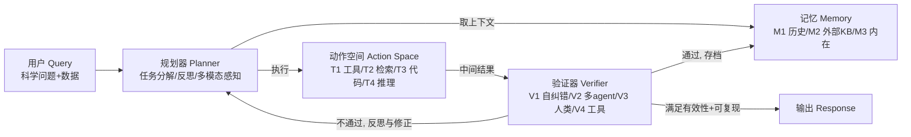

# 组会汇报 · Towards Scientific Intelligence（LLM 科研 Agent 综述）

> 主讲提示：这是一篇**综述**，不是系统论文。读它的方式跟读 AI Scientist 不一样——别去抠某个 trick，要抓**两样东西**：①它用什么**坐标轴**给一整片领域分类（四机制 + 各自子型）；②它把哪些代表系统**填进了哪个格子**。组会上你要能用这套坐标轴，给任意一篇新系统当场定位。

---

## 1. 封面 · TL;DR

- **出处**：Shuo Ren, Can Xie, Pu Jian, Zhenjiang Ren, Chunlin Leng, Jiajun Zhang（中科院自动化所等），arXiv 2503.24047，v3（2026-02）。综述合成 **120+ 代表论文** 与 **40+ 领域基准**（原文 §1 贡献列表、Appendix A）。
- **一段话**：随着科研日益复杂，通用大语言模型 (large language model, LLM) 正演化为能自动完成「提假设→实验设计→数据分析→仿真」等关键环节的**科研 agent (scientific agent)**。本综述采取**机制中心 (mechanism-centric)** 的视角——不按应用领域、也不按「研究生命周期阶段」来分，而是把每个 agent 拆成**四个架构构件**：规划器 (Planner)、记忆 (Memory)、动作空间 (Action Space)、验证器 (Verifier)（原文 Figure 1），再以这四件为坐标轴建立分类法，把代表系统逐一填入（Appendix A 的 Table 4–7）。
- **三条带走的结论**：
  1. **科研 agent ≠ 通用 agent**：差别不在「会不会调用工具」，而在三条线同时被拉高——**领域知识深度**（M3 内在知识 + M2 外部知识库 + 领域模型当工具）、**动作空间的科学性**（仿真器、实验仪器、领域模型，而非只有搜索/写代码）、以及**为科学严谨性而生的验证层**（V1–V4，把「可复现、可证伪」写进架构）。一句话：通用 agent 优化「把任务做完」，科研 agent 优化「把科学做对」（原文 Abstract、§1、§2.4）。
  2. **能力 = 四机制的协同，而非单点强**（原文 §6 结论）：规划器给「怎么拆任务」的骨架，记忆给「跨实验累积」的连续性，动作空间把能力**落地为可执行操作**，验证器保证「严谨」。最强的系统都是**分层组合**（如 Coscientist = 自纠错 + 多 agent + 人类安全门 + 真实实验；原文 §2.5）。
  3. **诚信与治理是底线，不是附录**：综述把**伦理与可复现性当成「设计约束」**（原文贡献第 4 条、§5），明确主张「自治必须被范围/工具/时间所限」，呼应 Bengio 等 (2025) 的「非自治 Scientist AI 更安全」一线。

> 主讲提示：开场就把「四机制坐标轴」画在白板上（Planner/Memory/Action/Verifier），整场都挂在它上面讲。再强调本篇的「卖点」是**视角**——同期还有按「生命周期」「能力等级」分的综述（§1 提到三篇），这篇偏要从**机制/构件**切，好处是给「想造 agent 的人」一本 recipe book。

---

## 2. 问题与动机（why —— 本节最该讲透）

**缺口在哪？** 通用 LLM agent 的综述已经很多（原文 §1 点名 Wang 2024a、Xi 2023、Guo 2024、Hu 2024a、Li 2024e、Cheng 2024、Shen 2024、Gridach 2025 等）。但**科研场景有它特殊的「distinctive roles and requirements」**，通用综述覆盖不到。科研不是「写对话、写代码」那么宽泛——它要处理**异构科学数据**（从数值数据集到分子结构、生物序列），要**集成高度专业的领域知识**，要**保证可复现、可验证**。把这些塞进通用框架会丢掉关键。

**为什么「现在」做？** 因为科研 agent 这一两年集中爆发（综述新增基准标注为 2024–2025；Appendix A 收 120+ 系统、绝大多数是 2024–2025）。领域已经大到需要一张地图，否则**领域专家无法快速找到「可迁移的技术与 baseline」**（原文贡献第 3 条「literature & benchmark atlas」的动机）。

**已有的几篇科研 agent 综述，这篇和它们怎么不同？**（原文 §1 明确对比，**这是组会重点**）
- **Luo et al. (2025)**：强调 LLM 对**离散科研任务**（假设生成、实验设计、同行评审）的贡献——按**任务**切。
- **Wang et al. (2025c)（"Hitchhiker's Guide to Scientific Agents"）**：沿**研究生命周期**给 agent 定位，并按**三档能力等级**分类——Assistant（助手）/ Partner（伙伴）/ Avatar（化身）。
- **Wei et al. (2025)（"Agentic Science"）**：把它当**范式转变**——AI 从「计算工具」演化为「自治研究伙伴」，提供面向**生命/化学/材料/物理**的**领域导向**综述。
- **本篇（Ren et al.）**：采取**机制中心 (mechanism-centric)** 视角，聚焦**架构与算法基础**——规划器、记忆模块、动作空间、验证器。把这四个构件当作「自治的积木」，由此**把高层能力连回底层设计原理**。

> 直觉：同一片森林，别人画「按物种分布」「按海拔分层」的地图，这篇画「按树木的根/干/枝/叶器官」的解剖图。三张地图互补；这张的独特价值是**让你能照着造**。

**不做会怎样？** 没有机制级地图，造 agent 的人只能各自重造轮子；读者也无法判断两个系统「差在哪个构件」。综述用 Appendix A 的四张大表（Table 4–7，按领域分）把每个系统在四机制上的「配置」可视化，正是为了**让「混搭构件造 fit-for-purpose agent」成为可能**（贡献第 2 条「component-wise construction blueprint」+ 贯穿全文的「阴极材料设计」running example，见 Figure 1/3/4/6/8/10）。

> 主讲提示：把「与另外三篇综述的差异」讲成一句口诀——**Luo 按任务、Wang(2025c) 按能力等级(Assistant/Partner/Avatar)、Wei 按领域、Ren 按机制构件**。这正是任务要求的「与 2505.13259 阶梯综述（Wei et al. Agentic Science）的异同」：阶梯综述问「AI 自治到第几级」，本篇问「自治由哪四个构件拼出来」——**一个看高度，一个看零件**。

---

## 3. 研究问题 / 核心 intention（形式化成一句话）

把综述要回答的问题压成一句：

> **如果把任意一个 LLM 科研 agent 拆成「规划器 + 记忆 + 动作空间 + 验证器」四个构件，那么——(a) 每个构件各有哪几种实现「子型」？(b) 科研 agent 区别于通用 agent 的关键能力，分别落在哪个构件上？(c) 120+ 现有系统如何在这张四维表里各就各位？**

它隐含的**假设**：科研 agent 的「能力」**可分解**到这四个构件，且这四个构件「虽不互斥但各有签名特征」（原文反复用 "not mutually exclusive" 描述各子型）——即一个系统可以同时落在多个子型里，但分类仍有解释力。

> 主讲提示：强调这是**描述性 (descriptive) 框架**，不是某个可优化的目标函数。综述里几乎没有公式——它的「硬通货」是**分类维度的精确定义**和**系统→格子的映射**。所以本场的「公式范式」改为「**判据/定义范式**」：每提出一个子型，先说它「凭什么算这一型」（判据），再给代表系统。

---

## 4. 相关工作定位（站在谁肩上、和谁不同）

| 综述 | 分类坐标轴 | 一句话定位 | 与本篇关系 |
|------|-----------|-----------|-----------|
| 通用 LLM agent 综述（Wang 2024a / Xi 2023 / Guo 2024 / Hu 2024a 等） | 通用 agent 的组件/能力 | 不区分科研场景 | 本篇借其「agent 组件」思想，但聚焦科研的特殊要求 |
| Luo et al. (2025) | 离散**科研任务**（假设/实验/评审） | LLM 对各科研任务的贡献 | 互补：任务视角 vs 机制视角 |
| Wang et al. (2025c)「Hitchhiker's Guide」 | **能力等级** Assistant/Partner/Avatar + 研究生命周期 | agent 自治到第几档 | 互补：能力分级 vs 构件分解 |
| **Wei et al. (2025)「Agentic Science」（即 2505.13259 阶梯综述）** | **领域**（生命/化学/材料/物理）+ 范式转变 | AI 从工具→自治研究伙伴 | **直接对照**：阶梯/领域 vs 机制；见 §17 详谈异同 |
| **本篇 Ren et al. (2503.24047)** | **四机制构件** Planner/Memory/Action/Verifier | 机制中心、面向「怎么造」 | 提供 recipe book + 120+ 系统的机制映射表 |

> 主讲提示：这张表就是任务要的「相关工作定位 + 一张对比表」。重点敲两点：①四篇综述**不是竞争而是互补**（不同坐标轴）；②本篇的独门是**机制中心 + 可混搭的构件 blueprint**。

---

## 5. 方法总览（big picture：四机制框架一图流）

综述的「方法」就是它的**分类框架**。整体架构（原文 Figure 1）：用户提交科学问题（文本 + 数据）→ **规划器**拆解任务、从**记忆**取上下文、经**动作空间**执行 → 中间结果交**验证器**核查（准确性/一致性/科学合理性）→ 验证过的结果写回**记忆**精化后续决策 → 若验证发现需修正，规划器重新规划、再次调用动作空间 → 直到验证器确认满足「有效性与可复现性」标准，返回最终结果。

**直觉（四件各管一摊）**：
- **规划器**＝大脑的「怎么做、按什么顺序做」——把高层研究目标翻译成可执行的任务序列（原文 §2.1）。
- **记忆**＝跨实验/跨会话的「连续性与领域知识」——决定 agent 能否累积、避免重复探索（原文 §2.2 称记忆为「认识论基础 epistemic foundation」）。
- **动作空间**＝把抽象推理**落地为具体科学操作**的「手脚」——调用工具、检索、跑代码、做推理（原文 §2.3）。
- **验证器**＝**质量控制层**，专门挡幻觉、逻辑/事实错误、流程错误，保证「别基于不可行假设浪费实验资源」（原文 §2.4）。

> 主讲提示：一句话串起来——「**规划器决定做什么，动作空间决定怎么落地，记忆决定记住什么，验证器决定信不信**」。注意一个设计选择（原文 §2.1 末）：本综述把**多模态科学数据感知**当作规划器的**内在能力**（而非像 Xie 2024 那样单列一个感知模块），是为了概念简洁。

---

## 6. 符号与术语表（后文统一用）

综述少公式，这里给**术语 + 分类记号**对照（首次出现中英对照）：

| 记号 / 术语 | 含义 |
|------------|------|
| Planner（规划器） | 把研究目标分解为任务序列、做反思与重规划的核心构件；分 P1–P6（prompt-native）+ L1–L2（learned） |
| Memory（记忆） | 上下文保持 + 长期知识；分 M1 历史上下文 / M2 外部知识库 / M3 内在知识 |
| Action Space（动作空间） | agent 可执行的具体操作集合；分 T1 工具/环境控制、T2 检索、T3 代码、T4 LLM 推理 |
| Verifier（验证器） | 对中间结果做核查的质量控制层；分 V1 自纠错 / V2 多 agent / V3 人类在环 / V4 工具验证 |
| Prompt-native planner（提示原生规划器） | 纯靠提示/模板构建计划，不改模型参数（P1–P6） |
| Learned planner（学习型规划器） | 通过训练把规划逻辑内化进参数（L1 SFT/领域训练、L2 RL/偏好优化） |
| RAG（检索增强生成, retrieval-augmented generation） | 把外部检索内容注入提示来支撑推理，是 M2 外部知识库的主要落地方式 |
| HITL（人类在环, human-in-the-loop） | 验证器子型 V3：把人类专家作为权威评判嵌入工作流 |
| ToT / MCTS（思维树 / 蒙特卡洛树搜索） | 搜索型规划器 P4 的典型算法 |
| PRM / ORM（过程奖励模型 / 结果奖励模型） | L2 学习型规划器里用于打分的奖励模型 |
| Running example（贯穿示例） | 全文用「设计并合成高容量锂离子电池阴极材料（>200 mAh/g、稳定 500+ 循环）」串讲四机制（Figure 1/3/4/6/8/10） |

> 主讲提示：把「贯穿示例」单独点出来——综述很贴心地用**同一个电池阴极设计任务**演示每个机制的每个子型（例如 Figure 3 用它演示 P1–P6 六种规划器各会生成什么计划）。组会上拿这个例子讲，听众秒懂。

---

## 7. 机制一 · 规划器 Planner（P1–P6 + L1–L2）

> 这是四机制里子型最多、也最能体现「科研 agent 怎么想」的一块。原文 §2.1、Figure 2（分类树）、Figure 3（P1–P6 在电池例子上的对比）、Figure 4（L1–L2）。

**why（为什么规划器是核心）**：科研规划要在「假设→实验设计→数据分析→验证」之间编排，且必须应对科学探索固有的**不确定性与开放性**——好的规划器要平衡**任务粒度、依赖管理、自适应重规划**（原文 §2.1 开篇）。这正是科研 agent 比通用 agent 难的地方：通用任务目标清晰，科研任务**目标和搜索空间都开放**。

综述按**操作机制**把规划器分两大族：

### 7.1 提示原生规划器 Prompt-Native（P1–P6）：靠提示/模板，不改参数

判据：完全通过精心设计的提示、利用 LLM 的上下文学习来生成与组织计划，**不动模型参数**（原文 §2.1.1）。好处是**可解释、可快速适配新领域**。六个子型（判据 + 代表系统）：

| 子型 | 判据（凭什么算这型） | 代表系统（原文 Figure 2） |
|------|----------------------|--------------------------|
| **P1 指令/模式驱动** (Instructional/Schema-Driven) | 把预定义流程模板/响应格式/工具用法 schema 直接写进系统提示，照章实例化计划 | Coscientist、CRISPR-GPT、GeneGPT、LLMSat、k-agents、ORGANA、ResearchAgent、StarWhisper、AutoLabs |
| **P2 上下文增强** (Context-Augmented) | 先检索外部证据（文献/经验/KB），注入提示来「证据锚定」每步规划 | ResearchAgent、CoI、Coscientist、HoneyComb、IR-Agent、PaSa、SciMON、STELLA、VirSci、CellVoyager、GeoSim.AI |
| **P3 思辨/反思** (Deliberative/Reflective) | 生成初始计划后，用自评/批判循环识别缺陷再改，直到收敛 | AtlasAgent、dZiner、LLMatDesign、MoRA、OriGene、VirSci、OpenFOAMGPT 2.0、k-agents、CellForge |
| **P4 搜索型** (Search-Based) | 把规划当「计划空间搜索」，用 ToT/MCTS/beam 生成并评估多个候选计划再选优 | AI Scientist-v2、CheMatAgent、ChemReasoner、GeoAgent、InternAgent、Mephisto、SGA |
| **P5 角色交互/多 agent** (Role-Interactive/Multi-Agent) | 把规划分布到多个有不同职责的 agent，靠协作对话与共识定计划 | AI co-scientist、AIGS、AtomAgents、Foam-Agent、IR-Agent、LLM-RDF、MechAgents、MedAgents、ProtAgents、Robin、STELLA、TAIS、VirSci、xChemAgents |
| **P6 程序化** (Programmatic, Code/DSL/DAG) | 把计划生成为可执行工件——源码、领域专用语言(DSL)、有向无环图(DAG)，机器可直接执行 | AIGS、AlphaEvolve、Biomni、Chemist-X、K-Dense Analyst、ORGANA、SGA |

**机制细节举例（why>how）**：
- P4 为什么有用：科研「下一步实验」本质是**不确定下的序贯决策**，单条链容易钻进死胡同；搜索型用「学到的价值模型」给分支打分、只展开高分支（如 ChemReasoner 用量子化学反馈当 reward 修剪假设空间；AI Scientist-v2 的四阶段实验管理器 + VLM 评图选最优节点）。代价是**算力高、要好的评估函数、高维空间难扩展**（原文 §2.1.1 P4 末）。
- P5 为什么有用：科研团队本就是「不同专长协作设计实验」。但综述也点名风险——**回声室效应 (echo chamber)**：多个 agent 共享同一底座模型的偏见，貌似多视角实则同源（原文 §2.4.2 末也再次强调）。

### 7.2 学习型规划器 Learned（L1–L2）：把规划逻辑训进参数

判据：通过在领域轨迹或奖励信号上训练，把规划策略**内化进模型参数**（原文 §2.1.2）。

| 子型 | 判据 | 代表系统 | 机制要点 |
|------|------|----------|----------|
| **L1 SFT/领域训练** | 在专家计划数据上监督微调或继续预训练，复刻领域任务分解 | AstroMLab、BioGPT、Chemma、DrugAssist、DrugPilot、GatorTronGPT、GeoMinLM、MatChat、NatureLM、ToRA | 例：AstroMLab 的 AstroSage-Llama-3.1-70B 做了 **168,000 GPU-小时** 天文文献继续预训练；GatorTronGPT 用 **2770 亿词** 临床+英文文本预训练 200 亿参数模型 |
| **L2 RL/偏好优化** | 用奖励信号或人/自动偏好做 PPO/DPO 等，学「最大化任务成功」的规划 | BioScientist Agent、CheMatAgent、Chemma、CycleResearcher、ReFT、STEP-DPO、Flow-DPO、SciMARL、MolRL-MGPT、PaSa | 例：CheMatAgent 用 PRM+ORM 指导 HE-MCTS；PaSa 用 RL 在合成数据 AutoScholarQuery 上优化论文检索；SciMARL 用多 agent RL 做流体自治探索 |

**关键判断（原文 §2.1.3 讨论）**：明显趋势是**混合规划架构**——schema 模板给结构脚手架、反思保计划质量、多 agent 带多样专长、学习型组件带领域效率（如 AI co-scientist、CellForge、AutoLabs 都是 prompt 灵活性 + 学习/RL 性能的混合）。综述指出：要走向「自治、长跑的研究项目」，规划架构必须超越当前的「任务特定设计」，支持**开放式发现、多时间尺度协调、不确定下自适应重规划**。

> 主讲提示：P1–P6 不用背全，记住**两条轴**就行：①「单 agent vs 多 agent」（P5 是多）；②「直接生成计划 vs 搜索/反思后再定」（P3 反思、P4 搜索）。再加一句「prompt-native 改提示、learned 改参数」。这块最能回答任务问的「自主性维度」——P3/P4/P5 越往后，agent 自己「想得越多、越自治」。

---

## 8. 机制二 · 记忆 Memory（M1–M3）

> 原文 §2.2、Figure 5（分类树）、Figure 6（电池例子上三类记忆）、**Table 1（三类记忆对比，本节核心证据）**。综述把记忆称为决定「能否跨学科综合、避免重复、在前人发现上累积」的**认识论基础**。

**why（科研记忆为何特殊）**：通用 agent 的「记忆」常只是保留对话上下文；科研 agent 要**累积过往交互、实验结果、推理步骤**来精化假设、改进实验设计——「让每个分析周期建立在前一个之上，支撑可复现」（原文 §2.2 开篇）。三类（判据 + 代表 + 取舍）：

### Table 1 三类记忆对比（综述原文 Table 1，逐行读出）

| 类型 | 方法（怎么实现） | 优点 ✓ / 局限 ✗ | 典型用例 |
|------|------------------|-----------------|----------|
| **M1 历史上下文** (Historical Context) | 维护对话日志/迭代动作序列；存过往交互与实验结果 | ✓ 支持连贯的迭代精化 ✓ 支持动态适配；✗ 受模型**上下文窗口**限制 ✗ 显式检索有难度 | 迭代假设精化、跟踪多轮研究会话、从过往交互调整策略 |
| **M2 外部知识库** (External Knowledge Base) | 经 RAG 访问外部精选源：文献库、知识图谱(KG) | ✓ 信息**广且新** ✓ 在「已验证研究」上推理；✗ 集成复杂 ✗ 依赖源质量 | 综合文献综述、检索领域专属数据 |
| **M3 内在知识** (Intrinsic Knowledge) | 预训练 + 微调内化进参数的能力 | ✓ 语言理解的**稳健底座** ✓ 即时可用；✗ 可能**过时** ✗ 受训练数据范围限制 | 通用科学推理、初始假设生成、基础任务 |

**机制细节（why>how）**：
- **M1 历史上下文**两种落地：会话内（4K–128K token 上下文窗口里累积工具输出/中间结果/反思注记）+ 跨会话持久存储（解方案档案、RL 经验回放缓冲、状态持久化）。代表：CellAgent 双层记忆（局部存每步代码对错、全局只存成功步）、AI Scientist 的自扩展知识档案。局限：**有限上下文窗口** → 复杂度上升时早期信息被截断；持久记忆面临「该长期留什么」的整理难题（原文 §2.2.1 末）。
- **M2 外部知识库**三种源：文献检索（arXiv/PubMed/Semantic Scholar/INSPIRE-HEP）、知识图谱与结构化本体（如 BioScientist Agent 统一**十亿级事实**的生物医学 KG「RTX-KG2」）、专门资源（网络搜索、OpenStreetMap/US Census 地理数据）。价值：可后训练更新、source attribution 降幻觉。
- **M3 内在知识**：是 agent 推理能力、科学语言流利度的**源头**。增强方式：领域继续预训练（ChemDFM 在 34B 化学 token 上预训练 + 2.7M 指令微调；Tx-LLM 从 PaLM-2 在涵盖 66 个药物发现任务的 709 数据集上微调）、领域 SFT、LoRA/RL。局限：知识陈旧（受训练截止）、无 source attribution 难验证。

**最强系统用「混合记忆」**（原文 §2.2.4）：AccelMat = M1 跟踪假设精化 + M2 查 MatKG + M3 用 GPT-4o/Claude/Gemini 打底；BioMaster = 本地记忆跟踪动作 + RAG 生信知识 + LLM 参数化专长。综述也点出共性局限：文本记忆**可扩展性差、信息丢失**；呼吁更**自组织、能动态链接/更新**的记忆系统 + 终身学习 + 高效遗忘机制。

> 主讲提示：Table 1 的「优点/局限」三行就是黄金幻灯片。一句话总结三类记忆——**M1 管「这次研究内的连续」、M2 管「外面世界的最新与专业」、M3 管「模型脑子里现成的底子」**。科研 agent 区别于通用 agent 的「领域知识」维度，主要靠 M2+M3 撑起来。

---

## 9. 机制三 · 动作空间 Action Space（T1–T4）

> 原文 §2.3、Figure 7（分类树）、Figure 8（电池例子上四类动作）。综述一句话点题：**动作空间从根本上决定了 agent 能做什么科研任务**——它把抽象推理「actualize」成具体科学工作。

**why（科研动作为何超出「写文本」）**：科研动作远超简单文本生成，要涵盖**调用外部计算工具、控制物理/仿真实验设备、查科学文献/数据库、生成可执行分析工作流、做综合推理**（原文 §2.3 开篇）。四类（判据 + 代表）：

| 子型 | 判据（这类动作在干什么） | 代表系统（原文 Figure 7） |
|------|--------------------------|--------------------------|
| **T1 工具使用/环境控制** (Tool Use / Environmental Control) | 调外部计算系统、控物理/仿真实验设备、操纵环境状态 | ChemCrow（18 个专家工具）、ToRA（SymPy/SciPy/CVXPY）、CRISPR-GPT、GeneGPT、ChatMOF、HoneyComb、MechAgents、SGA、StarWhisper、ProtAgents |
| **T2 搜索与信息检索** (Search & Information Retrieval) | 查学术库/结构化库、取文献与事实，RAG | SciMON、ResearchAgent、PaSa、ClimateGPT、BioDiscoveryAgent、BioScientist Agent、AI Cosmologist、GeoSim.AI、HoneyComb |
| **T3 代码生成与执行** (Code Generation & Execution) | 合成并运行程序/脚本/计算工作流，跑出结果或诊断信息 | AI Scientist、Agent Laboratory、AlphaEvolve、CellAgent、Biomni、MLR-Copilot、AILA、OpenFOAMGPT、AmadeusGPT、SGA |
| **T4 LLM 推理/认知动作** (LLM-Based Reasoning / Cognitive Actions) | 用模型自身能力做假设生成、批判评估、类比推理等「思考」 | AI co-scientist、AI Scientist-v2、CoI、SciMON、HyperGen、ChemReasoner、MedAgents、OriGene、DrugAgent、BioDiscoveryAgent |

**机制细节（why>how）**——综述把 T1 工具进一步分三类（原文 §2.3.1）：
1. **API/代码库工具**：把领域知识库与算法库封装成标准接口（ChemCrow 18 工具；CACTUS 一批 cheminformatics 工具；CRISPR-GPT 接 Google Search/Primer3/Broad guideRNA 库）。
2. **仿真器/仿真平台**：把自然语言指令翻译成可执行仿真/控制信号，做「虚拟实验」（SGA 用物理仿真器；MyCrunchGPT 用 DeepONet+Nektar++ 优化 2D NACA 翼型；StarWhisper/LLMSat 控望远镜/航天器）。价值：仿真验证那些**贵/危险/慢**的物理实验。
3. **领域模型当工具**：调专门预训练神经网络当「计算资源」（ProtAgents 接 Chroma 做 de novo 蛋白设计 + OmegaFold v2 预测 3D 结构；AI co-scientist 用 **AlphaFold** 当蛋白结构合理性验证工具；ChatMOF 配 MOFTransformer 预测 MOF 性质）。

**关键判断（原文 §2.3.5）**：动作空间设计揭示一个核心架构模式——**工具（无论 API 还是仿真器）是「解耦高层推理与底层执行」的设计模式**，让 LLM 专注战略规划而非实现细节，化解「LLM 语言强项 vs 领域计算弱项」的张力。但当前实现多依赖**预定义、静态工具集**，在动态研究环境里适配性受限；基准 ShortcutsBench（Shen 2025）显示连 SOTA 系统都难做 API 依赖管理与频繁更新服务的适配。综述呼吁**运行时动态发现/集成/组合工具**的自适应框架与中间件层。

> 主讲提示：这块是「科研 agent ≠ 通用 agent」最直观的证据——通用 agent 的动作空间基本是 T2+T3（搜索+写代码），科研 agent 多了 **T1 里的仿真器与领域模型**，能「跑虚拟实验、调 AlphaFold」。把「工具 = 解耦推理与执行的设计模式」这句记牢，是组会金句。

---

## 10. 机制四 · 验证器 Verifier（V1–V4）——科研 agent 的「灵魂构件」

> 原文 §2.4、Figure 9（分类树）、Figure 10（电池例子上四类验证）。综述把验证器定义为**质量控制层**，专挡幻觉、逻辑不一致、事实错误、流程错误——因为 LLM 会产出「表面合理但根本错误」的输出（化学上不可能的反应、生物上不合理的机制、计算上不可解的实验）。

**why（为什么通用 agent 没这么强调验证，科研必须有）**：科研的输出一旦错，会**导致假发现、浪费实验资源**。所以验证「在被采纳/发表/指导物理实验前，必须确保有效性、可行性、一致性」（原文 §2.4 开篇）。这是科研 agent 区别于通用 agent 的**最关键能力之一**——把「可复现、可证伪」**编码进架构**。四类（判据 + 代表 + 取舍）：

| 子型 | 判据（验证信号来自哪） | 代表系统（原文 Figure 9） | 局限 |
|------|------------------------|--------------------------|------|
| **V1 自纠错/反思验证** (Self-Correction/Reflective) | 单个 LLM 内省式自评自改（CoT + 多轮反思） | AI Scientist、ASA、CellForge、CellVoyager、ChemAgent、ChemOrch、DrugPilot、dZiner、GeoAgent、ToRA、OriGene | **单模型盲点**：系统性偏差跨反思迭代持续，无外部锚定查事实错误，可能「幻觉式批判」 |
| **V2 多 agent 批判/角色验证** (Multi-Agent Critique/Role-Based) | 多个有不同角色/专长的 critic agent 独立评审再聚合 | AI co-scientist、AccelMat、AtomAgents、AutoLabs、CellAgent、MedAgents、Sparks、VirSci、STELLA | **回声室**：共享底座模型偏见；协调开销、冲突反馈难综合 |
| **V3 人类在环/专家监督** (Human-in-the-Loop/Expert Oversight) | 人类领域专家在关键决策点做权威评判/批准 | Agent Laboratory、ChemCrow、CRISPR-GPT、dZiner、MAPPS、MatPilot、ORGANA、Robin、StarWhisper、ResearchAgent、BIA | **专家瓶颈**：延迟与吞吐受限、主观性、持续介入成本高 |
| **V4 工具/计算验证** (Tool-Based/Computational) | 用外部工具/仿真器/数据库/执行环境**客观**测正确性/可行性/性能 | Coscientist、SGA、AILA、GeoSim.AI、ToRA、xChemAgents、Agent Laboratory、BioDiscoveryAgent | **工具可得性**：很多领域缺成熟验证工具；仿真保真度；高保真仿真算力贵 |

**机制细节（why>how）**：
- **V2 的两种典型工作流**：辩论/锦标赛式（AI co-scientist 的「锦标赛辩论」——两正两反四个 debate agent 论证、judge agent 评、meta-review agent 跨轮综合规律）、图结构协作精化（消息传递到收敛）。AccelMat 配三个专职 critic：Diversity Critic（查是否探索了足够多样的材料空间）、Feasibility Critic（查实验是否可实现）、Scientific Rigor Critic（查是否扎根有效科学原理、有可测预测）。
- **V4 为什么是「黄金信号」**：工具验证提供**独立于 LLM 偏见与幻觉倾向**的客观信号——代码解析报语法错、分子违反化学价规则、仿真实验未产出预测结果，都是「确凿的错误证据」（原文 §2.4.4）。例：Coscientist 用 RDKit 查分子结构合法性 + 反应可行性 + 真实机器人实验；SGA 用物理仿真器给「LLM 提的算法点子」做客观性能测量，形成双层优化环。

**最强 = 分层组合**（原文 §2.5）：自纠错给快速首轮精化、多 agent 加多样视角、人类监督给权威、工具验证给客观经验锚定——「defense-in-depth 纵深防御」。代表：AIGS（自纠错+多 agent+人审+仿真）、Agent Laboratory（自优化+多 agent 评审+工具执行测试）、Coscientist（自纠错+多 agent+人类安全门+真实实验）。**验证策略的选择取决于**：任务关键度（药物发现/危险化学 → 上 V3）、领域成熟度（化学/物理/生物有成熟仿真器 → 上 V4）、成本约束（快速迭代用轻量 V1，高价值 campaign 才上昂贵验证）。

> 主讲提示：这是全篇**最该展开**的一节，因为「为科学严谨而生的验证层」正是科研 agent 的命门。一句话排座次——**V1 最便宜最不可信、V4 最客观、V3 最权威但最慢、V2 折中但有回声室**。再点一个前瞻概念：**meta-verification（元验证）**——评估「验证信号本身可不可信」（原文 §2.5 末）。

---

## 11. 综述如何「区分科研 agent 与通用 agent」（任务核心：三维度）

把散落在 §2 各处的论证收拢成一张「鉴别表」（综述观点，证据章节已标）。**注意区分「综述的归纳」与「单个系统的宣称」**：下面是综述层面的归纳。

| 维度 | 通用 agent | 科研 agent（综述论点 + 出处） |
|------|-----------|------------------------------|
| **领域知识** | 靠通用预训练知识 + 通用网络检索 | M3 领域继续预训练/微调（ChemDFM、AstroMLab 168k GPU-h）+ M2 专业 KB/十亿级 KG（BioScientist 的 RTX-KG2）+ 领域模型当工具（AlphaFold）。综述称领域知识是「agent 推理能力的源头」（§2.2.3、§2.3.1(3)） |
| **工具/动作空间** | 主要 T2 搜索 + T3 写代码 | 额外有 **T1 仿真器 + 实验仪器 + 领域模型**：跑虚拟实验、控望远镜/航天器/机器人化学台、调 AlphaFold（§2.3.1）。工具 = 解耦「推理与执行」的设计模式（§2.3.5） |
| **自主性** | 多为指令式/单轮或浅循环 | 规划器 P3 反思 / P4 搜索 / P5 多 agent 把「自己想多深」拉高；记忆 M1 跨会话累积支撑「长跑研究项目」（§2.1.3、§2.2.1） |
| **验证/严谨性** | 验证弱或无（通用任务容错高） | **专设 V1–V4 验证层**，把「可复现、可证伪」编码进架构；最强系统做纵深防御（§2.4、§2.5）。这是科研 agent 最显著的结构差异 |
| **数据模态** | 文本为主 | 异构科学数据：数值数据集→分子结构→生物序列（Abstract、§1）；多模态感知内化进规划器（§2.1 末） |

> 主讲提示：这张表直接回答任务的「本篇重点」。一句话——**通用 agent 优化「完成任务」，科研 agent 多了「领域深度 + 科学动作 + 严谨验证」三道护城河**。其中**验证器**是综述眼里最能定义「科研 agent」的构件。

---

## 12. 设置 / 度量：综述覆盖范围与分类维度的精确定义

> 任务要求「覆盖论文数/时间范围/分类维度精确定义」。综述本身没有「数据集 + 指标」的实验，但有它自己的「setting」。

- **覆盖规模**（原文贡献第 3 条 + Appendix A）：合成 **>120 篇代表性论文** 与 **>40 个领域基准**；把所有相关工作分到「细粒度、机制级」类别。
- **时间范围**：绝大多数系统与基准是 **2024–2025**（Figure 11 标题明确「newly added benchmarks (2024–2025)」；Appendix A Table 4–7 的引用年份集中在 2024–2025）。
- **四个分类维度（坐标轴）的精确定义**：Planner（P1–P6 prompt-native + L1–L2 learned，共 8 子型）、Memory（M1/M2/M3，3 子型）、Action（T1–T4，4 子型）、Verifier（V1–V4，4 子型）。Appendix A 用**彩色方块矩阵**把每个系统在这四维上的「占用子型」可视化（Table 4 化学材料、Table 5 生命医学、Table 6 物理/天文/地球、Table 7 ML+文献元研究）。
- **基准分类（原文 §3、Figure 11）**：分两大类——**通用推理能力评测**（按教育层级：K-12 → 高等教育 → 研究生/专家）与**科研导向能力评测**（论文图表理解 FC / 假设发现 HD / 实验设计 ED / 实验执行与工作流自动化 EW）。

### Table 2（通用推理基准，原文）摘选——给出「规模 + 学科」的精确刻度

| 基准 | 层级 | 规模 | 学科 |
|------|------|------|------|
| Geometry3K | K-12 | 3002 | 数学 |
| GeoEval | K-12 | 5050 | 数学 |
| VisScience | K-12 | 3000 | 物理&化学&数学 |
| MathVista | K-12&College | 6141 | 数学 |
| PhysicsQA | K-12 | 370 | 物理 |
| SciBench | College | 869 | 物理&化学&数学 |
| SciEval | College | 18000 | 物理&化学&生物 |
| MME-SCI | College | 1019 | 物理&化学&生物&数学（5 语言、多模态） |
| AstroMMBench | College | 621 | 天文 |
| GPQA | 研究生级 | 448 | 物理&化学&生物 |
| SuperGPQA | 研究生级 | 26529 | 通用（285 学科领域） |
| TRQA | 专家级 | 1900 | 生物医学 |
| OlympiadBench | 专家级 | 8476 | 数学&物理 |
| HLE (Humanity's Last Exam) | 专家级 | 3000 | 人文&科学&自然科学（设计成「不可基础检索」） |
| FrontierMath | 专家级 | 350 | 数学（奥赛级，超课程） |

### Table 3（科研导向基准，原文）摘选——按 FC/HD/ED/EW 四能力打标

| 基准 | FC 图表 | HD 假设 | ED 实验设计 | EW 执行/工作流 | 学科 |
|------|:--:|:--:|:--:|:--:|------|
| FigureQA / ArXivQA / MMSCI | ✓ | – | – | – | 通用 |
| SciMON | – | ✓ | – | – | NLP&生物医学 |
| MOOSE-Chem | – | ✓ | – | – | 化学&材料 |
| ResearchBench | – | ✓ | – | – | 通用（12 学科） |
| DiscoveryBench | – | ✓ | – | – | 社科&生物&人文 |
| GAIA / TaskBench / MLAgentBench | – | – | ✓ | ✓ | 通用 |
| DiscoveryWorld | – | ✓ | ✓ | ✓ | 通用 |
| LAB-Bench | – | – | – | ✓ | 生物 |
| ScienceAgentBench | – | – | – | ✓ | 心理&生信&地理&化学（102 任务/44 篇论文） |
| SciCode | – | – | – | ✓ | 物理&化学&数学&生物 |
| BixBench | – | – | ✓ | ✓ | 计算生物（~300 开放问题；模型准确率低至 17%） |
| MLE-bench | – | – | ✓ | ✓ | 机器学习 |
| ScienceBoard / AstaBench / Core-bench | – | ✓/– | ✓ | ✓ | 通用 / 计算可复现 |

**读出什么**：①基准从「K-12 几何」一路爬到「专家级、刻意防检索的 HLE」，刻画了「从基础认知到真实科研」的能力光谱；②科研导向基准里 **HD（假设发现）和 EW（执行/工作流）** 是最活跃的两栏；③个别数字暴露现状残酷——BixBench 复杂生信工作流上模型准确率**低至 17%**（原文 §3.2），说明「端到端科研自动化」离可靠还远。综述也诚实指出基准局限（§3.3）：多为**静态数据集/预定义任务**，难捕捉真实科研的动态迭代；端到端评测会**掩盖单步推理/决策的细微失败**；跨学科指标难标准化。

> 主讲提示：把 Table 2/3 当「体检表」讲——综述不光列系统，还配了一整套「怎么考它们」的基准地图。组会上抛一句反问：「BixBench 17%、HLE 设计成防检索——这说明我们离‘可信科研 agent’还差哪一截？」引出讨论。

---

## 13. 应用版图（综述 §4，七大领域 + Figure 12–14）

综述把 120+ 系统按领域铺开（Appendix A Table 4–7 给机制映射）。一页速览：

- **化学与材料（§4.1）**：合成与反应优化（Coscientist 真机器人做 Suzuki/Sonogashira 偶联、ChemCrow 18 工具、AutoLabs、LLM-RDF 6 专职 agent）；分子设计（dZiner 逆向设计、MolRL-MGPT、ChemDFM）；材料发现（MAPPS、AtomAgents、ChatMOF、HoneyComb、SciAgents 本体 KG 推理）。
- **生命与生物医学（§4.2）**：药物发现（DrugAgent、**Robin**——发现 ripasudil 作为干性 AMD 新疗法候选、BioScientist 用 dAMD 推理、AI co-scientist 在「药物重定位/新靶点/抗菌耐药」三方向验证）；基因组与生信（CellAgent、Biomni 内置 150+ 工具/105 包/59 库、GeneGPT、TransAgent 重构食管鳞癌超级增强子调控环）；蛋白工程与 CRISPR（**Sparks** 自治发现蛋白设计原理、ProtAgents、CRISPR-GPT、ADAM）。
- **物理与工程（§4.3）**：CFD/力学（OpenFOAMGPT、Foam-Agent、MechAgents、SciMARL 发现湍流壁模型）；电磁场与量子（MetaAgent、k-agents 自治标定/操作超导量子处理器、SGA）。
- **天文与天体物理（§4.4）**：望远镜控制（StarWhisper、LLMSat 在 Kerbal Space Program 测试、Mephisto 解读多波段星系观测发现「Little Red Dot」）；宇宙学数据分析（AI Cosmologist、AstroMLab、CosmoAgent 模拟外星文明）。
- **地球/环境/气候（§4.5）**：GeoAgent、GeoMap-Agent、GeoMinLM（云南地质矿产专用 LLM）、Earth-Agent（首个统一 RGB+光谱的 EO 框架）、ClimateGPT。
- **机器学习与数据科学（§4.6）**：自动 ML 研究（**AI Scientist / v2**、Agent Laboratory、MLR-Copilot、AIGS 强调证伪、CycleResearcher 用 CycleReviewer 模拟同行评审做 RL）；算法发现（**AlphaEvolve** 进化代码发现新算法/矩阵乘法搜索）；数学推理（ToRA、ReFT、STEP-DPO）。
- **科学文献综述与元研究（§4.7）**：PaSa、CoI、ResearchAgent、InternAgent、AI-Researcher（端到端从文献综述到稿件、近人类质量）、PiFlow（把自治发现当「Min-Max 不确定性削减」）。

> 主讲提示：应用别逐条念，挑**三个最有「科学产出」分量**的讲深：**Robin**（找到真实药物候选 ripasudil）、**Sparks**（自治发现蛋白设计原理）、**AlphaEvolve**（进化出可证明正确的新算法）。这三个最能反驳「科研 agent 只会写论文不会做科学」。

---

## 14. 伦理与可复现性：综述把它当「设计约束」（§5）

综述把伦理与可复现**提升为架构层的设计约束**（贡献第 4 条），不是事后补丁。七条主线：

1. **自治与自主性（§5.1）**：科研 AI 应严格做「人类监督下的工具」，不是自治行为体；否则可能出现「意外目标持续 (goal persistence)」或欺骗行为。点名 **SafeScientist**（规则化拒绝策略 + 内嵌伦理评审 agent，配 SciSafetyBench 量化「能否识别并拒绝不安全任务」）、**Bengio et al. (2025)** 的「有界、非自治 Scientist AI 更安全」。**共识：自治必须被范围/工具/时间所限，让 agent 当受人类治理的辅助协作者。**
2. **透明与可解释（§5.2）**：可复现要求「标准化记录每个计算步」；ScienceBoard 记录全部交互（query/工具调用/代码执行）使实验可重放可验证——把解释从「叙述性辩护」变成「经验性透明」。
3. **幻觉与可靠性（§5.3）**：把可靠性**直接嵌进架构**——验证器交叉核对数据库/仿真、过程监督规划器、记忆存已验证证据降漂移，让可靠性从「被动指标」变「自调节过程」。
4. **脆弱性与安全（§5.4）**：新攻击面——对抗性提示注入、模型抽取、**生物医学 KG 投毒**（Yang 2024a 演示故意篡改药–病关系）、记忆投毒、工具响应注入、恶意协作 agent。对策：能力防火墙、上下文消毒、加密审计日志。安全基准 RAS-Eval、SafeScientist。
5. **偏见、公平与数据完整性（§5.5）**：训练偏见会直接转成有偏科学推断；用 provenance-rich 检索管线（记数据集版本/查询参数/模型检查点）+ 反事实检索主动找矛盾证据降确认偏误。
6. **问责与治理（§5.6）**：把监督嵌进架构——Multi-Agent Ethics Advocate（评审/critic 角色仿人类同行评审）、SafeScientist 的伦理评审组件、RAS-Eval 标准化安全测试。**最终道德责任须留在人类**，agent 是「可审计的科研劳动延伸」而非自治作者。
7. **知识产权与研究诚信（§5.7）**：AI 生成内容模糊作者归属；每个 AI 辅助产物（数据/代码/文本）应带 provenance 元数据（模型版本、提示模板、贡献的人、许可条款）；用不可变记录 + 数字签名保护 IP 与可复现。

> 主讲提示：这一节呼应 AI Scientist 那篇的「自我重启/改时限/论文洪水」担忧——但综述把它**系统化成七条 + 配套安全基准（SciSafetyBench、RAS-Eval、SciTrust 2.0）**。一句话立场：**「能力可以放开探索，自治必须设界；责任永远在人。」**

---

## 15. 局限与批判（综述自陈 + 社区视角，诚实）

**综述自己承认的局限**（散见 §2.x 讨论、§3.3、§4.8）：
- **分类不互斥**：四机制的子型「not mutually exclusive」，一个系统常跨多型——分类有解释力但边界模糊（贯穿全文）。
- **基准是静态的**：多为静态数据集/预定义任务，难捕捉真实科研的动态迭代；端到端评测掩盖单步失败；跨学科指标难标准化（§3.3）。
- **应用泛化差**：很多应用领域特定、缺跨学科泛化；常对实时/演化数据适配不足；对既有基准验证不足 → 可复现性存疑（§4.8）。
- **工具静态**：动作空间多依赖预定义静态工具集，动态环境适配差（§2.3.5，ShortcutsBench 佐证）。
- **记忆可扩展性差**：文本记忆受上下文窗口限、信息丢失；外部知识在动态领域「脆 (brittle)」易过时（§2.2.4）。

**作为综述本身的批判（社区/我的视角，与上面区分）**：
- **几乎没有定量比较**：它是「描述性地图」，**不横评**——不告诉你「P4 搜索 vs P3 反思在同一任务上谁强多少」。读者拿不到「选型的实证依据」，只能拿到「有哪些选项」。
- **代表系统的「填格」靠综述作者判断**：Appendix A 彩块矩阵把系统映到子型，但「某系统算不算 V2」是作者解读，**没有统一可核验的判定协议**（这点综述未给出客观判据，属诚实缺口）。
- **「宣称 vs 实测」未做对照**：综述大量转述各系统的能力宣称（如 Robin 发现 ripasudil、AI-Researcher「近人类质量」），但综述定位决定了它**不复核**这些宣称——读者需自行去原文/批判文献核实。
- **新颖度/价值无法从机制读出**：四机制告诉你「怎么造」，但「造出来的科学有没有价值」不在框架内——这与本库 9.1「自评 vs 独立验证」一线相通：机制齐全 ≠ 科学可信。

> 主讲提示：把「综述是地图不是裁判」讲清——它的价值是**全 + 有结构**，不是**评出高下**。组会上引导一句：「如果要给这张地图补一栏，你最想补‘横评分数’还是‘宣称 vs 实测’对照？」

---

## 16. 在 auto-research 版图的位置

- **本库定位**：这是一篇**主题组 A 综述**，作用是给整门 auto-research 课提供「**机制坐标系**」。读完它，本库其它系统都能被「四机制 + 子型」定位：
  - **AI Scientist v1 (2408.06292)**：规划器 ≈ P3 反思 + P5 进化式（idea 档案当种群）；记忆 = M1 自扩展档案 + M2 Semantic Scholar；动作 = T3 代码 + T4 推理 + T2 检索；验证 = **V1 自评审**（GPT-4o reviewer）——这正解释了本库 9.1「自称 Scientist 的都靠自评、独立验证最高只到 Analyst」：它**缺 V4 工具验证/V3 人审的独立锚定**。
  - **AI co-scientist (2502.18864)**：规划器 P5 多 agent；验证 V2 锦标赛辩论 + V4 AlphaFold/湿实验——补上了 v1 缺的独立验证（综述 §2.4.2/§2.3.1 多次引为 V2/T1 范例）。
  - **m9.5-end-to-end-ai-scientist/**（本库模块）：可被读成「P3+P5 规划 / M1 记忆 / T3 动作 / **故意做弱的 V1 验证**」的诚实缩小版，演示「验证器弱 → 循环可被刷」。
- **与阶梯综述 2505.13259（Wei et al. Agentic Science）的关系**：见 §17 专节。

> 主讲提示：现场演示「用四机制给一篇新论文定位」——随便点本库一个系统，让听众报出它的 P?/M?/T?/V?。这套坐标轴一旦内化，组会以后讨论任何 agent 都有共同语言。

---

## 17. 与阶梯综述 2505.13259（Agentic Science / Wei et al.）的异同（任务指定重点）

> 注：本综述 §1 把 Wei et al. (2025)「Agentic Science」列为三篇先行科研 agent 综述之一并明确区分；本库把它记作「2505.13259 阶梯综述」。下面对照「综述层面的观点」，不混入单系统宣称。

| 对比项 | 2505.13259 阶梯综述（Wei et al. Agentic Science） | 本篇 2503.24047（Ren et al. 机制中心） |
|--------|------------------------------------------------|---------------------------------------|
| **核心坐标轴** | **能力等级/自治阶梯** + **领域导向**（生命/化学/材料/物理）；把 AI 从「计算工具」→「自治研究伙伴」当作范式转变 | **机制构件**：Planner / Memory / Action / Verifier 四维 |
| **回答的问题** | 「AI 在科研里自治到第几级、各领域进展如何」——**看高度** | 「自治由哪四个构件拼出、每件有哪些实现、谁落哪格」——**看零件** |
| **组织方式** | 沿研究生命周期 + 领域铺开（领域读者友好） | 沿架构构件铺开 + Appendix A 机制映射大表（造 agent 者友好） |
| **对「区分通用/科研 agent」** | 强调**范式/角色升格**（工具→伙伴→自治） | 强调**结构差异**（领域知识 M2/M3、科学动作 T1、严谨验证 V1–V4） |
| **可操作性** | 给「我的领域到哪一级了」的判断 | 给「我要造 agent 该配哪些构件」的 recipe |
| **共同点** | 都认定科研 agent 是独立于通用 agent 的研究对象；都覆盖多领域；都重视可复现/伦理；时间窗口都聚焦 2024–2025 | 同左 |

**一句话异同**：两篇是**同一现象的正交切面**——阶梯综述测「**自治的高度**」（沿能力等级与领域），本篇拆「**自治的零件**」（沿四机制构件）。**互补而非冲突**：把本篇的「验证器 V1→V4 越来越独立」叠到阶梯综述的「自治越来越高」上，恰好能解释「为什么自治越高越需要越强的独立验证」——高自治若没有 V3/V4 的外部锚定，就是本库 9.1 说的「自评幻觉」。

> 主讲提示：这是本场最容易出彩的对比。画两个正交箭头：纵轴「自治高度（阶梯综述）」、横轴「验证独立性（本篇 V1→V4）」，把 AI Scientist v1（高自治 + 弱验证 = 危险象限）和 AI co-scientist（高自治 + V2/V4 = 安全象限）各放一个点。一图说清两篇综述如何**合起来**用。

---

## 18. 复现与可用性

- **综述本体**：无代码/无实验，可复现性问题不适用于「跑」；其价值载体是**分类框架 + Appendix A 的 120+ 系统机制映射表（Table 4–7）**。要「复用」这篇，就是把它的四机制坐标轴 + 子型判据拿来给新系统打标。
- **数据可得性**：所引 120+ 系统与 40+ 基准多为公开 arXiv/会议论文（References 长列表，§References）。基准（GPQA、HLE、ScienceAgentBench、BixBench、MLE-bench 等）多数公开可下载。
- **单卡可跑？**：不适用（综述无运行物）。但它指向的系统里，「toy 缩小版」可单卡跑（参照本库 m9.5）；真实科研 agent 的开销主要在 LLM API + 仿真器/领域模型（如 AlphaFold、DFT、CFD），未必单卡。
- **坑**：①别把「彩块矩阵」当客观真值——子型归属是作者判断；②综述截至 2026-02，2026 年后的新系统/新基准不在内；③它**不横评**，选型仍需读原文。

> 主讲提示：给组里一句行动建议——「把 Table 4–7 当模板，给我们自己的 m9.x 模块补一行四机制标注」，让综述真正变成本库的工具。

---

## 19. 组会讨论问题（5–8 个）

1. 综述说「验证器是科研 agent 区别于通用 agent 的关键」。如果只能给一个系统加**一类**验证器，你会按什么决策规则在 V1–V4 里选？（提示：任务关键度/领域成熟度/成本，原文 §2.5）
2. 四机制「not mutually exclusive」——这对分类法是优点（贴近现实）还是缺点（边界模糊难比较）？能否设计一套**可核验的子型判定协议**补上综述的缺口？
3. 本篇（机制）与 2505.13259 阶梯综述（自治高度）正交。把两轴叠起来，你认为「高自治 × 弱验证」象限的系统（如 AI Scientist v1）该被允许跑到什么程度？谁来设界？（联想 §5.1 Bengio「非自治更安全」）
4. BixBench 复杂生信工作流上模型准确率低至 17%、HLE 刻意防检索——这些数字说明「四机制齐全」离「科学可信」还差哪一截？（机制 vs 价值）
5. 综述大量转述系统宣称（Robin 发现 ripasudil、AI-Researcher「近人类质量」）却不复核。作为读者，你会用什么**最小独立验证**来给这些宣称打折扣？
6. M2 外部知识库可被「投毒」（§5.4 的 KG 投毒）。在科研 agent 里，被投毒的知识图谱比通用 agent 危险在哪？该如何防？
7. 规划器从 P1（照模板）到 P4/P5（搜索/多 agent）自治递增，但回声室（共享底座偏见）也递增。多 agent 的「多样性」到底是真多样还是伪多样？怎么测？
8. 如果要给这张「地图」补最有用的一栏，你选「同任务横评分数」还是「宣称 vs 实测对照」？为什么？

---

## 20. 一页速记（汇报当天速览）

- **是什么**：一篇**机制中心**的 LLM 科研 agent 综述，合成 **120+ 系统 + 40+ 基准**（2024–2025），用**四机制坐标轴**建分类大表（Appendix A Table 4–7）。
- **四机制 + 子型**：
  - **Planner 规划器**：P1 指令/P2 上下文/P3 反思/P4 搜索/P5 多 agent/P6 程序化（prompt-native）+ L1 SFT/L2 RL（learned）。
  - **Memory 记忆**：M1 历史上下文 / M2 外部知识库(RAG/KG) / M3 内在知识（Table 1 三行对比是黄金幻灯片）。
  - **Action 动作空间**：T1 工具/仿真器/领域模型 / T2 检索 / T3 代码 / T4 推理。
  - **Verifier 验证器**：V1 自纠错 / V2 多 agent / V3 人类在环 / V4 工具验证（按独立性递增；最强=纵深防御）。
- **科研 agent ≠ 通用 agent**（三维度）：领域知识（M2/M3 + 领域模型当工具）、科学动作（T1 仿真/仪器，能跑虚拟实验、调 AlphaFold）、严谨验证（V1–V4 把可复现/可证伪写进架构）。**验证器是最显著的结构差异。**
- **与阶梯综述 2505.13259 的异同**：阶梯综述测「自治高度」（按能力等级/领域），本篇拆「自治零件」（按四机制）；**正交互补**——叠起来可解释「自治越高越需独立验证」。
- **伦理立场**：自治须设界、责任在人；配套 SciSafetyBench / RAS-Eval / SciTrust 2.0（§5）。
- **诚实刻度**：BixBench 17%、HLE 防检索——机制齐全 ≠ 科学可信；综述是**地图（全且有结构）不是裁判（不横评、不复核宣称）**。

> 主讲提示：收尾一句——**「这篇给了我们一张‘怎么造科研 agent’的解剖图；它最大的贡献是坐标轴本身。下次讨论任何新系统，先问它的 P?/M?/T?/V?，再问它的科学到底信不信得过。」**
