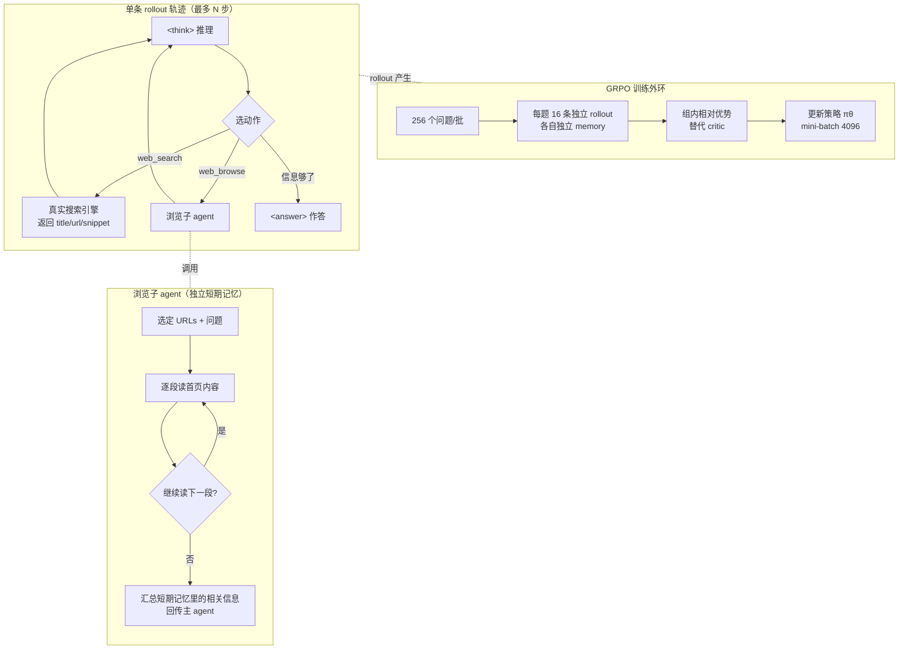

# 组会汇报 · DeepResearcher：在真实网络环境中用 RL 规模化深度研究

> 主讲提示：这是主题组 D（Deep Research）里**最该先讲的一篇**。它的赌注一句话就能说清——
> 「别人在**静态语料**的玻璃缸里训练搜索 agent，我们把缸砸了，直接扔进**真实互联网**这片浑水里训。」
> 全场的辩论焦点只有一个：**真实环境 vs 模拟环境，到底是工程细节还是方法本质？** 作者用 +7.2 分和四种涌现行为给出答案。

---

## 1. 封面 · TL;DR

- **标题**：DeepResearcher: Scaling Deep Research via Reinforcement Learning in Real-world Environments
- **作者/机构**：Yuxiang Zheng、Dayuan Fu、Xiangkun Hu 等（共一），通讯 **Pengfei Liu**；**SJTU / SII / GAIR**，2025-04，arXiv 2504.03160v4，**EMNLP 2025** 接收。
- **权威性来源**：① GAIR（Pengfei Liu 组）是 OpenResearcher、LIMR、Alignment-for-Honesty 等一系列工作的出处，本篇是其 deep-research 线的延续；② **顶会 EMNLP 2025** 接收；③ **完整开源训练框架**（`github.com/GAIR-NLP/DeepResearcher`），含 50 节点 CPU 集群方案——这是开源界**第一个把 RL 真正跑在 live web 上**的可复现实现。

**这篇在干什么（一段话）**：把一个 7B 模型训练成会「**边想边搜、读网页、再想、再搜，直到能答**」的 deep research agent。和此前 Search-R1/R1-Searcher/ReSearch 等「在**本地维基语料**里用 RAG 模拟检索」的 RL 工作不同，DeepResearcher 让 agent 在 rollout 阶段**直接调用真实搜索引擎 + 真实浏览网页**，用 **GRPO** 算法、以**答案 F1 分**为唯一奖励端到端训练。结果不仅刷新 7 个 QA benchmark，还**自发**涌现出规划、跨源交叉验证、自我反思、以及「查不到就老实说不知道」的诚实行为。

**3 条带走的结论**：
1. **真实环境是「方法必需」而非「实现细节」**（这是全文论点）：即便把 RAG-RL 基线 R1-Searcher 也放到真实 web 上推理，它仍**显著差于** DeepResearcher（OOD 平均，见 Table 2）——差距来自**训练时**是否见过真实网络的噪声与异构，而非推理时能否上网。
2. **奖励极简也能学出复杂行为**：奖励只有「格式错=-1，格式对=F1」两档（§3.4），没有对「规划/反思/诚实」的任何显式监督，这些认知行为是**结果奖励**逼出来的**涌现** (emergent) 产物（§6.2）。
3. **数字**：相对提示工程类基线最高 **+28.9** 分、相对 RAG-RL 类最高 **+7.2** 分（摘要 / §1）；7 个数据集（4 ID + 3 OOD）全部领先（Fig 1、Table 1/2）。

> 主讲提示：开场就把「**砸缸**」这个意象立起来——静态 RAG = 玻璃缸，真实 web = 浑水大海。后面每个设计、每个数字，都在回答「为什么值得砸缸」。

---

## 2. 问题与动机（why —— 本篇最该讲透的一节）

> 主讲提示：这一节是全文的命门。把「玻璃缸假设为什么在现实里崩塌」讲透，后面 how 就只是顺水推舟。

**问题层 why（为什么这事值得解决）**：LLM 配上网络搜索后，能做以前需要大量人力的「深度研究」任务（Gemini/OpenAI Deep Research、Grok DeeperSearch 等，§1）。但开源可复现的路线被卡在两类做法里，各有死穴：

- **提示工程类 (prompt-engineering-based)**：靠人手写死的工作流（Search-o1、OpenResearcher、Plan*RAG 等）。死穴：**指令遵循脆弱、推理不一致、对新任务泛化差、要反复手调 prompt**（§1，引 Pan et al. 2025「Why do multiagent systems fail」）。本质是「行为被人写死的固定模式」。
- **RAG-RL 类 (RAG-based)**：用 RL 训练，但检索环境是**静态、本地的文本语料**（Search-R1、R1-Searcher、ReSearch，均基于固定维基库）。死穴在一个**致命假设**上——

> **「所有必要信息都已存在于固定知识库里」**（§1 原文：*all necessary information already exists within their fixed knowledge base*）。

**这个假设在现实里为什么崩塌（不解决会怎样）**——作者列了三层（§1、§2.3）：
1. **信息时效衰减 (timeliness decay)**：真实问题的答案可能**过时、缺失，或散落在语料未覆盖的领域**；
2. **领域适配差**：固定语料只覆盖一小块世界（典型如 Wikipedia），出了这块就抓瞎；
3. **没见过真实噪声**：真实 web 充满**噪声、非结构化、异构格式**，需要过滤与相关性判断——这些能力在干净语料里**根本无从习得**。

**核心 intention（一句话）**：

> **不是再优化「在玻璃缸里怎么搜」，而是把训练环境本身换成真实互联网，让 agent 在真实噪声里学会「在开放网络中检索—推理—综合」的鲁棒能力。**

**为什么「现在」能做**：2024 年底起，DeepSeek-R1/Kimi-k1.5 证明了**纯结果奖励的 RL 能解锁推理能力**（§1）；OpenAI 也承认 Deep Research 用了 RL，但**方法完全闭源**（§2.2），开源界存在明显空白。DeepResearcher 要填的就是这个空白：**第一个在真实 web 上规模化 RL 的开源 deep research 框架**。

> 主讲提示：把「玻璃缸假设」三层崩塌点逐条念出来——这是组会上最能体现你读懂论点的地方。一句话收口：**RAG-RL 训出来的是「图书馆管理员」，DeepResearcher 要训「真上网的研究员」。**

---

## 3. 研究问题 / 核心 intention（形式化成一句话 + 假设）

把要解决的问题压成一句：

> **给定一个开放域问题，能否用纯结果奖励的 RL，在「真实搜索引擎 + 真实网页浏览」的环境里，端到端训练出一个会迭代『推理→搜索→浏览→再推理→作答』、且能泛化到训练分布之外的 deep research agent？**

隐含的 **3 个核心假设**：
- **H1（环境决定能力）**：训练环境的「真实性」直接决定 agent 的鲁棒性——在真实噪声里训练，才能学会真实噪声下的检索综合。这是要被 Table 2 验证的主张。
- **H2（结果奖励足够）**：只用「答案对不对」的稀疏奖励（F1），无需对中间推理步骤做任何监督，就能涌现出规划/反思等复杂行为（继承 R1 思想，§1）。
- **H3（去人类先验）**：端到端训练、**不注入人为设计的工作流**，让 agent 自己发现解题策略（§1「End-to-end Training」）。

---

## 4. 相关工作定位（站在谁肩上、和谁不同）

作者把搜索 agent 沿**两个轴**切（§2）：① 提示工程 vs 训练驱动；② 本地 RAG 环境 vs 真实 web 环境。DeepResearcher 占据**「训练驱动 × 真实 web」**这个此前几乎空白的象限。

| 维度 | 提示工程类 | SFT 类 | RAG-RL 类 | **DeepResearcher（本文）** |
|------|-----------|--------|-----------|--------------------------|
| 代表 | Search-o1, OpenResearcher, Plan*RAG | CoRAG (MCTS 选块) | Search-R1, R1-Searcher, ReSearch | — |
| 训练方式 | 无（人写工作流） | 监督微调 | RL（结果奖励） | **RL（GRPO，结果奖励）** |
| 检索环境 | 多为本地/受控 | 本地 RAG | **静态本地语料** | **真实搜索引擎 + 真实网页** |
| 行为来源 | 人手设计 | 监督信号 | RL 习得（缸内） | **RL 习得（真实噪声中）** |
| 死穴 | 脆弱、泛化差 | MCTS 开销大、泛化弱 | 「信息都在库里」假设崩塌 | 工程挑战大（见 §7 三难） |

> 主讲提示：一句话概括坐标——「Search-R1 们把 RL 用对了，但**环境用错了**（缸里）；DeepResearcher 把 RL 用在了**对的环境**（海里）。」这正是它和最接近的工作 R1-Searcher 的根本区别（§5.2.2 列了三点：① 训练环境真实、② 不限定 Wikipedia、③ 允许自主选 URL 而非强制摘要 top-3）。

---

## 5. 方法总览（big picture，先直觉后数学）

整体是一个**「思考—搜索—浏览—再思考—作答」的迭代轨迹**，外层套 GRPO 训练；浏览交给一个**专门的浏览子 agent**（多智能体）。先看一图流（依据原文 Fig 3）：

**直觉**：主 agent 像「研究员」——先在 `<think>` 里想清下一步该查什么，发 `web_search` 拿到一堆 (标题, URL, 摘要)，觉得某些 URL 有料就发 `web_browse` 派「**阅读助理**」（浏览子 agent）去逐段精读、把相关信息抽出来回传；如此循环，直到「信息够了」才在 `<answer>` 里作答。训练上用 **GRPO**：同一题跑 16 条轨迹，**组内比谁答得好**来定优势，省掉单独的 critic 网络。

> 主讲提示：强调两个「分离」——① **思考与动作分离**（`<think>` 后才能 act，承自 R1）；② **检索与精读分离**（主 agent 决定查什么，浏览子 agent 负责怎么读）。后者就是它的多智能体设计，下面 §7 讲为什么必须分。

---

## 6. 符号与术语表（后文统一用）

| 记号 / 术语 | 含义 |
|------------|------|
| $\pi_\theta$ | 当前被训练的策略（policy），参数 $\theta$ |
| $\pi_{\theta_{\text{old}}}$ | 采样这批 rollout 时所用的旧策略 |
| $\pi_{\theta_{\text{ref}}}$ | 参考策略 (reference policy)，通常是初始/冻结模型，用于 KL 约束 |
| $x$ | 一条输入（问题），$x\sim D$，$D$ 为经验分布 (experience distribution) |
| $G$ | 一组 rollout 的数量（**组大小**，本文每题 16） |
| $y_i$ | 第 $i$ 条 rollout（一整条 think/search/browse/answer 轨迹），$i=1\dots G$ |
| $A_i$ | 第 $i$ 条 rollout 的**优势 (advantage)**，由组内相对表现估计 |
| $\epsilon$ | PPO 式裁剪 (clip) 系数 |
| $\beta$ | KL 散度正则项权重 |
| $\mathbb{D}_{\text{KL}}$ | 当前策略对参考策略的 KL 散度 |
| F1 | 词级 (word-level) F1 分，预测答案与参考答案的词重叠调和均值，本文当**奖励** |
| MBE | Model-Based Evaluation，用 GPT-4o-mini 当裁判判「对/错」的准确率（§5.2.3） |
| ReAct | Reason+Act 范式：交替「推理—动作—观察」 |
| Masking | 对工具返回的观测 (observation) 做损失屏蔽，不让它参与梯度（§3.3） |

---

## 7. 方法细节 ① 训练算法：GRPO（组相对策略优化）

> 主讲提示：这是全文唯一的核心公式（Eq.1）。要点是「**为什么不用 PPO 的 critic**」——deep research 轨迹超长、价值函数极难学，GRPO 用「组内比高下」替代价值网络。

**Why（设计层）**：朴素做法是用 **PPO**，需训练一个 critic（价值网络）来估每步基线。→ 但 deep research 一条轨迹动辄上千 token、含多次工具调用，**价值函数极难准确估计**，且 critic 翻倍显存与不稳定。→ 本文改用 **GRPO**（DeepSeekMath 提出）：对同一输入采 $G$ 条轨迹，**用这组轨迹的相对好坏当基线**，彻底免掉 critic（§3.3）。

**直觉**：我想让「比同组平均答得好的轨迹」概率上升、差的下降，但又不能一步迈太大（PPO 的裁剪精神），还要别离参考策略太远（KL 拴住）。把这三件事写进一个目标函数：

**符号已在 §6 定义**。先给出采样：给定输入 $x\sim D$，旧策略采出一组轨迹

$$ \tau=\{y_i\}_{i=1}^{G}\sim \pi_{\theta_{\text{old}}}(\cdot\mid x) $$

然后**最大化**目标函数（原文 Eq.1）：

$$
\mathcal{J}(\theta)=\mathbb{E}_{x\sim D,\,\{y_i\}_{i=1}^{G}\sim\pi_{\theta_{\text{old}}}(\cdot\mid x)}\;
\frac{1}{G}\sum_{i=1}^{G}\Big[\min\big(\underbrace{\tfrac{\pi_\theta(y_i\mid x)}{\pi_{\theta_{\text{old}}}(y_i\mid x)}}_{\text{重要性比 }r_i}A_i,\;\operatorname{clip}(r_i,\,1-\epsilon,\,1+\epsilon)\,A_i\big)-\beta\,\mathbb{D}_{\text{KL}}\big(\pi_\theta\,\|\,\pi_{\theta_{\text{ref}}}\big)\Big]
$$

**逐项读出什么**：
- $r_i=\pi_\theta/\pi_{\theta_{\text{old}}}$ 是**重要性采样比**——新旧策略对同一轨迹的概率之比；
- $r_i A_i$：优势为正（这条比同组好）就推高其概率，为负就压低；
- $\operatorname{clip}(\cdot,1-\epsilon,1+\epsilon)$ 配合外层 $\min$：**限制单步更新幅度**，防止比值过大导致训练崩（PPO 信任域思想）；
- $-\beta\mathbb{D}_{\text{KL}}(\pi_\theta\|\pi_{\theta_{\text{ref}}})$：把策略**拴在参考模型附近**，防止为刷奖励而偏离太远（抗遗忘/抗崩坏）；
- $A_i$ 由**组内**（这 $G$ 条）相对表现估出，**没有单独 critic**——这就是 GRPO 省掉价值网络的关键。

**Masking Observations（§3.3）**：工具返回的搜索结果/网页内容是「**观测**」而非模型该产出的内容，故对其做**损失屏蔽**，只让模型自己生成的 token（think/动作/答案）贡献梯度。
> Why：若不屏蔽，模型会被迫去「拟合」噪声网页文本，相当于学错了目标——它该学的是「怎么用信息」，不是「复述信息」。

---

## 8. 方法细节 ② 奖励设计：极简两档 F1（涌现行为的源头）

> 主讲提示：本节是「奖励/指标给定义式」的硬要求落点，也是理解「诚实/反思为何涌现」的**因果起点**。务必把「奖励里没有任何关于反思的项」这句话点出来。

**Why（设计层）**：朴素做法是给「会规划、会引用、会反思」等好行为**逐一加 reward shaping**。→ 但这等于把人类先验又塞回去（违背 H3），且容易被钻空子（reward hacking）。→ 本文选择**极简结果奖励**：只看最终答案对不对 + 格式合不合法。理由（§3.4）：用的是**短答案**开放域 QA，F1 足够；更复杂的奖励留作 future work（引 OpenAI Deep Research system card）。

**直觉**：先用一道「格式门」挡住跑飞的轨迹（标签缺失/结构错），过了门再按答案质量给分。

记号（先定义）：设模型最终答案为 $\hat a$，参考答案为 $a^\star$；$\text{F1}(\hat a,a^\star)\in[0,1]$ 为二者的词级 F1。奖励（原文 §3.4）：

$$
\text{reward}=
\begin{cases}
-1, & \text{格式错误（缺标签 / 结构错误）}\\[2pt]
\text{F1}(\hat a, a^\star), & \text{格式正确}
\end{cases}
$$

**读出什么**：
- **格式惩罚 -1**：逼模型严格遵守 `<think>/<search>/<browse>/<answer>` 协议——这是工具调用能被正确解析的前提；
- **F1 奖励**：格式合法后，答得越准奖励越高，连续可导地引导质量提升；
- **关键**：奖励里**完全没有**关于「是否规划」「是否交叉验证」「是否诚实承认不知道」的项。这意味着 §6.2 那四种行为**不是被教出来的，是被「想拿高 F1」这一个目标逼出来的副产物**——这正是「涌现」的严格含义。

**因果链（组会重点）**：为什么「诚实」「反思」能从纯 F1 奖励里长出来？
- **反思**：当某次搜索结果和问题对不上（如查 Djedefre 的父亲却搜到《指环王》的 Denethor，Fig 6 左），继续沿错误方向只会让最终 F1 低；**能及时识别偏差、调整 query 的轨迹，期望 F1 更高**→ RL 自然选择保留这种行为。
- **诚实**：在无法找到确切答案时，硬编一个数字大概率 F1≈0；**而老实承认「没有精确数字、不给编造值」在某些评测下反而不至于被狠罚**（Fig 6 右），加之训练数据已过滤掉时效/主观题（§4.3）使「找不到」多源于客观难度→ 模型学到「证据不足时不瞎报」是更稳的策略。
> 主讲提示：这条因果链是本篇相对 AI Scientist「会把变差说成改进」的正面镜像——**同样是结果导向，奖励信号的『干净』与否，决定了它长出诚实还是长出 reward hacking**。埋下与 9.8 的对照线。

---

## 9. 方法细节 ③ 多智能体：浏览子 agent（为什么必须把「读」单拆出来）

**Why（设计层）**：朴素做法是让主 agent 把搜索返回的 top-k 摘要**直接塞进上下文**当证据（多数 RAG-RL 就这么做）。→ 但真实网页**又长又脏**，相关内容常埋在大量无关文本里，整页塞进去既爆上下文又引入噪声。→ 本文用**专门的浏览子 agent**（§3.2 Challenge III、§3.1）：派一个独立角色去**逐段精读**网页、只把**与问题相关的增量信息**抽回来。

**how（§3.1 Web Browsing Agent）**：
1. 主 agent 发 `web_browse(url_list)`；浏览 agent 维护一个**针对该 query 的短期记忆 (short-term memory)**；
2. 对每个 URL，处理**首页段 (first-page segment)**，基于「问题 + 历史 + 新内容」做两个决策：(1) **继续读下一段还是停**；(2) 把相关信息**追加进短期记忆**；
3. 决定不再读时，把短期记忆里**所有新增信息汇总**回传主 agent。
4. **逐段、从首页往后读**的设计模仿人类：假设「**前几段都不相关，则整页大概率无用、可跳过**」，从而省资源、提抽取准确率（§3.2 Challenge III）。

> Why（这条启发式的代价）：它假设「相关信息倾向出现在网页前部」——对维基式页面成立，对「长导言后才进正文」的页面可能漏读。这是**用召回换效率**的工程取舍（原文未量化其漏读率，属**原文未给出**）。

> 主讲提示：这就是它和 R1-Searcher 第三点区别的落地——**自主选 URL + 派人精读**，而不是「强制摘要 top-3」。一句话：**主 agent 管「查什么」，浏览 agent 管「怎么读」，职责分离才扛得住真实网页的脏。**

---

## 10. 方法细节 ④ 把 RL 跑在真实 web 上的三大工程难关（这是「真实环境」的真正代价）

> 主讲提示：这一节别跳！「真实环境优于模拟」不是免费午餐——它的全部成本都压在这三关上。能把这三关讲清，才算真懂为什么别人都躲在缸里。

RL rollout 会瞬间产生海量真实工具调用，带来模拟环境里**根本不存在**的工程挑战（§3.2）：

| 难关 | 问题 | 本文方案 |
|------|------|---------|
| **I. 瞬时高并发** | GRPO 采样巨多（如 4096 量级），引发海量搜索+爬取，延迟极高 | 自建 **50 节点分布式 CPU 服务器集群**，专门承接 rollout 期的工具请求、处理结果、按 URL 爬页 |
| **II. 爬虫与 API 限制** | 反爬机制返回垃圾/不响应；搜索/LLM API 有速率限制（如 200 次/秒） | **健壮重试机制** + **搜索结果缓存**：同一 query 在预设周期（如 **7 天**）内复用缓存，既降调用频率又省钱（尤其贵的 Google Search API） |
| **III. 信息抽取低效** | 网页长、相关内容少，整页喂入既贵又噪 | **多智能体**：专职浏览 agent 逐段抽取（即 §9） |

**关键参数（§5.1.1）**：每训练步采 **256 个 prompt**、每 prompt **16 条 rollout**，每条 rollout **最多 10 次工具调用 + 1 步作答**，mini-batch **4096**（即一个 rollout stage 反传一次）。
> 读出什么：`256 × 16 = 4096` 条轨迹/步，每条最多 10 次工具调用 → 单步可触发**数万次**真实搜索/爬取。这就是为什么必须自建 50 节点集群 + 7 天缓存——**真实环境的工程量是模拟环境的几个数量级**。

---

## 11. 方法细节 ⑤ Beyond Memorization：让数据「逼模型真去搜」

> 主讲提示：这一节回答一个尖锐的潜在质疑——「你怎么知道模型是真在搜，而不是背答案？」这是 deep research 评测最容易被攻击的点。

**Why（设计层）**：朴素做法是直接拿开放域 QA 训练。→ 但 LLM 预训练见过海量 QA 对，可能**靠参数记忆直接答对**，从而「假装在用搜索、实则背书」，彻底架空「学搜索」的目标（§4.2）。→ 本文做**两阶段过滤**把这种题剔掉（§4.3）：

1. **低质问题过滤**：用 DeepSeek-R1 标注并剔除：① **时效题**（如「苹果现任 CEO 是谁」）；② **主观题**（如「最好的智能手机」）；③ **有害/违规**内容。
2. **污染检测 (contamination detection)**：对每个候选题，从**待训练的基座模型**采 **10 条**回答，若**任一条**已含 ground truth（即 **pass@10** 命中），说明模型**不搜也会**，**剔除**。

记号化：设基座模型对问题 $q$ 采样答案集 $\{r_1,\dots,r_{10}\}$，参考答案 $a^\star$。剔除条件：

$$ \exists\, j\in\{1,\dots,10\}:\; a^\star \subseteq r_j \quad\Rightarrow\quad \text{剔除 } q $$

**读出什么**：保留下来的题，基座模型**裸答 10 次都答不出**——它**必须真去搜**才可能答对。这从数据侧**强制**了「学搜索」而非「调记忆」。

**数据构成（§4.3）**：最终训练集 **80,000 条**，比例 **NQ : TQ : HotpotQA : 2Wiki = 1 : 1 : 3 : 3**，**刻意让多跳题占 75%**（HotpotQA+2Wiki），因为多跳更贴近 deep research 的「跨源综合」本质。

> 主讲提示：把 pass@10 污染检测单独强调——它是「**真搜索 vs 假记忆**」这条评测信任链的基石，呼应 AlphaEvolve 的「可验证 grounding」精神，方向相反但目的相通：**都在想方设法不让模型自欺**。

---

## 12. 实验设置（setting / metrics / params / 算力，写全）

- **基座模型**：Qwen2.5-7B-Instruct（§5.1.1）；训练框架 **verl**（volcengine/verl）。
- **训练超参**：每步 256 prompts × 16 rollouts；每 rollout ≤10 工具调用 + 1 答；mini-batch 4096。
- **训练数据**：80k 条（构成见 §11）。
- **评测集**（§5.2.1）：**ID 四个**——NQ、TQ、HotpotQA、2Wiki（与训练同分布）；**OOD 三个**——MuSiQue、Bamboogle、PopQA（问题风格与信息分布差异大，测泛化）。每个 dev 集随机采 **512** 例（Bamboogle 全用其 **125** 例）。
- **Baselines**（§5.2.2）：
  - **CoT Only**：纯思维链，无检索；
  - **RAG**：CoT + 本地检索语料；
  - **Search-o1**：多步推理，证据限于检索 snippet（作者用自家 prompt 复现）；
  - **Search-o1 + Web Search**：可发真实搜索、访问 URL（接近 deep research）；
  - **Search-r1**（base/instruct）：RL，训练+推理都在**本地维基 + retriever**；
  - **R1-Searcher**：RL，给 query 附 `site:en.wikipedia.org` 走 Bing 取前三页摘要。

**评测指标（§5.2.3，给定义式）**：
1. **F1（规则式）**——与训练奖励一致；预测与 ground truth 都先**转小写、去标点**再算词级 F1。设预测词集与答案词集，$P=\tfrac{\text{命中词}}{\text{预测词}}$、$R=\tfrac{\text{命中词}}{\text{答案词}}$：
   $$ \text{F1}=\frac{2PR}{P+R} $$
2. **MBE（模型式，Model-Based Evaluation）**——因 F1 对长答案/同义表达不公，改用 **LLM-as-a-Judge**：提示 **GPT-4o-mini** 对照「问题+ground truth」判模型答案为 *correct / incorrect*，MBE = 判定为 correct 的**比例**（准确率）。
   $$ \text{MBE}=\frac{\#\{\text{judge 判 correct}\}}{\#\{\text{全部样本}\}} $$
> 为什么要两个指标：F1 客观但对措辞敏感（同义/长答吃亏），MBE 更贴语义但依赖裁判模型。作者把 **MBE 当主指标**（更可靠），F1 作参照。

- **算力/成本**：**原文未给出** GPU 卡数与训练总时长/美元成本（只说 verl 框架、上述 batch 配置 + 50 节点 CPU 集群处理工具请求）。
- **随机性控制**：dev 集固定随机采样 512/全量；其余种子设置**原文未给出**。

> 主讲提示：强调一个**不公平到对自己不利**的对照——Search-r1 在**本地维基直连相关语料**里被评测，而 DeepResearcher 要**在整个互联网里大海捞针**找同一答案。后者赢，含金量更高（Table 1 脚注原话）。

---

## 13. 主要结果（数字 + 解读，别只贴表）

**Table 1（ID，4 数据集，F1 / MBE）** 摘 MBE（主指标）：

| 方法 | 环境 | NQ | TQ | HotpotQA | 2Wiki |
|------|------|----|----|----------|-------|
| CoT | Local RAG | 32.0 | 48.2 | 27.9 | 27.3 |
| CoT+RAG | Local RAG | 59.6 | 75.8 | 43.8 | 24.8 |
| Search-o1 | Web Search | 55.1 | 69.5 | 42.4 | 37.7 |
| Search-r1-base | Local RAG | 60.0 | 76.2 | **63.0** | 47.9 |
| R1-Searcher | Web Search | 53.1 | 79.1 | 53.1 | 65.8 |
| **DeepResearcher** | **Web Search** | **61.9** | **85.0** | 64.3 | **66.6** |

**Table 2（OOD，3 数据集，F1 / MBE）** 摘 MBE：

| 方法 | 环境 | MuSiQue | Bamboogle | PopQA |
|------|------|---------|-----------|-------|
| CoT+RAG | Local RAG | 10.0 | 27.2 | 48.8 |
| Search-o1 | Web Search | 19.7 | 53.6 | 43.4 |
| Search-r1-base | Local RAG | 27.5 | 57.6 | 47.0 |
| R1-Searcher | Web Search | 25.6 | 65.6 | 43.4 |
| **DeepResearcher** | **Web Search** | **29.3** | **72.8** | **52.7** |

**读出什么（§5.2.4 三条观察）**：
1. **ID 全面领先**：MBE 上四个数据集**全部最高**，TQ、2Wiki 优势尤大。Search-r1-base 在 NQ/HotpotQA 的 MBE 与之接近，但它是在**直连相关维基语料**的「缸」里测的；DeepResearcher 在**全网**这一**更真实更难**的场景达到同等甚至更高——**含金量不对等**。
2. **OOD 泛化突出**：三个 OOD 数据集 **F1/MBE 双双全胜**。说明 RL 学到的是**可迁移的检索-推理-综合通用技能**，而非只对训练分布过拟合。
3. **真实环境的决定性证据（核心论点的实锤）**：**Bamboogle 的语料不全来自 Wikipedia**（Table 2 注）。本地 RAG 法在此**大幅落后**（信息根本不在库里）。更关键——**即便把 R1-Searcher 也接到真实 web 上推理，它仍远逊 DeepResearcher**（72.8 vs 65.6 MBE）。差距不在「推理时能否上网」，而在「**训练时是否在真实噪声中学过**」。→ 这就把 H1「环境决定能力」**钉死**了：真实环境是**训练阶段的必需**，不是推理阶段的开关。

**相对增益换算**：摘要称相对提示工程类 **+28.9**、相对 RAG-RL 类 **+7.2**（§1）。例如 OOD 上对最强 RAG-RL 基线 R1-Searcher，Bamboogle MBE 72.8−65.6=**+7.2**，正是该数量级。

> 主讲提示：把第 3 条当全场记忆锚——**「同一个 R1-Searcher，给它真 web 也救不回来，因为它是在缸里长大的」**。这一句胜过十张表。

---

## 14. 训练动态与涌现行为（消融与分析）

**训练动态（§6.1，Fig 4 / Fig 7）**：
- **(a) F1 随 RL 稳步上升**：从 ~**0.375** 逐步升到 ~**0.55**，单调上行——性能随 RL 持续 scaling（Fig 4a / Fig 7 七个 benchmark 同趋势）。
- **(b) 难题诱发更多工具调用**：平均工具调用次数随训练上升；**4-hop 题在 34 步后仍在增**——模型**学着为更难的题去搜更多信息**（Fig 4b）。
- **(c) 响应长度持续增长不饱和**：各跳数响应长度均随训练上升、无饱和——模型**自发把推理过程拉长**（double-check、refine、planning 等）以应对更复杂的题（Fig 4c）。

**四种涌现认知行为（§6.2，Fig 2/5/6）——本篇灵魂**：

| 行为 | 证据（图） | 机制（为什么 RL 会选它） |
|------|-----------|------------------------|
| **I. 规划 Planning** | Fig 2/5 左：开局先列「Step1 找作曲家→Step2 找其出生地→Step3 找名桥」 | 多跳题先规划再分步搜，命中率更高 → 高 F1 期望；且**无需 SFT 显式规划数据**就涌现，必要时还会**合并步骤** |
| **II. 交叉验证 Cross-validation** | Fig 2/5 右：首次工具调用就找到答案，却**不急于定论**，再多源核实 | 单源易错；多源核实降低「看似对实则错」的风险，提升最终答案可靠性 → 期望 F1 更高 |
| **III. 自我反思 Reflection** | Fig 6 左：搜到的是《指环王》Denethor 而非目标人物父亲，模型**识别偏差并改 query** | 沿错误方向走到底 → F1 低；及时纠偏 → F1 高，RL 自然保留（引 Fu et al. 2025 防「卡死」） |
| **IV. 诚实 Honesty** | Fig 6 右：查不到精确油产量，**明说「无精确数字，不给编造值」** | 瞎报数字 F1≈0；加之数据已滤掉时效/主观题，"找不到"多源于客观难度 → 不瞎报是更稳策略 |

> 主讲提示：把这张表当成「**纯结果奖励 → 复杂行为**」的因果总账来讲。**没有一行行为是被显式奖励的**，全是「想拿高 F1」逼出来的。这与 AI Scientist「会把变差说成改进」恰成镜像——**奖励信号干净 + 数据去污，长出的是诚实；奖励/激励设计粗糙，长出的是 reward hacking。**

---

## 15. 局限与批判（诚实）

**原文自陈（§6.2 末、§3）**：
1. **当前评测无法度量「诚实」**：模型「老实说不知道」是优点，但 **QA 准确率指标根本不奖励这一点**（§6.2 Behavior IV 原话）——即诚实行为**目前无法被正面计入分数**，存在度量缺口。
2. **奖励过简**：只用短答案 F1，**长答案 / 开放式 deep research 需要更复杂奖励**（§3.4 自承，指向 OpenAI Deep Research system card）。
3. **固定 top-k=10**：搜索结果固定取前 10，未做 LLM 驱动的动态参数优化（§3.2 自承为 future work）。

**我/社区可补的质疑**：
4. **成本与可复现门槛**：50 节点 CPU 集群 + 真实 Google Search API + 7 天缓存——**真实环境的工程/金钱成本极高**，单卡学习者难复现完整训练（GPU 卡数与总成本**原文未给出**）。
5. **「真实 web」的不可重复性**：网页会变、搜索结果随时间漂移，**实验严格复现困难**（同一 query 不同日期结果不同）；缓存只缓 7 天。
6. **浏览启发式的漏读风险**：「前几段不相关就跳过整页」对结构特殊的页面可能漏掉关键证据（漏读率**原文未量化**）。
7. **裁判依赖**：MBE 用 GPT-4o-mini 当裁判，**继承了裁判模型自身的偏差与可被操纵性**（与 9.6/9.8 的「评测可信度」直接相关）。
8. **诚实的脆弱性**：Fig 6 的诚实是**个案展示**，未给「诚实率」的统计量——**它有多稳、会不会在压力下崩**，原文未系统评估。

> 主讲提示：把第 1 条单独强调——这是一个**深刻的张力**：模型学会了诚实，**但它赖以训练的指标却看不见诚实**。这正是下面 Inspires-Us 的最大机会点。

---

## ★ 对我们的启发（Inspires Us）

> 这一节回答：DeepResearcher 对我（们）接下来的研究，**到底能用上什么**。前面都在讲 GAIR 做了什么，这里讲**我们下周就能试什么**。

- ➤ **a. 可直接借用的招（reuse）**：
  1. **pass@10 污染检测当「真搜索」门禁**——「基座裸答 10 次都答不出才收进训练/评测集」（§11）。这是一把现成的尺子，可**原样搬进** [`m9.6-evaluating-research-agents`](../m9.6-evaluating-research-agents/) 的任务构造：凡 agent 任务，先过 pass@k 过滤掉「不调工具也能答」的题，**保证我们测的是真本事**。
  2. **极简两档奖励 + 观测屏蔽 (masking)**——`格式错=-1 / 格式对=F1`，且工具返回的观测**不参与梯度**（§3.4、§3.3）。任何「思考-工具-作答」的 RL 管线都该照抄这两条：**门控格式 + 只对自生成 token 计损失**。
  3. **检索/精读职责分离**——主 agent 决定「查什么」、浏览子 agent 负责「逐段怎么读、抽什么」（§9）。这正是 [`m9.2-research-agent-core`](../m9.2-research-agent-core/) 「四零件 + critic」里 **Tool 与 Roles 两件的真实 web 升级版**。

- ➤ **b. 可迁移到我们课题的思路（transfer）**：把核心思想映射到 **`m9.2-research-agent-core`**——我们已用 `MockLLM`+mock arXiv 验证了「**无 critic 残留幻觉引用 1 → 有 critic 残 0**」（README 关键行）。DeepResearcher 等于把同一条「**职责分离的独立角色去核实**」从**离线 mock 语料**推到了**真实 live web**：它的「交叉验证 (cross-validation) 行为」就是我们 critic 的**RL 涌现版**。**迁移要改什么**：把我们 `corpus.search`（mock）换成真实搜索工具后，「检索集」不再封闭，`critic` 的「查引用是否在检索集内」这条判据**前提失效**——必须升级为「**查引用是否在真实可访问网页中**」。这恰是从 m9.2 走向真实 deep research 的关键一步。
  - 同时连到 [`WebThinker (2504.21776)`](../papers/2504.21776-webthinker-deep-research.pdf)（深推理 + 自主搜索浏览）与 [`OpenScholar (2411.14199)`](2411.14199-openscholar-ai2.md)（检索增强的文献综合 + 自反馈引用核实）：三者构成「**deep research agent 的检索-推理-引用**」三角——DeepResearcher 提供 **RL 训练范式**，WebThinker 提供**推理-搜索交织的轨迹结构**，OpenScholar 提供**引用可溯源的综合范式**。

- ➤ **c. 它暴露的开放问题 = 我们的机会（opportunity）**：**「模型学会了诚实，评测却看不见诚实」**（§15 第 1 条）。→ **机会**：设计一个**「诚实率」可验证指标**——在数据集里掺入**已知无答案/答案不在网上**的题（unanswerable probes），度量 agent 「正确地说不知道」的比例，与 F1 并列上报。**可下手的第一步**：在 m9.6 沙箱里加一组 N 道「故意无解」的探针题，统计 DeepResearcher 风格 agent 的「诚实承认率 vs 瞎编率」，把 §6.2 的**个案**变成**统计量**。

- ➤ **d. 与本库其它论文/模块的连接（connect the dots）**：
  - **正面呼应**：与 [`AlphaEvolve (2506.13131)`](2506.13131-alphaevolve-deepmind.md) 的「**可验证 grounding 抗幻觉**」同源——一个用「可自动评分」锚住代码进化，一个用「F1+pass@10 去污」锚住搜索学习，**都在防模型自欺**。
  - **镜像对照**：与 [`AI Scientist v1 (2408.06292)`](2408.06292-ai-scientist-v1.md) 形成**正反对照**——同是结果导向，AI Scientist「把 KL 变差说成改进」（reward hacking），DeepResearcher 在干净奖励 + 去污数据下长出**诚实**。**奖励信号的纯净度，决定长出诚实还是长出造假。**
  - **直通红队**：诚实的「**有多稳/会不会被压垮**」直接接 [`m9.8-redteam-and-integrity`](../m9.8-redteam-and-integrity/) 的「独立验证收口」。

- ➤ **e. 如果我来做下一步（my next move）**：我会在 `m9.2-research-agent-core` 加一个 **`--live-web` 开关**，把 mock `corpus.search` 替换成真实搜索工具，并把 `critic` 的引用核实判据从「在检索集内」升级为「**URL 真实可访问且含该断言**」，跑一组最小对照——看「**无 critic / mock-critic / live-critic**」三档下，**残留幻觉引用**是否仍能压到 0、以及 live 环境下 critic 的额外召回成本。一周内出最小结论。

> 主讲提示：落点是 m9.2 的 `--live-web` 升级 + m9.6 的「诚实率探针」，两件都能被同组同学直接接力。一句话收口：**DeepResearcher 把我们 m9.2 验证过的「独立批判」从缸里搬进了海里——我们下一步就把自己的 critic 也放生到海里试。**

---

## 16. 在 auto-research 版图的位置

- **阶梯定位（Tool→Analyst→Scientist）**：DeepResearcher 是一个强 **Tool/Analyst 级** agent——它**能自主检索-推理-综合并答得准**，但**不自定研究问题、不写论文、不做实验闭环**（那是 AI Scientist 的领地）。它把「**Analyst 的检索综合能力**」用 RL 在真实环境里**夯到了新高度**。
- **相对本库已有工作的时间/能力增量（更新点）**：
  - **向前推了 RAG-RL 这条线**：相对本库会提到的 Search-R1/R1-Searcher/ReSearch（均**缸内 RL**），DeepResearcher **第一个证明「训练环境必须真实」**，并给出**可复现的真实-web RL 框架**——把「环境真实性」从被忽视的实现细节**提升为一等公民**。
  - **为 deep research 综述补了实证**：与 [`2506.18096 Deep Research Agents 综述`](2506.18096-survey-deep-research-agents-roadmap.md) 互为「**地图 vs 实地**」——综述画路线，DeepResearcher 是其中「**端到端 RL × 真实环境**」这一格的**标杆实现**。
  - **与 STORM/m9.4 呼应**：[`m9.4-deep-research-storm`](../m9.4-deep-research-storm/) 偏「多视角提问-综合写长文」，DeepResearcher 偏「RL 训练短答精准检索」——**两种 deep research 形态**，前者重广度综合、后者重训练范式。
- **承上启下**：← 继承 R1（纯结果奖励 RL）；← 思想上承 m9.2（职责分离的 critic/roles）；→ 为「**把诚实纳入评测**」「**真实环境 RL 的成本下降**」留出后续工作空间。

---

## 17. 复现与可用性

- **开源**：完整训练框架 `github.com/GAIR-NLP/DeepResearcher`（摘要/§1 给出），含 50 节点 CPU 集群方案、prompts（附录 A.1–A.3 列了质量过滤、污染检测、MBE 评测、研究计划四套 prompt）。
- **能不能单卡跑**：**完整训练不行**——需 verl 框架、256×16 rollout/步、真实 Google Search API + 50 节点 CPU 集群承接工具请求（§3.2、§5.1.1）。**推理/小规模 demo 可行**（7B 模型 + 接一个搜索 API）。本库的**诚实缩小版**是 [`m9.2-research-agent-core`](../m9.2-research-agent-core/)：用 mock 检索复现「ReAct + critic」内核，把「真实 web RL」抽象成可单机跑通的最小闭环。
- **坑**：① 真实 web **不可严格复现**（结果随时间漂移，缓存仅 7 天）；② API 速率限制（~200/s）需重试机制；③ 反爬会返回垃圾，需健壮解析；④ GPU 卡数/训练总成本**原文未给出**，预算需自行评估。

---

## 18. 组会讨论问题

1. 作者声称「真实环境是方法必需而非实现细节」，**最强证据**是「R1-Searcher 接真 web 仍输」（§5.2.4）。这个对照足够干净吗？还有哪些混淆变量（如训练数据规模、模型差异）没被控制？
2. 四种涌现行为里，**哪一种最可能是「评测伪影」**而非真能力？怎么设计实验区分「真会反思」与「碰巧 query 改对了」？
3. 「诚实」从纯 F1 奖励涌现——但 §15 指出**指标看不见诚实**。如果把「正确地说不知道」也给正奖励，会不会**反而**诱发「动辄装不知道」的新 reward hacking？
4. pass@10 污染检测把「基座会答的题」全剔了——这会不会**系统性地把简单题滤光**，导致训练分布偏向人为的难题、损害对简单查询的表现？
5. 50 节点集群 + 真实 API 的**成本**是真实环境的隐性税。在什么条件下，「高保真模拟环境」能以更低成本逼近真实环境的训练收益？（联想 m9.6 沙箱）
6. 它是强 **Analyst**，不是 **Scientist**。把 DeepResearcher 的检索内核接到 AI Scientist v2 的「实验闭环」上，最大的接口障碍是什么？
7. MBE 用 GPT-4o-mini 当裁判：如果被评的 agent 和裁判同源/可被其文风操纵，MBE 还可信吗？（直通 9.8）

---

## 19. 一页速记（汇报当天速览）

- **是什么**：首个把 deep research agent 端到端放进**真实开放网络**做 RL 训练的开源框架（SJTU/SII/GAIR，EMNLP 2025）。
- **怎么训**：**GRPO**（Eq.1，组内 16 条 rollout 相对优势替代 critic）+ **极简奖励**（格式错 -1 / 格式对 = 词级 F1，§3.4）+ **观测屏蔽**；轨迹为 `think→search→browse→…→answer`，**浏览子 agent**逐段精读（多智能体）。
- **怎么保真**：**pass@10 污染检测**剔除「不搜也会」的题 + 滤掉时效/主观题；80k 训练集，**多跳占 75%**（§4）。
- **工程代价**：50 节点 CPU 集群 + 重试 + **7 天搜索缓存**扛住高并发/反爬/限速（§3.2）。
- **关键数**：相对提示工程 **+28.9**、相对 RAG-RL **+7.2**；7 数据集（4 ID+3 OOD）MBE 全胜；**Bamboogle + R1-Searcher 接真 web 仍输**是「环境决定能力」的实锤（Table 1/2，§5.2.4）。
- **灵魂**：纯 F1 奖励**涌现**出规划/交叉验证/反思/诚实四行为（§6.2）；**奖励干净 + 数据去污 → 长出诚实**（与 AI Scientist 的 reward hacking 互为镜像）。
- **对我们**：pass@10 门禁搬进 m9.6；m9.2 的 critic 加 `--live-web` 从缸放生到海；做「诚实率探针」把个案变统计量。

> 主讲提示：结尾回到开场的意象——**「Search-R1 们在玻璃缸里把 RL 用对了；DeepResearcher 把缸砸了，证明只有在真实的浑水里，agent 才学得会规划、核实、反思，和——诚实。」**
