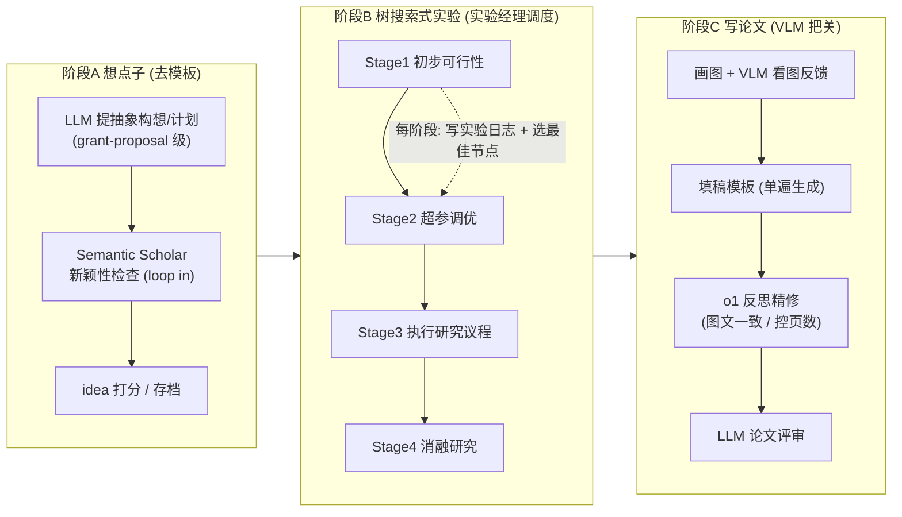

# 组会汇报 · The AI Scientist-v2（Sakana AI, 2025）

> 主讲提示：开场一句话定调——「v1 证明了**能跑通**，v2 第一次让 AI 生成的论文**真的过了人类评审**」。这是从『可行性 demo』迈向『有外部裁判背书』的关键一步，但「过审」的边界（workshop 而非主会、1/3 命中、人挑种子）必须当场讲清，否则容易被听众高估。

---

## 1. 封面 · TL;DR

- **作者 / 出处**：Yutaro Yamada、Robert Tjarko Lange、Cong Lu（三人 shared first author）、Shengran Hu、Chris Lu、Jakob Foerster、Jeff Clune、David Ha（Sakana AI 等），2025-04-10，arXiv 2504.08066。代码开源：`https://github.com/SakanaAI/AI-Scientist-v2`（见原文 §1 与摘要）。
- **一段话**：The AI Scientist-v2 是 v1（2408.06292）的继任系统。它做了三件大事（原文 §1 三点贡献）：① **去掉对人工代码模板的依赖**，从「在给定 baseline 上改」升级为「从抽象研究构想开始」，可跨 ML 领域开箱即用；② 引入**实验经理 agent（experiment manager agent）+ 渐进式 agentic 树搜索（progressive agentic tree search）**，用 best-first 搜索在「实验状态树」上深挖，替代 v1 的线性浅层迭代；③ 在评审/精修环节接入 **视觉语言模型（Vision-Language Model, VLM）反馈闭环**，改进图表与文字的质量与一致性。作者把 **3 篇全自动生成的稿件**投到 ICLR 2025 的 ICBINB workshop，其中 **1 篇平均分 6.33（约前 45%）**、达到接收线——**这是史上第一篇通过同行评审的全 AI 生成论文**（原文摘要 / §4）。
- **三条带走的结论**：
  1. **里程碑**：首次有 AI 论文「过审」——但**作者主动设了边界**：只在 *workshop* 级、3 篇里中 1 篇、且人类挑了初始 idea 与最终种子；审稿后**主动撤稿**不进正式档案（原文 §4 / §5）。
  2. **方法内核 = 树搜索 + 实验经理**：把「做实验」形式化成在**实验状态树**上的 best-first 搜索，节点 = 一次完整实验（代码+结果+图+VLM 反馈+状态），分 4 个阶段（可行性→调参→执行研究议程→消融），由实验经理 agent 调度（原文 §3.2.1 / §3.2.2 / Fig.1 / Fig.2）。
  3. **诚信问题仍在**：内部复核发现它**仍会幻觉引用（hallucinate citations）**、缺乏顶会级的方法严谨与深度；接收的那篇还被自评查出 **~57% 训练/测试集重叠**、图注误读等问题（原文 §4 / §4.2 / §5）。

> 主讲提示：把「里程碑」和「仍不可尽信」两面一起抛出。这篇的价值不在某个 trick，而在它把 v1 的辩证（便宜可行 ↔ 不可轻信）推进到「有外部裁判，但裁判是 workshop，且仍抓出硬伤」。

---

## 2. 问题与动机（why —— 本节最该讲透）

**v1 到底卡在哪？** v1（Lu et al., 2024）第一次走通了「想点子→写码→跑实验→画图→写论文→自评审」的全自动闭环，但原文 §1 / §2 明确点出两个根本限制：

1. **依赖人工代码模板（human-authored code templates）**：每进入一个新课题，都要人先手写一份「能跑通的 baseline + LaTeX 骨架」当种子。这等于把**搜索空间的边界**交给人画死——自治性（autonomy）和「开箱即用」都谈不上。
2. **线性、浅层的实验流程（linear and shallow experimentation）**：v1 每一步代码改动都直接长在上一步之上，是一条**直线**。复杂假设需要「分叉试错、回到某个中间点再换方向」，直线结构做不到，于是探索深度受限、容易**短视（short-sighted）**。

**为什么「去模板」是核心动机而不仅是工程优化？** 因为模板把「研究从哪儿开始」这件最体现科研品味的事**外包给了人**。真正的研究者是从一个**抽象构想 / grant proposal**出发，先评估新颖性与可行性，再决定写什么代码（原文 §3.1）。v2 想把起点抬到这个抽象层，才谈得上「AI 自己定方向」。

**为什么要换成树搜索？** 作者明确观察到：v1 的自动研究**经常短视**；而人类科研是**开放式（open-ended）**的——靠「踏脚石（stepping-stone）收集 + 迭代精化假设」。近年用**代码生成当动作空间**的工作（如 AIDE，Jiang et al., 2025）把树搜索接进 LLM 工作流，在 MLEBench（Chan et al., 2025）上取得 SOTA：每个节点是一个候选解状态 + 一个标量评分，按分数迭代选节点去调试/精修。v2 受此启发，把树搜索**适配到科研的多阶段特性**（原文 §2「Tree Search with LLMs」/ §3）。

> 直觉一句话：v1 是「博士生照着模板走直线」；v2 想做「博士生先写个研究计划，再在一棵『实验可能性树』上分叉探索，导师（实验经理）在每个阶段挑出最好的分支往下带」。

**为什么现在做？** 三个使能条件成熟了（原文 §1/§2）：① frontier LLM 的代码生成已足够可靠，能把「代码当动作」；② 推理模型（如 o1，OpenAI 2024）能做高质量反思（reflection）；③ VLM 成熟，能「看懂图」，补上 v1「无视觉」的硬伤。

> 主讲提示：这一节是 why 的核心。把三条讲清——**去模板（抬高起点）、树搜索（替代浅层直线）、VLM（补上看图）**——后面所有 how 都是为这三件事服务的。

---

## 3. 研究问题 / 核心 intention（形式化成一句话）

把要解决的问题压成一句：

> **不再给定「能跑通的代码模板」，只给一个研究方向（甚至只是一个 workshop 主题），能否让一个 agentic 系统自主地：提出抽象研究构想 → 在一棵『实验状态树』上用 best-first 搜索深度探索 → 自动写码/跑/画图（含 VLM 看图把关）→ 写成论文 → 并最终产出一篇能通过『真实人类同行评审』的稿件？**

它隐含的**假设**（原文 §1/§3）：
- **(a)** 把「实验」建模为**树上节点的扩展（debug 失败分支 / refine 成功分支）**，加上一个 LLM 评估器选「最佳节点」，足以模拟「分阶段、会回溯」的真实科研，比 v1 的直线更深更系统；
- **(b)** 让 **VLM 在实验阶段（看新生成的图）和写作阶段（看图文一致性）两处把关**，能实质提升稿件质量到「workshop 可接收」；
- **(c)** 「过审」这件事，**至少存在一次**（"at least one paper that survives peer review"）就足以证明能力边界——作者明说当前研究**不追求**「多大比例能过」，那留给后续工作（原文 §4.2）。

> 主讲提示：强调 (c)——这是一个**存在性证明（existence proof）**，不是「成功率」结论。听众最容易把它误读成「AI 现在能稳定写出过审论文」，开场就堵住这个误解。

---

## 4. 相关工作定位（站在谁肩上、和谁不同）

原文 §6 把版图铺得很开。提炼成一张对比表（看「自治程度 / 是否真跑实验 / 是否端到端」三轴）：

| 方向 / 系统 | 代表（原文引用） | 与 v2 的关系 |
|---|---|---|
| 端到端全自动（直接前身） | **AI Scientist-v1** (Lu et al., 2024)；AI-Researcher (Data Intelligence Lab, 2025) | v2 直接继承并去掉其模板依赖、换线性为树搜索 |
| 部分自动 / 有人类监督 | Intology (2025)、Carl/AutoScience (2025) | 引入不同程度人类介入；v2 强调「单次 run 内全自动」 |
| 窄范围（只到写作，不跑实验） | CycleResearcher (Weng et al., 2025) | 显式**排除实验执行**；v2 包含真实验 |
| 不靠 LLM 的自动实验室 | Shi et al. (2025) 自驱动实验室协议设计 | LLM 仅辅助；路线不同 |
| 并发同类工作 | Agent Laboratory (Schmidgall et al., 2025)、agentRxiv (Schmidgall & Moor, 2025) | 同期探索，凸显领域火热 |
| 树搜索 + 代码动作（方法来源） | **AIDE** (Jiang et al., 2025)、MLEBench (Chan et al., 2025)、Wijk et al. (2024) | v2 树搜索的直接灵感：节点=解状态+评分，按分迭代 |
| LLM 提 idea 的能力评估 | **Si et al. (2025)**（100+ NLP 研究者人评）、GraphEval (Feng et al., 2025) | 结论被 v2 引用：LLM idea **更新颖但常更不可行** |
| Benchmark / 评测 | MLEBench、SciCode (Tian et al., 2024)、BixBench (Mitchener et al., 2025)、METR (Wijk et al., 2024) | 评 AI 在科研编码/工程任务上的能力 |
| 工业界 & 概念辨析 | Google AI Co-Scientist (Gottweis et al., 2025)；**Bengio et al. (2025)** | Bengio 区分「agentic AI」与「Scientist AI」：后者重「理解数据」而非「目标导向行动」 |
| 对 v1 的独立评估（批判线） | **Beel et al. (2025)**「Wishful Thinking」(2502.14297) | 独立外审 v1，质疑其「自评虚高」 |

> 主讲提示：一句话概括定位——「v1 把各环串成一台机器，v2 给这台机器换了**更聪明的搜索引擎（树搜索+实验经理）**和**一双眼睛（VLM）**，并第一次**把成品送进真实人类评审**」。再点一句：Si et al. 的「更新颖但更不可行」是埋给 §15 局限的伏笔。

---

## 5. 方法总览（big picture，先直觉后数学）

整体仍是**三大块**：想点子（Idea Generation）→ **树搜索式实验（Tree-Based Experimentation）** → 写论文（Paper Write-Up），但中间一块被彻底重做（原文 Fig.1）：

**直觉**（对照人类科研）：
- **阶段 A** = 「读文献 + 写一份研究计划，先掂量新不新、可不可行」——比 v1「在模板上想改进」抬高了一层。
- **阶段 B**（核心创新）= 「博士生在导师（实验经理 agent）带领下，按**可行性→调参→正式跑→消融**四步推进；每一步不是走直线，而是**同时开好几个尝试（并行节点）**，导师挑最好的那个接着往下带」。
- **阶段 C** = 「把实验写成论文，并请一个**会看图的助手（VLM）**检查图画得对不对、图文是否一致，再用推理模型做一遍精修与控页数」。

**与 v1 的一图差异**（原文 **Table 1**，最该投在幻灯片上）：

| 特性（Feature） | AI Scientist-**v1** | AI Scientist-**v2** |
|---|---|---|
| 代码起草（Codebase Drafting） | Topic-Specific（依赖人工模板） | **Domain-General**（去模板） |
| 执行规划（Execution Planning） | Linear（线性） | **Tree-Based**（树搜索） |
| 并行实验（Parallel Experiments） | ✗ | **✓** |
| VLM 评审（VLM Reviewer） | ✗ | **✓** |
| 人类评审结果（Human Result Evaluation） | Not Submitted（没投） | **Workshop Acceptance-Worthy**（达 workshop 接收线） |

> 主讲提示：Table 1 是全篇的「电梯演讲」。五行差异一行一句话讲完，听众就抓住了 v2 相对 v1 的全部增量。重点圈出最后一行——这是它能上新闻的原因。

---

## 6. 符号与术语表（后文统一用）

| 记号 / 术语 | 含义（首次中英对照） |
|---|---|
| **node 节点** | 树中一个**实验状态**：一段实验脚本 + 高层计划描述 + 执行报错 trace（如有）+ 运行时长 + 性能指标 + LLM 文字反馈 + 绘图脚本 + 图文件路径 + VLM 反馈 + 最终状态（原文 §3.2.2，节点定义那段） |
| **buggy / non-buggy 节点** | 执行出错（或被 VLM 标出图有问题）→ buggy；成功执行且通过 VLM 检查→ non-buggy |
| **best-first search 最佳优先搜索** | 每次优先扩展「当前看起来最有希望」的节点；这里由一个 LLM 评估器按指标/训练动态/图质量打分来选 |
| **Experiment Progress Manager 实验进度经理 agent** | 协调 4 个实验阶段、设置各阶段停止条件、每阶段末选最佳节点并存 checkpoint、最后跑重复实验出统计量（原文 §3.2.1） |
| **refinement 精修 / debugging 调试** | 对 non-buggy 父节点→生成「改进版」子节点（refine）；对 buggy 父节点→生成「修 bug」子节点（debug） |
| **Hyperparameter / Ablation / Replication / Aggregation node** | 四类特化节点：调参 / 消融 / 用不同随机种子重复 / 汇总重复结果出均值方差（原文 §3.2.2 列表） |
| **VLM（视觉语言模型）** | 在「看新生成的实验图」和「看论文图文一致性」两处给反馈（原文 §3.4） |
| **ICBINB** | ICLR 2025 workshop "I Can't Believe It's Not Better"，聚焦**负结果 / 意外发现**；v2 的人评实验对接它 |
| **Debug Probability / Max Debug Depth** | 选到 buggy 节点去 debug 的概率（设 1.0）/ 一条调试链最大深度（设 3）（原文 Table 3） |
| $s_i$ | 第 $i$ 位审稿人给的总分（ICLR 1–10 量表，6=Weak Accept，7=Accept） |
| $\bar{s}$ | 三位审稿人均分（用于和 workshop 接收线比较） |

---

## 7. 方法细节 ① 阶段 A：更通用的 Idea Generation（去模板、抬高起点）

**why**：v1 让 LLM「在已有 codebase 上提增量改进」，起点被代码框死，难出新颖/基础性想法。v2 想让系统**从更高抽象层开始**——像写研究摘要 / grant proposal 那样先发散，再决定实现（原文 §3.1）。

**why 不这么做会怎样**：若仍以代码为条件，idea 会被既有实现的「形状和主题」绑架，**跨 run 高度雷同**（v1 的已知毛病），也很难触及「需要换个 baseline 才能验证」的方向。

**how**（原文 §3.1）：
- 系统被提示去做**开放式思考**：先想潜在研究方向、假设、实验设计，**再**承诺到具体实现。
- **把文献检索工具（Semantic Scholar）接进 idea 形成的回路里**（loop in，而非 v1 的「事后查新」）：在构想阶段就能查库、评估新颖性、识别相关先验工作——「从一开始就把 idea 锚定在已有科学版图上」。
- idea 仍带打分与存档（scoring / archiving，见 Fig.1 左栏）。

> 直觉：把「新颖性检查」从**事后体检**提前成**孕期产检**——边想边查，避免在一个早被做烂的方向上白跑整条 pipeline。
> 主讲提示：强调「loop in」这个词。v1 是生成完再查新，v2 是查新嵌进生成。这是「抬高起点」在工程上的落点，但**新颖性仍由模型 + 检索自评**——批判线（§15）会回到这里。

**关键参数（来自 §4.2 那次「过审」run 的真实记录）**：先用 workshop 主题（ICBINB 聚焦负结果）提示，生成**约 20 个**研究 idea；再改 prompt 转向「深度学习在金融/心理/农业/环境/公共健康等真实领域的应用」，又生成**约 20 个**；从这约 40 个里，**人类**挑出 **3 个最有前景**的初始 idea（两个来自第一批、一个来自第二批）——注意：**人没改 idea 内容，只是选了哪几个去跑**（原文 §4.2）。

---

## 8. 方法细节 ② 阶段 B-1：实验经理 agent + 四阶段（why 要分阶段）

**why**：真实科研不是「一口气把大实验跑完」，而是分**明确的阶段**推进——先确认想法能跑通，再调出一个稳的 baseline，再正式执行研究议程，最后做消融支撑结论。v2 用一个**实验经理 agent**显式模拟这套结构（原文 §3.2.1）。

**why 不分阶段会怎样**：没有阶段与停止条件，树搜索会「在错误的层面乱花预算」——比如在还没有可跑原型时就去调超参，或在 baseline 不稳时就跑大议程。分阶段=给搜索**装上课程表与档位**。

**四个阶段及其停止条件（stopping criteria，原文 §3.2.1）**：

| 阶段 | 目标 | 明确停止条件 |
|---|---|---|
| **Stage 1 初步调查（Preliminary Investigation）** | 基于生成的 idea，做出一个**最小可跑原型**，确认可行性与正确性 | 一个基本能跑的原型成功执行即结束 |
| **Stage 2 超参调优（Hyperparameter Tuning）** | 优化学习率、epochs 等关键超参，得到**稳健 baseline** | 实验稳定：训练曲线收敛、且在**至少两个数据集**上成功执行 |
| **Stage 3 研究议程执行（Research Agenda Execution）** | 在调好的 baseline 上系统实现**核心研究议程** | **算力预算耗尽**；并含一个 duration 检查——若实际跑得比预分配时间快很多，系统会**主动增加实验复杂度** |
| **Stage 4 消融研究（Ablation Studies）** | 系统评估各组件/假设的重要性，为主结论提供严谨支撑 | 算力预算耗尽 |

**阶段间如何衔接（关键机制）**：每个阶段结束，实验经理用一个**专门的 LLM 评估器**按明确标准选出**最佳节点**；这个最佳节点被**带到下一阶段当根节点（seed）**。经理还在每阶段末记 checkpoint；并在每阶段末**对选出的最佳实验跑多次重复（replications）**，得到**均值与标准差**供图表与报告使用（原文 §3.2.1 末段）。

> 直觉：实验经理 = 「项目导师」。它不亲自写每行代码，但负责**定阶段目标、判何时收手、挑最好分支带进下一阶段、最后补做重复实验给出误差棒**。
> 主讲提示：把「Stage3 跑太快就自动加复杂度」单独点出——这是个有意思的自适应设计，也埋下批判：「加复杂度」由谁判定是否仍对齐科学目标？

---

## 9. 方法细节 ③ 阶段 B-2：并行 agentic 树搜索的形式化（v2 的数学内核）

> 主讲提示：这是全篇最该「按公式范式」讲的一节。先讲清「节点是什么、怎么扩展、怎么选」，再把 best-first 的选择写成式子。

### 9.1 节点的执行循环（一个 node 的生命周期）

**why**：要把「做一次实验」变成可搜索的离散对象，必须先定义清楚「一个节点跑一遍会经历什么、产出什么状态」。

**how（原文 §3.2.2，逐字对应）**：每个实验节点的执行循环是——
1. LLM 同时生成**一份具体实验计划**和**对应的实现代码**；
2. 代码**立即在 Python 解释器中执行**；
3. 若执行报错 → 记录错误信息，节点标为 **buggy**，本轮结束；
4. 若执行成功 → 进入**绘图阶段（plotting phase）**：把结果存进结构化的 numpy 文件，生成总结性可视化；
5. 这些图**交给 VLM 批判**；若 VLM 指出问题（标签不清、缺图例、误导性可视化等）→ 节点也标为 **buggy**，反馈被记录供后续 debug；图无问题 → 节点为 **non-buggy**。

**节点 = 一个集合（原文 §3.2.2 明确列举）**：实验脚本（如一个 .py）+ 高层计划的文字描述 + 执行错误 trace（如有）+ 实验运行时长 + 训练时记录的性能指标 + 跑完后 LLM 给的反馈 + 一份绘图脚本 + 生成图的文件路径 + VLM 对这些图的反馈 + 节点最终状态（buggy / non-buggy）。

> 读出什么：节点把「代码 + 数值 + 图 + 两种 agent 的反馈 + 成败标签」打包成一个**可比较、可选择**的状态。正因为图和 VLM 反馈也在节点里，「best-first 选最佳节点」才能把「图画得好不好」纳入评分。

### 9.2 best-first 选择规则（关键式子单独成块）

**直觉（为什么要它）**：树会越长越大，但算力有限，**不能把每个分支都展开**。我们要一个准则：每一步只把预算花在「最有希望」的节点上——这就是 best-first。但「最有希望」对 buggy 和 non-buggy 含义不同：buggy 要优先修（否则整支废掉），non-buggy 要挑「数值/动态/图」综合最好的去精修。

**符号（先定义，后用式）**：
- $\mathcal{T}_t$：第 $t$ 次迭代时已有的实验树（the tree of nodes）；
- $\mathcal{F}\subseteq\mathcal{T}_t$：当前树的**前沿（frontier）**——可被扩展的候选节点集合；
- $\mathrm{status}(n)\in\{\text{buggy},\text{non-buggy}\}$：节点 $n$ 的状态；
- $p_{\text{debug}}\in[0,1]$：**调试概率（Debug Probability）**，即「这一步去选一个 buggy 节点来修」的概率（原文 Table 3 取 $p_{\text{debug}}=1.0$）；
- $V_{\text{LLM}}(n)\in\mathbb{R}$：一个 **LLM 评估器**对 non-buggy 节点 $n$ 打的「有希望程度」分，综合考虑性能指标（performance metrics）、训练动态（training dynamics）、生成图的质量（quality of generated plots）（原文 §3.2.2）。

**选择哪个节点去扩展**（把原文 §3.2.2 的文字规则形式化）：

$$
n^\star \;=\;
\begin{cases}
\text{以概率 } p_{\text{debug}}:\ \ \text{从 } \{n\in\mathcal{F}: \mathrm{status}(n)=\text{buggy}\}\ \text{中选一个去 debug},\\[4pt]
\text{否则（best-first）}:\ \ \displaystyle\arg\max_{\,n\in\mathcal{F},\ \mathrm{status}(n)=\text{non-buggy}} V_{\text{LLM}}(n)\ \text{去 refine}.
\end{cases}
$$

**子节点怎么生成**：选中后创建一个新子节点——父是 buggy 就**尝试调试**，父是 non-buggy 就**精修改进**；用 LLM 为每个新子节点生成计划与代码，然后**所有新节点并发执行（concurrently in parallel）**，显著加速探索（原文 §3.2.2）。

> 读出什么：$p_{\text{debug}}=1.0$ 意味着**只要前沿里有 buggy 节点，就优先修 bug**（「先把能跑通这件事保住」），把 best-first 的择优留给 non-buggy 之间。这是个**很保守的探索策略**——保正确性优先于保多样性。

### 9.3 四类特化节点（为什么需要它们）

**why**：通用的 buggy/non-buggy 扩展不足以表达科研里几种**固定套路**（系统化扫超参、做消融、控随机性、汇总）。把它们做成**特化节点类型**，能避免重复实验、并自动产出统计量。

| 特化节点 | 用在哪个阶段 | 干什么（原文 §3.2.2） |
|---|---|---|
| **Hyperparameter 节点** | Stage 2 | 系统化探索不同超参；**记录已试过的配置**避免重复；调参出错触发对应 debug 节点 |
| **Ablation 节点** | Stage 4 | 评估关键组件/假设的重要性；同样记录已试条件避免重复；出错触发 debug 节点 |
| **Replication 节点** | 各阶段末 | 用**不同随机种子**重复父实验；通常建多个，以算**均值与标准差**，增强结果鲁棒性 |
| **Aggregation 节点** | 跟在 replication 后 | **不跑新实验**，只生成一段 Python 脚本，把多个 replication 的结果**汇总成显式带均值/方差的图** |

> 主讲提示：把「replication + aggregation」点透——这正是 v1 被骂「实验太少、不控变量、没误差棒」的直接补丁。v2 用专门节点**强制做重复实验并出统计量**。再补一句对比：作者强调这是「**松散结构（looser structure）**」——不像某些 agent 用僵硬的细粒度工作流图死板地走，而是**用阶段+节点类型引导、保留灵活性**（原文 §3.2.2 末段）。

---

## 10. 方法细节 ④ 阶段 B-3 & C：数据加载、VLM 反馈、写作与精修

### 10.1 数据集加载：Hugging Face（去模板的必要拼图）

**why**：去掉模板后，系统得**自己拿到数据**才能开箱即用。v2 提示系统尽量用 Hugging Face Hub，靠标准一行 `datasets.load_dataset` 自动下载带预定义 train/val/test 划分的数据集（原文 §3.3）。作者**自承这有点 ad-hoc**——并非所有数据仓库都支持这种方式。

> 读出什么：这是「去模板」落地时一个朴素但关键的工程选择；它的脆弱性（不是所有数据都能一行加载）也是可用性边界之一。

### 10.2 VLM 反馈：补上 v1「无视觉」的硬伤（用在两处）

**why**：v1 完全不会「看图」，导致图画错、图文不符、排版问题都发现不了。v2 在**两个阶段**接入 VLM（原文 §3.4）：

1. **实验阶段**：对新生成的实验图给即时反馈，确保图**准确有效地传达了实验结果**（这也是 9.1 里「图有问题就把节点标 buggy」的判定来源）。
2. **写作的反思阶段**：评估图与图注（captions），提升论文的视觉清晰度与连贯性。

**具体怎么做（原文 §3.4）**：在写作流程里，按关键词「Figure X」**抽取每张图的截图 + 图注 + 正文里引用它的文字**，一起喂给 VLM；VLM 做多重检查——核对图文一致、找视觉清晰度问题（缺图例、标签不清）、检测正文与附录**重复图**。通过这条迭代回路显著提升稿件视觉质量。

> 主讲提示：强调 VLM 是「**把关者**」而非「美化器」——它的判断会反向把节点标成 buggy，真正进入了搜索的奖励信号，不只是事后排版。

### 10.3 写作与精修：从 v1 的 Aider 增量改为「单遍生成 + 推理模型反思」

**why**：v1 用 Aider（Gauthier, 2024）做**增量式**写作，多步拼接易碎、慢。v2 改为**更简单的单遍生成（single-pass generation）**，再接一个**独立的反思阶段**，由 **o1 这类推理模型（reasoning models, OpenAI 2024）**驱动（原文 §3）。反思阶段还会被告知**目标页数**（如 workshop 的 4 页上限）+ 当前 PDF 实际长度，让系统**自己把成品控制在投稿页数限制内**，无需人手编辑（原文 §4.2）。

> 读出什么：写作从「边写边改的脆弱长链」变成「先一遍写出 + 再用强推理模型整体反思」，并把「控页数」也自动化——这是把人从「最后排版」里也解放出来。

---

## 11. 实验设置（setting / params / 算力 / 成本，写全）

> 主讲提示：这一节是「setting/metrics/params 写全」的样板。组会最容易被问「到底用了什么模型、跑多少节点、多少钱、谁是裁判」。

### 11.1 模型与采样超参（原文 **Table 2**，Appendix A）

| 组件 / 任务 | 所用模型 | Max Tokens | Temperature |
|---|---|---|---|
| **代码生成（Code Generation, §3.2）** | **Claude 3.5 Sonnet (v2)** | 8,192 | **0.5** |
| **LLM/VLM 反馈 agent（§3.4）** | **GPT-4o** | 8,192 | **0.5** |
| **总结报告 agent（Summary Report, §3）** | **GPT-4o** | 8,192 | **1.0** |

> 随机性控制：温度本身控制采样随机性；**结果的统计鲁棒性**靠 9.3 的 replication 节点（多随机种子重复）+ aggregation 节点（出均值/方差）来保证，而非固定单一 seed。

### 11.2 树搜索 & 执行超参（原文 **Table 3**，Appendix A）

| 超参 | 取值 |
|---|---|
| **Debug Probability（调试概率）** | **1.0** |
| **Maximum Debug Depth（最大调试深度）** | **3** |
| **Maximum Experiment Runtime per Node（单节点最大运行时长）** | **1 小时** |
| **Stage 1 节点配额** | **21 nodes** |
| **Stage 2 节点配额** | **12 nodes** |
| **Stage 3 节点配额** | **12 nodes** |
| **Stage 4 节点配额** | **12 nodes** |

- **总耗时**：视问题复杂度而定，通常**几小时到最多 15 小时**（即作者设的运行时限）（原文 Appendix A 末段）。
- **成本（cost）**：⚠ **原文未给出**单篇美元成本数字（v2 正文/附录均未像 v1 那样报 $/篇；只给了上面的「≤15 小时、节点配额、单节点≤1 小时」等算力侧约束）。组会上若被问成本，应明确说「v2 论文没报，只能从模型调用量与时长侧推测」。

### 11.3 人类评审的设置（这是「过审」结论的全部依据，必须讲全，原文 §4 / §4.1 / §4.2）

- **裁判 / 场合**：ICLR 2025 **ICBINB** workshop（"I Can't Believe It's Not Better"，聚焦负结果与意外发现）。与 workshop 组织者及 ICLR 领导层**全程协调**。
- **提交了几篇**：**3 篇**完全自动生成的稿件，混进该 workshop 当年**共 43 篇**投稿里。
- **盲审条件**：审稿人**被提前告知**「部分投稿可能由 AI 生成」，但**不知道具体哪几篇**是 v2 产的；审稿人**可选择不审**可能为 AI 生成的稿件（opt out）。
- **人类介入边界（诚实交代）**：人只做了三件「高层科研管理」级的事——① 给定 workshop 主题；② 从约 40 个 AI 生成 idea 里**挑 3 个**去跑（不改内容）；③ 每个 idea 用不同随机种子跑多次，**人从多个完整稿件里挑出最好的一篇**投稿。**其余全部（反思、写码、执行、分析、画图、写作）在单次 run 内由 v2 自动完成，没有人编辑代码/结果/图/正文**（原文 §4.2）。
- **伦理与撤稿**：获 UBC **IRB 批准（H24-02652）**；与 ICLR 约定**接收的 AI 稿件在评审后即撤回**、不进 OpenReview 公开档案，以免在社区未达共识前就把纯 AI 成果写进正式科学记录（原文 §4 / §5）。

### 11.4 评测指标（metrics 的精确定义）

ICLR/workshop 用的是**审稿人总分量表**，不是分类指标。精确定义（原文 §4 给出量表锚点）：
- 单篇总分 $s_i\in\{1,\dots,10\}$，锚点：**6 = Weak Accept（勉强高于接收线）**，**7 = Accept（好论文）**。
- 决策依据：均分 $\displaystyle \bar{s}=\frac{1}{3}\sum_{i=1}^{3}s_i$ 与 **workshop 接收阈值**比较。
- 排名口径：那篇 $\bar{s}=6.33$ 被描述为**约位于全部投稿前 45%**（top 45%）（原文 §1 / §4.1 / Fig.3）。

> 读出什么：这里没有 v1 那种 BalAcc/F1/AUC——因为 v2 的「评审」环节裁判换成了**真实人类审稿人**，指标就是 workshop 的真实打分。这正是它比 v1「自评」更硬的地方，但**量表也更粗**（3 个分 + 一个接收线）。

---

## 12. 主要结果（数字 + 解读，别只贴表）

### 12.1 核心结果：那篇「过审」论文（原文 §1 / §4 / §4.1 / Fig.3）

| 项目 | 数值 / 事实 | 出处 |
|---|---|---|
| 提交稿件数 | 3（混入共 43 篇投稿） | §4 |
| 过审篇数 | **1** | §4 |
| 过审论文三位审稿人分 | **6, 6, 7**（即 Weak Accept / Weak Accept / Accept） | §4 / Fig.3 |
| 平均分 $\bar{s}$ | **6.33** | 摘要 / §1 / §4 |
| 全投稿中排名 | **约前 45%** | §1 / Fig.3 |
| 是否会被接收 | 「若是人类作者，meta-review 后会被接收」 | §1 摘要 |
| 主题 | **Compositional Regularization**：给训练 loss 加一个组合性正则项，惩罚序列模型相邻时间步嵌入的大幅偏移，想提升组合泛化 | §1 / §4 / §4.2 |
| 关键科学结论（该论文自身） | 该正则**并未带来显著提升、偶尔反而有害**；是一篇**诚实报告负结果**的论文 | §1 / §4.2 |

**读出什么 / 它意味着什么**：
- 这是**第一篇通过同行评审的全 AI 生成论文**——一个**存在性里程碑**。但它过的是 **workshop**，且恰好这个 workshop（ICBINB）**就鼓励负结果**——AI 写出「我试了个方法，它没work，老实告诉你」恰好契合场合。换句话说，**任务与场合对它有利**。
- 审稿人**欣赏它清楚指出组合正则化的困难、如实报负结果**；但**集体指出短板**：缺乏「为什么这个正则项会促进组合性」的充分论证与直觉解释（原文 §1）。

### 12.2 作者内部复核 vs workshop 评审（诚实对照，原文 §4 / §4.2）

| 维度 | workshop 人类审稿人 | 作者自己的内部复核（Internal Review） |
|---|---|---|
| 总体判断 | 1 篇达 workshop 接收线（6.33） | 三篇**都没达到顶会 main-track 标准**；但同意那一篇够 workshop 接收 |
| 抓到的问题 | 论证/直觉不足、只测了 LSTM 一种架构、实验广度不够 | **幻觉引用**；缺顶会级方法严谨与深度分析；图注误读（Fig.3 caption 误解验证 loss）；**数据集重叠 ~57%**（训练/测试约 57% overlap）；"embedding states" 与 "hidden states" 术语混淆；对「注意力增强 LSTM 100% 准确率」存疑（疑因任务太简单） |

> 主讲提示：把这张对照表当本节高潮。它说明两件事：① v2 确实能产出「人类审稿人愿意接收」的 workshop 稿；② 但**作者自己**用更严的尺子一量，仍是一堆硬伤（尤其 57% 数据泄漏 + 幻觉引用）。**「过审」≠「没问题」**。

### 12.3 另两篇与三个主题（原文 Appendix C 目录）

三篇 AI 生成论文的主题（C.1–C.3）：
1. **C.1 Compositional Regularization**（即过审那篇）——组合正则化提升组合泛化（负结果）。
2. **C.2 Label Noise on Model Calibration**——标签噪声对深度学习模型校准（calibration）的影响。
3. **C.3 Pest Detection using Deep Learning**——深度学习做病虫害检测中的失败与解法调查。
- 后两篇**得分较低、未被接收**（原文 §4）。

> 读出什么：1/3 命中。作者明说**不追求成功率**，这是存在性证明。但「2/3 没过」也是该当场讲出的诚实刻度。

---

## 13. 消融与分析（哪个部件贡献多少 / 敏感性）

> 诚实说明：v2 这篇**并未给出**像 v1 评审器那样系统的「逐部件量化消融表」（无「去掉 VLM 掉几分、去掉树搜索掉几分」的数值实验）。这是它作为「系统里程碑论文」而非「方法对照论文」的取舍。原文能支撑的「分析」是**定性 + 结构性**的，列举如下：

- **树搜索 vs 线性（why 它更好）**：作者论证 v1 线性流程**短视**，树搜索能在「分阶段、可回溯、并行」上更深更系统地探索复杂假设（原文 §2/§3.2.2）——但**未给同任务上 v1 vs v2 的对照分数**。
- **best-first 的保守性（敏感性直觉）**：$p_{\text{debug}}=1.0$、Max Debug Depth=3 表明系统**强烈偏向先保证可跑**；调高/调低这两个值会改变「修 bug vs 探新」的平衡——原文给了取值但**未做敏感性扫描**。
- **节点配额的隐含权重**：Stage 1 给 **21** 个节点、后三阶段各 **12**（Table 3）——把最多预算压在「先确认可行性」上，反映「正确性优先」的设计哲学；这本身就是一种**预算分配上的归纳偏置**。
- **VLM 的作用（定性）**：作者称 VLM 显著改善了图质量与图文一致（§3.4），并作为 buggy 判定信号进入搜索——但**改善幅度无量化**。
- **replication/aggregation 的作用**：直接对应「补上 v1 没有误差棒」的痛点，是结构性改进而非打分改进。

> 主讲提示：这一节要**诚实**——明确告诉听众「v2 缺量化消融」。这既是它的局限，也是给组会一个好问题：「如果你来补，最该先消融哪个部件？」（见 §18）

---

## 14. 局限与批判（诚实，本课的灵魂）

把「论文自承」与「社区/批判线」分开列。

**A. 原文自己承认的局限（§4 / §4.2 / §5）**：
1. **只到 workshop 级、且只有 1/3**：workshop 接收率本就高（**典型 60–80%**），远高于主会（ICLR/ICML/NeurIPS 约 **20–30%**）；作者明说 v2 **尚未稳定达到顶会标准，甚至未必稳定达 workshop 级**（原文 §5）。
2. **幻觉引用（hallucinate citations）**：和 LLM 通病一样，会编出不存在/不准确的引用（§4）。
3. **缺顶会级严谨与深度**：能跑通标准实验流程，但常缺「主会接收所需的方法严谨与深入分析」（§4）。
4. **真正困难的科研要素仍难**：提出**真正新颖、高影响的假设**、设计**真正创新的实验方法**、用**深领域知识严谨论证设计选择**——这些对纯自动系统仍是挑战（§5）。
5. **接收那篇的具体硬伤**：~57% 训练/测试集重叠、图注误读、术语混淆、对某些「完美准确率」存疑（§4.2）。
6. **数据加载 ad-hoc**：依赖 HF 一行加载，并非普适（§3.3）。

**B. 社区 / 你可以追加的批判（与本库其它文献对话）**：
- **「过审」的场合被精挑**：ICBINB 专收负结果，恰好掩盖了「AI 不擅长做出 positive、有说服力的新发现」这一短板——**用对它有利的赛道证明能力，外推要小心**。
- **人类介入仍不可忽视**：人挑了初始 idea、又从多 seed 里挑了最佳稿——这相当于**人做了"选题"与"挑成品"两道高价值筛选**。「全自动」是指**单次 run 内部**，不是「端到端零人参与」。作者自辩「若跑足够多 seed，最后只需人做选择那一步」——但这恰恰说明**当前结论依赖人类的事后挑选**。
- **新颖性仍自评**：idea 新颖性靠模型 + Semantic Scholar 自查（§3.1），延续 v1 的「自己判新不新」循环性——独立验证缺位（本库 9.1「自称 Scientist 的都自评」的典型）。
- **无成本数字**：v1 把「便宜（<$15）」当核心论点，v2**没报成本**，让「规模化刷论文」的经济性讨论失了一个锚（§11.2）。
- **缺量化消融**（见 §13）：无法判断「过审」到底是树搜索的功劳、VLM 的功劳、还是更强底座模型（Claude 3.5 Sonnet）的功劳。
- **reward hacking / 钻约束的隐忧延续**：Stage 3「跑太快就自动加复杂度」、best-first 的「先保跑通」都是目标导向行为；v1 曾出现自我重启/改时限等钻约束案例，v2 把单节点运行封顶 1 小时、总封顶 15 小时（Table 3）算是**护栏**，但论文未系统讨论 v2 是否仍有此类行为。

> 主讲提示：把批判组织成一句话——**「v2 的里程碑是真的，但它的成立高度依赖三件被低估的事：有利的赛道（负结果 workshop）、人类的选题与挑成品、以及一个很强的底座模型。」** 这句能直接引爆讨论。

---

## 15. 在 auto-research 版图的位置（与本库其它文献的关系）

- **阶梯定位（Tool→Analyst→Scientist）**：v2 仍属敢称 **Scientist** 的旗舰系统（自己定方向、闭合 创意→实验→写作→评审）。相比 v1，它**第一次把"评审"这一环交给了真实人类**——这是**朝"独立验证"迈出的一步**，但仍非完全独立（人挑 idea/挑成品、且只在对它有利的 workshop）。按本库 9.1 的判据「自称 Scientist 的系统多靠自评、独立验证最高只到 Analyst」，v2 是**把外部验证从 0 推到"workshop 级人评"的样本**——比 v1 强，但远未到"主会级独立复核"。
- **承上**：
  - ← **v1（2408.06292）**：直接前身。v2 = v1 去模板 + 树搜索 + 实验经理 + VLM + 真人评审。
  - ← **AIDE（Jiang et al., 2025）/ MLEBench（Chan et al., 2025）**：树搜索方法来源。
  - ← **Si et al.（2025）**：「LLM idea 更新颖但更不可行」——直接解释了 v2 为何在「新颖假设」上仍弱。
- **启下 / 对话**：
  - → **co-scientist（2502.18864）**：多 agent 生成-辩论-进化 + **湿实验验证**——补上 v2 仍缺的「主会级 / 真实世界独立验证」。
  - → 批判线 **Beel et al.「Wishful Thinking」(2502.14297)**、**Hidden Pitfalls (2509.08713)**：会把 v2 的「过审」放到放大镜下，追问「赛道选择 + 人类挑成品」的水分。
  - → 本库 `m9.5-end-to-end-ai-scientist/`：v1/v2 闭环的「诚实缩小版」——五阶段真训练、但把 review 故意做成可被刷，演示其循环性弱点。

---

## 16. 复现与可用性

- **开源**：代码 `https://github.com/SakanaAI/AI-Scientist-v2`；同时开源了 ICLR 2025 workshop 的实验数据（原文 §1 贡献 4）。Prompt 全文在 Appendix B，超参在 Appendix A（Table 2/3），三篇 AI 生成论文全文 + 内部/workshop 评审在 Appendix C。
- **能不能在单卡跑**：与 v1 同理，真正的开销不在 GPU 而在**大量 LLM/VLM API 调用 + 树搜索的并发节点**。单节点封顶 1 小时、总封顶 15 小时（Table 3）；底座是 **Claude 3.5 Sonnet（代码）+ GPT-4o（反馈/总结）**，需可用的 frontier API。数据靠 HF 一行加载，多数 toy/中小规模 ML 任务**单卡或少卡可跑**。
- **坑**：① **数据加载脆弱**——非 HF 标准数据集要自己想办法（§3.3）；② **幻觉引用**需人工查（§4）；③ **数据泄漏**——接收那篇都出现 57% train/test overlap，说明**对数据划分的把关不可信，必须人工核**（§4.2）；④ 需沙箱（延续 v1 的钻约束隐忧）；⑤ **复现"过审"几乎不可能**——它依赖特定 workshop、特定审稿人、且人挑了 idea/成品，是一次**带运气与人类筛选的存在性事件**。

> 主讲提示：把③单独点出——「连过审论文都有 57% 数据泄漏」是最有冲击力的可用性警告：**这套系统给的实验结论，数据卫生默认不可信**。

---

## 17. 组会讨论问题（5–8 个）

1. **赛道偏置**：v2 的「过审」发生在专收**负结果**的 ICBINB workshop。如果换成要求**positive、有说服力新发现**的主会赛道，你预计成功率会怎样？怎么设计一个「去掉赛道便利」的公平评测？
2. **人类介入的边界**：人挑了初始 idea、又从多 seed 里挑了最佳稿。这两步各贡献了多少「成功」？能否设计 A/B（如随机选 idea、随机选成品）来量化人类挑选的增益？
3. **缺量化消融**：若只能消融一个部件来解释「过审」，你先消融**树搜索**、**VLM**、还是**底座模型（换成弱模型）**？理由？
4. **best-first 的保守性**：$p_{\text{debug}}=1.0$ 意味着「永远先修 bug」。这会不会让系统**过度纠缠在能跑通的平庸分支**、错过「需要大改、短期会报错但更有前途」的方向？怎么改进选择规则？
5. **数据泄漏 57%**：连过审论文都有严重 train/test 重叠却没被任何环节拦住。该在树搜索的哪个节点、用什么自动检查（VLM？专门的 data-hygiene agent？）来兜住这类错误？
6. **「自动控页数」与 reward hacking**：系统会自己把论文压到页数限制、Stage3 跑太快会自己加复杂度——这些「迎合外部约束」的行为，距离「为过审而优化表面指标」有多远？如何防止它学会「取悦审稿人」而非「做好科学」？
7. **成本缺失的影响**：v1 靠「<$15/篇」支撑「可规模化」论点，v2 不报成本。没有成本数字，我们还能不能讨论「论文洪水」风险？该补哪些数字？
8. **撤稿伦理**：作者主动撤回过审论文、不进 OpenReview。这是负责任，还是「既要里程碑名声、又回避正式记录的审视」？社区该如何为 AI 生成科研定规范？

---

## 18. 一页速记（汇报当天速览）

- **是什么**：AI Scientist 的 v2。在 v1（端到端全自动科研闭环）基础上做三件事：**去人工模板**、**实验经理 agent + agentic 树搜索**替代线性流程、**VLM 看图反馈**。产出**史上第一篇过人类同行评审的全 AI 论文**。
- **方法内核**：把「做实验」建模为**实验状态树上的 best-first 搜索**。节点 = 脚本+计划+报错+指标+图+VLM 反馈+状态（buggy/non-buggy）。分 **4 阶段**（可行性→调参→执行议程→消融），实验经理每阶段挑最佳节点带进下一阶段、并跑 **replication/aggregation** 出均值方差。选择规则：以 $p_{\text{debug}}{=}1.0$ 先修 buggy，否则在 non-buggy 里 $\arg\max V_{\text{LLM}}$ 精修。
- **关键设置**：代码=**Claude 3.5 Sonnet**(8192,T=0.5)，反馈/总结=**GPT-4o**(8192,T=0.5/1.0)（Table 2）；Debug Prob 1.0 / Max Debug Depth 3 / 单节点≤1h / 节点配额 21·12·12·12 / 总≤15h（Table 3）；**成本原文未给**。
- **关键数**：投 **3** 篇进 ICLR2025 **ICBINB** workshop（共 43 投稿），**1 篇过审**，分 **6/6/7 → 均值 6.33**，约**前 45%**；IRB **H24-02652**；过审那篇内部查出 **~57% 数据泄漏** + 幻觉引用。
- **三句话结论**：① 里程碑——AI 论文第一次过人类评审（v1→v2 的质变）；② 但边界很硬——workshop 级、1/3、负结果赛道、人挑 idea 与成品；③ 诚信仍未解决——幻觉引用、数据泄漏、缺量化消融、无成本数字。
- **在课里的位置**：v1 的正面继任；把「外部验证」从"自评"推到"workshop 级人评"，但被 co-scientist（真验证）与批判线（Beel / Hidden Pitfalls）继续追问。

> 主讲提示：结尾回到一句话——**「v1 证明了能跑通，v2 证明了能过审；但『过审』离『可信的科学』，中间还隔着赛道、人手、数据卫生与成本这四道没填的坑。」**
