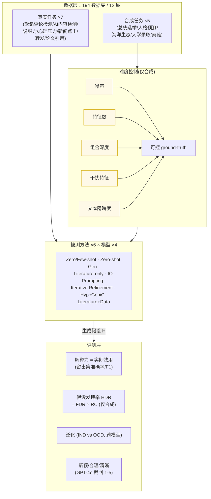

# 组会汇报 · HypoBench：给「假设生成」立一把可量化的尺子

> 本篇是 **v2 标杆范文**（结构对齐 [`2408.06292-ai-scientist-v1.md`](2408.06292-ai-scientist-v1.md)，Why 三连 + Inspires-Us 对齐 [`2506.13131-alphaevolve-deepmind.md`](2506.13131-alphaevolve-deepmind.md)）。
> 全场的「题眼」只有一句：**怎样客观衡量一个假设的好坏？** 这是科研自动化绕不开的核心难题——本文把这把尺子的每一根刻度（每个评测维度的定义式）讲透。

---

## 1. 封面 · TL;DR

> 主讲提示：开场先抛「假设生成 ≠ 出点子(ideation)」这条分界线，再用「38.8%」这个数字把全场钉住——它是「当前 LLM 远没解决科学发现」的一句话证据。

- **标题**：HypoBench: Towards Systematic and Principled Benchmarking for Hypothesis Generation
- **作者 / 机构**：Haokun Liu、Sicong Huang、Jingyu Hu、Yangqiaoyu Zhou、**Chenhao Tan**（University of Chicago / University of Toronto / Vector Institute），arXiv 2504.11524，v2 (2026-02)。
- **权威性来源**：Chenhao Tan 组是「LLM + 假设生成」这条线的开创者之一——本文的两个核心 baseline **HypoGeniC**（[`2404.04326`](https://arxiv.org/abs/2404.04326)）与 **Literature+Data**（Liu et al. 2025, [`2410.07309`](https://arxiv.org/abs/2410.07309)）都出自同组；它直接对话并扩展了 NeurIPS'24 的 **DiscoveryBench**（Majumder et al.），是该子领域**第一个把评测维度系统化、并提供可控难度合成任务**的基准。

**这篇在干什么（一段话）**：当前「LLM 做假设生成」一片火热，但有两个**根本问题没答案**：① **什么算一个好假设？** ② **怎么系统地评测假设生成方法？** HypoBench 给出答案——它把「好假设」操作化成**可计算的多维度**（核心是**解释力 = 实际效用 practical utility**，辅以**假设发现率 HDR**、**泛化性**、以及**新颖/合理/清晰**三项定性维度），并配套一个 **7 个真实任务 + 5 个合成任务、共 194 个数据集**的基准；合成任务的**难度可被精确旋钮控制**（噪声、特征数、组合深度、干扰特征、文本隐晦度）。用它评测 **4 个 SOTA LLM × 6 个假设生成方法**，得到一句冷峻结论：方法确实能发现「有效且新颖」的模式，但**离「发现全部相关模式」还很远**。

**3 条带走的结论**：
1. **「解释力优先于新颖性」是本文的方法论立场**：与 ideation 把「新」当第一性不同，HypoBench 主张**一个假设必须先有解释力（能在留出数据上做对预测），它的新颖性才有科学价值**（见原文 §3 开篇、§1 第三问）。这把「假设生成」和「出点子」彻底分开。
2. **数据驱动 > 纯推理；文献+数据 = 最佳**：在真实任务上，**Literature + Data** 全面最优（Qwen 上 OOD 准确率 **78.0%**），且数据驱动方法（HypoGeniC、IO Prompting 等）一致超过 few-shot 推理（见原文 **Table 5**）。
3. **难度一上来就崩**：合成任务**基础难度**下最好模型 HDR 高达 **93.8%**（几乎全中），但**组合深度升到 3/4** 时骤降到 **38.8%**；连 SOTA 推理模型 **O3** 在一个合成子集上也只有 **0.52** 平均 HDR（§C.4、§8 Limitations）。**这就是 HypoBench 留给后人的「改进空间」**。

---

## 2. 问题与动机（why —— 本篇最该讲透的一节）

> 主讲提示：这一节把「为什么需要一个 benchmark」讲成「因为这个领域连『好假设』都没定义清楚」。三个 why 层层递进，最后落到「合成任务为什么不可或缺」。

### 问题层 why（为什么这事值得解决）

**假设生成无处不在**——从「由行星与卫星的观测推出日心说」到「猜自己为什么没被大学录取」（原文 §1 开篇的两个例子，刻意一科学一日常）。LLM 让它看似可自动化，于是热度暴涨（原文引 Liu 2025、Zhou 2024、Ludwig & Mullainathan 2024、Majumder 2024）。**但热度带来混乱**：研究者常把「假设生成 (hypothesis generation)」与相邻概念**混为一谈**，且**没有共享的评测实践（数据集 + 指标）**（原文 §1："researchers often conflate hypothesis generation with related concepts and do not have shared evaluation practice"）。

**不解决会怎样**：没有公认的「好假设」定义和统一基准，这个子领域就会**各说各话、无法累积**——每篇论文自定指标、自报 SOTA，读者无从比较，进步无从衡量。这正是本文要堵的缺口。

### 设计层 why（为什么是「解释力优先」，而非「新颖性优先」）

> **Why（设计层）**：朴素做法（也是多数 ideation 工作的做法，原文点名 Radensky 2025）是**把新颖性当第一性**——默认「科学假设就该新、就该推动学科前沿」。→ 这在很多场景**根本不成立**：解释「我为什么没被录取」并不需要新颖，需要的是**说得对**。本文据此改用「**解释力优先**」：一个假设**必须先能解释现象（在留出数据上做对预测），它的新颖性才谈得上科学价值**（原文 §1 第三问、§3 开篇）。这是 HypoBench 与所有 ideation benchmark 的**分水岭**。

由此本文把「假设生成」**形式化地与 ideation 切割**（原文 §1）：
- **假设生成 (hypothesis generation)**：为**已观测到的现象**生成自然语言的理论/解释（"a proposed explanation for a phenomenon"，引 Wikipedia 2025）。重点是**解释**，可发生在日常生活。
- **出点子 (ideation)**：从**已有文献**出发提出**新的研究方向**，强调**与既有文献区分**（differentiate），未必在解释某个现象。

**关键推论**：因为聚焦「解释现象」，HypoBench **主要去构造『关于现象的观测』**，而不是去比「谁的想法更新」。

### 结果层 why（为什么非要有「合成 + 真实」两条腿）

> **Why（设计层之二）**：只用真实任务行不行？→ **不行**。真实开放问题的「**真假设 (ground-truth hypothesis)**」人类自己都不知道，于是**无法精确判定方法到底发现了多少**（原文 §2："the true underlying hypotheses ... remain unknown, rendering precise evaluation challenging"）。这正是**合成数据集的存在理由**：人为设定一个已知的数据生成过程，**真假设是已知的**，就能精确量「复现率」。

所以 HypoBench **两条腿走路**（原文 §2、Figure 1）：
- **真实任务**：提供「实战效度 (practical validation)」——证明方法在反映真实科研挑战的问题上**有用**；
- **合成任务**：提供「**可控的 ground truth**」——精确测量方法在**不同难度旋钮**下能复现多少真假设。

**与 DiscoveryBench 的两点关键差异**（原文 §2，本文最重要的「站位」）：
1. **DiscoveryBench 假设「相关特征已被识别并结构化」**；HypoBench **不假设**——它引入「抽象层 (abstraction layer)」，模型必须**先从非结构化自然语言里发现潜变量**，再推断其与结果的关系（这才是完整的假设发现，而非在结构化表上做模式匹配）。
2. DiscoveryBench 只测「真假设发现率」；HypoBench **扩展**了评测，加入**解释力**与**新颖性**等额外指标。

> 主讲提示：把「解释力优先」「合成补真实」「不假设特征已结构化」这三点讲清，后面所有指标与任务设计都顺理成章。这一节就是全篇的 why 主干。

---

## 3. 研究问题 / 核心 intention（形式化成一句话 + 假设）

把要解决的问题压成一句：

> **给定一个待理解的现象 $Q$、一份观测数据集 $\mathcal{D}$、以及相关文献 $\mathcal{L}_Q$，能否系统、原则化地评测各种「假设生成方法」生成自然语言假设 $H$ 的好坏——其中『好』被操作化为：先看解释力（能否预测留出数据），再看泛化、再看新颖/合理/清晰？**

原文 §2 给出的**形式化定义**（先看符号，下一节会建表）：

$$ Q,\ \mathcal{D},\ \mathcal{L}_Q\ \longrightarrow\ H. $$

它隐含的**核心假设**：
- **H1（解释力可操作化）**：「好假设」中最一阶、最客观的部分——**解释力**——可以用「**用该假设去预测留出数据的准确率**」来量化（§3 practical utility）。
- **H2（合成可控难度能诊断能力）**：通过精确控制数据生成过程的难度旋钮，能**分离并诊断**模型在「抗噪声 / 处理特征交互 / 抗干扰 / 文本抽象」等具体能力上的短板（§B.3）。
- **H3（LLM-as-judge 可信）**：对「真假设发现率」「新颖/合理/清晰」这些难以纯程序化的判断，**用 GPT-4o 当裁判**能给出与人类一致性「substantial」的评分（§5 validation，Table 8）。

---

## 4. 相关工作定位（站在谁肩上、和谁不同）

> 主讲提示：一句话概括——「DiscoveryBench 量『发现率』但假设特征已结构化；HypoBench 把『发现率』+『解释力』+『从非结构化文本抽象』一起做了」。

| 维度 | DiscoveryBench (Majumder'24) | D5 (Zhong'23) | IdeaBench / 新颖性基准 (Guo'24a; Si'24) | InductionBench (Hua'25) | **HypoBench（本文）** |
|---|---|---|---|---|---|
| 评测目标 | 真假设发现率 | 语料间差异描述的有效性+目标相关 | **新颖性**（点子层） | 合成归纳推理 | **解释力(首要)+发现率+泛化+新颖/合理/清晰** |
| 特征是否已结构化 | **是**（假设已识别） | 比较语料分析 | — | 合成 | **否（引入抽象层，从非结构化文本发现潜变量）** |
| 真实+合成 | 偏真实 | 真实语料 | 真实（论文 idea） | 纯合成 | **7 真实 + 5 合成（难度可控）** |
| 难度可控 | 有限 | 否 | 否 | 是 | **是（噪声/特征数/深度/干扰/隐晦 五旋钮）** |
| 一句话关系 | 本文的**直接前身**，被扩展 | 聚焦**比较式**语料分析，本文聚焦**解释现象** | 聚焦**新**，本文聚焦**对** | 只测推理，本文测**端到端发现** | — |

依据原文 §2 与 §6 Related Work。本文把自己**精准定位**在「DiscoveryBench 的扩展 + 与 ideation/新颖性基准的对立面」：**别人量『新不新』，本文量『对不对、能不能解释』**。

> 主讲提示：这张表是「增量从哪来」的一图。重点说两条：①「不假设特征已结构化」是它比 DiscoveryBench 更难、更真实的地方；②它与 [`2409.04109` Can-LLMs-Generate-Novel-Ideas](2409.04109-can-llms-generate-novel-ideas.md) 正好互为正反——后者证「LLM 点子更新但可行性存疑」，本文则把「可行性/解释力」做成第一性指标。

---

## 5. 方法总览（big picture，先直觉后数学）

HypoBench 不是一个「系统」，而是一套**评测框架 + 数据集 + 指标**。一图流（对应原文 Figure 1）：

**直觉**：把「评测假设生成」想成三件事——
1. **造题**（数据层）：真实题保证「像真科研」，合成题保证「答案我知道、难度我能调」；
2. **答题**（方法层）：6 种方法（从「啥都不给直接分类」到「读文献+读数据迭代精化」）× 4 个模型分别生成假设；
3. **判卷**（评测层）：先判**解释力**（最硬、最一阶），再判**发现率/泛化/定性三维**。

> 主讲提示：让听众记住「**造题—答题—判卷**」三段，以及判卷的四把尺子（解释力 / HDR / 泛化 / 定性）。后面 §7–§9 逐把尺子给定义式。

---

## 6. 符号与术语表（先定义，后文统一用）

| 记号 / 术语 | 含义 |
|---|---|
| $Q$ | 待理解的**现象 (phenomenon)** |
| $\mathcal{D}$ | **观测数据集**，含观测 $x$ 与结果 $y$ |
| $\mathcal{L}_Q$ | 与 $Q$ 相关的**文献 (related literature)** |
| $x$ | **原始观测**（如一段文本），人能拿到的表层数据 |
| $y$ | **结果/标签** (outcome/label) |
| $z$ | **潜变量 (latent variables)**，真正决定 $y$ 的底层特征 |
| $g(\cdot)$ | 编码映射 $z=g(x)$：把原始观测编码为潜变量 |
| $f(\cdot)$ | 数据生成函数 $y=f(z)$（合成任务里由分类器实现） |
| $H$ / $h$ | 生成的**假设**（自然语言）；$h$ 指单条假设 |
| $Z$ | **真**特征集合（ground-truth features，仅合成已知） |
| $\hat{Z}$ | 假设**发现**的特征集合 |
| $f$ / $\hat{f}$ | 真关系 / 假设所述关系 |
| $\mathcal{M}_I$ | 用假设做预测的**推断 LLM** (inference model) |
| $\mathcal{M}_r$ | 给「关系正确性」打分的**评分 LLM**（GPT-4o） |
| $\mathcal{M}_q$ | 给「新颖/合理/清晰」打分的**裁判 LLM**（GPT-4o） |
| IND / OOD | 域内 / 域外 (in-domain / out-of-domain) 划分，测泛化 |
| Distractor $Z^0$ | **干扰特征**：与结果无关、用来考验「抗噪/筛选」能力 |

> 主讲提示：这张表里最关键的是 $y=f(z)$、$z=g(x)$、$y=f(g(x))$ 这条**因果链**——它把「假设发现」拆成「先从 $x$ 抽出 $z$（抽象层），再判 $z$ 与 $y$ 的关系 $f$」。后面 HDR 的两个因子 FDR/RC 正好对应这两步。

---

## 7. 评测维度①——解释力 = 实际效用 (Practical Utility)

> 主讲提示：这是全篇**最重要、最一阶**的一把尺子。一句话——「好假设不是听起来对，是**拿它去预测留出数据真能做对**」。这把「解释力」从哲学概念变成可计算的数字。

**Why（设计层）**：朴素做法是让裁判 LLM「读一下假设、主观打个解释力分」。→ 这会把「**听起来有道理**」误判为「**真有解释力**」，且不可复现。本文改用**留出集预测准确率**作为解释力的主度量——直接对应科学假设评价里「**在未见数据上拟合 (fit on unseen data)**」这一核心判据（原文 §3）。**这是把『解释力』锚在可验证行为上的关键一招。**

**直觉**：把假设 $h$（= 发现的特征 $\hat{Z}$ + 其与结果的关系 $\hat{f}$）交给一个推断 LLM $\mathcal{M}_I$，让它**只依据这个假设**去对测试样本分类；分类越准，说明假设**抓住的规律越真**。

**记号（先定义）**：$\hat{Z}$ 为假设发现的特征、$\hat{f}$ 为其关系；$\mathbf{X}$ 为测试集，$(x_i,y_i)\in\mathbf{X}$ 为第 $i$ 个样本与其真标签；$\mathcal{M}_I(x_i,\hat{f},\hat{Z})$ 为「让 $\mathcal{M}_I$ 依据 $(\hat{f},\hat{Z})$ 分析 $x_i$」给出的预测；$\mathbb{1}(\cdot)$ 为指示函数（条件真取 1，否则 0）。则**准确率**定义为（原文 §3 Eq.，Accuracy）：

$$ \mathrm{Accuracy}(\hat{f},\hat{Z},\mathbf{X})\ :=\ \frac{\sum_{(x_i,y_i)\in\mathbf{X}}\mathbb{1}\!\big(y_i=\mathcal{M}_I(x_i,\hat{f},\hat{Z})\big)}{|\mathbf{X}|}. $$

**读出什么**：分子数「用这条假设预测对了几个」，分母是测试样本总数——**纯粹是「假设作为预测规则的命中率」**。注意它**完全不碰新颖性**：一条「老掉牙但正确」的假设在这里拿满分，正体现了本文「解释力优先」的立场。原文同时报告 **F1 分数**（兼顾精确率与召回率，定义见 §11），以应对类别不平衡。

> 主讲提示：强调这把尺子的**因果方向**——不是「假设描述得多漂亮」，而是「**把假设当工具去预测，工具好不好用**」。这正是它区别于一切「LLM 自评解释力」做法的根本。

---

## 8. 评测维度②——假设发现率 HDR（仅合成，可量「复现了多少真理」）

> 主讲提示：解释力测「假设好不好用」，HDR 测「假设对不对、全不全」。**只有合成任务能算 HDR**，因为只有它知道真答案 $Z,f$。这把尺子是 HypoBench 相对 DiscoveryBench 的核心继承与扩展。

**Why（设计层）**：朴素做法是直接拿生成假设和真假设**整句比对**（字符串/语义相似度）→ 会被「**用词不同但意思对**」或「**部分对**」搞乱。本文借鉴 Majumder 2024，把 HDR **分解成两个可独立评估、更简单的子任务**：①**特征发现对不对**（FDR），②**关系刻画对不对**（RC）。**分解 = 让每个子判断都简单到 LLM 裁判能做准**（这也是 §5 人类一致性高的原因）。

**直觉**：复现一条真假设 = 「**找对了哪些特征**」× 「**这些特征跟结果的关系也说对了**」。两步都对才算真复现，所以两个因子**相乘**。

### 8.1 总式：HDR

记号：见下两小节。原文 §3：

$$ \mathrm{HDR}\ =\ \mathrm{FDR}\ \cdot\ \mathrm{RC}. $$

**读出什么**：这是一个**召回导向 (recall-oriented)** 的指标——它问「**真理里有多少被复现了**」，而非「生成的假设里有多少是对的（精确率）」。因此原文**坚持把它和解释力 (utility) 并用**，以免只测召回、漏看「假设是否真能用」（原文 §3 末、§8 Limitations 明确这一点）。

### 8.2 因子一：特征发现率 FDR (Feature Discovery Rate)

**直觉**：真特征集 $Z$ 里，被假设**发现**的那部分占比。

记号：$Z$ 为真特征集，$\hat{Z}$ 为发现的特征集，$|\cdot|$ 为集合大小。则（原文 §3）：

$$ \mathrm{FDR}\ =\ \frac{|\hat{Z}\cap Z|}{|Z|}. $$

**读出什么**：纯粹是「真特征的**召回率**」。若真假设依赖 3 个特征、模型只找对 2 个，FDR = 2/3。**特征是否「算同一个」由一个 LLM 判定**（附录 A.2 的 *Feature Discovery Rate* prompt：只比对「是否在讨论同一个输入变量」，**忽略关系方向、阈值、标签**）。

### 8.3 因子二：关系正确性 RC (Relationship Correctness)

**直觉**：在「找对的特征」上，假设说的「这个特征**怎样**影响结果」对不对（方向、性质）。

记号：$\hat{Z}\cap Z$ 为匹配上的特征集；$z_i$ 为其中一个特征；$\mathcal{M}_r(z_i,\hat{f},f)\in[0,1]$ 为评分 LLM 给「$z_i$ 在 $\hat{f}$ 里的关系 vs 真关系 $f$」打的正确性分。则（原文 §3）：

$$ \mathrm{RC}\ =\ \frac{1}{|\hat{Z}\cap Z|}\sum_{z_i\in \hat{Z}\cap Z}\mathcal{M}_r(z_i,\hat{f},f). $$

**读出什么**：这是匹配特征上**关系正确性的平均分**。$\mathcal{M}_r$（GPT-4o）按 $[0,1]$ 评分，附录 A.2 给了**明确档位**：`1.0` 完美匹配、`0.75` 抓住主关系但漏小细节、`0.5` 部分正确（关系对或结论对，缺重要变量/条件）、`0.25` 勉强相关、`0.0` 错误/矛盾/空。**关键判据：方向明显矛盾的关系（如「A 录取」vs「F 录取」）直接给 0.0**——这把「说反了」严惩，正是「关系正确性」的灵魂。

> 主讲提示：把 HDR = FDR × RC 与 §6 的因果链 $y=f(g(x))$ 对上——**FDR 管「$g$：抽对特征没有」，RC 管「$f$：关系说对没有」**。两步乘起来，才是「完整复现一条真假设」。强调它是**召回导向**，必须配解释力一起看。

---

## 9. 评测维度③④——泛化性 + 新颖/合理/清晰（定性三维）

> 主讲提示：前两把尺子测「对不对、好不好用」，这两组测「换个场景还成立吗」和「人读起来怎么样」。**定性三维用 LLM 裁判，是本文承认的最大不确定性来源**（§8），讲的时候要明确「宣称 vs 局限」。

### 9.1 泛化性 (Generalizability)

**Why（设计层）**：一条假设若只在它「出生」的数据上成立、换个分布就失效，它的科学价值有限。朴素做法是只在同分布测试集上算准确率→**测不出过拟合**。本文为每个真实任务**构造配对的 IND / OOD 划分**（原文 §3、Table 9），并额外做**跨模型实验**（A 模型生成的假设，给 B 模型用），双重考验泛化。

- **域内/域外 (IND/OOD)**：按**不同数据源或时间段**切分（如新闻点击：2013 前为 IND、2014 年为 OOD；论文引用：不同期刊/年份）。在 IND 和 OOD 上分别算「基于假设的推断准确率与 F1」，对比落差即泛化性。
- **跨模型 (cross-model)**：见原文 **Table 6**——把假设从一个模型迁到另一个模型做推断，平均准确率仅掉 **3.4%**，说明假设**作为自然语言知识**有不错的跨模型可迁移性（同族模型 Llama↔DeepSeek 尤其稳）。

### 9.2 定性三维：新颖、合理、清晰 (Novelty / Plausibility / Clarity)

**Why（设计层）**：解释力/HDR 量不出「这条假设对人类研究者是否**有启发、可信、读得懂**」。本文沿用 Liu et al. 2025 的人类专家评分标准，让裁判 LLM $\mathcal{M}_q$（GPT-4o）按 **1–5** 打分。**注意本文的立场**：这三维是「**次要考量**」，解释力才是一阶（原文 §3、§5 末）。

记号：$\hat{f},\hat{Z}$ 为生成假设，$\mathcal{L}_Q$ 为相关文献上下文。则（原文 §3）：

$$ (\text{Novelty},\ \text{Plausibility},\ \text{Clarity})\ =\ \mathcal{M}_q(\hat{f},\hat{Z},\mathcal{L}_Q). $$

**三维定义（原文附录 A.2 给了完整 1–5 量规，摘要如下）**：
- **新颖性 (Novelty)**：假设在该领域**超越既有知识、提供新洞见**的程度。`1`=早已被证明/广为人知、毫无新意；`5`=开创性、开辟全新研究方向。
- **合理性 (Plausibility)**：假设**在科学上站得住、与已有证据一致**的程度。`1`=毫无逻辑/经验支撑、与既有知识冲突；`5`=高度可信、与既有知识和逻辑完全自洽、很可能为真。
- **清晰度 (Clarity)**：假设**表述清楚、逻辑分明、易懂**的程度。`1`=高度含糊、有歧义；`5`=异常清晰、术语精确、可检验。

**读出什么**：把 $\mathcal{M}_q$ 当一个「读过相关文献的评审」，对照 $\mathcal{L}_Q$ 给三个轴打分。**$\mathcal{L}_Q$ 进 prompt 很关键**——「新颖」必须**相对已有文献**才有意义。

> 主讲提示：这里埋一条全课主线——**新颖 ≠ 合理（feasibility）**。Table 7 会看到：得「最高合理性」的方法（Literature-only）恰恰**新颖性最低**；得「最高新颖性」的方法（Iterative Refinement）合理性平平。**没有一种方法能两头通吃**——这正是 [`2409.04109`](2409.04109-can-llms-generate-novel-ideas.md) 和 [`m9.3-ideation-and-tournament`](../m9.3-ideation-and-tournament/) 反复敲打的「novelty↔feasibility 张力」。

---

## 10. 任务构造：合成数据如何做到「难度可控 + 强迫抽象」

> 主讲提示：这一节是 HypoBench 的「工程心脏」。讲清两件事：①合成数据怎么造出「已知真假设」；②**五个难度旋钮**分别考验什么能力。这是它能做「诊断式评测」的根本。

### 10.1 合成数据生成：从潜变量到文本的可逆构造

**Why（设计层）**：朴素做法是直接给模型一张**结构化特征表**让它找规律（DiscoveryBench 路线）→ 只测了「模式匹配」，没测「**从原始文本里抽象出特征**」这一真发现的核心步骤。本文引入**抽象层 (abstraction layer)**：模型看到的是**非结构化自然语言描述 $x$**，必须**先经溯因推理 (abductive reasoning) 解出潜变量 $z=g(x)$**，再推断 $z$ 与结果 $f$ 的关系（原文 §2 Abstraction layer）。

**生成流程**（原文 §2、§B.3）：选一个分类器实现真关系 $f:z\to y$（**逻辑回归**=线性、**决策树**=非线性+特征交互），再用 LLM 做 $g^{-1}:z\to x$ 的「提示驱动生成」把特征**嵌入自然语言模板**。整条链 $y=f(g(x))$ 因此**真假设 $Z,f$ 完全已知**。
- **逻辑回归**：$K$ 类，随机权重 $\beta_c\in(-5,5)$、截距 $\alpha_c\in(-1,1)$，类别概率 $\hat{p}(y=c\mid z)=\dfrac{\exp(\beta_c\cdot z+\alpha_c)}{\sum_{k=1}^K\exp(\beta_k\cdot z+\alpha_k)}$，给出**可解释的线性决策边界**。
- **决策树**：随机选特征与阈值分裂，叶节点按到达样本分布赋类别概率，**捕捉非线性与特征交互**。
- 真假设由权重的**类别偏好排序**翻译成自然语言（如「正权重 → 含该特征的文本更可能属某类」），形成**可精确评估的 ground-truth 假设**（原文 §B.3 Ground Truth Hypothesis Generation）。

### 10.2 五个难度旋钮（每个考验一种能力）

原文 §B.3 给出 **6 个预设难度等级 (Level 0–5)** 和 **对比难度旋钮（contrastive settings）**，最终 6 难度 × 2 呈现模式 = **12 个数据集**，对比旋钮网格搜索 = **64 个配置**：

| 旋钮 | 取值（对比设置） | 考验什么能力 | 原文出处 |
|---|---|---|---|
| **结果噪声 (noise)** | 0, 10%, 20%, 30% 标签翻转 | 在噪声中抓**核心模式**、丢弃随机扰动 | §2、§B.3 |
| **特征数 (# features)** | 5, 10, 15, 20 | 复杂度 / 在更多变量里定位真特征 | §B.3 |
| **组合深度 (compositionality)** | 决策树深度 1, 2, 3, 4 | **特征交互**（深度 = 几个特征联合决定标签） | §B.3 |
| **干扰特征 (# distractors)** | 0, 3, 6, 10 | 从无关信息里**筛出真正相关**的特征 $Z^0$ | §B.3 |
| **文本隐晦度 (subtlety)** | 对照组(显式) vs 实验组(隐含于文本) | **抽象**：特征是明说还是要从字里行间读出 | §2、§B.3 |

**预设等级速记**：Level 0=单特征定标签；Level 1=单特征类型全有权重；Level 2=3 真特征 + 2 干扰；Level 3=Level 1+10% 噪声；Level 4=Level 2+25% 权重丢弃；Level 5=Level 2+10% 噪声+25% 丢弃。每级再分**Regular(嵌入文本)/No-Subtlety(显式枚举)** 两种呈现。

**逆向(counterintuitive)版本**——本文最妙的一招（原文 §5、Figure 4）：对大学录取任务，把真假设**反转**（「A 录取」→「**F 录取**」），构造**与模型先验冲突**的数据。用来分离「模型**真在从数据学**」还是「**靠背景先验蒙**」。结果：复杂度一高，所有模型在逆向版上 HDR **跌破 15%**，**先验帮不上忙时就现原形**。

> 主讲提示：把「五旋钮」念成「噪声、特征多、交互深、干扰多、说得隐晦」，每个对一种能力。再用**逆向录取**这个例子点睛——它把「靠先验蒙」和「真从数据学」分开，是评测设计的神来之笔。

---

## 11. 实验设置（setting / metrics / params / 算力，写全）

> 主讲提示：这一节把「谁、用什么、怎么测」一次说全。最该记的是「4 模型 × 6 方法」和「指标 = 解释力(准确率/F1) + HDR(合成) + 泛化 + 定性三维」。

- **被测模型（4 个 SOTA LLM）**：**GPT-4o-mini (GPT)**、**Qwen-2.5-72B-Instruct (Qwen)**、**Llama-3.1-70B-Instruct (Llama)**、**DeepSeek-R1-Distilled-Llama-70B (DeepSeek)**。另**微调一个 Llama-3.1-8B (Llama8B)** 作为「能从大量样本学习」的对照点（每个真实任务在 IND 训练集微调，IND/OOD 双测）。
- **被测方法（6 类假设生成方法 + 2 个推理基线）**（原文 §4）：
  1. **Zero-shot inference**：直接让 LLM 分类，不生成假设（**下界**，测裸模型知识）。
  2. **Zero-shot generation**：仅凭任务描述生成假设（不看数据样本），再用假设分类。
  3. **Literature-only**（Liu 2025）：先收集相关论文、总结要点，再据此生成假设（**仅真实任务**）。
  4. **IO Prompting**（Qiu 2024）：给一批带标注的样本，一步生成假设。
  5. **Iterative Refinement**（Qiu 2024）：在 IO Prompting 上加反馈环，用**被错分的样本**迭代精化假设。
  6. **HypoGeniC**（Zhou 2024, [`2404.04326`](https://arxiv.org/abs/2404.04326)）：维护一个**带奖励分的假设库**，平衡「利用高分假设」与「探索新假设」，遇到难样本就生成新假设持续精化。
  7. **Literature + Data**（Liu 2025, [`2410.07309`](https://arxiv.org/abs/2410.07309)）：在 HypoGeniC 上**叠加文献 agent**，**文献 + 数据双 agent** 迭代精化（本文真实任务里的**最强方法**）。
- **指标（定义式见 §7–§9）**：
  - **解释力**：留出集 **Accuracy**（§7 Eq.）+ **F1**。F1 = 精确率 $P$ 与召回率 $R$ 的调和平均 $F_1=\dfrac{2PR}{P+R}$（兼顾不平衡类别）。
  - **HDR = FDR × RC**（仅合成，§8）。
  - **泛化**：IND vs OOD 的 Accuracy/F1 落差 + 跨模型迁移（Table 6）。
  - **定性**：Novelty/Plausibility/Clarity ∈ {1..5}（GPT-4o 裁判 $\mathcal{M}_q$，§9）。
- **裁判模型**：HDR 的 $\mathcal{M}_r$、定性的 $\mathcal{M}_q$、解释力推断的 $\mathcal{M}_I$ **均用 GPT-4o**（§3）。
- **规模**：真实任务 IND/OOD 规模见原文 **Table 1**（如欺骗检测 IND 1600 / OOD 640；论文引用 1182/1104）；合成任务规模见 **Table 2**（总统选举 178,750、人格预测 178,750、大学录取 7,800、卖鞋 3,300、海洋生态 500）。数据切分 70/10/20（训练/验证/测试），转为 **Hugging Face Dataset 格式**。
- **算力 / 成本 / 种子**：**原文未给出**统一的 GPU 时长或美元成本；**标准误**「typically 2–4%」（Table 5 脚注），据此作者称方法间差异「statistically meaningful」。

> 主讲提示：强调两点工程诚实——①**所有「软判断」都外包给 GPT-4o**（这既是可扩展性，也是 §13 的最大软肋）；②**成本/算力原文没报**，组会若被问到要如实说「未给出」。

---

## 12. 主要结果（数字 + 解读，别只贴表）

> 主讲提示：结果分两块——真实任务（Table 5/6/7）讲「哪种方法/模型最强、新颖与合理的拉锯」；合成任务（Figure 2/3/4）讲「难度一上来就崩」。每个数字都要解读「为什么是这个数」。

### 12.1 真实任务：Literature+Data 全面最优（Table 5，OOD）

原文 **Table 5**（真实任务 OOD 平均 Accuracy / F1，跨数据集平均）：

| 方法 | GPT (Acc/F1) | Qwen | Llama | DeepSeek |
|---|---|---|---|---|
| Zero-shot inference | 61.8 / 56.1 | 60.1 / 55.5 | 66.9 / 63.6 | 62.9 / 58.0 |
| Few-shot inference | 65.7 / 62.7 | 68.9 / 68.0 | 72.5 / 71.2 | 66.9 / 64.1 |
| Zero-shot generation | 62.4 / 57.6 | 63.4 / 59.1 | 62.8 / 56.4 | 62.9 / 57.8 |
| Literature-only | 61.9 / 57.1 | 62.5 / 57.3 | 62.0 / 55.3 | 59.3 / 53.7 |
| IO Prompting | 66.1 / 65.1 | 74.5 / 74.0 | 68.2 / 66.3 | 61.6 / 59.8 |
| Iterative Refinement | 66.0 / 63.9 | 70.5 / 69.5 | 69.9 / 68.9 | 63.6 / 62.7 |
| HypoGeniC | 71.2 / 70.3 | 77.8 / 77.8 | 72.3 / 70.9 | 70.0 / 68.7 |
| **Literature + Data** | **75.3 / 75.0** | **78.0 / 77.9** | **76.2 / 75.9** | **74.9 / 74.5** |
| *Finetuned Llama* | *OOD 77.3 / 76.0* | | *IND 84.7 / 84.7* | |

**结果层 why（为什么是这些数）**：
- **数据驱动方法一致 > few-shot 推理**：IO Prompting / Iterative Refinement / HypoGeniC / Lit+Data 全面超过 few-shot——说明这些方法**从数据里榨取的有效信息比「几条示例」多得多**（原文 §5）。
- **Literature + Data 最强**：四个模型上都第一——**文献知识 + 经验数据互补**，缺一不可（Literature-only 单独反而垫底，说明「光读文献、不看数据」生成的假设解释力不足）。
- **Qwen 最会做假设**：用最强方法时 Qwen 平均超其他模型 **2.5%**；但**Qwen 加文献几乎没涨**（仅 +0.1% vs 全体平均 +4.3%）——**Qwen 吸收外部文献的能力是短板**（原文 §5「interesting trend」）。
- **逼近微调上界**：在 OOD 上，假设生成方法已**与微调 Llama-8B 持平**（Qwen 甚至领先 0.6%）；但在 **IND 上仍落后 8.7%**——**真实任务里「上界未知」，这个差距正是「合成任务存在的理由」**（原文 §5）。

### 12.2 定性：没有方法能「又新又稳」（Table 7）

原文 **Table 7**（N=新颖 / P=合理 / C=清晰，1–5）显示一条贯穿全文的张力：
- **Literature-only 合理性最高**（如 DeepSeek P=4.20）**但新颖性最低**——因为它生成的假设**像已有知识**（模型多半在相似数据上预训练过）。
- **Iterative Refinement 新颖性最高**（如 GPT N=2.97）——迭代精化**鼓励偏离初始假设**，更「敢想」，代价是合理性平平。
- **结论**：「平衡合理与新颖」对假设生成是**真难题**，**没有单一方法两项都拔尖**（原文 §5）。**这就是 novelty↔feasibility 张力的实测证据。**

### 12.3 合成：难度一上来就崩（Figure 2/3/4）

> 主讲提示：这是全场最该让人记住的「冷水」。基础难度近乎满分，难度旋钮一拧就跳水——把几个关键拐点数字念出来。

聚焦最强数据驱动方法 **HypoGeniC**（原文 §5、Figure 2）：
- **基础难度**（单真特征、深度 1、无噪声无干扰）：**DeepSeek HDR 93.8%**（最高），GPT 最低 **75.0%**——**简单情形几乎全中**。
- **加噪声 / 加干扰**：DeepSeek 在噪声下 HDR 跌到 **40.0%**、加干扰跌到 **38.3%**——**且 DeepSeek 跌得比别人狠**，作者推测其「思考模式 (thinking mode)」**对噪声特别敏感**（生成更少样、更不多样的假设，base 不全中但抗噪略稳）。
- **组合深度**：深度 1→2 时 Qwen/Llama 反而**升**（81.3%→93.8%、87.5%→100%，**两特征交互能抓住**）；但**深度 2→3/4 急跌**，最好的 DeepSeek 在该配置只有 **38.8%**——**三个以上特征的复杂交互是当前模型的硬墙**（原文 §5）。
- **文本隐晦度 (subtlety)**：四个模型在「特征隐含于文本」时**一致下降**——**抽象能力是普遍短板**（Figure 2e）。
- **先验的双刃剑**（Figure 3/4）：Zero-shot generation 在**总统选举 / 人格预测**上 HDR **< 20%**（先验帮不上），但在**大学录取 / 卖鞋**上 > 50%（先验对得上）；**逆向录取**版本里复杂度一高，所有模型 HDR **< 15%**——**先验一旦与数据冲突，模型就抓瞎**。值得注意 **DeepSeek 在逆向复杂场景里反而最稳**，佐证其「思考模式」在先验无用时更靠谱。

---

## 13. 消融与分析：LLM 裁判到底可不可信？（Table 8）

> 主讲提示：HypoBench 的所有「软指标」都建立在「GPT-4o 当裁判」之上。**这一节就是它给自己做的『信度体检』**——不通过，整套 HDR 都悬。

**Why（设计层）**：HDR、定性三维都依赖 LLM-as-judge。朴素质疑是「**裁判自己会不会乱打分？**」本文做了**人类标注研究**正面回应（原文 §5 Validating LLM-based evaluation）：抽 **100 对假设**，跨任务类别 + 分数段**分层采样**，两名标注员**独立**评 FDR（二元）与 RC（5 档），**对 LLM 分数盲评**。结果（原文 **Table 8**）：

| 指标 | 度量 | 人–人一致 | 模型–人一致 |
|---|---|---|---|
| **FDR** | Cohen's $\kappa$ | 0.80 | **0.71** |
| | % 一致 | 92.0% | 89.1% |
| **RC** | 加权 $\kappa_w$ | 0.86 | **0.64** |
| | 1 分以内 | 97.1% | 78.1% |

**读出什么**：人–人一致性「substantial 到 almost perfect」（κ=0.80/0.86），说明**标注标准本身定义良好**；模型–人一致性「substantial」（κ=0.71/0.64），且 RC 有 **78% 落在人类共识 1 分以内**——**LLM 裁判是人类判断的可靠近似**（原文结论）。

**但要诚实（批判）**：①**定性三维（N/P/C）没做人类验证**，原文 §8 明说「应作为初步信号、而非定论 (preliminary signals rather than definitive assessments)」；②κ=0.64（RC 模型–人）并非高到无懈可击，难样本上仍有分歧。**这也是作者把「解释力(留出集预测)」立为一阶指标的根本原因——它不依赖任何 LLM 主观判断**（§8）。

> 主讲提示：这张表是「benchmark 给自己背书」的样板。讲两面：通过了信度体检（FDR/RC），但定性三维**自承未验证**——区分「宣称」与「局限」。

---

## 14. 局限与批判（诚实，区分宣称 vs 边界）

原文 §8 Limitations 自陈 + 社区可质疑点：

1. **评测仍重度依赖 LLM-as-judge**（原文自承）：HDR 和定性三维都靠 GPT-4o。虽 FDR/RC 经人类验证（κ=0.71/0.64），但**定性三维未验证**；用同一家模型当裁判也可能引入**家族偏好**（被测里就有非 GPT 模型）。**对策是把解释力(留出集准确率)当主指标**——它不靠裁判。
2. **只覆盖二分类设置**（原文自承）：HDR 的「特征发现 + 关系」框架目前**只在二分类任务上跑**；**扩展到回归或开放式科学发现仍是未来工作**。这意味着 HypoBench 离「真·开放科学」还有距离——它的「现象」都是**预定义的分类任务**。
3. **合成 ≠ 真实，迁移性是「诊断信号」而非「保证」**（原文自承）：合成任务用于受控诊断，**不能直接预测真实科研表现**；合成与真实的差距应读作「**模型在受控条件下能力的诊断**」，而非「迁移到真实的承诺」。
4. **真实任务「上界未知」**：因为真假设人类也不知道，真实任务上**到底还差多少无法精确量化**（§5 自承），只能用「逼近微调 Llama-8B」间接估计——**这恰是合成任务存在的理由，但也意味着真实任务的结论不如合成精确**。
5. **难度仍是「人造旋钮」**：五个旋钮（噪声/特征/深度/干扰/隐晦）是**研究者设定的**，未必覆盖真实科研难度的全部维度（如「需要跨学科知识」「需要新实验」）。**当前框架测不了「需要做湿实验才能验证的假设」**——这把它和 co-scientist / Robin 那类「带实验验证」的系统划到互补位置。
6. **挑战性已被 SOTA 模型印证**：原文 §8 特别点出 **O3（顶尖推理模型）在一个合成子集上平均 HDR 仅 0.52**（§C.4）——**即便最强模型也远未刷爆**，说明 benchmark **留足了改进空间**（这既是宣称的价值，也提示「假设发现」本身远未被解决）。

> 主讲提示：把第 2、3、6 条单独强调——「**只做二分类**」是范围边界、「**合成≠真实**」是解读纪律、「**O3 只有 0.52**」是「难题尚未解决」的硬证据。诚实区分：哪些是作者自承，哪些是你替社区追问。

---

## ★ 对我们的启发（Inspires Us）

> 这一节回答一句话：HypoBench 对我（们）接下来要做的研究，**到底能用上什么**。前面都在讲「它怎么量假设」，这里讲「**我们下周就能拿它的尺子量什么**」。

- ➤ **a. 可直接借用的招（reuse）**：
  1. **「HDR = FDR × RC」的分解式评测**——把「一条假设对不对」拆成「**特征找对没（FDR）+ 关系说对没（RC）**」两个**更简单、LLM 裁判能做准**的子判断（§8 信度由此而来）。可**原样搬进** [`m9.3-ideation-and-tournament`](../m9.3-ideation-and-tournament/) 与 [`m9.6-evaluating-research-agents`](../m9.6-evaluating-research-agents/)：凡是要「自动判一个想法/假设质量」的地方，都用「**分解成原子判断 + 各自校准**」，而不是让裁判整句打一个含糊总分。
  2. **「解释力 = 留出集预测准确率」作为不依赖裁判的一阶指标**——这是**抗「LLM 自评幻觉」的硬办法**：不让裁判主观说「这假设有解释力」，而是**拿假设当预测规则、在 unseen data 上实测命中率**（§7 Eq.）。任何「生成-然后-自评」的管线都该加这把「行为级」尺子兜底。
  3. **可控难度的「逆向(counterintuitive)」对照组**——把真假设**反转**造出与模型先验冲突的数据（§5、Figure 4），一招分离「**真从数据学**」与「**靠先验蒙**」。这是给任何「假设/归纳」能力做**因果归因**的神器。

- ➤ **b. 可迁移到我们课题（transfer）**：我们的 [`m9.3-ideation-and-tournament`](../m9.3-ideation-and-tournament/) 在做「点子锦标赛」，核心痛点正是「**怎么客观给一个 idea 打分**」。HypoBench 的迁移价值是：**把『novelty 与 feasibility 分成两根独立轴』从口号变成可计算量**——novelty 用 $\mathcal{M}_q$（相对 $\mathcal{L}_Q$）、feasibility/解释力用「留出集预测」。迁移时**要改的前提**：ideation 的产物是「研究方向」、未必有可预测的留出数据，所以「解释力」这把尺子**不能直接套**；需要先把「方向」落成「**可证伪的子假设**」才能量——这一步本身就是个开放问题（见下条）。

- ➤ **c. 它暴露的开放问题 = 我们的机会（opportunity）**：HypoBench 的**硬边界是「只做二分类、合成难度是人造旋钮、定性三维未经人类验证」**（§8）。→ **机会**：能否把 HDR 框架**从二分类推广到「回归 / 开放式假设」**？给出**可下手的第一步**——在 [`m9.6`](../m9.6-evaluating-research-agents/) 里挑一个**回归型**合成任务，定义「连续关系正确性」（如真/假关系的斜率符号 + 量级误差），跑通「FDR×RC 的回归版」，看 LLM 裁判一致性还能不能守住 κ>0.6。这若成立就是一篇**直接接续 HypoBench 的工作**。

- ➤ **d. 与本库其它论文/模块的连接（connect the dots）**：
  - **正反呼应**：与 [`2409.04109` Can-LLMs-Generate-Novel-Ideas](2409.04109-can-llms-generate-novel-ideas.md) **互为正反**——后者证「LLM 点子**更新**但**可行性/落地存疑**」，HypoBench 则把「可行性/解释力」做成**第一性指标**并实测「Literature-only 最稳但最不新、Iterative Refinement 最新但不稳」（Table 7）。两篇合读 = 「**novelty↔feasibility 张力**」的论点（前者）+ 度量（后者）。
  - **同源承接**：它的两个 baseline **HypoGeniC**（[`2404.04326`](https://arxiv.org/abs/2404.04326)）与 **Literature+Data**（[`2410.07309`](https://arxiv.org/abs/2410.07309)）是被它**当尺子去量的对象**——读完 HypoBench 再回看 HypoGeniC，就知道「**它在合成难任务上为什么会从 93.8% 跌到 38.8%**」。
  - **评测家族**：与 [`2407.01725` DiscoveryBench 思想]、[`2410.05080` ScienceAgentBench](2410.05080-scienceagentbench.md)、[`2505.19955` MLR-Bench](2505.19955-mlr-bench.md) 同属 E 组评测，但**唯独 HypoBench 把『好假设』本身的定义做成了多维定义式**——补上了别的 benchmark「只测产出、不定义『好』」的空白。
  - **方法论对照**：与 [`2506.13131` AlphaEvolve](2506.13131-alphaevolve-deepmind.md) 形成「**可验证评估**」的跨域呼应——AlphaEvolve 用「机器可执行的 $h$」当选择压力，HypoBench 用「留出集预测」当解释力判据，**两者都在反对『让 LLM 自评』**。

- ➤ **e. 如果我来做下一步（my next move）**：我会在 [`m9.3`](../m9.3-ideation-and-tournament/) 的点子锦标赛里**接入 HypoBench 的「双轴评分」**——给每个 idea 同时打 **novelty（相对文献，$\mathcal{M}_q$）** 和 **解释力（先落成可证伪子假设、再用一小份留出数据测预测命中率）**，跑一组最小实验：看**锦标赛排序在「只用 novelty」与「novelty+解释力」下是否显著不同**，以及「高 novelty 但低解释力」的 idea 占比有多大。一周内能出第一张「novelty-解释力散点图」，直接验证「新 ≠ 对」在我们自己的 pipeline 里是否复现。

> 主讲提示：这一节是全场高潮——落点是 m9.3（双轴评分）和 m9.6（HDR 推广到回归），能被同组同学直接接力。一句话收口：**「HypoBench 教会我们——评一个假设，先问『它能不能预测对』，再问『它新不新』，而且这两件事要分开量。」**

---

## 15. 在 auto-research 版图的位置（相对已有论文的增量）

- **它把谁向前推了一步**：**DiscoveryBench (NeurIPS'24) → HypoBench**。增量有三：①**不再假设特征已结构化**，强迫从非结构化文本抽象（抽象层）；②把评测从「单一发现率」**扩成多维**（解释力 + HDR + 泛化 + 定性）；③加入**可控难度合成任务**，使「诊断式评测」成为可能。
- **阶梯定位**：按本库 Tool→Analyst→**Scientist** 阶梯，HypoBench **不是一个 agent，而是 Analyst/Scientist 级能力的『考官』**——它**量的恰是「能不能从观测中归纳出正确解释」这一 Scientist 的核心子能力**，并给出「**当前最强模型在难任务上只到 38.8%**」的冷静定位。它和 [`2409.04109`](2409.04109-can-llms-generate-novel-ideas.md)（点子层考官）、[`2410.05080` ScienceAgentBench](2410.05080-scienceagentbench.md)（执行层考官）一起，构成 E 组「**给自动科研各环节立尺子**」的拼图。
- **相对时间增量**：作为 2026 年的工作，它是该子领域**第一个系统化、原则化的假设生成基准**——在它之前，「什么是好假设」基本各说各话；它之后，至少**解释力/HDR/定性**这套维度有了可引用的定义式。

---

## 16. 复现与可用性

- **开源承诺**：原文多处声明「**will release all code and datasets upon publication**」（§1、§B.4）；数据已转 **Hugging Face Dataset 格式**，便于直接加载。**截至本文 v2，正式数据集发布以官方为准**（原文未给最终仓库链接——如需写「原文未给出」）。
- **能不能在单卡跑**：**评测本身的算力瓶颈在 LLM API 调用**（4 模型 × 6 方法 × 194 数据集 × 多裁判调用），而非 GPU；合成数据规模可控（最小的海洋生态仅 500、卖鞋 3300）。**裁判用 GPT-4o**，故复现需可用的 GPT-4o 级 API。
- **坑**：①**所有软指标对裁判模型敏感**——换裁判可能改变 HDR/定性绝对值，复现时务必锁定裁判版本；②**合成难度的「逆向版」**是分离先验的关键，复现「难度崩塌」结论时别漏；③成本/算力**原文未给**，预算需自行估（4×6×194 的组合不小）。

---

## 17. 组会讨论问题

1. 本文把「**解释力（留出集预测准确率）**」立为一阶、把「新颖性」降为次要——这个**价值排序**在哪些科研场景成立、哪些不成立？（提示：理论物理 vs 社会科学 vs 工程）
2. HDR = FDR × RC 是**召回导向**的。若一个方法生成**一大堆假设**、其中混进了真特征，FDR 会虚高——**该不该给 HDR 配一个精确率项**？怎么配？
3. 「难度从基础到深度 3/4，HDR 93.8%→38.8%」——这是**模型能力上限**，还是**HDR 指标 / 裁判 $\mathcal{M}_r$ 的上限**？设计什么实验能区分这两者？
4. **DeepSeek 的「思考模式」对噪声特别敏感、却在逆向场景最稳**——这对「推理模型适合什么样的假设生成任务」有何启示？
5. 定性三维（N/P/C）**未经人类验证**，作者自降为「初步信号」。如果让你补这个验证，**采样策略和标注协议**该怎么设计才省钱又可信？（可借 §5 的分层采样）
6. HypoBench **只做二分类**。把它推广到「**回归 / 开放式假设**」时，FDR 和 RC 各要怎么重定义？最大的障碍是什么？
7. 它和 [`2409.04109`](2409.04109-can-llms-generate-novel-ideas.md) 一个说「LLM 点子更新」、一个说「LLM 解释力有限」——**这两个结论矛盾吗**？还是在量**不同的东西**？
8. 「Qwen 加文献几乎不涨（+0.1%）」——这是 **Qwen 的能力缺陷**，还是**文献注入方式（Literature+Data 的 agent 设计）对某些模型不友好**？怎么验证？

---

## 18. 一页速记（takeaways）

- **一句话**：HypoBench = 第一个**系统化、原则化**评测「假设生成」的基准——把「好假设」拆成**解释力(首要) + HDR + 泛化 + 新颖/合理/清晰**，用 **7 真实 + 5 合成（难度可控）/ 194 数据集**，量出当前 LLM「**简单全中、难任务崩盘**」。
- **四把尺子（带定义式）**：
  - **解释力** = 留出集预测准确率 $\dfrac{\sum\mathbb{1}(y_i=\mathcal{M}_I(x_i,\hat f,\hat Z))}{|\mathbf X|}$（不依赖裁判，**一阶**）；
  - **HDR** = **FDR**$\,\dfrac{|\hat Z\cap Z|}{|Z|}$ **× RC**$\,\dfrac{1}{|\hat Z\cap Z|}\sum\mathcal{M}_r$（召回导向，仅合成）；
  - **泛化** = IND/OOD 落差 + 跨模型迁移（掉 3.4%）；
  - **定性** = $\mathcal{M}_q\to$ Novelty/Plausibility/Clarity ∈{1..5}（**未经人类验证，初步信号**）。
- **五个难度旋钮**：噪声 / 特征数 / 组合深度 / 干扰特征 / 文本隐晦度（+ 逆向版分离先验）。
- **关键数**：真实任务 **Literature+Data 最优**（Qwen OOD **78.0%**）；合成基础 **93.8%** → 深度 3/4 **38.8%**；裁判信度 FDR κ=**0.71**、RC κ=**0.64**；SOTA **O3 仅 0.52**。
- **三句话结论**：解释力优先于新颖（立场）/ 数据驱动+文献最强（实测）/ 难任务远未解决、定性维度未验证（边界）。
- **记忆锚**：**93.8% → 38.8%**（简单全中、难就崩）。

> 主讲提示：结尾回到题眼——**「怎样客观衡量一个假设的好坏？」** HypoBench 的答案是：**先量它能不能预测对（解释力），再量它复现了多少真理（HDR），最后才量它新不新——而且每一项都给出可计算的定义式。** 这把尺子，正是科研自动化最缺的那一把。

---

### 附：质量自检（对照 v1+v2 规范）

- [x] 每个公式前都有**直觉 + 全部符号先定义**（§7 Accuracy、§8 HDR/FDR/RC、§9 定性、§10 逻辑回归式）。
- [x] setting/metrics/params **齐全**，**每个评测维度都给了定义式**（解释力/HDR/FDR/RC/定性/泛化）。
- [x] 数字/公式**均标 §/Table/Eq 出处**（Table 1/2/5/6/7/8、Figure 1/2/3/4、§B.3、§C.4）；缺失处（成本/算力/最终仓库链接）已写「**原文未给出**」。
- [x] **why > how**，每个核心组件补了**设计层 Why 三连**（§2、§7、§8、§9、§10）；**宣称 vs 批判**分开（§13、§14）。
- [x] PPT 风格 + mermaid（2 张）+ 每个二级标题配 `> 主讲提示`；约 20 页骨架完整。
- [x] 含强制 `## ★ 对我们的启发（Inspires Us）`，a/b/c/d/e 齐全、条条落到**具体模块（m9.3/m9.6）+ 可执行第一步**；连到 [`2404.04326` HypoGeniC]、[`2409.04109`]、[`m9.3`]。
- [x] TL;DR + 版图定位点明**权威性来源**（Chenhao Tan 组、DiscoveryBench 扩展）与**相对已有工作的增量**。
