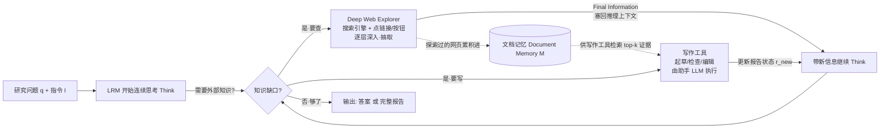

# 组会汇报 · WebThinker：让大推理模型「边想边查、边查边写」

> 主讲提示：本篇属于主题组 D（Deep Research）。一句话钩子——**「别的开源深度搜索是『先想好流程、再按流程查』；WebThinker 是『想到哪、查到哪、写到哪』，搜索/浏览/写作全发生在模型自己的思考链里。」** 全场记忆锚点：**GAIA +21.9%、HLE +36.2%（相对 Search-o1）**，报告生成总分 **8.0 超过 Gemini2.0 Deep Research 的 7.9**。

---

## 1. 封面 · TL;DR

- **标题**：WebThinker: Empowering Large Reasoning Models with Deep Research Capability
- **作者/机构**：Xiaoxi Li、Jiajie Jin、Guanting Dong（共同一作）、Hongjin Qian、Yongkang Wu、Ji-Rong Wen、Yutao Zhu、Zhicheng Dou（通讯）——**中国人民大学**为主，BAAI、华为泊松实验室。
- **权威性来源**：**NeurIPS 2025 接收**（顶会，主题组 D 里少有的正经会议论文，而非白皮书）；作者团队来自 RUC 高瓴/GSAI 的检索增强方向（Search-o1 同组），**代码开源**（`https://github.com/RUC-NLPIR/WebThinker`）。
- **一句话**：WebThinker 是一个**完全由大推理模型 (Large Reasoning Model, LRM) 驱动**的深度研究 agent。它给 LRM 装了两套东西——①一个 **Deep Web Explorer（深度网页浏览器）** 模块，让模型在思考中遇到知识缺口时，能自主发起搜索、点击链接/按钮、逐层深入网页抽取信息；②一套 **Autonomous Think-Search-and-Draft（自主「想—查—写」）** 策略 + 三个写作工具（起草/检查/编辑），让模型一边推理一边把报告写出来。再用**基于强化学习的在线迭代 DPO** 训练，把「会用工具」这件事练进模型里。

**3 条带走的结论**：
1. **范式差异是全篇灵魂**：现有开源深度搜索基本是 **RAG + 预定义工作流**（标准 RAG / 迭代 RAG），LRM 只是流程里的一个「答题零件」，**它本身决定不了「要不要再查、查多深」**；WebThinker 把搜索/浏览/写作变成 LRM **在思考链里能自己调用的动作**，实现「单次生成内端到端」（见原文 Figure 2 (a)(b) vs (c)）。
2. **数字过硬**：在 GAIA、WebWalkerQA、GPQA、HLE 四个复杂推理基准上，免训练版 WebThinker-32B-Base 就**全面超过 Search-o1**（WebWalkerQA **+22.9%**、HLE **+20.4%**）；RL 版 WebThinker-32B-RL 在 32B 量级**全部 SOTA**（GAIA 比 Base 再 +8.5%、HLE 再 +21.5%），HLE 上甚至**超过 o3-mini (High)**（见 Table 1/2）。
3. **报告也写得过大厂**：在 Glaive 科研报告生成任务上，WebThinker 总分 **8.0**，**压过 RAG 基线与 Grok3 DeeperSearch、Gemini2.0 Deep Research（7.9）**（见 Figure 4 左）。

> 主讲提示：开场就把「**它把 deep research 从『固定流程』变成『推理内行动』**」这句主张钉死，后面所有 how 都在服务这一句 why。

---

## 2. 问题与动机（why —— 本篇最该讲透的一节）

> 主讲提示：这一节是整篇的「为什么」。不要急着讲 Deep Web Explorer 怎么实现，先把「固定 RAG 流程为什么不够」讲到让人点头。

**问题层 why（为什么这事值得解决）**：大推理模型（OpenAI-o1、DeepSeek-R1、QwQ）擅长长程推理（数学、代码、科学），但它们**只会用自己脑子里的静态知识**（static internal knowledge）。一旦碰到「需要从全网搜集、比对、综合大量最新信息」的复杂研究任务（金融、科学、工程的尽调与报告），纯靠内部知识就**抓瞎**（原文 Abstract、§1）。于是 OpenAI、xAI Grok3、Google Gemini 纷纷推出 **deep research** 产品——但这些是闭源的。

**朴素替代方案 = 现有开源做法，它为什么不够（设计层 why 的核心）**：开源界主流是 **RAG（检索增强生成）+ 预定义工作流**（原文 §1 点名 Self-RAG[1]、Chain-of-Retrieval[63]、IterDRAG[42] 这类）。原文给了两张反面图（Figure 2）：

- **(a) 标准 RAG**：拿问题去检索一次 → 把结果塞给 LLM → 出答案。问题：**检索太浅 (shallow search)**，一锤子买卖，遇到「答案藏在某个网页点进去的第三层」就够不着。
- **(b) 带预定义工作流的迭代 RAG**：加一个 Query Planner 把问题拆成子查询、并行检索、合并、再问「要不要再查一轮」。问题：**流程是人写死的**，LLM 只在固定槽位里被调用，**推理与检索之间没有紧密交互**（lacks close interaction），而且「**思考深度与连贯性不足**」（原文 Figure 2 右上角红字 "Lack of Thinking Depth & Coherence"）。

**不解决会怎样**：你永远只能让 LRM 在「别人设计好的检索流程」里当一个「填空机」，它**无法在思考的当下决定「我现在需要点进这个链接看看」「我这一段写够了，去查下一个事实」**。深度研究的本质是「**研究路径要随着已读到的内容动态生成**」，而固定工作流恰恰把这个动态性掐死了。

**这篇的赌注（核心 intention，一句话）**：

> **不要再给 LRM 套一个外部检索流程，而是把搜索、深度浏览、写作都变成 LRM 在自己连续思考链里能随时调用的「研究工具」，让模型自己决定何时查、查多深、何时落笔——单次生成内端到端完成。**

**为什么「在思考内行动」是论点而非工程细节（设计层 why，最该讲的一层）**：

> **Why（设计层）**：朴素做法是「把 LLM 当 RAG 流程里的零件」→ 会因为**控制权在流程不在模型**而失败：模型读到一半发现需要更深的信息，却**没有权力发起一次新的深入浏览**，只能按预定步数走完。本文改用「**工具调用嵌进思考链**」（Figure 2(c)：Think → Deep Web Explore → Returned Info → Think → … → Answer），因为只有把决策权交还给正在推理的模型，**研究路径才能与推理状态同步演化**——这正是 o1/R1 这类 LRM 的强项（长链自我反思），却被固定 RAG 流程白白浪费了。这也解释了为什么作者坚持「**端到端优化 (End-to-End Optimization)**」而非「拼装流水线」。

---

## 3. 研究问题 / 核心 intention（形式化成一句话）

把问题压成一句：

> **给定一个需要「多步推理 + 调用研究工具」的复杂任务（query $q$ + 指令 $I$），能否让一个大推理模型在它自己的一条连续推理链里，自主地搜索、深度浏览网页、并起草报告，端到端产出（a）正确答案 或（b）一份全面的研究报告？**

它隐含的**假设**：
- **H1（推理内行动可行）**：LRM 的长链推理能力，足以承担「在思考中决定何时/如何调用工具」的编排（orchestration）职责，无需外部流程控制器。
- **H2（深度浏览 > 浅检索）**：让模型能「点链接、翻深层页面」拿到的信息，质量高于「只看 top-k 摘要」。
- **H3（边写边查 > 查完再写）**：报告写作与检索**交错进行**（Think-Search-and-Draft），比「先搜完再一次性生成整篇」更全面、更连贯。
- **H4（RL 可强化工具使用）**：可以用偏好数据 + 在线 DPO，把「正确且高效地用工具」这件事训进模型，而不只靠提示工程。

---

## 4. 相关工作定位（站在谁肩上、和谁不同）

> 主讲提示：一句话概括坐标——「**RAG 把检索接进生成；Search-o1 把检索接进推理（但仍是提示工程）；WebThinker 把『深度浏览 + 写作』接进推理，并用 RL 端到端训进去。**」

| 方向 | 代表 | 控制权在谁 | 与本篇的关系 |
|------|------|-----------|------------|
| 标准 / 迭代 RAG（预定义流程） | Self-RAG[1]、IterDRAG[42]、Chain-of-Retrieval[51] | **外部流程** | 反面靶子：流程写死，推理-检索交互弱（Figure 2 a/b） |
| 查询改写 / 文档压缩 / 检索必要性 | Query2doc[52]、RECOMP[60]、SlimPLM[44] | 外部模块 | 各优化 RAG 一环，不改「流程外挂」本质 |
| o1 式推理 + 检索（提示工程） | **Search-o1**[26]（同组前作） | 模型（但靠 prompt） | **最直接对手**：把检索动作放进推理，但**无深度浏览、无写作、无训练** |
| RL 训练「推理+搜索」（Wikipedia QA 为主） | Search-R1[22]、R1-Searcher[43]、ReSearch[2]、ToRL[27] | 模型（RL 训出） | 思想同源（RL 练工具），但**多停在 Wikipedia QA**，不做真实网页深浏览 + 长报告 |
| 闭源深度研究产品 | OpenAI Deep Research[35]、Grok3 DeeperSearch[12]、Gemini2.0 Deep Research[10] | 模型 | 性能标杆（report 任务里直接对打），但闭源不可复现 |
| **本篇** | **WebThinker** | **模型（思考内行动）+ 在线 DPO 训练** | **深度网页浏览 + 边想边写报告 + RL，端到端、开源** |

**相对本库已有 40 篇的增量**（更新点）：与 [`2504.03160` DeepResearcher]（RL + 真实网络环境）几乎同期，二者都主张「把 deep research 用 RL 练进模型、在真实网页上跑」，但侧重不同——DeepResearcher 重「**真实环境下的 RL scaling**」，WebThinker 重「**思考链内的深度浏览 + 自主写作 + 在线 DPO**」。它把 Search-o1（同组前作，提示工程版）**向前推了一大步**：从「能在推理里搜」升级到「能在推理里**深浏览 + 写报告**，且能被训练」。

---

## 5. 方法总览（big picture，先直觉后数学）

WebThinker 有**两种工作模式**（原文 §3.2、Figure 3）：

- **Problem-Solving Mode（解题模式）**：给 LRM 配一个 **Deep Web Explorer** 工具。模型推理中遇到知识缺口 → 自主搜索 + 点链接深入网页 + 抽取信息 → 带着新信息继续推理 → 直到给出直接答案。
- **Report Generation Mode（报告生成模式）**：在解题模式基础上，再加三个**写作工具**（起草 $\mathcal{T}_{\text{draft}}$ / 检查 $\mathcal{T}_{\text{check}}$ / 编辑 $\mathcal{T}_{\text{edit}}$），由一个**助手 LLM (assistant LLM)** 执行；主模型一边想一边查一边写，迭代打磨出完整报告。

核心循环（Think-Search-and-Draft）的一图流：

**直觉**：把它想成一个**真人研究员在写一份调研报告**——边读边想（Think），想到不懂的就去搜、点进网页深读（Deep Web Explorer），读到的东西攒在脑子里（Document Memory $\mathcal{M}$）；觉得某一节信息够了就先写下来（draft），写完回头检查大纲、发现重复或缺漏就编辑（check/edit），再去查下一块。**关键创新**：这一切**不是外部脚本调度的，而是模型在自己的思考链里自主决定的**。

---

## 6. 符号与术语表（后文统一用）

| 记号 / 术语 | 含义 |
|------------|------|
| $q$ | 任务查询 (query)；$I$：任务指令 (instruction)，规定输出格式等 |
| $\mathcal{R}$ | LRM 的推理链 (reasoning chain)；$\mathcal{R}_t$：第 $t$ 个 token；$\mathcal{R}_{<t}$：其前所有 token |
| $y$ | 最终输出 (final output)；可以是答案 $a$ 或报告终止信号 $y_{\text{end}}$ |
| $\mathcal{T}$ | 可用工具集 (tool set)；$\mathcal{O}_\tau$：第 $\tau$ 次工具调用的输出 |
| $\mathcal{T}_{\text{exp}}$ | **Deep Web Explorer** 工具（深度网页浏览器） |
| $\mathcal{T}_s,\ \mathcal{T}_n$ | Explorer 内部的两个基本工具：搜索引擎 $\mathcal{T}_s$、导航（点链接/按钮）$\mathcal{T}_n$ |
| $\mathcal{R}_e,\ \mathcal{O}_{\text{exp}}$ | Explorer 自己的内部推理链 $\mathcal{R}_e$、它产出的简洁输出 $\mathcal{O}_{\text{exp}}$（回填给主推理） |
| $q_s,\ \mathcal{D}_t$ | Explorer 生成的搜索查询 $q_s$、第 $t$ 步可见的网页内容 $\mathcal{D}_t$（随搜索/导航动态变化） |
| $\mathcal{T}_{\text{write}}$ | 写作工具集 $=\{\mathcal{T}_{\text{draft}},\mathcal{T}_{\text{check}},\mathcal{T}_{\text{edit}}\}$（起草/检查/编辑） |
| $\mathcal{M}$ | **Document Memory（文档记忆）**：所有浏览过的网页累积成的知识库 |
| $\mathcal{D}_{\text{top-}k}$ | 写作时从 $\mathcal{M}$ 检索出的 top-$k$ 相关文档；$e$：写作工具的编辑指令；$r$/$r_{\text{new}}$：当前/更新后的报告内容 |
| $\pi_\theta,\ \pi_{\text{ref}}$ | 被训练的策略模型 / 参考模型；$\beta$：DPO 中控制偏离 $\pi_{\text{ref}}$ 的超参；$\sigma$：sigmoid |
| $\mathcal{R}_w,\ \mathcal{R}_l$ | 偏好对中的 win（更优）/ lose（更差）轨迹；$\gamma$：长度比阈值（$>1$） |

---

## 7. 方法细节 ① 问题形式化：把「带工具的推理」写成一个生成式

> 主讲提示：这一节给全篇一个统一的概率骨架。一句话——**「推理（含工具调用）」和「最终输出」两段连乘，工具输出作为条件喂回去。**

**直觉（为什么要这个式子）**：我们想把「模型一边推理、一边调用工具、最后给输出」整个过程，写成一个**单一的自回归生成过程**——强调它是「一次生成」，不是「多次外部调用拼起来」。

**符号（先定义）**：见 §6。$T_r$ 为推理链 $\mathcal{R}$ 的 token 数，$T_y$ 为输出 $y$ 的 token 数；$\{\mathcal{O}_\tau\}_{\tau<t}$ 表示在位置 $t$ 之前**所有已完成工具调用的输出**。

总生成过程（原文 Eq.(1)，$(I,q,\mathcal{T})\to(\mathcal{R},y)$）：

$$
P(\mathcal{R},y\mid I,q,\mathcal{T})=\underbrace{\prod_{t=1}^{T_r}P(\mathcal{R}_t\mid \mathcal{R}_{<t},I,q,\{\mathcal{O}_\tau\}_{\tau<t})}_{\text{带工具的推理 (Reasoning with Tools)}}\cdot\underbrace{\prod_{t=1}^{T_y}P(y_t\mid y_{<t},\mathcal{R},I,q)}_{\text{最终输出生成 (Final Output Generation)}}
$$

**读出什么**：左半段每生成一个推理 token，都**以此前所有工具输出为条件**——这就是「推理与工具紧密交织」的数学表达；右半段在**完整推理链**之上生成最终答案/报告。对比 RAG：RAG 是「检索 → 生成」两个**外部**阶段；这里检索（工具）被**内化进推理的每一步条件**里。

**解题模式的特化（原文 Eq.(2)）**：把工具限定为 Deep Web Explorer，输出为答案序列 $a=(a_1,\dots,a_{T_a})$：

$$
P(\mathcal{R},a\mid I_q,q)=\prod_{t=1}^{T_r}P(\mathcal{R}_t\mid \mathcal{R}_{<t},I_q,q,\{\mathcal{O}^{(j)}_{\text{exp}}\}_{j<i(t)})\cdot\prod_{t=1}^{T_a}P(a_t\mid a_{<t},\mathcal{R},I_q,q)
$$

其中 $\{\mathcal{O}^{(j)}_{\text{exp}}\}_{j<i(t)}$ 是在推理步 $t$ 之前已完成的所有 Explorer 调用的输出。读出什么：**Explorer 的输出是「按需」插入推理链的**，$i(t)$ 标记「截至第 $t$ 步发生了几次调用」。

---

## 8. 方法细节 ② Deep Web Explorer：把「浅检索」升级成「深浏览」

> 主讲提示：这是 Problem-Solving Mode 的心脏。核心卖点——**不是只看 top-10 摘要，而是能点进链接、翻到深层页面、再决定要不要继续挖。**

**Why 三连**：
- **问题层 why**：复杂问题的答案常常**不在搜索结果摘要里**，而藏在「点进某个网页 → 再点某个表格/PDF 链接」的深层（原文用 GAIA 的小丑鱼案例：USGS 数据库里那个唯一的非原生记录在 Fred Howard Park，邮编 34689，要点进 NAS 数据库才查得到，见附录 Table 4）。
- **设计层 why**：朴素做法是「检索 top-k 摘要喂回去」→ 会因为**信息深度不够**而失败（摘要里根本没有那个邮编）。本文改用「**搜索引擎 + 点链接/按钮**两个原子工具 + Explorer 自己的内部推理」，让它能**基于当前查询发起后续搜索、顺着链接往深处走，直到收集齐相关信息**（原文 §3.3）。
- **结果层 why**：消融里「去掉 Deep Web Explorer」让解题平均分从 45.4 暴跌到 **38.3**，「只保留点链接、去掉深浏览整体」也掉到 42.6——证明**深度探索是关键贡献**（Table 3 左：w/o Deep Web Exploration、w/o Link Clicking）。

**怎么做（机制）**：Deep Web Explorer $\mathcal{T}_{\text{exp}}$ 是一个被主推理调用的**子过程**，自己也是个 LRM，在指令 $I_e$ 下运行，有两个基本工具：
- **搜索引擎 $\mathcal{T}_s$**：直接调搜索 API（实验用 **Bing**），返回 top-10 结果的**标题/URL/摘要**（不是全文）。
- **导航工具 $\mathcal{T}_n$**：点击当前网页上的链接/按钮，用爬虫（**Crawl4AI**[49]）抓取目标 URL 全文；为防网页太长，由一个助手 LLM 按「点击意图 (click intent)」**先摘要**再插回 Explorer 上下文（附录 A.2.2）。

Explorer 边探索边推理，**自己决定**是再搜一次还是点链接深入，直到信息足够，最后以「**Final Information**」格式产出简洁结论 $\mathcal{O}_{\text{exp}}$ 回填主推理。其内部探索过程（原文 Eq.(3)）：

$$
P(\mathcal{R}_e,\mathcal{O}_{\text{exp}}\mid q_s,\mathcal{D},I_e)=\prod_{t=1}^{T_e}P(\mathcal{R}_{e,t}\mid \mathcal{R}_{e,<t},\mathcal{D}_t,I_e)\cdot P(\mathcal{O}_{\text{exp}}\mid \mathcal{R}_e,q_s,\mathcal{D},I_e)
$$

**符号**：$T_e$ 为 Explorer 推理链长度；$\mathcal{D}_t$ 是第 $t$ 步可见的网页内容，**随搜索/导航动态变化**（这是「深」的来源——可见内容会越翻越深）。**读出什么**：这是一个**层级结构**——主推理把「复杂信息搜集」整包**委派**给 Explorer，Explorer 内部可递归地搜索+导航。这种「主推理编排、子模块深挖」的分工，正是它比 Search-o1（无独立深浏览子过程）更强的结构性原因。

**工程细节（附录 A.1）**：模型用特殊 token 触发工具——搜索用 `<|begin_search_query|>…<|end_search_query|>`、点链接用 `<|begin_click_link|>…<|end_click_link|>`，生成到结束 token 时**暂停生成**、执行工具、把结果用对应的 result token 包好插回上下文再续写。主过程检索用 **k=10**。

---

## 9. 方法细节 ③ Autonomous Think-Search-and-Draft：边想边查边写

> 主讲提示：这是 Report Generation Mode 的心脏。一句话——**不是「查完资料再一次性写整篇」，而是「某节信息够了就先写下来，写完检查/编辑，再去查下一节」。**

**Why 三连**：
- **问题层 why**：长报告若「先搜完→一次性生成」，会丢掉「写到一半发现还缺某块信息」的机会，导致内容不全、章节割裂（原文 §1、§3.4）。
- **设计层 why**：朴素做法是「检索充分后整篇生成」→ 会因为**写作与信息搜集脱节**而失败（写的时候已经不能再补查了）。本文改用「**写作工具嵌进思考链**」，让模型**实时起草 + 实时补查**，并维护一个跨全程的 Document Memory $\mathcal{M}$，写作时从中检索证据。
- **结果层 why**：消融里「去掉自主起草 (w/o Auto. Report Draft)」让报告总分从 8.1 掉到 **6.6（最大跌幅）**；「去掉检查与编辑 (w/o Report Check & Edit)」连贯性从 7.9 掉到 6.9——证明**交错写作 + 检查编辑**对报告质量是决定性的（Table 3 右）。

**三个写作工具（由助手 LLM 执行，附录 A.1）**——为什么要独立助手 LLM：把「复杂任务编排」（主 LRM 做）与「细致文本操作」（写作）**解耦**，避免长篇报告正文挤进主推理链、扰乱推理（check 工具甚至只把**大纲**插回上下文，而非全文）：
- **起草 $\mathcal{T}_{\text{draft}}$**（`<|begin_write_section|>` 触发）：助手 LLM 按章节名 + 内容指引，结合已搜集信息写出该节，**不直接回灌主推理**。
- **检查 $\mathcal{T}_{\text{check}}$**（`<|begin_check_article|>`）：系统抽取当前报告的**所有章节/小节标题**形成大纲，插回推理上下文（不灌全文，免得打断推理）。
- **编辑 $\mathcal{T}_{\text{edit}}$**（`<|begin_edit_article|>`）：助手 LLM 按编辑指令 $e$ 修改报告（去重、补漏、调连贯）。

报告更新过程（原文 Eq.(4)）：当主 LRM 决定调用写作工具并给出编辑指令 $e$，助手 LLM 接收 $e$、当前报告状态 $r$、从 $\mathcal{M}$ 检索的 $\mathcal{D}_{\text{top-}k}$，产出更新内容 $r_{\text{new}}$：

$$
P(r_{\text{new}}\mid e,\mathcal{D}_{\text{top-}k},r)=\prod_{t=1}^{T_{r_{\text{new}}}}P(r_{\text{new},t}\mid r_{\text{new},<t},e,\mathcal{D}_{\text{top-}k},r)
$$

报告模式的总过程（原文 Eq.(5)）：

$$
P(\mathcal{R},y_{\text{end}}\mid I,q)=\prod_{t=1}^{T_r}P(\mathcal{R}_t\mid \mathcal{R}_{<t},I,q,\{\mathcal{O}^{(j)}_{\text{exp}}\}_{j<i(t)})\cdot P(y_{\text{end}}\mid \mathcal{R},\mathcal{M})
$$

**读出什么**：主 LRM 的角色是**编排者 (orchestrator)**——执行推理步、决定何时用 Explorer 取信息、何时用写作工具改报告；它生成 EOS（记为 $y_{\text{end}}$）时结束。**最终报告不是一次生成的，而是助手 LLM 在全程多次写/编辑动作累积出来的**，知识库就是 $\mathcal{M}$（Eq.(4) 的证据来源）。

---

## 10. 方法细节 ④ 用强化学习（在线迭代 DPO）把「会用工具」训进去

> 主讲提示：前三节是「架构/提示」，这一节是「训练」。一句话——**采样多条轨迹 → 按『对不对 > 工具用得省不省 > 想得啰不啰嗦』排出偏好对 → 在线迭代 DPO。**

**Why 三连**：
- **问题层 why**：光靠提示工程，模型用工具的「时机/效率」不稳；要把「正确且高效地调研究工具」练成习惯（原文 §3.5）。
- **设计层 why**：朴素做法是「只奖励最终答对」→ 会因为**模型学会乱查一通也能蒙对、毫无效率约束**而失败。本文改用**带优先级的偏好规则**（正确性 > 工具调用数 > 思考简洁度），并用 **on-policy 在线 DPO** 迭代，让模型不仅答对、还**少调工具、少废话**。
- **结果层 why**：RL 版相对 Base 全面提升（GAIA 44.2→48.5、HLE 13.0→15.8，见 Table 1/2），消融中「去掉训练 (w/o Training, Base)」解题均分 45.4→42.1，「换成离线 DPO (w/ Offline DPO)」只到 43.2——证明**在线迭代**比离线更有效（Table 3 左）。

**偏好数据构造（原文 §3.5，三条规则按优先级，逐条覆盖）**——对同一任务 $q$ 自采样 $n$ 条轨迹 $\{\mathcal{R}^{(i)}\}_{i=1}^n$，两两比较得偏好对 $(\mathcal{R}_w,\mathcal{R}_l)$：
1. **整体正确性 / 报告质量（最高优先）**：若 $\mathcal{R}_i$ 得到正确答案（解题）或更高质量报告（报告任务）而 $\mathcal{R}_j$ 没有，则 $\mathcal{R}_w=\mathcal{R}_i,\ \mathcal{R}_l=\mathcal{R}_j$。**此规则压倒一切。**
2. **工具效率**：若两者都对，则**总工具调用更少**者更优（$\text{total\_tool\_calls}(\mathcal{R}_i)<\text{total\_tool\_calls}(\mathcal{R}_j)\Rightarrow \mathcal{R}_w=\mathcal{R}_i$）。
3. **思考简洁度**：若两者都对且工具调用数相同，则**更短**者更优——当长度比超过阈值 $\gamma>1$ 时：$\text{len}(\text{output}_j)/\text{len}(\text{output}_i)>\gamma\Rightarrow \mathcal{R}_w=\mathcal{R}_i$。

由此构造偏好集 $\mathcal{D}=\{(I,q,\mathcal{R}_w,\mathcal{R}_l)_k\}$。

**DPO 损失（原文 Eq.(6)）**——直觉：提高「更优轨迹」相对参考模型的似然、压低「更差轨迹」的似然：

$$
\mathcal{L}_{\text{DPO}}(\pi_\theta;\pi_{\text{ref}})=-\mathbb{E}_{(\mathcal{R}_w,\mathcal{R}_l)\sim\mathcal{D}}\left[\log\sigma\left(\beta\log\frac{\pi_\theta(\mathcal{R}_w\mid I,q)}{\pi_{\text{ref}}(\mathcal{R}_w\mid I,q)}-\beta\log\frac{\pi_\theta(\mathcal{R}_l\mid I,q)}{\pi_{\text{ref}}(\mathcal{R}_l\mid I,q)}\right)\right]
$$

**符号**：$\pi_\theta$ 待训策略，$\pi_{\text{ref}}$ 参考策略，$\beta$ 控制偏离强度，$\sigma$ 为 sigmoid。**读出什么**：括号内是「win 与 lose 的对数似然比之差」，乘 $\beta$ 过 sigmoid——差越大、loss 越小，等价于「让模型更偏向 win 轨迹的工具使用模式」。

**在线迭代方案（原文 §3.5 末）**：(1) 用当前 $\mathcal{D}$ 按 Eq.(6) 训 $\pi_\theta$；(2) 用更新后的 $\pi_\theta$ **重新采样**新轨迹（探索）；(3) 用规则 1–3 给新轨迹构造新偏好集 $\mathcal{D}'$；(4) 令 $\mathcal{D}\leftarrow\mathcal{D}'$、$\pi_{\text{ref}}\leftarrow\pi_\theta$，回到 (1)。**实验做 2 轮迭代**（§4.3）。这就是「on-policy、随训练自我精化工具策略」的来源。

---

## 11. 实验设置（setting / metrics / params / 算力，写全）

> 主讲提示：这一节是「指标定义式」的样板。组会最容易被问「这些基准到底测什么、Pass@1 怎么算、报告的 8 分谁打的」。

**任务与数据集（原文 §4.1、附录 B）**：

*A. 复杂推理基准（报 Pass@1）：*
- **GPQA**[41]：博士级「Google-proof」科学选择题（物理/化学/生物），4 选 1；用 **diamond 子集，198 题**。
- **GAIA**[32]：通用 AI 助手基准，含多步推理/检索/多模态；因 WebThinker 是纯文本，用**纯文本验证子集 103 题**。
- **WebWalkerQA**[56]：专测**深度网页遍历**（点击探索找信息）；680 题测试集（多语言/多领域）。
- **Humanity's Last Exam (HLE)**[37]：极难跨学科（数学/人文/自然科学），共 2500 题，当前 SOTA 也 <10%；因测试集大，**随机抽 500 题（纯文本）**。

*B. 科研报告生成：*
- **Glaive**（`glaiveai/reasoning-v1-20m`）[11]：大规模开放式推理问答（非代码/数学，覆盖社科/自然科学/教育/创意写作）；**测试 30 题**（每轮偏好数据另采 1.5k 题）。

**评测指标（给定义/口径）**：
- **Pass@1（解题任务）**：单次生成的答案是否正确，**由 Qwen2.5-72B-Instruct 当裁判**判「等价/不等价」（原文附录 C.3.1 给了判定 prompt）。为减格式误差，必要时取模型输出**最后五行**当预测答案。直觉式定义：$\text{Pass@1}=\dfrac{\#\{\text{judge 判 Correct 的题}\}}{\#\text{总题数}}$。
- **报告质量四维（1–10 分，LLM-as-Judge）**：用 **DeepSeek-R1-671B 与 GPT-4o 各打一遍取平均**，**listwise**（A–E 五份报告同时比、输入顺序随机化以去位置偏差，附录 C.3.2）。四个维度（原文 §4.5、附录 C.3.2）：
  - **Comprehensiveness（全面性 Comp.）**：内容覆盖是否尽量周全；
  - **Thoroughness（深入度 Thorough.）**：每节是否深入讨论而非浅尝；
  - **Factuality（事实性 Fact.）**：事实错误是否最少；
  - **Coherence（连贯性 Coh.）**：讨论是否聚焦、紧扣主题。
  - （评分锚点：满意约 5 分，优秀更高，非有充分理由不轻易给 >8 或 <3。）作者明说**不用人评**——因各系统报告风格差异大、人会一眼认出来源引入偏见，故用模型评更公允。

**Baselines（三类，原文 §4.2）**：
- **直接推理（无检索）**：Qwen2.5-32B/72B-Instruct、QwQ-32B、Llama3.3-70B、DeepSeek-R1-671B、GPT-4o、o1-preview、o3-mini、Gemini-2.0-Flash-Thinking。
- **RAG 工作流**：标准 RAG / RAG w/ Query Planning（拆子查询）/ Iterative RAG（迭代检索），分别接 Qwen2.5-32B 与 QwQ-32B。
- **推理内自主搜索**：Search-o1[26]（开源）、以及闭源 OpenAI Deep Research、Grok3 DeeperSearch、Gemini2.0 Deep Research。

**实现细节（原文 §4.3）**：
- **Backbone**：**QwQ-32B**[48]（主结果用）；助手 LLM 用 **Qwen2.5-32B-Instruct**，参数同 backbone。
- **采样**：max **81920** tokens，**temperature 0.7、top_p 0.8、top_k 20、repetition penalty 1.05**。
- **检索**：**Bing Web Search API（US-EN 区，k=10）**，网页内容用 **Crawl4AI**[49] 抓取。
- **训练**：**2 轮在线 DPO**，max sequence length **32768**。
- **跨 backbone 适配（§4.6）**：在 DeepSeek-R1 系（7B/14B/32B）上，为稳定工具使用，先用 **QwQ-32B 产的 7.8k 条轨迹做冷启动 SFT**，再 RL。
- 非 o1 式 baseline 一律加 CoT 提示「You should think step by step」（附录 C.4）。
- **算力/成本/随机种子**：**原文未给出**（无 GPU 时长、无 API 成本、未报多种子方差）。

---

## 12. 主要结果（数字 + 解读，别只贴表）

> 主讲提示：四个数记牢——**WebWalkerQA +22.9%、HLE +20.4%（Base vs Search-o1）；GAIA +8.5%、HLE +21.5%（RL vs Base）；报告 8.0 > Gemini 7.9。**

**A. 复杂推理（原文 Table 1 = GPQA/GAIA/WebWalkerQA，Table 2 = HLE，均 Pass@1，32B 最佳粗体）**：

| 方法（32B 级） | GPQA(avg) | GAIA(avg) | WebWalker(avg) | HLE(avg) |
|---|---|---|---|---|
| QwQ-32B（直接推理） | 64.1 | 22.3 | 4.3 | 9.6 |
| RAG-QwQ-32B（标准 RAG） | 64.6 | 32.0 | 31.2 | 7.2 |
| ┗ w/ Iterative RAG | 65.2 | 32.8 | 31.5 | 9.6 |
| Search-o1-32B（推理内搜索，前作） | 67.2 | 39.8 | 34.1 | 10.8 |
| **WebThinker-32B-Base（免训练）** | 67.2 | 44.2 | **41.9** | 13.0 |
| **WebThinker-32B-RL** | **70.7** | **48.5** | **46.5** | **15.8** |
| （参考·更大/闭源）o1-preview | 73.3 | — | 9.9 | — |
| （参考·闭源）OpenAI Deep Research | — | 67.4 | — | 26.6 |
| （参考）o3-mini (High) | — | — | — | 14.0 |

**读出什么（结果层 why，原文 §4.4 四点）**：
1. **基础 LRM + RAG 都不够**：QwQ-32B 在 GPQA 上能超 Qwen2.5-72B（推理强），但**在知识密集任务（GAIA 22.3、WebWalker 4.3）上崩**；RAG 能救一部分，但在 HLE 这种「深度推理+检索融合」上提升**不稳**（RAG-QwQ 的 HLE 甚至 7.2 < 直接 9.6）。
2. **推理内自主搜索有优势**：Search-o1 显著超直接推理与基础 RAG（HLE 10.8 vs RAG-QwQ 7.2）。
3. **WebThinker-Base（免训练）全面超 Search-o1**：靠 Deep Web Explorer 做更深网页探索，**所有基准都赢**（WebWalkerQA **+22.9%**、HLE **+20.4%**）。
4. **RL 再上一层**：WebThinker-32B-RL 在 32B 级**全部 SOTA**（GAIA 比 Base **+8.5%**、HLE **+21.5%**），HLE 上 **15.8 > o3-mini(High) 14.0**。
   - **机制解读**：为什么 RL 有效——它不是增加知识，而是优化了「**何时查、查几次、何时停**」的策略（偏好规则 2/3），让同样的工具用得更准更省，因此在「需要正确编排多步检索」的 GAIA/HLE 上收益最大。

**B. 科研报告生成（原文 Figure 4 左，四维 + 平均，DeepSeek-R1 & GPT-4o 评）**：

| 系统 | Comp. | Thorough. | Fact. | Coh. | Avg. |
|---|---|---|---|---|---|
| RAG-Qwen2.5-72B | 5.7 | 5.3 | 6.4 | 6.3 | 5.9 |
| RAG-DeepSeek-R1 | 6.6 | 6.4 | 7.1 | 7.1 | 6.8 |
| Grok3 DeeperSearch | 6.4 | 6.1 | 7.0 | 6.5 | 6.5 |
| Gemini2.0 Deep Research | 8.1 | 8.0 | **7.7** | 7.7 | 7.9 |
| **WebThinker-32B-Base** | **8.4** | 8.2 | **7.7** | 7.8 | 8.0 |
| **WebThinker-32B-RL** | 8.3 | **8.4** | **7.7** | **7.9** | **8.1** |

**读出什么**：WebThinker 报告**总分 8.0/8.1，压过 Gemini2.0 Deep Research（7.9）和 Grok3**，全面性（8.4）尤其突出。**机制解读**：这正是 Think-Search-and-Draft「边写边补查 + 检查编辑」的回报——动态信息搜集让覆盖更广（Figure 4 右的 t-SNE 显示 WebThinker 报告在每个主题簇内形成**更宽的子簇**，即视角/深度更多样）。注意 **Factuality 持平（7.7）未超 Gemini**，说明它强在「广、深、连贯」，事实精度并非碾压。

---

## 13. 消融与分析（哪个部件贡献多少）

> 主讲提示：一句话——**「拆掉深浏览，解题崩；拆掉自主起草，报告崩；在线 RL 比离线 DPO 强。」**

**A. 解题任务消融（原文 Table 3 左，WebThinker-32B-RL，Avg=GPQA/GAIA/Web/HLE 平均 45.4）**：

| 配置 | Avg | 解读 |
|---|---|---|
| WebThinker-32B-RL（全） | **45.4** | — |
| w/ Offline DPO（换成离线） | 43.2 | 在线迭代 > 离线 |
| w/o Training（Base，去 RL） | 42.1 | RL 贡献 ≈ +3.3 |
| w/o Link Clicking（去点链接） | 42.6 | 点链接深入很重要 |
| **w/o Deep Web Exploration（去深浏览整体）** | **38.3** | **跌幅最大——深浏览是命根** |

**B. 报告任务消融（原文 Table 3 右，Avg 8.1）**：

| 配置 | Avg | 解读 |
|---|---|---|
| WebThinker-32B-RL（全） | **8.1** | — |
| w/o Training（Base） | 8.0 | **RL 对报告几乎无影响**（框架本身已强） |
| w/o Deep Web Explorer | 7.7 | 深浏览对报告也重要 |
| w/o Report Check & Edit | 7.7（Coh. 6.9） | 去检查编辑，连贯性掉最多 |
| **w/o Auto. Report Draft（去自主起草）** | **6.6** | **跌幅最大——交错起草是报告命根** |

**跨 backbone 适配（原文 §4.6、Figure 5）**：在 DeepSeek-R1 的 7B/14B/32B 上都成立。**WebThinker-R1-7B 相对直接生成：GAIA +174.4%、WebWalkerQA +422.6%；相对标准 RAG：GAIA +82.9%、WebWalkerQA +161.3%**——说明这套框架对不同 LRM 底座**普适**。

**信息广度分析（Figure 4 右）**：t-SNE 可视化报告内容嵌入，WebThinker 的点在各主题簇内形成**更广的子簇**，定性支持「它探索/综合的视角与深度比别人更丰富」。

---

## 14. 局限与批判（诚实）

**原文自承（§5 Conclusion）**：
1. **不能处理多模态**：只能读文本，图像/视频信息进不来 → 作者点名「**multimodal deep research** 是重要方向」。
2. **工具种类有限**：目前就「搜索 + 点链接 + 写作」几样，**工具的可扩展性与泛化**不足。
3. **不支持 GUI 级网页交互**：无法处理更复杂的真实交互式任务（如需要操作表单/动态页面的）。
4. **更广影响（附录 F）**：自主综合海量网络信息有**制造/传播精致错误信息、放大数据偏见、隐私、研究岗位被替代**的风险，呼吁配套伦理规范、稳健验证机制与透明度。

**我/社区可补的质疑（批判，非原文宣称）**：
- **裁判即被测同源**：报告质量用 **DeepSeek-R1-671B + GPT-4o** 评，而 baseline 里也有这些模型/同源系统；LLM-as-Judge 可能偏好「像自己」的文风，**8.0 vs 7.9 的微弱领先在裁判噪声内是否稳健，原文未给置信区间/方差**。
- **成本与算力黑箱**：max 81920 token + 多次深浏览 + 助手 LLM 多次写作，**单题 token/时延/API 成本原文完全未报**——deep research 的实用性恰恰卡在成本，这是个大缺口。
- **Factuality 未领先**：报告事实性（7.7）只与 Gemini 持平，**深度浏览并未转化为更高事实精度**，说明「读得多」≠「读得准」，缺一道事实核查闭环。
- **Pass@1 由 72B 裁判**：解题正确性靠 Qwen2.5-72B 判等价，**裁判本身的错判率原文未量化**。
- **未控随机性**：未报多种子，single-run 数字的稳定性存疑。

> 主讲提示：把「**成本黑箱**」和「**Factuality 未领先**」两条单独强调——前者关乎能不能落地，后者戳破「深=准」的直觉。

---

## ★ 对我们的启发（Inspires Us）

> 主讲提示：这一节是组会高潮——前面讲 WebThinker 做了什么，这里讲**我们能据此做什么**。每条落到「具体机制 / 具体模块 / 具体第一步」。

➤ **a. 可直接借用的招（method we can reuse）**：
- **「工具调用嵌进思考链」的 token 协议**：用 `<|begin_search_query|>…<|end_search_query|>` 这类**成对特殊 token + 生成时暂停—执行—回填**的机制（附录 A.1），是把「任意工具」挂进 LRM 思考链的**通用、低耦合**接口。→ 可直接搬到我们任何「推理中要调外部能力」的管线，不必改模型架构。
- **「主推理编排 + 子模块深挖」的层级委派（Eq.(3)）**：把「复杂信息搜集」整包委派给一个**自带内部推理的 Deep Web Explorer 子过程**，主链只看它的简洁 `Final Information`。→ 可复用为「主 agent 不被长上下文淹没」的通用模式（check 工具只回灌**大纲**而非全文，是同一思想的精妙落地）。
- **带优先级的 DPO 偏好规则（§3.5：正确性 > 工具数 > 长度）**：一个**无需人标注、可自动判定**的偏好构造法。→ 任何「答对就行还不够、要又对又省」的 agent 都能直接套这三条规则造偏好对。

➤ **b. 可迁移到我们课题的思路（transfer）**：
- 映射到 **[`m9.2-research-agent-core`]**：我们的 research agent 若仍是「检索→生成」两段式，可借 WebThinker 把检索**内化进推理链**（Eq.(1) 的条件化）+ 加一个 **Deep Web Explorer 式深浏览子过程**。**迁移时要改的前提**：WebThinker 假设有可用的 Bing+Crawl4AI 真实网络；若 m9.2 在**离线沙箱/受限语料**里跑，需把「深浏览」降级为「在本地知识图/文档树里逐层跳转」，否则「点链接深入」这一招失效。
- **报告任务的 Think-Search-and-Draft** 可整段迁移给「我们要让 agent 产出长文/综述」的场景：关键是引入 **Document Memory $\mathcal{M}$ + check（只看大纲）+ edit（去重补漏）** 三件套，把「一次性生成长文」改成「交错起草」。

➤ **c. 它暴露的开放问题 = 我们的机会（open problems → our opportunity）**：
- **缺事实核查闭环**（Factuality 仅持平、深≠准）：若有人在 Think-Search-and-Draft 里插一个**「写完一节→用独立证据自检每个事实声明」的 critic 步骤**，把 Factuality 顶上去，就是一篇新工作。**可下手的第一步**：在 edit 工具后加一道「逐句溯源 $\mathcal{M}$、无来源即标红/删除」的硬约束，量化 Factuality 提升。
- **成本黑箱**：没人报 deep research 的「单题 token/时延/$」。**第一步**：拿开源 WebThinker 跑 GAIA 子集，**实测 token 与 API 调用分布**，画一条「质量—成本」帕累托前沿——这本身就是社区急需的数据点。

➤ **d. 与本库其它论文/模块的连接（connect the dots）**：
- **与 [`2504.03160` DeepResearcher] 互为正反/互补**：二者都主张「RL + 真实网络 + 推理内行动」，但 DeepResearcher 重「真实环境 RL scaling」、WebThinker 重「深浏览 + 自主写作 + 在线 DPO」。**组会可对照**：谁的「真实环境」更真、谁的 RL 更省样本？（WebThinker 还要 7.8k 冷启动 SFT，DeepResearcher 是否需要？）
- **与 [`2411.14199` OpenScholar] 呼应又互补**：OpenScholar 是**学术文献**域的检索-合成 + 引用核查（强 Factuality/有 retriever+reranker+ 自反馈），WebThinker 是**开放网页**域的深浏览 + 报告。**互补点**：把 OpenScholar 的**引用归因/事实核查**模块接到 WebThinker 的报告管线，正好补上 §14 那条「Factuality 未领先」的洞。
- **与 [`2501.05366` Search-o1]（同组前作）连续剧**：WebThinker = Search-o1 + 深浏览 + 写作 + RL；讲清这条「同组迭代线」最能体现领域怎么往前走。

➤ **e. 如果我来做下一步（my next move）**：
> 我会先拿开源 WebThinker 在 **GAIA 纯文本 103 题**上跑通 Base 版，**在 Think-Search-and-Draft 的 edit 工具后插一个「逐句溯源 $\mathcal{M}$ 的事实 critic」**（借 OpenScholar 思想），看 Factuality 能否从 7.7 往上走、同时记录单题 token/调用成本，产出我们自己的「质量—成本—事实性」三维对照表。

---

## 15. 在 auto-research 版图的位置

- **阶梯定位（Tool→Analyst→Scientist）**：WebThinker 是一台强力的 **Analyst（分析员）**——它能自主搜证、深读、综合成报告，但**不提新假设、不设计实验、不做湿/数值验证**（与 §3.5 偏好规则只看「答对/报告好」一致）。它把「**深度网页研究 + 长报告**」这一环做到开源 SOTA，是 deep research 子方向（主题组 D）的标杆实现。
- **承上启下**：
  - ← **[`2501.05366` Search-o1]**（同组前作，提示工程版「推理内搜索」）：WebThinker 是它的**深化与可训练化**升级。
  - ∥ **[`2504.03160` DeepResearcher]**（RL + 真实环境）：同期、同主张、互补侧重。
  - → 报告事实性缺口指向 **[`2411.14199` OpenScholar]**（引用核查/事实归因）作为补丁来源。
  - → 与本库 **[`m9.2-research-agent-core`]** 直接对接：可作为「把检索内化进推理链 + 深浏览子过程」的现成蓝本。
- **相对已有工作的增量**：把开源 deep research 从「**RAG 固定流程**」推进到「**LRM 思考内自主行动 + 深浏览 + 边想边写 + 在线 DPO**」，并在 GAIA/HLE/WebWalkerQA 与报告生成上同时刷新开源 SOTA、局部超越闭源大厂产品。

---

## 16. 复现与可用性

- **开源**：代码 `https://github.com/RUC-NLPIR/WebThinker`（含 WebThinker / 各模式 prompt；baseline 指令可参考 Search-o1[26] 仓库，附录 C.4）。
- **能不能在单卡跑**：backbone 是 **32B**（QwQ-32B）+ 一个 32B 助手 LLM，**推理需多卡或量化**；max 81920 token + 多次深浏览，**显存/时延不小**。7B 版（DeepSeek-R1-7B）门槛更低，且相对提升巨大（GAIA +174%）。
- **外部依赖**：需 **Bing Web Search API**（US-EN）+ **Crawl4AI** 抓全文 → 复现要联网且有搜索 API 配额；网络波动会直接影响结果可复现性。
- **坑**：①训练要先用 QwQ 产 7.8k 轨迹**冷启动 SFT**再 RL（R1 系底座尤其需要稳定工具使用）；②成本/算力原文未给，需自测；③评测裁判用 72B / R1-671B / GPT-4o，复现报告分需对齐裁判与 listwise 协议。

---

## 17. 组会讨论问题

1. 「推理内自主行动」vs「固定 RAG 工作流」——除了「控制权交还模型」，固定流程**还有什么场景反而更优**（可控性/可审计/可缓存）？什么任务上 WebThinker 的灵活性是负担？
2. Deep Web Explorer 用「点链接深入」拿深层信息，但**网页可能投毒/过时**——这套深浏览有没有把「错的深层信息」也更深地吸进来的风险？怎么加防护？
3. 报告 **Factuality 仅与 Gemini 持平**（7.7），但全面性领先——「读得多」为何没换来「读得准」？要补一个怎样的事实核查闭环（联想 OpenScholar）？
4. DPO 偏好规则 2/3 奖励「**少调工具、少废话**」——会不会训出「**该查的不查、偷懒蒙答案**」的副作用？规则 1（正确性优先）真的能完全压住吗？
5. RL 对**解题**有效（+3.3）、对**报告几乎无效**（8.0→8.1）——为什么？是报告任务的偏好信号（LLM 打分）太噪，还是框架本身已触顶？
6. 全程 **成本黑箱**（token/时延/$ 未报）：如果实测单题成本是闭源产品的数倍，「开源 SOTA」的实用意义还剩多少？怎么设计「质量—成本」帕累托实验？
7. 跨 backbone 要 **7.8k 冷启动 SFT**——这套能力到底是「**LRM 本就会、只需激发**」还是「**SFT 教会的新技能**」？怎么设计实验区分？
8. 它停在 **Analyst**（不提假设/不验证）。把 WebThinker 的「深浏览+写作」接到一个「提假设→设计实验」的上游，离 Scientist 还差哪几步？

---

## 18. 一页速记（汇报当天速览）

- **是什么**：完全由大推理模型驱动的开源 deep research agent——在**一条连续思考链**里自主搜索、**深度浏览网页（点链接翻深层）**、**边想边写报告**，再用**在线迭代 DPO** 训练。NeurIPS 2025（RUC）。
- **核心 why**：现有开源是「**RAG + 写死的流程**」，LRM 只是流程零件、决定不了查多深；WebThinker 把搜索/浏览/写作变成「**推理内可自主调用的动作**」，单次生成端到端（Figure 2 a/b vs c）。
- **三大件**：①**Deep Web Explorer**（搜索引擎 $\mathcal{T}_s$ + 点链接 $\mathcal{T}_n$/Crawl4AI，主推理委派深挖，Eq.(3)）；②**Think-Search-and-Draft**（起草/检查/编辑 + Document Memory $\mathcal{M}$，边想边写，Eq.(4)(5)）；③**在线 DPO**（偏好规则：正确性>工具数>长度，Eq.(6)，2 轮迭代）。
- **设置**：backbone QwQ-32B；Bing(k=10)+Crawl4AI；temp 0.7/top_p 0.8/top_k 20/rep 1.05；max 81920 token；裁判 Qwen2.5-72B（解题）、DeepSeek-R1-671B+GPT-4o（报告，listwise 取平均）。基准：GPQA-diamond 198 / GAIA 文本 103 / WebWalkerQA 680 / HLE 抽 500 / Glaive 报告 30。
- **关键数**：Base 全面超 Search-o1（**WebWalkerQA +22.9%、HLE +20.4%**）；RL 版 32B 全 SOTA（**GAIA +8.5%、HLE +21.5%** vs Base，HLE 15.8 > o3-mini High 14.0）；报告 **8.0/8.1 > Gemini2.0 Deep Research 7.9**。消融：拆深浏览解题崩（45.4→38.3）、拆自主起草报告崩（8.1→6.6）。
- **三句话结论**：把 deep research 从「固定流程」变「推理内行动」（范式贡献）/ 深浏览+边写边查同时刷新解题与报告 SOTA（性能）/ 但**成本黑箱、事实性未领先、裁判同源**是真问题（瓶颈）。
- **我们的下一步**：在 edit 后插「逐句溯源 $\mathcal{M}$ 的事实 critic」（借 OpenScholar）顶 Factuality + 实测单题成本，产出「质量—成本—事实性」对照表。

> 主讲提示：结尾回到一句话——**「它证明了『让会推理的模型自己去查、自己去写』确实比『给它套个检索流程』更强；下一仗是把『读得多』变成『读得准、还读得起』。」**
