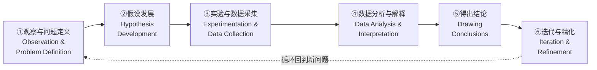
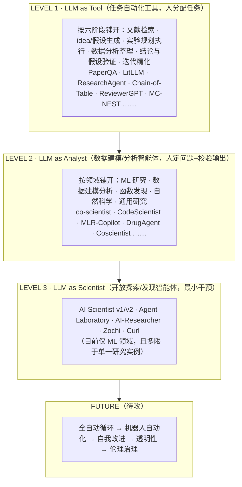

# 组会汇报 · From Automation to Autonomy（自主性阶梯综述）

> 主讲提示：这是整门 auto-research 课的「坐标系文献」。它本身不造系统、不刷分，价值在于给出**一把尺子**——
> 读完它，你听到任何"AI Scientist""co-scientist"时，第一反应不再是"哇全自动了"，而是"它闭了哪几环、问题是谁定的、落在哪一级"。
> 本篇全程要回答的核心问题只有一个：**这把尺子为什么这么切，切对了吗。**

---

## 1. 封面 · TL;DR

- **作者/出处**：Tianshi Zheng, Zheye Deng, Hong Ting Tsang, Weiqi Wang, Jiaxin Bai, Zihao Wang, Yangqiu Song（HKUST KnowComp），arXiv 2505.13259v3（2025-09-17），EMNLP 2025；配套仓库 `HKUST-KnowComp/Awesome-LLM-Scientific-Discovery`（见原文标题页）。
- **一段话**：这篇综述给"LLM 做科研"这个井喷领域立了**两根坐标轴**。横轴是**科学方法的六个阶段** (six stages of the scientific method，原文 Figure 1)：观察与问题定义 → 假设发展 → 实验与数据采集 → 数据分析与解释 → 得出结论 → 迭代与精化。纵轴是**三级自主性阶梯** (three-level autonomy taxonomy，原文 Table 1)：**LLM as Tool（工具）→ LLM as Analyst（分析师）→ LLM as Scientist（科学家）**。然后把这个领域里 300+ 个系统/基准全部钉进这张坐标系（原文 Figure 2 的金字塔大表），并指出五个待解挑战。
- **三条带走的结论**：
  1. **判级靠两个分水岭，不是一个**：① LLM 扮演什么角色（工具/分析智能体/探索发现智能体）；② **谁定问题、人介入多深**（任务分配 / 问题定义+输出校验 / 最小干预）。一个能自动跑完整实验流水线、但 idea 由人喂的系统，再强也只是 **Analyst**。
  2. **当前真实水位停在 Level 2 偏上**：Level 3（Scientist）那层在 Figure 2 里只稀疏站着 The AI Scientist v1/v2、Agent Laboratory、AI-Researcher、Zochi、Curl 等少数系统，且综述明确指出它们普遍"只在**单个研究实例或预设主题**内运转"——离"自主研究循环 (fully-autonomous research cycle)"还差一截（原文 §6）。
  3. **这是一篇"画地图"而非"评高下"的综述**：它**有意只收录"体现自主性递进"的工作**，明确把"通用科学 LLM / 领域知识问答"排除在外（原文 Limitations）。所以它的价值是**坐标系**，不是排行榜——读它是为了知道"每个系统站在哪"，而非"谁第一"。

> 主讲提示：开场就把"两根轴 + 两个分水岭"画在白板上。整场汇报就是反复往这张坐标系里填系统、并质疑这把尺子。

---

## 2. 问题与动机（why —— 本篇最该讲透的一节，2 页）

### 2.1 领域出了什么认知问题

**LLM 做科研的工作正在指数级井喷，但大家是按"名字"和"单点能力"理解它们的。** 原文 §1 点出三件正在同时发生的事：
1. LLM 解锁了一串**涌现能力** (emergent abilities)：规划 (planning)、复杂推理 (complex reasoning)、指令遵循 (instruction following)；
2. **智能体工作流** (agentic workflows) 让 LLM 能做网页导航、工具调用、代码执行、数据分析等高级动作；
3. 这二者叠加，正在科学发现中催生一次**范式转变 (paradigm shift)**——不只加速科研生命周期，还在重塑"人类研究者 vs AI"的协作分工。

**问题在于：变化太快、太碎。** 原文 §1 直陈，已有综述要么聚焦**特定学科**的 LLM 应用（如生物化学领域综述 Zhang et al. 2024/2025a），要么是对**某类 AI 技术**的静态编目（Luo et al. 2025；Reddy & Shojaee 2025）。它们都**给的是某一时刻的快照**，因而"常常忽略一个关键趋势——LLM 自主性在不断上升、其角色正横跨整条科学方法演化"，使得"LLM 朝更高独立性发展的轨迹"被严重低估、缺乏系统刻画。

> 直觉：这是一个"**坐标系缺失**"的认知问题。领域里不缺系统、不缺基准，缺的是一把**能跨学科、跨技术、能看出"演化方向"的尺子**。没有这把尺子，"AI 已能自动做科研"这类话术就无法被证伪。

### 2.2 为什么是"自主性"这根轴，而不是别的

可选的切法很多：按学科切（生物/化学/ML）、按技术切（RAG/多智能体/树搜索）、按任务切（写作/评审/编码）。综述**偏偏选"自主性"当主轴**，理由是 §1 反复强调的那个"被忽略的趋势"：

> LLM 正在从"**在单一阶段内执行离散、面向任务的功能**"，走向"**部署进精密的、跨多阶段的智能体工作流**"（原文 §1）。

也就是说，这个领域**唯一稳定的、跨学科的演化方向就是"自主性递增"**。按学科切会割裂、按技术切会过时，**只有按"自主程度"切，才能把"从自动化到自主"这条主线 (from automation to autonomy，即标题) 显出来**。这就是 why——这把尺子要回答的认知问题是："这些系统在'人退、机器进'这条线上，各自走到了哪一步？"

### 2.3 不立这把尺子会怎样

- **话术滑坡无法纠偏**：系统都爱自称 "Scientist"，但若没有"按证据判级"的框架，"自我改进"会被混同于"自己定研究问题"，"跑通流水线"会被混同于"自主发现"。
- **跨学科无法对话**：化学的自驾实验室和 ML 的 AutoML 智能体本在同一自主性层级，但没有共同坐标轴就各说各话。
- **看不清缺口在哪**：不知道"当前到底卡在哪一级、下一步该攻什么"。综述正是靠这把尺子，在 §6 精确指出"卡在 Level 3 的'单实例'天花板上、缺的是闭合的研究循环"。

> 主讲提示：这一节是 why 的核心。把"坐标系缺失 → 选自主性当主轴（因为它是唯一跨学科稳定趋势）→ 不立则话术无法证伪"三步讲透，后面填表就是水到渠成。

---

## 3. 研究问题 / 核心 intention（形式化成一句话）

把综述要解决的问题压成一句：

> **能否用一个"科学方法阶段 × 自主性级别"的二维坐标系，把'LLM 做科研'这一碎裂领域里的所有代表性系统统一归位，从而既看清现状、又显出'从自动化走向自主'的演化轨迹与待攻缺口？**

它隐含的**两个判断**（贯穿全文的"假设"）：
- (a) **自主性是可分级、可判定的**——能用"角色 / 人类介入深度 / 任务范围 / 工作流复杂度"这几个可观测维度把系统判进 Tool/Analyst/Scientist 之一（原文 Table 1）。
- (b) **科学方法可拆成六个普适阶段**，且每个 LLM 应用都能映射到其中一或多个阶段（原文 Figure 1，依据 Popper 1935《科学发现的逻辑》与 Kuhn 1962《科学革命的结构》）。

> 主讲提示：强调这是**规范性 (normative) 框架**——它不是测量某个数值，而是提出一套"该怎么给系统归类"的判据。判据合不合理，本身就是组会该辩的。

---

## 4. 相关工作定位（它站在谁肩上、和谁不同）

综述在 §1 与 Limitations 里明确把自己**和已有综述区分开**。一张对比表：

| 已有综述类型 | 代表 | 切法 | 局限（本篇的差异点） |
|------|------|------|------|
| 学科特定综述 | Zhang et al. 2024（生物化学领域科学 LLM）、2025a | 按**学科**编目 LLM 应用 | 只覆盖单一领域，且多为静态快照 |
| 技术编目综述 | Luo et al. 2025；Reddy & Shojaee 2025 | 按**AI 技术**分类 | 编目"有哪些技术"，不显"自主性演化" |
| 通用科学 LLM 综述 | （Limitations 中泛指） | 领域知识获取 / 领域推理 | 关注"懂不懂科学知识"，非"独立到什么程度" |
| 代码/规划等正交能力综述 | （Limitations 中泛指） | 规划、代码生成、智能体决策 | 是底层能力，非科研流程中的自主性 |
| **本篇** | This Survey (2505.13259) | **科学方法阶段 × 三级自主性** | **唯一以"自主性递进"为主轴、跨学科跨技术统一坐标系**；有意排除上面几类以保持聚焦 |

> 主讲提示：一句话概括差异——"**别人编目'有什么'，它画的是'走到哪、往哪走'**。" 它的取舍很硬：为了把"自主性"这条线讲透，主动放弃了"通用科学 LLM"这一大片（Limitations 第一条明说）。这是优点也是局限，§16 再批。

---

## 5. 方法总览（big picture：两根轴一张图，先直觉后判据）

综述的"方法"就是**那张坐标系**。先看横轴（科学方法生命周期，原文 Figure 1）：

再看纵轴（自主性阶梯，原文 Table 1 / Figure 2），把两轴叠成一张金字塔——**横看是"科研走到哪一环"，纵看是"AI 自主到哪一级"**：

**直觉**：金字塔越往上，**自主性越高、系统越少**。底座 Level 1 最宽（按六个科研阶段把工具铺满）；中层 Level 2 按**研究领域**组织（系统已能在一个领域里自动跑"建模→分析"）；顶层 Level 3 极窄，且综述只把它**限定在 ML 领域**——因为只有 ML 的"代码即实验"环境，才让"自己定问题→自己跑→自己写"暂时闭得起来。

> 主讲提示：这张图是全篇的"一图流"。强调三件事：① 三层不是平行分类，是**自主性递进**；② 每层的**组织维度不同**（L1 按阶段、L2 按领域、L3 按理念），这本身就反映了"越自主越难按单一阶段切"；③ 顶上还有一截 FUTURE，是综述 §6 的五大挑战。

---

## 6. 符号与术语表（后文统一用）

综述公式少，核心是**判据术语**。先把 Table 1 的五个判级维度和六阶段术语定死：

| 记号 / 术语 | 含义（中英对照） | 出处 |
|------------|------|------|
| Level 1 / Tool | **LLM 作工具**：任务自动化工具 (Task Automation Tool) | Table 1 |
| Level 2 / Analyst | **LLM 作分析师**：数据建模与分析智能体 (Data Modeling & Analytical Agent) | Table 1 |
| Level 3 / Scientist | **LLM 作科学家**：开放探索与发现智能体 (Open Exploratory & Discovery Agent) | Table 1 |
| LLMs' Role | **LLM 扮演的角色**（判级维度①） | Table 1 |
| Human's Role | **人类扮演的角色 / 介入深度**（判级维度②）：任务分配→问题定义+输出校验→最小干预 | Table 1 |
| Task Scope | **任务范围**（判级维度③）：显式定义 (Explicitly Defined) → 目标导向 (Goal-Oriented) → 开放式 (Open-Ended) | Table 1 |
| Agentic Workflow | **智能体工作流复杂度**（判级维度④）：简单静态 (Simple & Static) → 进阶 (Advanced) → 战略迭代 (Strategic & Iterative) | Table 1 |
| `tailored tools` | Level 1 的定性：直接人类监督下、为特定良定义任务量身定制的工具 | §2 |
| `passive agents` | Level 2 的定性：**被动智能体**——能自管一串任务，但目标/数据/评判由人给 | §2 |
| `active agents` | Level 3 的定性：**主动智能体**——能编排导航多阶段、主动提问题与下一步 | §2 |
| 六阶段 | 观察&问题定义 / 假设发展 / 实验&数据采集 / 数据分析&解释 / 得出结论 / 迭代&精化 | Figure 1 |
| novelty（新颖性） | idea 与已有文献相比"是否新"——L3 系统都要在实现前自评的量 | §5.1 |

> 主讲提示：这张表就是"判级的尺子刻度"。汇报时最容易被追问的是 Table 1 那四列——务必能脱口说出"角色 / 人介入 / 任务范围 / 工作流"这四维各在三级上取什么值。

---

## 7. 判据核心 ①：三级阶梯的精确定义（本篇重点，务必讲透）

> 主讲提示：这是全篇最该背下来的一张表。下面先给原文 Table 1 的**四维定义**，再逐级展开 §2 的散文定义与"定性词"，最后给"升级分水岭"。

### 7.1 原文 Table 1 —— 四维判级表（逐格对照）

| 维度 \ 级别 | **Level 1 · Tool** | **Level 2 · Analyst** | **Level 3 · Scientist** |
|------|------|------|------|
| **LLMs' Role**（角色） | 任务自动化工具 | 数据建模与分析智能体 | 开放探索与发现智能体 |
| **Human's Role**（人介入） | 任务分配 (Task Allocation) | 问题定义 + 输出校验 (Problem Definition & Output Validation) | 最小干预 (Minimal Intervention) |
| **Task Scope**（任务范围） | 显式定义 (Explicitly Defined) | 目标导向 (Goal-Oriented) | 开放式 (Open-Ended) |
| **Agentic Workflow**（工作流） | 简单 & 静态 | 进阶 (Advanced) | 战略 & 迭代 (Strategic & Iterative) |

读出什么：**判级不是看"用了多牛的技术"，而是看这四列同时取什么值**。四列是高度相关的——人退得越多（Task Allocation→Minimal Intervention），任务就越开放（Explicitly Defined→Open-Ended），工作流就越需要战略迭代。**一个系统若在某一列明显"低配"，整体级别就被它拉低**（例：工作流再炫，但人还在逐个定问题，仍是 Level 1/2）。

### 7.2 逐级散文定义（原文 §2）

- **Level 1 · LLM as Tool（最基础）**：LLM 作为 `tailored tools`，在**直接人类监督**下执行单一科研阶段内的、特定良定义任务——文献综述、起草初稿、生成数据处理代码片段、重格式化数据集。自主性受限：基于显式 prompt 运作，输出**通常需人类校验**后才并入研究流程。目标是**提效、减负**。
- **Level 2 · LLM as Analyst（被动智能体）**：LLM 是 `passive agents`，能做更复杂的信息处理、数据建模、分析推理，**中间步骤的人类介入减少**。仍在人设的边界内运作，但能**独立管理一串任务**（如分析实验数据集找趋势、解释复杂模拟输出、对模型做迭代精化）。人类研究者**定义总体分析目标、提供必要数据、并批判性评估其洞见**。
- **Level 3 · LLM as Scientist（主动智能体）**：自主性的**显著跃升**。LLM 系统作 `active agents`，能以相当的独立性**编排并导航科学发现的多个阶段**。能主动**提出假设、规划并执行实验、分析数据、得出初步结论，乃至提出后续研究问题**。能以**最小人类干预**驱动整个研究循环的相当一部分。

### 7.3 升级的两个分水岭（与本库 9.1 模块完全对齐）

综述虽未把"分水岭"单列成式，但 §2 + Table 1 的逻辑可提炼成两条**判定规则**（本库 m9.1 模块的 `classifier.py` 正是把它写成可执行代码，见 §17）：

> **分水岭 A（Tool→Analyst）**：系统是否从"执行单个被指定的任务"升级为"**自主管理一条多步骤的任务链**（建模→分析），人只定目标和校验输出"。
>
> **分水岭 B（Analyst→Scientist）**：系统是否从"在人定问题内自动跑链"升级为"**自己提出研究问题/假设**，并闭合'创意→实验→分析'整条核心链，人只最小干预"。

直觉先行：**两个分水岭对应两件不同的事——A 是"闭了多少环"，B 是"问题是谁定的"。** 这正是 §2 反复用 `Task Allocation`（人派活）/ `Problem Definition`（人定问题、机器干）/ `Minimal Intervention`（机器自己定问题）三个台阶刻画 Human's Role 的原因。

读出什么：**最常见的话术滑坡，是用"工作流很 agentic / 会自我改进"冒充 Level 3**。但按这把尺子，只要**问题仍由人给定**（哪怕系统会自动进化代码、自动跑实验），它最高只是 **Analyst**。综述在 §5.1 亲自示范了这条判据：AI Scientist v1/v2 之所以算 Level 3，关键不在于它会写代码，而在于它能"在开发前**自主探索、生成并验证研究目标的科学价值与原创性**"——即跨过了分水岭 B。

> 主讲提示：把这两个分水岭画成两道门。组会上抛一个测验：给定一个"会自动改进自己代码、但在固定 benchmark 上进化"的系统（如 Darwin Gödel Machine），它过了哪道门？答案：只过 A，卡在 B（问题是人定的）→ 它是 **Analyst**，不是 Scientist。这正是本库 9.1 的招牌例子。

---

## 8. 判据核心 ②：科学方法六阶段（横轴的精确定义）

> 主讲提示：纵轴讲完讲横轴。六阶段是 Level 1 的组织骨架（§3 的六个小节一一对应），也是判"一个系统覆盖了科研生命周期多少"的标尺。

原文 Figure 1 把科学方法（依据 Popper 1935 / Kuhn 1962）拆成六环，每环都标了"典型 LLM 应用"与"代表研究主题"：

| # | 阶段（中英） | 该阶段的 LLM 应用（原文 Figure 1 标注） | 代表研究主题 |
|---|------|------|------|
| 1 | 观察与问题定义 (Observation & Problem Definition) | 文献检索与综合、文献综述、结构化与组织 | 学术图谱、文献综述、Paper-to-Table |
| 2 | 假设发展 (Hypothesis Development) | 新 idea 与概念洞见生成、假设形式化 | idea 生成、LLM 辅助头脑风暴 |
| 3 | 实验与数据采集 (Experimentation & Data Collection) | 实验规划、代码与动作生成 | 实验协议规划、工作流设计、科学编码生成 |
| 4 | 数据分析与解释 (Data Analysis & Interpretation) | 数据驱动分析、表格推理、统计推理 | 表/图推理、函数发现、符号回归 |
| 5 | 得出结论 (Drawing Conclusions) | 结果综合、假设验证与评估 | 主张验证、复现、结论/假设验证 |
| 6 | 迭代与精化 (Iteration & Refinement) | 迭代式假设精化、战略探索与发现 | 智能体树搜索精化、战略假设优化 |

读出什么：**横轴让"覆盖度"可量化**——一个 Level 1 工具往往只占 1 环（如 PaperQA 只做环①检索）；一个 Level 3 系统理论上要横跨①→⑥。综述据此判断："当前 Level 3 系统能导航多个阶段，但**往往只在单个研究实例内运转**，做不到环⑥真正回流到环①开启新问题"（原文 §6 Fully-Autonomous Research Cycle）——这就是它定位"缺口"的依据。

> 主讲提示：把横轴和纵轴连起来说一句话——"**Level 1 是'六环各自有人造工具'，Level 3 是'一个系统想把六环自己串起来转圈'，而综述说这个圈现在还转不满。**"

---

## 9. 把系统填进框架 ①：Level 1 · Tool（§3，按六阶段）

> 主讲提示：从这里开始是"填表"。Level 1 最宽，按科学方法六阶段（§3.1–§3.6）逐环点名代表工作。组会上不必逐个念，挑每环 1–2 个标志性的讲即可。

| 阶段（§号） | 子任务 | 代表系统 / 基准（原文点名，括注引用年份） |
|------|------|------|
| §3.1 文献综述与信息采集 | 文献检索 | LitQA/PaperQA (Lála 2023)、LitLLM (Agarwal 2024)、SCIMON (Wang 2024a)、ResearchAgent (Baek 2025)；层次化组织 Gao 2025；"Deep Research"产品 (OpenAI/Google/xAI 2025) |
| | 信息聚合（成表） | ArxivDIGESTables (Newman 2024)、ArXiv2Table (Wang 2025b)、Text-Tuple-Table (Deng 2024b)、TKGT (Jiang 2024b) |
| §3.2 idea 生成与假设形式化 | idea 生成 | 基准 IdeaBench (Guo 2024a)、LiveIdeaBench (Ruan 2025)；框架 Nova (Hu 2024a)、SciAgents (Ghafarollahi & Buehler 2024b)、KG-CoI (Xiong 2024)；新颖性研究 Si 2024 / Feng 2025 / Qiu 2025 |
| | 假设形式化 | Qi 2023/2024、Yang 2024、Scideator (Radensky 2025)、HypER (Vasu 2025)、O'Neill 2025、MOOSE-Chem (Yang 2025) |
| §3.3 实验规划与执行 | 规划 | Li 2025（因果发现实验设计）、BioPlanner (O'Donoghue 2023)、Shi 2025（生物协议） |
| | 执行（代码生成） | ARCADE (Yin 2022)、DS-1000 (Lai 2022)、MLE-Bench (Chan 2025)、SciCode (Tian 2024)、AIDE (Jiang 2025，树搜索) |
| §3.4 数据分析与组织 | 表格数据 | Chain-of-Table (Wang 2024d)、Deng 2024a、TableBench (Wu 2025) |
| | 图表数据 | ChartQA (Masry 2022)、CharXiv (Wang 2024e)、ChartX (Xia 2025)、AutomaTikZ (Belouadi 2024)、Text2Chart31 (Zadeh 2025) |
| §3.5 结论与假设验证 | 论文评审 | ReviewerGPT (Liu & Shah 2023)、Zhou 2024a、Du 2024、ClaimCheck (Ou 2025)；写作修订 XtraGPT (Chen 2025a)；生成对抗式评审 (Bougie & Watanabe 2024) |
| | 假设验证 | Takagi 2023、SciReplicate-Bench (Xiang 2025)、PaperBench (Starace 2025)；预测实验结果 Wen 2025；物理 Xu 2025c |
| §3.6 迭代与精化 | 假设精化 | Explanation-Refiner (Quan 2024)、Chain-of-Idea (Li 2024a)、MC-NEST (Rabby 2025，蒙特卡洛树搜索) |

读出什么：Level 1 的共性是**每个系统只钉在 1 个阶段**（评审就只评审、检索就只检索），人在阶段间充当"路由器"。这正是 Table 1 里 Level 1 = "简单&静态工作流 + 显式定义任务"的实证。

---

## 10. 把系统填进框架 ②：Level 2 · Analyst（§4，按领域）

> 主讲提示：注意组织维度**变了**——Level 1 按"阶段"切，Level 2 改按"领域"切（§4.1–§4.5）。综述这么做是因为：到了 Analyst 级，系统已能在一个领域内自动串起多环，按单一阶段切已不合适。这个"切法切换"本身就是自主性升级的信号。

| 领域（§号） | 代表系统 / 基准（原文点名） | 该领域的自主性看点 |
|------|------|------|
| §4.1 ML 研究（AutoML 智能体） | 基准 MLAgentBench (Huang 2024a)、MLRC-Bench (Zhang 2025b)、RE-Bench (Wijk 2024)、MLGym (Nathani 2025)；框架 IMPROVE (Xue 2025)、CodeScientist (Jansen 2025)、BudgetMLAgent (Gandhi 2025)、MLR-Copilot (Li 2024d)、MLZero (Fang 2025)；甚至直接让 LM 提架构 (Cheng 2025a) | 从"编排"走向"直接造模型"，端到端 ML 自动化 |
| §4.2 数据建模与分析 | 基准 InfiAgent-DABench (Hu 2024b)、BLADE (Gu 2024)、DiscoveryBench (Majumder 2024)、DSBench (Jing 2024)；框架 DS-Agent (Guo 2024b，案例推理)、DAgent (Xu 2025b，关系库报告) | 自动从 CSV/真实论文数据做分析；研究指出多数 LLM 仍难处理复杂分析任务 |
| §4.3 函数发现（符号回归 SR） | LLM-SR (Shojaee 2025a)、DrSR (Wang 2025a)、LLM-SRBench (Shojaee 2025b)；扩展到物理 (Koblischke 2025)、统计 (Li 2024b)、神经标度律 (Lin 2025) | 从观测数据反推潜在方程，注意防数据污染 (SRBench 含函数变换) |
| §4.4 自然科学研究 | Auto-Bench (Chen 2025b)、ScienceAgentBench (Chen 2025c)；生物 BioResearcher (Luo 2024)、DrugAgent (Liu 2025b)；化学 Coscientist (Boiko 2023)、ProtAgents (Ghafarollahi & Buehler 2024a)；FutureHouse (Skarlinski 2025)、AI Co-scientist (Gottweis 2025) | 多智能体协作 + 预设研究目标下的"可证明新颖"假设 |
| §4.5 通用研究 | DiscoveryWorld (Jansen 2024，虚拟环境)、Liu 2025a（auto research 愿景）、CURIE (Kon 2025)、EAIRA (Cappello 2025) | 跨阶段、跨任务格式评估"研究助手"角色 |

读出什么：Level 2 的标志是 §4 一再出现的两个词——**"multi-agent"（多智能体协作）**和**"predefined research goals"（预设研究目标）**。前者是工作流升级（Advanced），后者正是它**还没跨过分水岭 B** 的铁证：问题仍由人预设。所以 co-scientist 这类"会生成假设"的系统，综述也只放 Level 2（它在人预设的目标下生成）。

> 主讲提示：这里埋一个常见误解。很多人以为 "AI co-scientist 会提假设 = Scientist"。但综述把它放 §4.4（Analyst），因为它在**人预设的研究目标**内提假设——没跨分水岭 B。这是这把尺子最锋利、也最容易引战的判定，组会值得专门辩。

---

## 11. 把系统填进框架 ③：Level 3 · Scientist（§5，按"创意发展 vs 迭代精化"）

> 主讲提示：顶层最窄，综述只在 **ML 领域**找到够格的系统，并**只比两件事**（§5.1 创意发展、§5.2 迭代精化）——因为综述明说这两点才是"把 Level 3 与 Level 2 真正区分开"的关键。

原文 Figure 2 顶层（Level 3）站着的系统：**The AI Scientist v1 (Lu 2024) / v2 (Yamada 2025)、Agent Laboratory (Schmidgall 2025)、AI-Researcher (Data Intelligence Lab 2025)、Zochi (IntologyAI 2025)、Curl (Autoscience 2025)**。综述对它们的两维比较：

**§5.1 创意发展 (Idea Development)——idea 从哪来、怎么验**

| 系统 | idea 来源 | 新颖性验证方式（原文 §5.1） |
|------|------|------|
| Agent Laboratory | **人定义的研究目标**下做文献综述 | 偏靠人给目标（自主性谱系较低端） |
| Zochi / 部分系统 | **参考论文**或**通用研究域**为起点 | 随后自主探索文献、识别空白、形式化新假设 |
| The AI Scientist **v1** | 从**模板 + 过往工作**头脑风暴 idea | 自评 interestingness/novelty/feasibility + 外部 Semantic Scholar 查新 |
| The AI Scientist **v2** | 从**抽象主题 prompt** 生成多样研究提案（更激进） | 在 idea 形式化阶段**早早整合文献综述**来评新颖性 |

读出什么：综述提炼出一条**清晰趋势**——"人常**发起** idea，但越先进的系统越能在**开发前自主地探索、生成并验证研究目标的科学价值与原创性**"（原文 §5.1 原话）。**这个"开发前自主验证 idea 价值"的能力，就是跨过分水岭 B、够称 Scientist 的实操判据。**

**§5.2 迭代精化 (Iterative Refinement)——高层反馈从哪来**

关键区分是"高层反馈的来源与性质"：
- **The AI Scientist v1/v2**：用**高度自动化**的内部评审与精化——AI 评审器、对实验选择的 LLM 评估器、用 VLM 批判图表，形成丰富的**内部**反馈闭环。
- **Zochi**：相反，**整合人类专家做宏观指导**，反馈可触发对核心研究前提的完全重评（甚至在结果不满意时**回退到假设重生成**）。

读出什么：综述的结论很诚实——"自动自我纠错虽是共同目标，但当前图景是**务实的混合**：有的系统强化自主深度反思，有的整合人类监督以求稳健的高层迭代重定向"（原文 §5.2）。**即便在 Level 3 顶层，'完全无人'也尚未实现，而是'自主 + 人类监督'的折中。**

> 主讲提示：把 §5.1/§5.2 串成一句话——"**Level 3 的门槛 = 开发前能自主立项（创意发展）+ 能做触及研究前提的高层重定向（迭代精化）**。" 这两点正好对应横轴的环②（假设）和环⑥（精化）。这也解释了为何顶层系统全在 ML：只有 ML 的"代码即实验"让环②→⑥的自动闭合暂时可行。

---

## 12. 实验设置：综述的"覆盖范围"与"判级判据"（setting / scope，写全）

> 主讲提示：综述没有"实验"，但 Style Guide 要求 setting/metrics 写全。对综述而言，"setting"= 覆盖范围 + 纳入/排除标准 + 判级维度的精确定义。

- **覆盖论文数**：原文未给出精确总数；从引用列表与 Figure 2 估计为 **300+ 工作**（References 跨约 6 页；Figure 2 金字塔列出的系统/基准已逾百）。**严格说，综述未自报"共综述 N 篇"这一数字——汇报时如实说"原文未给出精确计数"。**
- **时间范围**：原文未明确声明起止年份；从引用看主体集中在 **2022–2025**，大量为 2024–2025 的 arXiv 预印本（v3 截至 2025-09）。
- **分类维度（判级的精确定义）**：四维（原文 Table 1）——
  - LLMs' Role（角色）∈ {Task Automation Tool, Data Modeling & Analytical Agent, Open Exploratory & Discovery Agent}；
  - Human's Role（人介入）∈ {Task Allocation, Problem Definition & Output Validation, Minimal Intervention}；
  - Task Scope（任务范围）∈ {Explicitly Defined, Goal-Oriented, Open-Ended}；
  - Agentic Workflow（工作流）∈ {Simple & Static, Advanced, Strategic & Iterative}。
- **横轴定义**：科学方法六阶段（原文 Figure 1，依据 Popper 1935 / Kuhn 1962）。
- **各级判据（散文，原文 §2）**：Tool = `tailored tools` 单阶段、需人校验；Analyst = `passive agents` 自管任务链、人定目标+校验；Scientist = `active agents` 跨多阶段、最小干预、自提问题。
- **纳入/排除标准（原文 Limitations）**：**纳入**——能体现"自主性跨科学方法递进"的工作；**排除**——(a) 通用科学 LLM / 领域知识获取与推理（已被 Zhang et al. 2024/2025a 等覆盖）；(b) 规划、代码生成、智能体决策等**正交的底层能力**基准（虽承认其重要，但不深入，以保持聚焦）。

> 主讲提示：诚实交代两个"原文未给出"——总论文数、精确时间窗。综述类汇报最忌编一个"共综述 XX 篇"的假数字。它的"严谨"体现在判级维度定义清晰，而非样本计数。

---

## 13. 主要结果：这张坐标系告诉了我们什么（解读，非贴数）

综述没有"数字结果"，它的"结果"是**几条从坐标系读出的全局判断**：

1. **领域的真实水位是"Level 2 偏上、Level 3 稀疏"**：Figure 2 里 Level 1/2 密密麻麻，Level 3 只稀疏几家且**全在 ML 领域**。读出什么：所谓"AI 已自动做科研"，按这把尺子是**夸大**——多数系统是高级工具或被动分析师。
2. **越往上，组织维度越从"阶段"转向"理念"**：L1 按六阶段、L2 按领域、L3 按"创意/精化"两理念。读出什么：**自主性越高的系统越难被单一科研阶段切分**，因为它本就要横跨多环——这反过来印证了"自主性递增"是真实趋势。
3. **Level 3 的天花板是"单实例"**：当前 Scientist 系统"能导航多阶段，但**多限于单个研究实例或预设主题**"（§6）。读出什么：环⑥（迭代精化）尚未真正回流到环①（开启全新研究问题）——**研究循环还没闭合成圈**，只是闭合成一条线。
4. **完全自主仍是"务实混合"**：连顶层系统也普遍**保留人类监督**做高层重定向（§5.2）。读出什么：当前最高水位是"自主跑链 + 人类把舵"，不是"无人科研"。

> 主讲提示：把第 3 条当全篇的"结论钉子"——综述用一张坐标系，把"领域到底走到哪"精确定位在了"**循环闭成线、尚未闭成圈**"。这就是它给全领域的最大增量。

---

## 14. 综述指出的五大挑战与未来方向（§6 + Limitations）

> 主讲提示：这是金字塔顶上那截 FUTURE。五个方向，对应本库后面五个模块的"为什么存在"。

| # | 挑战（中英） | 综述说什么（§6） | 对应本库模块 |
|---|------|------|------|
| 1 | 全自动研究循环 (Fully-Autonomous Research Cycle) | 现有 L3 只在单实例内转；需能**自主开启演化的研究问题**、有前瞻力把环⑥接回环① | 9.7 自我改进/演化 |
| 2 | 机器人自动化 (Robotic Automation) | LLM 不能做物理湿实验是自然科学自主化的关键障碍；需 LLM+机器人 (Yoshikawa 2023 / Song 2024 / Darvish 2025) | （湿实验，库外） |
| 3 | 持续自我改进 (Continuous Self-Improvement) | 需从过往研究经验学习、抗灾难性遗忘；方向是在线 RL (Carta 2023) | 9.7 |
| 4 | 透明性与可解释性 (Transparency & Interpretability) | LLM 黑箱削弱科学验证；需的不止表层 XAI，而是**内在可验证推理**、能把断言与可验证真相区分 | 9.6 评估 / 9.8 完整性 |
| 5 | 伦理与社会对齐 (Ethics & Societal Alignment) | 自主系统可能放大偏见、被滥用造有害物质、挑战人类控制；需把伦理约束嵌进设计 + 持续治理 | 9.8 红队与完整性 |

> 主讲提示：强调挑战 1 和 4 是"硬核技术缺口"（闭环 + 可验证），挑战 5 是"治理缺口"。这三条直接喂给后面 9.6/9.7/9.8 三个模块。

---

## 15. 局限与批判（诚实，本课的灵魂）

**综述自己承认的局限（原文 Limitations）**：
1. **有意排除通用科学 LLM**：不覆盖"领域知识推理/获取"类工作（理由：已有其他综述覆盖）——所以它**不是 LLM-for-science 的全景**，只是"自主性"这一条线的全景。
2. **不深入正交能力**：规划、代码生成、智能体决策这些底层能力的基准/方法**未深挖**——读者别指望从这里学"怎么造一个 agent"。

**我/社区可补的批判（区分"综述观点"与"我的质疑"）**：
- **判级有主观性**：四维（角色/人介入/任务范围/工作流）都是**定性**判断，没有可操作的量化阈值。同一个系统不同人可能判到不同级（co-scientist 该 L2 还是 L3 就有争议）。本库 9.1 模块正是用 `classifier.py` 把判据**形式化成可执行规则**来缓解这一点（见 §17）——某种意义上是对综述"判据不够硬"的一个回应。
- **"自称 vs 证据"未被显式拆开**：综述按它**自己的判断**给系统归级，但没有系统性地把"系统自称的级别"与"证据支持的级别"并列对照、量化 hype gap。本库 9.1 的 `hype_gap` 字段补上了这一栏。
- **Level 3 样本太少、且全在 ML**：顶层只有 5–6 个系统、全 ML，**统计意义弱**；"Scientist 级"的判据某种程度上是被这几个 ML 系统"反向定义"的，能否推广到生物/化学存疑。
- **快照仍会过时**：v3 截至 2025-09，但这是**最快过时的领域之一**——坐标系（轴）会比填进去的系统（点）活得久。读它要记"轴"，不必记全"点"。

> 主讲提示：核心批判一句话——"**它给了把好尺子，但尺子的刻度是定性的、且 Level 3 这端只用 5 个 ML 系统刻出来**。" 这恰好是本库 9.1 模块把判据写成代码、加上 hype_gap 的动机。

---

## 16. 在 auto-research 版图的位置

- **它就是版图本身**：本篇不是版图上的一个点，而是**画版图的人**。整门 auto-research 课的"Tool→Analyst→Scientist 阶梯"措辞，直接取自这篇的 Table 1。
- **承上启下**：
  - → **被它归类的旗舰**：AI Scientist v1 (2408.06292) / v2 (2504.08066)、co-scientist (2502.18864)、Agent Laboratory (2501.04227)、AI-Researcher (2505.18705)——读它们时，第一件事就是回到这把尺子问"它过了哪道分水岭"。
  - → **批判线的总纲**：它在 §6 列的"透明性 / 自我改进 / 伦理"三挑战，正是 9.6（评估）、9.7（自我改进）、9.8（红队完整性）三个批判模块的"为什么存在"。
  - ← **被本库 9.1 模块"代码化"**：本库 `m9.1-autonomy-ladder-and-map/` 把这篇的判据写成可跑的分级器，是对它"判据偏定性"的工程化补强。

---

## 17. 复现与可用性 + 与本库 9.1 模块的直接对应（本篇重点）

### 17.1 资源可用性

- **配套仓库**：`https://github.com/HKUST-KnowComp/Awesome-LLM-Scientific-Discovery`（原文标题页），是 Figure 2 那张大表的"活体版"论文清单。
- **这不是代码系统**：综述无可运行代码/模型，"复现"= 复用它的坐标系去给新系统归位。

### 17.2 与本库 m9.1 模块的逐条对应（核心）

本库 `m9.1-autonomy-ladder-and-map/` 是这篇综述的**可执行落地**。对应关系：

| 综述（2505.13259） | 本库 m9.1 实现 | 关系 |
|------|------|------|
| Table 1 三级定义（Tool/Analyst/Scientist） | `classifier.py` 的 `LEVELS = ("tool","analyst","scientist")` + 文档串 | **直接照搬**综述定义为代码常量 |
| 分水岭 B（自提问题 + 闭合创意→实验→分析） | `evidenced_level()`：`closes_loop = has_ideation and has_core_exec; if closes_loop and not human_sets_problem: return "scientist"` | 把综述的"散文判据"**形式化成布尔规则** |
| 分水岭 A（≥3 环 / 有核心执行） | `if has_core_exec or len(cov) >= 3: return "analyst"` | 同上 |
| §5.1 "自称 vs 证据"的隐含张力 | `classify()` 同时记 `claimed_level` 与 `evidenced_level`，算 `hype_gap = claimed_rank - evidenced_rank` | **补上综述没显式做的一栏**：量化"自称夸大" |
| §5.2 "自主 vs 人类监督是务实混合" | `self_verified_only = not independent_verification`（仅自评则警示） | 把"是否有独立验证"做成可信度标志 |

**一句话对应**：综述给了**定义**（Table 1）和**判定逻辑**（§2/§5 散文）；m9.1 把它变成**只读证据字段、不读系统自称**的分级器，并额外榨出 `hype_gap` 这条综述未量化的张力。本库 L01 讲义开篇第一句话——"如果你按名字理解它们，会得出'科研已被自动化'的错觉"——就是对这篇综述"按自主程度而非按名字"主旨的转述。

> 主讲提示：这是本篇与课程耦合最紧的一节。演示：`python src/run.py --system "Darwin Godel Machine"`，会看到它"自称像 Scientist、证据判为 Analyst、hype_gap > 0"——这正是综述判据 + 本库工程化的合体效果。

---

## 18. 组会讨论问题（5–8 个）

1. **判据硬不硬**：Table 1 四维全是定性的。能否给"分水岭 B"设一个可操作的量化判据（比如"≥X% 的研究问题由系统而非人发起"）？不设阈值，"自己定问题"会不会沦为口水仗？
2. **co-scientist 到底是 L2 还是 L3**：它会生成"可证明新颖"的假设，但在人预设的研究目标内。综述判 L2。你同意吗？"在人定目标内提假设"算不算跨过分水岭 B？
3. **Level 3 全在 ML 是真趋势还是采样偏差**：顶层 5–6 个系统全是 ML。是因为只有 ML"代码即实验"才闭得起环，还是因为综述对生物/化学的自主系统采样不足？
4. **"循环闭成线 vs 闭成圈"**：综述说当前 L3 只在单实例内转（环⑥未回流环①）。要让它真正成圈、自主开启**新**研究问题，缺的是能力还是评测？该怎么设计实验区分？
5. **自称 vs 证据**：综述按自己判断归级，未显式量化 hype gap；本库 m9.1 补了 `hype_gap`。如果对 Figure 2 全部系统都算一遍 hype gap，你预期哪一级"虚标"最严重？
6. **轴会过时吗**："系统"会过时，但"两根轴"会吗？如果 2027 年出现"无代码、纯自然语言"的自主科研系统，这套"科学方法六阶段 × 三级自主"还够用吗，还是需要第四级 / 新横轴？
7. **排除通用科学 LLM 的代价**：综述为聚焦"自主性"主动排除了"领域知识推理"。但一个不懂领域知识的 Scientist 能算真 Scientist 吗？这个排除是否割掉了自主性的一个必要前提？

---

## 19. 一页速记（汇报当天速览）

- **是什么**：HKUST-KnowComp 的领域坐标系综述（EMNLP 2025）。两根轴：**横轴 = 科学方法六阶段**（观察&问题→假设→实验→分析→结论→迭代，Figure 1）；**纵轴 = 三级自主性**（Tool→Analyst→Scientist，Table 1）。把 300+ 系统钉进一张金字塔（Figure 2）。
- **三级精确判据（Table 1 四维）**：角色（工具/被动分析智能体/主动发现智能体）× 人介入（任务分配/问题定义+校验/最小干预）× 任务范围（显式/目标导向/开放）× 工作流（简单静态/进阶/战略迭代）。
- **两个分水岭**：A（Tool→Analyst）= 闭了多少环（能否自管"建模→分析"链）；**B（Analyst→Scientist）= 问题是谁定的**（能否**自提问题**并闭合创意→实验→分析）。**会自我改进 ≠ 自己定问题**——后者才过 B。
- **全局结论**：真实水位是"L2 偏上、L3 稀疏且全在 ML"；L3 天花板是"只在**单实例**内转，循环闭成线未闭成圈"；连顶层也是"**自主 + 人类监督**的务实混合"。
- **五大缺口（§6）**：全自动循环 / 机器人化 / 持续自我改进 / 透明可验证 / 伦理对齐 → 喂给本库 9.6/9.7/9.8。
- **与本库 9.1**：综述给定义与判定逻辑，m9.1 的 `classifier.py` 把它**形式化成只读证据、不读自称的分级器**，并补出综述未量化的 `hype_gap`。
- **诚实刻度**：原文**未给**精确论文数与时间窗（汇报别编）；判据偏**定性**、L3 只用 5 个 ML 系统刻出来——这正是把它代码化的动机。

> 主讲提示：结尾回到标题——**「From Automation to Autonomy」讲的不是"已经到了 Autonomy"，而是"我们走在从 Automation 通往 Autonomy 的路上，现在大概到 Level 2 偏上"。** 这把尺子的全部价值，就是让你能冷静地说出这句话。
