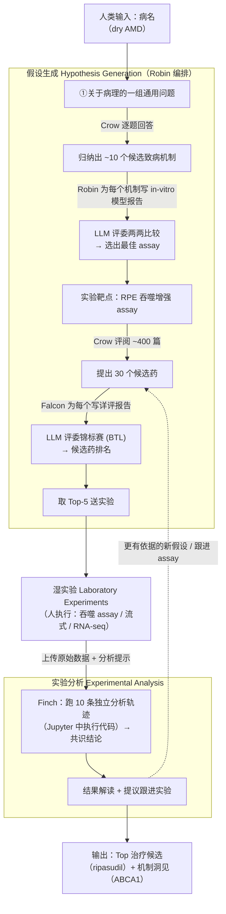

# Robin：把多智能体科学发现闭环，第一次落到「湿实验」

> 本篇遵循第二批 v2 规范：在前 40 篇全部硬性要求之上，额外补 **Why 三连**（问题层 / 设计层 / 结果层）与 **`## ★ 对我们的启发（Inspires Us）`** 专节。
> 结构对齐 [`2408.06292-ai-scientist-v1.md`](2408.06292-ai-scientist-v1.md)，新增两维对齐 [`2506.13131-alphaevolve-deepmind.md`](2506.13131-alphaevolve-deepmind.md)。
> 一句话定位：AlphaEvolve 的命门是「问题必须能**自动**打分」，把湿实验问题挡在门外；**Robin 正好补上那半张图——它把闭环的「评估」一端接到了真实细胞实验上**。

---

## 1. 封面 · TL;DR

- **标题**：Robin: A multi-agent system for automating scientific discovery（原文 arXiv 2505.13400v1，2025-05-19）。
- **作者/机构**：Ali Essam Ghareeb、Benjamin Chang（牛津）、Ludovico Mitchener、Samuel G. Rodriques 等，**FutureHouse**（旧金山）。
- **权威性来源**：FutureHouse 出品（其文献 agent 体系 PaperQA2 / Aviary 已成事实标准）；本文的卖点不是 benchmark 分数，而是一个**可被湿实验核验的真实生物学发现**——ripasudil 增强 RPE 吞噬，并由 RNA-seq 反查到 *ABCA1* 这个有文献支撑的新靶点。注意它是**技术报告**，非顶会/Nature 论文（截至本库收录时）。

**这篇在干什么（一段话）**：Robin 是一个**编排器 (orchestrator)**，它指挥两类语言 agent——**文献搜索 agent（Crow / Falcon）** 与**数据分析 agent（Finch）**——形成一条「**lab-in-the-loop**（实验在环）」闭环：人类只给一个**病名**（这里是干性年龄相关性黄斑变性，dry AMD，dAMD），Robin 自动**提假设**（先选实验靶点 assay、再选候选药）、由人类**执行湿实验**、再把原始数据交还 Finch **自动分析**、据分析结果**生成下一轮更有依据的假设**，循环往复，直到人满意。它不是「再优化科研某一环」，而是**第一个把假设生成 + 实验设计 + 数据分析 + 迭代精化全自动化、并真正闭合到湿实验**的系统。

**3 条带走的结论**：
1. **「落到湿实验」是它区别于 AI Scientist / AlphaEvolve 的根本**：后两者的闭环「评估」端是**代码可自动跑分**（ML 指标、张量秩、运行时）；Robin 的评估端是**显微镜与流式细胞仪里的真细胞**——它**主动放弃了全自动评估**，换来了「能验证真实生物学假设」（原文 §2.1）。这条边界把它和 AlphaEvolve 划成**互补**而非竞争。
2. **它做出了一个看起来像样的发现**：从「dAMD」这个词出发，Robin 自主锁定「增强 RPE 吞噬」这条治疗策略，筛出 **ROCK 抑制剂**这一类，并在第二轮迭代里把**临床已批（日本治青光眼）的 ripasudil** 顶到候选第一，湿实验测得它**比 DMSO 对照增强吞噬 7.5×**、且**强于一线对照 Y-27632**（原文 Figure 4、§2.2.3）。
3. **「真发现」要诚实看证据强度**：ripasudil 是**药物重定位 (drug repurposing)**、不是全新分子；关键数字多为**单次实验 + 单个人类复核**、**无剂量-反应曲线 / 无长时程**；RNA-seq 反查出的 *ABCA1* 靶点是**强 p 值 + 有既往文献佐证**，但**未做功能验证**。Robin 自己也承认它**还不能产出可直接执行的精确实验协议**（原文 §3 Discussion）。

> 主讲提示：开场把三件事钉死——**①它把闭环接到了湿实验（这是它的身份）；②它真的端到端跑出了一个候选药（这是它的战果）；③战果的证据是「promising 但单薄」（这是诚实刻度）**。全场就在「真做出来了」与「证据还很初步」之间展开。

---

## 2. 问题与动机（why —— 本篇最该讲透的一节）

**问题层 why（为什么这事值得做）**：科学发现的内核是一个循环——**背景调研 → 提假设 → 做实验 → 分析数据 → 据新数据修正假设**（原文摘要首句）。生物医学里这个循环尤其慢、尤其贵：我们「测量、扰动、建模」生物系统的能力暴涨，但「**解释、综合、据此提出新假设**」的能力跟不上（原文 §1，引 Nurse 2021）。一个扎心的实证模式是**药物重定位的滞后**：洞见其实早就躺在文献里，却要等很多年才结晶成新疗法——

> 原文 §1 给的滞后案例（教学价值极高）：**dabrafenib**（BRAF 抑制剂）的「保护听力」效应，其分子机理 2010 年已清楚，但要 **10 年后**才靠高通量筛选被发现；**ketamine** 抗抑郁滞后 **22 年**；**leucovorin** 滞后 **5 年**；**KarXT** 滞后 **13 年**。

**不解决会怎样**：这些滞后说明——**把已有但分散的科学洞见「逻辑地连起来」是一道真实瓶颈**。同时，FDA 近十年每年仅批准约 **50 个新药**（原文 §3，引 [44]），治疗开发的产能急需新的扩张方式。如果只有人脑去综合爆炸式增长的文献，发现速度被「专家能合成知识的速率」死死卡住（原文 §1 首段）。

**设计层 why（为什么是「多 agent + 湿实验闭环」，而非显而易见的替代）**：

> **Why（设计层）**：
> - **朴素替代 A：单个大 LLM 一把梭**（直接问「dAMD 该用什么药」）→ 会**幻觉**、无法把「读文献」和「分析实验数据」这两种**异质能力**同时做好；也无法迭代。原文 §1 明确指出：已有 LLM 系统能「分解科学推理成子任务」，但**没有一个能把『提假设 + 据实验结果分析 + 据新数据精修假设』全链路闭合**。
> - **朴素替代 B：只做假设生成（ideation-only）系统**（如很多 LLM ideation 工作）→ 出一堆点子但**不验证**，等于把「连接洞见」做了一半，仍解不了「洞见→疗法」的滞后。
> - **朴素替代 C：纯计算可自动评估的闭环**（AI Scientist / AlphaEvolve）→ 在「能自动跑分」的问题上极强，但**生物学发现的判优要做实验**，自动评估写不出来。
> - **Robin 的选择**：用**专门化分工**（文献 agent 负责「读与综合」、数据 agent 负责「分析与解读」），由编排器把两者**经一段真实湿实验**接起来。代价是「半自主」（human-in-the-loop 执行实验），收益是**第一次把闭环接到真实生物学证据上**。

**核心 intention（一句话形式化）**：**给定一个病名，能否让一个多 agent 系统自主地「提出可检验的治疗假设 → 设计体外实验 → （人执行后）自动分析数据 → 据结果迭代」，并在真实湿实验中发现且验证一个新颖治疗候选？**（原文摘要 + §1 末）

> 主讲提示：这一节的 why 三连是全篇骨架。把「滞后案例（洞见早在、疗法迟来）」当锚——**Robin 的全部设计，都是为了把『连接已有洞见』这件事自动化并真去验证**。强调它和计算闭环的分界：**评估端是细胞，不是代码**。

---

## 3. 研究问题 / 核心假设

把问题压成一句：

> **能否用「文献综合 agent + 实验数据分析 agent + 编排器」组成的 lab-in-the-loop 系统，仅从一个病名出发，端到端、迭代地产出并湿实验验证一个新颖治疗候选？**

隐含的**核心假设**：
- **H1（异质分工可拼成闭环）**：把「读文献/综合」与「分析实验数据」拆给**不同专长的 agent**，再由编排器串联，能完成单一 agent 难以胜任的全链路（原文 §2.1）。
- **H2（LLM 能「连接已有洞见」生成真假设）**：很多有效假设其实是**对已有文献的综合**——LLM 擅长大规模召回与综合，故能复现甚至加速这种「连接」（原文 §3：Y-27632 的依据正来自文献里**一篇**讲它增强低吞噬 RPE 的工作）。
- **H3（人执行实验 + agent 自动分析，是当下可行的折中）**：在协议无法全自动执行的现实下，「人做湿实验、agent 全自动分析原始数据」是把闭环跑起来的可行边界（原文 §2.1.2、§3）。

> 主讲提示：三条假设各对一处后文证据——H1↔四角色分工、H2↔「Y-27632 依据本就躺在一篇文献里」、H3↔「人换 pHrodo 微珠」那一幕。把 H2 当主线：**Robin 的『发现』本质是把已有洞见连起来再验证**。

---

## 4. 相关工作定位（站在谁肩上、和谁不同）

| 方向 | 代表 | 自动化了科研循环的哪几环 | 与 Robin 的关系 |
|---|---|---|---|
| LLM 提假设（ideation-only） | Boiko 2023[21]、多篇[20–25] | 仅「提假设」 | 不验证、不分析数据；Robin 把它接上实验与分析 |
| 端到端**计算**科学家 | The AI Scientist[22] | 假设→写码→跑→写作→评审（**全自动评估**） | 评估靠 ML 指标可自动跑；Robin 评估靠**湿实验** |
| 自动算法发现 | AlphaEvolve（[`2506.13131`](2506.13131-alphaevolve-deepmind.md)） | 在**可自动打分**域里超优化 | 命门是「需自动 $h$」；Robin **补上湿实验那半张图** |
| 多 agent + 辩论 + **湿实验** | AI co-scientist[25]（[`2502.18864`](2502.18864-google-ai-co-scientist.md)） | 假设生成-辩论-进化（+部分湿验证） | **最近的同类**；Robin 更强调「**自动数据分析**」这一环 + 公开发现闭环 |
| 治疗专用 LLM | TxGemma[24]、Tx-LLM[26] | 预测药理/安全性等**单点任务** | Robin 不是单点预测，而是**全链路编排** |
| 文献 agent（地基） | PaperQA2 / Crow·Falcon[27] | 「读与综合」 | **被 Robin 当零件调用** |
| 数据分析 agent（地基） | Finch（首发于 **BixBench**[28]，[`2503.00096`](2503.00096-bixbench-computational-biology.md)） | 「分析实验数据」 | **被 Robin 当零件调用** |

（依据原文 §1、§2.1、§4）一句话差异：**别的系统各做循环里的一两环；Robin 把「文献综合」与「实验数据分析」两类成熟 agent，经一段真实湿实验，第一次合成完整闭环。** 相对 AI co-scientist 的「最近邻」，Robin 的差异在于**把『自动分析原始实验数据（流式/RNA-seq）』作为一等公民**，并公开了一条端到端发现案例。

> 主讲提示：这张表回答「增量从哪来」。强调两点：①Robin 站在 **PaperQA2(Crow/Falcon) + Finch(BixBench)** 两个**已有 agent**的肩上，自己主要是**编排 + 闭环**；②它和 AlphaEvolve 是**互补**（一个管「能自动评估」的，一个管「要湿实验」的）。

---

## 5. 方法总览（big picture，先直觉后细节）

Robin 的闭环 = **假设生成（两步：选 assay → 选候选药）** ⇄ **湿实验（人执行）** ⇄ **实验分析（Finch）** ⇄ **结果解读→下一轮假设**（对应原文 Figure 1A/B）。一图流：

**直觉**：把它想成「**一个会读全网文献的博后（Crow/Falcon）+ 一个会自己写 Jupyter 跑生信分析的博后（Finch）+ 一个项目负责人（Robin）**」。负责人先让前者读文献定「测什么、用什么药」，人去做实验，再让后者把原始数据分析成结论，负责人据此决定「下一轮试什么」。**关键创新是把这三件事自动串起来、并真闭合到湿实验**。

> 主讲提示：让听众记住四个角色——**Robin（编排器）/ Crow（快读）/ Falcon（深读）/ Finch（分析）**，以及一条主线：**病名 → 选 assay → 选药 → 湿实验 → 分析 → 迭代**。后面 §7 逐环拆。

---

## 6. 符号与术语表（先定义，后文要用）

| 记号 / 术语 | 含义 |
|---|---|
| **Robin** | 顶层**编排器**，本身实现为一个 Jupyter notebook（基于 Aviary 框架），用 OpenAI **o4-mini** 做综合、Anthropic **Claude 3.7 Sonnet** 当**两两比较的评委**（原文 §4.1） |
| **Crow** | **简洁**文献综述 agent（concise literature review），基于 PaperQA2，用来快速识别实验策略与候选药（原文 §2.1、Fig.1C） |
| **Falcon** | **深度**文献综述 agent（deep literature review），为**每个**候选药生成可评估优劣的**详评报告**（原文 §2.1、Fig.1C） |
| **Finch** | **自主数据分析 agent**，首发于 **BixBench**[28]；基于 ReAct，在预置 Docker（`BixBench-env:v1.0`）里**写并执行 Jupyter cell** 做生信分析（原文 §4.2） |
| **dAMD** | dry age-related macular degeneration，**干性**年龄相关性黄斑变性；发达国家不可逆视力损失首因（原文 §1） |
| **RPE** | retinal pigment epithelium，**视网膜色素上皮**；其「吞噬光感受器外节」功能失常是 AMD 关键病理（原文 §2.2） |
| **吞噬 (phagocytosis)** | 细胞吞入颗粒；这里 RPE 吞噬 pHrodo 微珠，用流式测荧光强度 |
| **ROCK / ROCKi** | Rho 激酶 (rho kinase) / ROCK 抑制剂；Y-27632、ripasudil 均属之 |
| **assay** | 实验**测定/靶点方法**（如「吞噬增强 assay」）；Robin 要先选定它 |
| **in vitro** | 体外（细胞/试管层面），区别于活体 in vivo |
| **BTL (Bradley-Terry-Luce)** | 由**两两胜负**估计每个对象「实力分」的统计模型，用于把成对比较转成排名（原文 §4.1） |
| **DGE / volcano plot** | 差异基因表达分析 / 火山图（x=log2 倍数变化，y=−log10 p 值） |
| **MFI** | mean fluorescence intensity，平均荧光强度；这里作为「吞噬量」的读数 |
| **MAP / human-in-the-loop** | 人在环：实验由人执行、Robin 负责其余环节（半自主） |

> 主讲提示：这张表后文反复要用，重点先记牢**四角色（Robin/Crow/Falcon/Finch）+ BTL + MFI** 六个词，其余随用随查。

---

## 7. 方法细节（核心，逐环拆）

> 本节按闭环顺序拆四环：**①假设生成 → ②湿实验 → ③数据分析（Finch）→ ④迭代**。每环先给 Why（尤其设计层），再讲 how。

### 7.1 假设生成 · 第一步：选「测什么」（experimental assay selection）

**Why（设计层）**：朴素做法是**直接问 LLM「dAMD 用什么药」**→ 跳过了「该用哪种体外模型来判优」这一关键科学决策，等于在没有「秤」的情况下挑「重量」。Robin 坚持**先定 assay（秤）再选药（物）**，因为「**用什么 in-vitro 模型**」直接决定后续所有候选的可比性与生物学相关性（原文 §2.1.1）。

**how**：给定病名，Robin
1. 自动生成一组关于**疾病病理**的通用问题，逐题**派 Crow** 去文献里回答（原文 §2.1.1、补充 §5.2 给了 prompt）；
2. 用 Crow 的报告当上下文，**归纳出 ~10 个候选致病机制**；在 dAMD 实例里，是**先扫 151 篇**提出十个生物学相关机制（原文 §2.2）；
3. 为每个机制再派 Crow，写一份「**描述该机制的体外模型 + 对应可测药效的 assay**」详评报告；
4. **用 LLM 评委做两两比较**给这些 in-vitro 模型排名（方法见 §4.1），**取排名第一的 assay** 定为实验策略。dAMD 上选中的是「**RPE 吞噬增强 assay**」（原文 §2.2、Fig.2A 列了 5 个候选 assay）。

> 主讲提示：这一步最容易被忽略却最关键——**Robin 把「选实验范式」也自动化了**。强调它**自己**决定「dAMD 该靠『增强 RPE 吞噬』来治」，这是后面所有结果的总开关。

### 7.2 假设生成 · 第二步：选「用什么药」（therapeutic candidate generation + 排名）

**Why（设计层）**：朴素做法是**让 LLM 一次列出一堆药**就送实验→ 没有**统一可比的评估**，挑出来的可能只是「被提及最多」而非「最有道理」。Robin 改用「**先为每个候选写详评、再用 LLM 评委锦标赛排名**」，因为只有把每个候选放进**同一套评判维度**（科学依据强度、药理特征、支撑文献方法学）里两两较量，排名才有意义（原文 §2.1.1 末、§4.1）。

**how**：assay 定了之后，Robin
1. 再走一遍「通用文献综述 + 假设生成」，**派 Crow 评阅约 400 篇** RPE 吞噬相关文献，**提出 30 个**已有药物当候选（原文 §2.2）；
2. **派 Falcon** 为这 30 个里**每一个**生成详评报告（既讲为何适配该 assay、也讲潜在局限）（原文 §2.2、补充 Fig.S9）；
3. 用 **LLM 评委锦标赛**排名（见下方「评委机制」），人类可复核，取 **Top-5** 执行湿实验。dAMD 第一轮 Top-5 = **Exendin-4、Fingolimod、MFGE8、Y-27632、AICAR+TUDCA 组合**（原文 §2.2.1）。

**评委机制（把成对比较转成排名，给定义）**：

> 直觉：人很难一次性给 30 个候选打绝对分，但**两两比谁更好**相对可靠。于是先做大量「两两对决」，再用一个统计模型把这些胜负**反推**成每个候选的「实力分」，按分排名。

记号（先定义）：设有 $n$ 个候选假设；$\pi_i>0$ 为候选 $i$ 的隐含「实力参数 (strength)」；$\Pr(i\succ j)$ 为「在一次对决中 $i$ 胜过 $j$」的概率。**Bradley-Terry-Luce (BTL)** 模型设

$$ \Pr(i \succ j)\;=\;\frac{\pi_i}{\pi_i+\pi_j}. $$

**读出什么**：$\pi_i$ 越大越常赢；把所有对决结果代入做最大似然，就能估出每个 $\pi_i$，按 $\pi_i$ 排序即得排名。原文 §4.1 的工程细节：**≤25 个候选时做完整 round-robin**（所有对全比）；**>25 时随机抽 300 对**比（控算力/时间）；评委是 **Claude 3.7 Sonnet**。
**评委 prompt 怎么来的（重要、易被问）**：先让**领域专家**对 Robin 的候选做成对比较，再把这些专家偏好喂给 **Gemini 2.5 Pro Preview** 去**生成评委用的 prompt**，使评委决策**对齐专家标准**（原文 §4.1）。
> 主讲提示：这里埋一条「评委可信度」的线——见 §9 评委与专家一致性那段（top-10 平均 7.25/10 重合、评委内部一致 88% > 人类 61%）。强调 BTL 不是玄学：**它把「难做的绝对评分」换成「好做的相对比较」**。

### 7.3 湿实验（Laboratory Experiments，人执行）—— 闭环的「评估端」

**Why（设计层）**：这是 Robin **主动放弃全自动评估**的地方。朴素的「全自动闭环」（AI Scientist 式）要求评估能机器跑分；但**生物学判优必须做实验**。Robin 接受「**人执行实验**」这道人在环约束，把它当作「**把闭环接到真实世界**」的必要代价（原文 §2.1、§3）。

**how（dAMD 吞噬 assay 实例，原文 §2.2.1 + §4.4）**：人按 Robin 选定的 assay 在实验室执行——
- 细胞：**ARPE-19**（人 RPE 系）或患者来源 RPE；先长成单层并分化（原文 §4.3）；
- 流程（Fig.2B）：**先加药 1 小时 → 再加 pHrodo 微珠 → 共孵 3–4 小时 → 流式细胞仪测吞噬**。pHrodo 微珠**只在溶酶体低 pH 下发荧光**，故能单细胞水平特异检测「真被吞入」的颗粒（原文 §2.2.1、§4.4.2）。
- 注意一个**人机协作的现实细节**：Robin 原建议用**荧光标记的光感受器外节**当底物，但因**可得性**，人改用 pHrodo 微珠（原文 §2.2.1）——说明协议仍需人翻译落地。

### 7.4 实验分析（Finch）—— 把原始数据自动跑成结论

**Why（设计层）**：朴素做法是**让一个 LLM 看一眼数据直接下结论**→ 生物数据解读**本质模糊**（流式的 gating 选择、RNA-seq 的分析路径，人与人都会不同），单次单路结论**既不稳也不可信**。Robin 的对策是「**多轨迹 + 共识**」：让 Finch **跑多条相互独立的分析轨迹**，再做 meta 分析取**共识结论**——**用分析路径的多样性，换结论的稳健性**（原文 §2.1.2）。

**how**：
- 人把**原始/半处理数据 + 一句分析意图**（如「流式」「RNA-seq 差异表达」）交给 Robin，Robin **派 Finch** 执行（原文 §2.1.2）；
- Finch 基于 **ReAct**，在预置 Docker 里**只用两个工具**：`edit_cell`（在 Jupyter 里选/改/执行 cell）与 `submit_answer`（提交结论）（原文 §4.2.1）；每条轨迹都产出**可解释、可复现**的 notebook；
- **关键设计——拥抱随机性**：因为语言 agent 本身有随机性，Robin **并行跑 10 条独立轨迹**，各自探索不同分析路径，最后**做 meta 分析合成共识**（原文 §2.1.2、§4.5）。流式里 Finch 用 R 的 `flowMeans` 做 k-means 聚类自动 gating（原文 §4.5.1）；
- Finch 还能**主动提议跟进实验**去确认意外发现（原文 §2.1.2），这正是「迭代」的引线。

> 主讲提示：Finch 的「**10 轨迹取共识**」是全篇方法上最漂亮的一招——它把「LLM 分析不稳」这个 bug，转成「多路径采样→共识」这个 feature。和 AlphaEvolve「多指标反而帮单指标」是同一种「**用多样性买质量**」的智慧。

### 7.5 迭代（lab-in-the-loop 的闭合）

**how**：Finch 把处理后的结果**蒸馏成可执行的科学洞见**，并据此**提议下一轮假设/跟进 assay**；这些洞见回灌到 §7.2 的候选生成，开始下一圈，**直到人对某个候选满意为止**（原文 §2.1.2）。dAMD 上这条迭代真的发生了两次关键跳转：①初轮发现 ROCKi 有效 → Robin **提议对 Y-27632 做 RNA-seq**（§7.6 的 ABCA1）；②据初轮洞见 → Robin **第二轮把 ripasudil 顶到第一**（§8 的主结果）。

### 7.6 一个「副产物」机制发现：RNA-seq 反查出 *ABCA1*

**Why（结果层）**：这一步展示「Robin 不只挑出有效药，还能**反向照出新机制/新靶点**」。初轮流式确认 ROCKi（Y-27632）增强吞噬后，Robin **自己提议**做 RNA-seq 去问「ROCK 抑制在转录层面改了什么」（原文 §2.2.2、Fig.3A）。
**how + 结果**：人做了第二次「Y-27632 + 微珠」的 RNA-seq，Finch 做 DGE：
- **共识稳健性**：8 条 RNA-seq 轨迹里，Finch 在 **>50% 轨迹**中识别出**相同**的显著差异基因（原文 Fig.3C）；GO 富集指向**肌动蛋白丝组织、small-GTPase 信号、自噬**通路（Fig.3D）——与「ROCK 调控 F-actin / 吞噬杯形成」的已知机理吻合。
- **新靶点**：DGE 发现 ***ABCA1*** 被**上调 3 倍**（校正后 **p=2.13×10⁻⁸³**），它是关键**脂质外排泵**；其家族成员 *ABCA4* 已知与黄斑变性相关，脂质受体 Apo-E 也曾被列为 dAMD 靶点（原文 §2.2.2，引 [39][40]）。**注意**：这是「**强统计 + 文献可连**」的有趣线索，但原文**未对 *ABCA1* 做功能验证**——属「揭示了可能的新分子靶点」级别，不是已证实的机制。

> 主讲提示：这段是「AI 不只选药、还能提机制」的卖点，但要**诚实**：p 值再小也只是「表达变了」，**因果/功能未验证**。这正是 §11 批判线的一个抓手。

---

## 8. 主要结果（数字 + 解读，别只贴表）

> 全篇的「真发现」集中在两点：**ROCK 抑制剂这一类被选中并验证**、**ripasudil 在第二轮被顶到第一并测得最强**。

**(a) 初轮：ROCK 抑制剂增强 RPE 吞噬（原文 §2.2.1、Fig.2F）**
- Top-5 候选湿实验后，**Y-27632（ROCKi）显著增强**吞噬（Fig.2F 中标星）；
- **该结论被一名人类对同一数据的独立分析所确认**（原文 §2.2.1，引补充 Fig.S13）；
- **机制依据可溯**：临床前模型早有「Y-27632 恢复吞噬效率」的工作（引 [33]），印证 Robin 的**文献依据是真的**而非空想。

**(b) 主结果：ripasudil 第二轮被顶到第一、且最强（原文 §2.2.3、Fig.4）**
- 据初轮洞见，Robin **第二轮**又出 10 个候选并测之；**Finch 分析显示 ripasudil 跑赢 Y-27632**；
- 数字：**ripasudil 相对 DMSO 对照增强吞噬 7.5×**；**人类对同一数据的分析为 1.75×**（原文 §2.2.3 + 引补充 Fig.S14）；
- **身份**：ripasudil 是**日本已批准治青光眼**的 ROCK 抑制剂，**此前从未被提议治 dAMD**（原文摘要、§2.2.3）——这是「**重定位**」型新颖性。

> ⚠ 必须当场点出的**数字落差**：同一批数据，**Robin/Finch 报 7.5×，人类报 1.75×**（原文 §2.2.3 明文）。原文将其归因于**gating/分析路径差异**（生物数据解读的固有模糊性），并强调**两者都显示「显著增强」、方向一致**。但**幅度差 ~4 倍**说明：**「增强」这一定性结论较稳，「7.5×」这一定量值不可照搬**。原文也自承**需做不同剂量、更长孵育**才能下「ripasudil 确优于 Y-27632」的定论。

**结果层 why（为什么会得到「ROCK 抑制剂」这个答案）**：原文 §3 给了诚实的归因——文献里**确有一篇**展示 Y-27632 通过促肌动蛋白聚合增强「低吞噬」供体 RPE 的工作；Robin 的本事，是**把这条已存在但分散的洞见综合出来并推到 dAMD 语境**。换言之，**这更像「高质量文献综合 + 实验确认」，而非凭空的新机理发现**——这恰好印证假设 H2，也界定了其「发现」的性质。

> 主讲提示：把(a)(b)讲成一条**迭代故事**：初轮锁定 ROCKi → RNA-seq 旁证机制 → 二轮在同类里换出更优的 ripasudil。再用「7.5× vs 1.75×」这把尺子，教大家**怎么诚实读一个 AI 系统的『成果数字』**。

---

## 9. 分析与可信度核验（评委 vs 专家 / 共识机制）

原文用两组证据回应「这些自动判断可信吗」：

**(a) LLM 评委 vs 人类专家（原文 §4.1，补充 Fig.S11）**
- **与专家一致性**：评委的 **top-10 假设里平均 7.25 个**与专家的 top-10 重合（高一致）；
- **自一致性（intra-rater）**：面对**完全相同**的成对比较，**评委 88%** 会选同一个，而**人类专家仅 61%**——评委比人更「自洽」（方差更小）。

**(b) Finch 共识的稳健性（原文 §2.2.2，Fig.3C）**：8 条 RNA-seq 轨迹在 >50% 中识别出相同显著基因；流式 10 轨迹取共识（§2.1.2）。

**读出什么**：评委「与专家相当且更自洽」「分析多轨迹有共识」**支持**了「这套自动判断不是噪声」。但要诚实：**自洽 ≠ 正确**（评委可能一致地错），**与专家重合 7.25/10** 也意味着**约 3 成不重合**；共识能降方差却**不保证消系统性偏差**。

> 主讲提示：这一节是「setting/metrics 写全」的样板——把「一致性/自一致性/共识」三种核验讲清，并立刻补一句它们各自**证明不了什么**（自洽≠对、共识≠无偏）。

---

## 10. 实验设置（setting / metrics / parameters，写全）

**A. 系统侧（原文 §4.1–§4.2）**
- **框架**：Aviary[32]；**Robin** 实为一个 **Jupyter notebook**（作者发现 agentic 版本几乎总按同一顺序调工具→近确定性，故**改写成精简 notebook 求稳**）。
- **模型**：综合用 **OpenAI o4-mini**；评委用 **Claude 3.7 Sonnet**；评委 prompt 由 **Gemini 2.5 Pro Preview** 据专家偏好生成。
- **排名**：BTL；≤25 候选→完整 round-robin；>25→随机 300 对。
- **Finch**：ReAct；预置 Docker `BixBench-env:v1.0`（含 Python/R/Bash 生信库）；工具仅 `edit_cell`、`submit_answer`；**每分析任务并行 10 条轨迹**取共识。

**B. 生物学侧（关键 setting，原文 §4.3–§4.5、Table 1）**
- **细胞**：ARPE-19（ATCC CRL-2302）；DMEM/F12 + 10% FBS；96 孔 **1×10⁴ 细胞/孔**，长满后再分化 7 天。
- **吞噬 assay**：加药/载体（**0.5% DMSO** 对照）60 min → 加 **~10 µg pHrodo 微珠** → 37℃ 共孵 **3 h** → TrypLE 消化 → FACS（含 **500 ng/ml DAPI** 去死细胞）。
- **流式**：Attune NxT；637/405 nm 激光、670/14 与 450/40 滤光；**每孔 ≥4000 事件**保统计功效。
- **RNA-seq**：24 孔；Maxwell 提 RNA；poly-A 富集；Illumina **NextSeq 2000，75 bp 双端**；**12 个样本**（Y27632/野生/微珠等条件）。
- **数据分析管线（Finch/人）**：HISAT2（GRCh38, GENCODE v44）比对 → samtools → **featureCounts** 计数 → R 的 **DESeq2 v1.36.0** 做 DGE（Wald 检验）→ biomaRt 映射 → **EnhancedVolcano** 画火山图，阈值 **|log2FC|>1 且 adj.p<0.05**。
- **药物浓度（Table 1 摘选）**：Y-27632 **20 µM**、ripasudil **100 µM**、Exendin-4 1 µM、Fingolimod 1 µM、MFGE-8 2.5 µg/mL、AICAR 1 mM + TUDCA 100 µM（组合）。

**C. 评测指标定义**
- **吞噬量**：**MFI**（pHrodo 信号的平均荧光强度）；越高=吞噬越强；候选 vs DMSO 做统计检验（Fig.2F/4B 标星）。
- **DGE 显著**：adj.p<0.05 且 |log2FC|>1；*ABCA1* 报 **adj.p=2.13×10⁻⁸³、~3× 上调**。
- **评委质量**：与专家 top-10 重合数（7.25/10）、自一致率（88%）。

> 主讲提示：这页是组会最容易被追问的地方。重点强调**两个数字的语境**：①`≥4000 事件/孔`是统计功效保障；②`7.5× vs 1.75×`的落差正源于「分析路径不同」——把它和 §9 的「生物数据解读固有模糊」串起来。**原文未给出**：每个条件的**生物学重复数 n**、误差棒的统计检验细节、随机种子——这些缺口要诚实写出。

---

## 11. 局限与批判（诚实区分「论文宣称」与「批判」）

**原文自承的局限（§3 Discussion 末）**：
1. **产不出可直接执行的精确协议**：Robin 只给实验**大纲**，仍需人**翻译**成可在实验室跑的方法（这也是 pHrodo 替换那一幕的根源）。
2. **Finch 重度依赖 prompt 工程**：要靠人精心写提示才能产出可靠分析；让它**自适应地对不同数据模态自造/改 prompt**，才能更自主。
3. **评委对齐人类判断仍待改进**：用 LLM 评委提名假设，「**更好地对齐人类科学判断**」是 future work。
4. **近确定性的工程妥协**：因 agentic 版几乎总按同序调工具，作者把 Robin **降级成 notebook** 求稳——意味着当前「自主性」有水分（更像**固定流水线**而非灵活 agent）。

**本库/社区视角的追加批判**：
- **「真发现」的证据强度偏弱**：核心数字多为**单次实验**，关键结论**靠单个人类复核**；**无剂量-反应、无时间梯度**，原文自己也说「需更多剂量与更长孵育才能定论」。**7.5× vs 人类 1.75×** 的 4 倍落差，提示**定量结论不可照搬**。
- **新颖性是「重定位」而非「新分子/新机理」**：ripasudil 是已批药、ROCKi 治视网膜病早被提过（原文 §3 引 [35] 说 ROCKi 治湿性 AMD 早有人提）；Robin 的贡献是**首次提其用于干性 AMD + 用吞噬这条路**，本质是**优秀的文献综合 + 实验确认**（H2 成立的另一面：它擅长「连接已知」，不等于「创造未知」）。
- ***ABCA1* 仅为关联**：强 p 值≠功能因果，**未做敲低/过表达验证**。
- **可复现性**：截至发布，代码「**will be available**」at github.com/Future-House/robin（**承诺态**）；湿实验**非单卡可复现**，需真实验室、流式与测序设施。
- **判优循环性**：assay 选择与候选排名**全由 LLM 评委**做；评委 prompt 又**由 LLM（Gemini）据专家偏好生成**——这条「LLM 评 LLM」的链，独立外部判据只在**最后湿实验**那一步才进来。

> 主讲提示：把批判收成一句**诚实判词**——「**Robin 真的端到端跑出了一个 promising 的重定位候选，并用湿实验给了方向正确的证据；但它是『把已有洞见连起来并初步验证』，不是『从零发现新机理』，且定量证据尚单薄。**」这正好接 m9.1 的「自称 Scientist 者多自评，独立验证才是硬通货」。

---

## ★ 对我们的启发（Inspires Us）

> 这一节回答：Robin 对我（们）接下来的研究，**到底能用上什么**。

- ➤ **可直接借用的招（reuse）**：
  1. **「多轨迹 + 共识」抗 LLM 随机性**——Finch 并行 **10 条独立分析轨迹**再取共识（原文 §2.1.2）。这是把「语言 agent 分析不稳」从 bug 变 feature 的**通用模板**，可**原样搬进** [`m9.6-evaluating-research-agents`](../m9.6-evaluating-research-agents/)：凡是「让 agent 分析/评分一份数据」的环节，都改成「N 路独立 + 共识 + 报一致性比例」，并把**轨迹间一致性**当作**置信度**输出。
  2. **「先选 assay（秤）再选药（物）」的两段式假设生成**——先用 LLM 评委排出「该用哪种评估范式」，再在该范式下排候选。可迁到任意「先定评测、再选方案」的研究里，避免「没有秤就比重量」。
  3. **BTL 成对比较转排名 + 评委 prompt 由专家偏好反推**——把「难做的绝对评分」换成「好做的相对比较」，并用**专家成对偏好去合成评委 prompt**（原文 §4.1）。可直接加进 [`m9.3-ideation-and-tournament`](../m9.3-ideation-and-tournament/) 的锦标赛打分。

- ➤ **可迁移到我们课题（transfer）**：Robin 的最大启示是**为「无法自动评估」的研究问题，提供了一条 lab-in-the-loop 闭环范式**。把它映射到我们的模块：[`m9.5-end-to-end-ai-scientist`](../m9.5-end-to-end-ai-scientist/) 目前的闭环「评估端」是可自动跑分的 ML 指标——**迁移 Robin 的思路 = 把「评估端」抽象成一个可替换接口**：可自动评估时插「代码评分器（AlphaEvolve 路线）」，不可自动评估时插「人执行 + agent 分析（Robin 路线）」。**迁移时不再成立的前提**：自动闭环的「快」没了（湿实验是天/周级），且必须引入「人翻译协议」这一环——所以**真正该自动化的，是『协议生成』与『数据分析』，而非妄想全自动**。

- ➤ **它暴露的开放问题 = 我们的机会（opportunity）**：
  - **缺口 1（协议可执行性）**：Robin **产不出可直接跑的精确协议**（原文 §3）。→ **机会**：做一个「**协议编译器** agent」，把 Robin 式实验大纲编译成结构化、可被实验室（或自动化平台）执行的步骤，并量化「人工返工率」下降多少。**第一步**：在 m9.6 里加一个「大纲→可执行协议」的小评测任务，对照人写协议打分。
  - **缺口 2（判优循环性）**：assay 选择/候选排名**全是 LLM 评 LLM**，外部硬判据只在最后湿实验进来。→ 机会：把 [`m9.8-redteam-and-integrity`](../m9.8-redteam-and-integrity/) 的「**独立验证收口**」套到 Robin 式管线上——**红队造一批「文献看着合理、实则站不住」的候选**，测这条 LLM-评委链能否在**湿实验之前**就识别出来。

- ➤ **与本库其它论文/模块的连接（connect the dots）**：
  - **互补（补图）**：Robin 正是 [`2506.13131` AlphaEvolve](2506.13131-alphaevolve-deepmind.md) 那张图缺的那半——AlphaEvolve 守「**能自动评估**」的疆域，Robin 守「**要湿实验**」的疆域。两篇放一起讲，就是「自动评估 vs 真实验」这条**评估端分水岭**。
  - **最近邻 / 对照**：与 [`2502.18864` AI co-scientist](2502.18864-google-ai-co-scientist.md)（多 agent 辩论 + 部分湿验证）**呼应**——都把「假设生成」推向湿实验；差异是 Robin 把「**自动数据分析（Finch）**」做成一等公民，可对照「**辩论式精修 vs 多轨迹共识**」两种「提质」哲学。
  - **地基**：Finch 直接来自 [`2503.00096` BixBench](2503.00096-bixbench-computational-biology.md)——**BixBench 给了 Finch 的『考卷』，Robin 给了它的『真实战场』**；可串成「benchmark→落地」的故事。
  - **诚信收口**：与 [`m9.8-redteam-and-integrity`](../m9.8-redteam-and-integrity/) 直接呼应——Robin 的「7.5× vs 1.75×」「ABCA1 仅关联」正是「**独立验证为何不可省**」的鲜活教材。

- ➤ **如果我来做下一步（my next move）**：我会在 [`m9.6-evaluating-research-agents`](../m9.6-evaluating-research-agents/) 里加一个 **「多轨迹共识 vs 单轨迹」** 开关，用 BixBench 式数据分析任务做对照——测在**同样调用预算**下：①N 路共识相对单路，结论的**正确率/方差**改善多少；②把「轨迹间一致性」当置信度，能否**预测**该结论会不会被人类复核推翻（即「一致性高的结论是否更可信」）。一周内能出最小结论；若成立，就把它接成 Robin 式闭环里 Finch 那一环的**可信度旋钮**。

> 主讲提示：这一节是全场高潮——前面讲「FutureHouse 做了什么」，这里讲「**我们下周就能试什么**」。落点是 m9.6 的「多轨迹共识可信度旋钮」与 m9.8 的「湿实验前的红队拦截」，能被同组同学直接接力。

---

## 12. 在 auto-research 版图的位置（相对已有论文的增量）

- **它把谁向前推了一步**：相对 **The AI Scientist / AlphaEvolve** 的「**全自动但只在能自动评估的域里**」，Robin **把闭环第一次接到湿实验**——这是「**评估端**」的关键扩张：从「代码可跑分」扩到「细胞里测得出」。相对 ideation-only 系统，它**补上了验证与迭代**。
- **关键区分（别混）**：
  - **AlphaEvolve = 对象层超优化**（进化「解/搜索算法」的代码，需自动 $h$）；
  - **AI Scientist = 计算端全闭环**（写码-跑-写作-自评审）；
  - **Robin = 湿实验端闭环**（文献综合 + 实验设计 + 自动数据分析 + 人执行实验）。三者沿「**评估端是代码还是真实世界**」这条轴分布。
- **阶梯定位**：按本库 Tool→Analyst→**Scientist** 阶梯，Robin 在「**有真实世界判据**」的生物医学窄域里，达到了「**端到端产出并初步验证一个治疗候选**」的高度；但因①实验靠人执行、②判优主链是 LLM 评 LLM、③定量证据单薄，它更像「**强 Analyst + 弱 Scientist**」——**自主提问 + 自动分析很强，独立验证只在最后一步且尚浅**，与本库 m9.1 的判断（「自称 Scientist 者多靠自评，独立验证才是分水岭」）完全吻合。

> 主讲提示：用一根轴串全库——**「评估端是代码还是真实世界」**：AlphaEvolve/AI Scientist 在左（代码可跑分），Robin/co-scientist 在右（要湿实验）。Robin 的坐标是「**强 Analyst + 弱 Scientist**」。

---

## 13. 复现与可用性

- **代码**：原文称 Robin/Finch 样例轨迹与 Robin 代码「**will be available**」at `github.com/Future-House/robin`（发布时为**承诺态**，需核实是否已开放）；所有 Finch 轨迹「**通过 FutureHouse 平台**」可得。
- **agent 地基是现成的**：Crow/Falcon 来自 **PaperQA2**[27]，Finch 来自 **BixBench**[28]，框架是 **Aviary**[32]——这三者本库均有对应模块/报告，**可单独上手**。
- **能不能在单机/单卡跑**：**编排与分析侧**（Robin notebook + Finch 在 Docker 里跑生信）原则上可在普通机器 + 充足 LLM API 调用下复现；**但湿实验那一环不可复现于个人电脑**——需真实验室、ARPE-19 细胞、流式细胞仪与 Illumina 测序。
- **坑**：①Robin 当前是「近确定性 notebook」，别期待它像灵活 agent 那样应变；②Finch 强依赖 prompt 工程；③成本主要在**大量 LLM 调用**（文献综述 ~400 篇、30 候选×Falcon 详评、10×N 分析轨迹），非 GPU。

> 主讲提示：一句话定可复现边界——**「编排+分析能在你笔记本上重跑，湿实验不能」**；想上手先从现成的 PaperQA2 / BixBench / Aviary 三块地基切入。

---

## 14. 组会讨论问题

1. Robin 主动**放弃全自动评估**换「湿实验验证」。在我们手上的研究问题里，哪些**值得**也这样「降速换真实证据」，哪些不值得？判据是什么？
2. **「7.5× vs 人类 1.75×」**的 4 倍落差，作为审稿人你会要求哪些**额外证据**（重复数？剂量曲线？盲法？）才肯信「ripasudil 确优于 Y-27632」？
3. Finch 的「**10 轨迹取共识**」能降方差，但**消不了系统性偏差**（10 路可能一致地错）。怎么设计实验把「共识的方差收益」与「残余偏差」分开度量？
4. 判优主链是 **LLM 评委（Claude）+ 评委 prompt 由 Gemini 据专家偏好生成**。这条「LLM 评 LLM」在湿实验前**唯一**的外部判据缺失——能否在实验前插入一个**独立验证关卡**？（联想 m9.8）
5. ripasudil 是**重定位**、依据本就**躺在一篇文献**里。那么 Robin 的价值是「**发现**」还是「**高效检索+综合+确认**」？这对「AI 能否做出真正新机理」意味着什么？
6. *ABCA1* 仅是**强关联**。如果让 Robin **自己**提议并设计「敲低/过表达」实验去验证因果，它现在的能力够吗？缺口在哪？
7. Robin 因「agent 近确定性」被**降级成 notebook**。这说明当前「多 agent 自主性」有多少是真的、多少是固定流水线？怎么量化「自主度」？

> 主讲提示：这 7 问按「方法论→证据强度→诚信收口」排过；组会时间紧就主推 2（7.5× 落差）与 4（湿实验前缺独立判据），最易点燃讨论。

---

## 15. 一页速记（takeaways）

- **一句话**：人类只给**病名**，Robin 编排 **Crow/Falcon（读文献）+ Finch（分析数据）**，经一段**真实湿实验**闭环，端到端提出并验证治疗候选——**首个把假设→实验→分析→迭代全自动化、并落到湿实验**的系统。
- **四角色**：**Robin**（编排，o4-mini 综合 / Claude 3.7 评委 / Jupyter notebook）· **Crow**（快读）· **Falcon**（深读、逐候选详评）· **Finch**（ReAct，10 轨迹共识分析，源自 BixBench）。
- **闭环主线**：病名 → 扫 151 篇定 10 机制 → LLM 评委选「**RPE 吞噬增强 assay**」→ 扫 ~400 篇出 30 候选 → Falcon 详评 + **BTL 锦标赛**排名 → Top-5 湿实验 → **Finch 流式分析**（ROCKi 有效）→ **RNA-seq 反查到 *ABCA1***（p=2.13e-83）→ 第二轮 → **ripasudil**。
- **战果**：ripasudil（日本已批治青光眼的 ROCKi）**增强 RPE 吞噬 7.5×**（人类复核 1.75×）、**强于 Y-27632**；*ABCA1* 上调 3× 提示新靶点。
- **诚实刻度**：**重定位**非新分子；**单次实验 + 单人复核**；**7.5× vs 1.75× 落差**；*ABCA1* **仅关联未做功能**；协议**仍需人翻译**；判优**主链 LLM 评 LLM**。
- **版图坐标**：沿「**评估端是代码还是真实世界**」轴——**AlphaEvolve（代码评分）↔ Robin（湿实验）互补**；与 **co-scientist** 为最近邻；地基是 **PaperQA2 + BixBench + Aviary**。
- **记忆锚**：**「病名进，ripasudil 出；7.5× 是它说的，1.75× 是人说的。」**

> 主讲提示：结尾回到一句——**「Robin 证明了科学发现闭环能接到真细胞上，也提醒我们：把『连接已有洞见』自动化已很有用，但『从零发现新机理』和『可信的定量证据』仍是下一道坎。」**
