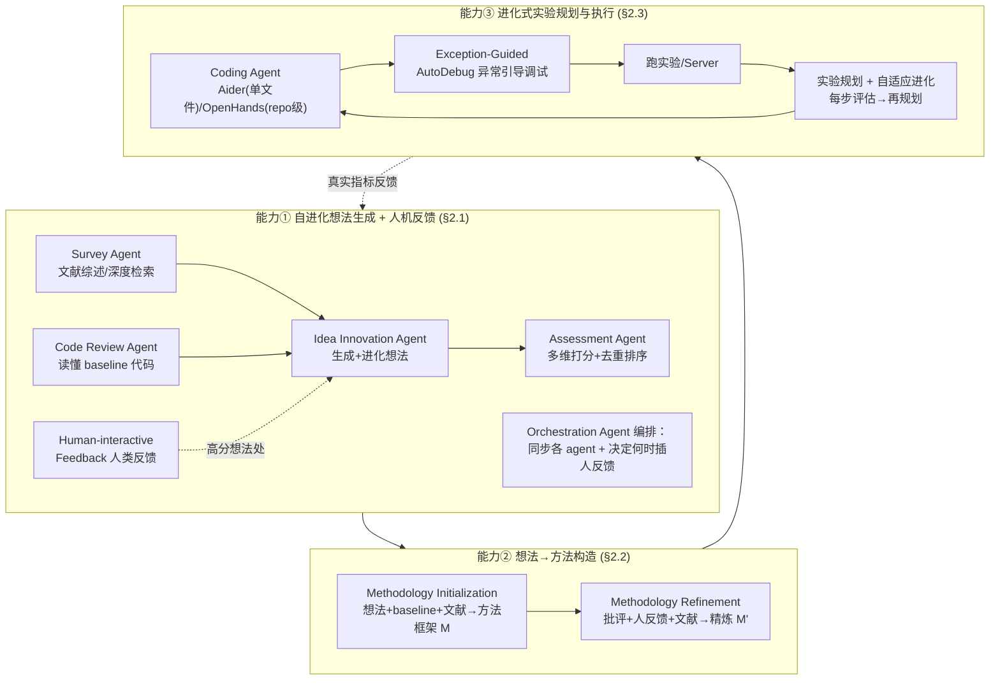

# 组会汇报 · InternAgent / NovelSeek（arXiv 2505.16938）

> 主讲提示：这是 AI Scientist（0 号文献）之后的一条「**落地路线**」。AI Scientist 在 toy 任务上证明「闭环能跑通但不可轻信」；本篇换了打法——**不写论文、不自评审，而是直接押注在 12 个有真实 baseline 的科研任务上「把 baseline 刷上去」**。看它时一直问一句话：它报告的「涨点」是不是 AI Scientist 缺的那个「独立验证」？

---

## 1. 封面 · TL;DR

- **作者/出处**：InternAgent Team，上海人工智能实验室（Shanghai AI Lab）；arXiv 2505.16938，v3 (2025-07-22)。论文/项目有两个名字：标题与正文用 **InternAgent**，项目代号曾名 **NovelSeek**（任务命名前缀 `Auto*`）。代码开源于 GitHub `Alpha-Innovator/InternAgent`，模型在 HuggingFace `U4R/InternAgent`（见原文首页脚注）。
- **一段话**：InternAgent 把「自主科学研究 (Autonomous Scientific Research, ASR)」拆成 **四个模块**——自进化想法生成 (self-evolving idea generation)、人机交互反馈 (human-interactive feedback)、想法到方法构造 (idea-to-methodology construction)、多轮实验规划与执行 (multi-round experiment planning & execution)。给定一个**有 baseline 代码的科研任务**，系统自动读文献、提想法、把想法落成详细方法、改代码、跑实验、读报错、再迭代，目标是**把 baseline 的指标刷上去**（见原文 §1、§2、Fig. 2）。
- **三条带走的结论**：
  1. **跨 12 个真实任务、报告真实涨点**：覆盖从 AI 任务（图像/点云/分割/驾驶/VLM）到科学任务（化学反应、分子动力学、潮流、时序、转录、增强子）的 12 个任务，且**都有公开 baseline 与公认指标**——例如反应产率 $R^2$ **27.6→35.4**（+7.8，12h）、增强子 PCC **0.65→0.79**（4h）、2D 分割 mIoU **78.8→81.0**（30h）（原文 Abstract、§3.2、Table 1/2）。
  2. **「想法→方法」这一中间层是它跑赢同类系统的关键**：相比 Dolphin / AI-Scientist-V2 / AI-Researcher，InternAgent 多了一个把「一句话想法」细化成「方法级描述」再交给 coder 的环节，使代码实现成功率与涨点率更高（原文 §3.2「Outperforming…」段、Table 9）。
  3. **它是 AI Scientist 的「补独立验证」镜像、但代价是放弃了开放性**：本篇**不写论文、不自评审、不自定问题**——任务、baseline、指标都是人给的，「新」只体现在方法/代码层。所以它能给出可信涨点，却**回避了 AI Scientist 最难的「自己判断好坏」那一环**（见 §16 批判）。

> 主讲提示：开场把「12 个真任务 + 真涨点」和「但问题/指标都是人给的、没写论文没自评审」两面都抛出——这正是它与 AI Scientist 的镜像关系。

---

## 2. 问题与动机（why —— 本篇最该讲透的一节）

**ASR 到底卡在哪两件事？** 原文 §1 把「自主科学研究」的难点收敛成**两道坎**：

- **坎一：提出「既有效又新」的提案 (proposal) 很难。** 自主系统要能识别研究空缺、生成既创新又**科学上站得住**的假设——这要同时平衡「创造力」与「严谨」，而模型受训练数据质量与范围所限，**判断新颖性需要对更广科学语境的深理解**（原文 §1 第一个 bullet）。
- **坎二：为「端到端实验验证」建立闭环反馈很难。** 系统要能设计实验→执行→分析结果→迭代修正假设，串成一个 seamless loop；真实实验**充满意外变量与噪声**，需要鲁棒的协调、适应与不确定性处理（原文 §1 第二个 bullet）。

**为什么「想法→方法」是本篇的核心赌注？** 这是 InternAgent 与 AI Scientist / Dolphin 最不一样的地方。原文 §1 与 §2.2 反复强调：一个粗糙的「一句话想法」直接丢给 coder，**实现成功率低、且无法验证想法对不对**；于是它插入一个 **Idea-to-Methodology** 中间层，把想法变成「方法级、可逐条实现的详细描述（像论文里的 method 段）」。直觉是——

> **想法越具体，代码越容易写对、实验越容易把「这个想法到底有没有用」验出来。** 不这么做会怎样：coder 拿到模糊想法只能瞎猜，跑出来的涨/跌也无法归因到想法本身（这正是 Dolphin/AI-Researcher 改不动复杂代码、涨点率低的原因，见 Table 9）。

**为什么要「多轮实验规划 + 自适应进化」而不是一次性实现？** 原文 §2.3.2 主张：单次实现 (single-pass) 把方法一股脑写完，跑挂了或没涨点就无从下手；改成**结构化迭代**——每实现一步就做一次性能评估，记录「这次改了什么→指标怎么变」，据此再规划下一步。直觉是「**像人做实验一样，跑一步看一步、按现象调方向**」（与 AI Scientist 的「博士生循环」同源，但这里强调对**真实 baseline 指标**的逐步逼近）。

> 主讲提示：这一节 why 的三个支点——①ASR 两道坎（提案质量 + 闭环验证）；②「想法→方法」中间层是落地关键；③多轮自适应进化优于一次性实现。后面 how 全是对这三点的展开。

---

## 3. 研究问题 / 核心 intention（形式化成一句话）

把要解决的问题压成一句：

> **给定一个科研任务的「任务描述 + 一份能跑的 baseline 代码 + 相关文献」，能否让一个多 agent 系统自主地：读文献→提出并进化新想法→把想法细化成可实现的方法→改代码并多轮跑实验验证→用真实指标确认涨点，从而在不依赖人写论文/不自评审的前提下，闭合「假设到验证」的科研环？**

它隐含的**假设**：
- (a) 当「新」被约束在**已知任务的方法/代码层**（而非自定问题），LLM 足以产生**可实现、可验证**的改进；
- (b) **有公认 baseline 与指标**时，「涨点」本身就是一种**独立的、可信的验证信号**——不需要再让模型当评审；
- (c) 「想法→方法」这一显式中间层能显著提升从想法到可运行代码的成功率（这是全篇要证的核心工程命题）。

> 主讲提示：强调 (b)——它把 AI Scientist「靠自评审判好坏」换成了「靠真实 benchmark 指标判好坏」，这是本篇可信度的来源，也是它**主动缩小问题范围**换来的。

---

## 4. 相关工作定位（站在谁肩上、和谁不同）

原文 §5 把 ASR 分成几条线，InternAgent 自我定位为「**端到端闭环 + 跨域 + 带想法到方法**」：

| 方向 | 代表（原文引用） | 与 InternAgent 的关系 |
|------|------|------|
| LLM 提想法 / 假设（不执行） | Si 2024、Qi 2023/2024、Yang 2023、Zhou 2024 | 只到 ideation/hypothesis，**缺系统性的实验验证** |
| 端到端自动科研（写论文+自评审） | The AI Scientist (Lu 2024)、**AI-Scientist-V2** (Yamada 2025) | 首批端到端；V2 加树搜索+VLM+并行，产出「首篇过 workshop 评审的全 AI 论文」。**但其 pipeline 用的任务信息有限，生成想法发散、难实现**（原文 Table 9 说明） |
| 闭环、跨简单任务 | **Dolphin** (Yuan 2025)、**AI-Researcher** (HKU Lab 2025) | 同为闭环；Dolphin **只支持单文件实验**；AI-Researcher **过度依赖用户给的参考论文、常忽略已有代码库** |
| 人机协作多 agent | Agent Laboratory (Schmidgall 2025)、AgentRxiv、**AI Co-Scientist** (Gottweis 2025，Gemini 2.0「生成-辩论-进化」+湿实验) | 思想同源（人在环、多 agent）；co-scientist 补了湿实验验证 |
| **本篇 InternAgent** | — | **统一闭环 + 12 跨域任务 + 显式「想法→方法」+ 支持 repo 级代码 + 人机交互** |

原文自陈的**三大贡献**（§1 末）：① 面向多样科研任务的**统一多 agent 闭环框架**；② **人机协作交互界面**（想法生成模块内与全系统级）；③ **大规模实验验证 + 人类研究**（请领域专家给想法新颖性打分、与人类研究者比效率）。

> 主讲提示：一句话区分——AI Scientist「自定问题+写论文+自评审，toy 任务」；InternAgent「人定任务+刷真 baseline，不写论文不自评审，但跨 12 个真实域且支持 repo 级代码」。两者是**互补的两条路**。

---

## 5. 方法总览（big picture，先直觉后数学）

整体是**三大能力 (capability) × 多 agent 协作**，外层是一个「假设→验证」闭环（见原文 Fig. 2）：



**直觉**：能力① 像「读文献 + 拍脑袋 + 自己掂量哪个想法值得做，必要时问人」；能力② 像「把一句话想法写成一份能照着干的『方法说明书』」（这是本篇独有的中间层）；能力③ 像「博士生照方法改代码、跑、读报错、再改，盯着 benchmark 指标爬」。关键差异点是 **②**——别的系统从「想法」直接跳到「代码」，它多插一层「方法」。

---

## 6. 符号与术语表（后文统一用，全部出自原文 §2 Eq.(1)–(6)）

| 记号 / 术语 | 含义（原文出处） |
|------------|------|
| $\mathcal{T}$ | 研究任务的描述集合 (task descriptions)（Eq.1,3,5） |
| $\mathcal{K},\mathcal{K}'$ | 关键词组合集合 / 深度检索后扩展的关键词集合（Eq.1,2） |
| $\mathcal{L}$ | 检索到的文献语料 (literature corpus)；$\mathcal{L}_{abs}$ 为其摘要（Eq.1–6） |
| $R(\cdot)$ | 文献相关性评分函数，输出 $[0,1]$（Eq.1） |
| $P(\cdot)$ | 关键词生成过程：$\mathcal{T}\to\mathcal{K}$（综述模式）或 $\mathcal{L}\to\mathcal{K}'$（深研模式）（Eq.1,2） |
| $\mathcal{B}$ | baseline 方法/实现的分析 (baseline methods)（Eq.3,5） |
| $\mathcal{I},\mathcal{I}'$ | 生成的想法集合 / 进化后的想法集合 (ideas)（Eq.3,4） |
| $\mathcal{C}$ | 批评 / 评审空间 (critique)，含人反馈与自动评估（Eq.4,6） |
| $G(\cdot)$ | 想法生成 / 进化函数（Eq.3,4） |
| $\mathcal{M},\mathcal{M}'$ | 方法框架 (methodology) / 精炼后的方法（Eq.5,6） |
| $T(\cdot)$ | 想法→方法的转换函数 (Methodology Initialization)（Eq.5） |
| Aider / OpenHands | 两个 coder 后端：Aider 做单文件/小范围改动；OpenHands 做 repo 级多文件改动（§2.3.1、§3.1.3） |
| AE (Adaptive Evolution) | 自适应进化：每步实现后评估、再规划下一步（§2.3.2、Table 8） |
| `improved / successful / tested` | 想法统计三元组：涨点数 / 成功跑通数 / 总测试数（Table 3/4 格式说明） |

---

## 7. 方法细节 ① 能力一：自进化想法生成（§2.1，五个 agent + 人反馈）

**why**：科研第一步是「提出值得做、且不重复已有工作的问题」。原文用**五个分工 agent** 把「读文献—提想法—进化—打分—编排」拆开，再叠一个「**高分想法处插入人类反馈**」的机制，核心动机是**既要多样新颖、又要可实现可验证**。

### 7.1 Survey Agent（综述 agent）：两种检索模式

**why**：新兴领域里，生成 agent 可能根本没有相关领域知识；所以要先把文献读够。两种模式对应「**先广后深**」：

- **文献综述模式 (literature review mode)**：把任务拆成多组关键词，广搜各学术库，按摘要与任务的相关性筛文献。
- **深度研究模式 (deep research mode)**：在初筛后**下载并精读全文**，据此生成新关键词，做下一轮更深的检索。

> 直觉：先用关键词广撒网建立「领域常识」，再顺着生成想法里用到的**具体技术词**（如「用 LLM 加速有机化学合成」）深挖——和人类做调研的顺序一样（原文 §3.3「Analysis on Survey Agent」、Fig. 4）。

记号（先定义）：$\mathcal{T}$ 任务描述、$\mathcal{K}$ 关键词组合、$\mathcal{L}_{abs}$ 文献摘要、$R$ 相关性评分。关键词生成与相关性评估为
$$ P:\mathcal{T}\to\mathcal{K},\qquad R:\mathcal{L}_{abs}\times\mathcal{T}\to[0,1].\tag{Eq.1} $$
深研模式再做一次关键词扩展：
$$ P:\mathcal{L}\to\mathcal{K}'.\tag{Eq.2} $$
读出什么：检索不是一次性的——**相关性分 $R$ 把无关文献滤掉，$\mathcal{K}\to\mathcal{K}'$ 让系统「越读越聚焦」**，保证想法生成有足够且对口的背景。

### 7.2 Code Review Agent（代码评审 agent）

**why**：要改进 baseline，先得读懂它。两种场景：①用户给了代码→全面审 structure/logic/functionality；②没给→去 GitHub 搜相关 repo，在 **repo 级与文件级**都做分析。技术上用 Python `ast` 模块**静态解析**（不执行）理解结构，LLM 把它转成人读的结构化文档；用 `multiprocessing` 并行处理大 repo（原文 §2.1）。

> 直觉：让后续「想法/方法」**落在真实代码结构上**，而不是空想——这是它能改 repo 级代码（别人只能改单文件）的前提。

### 7.3 Idea Innovation Agent（想法创新 agent）：生成 + 进化

**why**：传统研究受「人的认知偏差 + 耗时手工」所限；该 agent 用**高 temperature** 的通用 LLM 鼓励多样创意，再用「进化」迭代提质。这是「**生成**」与「**进化**」双职责。

- 想法**生成**——直觉：在「任务定义 + baseline 分析 + 当前科学知识」条件下，让 LLM 发散出一批候选。记号：$\mathcal{T}$ 任务、$\mathcal{B}$ baseline 分析、$\mathcal{L}$ 文献、$\mathcal{I}$ 生成想法集合：
$$ G:(\mathcal{T},\mathcal{B},\mathcal{L})\to\mathcal{I}.\tag{Eq.3} $$
- 想法**进化**——直觉：拿到批评（含新颖性/可行性/科学性评估）与文献，把已有想法改好。记号：$\mathcal{I}$ 初始想法、$\mathcal{C}$ 批评、$\mathcal{L}$ 文献、$\mathcal{I}'$ 进化后想法：
$$ G:(\mathcal{I},\mathcal{C},\mathcal{L})\to\mathcal{I}'.\tag{Eq.4} $$
读出什么：生成与进化**共用同一个 $G$**，区别只在输入——这正是「自进化 (self-evolving)」的形式化：**想法在「生成→被批评→进化」的循环里不断变具体、变新**（原文 Fig. 3 给了反应产率任务的「想法进化树」，根节点 Init Idea 0 不断长出 Evolved Idea 0-0、0-0-1……，每步并入更多外部知识）。

### 7.4 Assessment Agent（评估 agent）：多维打分 + 去重

**why**：想法选择若靠主观就不可靠；需要**结构化、多维**评估。沿四个维度打分——**coherence（逻辑自洽）、credibility（可信度，基于已有知识）、verifiability（可验证性，能否经验检验）、novelty（新颖性）、alignment（与研究目标一致）**；每维 0–10 分、配一段说明，**加权求和**得总分用于排序；并**保证 top 想法之间多样**（防止高分想法都源自同一概念）（原文 §2.1）。

> 直觉：把「这个想法好不好」拆成可解释的几条轴再加权，比一个黑箱分数更稳；「去重」则避免「换皮的同一个想法」霸榜。
> ⚠ 批判预埋：这仍是**LLM 自评分**（和 AI Scientist 的自评一脉相承）——只不过本篇最终**不用它当『论文录取判据』，真正的裁判是下游 benchmark 指标**。这是它比 AI Scientist 可信的关键设计选择。

### 7.5 Human-interactive Feedback + Orchestration Agent

- **人机反馈**分两类：①**人直接给**的反馈/批评（如把「医学图像分割」从泛泛想法收窄到具体临床方向）；②**agent 自动生成**的反馈。系统**只在识别出高分想法后**才请人介入精修——把专家时间用在刀刃上（原文 §2.1「Human-interactive Feedback」）。
- **编排 agent (Orchestration Agent)**：协调 Survey/Code Review/Idea Innovation/Assessment 各 agent 的工作流与数据流，**并决定何时插入人反馈**（尤其对高分想法）（原文 §2.1「Orchestration Agent」、Fig. 3）。

> 主讲提示：这一页是「多 agent 设计」的重点。强调两个**设计选择**：①「想法→批评→进化」共用 $G$ 形成自进化；②人反馈**按需、只在高分处**插入——这正是「human-in-the-loop 但不淹没人」的工程折中。

---

## 8. 方法细节 ② 能力二：想法→方法构造（§2.2，本篇灵魂）

**why（为什么单列一节）**：这是 InternAgent 区别于 Dolphin/AI-Scientist/AI-Researcher 的**核心增量**。原文 §2.2 与 §3.2 都点明：直接「想法→代码」实现成功率低、且无法把涨/跌归因到想法；插入 **Methodology Development Agent** 把想法变成「**方法级、可逐条实现**的描述」，**显著提升实现成功率与可验证性**。两步走：

### 8.1 Methodology Initialization（方法初始化）

**直觉**：先从想法里抽出核心目标与假设、识别关键变量与其关系，融合 baseline 与文献，搭出一个**既理论自洽、又可执行**的方法框架。
记号（先定义）：$\mathcal{I}$ 想法、$\mathcal{T}$ 任务描述（提供上下文与约束）、$\mathcal{B}$ baseline 方法、$\mathcal{L}$ 文献语料、$\mathcal{M}$ 输出的方法框架。转换函数：
$$ T:\mathcal{I}\times\mathcal{T}\times\mathcal{B}\times\mathcal{L}\to\mathcal{M}.\tag{Eq.5} $$
读出什么：方法 $\mathcal{M}$ 是**四种信息的融合**（想法+任务约束+baseline+文献），保证它既不是空想、也贴合现有代码——这是后面 coder 能写对的根本。

### 8.2 Methodology Refinement（方法精炼）

**直觉**：初版方法往往粗糙；用批评（含自动评估 + 人反馈）与最新文献**迭代打磨**，让方法更严谨完整。
记号：$\mathcal{M}$ 初始方法、$\mathcal{C}$ 批评空间（含人反馈与自动评估）、$\mathcal{L}$ 文献、$\mathcal{M}'$ 精炼后方法。
$$ R:\mathcal{M}\times\mathcal{C}\times\mathcal{L}\to\mathcal{M}'.\tag{Eq.6} $$
读出什么：与想法进化 Eq.(4) **结构同构**（都靠「批评 + 文献」迭代），但作用在「方法」层而非「想法」层——**两层各自进化**，是本篇「层层细化、可追溯」的设计哲学。

> 主讲提示：Eq.(5)(6) 是全篇最该记住的两式。一句话——**「想法是 what，方法是 how，本篇专门花一个 agent 把 what 翻译成可执行的 how」**。原文 §3.3「Analysis on Idea-to-Methodology」与 Fig. 5 给了反应产率任务的实例：从「Adaptive Dual-Attention Graph-Transformer with Dynamic Freezing」这一想法，细化出含 DAFM、跨模态注意、层级聚合、动态层冻结的**完整算法描述**，再据此写代码。

---

## 9. 方法细节 ③ 能力三：进化式实验规划与执行（§2.3）

**why**：想法/方法只是假设，**执行才能验证**。原文 §2.3 分两块：异常引导调试 + 实验规划与自适应进化。

### 9.1 Exception-Guided Debugging（异常引导调试，§2.3.1）

**why**：把「方法文字」变成「能跑的代码」最容易卡在报错上。**双策略 coder**：
- **单文件/小范围** → 用 **Aider**（局部改动、开销小）；
- **复杂 repo 级**（跨多文件、有复杂调用关系）→ 用 **OpenHands**（全 repo 分析 + 协调多文件改动，保持架构完整）。

调试是一个**五步循环**：(1) 执行尝试 → (2) 捕获异常与 traceback → (3) 理解上下文代码结构 → (4) 形成调试策略 → (5) 针对性修改；循环直到跑通或**到达预设迭代上限**（原文 §2.3.1；上限见 §3.1.3：Aider 最多 5 次、OpenHands 最多 3 次、max debug attempt = 4）。

> 直觉：把「读报错→定位→改」做成显式循环，是它能处理 repo 级真实代码的工程支柱。**「异常」本身被当作引导信号**——错在哪，就往哪修。

### 9.2 Experimental Planning + Adaptive Evolution（§2.3.2）

**why（为什么不一次写完）**：见 §2 的 why——**单次实现无法按现象调方向**。规划先**定位需改的核心模块与集成点**，再按优先级/依赖排出分步实现策略；在三个抽象层级动手——**架构级**（对齐方法）、**算法级**（核心功能变换）、**优化级**（性能调参）。
**自适应进化 (AE)**：不是单次实现，而是「**实现一步→评估性能→记录决策与效果→再规划下一步**」的结构化迭代（原文 §2.3.2）。

> 直觉与证据：原文 Fig. 7（Auto3DCls 实例）把这条循环画得很直白——Initial Planning(+0.5% Acc)→Evolutionary Planning(+1.2%)→(+1.6%)→**(-0.8% 退步，触发「反思、简化模型复杂度」)**→最终 +2.1%。**关键是它会因为一次掉点而回退/简化**，这正是「按真实指标自适应」的体现。
> 消融证据（Table 8）：去掉 AE，AutoRYP 的「涨点率」从 **40%(4/6/10) 掉到 20%(2/5/10)**、Max $R^2$ 从 35.4→34.7；Auto2DCls Max Acc 83.3→81.6、涨点率 5/7/10→2/5/10。说明 **AE 同时提升「最终性能」和「成功涨点的比例」**。

> 主讲提示：能力三的两个支柱——①异常引导调试（让 repo 级代码跑通）；②自适应进化（按真实指标逐步逼近、会因掉点而回退）。强调 Fig.7 里那次 -0.8% 的「主动退步并简化」，这是「真在看指标」的最好证据。

---

## 10. 算法骨架（把三能力串成闭环的伪代码）

> 说明：原文未给统一伪代码；下式是依据 §2.1–§2.3、§3.1.3 的流程**忠实归纳**，便于组会讲解（参数取值见 §3.1.3）。

```text
输入: 任务描述 T, baseline 代码 B0, 文献库 L;  超参见 §3.1.3
# —— 能力① 自进化想法生成 ——
K  = SurveyAgent.review_mode(T)                 # Eq.1: 广搜, 读 ~50 篇文献建领域知识
K' = SurveyAgent.deep_mode(L_full)              # Eq.2: 精读全文, 扩展关键词
B  = CodeReviewAgent.analyze(B0)                # ast 静态解析 + LLM 文档化(repo/文件级)
I  = IdeaInnovationAgent.generate(T, B, L)      # Eq.3: 高 temp 生成 15 个想法
repeat 4 次:                                    # §3.1.3: 进化到 max evolution=4
    C = AssessmentAgent.score(I)                # 4 维(coherence/credibility/verifiability/novelty/alignment)0–10 加权
    I = IdeaInnovationAgent.evolve(I, C, L)     # Eq.4: 每个想法进化成 3 个
    if high_score(I): I = HumanFeedback(I)      # 仅高分想法请人介入
top5 = AssessmentAgent.select_diverse(I, k=5)   # 选 top5 多样想法
# —— 能力② 想法→方法 ——
for idea in top5:
    M  = MethodAgent.initialize(idea, T, B, L)  # Eq.5
    M' = MethodAgent.refine(M, C, L)            # Eq.6
    # —— 能力③ 实验规划与执行 ——
    code = Coder.implement(M')                  # 单文件→Aider(≤5) / repo→OpenHands(≤3)
    repeat (自适应进化):
        code = AutoDebug(code, max_attempt=4)   # 异常引导五步循环
        metric = run_experiment(code)           # 真实 baseline 指标
        plan   = reflect_and_replan(metric)     # 掉点则回退/简化(见 Fig.7)
        code   = Coder.apply(plan)
    record(idea, metric)                        # improved/successful/tested 统计
输出: 各想法的真实指标 + 涨点统计(Table 3/4)
```

> 主讲提示：注意三处「上限」——想法进化 4 轮、Aider 5 / OpenHands 3 次实现、debug 4 次。系统是**有界搜索**，不是无限跑。

---

## 11. 实验设置 ①：12 个任务 = 数据集 + baseline + 指标（§3.1，写全）

原文 §3.1.1 选 **12 个任务**演示 ASR，跨**科学**（化学/分子/电力/时序/基因）与 **AI**（NLP/图像/点云/分割/驾驶/VLM），含判别式与生成式。下表把每个任务的**数据集 / 规模 / baseline / 指标（定义）**一次列全（原文 §3.1.1 + §3.1.2）：

| # | 任务 (前缀) | 数据集（规模） | Baseline | 指标（定义/方向） |
|---|------------|------|------|------|
| 1 | 反应产率 **AutoRYP** | Suzuki-Miyaura 反应集 (Perera 2018)，**5,760** 条 | LoRA 微调 **LLaMA3-8B**（化学反应文本→高维向量→全连接预测）| **$R^2$**（决定系数，越高越好） |
| 2 | 分子动力学 **AutoMD** | **MD17** (Chmiela 2017)，7 个小有机分子的能量/力 | **VisNet**（等变几何增强 GNN）| **Force-MAE**（力的平均绝对误差，越低越好） |
| 3 | 潮流估计 **AutoPower** | **IEEE 39-Bus** (Zimmerman 2010)，39 母线/10 发电机/19 负荷/46 线路 | **SenseFlow**（物理信息、自集成）| **RMSE**（PQ 节点电压幅值与相角，越低越好） |
| 4 | 时序预测 **AutoTSF** | **ETTh1** (Zhou 2021)，2 年逐时多变量（油温+6 协变量）| **DLinear**（基于 MLP，分解趋势/季节）| **MAE**（取 {96,192,336,720} 四个预测步的均值，越低越好） |
| 5 | 转录扰动响应 **AutoTPPR** | **Perturb-seq** (Norman 2019)，单细胞基因表达 | **GEARS**（GNN+MLP）| **Top-20 DE MSE**（前 20 差异表达基因的 MSE，越低越好） |
| 6 | 增强子活性 **AutoEAP** | **UMI-STARR-seq** (Arnold 2013)，果蝇 S2 全基因组活性图 | **DeepSTARR** (de Almeida 2022) | **HK-PCC**（Housekeeper Pearson 相关系数，越高越好） |
| 7 | 情感分类 **AutoSenCls** | **SST-2** (Socher 2013)，影评二分类 ~**67,000** 训练样本 | **BERT-base** | **Acc**（准确率，越高越好） |
| 8 | 2D 图像分类 **Auto2DCls** | **CIFAR-100** (Krizhevsky 2009)，60,000 张 32×32、100 类（每类 500 训/100 测）| **WRN**（宽残差网络）| **Top-1 Acc** |
| 9 | 3D 点云分类 **Auto3DCls** | **ModelNet40** (Wu 2015)，12,311 CAD 模型 40 类 | **PointNet** (Qi 2017) | **Overall Accuracy (OA)** |
| 10 | 2D 语义分割 **Auto2DSeg** | **Pascal VOC 2012** (Everingham 2012)，20 类+背景，1,464 训/1,449 验 | **DeepLabV3Plus** (Chen 2018) | **mIoU**（平均交并比，越高越好） |
| 11 | 3D 自动驾驶检测 **AutoPCDet** | **ONCE** (Mao 2021)；CenterPoint baseline (Yin 2021)，基于 OpenPCDet | **CenterPoint** | **mAP**（car/bus/truck 合并为 vehicle 超类，AP$_{3D}$ 三类均值） |
| 12 | 大 VLM 微调 **AutoVLM** | **URSA** 几何子集 (Luo 2025)，人工筛选多模态 QA+CoT；下采样以控预算 | **LLaVA-OneVision**（视觉 SigLIP + 语言 Qwen2.5-Math-7B-Instruct）| **MathVista 几何子集 QA Acc**（GPT-4o 抽取答案与 GT 比对） |

**指标定义补全**（原文给出文字定义，下式为标准定义以便讲解）：
- **$R^2$（AutoRYP）**：$R^2 = 1 - \dfrac{\sum_i (y_i-\hat y_i)^2}{\sum_i (y_i-\bar y)^2}$，预测可解释的产率方差占比（原文：proportion of variance predictable，越高越好）。
- **mIoU（Auto2DSeg）**：各类 $\dfrac{|预测\cap真值|}{|预测\cup真值|}$ 再对类取平均。
- **PCC（AutoEAP）**：$\dfrac{\operatorname{cov}(y,\hat y)}{\sigma_y\sigma_{\hat y}}\in[-1,1]$，真值与预测的线性相关。

> 主讲提示：这张表是「setting 写全」的样板，组会最常被问「这 12 个任务到底比什么、用什么指标」。强调**每个任务都有公开 baseline + 公认指标**——这就是它「涨点可信」的制度基础。

---

## 12. 实验设置 ②：底座模型 / 关键超参 / 算力 / 成本（§3.1.3、Table 5/6）

- **底座 LLM（按 agent 分工，原文 §3.1.3）**：Survey / Code Review / 想法生成 / 自进化 / 编排 agent 全部基于 **GPT-4o**（Hurst 2024）；**代码生成与调试**用 **Claude-3.7-Sonnet**。对比实验里（Table 9）两系统统一用 **GPT-4o-2024-08-06**（想法）+ **Claude-3.7-Sonnet-20250219**（代码）。
- **关键超参（§3.1.3）**：Survey 读 **50 篇**文献建领域知识；想法生成 **15 个**想法；自进化每个想法**进化成 3 个**、选 **top 5** 进下一轮，直到 **max evolution = 4**；想法→方法**各初始化+精炼 1 次**；**max debug attempt = 4**；**max run number：Aider = 5、OpenHands = 3**。
- **每个任务的实验规模**：Table 1/2 用**每任务 10 个 InternAgent 生成的想法**；Table 3/4 统计 `improved/successful/tested`，**tested = 10**。
- **算力（A100 GPU 小时，Table 5/6）**：差异极大——AutoTSF **0.1h**、AutoSenCls 0.3h、Auto3DCls 0.8h、AutoEAP/AutoTPPR 1.0h、AutoPower 5.0h、AutoRYP 6.0h、AutoPCDet 9.0h、AutoMD 10.0h、Auto2DCls 2.0h、Auto2DSeg **30.0h**、**AutoVLM 192.0h**（最贵）。
- **成本（USD，Table 5/6）**：**Idea-Gen（GPT-4o）≈ $0.6 / 想法**（几乎所有任务都是 0.6）；**Coder-Debug（Claude-3.7-Sonnet）** 单文件便宜（Auto2DCls $0.7），repo 级更贵（AutoPCDet **$1.2**、AutoTPPR $0.9、Auto2DSeg $1.1）。原文 §3.2 结论：**单想法 idea 成本约 $0.6，单次跑的 coder-debug 普遍 < $1**，整体「cost-efficient」。
- **随机性控制**：原文**仅在 AutoRYP few-shot 设置下报告了重复实验**（Table 7：5 次独立重复，给 AVG/VAR）；其余主表 (Table 1/2) **未注明多种子重复或方差**（属可批判点，见 §16）。

> 主讲提示：把「成本约 $0.6/想法、跑一次 < $1」和「算力从 0.1h 到 192h 横跨三个量级」一起讲——它的「便宜」主要在 **LLM API 端**，GPU 端则因任务而异（VLM 微调 192h 并不便宜）。

---

## 13. 主要结果 ①：6+6 个任务上 vs Baseline / Dolphin（Table 1/2，数字+解读）

**Table 1（六个科学任务，每任务 10 想法；箭头为指标方向）**——`Max Performance`（最佳）：

| 方法 | AutoRYP $R^2$↑ | AutoMD Force-MAE↓ | AutoPower RMSE↓ | AutoTSF MAE↓ | AutoTPPR MSE↓ | AutoEAP HK-PCC↑ |
|------|------|------|------|------|------|------|
| Baseline | 27.6 | 0.158 | 0.00473 | 0.4382 | 0.197 | 0.65 |
| Dolphin | 31.8 (+4.2) | 0.152 | 0.00455 | 0.4627 | 0.173 | 0.76 |
| **InternAgent** | **35.4 (+7.8)** | **0.148** | **0.00426** | **0.4331** | **0.146** | **0.79** |

**Table 2（六个 AI 任务；其中 Auto2DSeg/AutoPCDet/AutoVLM 是 repo 级，Dolphin 改不了故为 `-`）**——`Max Performance`：

| 方法 | AutoSenCls Acc↑ | Auto2DCls Top-1↑ | Auto3DCls OA↑ | Auto2DSeg mIoU↑ | AutoPCDet mAP↑ | AutoVLM QA↑ |
|------|------|------|------|------|------|------|
| Baseline | 91.0 | 81.2 | 91.0 | 78.8 | 65.0 | 67.1 |
| Dolphin | 92.5 (+1.5) | 82.0 (+0.8) | 93.9 (+2.9) | - | - | - |
| **InternAgent** | **93.5 (+2.5)** | **83.3 (+2.1)** | **95.5 (+4.5)** | **81.0 (+2.2)** | **65.9 (+0.9)** | **67.6 (+0.5)** |

**读出什么（这几条最该带走）**：
1. **12 个任务上 InternAgent 全部 ≥ baseline，且在每个任务上都 ≥ Dolphin**（Max 与 Avg 两套都成立，原文 §3.2「Outperforming…」段；Table 1/2 的 Average 子表 InternAgent 同样领先）。
2. **最亮的几个真涨点**（Abstract 重点强调）：**AutoRYP $R^2$ 27.6→35.4（+7.8，12h）**；**AutoEAP PCC 0.65→0.79（+0.14，4h）**；**Auto2DSeg mIoU 78.8→81.0（+2.2，30h）**。原文对比：人类做出同等提升「**通常要数月**」。
3. **3D 点云分类摸到 SoTA 级**：Auto3DCls **95.5% OA（无预训练）vs 人类专家 95.3%（有预训练）**——原文明确宣称「**without pre-training 95.5% > with pre-training 95.3%**」（§3.2 末）。
4. **repo 级是它对 Dolphin 的代差优势**：Auto2DSeg/AutoPCDet/AutoVLM 上 Dolphin 直接缺席（只支持单文件），InternAgent 把 DeepLabV3Plus **78.80%→81.0% mIoU**（§3.2「Support repo-level」）。
5. **「平均」也涨**：原文 §3.2 给出「InternAgent 相对 Dolphin 在 max 上平均 +3.6」（以 AutoRYP 为例）。注意 AutoTSF 的 Dolphin Avg 为 `-`（原文 Table 1 缺值，未解释）。

> 主讲提示：把「真涨点 + 时间对照（12h/4h/30h vs 人类数月）」作为最强卖点讲；但务必补一句——**这些是「最佳/平均 of 10 想法」，主表未给多种子方差**（除 AutoRYP few-shot），可信度需打个问号（§16）。

---

## 14. 主要结果 ②：想法统计 + vs AI-Scientist-V2 / AI-Researcher（Table 3/4/9）

**涨点率（`improved/successful/tested`，tested=10；Table 3+4）**——InternAgent vs Dolphin：

| 任务 | Dolphin | InternAgent | | 任务 | Dolphin | InternAgent |
|------|------|------|---|------|------|------|
| AutoRYP | 2/3/10 | **4/6/10** | | Auto2DCls | 2/4/10 | **5/7/10** |
| AutoMD | 2/4/10 | **4/8/10** | | Auto3DCls | 2/5/10 | 3/6/10 |
| AutoPower | 2/4/10 | **5/6/10** | | AutoSenCls | 4/7/10 | **9/9/10** |
| AutoTSF | 0/3/10 | **3/7/10** | | Auto2DSeg | - | 6/9/10 |
| AutoTPPR | 2/3/10 | **5/5/10** | | AutoPCDet | - | 2/5/10 |
| AutoEAP | 2/4/10 | **8/8/10** | | AutoVLM | - | 1/5/10 |

**读出什么**：
- **InternAgent 的「成功跑通数 (successful)」与「涨点数 (improved)」普遍高于 Dolphin**——原文归因于 **idea-to-methodology** 让 coder 能照着详细方法自动实现（§3.2）。
- **即便复杂任务也有合理成功率**：AutoPCDet **50%(5/10) 跑通**、Auto2DSeg **90%(9/10) 跑通**（原文 §3.2 明确点出这两个数）。
- **难任务涨点率确实低**：AutoVLM 仅 **1/5/10**（10 个想法只有 5 个跑通、1 个涨点）、AutoPCDet 2/5/10——**复杂多模态/检测任务仍是硬骨头**（诚实信号）。

**Table 9：vs AI-Scientist-V2 与 AI-Researcher（同一套代码模板、同底座，10 实验）**：

| 方法 | AutoRYP Max $R^2$ | AutoRYP Total Cost | Auto2DCls Max Acc | Auto2DCls Total Cost |
|------|------|------|------|------|
| Baseline | 27.6 | - | 81.2 | - |
| AI-Scientist-V2 (Yamada 2025) | - | $15 | - | $10 |
| AI-Researcher (HKU Lab 2025) | 12.3 | $25 | 80.3 | $32 |
| **InternAgent** | **35.4** | **$3** | **83.3** | **$3** |

**读出什么**：
- **AI-Scientist-V2 在这两个任务上 Max 为 `-`**——原文解释：其 pipeline **生成想法时用的任务信息有限**（任务表述、相关论文、常用代码），导致想法发散、**常写不出能跑的代码**（§3.2「Comparison」、Table 9 标题）。
- **AI-Researcher 反而把 baseline 改差了**（AutoRYP 12.3 < 27.6、Auto2DCls 80.3 < 81.2）——原文归因：**过度依赖用户给的参考论文、常忽略已有代码库**，且无完整的实验规划/自适应进化机制。
- **成本碾压**：InternAgent **$3**/任务，约为 AI-Researcher 的 **1/6**（原文「approximately one-sixth」）；便宜让它能做**更广的探索**。

> 主讲提示：Table 9 是「为什么需要 idea-to-methodology + repo 级 coder」的最硬证据——同样的模板和底座，别人改不动代码甚至改差，它能涨且便宜 5–10 倍。

---

## 15. 消融与人类研究（Table 7/8/10）

### 15.1 自适应进化 AE 消融（Table 8）

| 任务 | 指标 | w/o AE | InternAgent(full) |
|------|------|------|------|
| AutoRYP | Max $R^2$ / 涨点率 | 34.7 / 2-5-10 | **35.4 / 4-6-10** |
| Auto2DCls | Max Acc / 涨点率 | 81.6 / 2-5-10 | **83.3 / 5-7-10** |
| AutoSenCls | Max Acc / 涨点率 | 92.4 / 6-8-10 | **93.5 / 9-9-10** |

读出什么：**AE 同时抬高「最终性能」和「成功涨点比例」**——原文（§3.3）量化：图像分类上 max/avg 各 +1.7%/+0.7%；AutoRYP **涨点率 40% vs 20%（有/无 AE）**。机制：coder 能**分析上一步结果与 baseline、再重规划下一步**（对应 Fig.7 的逐步反思，含一次 -0.8% 的回退）。

### 15.2 稳定性：few-shot AutoRYP 重复实验（Table 7）

唯一给出**重复实验 + 方差**的设置：epoch=300、5 次独立重复，报 AVG±VAR。

| 方法 (train-set=60) | AVG/VAR | | 方法 (train-set=100) | AVG/VAR |
|------|------|---|------|------|
| Baseline | 24.2 ± 4.2 | | Baseline | 35.5 ± 4.9 |
| GAT (ours) | 34.1 ± 4.4 | | GAT (ours) | 37.4 ± 4.0 |
| **ADAGT (ours)** | **34.8 ± 1.1** | | **ADAGT (ours)** | **38.7 ± 1.7** |

读出什么：InternAgent 提出的 **ADAGT** 不只均值更高（34.8 vs baseline 24.2），**方差也小得多（±1.1 vs ±4.2）**——原文（§3.3「Improving Baseline in Multi-Dimension」）借此论证：它**同时改进了性能与稳定性**，即「想法+代码实现质量更高」。

### 15.3 人类评估：想法新颖性 vs AI-Scientist-V2（Table 10）

设置（原文 §4.2 + Appendix B.1）：在 4 个任务上，两系统**各生成 20 个想法**，请 **5 位有顶刊/顶会评审资历的专家**按 **soundness / contribution / overall / confidence** 四维打分（overall 用 1–10 的 ICLR 风格 rubric，附录 B.1 给了完整 1–10 分档定义）。报 20 想法均分：

| 任务 | 系统 | Soundness | Contribution | Overall | Confidence |
|------|------|------|------|------|------|
| AutoRYP | AI-Scientist-V2 | 1.42 | 1.45 | 3.50 | 3.50 |
| AutoRYP | **InternAgent** | **3.09** | **2.66** | **4.35** | **4.00** |
| Auto2DSeg | AI-Scientist-V2 | 1.84 | 2.07 | 2.95 | 3.64 |
| Auto2DSeg | **InternAgent** | **2.41** | **2.35** | **4.05** | 3.48 |
| Auto2DCls | AI-Scientist-V2 | 2.78 | 2.82 | 4.40 | 3.87 |
| Auto2DCls | **InternAgent** | **3.15** | **3.10** | **5.85** | 3.32 |
| AutoPCDet | AI-Scientist-V2 | 2.15 | 2.47 | 3.10 | 3.94 |
| AutoPCDet | **InternAgent** | **2.75** | **2.95** | **5.10** | **4.10** |

读出什么：**4 个任务上 InternAgent 的 overall/soundness/contribution 几乎全面高于 AI-Scientist-V2**（原文 §4.2）。但要冷静——**overall 最高也才 5.85（≈ICLR「Borderline accept」5 与「Weak Accept」6 之间）**，按 B.1 rubric 仍未到「Accept(7)」。这和 AI Scientist v1「最高分卡在 6.0」一脉相承：**想法层面离「强论文」仍有距离**。

> 主讲提示：人类研究是本篇相对 AI Scientist 的一个**真增量**（请了真专家盲评，不是自评审）。但提醒：评的是**想法新颖性**，不是「跑出来的结果」；且 overall 仍 < 6。

---

## 16. 局限与批判（诚实，本课的灵魂）

**原文自陈的局限（§5 末、§6 Future Works）**：
1. **多数系统仍只在简单/窄任务上评测**；面对复杂的系统级科学挑战，「**生成真正新颖且科学合理的想法、建立鲁棒闭环、建立系统评估标准**」仍是开放难题（原文 §5 末段——这是作者对整个领域、也含自身的判断）。
2. **知识检索仍弱**：需要把论文建成结构化三元组/图、用 RAG 缓解幻觉（§6 列为首要 future work）——**暗示当前 Survey/检索仍可能引入不可靠信息**。
3. **agent 能力需增强**：希望靠 self-modification、与环境/agent/人三方反馈来自我改进（§6）——**承认当前自适应能力有限**。
4. **评估应看「想法能带来的价值」而非只看新颖性**，并需要专门的 benchmark 来判断「方法是否与代码实现一致」「是否能泛化到更广场景」（§6 末）——**作者自己点破：现在主要靠『涨点』，缺更全面的科学价值评估**。

**社区 / 主讲可补的批判（区分于原文宣称）**：
- **「新」被严重缩小**：任务、baseline、指标都是人给的，系统只在**方法/代码层**创新。它**绕开了 AI Scientist 最难的「自定问题 + 判断好坏」**——所以涨点可信，但「自主科学发现」的程度其实**弱于** AI Scientist（**这是设计取舍，不是 bug，但宣传时易被高估**）。
- **统计严谨性不足**：主表 Table 1/2 是「**10 个想法里的 max / avg**」，**除 AutoRYP few-shot(Table 7) 外未报多种子方差**。「取 10 个里最好的」本身有**选择偏差**——把 max 当代表会高估能力。
- **「涨点 = 验证」的循环性较弱但未消除**：指标确实是独立裁判，但**「在同一 benchmark 上反复试 10 个想法挑最好」**接近于在测试指标上做搜索，**有过拟合该指标的风险**（原文未讨论 train/val/test 切分与是否在验证集选想法）。
- **可复现细节有缺口**：未给统一伪代码、未给各任务的训练超参（lr/epoch 等，只有 AutoRYP epoch=300）、未给 Assessment 各维权重、人类评估的 5 位专家与一致性（IAA）未报。
- **算力宣传选择性**：Abstract 强调「12h/4h/30h」的便宜面，但 **AutoVLM 192h、Auto2DSeg 30h** 并不便宜；「便宜」主要成立在 **LLM API 成本（~$0.6/想法）**而非 GPU。

> 主讲提示：把批判的核心立成一句——**「它用『缩小问题范围』换来了『可信的真涨点』，正好补上 AI Scientist 缺的独立验证；但代价是放弃了开放性，且统计上是『10 选 1 的 max』，需警惕选择偏差。」**

---

## 17. 在 auto-research 版图的位置

- **阶梯定位（Tool→Analyst→Scientist）**：InternAgent 在「**自定问题**」上其实**退到 Analyst 偏上**——它不自定问题、不写论文、不自评审；但它在「**真实任务上跑出可验证涨点**」这件事上，恰恰**补齐了 AI Scientist 系列缺的「独立验证」**。可视为「**牺牲开放性、换取验证可信度**」的一极。
- **与本库其它文献的对话**：
  - ↔ **AI Scientist v1 (2408.06292)**：镜像关系。v1「自定问题+写论文+自评审，toy 任务，靠自评」；本篇「人定任务+刷真 baseline，跨 12 域，靠 benchmark」。两者合起来才接近「完整科研环」。
  - ↔ **AI-Scientist-V2 (2504.08066)**：本篇的直接对手（Table 9/10）——V2 强在「产出过评审的论文」，弱在「在给定任务上把代码改对、把指标刷上去」。
  - ↔ **Dolphin (2501.03916)**：同为闭环 auto-research，但 Dolphin 只支持单文件；本篇的 repo 级 coder + idea-to-methodology 是对它的直接超越（Table 1/2/9）。
  - ↔ **AI-Researcher (HKU 2025)**：对照组，过度依赖参考论文、忽略代码库，反而改差 baseline（Table 9）。
  - ↔ **AI Co-Scientist (2502.18864)**：都强调多 agent + 人在环；co-scientist 用湿实验验证，本篇用 benchmark 指标验证。

> 主讲提示：用一句话收口——**「如果说 AI Scientist 证明了『闭环能跑通但不可轻信』，InternAgent 这一路就是在回答『那就别让它自评、改去刷真 benchmark』——它补上了独立验证，但也主动放弃了自定问题的开放性。」**

---

## 18. 复现与可用性

- **开源**：代码 https://github.com/Alpha-Innovator/InternAgent ；项目页 https://alpha-innovator.github.io/InternAgent-project-page/ ；模型 https://huggingface.co/U4R/InternAgent （原文首页脚注）。原文 §1 称**12 个任务的 baseline 与 InternAgent 生成代码都已开源**。
- **能不能在单卡跑**：取决于任务——AutoTSF/AutoSenCls/Auto3DCls/AutoEAP/AutoTPPR 都是 **0.1–1.0 A100 小时**，**单卡可跑**；但 **Auto2DSeg(30h)、AutoVLM(192h)** 需要更多算力（原文按 A100 计；AutoVLM 原文另注「8×A800、20h 内完成」）。真正持续的开销在 **LLM API**（GPT-4o 想法 + Claude-3.7-Sonnet 代码）。
- **坑（结合原文与一般经验）**：① 需要可用的 GPT-4o + Claude-3.7-Sonnet API；② repo 级任务依赖 OpenHands，弱模型成功率低；③ 主表是「10 想法选最好」，复现时**期望值会低于论文的 max**；④ 训练超参多数未公开，需自行对齐 baseline。

> 主讲提示：强调「复现时盯 Table 3/4 的 successful/improved 而非 Table 1/2 的 max」——后者是上确界，前者才是期望。

---

## 19. 组会讨论问题

1. InternAgent 把「判断好坏」从「自评审」换成「benchmark 指标」。这**真的打断了 AI Scientist 的自评循环**，还是只是把循环移到了「在同一测试指标上反复试 10 个想法选最好」？怎么设计 train/val/test 切分来证明它不是在过拟合指标？
2. 主表是「10 个想法里的 max」。如果改成「随机 1 个想法」或「报 10 个的分布」，结论会变多少？「取 max」对一个**声称自主科研**的系统是否构成选择偏差？
3. 「想法→方法」中间层（Eq.5/6）被论证为涨点关键。它到底贡献了多少？为什么论文**没有对「去掉 idea-to-methodology」单独做消融**（只消融了 AE）？
4. AutoVLM 只有 1/5/10 涨点、AutoPCDet 2/5/10。**复杂多模态/检测任务**上的低成功率，是 coder 能力问题、方法问题、还是 baseline 已接近上限？
5. 它**不自定问题、不写论文**——那它还算「Agent Becomes the Scientist」吗？还是更像「一个很强的 AutoML/方法搜索器」？「Scientist」这个词用在这里合不合适？
6. 人类评估 overall 最高 5.85（< Accept 7），但 benchmark 上确有真涨点。**「想法不够强」与「结果确实涨」如何并存**？这说明涨点主要来自哪里——新想法，还是扎实的工程/调参？
7. 成本 $0.6/想法、$3/任务、约 AI-Researcher 的 1/6。**便宜**是否会复刻 AI Scientist 的「论文/想法洪水」隐忧？在「刷 benchmark」语境下，这个隐忧是更轻还是更重？
8. 它对 AI-Scientist-V2「写不出能跑的代码」的归因是「任务信息有限」。这是**框架差异**还是**只是 prompt/喂料差异**？给 V2 同样的 task description + baseline，差距还会这么大吗？

---

## 20. 一页速记（汇报当天速览）

- **是什么**：上海 AI Lab 的**闭环多 agent 框架 InternAgent/NovelSeek**，在 **12 个有真实 baseline 的科研任务**上做「假设→实现→验证→反馈」，**不写论文、不自评审、不自定问题**，目标是**把 baseline 指标刷上去**。
- **三能力**：① 自进化想法生成（Survey/CodeReview/Idea/Assessment/Orchestration 五 agent + 高分处插人反馈，Eq.1–4）→ ② **想法→方法**（本篇灵魂，Eq.5/6，把一句话想法翻成可实现方法）→ ③ 进化式实验执行（Aider/OpenHands 双 coder + 异常引导调试 ≤4 次 + 自适应进化，会因掉点回退）。
- **关键数（真涨点，全部 Max of 10 ideas）**：AutoRYP $R^2$ **27.6→35.4**（+7.8，12h）；AutoEAP PCC **0.65→0.79**（4h）；Auto2DSeg mIoU **78.8→81.0**（30h）；Auto3DCls **95.5% OA（无预训练）> 95.3%（人类有预训练）**；12 任务全部 ≥ baseline 且 ≥ Dolphin。
- **vs 对手（Table 9，同模板同底座）**：InternAgent AutoRYP **35.4 / $3**；AI-Researcher **12.3（改差了）/ $25**；AI-Scientist-V2 **写不出能跑的代码（-）/ $15**。成本约 AI-Researcher 的 **1/6**。
- **成本/算力**：想法 **~$0.6/个**、coder-debug 普遍 **<$1**、整任务 **~$3**；A100 小时从 **0.1h（TSF）到 192h（VLM）** 横跨三量级。
- **三句话结论**：① **跨 12 真实域、报告可信真涨点**（补上了 AI Scientist 缺的独立验证）；② **「想法→方法」中间层 + repo 级 coder 是它跑赢 Dolphin/V2/AI-Researcher 的关键**；③ **代价是放弃开放性（人定任务/指标）+ 统计是「10 选 1 的 max、缺方差」**——可信但勿高估为「自主科学家」。

> 主讲提示：结尾回到镜像那句——**「AI Scientist 证明了能跑通却不可轻信；InternAgent 选择不自评、去刷真 benchmark，于是涨点可信了，但它也不再自定问题。把这两篇并排，才是『假设→验证』完整的一环。」**

---

### 自检（对照风格规范 §0 / §5）

- [x] 中文撰写，术语首次中英对照（如「自主科学研究 (ASR)」「自适应进化 (AE)」「想法→方法 (idea-to-methodology)」）。
- [x] 每个公式（Eq.1–6）前有直觉、先定义全部符号、公式后有「读出什么」。
- [x] why > how：§2 动机三支点、每个方法块先讲「为什么这么设计、不这么会怎样」。
- [x] setting/metrics/params 写全：§11 给 12 任务的数据集/规模/baseline/指标定义；§12 给底座模型/超参/算力(A100 小时)/成本($)/随机性(仅 AutoRYP few-shot 有方差)。
- [x] 忠于原文：数字均标 §/Table/Eq/Fig 编号；区分「论文宣称 vs 批判」（§16）；原文未给的（统一伪代码、多数训练超参、IAA）已注明「原文未给出 / 归纳」。
- [x] PPT 风格：小标题+要点列表+表格（Table 1/2/3/4/7/8/9/10 全覆盖）+ mermaid（架构图）+ 关键式子单独成块；每个二级标题配 `> 主讲提示`。
- [x] 约 20 页骨架（封面→TL;DR→动机→形式化→相关工作→总览→符号表→方法 7-10→设置 11-12→结果 13-14→消融/人评 15→局限 16→版图 17→复现 18→讨论 19→速记 20）。
