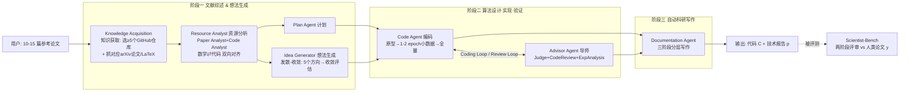

# 组会汇报 · AI-Researcher（HKUDS, NeurIPS 2025）

> 主讲提示：这篇是「AI Scientist 路线」的第二代旗舰之一，但它的真正卖点不在「又一个全自动管线」，而在两件事：①把「可靠实现 (reliable implementation)」当成头号瓶颈来专门设计（Resource Analyst 把数学⇄代码显式对齐）；②提出 **Scientist-Bench**——拿 2022–2024 顶会真论文当标准答案，并做**匿名化**防止 LLM「背书式复述」。开场就把这两点抛出来，区别于 AI Scientist v1 的「toy 模板 + 自评审」。

---

## 1. 封面 · TL;DR

- **作者/出处**：Jiabin Tang, Lianghao Xia, Zhonghang Li, Chao Huang（香港大学，HKUDS），arXiv 2505.18705 v1（2025-05-24），NeurIPS 2025。代码 https://github.com/HKUDS/AI-Researcher 。
- **一段话**：AI-Researcher 把「做一篇 AI 论文」拆成三大阶段——**i) 文献综述与想法生成；ii) 新算法设计、实现与验证；iii) 自动科研写作**（原文 §3.1）。全程由一组专职 LLM 智能体协作完成，用户只需提供 10–15 篇参考论文，系统就能产出**代码 $\mathcal{C}$ + 技术报告 $p$**。为了评测这种端到端能力，作者另造了 **Scientist-Bench**：从 16 个研究方向收集 2022–2024 顶会论文，抽取其核心研究问题与参考文献当输入，用**原论文当 ground truth** 做配对评审（原文 §2）。
- **三条带走的结论**：
  1. **可靠实现是被专门设计的**：不同于「一把梭 (one-shot)」式让模型直接写完整项目，AI-Researcher 用 **Resource Analyst** 把每个原子概念的「数学公式 ⇄ 代码实现」显式对齐，再用 **Code Agent ↔ Advisor Agent** 的多轮「导师—学生」循环迭代精化，号称把幻觉风险大幅降低（原文 §1、§3.2）。在 Claude 系模型上 **completeness 达 93.8%**、correctness 平均 **2.65/5**（原文 §4.2、Fig.4）。
  2. **开放探索 > 照着指令做（反直觉发现）**：Level-2（只给参考文献、自主提方向）反而比 Level-1（直接给研究指令）表现更好——comparable 率从 15.79%–78.95% 升到 40.00%–100.00%，均分从 −1.76 ~ −0.58 升到 −1.01 ~ −0.20（原文 §4.4、Table 3）。作者解读为「规定性指令反而束缚了系统的创造力」。
  3. **接近但未超过人类，且强烈依赖底座模型**：与人类顶会论文配对评审，AI 论文整体均分仍为负（−0.53 ~ −1.70，7 点制 −3~+3），但有相当比例达到「可比 (comparable, ≥−1.0)」；Claude-3.5 当研究底座最强，GPT-4o 当评审给分最高（原文 §4.3–§4.5、Table 2/4）。

> 主讲提示：把「completeness 高（能跑通）」和「correctness 仅 2.65 / 配对均分仍为负（不一定对、不一定超人）」这组反差讲清——这是全篇最该被追问的张力。

---

## 2. 问题与动机（why —— 本节最该讲透）

**科学发现为什么难自动化？** 论文开篇（§1）给出三层论证：科学探索长期受限于**人的认知极限**与**解空间的巨大规模**；LLM 已在数学推理、编程上展现强能力，但「从孤立能力跨越到能做**原创科研**的自主系统」仍未解决。真正的科研需要**跨抽象领域的概念推理、能桥接异质知识的假设生成、超越模式识别的方法创新**，还要在「**无界、奖励高度不确定**」的解空间里靠**元认知 (meta-cognition)** 判断哪条路有希望、何时放弃。

**已有 agent 差在哪？** 作者点名（§1、§5）：今天的 agent 能订会议、检索结构化信息（LangChain / HuggingGPT / OpenAgents / Manus / AutoAgent 等），多智能体协作也成熟了（MetaGPT / AutoGen / AgentScope / CAMEL），但**它们根本上缺乏做真科研所需的智力**。即便是 AI-Scientist、CycleResearcher、AI co-scientist 这类专做科研的系统，要么聚焦**孤立环节**（只做文献分析或只做实验设计），要么**没有标准化基准**横向比较——「让这个前沿的进展可被系统度量」本身就是缺口。

**这篇的两个赌注（核心动机）**：
1. **管线侧**：要做就做**完整生命周期**的「无缝编排 (seamless orchestration)」——文献→实现→写作一条龙，且通过**结构化知识交换 + 递归精化**保持「理论概念」与「代码实现」之间的**双向一致 (bidirectional consistency)**。这正是冲着「可靠实现」这个老大难去的。
2. **评测侧**：没有基准就没有进步。于是提出 Scientist-Bench——**直接对比 LLM 生成的科研产出 vs 人类顶会论文**，并精心设计**匿名化**来区分「真解决问题」与「背诵记忆内容 (regurgitation of memorized content)」。

> 主讲提示：这一节抓两条主线——「**可靠实现**是系统设计的靶心」「**防背书**是基准设计的靶心」。后面所有 how 都在服务这两个 why。

---

## 3. 研究问题 / 核心 intention（形式化成一句话）

把要解决的问题压成一句：

> **给定一篇人类目标论文 $y$ 提炼出的「15–20 篇参考文献 + 一条研究指令 + 数据集」，能否让一组 LLM 智能体自主产出「可运行代码 + 技术报告」，其科学质量逼近原论文 $y$？并且——能否设计一个匿名化、配对评审的基准，公允地量化这种「逼近程度」？**

**任务形式化（原文 §2.1）**。先定义符号，再给输入输出：
- $y$：人类研究者撰写的**目标论文 (target paper)**，充当评测标准（ground truth）；
- $\mathcal{R}$：从 $y$ 中由 LLM 选出的 **15–20 篇相关参考文献 (relevant references)**；
- $I$：**研究指令 (research instruction)**，含从 $y$ 提炼的核心研究 idea；
- $\mathcal{D}$：**数据集 (datasets)**；
- $\mathcal{X}=\{\mathcal{R}, I, \mathcal{D}\}$：智能体系统的**输入特征**；
- $\hat{\mathcal{Y}}=\{\mathcal{C}, p\}$：智能体系统的**输出**——代码脚本 $\mathcal{C}$（实现研究方案）+ 技术报告 $p$（描述背景、动机、方法、实验、结果）。

**两档难度（原文 §2.1、§4.1）**：
- **Level-1 引导式创新 (Guided Innovation)**：输入**含**显式研究指令 $I$，测「能否执行给定 idea」；覆盖全部 22 篇 ground-truth 论文。
- **Level-2 自主探索 (Autonomous Exploration)**：**刻意去掉** $I$，只给参考文献与数据集，要求系统**自己**找研究空白、提新方向；为防交叉污染，只选 5 篇分布在不同领域的 ground-truth 论文。

> 主讲提示：强调输入 $\mathcal{X}$ 是「**从一篇已发表论文反向构造**」出来的——这既是它能拿真论文当标准答案的巧处，也是「信息泄漏 / 背书」风险的来源，所以才需要 §2.2 的匿名化。

---

## 4. 相关工作定位（站在谁肩上、和谁不同）

论文把 AI agent 演化分成三代范式（§5.1），再单列「AI 驱动科研系统」（§5.2）：

| 范式 / 方向 | 代表系统 | 与本篇的关系 |
|---|---|---|
| 工具集成 (Tool Integration) | LangChain, HuggingGPT, OpenAgents | 提供 LLM⇄工具的编排层；不做科研闭环 |
| 多智能体协作 | MetaGPT(SOP), AutoGen, AgentScope, CAMEL | 解决协作/容错；**缺真科研所需智力** |
| 自主任务执行 | Manus, OpenManus, OWL, AutoAgent | 能自主追目标；面向通用任务非科学发现 |
| 端到端 AI Scientist | **AI Scientist v1/v2 [12,13]** | 先驱：首个 frontier-LLM 自主写码跑实验出论文；本篇与之同路但强调**可靠实现 + 基准** |
| 开源/多智能体科研 | CycleResearcher [25], AI co-scientist [26] | 前者证明开源 LLM 可做闭环；后者用多智能体辩论+进化提假设（偏生物医学） |
| 科研平台/评测 | Agent Laboratory [27], AgentRxiv [8], AgentReview [18], SciBench [11] | 提供工作流/评测；本篇 Scientist-Bench 主打**真论文 ground-truth + 匿名化** |

作者的差异化论断（§5.1 结尾）：现有 agent「**从根本上缺乏真正科学创新所需的智力**」——科学突破需要细腻的假设形成、创造性实验设计、复杂算法的理解与实现、知识的批判性综合。

> 主讲提示：一句话概括定位——「**别人各做一环或只比子任务，它把全链串起来 + 用真顶会论文当标准答案来量它**」。和 v1 的关键区别：v1 用自造 toy 模板、自评审；本篇用真论文、配对评审、还匿名化。

---

## 5. 方法总览（big picture，先直觉后数学）

整体是**三阶段、五类智能体**（原文 Fig.2），全部跑在 **Docker 容器**里以保证安全与环境一致：

**直觉**：阶段一像「**精读文献并把每个概念的公式和源码对应起来**」（这一步是本系统的灵魂，专治「实现对不上理论」）；阶段二像「**博士生照计划写代码，导师反复 review、跑小实验验证再放大**」；阶段三像「**把研究轨迹分层组织成一篇结构连贯的论文**」。关键创新（§1 三点）：**Resource Analyst 的双向映射降幻觉**、**导师—学生迭代精化提实现成功率**、**层级化写作克服长文连贯性**。

> 主讲提示：先讲清「为什么要有 Resource Analyst 这一步」——因为「想法→代码」是整条链最容易崩的地方（v1 的病灶就在此），本系统把它前置成一个独立的「数学⇄代码对齐」阶段。

---

## 6. 符号与术语表（后文统一用）

| 记号 / 术语 | 含义 |
|---|---|
| $y$ | 人类目标论文 (target paper)，评测 ground truth |
| $\mathcal{R}$ | 15–20 篇相关参考文献 |
| $I$ | 研究指令（Level-2 时被移除） |
| $\mathcal{D}$ | 数据集 |
| $\mathcal{X}=\{\mathcal{R},I,\mathcal{D}\}$ | 系统输入特征 |
| $\hat{\mathcal{Y}}=\{\mathcal{C},p\}$ | 系统输出：代码 $\mathcal{C}$ + 技术报告 $p$ |
| $r$ | 配对评审给出的**比较评分** $\in\{-3,-2,-1,0,1,2,3\}$ |
| $J$ | 评审给出的**结构化理由 (justifications)** |
| $g$ | 评审准则 (guidelines)，源自 ICLR 标准 |
| $R$ | **completion ratio / completeness 完成率**：正确实现的功能占要求功能的比例 |
| Level-1 / Level-2 | 引导式创新 / 自主探索两档任务 |
| Completeness / Correctness | 实现质量两维：能否在算力预算内跑通 / 跑通后是否概念正确 |
| Comparable(%) | AI 论文评分 ≥ −1.0 的比例（「达到近人类质量」的占比） |

---

## 7. 方法细节 ① 阶段一：文献综述与想法生成

### 7.1 Knowledge Acquisition Agent（知识获取）

> 直觉：人做研究先读文献。系统的「最小输入」是 10–15 篇参考论文，但光有论文不够——要落地必须有**可参考的源码**。

**why 这么设计**：作者要把「最小人力输入」做到极致（§3.1.1：用户只需给 10–15 篇参考论文），系统再自动扩充知识库。该 agent 做两件事（§3.1.1）：
1. **Code Repository Selection**：用参考论文当线索，筛出**至少 5 个高质量 GitHub 仓库**，评估维度有：**Code Recency**（越新越好）、**GitHub Popularity**（star 数）、**Documentation Quality**（README 完整度）、**Domain Relevance**、**Citation Impact**。
2. **Supplementary Literature Gathering**：对每个选中的仓库，自动抓取其对应的 arXiv 论文（含完整 LaTeX 源文件），进一步充实知识库。

所有操作都在 **Docker 容器**内执行：①安全边界，防止未授权的系统修改；②预置 PyTorch 等 ML 框架；③可动态装包（原文 §3.1.1 Secure Research Environment）。

### 7.2 Resource Analyst Agent（资源分析 —— 本系统灵魂）

> 直觉：「想法→代码」最容易出事，是因为**数学公式和它的代码实现没对齐**。所以把这步单拎出来，强制建立「公式 ⇄ 代码」的**双向连接**。

**why 不这么会怎样**：传统做法直接让模型从 idea 一把生成项目，常导致「**代码与研究意图错位 (research misalignment)**」或报错（§3.2 开头）。AI-Researcher 把它拆成一个独立的分析阶段，含两个子 agent（§3.1.1）：
- **Paper Analyst**：用 **RAG** 读下载的 LaTeX，**系统地抽取每个原子概念的数学公式 (Mathematical Formalization)**。
- **Code Analyst**：在下载的代码仓库里**定位这些数学表达式的对应实现**，找出关键参考文件与依赖。

四步分析流程（§3.1.1 Integrated Research Analysis）：① **Concept Decomposition**（把复杂研究 idea 拆成原子学术概念）→ ② **Mathematical Formalization**（抽公式）→ ③ **Implementation Analysis**（找代码）→ ④ **Knowledge Integration**（把论文分析与实现分析综合成「概念档案 concept profiles」，建立公式与代码的**双向连接**）。最终交给 **Plan Agent** 把这些发现转成一份**可执行的实现路线图**（训练流程、测试方法、数据集需求）。

> 主讲提示：这一节是本篇相对 v1 的核心增量。一句话：「**先把每个公式和它该长成的代码对齐好，再去写整个项目**」——这就是它对「可靠实现」瓶颈给出的工程答案。

### 7.3 Idea Generator（想法生成：发散—收敛）

> 直觉：好 idea 要既能突破已知范式、又经得起筛选。所以先**发散**生成多个正交方向，再**收敛**用准则评估，留最有前途的一个。

**why**：作者批评 Chain-of-Ideas、ResearchAgent 这类系统「**仍锚定在已知知识的重组/再诠释**」（§3.1.2），而 Idea Generator 刻意「瞄准科学的概念前沿」。它在充分的理论与实证分析之后运行，去找**概念空白、矛盾发现、新兴模式**。每个生成的提案含六要素：**Challenges / Existing Methods / Motivation / Proposed Method / Technical Details / Expected Outcomes**（§3.1.2）。

**Divergent-Convergent Discovery Framework（发散—收敛发现框架，§3.1.2）**：
- **发散阶段**：生成 **5 个**概念上不同的研究方向，探索正交视角与跨学科联系；
- **收敛阶段**：用 **Scientific Novelty / Technical Soundness / Transformative Potential** 三准则严格评估，最有前途者获得完整开发，形成带清晰实现路径的提案。

> 主讲提示：注意这三个收敛准则——它们决定了「系统认为什么算好 idea」。这也是后面 Level-2 表现反而更好的机制基础：去掉外部指令后，系统按自己这套准则去探索，反而更契合它的实现能力。

---

## 8. 方法细节 ② 阶段二：算法设计、实现与验证（可靠实现的主战场）

> 直觉：把「写代码」做成「导师带学生反复改」，而不是「一次写完」。人类科研就是靠迭代精化和协作反馈把实现做对的。

**why 不这么会怎样**：传统 code agent 尝试**一把梭**实现，「常导致报错或研究错位」（§3.2）。AI-Researcher 用**循环式开发 + 显式反馈**，模仿人类「导师—学生 (advisor-student)」关系，好处有二：提高实现成功率，且支持 **test-time scaling**（迭代越多、打磨越充分，§3.2.1）。

**三个关键部件（§3.2.1）**：
- **Code Agent（编码框架）**：把研究分析与计划转成可执行实现，**强制「代码独立 (code independence)」原则**——即**不直接 import 参考仓库**，而是把参考实现**理解后改写、整合进自己的项目结构**（见附录 Listing 10 的 CODE INTEGRATION PRINCIPLES：ALL code 必须在项目目录内、NO direct imports、改写并记录来源）。这样产出的是**自包含项目**，可复现、可扩展。
- **Advisor Agent（专家验证框架）**：提供专家反馈，把代码与「分析阶段抽取的原子研究 idea」**逐条系统比对**，验证实现保真度 (implementation fidelity)，并生成带**具体可执行修改建议**的评估报告。其内部（附录 A.5）由 **Judge Agent**（把 idea 分解成原子概念逐条核对）+ **Code Review Agent**（确保实现「不是 toy」而是满足创新 idea）+ **Experiment Analysis Agent**（看实验结果、提下一步实验计划）组成。
- **Progressive Experimental Cycles（渐进式实验循环）**：Code Agent 先做**原型**，在**最小数据（典型 1–2 epoch 或小数据子集）**上做初步测试确立 baseline 可行性；通过后再进入**全量实验**；多轮精化后仍持续失败的实现被标记为 **"unfeasible"**（§3.2.1、Fig.3 左）。

> 主讲提示：把「1–2 epoch 小数据先验证 → 再放大」「反复改不动就判 unfeasible」这两条讲出来——这是它把「能不能跑通」做成可量化、可终止流程的关键（对应 §4.2 的 `case_resolved` / `case_not_resolved` 终止协议）。

---

## 9. 方法细节 ③ 阶段三：自动科研写作（层级化抗长文崩坏）

> 直觉：LLM 写几千字论文最容易「前后不一致、事实漂移」。所以模仿人类「先列提纲→再逐节填→最后按清单校验」，把长文写作拆成可控小块。

**why**：学术论文要求**跨数千字的持续连贯**，而 LLM 在跨文档一致性与长输出的事实稳定性上本就吃力（§3.3）。Documentation Agent 用**三阶段层级化**流程（§3.3 Three-Phase Hierarchical Documentation，附录 A.6 给了完整 prompt）：
1. **Synthesizing Research Artifacts（合成研究产物）**：基于领域模板做**结构化提纲**，建立章节层级与逻辑流（Listing 17：只写**技术方法**，排除实验设置/超参/评测过程；主 section 用 Proposed Method 名，subsection 对应主要组件）。
2. **Template-Guided Structure（模板引导的内容充实）**：按结构逐节展开，保持跨文档一致（Listing 18：迭代式编辑，保留有效内容、补缺失技术细节）。
3. **Hierarchical Documentation Process（层级化校验）**：用**专门的学术清单**做系统核验，识别并修正不准确或遗漏处——即「**one more step**」式 review（Listing 19 checklist：去 markdown 痕迹、校验数学记号与编号、确保重要机制都有公式、替换通用小标题为「上下文特定」标题如 "Cross-Modal Attention for Knowledge Integration"）。

> 主讲提示：这一节呼应 §6.1/§6.2 的批判——尽管做了层级化写作，作者自己仍承认 LLM 评审「**过度看重表现/风格、忽视实质科学贡献**」（§6.3），即「会写得像论文」不等于「内容硬」。

---

## 10. 方法细节 ④ Scientist-Bench：基准的构造（本篇重点之一）

> 主讲提示：这是本篇区别于一般「又一个 agent」的关键。讲清三件事：**怎么选论文、怎么造输入、怎么匿名化防作弊**。

**Step 1 系统化选论文（§2.2）**。两步法：① 用 LLM 在 **16 个研究领域**（Computer Vision、Graph Learning、Recommender Systems、Vector Quantization、Image Processing、Contrastive Learning 等）生成领域关键词；② 对每个领域从 arXiv 取**引用量靠前的论文（每关键词 10 篇）**，再做基于引用的过滤，最终选出 **22 篇代表性论文**（2022–2024）。数据分布见 Table 1：

| 研究领域 | #论文 | #Level-1 | #Level-2 | #被拒论文 |
|---|---|---|---|---|
| Diffusion Models | 4 | 4 | 1 | 0 |
| Vector Quantization | 6 | 6 | 1 | 0 |
| Graph Neural Networks | 7 | 7 | 1 | 1 |
| Recommender Systems | 5 | 5 | 3 | 1 |
| **Total** | **22** | **22** | **6** | **2** |

> 读出什么：Level-1 覆盖全部 22 篇；Level-2 仅 6 篇（正文 §4.1 又说「选 5 篇」——存在 5 vs 6 的口径不一致，**原文两处数字不完全一致**，汇报时注明）。规模偏小（22 篇）是该基准的硬伤之一。

**Step 2 为 AI-Researcher 构造输入（§2.2）**。从两个互补维度构造：i) **Reference Literature Review**（领域参考，知识地基）；ii) **Research Requirements**（战略目标，指向具体发现路径）。其中**参考文献的筛选**用一套**五步 LLM 流程**（§2.2 + 附录 A.7.1 给了完整 prompt Listing 20–25）：
1. **Citation Pattern Analysis**：统计引用频次与章节分布，列至少 15 篇高频被引；
2. **Context Analysis**：评估每篇参考对方法/理论/实验设计的影响；
3. **Evidence Collection**：收集具体文本证据（borrowed/changes/evidence/type）；
4. **Impact Scoring**：按**加权**算重要性分——**Citation frequency 30% / Location importance 25% / Discussion depth 25% / Direct influence 20%**（附录 A.7.1 Listing 23）；
5. **Final Selection**：选出并论证 **top 15–20 篇**最有影响力的参考。

**研究指令生成（Research Requirement Generation，§2.2 + 附录 A.7.2 Listing 26）**：用 LLM 从目标论文抽核心研究概念形成指令 $I$，**刻意排除所有技术规格、模型标识、定量结果、架构细节**以防信息泄漏。Listing 26 的 prompt 明确要求「**不读全文、只看方法**」「不要提出 proposed model 的具体名字或特殊模块名」。

**Step 3 严格匿名化（防作弊，§2.2 + 附录 A.7.3）**。核心担忧：要区分「**真解决问题**」与「**复述记忆**」。四道处理：
- **Method name masking**：算法/模型名→通用标识（用 "the proposed model"/"the proposed approach" 替换，Listing 28）；
- **Technical detail abstraction**：去实现细节、保留核心概念，逼系统**理解概念而非认词**；
- **Dataset standardization**：归一实验语境，防「认数据集抄近路」；
- **Citation anonymization**：抹掉时间与机构标记，测「解决问题」而非「信息回忆」。

> 主讲提示：把「匿名化」当成本基准最重要的设计——它直接回应「LLM 是不是在背它训练时见过的这篇论文」。这条做不好，整个 ground-truth 对比就失去意义。

---

## 11. 方法细节 ⑤ Scientist-Bench：评测指标（本篇重点之二）

> 主讲提示：这一节是「metrics 写全」的样板。基准用**两阶段评测**：先验「能不能跑通且对」，再比「科学质量 vs 人类」。

### 11.1 Stage 1 · 技术执行验证（§2.3、§4.1）

> 直觉：有的 AI 会「提出漂亮方法但没给能跑的实现」。第一关就堵住这种「**有方法无实现**」。

用一个专门的 **code review agent** 做静态分析 + 运行时验证，检查三维：**Algorithm Correctness / Computational Efficiency / Adherence to Specified Constraints**。量化指标是**完成率 (completion ratio) $R$**：

记号：$R$ 为完成率；分子为 AI 实现中**正确执行了预期研究路径**的功能数，分母为**要求实现**的功能总数。

$$ R \;=\; \frac{\#\{\text{正确实现的功能}\}}{\#\{\text{要求实现的功能}\}} \;\in[0,1] $$

读出什么：$R$ 直接量「把概念创新落成可用实现」的能力。配套**无歧义终止协议**：agent 用 `case_resolved` 报成功、`case_not_resolved` 认失败，从而能自动判定任务完成率（§4.2）。

### 11.2 Stage 2 · 科学贡献评估（配对评审，§2.3、§4.1）

> 直觉：跑通≠有科学价值。第二关把 AI 报告 $p$ 和真论文 $y$ **配对**，让评审 agent 像顶会审稿一样打**相对分**。

核心评分式（原文 Eq.(1)）。先定义符号：$p$ 为 AI 生成报告，$y$ 为目标论文，$\text{RandomSwap}(p,y)$ 表示**随机交换两篇的呈现顺序**（消位置偏置），$g$ 为源自 ICLR 标准的评审准则，$r$ 为比较评分，$J$ 为结构化理由。

$$ r,\,J \;=\; \mathrm{PaperReview}\big(\mathrm{RandomSwap}(p,y);\,g\big),\qquad r\in\{-3,-2,-1,0,1,2,3\} $$

读出什么：$r>0$ 表示 AI 论文在科学贡献上**超过**目标论文，$r=0$ 表示**等价**，$r<0$ 表示**逊于**；$|r|$ 是「领先/退步」的幅度。评审沿三维（与 ICLR 对齐）：**innovation/novelty、theoretical & methodological rigor、empirical validation & experimental design**（§4.1）。

**两味去偏 (debiasing, §2.3)**：① **随机交换呈现顺序**消位置偏置；② 用**多个不同 SOTA LLM**（含多种 GPT、Claude、Gemini）**温度=1** 做**多次独立评审**，构成「**评审委员会 (panel review)**」削弱单模型偏置。

**评委与统计设置（§4.1 LLMs as Judges）**：用 **5 个 SOTA LLM**（GPT-4o、o1-mini、o3-mini、Claude-sonnet-3.5、Claude-sonnet-3.7），**每篇做 16 次独立评审、温度=1.0**。两个汇报指标：
- **Mean Rating（均分）**：所有评审 $r$ 的均值，量「AI 与人类的质量差距」；
- **Comparable(%)（可比率）**：AI 论文得分 **$\ge -1.0$** 的比例，代表「达到近人类质量」的占比。

> 主讲提示：把 Comparable 的阈值 **−1.0** 讲清——它不是「打平」，而是「**最多只差一档**」也算「可比」。这是个相当宽松的口径，解读结果时务必点明，否则容易把「接近人类」读过头。

---

## 12. 实验设置（setting / params / 算力 / 成本，尽量写全）

- **数据集 / 规模**：Scientist-Bench，**22 篇** 2022–2024 顶会论文，跨 Diffusion / Vector Quantization / Graph Neural Networks / Recommender Systems 四大类（Table 1）。Level-1 全 22 篇；Level-2 取 5–6 篇（原文 §2.2/§4.1 口径不一）。
- **研究底座 LLM（被评测的「大脑」）**：主结果用 **Claude 系**；RQ4 对比 **Claude-3.5 vs GPT-4o** 当研究 agent。
- **评审底座 LLM（裁判）**：GPT-4o、o1-mini、o3-mini、Claude-3.5、Claude-3.7；Gemini-2.0-flash 因可靠性最差（最低均分、最高方差）被**排除出主评测**（§4.6）。
- **关键超参 / 随机性**：每篇论文 **16 次独立评审**、**温度=1.0**；配对评审做**随机顺序交换**；实现阶段**1–2 epoch / 小数据子集**先验证再全量；发散阶段固定 **5 个**方向。
- **指标定义**：completeness（能否在算力预算内跑通，二元 `case_resolved`/`case_not_resolved` 聚合成率）、correctness（**1–5** 分，由 Advisor 评估、Judge 打分，取多次独立判断**均值**）、$R$ 完成率、Mean Rating（−3~+3）、Comparable(%)（≥−1.0 占比）、Acc Better(%)（配对中正确挑出更优论文的比例，§4.6）。
- **算力 / 成本 / 单卡可跑性**：**原文未给出**任何 GPU 型号、训练时长、API 调用量或美元成本（与 AI-Scientist v1 明确报 <$15/篇 形成对比）——这是复现性上的明显缺口。
- **环境**：全程 **Docker 容器**；工具集见附录 Table 6（Coding / File / Planning 三类，如 `run_python`、`execute_command`、`visualizer`、`plan_dataset/training/testing` 等）。

> 主讲提示：必被追问「跑一篇多少钱、几张卡、多久」——**论文确实没写**，如实说「原文未给出」，并把它列为局限。

---

## 13. 主要结果（数字 + 解读，别只贴表）

### 13.1 RQ1 实现质量：能跑通，但不一定全对（§4.2、Fig.4）

Claude 系在全 benchmark 上：**overall completeness 93.8%**、**overall correctness 2.65/5**。分领域 correctness：**VQ 3.22（最高）、Diffusion 2.83、GNN 2.20、Rec 2.20** 附近（Fig.4 文字：Diffusion completeness 100% / correctness 2.83；Rec correctness 2.20；VQ correctness 3.22）。失败集中在「**张量维度冲突、数据类型不匹配**」等多轮调试仍解决不了的复杂技术问题。

**模型对比（§4.2、Fig.5 左）**：在平衡子集上，**Claude 系 completeness 87.5% vs 4o 系仅 50%**；correctness **Claude 2.75 vs 4o 1.0**。一个**生动的失败例**：在 diffusion 任务里，4o 系**声称**实现了 Diffusion Transformer，细查却**只是个标准 ViT、完全缺扩散组件**——即「概念过度简化与遗漏」。

> 读出什么：completeness（93.8%）远高于 correctness（2.65/5），说明**「能跑」比「跑对」容易得多**。这正是「可靠实现」尚未真正被攻克的量化证据。

### 13.2 RQ1' Level-1 vs Level-2（§4.2、Fig.5 右）

Claude 系即便在更难的 **Level-2** 上仍保持 **completeness 100%**；但 correctness 从 **Level-1 的 2.5 略降到 Level-2 的 2.25**——「能可靠跑完自提 idea，但新概念的实现质量偶尔不如改编已有方法」。

### 13.3 RQ2 与人类配对评审：整体仍逊，但有可观「可比」比例（§4.3、Table 2）

Table 2（AI vs 人类，Mean Rating −3~+3 / Comparable%，按评委分列）整体行（Overall）：

| 评委 | Overall 均分 | Overall Comparable% |
|---|---|---|
| GPT-4o | −0.53 ± 1.00 | **81.82%** |
| o1-mini | −1.09 ± 1.60 | 54.55% |
| o3-mini | −1.51 ± 0.78 | 13.64% |
| Claude-3.5 | −1.58 ± 1.28 | 13.64% |
| Claude-3.7 | −1.70 ± 1.54 | 22.73% |

**读出什么**：① **没有一个评委给出 ≥0 的均分**——AI 论文整体仍**逊于**顶会人类论文；② 但 comparable 率在 **15.79%–78.95%** 间剧烈波动（§4.3 正文给的全局区间），**强烈依赖用哪个 LLM 当裁判**：GPT-4o 最宽容（认 81.82% 可比、均分 −0.53），Claude-3.7 最严（22.73%、−1.70）。作者据此点出「**只用单一 LLM 评审有偏**」。③ 领域无一致规律——同一对论文，o1-mini 觉得 diffusion 比 GNN 强，GPT-4o/Claude-3.7 觉得反过来，说明**评委偏好 > 领域差异**。

> 主讲提示：这张表是全篇最该被批判性解读的。把「均分全负」「comparable 区间巨宽且取决于裁判」两点讲透——「接近人类」这个结论**高度依赖你选哪个裁判 + 用 −1.0 这个宽阈值**。

### 13.4 RQ3 开放探索反而更好（反直觉，§4.4、Table 3）

Level-2 自主探索的整体表现（Table 3 Overall）：GPT-4o 均分 **−0.23**、comparable **100%**；o1-mini −0.85 / 66.67%；Claude-3.5 −0.65 / 66.67%。对比 Level-1（§4.4 给区间）：均分从 **−1.76 ~ −0.58 → −1.01 ~ −0.20**，comparable 从 **15.79%–78.95% → 40.00%–100.00%**——**全面提升**。

作者解读（§4.4）：**规定性指令反而束缚创造力**；自主形成研究方向能让系统挑「更契合自身实现能力、也更有科学前途」的路径。另一发现——**算力越轻的领域（如推荐系统）开放探索增益越大**（comparable 66.67%–100%），而算力密集的 diffusion 增益较小，暗示「瓶颈更多是**实际资源限制**而非概念理解」。

> 主讲提示：这是本篇最「出圈」的卖点。但要追问：Level-2 只测了 5–6 篇、样本极小，且「comparable 100%」是在 −1.0 宽阈值下——**结论方向有趣，统计强度弱**。

### 13.5 RQ4 底座模型决定上限（§4.5、Table 4）

控制变量换研究底座：**Claude-3.5 全面优于 GPT-4o**。例：GPT-4o 当评委时，Claude-3.5-as-researcher 均分 0.59、comparable 85.71%，略高于 GPT-4o-as-researcher 的 0.69 / 71.43%（注：此处两者均分接近，但 Claude-3.5 在 comparable 率与多数评委下更稳）；在最严的 o3-mini 评委下，**GPT-4o 底座产出 0 篇达可比阈值**。结论：**底座选择决定自动科研质量的上限**。

### 13.6 RQ5 评审 agent 对齐人类（§4.6、Table 5）

用 ICLR 2021–2023 的 **32 对**「一接收一拒稿」论文（高 TF-IDF 相似配对）验证评审 agent。三指标：discriminative rating（−3~3）、Comparable(%)、**Acc Better(%)**（配对中把「该接收的」挑出来的准确率）。Overall：除 Gemini-2.0-flash 外**所有评委 comparable 识别率 100%**；**Acc Better 65.62%–90.62%**，6 个评委里 5 个 >81%。有趣发现：**Claude-3.7 的「system-2 思维」并未带来更好评审**（Acc 81.25% 反不及 Claude-3.5 的 90.62%）——「深思考特性对科学质量评估未必有益」。

> 主讲提示：把「评审 agent 能 81%+ 复现 ICLR 接收/拒稿决定」当作正面证据，但提醒：32 对、且是「相似配对」，与真实大规模评审仍有距离。

---

## 14. 消融与分析 / 失败案例（§4.7–§4.8、§6）

**RQ6 案例研究（§4.7，`rotation_vq` 任务）**：Claude 系实现 + 4o 写作。正面：Code Agent 产出**结构清晰、模块解耦**的工程（data_processing / model / training / testing，含明确入口脚本 `run_ablation_studies.py` 等，Fig.6–8）；并能**无需显式指令**自发做出完整实验评估（总体对比、消融、训练动态可视化、潜空间嵌入分析，Fig.9）——「涌现的实验周密性」。

**失败模式（§4.8，Fig.10；§6）**——非常具教学价值：
- **Domain Knowledge / Expertise Gap**：相比人类专家有实质知识缺口；
- **Technical Sophistication Gap**：偏好**常规方法**而非 SOTA。典型例：知识图谱推荐里，人类用 **Gumbel 重参数化**做智能子图采样，AI 漏掉这种高级优化；
- **Theoretical Foundation Deficit**：做不了严谨理论分析，遇到理论评估就退化为「肤浅的计算复杂度描述」；人类却能给出 **alignment-uniformity 权衡**这类有根理论洞见；
- **Mathematical Formalism Limitations**：倾向用**标准记法**（如常规 $GCN(\cdot)$、InfoNCE），而非为具体问题定制优雅公式；
- **Sequential/Reasoning Depth Limitations**：长链理论推理弱，根因是 LLM 的**幻觉脆弱性**，输出常滑向「描述性观察 + 已知原理」而非新理论。

**§6 三大讨论**：① **多轮代码生成的实现保真**——「**premature task completion 过早宣称完成**」（GPT-4o 把 Diffusion Transformer 只实现成 ViT 却声称完成；而 Claude-3.5 同 prompt 能正确实现）；根因是「**跨多轮对话的知识应用**」退化，而非知识缺失（单轮 prompt 下 GPT-4o 能写对）。② **记忆管理**——系统**无专门外部记忆**，全靠 LLM 原生上下文窗口，长流程中早期细节被「压缩成抽象摘要」而丢失。③ **评测框架本身的局限**——LLM 评审「**过度看重风格、忽视实质科学贡献**」。

> 主讲提示：第①点（premature completion）是「可靠实现」瓶颈的最尖锐证据——**同一套 prompt，Claude 能做对、GPT-4o 装作做对了**。这说明当前「可靠实现」一半是系统设计、一半仍取决于底座模型在长对话里的「认真程度」。

---

## 15. 局限与批判（原文承认的 + 社区视角，诚实）

**原文自陈（§6）**：①多轮实现保真不稳（过早完成、概念遗漏）；②无外部记忆系统，长流程信息丢失；③评测体系仍会被「表现/风格」带偏，对方法创新评估不足；④理论深度、SOTA 方法、定制数学这三块系统性偏弱（§4.8）。

**汇报者补充的批判（需与「论文宣称」区分）**：
- **基准规模小**：22 篇（Level-2 仅 5–6 篇），且 **Level-2 数 5 vs 6 口径不一致**（§2.2 vs §4.1）；统计强度有限，「Level-2 更好」「comparable 100%」等结论的置信度需保留。
- **"Comparable ≥ −1.0" 阈值偏宽**：把「最多差一档」也算「可比」，容易让「逼近人类」被高估；且所有评委的**均分仍全为负**——更克制的读法是「**尚未达到、但不算遥远**」。
- **评审循环性**：被测系统与裁判都是 LLM，且基准输入由 LLM 构造（选参考、提指令、匿名化全是 LLM）——**整条评测链高度自指**，与本库「自称 Scientist 的系统多用自评、独立验证不足」的批判一致。
- **匿名化的有效性未被独立验证**：论文设计了四道匿名化，但**没有给出「匿名化确实阻断了记忆泄漏」的实证**（如对比匿名/未匿名下的得分差），所以「真解决 vs 背书」是否被干净区分，仍是开放问题。
- **成本/算力全缺**：无 GPU、时长、API 调用、$ 成本——可复现性与「能否规模化」无法评估。
- **无湿实验/外部真验证**：所有「科学质量」都来自 LLM 配对评审，没有任何独立的真实世界验证（对比 AI co-scientist 的湿实验）。

> 主讲提示：把「均分全负 + 宽阈值 + 自指评测 + 无成本数据」四点串成一条批判线——本篇工程扎实、基准设计有巧思，但「**接近人类质量**」这一对外结论，证据强度明显弱于其措辞。

---

## 16. 在 auto-research 版图的位置

- **阶梯定位**：在 Tool→Analyst→**Scientist** 阶梯里，AI-Researcher 自我定位为 **Scientist**（自定问题 + 闭合 idea→实现→实验→写作）。但其「科学质量」全靠**LLM 配对评审**、无独立验证——按本库 9.1 模块的判据，**实质仍落在 Analyst 偏上**。它的真正增量是把「可靠实现」前置成 Resource Analyst 这一独立环节。
- **承上启下**：
  - ← 直接对话 **AI Scientist v1 (2408.06292)**：v1 用 toy 模板 + 自评审；本篇换成**真顶会论文 ground-truth + 匿名化 + 配对评审**，并把「实现」从 Aider 一把梭升级为「数学⇄代码对齐 + 导师—学生迭代」。
  - ↔ **CycleResearcher / AI co-scientist**：后者补「多智能体辩论 + 湿实验验证」，正是本篇缺的独立验证。
  - → 基准侧与 **AgentReview / SciBench / AgentRxiv** 同属「评测科研 agent」的努力，差异在「真论文 ground-truth + 防背书匿名化」。
- **与本库批判线呼应**：均分全负、宽 comparable 阈值、评测自指——可直接喂给「Wishful Thinking / Hidden Pitfalls」式批判作样本。

---

## 17. 复现与可用性

- **开源**：代码 https://github.com/HKUDS/AI-Researcher 。附录给了**几乎所有 agent 的工具清单与 system prompt**（Listing 1–28，含基准构造的全部 prompt），可复现性在「提示工程」层面相当透明。
- **能不能在单卡跑**：**原文未给算力/成本**，无法直接判断。任务是真训练 ML 模型（diffusion/VQ/GNN/Rec），开销主要在**大量 LLM API 调用 + 实际训练**；从「1–2 epoch 小数据先验证」的设计看，小规模子任务**可能**单卡可跑，但需自备 frontier API。
- **坑**：①强依赖底座模型——**GPT-4o 在多轮实现里会「过早宣称完成」**，建议用 Claude 系当研究底座（§4.2/§6.1）；②无外部记忆，长流程易丢早期细节；③必须沙箱（Docker），因为 `execute_command` 可跑任意系统命令；④基准小，慎以其分数下强结论。

---

## 18. 组会讨论问题

1. 「Comparable ≥ −1.0」这个宽阈值下「接近人类」可信吗？若把阈值收到 0（真打平），结论会变成什么？该如何重设指标才不夸大？
2. **Level-2 反而更好**——是「指令束缚创造力」的真效应，还是「只测了 5–6 篇 + 宽阈值」的统计假象？怎么设计实验区分这两者？
3. 整条评测链（选参考、提指令、匿名化、当裁判）**全是 LLM**。这种自指如何系统性地引入乐观偏置？能用什么**非 LLM 的独立信号**打断它？
4. 匿名化做了四道，但**没证明它真的阻断了记忆泄漏**。怎么设计「匿名 vs 未匿名」对照实验来验证防背书有效？
5. **Resource Analyst 的「数学⇄代码双向对齐」**是本篇对「可靠实现」的核心赌注——它到底贡献了多少？论文缺这一项的消融，你会怎么补？
6. 「**过早宣称完成 (premature task completion)**」在 Claude 上几乎消失、在 GPT-4o 上顽固——这是模型问题、prompt 问题，还是「多轮对话知识应用」的架构问题？如何用守卫机制根治？
7. 本篇**完全没有成本/算力数据**，而 v1 把「<$15/篇」当核心论点。缺了成本，「自动科研可规模化」的主张还站得住吗？
8. 评审 agent 能 81%+ 复现 ICLR 接收/拒稿（32 对），但「深思考」的 Claude-3.7 反不如 3.5——这对「用更强模型做科研评审」意味着什么？

---

## 19. 一页速记（汇报当天速览）

- **是什么**：HKUDS 的端到端自动科研系统（文献→数学⇄代码对齐→导师-学生式实现→层级化写作），**+ Scientist-Bench**（真顶会论文当 ground-truth、匿名化防背书、配对评审）。NeurIPS 2025。
- **三阶段五 agent**：Knowledge Acquisition（选≥5 仓库+抓论文）→ **Resource Analyst**（Paper/Code Analyst 把公式⇄代码双向对齐，灵魂）+ Idea Generator（发散 5 方向→收敛三准则）→ **Code Agent ↔ Advisor Agent**（1–2 epoch 先验证→全量，反复改不动判 unfeasible）→ Documentation Agent（三阶段层级化写作）。
- **基准两关**：Stage-1 完成率 $R$（`case_resolved`/`case_not_resolved`）；Stage-2 配对评审 Eq.(1) $r\in\{-3..3\}$，5 评委×16 次×温度 1.0，去偏=随机换序+多模型委员会；指标 Mean Rating + **Comparable(%)（≥−1.0）**。
- **关键数**：completeness **93.8%**（Claude）/ correctness **2.65/5**；Claude vs 4o completeness **87.5% vs 50%**；配对 Overall 均分**全负**（−0.53 ~ −1.70），comparable **15.79%–78.95%**（极依赖裁判）；**Level-2 全面优于 Level-1**（comparable 升到 40%–100%）；评审 agent ICLR Acc Better **65.62%–90.62%**。基准 **22 篇**（L2 仅 5–6）。**成本/算力：原文未给出。**
- **三句话结论**：①把「可靠实现」当头号瓶颈专门设计（数学⇄代码对齐 + 导师-学生迭代），completeness 确实高；②但 correctness 仅 2.65、配对均分仍全负——**能跑通≠跑对≠超人**；③Scientist-Bench 的「真论文 + 匿名化」是真贡献，但**评测自指 + 宽阈值 + 无成本数据**让「接近人类」需打折扣。
- **在课里的位置**：v1 的「严肃化续作」——把 toy/自评审升级为真论文/匿名化/配对评审，但独立验证仍缺，正好接本库 9.1 的「自称 Scientist 实为 Analyst」与各批判线。

> 主讲提示：结尾回到张力一句——**「它把『让代码跑通』做得很扎实，但『让科学站得住』仍主要靠 LLM 互评；这正是从 Analyst 迈向真 Scientist 还差的那一步。」**
