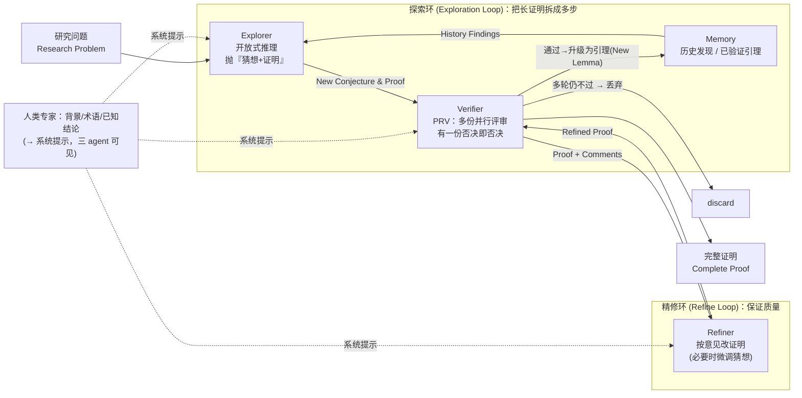

# 组会汇报 · AI Mathematician：迈向全自动前沿数学研究

> 本篇对齐 [`2408.06292-ai-scientist-v1.md`](2408.06292-ai-scientist-v1.md) 的结构，并按 v2 规范
> （[`_STYLE-GUIDE-v2-why-and-inspiration.md`](_STYLE-GUIDE-v2-why-and-inspiration.md)）补 **Why 三连** 与
> **`## ★ 对我们的启发`** 专节。标杆范文：[`2506.13131-alphaevolve-deepmind.md`](2506.13131-alphaevolve-deepmind.md)。
>
> **本篇阅读主线**：数学有一个别的科学没有的奢侈品——**「正确性原则上可验证」**。AlphaEvolve 用「机器可跑的 `evaluate`」把这条奢侈品兑现成进化的选择压力；本文想在**自然语言证明**上也兑现它，却发现**自然语言证明没有 `evaluate`**——于是退而求其次，用「**LLM 互相评审 + 取最严格的那个**」来近似。这个「近似」做得好不好、能不能算「正确性保障」，是全场最该被追问的点。

---

## 1. 封面 · TL;DR

- **标题**：AI Mathematician: Towards Fully Automated Frontier Mathematical Research（以 PDF 封面为准）
- **作者/机构**：Yuanhang Liu、Yanxing Huang、Yanqiao Wang、Peng Li、Yang Liu（**清华大学**计算机系 / AIR / 数学系 / 求真书院；通讯 Peng Li、Yang Liu），arXiv 2505.22451，**2025-05-28**。
- **权威性来源**：清华出品、**研究级（research-level）真实数学课题**（量子算法 / 吸收边界 / 高对比极限 / 均质化），并有**求真书院 Wenjia Jing 副教授**提供数学指导（致谢）。但请注意：**这是预印本、非顶会/期刊接收**，且全部结论为 **4 个定性案例**，无定量 benchmark——权威性主要来自「题目真、机构强」，**不来自「被独立验证的硬战果」**（与 AlphaEvolve 的 48 vs 49 形成鲜明对照）。

**这篇在干什么（一段话）**：AIM（AI Mathematician）想把「**做前沿数学研究**」这件事交给大推理模型（LRM）自动转起来。它把一个研究课题拆成**多步探索**：一个 `explorer` 围绕问题做开放式推理、抛出一串「猜想 + 证明」并存进 `memory`；一个 `verifier` 用**多份并行评审**审这些证明、只要有一份说错就打回（这套叫 **PRV，悲观合理验证**）；一个 `refiner` 拿着评审意见改证明，改完再送回 verifier，形成**验证-精修环**；通过的猜想升级为引理 (lemma) 回灌探索环，直到解决或到探索上限。作者在 **4 个研究级数学问题**上跑了它，**人工**用 `[Correct]/[Vague]/[Error]` 三色标注它产出的证明片段。

**3 条带走的结论**：
1. **它的赌注是「数学正确性可验证」，但兑现方式是 LLM 互评，不是形式化**。AlphaEvolve 有机器可跑的 `evaluate`；AIM **没有**——自然语言证明无法自动判真伪，于是用「**多评审取最差**（PRV）」模拟同行评审。这是**最大卖点也是最大软肋**：它把「可验证」从「机器证明」偷换成了「LLM 觉得对」（原文 §2.3 自承「我们目前缺乏验证自然语言证明的形式化方法」）。
2. **三色标注 `[Correct]/[Vague]/[Error]` 是人做的，不是系统做的**。论文的「证据」本质是**作者团队 + 数学家**对 AIM 输出的人工审阅结论（原文 §4 开头定义这套色标）。所以「AIM 基本证完了某定理」这类宣称，**信源是人评，不是任何自动判据**——读时务必把「系统能力」与「人工事后背书」分开。
3. **战果是「大段正确推理 + 不少漏洞」，且全靠专家收口**。4 题里 3 个是已被证明的定理、1 个是开放问题；AIM 能写出主干正确的能量估计、变分推导、两尺度展开，但**复杂度计算出错、唯一性证明用错方法、关键步骤缺细节**等问题反复出现。作者诚实地说：AIM 的证明「**在数学专家帮助下大多可修复**」「**经专家人工审阅前不能直接采信**」（原文 §5、Abstract）。

> 主讲提示：开场抛出全场张力——「数学是唯一**正确性可机器验证**的科学，本文却用 **LLM 互评** 来当验证器」。把这句和 AlphaEvolve 的「`evaluate` 可跑」并排，整场的批判线就立住了。记忆锚：**「取最差评审 (worst-of-N)」+「三色标注是人打的」**。

---

## 2. 问题与动机（why —— 本篇最该讲透的一节）

**问题层 why（为什么这事值得做）**：LRM（大推理模型，Large Reasoning Models）这一两年在数学**竞赛**上突飞猛进——原文 §1 给了一条清晰的能力曲线：2021 年 GPT-3 175B 在小学数学（GSM8K）上 <35%；2024 年初 SOTA 已能解 >50% 高中题、GSM8K ~90%；2024 年 LRM（o-系列、DeepSeek-R1）爆发；最新 o3/o4-mini 在 **AIME 2024/2025 上接近 100%**，几乎超越所有人类参赛者（引 OpenAI 2025）。**竞赛既然快被打穿，下一个边界自然是「前沿研究」**。

**为什么「竞赛强 ≠ 能做研究」——两道坎（原文 §1 明确列出）**：
- **坎 1：复杂度 (Complexity)**。前沿数学论文里，一个定理常要**几十页**的引理与中间步骤铺垫；竞赛题只要求几小时内完成**技巧性强但短**的证明。研究的复杂度还体现在**所需领域知识的广度**。
- **坎 2：程序性严谨 (Procedural Rigor)**。前沿研究主要处理**没有明确答案的证明题**，其正确性**依赖程序性严谨与大量人工评审**；而**我们目前缺乏被广泛接受、有效的「用自然语言评判一个证明对不对」的方法**。

**不解决会怎样**：你直接把研究级问题丢给单个 LRM，会得到「**结论错误、证明不严谨、缺乏所需 rigor**」的东西（原文 §2.2、§4 开头都点明：directly prompting a single LRM 不构成有效证明过程）。也就是说——**竞赛级的「一发入魂」在研究级问题上必然失效**，因为没有「标准答案」做锚、链条又太长。

**核心 intention（一句话形式化）**：给定一个研究课题 + 人类专家提供的**背景与上下文**，让一个「**explorer 探索抛猜想 → verifier 多评审验证 → refiner 精修**」的闭环，**分步骤**地累积引理、逐步逼近完整证明，并把所有发现（哪怕只是中间结论）报告给人类数学家。

> 主讲提示：把 why 钉在两根钉子上——**「链条太长（复杂度）」**与**「没有标准答案、正确性难判（程序性严谨）」**。后面 §7 的「探索-记忆」对症前者（把长链拆成多步 + 记忆），§8 的「PRV」对症后者（用互评近似同行评审）。这是「每个设计都在回应某根钉子」的钩子。

---

## 3. 研究问题 / 核心 intention（形式化成一句话）

把要解决的问题压成一句：

> **给定一个前沿数学课题 + 人类写好的背景/术语/已知结论（作为系统提示），能否让 LRM 自主地把它拆成多步探索，自己提出并证明一连串引理，靠『多评审取最差』保住可信度，最终自动构造出（部分）完整证明，并把有用的中间发现交给人类？**

它隐含的**假设**：
- **(H1) 探索优于直答**：研究级问题单步求解必失败；先做**开放式探索、抛带证明的猜想**、再在已验证引理上深入，能走得更远（原文 §2.2 的实验观察）。
- **(H2) 互评可近似同行评审**：自然语言证明虽无形式化验证，但「**让一个高能力 LRM 当评审、多份并行、有一份否决即否决**」能在实践中显著提升输出质量（原文 §2.3、§1 contributions：PRV「can notably improve the output quality」）。
- **(H3) 早期可演示性**：当前 LRM 已**部分**具备前沿数学研究能力，这份「early version」的目的是**抛砖引玉、激发探索**，而非交付可直接采信的定理（原文 Abstract、§5）。

> 主讲提示：强调作者**自己**把调性定为「early、preliminary、encouraging」——这不是谦辞，是诚实的能力刻度。组会上别把它讲成「已解决前沿数学」，那是过度宣称。

---

## 4. 相关工作定位（站在谁肩上、和谁不同）

| 方向 | 代表 | 与本篇的关系 |
|---|---|---|
| LRM（可验证奖励训练） | OpenAI o-系列、DeepSeek-R1 | **底座**：AIM 直接用 DeepSeek-R1 / OpenAI o4-mini（§3.1、§4） |
| 通用端到端 AI Scientist | **AI Scientist** (Lu 2024)、**AIGS** (Liu 2024) | **同源不同域**：它们做 **ML 研究 / 自动证伪**，AIM 做**纯数学证明研究**（§3.2） |
| 用编码 agent 做数学/算法发现 | **AlphaEvolve** (DeepMind 2025) | **最关键对照**：AlphaEvolve「采用**编码 agent**做数学研究、靠**可跑评估**」；AIM 主张自己是**首个用 LLM agent 做「通用数学研究」**者（§3.2 原文：These works are primarily centered around coding tasks…we are the first to explore automated general mathematical research with LLM agent） |
| LLM-based agent（提示工程+记忆+工作流） | Sapkota 2025 综述等 | **方法论来源**：AIM 全程**纯提示工程**实现，无微调（§2.2、§3.2） |

**一句话差异（务必讲清）**：AlphaEvolve 做的是「**能转成代码、能自动打分**」的数学（构造、界、内核）；AIM 做的是「**自然语言证明题**」——后者**没有 `evaluate`**，这正是 AIM 必须发明 PRV 的根本原因，也是它**比 AlphaEvolve 更难保证正确性**的根本原因。原文 §3.2 自己划清了这条界：别人围绕 coding task，**AIM 第一个碰「通用数学研究」**。

> 主讲提示：这张表的「增量」落在最后一行——**「从『可编码的数学』走向『自然语言证明的数学』」**。但要立刻追问：迈这一步的代价是**丢掉了可验证评估**。增量与代价要一起讲。

---

## 5. 方法总览（big picture，先直觉后数学）

AIM = **三个 LRM agent（explorer / verifier / refiner）+ 两个动作环（探索环 + 精修环）+ 一块共享记忆**。人类只提供**背景与上下文**（术语定义、已知结论），格式化为对三个 agent 都可见的**系统提示**。整体见原文 **Figure 1**：

**直觉（两个环各治一根钉子）**：
- **探索环**治「复杂度」：研究级证明几十页太长，**单发必崩**。于是让 explorer **不急着下最终结论**，而是先围着问题做开放式探索、产出一串**带证明的猜想**（中间观察/引理），存进 memory；下一轮把**已验证的引理**喂回去引导更深探索。等到「时机成熟（足够自信）」才尝试完成最终证明。这就是「**把一个 50 页证明拆成一串 1 页引理**」。
- **精修环**治「程序性严谨」：LRM 写的证明常**不严谨、有错**。于是每个证明都过 **verifier（PRV）**——多份独立评审、有一份说错就打回并附**建设性意见**；refiner 据此改；改完回审。一证一审一改，**像自动化的「投稿—评审—返修」**。

> 主讲提示：让听众记住「**两环一记忆、三 agent**」。强调**全部是提示工程**（§2.2 明说 "implemented purely through prompt engineering"）——**没有训练、没有外部工具、没有形式化验证器**。这既是「轻」（好复现），也是「弱」（无硬约束）。

---

## 6. 符号与术语表（后文统一用）

> 说明：本文是**系统+案例**型论文，核心机制几乎无公式（PRV/探索都靠提示工程），**数学公式集中在 4 个案例的证明里**（§4）。下表先定义机制层记号与术语；案例里的数学符号在 §9 各案例**就地定义**。

| 记号 / 术语 | 含义 |
|---|---|
| **LRM** (Large Reasoning Model) | 大推理模型：能生成超长思维链的一类 LLM；由 OpenAI 首倡、DeepSeek-R1 独立给出训练法（§3.1）。常用**可验证奖励**在数学/编程上做 RL 训练。 |
| **explorer** | 探索者 agent：围绕问题开放式推理，产出**带证明的猜想 (conjecture)**；**有把握才下最终结论**（§2.2）。 |
| **verifier** | 验证者 agent：用 **PRV** 审证明，输出「是否通过 + 建设性意见」。 |
| **refiner** | 精修者 agent：拿原猜想+原证明+评审意见，**改证明**（必要时微调猜想），可被注入「固定必备要求」（§2.3）。 |
| **memory** | 记忆：存历史发现与**已验证引理**；下一轮探索的条件输入。 |
| **conjecture → lemma** | 猜想：探索期提出的待证命题；通过验证后**升级为引理**，回灌探索环复用。 |
| **PRV** (Pessimistic Reasonable Verification) | **悲观合理验证**：对同一证明生成**多份不同评审**，**取最差（最严格）的那份**作为最终评判（§2.3、§1）。 |
| **探索环 / 精修环** | exploration loop（拉长推理路径、拆步）/ refine loop（保证输出质量），两环交互（§2.1）。 |
| `[Correct]`/`[Vague]`/`[Error]` | **人工**事后标注的三色类别：正确证明 / 推断合理但缺细节（vague）/ 结论错误（error）（§4 开头定义；**由作者团队+数学家标注，非系统自评**）。 |

---

## 7. 方法细节 ① 探索与记忆机制（Exploration & Memory）

**Why 三连**

- **问题层 why**：研究级问题「**单步直答必错**」——原文 §2.2 实测：给 LRM 足够背景并直接要求解研究级问题，常导致「**结论错误、证明不严谨**」。根因是**链条太长 + 无标准答案做锚**。
- **设计层 why（关键，列朴素替代 → 为何失败 → 本设计为何更优）**：
  > **朴素做法 A**：「一发入魂」——把整题丢给 LRM 要完整证明。→ 失败：几十页的链条里**任一步错，全盘皆错**，且模型会**强行给出自信的错误结论**。
  > **朴素做法 B**：纯思维链 (CoT) 拉长。→ 不够：长 CoT 仍是**单条路径**，错了无法回收，也**不积累可复用的中间结论**。
  > **本文做法 Z**：让 explorer **不强行下最终结论**（"refrains from asserting final conclusions unless it has sufficient confidence"），先抛**一批带证明的猜想**作为**中间观察/假设**；验证通过的升级为**引理存进 memory**，下一轮把**已验证引理**作为条件再探索。→ 更优：把「一条长链」换成「**一片可验证、可复用、可迭代加深的短引理**」——错了只丢一个引理，对了永久复用（§2.2）。
- **结果层 why（机制上为何有效）**：迭代地「**探索 → 验证 → 把通过的引理回灌**」，等价于给模型造了一个**外部、单调增长的可信前提库**；每轮推理都站在「已被（PRV）审过」的引理上，于是**有效推理深度**随轮数累积，而不是每轮从零开始。

**how（探索-记忆循环）**：
1. explorer 围绕问题陈述做**开放式推理**，形成一组**中间观察与假设**，以**猜想 + 详细证明**的形式给出；
2. **不轻易下最终结论**——只有足够自信时才给出最终证明（§2.2 称模型"能区分不确定情形"）；
3. 猜想被抽取存入 memory；经验证后，**有效猜想升级为引理**；
4. 探索**迭代进行**，直到问题解决或**达到预设探索上限 (exploration limit)**；每轮都把**先前验证过的引理**喂回去引导更深探索。

> 主讲提示：一句话——「**把证明当作可累积的引理库来长，而不是当作一条必须一次写对的长链**」。这与本库 [`m9.2-research-agent-core`] 的「带记忆地演化」、[`AlphaEvolve`] 的「进化数据库存优解」是**同一招的不同载体**：都靠「外部记忆 + 择优保留」突破单次生成的天花板。

---

## 8. 方法细节 ② 验证与精修机制：PRV（本篇灵魂）

> 这是全文**最核心、也最该被批判性审视**的机制。请把「它解决了什么」和「它**没**解决什么」一起讲。

**Why 三连**

- **问题层 why**：LRM 证引理时**易错、且常缺数学所需的 rigor**（§2.3 原句）。而数学的命门是——**错一步，证明就废**。所以必须有一道「**抓错**」的关。
- **设计层 why（朴素替代 → 失败 → 本设计）**：
  > **朴素做法 A（理想但做不到）**：用**形式化验证器**（如 Lean/Coq）机器检查。→ 当前做不到：要把研究级自然语言证明**自动形式化**仍是开放难题；原文 §2.3 直言「**we currently lack a formal method for verifying natural language proofs**」。
  > **朴素做法 B**：让**同一个**高能力 LRM 评审**一次**，说对就算对。→ 失败：单次评审**方差大、易漏判**，且评审本身会幻觉、会被「看似严谨」的措辞蒙混。
  > **朴素做法 C**：多份评审**取多数 / 取平均**。→ 不够稳：数学里「**多数说对**」毫无意义——只要**真有一处错**，证明就是错的；平均会把「一个对的否决」稀释掉。
  > **本文做法 Z = PRV（取最差）**：对同一证明用一个**独立高能力 LRM** 生成**多份并行评审**，**只要任意一份判其为错，就整体否决**（"the proof is rejected if any one of these reviews deems it incorrect"）。→ 更优：这**对齐数学实践**——一个有效证明必须**令所有评审都信服**（must convincingly satisfy all reviewers）；PRV 因此是「**自动化的悲观同行评审**」。
- **结果层 why（为何能提质）**：取最差 = **把召回率拉满**（尽量不放过任何一处可疑），用「**宁可错杀、不可放过**」换「**输出可信度**」。原文 §1 称 PRV「**can notably improve the output quality**」。代价是**精确率下降**（可能错杀本来对的证明），但在「**一步错全盘错**」的数学语境下，这个取舍是合理的。

**how（PRV + 精修环，原文 §2.3）**：
1. **验证**：对每份证明，用一个**独立的、高容量 LRM** 当 verifier，**并行做多份独立评审**；**任一份判错 → 拒绝**；每份评审须给出**详细、建设性的反馈**（解释为何反对）。
2. **精修**：dedicated `refiner` 接收「**原猜想 + 原证明 + verifier 意见**」，**修订证明以消解问题**；必要时**对猜想本身做微调**；还可**注入固定的必备要求**（让 refiner 始终遵守某些硬规范）。
3. **回审成环**：修订后的证明**送回 verifier 复评**，形成**精修-验证环**，持续提升证明质量。
4. **收口**：一旦通过验证，证明被接受为**引理**并回灌探索环；**若多轮仍不通过，最终丢弃**（eventually discarded）。

**一句话直觉**：PRV = 「**最严格的那个评委说了算**」。把「集成」从常见的「投票/平均」改成「**取下确界**」，正是因为数学的真值是**合取式**的（所有步都对才对）。

> 主讲提示：这里要把全场最重要的一句批判讲出来——**PRV 不是「验证 (verification)」，而是「更严格的 LLM 互评 (LLM-as-judge)」**。它没有任何**外部、不可造假**的判据（对比 AlphaEvolve 的 `evaluate` 能真跑出数）。所以「通过 PRV」≠「数学上正确」，只≠「**没有任何一个 LLM 评委挑出错**」。下一节的 4 个案例里，凡标 `[Error]` 的，**恰恰是 PRV 没拦住、靠人工才发现的**——这是 PRV 漏判的直接证据。

---

## 9. 实验：4 个研究级数学问题（setting / 证据 / 解读）

**总设置（原文 §4）**：
- **题目**：4 个数学挑战性研究问题——**3 个已被证明的定理 + 1 个开放问题**（见下表）。
- **底座模型**：主要用 **DeepSeek-R1** 与 **OpenAI o4-mini**（§4）。o4-mini 的输出原为 Unicode 编码，作者**用 DeepSeek-V3 转写成标准 LaTeX** 以便阅读（§4，注意：**这一步本身可能引入转写误差**）。
- **「评测」方式（关键且必须诚实）**：**没有定量指标、没有 pass@k、没有 benchmark 分数**。作者把 AIM 产出的证明片段做**人工三色标注**：
  - `[Correct]`（绿）= 正确证明；`[Vague]`（蓝）= **推断合理但缺细节**；`[Error]`（红）= **结论错误**。
  - **标注者 = 作者团队 + 数学家**（致谢 Wenjia Jing 副教授指导）。→ **所有「对/错」判断的最终信源是人，不是系统**。

| 问题 | 数学领域 | AIM 完成度（原文 Table 1 / §4 自述） | 底座 |
|---|---|---|---|
| **Quantum Algorithm**（LCHS 解 BSM） | 量子算法 / 科学计算 | "effectively completes…with a detailed solution process"；但**复杂度计算 vague + 有 error** | DeepSeek-R1 |
| **Absorbing Boundary Condition** | 解析数学（适定性/唯一性） | "**substantially complete** proof" | （§4.2 未单列；R1/o4-mini） |
| **High Contrast Limit**（Lamé-Stokes） | 数学分析（参数极限/误差估计） | "**main proof** of the conclusion + other correct results"；推导有 irregularities | DeepSeek-R1 **与** o4-mini（两者对比） |
| **Homogenization**（开放问题） | 应用分析 / 均质化理论 | "**partially correct** conclusions and reasoning，**instructive guidance**" | o4-mini |

> 主讲提示：把「**3 个已知定理 + 1 个开放问题**」和「**n=4、纯人工定性标注**」两件事钉死。这意味着：① 它**主要不是在「发现新数学」**，而是在「**重走已知证明**」（开放题那个只给了「有指导意义的部分结论」）；② **没有任何可量化、可复现的成功率**——这与 §1 里 AIME「接近 100%」的定量叙事**形成强烈反差**，组会上极易被问到。

### 9.1 案例 A：Quantum Algorithm（用 LCHS 解 Black-Scholes-Merton）

**题目（§4.1.1）**：用 **LCHS（Linear Combination of Hamiltonian Simulation，哈密顿模拟的线性组合）** 引理，为 **Black-Scholes-Merton (BSM)** 偏微分方程设计量子算法并分析复杂度。人类给定了 LCHS 引理与 BSM 方程作为输入。

**先给直觉再给式**：BSM 是金融期权定价的经典 PDE；直接量子模拟不易。**核心 trick** 是先把 BSM **变量替换成标准热方程**，再用 LCHS 把热方程的演化算子**写成一串幺正传播子的线性组合**，从而能用量子线路（LCU）实现。

记号（先定义）：$V(S,t)$ 期权价格（$S$ 标的价、$t$ 时间）；$\sigma$ 波动率、$r$ 无风险利率、$K$ 行权价、$T$ 到期。BSM 方程（原文 §4.1.1）：
$$ \frac{\partial V}{\partial t} + \tfrac12\sigma^2 S^2\frac{\partial^2 V}{\partial S^2} + rS\frac{\partial V}{\partial S} - rV = 0. $$

AIM 的解法分三块（§4.1.2，伴随 Lemmas 1–7）：① **PDE 变换 + 空间离散**（变量替换 $x=\ln(S/K)+(r-\sigma^2/2)(T-t)$、$\tau=\sigma^2(T-t)/2$、$V=e^{-r(T-t)}U$，把 BSM 化为热方程 $\partial_\tau U=\partial_x^2 U$）；② **算子分解 + 积分离散**（用 LCHS 把解算子 $e^{\tau B}$ 写成幺正传播子的连续线性组合，再离散）；③ **量子实现 + 复杂度分析**（LCU 框架）。

**读出什么（证据强度）**：
- `[Correct]`（§4.1.3 标注）：**变量替换、方程变换、空间离散都对**；AIM 还**主动发现**化简后的 PDE 使 LCHS 引理「平凡化」（因热方程是耗散的、$H=0$），可改用 Trotter 等耗散量子模拟——**这是有洞察力的一步**。截断与离散误差分析（$K=O(1/\epsilon)$、网格 $O(1/\epsilon^2)$ 项）也判为对。
- `[Error]`（§4.1.2 末）：**复杂度计算有错且缺细节**（"There are some mistakes about complexity computing. And the calculation process lacks detail."）。
- **结论层 why**：这恰好印证「§1 两道坎」里的**复杂度坎**——AIM 能**主推正确**，但在**最需要精细记账的复杂度分析**上掉链子，且 **PRV 没拦住这个 error**（靠人工标出）。

### 9.2 案例 B：Absorbing Boundary Condition（适定性/唯一性，§4.2）

**题目**：含吸收边界条件的热传导方程的**适定性与唯一性**——给定 $u_0\in L^2(\Omega)$，证明存在唯一满足耦合系统（原文 Eq.(1)，含主方程 + 边界算子 $\partial u/\partial\nu=-\beta u-\sum_k\alpha_k(\partial_t-\Delta_{\mathcal S})\varphi_k$ + 辅助函数 $\varphi_k$）的解。

**AIM 路线（§4.2.2）**：三阶段——**Galerkin 法构造近似解 → 能量估计证唯一性 → 正则性 + 收敛**。其中：
- `[Correct]`（§4.2.3，多处绿标）：**先验能量估计**这一**关键中间结论**推导**正确且严谨**——定义总能量泛函 $E(t)=\tfrac12\|u\|^2_{L^2(\Omega)}+\sum_k\frac{\alpha_k^2 d_k}{2\beta'}\|\varphi_k\|^2_{L^2(\mathcal S)}$，对 $u$-方程与 $\varphi_k$-方程分别乘检验函数、用 Young 不等式逐步得能量界。作者评价「**整个推导正确严谨、步骤充分，达到我们对数学证明的要求**」。Galerkin 子空间构造、投影方程、ODE 系统的存在唯一（Cauchy-Lipschitz）也判对。
- `[Error]`（§4.2.3，Step 6 红标）：**唯一性证明用错方法**——"The uniqueness should be proved by the difference function rather than the sequence convergence."（应当用「差函数」证唯一，而非「序列收敛」）。
- **解读**：这是「**主干对、收口错**」的典型——能量估计（最难的核心）对了，却在**标准的唯一性论证**上选错技术路线。整体被 Table 1 评为「**substantially complete**」。

### 9.3 案例 C：High Contrast Limit（Lamé-Stokes 系统，§4.3）

**题目**：一个**透射问题 (transmission problem)** 的参数极限——当对比参数 $\widetilde\lambda\to\infty$、$\widetilde\mu$ 固定时，得到**不可压缩内含极限**，系统化为耦合 **Lamé-Stokes**；目标是证明误差估计 $\|u_{lim}-u_\epsilon\|\le \frac{C}{\lambda}\|g\|_{H^{-1/2}(\partial\Omega)}$（Fu X. & Jing W. 2024 证过）。

**亮点：同一题用两个底座对比（§4.3.3 / §4.3.4）**——
- **DeepSeek-R1**：用变分法 + 不等式技巧，对 $u_\epsilon$、$p_\epsilon$ 做能量控制，导出**全局误差估计**（多处 `[Correct]`：变分形式、检验函数 $v=\nabla\phi$、Hölder + 迹对偶得 $\|\operatorname{div}u_\epsilon\|\le\frac{2C}{\lambda}\|g\|$）。作者评价「**揭示了新颖且正确的结论，对解给出一致全局控制——一个令人惊喜的结果**」；但也指出 R1「**本可导出更强结论却过早停止探索，反而绕复杂度重证**」。
- **OpenAI o4-mini**：输出「**更开放、更全面**」，用 Babuška-Brezzi（inf-sup 稳定性）、全局 Korn 不等式等更系统的工具（多处 `[Correct]`），还**额外考虑了空间特性与均质化性质**；但仍有 `[Vague]`（缺细节）与个别误差。
- **解读（结果层 why）**：**模型选择显著影响探索风格**——R1 偏「钻深但易卡」，o4-mini 偏「铺广但偶松」。这条**定性观察**有价值，但因 **n=1 题、无量化**，**不能据此下「哪个模型更强」的一般结论**。

### 9.4 案例 D：Homogenization（开放问题，§4.4）

**题目（唯一的开放问题）**：让 $\epsilon\to 0$（胞元尺度趋零），问极限解 $u_{lim}$ 满足什么**均质化方程**，且原解与极限解之差是否形如 $C\epsilon^\alpha\|g\|_{H^{-1/2}}$（$\alpha\in(0,1)$）。用 **o4-mini** 探索。

**AIM 产出（§4.4.2-3）**：两尺度展开 (two-scale expansion) + 胞元问题 (cell problem) + 误差估计的完整框架；导出有效四阶张量 $C^{\hom}$ 与均质化 Lamé 系统。但标注里 **`[Vague]` 居多**：
- 多处「**Korn 不等式用了但推导不够细**」「**两尺度展开收敛性证明缺细节**」「**胞元的物理配置/边界相互作用/周期性假设不够清晰**」「**得到均质化方程但是否正确需更多验证**」「**用定理的条件需核验**」。
- **关键诚实点**：连 $\alpha$ 的**真实取值都没给出**（"does not get the real value of $\alpha$"）。Table 1 评为「**partially correct…instructive guidance**」。
- **解读**：在**真·开放问题**上，AIM **给的是「方向与框架」而非「可采信的证明」**——这正确地回应了它的自我定位（H3：early、抛砖引玉），但也说明**离「自主解决开放问题」还有实质距离**。

> 主讲提示：四个案例连起来讲一条弧线——**已知定理（A/B/C）能「主干对、细节/收口常错」；开放问题（D）只能「给框架、缺细节、连关键常数都没解出」**。把每个 `[Error]`/`[Vague]` 都点名是「**PRV 没拦住、人工才发现**」，作为 §8 批判的实锤。

---

## 10. 主要结果与分析（数字？没有——讲证据强度与失败模式）

> ⚠ 本节**没有表格数字可贴**（这本身是重要事实）。论文的「结果」= 4 段定性案例 + 人工三色标注。组会上要把「**为什么没有定量结果**」讲成一个**方法学问题**，而非疏漏。

**(1) 成功面（论文宣称，原文 §5 / Table 1）**：
- AIM 能在研究级问题上**自主构造出大段正确证明**（能量估计、变分推导、误差估计、两尺度展开等**核心机器**用对了）；
- 能**主动发现有洞察的中间结论**（如案例 A「热方程使 LCHS 平凡化」、案例 C「对解的一致全局控制」），作者称「**uncover non-trivial insights**」；
- 对**已知定理**（B/C）可达「substantially complete / main proof」，对**开放问题**（D）能给「有指导意义的框架」。

**(2) 失败模式（原文 §5「Discussion」自承的三类）**：
- **重复性探索 (Repetitive Exploration)**：常**反复朝同一方向**、抛一堆**雷同猜想**——虽最终常能找到对的，但**增本降效、压低性能上限**。
- **对某些数学配置理解不足 (Deficiency in Comprehending Mathematical Configurations)**：对**复杂物理设定/精确边界条件**理解弱 → 分析**缺清晰度与数学精度**（案例 D 的 `[Vague]` 多即源于此）。
- **缺中间步骤 (Lack of Intermediate Steps)**：LRM **不倾向于产出完整严谨的证明**（作者推测与 RL 训练「**重最终答案、轻中间步骤**」有关）；多跑几轮 PRV/精修可缓解，但**不优雅且极耗资源**。

**(3) 最重要的「结果层 why」——正确性保障到底成立吗？**
- **不成立为「机器保障」**：全流程**无形式化验证**；PRV 只是「更严格的 LLM 互评」；**所有 `[Error]` 都是人工标出的、即 PRV 漏判的**。
- **作者自己承认（原文 §5 原句）**：AIM 的证明「**cannot be directly accepted before manual review of an expert in math**」；Abstract 也说解「**仍含瑕疵，但大多可在教授帮助下修复**」。
- **批判结论**：因此「AIM 完成了前沿数学研究」这一**宣称应被读作**——「AIM 在专家**事后审阅+修复**的前提下，**辅助**完成了已知定理的大部分证明，并对开放问题给了方向」。**「全自动 (fully automated)」是愿景标题，不是已达成的事实**。

> 主讲提示：把这页讲成「**宣称 vs 实测对照**」：标题/摘要的「fully automated frontier research」是**愿景**；§4/§5 的实测是「**human-in-the-loop、定性、3 已知 +1 开放、PRV 会漏判**」。诚实地把两者并列，正是本课的灵魂。

---

## 11. 局限与批判（诚实区分宣称 vs 边界）

**A. 原文自承（§5 Discussion / §6 Future Work）**：
1. **可靠性不足**：证明**经专家人工审阅前不可直接采信**（§5 原句）——这是**根本局限**，作者不讳言。
2. **三大失败模式**（见 §10(2)）：重复探索 / 配置理解弱 / 缺中间步骤。
3. **未来工作即「现在缺什么」**（§6）：记忆反思机制、检索增强（开放题需检索相关论文补背景）、模型能力优化、多 agent 协作、用 RL 微调提升推导能力——**全是「现在没有」的能力清单**。

**B. 方法学批判（社区视角，需诚实点出）**：
1. **「可验证」名不副实**：本文最大叙事是「数学正确性可验证」，但**实现是 LLM 互评**，无任何外部不可造假判据。**PRV 的「取最差」只提升召回、压不住「所有评委一起幻觉」的系统性漏判**——4 个案例的 `[Error]`/`[Vague]` 即证据。这与 AlphaEvolve「`evaluate` 可跑出数」是**质的差距**。
2. **评测不成立为科学评测**：**n=4、无定量指标、无 baseline、无随机性控制（多评审份数/温度/轮次上限均未给具体值）**、标注由**作者本人**完成（**利益相关、未双盲**）。无法回答「**成功率多少 / 换个题还行不行 / 比单 LRM 强多少**」。**原文未给出**任何可复现的量化协议。
3. **「重走已知定理」≠「前沿发现」**：3/4 是**已被证明**的定理（甚至引了原证明文献，如案例 C 的 Fu & Jing 2024）；唯一开放题只产出「框架 + 缺关键常数」。**严格说，本文证明的是「能辅助重证已知结果」，而非「能做出新数学」**。
4. **转写引入不确定性**：o4-mini 输出经 **DeepSeek-V3 转写为 LaTeX**（§4），转写误差与「模型本身的错」**无法分离**。
5. **无代码/无开源声明**：原文**未给出**代码、prompt 全文、复现脚本（与 AI Scientist v1 开源形成对比）——**可复现性几乎为零**。
6. **PRV 的「悲观」也有代价**：取最差 → **可能错杀正确证明**（精确率下降），原文**未量化**「被错杀的有效证明有多少」，也未给 PRV 的消融（去掉 PRV 质量降多少）——「notably improve quality」这一宣称**缺定量支撑**。

> 主讲提示：把批判压成一句——**「标题是『全自动前沿』，实测是『人辅助、重已知、LLM 互评当验证、零定量、零开源』」**。这不是否定其价值（探索-记忆 + PRV 的框架有启发），而是**校准它的证据强度**。

---

## ★ 对我们的启发（Inspires Us）

> 这一节回答：AI Mathematician 对我（们）接下来的研究，**到底能用上什么**。

- ➤ **可直接借用的招（reuse）**：
  1. **PRV：把集成从「投票/平均」换成「取最差 (worst-of-N)」**——当任务的真值是**合取式**（所有子步都对才算对，如证明、流水线、合规检查），**取下确界**比取多数/平均更对路。可**原样搬进** [`m9.8-redteam-and-integrity`] 的「独立验证收口」：把「N 个评审有一份否决即否决」做成显式 gate，专门提高**抓错召回**。
  2. **探索-记忆：把长产物拆成「可验证、可复用的引理库」**——凡是「一次写不对的长链」（长证明、长 plan、长代码重构），都改成「**抛带验证的小猜想 → 通过的存档复用 → 下一轮站在已验证结论上**」。可加进 [`m9.2-research-agent-core`] 的循环。
  3. **同题多底座对比当探索风格诊断**——案例 C 用 R1 vs o4-mini 暴露「钻深易卡 vs 铺广偶松」。这套**廉价的定性诊断**可用来给我们的 agent **选模型/选温度**。

- ➤ **可迁移到我们课题（transfer）**：把 AIM 的「PRV + 探索记忆」映射到 [`m9.7-self-improvement-evolution`]。我们 m9.7 已有「archive+fitness 进化、holdout 守 0.500 防 reward hacking」。**迁移要改的前提（关键）**：AlphaEvolve / m9.7 的选择压力是「**机器可跑、不可造假的 `evaluate`/holdout**」；AIM 的选择压力是「**LLM 互评**」——**后者可被『所有评委一起幻觉』钻空子**。所以迁移 PRV 时，**必须给它再叠一层「只认外部可验证证据」的硬约束**，否则进化只会学会「写出能骗过所有 LLM 评委的假证明」。一句话：**PRV 可以当『便宜的初筛』，但不能当『最终判据』——最终判据必须可机器验证（Lean/数值反例/单元测试）**。

- ➤ **它暴露的开放问题 = 我们的机会（opportunity）**：本文最大缺口是「**自然语言证明没有 `evaluate`**」。→ **机会**：造一座桥，把「自然语言证明」**部分自动形式化**（autoformalization 到 Lean/Isabelle）或**抽取可数值证伪的子命题**，给 PRV 配一个**真·可验证后端**；并**量化**「PRV 单用 vs PRV+形式化后端」能多抓出多少 `[Error]`。**可下手的第一步**：拿本文 4 个案例里被人工标 `[Error]` 的片段（如案例 A 的复杂度、案例 B 的唯一性），试试「能否用一个**轻量自动检查器/反例搜索**复现这些错误」——若能，就证明「PRV 漏判是可被自动后端补上的」。

- ➤ **与本库其它论文/模块的连接（connect the dots）**：
  - **正反对照（最关键）**：与 [`2506.13131` AlphaEvolve](2506.13131-alphaevolve-deepmind.md) 构成「**可验证评估的两种命运**」——AlphaEvolve **有** `evaluate`（数学构造可机器打分）→ 拿到 48 vs 49 的硬战果；AIM **没有** `evaluate`（自然语言证明）→ 只能 LLM 互评、靠人工背书。**「数学正确性可验证」这条奢侈品，只有当它能被写成可跑代码时才真兑现**。
  - **同类思想（符号/方程发现）**：与 [`2404.18400` LLM-SR](（本库 papers 待写报告）) 呼应——LLM-SR 用 LLM 当「方程假设的变异算子」+ **数据拟合（可验证）** 做科学定律发现；AIM 是「证明假设的变异算子」+ **PRV（不可验证）**。**两者差就差在「拟合误差 vs LLM 互评」——前者是硬判据，后者不是**。
  - **自改进谱系**：与 [`m9.7-self-improvement-evolution`] 的「holdout 防刷分」直接呼应——AIM 的 PRV 正是「**缺 holdout 的反面教材**」：没有不可造假的判据，「提质」就无法被证伪。
  - **诚信红线**：所有 `[Error]` 靠人工标出 → 直通 [`m9.8-redteam-and-integrity`] 的「**天真评审会被骗、独立验证才收口**」。

- ➤ **如果我来做下一步（my next move）**：我会在 [`m9.7`] / [`m9.8`] 里加一个 **「PRV（worst-of-N LLM 评审）vs 可验证后端」对照开关**：拿一批「**已知含错**的证明/代码片段」（含本文 4 案例的 `[Error]` 复刻），分别用 ①单评审、②PRV 取最差、③PRV + 一个真·可验证检查器（单元测试 / 数值反例 / 轻量形式化），**量化各自的抓错召回与误杀率**。预期结论：**PRV 比单评审召回高，但仍漏判一类「所有 LLM 都信服的错」，而这类错恰好能被可验证后端兜住**——若复现，就把「PRV 只配当初筛、不能当判据」从直觉变成数据。一周内能出最小结论。

> 主讲提示：这一节是全场高潮——前面讲「清华做了什么」，这里讲「**我们下周就能试什么**」。落点是 m9.7 的 holdout 与 m9.8 的独立验证：用一个最小对照实验，把「**LLM 互评 ≠ 验证**」这件事**实证出来**，能被同组同学直接接力。

---

## 12. 在 auto-research 版图的位置（相对已有工作的增量）

- **它把谁向前推了一步**：在本库 F 组（自我改进/自动发现）里，继 [`2506.13131` AlphaEvolve](2506.13131-alphaevolve-deepmind.md)（**可编码**数学）、[`2505.22954` DGM](2505.22954-darwin-godel-machine.md)（元层自改进）之后，AIM 把触角伸向**自然语言证明的数学研究**——这是**领域的横向扩张**（从「可自动评估的数学」到「不可自动评估的数学」），原文 §3.2 自称「**首个用 LLM agent 做通用数学研究**」。
- **关键区分（别混）**：
  - **AlphaEvolve vs AIM**：前者「**对象=可跑代码，判据=`evaluate`（硬）**」；后者「**对象=自然语言证明，判据=PRV（软）**」。**判据软硬，决定了战果是「可独立验证的 48」还是「需人工背书的 substantially complete」**。
  - **AI Scientist vs AIM**：前者做 **ML 实验研究**（有数值结果当反馈、自评审）；后者做**纯证明**（无数值反馈，PRV 当评审）。两者**都靠「自评/互评」收口、都需人工兜底**——AIM 是「**AI Scientist 的数学证明版**」。
- **阶梯定位**：按本库 Tool→Analyst→**Scientist** 阶梯——AIM 在「**重走已知定理**」上达到了**强 Analyst**（能自主推进大部分证明、产出有洞察的中间结论），但因**正确性靠人工收口、开放题只给框架**，**尚未达到「能自主做出可独立验证的新数学」的 Scientist 级**。它是本库 [`m9.1` 自主性阶梯] 命题「**自称 Scientist 者多自评，独立验证最高只到 Analyst**」的又一典型样本（与 AI Scientist v1 同列）。
- **「更新」增量**：相对已有 40 篇，它新增了一个**此前缺席的坐标**——「**自然语言数学证明研究**」，并贡献了一个可迁移的小机制 **PRV（取最差评审）**；但**未提供**该领域急需的「**可验证评估协议**」，把这个开放问题更清晰地**留给了后人（也留给了我们）**。

---

## 13. 复现与可用性

- **开源情况**：原文**未给出**代码仓库、prompt 全文、复现脚本或数据——**可复现性几乎为零**（与 AI Scientist v1 的 GitHub 开源形成鲜明对比）。
- **底座可得性**：DeepSeek-R1（开放权重/API）+ OpenAI o4-mini（API）。**单卡能跑吗**：方法本身**无训练、纯提示工程**，所以「算力」开销主要是**多次 LRM 长推理 API 调用**（探索多轮 × PRV 多份评审 × 精修多轮），**GPU 非瓶颈、API 调用量与费用才是**——但原文**未给出**任何 token/成本/轮次的具体数字。
- **坑（实操提醒）**：
  - **PRV 份数、温度、探索上限、精修轮数上限**等关键超参，原文**全部未给具体值**——想复现得自己调，且结果可能高度敏感。
  - o4-mini 输出需**转写为 LaTeX**（作者用 DeepSeek-V3），这一步会**引入额外误差**。
  - **没有 holdout / 外部判据**：照搬 PRV 当「质量门」时，**务必另配可机器验证的兜底**（Lean / 数值反例 / 单元测试），否则只是「让 LLM 互相说服」。

---

## 14. 组会讨论问题

1. **PRV 是「验证」还是「更严格的 LLM-as-judge」？** 在「所有评委一起幻觉」的系统性漏判面前，「取最差」能提供多少真正的正确性保障？怎么设计实验**量化 PRV 的漏判率**（提示：用一批已知含错的证明）？
2. 数学是少数**正确性原则上可机器验证**的科学。**为什么本文不接 Lean/Isabelle 做形式化验证**？把研究级自然语言证明**自动形式化**的真正障碍是什么？这是否就是本文最值得做的下一步？
3. 4 题里 **3 个是已被证明的定理**（甚至引了原证明文献）。这到底是在**评测「能否重走已知证明」**，还是在演示「**能做新数学**」？两者的证据要求差在哪？
4. **PRV「取最差」会错杀正确证明**（精确率↓）。在「一步错全盘错」的数学语境下，这个「悲观」取舍合理；但换到**有噪声的科学实验**里还合理吗？什么时候该用「取最差」、什么时候该用「取多数」？
5. 标注 `[Correct]/[Vague]/[Error]` 由**作者本人**完成、**未双盲**。这对结论的可信度意味着什么？最小的「**第三方/盲审**」改造该怎么做？
6. AlphaEvolve（硬 `evaluate`）与 AIM（软 PRV）若**组合**——「能编码的子目标用 `evaluate`、纯证明部分用 PRV」——会得到什么？混合判据的风险（哪部分错了难定位）是什么？
7. 作者把「缺中间步骤」归因于「**RL 重最终答案、轻中间步骤**」。如果用 RL **专门奖励中间步骤的正确性**，会不会反而损害最终答案？怎么平衡？
8. 「**fully automated**」出现在标题，实测却**全程需要专家收口**。作为审稿人，你会要求把标题改成什么才算诚实？

---

## 15. 一页速记（汇报当天速览）

- **是什么**：清华 AIM——三个 LRM agent（**explorer/verifier/refiner**）+ **探索-记忆环**（把长证明拆成可复用引理）+ **精修-验证环**，在 4 个研究级数学题上**自主写大段证明**。纯提示工程、无训练、无外部工具、**无形式化验证**。
- **核心机制**：
  - **探索-记忆**：explorer 抛「带证明的猜想」→ 通过验证升级为**引理**存 memory → 下一轮站在已验证引理上深探（治「复杂度/长链」）。
  - **PRV（悲观合理验证）**：对同一证明做**多份并行 LLM 评审**，**任一份说错即否决**（取最差/worst-of-N）；refiner 据意见改、回审成环（治「程序性严谨」）。**但这是 LLM 互评，不是机器验证**。
- **证据（务必诚实）**：**n=4、纯定性、人工三色标注**（`[Correct]/[Vague]/[Error]` 由作者+数学家打）；**3 已知定理 + 1 开放题**；**无定量指标/baseline/开源/超参**。已知定理可达「substantially complete / main proof」，但**复杂度算错、唯一性用错法、关键步缺细节**反复出现，开放题只给「框架+缺关键常数」。
- **最重要的一句**：**「数学正确性可验证」这条奢侈品，本文用「LLM 取最差互评」近似，并未兑现成机器验证**——所有 `[Error]` 都是 **PRV 漏判、靠人工抓出**的；作者自承「**经专家审阅前不可直接采信**」。
- **对照锚**：**AlphaEvolve 有 `evaluate`（→48 vs 49 硬战果）；AIM 没有 `evaluate`（→需人工背书）**。
- **在课里的位置**：F 组的「**自然语言证明数学研究**」新坐标；强 Analyst（重走已知）、**未到** Scientist（自主做新数学）；与 m9.7 holdout、m9.8 独立验证、AlphaEvolve/LLM-SR 的「硬判据」正反呼应。
- **我的下一步**：在 m9.7/m9.8 做「**PRV vs 可验证后端**」对照，用数据证明「**LLM 互评 ≠ 验证**」。

> 主讲提示：结尾回到一句话——**「它把『做数学研究』的流程跑通了，却也证明：没有可机器验证的判据，『前沿正确性』就只能靠人来兜底」**。这正是它与 AlphaEvolve 互为镜像、给我们指明「**给 PRV 配硬后端**」这条机会的地方。
