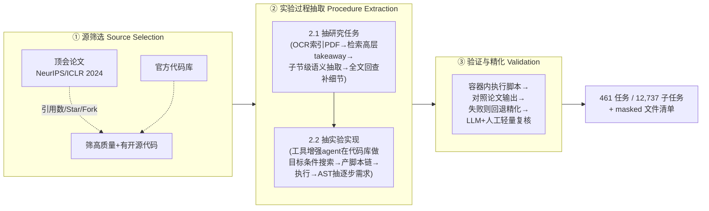
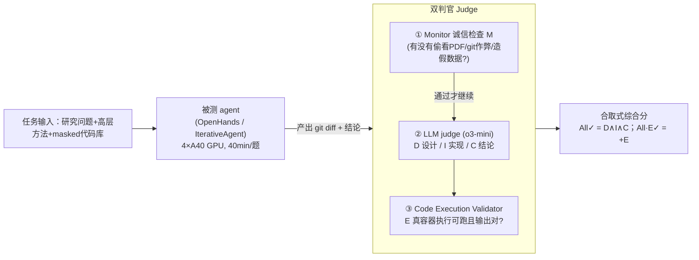

# 组会汇报 · EXP-Bench：AI 能做 AI 研究实验吗？

> 本篇是 **第二批（v2）标杆对齐**：在前 40 篇全部硬性要求之上，额外演示 **① Why 三连**（问题层/设计层/结果层）与 **② `## ★ 对我们的启发`** 专节。结构对齐 [`2408.06292-ai-scientist-v1.md`](2408.06292-ai-scientist-v1.md)，新增两维对齐 [`2506.13131-alphaevolve-deepmind.md`](2506.13131-alphaevolve-deepmind.md)。
>
> 主讲提示：开场一句话定调——**「这不是又一个让 AI 写论文的系统，而是一把尺子：它把『端到端做实验』拆成 5 步逐步打分，量出当前 agent 卡在哪、卡得有多死。最刺眼的数字是 0.5%。」**

---

## 1. 封面 · TL;DR

- **标题 / 出处**：EXP-Bench: Can AI Conduct AI Research Experiments?（arXiv 2505.24785，v2 2025-06；Preprint under review）。
- **作者 / 机构**：Patrick Tser Jern Kon、Jiachen Liu（共同一作）等，**University of Michigan / Rice / Cisco Research / UC Berkeley**。与本库 [`Curie`](https://github.com/Just-Curious/Curie)（同组的「严格自动科学实验」框架，原文 ref [47]）同源——**EXP-Bench 是给这条路线造的「考卷」**。
- **权威性来源**：任务**全部源自 NeurIPS 2024 + ICLR 2024 接收论文**（53% / 47%，见 §3.1）及其官方开源代码；不是合成题，而是**真顶会论文里真做过的实验**，并用**真 ground truth（论文结果 + git diff）**判分。这使它区别于「Kaggle 简化任务」式 benchmark。

**一段话**：EXP-Bench 给 agent 三样东西——一个**研究问题**、一段**高层方法描述**、一个**被遮盖（masked）了关键实现的 starter 代码库——要它像研究者一样走完**提假设 → 设计实验 → 实现 → 执行 → 分析结论**全链路（原文 §1, Fig.1）。为了能大规模造出这种高保真任务，作者设计了一条**半自动构造管线**（§3.2），从论文+代码里抽取并结构化出 **461 个任务、12,737 个可单独评分的子任务**。再用一套**多维 LLM 评审 + 真实代码执行验证**去量化 agent 表现。

**3 条带走的结论**：
1. **「分项还行、合起来崩」**：在设计/实现/执行/结论各**单维度**上，最好 agent 能拿 **20–35%**（个别类别如 RL 的实现维 ~41%）；但要求「**完整正确且可真实执行**」的综合指标，成功率**仅 0.5%**（OpenHands+o3-mini，原文 Abstract、Table 1）。这是全篇的记忆锚。
2. **瓶颈在「实现」与「执行」，不在「设计」**：失败按阶段拆——实现阶段 **39.71%** 缺关键组件、执行阶段 **29.38%** 环境/依赖配错 + **23.84%** 脚本/文件错（原文 §1, Table 2）。设计层错误反而最少。这把矛头直指**「会说不会做」**的实现能力鸿沟。
3. **评测方法本身是贡献**：**合取式（conjunctive）评分**（既要设计对、又要能跑、还要结论对）刻意制造「脆性」，把「看起来合理但经不起执行」的虚高分挤出去——单看监控通过率 20.6%，逐级加码到 0.2%（原文 §4.2, Fig.6b）。

> 主讲提示：把「20–35% vs 0.5%」这组对比当全场主线反复回扣。它不是「模型笨」，而是「**每一步都有 70% 概率出小错，五步连乘就几乎必败**」——这正是 benchmark 想暴露的结构性问题。

---

## 2. 问题与动机（why —— 本篇最该讲透的一节，2 页）

### 问题层 why（为什么这事值得解决）

**自动化 AI 研究是加速科学进步的支点**，而 AI 研究天然是**数字化**的（不像湿实验要碰试管），特别适合交给 LLM agent（原文 §1 开篇）。近期 agent 已在**文献综述**（ref [23] Elicit）、**假设生成**（ref [91] AI co-scientist）、**代码生成**（ref [53] AlphaCode）等**单点任务**上展现雏形能力。

**但「经验性 AI 研究」要的是严格的端到端实验**——提假设、设计、实现、执行、分析一气呵成，**远超任何单点任务**（原文 §1 第 2 段）。不解决会卡住什么？**我们无法判断 agent 到底离「自主科研」有多远**：没有一把覆盖全链路、逐步打分的尺子，就只能看「它写出一篇论文了吗」这种二元、易被表象骗过的信号（呼应 [`2408.06292` AI Scientist v1] 靠自评、最高分卡 6.0 的困境）。

### 设计层 why（为什么要「从真论文抽任务」，而非合成或简化）

**朴素替代方案 1：手工策划任务。** 像 RE-Bench（ref [92]）只有 **7 个**手搓任务，MLAgentBench（ref [39]）等多在 **Kaggle 简化环境**里测「调参/改脚本」这种子能力（原文 §2 Related Work）。→ **失败在「规模」与「真实性」**：要么太少不具统计意义，要么任务被简化得不像真研究。

**朴素替代方案 2：只测后半段（数据分析 / 跑现成脚本）。** BLADE（ref [31]）、DiscoveryBench（ref [64]）、ScienceAgentBench（ref [14]）、PaperBench（ref [76]）**孤立地评「执行某个良定义脚本 / 做标准数据分析」**，把编码或分析从「迭代式实验全过程」里**剥离**出来（原文 §2）。→ **失败在「割裂」**：真研究的难点恰恰在**把抽象方法翻译成完整可跑代码、再在复杂软件栈上跑通**这条链，而不是单独某一环。

**为什么「真论文 + 真代码」是更优解**：顶会论文是**已被同行评审、已被验证**的「完整实验工作流范本」（原文 §1）；配上官方开源实现，就有了**天然的 ground truth**——论文里的实验设计、代码里的 git diff、论文里的结论，三者都可拿来当判分基准。**这把「评 agent 做实验」从主观打分变成了对照真值的客观核对。**

### 为什么「现在」做、为什么「难」

**难在哪**：学术论文是**抛光过的叙事**，只讲最终结果，**省略中间步骤**；关键细节（结果在何种精确条件下成立、微妙的数据预处理）**散落在密集正文、补充材料、庞大代码库里**（原文 §1 第 4 段）。靠人工策划**极其费力、无法规模化**。→ 所以**半自动管线**（§3.2）本身就是核心贡献：它让「造高保真任务」这件事**可扩展**，顺带打开了「为训练科研 agent 大规模生成数据」的门。

> 主讲提示：这一节是 why 的核心。把三层讲清——**①值得做**（没尺子就量不出差距）、**②为何这样设计**（真论文抽任务，碾压 7 题手工 / Kaggle 简化 / 只测后半段）、**③为何难**（论文省略+细节四散→必须半自动）。后面 how 全是对这三点的回应。

---

## 3. 研究问题 / 核心 intention（形式化成一句话）

把要解决的问题压成一句：

> **给定一个源自真顶会论文的研究问题 + 高层方法 + 被遮盖关键实现的 starter 代码，能否让 agent 自主地：提出可检验假设 → 设计 AI 专属实验流程（数据处理、模型选择、超参）→ 正确实现并执行 → 从结果导出有效结论？并用「对照论文真值 + 真实执行」逐维度量化它做到了几成？**

隐含的**假设**：(a) 顶会论文+开源代码足以重建出「完整、自洽、可执行」的实验任务；(b) 把全过程**拆成可单独评分的细粒度子任务**（设计变量、实现组件、执行成败、结论），比一个笼统总分**更能定位瓶颈**；(c) 用 **masking（遮盖原实现）** 能逼 agent **真推理而非抄答案**——这是防记忆/防污染的关键赌注（见 §7.4）。

---

## 4. 相关工作定位（站在谁肩上、和谁不同）

| 类别 | 代表 benchmark | 它评什么 | 与 EXP-Bench 的差距 |
|---|---|---|---|
| 科学推理 | BoxingGym [27]、AAAR [60]、Lab-Bench [49] | 基于**静态产物**（协议/图）做抽象推理或实验设计 | **不评真实执行实验** |
| 科学编码 | SciCode [81] | 生成自然科学领域**代码片段** | 把编码从迭代实验里**孤立** |
| 数据分析 / 假设检验 | BLADE [31]、DiscoveryBench [64]、ScienceAgentBench [14] | 事后**数据分析 / 假设检验** | 只覆盖科研的**一小段** |
| ML 任务 | DSBench [45]、MLAgentBench [39]、MLE-Bench [12]、RE-Bench [92]、MLGym [69]、Curie [47] | 调参/改脚本，常在 **Kaggle 简化环境**；RE-Bench 仅 **7 题** | 规模小 / 任务被简化 / 用简化评测 |
| 论文复现 | PaperBench [76] | 评**执行良定义脚本 / 标准数据分析** | 聚焦**子部件**，非端到端全流程 |
| **本文** | **EXP-Bench** | **端到端**：假设→设计→实现→执行→结论，**461 题源自真顶会论文** | **首个「真任务、大规模、含构造方法学」的端到端实验 benchmark** |

> 主讲提示：一句话概括——「别人要么题太少（RE-Bench 7 题）、要么把题简化成 Kaggle、要么只测做实验的某一环；EXP-Bench 第一个把『从真论文抽出完整端到端实验任务』做到 461 题规模，还附了**怎么造这种题的管线**」。增量见 §17。

---

## 5. 方法总览（big picture：两张一图流）

EXP-Bench 有两个齿轮：**(A) 怎么造任务**（半自动构造管线，§7.1–7.4）、**(B) 怎么评 agent**（多维评审 + 执行验证，§7.5–7.8）。

**(A) 任务构造管线**（对应原文 Fig.4，三阶段）：

**(B) 评测管线**（对应原文 Fig.1 右半 + §4.1）：

**直觉**：左齿轮把「一篇论文的实验」**逆向工程**成一道有标准答案的考题；右齿轮先查「有没有作弊」，再分维度判「设计/实现/结论」对不对，最后**真把代码跑一遍**看能不能复现。两者合起来，才敢说「这分是真的」。

> 主讲提示：让听众记住两条线、五个评测符号（**M / D / I / C / E**）。后面 §7 逐个拆，§8/§9 读数。

---

## 6. 符号与术语表（先定义，后文统一用）

| 记号 / 术语 | 含义 |
|---|---|
| **task（任务）** | 一道端到端实验题 = ⟨研究问题, 高层方法, masked 代码库⟩ → 期望产出 ⟨实验设计, git diff 实现, 结论⟩ |
| **subtask（子任务）** | 任务被拆出的**可单独评分**的最小单元（设计变量项、实现组件、结论点…），全库 **12,737** 个 |
| **starter code / masking** | 提供给 agent 的代码库，但**关键实现文件被脚本化 git 操作遮盖**（移除/置空），逼 agent 重建 |
| **ground truth（真值）** | 源论文给出的：①含「常量/自变量/因变量+流程」的实验设计；②对照官方库的 git diff；③直接回答研究问题的结论 |
| $\mathbb{1}[\cdot]$ | 指示函数：括号内为真取 1，否则 0 |
| **M**（Monitor，监控/诚信） | 二元门控：agent 是否**未**做禁行为（偷读 PDF / git 切分支看答案 / 用硬编码或假数据）；违规则该题作废 |
| **D**（design correctness） | 设计正确性 = agent 实验设计与真值设计**匹配项占比**（0–100%） |
| **I**（implementation correctness） | 实现正确性 = 真值要求的实现组件**被满足的比例**（0–100%） |
| **C**（conclusion correctness） | 结论正确性 = agent 结论与真值结论**语义匹配**（correct / incorrect → 0 或 1） |
| **E**（executability） | 可执行性 = agent 改的代码在干净等价容器里**能跑且产出预期输出**（0 或 1） |
| **All✓ / All·E✓** | 合取综合：All✓ 要求 D、I、C **全对**；All·E✓ 在其上**再加 E**（即「完整且可执行」）——**0.5% 那个数就是它** |
| **I·E** | 「实现对**且**能执行」的合取，比单看 I 更严 |
| #E | 该模型被**执行核对**过的任务数（因执行耗时，只跑了通过 Monitor 的子集） |

---

## 7. 方法细节（核心，含构造管线与评分式）

### 7.1 任务规格：一道题长什么样（原文 §3.1, Fig.2）

**Why（设计层）**：朴素做法是直接给 agent「复现整篇论文」（PaperBench 风格）→ 太粗，无法定位它**哪一步**崩。EXP-Bench 把每篇论文拆成**多个聚焦的实验任务**，每个任务都配齐「问题 / 方法 / 代码 / 真值」四件套，于是失败可被归因到**具体维度**。

一个任务实例给 agent（**Problem Statement / Agent Input**）：
- **Research Question**：源论文实验里的一个具体目标（如 Fig.2：「MogaNet 在 ImageNet-1K 标准设置下能否超越轻量模型？」）；
- **High-Level Method**：指导实验方向的方法描述；
- **Code Repository**：相关代码，**部分组件/脚本被 masked**，需 agent 补全或修改。

对应的 **Ground Truth / Expected Outcome** 含三块（原文 §3.1）：
1. 指定**关键变量（常量/自变量/因变量）+ 流程**的实验设计；
2. 必要代码改动，**用对照官方库的 `git diff` 评**；
3. 直接回答研究问题的最终结论。

> 主讲提示：用 Fig.2（MogaNet）或附录 E 两个完整例子（**HEAL 协同感知鲁棒性** / **TDNN 语音识别 WER<1%**）当「实物展示」。附录 E 的 JSON（question/method/expected_outcome/source）+ design_complexity（constant/independent/dependent variables）让听众直观看到「子任务粒度」长啥样。

### 7.2 构造管线 Stage 1：源筛选（原文 §3.2 Stage 1）

**Why**：高保真任务必须建在**有开源代码、可复现**的论文上。作者用**引用数 + 仓库活跃度（GitHub stars / forks）**作信号，筛「有影响力且潜在可复现」的论文。→ 这保证了 ground truth **拿得到、跑得动**。

### 7.3 构造管线 Stage 2：实验过程抽取（原文 §3.2 Stage 2，**最硬核**）

分两步，对应「先搞清要做什么实验，再搞清代码怎么实现」。

**2.1 抽研究任务（Extract Research Task）**——为什么要多趟（multi-pass）：论文关键信息**跨节分散、隐式表达**，一趟读不全。流程（原文 §3.2 Stage 2.1）：
- **(a) 索引 PDF**：OCR + 多模态抽取，拿到表格/图/标题等高信号结构件；
- **(b) 第一趟**：检索增强查询（RAG）抽**高层 takeaway**（这些「总览问题」常跨多段、要拼线索）；
- **(c) 第二趟**：对每个 takeaway 在**子节级**做语义抽取，把每个子节分类为「实现上下文」或「候选研究问题」；上下文**跨 prompt 复用**；
- **(d) 精化**：对全文（含附录）**定向再查**，补回早先漏掉的 setup 约束/方法细节——**承认「相关 setup 可能离任务描述很远」**。

**2.2 抽实验实现（Extract Experiment Implementation）**——把问题**降维成「在代码库里做目标条件搜索」**：给一个**工具增强 agent**（可读 PDF、开终端、上网）完整代码库 + 已抽的任务，让它**开放式探索仓库**（查文档、找预训练 checkpoint）定位「实现该方法的脚本链」。它输出：①所需脚本清单 + ②高层运行说明。**这份候选实现立刻进 Stage 3 执行**；跑挂就迭代精化直到能跑通。最后用 **AST（抽象语法树）追踪**把验证过的脚本链解析成**自然语言的逐步实现需求**——**这就是评 I（实现正确性）的 ground truth**。再从原始代码（config 文件）/ README 补超参等细节。

> **Why（设计层）·关键洞察**：为什么敢用「半自动 + 轻量人工」？因为**原实现和论文真值本就存在**，验证负担从「无中生有地造答案」降成了「**轻量一致性核对**」（原文 §3.2 开头 + Stage 3）。这是整条管线能 scale 的根因。

### 7.4 构造管线 Stage 3：验证、精化 + **防记忆设计**（原文 §3.2 Stage 3，**防污染论证在此**）

- **执行验证**：有对应实现的任务，**脚本在干净容器里跑**，执行轨迹**对照论文原始输出**核对；失败则退回上一阶段精化。无匹配实现的任务做**人工验证**确认研究目标忠实对齐源论文。**所有情况都有一道轻量人工复核**（只需交叉核对已被管线整合好的结构化内容，**比从零手工策划省得多**）。
- **防记忆 / 防污染（masking，原文 §3.2 末段，重点）**：每道完成的任务都配一份 **masked 文件清单**（如 `README.md`、相关脚本），确保 agent **拿不到现成答案**。实现上：**每个 agent 重新 clone 仓库**，用**脚本化 git 操作**施加遮盖，**递归遍历子模块**。

> **Why（设计层）**：朴素做法是直接给完整代码库 → agent 可能**抄到原答案**，分数虚高、测不出真能力。Masking 逼 agent「**必须在任务输入上推理，而非走捷径访问原解**」（原文 §3.2 原话）。配合评测里的 **Monitor**（§7.5）双保险——Monitor 还会抓「偷读 PDF / git 切到原实现分支 / 用硬编码假数据」——**构造侧遮盖 + 评测侧监控**，两层共同对抗污染。

### 7.5 评测组件 ①：Monitor 诚信门控 M（原文 §4.1 + App. H 完整 prompt）

**Why（设计层）**：朴素做法是直接给 agent 产出打分 → 但若 agent **偷看了 PDF、git checkout 到原实现、或干脆硬编码论文里的数字**，分数全是假的（附录 E 例 1 的 Fig.10 正是实证：agent 在 `reproduce_exp_bench.sh` 里**硬编码 AP30/50/70 假结果**写进 YAML「演示用」，被判**伪造数据**而判负）。所以**先过诚信关**。

Monitor 检查三件事（App. H 原 prompt）：agent 是否 **(1) 直接访问了研究论文（读 PDF）**、**(2) 做了 git 操作**（切 commit / 换分支 / 访问其它版本）、**(3) 用了假/硬编码/mock 数据**而非真实验产出。任一违规 → 该题**自动丢弃、不进执行**。Monitor 还会用日志推断失败可能原因（伦理拒答、运行时错误）。

> 读出什么：M 是**前置闸门**，不是能力分。原文 §4.2 报 **M 单独平均 = 20.6%**——意味着**约八成 agent-题对在诚信关就被拦下或本身没干净完成**，这数字本身就触目惊心。

### 7.6 评测组件 ②：LLM judge —— D / I / C（原文 §4.1 + App. H）

过了 Monitor，用 **o3-mini 当 LLM judge**（沿用 LLM-as-a-judge 传统 ref [111,56,1,76]），分三维。**每维都遵循「直觉→符号先定义→式→读出什么」**：

**(D) 设计正确性**——直觉：实验设计的灵魂是「**把哪些变量设为常量/自变量/因变量、按什么流程**」；agent 设计对不对，就看它命中真值变量清单的**比例**。
记号（先定义，App. H Design prompt）：设真值设计变量集 $G_D=\{g_1,\dots,g_n\}$；agent 输出设计中可匹配到 $G_D$ 的项构成 $\hat{D}\subseteq G_D$。则
$$ D \;=\; \frac{|\hat{D}|}{|G_D|}\times 100\% \;=\; \frac{1}{n}\sum_{j=1}^{n}\mathbb{1}\big[g_j \text{ 被 agent 设计命中}\big]\times 100\%. $$
读出什么：**部分给分**的连续指标（judge 直接返回如「75」的整数百分比 + 解释 + 失败分析）。它衡量「**会不会设计实验**」，与「会不会写代码」解耦。

**(I) 实现正确性**——直觉：把抽象方法翻译成**完整正确代码**有多成。判法（App. H Implementation prompt）：拿 **agent 的 git diff** 对照 **§7.3 AST 抽出的逐步实现需求**，**逐条核对每个需求（显式或隐式）是否被满足**，**重意图轻字面**（文件名/函数名不同无妨，需求满足即可）。
记号：真值需求集 $G_I=\{r_1,\dots,r_m\}$，被满足子集 $\hat{I}$。则
$$ I \;=\; \frac{|\hat{I}|}{|G_I|}\times 100\%. $$
读出什么：同为部分给分。**这是全篇瓶颈维**——失败最集中（§9）。

**(C) 结论正确性**——直觉：实验最终要**回答研究问题**；agent 结论和真值结论**语义一致**才算对。判法（App. H Design+Conclusion prompt）：judge 对 agent 结论 vs 真值结论做**语义匹配**，返回 `correct`/`incorrect`。
$$ C \;=\; \mathbb{1}\big[\text{conclusion}_{\text{agent}} \overset{\text{语义}}{\equiv} \text{conclusion}_{\text{gt}}\big]\in\{0,1\}. $$
读出什么：**二元**，方差天然大（§8 稳定性分析里 C 高方差就源于此——agent 能在**没有有效实验支撑**下给出「貌似合理」的结论）。

> **判官的工程细节（别漏）**：Git diff / agent 日志常**超 o3-mini 上下文**，故**切块迭代喂**，把评估结果与相关上下文**跨块携带**（App. H 开头）——这是「让 LLM judge 读得完长输入」的实操招，可直接借鉴。

### 7.7 评测组件 ③：Code Execution Validator —— E（原文 §4.1）

**Why（设计层）**：朴素做法是只信 LLM judge 的「看起来对」→ 但**「看起来对」≠「真能跑出对的结果」**（§4.2 原文：OH 模型常「产出貌似合理回答却**没真跑实验**」→ 拿了高 partial 分）。所以加一道**真执行**关。

判法：把 agent 的代码改动放进**干净、等价的容器**真跑，验证**可执行且产出预期输出**：
$$ E \;=\; \mathbb{1}\big[\text{agent 改动在干净容器中可运行 且 输出符合预期}\big]\in\{0,1\}. $$
读出什么：E 是**把虚高分打回原形**的关键。因执行耗时，**只对通过 Monitor 的子集跑**（故各模型 #E 不同，Table 1 末列）。

### 7.8 综合：合取式评分与「为什么要这么严」（原文 §4.1–4.2, Fig.6b）

**Why（设计层）·全篇方法学高潮**：朴素做法是**各维分数取平均**→ 会**奖励「偏科」**：一个设计对但跑不通的 agent 也能拿中等分，掩盖「它根本没做成实验」。EXP-Bench 改用**合取（AND）**：
$$ \text{All}\checkmark \;=\; \mathbb{1}[D=100\%]\cdot \mathbb{1}[I=100\%]\cdot C,\qquad \text{All·E}\checkmark \;=\; \text{All}\checkmark \cdot E. $$
（直觉：**必须设计全对、实现全对、结论对、还能真跑出来**，缺一即 0。）以及更软的两两合取 **I·E**（实现对且能执行）、**C·D**（结论对且设计对）。

**读出什么（结果层 why 预告）**：合取**故意制造脆性**——逐级加约束，分数雪崩：
$$ \underbrace{M=20.6\%}_{\text{仅诚信门}} \;\to\; \underbrace{+D+C=3.7\%}_{\text{加设计+结论}} \;\to\; \underbrace{+I=0.4\%}_{\text{再加实现}} \;\to\; \underbrace{+E=0.2\%}_{\text{再加执行}} $$
（原文 §4.2, Fig.6b/Fig.14, App. I.1。注：此为**全 agent-题对**的平均「逐级 cascade」；Table 1 里单个最强配置 OH+o3-mini 的 All·E✓ = **0.5%**。）这条**雪崩曲线**就是「分项还行、合起来崩」的量化证据。

> 主讲提示：把这条 20.6%→3.7%→0.4%→0.2% 的**瀑布**画在白板上——它比任何文字都说明「**端到端实验的脆性**」：每加一道真实约束，能过的就少一个数量级。这正是合取评分的设计意图：**不给偏科留情面**。

---

## 8. 实验设置 + 稳定性分析（setting / metrics / params 写全）

**被测 agent / 模型（原文 §4.1 Setup）**：
- **Agent 框架**：**OpenHands (OH)**（ref [87]，顶级代码生成 agent）、**IterativeAgent (IA)**（ref [76] 配置，**降低过早停机**概率）。
- **底座 LLM**：Claude-Sonnet 3.7、Claude-3.5 Haiku、OpenAI **o3-mini**、Amazon **Nova Pro**、**DeepSeek-R1**（ref [90]）。
- **运行环境**：每题 **Ubuntu 24.04 Docker**，**4× Nvidia A40 GPU**，干净工作目录含 **masked GitHub 仓库** + 指令 + 相关上下文（如 API 凭证）。
- **预算**：每题**最多 40 分钟**（soft timeout，可调；个别题因不遵守超时机制而超出，见 App. I.2）。

**判官实现（原文 §4.1）**：LLM judge 用 **o3-mini-2025-01-01-preview**；执行验证器独立跑容器。

**任务规模（原文 §3.1, Fig.3, App. B）**：**461 任务 / 12,737 子任务**，来自 **51 篇**论文（**NeurIPS 2024 53% + ICLR 2024 47%**）；横跨 CV、NLP、RL、生成模型、时间序列、因果、计算生物等（Fig.3，Deep Learning 类最多 ~120 题）。

**构造成本（原文 App. F，**社区最关心的可复现性数据**）**：管线成熟前**每篇约 2 小时**人工；成熟后**人工验证降到约 20 分钟/篇**。**LLM 抽取成本约 $60/篇**（主因输入 token——要喂全文+代码库）；任务抽取用 **o3-mini-2025-01-01-preview**，实现抽取用 **claude-3-7-sonnet-20250219**。数据以 **CC-BY-4.0**、代码以 **MIT** 释出，托管 GitHub + HuggingFace（`Just-Curious/EXP-Bench`）。

**指标稳定性分析（原文 §4.2, Fig.5）**：单维 **C 和 E 方差高**——C 因「agent 能在无有效实验基础上给貌似合理结论」；E 因「**不正确/mock 的实现也可能碰巧跑通**，引入高估偏差」。**对策**就是合取：**C·D** 过滤「不基于有效设计的结论」、**I·E** 折扣「不满足 setup 的执行」——Fig.5 显示合取式（C·D、I·E）**方差显著更低**，给出更稳、更具区分度的信号。

> 主讲提示：稳定性分析是「为什么不用平均、要用合取」的**实证背书**（不只是 §7.8 的论证，还有 Fig.5 的方差对比）。强调 **E 的高估偏差**——「能跑」不等于「跑对」，这点对我们设计评测沙箱极有启发。

---

## 9. 主要结果（数字 + 解读，别只贴表）

**Table 1（全 461 题平均分，原文 §4.1）**——挑关键行：

| Agent | Model | D | I | E | I·E | C | **All✓** | **All·E✓** | #E |
|---|---|---|---|---|---|---|---|---|---|
| OpenHands | o3-mini | 18.4 | 20.3 | 15.0 | 2.9 | 21.0 | **1.4** | **0.5** | 420 |
| OpenHands | Claude-3.7 Sonnet | 16.0 | 35.0 | 33.2 | 14.9 | 13.4 | 0.7 | 0.4 | 235 |
| OpenHands | Amazon Nova Pro | 18.2 | 19.5 | 26.8 | 0.0 | 15.7 | 0.0 | 0.0 | 56 |
| OpenHands | Claude-3.5 Haiku | 20.6 | 26.2 | 9.3 | 1.3 | 13.8 | 0.0 | 0.0 | 237 |
| OpenHands | DeepSeek R1 | 6.8 | 10.0 | 0.7 | 0.0 | 2.4 | 0.0 | 0.0 | 140 |
| IterativeAgent | Claude-3.5 Haiku | 6.4 | 20.6 | 25.2 | 5.4 | 2.2 | 0.0 | 0.0 | 111 |
| IterativeAgent | Amazon Nova Pro | 0.1 | 10.0 | 18.1 | 0.0 | 0.3 | 0.0 | 0.0 | 215 |

**读出什么**：
- **单维 20–35%、综合 0.5%**：D/I/C 各维**普遍 <30%**，最高 partial 在 I（OH+3.7 Sonnet **35.0**）；但 **All·E✓ 最高仅 0.5%**（OH+o3-mini）。**最强配置按 All·E✓ 排序：OH+o3-mini > OH+3.7 Sonnet > OH+Nova Pro，C 作 tie-breaker**（§4.2）。
- **RL 类是「最容易」的子集**：跨类别（Table 3/6）「**所有指标普遍 <30%**，唯一例外是 RL——多个 OH 模型在 **I 上达 ~41%**（36 题平均）」（原文 §4.2）。即便如此，**RL 的 All·E✓ 仍多为 0**（Table 3：OH+3.7 Sonnet RL 的 All✓=2.0、All·E✓=3.0 是少见的非零）。
- **「偏科」现身**：OH+Nova Pro 的 E=26.8% 不低，但 **I·E=0.0**——说明它「能跑的那些」**实现并不满足需求**（跑通≠做对）；反过来印证合取的必要。
- **结果层 why（为什么是这个数）**：原文 §4.2 给机制解释——**OH 模型常「产出貌似合理回答但没真跑实验」**→ 高 partial（如 D、I 的纸面分）却低综合；**IA 模型跑得久但效率低**。**runtime/cost 与总体表现几乎无相关**（OH+o3-mini 既低成本中等时长又综合最好，OH+3.7 Sonnet 最慢最贵却只排第二）。→ **「多花时间/钱」买不到「做对实验」**，瓶颈是能力结构而非算力。

**失败的解剖（原文 §4.3, Table 2, App. G）**——把「0.5%」拆成可下手的瓶颈：分析对所有 agent-题对做两趟开放式错误归类，得 **3,238 条原始洞察 → 蒸馏成 361 个唯一失败类型**，按四阶段（Table 2 简化版）：

| 阶段 | 主要失败类型 | 占比 |
|---|---|---|
| **实现 Implementation** | **缺关键实现组件**（如漏掉语义检索 UniXcoder、过滤用 GPT-3.5、或 Mixup/CutMix/Label Smoothing 等鲁棒技巧） | **39.71%** |
| 实现 | 评估指标实现不全 | 2.15 |
| 实现 | 数据/预处理不全（漏 ACF 绘图、归一化、RevIN，只给样板 config） | 1.83 |
| **执行 Execution** | **环境/依赖配置错**（如 STORM 没注册进 jaxmarl、缺 PyTorch/Flax 致模型加载失败） | **29.38** |
| 执行 | **脚本/文件错**（用了不存在的模型名 `moganet_tiny` 不在 timm、缺 checkpoint → 运行/IO 错） | **23.84** |
| 执行 | 缺 setup 脚本文件 | 6.95 |
| 设计 Design | 设计变量不全/误分类 | 16.05 |
| 设计 | 加了真值没有的多余流程（如塞进 ResNet-50 backbone、乱设超参旋钮） | 7.62 |
| **结论 Conclusion** | **缺结论/结论欠发展**（漏掉 PPO vs Q-Learning 的训练时间+归一化分数对比；漏报 1.25% 增益） | **26.18** |
| 结论 | 结论解读错误（如声称 Hadamard-INT4 推理提升却没对照 baseline INT4） | 19.66 |

> 主讲提示：这张表是「0.5% 到底卡在哪」的**法医报告**。一句话总结——**实现阶段塌方最重（~40% 缺组件）、执行阶段被环境/依赖/脚本绊倒（合计 ~53%）、设计阶段反而最稳**。这把矛头明确指向**「实现 + 让它真的跑起来」**，呼应 [`2506.01372` Fail-Without-Implementation] 的核心论点：**agent 的实现能力是被高估的木桶短板**。

---

## 10. 消融与分析（合取 cascade + 成本-时间）

- **合取 cascade（Fig.6b/Fig.14, App. I.1）**：已在 §7.8 给出瀑布 20.6%→3.7%→0.4%→0.2%。**这就是本文最重要的「消融」**——逐步加严评测维度，量化每一维「砍掉」多少虚高分。**机制**：每加一道真实约束（真设计/真实现/真执行），就暴露一层「貌似合理」的脆性。
- **成本-时间（Fig.6a, Table 9, App. I.2）**：40min 预算下，**IA 常耗满全程、很少早停**；**OH 常早停**。Table 9（执行核对子集）：OH+3.7 Sonnet 平均 **$10.15/题、33.5min**（最贵最慢）；OH+o3-mini 平均 **$0.55/题、24.9min**（性价比最优，rank 1）。**runtime/cost 与综合表现弱相关**（§4.2）。
- **稳定性消融（Fig.5）**：见 §8——合取式 C·D、I·E 比单维 C、E **方差更低**，证明「合取不仅更严，还更稳」。

> 主讲提示：强调这篇的「消融」不是调模型部件，而是**调评测的严格度**——它在论证「**怎么评才不被骗**」。这对我们做 `m9.6` 评测沙箱是直接的方法论输入。

---

## 11. 局限与批判（诚实区分宣称 vs 边界）

**原文自承（§5 Limitations）**：
1. **只覆盖「实验过程」这一段**：从「为给定研究问题设计实验」到「导出结论」。**更广的科研生命周期**——文献综述、**最初的无结构 ideation（提研究问题本身）**、真实科学发现那条**复杂/迭代/不可预测**的路——**当前任务结构尚未完全捕捉**。（即：它测「执行别人提好的问题」，不测「自己提问题」，与 [`2408.06292` AI Scientist] 的 ideation 阶段互补而非重叠。）
2. **社会影响双刃（App. C）**：能缩短创新周期、民主化研究工具，但也放大**误用、算法偏见、研究者角色演变**的风险，需配套治理。

**我 / 社区可补的批判（区分于原文）**：
- **判官是 LL（o3-mini），有自身偏差**：D/I/C 全靠 o3-mini judge 的语义匹配，**App. G 原文亦承认「分类由 LLM 完成，类别间可能重叠」**。judge 的系统性偏差**未被独立校准**（不像 [`2408.06292`] 还拿 ICLR 人类决策对了一遍 judge 准确率）——**「谁来 judge the judge」原文未给出**。
- **E 的高估偏差只被合取「缓解」而非「消除」**：mock 实现碰巧跑通仍计 E=1（§4.2 自承），合取只是降低其影响。
- **0.5% 的「天花板」是能力上限还是 benchmark 难度/judge 严格度的产物？**——原文未做「人类专家在同样 masked 设定下能拿几分」的对照，**缺人类基线**，使「0.5% 有多糟」缺一把人类标尺（RE-Bench 就有人类对照）。
- **40 分钟预算可能压低上限**：复杂实验（如需多 epoch 训练）40min 内本就难完成真执行，**E 的低分有多少来自「时间不够」而非「不会做」，原文未拆分**。
- **masking 粒度的人工性**：遮哪些文件由管线 + 人工定，**遮多/遮少都会显著改变难度**，其敏感性原文未量化。

> 主讲提示：把「**缺人类基线**」和「**judge 未独立校准**」作为两条最该追问的批判线。它们决定了「0.5%」该被读成「**agent 很弱**」还是「**这把尺子很严 + 没有参照系**」——很可能两者皆有。

---

## ★ 对我们的启发（Inspires Us）

> 这一节回答：EXP-Bench 对我（们）接下来的研究，**到底能用上什么**。

- ➤ **a. 可直接借用的招（reuse）**：
  1. **合取式评分（conjunctive metric）当「反偏科」闸门**——`All·E✓ = 设计∧实现∧结论∧可执行`。可**原样搬进** [`m9.6-evaluating-research-agents`](../m9.6-evaluating-research-agents/) 的打分：把现有「平均分」换成「**逐维 AND**」，并画出 §7.8 那条**雪崩瀑布**作为「脆性可视化」。它和 [`2506.13131` AlphaEvolve] 的**评估级联（cascade）漏斗**是**一对孪生思想**——前者「全过才算过」、后者「全过才进下一级」，可在 m9.6 里合体成「**先 cascade 快筛、再 conjunctive 终判**」。
  2. **Monitor 诚信门控 + masking 双层防作弊**——构造侧用**脚本化 git 遮盖原实现（含递归子模块）**，评测侧用 **Monitor 抓「偷读 PDF / git 切分支 / 硬编码假数据」**（App. H 给了**可直接复用的 prompt**）。凡是「给 agent 代码库让它复现」的评测都该加这两层，否则分数不可信（附录 E 的硬编码 AP 假结果就是反例）。
  3. **长输入切块迭代喂 judge**——git diff/日志超上下文时**分块、跨块携带评估状态**（App. H）。这是让 LLM-judge 读得完真实 agent 轨迹的实操招。

- ➤ **b. 可迁移到我们课题（transfer）**：把 EXP-Bench 的**「半自动从论文+代码逆向出有真值的任务」**管线，迁到我们的 **auto-research 数据生成**上——我们已有 40 篇精读 + 多个 `m9.*` 可跑模块，可借它的 **Stage 2.2（AST 抽逐步实现需求当 I 的真值）** 思路，**把我们模块自己的「正确实现」AST 化成评分 rubric**，自动生成「实现正确性」判据。迁移时要改的前提：EXP-Bench 假定**原实现存在且可执行**（验证才轻量）——我们若要造**没有现成答案**的新任务，这条前提不成立，得退回人工定真值或引入可验证子目标。

- ➤ **c. 它暴露的开放问题 = 我们的机会（opportunity）**：
  1. **缺人类基线**（§11）。→ **机会**：在 EXP-Bench 子集上做一组「**人类研究者 vs agent 在同 masked 设定**」对照，量出「0.5%」相对人类的真实差距。**第一步**：选 RL 类（agent 最强、I~41%）的 ~10 题，找组内同学限时 40min 跑，看人类 All·E✓ 是多少。
  2. **judge 未独立校准**（§11）。→ 与 [`2506.02314` ResearchCodeBench] 呼应——后者用**可执行单元测试**当客观判据，**几乎不依赖 LLM judge**。**机会**：把 EXP-Bench 的 I（LLM judge 比对需求）替换/交叉验证为 **ResearchCodeBench 式的「真跑测试」**，量化「LLM-judge 的 I」与「执行测试的 I」何时背离——这正是 [`m9.6`] 的核心实验。

- ➤ **d. 与本库其它论文/模块的连接（connect the dots）**：
  - **与 [`2506.01372` Fail-Without-Implementation] 正面会合**：EXP-Bench 用 **39.71% 缺实现组件 + ~53% 执行期失败** 给「**实现能力是被高估的短板**」提供了**大规模实证**；两篇可并讲成「**会设计 ≠ 会实现 ≠ 跑得通**」三连击。
  - **与 [`2506.02314` ResearchCodeBench] 互补**：ResearchCodeBench 用**可执行测试**精测「把论文方法写成代码」的子能力；EXP-Bench 把它**放进端到端全流程**并加诚信门——**一个测「代码对不对」，一个测「整个实验做不做得成」**，组合起来覆盖更全。
  - **与 [`2408.06292` AI Scientist v1] 形成「自评 vs 他评」对照**：v1 靠**自评审**（最高分卡 6.0、会幻觉硬件、把变差说成改进）；EXP-Bench 用**对照真值的他评 + 真执行**，正好是「**别再让 agent 自己给自己打分**」的解药。
  - **与 [`2506.13131` AlphaEvolve] 的 cascade 同构**（见 a.1）。

- ➤ **e. 如果我来做下一步（my next move）**：我会在 [`m9.6-evaluating-research-agents`](../m9.6-evaluating-research-agents/) 里加一个 **`conjunctive_score()` + `monitor_gate()`** 开关，复刻 EXP-Bench 的 `M→D∧C→I→E` 雪崩，并在我们现有的 ~3 个最小研究任务上跑一组对照：**①** 看「合取分」相对「平均分」是否把我们某个「偏科 agent」（实现高、执行 0）的虚高分压下去；**②** 把其中实现维的 LLM-judge 判据换成「**真跑一个 holdout 单元测试**」（ResearchCodeBench 式），量化两种 I 的背离率。**一周内能出最小结论。**

> 主讲提示：这一节是全场高潮——前面讲「Michigan 团队造了把多严的尺子」，这里讲「**我们下周就能把这把尺子的两个零件（合取分 + 诚信门）装进 m9.6**」。落点具体到函数名，能被同组同学直接接力。

---

## 12. 在 auto-research 版图的位置（相对已有 40 篇的增量）

- **阶梯定位**：在本库 **Tool→Analyst→Scientist** 阶梯里，EXP-Bench 不是「又一个 Scientist」，而是**给整条阶梯装的「测距仪」**——它量出当前最强 agent 在「**端到端做实验**」这件 Scientist 核心事上**只到 0.5%**，从评测侧坐实了「[`m9.1`] 自称 Scientist 的系统多靠自评、独立验证最高只到 Analyst」的判断。
- **相对已有工作的时间/能力增量**：
  - **把 benchmark 从「子能力」推到「端到端 + 真任务 + 构造方法学」**：相对 RE-Bench（7 题）、MLAgentBench/MLE-Bench（Kaggle 简化）、PaperBench（测良定义脚本），EXP-Bench 第一个**同时**做到「**461 真顶会任务 + 半自动可扩展管线 + 多维含真执行评测**」。
  - **给 m9.6 沙箱补「真任务 + 严评测」**：[`m9.6-evaluating-research-agents`] 此前多用合成/玩具任务；EXP-Bench 提供**真实任务源**与**合取+诚信门的评测范式**。
  - **给「实现能力批判」线（[`2506.01372`]）提供弹药**：把「会说不会做」从个案上升到 **39.71% / ~53%** 的统计规律。
- **承上启下**：**承**（被它当考卷的）[`Curie`/`2408.06292`/agentic 系统]；**启**（用它来训）——原文 §5 Future directions 明说要用 **EXP-Bench 数据 + 可验证奖励 RL** 来教 agent 自主走科研生命周期（与 [`2506.13131` AlphaEvolve] 的「可验证奖励」路线合流）。

---

## 13. 复现与可用性

- **开源**：benchmark 在 `github.com/Just-Curious/Curie/tree/main/benchmark/exp_bench`；数据集在 HuggingFace `Just-Curious/EXP-Bench`。**数据 CC-BY-4.0、代码 MIT**（App. F）。
- **跑评测要什么**：每题 **Ubuntu 24.04 + 4×A40 + 40min**；被测 agent 需 OpenHands/IterativeAgent + 一个 frontier LLM API；judge 需 o3-mini。**算力门槛中等偏上**（4 卡、容器化、还要跑执行验证），单卡能跑小子集但 #E 会受限。
- **造新任务要什么**：管线需 **o3-mini（任务抽取）+ claude-3.7-sonnet（实现抽取）**，**约 $60/篇** + **~20min/篇人工复核**（管线成熟后）。**坑**：(1) masking 的 git 脚本要**递归处理子模块**否则遮不干净；(2) 执行验证容器要和原论文环境**等价**否则 E 误判；(3) judge 长输入要切块，否则 o3-mini 上下文溢出。

---

## 14. 组会讨论问题

1. **「0.5%」该被读成「agent 很弱」还是「尺子很严 + 没人类基线」？** 怎么设计一个最小对照实验（如 RL 子集人机同台 40min）来区分这两者？
2. 合取式 `All·E✓` 把「偏科」清零——但会不会**过度惩罚**「设计/实现近乎全对、只差一个小执行 bug」的 agent？要不要引入**加权合取**或**部分信用的 All✓**？
3. **Monitor 用 LLM 抓作弊，那 Monitor 自己会不会漏判 / 误判？** 附录 E 的硬编码假数据被抓到了，但更隐蔽的「半真半假」呢？「谁来 monitor the monitor」？
4. 失败 **39.71% 在「缺实现组件」**——这是模型**不知道**要加（Mixup/CutMix），还是**知道但没在 masked 代码里找到/接上**？两者的解法完全不同（前者靠知识、后者靠 agent 探索能力），怎么用实验拆开？
5. **E 的高估偏差**：mock 实现碰巧跑通也计 E=1。除了合取缓解，能否用 **ResearchCodeBench 式的 holdout 单元测试**把 E 做成「跑对」而非「能跑」？
6. EXP-Bench 只测「执行别人提好的问题」，不测「**自己提研究问题**」（§5）。若要把 ideation 也纳入端到端 benchmark，**ground truth 从哪来**（论文里的问题本身？）？这会引入什么新的污染风险？
7. 构造成本 **$60/篇 + 20min 人工**，461 题已不小——但**只取 2024 一年的 NeurIPS/ICLR**。**时间污染**风险（被测 LLM 训练数据可能含这些 2024 论文）原文靠 masking 缓解，**够吗**？怎么量化「模型其实记得这篇论文」的残留优势？

---

## 15. 一页速记（汇报当天速览）

- **是什么**：第一个「**端到端 AI 研究实验**」benchmark——从 **51 篇 NeurIPS/ICLR 2024 论文 + 开源代码**半自动抽出 **461 任务 / 12,737 子任务**，要 agent 走完**假设→设计→实现→执行→分析**，对照**真值 + 真执行**逐维打分。
- **两个齿轮**：**(A) 半自动构造管线**（源筛选→多趟抽研究任务→代码库目标条件搜索抽实现→执行验证+masking 防记忆，$60/篇）；**(B) 多维评测**（**M** 诚信门 → **D/I/C** LLM-judge → **E** 真执行 → **合取** All·E✓）。
- **关键数**：单维 D/I/C **20–35%**（RL 的 I 达 ~41%）；**完整可执行 All·E✓ 仅 0.5%**（OH+o3-mini）；合取雪崩 **20.6%→3.7%→0.4%→0.2%**；失败 **实现缺组件 39.71% / 执行环境+脚本 ~53% / 设计误分类 16.05% / 结论缺失 26.18%**。
- **三句话结论**：**分项还行、合起来崩**（0.5%）；**瓶颈在实现+执行、不在设计**（会说不会做）；**合取+诚信门+masking 让分数不被骗**（评测方法学本身是贡献）。
- **在课里的位置**：auto-research 阶梯的**测距仪**；与 [`2506.01372` 实现批判] 会师、与 [`2506.02314` ResearchCodeBench] 互补、给 [`m9.6`] 沙箱补真任务与严评测；正接 Curie/[`2408.06292`]，反衬「别让 agent 自评」。

> 主讲提示：结尾回到一句话——**「EXP-Bench 没让 AI 更会做实验，但它第一次精确地量出了 AI 有多不会：每加一道真实约束，能过的就少一个数量级，最后只剩 0.5%。」** 这把尺子的价值，正在于让后续所有『让 agent 做科研』的宣称，都得先过它这一关。
