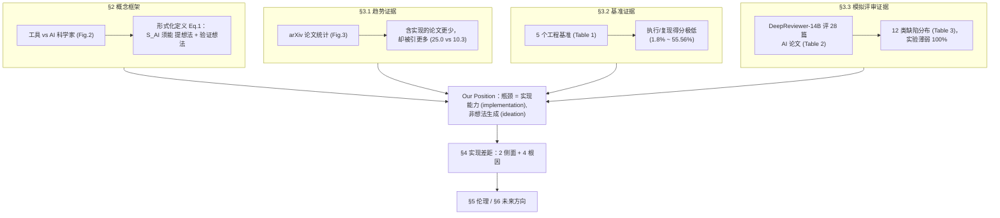

# 组会汇报 · AI Scientists Fail Without Strong Implementation Capability（执行能力才是瓶颈）

> 主讲提示：这是一篇**立场论文 (position paper)**，不提新系统、不刷榜，它的「贡献」是一条**论证 + 证据链**。开场就把核心张力抛出：上游（本库 0 号文献 AI Scientist v1、v2）都在欢呼「AI 已能产会议级论文」，这篇泼一盆冷水——**论文被接收 ≠ 科研被自动化**，因为「写得出像样的文字」和「跑得出可靠的实验」是两回事，瓶颈在后者。全程主线只有一句：**ideation 不是瓶颈，reliable implementation 才是。**

---

## 1. 封面 · TL;DR

- **作者/出处**：Minjun Zhu、Qiujie Xie（共同一作）、Yixuan Weng、Jian Wu、Zhen Lin、Linyi Yang、Yue Zhang，西湖大学 / 浙江大学 / UCL，2025-05（arXiv 2506.01372 v2）。立场论文，项目页 `ai-researcher.net`，综述仓库 `github.com/ResearAI/Awesome-AI-Scientist`。
- **一段话**：本文提出一个明确**立场 (Our Position)**——*AI 科学家的根本瓶颈在于其「可靠执行对想法的验证」的实现能力*。作者先把「AI 科学家 (AI Scientist)」形式化定义为一个**既能独立提出科学想法、又能执行验证/证伪程序**的端到端系统（§2，Eq.1），再用**三条证据**支撑立场：(1) AI 科学家文献的**趋势统计**（§3.1，Fig.3）——含实现细节的论文更少却被引更多；(2) 跨 5 个工程基准的**定量分析**（§3.2，Table 1）——SoTA 大模型在「把想法跑成可验证代码」上得分极低；(3) 用 SoTA 评审模型 DeepReviewer-14B 对 **5 个 AI 科学家系统产出的 28 篇论文**做**模拟同行评审**（§3.3，Table 2/3）——「实验薄弱 (Experimental Weakness)」缺陷出现率 **100%**。最后剖析实现差距 (implementation gap) 的**两大侧面 + 四条根因**（§4），并讨论伦理 (§5) 与未来方向 (§6)。
- **三条带走的结论**：
  1. **「会写」远易于「会做」**：同一批 SoTA 大模型在简单代码题接近饱和（o3 在 Codeforces 达 99.8 百分位），但在真实科研复现基准上断崖式下跌——Claude 3.5 Sonnet 在 PaperBench 仅 **1.8%**（Result Match 仅 **0.7%**），这是「实现差距」最刺眼的一刀（§3.2，Table 1）。
  2. **量化「实现失败」靠两把尺**：一把是**工程基准的执行/复现得分**（MLE/Paper/SciReplicate/CORE/ML-Dev-Bench，Table 1，最高 55.56%、最低 16.9%）；另一把是**模拟评审下的缺陷分布**（Table 3，12 类缺陷，前四高频均与「实现/实验/方法清晰度」直接相关）。两把尺都指向同一结论。
  3. **对「只看 idea 评分」的范式做方法学批判**：作者明确指出当前缺一个**贯穿「从 idea 到最终实现」全流程的综合基准**（§4.2 限制4），现有评测要么只评点子、要么只评单点能力；并直言**评审分数本身不是可靠的影响力预测器**（word2vec 曾被 ICLR 2013 拒），暗示「论文被接收」这一指标的脆弱性。

> 主讲提示：把第 1 条的「Codeforces 99.8 百分位 vs PaperBench 1.8%」这组对照当作全场的「钩子」——它一句话讲清了 ideation/简单代码与 reliable implementation 之间的鸿沟。本库直连两篇：9.5「执行才证伪」模块、以及 2506.20803「ideation–execution gap」——后者从「点子执行后掉分」侧证同一命题，本篇从「实现基准 + 评审缺陷」侧证，互为犄角。

---

## 2. 问题与动机（why —— 本篇最该讲透的一节）

**领域现状：一片「即将到来」的乐观。** 近两年 LLM 驱动的 AI Scientist 把「科研自动化」推到新高度，AI 成为从 idea 生成到实验执行的**主要执行者** (primary executor)（Lu 2024 / Weng 2025 / Yamada 2025）。作者在引言 (§1) 列举的「进步信号」：AI Scientist-v2 的产出**评审分超过人类论文的平均接收阈值**（Fig.1 标注 2025.4「首个会议级论文」）；多篇 AI 生成论文通过同行评审被 **ICLR 2025 workshop 与 ACL 2025 主会**接收（Intology 2025）。一种叙事随之兴起：**人类水平的、能发现人类未知现象的 AI 科学家「may be imminent（或许近在眼前）」**（摘要原话）。

**但有一个刺眼的空缺。** 作者紧接着指出反例 (§1)：尽管进步巨大，AI Scientist **至今未能在计算机科学领域做出可与「自动科学工具」比肩的突破性成果**（对照 AlphaFold（Jumper 2021）这类工具级里程碑）。也就是说——**会写论文、能过评审**，却**做不出真突破**。这一反差正是全文的出发点。

**为什么「科学工具」≠「AI 科学家」——动机的根。** §2.1 把二者掰开（见原文 Fig.2）：
- **科学工具 (scientific tool)**：输入数据、在**人类监督**下输出预测（AlphaFold 给结构、A-Lab 17 天合成 41 种新材料）。它强在**特定良定义域**，但**科研循环里「提假设、写作、验证」这些劳动密集环节仍靠人**——所以本质是「人主导、AI 辅助」，**不算真正自动化**。
- **AI 科学家 (AI Scientist)**：输入**研究课题**，自主、自导地与工具迭代交互，输出**解决方案**——具备「科学能动性 (scientific agency)」，从提问到求解端到端自走。

**核心动机一句话。** 既然 AI 科学家的**定义性能力**是「独立提想法 + 独立验证想法」，那么真正区分它与「会聊天的 LLM」的，不是**能不能想到** (ideation)——这一点近期工作已反复证明 AI 能生成高新颖度想法（Si 2024 / Wang 2024a / Hu 2024 / Yang 2025d）——而是**能不能可靠地把想法执行、验证出来**。作者把这一缺口命名为**实现差距 (implementation gap)**，并据此立论：

> **Our Position（原文方框）：AI 科学家的根本瓶颈在于其「有效执行对这些想法的验证」的实现能力。**

**不做会怎样（why now）。** 作者给出双重紧迫性：(a) **科学层面**——若不补上实现/验证，AI 科学家永远停在「会写不会做」，无法贡献真突破；(b) **治理层面**（§5 伏笔）——随着能力增强，低质 AI 论文可能**冲垮同行评审系统**、甚至进入危险研究域，因此现在就需要「生成管理 + 质量评估」的综合机制。

> 主讲提示：这一节是 why 的核心，务必讲透三层：① 现状是「论文级成功 + 突破级缺席」的悖论；② 工具 vs 科学家的分野落在「是否自主完成验证」；③ 由此推出「ideation 已被证明不是瓶颈，implementation 才是」。把 Fig.1 的「公路+加油站」隐喻点一下——AI 科学家这辆车已上路，但「Implementation Gap」是横在路上的断崖，对岸才是「理想 AI 科学家」。

---

## 3. 研究问题 / 核心 intention（形式化成一句话）

把全文要论证的命题压成一句：

> **当前 AI 科学家系统「失败」的根因，是否在于「可靠实现与验证 (reliable implementation & verification)」能力的缺失，而非「想法生成 (ideation)」能力的不足？若是，如何用可量化的证据证明「实现能力是瓶颈」？**

它隐含的**两个待证子命题**：
- **(H1) ideation 非瓶颈**：SoTA 大模型已能产出高新颖度想法（作者将其作为既有共识引用，非本文新测）。
- **(H2) implementation 是瓶颈**：把想法落成「可验证、可运行」的代码/实验，SoTA 大模型系统性地做不好——这是本文要用基准 (§3.2) 与模拟评审 (§3.3) **量化**的核心。

> 主讲提示：强调本文是**立场论文**，它**不训练新模型**，而是**重新组织已有基准 + 自做一次模拟评审**来支撑命题。判断它成不成立，要看「证据是否真指向 implementation 而非别的因素」——这也是 §16 批判要回扣的点。

---

## 4. 相关工作定位（站在谁肩上、和谁不同）

本文是「批判/立场」类，它的「相关工作」其实是**把整个 AI 科学家版图分成两阵营**，自己站在「泼冷水」一侧。

| 阵营 / 方向 | 代表（原文引用） | 主张 | 与本篇关系 |
|---|---|---|---|
| 乐观·端到端旗舰 | The AI Scientist v1/v2（Lu 2024 / Yamada 2025）、Zochi、CycleResearcher | 「AI 已能产会议级论文，人类级科学家近在眼前」 | **批判靶子**：本文承认其 ideation 强，但指其实现/验证弱（Fig.1 把它们都标在「Implementation Gap」之前） |
| ideation 能力派 | Si 2024、Wang 2024a、Hu 2024、Yang 2025d | 「LLM 能生成高新颖度研究想法」 | **引为论据**：用它支撑「ideation 非瓶颈」（H1） |
| 工程/复现基准 | MLE-Bench、PaperBench、SciReplicate、CORE-Bench、ML-Dev-Bench、LiveCodeBench | 给「让 agent 做 ML 研究」打分 | **核心证据来源**（§3.2 Table 1）：用它们量化实现失败 |
| 实现能力受限派 | Chan 2024、Starace 2025、Xiang 2025、Siegel 2024、Padigela 2025 | 「AI 科学家实现能力仍受限」 | **同盟**：本文系统化其零散观察 |
| 评审/评估工具 | DeepReviewer-14B（Zhu 2025）、DeepReview | 用 LLM 模拟同行评审 | **方法工具**（§3.3）：拿来评 28 篇 AI 论文 |
| 协作派（替代观点） | Weng 2025（Co-scientist） | 「短期不必全自主，做人机协作的 Co-scientist 即可」 | **§7 Alternative Views**：作者承认这是合理替代路线 |

> 主讲提示：一句话定位——「**别人在比谁的 AI 科学家更强，这篇在问『它们到底强在哪、弱在哪』，并指认弱点是 implementation**」。它最像本库的 2509.08713（Hidden Pitfalls）、2506.20803（ideation–execution gap）——同属「批判/打假」家族，但本篇的独特武器是「**基准聚合 + 模拟评审缺陷分布**」。

---

## 5. 方法总览（论证结构 big picture）

本文没有「系统架构」，它的「方法」就是**论证管线**。一图看清证据如何汇入立场：

**直觉**：把三条互相独立的证据（趋势、基准、评审）拧成一股绳——若三者都指向「实现弱」，则立场稳。这正是立场论文的标准打法：**不靠单一新实验，而靠多源证据的收敛 (convergent evidence)**。

> 主讲提示：让听众记住「**三条证据 → 一个立场 → 拆成根因 → 给治理**」这条主线。后面 §7–§12 就是逐条把证据讲细。

---

## 6. 符号与术语表（后文统一用）

| 记号 / 术语 | 含义（首次中英对照） |
|---|---|
| AI 科学家 (AI Scientist) | 能**独立提想法 + 执行验证/证伪**的端到端自主系统（本文定义，§2.2） |
| 实现差距 (implementation gap) | 「能想出新颖想法」与「能把想法可靠执行/验证」之间的能力落差（全文核心概念） |
| ideation（想法生成） | 提出研究问题/假设/方案的能力——本文视为「**非瓶颈**」 |
| verification / falsification（验证 / 证伪） | 通过真实实验确认或推翻想法——本文视为「**真瓶颈**」 |
| $\mathcal{S}_{AI}$ | AI 科学家系统本身（Eq.1） |
| $\mathcal{Q}_{init}$ | 初始科学问题 (initial scientific question) |
| $\mathcal{K}_{domain}$ | 已有领域知识 (domain knowledge) |
| $\mathcal{R}_{human}$ | 人类伦理约束 (human ethical constraints) |
| $\mathcal{B}_{res}$ | 资源约束 (resource budget) |
| $\theta_{AI}$ | AI 科学家的参数/配置 |
| $\mathcal{K}_{new}$ | 产出的新科学知识 (novel knowledge) |
| $\mathcal{A}_{sci}$ | 产出的可验证科学制品 (verifiable artifacts，如代码/结果/论文) |
| pass@1 | 单次生成即通过的比例（代码题常用） |
| Execution / Result Match | PaperBench 的两个 rubric 叶节点：代码能否成功运行 / 定量结果能否对上原文 |
| DeepReviewer-14B | SoTA 论文评审模型（Zhu 2025），§3.3 用作模拟同行评审打分器 |

---

## 7. 概念框架：把「AI 科学家」形式化（§2.2，Eq.1）

> 主讲提示：这是全文唯一的公式。它的作用不是算什么，而是**用形式语言把「验证能力」钉进 AI 科学家的定义里**——一旦验证写进定义，「验证做不好」就等价于「不算合格的 AI 科学家」，立场便有了逻辑地基。

**直觉 / 为什么要这个式子**：作者要反驳「会提想法就算 AI 科学家」。于是给出一个**带约束的最优化**形式——AI 科学家的本质是：在伦理与资源约束下，把「初始问题 + 领域知识」映射为「新知识 + **可验证制品**」的过程。注意输出里**显式包含「可验证制品 $\mathcal{A}_{sci}$」**，这正是把 implementation/verification 嵌入定义的关键。

**符号定义（先定义，后读式）**：见 §6 术语表——$\mathcal{S}_{AI}$ 为系统，$\mathcal{Q}_{init}$ 初始问题，$\mathcal{K}_{domain}$ 领域知识，$\mathcal{R}_{human}$ 伦理约束，$\theta_{AI}$ 系统参数，$\mathcal{B}_{res}$ 资源约束；输出 $\mathcal{K}_{new}$ 新知识、$\mathcal{A}_{sci}$ 可验证制品。

$$
(\mathcal{K}_{new},\ \mathcal{A}_{sci}) \;\leftarrow\; \max\big\{\, \mathcal{S}_{AI}(\mathcal{Q}_{init},\ \mathcal{K}_{domain},\ \mathcal{R}_{human}\mid \theta_{AI},\ \mathcal{B}_{res}) \,\big\} \tag{Eq.1}
$$

**读出什么 / 它说明了什么**：
- 输出是**二元组**——光有 $\mathcal{K}_{new}$（漂亮想法）不够，必须同时交出 $\mathcal{A}_{sci}$（**可验证**的代码/结果/论文）。这就把「只会 ideation」排除在「合格 AI 科学家」之外。
- $\mathcal{R}_{human}$、$\mathcal{B}_{res}$ 作为约束进入——暗示**伦理与算力/成本**是硬边界（伏笔 §5 伦理、§4.2 限制2 的 RL 成本爆炸）。
- `max{...}` 表示「在约束内求最优产出」——但作者全文要说的是：**现实中 $\mathcal{S}_{AI}$ 远达不到这个 max**，差就差在 $\mathcal{A}_{sci}$ 的「可验证」上。

> 讲稿提示：这里要点明一个「定义即立场」的小心机——**把验证写进定义**，本身就是一种论证手段：它让「验证失败」从「能力短板」升级为「资格不符」。这是立场论文常用的修辞，组会上值得点破。

---

## 8. 证据①：研究趋势——「含实现」的论文更少却更被引（§3.1，Fig.3）

> 主讲提示：这条证据**不直接证明「实现弱」，而是证明「实现难且被低估」**——它从「社区行为」侧面烘托：大家都知道实现重要（引得多），却都绕着走（写得少），因为难。是「软证据」，但很有说服力。

**setting（原文 §3.1 + Appendix B）**：统计截至 **2025-05-23** 的 arXiv 上 AI 科学家相关论文，按「**是否包含具体实现细节 (implementation details)**」分两类，看两件事——发文数量趋势、平均被引数。

**发现（Fig.3 上/下面板 + 内嵌表）**：

| 类别 | 总被引 (Total citations) | 平均被引 (Avg. citations) |
|---|---|---|
| 不含实现 (Without Implementation) | 216 | 10.3 |
| **含实现 (With Implementation)** | **325** | **25.0** |

- **下面板（数量）**：总发文量在涨，但**「只谈 idea、不含实现细节」的论文数量持续多于「含实现」的**（Fall'24 → Spring'25，两类都在涨，但前者一直更高）。
- **上面板（影响力）**：**含实现的论文平均被引几乎是 2.4 倍**（25.0 vs 10.3）。

**读出什么**：社区**高度认可可执行的进展**（引得多），却**实现类论文产量反而低**——作者据此反问（原文原话式）：「若实现导向的研究影响力更高，为何其产量反而明显更低？」唯一合理解释是——**实现这条路困难重重 (fraught with substantial challenges)**。这就为「implementation 是瓶颈」埋下第一块砖。

> 讲稿提示：这条是典型的「**揭示性偏好 (revealed preference)**」论证——不看大家说什么，看大家做什么。组会可追问：会不会是「含实现的论文天然更晚、更难，所以是别的混杂因素导致引用高」？（§16 批判点之一）

---

## 9. 证据②：基准定量分析——把「实现失败」量化（§3.2，Table 1）

> 主讲提示：**这是全文最硬的一张表**，也是「它用什么实验/案例证明实现是瓶颈」的正面回答。讲法：先立「简单代码已饱和」的对照，再砸下「真实科研基准断崖下跌」的数据，最后逐基准点出**失败发生在哪个环节**。

### 9.1 对照：简单代码近饱和，真实科研断崖下跌

**「会写」的上限很高**：作者强调 SoTA LLM 在简单代码生成（如 HumanEval）**接近饱和**；o3 在 Codeforces 算法竞赛达 **99.8 百分位**（§3.2 原文）。但——

**「会做」的现实很低**：一旦进入**真实世界研究场景**，性能急剧下滑。更难的 LiveCodeBench (LCB)（比 HumanEval 复杂，含生成/执行/自修复/输出预测）上，**o4-mini 在代码生成子任务也只有 52.1% pass@1**（§3.2）——连「写对代码」都过不了一半，遑论复现整篇论文。

### 9.2 五个工程基准：得分一览（Table 1）

| 基准 (Benchmark) | 任务 | 领域 | 规模 | 测的 LLM | 准确率/表现 |
|---|---|---|---|---|---|
| MLE-Bench (Chan 2024) | AI 训练任务（Kaggle，奖牌率评） | Applied ML | 75 | OpenAI o1-preview | **16.90%** |
| PaperBench (Starace 2025) | 复现 ICML 论文（复现分） | NLP/CV/ML | 8,316 | OpenAI o1-high | **26.00%** |
| SciReplicate-Bench (Xiang 2025) | 从算法描述生成可执行代码（执行准确率） | NLP | 100 | Claude-Sonnet-3.7 | **39.00%** |
| CORE-Bench (Siegel 2024) | 复现论文计算结果（准确率） | CS/社科/医学 | 270 | OpenAI GPT-4o | **55.56%** |
| ML-Dev-Bench (Padigela 2025) | ML 开发工作流任务（成功率） | ML | 30 | Claude-Sonnet-3.5 | **50.00%** |

**一句话读表**：最高也才 **55.56%**（CORE-Bench），最低 **16.9%**（MLE-Bench）；这些可不是简单代码题，而是「**把研究跑出来**」的题——**SoTA 大模型把概念/计划翻译成「可验证、可运行的正确代码」时，系统性地失败**。这就是 implementation gap 的直接刻度。

### 9.3 failure 发生在哪一环——逐基准解剖（§3.2 三段细节）

> 主讲提示：这是本节最有价值的部分——它把「实现失败」拆成**生成 vs 执行 vs 结果对齐 vs 调试**几个阶段，指出失败主要在「执行 + 结果对齐 + 迭代调试」，而非「写不出代码片段」。

- **PaperBench（最刺眼的一刀）**：要求 agent **从零复现整篇 ML 论文**（建代码库 + 跑实验）。agent **能写出代码组件**——o1-High 在加权「**Code-Development**」子任务上达 **43.4%**；但一到后续阶段就崩：在 rubric 叶节点「**Execution（代码能否成功跑起来）**」与「**Result Match（定量结果能否对上原文）**」上，**Claude 3.5 Sonnet 仅 1.8% 与 0.7%**（§3.2）。**会写组件 ≠ 跑得通、对得上**——这是「实现差距」的教科书式证据。
- **SciReplicate-Bench**：给 NLP 论文的算法描述、让 agent 生成 Python 复现。agent **推理图准确率高**（理解算法逻辑没问题），但**最好的 agent 执行准确率仅 39%**——即只有 39% 任务的代码通过功能测试。**「懂逻辑」与「保证实现正确性 + 运行行为」之间断裂**。
- **MLE-Bench / ML-Dev-Bench（调试与迭代优化的崩塌）**：MLE-Bench 上 **o1-preview 有 20% 的运行在「产出有效提交」这一步就失败**（调不动自己的代码）；ML-Dev-Bench 上**所有受测 agent 在「Model Performance（模型性能优化）」任务上都得 0%**——说明**缺乏稳健的验证闭环**去「根据实验反馈迭代改进」。
- **CORE-Bench**：要求复现结果再据此答题，涉及多阶段复现 + 推理；CORE-Agent + GPT-4o 在 CORE-Bench Medium 上 **55.56%**——即便是表中最高分，也凸显这套**复杂验证流程**之难。

**§3.2 收束句**：这些跨阶段的验证困难表明——**当前 LLM 擅长内容生成，却无法依据明确标准严格验证自己的产出，而后者是科学实践的根基**。

> 讲稿提示：把「Code-Development 43.4% vs Execution 1.8% vs Result Match 0.7%」这组**同一基准内的逐级跳水**单独写在黑板上——它最干净地证明：**瓶颈不在「写」，在「跑通 + 对上 + 改好」**。这正是本篇区别于泛泛而谈的硬核之处。

---

## 10. 证据③：模拟同行评审——缺陷分布揭示实现弱（§3.3，Table 2/3）

> 主讲提示：第二条「量化实现失败」的尺子。它换了个视角——不评 agent 在基准上的得分，而是**把 AI 真实产出的论文拿去「过审」**，看审出来的**缺陷类型**集中在哪。结果几乎全部命中「实现/实验」类缺陷，从产出侧印证立场。

### 10.1 setting（§3.3）

- **被评对象**：从 **5 个不同 AI 科学家系统**收集 **28 篇公开 AI 生成论文**。
- **评审器**：SoTA 评审模型 **DeepReviewer-14B**（Zhu 2025），统一标准模拟同行评审。
- **作者主动声明的偏差 (limitation)**：公开论文可能是各系统**精选的较好产出**（selection bias），故结果**未必代表平均水平**——但仍能反映「当前 AI 论文的总体质量档次」。（这点诚实，组会可表扬。）

### 10.2 评分结果（Table 2）

DeepReviewer-14B 对各系统的平均分（Rating 量纲 1–10，6 分≈可接受；Soundness/Presentation/Contribution 量纲 1–4）：

| AI 科学家系统 | 篇数 Num | Soundness↑ | Presentation↑ | Contribution↑ | Decision↑ | Rating↑ | 百分位↑ |
|---|---|---|---|---|---|---|---|
| HKUSD AI Researcher | 7 | 1.75 | 1.46 | 1.57 | 0.0 | 2.57 | 3.43% |
| AI Scientist | 10 | 2.08 | 1.80 | 1.75 | 0.0 | 3.35 | 8.22% |
| AI Scientist v2 | 3 | 1.67 | 1.50 | 1.50 | 0.0 | 2.33 | 2.04% |
| CycleResearcher-12B | 6 | 2.25 | 1.75 | 2.13 | 0.0 | 3.75 | 16.88% |
| **Zochi** | 2 | 2.38 | 2.38 | 2.25 | 0.0 | **4.63** | **29.96%** |

**读表**：**所有系统的 Decision 全为 0.0**（无一被「接收」）；评分最高的 Zochi 也仅 **Rating 4.63 / 百分位 29.96%**，其余多落在 2–3 分区间。即**在统一 SoTA 评审器眼里，这些 AI 论文普遍达不到接收线**——与 §1「v2 产出曾超人类接收阈」的乐观叙事形成尖锐对照（注：那是各家自报/特定评审，这里是统一评审器）。

### 10.3 缺陷分布（Table 3）——本节的「靶心」

12 类主要缺陷在 28 篇里的出现率：

| 缺陷类别 (Defect Category) | 篇数 | 出现率 |
|---|---|---|
| **Experimental Weakness（实验薄弱）** | 28 | **100%** |
| Methodological Unclarity/Flaws（方法不清/有缺陷） | 27 | 96.4% |
| Writing & Presentation Issues（写作与表达） | 26 | 92.9% |
| Novelty Concerns（新颖性存疑） | 25 | 89.3% |
| Theoretical Weakness（理论薄弱） | 24 | 85.7% |
| Literature Review Deficiencies（文献综述不足） | 22 | 78.6% |
| Practicality & Robustness Gaps（实用性/稳健性） | 21 | 75.0% |
| Reproducibility Issues（可复现性） | 20 | 71.4% |
| Computational Cost Concerns（算力成本） | 18 | 64.3% |
| Component Analysis（部件分析缺失） | 16 | 57.1% |
| Hyperparameter Analysis Lacking（超参分析缺失） | 16 | 57.1% |
| Ethical Considerations Missing（伦理考量缺失） | 3 | 10.7% |

**读出什么（§3.3 收束）**：
- **「实验薄弱」100% 全覆盖**——作者直指这「**支持我们关于实现能力受限的立场**」，缺陷集中在实验设计、执行、结果分析。
- 第二、三高频是「方法不清/有缺陷 (96.4%)」「写作表达 (92.9%)」——反映 AI **清晰表述并实现研究方案**的能力不足。
- 「新颖性存疑 89.3%」「理论薄弱 85.7%」也高频——说明 AI 产完整论文时，**也难以提出有扎实理论根基的原创贡献**。
- 高频缺陷叠加，指向**当前 AI 科研在科学严谨性与实现质量上的系统性问题**，达不到「可靠、有价值科学产出」的标准。

> 讲稿提示：把 Table 3 当「**用产出反推能力**」的论证——不去碰「agent 内部能力」，只看「它交出来的论文被审出什么病」。100% 的「实验薄弱」是全场最该被记住的数字之一，和 §9 的「PaperBench 1.8%」一前一后，构成「**输入侧基准 + 输出侧评审**」的双重夹击。注意诚实标注：这是**模拟评审 (DeepReviewer-14B) 的判断**，非真人评审——属于「宣称/工具判断」而非「真人实测」，组会要区分。

---

## 11. 根因分析①：实现差距的两大侧面（§4.1）

> 主讲提示：§3 回答「**是不是**实现弱」（用证据），§4 回答「**为什么**实现弱」（用机理）。这一节把 implementation gap 拆成「规划-执行」与「评估-验证」两面，是从 how 转向 why 的枢纽。

**为什么先拆两面**：作者要解释一个悖论 (§4 开头)——为何这些被寄望「超越传统工具」的系统，反而在实现上**持续不如人类用传统工具**？答案是实现差距其实是**两类能力同时缺位**：

- **侧面一：规划与执行阶段的瓶颈 (planning & execution)**，表现在三点：
  1. **长程逻辑推理失败 (failures in long-range logical reasoning)**——连贯实验设计所需的长链推理撑不住；
  2. **多智能体协作不足 (inadequate multi-agent collaboration)**——跨复杂多文件实现的战略规划、把概念变成可用代码、与外部工具协调，都不到位；
  3. **与外部工具/系统的协调不足 (insufficient coordination)**。
- **侧面二：评估过程的根本弱点 (weaknesses in evaluation)**——**即便代码被生成出来**，AI 科学家在**调试、实验验证、结果解读、依据实验反馈迭代改进**上仍有根本缺陷；缺乏「评估实现质量、验证实验结果、提供可靠反馈闭环」的稳健机制。

**一句话凝练（§4.1 原文比喻）**：作者称之为防止建「**空中楼阁 (castle in the air)**」——agent 工具产出**难以验证**的代码与实验，而评估缺口又让系统**无法自我识别并纠正**实现问题。**两面不同时补强，理想 AI 科学家就永远低效。**

> 讲稿提示：「castle in the air」这个比喻值得板书——**会盖楼（生成代码）但地基（验证）是空的**。它把 §3 两条证据（基准失败=盖不好楼；评审缺陷=楼有裂缝没人查）统一进一个意象。

---

## 12. 根因分析②：四条根本限制（§4.2）

作者从现有文献归纳出**四条根本限制**，解释 AI 科学家为何在复杂多阶段实现上挣扎。逐条讲「是什么 + 为什么致命」：

**限制 1：基础认知与执行能力 (fundamental cognitive & execution)**
- **机理**：科学实现要求跨多抽象层的**长程逻辑推理**；但现有 LLM 随推理链变长，**连贯性与稳健性显著下降**（Wu 2025a/b），且「**想得更久 ≠ 表现更好**」（Ballon 2025）。Agent **保留历史交互信息的能力有限**，记忆随文本变长而衰减（Pink 2025 / Cemri 2025）。最关键——主流模型在**多轮对话/多步交互**任务上明显更弱，**平均性能下降可达 39%**（Laban 2025「LLMs get lost in multi-turn conversation」）。
- **为什么致命**：科学实验天然是**长时程、强状态依赖**的多步交互，这一退化直接限制其执行能力。

**限制 2：战略规划与推理 (strategic planning & reasoning)**
- **机理**：高质量实现需对**整个代码库**做全局规划（数百行、多文件、需协调修改，Jimenez 2024 / Aleithan 2024）；长期复杂探索（如新材料发现、复杂生物系统建模）要**随结果与外部反馈持续迭代研究方向**（Merchant 2023 / Brixi 2025 / Weng 2023）。但 LLM 面对**高度开放、需动态调整蓝图**的创造性科研时，**自适应规划与元认知能力不足**。
- **RL 路线的代价（关键且独特）**：虽然强化学习 (RL) 或可增强泛化/元认知，但「inventor 型」AI 科学家所需的**异步操作 + 真实世界交互**，使资源投入极其巨大。**Fig.4** 显示：AI 完成代表任务虽比人快，但其**单样本 RL 训练时间比简单 AI agent 高出数个量级**——Scientist 类约 **46,900 秒**、对应人类约 **172,800 秒**（Reasoner ~250s/~5400s、Web Agent ~600s/~7200s 作对比）。**用标准 RL 方法造 AI 科学家，采样成本是巨大障碍。**

**限制 3：多智能体协作 (multi-agent collaboration)**
- **机理**：理想 AI 科学家须无缝嵌入复杂研究生态，与人类科学家、其他 agent、外部工具高效协作（Guo 2024 / Qian 2024 / Pu 2025b）。但当前 LLM agent 在**与动态环境交互的稳健性/适应性**上仍有大量改进空间（Wei 2025）——例如调用一串外部 API 完成复杂科学计算时，**常应付不了 API 接口的细微变化**等工程实务（Shen 2025）。

**限制 4：评估与验证 (evaluation & verification)**——**与「只看 idea 评分」批判最直接相关**
- **机理 a（缺综合基准）**：现有基准各管一段——MLE-Bench/PaperBench 偏「完整复现」、SciReplicate 偏「按论文生成代码」、ScienceAgentBench 偏「单点数据驱动任务」；但**目前缺一个能评估「从最初 idea 生成 → 最终实现完成」整条科研流程的综合基准**，这使得**公平比较不同系统的端到端能力变得困难**。
- **机理 b（评审本身不可靠）**：从同行评审视角评 AI 产出，**有其固有局限**——即便资深人类评审，也未必能识别突破性工作；典型反例 **word2vec（Mikolov 2013）曾被 ICLR 2013 拒，后获 NeurIPS 2023 Test-of-Time Award**。多项分析表明**评审分数不是未来影响力的可靠预测器**（Abramo 2019 / Cortes & Lawrence 2021），同行评审**更适合过滤低质论文，而非识别最高质论文**。

> 主讲提示：**限制 4 是本篇与「自动科研只看 idea 评分」批判的命门**——它一手指出「缺端到端基准」（所以现在只能拼凑评点子或评单点），一手指出「评审分本身不可靠」（所以连『论文被接收』这个指标都不能尽信）。这与本库 2506.20803 的结论**正面接榫**：那篇用「点子执行后掉分」证明只评 ideation 会高估 AI；本篇用「缺综合基准 + 评审不可靠」从评测方法学侧呼应。两篇放一起讲，批判最完整。

---

## 13. 实验设置（setting / metrics / 数据，写全）

本文是立场论文，**无新模型训练**；其「实验」即「证据采集」，设置如下：

- **趋势统计 (§3.1, Appendix B)**：数据 = arXiv 上 AI 科学家相关论文，截止 **2025-05-23**；标注维度 = 是否含「实现细节」；指标 = 发文数量、Total/Avg citations（Fig.3）。**原文未给出**该统计的检索关键词与精确纳排标准（仅指向 Appendix B）。
- **基准聚合 (§3.2, Table 1)**：直接引用 5 个**已有**基准的公开结果（非作者重测）。指标定义（按各基准）：
  - **MLE-Bench**：Kaggle 任务**奖牌率 (medal rate)**；
  - **PaperBench**：**复现分 (replication score)**，含 rubric 叶节点 Execution（能否跑通）与 Result Match（结果是否对上）；规模 8,316 指其**细粒度评分 rubric 项数量级**，非论文数；
  - **SciReplicate-Bench**：**执行准确率 (execution accuracy)** = 生成代码通过功能测试的任务比例；
  - **CORE-Bench**：复现计算结果的**准确率 (accuracy)**；
  - **ML-Dev-Bench**：工作流任务**成功率 (success rate)**。
  - 另引 LiveCodeBench 的 **pass@1**（单次生成即通过比例）。
- **模拟评审 (§3.3, Table 2/3)**：28 篇公开 AI 论文（来自 5 系统）；评审器 = DeepReviewer-14B；指标 = Soundness/Presentation/Contribution（1–4）、Rating（1–10，6≈可接受）、Decision、Percentile，以及 12 类缺陷的出现率。**已声明 selection bias**。
- **算力/成本**：本文自身**无训练成本**；唯一与「成本」相关的数据是 Fig.4 的 **RL 单样本采样时间**（见 §12 限制2）。其余超参/种子等——**原文未给出**（因非训练型工作）。

> 主讲提示：组会上若被问「它自己做了什么新实验」，答案要诚实——**§3.1 的趋势统计 + §3.3 的模拟评审是本文唯二的『自做』成分，§3.2 全是引用既有基准**。这既是它的轻巧之处，也是 §16 批判的入口（证据多为二手）。

---

## 14. 主要结果汇总（数字 → 它们意味着什么）

把三条证据的关键数字与「读出什么」并排，便于汇报当天速取：

| 证据 | 关键数字（出处） | 意味着什么 |
|---|---|---|
| 简单 vs 复杂代码 | Codeforces 99.8 百分位（o3）↔ LCB 52.1% pass@1（o4-mini）（§3.2） | 「会写」近饱和，「写对复杂代码」已过不了半 |
| PaperBench 逐级跳水 | Code-Development 43.4%（o1-High）→ Execution 1.8% → Result Match 0.7%（Claude 3.5 Sonnet）（§3.2） | **瓶颈在「跑通+对上」而非「写组件」**——最硬证据 |
| 基准上限 | 五基准最高 55.56%（CORE）、最低 16.9%（MLE）（Table 1） | 真实科研复现，SoTA 也只到半山腰 |
| 调试/迭代崩塌 | MLE-Bench 20% 运行连有效提交都失败；ML-Dev-Bench「Model Performance」全员 0%（§3.2） | 缺稳健验证闭环，不会「按反馈改进」 |
| 模拟评审接收率 | 5 系统 Decision 全 0.0；最高 Zochi Rating 4.63 / 29.96 百分位（Table 2） | 统一评审器下，普遍不达接收线 |
| 缺陷分布 | 实验薄弱 100%、方法不清 96.4%、写作 92.9%（Table 3） | 缺陷高度集中于「实现/实验/表达」 |
| 社区揭示性偏好 | 含实现论文平均被引 25.0 vs 不含 10.3（Fig.3） | 实现被重视却被回避 → 它很难 |
| RL 成本 | Scientist 类单样本 RL ~46,900s（Fig.4） | 标准 RL 造 AI 科学家，采样成本数量级地高 |

**总意味**：三条证据 + 八组数字**全部收敛到同一结论**——**ideation 不是当前 AI 科学家的瓶颈；可靠的 implementation 与 verification 才是**。这就是立场论文追求的「convergent evidence」。

> 主讲提示：这张表就是「速查弹药库」。被问到任何一处，能立刻报出数字 + 一句解读 + 出处编号。

---

## 15. 伦理与未来方向（§5 / §6，why 收尾）

> 主讲提示：立场论文的「呼吁」部分。讲清两件事：实现差距若不补，会带来**治理风险**（§5）；以及作者认为**怎么补**（§6）。

**§5 伦理 (Sub-Position)**：「AI 科学家亟需一套**生成管理 + 质量评估**的综合系统」。理由——AI 科学家无价值观、不自我约束 (Bengio 2025)，可能：(1) 被滥用、用低质论文**冲垮同行评审**；(2) 进入**危险研究域**（如加速有害技术）；(3) 通过替代「idea 测试」等博士训练环节，**削弱 PhD 培养与科研素养**。对策含：建集中平台归档 AI 产出 + 自动检测工具（如 DeepReview）过滤低质内容、**AI 生成内容须透明标注来源/方法**、明确人/机研究边界、建立伦理与责任公约。

**§6 未来方向（怎么补实现差距）**：
- **基础能力 (Basic Abilities)**：预训练/后训练 scaling（Kaplan 2020）+ 用**人定义的 Workflow**（Li 2024d / Gu 2024b）引导执行；用 **RAG**（Fan 2024 / Arslan 2024）补长文本与时效知识。
- **战略规划 (Strategic Planning)**：针对 RL 成本爆炸——用 **LLM 模拟环境**加速 RL 反馈循环（Sun 2025），以**更快但近似**的反馈提升采样效率。
- **可靠验证与协作 (Reliable Verification & Collaboration)**：用 **MCP / A2A** 等标准协议建互操作性（Yang 2025b / Ray 2025 / Hou 2025）；建模块化多智能体系统，由「Planner Agent」调度，复用 PASA 等已有工具而非重造；强化对推理过程的监督，**不只防 benchmark「刷分 (hacking)」，更要注入伦理边界**。
- **评估 (Evaluation)**：必须转向**整体的、粗粒度 (coarse-grained) 评估范式**，超越单指标优化，**多目标**评估性能增益、原创性、实验严谨、表达清晰——这才更接近 AI 科学家的真实贡献。

> 讲稿提示：§6 的「评估须多目标、粗粒度」与 §4.2 限制4「缺端到端基准」首尾呼应——作者其实在喊话社区：**别再用『单一 idea 评分』或『论文被接收』当 KPI**，要造能评「从 idea 到落地」全链的综合标尺。这正是本篇对「自动科研只看 idea 评分」最建设性的批判落点。

---

## 16. 局限与批判（原文承认的 + 社区/我的质疑，诚实）

**原文主动承认的局限**：
1. **模拟评审的选择偏差**（§3.3 自陈）：28 篇为公开论文、可能是各系统精选，**未必代表平均产出**。
2. **评审分本身不可靠**（§4.2 限制4 + §5）：作者自己引 word2vec 反例承认「评审分不预测影响力」——这把**双刃剑**也悬在它自己的 §3.3 模拟评审证据头上。

**社区/汇报者可追加的质疑**：
- **证据多为二手聚合**：§3.2 的 Table 1 全部引用既有基准的公开数字，**不同基准的模型、版本、设置不一致**（o1-preview / o1-high / Claude-3.5 / 3.7 / GPT-4o 混用），横向拼在一张表里读「整体趋势」要小心；严格说这不是受控对比。
- **「implementation 是瓶颈」的反事实未做**：本文证明了「implementation 弱」，但要证「它**是**瓶颈（而非 ideation 也弱）」，理想上应做**对照实验**——给定同等想法，仅改变实现能力看产出变化。本文用「ideation 已被前作证明强」来回避这一步，属于**借用外部结论**，非自证（本库 2506.20803 恰好补上了这种对照，故二者互补）。
- **趋势统计的混杂因素**（§3.1）：「含实现论文被引更高」也可能因其**发表更早、工作量更大、更易被工程社区引用**等混杂，未必纯由「实现重要」驱动；Appendix B 的检索口径**原文未充分披露**。
- **模拟评审器的循环性**：用 LLM 评审器（DeepReviewer-14B）去证明「LLM 产出的论文不行」，**评审器自身的偏好/盲点**会渗入结论——与本库 9.1/9.8 反复点的「自评循环性」是同一类问题。
- **时效性**：截至 2025-05 的快照，模型迭代极快；结论是「当前」论断，非永久定律（作者立场也仅声称「current AI Scientists」）。

> 主讲提示：诚实地说——本篇**论点正确且重要，但证据形态偏『综述式聚合 + 一次模拟评审』，硬度不及一个受控实验**。它的价值在「**把散落的失败信号收敛成一个清晰立场并给治理建议**」，而非提供新基准数据。组会可把它与 2506.20803（受控执行实验）配对：一个给「立场与全景」，一个给「硬核反事实」。

---

## 17. 在 auto-research 版图的位置

- **阶梯定位（Tool→Analyst→Scientist）**：本篇是站在阶梯**外侧的「裁判」**——它不爬阶梯，而是论证「现在所有自称 Scientist 的系统，其实卡在『实现/验证』这道坎前，离真 Scientist 尚远」。Fig.1 的「Implementation Gap 断崖」就是这条阶梯的现实裂缝。
- **与本库直连两篇**：
  - **9.5「执行才证伪」/ m9.5 端到端模块**：本库那个「诚实缩小版」AI Scientist 故意把 review 做成可被刷，演示「自评循环弱」；本篇从**宏观证据**侧证同一痛点——「实现+验证」才是真瓶颈。两者一个「可跑的玩具反例」、一个「全景证据」。
  - **2506.20803「ideation–execution gap」（Stanford）**：**最强同盟**。那篇用 43 位专家真去执行 AI/人类点子，发现 **AI 点子执行后掉分显著更多（overall Δ=1.348, p=0.004）**，直接证伪「只看 ideation 评分」；本篇用「实现基准 + 模拟评审缺陷 + 缺端到端基准」从**评测方法学与产出侧**呼应。**两篇放一起 = 对「自动科研只看 idea 评分」的完整双重证伪。**
- **与批判家族**：和 2509.08713（Hidden Pitfalls）、2411.11910（AIGS 自动证伪）同属「别急着欢呼」阵营；与 2504.01848（PaperBench）、2410.07095（MLE-Bench）、2409.11363（CORE-Bench）是「**它引以为据的基准本体**」——读完本篇可顺藤摸到这些基准的原始报告。
- **与乐观旗舰对话**：直接把 2408.06292（v1）、2504.08066（v2）、Zochi、CycleResearcher 当**评估对象**（Table 2 逐一打分），是它们的「冷静对照镜」。

> 主讲提示：一句话收口——「**v1/v2 证明了「能跑通闭环」，这篇证明了「跑通 ≠ 跑对」；2506.20803 再补一刀「评分高 ≠ 执行强」。**」三篇连起来，就是 auto-research 课「乐观—质疑—证伪」的完整弧线。

---

## 18. 复现与可用性

- **可复现性**：本文是立场论文，**无代码/模型可跑**。可复现的只有：§3.2 各基准（MLE/Paper/SciReplicate/CORE/ML-Dev-Bench 均开源，可自行复测各模型得分）、§3.3 的评审器 DeepReviewer-14B（Zhu 2025，开源）。**§3.1 趋势统计的脚本与检索口径原文未给出**（仅指 Appendix B）。
- **能否单卡跑**：不适用（无训练）。若想复刻 §3.3，需准备 28 篇 AI 论文 + 跑 DeepReviewer-14B（14B 模型，单张大显存卡可推理）。
- **配套资源**：项目页 `ai-researcher.net`；综述/论文清单仓库 `github.com/ResearAI/Awesome-AI-Scientist`（可作为「AI 科学家文献地图」长期跟踪）。
- **坑**：把 Table 1 当「统一排行榜」读会误导——**各行模型/设置不一致**，仅宜读「整体偏低」这一定性结论。

> 主讲提示：提醒组员——这篇的「可复现产物」其实是**它指向的那一堆基准**。想动手，去跑 PaperBench / MLE-Bench 比复刻本文更有收获。

---

## 19. 组会讨论问题

1. 本文把「验证能力」写进 AI 科学家**定义**（Eq.1）。这是有效的论证，还是「**用定义赢辩论**」（把对手不擅长的能力定为及格线）？换个定义会动摇结论吗？
2. §3.2 把 6 个基准（模型/版本/设置各异）拼成一张 Table 1 读「整体趋势」。这种**跨基准聚合**在多大程度上可信？要让它变成受控证据，最少需要补什么？
3. PaperBench 上「Code-Development 43.4% → Execution 1.8% → Result Match 0.7%」的逐级跳水，最可能卡在哪一环（环境/依赖/数值复现/长程调试）？哪一环最该先攻？
4. 用 LLM 评审器（DeepReviewer-14B）去论证「LLM 产出的论文不行」——这条**循环性**有多严重？怎样设计独立机制打断它（联想本库 9.1/9.8）？
5. 作者承认「评审分不可靠（word2vec 反例）」，却又用「模拟评审分低」当证据。这是**自相矛盾**，还是「**过滤低质≠识别高质**」可自洽？
6. 若把「ideation 非瓶颈」这一前提去掉、不借用外部结论，本文能否**自证** implementation 才是瓶颈？要怎么设计反事实实验（2506.20803 是不是已部分回答）？
7. §6 呼吁「整体、粗粒度、多目标」评估替代「单一 idea 评分」。落到工程，这个**端到端综合基准**该长什么样？指标怎么定、怎么防刷？
8. §7 替代观点「短期做 Co-scientist（人机协作）即可」。如果「人机协作能把人效率提升 10×」就算成功，那本文「实现差距」的紧迫性是否被削弱？

---

## 20. 一页速记（汇报当天速览）

- **是什么**：一篇**立场论文 (position paper)**，立场只有一句——**AI 科学家的瓶颈是「可靠实现+验证 (implementation & verification)」，不是「想点子 (ideation)」**。
- **怎么证（三条收敛证据）**：
  1. **趋势 (§3.1, Fig.3)**：含实现的论文更少却被引更多（**25.0 vs 10.3**）→ 实现重要但难、被回避。
  2. **基准 (§3.2, Table 1)**：真实科研复现，SoTA 也只到 **16.9%~55.56%**；同一 PaperBench 内 **Code-Dev 43.4% → Execution 1.8% → Result Match 0.7%** 逐级崩——**瓶颈在「跑通+对上+改好」，不在「写代码」**。
  3. **模拟评审 (§3.3, Table 2/3)**：DeepReviewer-14B 评 5 系统 28 篇，**Decision 全 0.0**、最高 Rating 4.63；缺陷 **「实验薄弱」100%**、方法不清 96.4%、写作 92.9%。
- **为什么弱（§4：2 侧面 + 4 根因）**：规划-执行 & 评估-验证两面皆缺；根因 = 长程推理/记忆退化（多轮掉 39%）、规划差且 RL 成本爆炸（Scientist 单样本 RL ~46,900s）、多 agent 协作弱、**缺端到端综合基准 + 评审分不可靠**。
- **核心式子**：$(\mathcal{K}_{new},\mathcal{A}_{sci})\leftarrow\max\{\mathcal{S}_{AI}(\mathcal{Q}_{init},\mathcal{K}_{domain},\mathcal{R}_{human}\mid\theta_{AI},\mathcal{B}_{res})\}$ ——输出**必须含可验证制品** $\mathcal{A}_{sci}$。
- **对「只看 idea 评分」的批判**：缺「从 idea 到实现」的端到端基准（§4.2 限制4）+ 评审分不预测影响力（word2vec 被拒）→ **别拿「点子评分」或「论文被接收」当 KPI**；呼吁**多目标、粗粒度**评估（§6）。
- **诚实刻度**：论点对、重要，但**证据偏聚合 + 一次模拟评审，非受控实验**；与本库 **2506.20803**（受控执行、AI 点子执行后掉分 Δ=1.348, p=0.004）互补——一个给全景立场，一个给硬核反事实。
- **一句话结论**：**「会写论文」被证明了，「会做科研」还没有；瓶颈不在脑、在手。**

> 主讲提示：结尾回到全场那句钩子——**Codeforces 99.8 百分位 vs PaperBench 1.8%**。它一句话讲清了 ideation 与 reliable implementation 的鸿沟，也讲清了这篇论文存在的理由。
