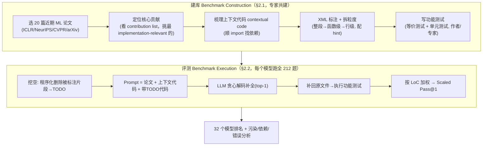

# 组会汇报 · ResearchCodeBench：能不能把「最新论文里的新想法」写成跑得过的代码？

> 主讲提示：这是 E 组（评测）里最「锋利」的一篇——它不测「复现旧结果」也不测「修 GitHub bug」，而是把刀架在一个更难的脖子上：**把一篇模型训练截止日之后才出现的新论文的核心贡献，从文字翻译成能通过单元测试的代码**。开场一句话定调：**「会改 bug ≠ 会实现新想法」**。

---

## 1. 封面 · TL;DR

- **标题 / 出处**：*ResearchCodeBench: Benchmarking LLMs on Implementing Novel Machine Learning Research Code*，Tianyu Hua 等，**Stanford University**，arXiv 2506.02314（v1，2025-06-02），**NeurIPS 2025**。代码与数据：`https://researchcodebench.github.io/`。
- **权威性来源**：Stanford 出品、NeurIPS 2025 收录；作者含 Weixin Liang、Nick Haber 等（与本库 The AI Scientist 引用的 Liang 2024 系列同一作者群）；致谢 James Zou、Sanmi Koyejo。它**不是又一个 HumanEval**，而是补上了「实现新贡献」这一专门空白（原文 §4 明确与 SWE-bench / SUPER / PaperBench 切分边界）。
- **这篇在干什么（一段话）**：作者把 20 篇 2024–2025 顶会/arXiv 的 ML 论文，逐篇拆出**最能代表其「新贡献」的核心代码段**，在原实现里把这段挖空成 TODO（填空式 fill-in-the-blank），连同**整篇论文 + 同项目上下文代码**一起喂给 LLM，让它**把缺失代码补全**；补回原文件后**跑作者/专家手写的功能测试**判对错。共 212 道题。主指标是按代码行数加权的 **Scaled Pass@1**。结论：**最好的 Gemini-2.5-Pro-Preview 也只有 37.3%，O3(High) 32.3%、O4-mini(High) 30.8%**，即 SOTA 也实现不了 40% 的新代码（原文 Abstract、Fig.2、§3）。

- **3 条带走的结论**：
  1. **「实现新想法」是一道真正的硬墙**：即便给了整篇论文当参考，最强模型也 <40% 通过；错误里 **58.6% 是功能错误（逻辑对不上论文）**，而非语法/import 这类低级错（原文 Fig.5、§3.4）——瓶颈是**语义对齐**，不是写 Python。
  2. **污染可控、且控了之后分数还会再掉**：20 个代码仓库**全部在 2023-12 之后建库、13/20 在 2025 年才首次提交**，晚于所有被测模型的知识截止；在「13 篇污染安全子集」上**所有模型都明显掉分**（原文 §3.1–3.2、Fig.3），说明分数不是背出来的。
  3. **「读懂论文」确有用、但只对强模型有用**：给论文 vs 不给论文，强模型（Gemini-2.5-Pro、O3）相对提升最高 **~30%**；而小模型（GPT-4.1-Nano 等）几乎无提升、**所有 LLaMA 系给了论文反而更差**（长文档稀释/混淆）（原文 §3.3、Fig.4）。

> 主讲提示：把「<40%」「功能错误 59%」「污染安全子集还会掉分」三个数当成全场记忆锚点。这三点分别对应：**任务有多难 / 难在哪 / 难得是否可信**。

---

## 2. 问题与动机（why —— 本篇最该讲透的一节，2 页）

### 2.1 问题层 why：为什么「评 AI 做研究」这件事，今天还没评好？

原文 §1 开宗明义点出**两道独立的坎**：

**坎一：严谨评估 AI-for-ML 本身就难。** 现在很多「AI 做科研」的评测靠**主观打分**——要么 LLM 当裁判（LLM-as-judge），要么模拟同行评审（peer-review simulation）。这类方法**与真实代码执行常常不一致、会漂移、会继承底座模型的偏见**（原文引 Jin 2024、Russo Latona 2024、Li 2025a）。传统代码生成评测（如 SWE-bench / HumanEval）之所以可信，是因为它们有**明确、可执行的测试用例直接衡量功能正确性**（引 Jimenez 2024）。没有这种客观判据，你根本说不清模型到底有没有把研究者的意图变成正确代码。

**坎二：「研究级代码生成」的关键是『创新』，不是『复用』。** 科研编码不是把已知算法再敲一遍，而是**实现别人刚提出的新想法（novel ideas）**。而这些想法的「新」恰恰带来一个独特困难：**它们往往出现在模型预训练截止日之后**——于是评估既**时间敏感（time-sensitive）**又**本质上难（intrinsically difficult）**：你既要保证模型没见过，又要保证题目真的考「理解 + 推理 + 实现」而非「检索记忆」。

> **一句话动机**：现有 benchmark 要么不客观（主观评审），要么不考「新」（复用已知算法 / 复现旧实验）。ResearchCodeBench 要同时满足**客观（可执行测试）+ 真新（截止日后、专家共建）**。

### 2.2 设计层 why：为什么不直接复用 SWE-bench / SUPER / PaperBench？（关键对比，最该被追问）

这是组会上最该展开、也最能体现「读懂没读懂」的一层。把几条朴素替代逐一否掉：

> **Why（设计层）**：
> - **朴素替代 A：用 SWE-bench / HumanEval。** → 它们考的是「修真实 GitHub bug / 实现常见函数」，本质是**软件工程与已知套路**，**不含『实现一个刚发表的新贡献』**。会修 bug ≠ 会把新损失函数/新采样器从论文翻成代码。
> - **朴素替代 B：用 SUPER (Bogin 2024) / CORE-Bench (Siegel 2024)。** → 它们聚焦**搭环境、跑通仓库、保证可复现**（reproducibility / setup & execute），即「让旧代码重新跑起来」；**不隔离『核心概念实现』这一最难内核**。
> - **朴素替代 C：用 PaperBench (Starace 2025)。** → 它评 agent **端到端复刻整篇论文**，**把核心实现挑战与大量软件工程杂活缠在一起**，又慢又贵，且常需 **LLM-as-judge** 打分（可靠性存疑）。
> - **本文的选择 Z**：把任务**收窄到「核心贡献的概念实现」这一个内核**——剥掉搭环境、剥掉工程杂活，只留「论文里那段新东西，你能不能写对」；判定改用**确定性、可执行的测试**而非 LLM 评审。所以它**更快、更便宜、更可靠**（原文 §4 原话：isolates the core conceptual implementation challenge … relies on deterministic, execution-based tests rather than LLM judgments，markedly cheaper and faster）。

**不这么做会怎样**：你会把「不会实现新想法」和「不会配 CUDA 环境 / 不会改 1000 行工程代码」混在一个分数里，永远分不清模型到底卡在哪。ResearchCodeBench 的全部设计，都是为了让那个分数**只反映「实现新贡献」这一件事**。

> 主讲提示：这一节讲透了，后面 how 全顺。一句话概括四个对手：**SWE-bench 修旧 bug、SUPER 跑旧仓库、PaperBench 复刻整篇、本文只考那段新代码**。

### 2.3 「复现旧结果 vs 实现新想法」——本篇的灵魂区分

把这条单独拎出来（也是本篇侧重要求）。两件事看似都叫「research code」，难度来源完全不同：

| 维度 | 复现旧结果 (reproduce) | **实现新想法 (implement novel)** ← 本文 |
|---|---|---|
| 代码是否在训练数据里 | 大概率**在**（老仓库、被反复 fork） | **不在**（截止日后才出现） |
| 主要能力 | 检索记忆 + 跑通环境 | **读懂论文 → 推理 → 翻译成代码** |
| 失败模式 | 环境/依赖/版本 | **语义/逻辑对不上论文**（functional error） |
| 代表 benchmark | SUPER、CORE-Bench、（部分）SWE-bench | **ResearchCodeBench** |
| 防作弊关键 | 难（老代码已泄漏） | **可控**（用建库时间切污染安全子集） |

> 主讲提示：强调一句——「**复现考记忆，实现考理解**」。正因为考的是「截止日后的新东西」，污染控制才不是锦上添花，而是**这套评测能不能成立的前提**（见 §10）。

---

## 3. 研究问题 / 核心 intention（形式化成一句话 + 假设）

把要解决的问题压成一句：

> **给定 ①一篇研究论文、②该论文同项目里一段含 TODO 标记的目标代码、③同项目的相关上下文代码，LLM 能否把 TODO 处缺失的「核心贡献实现」补全，使补全后的代码通过专家手写的功能正确性测试？**

它隐含的**假设**：
- **(H1) 可隔离性**：一篇论文的「新贡献」可以被**良好定界、独立可测**地切成若干代码补全任务（原文 §2.1：当一篇论文有多个贡献时，只要各自 well-scoped 且 independently testable，就分开评）。
- **(H2) 执行判据足够**：用「等价测试 + 单元测试」组成的执行判据，能可靠区分「实现对」与「实现错」（原文 §2.1 Table 1 论证，详见 §7）。
- **(H3) 污染可证伪**：用「仓库首次提交时间晚于模型知识截止」可作为「模型没见过这段代码」的**可靠下界**（原文 §3.1）。

---

## 4. 相关工作定位（站在谁肩上、和谁不同）

依据原文 §4。把 ResearchCodeBench 放进「LLM 评测 → 代码评测 → AI-for-science 评测」的坐标里：

| 方向 | 代表 benchmark | 考什么 | 与本文的关系 |
|---|---|---|---|
| 通用代码生成 | HumanEval / MBPP / LiveCodeBench / BigCodeBench | 通用编码能力 | 不含「研究新贡献」 |
| 软件工程 | **SWE-bench** (Jimenez 2024) | 解真实 GitHub issue | 修旧 bug，非实现新想法 |
| 研究理解（非代码） | ScienceQA / MathQA | 读懂科学问题 | 不落到可执行代码 |
| 跑通/复现研究仓库 | **SUPER** (Bogin 2024)、**CORE-Bench** (Siegel 2024) | 搭环境、保证可复现 | 让旧代码重新跑，不隔离核心实现 |
| 领域科学编码 | **SciCode** (Tian 2024) | 领域特定科学代码 | 偏既有领域知识 |
| ML 工程 / agent | **MLE-bench** (Chan 2024)、**MLAgentBench**、**MLGym** (Nathani 2025) | ML 工程、实验、agentic 任务 | 偏工程与实验闭环 |
| 端到端复刻论文 | **PaperBench** (Starace 2025) | agent 从零复刻整篇论文 | 把核心实现与工程杂活**缠在一起**、慢/贵、常用 LLM 评审 |
| **本文** | **ResearchCodeBench** | **把论文核心新贡献写成可测代码** | **剥离工程杂活，只考概念实现；确定性执行测试；社区可扩展** |

> 主讲提示：一句话——「别人要么考旧代码、要么把新代码和工程杂活混着考；它把『论文里那段新东西』**单独切出来、用跑测试的方式**考」。这正是它相对 PaperBench 的「**更窄但更准、更快更便宜**」增量。

---

## 5. 方法总览（big picture，先直觉后形式）

整体是「**一次构造（建库）+ 一次执行（评测）**」两条流水线（对应原文 Figure 1 任务示意 + §2.1/§2.2）：



**直觉**：建库像「专家出题」——挑出每篇论文最「新」的那段代码，把它挖空、配好提示、写好判分测试；评测像「闭卷考试」——给学生（LLM）论文当开卷参考 + 周边代码当脚手架，让它把空填上，再用自动判分器判对错。**关键创新点全在「出题」的严谨**：与作者共建、按代码行数分难度、用执行测试判分、用建库时间防作弊。

> 主讲提示：让听众记住四个「出题」零件——**选贡献 / 配上下文 / 拆粒度+hint / 写执行测试**；以及评测端那一条「挖空→补回→跑测试」。

---

## 6. 符号与术语表（后文统一用）

| 记号 / 术语 | 含义 |
|---|---|
| snippet（片段）$s$ | 一道题：原实现里被挖空、待 LLM 补全的一段代码 |
| $S_{\text{all}}$ | 全部评测片段集合（本文 $\lvert S_{\text{all}}\rvert=212$） |
| $S_{\text{passed}}$ | 补全后**通过全部正确性测试**的片段集合，$S_{\text{passed}}\subseteq S_{\text{all}}$ |
| $\mathrm{LoC}(s)$ | 片段 $s$ 的**可执行代码行数**（lines of code，排除注释与空行），按 ground-truth 实现计 |
| contextual code（上下文代码） | 实现核心贡献时要用到的、同仓库别处定义的对象/模块/训练循环等（顺 import 找出） |
| fill-in-the-blank（填空式） | 把核心实现挖空成 TODO、让模型补全的任务形式 |
| hint（提示） | 配给每个片段的一句自然语言，描述缺失代码**意图**但不泄露答案 |
| equivalence test（等价测试） | 把「预测实现」与「参考实现」喂同一输入、比对输出是否一致的测试 |
| unit test（单元测试） | 验证函数特定性质（如梯度、阈值行为、可学习性）的测试 |
| Pass@1 / Scaled Pass@1 | 朴素通过率 / 按 LoC 加权的通过率（top-1、贪心解码，定义见 §7） |
| contamination-safe subset（污染安全子集） | 首次提交晚于所有模型知识截止（2025-01）的 **13** 篇论文构成的子集 |
| greedy decoding（贪心解码） | 每步取概率最高 token，无随机性 → 结果可复现（本文统一采用） |

---

## 7. 方法细节 ① 指标定义式（本篇核心：评测怎么判分）

> 主讲提示：这是 Benchmark 论文的「心脏」。组会上最容易被问「这个分到底咋算的、为什么这么算」。两条公式一定要逐符号讲清。

### 7.1 朴素通过率 Pass Rate —— 先有，再看它哪里不好

**直觉 / 为什么要它**：最自然的想法是「答对的题数 ÷ 总题数」，衡量模型能正确实现多大比例的片段。

记号（先定义，后用式）：$S_{\text{all}}$ 为全部评测片段集合；$S_{\text{passed}}$ 为通过全部正确性测试的片段集合；$\lvert\cdot\rvert$ 取集合元素个数。

$$ \text{Pass Rate} \;=\; \frac{\lvert S_{\text{passed}}\rvert}{\lvert S_{\text{all}}\rvert}. $$

**读出什么**：就是「答对比例」。**它的毛病（原文 §2.2 原话）**：它**对所有片段一视同仁**，不管这段是 1 行的小补丁还是 50 行的硬核实现——于是**会高估「净答简单题」的模型**（potentially overemphasizing trivial completions）。

### 7.2 加权通过率 Scaled Pass Rate —— 用「代码行数」纠偏

> **Why（设计层）**：朴素替代是「每题等权」→ 模型只要专挑短小、低风险的片段答对就能刷分，掩盖「难题全错」。本文改用**按可执行代码行数 $\mathrm{LoC}$ 加权**：越长、越实质的补全对总分贡献越大，**让分数正比于「实现了多少真东西」**（原文 §2.2）。

**直觉**：把每道题的「分量」设为它的可执行代码行数——实现一段 40 行的新采样器，本就该比补一行 `return` 更值钱。

记号（先定义）：$\mathrm{LoC}(s)$ 为片段 $s$ 在 ground-truth 实现里的可执行行数（不含注释/空行）；其余同上。

$$ \boxed{\;\text{Scaled Pass Rate} \;=\; \frac{\displaystyle\sum_{s\in S_{\text{passed}}}\mathrm{LoC}(s)}{\displaystyle\sum_{s\in S_{\text{all}}}\mathrm{LoC}(s)}\;} $$

**读出什么**：分子是「答对片段的总代码行数」，分母是「全部片段的总代码行数」。它衡量的是**「模型正确实现的代码占全部应实现代码的比例」**——把通过率从「按题数」改成「按工作量」。若两个模型答对题数相同，但 A 啃下的是更长更难的片段，A 的 Scaled Pass Rate 更高。

### 7.3 主指标：Scaled Pass@1（top-1、贪心）

**直觉 / why**：`pass@k` 本是「采 $k$ 个样、至少一个对」的概率式期望；但本文要**可复现、可比较、低成本**，于是只取**第一个（top-1）补全**、用**贪心解码**（无随机性）。把它代入 §7.2 的加权式，就是主指标 **Scaled Pass@1**（原文 §2.2 末、§3）。附录 F 另给未加权的 vanilla **Pass@1**（Fig.6）作参考。

记号补充：pass@1 即对每题只生成一个补全、判其是否通过；「scaled」即按 §7.2 用 $\mathrm{LoC}$ 加权聚合。形式上，令 $\mathbb{1}[s\ \text{passed}]$ 为片段 $s$ 在其唯一一次贪心补全下是否通过（取 0/1），则

$$ \text{Scaled Pass@1} \;=\; \frac{\sum_{s\in S_{\text{all}}}\mathrm{LoC}(s)\cdot \mathbb{1}[s\ \text{passed}]}{\sum_{s\in S_{\text{all}}}\mathrm{LoC}(s)}. $$

**读出什么**：这正是 Fig.2 排行榜的纵轴。Gemini-2.5-Pro 的 37.3% 意思是——**按代码行数算，它只正确实现了全部应实现代码的约 37%**。

### 7.4 判分器：为什么是「等价测试 + 单元测试」混合（原文 §2.1 + Table 1）

> **Why（设计层）**：四种判分法各有命门（原文 Table 1，按「是否需参考实现 / 搭建成本 / 可靠性」三轴对比）：

| 判分法 | 需参考实现 | 搭建成本 | 可靠性 | 命门 |
|---|---|---|---|---|
| 字符串距离（edit dist / CodeBLEU） | 是 | 低 | 中 | 对语法/命名过度敏感，**不保证行为正确** |
| 表示距离（CodeBERT） | 是 | 低 | 中 | 抓语义更好，但**仍不保证行为等价** |
| LLM 当裁判 | 可选 | 低 | **不确定** | 不一致、继承底座偏见；**讽刺的是 LLM 裁判自己也常用测试来评**（引 Tong & Zhang 2024、Wang 2025） |
| **等价测试** | 是 | 中 | **高** | 易写、可扩展；**个别 edge case 会漏判**（见附录 A） |
| **单元测试** | 否 | 高 | **高** | 人工成本高，但能抓**逻辑/语义错** |

**本文的选择**：以**等价测试为默认**（易用、可扩展：把预测实现和参考实现喂同一批输入比对输出），并以**单元测试为高精度补充**（专抓等价测试不敏感的 edge case）。两者合用 → 既可扩展又可靠（原文 §2.1）。

**附录 A 的「ML 测试坑」（why 这套测试要专门设计）**：ML 代码的等价测试有标准软件测试没有的微妙之处——
- **梯度检查**：损失 $L$ 与 $L+C$（$C$ 常数）**前向输出可不同但梯度相同**，对训练行为等价；故对优化类组件要**直接验证梯度**，光比前向值不够。
- **阈值附近的标量比较**：`clamp`、`>` 等在阈值点的实现差异会改变行为，要**专门在阈值附近取点**测。
- **有状态/随机组件**：优化器、学习率调度、采样器有内部状态/随机性，需**多步执行看状态演化**、用**固定随机种子 + 固定输入**保证确定性。
- **集成测试**：补单元测试之外，再用「迷你模型 + 极小 batch + 一两步」的小型训练循环测组件交互。

> 主讲提示：把 Table 1 这张「四选二」讲清——它回答了「为什么 ResearchCodeBench 比 LLM 评审可信」。再点一句：**附录 A 那几条 ML 测试坑，正是『为什么测试必须人写、自动生成测试还不行』的证据**（原文明说自动化测试生成在研究代码上有局限，引 Jain 2024）。

---

## 8. 方法细节 ② 建库：怎么「出题」才严谨（原文 §2.1）

### 8.1 选论文（Paper Selection）

从顶会（ICLR / NeurIPS / CVPR）与 arXiv 选 **20 篇近期 ML 论文**，覆盖生成模型、计算机视觉、理论、强化学习等（题材广度见原文 Table 2，20 篇全列）。优先选**核心贡献既被论文讲清、又在开源仓库里干净实现**的论文；并尽量**与原作者合作共建**任务与测试，以保证与论文原意对齐。对有 LaTeX 源的论文用 `latexpand` 合并文件去注释；无源码时用 SOTA OCR（Mistral OCR）把 PDF 转 Markdown。

> **Why（设计层）**：朴素做法是随便抓仓库自动挖空 → 容易挖到无关代码、测试也对不上原意。**与作者共建 + 挑「贡献清晰且实现干净」的论文**，是把「题目真考新贡献」这件事**锚在人类专家判断上**（原文 §2.4 称此为 High-quality and Trustworthy 的来源）。

### 8.2 定位核心贡献 + 梳理上下文代码

- **定位核心贡献**：读论文的 contribution list，挑**最 implementation-relevant** 的那条——小到「定义一个新损失函数的一行」，大到「一整套训练流程」；一篇有多个贡献且各自 well-scoped、independently testable 时，**分开评多于一条**。
- **上下文代码 contextual code**：核心实现常依赖仓库别处定义的对象/模块（如某个模型类、损失函数、训练循环）。顺着**核心文件的 import 语句**找出这些依赖。它有两个用途：(1) 让模型**看得懂、写得出**目标代码；(2) 保证跑测试时**运行期依赖满足**。处理上分两种：**给 LLM 看时**只放「直接相关的最小集」；**为了能执行评测**，则保留所有跑通所需文件（哪怕是很远的依赖，对模型无信号但执行必需）。

### 8.3 标注 + 拆粒度 + 配 hint（让题目有难度梯度）

- **XML 式标注**：用注释里的 XML 标签（`<ResearchCodeBench hint="...">` … `</ResearchCodeBench hint="...">`）框出片段（附录 B 给出正式语法：标签须独占一行、按宿主语言注释前缀、`hint` 在同文件内唯一、可任意嵌套）。评测时**程序化删除被标注片段**，让模型据论文 + 上下文补全。
- **拆成层级粒度**：整段核心贡献往往几十行、对模型太难，于是**自顶向下拆**成函数级、再到行级的小片段；**每个内层（更小）片段不会比包裹它的外层更难**（因为它有更多上下文）。这样一篇论文就形成一个**难度梯度**的题目树。
- **配 hint**：最初让 LLM 直接补「某位置缺失的行」，发现有些片段**太含糊、没法准确补**；于是给每个片段配一句**自然语言 hint**——只说**意图**、不泄露答案，**降低歧义、聚焦补全**。

> **Why（设计层）**：朴素做法是「整段一次性挖空、不给 hint」→ 题目要么太难（几十行无从下手）要么太歧义（同一位置多种合理写法）。**层级拆分 + hint** 把「一道天书大题」变成「带梯度、目标明确的一组题」，使分数能**细粒度反映难度**（原文 §2.1）。

### 8.4 社区驱动扩展（原文 §2.3）

提供**轻量在线提交管线**（Google 表单），研究者可提交「论文 + 仓库链接 + 核心代码段描述 + 引导测试设计的注释」；维护者按相关性/可得性/新颖性审核，纳入同一套建库流程；贡献者计入贡献者名单。**目的**：让 benchmark 随最新 ML 代码**持续生长、共同所有**——这是对抗「benchmark 一发布就开始老化」的设计（原文 §2.4 Flexible and Extensible）。

---

## 9. 实验设置与主要结果（setting / metrics / params 全 + 数字解读）

### 9.1 实验设置（写全）

- **规模**：**20 篇论文 / 212 道题**（snippets）。
- **被测模型**：**32 个**主流商用/开源模型，来自 **10 家**公司（Amazon、Anthropic、Cohere、DeepSeek、Google、Meta、Mistral、OpenAI、Qwen、xAI）。**只选长上下文模型**——因为每题要吞「整篇论文（平均 ~30k tokens）+ 部分实现代码（平均 ~20k tokens）」（原文 §3）。
- **解码**：统一**贪心解码**（greedy，可复现），主指标 **Scaled Pass@1**（top-1）。
- **判分**：等价测试 + 单元测试（§7.4）。
- **算力/成本（核心卖点）**：评测**不需要 GPU 或云 API**，整个 benchmark 在**单台 Docker / Conda 环境本地跑**；平均**每题在 M1 MacBook Pro 上仅 ~1.25 秒**评测（原文 §2.4 Lightweight and Efficient）。
- **随机性控制**：测试用**固定随机种子 + 固定输入**保证确定性（附录 A、D 的样例 `torch.manual_seed(42)`）。
- **Prompt（附录 E）**：两套模板——「带论文上下文」`You are an expert in reproducing research code from a paper. … {paper_str} … {context_code+masked_code} …` + 6 条格式约束（只补 TODO 处代码、严格保持缩进、不要重写函数签名、用 ```python 包裹、有论文就拿来当参考）；「不带论文」版去掉 paper、变成纯代码补全。

> 主讲提示：强调两点反差——**输入很重（50k tokens 量级）**，但**评测极轻（1.25s/题、纯 CPU）**。后者是它「社区可持续刷」的物质基础。

### 9.2 主结果：排行榜（原文 Fig.2，Scaled Pass@1）

> 主讲提示：先报「天花板」，再报梯队，最后报「开源 vs 闭源差距」。

- **最强 ≈ 37%**：**Gemini-2.5-Pro-Preview = 37.3%**（最高）；其后是 OpenAI 的 **O3(High) = 32.3%**、**O4-mini(High) = 30.8%**（原文 Abstract 明确这三个数）。再后是 Claude 系。
- **一句话**：**没有任何模型通过 40%**——「即便最好的模型也只对 <40% 的代码」（原文 Abstract、§2、Fig.2）。
- **结构性差距**：**闭源 frontier 模型整体领先开源同行**，且差距**持续存在**（原文 §3：a persistent performance gap between leading proprietary models and their open-source counterparts）。
- **vanilla Pass@1（附录 F、Fig.6）**：未加权的通过率绝对值更高（最高 ~60% 量级），相对排名与 Scaled 版大体一致——说明**加权主要压低了「靠短题刷分」的虚高**，而非改变格局。

**结果层 why（为什么是 ~37% 而不是 ~80%）**：因为题目考的是「**截止日后的新贡献 + 必须逻辑正确**」。模型在通用编码上早已很强，但**把论文的新数学/新机制精确翻成代码**需要真正读懂论文并推理——这正是当前 LLM 最薄弱处（佐证见 §9.5 错误分析：59% 是功能错误）。

### 9.3 污染分析：分数是不是「背」出来的？（原文 §3.1，Fig.3 左）

**Why（问题层）**：题目越「新」越值钱，但也越要担心「模型其实在预训练里见过这段代码」。必须证明**最小污染风险**。

**做法**：把每家公司模型的**最近已知知识截止日**（横向彩线）与 20 个目标仓库的**首次/最近提交日**（红/绿星）叠在同一时间轴上比。

**关键事实（原文 §3.1 原话）**：
- 多数模型截止日在 **2023-08 ~ 2024-12** 之间；Gemini-2.5-Pro-Preview 变体（3-25 / 5-06 发布）延到 **2025-01**。
- **所有 20 个仓库都建于 2023-12 之后**；**20 个里有 13 个的首次提交在 2025 年**，晚于最近 Gemini-2.5-Pro-Preview 的知识截止。
- 结论：**这强烈表明 benchmark 任务在预训练阶段对任何被测模型都不可得**，确认了**最小污染风险**。首次提交日是「代码何时可能可得」的**可靠下界**（即便公开发布日难精确定位）。

> 主讲提示：这就是 §2 埋下的「污染可控」兑现处。把「13/20 在 2025 才首次提交」当成一句硬证据：**模型不可能背过 2025 年才写出来的代码**。

### 9.4 污染安全子集：控了污染，分数会怎样？（原文 §3.2，Fig.3 右）

**Why（设计层）**：仅证「风险低」不够，还要**量化污染的影响**。于是对比两组：(i) 全量 20 篇；(ii) **首次提交晚于最近模型截止（2025-01）的 13 篇「污染安全子集」**。

**关键结果**：在更新的污染安全子集上，**所有模型都明显掉分**（a noticeable drop）。这说明这批论文**更难、也更安全地处于分布外（out-of-distribution）**。但**掉分之后，推理型模型（Gemini-2.5-Pro、O3(High)）依旧稳定领先**标准模型（GPT-4.1、Claude 3.5 Sonnet），优势在污染安全子集上**仍然保持**。

**读出什么（结果层 why）**：掉分=排除了「可能见过」的便宜分，剩下的是「真·实现新代码」的硬实力；强模型的领先不是靠记忆，而是靠**更强的论文理解 + 推理**——所以在「保证没见过」的子集上优势照样在。更广地说：**ResearchCodeBench 允许按仓库时间线对污染做细粒度切片控制**，这点随研究代码不断「在 LLM 训练数据之外涌现」而愈发重要（原文 §3.2）。

> 主讲提示：这是全篇方法论最漂亮的一招——**用「建库时间」当一把可调的污染滤网**：想要更干净的评估，就只取「首次提交晚于某截止日」的子集。把它和 §10「我们能借走的招」连起来。

### 9.5 论文到底有没有用？（原文 §3.3，Fig.4）—— 依赖分析

**Why（问题层）**：这是 benchmark 的「效度」检验——如果给不给论文都一样，那它就退化成普通代码补全、「论文理解」无从谈起。

**做法**：对比「给整篇论文 + 代码」（原设定）与「去掉论文、只给代码」（纯补全）的成功率差。

**关键结果**：
- **强模型显著获益**：Gemini-2.5-Pro、O3(High) 等有论文时相对自身**最高提升 ~30%**。
- **弱模型几乎无感**：GPT-4.1-Nano、GPT-4o-Mini 等提升甚微——**要么用不动论文、要么压根没尝试用**。
- **LLaMA 系反而更差**：所有被测 LLaMA 模型给了论文**性能下降**，提示**长学术文档可能带来上下文稀释/混淆**（context dilution or confusion）。
- **逐题视角（Fig.4 右）**：212 题的「有论文 vs 无论文成功率」散点中，**86 题（40.6%）有论文更好、75 题（35.4%）无论文更好**，多数点贴在对角线（两种条件都能解）；但**左上区有一批题只有给论文才解得出**——这些题凸显**论文理解对某些研究型编码问题是关键**。

> 主讲提示：这一节证明了「**这套题真的在考读论文**」——至少对强模型如此。一句尖锐的话：**给 LLaMA 论文它反而更糊涂**，说明「会用长上下文消化论文」本身就是一种能力分水岭。

### 9.6 错误分析：到底错在哪？（原文 §3.4，Fig.5）

**做法**：把每个模型测试失败时的**异常信息**全收集，用 GPT-4o-Mini 按七类分类法归类（附录 G 给七类定义与精确 prompt），跨模型汇总成饼图。

**七类错误分布（原文 Fig.5）**：

| 错误类型 | 占比 | 含义 |
|---|---|---|
| **Functional Errors（功能错误）** | **58.6%** | 代码能跑但**功能测试不过**（算法输出对不上论文）——语义错 |
| Name Errors | 9% | 未定义/拼错标识符（`NameError`） |
| Type Errors | ~8% | 类型不兼容（`TypeError`） |
| Syntax Errors | ~8% | 语法/缩进违规（`SyntaxError`/`IndentationError`） |
| Import Errors | 6.9% | 找不到模块/符号（`ImportError`/`ModuleNotFoundError`） |
| Attribute Errors | 6.3% | 访问不存在的属性/方法（`AttributeError`） |
| Index/Key Errors | 2.3% | 越界索引/缺键（`IndexError`/`KeyError`） |

**读出什么（本篇最重要的诊断）**：**近 60% 的失败是「功能错误」——代码语法没问题、跑得起来，但逻辑和论文对不上**。Name/Type/Syntax 各约 8–9%，import/attribute/index 更少。结论（原文 §3.4 原话）：**LLM 早已基本掌握 Python 语法与变量管理，剩下的错误压倒性是语义性质的**；**主要挑战是「与论文描述的算法贡献做语义对齐」，而非低级语法**。未来应**强化科学推理**以压低这类逻辑错误。

> 主讲提示：把这条当全篇结论的锚——**「不是不会写代码，是不会把论文的新想法写对」**。这也解释了为什么给强模型论文能涨分（补的正是「语义对齐」这块短板）。

---

## 10. 局限与批判（诚实区分宣称 vs 局限）

**原文 §5 自承的局限**：
1. **规模小、只限 ML**：当前仅 20 篇、纯机器学习。作者说这是**为保证质量与可行性而刻意为之**，正用社区管线扩到机器人/生物/物理。
2. **测试靠人手写**：保证了高质量，但**限制可扩展性**；附录 A 探讨了自动化测试生成的当前失败模式（引 Jain 2024），自动化可靠造测试尚不成熟。
3. **没有人类基线**：标准 benchmark 能用众包工人当基线，但本任务要**专家级实现能力**，获取人类成绩**过于昂贵耗时**，故无人类分数。作者辩称：即便没有人类分，「考新贡献 + 严谨可复现执行」已是有意义的 LLM 测试床。

**我 / 社区可补的批判（区分于原文）**：
- **判分器仍有盲点**：等价测试「个别 edge case 会漏判」是作者自承（附录 A）；**单元测试的覆盖度由出题人决定**，可能存在「测试没覆盖到的错误实现也被判过」的假阳性——这类 false-pass 在论文里**未给量化**（原文未给出测试覆盖率数字）。
- **错误分类用 GPT-4o-Mini 打标**（§3.4）：用一个 LLM 给错误归类，**本身可能有分类噪声**；59% 这个比例的置信区间**原文未给出**。
- **「污染安全」是下界论证、非证明**：用「首次提交时间」作下界很合理，但**无法排除「同一想法的早期变体/预印本/作者博客」在截止日前已泄漏**思想（虽非这段确切代码）——这层「思想污染 vs 代码污染」原文未区分。
- **hint 的双刃剑**：配 hint 降歧义，但**hint 本身泄露了多少信息、不同 hint 力度对分数的影响**，原文未做消融（无「有/无 hint」「强/弱 hint」对照实验）。
- **top-1 / 贪心**：只取首个补全，**未报告 pass@k（k>1）下的潜力上限**（正文未给，仅附录给 vanilla pass@1）——这低估了「采样多次能不能做对」的能力。

> 主讲提示：批判时务必分清——**「<40%」「59% 功能错」是实测可信结论**；而「测试覆盖率、hint 消融、思想污染、pass@k 上限」是**原文未给出**的开放问题，别替作者吹也别替作者背。

---

## ★ 对我们的启发（Inspires Us）

> 这一节回答：ResearchCodeBench 对我（们）接下来要做的研究，**到底能用上什么**。

- ➤ **a. 可直接借用的招（reuse）**：
  1. **「建库时间当污染滤网」**——用「仓库首次提交日 > 模型知识截止日」自动切出**污染安全子集**，并**对比全量 vs 安全子集的分数差**来量化污染影响。这套机制可**原样搬进** [`m9.6-evaluating-research-agents`](../m9.6-evaluating-research-agents/) 的评估沙箱：给每个任务打上 `first_commit_date`，评测时支持「只取晚于某日期」的开关，让我们的任何评测都能**一键生成防泄漏切片**。
  2. **「LoC 加权聚合」抗刷分**——把「按题数」改成「按可执行代码行数加权」，**让分数正比于实现的真工作量**。凡是我们做「补全/生成」类评测，都该用它**压掉「净答短题刷高分」的虚高**（对应 §7.2 的设计层 why）。
  3. **「等价测试为主 + 单元测试补 edge case」+ 附录 A 的 ML 测试坑清单**（验梯度而非前向值、阈值附近取点、有状态组件多步测、固定种子保确定性）——这是一份**现成的「怎么给 ML 代码写可信判分器」checklist**，可直接用于我们任何「执行判分」管线。

- ➤ **b. 可迁移到我们课题（transfer）**：把它的核心思想——**「实现新贡献」而非「复现旧结果」**——映射到 [`m9.6`](../m9.6-evaluating-research-agents/) 和 [`m9.2-research-agent-core`](../m9.2-research-agent-core/)：我们现有的 research-agent 评测多偏「跑通/复现」，可加一档**「截止日后新论文的核心实现」**任务，专测 agent 的「读论文→写对代码」。**迁移时要改的前提**：必须能**与原作者/领域专家共建测试**（否则判分器不可信），且任务要**真能被良好定界、独立可测**（H1）——做不到这两点，这套评测就退化成普通代码补全。

- ➤ **c. 它暴露的开放问题 = 我们的机会（opportunity）**：
  - **缺口①：测试覆盖率与 false-pass 未量化**（§10）。→ 机会：给 ResearchCodeBench 风格任务加一层「**变异测试（mutation testing）**」——故意把参考实现改坏，看测试能否抓住，量化判分器的真实严格度。**第一步**：在 m9.6 里挑 3–5 道题，对 ground-truth 注入 5 类已知 bug，统计测试漏判率。
  - **缺口②：思想污染 vs 代码污染未区分**（§10）。→ 机会：除「代码首次提交日」外，再追踪「**思想首次公开日**（预印本/博客/talk）」，做双重污染切片，看二者对分数的不同影响。
  - **缺口③：无人类基线、无 pass@k 上限**。→ 机会：用「少量专家 + pass@k 采样」估一个**人类/上界参照**，把「<40%」放进「离人类还有多远」的尺子里。

- ➤ **d. 与本库其它论文/模块的连接（connect the dots）**：
  - **与 [`2504.01848` PaperBench](2504.01848-paperbench-openai.md) 互补对照**：PaperBench 测「**端到端复刻整篇**、LLM 评审打分、慢而贵」；ResearchCodeBench 测「**只考核心实现、执行测试、快而便宜**」。两者恰好是「**整体 vs 内核**」「**LLM 裁判 vs 确定性测试**」的一对——汇报时可并排，说明「评 AI 做研究」有「宽而粗」和「窄而准」两条路。
  - **与 [`2505.24785` EXP-Bench](../papers/2505.24785-exp-bench-ai-experiments.pdf) 形成「实现 vs 实验」两翼**：EXP-Bench 考「从论文设计并跑完整实验」，ResearchCodeBench 考「把论文那段新代码写对」——前者是**实验闭环**、后者是**实现内核**，合起来覆盖「AI 做研究」的两大子能力。
  - **给 [`m9.6-evaluating-research-agents`](../m9.6-evaluating-research-agents/) 沙箱补「真任务」**：m9.6 此前多用合成/缩小任务演示评估机制；ResearchCodeBench 提供了**一批真·难、真·防污染**的执行型任务，正好把沙箱从「演示」升级到「实战」。
  - **呼应 The AI Scientist / AlphaEvolve 的「可验证判据」主线**：和 AlphaEvolve「只认可自动验证的分数」一脉相承——**确定性执行测试 = 抗幻觉的硬地基**；而 §10 的 false-pass 风险，又与 [`m9.8` 红队与诚信](../m9.8-redteam-and-integrity/) 的「评测也会被钻空子」直接呼应。

- ➤ **e. 如果我来做下一步（my next move）**：我会在 [`m9.6`](../m9.6-evaluating-research-agents/) 里加一个 **「污染安全切片 + LoC 加权 + 变异测试」三件套**开关，跑一组最小对照——①验证「全量 vs 污染安全子集」是否复现「掉分但强模型仍领先」的现象；②用变异测试量化我们判分器的漏判率，看 ResearchCodeBench 式「等价测试为主」在我们任务上是否够严。**一周内能出最小结论**。

> 主讲提示：这一节是全场高潮——前面讲「Stanford 做了什么」，这里讲「**我们下周就能试什么**」。落点是 m9.6 的「时间滤网 + LoC 加权 + 变异测试」，能被同组同学直接接力。

---

## 11. 在 auto-research 版图的位置（相对已有 40 篇的增量）

- **阶梯定位**：按本库 Tool→Analyst→**Scientist** 阶梯，ResearchCodeBench 是一把**「Scientist 级能力的体温计」**——它不构建 agent，而是**量出「实现新贡献」这一 Scientist 核心子能力的上限**（<40%）。它和 The AI Scientist（自己跑闭环但靠自评）形成对照：**前者造系统、后者立标尺**。
- **它把谁向前推了一步 / 证伪了谁**：
  - **相对 SUPER / CORE-Bench（复现）**：把评测对象从「跑通旧仓库」推进到「实现新代码」——**复现→实现**的能力坐标右移。
  - **相对 PaperBench（端到端复刻 + LLM 评审）**：用「**剥离工程杂活 + 确定性执行测试**」换来**更快更便宜更可靠**，是「评 AI 做研究」方法论的一次**降本提纯**。
  - **给乐观叙事泼了一盆精确的冷水**：在 The AI Scientist / AlphaEvolve 展示「能跑通闭环 / 能做出发现」之后，ResearchCodeBench 用一个干净数字说明——**「把最新论文的新想法写成对的代码」这件最基础的事，SOTA 也只到 ~37%**。它是 E 组里**最适合给整门课「校准期望」**的一篇。
- **时间增量**：它评的是 2024–2025 最新论文（Table 2 多为 2025 年），并**自带「随社区生长」机制**——在本库里属于**最贴当下、且不会很快过期**的 benchmark。

> 主讲提示：一句话定位——**「别人造科学家，它造体温计；量出来的体温是：实现新想法，SOTA 还发着低烧（~37%）」**。

---

## 12. 复现与可用性

- **开源**：代码与数据 `https://researchcodebench.github.io/`；附录 B 给标注 XML 的**正式语法**与解析器位置（`core/annotation/models/file.py` 的 `File.parse_file`）；附录 C 给**元数据 schema**（`pset/papers.yaml`，含 `id/title/arxiv_abs/arxiv_v1_date/arxiv_date/venue/github_url/first_commit_date/last_commit_date/annotated_file_paths/context_file_paths`）——其中 `first_commit_date` 正是污染切片的关键字段。
- **能不能在单卡 / 纯 CPU 跑**：**能**。评测**不需要 GPU/云 API**，单个 Docker/Conda 环境本地即可；平均 **~1.25 秒/题（M1 MBP）**。真正的成本在**调用各家 LLM 的 API**（每题要塞 ~50k tokens 的论文+代码），而非本地执行。
- **坑**：(1) **必须用长上下文模型**（论文+代码常 >40k tokens，短上下文直接放不下）；(2) 复现排名要**统一贪心解码**，否则采样随机性会扰动；(3) 想要「干净评估」就用**污染安全 13 篇子集**，并核对自己被测模型的知识截止日是否晚于这些仓库的 `first_commit_date`。

---

## 13. 组会讨论问题

1. **「实现新想法」vs「复现旧结果」**：ResearchCodeBench 用「建库时间」证「没见过」。但「**思想**」可能在「**代码**」之前就泄漏（预印本/talk）。我们能不能、该不该把「思想污染」也纳入控制？怎么测它的影响？
2. 主指标用 **LoC 加权**。LoC 真的等于「难度/价值」吗？10 行密集张量操作 vs 10 行样板代码权重一样——有没有更好的难度权重（如圈复杂度、人类实现耗时）？
3. **59% 是功能错误**说明瓶颈是「语义对齐」。如果给模型**更结构化的论文表示**（公式抽取、伪代码、作者注释），功能错误能压到多少？这是 prompt 问题还是能力问题？
4. **判分器盲点**：等价测试会漏 edge case、单元测试覆盖率由出题人定。如何用**变异测试**量化「false-pass 率」？多大才算可信的 benchmark？
5. **给 LLaMA 论文反而更差**——「长文档稀释」。这是模型缺陷、上下文管理缺陷，还是 prompt 工程缺陷？换 RAG / 论文摘要喂入会不会反转？
6. 它**只测 top-1 贪心**。如果改成 **pass@k（k=10）**，<40% 会变成多少？「采样多次能做对」算不算「会实现」？这对「AI 是否能做研究」的判断有何不同？
7. 和 [`PaperBench`](2504.01848-paperbench-openai.md)（端到端 + LLM 评审）相比，「**窄而准的执行测试**」会不会**系统性低估**那些「整体方向对、局部实现略偏」的模型？两种评测该如何互校？
8. 它**无人类基线**。在没有人类分的情况下，「<40%」这个数对「AI 离会做研究还有多远」到底说明了什么？我们能用什么廉价代理估一条人类/上界参照？

---

## 14. 一页速记（汇报当天速览）

- **是什么**：把 20 篇 2024–2025 最新 ML 论文的**核心新贡献**挖空成 TODO，给「论文 + 同项目上下文代码」，测 LLM 能否**补全并通过执行测试**。212 题，主指标 **Scaled Pass@1（LoC 加权、top-1、贪心）**。
- **核心式**：$\text{Scaled Pass Rate}=\dfrac{\sum_{s\in S_{\text{passed}}}\mathrm{LoC}(s)}{\sum_{s\in S_{\text{all}}}\mathrm{LoC}(s)}$ —— 按「实现了多少代码」算分，而非按答对几题。
- **关键数**：最强 **Gemini-2.5-Pro 37.3%**、O3(High) 32.3%、O4-mini(High) 30.8%；**无人破 40%**；失败里 **58.6% 是功能错误**（逻辑对不上论文）；强模型给论文相对涨 **~30%**，LLaMA 给论文反而更差；逐题 86(40.6%) 有论文更好 / 75(35.4%) 无论文更好。
- **方法论亮点**：①**执行测试**（等价测试为主 + 单元测试补，比 LLM 评审可信）；②**污染控制**（20 仓库全建于 2023-12 后、13/20 在 2025 才首提交 → 13 篇污染安全子集，控了之后所有模型掉分但强模型仍领先）；③**LoC 加权**抗刷短题；④**与作者共建 + hint + 层级粒度** 保证题目真考新贡献；⑤**极轻**（1.25s/题、纯 CPU、社区可扩展）。
- **三句话结论**：实现新想法是硬墙（SOTA ~37%）/ 难在语义对齐而非语法（59% 功能错）/ 难得可信（污染可控、控后仍掉分）。
- **对我们**：把「**时间滤网 + LoC 加权 + 变异测试**」搬进 m9.6；与 PaperBench（宽而粗）、EXP-Bench（实验翼）互补，给 m9.6 沙箱补真任务。

> 主讲提示：结尾回到一句话——**「会改 bug、会复现，都不等于会把一篇新论文的新想法写成对的代码。这件最基础的事，今天最强的模型也只做到三成多。」** 这就是 ResearchCodeBench 给整门 auto-research 课校准的那条基线。
