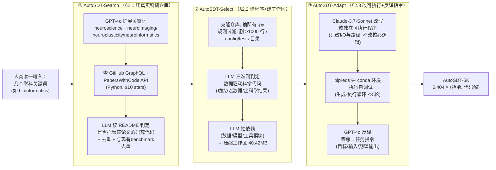

# 组会汇报 · AutoSDT：把「数据驱动发现任务」规模化，喂养开放的 Co-Scientist

> 本篇按**第二批 (v2) 规范**撰写：在前 40 篇全部硬性要求之上，额外做两件事——**① Why 三连**（问题层 / 设计层 / 结果层）；**② `## ★ 对我们的启发（Inspires Us）` 专节**。结构对齐 [`2408.06292-ai-scientist-v1.md`](2408.06292-ai-scientist-v1.md)，新增两维对齐 [`2506.13131-alphaevolve-deepmind.md`](2506.13131-alphaevolve-deepmind.md)。
>
> 一句话定位本篇在课里的角色：前面那些旗舰系统 (AI Scientist / co-scientist) 都在问「**agent 怎么做研究**」；这篇反过来问「**这些 agent 的训练/评测数据从哪来**」——它是整条 auto-research 链路的**上游供给侧**，是「数据飞轮」的第一桨。

---

## 1. 封面 · TL;DR

- **标题**：AutoSDT: Scaling Data-Driven Discovery Tasks Toward Open Co-Scientists
- **作者/机构**：Yifei Li, Hanane Nour Moussa, Ziru Chen, Shijie Chen, Botao Yu, … Xia Ning, Nesreen K. Ahmed, Ali Payani, Huan Sun（**OSU NLP Group** 主导，Cisco Research + UW–Madison 协作）。Preprint，arXiv 2025-06-09。
- **权威性来源**：① 出自 **OSU NLP Group**——正是 **ScienceAgentBench (ICLR 2025)** 的同一团队（见 [`2410.05080-scienceagentbench.md`](2410.05080-scienceagentbench.md)），所以它对「数据驱动发现任务」的定义、防污染、专家评测有方法学连续性；② 工作被 9 位学科专家 (Ph.D. 学生与教授，覆盖生信/化学/地信/心理) 实证背书；③ 代码数据公开 (https://osu-nlp-group.github.io/AutoSDT/)。

**这篇在干什么（一段话）**：构建 AI co-scientist 的最大瓶颈不是模型、而是**缺大规模高质量的训练/评测数据**——数据驱动发现任务要求「整文件级、跑在真实科学数据上、解领域专门问题」的代码，**无法像 SWE 任务那样直接从 GitHub PR 爬取**；而人工标注一个这样的任务要博士生 **2.5–3 小时**（§1）。AutoSDT 提出一条**全自动三步管线**：**AutoSDT-Search**（关键词扩展→搜真实科研仓库）、**AutoSDT-Select**（LLM 筛出数据驱动科学代码 + 抽依赖建工作区）、**AutoSDT-Adapt**（把原始代码改成独立可执行程序 + 反译出任务指令），产出 `<任务指令, 代码解>` 对。用它造出 **AutoSDT-5K**（5,404 个任务，覆盖生信/计算化学/地信/心理与认知神经科学 4 学科、756 个 Python 包），**平均每个任务仅 0.55 USD**（§3.1, Table 1）。

**3 条带走的结论**：
1. **「自动造任务」第一次被走通且便宜**：AutoSDT-5K 是作者所称**迄今最大、且唯一全自动采集**的数据驱动发现编码数据集 (Abstract / §3.1)；专家抽检 256 个任务，**93% 生态有效**（是科学家日常真会做的任务）、**92.2% 合成程序功能正确**（§3.2）。把人工 ~20 USD/任务 (按最低标注工价) 压到 **0.55 USD/任务**。
2. **数据真能训出更强的 co-scientist（数据飞轮成立）**：用 AutoSDT-5K 微调 Qwen2.5-Coder-Instruct 得到 **AutoSDT-Coder**。**32B 版在 ScienceAgentBench 上达到 GPT-4o (2024-05-13) 同级**，成功率 **7.8%**，是其 base (3.9%) 的**两倍**；在 DiscoveryBench 上把假设匹配分从 6.9 提到 **8.1**（相对 **+17.4%**），缩小与 GPT-4o 的差距（Abstract / §4.2, Table 3/4）。
3. **飞轮的「漏」也被诚实点名（验证缺口）**：管线**只产出 `<指令, 代码>` 对，不产出逐任务的评估脚本**——这使其难以直接用于 RL / 拒绝采样 (Limitations)；且与强**推理**模型 (o1-preview / Claude-3.7-Sonnet) 仍有明显差距 (§4.2, Table 4)，因为训练数据缺长链推理轨迹。**「任务质量/泄漏/可验证性」就是这条飞轮的三个风险点**，也是本篇最该讨论的地方。

> 主讲提示：开场用一句点题——「别人在卷『agent 怎么做研究』，这篇在卷『做研究的数据从哪来』」。把记忆锚点钉死：**0.55 USD/任务 vs 人工 ~20 USD**、**32B ≈ GPT-4o (SR 7.8%, ×2 base)**、**93% 生态有效 / 92.2% 功能正确**。

---

## 2. 问题与动机（why —— 本篇最该讲透的一节，2 页）

### 问题层 why（为什么这事值得做、不做会卡住什么）

**AI co-scientist 的命门是数据，不是模型。** 自 1960 年代起 AI for Science 就有 Dendral、专家规则、知识库等尝试 (§1 引 Buchanan & Feigenbaum 1978; Langley 1981)，但它们都**绑死在很窄的任务与受限解空间**上。LLM 让「开放式 co-scientist」第一次有了希望 (Boiko 2023; Gottweis 2025)，而由于科研的**数字化**特性，多数 co-scientist agent 聚焦在**数据驱动发现工作流**：科学计算与分析、符号回归、假设生成 (§1)。但要把这些 agent 训出来 / 评出来，**一个关键瓶颈横在面前：缺大规模、高质量的训练与评测数据**（§1 第二段，作者明确称之为 "one critical bottleneck"）。

**为什么这类数据特别难搞？** 这是全篇 why 的核心，分两面（§1）：

- **不能像软件工程任务那样自动爬。** SWE 任务 (SWE-bench, Jimenez 2024) 能从 GitHub 的 **pull request** 里直接抽出来——一个 PR 自带「问题描述 + 改动 + 测试」。但**数据驱动发现任务要的是 complete, file-level code that operates on real-world scientific datasets and solves domain-specific problems**——这种东西**没法直接从代码仓库爬下来**（PR 粒度太碎、且不含「科学任务语义」）。
- **人工标注贵到不可规模化。** 标注一个数据驱动发现任务要训练有素的研究生 **2.5–3 小时** (§1, 引 Chen 2025 / Majumder 2025)，还不算找论文、搜代码的时间。直接后果：现有数据集 (ScienceAgentBench, DiscoveryBench) **只有几百个任务、且只够做评测、不够做训练** (§2 开头明说 "contain only a few hundred tasks for evaluation only")。

**不做会怎样？** 开源社区将**永远只能用专有 LLM 当 co-scientist**——而这恰恰**堵死了需要透明与数据隐私的学科**（社会科学、医学）对 AI co-scientist 的采用 (§1 引 Étienne Ollion 2024 / Zhang 2024)。换句话说：**数据稀缺 → 只能用闭源 → 隐私敏感学科被排除在外**。这条因果链，就是 AutoSDT 要打断的。

### 设计层 why（为什么是「自动管线」，而不是显而易见的替代）

> **Why（设计层）**：朴素替代有两条——(i) **继续人工标注、堆人力**：会因 2.5–3 hr/任务 的成本根本上不了「千」量级 (§1)；(ii) **直接复用现有 benchmark 的几百条**：会因「只够评测、且分布窄」无法支撑 SFT (§2)。AutoSDT 改用「**LLM 驱动的自动 Search→Select→Adapt**」，因为只有让 LLM 的**代码理解 + 参数化知识**去**搜真实科研代码、判断科学相关性、改写成可执行程序**，才能在**保住生态有效性**的同时把规模与单价同时打下来（§1 三大设计目标：Source Diversity / Task Ecological Validity / Code Quality）。

### 一句话钉住动机

> **不是再造一个 agent，而是给所有 co-scientist agent 修一条「自动产任务」的供给管线——让开源、开数据的 co-scientist 第一次有足够的料可训。**

> 主讲提示：这一节把三件事讲清，后面全顺：① 数据是 co-scientist 的真瓶颈；② 这类数据「爬不了、标不起」；③ 不解决就只能用闭源、把隐私学科挡在门外。把「2.5–3 hr/任务」和「现有集只够评测」两个数字甩出来当锚。

---

## 3. 研究问题 / 核心 intention（形式化成一句话 + 假设）

把问题压成一句：

> **能否设计一条全自动管线，从真实世界的科学家代码里大规模地挖掘并合成「数据驱动发现任务」（`<任务指令, 可执行代码解>` 对），其规模足以训练、质量经得起领域专家检验，且单价低到可负担？**

它隐含的**假设**：
- **H1（可挖掘性）**：真实科研工作流的**痕迹已经存在于 GitHub / PapersWithCode 的开源代码里**，只是以「碎片化、不可独立运行」的形式——LLM 有能力把它**识别、抽取、修复成独立可执行任务**。
- **H2（生态有效性可保）**：因为任务**改编自科学家亲手写的代码** (adapted from naturally-occurring scientist-authored code)，所以它**天然代表真实科研工作流**，无需从零编造 (§3.1 末)。
- **H3（数据飞轮成立）**：在这种自动任务上做 SFT，能让**开源模型在独立的、人造的评测 benchmark 上**显著变强——即「自动数据 → 更强 co-scientist」这条飞轮在数据驱动发现这个域上是转得动的。

> 主讲提示：H2 是这篇的「道德制高点」——它不像某些合成数据「凭空造题」，而是**寄生在真实科学家代码上**，这既是它生态有效性的来源，也是后面「泄漏/版权」风险的来源（§16）。

---

## 4. 相关工作定位（站在谁肩上、和谁不同）

| 维度 | 人工科学编码 benchmark | 自动采集的 SWE 数据 | **AutoSDT（本文）** |
|---|---|---|---|
| 代表 | SciCode, ScienceAgentBench, DiscoveryBench, BLADE, BixBench | RepoST, R2E-Gym, SWE-smith | AutoSDT-5K |
| 任务来源 | **人工**从论文/竞赛策展 | 自动从 GitHub PR / 回译 commit | **自动**从真实科研仓库挖掘 + 合成 |
| 领域 | 科学，但**规模小** | 通用软件工程 | **数据驱动科学发现**（4 学科） |
| 规模 | 几百 | 大 | **5,404（科学域最大）** |
| 主要用途 | **只评测** | 训练+评测 | **训练 + 评测（科学域唯一可训）** |
| 关键难点 | 标注慢、不可扩 | 有现成单元测试可用 | **无现成测试、需专家验生态有效性** |

依据原文 §5 与 Appendix F (Table F.2)。三句话差异：
- **对人工 benchmark**（§5 "Scientific Coding Datasets"）：它们靠人工策展，**低效且只能小规模**；AutoSDT **第一个采用自动采集**，因而能造出**大得多**的集 (§5 "our work is the first to adopt auto-collection")。和它最近的是 **ScienceAgentBench / DiscoveryBench**——AutoSDT 正是把这两者当**评测靶子**，并**确保训练数据与它们无重叠**（§2.1 末："ensure that there is no overlap with the repositories utilized in existing benchmarks"）。
- **对自动 SWE 数据**（§5 "Automatically Collected Coding Datasets"）：RepoST 用沙箱建函数级训练数据、R2E-Gym 回译 commit、SWE-smith 破坏仓库测试来造任务——但它们都吃「**GitHub 自带单元测试**」这口红利；AutoSDT 的科学代码**没有现成测试**，且**必须做学科专家人工验证**才能确保任务相关性（§5 末点名「verification challenge」，留到 Limitations）。

> 主讲提示：这张表是「增量从哪来」的一图。一句话——「**SWE 任务能爬是因为 PR 自带测试；科学任务爬不了，所以以前只能人工小规模；AutoSDT 用 LLM 把『爬不了』变成『能自动合成』，代价是要专家来验。**」

---

## 5. 方法总览（big picture，先直觉后细节）

AutoSDT = **三步流水线**，输入只要**几个高层关键词**（如 "bioinformatics"——这是全流程**唯一的人类输入**，§2.1），输出是 `<任务指令, 代码解>` 对组成的 AutoSDT-5K。对应原文 **Figure 2**：

**直觉（三步各像什么）**：
- **Search** 像「**文献+代码侦探**」：先把一个学科词「发散」成一串子领域词 (例：只用 "neuroscience" 只找到 332 个仓库，扩展成 neuroimaging/neuroplasticity/neuroinformatics 后**翻倍到 693**，§2.1)，再去 GitHub/PapersWithCode 撒网，最后让 LLM 读 README 判断「这仓库是不是某篇论文的研究代码」。
- **Select** 像「**实验台清理工**」：把仓库克隆下来，扔掉太长的文件和 config/tests，再让 LLM 按三条准则挑出**真·数据驱动科学代码**，并把它运行所需的数据/模型/工具**只挑必要的**打包成一个**精简工作区**（平均仅 **40.42 MB**，而原仓库平均 264.98 MB，§2.2）。
- **Adapt** 像「**博士生救火 + 出题**」：原始代码常因依赖/配置/bug 跑不起来，于是用 Claude-3.7-Sonnet 把它改成**能独立跑**的程序（只动 I/O 与路径、**不动核心逻辑**），用 `pipreqs` 配 conda 环境、在生成-执行循环里**自调试 ≤3 轮**，最后让 GPT-4o 把程序**反译 (back-translate)** 成一段清晰的**任务指令**。

> 主讲提示：让听众记住**三动词**——**搜 (Search) → 选 (Select) → 改 (Adapt)**。强调「人类只给关键词，其余全自动」；并埋一根线：第 ③ 步「反译指令」用的是 GPT-4o，第 ① ② 步默认也是 GPT-4o，唯独「改代码」用 Claude-3.7-Sonnet（因其编码强，§3.1 脚注 3）——**模型分工**本身就是一个设计点。

---

## 6. 符号与术语表（先定义，后文统一用）

| 记号 / 术语 | 含义 |
|---|---|
| **数据驱动发现任务 (data-driven discovery task)** | 给定真实科学数据 + 一个领域问题，要求**生成完整、文件级的 Python 程序**去处理/分析/可视化数据并产出科学结果 |
| **生态有效性 (ecological validity)** | 任务是否**真实代表科学家日常会做的工作流**（而非人为编造的玩具题）——本篇质量的核心维度 |
| **回译 / 反译 (back-translation)** | 给定一段**代码**，反向生成一段**自然语言任务指令**（§2.3 Task Instruction Generation） |
| $\langle$task instruction, code solution$\rangle$ | AutoSDT-5K 的基本单元：一条任务指令 + 一份可执行代码解 |
| **subtask（子任务）** | 一个任务内部的工作流环节（数据变换/模型训练/可视化…），一个任务平均含 **4.3** 个 (Table 1) |
| **SR (Success Rate)** | 成功率：二元指标，程序输出是否满足该任务**人工标注的成功判据**（§4.1） |
| **VER (Valid Execution Rate)** | 有效执行率：二元指标，程序能否**无错运行并把输出存到正确位置**（§4.1） |
| **HMS (Hypothesis Matching Score)** | 假设匹配分：DiscoveryBench 指标，把生成假设拆成子假设、用 GPT-4o 算与金标假设的**语义匹配**（§4.1） |
| $\Delta$ | SFT 模型相对 base 模型的指标增量 (Table 3) |
| **生态有效率 / 功能正确率** | 专家评测的两个核心比例：93%（指令描述真实任务）/ 92.2%（程序是任务的正确解），§3.2 |

> 主讲提示：把 **SR / VER / HMS** 三个指标的定义先立住——主要结果全靠它们，组会最容易被问「这些数到底咋算的」。强调 SR 是「对没对」、VER 是「跑没跑通」，两者可背离（能跑通≠答对）。

---

## 7. 方法细节 ① AutoSDT-Search：从真实科研仓库撒网（§2.1）

**why（问题层）**：要保证**来源多样性 (Source Diversity)**——人工标注集往往只覆盖标注者熟悉的少数仓库 (§1)。一个学科里真正的研究代码散落在大量小众仓库里，单靠一两个关键词根本捞不全。

> **Why（设计层）**：朴素做法是「直接拿学科名去 GitHub 搜」。问题：召回太低——作者实测**只用 "neuroscience" 仅得 332 个仓库**。AutoSDT 改用「**LLM 关键词扩展**」：把 "neuroscience" 发散成 neuroimaging / neuroplasticity / neuroinformatics 等子领域词，**仓库数翻倍到 693**（§2.1）。一句话：用 LLM 的领域知识把「一个窄词」变成「一张覆盖子领域的词网」，召回才够。

**how（三步）**：
1. **关键词扩展**：人给种子词 (如 "bioinformatics")，GPT-4o (2024-11-20，§2.1 脚注 2) 扩成一组检索查询 (例：genomics, molecular data)。Appendix A.1 给出 4 学科的实际扩展词，如生信→genomics/biomarkers/proteomics、化学→molecular dynamics/cheminformatics/catalysis。
2. **双平台检索**：用 **GitHub GraphQL API + PapersWithCode API** 搜「README/描述含这些词」的仓库，并叠加研究导向的词 (citation, doi, arxiv)；**限定 Python、≥10 stars** 控质量 (Appendix A.1)。
3. **LLM 判研究仓 + 双重去重**：用 GPT-4o 读 **README.md** 判断「该仓是否托管某篇**目标学科论文**的代码」(prompt 见 Appendix Table A.1)，并**抽出对应论文链接**；然后**去重**，且**与现有 benchmark (ScienceAgentBench/DiscoveryBench) 所用仓库去重**——这是防数据泄漏的第一道闸 (§2.1 末)。

**产出**：一大批与目标学科相关的研究代码仓库。全流程实际跑了 **2,993 个仓库** 的检索 (§3.1 / Conclusion)。

> 主讲提示：强调「**关键词扩展把 332→693**」这个具体数字——它是「为什么需要 LLM、而不是直接搜」的最有力证据。并点出**第一道防泄漏闸**就在这里（与评测集仓库去重）。

---

## 8. 方法细节 ② AutoSDT-Select：挑出真·科学代码 + 建精简工作区（§2.2）

**why（问题层）**：一个研究仓里绝大多数 `.py` 不是「数据驱动发现任务」——有工具函数、配置、测试、纯建模/预处理。要的是那种「**吃真实数据 → 出科学结果**」的完整脚本。同时，整仓动辄数百 MB，直接搬不现实。

> **Why（设计层）**：朴素做法是「把整个仓库当一个任务」或「规则匹配文件名」。问题：整仓太大且混入无关代码；纯规则无法判断「这段代码是否在做科学分析」。AutoSDT 用「**规则粗筛 + LLM 三准则细判 + LLM 抽依赖**」三段式，把「判断科学语义」这件只有 LLM 能做的事交给 LLM，把「删长文件/删 config」这种确定性的事交给规则——**分工**让每段都便宜可靠（§2.2）。

**how（三子步）**：
1. **爬 Python 文件 + 规则粗筛**：克隆仓库、抽所有 `.py`；**删超过 1,000 行的文件**、**删不太可能含实质科学程序的目录** (config, tests)（§2.2 "Crawling Python Files"）。
2. **数据驱动科学代码过滤**：用 GPT-4o 按**三条准则**判每个文件 (prompt 见 Appendix Table A.2)：① 功能与数据驱动科学工作流相关 (建模/计算分析/可视化)；② **以一个或多个数据集为输入**；③ **产出科学结果**（数值/处理后数据/可视化）。**三条全满足才算**一个科学任务 (Table A.2 原文："ONLY IF it completely satisfied the three dimensions")。
3. **依赖抽取 + 工作区准备**：用 GPT-4o (prompt 见 Appendix Table A.3) 同时分析**文件内容**与**仓库结构**，列出运行所需的**全部仓内依赖**（数据集、预训练模型、辅助工具模块）的路径，**只存必要文件**。效果：工作区平均 **40.42 MB**，相比原仓 264.98 MB **大幅压缩**（§2.2 末）。

> 主讲提示：这一步是「**生态有效性**」的把关口——三准则确保留下的是「真在做数据分析」的代码。强调「**40.42 MB vs 264.98 MB**」：精简工作区是后面能大规模、低成本执行自调试的工程前提。

---

## 9. 方法细节 ③ AutoSDT-Adapt：改成可执行 + 反译出任务指令（§2.3）

**why（问题层）**：从仓库直接拿的代码**常常跑不起来**——依赖缺失、配置错、路径写死、实现 bug (§2.3 "often fail to run locally")。而且就算跑通了，也还**没有「任务指令」**这一半。这一步要同时解决「能跑」和「出题」。

> **Why（设计层）**：① 改代码为何用 **Claude-3.7-Sonnet** 而非全程的 GPT-4o？因为**编码性能更高**（§3.1 脚注 3："adopt Claude-3.7-Sonnet for its high coding performance"）——这是一个**显式的模型分工**决策。② 为何强调「**只做最小改动、不改核心逻辑**」？朴素替代是「让 LLM 自由重写直到能跑」——但那会**改变程序原本的科学功能**，破坏「代码解=该任务的正确解」这一前提，专家评测里就会判错。所以 prompt 显式要求「only make minimal changes required to ensure executability and not alter the original functionality」(§2.3 / Appendix Table A.4)。③ 为何要「生成-执行自调试循环」？因为一次改写未必跑通，给它**最多 3 轮**「执行→拿报错→再改」（self-debug, 引 Chen 2024），跑不通的最后**丢弃**。

**how（程序适配，三步 + 指令生成）**：
1. **初始适配**：给 Claude-3.7-Sonnet **源码 + 工作区结构**，让它改 import、I/O、写死路径，**不改核心功能**（Appendix Table A.4）。Table A.4 还硬性规定：输出必须存到 `pred_results/pred_[文件名].[扩展名]`、不许造 dummy 输入、不许用 `!pip install` 这类交互命令。
2. **建环境**：用 `pipreqs` 抽 Python 依赖、配 conda 环境（§2.3 脚注 4）。
3. **执行自调试**：在配好的环境里跑，**生成-执行循环最多 3 轮**；循环后仍报错的**丢弃**（§2.3）。
4. **任务指令生成（反译）**：给 GPT-4o 适配后的程序，让它**反译**成一段清晰的任务指令，**显式包含**：任务目标、所需输入数据/模型文件、期望输出文件（prompt 见 Appendix Table A.5；例子见 Appendix Table B.1 / Listing B.1）。Table A.5 要求指令「像领域科学家给初级研究员下达」、用学科专业语言、不暴露过多实现细节也不含糊。

**产出单元**：`<任务指令, 代码解>` 对。一个**真实例子**（Appendix Listing B.1，地信学科）：指令是「用 GeoJSON 道路几何生成二值道路掩膜、用 PS-RGB 卫星影像栅格化、把缺失影像清单存 txt、buffer 默认 2 米、burnValue 默认 255」，代码解是一份 200+ 行、用 rasterio/shapely/cv2 的独立程序。

> 主讲提示：把「**反译 (back-translation)**」点透——这是整条管线**最巧**的一招：人类出题难，但「**从已知答案 (代码) 反推题目 (指令)**」对 LLM 容易得多，且天然保证「题有解」。同时强调三条 prompt 约束 (Table A.4)：存到 `pred_results/`、不造假输入、不改核心逻辑——它们是**质量与可比性**的工程保障。

---

## 10. AutoSDT-5K 数据集画像（§3.1，setting/规模/成本写全）

把数据集本身当一张「幻灯片」讲清——它是这篇的主产物。

**规模与覆盖（Table 1）**：

| 统计量 | 值 | | 学科 (任务数 / 仓库数) | 值 |
|---|---|---|---|---|
| # Tasks（任务） | **5,404** | | Bioinformatics（生信） | 1,466 / 396 |
| # Repositories（仓库） | 1,325 | | Computational Chemistry（计算化学） | 1,345 / 311 |
| # Packages（Python 包） | **756** | | Geo. Info. Science（地信） | 1,541 / 341 |
| Cost (USD)（总成本） | **2,955** | | Psy. & Cog. Neuroscience（心理与认知神经） | 1,052 / 277 |
| Avg # Tasks/Repo | 3.8 | | Avg # Subtasks/Task | **4.3** |
| Avg # of lines | 262.8 | | | |

**几个要点（§3.1）**：
- **管线漏斗**：检索 2,993 仓 → 选出含合格文件的 **1,325** 仓 → 合成 **5,404** 任务。
- **覆盖广度**：除通用包 (sklearn, scipy) 外，还含**领域专用包**——ase (原子模拟)、nibabel (读神经影像)、geopandas (地理空间)（§3.1 + Figure 3b）。Figure 3a 显示子任务类型从「数据变换/数据清洗/可视化」到「模型训练/统计分析/特征工程/聚类/降维/时间序列」十余类，证明任务是**多步研究工作流**而非单步预处理。
- **成本拆解（Appendix Table C.1）**：总 **2,955 USD**，**0.55 USD/任务**。各阶段：Search-爬取 32；Select-科学过滤 459 + 依赖定位 828；Adapt-程序适配 **1,210** + 指令生成 426。→ **最贵的是「改代码」与「抽依赖」**（即 LLM 反复读长代码的那两步）。对照：人工标注一个相似任务 2.5–3 hr ≈ **≥20 USD/任务**（按 Prolific 最低工价，§3.1 脚注 5）。

> 主讲提示：把这张表当「产品规格书」念。三个最该记的数：**5,404 任务 / 756 包 / 0.55 USD 每任务**。再点一句成本结构——**钱主要烧在「让 LLM 把烂代码改成能跑的」**，这也解释了为什么 Adapt 用更贵更强的 Claude。

---

## 11. 质量到底如何？——专家评测（§3.2，metrics 给定义）

> 主讲提示：这是「自动造的任务能不能信」的命门一节。作者请 **9 位学科专家**（生信/化学 3、地信 3、心理与认知神经 3，均为 Ph.D. 学生/教授）从 AutoSDT-5K **随机抽 256 个任务**人工评（生信化学 96 / 地信 75 / 心理神经 85；问卷见 Appendix Table D.1）。三组指标：

**(1) 任务指令有效性（Task Instruction Validity）**——从三个递进口径判「指令好不好」：
- **93%**：指令描述的是**科学家日常真会遇到的有意义任务**（= 生态有效性主指标）。
- **91.4%**：指令用**正确的学科科学语言**表达（进一步加固生态有效性）。
- **73.4%**：指令**清晰且含解题所需的全部信息**（任务目标 + 输入数据 + 期望输出）。

> **结果层 why（为什么是 73.4% 而非更高）**：剩下 26.7% 不够清晰，专家反馈主因是「**缺对所用方法的细节指引**」(§3.2)。例：一个地信任务要算「Rossby 形变半径」，但要完成计算还需「浮力 (buoyancy)」等额外参数，指令没给全。**根因**：GitHub 上有些源码**本身文档就差**，LLM 反译时拿不到足够上下文。作者据此提出未来方向：**在指令生成阶段引入来自代码仓库或关联论文的额外上下文**（但要小心别塞入无关信息淹没模型）——这一点直通本篇 Limitations。

**(2) 代码解正确性（Code Solution Correctness）**：
- **84.4%**：AutoSDT 成功把代码改成独立可执行**而未改变其原始功能**。
- **92.2%**：合成程序是其任务指令的**正确解** (§3.2 末)。专家指出剩余「不完全等价」多因「**适配后的代码在本地实现了缺失依赖**」，但正确率仍高。

**(3) 任务难度分布（Table 2，按专家估「自己写解要多久」分级，仿 Yang 2025）**：≤15 min = Easy、15 min–1 hr = Medium、1+ hr = Hard。

| 难度 | 占比 | 平均行数 | 平均子任务数 |
|---|---|---|---|
| Easy | 22.3% | 214.7 | 4.1 |
| Medium | 48.4% | 263.7 | 4.4 |
| Hard | 29.3% | 403.2 | 5.1 |

读出什么：**>75% 的任务落在 Medium–Hard**（§3.2），且 Hard 任务**行数更多、子任务更多**——说明自动造出的不是水题，而是有相当复杂度的多步工作流。

> 主讲提示：把三组数字串成一句话——「**生态有效 93%、功能正确 92.2%，但只有 73.4% 的指令信息完整**」。第三个数是**最该被追问**的诚实刻度：它直接量化了「自动出题」的上限在哪、瓶颈是源码文档质量。

---

## 12. 实验设置（§4.1，setting / metrics 定义式 / params / 算力 写全）

**数据集（评测靶子，两个）**：
- **ScienceAgentBench** (Chen 2025, ICLR 2025；见 [`2410.05080-scienceagentbench.md`](2410.05080-scienceagentbench.md))：给任务指令 + 数据信息，要求**端到端生成完整 Python 程序**处理输入、建模/分析/可视化、把结果存到正确路径。
- **DiscoveryBench** (Majumder 2025)：给数据 schema + 科学查询，要求**先生成 Python 代码分析数据、再生成科学假设**。作者**重新实现了推理步骤**以把「代码生成」与「假设生成」解耦，因此其 DiscoveryBench 数字与原论文略有出入 (§4.1 + Appendix Table E.1)。

**评测指标（定义）**：

直觉：要分别衡量「**答对没**」「**跑通没**」「**假设对没**」三件不同的事，所以用三个指标。先定义符号：对一个任务，令 $\text{out}$ 为程序产出，$\text{crit}$ 为人工成功判据。

- **SR (Success Rate，成功率，↑)**——二元：程序输出是否满足该任务**人工标注的成功判据**。
  $$ \text{SR} = \mathbb{1}\big[\text{out 满足 crit}\big]\in\{0,1\},\qquad \text{报告时取任务集平均}. $$
  读出什么：这是「**科学上答对了吗**」的硬判据，最严格。
- **VER (Valid Execution Rate，有效执行率，↑)**——二元：程序能否**无错运行**并把输出**存到正确位置**。
  $$ \text{VER} = \mathbb{1}\big[\text{程序无错执行 且 输出存到正确路径}\big]\in\{0,1\}. $$
  读出什么：这是「**能不能跑起来**」，比 SR 宽松——**VER 高而 SR 低 = 会跑但常答错**。
- **HMS (Hypothesis Matching Score，假设匹配分，↑)**——DiscoveryBench 用：把生成假设**拆成子假设**，用 **GPT-4o (2024-11-20)** 计算与**金标假设**的**语义匹配**得分（原始评测器 gpt-4-preview-0125 已于 2025-05-01 下线，§4.1 脚注 6）。

**采样与随机性**：两个 benchmark 均**采样 3 个回答取平均**（带标准差）；推理 **temperature=0.2, top_p=0.95**，**0-shot 直接提示**；ScienceAgentBench `max_tokens=2000`、DiscoveryBench `max_tokens=1024`（§4.1 + Appendix E）。

**模型与训练（§4.1 Models + Appendix E）**：
- **底座**：Qwen2.5-Coder-Instruct **7B / 14B / 32B**（选它因编码 benchmark 表现强，§4.1）。ScienceAgentBench 上另比五个开源 LLM (Llama-3.1-Instruct-70B/405B + 三个 Qwen)；DiscoveryBench 上比 GPT-4o(2024-11-20) 与 Qwen2.5-Coder-Instruct。
- **SFT 细节 (Appendix E)**：**LlamaFactory** 全参数微调；**lr=1e-5、1 epoch、max context=8192**；7B/14B 关 warmup、32B 开；**算力：4×H100 96G（7B/14B）/ 8×H100（32B）**；推理用 vLLM。

> 主讲提示：把 **SR vs VER** 的区别讲死——这是读懂 Table 3 的钥匙：训练后 **VER 涨得比 SR 多**（会跑通了，但答对仍难）。再点一句：DiscoveryBench 的数字是作者**自己复现**的，跨论文比较要谨慎。

---

## 13. 主要结果（§4.2，数字 + 解读，别只贴表）

### 13.1 训练有效：SR/VER/HMS 全面提升（Table 3）

底座 Qwen2.5-Coder-Instruct 三尺寸，base vs SFT（括号内 $\Delta$）：

| 尺寸 | SAB · SR(%) base→SFT | SAB · VER(%) base→SFT | DB · HMS base→SFT |
|---|---|---|---|
| 7B | 3.3 → **2.3**（$\Delta$ −1.0, −30%） | 19.9 → **27.5**（+7.6, +38%） | 4.8 → **6.3**（+1.5, +31%） |
| 14B | 4.3 → **5.9**（+1.6, +37%） | 26.5 → **35.0**（+8.5, +32%） | 6.4 → **7.3**（+0.9, +14%） |
| 32B | 3.9 → **7.8**（+3.9, **+100%**） | 28.4 → **36.0**（+7.6, +27%） | 6.9 → **8.1**（+1.2, +17%） |

(SAB=ScienceAgentBench, DB=DiscoveryBench；$\Delta$ 与百分比均依原文 Table 3。)

**读出什么（含结果层 why）**：
- **整体趋势**：SFT **几乎全面提升**，且**随模型变大收益更明显**——**32B 把 SR 翻倍 (3.9→7.8)**、HMS 6.9→8.1。
- **7B 的 SR 反降 (−1.0)**：作者归因「**模型容量不足 / 可学性差距**」(§4.2 引 Jain 2025 / Li 2025"Small models struggle to learn from strong reasoners")——**小模型吃不下这种复杂任务的数据**。这与 §15 的「14B 在 2.5k 样本就饱和、32B 还能继续吃 5k+」一致：**容量决定了能否把数据转成能力**。
- **SR 与 VER 的背离**：VER 普遍涨得多（会跑通了），但 SR 涨得有限（答对仍难）——说明 AutoSDT-5K **很能教「写出能跑的科学代码」，但「科学上完全答对」还受限于推理能力**（呼应 §16 缺推理轨迹）。

### 13.2 32B 越级打平 GPT-4o、胜更大开源模型（Table 4，ScienceAgentBench）

| 模型 | SR(%) | VER(%) |
|---|---|---|
| **专有推理模型** | | |
| OpenAI o1-preview | **23.9** | 56.2 |
| Claude-3.7-Sonnet | 18.6 | 51.6 |
| **专有非推理模型** | | |
| GPT-4o (2024-05-13) | 7.5 | 42.2 |
| GPT-4o (2024-11-20) | 11.4 | 43.1 |
| Claude-3.5-Sonnet-v1 | 11.8 | 36.0 |
| **开源模型** | | |
| Llama-3.1-Instruct-405B | 3.6 | 32.0 |
| Qwen2.5-Coder-Instruct-32B (base) | 3.9 | 28.4 |
| **AutoSDT-Coder（本文）** | | |
| AutoSDT-Coder-14B | 5.9 | 35.0 |
| **AutoSDT-Coder-32B** | **7.8** | 36.0 |

**读出什么**：
- **越级**：AutoSDT-Coder-32B 的 SR (7.8) **>2× Llama-3.1-405B (3.6)**——**小一个数量级的开源模型，靠数据反超更大的开源模型**（§4.2 "more than double … 405B"）。
- **打平**：32B 的 SR 7.8 **≈ GPT-4o(2024-05-13) 的 7.5**，并逼近 Claude-3.5-Sonnet-v1（§4.2 "rivals … GPT-4o"）。这是「开源开数据 co-scientist」可行性的核心证据。
- **诚实的天花板**：与**推理模型**（o1-preview 23.9 / Claude-3.7 18.6）**仍有大差距**（§4.2）。**结果层 why**：AutoSDT-5K 是从「代码」反译来的，**缺少长链 CoT 推理轨迹**；作者明说「用高质量推理轨迹增强数据」是 promising future work。

> 主讲提示：这张表讲两句话——「**数据让 32B 越级打平 GPT-4o**（飞轮成立的证据），**但离推理模型还远**（飞轮缺推理燃料）」。把「7.8 ≈ 7.5」和「23.9 vs 7.8」并排甩出，正反都给。

---

## 14. 消融与分析（§4.3，哪个因素贡献多少）

### 14.1 跨学科泛化：专才 vs 通才（Table 5，14B，ScienceAgentBench SR%，至少 1/3 次成功即算成功）

| 训练数据 \ 测试 | Bio. | Chem. | Geo. | Psy & Neu |
|---|---|---|---|---|
| Bio-only | **18.5** | 10.0 | 0.0 | 7.1 |
| Chem-only | 11.1 | **15.0** | 0.0 | 7.1 |
| Geo-only | 14.8 | 15.0 | 3.7 | 7.1 |
| Psy & Neu | 11.1 | 5.0 | 3.7 | 7.1 |
| **Full** | 11.1 | **15.0** | **14.8** | 7.1 |

**读出什么（含结果层 why）**：
- **对角线最高**：**同学科训练数据对本学科最有效**（Bio-only 在 Bio 上 18.5 为全表最高）——**专才在本行最强**。
- **但全量训练能拓宽覆盖**：**Geo 任务只有 Full 训练 (14.8) 才做得好**，单独 Geo-only 反而只有 3.7（§4.3 解释：地信需要领域专用栅格工具，但**训别的学科反而让它学会更通用的工具**，引 Rasterio）。生信模型也能泛化到化学（共享 sklearn/scipy 等通用库）。
- **一句话**：**专科数据训高度专门化模型；多学科数据训「一个能应对更广科学任务的通才」**（§4.3 末）——这对「该按学科切数据、还是混合训」给了实证指引。

### 14.2 数据规模 scaling：大模型更能吃数据（Figure 4）

在 1k / 2.5k / 5k 训练量上微调 14B 与 32B：
- **14B 在 ~2.5k 样本后饱和**（再加数据不涨）；
- **32B 持续受益、到 5k+ 仍在涨**（§4.3 "Scaling Training Examples"）。

**结果层 why**：与 Jain 2025 的发现一致——**小模型在约 800 条轨迹就饱和、大模型还能继续吸收**。这把「7B/14B 收益有限、32B 收益大」从结果层解释清楚：**模型容量决定数据效率的上限**。

> 主讲提示：两张消融图各一句话——「**Table 5：专才强在本行，通才赢在覆盖**」「**Figure 4：越大的模型越能把更多数据转成能力**」。后者直接为「值不值得把数据继续扩大」提供依据：**对 32B 值，对 14B 不值**。

---

## 15. 局限与批判（§Limitations + 我/社区质疑，诚实区分宣称 vs 边界）

**原文自承（Limitations / Ethical / §5 末）**：
1. **无逐任务评估脚本（最致命）**：AutoSDT 只产 `<指令, 代码>`，**不为每个解生成 evaluation script**。这些任务**应是 outcome-based**（要把输出与 ground truth 比），但作者初步尝试发现「**在无人/无专家介入下保证适配程序完全正确非平凡**」；靠 LLM-as-judge 或启发式做的评估脚本**可能测不准真正确性**，因而**无法当 RL / 拒绝采样的可靠信号**。→ 这是「数据飞轮」最大的**漏**：能造任务，但**不能自动判分**。
2. **缺推理轨迹 → 够不到推理模型**：不训推理模型，因「**大规模生成有效长 CoT 很难**」；与 o1-preview/Claude-3.7 的差距由此而来 (§4.2 / §5 "Reasoning Models")。
3. **规模受 API 成本限**：只爬了 2,993 仓（GitHub/PapersWithCode 还有更多），因 API 成本与专家可及性 (Dataset Scale)。
4. **学科/语言窄**：只覆盖「有大量开源代码且专家好找」的 4 学科、且**只针对 Python**（可扩到 R/Stata，但当前未做，§Discipline and PL Diversity）。

**我/社区可补的质疑**：
- **泄漏 (contamination) 风险被低估**：作者只**与评测集所用仓库去重**（§2.1），但**没排除「评测任务与训练任务来自不同仓库、却语义高度重合」**的情形——同一篇热门论文的方法可能被多个仓库复现。**自动管线的规模化恰恰放大了这种近重复泄漏的概率**。这条没有量化，是组会该追问的。
- **「正确解」的循环性**：92.2% 功能正确是**专家抽检 256 个**得到的，但**整库 5,404 个并未逐一验证**；而 §15(1) 又承认无法自动验正确性——于是「训练数据有 ~8% 错解」这件事**无法在全库尺度被发现或清洗**。错解会不会把模型教偏，原文未给出。
- **反译指令的「答案泄漏」**：指令由「已知代码」反译而来，可能**无意中泄漏解法线索**（例：指令点名「用 Random Walk with Restart」「Butina 算法、相似度阈值 0.72」，见 Table B.1）——这会让任务**比真实科研更"开卷"**，高估模型的真实发现能力。原文未讨论。
- **依赖闭源模型造数据**：管线核心 (GPT-4o + Claude-3.7) 都是**专有模型**——「为开源 co-scientist 造数据」却**依赖闭源模型生产**，这层张力作者未点破。

> 主讲提示：把第 1 条（无评估脚本）单独放大——它决定了 AutoSDT-5K **当前只能做 SFT，不能做 RL**。再把「泄漏 + 反译答案线索」两条作为本篇最该被挑战的方法学漏洞抛给全场：**自动化提升了规模，但也把『近重复泄漏』和『开卷』两个风险一起规模化了**。

---

## ★ 对我们的启发（Inspires Us）

> 这一节回答一句话：**AutoSDT 对我（们）接下来的研究，到底能用上什么？** 落点锁定本库三处：DiscoveryBench(`2407.01725`)、co-scientist([`2502.18864`](2502.18864-google-ai-co-scientist.md))、模块 [`m9.6-evaluating-research-agents`](../m9.6-evaluating-research-agents/)。

- ➤ **a. 可直接借用的招（reuse）**：
  1. **「反译造任务」(code→instruction back-translation)**——人类出题贵、LLM 从**已知代码解反推任务指令**便宜且天然「保证有解」(§2.3)。可**原样搬进** [`m9.6-evaluating-research-agents`](../m9.6-evaluating-research-agents/)：把我们手头任何「有现成解法脚本」的研究代码反译成任务，**几乎零成本扩充评测任务池**，且每题都自带金标解。
  2. **「关键词扩展提召回」**——单词 332→693 仓（§2.1）。任何「从开源世界捞研究素材」的管线（含我们的 [`m9.4-deep-research-storm`](../m9.4-deep-research-storm/) 检索侧）都该先用 LLM 把窄查询发散成子领域词网。
  3. **「LLM 三准则硬筛 + 规则粗筛」分工**(§2.2, Table A.2)——把「判断语义」交 LLM、「删长文件/删目录」交规则。这套**便宜筛 + 语义判**的两段式，可直接用于我们任何「从大批文件里挑合格样本」的预处理。

- ➤ **b. 可迁移到我们课题的思路（transfer）**：AutoSDT 证明了「**自动造任务 → SFT → 开源模型在独立 benchmark 上越级**」这条**数据飞轮**在数据驱动发现域成立 (§4.2)。迁移到 [`2502.18864` co-scientist](2502.18864-google-ai-co-scientist.md)：co-scientist 强在**多 agent 辩论/进化**但**靠专有模型**；若把 AutoSDT 的任务供给接到 co-scientist 的训练侧，就有望做出**开源版 co-scientist**。**迁移时要改的前提**：co-scientist 的价值在「提假设 + 设计实验」，而 AutoSDT 任务是「**给定问题写分析代码**」——前者更上游。所以迁移**只补齐了「数据分析执行」这一层**，「**假设生成**」层仍缺数据（恰是 DiscoveryBench `2407.01725` 想评的能力）。

- ➤ **c. 它暴露的开放问题 = 我们的机会（opportunity）**：AutoSDT 最大的洞是「**只造任务、不造逐任务评估脚本**」，导致**不能用于 RL**（§Limitations）。→ **机会**：能不能造一座桥，**为 AutoSDT-5K 自动生成可验证的 evaluation script**？**可下手的第一步**：在 [`m9.6`](../m9.6-evaluating-research-agents/) 里取 AutoSDT 的 100 个任务，用「**金标代码解的输出**当 ground truth + 数值/文件级断言」自动合成评估脚本，再用「LLM-as-judge vs 真断言」对照，量化**自动评估器何时背离真正确性**——这正好把 §15(1) 的「非平凡」难点变成一个**可测的实验**。

- ➤ **d. 与本库其它论文/模块的连接（connect the dots）**：
  - **承上（同源）**：AutoSDT 与 [`2410.05080` ScienceAgentBench](2410.05080-scienceagentbench.md) 是**同一 OSU 团队**——后者定义「数据驱动发现任务」并做**评测**，前者把同一定义**反向规模化成训练数据**。**评测 benchmark 与训练数据集互为正反**，是「先有靠谱评测、再有针对性造数据」的范例。
  - **互补**：与 **DiscoveryBench (`2407.01725`，本库暂无报告)** 互补——AutoSDT 补「**分析代码**」层数据，DiscoveryBench 评「**假设生成**」层能力；二者拼起来才是完整的「数据驱动发现」。
  - **对照飞轮**：与 [`2506.13131` AlphaEvolve](2506.13131-alphaevolve-deepmind.md) 形成「**两种飞轮**」对照——AlphaEvolve 靠**可自动验证的 $h$** 做进化（有判分器、能 RL），AutoSDT **恰恰缺这个判分器**（只能 SFT）。**「有没有自动可验证评估」就是两条飞轮能否上 RL 的分水岭**——这也直通 [`m9.8-redteam-and-integrity`](../m9.8-redteam-and-integrity/) 的「独立验证收口」。

- ➤ **e. 如果我来做下一步（my next move）**：我会在 [`m9.6`](../m9.6-evaluating-research-agents/) 里跑一个最小实验——**取 AutoSDT 风格的 50 个任务，用「金标解输出 + 文件/数值断言」自动生成评估脚本**，对照「LLM-as-judge」打分，**看两者在多大比例任务上判定一致**；若一致率够高，就证明「自动评估脚本」可行，进而把 AutoSDT-5K 从「只能 SFT」升级为「**可做拒绝采样/RL**」的飞轮燃料。一周内能出最小结论。

> 主讲提示：这一节是高潮——前面讲「OSU 做了什么」，这里讲「**我们下周能试什么**」。一句话收口：**AutoSDT 把『任务』规模化了，我们接着把『评估』也规模化，飞轮才真能转起来。**

---

## 16. 在 auto-research 版图的位置（相对已有 40 篇的增量）

- **它把谁向前推了一步**：**ScienceAgentBench / DiscoveryBench（几百个、只评测）→ AutoSDT-5K（5,404、可训练）**。在本库的 Benchmark/数据这一脉里，它是**第一个把「数据驱动发现任务」从『人工策展、只评测』推到『全自动采集、可训练』**的工作（§5 "first to adopt auto-collection"）。
- **阶梯定位（Tool→Analyst→Scientist）**：AutoSDT 本身**不是 agent**，而是**供给侧基础设施**——它喂养的是「**Analyst** 级」能力（给定问题、写代码分析数据），**尚未触及 Scientist 级的「自定义研究问题 / 提假设」**（那层数据仍缺，是 DiscoveryBench 想评的）。所以它的贡献是**把开源模型的 Analyst 能力用数据顶上去**，逼近闭源 GPT-4o。
- **与本库关键节点的关系**：
  - ← 同源前作 [`2410.05080` ScienceAgentBench](2410.05080-scienceagentbench.md)（定义任务 + 严格评测 + 防污染）；
  - → 为 [`2502.18864` co-scientist](2502.18864-google-ai-co-scientist.md) 这类系统补「开源可训」的料；
  - ↔ 与 [`2506.13131` AlphaEvolve](2506.13131-alphaevolve-deepmind.md) 构成「**有判分器 (可 RL) vs 无判分器 (只 SFT)**」的飞轮对照；
  - ⚠ 其「泄漏 / 无法自动验正确性」直通 [`m9.8-redteam-and-integrity`](../m9.8-redteam-and-integrity/)。

---

## 17. 复现与可用性

- **开源**：代码与数据公开 (https://osu-nlp-group.github.io/AutoSDT/)，AutoSDT-5K 可下载（§1 脚注 1）。
- **能不能在单卡跑**：**造数据**主要烧 LLM API（GPT-4o + Claude-3.7），非 GPU 密集；**复现 SFT** 需 **4×H100（7B/14B）/ 8×H100（32B）**（Appendix E）——**单卡难复现 32B 训练**，但 7B/14B 在多卡可行，且数据本身可直接拿来在更小模型上试。
- **坑**：① 管线依赖**可用的专有 API**（GPT-4o 2024-11-20 + Claude-3.7-Sonnet），换模型可能影响产出质量；② **没有评估脚本**——拿 AutoSDT-5K 做训练易、做**带验证的 RL 难**（要自己补判分器）；③ 工作区精简到 40.42 MB，但**数据/模型依赖的可获取性**取决于原仓是否还在、license 是否允许（Appendix G：1,325 仓均许学术用，15 个自定义 license 已人工核、317 个无 license 仓假定可学术用）。

> 主讲提示：一句话给可复现性定级——「**数据拿来即用、SFT 要多卡、RL 要自己补判分器**」。

---

## 18. 组会讨论问题

1. **反译造题会不会「开卷」？** 指令由已知代码反译，可能泄漏解法（Table B.1 直接点名算法名与阈值）。这会高估模型的真实「发现」能力多少？怎么设计一个「去线索」对照实验来测？
2. **泄漏的规模化**：自动管线只与评测集**仓库**去重，未管「不同仓库、同一方法的近重复」。如何**量化** AutoSDT-5K 与 ScienceAgentBench/DiscoveryBench 的**语义级**重合？
3. **8% 错解无法清洗**：92.2% 正确是抽检 256 个得来，全库无法自动验正确性 (§15)。训练数据里 ~8% 错解会把模型教成什么样？能否用「多解一致性」近似过滤？
4. **SR vs VER 背离**：训练后 VER 涨得多、SR 涨得少——是「不会写正确科学逻辑」还是「评测判据太严」？怎么区分这两者？
5. **专才 vs 通才 (Table 5)**：既然同学科数据对本行最强、全量训练赢在覆盖，**给定固定算力**，该按学科训多个专才还是训一个通才？判据是什么？
6. **缺推理轨迹是数据问题还是模型问题？** 若给 AutoSDT-5K 配上 o1 级的 CoT 轨迹再训 32B，能补上与推理模型 (23.9 vs 7.8) 的差距吗？还是会撞到 32B 的容量上限（Figure 4 的 scaling 给了什么提示）？
7. **「为开源造数据却用闭源模型生产」**——这层依赖在多大程度上削弱了「开放 co-scientist」的主张？能否用 AutoSDT-Coder 自己迭代造下一批数据（自举）？

---

## 19. 一页速记（takeaways，汇报当天速览）

- **是什么**：一条**全自动三步管线 (Search→Select→Adapt)**，从真实科学家代码仓库里**挖掘并合成「数据驱动发现任务」**，造出**迄今最大、唯一自动采集**的训练集 **AutoSDT-5K**（5,404 任务 / 4 学科 / 756 包 / **0.55 USD 每任务**）。
- **三步**：① Search——LLM 关键词扩展(332→693)→搜 GitHub/PapersWithCode→读 README 判研究仓+与评测集去重；② Select——规则粗筛 + LLM 三准则挑科学代码 + 抽依赖建 40.42MB 精简工作区；③ Adapt——Claude-3.7 改成独立可执行(只改 I/O、自调试≤3 轮) + GPT-4o **反译**出任务指令。
- **质量**（专家抽检 256 个，§3.2）：**93% 生态有效 / 91.4% 学科语言正确 / 73.4% 信息完整**；**84.4% 适配不改功能 / 92.2% 功能正确**；**>75% 任务为 Medium–Hard**。
- **飞轮成立**（§4.2）：**AutoSDT-Coder-32B 在 ScienceAgentBench SR 7.8% ≈ GPT-4o(05-13) 7.5%，是 base 的 2×**，且 >2× Llama-3.1-405B；DiscoveryBench HMS 6.9→**8.1 (+17.4%)**。**但离推理模型 (o1-preview 23.9) 仍远**（缺 CoT 轨迹）。
- **飞轮的漏**：**只造任务、不造评估脚本 → 当前只能 SFT、不能 RL**；**泄漏/8% 错解/反译开卷**三风险被规模化放大。
- **记忆锚**：**0.55 USD vs 人工 ~20 USD**；**32B SR 7.8 ≈ GPT-4o 7.5（×2 base）**；**93% / 92.2%**。

> 主讲提示：结尾回到一句——**「AutoSDT 把『任务』规模化了；谁把『评估』也规模化，谁就拿到能上 RL 的完整数据飞轮。」** 这正是我们 m9.6 接得住的下一步。
