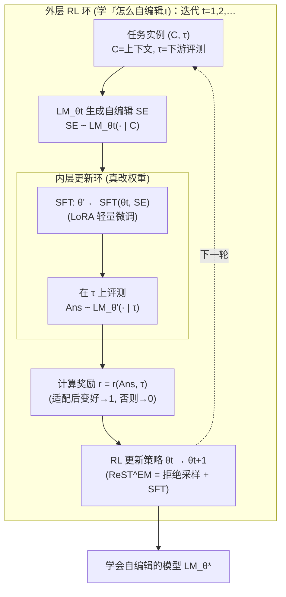

# 组会汇报 · Self-Adapting Language Models（SEAL）

> 本篇遵循**第二批 (v2) 规范**：在前 40 篇全部硬性要求之上，额外做两件事——
> **① Why 三连**（问题层 / 设计层 / 结果层）；**② `## ★ 对我们的启发（Inspires Us）` 专节**。
> 结构对齐 [`2408.06292-ai-scientist-v1.md`](2408.06292-ai-scientist-v1.md)，Why/Inspires 两维对齐 [`2506.13131-alphaevolve-deepmind.md`](2506.13131-alphaevolve-deepmind.md)。
>
> **一句话定位**：F 组（自我改进）里，AlphaEvolve 进化「**解/搜索算法的代码**」、Darwin-Gödel 进化「**agent 自己的代码**」，
> 而 **SEAL 进化的是「模型自己的权重」**——它是这条线里第一个把自改进的「改」字落到 **参数** 上的工作。

---

## 1. 封面 · TL;DR

- **标题**：Self-Adapting Language Models
- **作者/机构**：Adam Zweiger\*、Jyothish Pari\*†、Han Guo、Ekin Akyürek、Yoon Kim、Pulkit Agrawal（\* 同等贡献；† Improbable AI Lab, CSAIL）——**全部来自 MIT**。
- **权威性来源**：**NeurIPS 2025 正会接收**（顶会）；作者团队即「Test-Time Training for few-shot」(Akyürek et al. 2024，本文 ref [36]) 的原班人马，方法学一脉相承；代码与网站公开 (https://jyopari.github.io/posts/seal)。

**这篇在干什么（一段话）**：现在的 LLM 是**静态**的——预训练完权重就冻住，遇到新任务/新知识只能靠**塞进上下文 (in-context)** 或**人来微调**，模型自己**无权也无法**决定「该怎么改自己」。SEAL 提出让模型**为自己生成一段「自我编辑 (self-edit, SE)」**：这是一段**自然语言指令**，规定「用什么数据、什么超参去更新我的权重」——可以是「把这段课文重写成若干条蕴含 (implications)」当合成训练数据，也可以是「用这些数据增广 + 学习率 1e-5 + 训 3 个 epoch」。这段 SE 经一次**监督微调 (SFT)** 真正写进权重（用 LoRA），于是改动是**持久的**。而「怎样的 SE 才算好」无法手写，于是套一个**外层强化学习 (RL)** 环：**奖励 = 用这段 SE 更新后的模型在下游任务上的表现**——好就强化、不好就丢弃。两个内外嵌套的环就是 SEAL 的全部。

**3 条带走的结论**：
1. **「让模型自己生成适配数据/指令」确实比『塞原文』和『人写启发式』都强**：知识吸收上，SQuAD 无上下文 QA 从 **33.5% → 47.0%**（见原文 §4.2 / Table 2），且 **7B 自产数据反超 GPT-4.1 合成数据**（46.3%）；few-shot 技能学习上，适配成功率从 **0%（不适配）/ 20%（无 RL 的自编辑）→ 72.5%**（见 §4.1 / Table 1）。
2. **关键不在「微调」而在「外层 RL 教会模型怎么自编辑」**：同一套内层 SFT，**没有 RL** 的自编辑只有 20%，**加 RL 后** 72.5%——增量几乎全来自「学会产出好 SE」这一外环（Table 1）。
3. **命门是灾难性遗忘 (catastrophic forgetting) 与算力开销**：连续多次自编辑会**逐步抹掉旧知识**（§5 / Figure 6），且每次评估一个 SE 要**微调+跑整模型 ~30–45 秒**（§5），比常规 RLHF 的「一次前向」贵几个数量级——这是「能力 vs 可持续」的硬张力。

> 主讲提示：开场把「自编辑 = 模型自己写给自己的训练处方」这个比喻立住；并强调 SEAL 改的是**权重**，与 DGM/Gödel-Agent「改代码」是**两条不同的自改进路线**——这是本篇全场的辨析主线。

---

## 2. 问题与动机（why —— 本篇最该讲透的一节）

### 2.1 问题层 why：为什么「静态权重」是个真问题

**人类学生怎么准备期末考？**（原文 §1 的核心类比）他不会把课本**逐字背**下来——他会**做笔记、重写、画图、把知识重新组织成更好吸收的形式**，然后再学。这种「**同化 (assimilate) / 重构 / 改写**」几乎是人类一切学习的共性。

**而 LLM 怎么学新任务？** 把任务数据**「照原样 (as-is)」**喂进去——要么塞进上下文做 in-context learning，要么直接在原始文本上微调（原文 §1 引 ref [9-12]）。问题是：**原始数据未必是「适合学习的格式或体量」**。模型**没有机制**去「先把这段材料改写成更好学的样子，再学」。

**不解决会怎样（证据）**：原文 §4.2 给了一个扎心的对照——在 SQuAD 单篇课文上**直接微调原文**，无上下文 QA 准确率从 base 的 33.5% 只挪到 **32.7%（反而略降）**，「**说明光用原始数据是不够的**」（原文原话 "confirming that using the raw data alone is insufficient"）。这就是静态学习范式的天花板。

### 2.2 更大的背景：数据墙 (data wall)

原文 §6 引 Villalobos et al. (ref [81]) 预测：**到 2028 年，前沿 LLM 将耗尽所有公开的人类文本**。一旦撞上这堵「数据墙」，继续进步就只能靠模型**自己生成高价值训练信号**的能力。SEAL 正是这个方向的一块原型——让模型学会「**把一份新材料蒸馏成自己最容易吸收的训练数据**」。

> 主讲提示：把动机钉在两点上——**①「照原样学」不是最优、模型该有权重组数据再学；②数据墙逼着我们要『自造高质量数据』的能力**。后面每个设计都在回应这两点之一。

---

## 3. 研究问题 / 核心 intention（形式化成一句话）

把要解决的问题压成一句（原文 §1 的"intriguing hypothesis"）：

> **能否让一个 LLM 通过「转换 / 生成它自己的训练数据与学习流程」来实现自适应？**
> （can an LLM self-adapt by transforming or generating its own training data and learning procedure?）

它隐含的 **3 个假设**：
- **H1（生成即控制）**：LLM 现有的**生成能力**足够强，强到可以用「生成一段文本」来**参数化并控制**自己的权重更新过程（而不需要外挂一个单独的适配网络）。
- **H2（下游表现可当奖励）**：「一次自编辑好不好」可以用**更新后模型在下游任务上的表现**来客观打分，从而把「学会自编辑」变成一个 RL 问题。
- **H3（持久 > 临时）**：把知识/技能**写进权重**（持久）比每次都塞上下文（临时）更可取——尤其当原文太长塞不进、或要反复用时（这也是它区别于纯 in-context 的根本）。

---

## 4. 相关工作定位（站在谁肩上、和谁不同）

| 方向 | 代表工作 (ref) | 与 SEAL 的关系 |
|---|---|---|
| 合成数据生成 | Self-Instruct [23]、Yang et al. [25] (Synthetic CPT) | 思想来源，但**生成策略靠人手/启发式**；SEAL 用 **RL 训练一个「生成策略」**去最大化下游效用 |
| 知识更新（改权重注知识） | Deductive Closure Training [30]、New News [32] | SEAL **采用其「蕴含式微调」格式**，但用 **RL 学怎么生成更优蕴含**，而非固定启发式 |
| 定位/编辑事实参数 | ROME/MEMIT [26,27,28] | 直接定位并改特定参数；SEAL 不定位，**用生成数据+SFT** 间接改 |
| 测试时训练 TTT | Sun et al. [33,35]、Akyürek et al. [36] | SEAL 内层**就是一轮 TTT**；但 TTT 的增广/超参靠**人手调**，SEAL 让模型**自己配** |
| RL for LLM | RLHF [37,38]、STaR [39]、ReST^EM [40]、DeepSeek-R1 [41] | 别人用 RL 优化**最终答案/推理链**；SEAL 用 RL 优化**「自编辑数据」的生成** |
| 元学习 / 自指系统 | MAML [44]、RL² [45]、Schmidhuber 自指网络 [50,51] | SEAL **就是一种元学习**：meta-learn「怎么生成有效 self-edit」 |
| 超网络 / 任务向量 | Hu et al. [53]（小模型出 token 级权重）、Generative Adapter [54]（hypernet 生 LoRA）、Transformer² [49] | **最直接的对手**：它们**外挂一个辅助网络**来产生权重修改；SEAL 主张**用模型自身的生成能力**来参数化更新，**通用性更高**（见 §B.8 实测对比） |
| 自我改进 / 自训练 | RLAIF [56,57]、self-rewarding [58,59] | 这些**受限于模型当前的自评一致性**；SEAL 主张**通过与外部数据交互**来自改进，**更可扩展** |

> 主讲提示：这张表里**最该展开的是「超网络/Generative Adapter」那一行**——它是「设计层 why」的正面靶子：**为什么不外挂一个网络去生成权重，而要让模型自己『写文本』来改自己？**（§7.1 详谈）

---

## 5. 方法总览（big picture，先直觉后数学）

SEAL = **一个内层（用 SE 真改权重）+ 一个外层（用 RL 学怎么写 SE）的双环**（原文 §3、Figure 1）。



**直觉**：
- **内层** 像「学生拿到一份笔记 (SE)，照着复习一遍 (SFT)，然后去考试 (τ)」——这一步**真的改变了学生的脑子（权重）**。
- **外层** 像「老师观察哪种笔记让学生考得好，就教学生以后多写那种笔记」——它**不改考试，只改『写笔记的习惯』**（即自编辑生成策略）。
- 两环嵌套：**外层 RL 的『动作』就是内层要用的那段 SE**；**外层的『奖励』就是内层 SFT 之后的考试分**。

> 主讲提示：让听众记死四个零件——**上下文 C / 自编辑 SE / 内层 SFT / 外层奖励=下游分**。SEAL 的全部精巧都在「**RL 的动作是一段会去改权重的文本，奖励是改完之后的表现**」这一句里。

---

## 6. 符号与术语表（先定义，后文统一用）

| 记号 / 术语 | 含义 |
|---|---|
| $\mathrm{LM}_\theta$ | 参数为 $\theta$ 的语言模型 |
| $C$ | **上下文 (context)**：与任务相关的信息。知识吸收里 $C$=要吸收的课文；few-shot 里 $C$=少量示范 |
| $\tau$ | **下游评测 (downstream evaluation)**：用来衡量适配效果。知识吸收里 $\tau$=关于课文的问答对；few-shot 里 $\tau$=查询输入+标准答案 |
| $(C,\tau)$ | 一个**任务实例**，从数据集 $\mathcal{D}$ 采样 |
| $\mathrm{SE}$ | **自编辑 (self-edit)**：模型在 $C$ 条件下生成的一段文本（合成数据 ± 优化超参指令）；形式随领域而变（见 §7） |
| $\mathrm{SE}=\{s_1,\dots,s_n\}$ | 知识吸收里，SE 是一串「从课文导出的蕴含」 |
| $\theta'$ | 用 SE 做 SFT **更新后**的参数：$\theta' \leftarrow \mathrm{SFT}(\theta,\mathrm{SE})$ |
| $r(\mathrm{SE},\tau,\theta_t)$ | **奖励**：用 $\theta_t$ 时刻生成的 SE 更新后，模型在 $\tau$ 上是否变好 |
| $\theta_t$ | 第 $t$ 轮外层迭代时的**策略参数**（注意：它**既是被训练的策略、又决定内层从哪个权重出发**） |
| ReST^EM | Reinforced Self-Training（EM 视角）：**拒绝采样 + SFT**，只在「拿到正奖励的样本」上做 SFT（ref [40]） |
| TTT | Test-Time Training：测试时用输入临时改权重（ref [33,36]） |
| LoRA | Low-Rank Adaptation：只训低秩增量，轻量微调（ref [72]） |

---

## 7. 方法细节（核心 6 节）

### 7.1 通用框架与「为什么是『生成文本去改自己』」

**Why（设计层）——本篇最关键的一处辨析**：

> **朴素替代方案**：要让模型「适配」，最显而易见的做法是**外挂一个辅助网络**——比如一个**超网络 (hypernetwork)**，输入上下文、直接吐出一组 LoRA 权重（Generative Adapter, ref [54]），或一个小模型输出 token 级权重（Hu et al., ref [53]）。
> **为什么会失败 / 受限**：这类辅助网络是**专门训练、与基座解耦**的；它能产生的「适配」被**它自己的容量和训练分布**框死，**难以随基座变强而变强**，也**难以推广到 LoRA 微调之外**的更新方式（如多文档持续预训练、来自环境交互的更新）。
> **SEAL 为何更优**：SEAL **直接复用模型自身的生成能力**来「参数化并控制」更新过程（原文 Abstract："directly uses the model's generation to parameterize and control its own adaptation process"）。好处有三（原文 §B.8 论证）：①**生成的数据可复用**（拿去做持续预训练 CPT，或喂给别的基座）；②**随着文档变长变复杂，模型能用推理/重构去应对**，而超网络不行；③**不被 LoRA 限定**——任何能被「数据 + 指令」描述的更新都行。

**直觉**：与其训练「另一个网络」去猜该怎么改你，不如让**你自己写一张处方**——因为你最懂你自己已有的知识，且你的「写处方」能力会随你整体变强而水涨船高。

**形式化（先定义符号，见 §6）**：给定 $(C,\tau)$，模型生成 $\mathrm{SE}\sim \mathrm{LM}_\theta(\cdot\mid C)$，再
$$\theta' \;\leftarrow\; \mathrm{SFT}(\theta,\ \mathrm{SE}).$$
**读出什么**：适配被拆成两步——「**生成处方**」（可学、可 RL 优化）与「**照方抓药**」（确定性的 SFT）。SEAL 把可学习性**全押在『生成处方』这一步**。

> 主讲提示：这一段是组会必被追问的点。一句话总结：**「不外挂网络改我，而是我写文本改我自己」——通用性和可成长性是它押的两个赌注。**

---

### 7.2 外层 RL 目标函数（**逐符号定义，本篇重中之重**）

**Why（设计层）**：「怎样的 SE 才算好」**无法手写规则**——不同课文、不同技能，最优的「重写方式 / 超参」都不同。唯一客观的判据是「**用了它，模型在 τ 上变好了吗**」。于是把「学会自编辑」建模成 RL：**动作 = 生成 SE，奖励 = 适配后表现**。

**直觉**：我们想让模型**多产出那些『用了之后真能提分』的自编辑**，少产出没用的。RL 的期望奖励最大化正好表达这件事。

**符号先定义**（全部在 §6 已列，此处复述关键者）：
- $\theta_t$：第 $t$ 轮的**模型/策略参数**；
- $(C,\tau)\sim\mathcal{D}$：从任务分布采样的一个实例；
- $\mathrm{SE}\sim \mathrm{LM}_{\theta_t}(\cdot\mid C)$：在当前策略下、以 $C$ 为条件采样出的自编辑；
- $r(\mathrm{SE},\tau,\theta_t)$：奖励——**注意它显式依赖 $\theta_t$**（因为要先用 $\theta_t$ 出发做 SFT 得到 $\theta'$，再在 $\tau$ 上评分）。

**目标函数（原文 Eq.(1)）**：
$$\mathcal{L}_{\mathrm{RL}}(\theta_t) \;:=\; -\,\mathbb{E}_{(C,\tau)\sim\mathcal{D}}\Big[\ \mathbb{E}_{\mathrm{SE}\sim \mathrm{LM}_{\theta_t}(\cdot\mid C)}\big[\ r(\mathrm{SE},\tau,\theta_t)\ \big]\ \Big].$$

**逐项读出**：
- 内层期望 $\mathbb{E}_{\mathrm{SE}\sim \mathrm{LM}_{\theta_t}(\cdot\mid C)}[\cdot]$：对「当前策略在上下文 $C$ 下会生成的各种 SE」求平均奖励；
- 外层期望 $\mathbb{E}_{(C,\tau)\sim\mathcal{D}}[\cdot]$：再对所有任务实例求平均；
- 前面的负号：因为我们**最小化** $\mathcal{L}$ 等价于**最大化期望奖励**。

**一个关键的『非标准』之处（原文 §3.1 明确指出）**：常规 RL 里奖励只依赖「状态、动作」；但这里奖励 $r(\mathrm{SE},\tau,\theta_t)$ **依赖策略参数 $\theta_t$ 本身**（因为评测用的是从 $\theta_t$ 出发 SFT 得到的 $\theta'$）。这意味着——**RL 的「状态」必须包含 $\theta_t$**，记为 $(C,\theta)$，尽管策略的「观测」只有 $C$（把 $\theta$ 直接塞进上下文不可行）。后果：**用旧策略 $\theta_{\mathrm{old}}$ 收集的 (状态,动作,奖励) 三元组会过时、与当前 $\theta_{\mathrm{cur}}$ 失配**。所以 **SEAL 必须用 on-policy**：自编辑要**从当前模型采样**，奖励也**用当前模型算**。

> 主讲提示：把这条讲透是「读懂没读懂」的分水岭——**「奖励依赖被训练的参数」⇒ 状态含 θ ⇒ 必须 on-policy**。这是 SEAL 与普通 RLHF 在数学结构上最不一样的地方。

---

### 7.3 为什么用 ReST^EM 而不是 PPO/GRPO？（梯度怎么算）

**Why（设计层）**：作者**试过** GRPO (ref [66]) 和 PPO (ref [67])，但**训练不稳定**（原文 §3.1 原话 "found the training to be unstable"）。于是改用 **ReST^EM (ref [40])**——一个基于**过滤式行为克隆**的更简单方法，俗称「**拒绝采样 + SFT**」。

**ReST^EM 的 EM 视角**：
- **E 步**：用当前策略**采样**一批候选 SE；
- **M 步**：**只保留拿到正奖励的那些 SE**，对它们做 SFT（强化）。

它优化的是 Eq.(1) 在**二元奖励**下的近似（原文 Eq.(2)）：
$$r(\mathrm{SE},\tau,\theta_t)=\begin{cases}1 & \text{若在 } \tau \text{ 上，用 SE 适配确实提升了 } \mathrm{LM}_{\theta_t} \text{ 的表现}\\ 0 & \text{否则}\end{cases}$$
（脚注 2：知识吸收里，奖励也可只给「候选中带来最大提升的那一个 SE」，而非所有正提升的。）

**梯度怎么来（原文 Eq.(3)(4)）**：要优化 Eq.(1) 需算 $\nabla_{\theta_t}\mathcal{L}_{\mathrm{RL}}$，但奖励项 $r(\mathrm{SE},\tau,\theta_t)$ 对 $\theta_t$ **不可微**。处理办法：**把奖励视作对 $\theta_t$ 的常数**（stop-gradient）。于是对 $N$ 个上下文、每个采 $M$ 个自编辑的小批量，蒙特卡洛估计为

$$\nabla_{\theta_t}\mathcal{L}_{\mathrm{RL}} \;\approx\; -\frac{1}{NM}\sum_{i=1}^{N}\sum_{j=1}^{M} r_{ij}\,\nabla_{\theta_t}\log p_{\theta_t}(\mathrm{SE}_{ij}\mid C_i)$$

再把序列概率展开成 token 级（$y^{(i,j)}_s$ 是第 $(i,j)$ 个自编辑的第 $s$ 个 token，$T$ 为序列长）：

$$=\; -\frac{1}{NM}\sum_{i=1}^{N}\sum_{j=1}^{M} r_{ij}\sum_{s=1}^{T}\nabla_{\theta_t}\log p_{\theta_t}\big(y^{(i,j)}_s \mid y^{(i,j)}_{<s},\,C_i\big).$$

**逐符号定义**：$p_{\theta_t}$=模型自回归分布；$r_{ij}\in\{0,1\}$=第 $(i,j)$ 个 SE 的奖励；$C_i$=第 $i$ 个上下文。
**读出什么**：因为 $r_{ij}=0$ 的项梯度被乘没了，这个式子**就等于「只对正奖励的 SE 做 SFT」**——这正是 ReST^EM。所以原文一句话点破：**「带二元奖励的 ReST^EM，本质就是『在好的自编辑上做 SFT』，且它确实在优化 Eq.(1)」**。

> 主讲提示：别被三个公式吓到——**核心就一句「把奖励当常数、只在得分的样本上做 SFT」**。三个式子是把这句话从「目标」推到「可执行的梯度」。整套训练循环见原文 **Algorithm 1**（采样 (C,τ) → 生成 SE → 内层 SFT 得 θ' → 评测得奖励 → RL_Update）。

**一个值得记的「未来扩展」（原文 §3.1 末）**：实现上 SEAL **用同一个模型**既生成 SE 又从 SE 学习；但也可**解耦成「师生」**——学生模型用老师提议的编辑更新，老师再用 RL 训练去最大化学生的进步（呼应 ref [71] 蒸馏）。

---

### 7.4 领域实例化 ①：知识吸收 (Knowledge Incorporation)

**Why（问题层）**：目标是把一段**新课文**的信息**永久写进权重**，使模型**不看原文**也能答出关于它的问题（用 SQuAD 的「无上下文」变体评测）。

**自编辑长什么样**：模型被提示「**列出从这段内容导出的若干蕴含 (implications)**」，输出 $\mathrm{SE}=\{s_1,\dots,s_n\}$（推理、逻辑后承、改述等）。这采用 Deductive Closure Training（ref [30]）的**「蕴含」规范格式**。（§B.11 还试了 "rewrite"、"self-qa" 等别的 prompt，结论是**改写/QA 类 prompt 收益相当或更大**。）

**内层更新**：把这些自生成语句当训练数据，对每条 $s_i$ 算标准因果语言建模损失，更新得 $\theta'$；因为每次数据量小、更新次数多，**用 LoRA 轻量微调**（原文 §3.2、Figure 2）。

**奖励**：用 $\theta'$ 在该课文的问答 $\tau$ 上的准确率当奖励 $r$，驱动外层 RL——于是模型被训成「**把课文重构成最利于 SFT 吸收的形式**」。

---

### 7.5 领域实例化 ②：Few-shot 技能学习 (Few-Shot Learning)

**Why（问题层）**：目标是**看极少示范就学会一个全新任务**（用 ARC-AGI 抽象推理基准，ref [8,14]）。这里 SEAL 测的是更激进的能力——**自己配置整条适配流水线**。

**自编辑长什么样**：模型不直接生成数据，而是**从一组预定义『工具』里挑选并配置**（原文 §3.2、Figure 3），输出一个 **JSON**，指定：
- **数据增广**：是否用 rotations / flips / reflections / transpositions / resize / 链式或重复变换（`use_basic/size/chain/repeat_augmentations`）；
- **优化超参**：学习率、训练 epoch 数、loss 算在「所有 token」还是「仅输出 token」(`train_using_all_tokens` vs `output_tokens`)。

**内层更新**：按这份 SE 做 TTT（用 LoRA 微调），得 $\theta'$，在 held-out 测试输入上评测；**对就 r=1，错就 r=0**。

> 主讲提示：两个设定的对比很妙——**知识吸收里 SE 是『数据』，few-shot 里 SE 是『配置/超参』**。同一个 SEAL 框架，自编辑既能当「教材」也能当「训练脚本」，这正是它「versatile」的体现。

---

### 7.6 把双环连起来：一张 Algorithm 1 的白话版

```
输入: 模型 LM_θ；任务数据集 D = {(C, τ)}
for 外层迭代 t = 1, 2, ...:
    采样任务实例   (C, τ) ~ D
    生成自编辑     SE ~ LM_θt(· | C)          # 动作（on-policy 采样）
    内层更新       θ' ← SFT(θt, SE)            # 用 LoRA 真改权重
    评测           Ans ~ LM_θ'(· | τ)
    计算奖励       r ← r(Ans, τ)               # 适配后变好→1
    外层更新       θ_{t+1} ← RL_Update(θt, r, SE)  # ReST^EM：只在 r=1 的 SE 上 SFT
```

**读出什么**：内层（SFT 改权重）是**临时的、为算奖励服务**；真正被**持久优化**的是外层策略 $\theta_t$——也就是「**模型生成自编辑的习惯**」。

---

## 8. 实验设置（setting / metrics / parameters，写全）

### 8.1 两个设定的配置总览

| 维度 | Few-Shot 学习（§4.1, §A） | 知识吸收（§4.2, §B） |
|---|---|---|
| 基座模型 | **Llama-3.2-1B-Instruct**（无 ARC 预训练） | **Qwen2.5-7B**（另测 3B，见 §B.7） |
| 数据/任务 | ARC 子集：**11 训练 + 8 评测**（筛过「最优 TTT 配置下可解」） | **SQuAD v1.1**；训练集做 RL，**200 篇子集** (974 题) 评测 |
| 外层算法 | ReST^EM，**1 轮**外层 RL | ReST^EM，**2 轮**，每轮 batch=50 上下文 |
| 每任务采样 | 训练时 **15** 个 SE / 任务；评测时 **5** 个 / 任务 | 每上下文 **5** 个 SE 生成（temperature=1）；每 SE 跨 **3** 个随机种子评测取平均，留最优 |
| 内层微调 | LoRA TTT（见下表） | LoRA（rank 64 / α 128，加在所有 MLP+attention 投影层），batch=10，2 epoch，lr 3e-4 |
| 评测指标 | **成功率 (success rate)** | **无上下文 QA 准确率**，由 **gpt-4.1** 自动判分（见 §8.3） |
| 算力 | 单卡 A100/H100/H200；每次 TTT 约 0.5–几分钟；整个 ReST^EM **约 2–3 小时** | 2×H100 或 2×H200；DeepSpeed ZeRO-3 训、vLLM 推；单轮约 **6 小时**（750 次内层迭代） |

**Few-shot 的关键超参（原文 §A.2）**：RL 阶段的 SFT 用 `lora_rank=16, lora_alpha=16, epochs=8, batch=5, lr=5e-5`；而内层 TTT 的 LoRA 用 `rank=128, alpha=16`，**学习率与 epoch 由模型自己在 SE 里选**（这正是 few-shot 设定要学的东西）。LoRA 插入 `q/v/gate/down/up_proj`。

**知识吸收的搜索空间（原文 §B.3, Table 3/4）**：单篇设定里 LoRA rank∈{**32**,64}、α∈{32,**64**}、lr∈{1e-4,3e-4,5e-4,**1e-3**,2e-3}、epochs∈{1,5,**10**,15,20}、batch∈{**1**,4}（粗体为选中值）。

### 8.2 Baselines

- **Few-shot（§4.1）**：① **ICL**（直接把示范塞上下文）；② **TTT + Self-Edit（无 RL）**（用自编辑做 TTT 但**没有先用 RL 学怎么编辑**）；③ **Oracle TTT**（用 Akyürek et al. 人工精调的最优配置——**本方法的上界**）。
- **知识吸收（§4.2）**：① **Base Model**（不适配）；② **Train on Passage Only**（只在原文上微调）；③ **Train on Passage + Synthetic**（=SEAL 但无 RL）；④ **Train on Passage + GPT-4.1 Synthetic**（用 GPT-4.1 经 OpenAI API 生成的蕴含）。

### 8.3 指标定义式

**成功率 (few-shot)**：生成的自编辑里，**导致适配后模型在 held-out 测试输入上输出正确**的比例。记 $G$ 为生成的 SE 总数、$\mathbb{1}[\cdot]$ 为指示函数：
$$\text{SuccessRate}=\frac{1}{G}\sum_{g=1}^{G}\mathbb{1}\big[\ \mathrm{LM}_{\theta'_g}(\tau)\ \text{输出正确}\ \big].$$
（原文 §4.1：评测 8 个任务 × 每个 5 个 SE = 40 个配置，报告其中产出正确输出的百分比。）

**无上下文 QA 准确率 (知识吸收)**：在**不提供原文**的前提下，模型对该课文相关问题答对的比例；答对与否由 **gpt-4.1 判分**（prompt 见 §B.4：「学生答案是否充分传达且不矛盾于标准答案，只回 yes/no」）。

> 主讲提示：强调 few-shot 的「成功率」是**按自编辑算的**（一个 SE 能否把模型调到答对），不是按任务算——这让 20%→72.5% 的跃升更有可比性。

---

## 9. 主要结果（数字 + 解读，别只贴表）

### 9.1 Few-shot 抽象推理（原文 Table 1）

| 方法 | 成功率 (%) |
|---|---|
| ICL | 0 |
| TTT + Self-Edit（**无 RL**） | 20 |
| **SEAL** | **72.5** |
| Oracle TTT（上界） | 100 |

**结果层 why（为什么是这个数）**：
- **ICL=0**：1B 小模型直接看示范根本做不了 ARC——**不微调、纯上下文学习此处完全无效**，凸显「真改权重」的必要。
- **20→72.5 的跃升全来自外层 RL**：同样是「自编辑 + TTT」，**学没学过『怎么编辑』差了 3.6 倍**。机制上：RL 教会模型**挑对增广组合、配对学习率/epoch**，而未训练的模型乱配，多数配置调出来是错的。
- **仍低于 Oracle 100**：人工最优配置仍更强，**说明还有提升空间**（原文明说 "room for further improvement"）。

### 9.2 知识吸收（原文 Table 2 + Figure 4）

**单篇 (n=1, LoRA)**：

| 方法 | 无上下文 QA 准确率 (%) |
|---|---|
| Base model | 32.7 |
| Train on Passage | 33.5 |
| Train on Passage + Synthetic（无 RL） | 39.7 |
| Train on Passage + GPT-4.1 Synthetic | 46.3 |
| **SEAL** | **47.0** |

（注：正文 §4.2 与摘要给出的「**33.5%→47.0%**」是以 base 33.5% 为锚点的整体提升口径；Table 2 base 行另记 32.7%。两数均来自原文，差异源于不同基线设置，**忠实并列、不调和**。）

**结果层 why**：
- **只用原文微调几乎无效（33.5）**：再次印证 §2.1——「照原样学」不够。
- **合成蕴含 +6.2 点（→39.7）**：把课文**重构成蕴含**就有显著增益，说明「格式重组」本身有价值。
- **SEAL 7B 反超 GPT-4.1（47.0 > 46.3）**：**最醒目的一条**——一个**小得多的 7B 模型，经 RL 学会自编辑后，产出的训练数据比 GPT-4.1 还好用**。机制：RL 把策略**收敛到一种「把课文蒸馏成易学的原子事实」的编辑风格**（原文 Figure 5 定性可见：迭代越多，自编辑越细化成一条条独立事实）。
- **2 轮就够（Figure 4）**：两轮 ReST^EM 即超过 GPT-4.1，**之后收益递减**——策略很快收敛。

**持续预训练 (CPT) 设定（Table 2 右两列）**：在 n=200 篇上 SEAL 达 **58.2%**（超过单篇的 47.0%，因聚合了多次自编辑数据）；但在全量 n=2067 篇上 SEAL **46.4%，略低于 GPT-4.1 的 49.2%**——**规模拉大后优势收窄**，这是要诚实说明的一笔。

### 9.3 几个有信息量的附录结果

- **模型越大、RL 增益越大（§B.7, Table 6）**：SEAL/base-self-edit 的相对提升，3B 是 **1.75×**、7B 是 **2.04×**——暗示「**更强基座 + RL 可能有复利**」（但作者诚实标注「不真正放大模型难下结论」）。
- **vs Generative Adapter（§B.8, Table 7）**：单篇 n=1 时 Generative Adapter 更好（66.8 vs SEAL 47.0），但**CPT n=200 时 SEAL 反超（58.2 vs 28.0）**——印证 §7.1：**超网络在「单次小适配」强，但 SEAL 的「生成数据可复用、可上 CPT」在规模化时更通用**。
- **代理奖励几乎免费提速（§B.10, Table 9）**：把内层真奖励换成「GPT-4.1 按 4 项 rubric 打分」的代理奖励，post-RL 达 45.6%（vs 真奖励 47.0%），但训练时间从 **~6 小时压到 ~5 分钟**——**代理奖励是降本的现实出路**。
- **Prompt 敏感（§B.11, Table 10）**：换 `rewrite`/`self-qa` 等 prompt，RL 一致带来 **6–11 点**提升；但 `no-prompt`（让模型自定义格式）只到 18.9%——**「全自主格式」目前还不行**。

---

## 10. 消融与分析（哪个部件贡献多少）

| 对照 | 数字出处 | 说明了什么 |
|---|---|---|
| 有/无外层 RL | Table 1 (20→72.5)、Table 2 (39.7→47.0) | **外层 RL 是主力**：两个设定里增量几乎都来自「学会自编辑」 |
| on-policy 必要性 | §3.1 论述 | 奖励依赖 θ_t ⇒ 旧数据失配 ⇒ 必须 on-policy（这是用 ReST^EM 而非离线 BC 的根因） |
| ReST^EM vs PPO/GRPO | §3.1 | PPO/GRPO **不稳定**；ReST^EM（拒绝采样+SFT）稳定可用 |
| 自产数据 vs GPT-4.1 | Table 2 (47.0 vs 46.3) | 小模型经 RL 可**超过大模型的合成数据** |
| 真奖励 vs 代理奖励 | Table 9 (47.0 vs 45.6) | 代理奖励**几乎不掉分、却快 ~70 倍** |
| RL 轮数 | Figure 4 | **2 轮见顶**，之后递减——策略快速收敛 |

> 主讲提示：把消融**收敛到一句话**——「**SEAL 的灵魂是外层那个 RL；内层 SFT 只是把处方落地的手**。」

---

## 11. 局限与批判（诚实，区分宣称 vs 批判）

**原文自承（§5）**：
1. **灾难性遗忘 (catastrophic forgetting)（最重）**：把 SEAL 当**持续学习**用——连续吸收一串课文、每篇触发一次自编辑——会发现**对早先任务的表现随编辑次数增加而单调下降**（原文 Figure 6 的热力图、§B.6 给了逐项 SEM）。作者诚实地说：SEAL **没有显式优化『保留旧知识』**，目前只是建了个 baseline；虽**未完全崩溃**、能做多次更新，但**确实仍易遗忘**。可能的解法（原文列举、未实现）：reward shaping 惩罚旧任务回退 [75-77]、null-space 约束编辑 [78]、表征叠加 [79]，或**内层把 SFT 换成 RL**（RL 比 SFT 更不易遗忘，ref [80]）。
2. **算力开销大 (computational overhead)**：常规 RLHF 算奖励只需**一次前向**或简单正则匹配；SEAL **每评一个 SE 都要微调+跑整模型**，**约 30–45 秒/次**（§B.5），引入巨大开销——这是它难规模化的现实瓶颈。
3. **依赖配对的下游任务 (context-dependent evaluation)**：当前每个上下文都**必须配一个显式下游任务**（few-shot 配 held-out、课文配参考 QA）才能算奖励。这**挡住了把 SEAL 放到无标注语料上 RL**。潜在解：让模型**连评测题也一起生成**（自己出 QA / 合成测试），但原文**未实现**。

**批判 / 社区视角（补充，原文未必展开）**：
- **「自产数据反超 GPT-4.1」的口径要小心**：这是在**单篇 LoRA、SQuAD 这类「能被基座完全读懂」的简单课文**上成立（原文 §4.2 选 SQuAD 正因其"simple"）；放到 n=2067 全量就**被 GPT-4.1 反超 (46.4 vs 49.2)**。**「小模型超大模型」并非普适结论**。
- **奖励=下游分 ⇒ 有 reward-hacking 风险**：当评测题与训练自编辑同源（同一篇课文），策略可能学到「**专门迎合这套 QA 的编辑**」而非真正『理解』——本库 m9.7/ m9.8 反复演示的「fitness 可刷则必被刷」在此同样悬而未决（原文未做这类对抗测试）。
- **on-policy + 每步重训 ⇒ 扩展性存疑**：双层嵌套（外层 RL × 内层 SFT）的成本随模型规模**急剧上升**，目前只在 1B/7B 上验证，**更大模型能否复现增益是开放的**。

> 主讲提示：把**灾难性遗忘**单独拎出来强调——它不只是「一个 bug」，而是**「持久自改进」这条路线的结构性张力**：每次「为新任务改权重」都在**冒『擦掉旧能力』的风险**。这正是 SEAL 与「改代码」的自改进（DGM）最不同、也最危险的地方。

---

## ★ 对我们的启发（Inspires Us）

> 这一节回答：SEAL 对我（们）接下来的研究，**到底能用上什么**。

- ➤ **可直接借用的招（reuse）**：
  1. **「自编辑 = 模型自己写的训练处方」这一原语**——把「适配」拆成**可学的『生成处方』 + 确定性的『照方 SFT』**两步。任何「生成-然后-自学」的管线都能套：让模型先**把原始材料重写成更易学的形式**，再微调，而不是喂原文。
  2. **ReST^EM（拒绝采样 + 只在得分样本上 SFT）当稳定的外层优化器**——当 PPO/GRPO 训不稳时，这是一个**简单、能落地**的替代（原文 §3.1 实证）。可直接搬进我们任何「采样→打分→强化」的循环。
  3. **代理奖励降本（§B.10）**——用「GPT-4.1 按 rubric 打分」替代「真微调+评测」，**~70 倍提速、几乎不掉分**。凡是内层奖励昂贵的场景都该先试这招。

- ➤ **可迁移到我们课题（transfer）**：直接连 [`m9.7-self-improvement-evolution`](../m9.7-self-improvement-evolution/)。该模块现有「**进化解 / 进化 agent 代码 / agent 设计 agent**」三形态——**SEAL 给它补上第四形态：进化『权重』**。迁移要改的前提：m9.7 的进化用 **holdout fitness** 防 reward hacking；SEAL 的奖励是**同源下游 QA**，**没有 holdout 隔离**。所以把 SEAL 接进 m9.7 时，**第一件事就是给它加一道 holdout**——用「**没参与生成自编辑的另一批 QA**」当奖励，验证它学到的是「真吸收」还是「迎合评测」。这恰好能把 m9.7 的核心教训（「fitness 可刷则必被刷」）**搬到『改权重』这条新轴上复测**。

- ➤ **它暴露的开放问题 = 我们的机会（opportunity）**：
  - **灾难性遗忘**是 SEAL 没解的最大缺口（§5）。→ **机会**：做一个「**带遗忘惩罚的自编辑**」——在奖励里减去「旧任务回退」项（reward shaping），或内层用 RL 替 SFT（ref [80] 称 RL 更不易遗忘）。**可下手的第一步**：复现 Figure 6 的连续编辑热力图，再加一个「旧任务保留」奖励项，量化遗忘曲线能否压平。
  - **「自己出评测题」**（§5 提出、未实现）→ 让模型在课文还在上下文时，**同时生成自编辑 + 合成 QA**，用合成 QA 当奖励，解锁「**无标注语料也能自适配**」。

- ➤ **与本库其它论文/模块的连接（connect the dots）**：
  - **同组对照（最重要）**：F 组三条自改进路线——[`AlphaEvolve`](2506.13131-alphaevolve-deepmind.md) 改「**解/搜索算法的代码**」、[`Darwin-Gödel Machine`](2505.22954-darwin-godel-machine.md) (2505.22954) 改「**agent 自身的代码**」、[`Gödel Agent`](https://arxiv.org/abs/2410.04444) (2410.04444) 在运行时**递归改自己的代码逻辑**——**SEAL 是唯一改『权重』的**。一句话钉死区分：**DGM/Gödel-Agent 改的是『程序』（可读、可回滚、可版本管理）；SEAL 改的是『参数』（不可读、改了就难精确回滚，且会遗忘）。** 这两条路线的**风险结构完全不同**，组会上务必讲清。
  - **呼应**：与 AlphaEvolve 的「**可验证奖励 grounding**」呼应——SEAL 也用「下游表现」当客观奖励；但 AlphaEvolve 的 $h$ 是**外部不可造假**的，SEAL 的奖励是**同源 QA、可被迎合**，这正是二者**强弱的分界**。
  - **警示**：reward hacking 直通 [`m9.8` 红队与诚信] 的「独立验证收口」——SEAL 缺一道 holdout，是它最该被红队敲打的点。

- ➤ **如果我来做下一步（my next move）**：我会在 `m9.7` 加一个 **"evolve-weights (SEAL-mini)"** 开关——用一个小模型 + ReST^EM 跑「**自编辑改权重**」的最小循环，**关键是配两套 fitness**：①同源 QA（=原版 SEAL），②holdout QA。对照看「SEAL 学到的提升在 holdout 上还剩多少」。**一周内能出最小结论**：若 holdout 增益显著小于同源，就**实证了『改权重的自改进同样会 reward-hack』**，把 m9.7 的核心叙事从「改代码」扩到「改权重」。

> 主讲提示：这一节是全场高潮——前面讲「MIT 做了什么」，这里讲「**我们下周就能试什么**」。落点是 m9.7 的「第四形态：进化权重」+ 给它加 holdout，能被同组同学直接接力。

---

## 12. 在 auto-research 版图的位置（相对已有工作的增量）

- **阶梯定位**：按本库 Tool→Analyst→**Scientist** 阶梯，SEAL 处在「**会自我适配的 Tool/Analyst**」——它能**自主决定怎么改自己以更好完成给定任务**，但**任务（C, τ）仍由人给定**，它**不自定义研究问题**，故未到「自主科学家」级。它的贡献是**为『自改进』补上『改权重』这一维**。
- **它把谁向前推了一步 / 与谁对立**：
  - **推进 TTT**：把 Akyürek et al. [36] 的「人工调 TTT 配置」升级为「**模型自己学怎么配 TTT**」（few-shot 设定就是这条线的直接延伸）。
  - **推进 Synthetic CPT / Deductive Closure**：把 [25,30] 的「**固定启发式生成合成数据**」升级为「**RL 学一个生成策略**」，并实证小模型自产数据可超大模型合成数据（在简单课文上）。
  - **与超网络路线 (Generative Adapter [54] / Hu [53]) 对立**：同样要「上下文 → 权重更新」，但 SEAL 用**模型自身生成**而非**外挂网络**，以**通用性/可复用性**换取（单次小适配上）略逊于专用超网络（§B.8）。
- **时间/能力增量**：在 F 组里，SEAL（NeurIPS 2025）相对 AlphaEvolve（2025-06 白皮书）/ DGM（2505.22954）是**同期、互补**的一支——前两者证明「**进化代码**」可做出可验证发现，SEAL 则把同一种「生成→评估→强化」的进化范式**下沉到权重层**，并第一手地把**灾难性遗忘**这个「改权重」独有的代价摆上台面。

---

## 13. 复现与可用性

- **开源**：代码 + 网站公开（https://jyopari.github.io/posts/seal）；用的都是开源基座（**Llama-3.2-1B**、**Qwen2.5-7B/3B**）+ LoRA + ReST^EM。
- **能不能在单卡跑**：
  - **Few-shot 设定可单卡**（原文 §A.4：单张 A100/H100/H200，整个 ReST^EM 约 **2–3 小时**）——这是组会上最适合复现的入口。
  - **知识吸收要 2×H100/H200**（§B.5，单轮约 6 小时，750 次内层迭代）——门槛较高。
- **坑**：
  - **on-policy 是硬约束**——不能拿旧数据离线训（§3.1），否则奖励失配。
  - **PPO/GRPO 在这里训不稳**——直接用 ReST^EM（§3.1）。
  - **奖励要配对下游任务**——无标注语料目前跑不了（§5）。
  - **每个 SE 评估 30–45 秒**——批量实验前先上**代理奖励**（§B.10）省时。
- **与本库可跑模块的关系**：[`m9.7-self-improvement-evolution`](../m9.7-self-improvement-evolution/) 是「进化档案 + fitness + holdout」的最小可跑实现——把 SEAL 当作「**把进化对象从『代码』换成『权重』**」的一个变体接进去，是最自然的复现路径（见 §11 Inspires-Us 的 next move）。

---

## 14. 组会讨论问题（5–8 个，能引发讨论）

1. **「奖励依赖被训练的参数 θ_t」⇒ 必须 on-policy**（§3.1）。这是 SEAL 与普通 RLHF 最大的数学差异。它对**扩展到大模型**意味着什么成本？有没有办法**部分离线**而不失配？
2. SEAL 改**权重**、DGM/Gödel-Agent 改**代码**。若要做「**能自改进又能安全回滚**」的系统，你会选哪条路线、或怎么**组合**？各自的「回滚」分别长什么样？
3. **「7B 自产数据反超 GPT-4.1」只在简单课文+单篇成立，n=2067 时被反超**（Table 2）。这是「小模型真更懂自己」还是「简单任务的伪信号」？**怎么设计实验区分**？
4. SEAL 的奖励是**同源 QA**，缺 holdout。这与 m9.7「fitness 可刷则必被刷」是什么关系？**加一道 holdout** 后，你预期 47.0% 会剩多少？
5. **灾难性遗忘**（Figure 6）是「改权重」自改进的结构性代价。reward shaping / null-space / 内层换 RL，**哪个最可能压平遗忘曲线**？为什么？
6. **代理奖励 ~70 倍提速、几乎不掉分**（Table 9）。这是否暗示「**真微调评测**」其实**多数时候可被便宜代理替代**？什么情况下代理会**严重误导**？
7. §5 提出「**让模型自己出评测题**」以摆脱标注依赖——但这等于「**自己出题自己考**」，循环性更强。**怎么打断这条自评循环**？（联想 m9.8 独立验证）

---

## 15. 一页速记（takeaways，汇报当天速览）

- **一句话**：让 LLM 生成「**自我编辑**」（自造微调数据 + 更新指令），经 **SFT 持久改自身权重**；外层用 **RL（奖励=更新后模型的下游表现）** 教它产出好的自编辑。
- **双环**：内层 = **SFT 真改权重**（LoRA，临时，为算奖励）；外层 = **RL 学怎么自编辑**（ReST^EM = 拒绝采样 + 只在得分样本上 SFT；必须 **on-policy**，因奖励依赖 θ_t）。
- **核心式子**：目标 $\mathcal{L}_{\mathrm{RL}}(\theta_t)=-\mathbb{E}_{(C,\tau)}\mathbb{E}_{\mathrm{SE}\sim \mathrm{LM}_{\theta_t}(\cdot|C)}[r(\mathrm{SE},\tau,\theta_t)]$（Eq.1）；二元奖励下梯度 ⇔「在好自编辑上 SFT」（Eq.2-4）。
- **两个设定**：知识吸收（SE=蕴含数据，Qwen2.5-7B，SQuAD）/ few-shot（SE=增广+超参配置，Llama-3.2-1B，ARC）。
- **关键数**：QA **33.5%→47.0%**（7B 自产 **超** GPT-4.1 的 46.3）；技能 **0%/20%→72.5%**（Oracle 100）；CPT n=200 达 58.2%（但 n=2067 被 GPT-4.1 反超 46.4 vs 49.2）；代理奖励 6h→**5min**。
- **命门**：**灾难性遗忘**（Fig.6）+ **每 SE 评估 30–45s** 的算力开销 + **奖励需配对下游任务**。
- **在课里的位置**：F 组「自改进」第四形态——**别人改代码，它改权重**；与 AlphaEvolve/DGM 互补，把「遗忘」这一改权重独有的代价首次摆上台。

> 主讲提示：结尾回到一句话——**「SEAL 证明了『模型能自己写处方改自己的权重并真的变强』，也第一次诚实暴露了『改权重必然冒擦掉旧能力的险』。」** 这两句之间，就是「持久自改进」这条路要走的全部张力。
