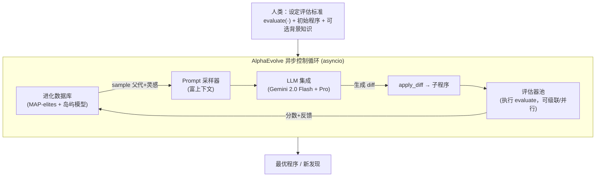

# AlphaEvolve：会写代码、能做发现的进化型编码 agent

> 本篇是**第二批（v2）的标杆范文**：在前 40 篇的全部硬性要求之上，额外演示两件事——
> **① Why 三连**（问题层 / 设计层 / 结果层）；**② `## ★ 对我们的启发（Inspires Us）` 专节**。
> 写新报告时，结构对齐 [`2408.06292-ai-scientist-v1.md`](2408.06292-ai-scientist-v1.md)，新增两维对齐本篇。

---

## 1. 封面 · TL;DR

- **标题**：AlphaEvolve: A coding agent for scientific and algorithmic discovery
- **作者/机构**：Alexander Novikov、Ngân Vũ、Matej Balog 等，**Google DeepMind**（白皮书，2025-06）。
- **权威性来源**：DeepMind 出品；其前身 **FunSearch** 发表于 *Nature*（2024）；本文给出**可被独立验证的硬结果**（48 次标量乘法的 4×4 复矩阵乘算法、Kissing Number 11 维 592→593），并附 Google Colab 公开新构造。

**这篇在干什么（一段话）**：AlphaEvolve 是一个**进化型编码 agent**——人类只需提供「**怎么打分**」（一个机器可自动评估的 `evaluate` 函数）和一份**初始程序**，系统就用一组 SOTA LLM 反复对代码提**修改差分 (diff)**，每个新程序都被自动执行打分、择优存入**进化数据库**，循环放大，最终“进化”出超越人类已知最优的算法/构造。它把“LLM+进化”从 FunSearch 的**单个函数、10–20 行**一举推到**整份代码文件、上百行、任意语言、可多指标**。

**3 条带走的结论**：
1. **“可自动验证”是它的命门也是护城河**：凡是解能被机器打分的问题（数学构造、算法、内核/电路优化），它都能搜；凡是要人做实验才能判优的（湿实验），它直接出局。这条边界决定了它和 AI co-scientist / Robin 互补而非替代。
2. **进化的是“代码”，常常还是“搜索算法”本身**，而不是直接进化“答案”——这个**间接抽象**反直觉却极有效（§5、§7）。
3. **真金白银的落地**：4×4 复矩阵乘 **48** 次乘法（破 Strassen 1969 的 49，56 年来首次）；Google 数据中心调度**回收 0.7% 全队列算力**；Gemini 训练用的矩阵乘内核**平均提速 23%**、整训练**省 1%**；TPU 算术电路、FlashAttention 内核（**提速 32%**）均已上生产。

> 主讲提示：开场用一句“人类只写‘怎么打分’，机器自己进化出‘怎么算’”点题；强调它**不是聊天助手**，而是一个**超优化器 (superoptimizer)**。把“48 vs 49 / 56 年”作为全场记忆锚点。

---

## 2. 问题与动机（why）

**问题层 why（为什么这事值得做）**：做出“新发现”（新数学构造、新算法、更快的内核）通常要经历**漫长的构思—试错—回溯—验证**循环。LLM 看似能加速这一过程，但有两道坎卡住了它：
- **幻觉 (confabulation)**：LLM 会给出“看似对、其实错”的方案——在科学里这是致命的。
- **从“能改进 benchmark”到“做出全新发现”之间隔着鸿沟**：会写代码 ≠ 会发现新知识。

**不解决会怎样**：你只能得到一个“高级自动补全”，它在已知套路里打转，永远摸不到 SOTA 之外。FunSearch 已证明“LLM+进化+自动评估”能在**单个函数**上破解开放问题（cap set），但**单函数、需百万次采样、只优化单指标**的限制，使它够不到“真实工程代码库 / 多指标 / 任意语言”的现实问题。

**核心 intention（一句话形式化）**：给定一个**机器可自动评估**的目标，让一个“LLM 提 diff + 自动执行打分 + 进化保留优者”的闭环，在**程序空间**里搜索出超越人类已知最优的解。

> 主讲提示：把动机钉在“**幻觉**”和“**发现 vs 改进的鸿沟**”两点上——后面会看到，AlphaEvolve 的每一个设计几乎都在回应这两点之一。

---

## 3. 研究问题 / 核心假设

- **RQ**：能否用“SOTA LLM 生成**整份代码**的修改 + **自动可验证**评估 + 进化”做出**可被独立验证**的新科学/算法发现，且**跨领域**通用？
- **核心假设 H1（grounding 抗幻觉）**：只要评估是**机器自动、可验证**的，就能把 LLM 的创造力“锚”在正确性上，过滤掉幻觉（继承 FunSearch 思想）。
- **核心假设 H2（间接抽象更强）**：进化“**构造解的程序**”乃至“**搜索算法**”，比直接进化“解”更有效。
- **核心假设 H3（规模化）**：把进化对象从单函数扩到**整份代码库**、把模型换成 **SOTA LLM**、把评估**并行化**，能让样本效率与适用面大幅超越 FunSearch。

---

## 4. 相关工作定位（站在谁肩上、和谁不同）

| 维度 | FunSearch (Nature 2024) | 经典进化/遗传编程 | 深度 RL（如 AlphaTensor） | **AlphaEvolve（本文）** |
|---|---|---|---|---|
| 进化对象 | 单个函数 | 表达式/程序 | 策略网络 | **整份代码文件（上百行）** |
| 语言 | Python | 受限 DSL | — | **任意语言** |
| 评估成本 | ≤20min/1CPU | 快 | 训练昂贵 | **可并行、可达 100 计算时/解** |
| LLM 采样量 | 百万级 | 无 LLM | 无 | **数千级即可** |
| 用大模型获益 | 否（小模型即可） | — | — | **是（SOTA 越强越好）** |
| 优化指标 | 单一 | 单/多 | 单一（任务相关） | **可同时多指标** |

（依据原文 §1 与 **Table 1**）一句话差异：**FunSearch 是 AlphaEvolve 的“单函数特例”**；AlphaEvolve 把它推广到“代码库尺度 + SOTA LLM + 多指标 + 任意语言”。相对 AlphaTensor（专用 RL）的“通用却更强”，体现在它**改进了 14 个矩阵乘目标的 SOTA**而非单点。

> 主讲提示：这张表是“增量从哪来”的最佳一图。强调“**数千次采样 vs 百万次**”——SOTA LLM 让每次提议都更“懂”，于是不需要海量盲搜。

---

## 5. 方法总览（big picture）

AlphaEvolve = **人类定义 “What”（怎么打分）+ 机器搞定 “How”（进化出怎么算）**。一图流（对应原文 Figure 1/2）：



控制循环的“伪代码骨架”（原文 Figure 2 内嵌）：

```
parent, inspirations = database.sample()
prompt  = prompt_sampler.build(parent, inspirations)
diff    = llm.generate(prompt)
child   = apply_diff(parent, diff)
results = evaluator.execute(child)
database.add(child, results)
```

**直觉**：这就是“**生成—打分—择优—再生成**”的进化论，只不过“变异算子”是一台会读上下文、会写代码的 SOTA LLM，“自然选择”是一个**不会被忽悠的自动评估器**。

> 主讲提示：让听众记住四个零件——**Prompt 采样器 / LLM 集成 / 评估器池 / 进化数据库**，后面 §7 逐个拆。

---

## 6. 符号与术语表（先定义，后文要用）

| 记号 / 术语 | 含义 |
|---|---|
| $s$ | 一个**候选解 (solution)**，以**程序/代码**形式表示 |
| $\mathcal{S}$ | 解空间（所有合法程序） |
| $h(\cdot)$ | 用户提供的**评估函数**（原文记 `evaluate`），把解映射为一组标量分数 |
| $k$ | 评估指标的个数（$k\ge 1$，支持多指标） |
| `diff` | LLM 输出的**代码修改差分**，用 `SEARCH/REPLACE` 块表示 |
| EVOLVE-BLOCK | 源码中用注释 `# EVOLVE-BLOCK-START/END` 标出的**可进化区段** |
| $\langle m,n,p\rangle$ | 矩阵乘张量：$m\times n$ 矩阵乘 $n\times p$ 矩阵 |
| $R$ | 该张量分解的**秩 (rank)** = 所需**标量乘法次数** |
| MAP-elites / 岛屿模型 | 维持**多样性**的进化存档策略：按行为维度分格保优 / 多岛并行偶尔迁移 |

---

## 7. 方法细节（核心）

### 7.1 任务规格：`evaluate` 函数 $h$ —— 一切的“地基”

**Why（设计层）**：朴素做法是让 LLM“自评好坏”（self-grade）→ 会把幻觉当真，正确性失守。AlphaEvolve 改用**机器可自动执行的评估**，因为只有“跑得出、可验证”的分数才能当“自然选择”的尺子。

**直觉**：先把“什么叫好”写成一段能跑的代码，机器才有客观的优劣判据。

记号（先定义）：$s\in\mathcal{S}$ 为候选程序；$h$ 为用户写的评估函数；$k$ 为指标个数。则

$$ h:\ \mathcal{S}\ \longrightarrow\ \mathbb{R}^{k},\qquad s\ \mapsto\ h(s)=\big(h_1(s),\dots,h_k(s)\big),\ \text{按约定最大化}. $$

**读出什么**：AlphaEvolve 能力的**边界**正写在这个签名里——**$h$ 必须能自动算**。数学构造（生成图、查性质、返回规模）、算法（跑搜索返回得分）、内核（测运行时）都行；**需要湿实验/人评的问题，$h$ 写不出来，直接出局**（原文 §2.1 明确这是“关键优势也是局限”）。

**API 设计**：用户在已有代码里加 `# EVOLVE-BLOCK-START / END` 标注**哪几段可进化**，其余代码作骨架把它们接进 `evaluate`。初始实现**可以很粗糙**（甚至返回常数的单行函数）。
> 主讲提示：强调“**人类只定义 What，不教 How**”——初始程序可以很烂，进化负责把它变好。

### 7.2 Prompt 采样：把“好上下文”喂给变异算子

**Why（设计层）**：朴素做法是只把“上一个解”丢给 LLM（FunSearch 就这样，上下文极少）。但 SOTA LLM 的**长上下文**是浪费不得的资源——给它**多个历史优解 + 问题背景 + 渲染过的评估结果**，它的“变异”才更有的放矢。
四类可选上下文（原文 §2.2）：**显式上下文**（人写的说明/公式/相关 PDF）、**随机化模板**（占位符按概率实例化以增多样性）、**渲染的评估结果**（程序+其分数）、**meta prompt 进化**（让 LLM 自己进化“给自己用的提示词”，单独存库共同进化）。

### 7.3 生成：用 diff 做“外科手术式”修改

**Why（设计层）**：朴素做法是每轮让 LLM**重写整段代码**→ token 贵、易把已对的部分改坏。AlphaEvolve 让 LLM 只输出**差分块**：

```
<<<<<<< SEARCH
  # 要被替换的原始代码块（须在当前程序里精确匹配）
=======
  # 用来替换的新代码块
>>>>>>> REPLACE
```

**读出什么**：`SEARCH` 段必须与现有代码**精确匹配**，于是修改是**局部、可追踪**的；代码很短或需整体重写时，也可配置成“直接输出整段”。
**模型用法**：**Gemini 2.0 Flash + Pro 集成**——Flash 低延迟、广撒网多产候选；Pro 偶发高质量、可能带来突破。用吞吐换“探索量 × 偶发深度”的平衡。

### 7.4 评估：级联、LLM 反馈、并行

**Why（设计层）**：朴素做法是“每个新解都跑满整套昂贵评估”→ 算力全烧在没希望的解上。三个机制对症下药：
- **评估级联 (evaluation cascade)**：把测试按难度分级，**先过简单的、全过了才进下一级**——尽早砍掉烂解（“假设检验”式 gating）。
- **LLM 反馈**：有些“好”（如程序简洁性）难写进 $h$，就让另一组 LLM 调用打分，并入分数字典或用于丢弃。
- **并行评估**：单解评估可达 ~100 计算时，故把多次随机初始化等**embarrassingly parallel** 的评估**异步分发到集群**。

**直觉**：把“贵的判优”改造成“便宜筛 → 逐级加码”，让算力花在有希望的解上。
> 主讲提示：级联=漏斗。这是把“可验证评估”从“理论可行”变“工程可负担”的关键，**和我们 m9.6 评估沙箱的‘先快筛后细评’完全同构**。

### 7.5 进化数据库与“多指标反而帮单指标”

**Why（设计层）**：朴素做法是只留“当前最好的解”→ 很快收敛到局部最优、丧失多样性。AlphaEvolve 的进化库**借鉴 MAP-elites + 岛屿模型**：按行为维度分格保留“各自领域的精英”，多岛并行偶尔迁移，**用多样性换“跳出局部最优”的能力**（原文 §2.5，作者只说“受其启发”，未给完整公式——此处**忠实标注、不杜撰式子**）。

一个**反直觉但重要**的发现（原文 §2.4 Multiple scores）：**即便你只在乎单一指标，同时优化多个指标也往往让那个目标指标更好**。直觉解释：擅长不同评价标准的程序，**结构/逻辑各异**；把这些“各有所长”的样本放进 prompt，会刺激 LLM 产生更**多样**的候选，从而更可能撞见对目标指标也极优的新解法。

### 7.6 “进化搜索算法本身”——最强的抽象选择

**Why（设计层）+ 结果层**：很多数学问题目标函数**评估极快**。与其让进化直接“雕刻一个构造”，AlphaEvolve 选择**进化一段‘搜索启发式’程序**：每代程序拿到**固定时间预算**（如 1000 秒）和“上一代找到的最优构造”，目标是**在预算内找到更好的构造**。于是进化选择出的，是**一串分工的启发式**（早期善于从随机态大步起跳、后期善于在近优态精修）。**这种多阶段自适应搜索策略，人工极难手写，正是它超越 SOTA 的关键**（原文 §3.2）。

---

## 8. 实验设置（setting / metrics / parameters）

- **模型**：Gemini 2.0 **Flash + Pro** 集成（§2.3）。
- **评估**：用户提供 $h$；多随机种子；矩阵乘任务里为保证分解**精确**，对元素**四舍五入到最近整数/半整数**，并在 prompt 里用自然语言要求“近整数解”（§3.1）。
- **指标定义（务必看清定义式）**：
  - **张量秩 $R$**：$\langle m,n,p\rangle$ 分解为 $R$ 个秩一项，$R$ = 标量乘法次数；**越小越好**。
  - **数学构造类**：以“是否**匹配/超越**已知最优构造”为准（match / beat SOTA）。
  - **工程类**：内核/电路的**实测运行时、功耗/面积、算力回收率**（越省越好）。
- **算力**：单解评估可达 ~100 计算时，靠并行摊薄；整体为**吞吐优化**而非单次最快（§2.6 asyncio 管线）。

---

## 9. 主要结果（数字 + 解读）

**(a) 更快的矩阵乘法（§3.1, Table 2）**：对 $m,n,p\le 5$ 的所有目标，AlphaEvolve **追平或超越**已知最优；改进了 **14** 个目标的 SOTA。**最醒目**：$\langle 4,4,4\rangle$ 用 **48** 次乘法（复数域）——Strassen(1969) 递归得 49，56 年来在特征 0 的域上“<49”是**开放问题**，**AlphaEvolve 是首个找到 rank-48 复值算法者**。

| 目标 ⟨m,n,p⟩ | 此前最优 | AlphaEvolve |
|---|---|---|
| ⟨3,4,7⟩ | 66 | **63** |
| ⟨4,4,4⟩ | 49 | **48**（复值） |
| ⟨4,4,8⟩ | 98 | **96** |
| ⟨4,5,6⟩ | 93 | **90** |

**(b) 50+ 数学开放问题（§3.2）**：**75% 追平**已知最优构造，**20% 刷新 SOTA**。含 **Kissing Number 11 维**：找到 **593** 个互不重叠单位球同时触碰中心球，超越此前 **592**；以及 Erdős 最小重叠问题的新上界。

**(c) Google 算力栈（§3.3）**——“真上生产”才是分量所在：
- **数据中心调度**：把在线调度建成**向量装箱**，进化出简单启发式，**全队列平均回收 0.7% 算力**（不可忽视的规模）。选它而非深度 RL，是因为**代码解可读、可调试、可预测、易部署**。
- **Gemini 训练内核**：矩阵乘内核**平均提速 23%** → 整体训练时间**省 1%**；内核优化周期从**数月→数天**。**“Gemini 通过 AlphaEvolve 优化了自己的训练”**。
- **TPU 算术电路**：在已高度优化的 Verilog 上找到**去冗余位**的重写，经 TPU 设计者验证正确，已并入未来 TPU。
- **FlashAttention 内核**：在 XLA 生成的 IR 上**提速 32%**，前后处理再**提速 15%**。

**关键的“结果层 why”**：这些不是“跑分”，而是**机制上可解释的代码改动**（一个调度打分式、一段电路重写、一处 tiling 启发式），因此**人类专家能验证、能上线**——这正是“可验证评估”闭环的红利。

---

## 10. 消融与分析（哪个部件重要）

原文 **Figure 8**（在“矩阵乘张量分解”和“Kissing Number”两任务上做）显示**每个部件都不可或缺**：

| 去掉的部件 | 现象（对比 Full method） |
|---|---|
| **No evolution**（同一初始程序反复喂） | 明显变差——进化的“记忆+择优”是主力 |
| **No context in prompt** | 变差——长上下文喂历史优解确实有用 |
| **No meta prompt evolution** | 变差——让 LLM 进化自己的提示词有增益 |
| **No full-file evolution**（只进化 loss 函数） | 变差——“整份代码进化”优于“单函数” |
| **Small base LLM only** | 变差——**SOTA 大模型确实带来更好样本**（呼应 H3） |

> 主讲提示：这张消融图是“**每个设计都在还债**”的证据——把 §7 每个 Why 与这里一一对上。

---

## 11. 局限与批判（诚实区分宣称 vs 边界）

- **硬边界（原文自承）**：**必须有自动可验证的 $h$**。需要人做实验/主观判优的问题，AlphaEvolve **够不到**——这把它和 AI co-scientist（辩论+湿实验）、Robin（端到端湿实验发现）划到**互补**位置。
- **白皮书、非全开源**：技术细节有限（这也催生了开源复刻 **CodeEvolve / OpenEvolve**，见本库 [`2510.14150`](2510.14150-codeevolve-open-evolutionary.md)）——**可复现性打折**。
- **“发现”含金量需具体看**：数学结果多为“**改进上/下界**”而非颠覆性定理；0.7%/23% 等工程数字虽实在，但**依赖 Google 内部仿真器/工作负载**，外部难独立复算。
- **算力门槛**：单解评估可达 ~100 计算时，**进化整体很贵**，非大厂难复制同规模。

---

## 12. 在 auto-research 版图的位置（相对已有 40 篇的增量）

- **它把谁向前推了一步**：**FunSearch → AlphaEvolve**（单函数→代码库、小模型→SOTA、单指标→多指标）。是本库 F 组（自我改进/自动发现）继 [`2505.22954` Darwin-Gödel](2505.22954-darwin-godel-machine.md)、[`2408.08435` ADAS](2408.08435-adas-agentic-system-design.md) 之后**最“有硬战果”的一篇**。
- **关键区分**：DGM/Gödel-Agent **改写 agent 自己的代码**（元层自改进）；AlphaEvolve **进化的是‘目标解/搜索算法’的代码**（对象层超优化）——两条自改进路线，别混。
- **阶梯定位**：按本库 Tool→Analyst→**Scientist** 阶梯，AlphaEvolve 在“**有自动判据的窄域**”里达到了**做出可独立验证新发现**的 Scientist 级；但因依赖 $h$，**尚不能自定义研究问题**，离“全自主科学家”仍有 §11 的边界。

---

## 13. 复现与可用性

- **非全开源**（白皮书）；新数学构造在 [Google Colab](https://colab.research.google.com/github/google-deepmind/alphaevolve_results) 公开可查、可验证。
- **单卡能跑吗**：原版不能（需 LLM 集成 + 评估集群）。想动手→看开源复刻 **CodeEvolve**（[`2510.14150`](2510.14150-codeevolve-open-evolutionary.md)）/ OpenEvolve，或本库 [`m9.7-self-improvement-evolution`](../m9.7-self-improvement-evolution/) 的可跑缩小版（archive+fitness+holdout）。
- **坑**：`evaluate` 一旦能被“钻空子”，进化就会**reward hacking**（把分数刷高却没真本事）——这正是 m9.7 用 holdout 守住 0.500 演示的教训。

---

## 14. 组会讨论问题

1. “**进化搜索算法**而非直接进化解”为何更强？什么时候这个间接层会**帮倒忙**？
2. AlphaEvolve 的命门是“**$h$ 可自动验证**”。我们手上哪些研究问题能写出可验证 $h$？写不出时，能否用 **LLM 反馈/co-scientist 式辩论**近似？近似会引入什么风险？
3. “**多指标反而帮单指标**”这条经验，能迁移到我们的训练/搜索里吗？怎么设计一个最小实验验证？
4. 0.7%/23% 这类工程收益**依赖内部仿真器**——作为审稿人，你会要求哪些证据才肯信？
5. AlphaEvolve（对象层超优化）与 DGM（元层自改进）若**组合**，会得到什么？风险是什么？
6. 评估级联（漏斗）省了算力，但会不会**过早误杀“大器晚成”的解**？如何缓解？

---

## 15. 一页速记（takeaways）

- **一句话**：人类只写“怎么打分”（自动可验证的 $h$），LLM 提 diff、机器执行打分、进化择优，**在程序空间搜出超越人类已知最优的算法/构造**。
- **四零件**：Prompt 采样器 / LLM 集成(Gemini Flash+Pro) / 评估器池(级联·并行·LLM 反馈) / 进化数据库(MAP-elites+岛屿)。
- **硬战果**：4×4 复矩阵乘 **48**（破 Strassen 56 年）；50+ 数学问题 75% 追平/20% 超越；Kissing-11D 592→**593**；数据中心 **0.7%**；Gemini 内核 **23%**→训练省 **1%**；FlashAttention **32%**。
- **命门**：$h$ 必须自动可验证；非全开源；算力贵。
- **记忆锚**：**48 vs 49 / 56 年**。

---

## ★ 对我们的启发（Inspires Us）

> 这一节回答：AlphaEvolve 对我（们）接下来的研究，**到底能用上什么**。

- ➤ **可直接借用的招（reuse）**：
  1. **评估级联（漏斗）**——“便宜测试先筛、全过才进昂贵测试”。可**原样搬进** [`m9.6-evaluating-research-agents`](../m9.6-evaluating-research-agents/) 的沙箱，把“先 smoke 后 full”做成显式多级 gating，省算力又不漏真本事。
  2. **可验证奖励 grounding**——只认“跑得出、可复算”的分数当选择压力。这是抗幻觉的**唯一硬办法**，凡是“生成-然后-自检”的管线都该加。
  3. **进化‘搜索算法’而非‘解’**——当目标函数评估很快时，让 agent 产出“在预算内自我改进的启发式”，往往比直接出答案强。

- ➤ **可迁移到我们课题（transfer）**：我们的 [`m9.7-self-improvement-evolution`](../m9.7-self-improvement-evolution/) 已有“archive+fitness 进化、holdout 守 0.500 防 reward hacking”。AlphaEvolve 用**机器可验证 $h$** 当选择压力——把我们的 **holdout 评估**对齐它的**自动评估器**，就能解释“为什么 holdout 是 reward hacking 的解药”：**评估若可被钻空子，进化必然钻**。迁移时要改的前提：我们的任务得真有**不可造假的外部判据**，否则进化只会学会骗分。

- ➤ **它暴露的开放问题 = 我们的机会（opportunity）**：AlphaEvolve 的**硬边界是“需要自动 $h$”**。→ **机会**：能不能造一座桥，把“**只能人评/湿实验**”的问题，部分转成“**LLM 辩论 + 可验证子目标**”的近似 $h$，并量化这种近似带来的**偏差与被刷分风险**？第一步可做：在 m9.6 里加一个“LLM 评审 vs 真执行评分”的对照实验，测两者何时背离。

- ➤ **与本库其它论文/模块的连接（connect the dots）**：
  - **承上**：是 [`FunSearch 思想`] 的代码库级放大；与 [`2505.22954` DGM](2505.22954-darwin-godel-machine.md)（元层自改进）形成“对象层 vs 元层”的**双自改进对照**。
  - **互补**：与 [`2502.18864` AI co-scientist](2502.18864-google-ai-co-scientist.md)、[`2505.13400` Robin](2505.13400-robin-futurehouse-discovery.md)（湿实验验证）正好**补上“无法自动评估”的那半张图**。
  - **警示**：reward hacking 直通 [`m9.8` 红队与诚信](../m9.8-redteam-and-integrity/) 的“独立验证收口”。

- ➤ **如果我来做下一步（my next move）**：我会在 `m9.7` 加一个 **“evaluation cascade + 进化搜索启发式”** 开关，跑一组对照——看在**同样算力预算**下，①级联是否真省算力且不掉 holdout 分；②“进化启发式”相对“直接进化解”是否在我们的 ill-conditioned 任务上更稳。一周内能出最小结论。

> 主讲提示：这一节是全场高潮——前面讲“DeepMind 做了什么”，这里讲“**我们下周就能试什么**”。落点是 m9.6 的级联和 m9.7 的 holdout，能被同组同学直接接力。
